cola Report for Consensus Partitioning
==================

**Date**: 2019-12-05 19:09:29 CET, **cola version**: 1.3.2

----------------------------------------------------------------

<style type='text/css'>

body, td, th {
   font-family: Arial,Helvetica,sans-serif;
   background-color: white;
   font-size: 13px;
  max-width: 800px;
  margin: auto;
  margin-left:210px;
  padding: 0px 10px 0px 10px;
  border-left: 1px solid #EEEEEE;
  line-height: 150%;
}

tt, code, pre {
   font-family: 'DejaVu Sans Mono', 'Droid Sans Mono', 'Lucida Console', Consolas, Monaco, 

monospace;
}

h1 {
   font-size:2.2em;
}

h2 {
   font-size:1.8em;
}

h3 {
   font-size:1.4em;
}

h4 {
   font-size:1.0em;
}

h5 {
   font-size:0.9em;
}

h6 {
   font-size:0.8em;
}

a {
  text-decoration: none;
  color: #0366d6;
}

a:hover {
  text-decoration: underline;
}

a:visited {
   color: #0366d6;
}

pre, img {
  max-width: 100%;
}
pre {
  overflow-x: auto;
}
pre code {
   display: block; padding: 0.5em;
}

code {
  font-size: 92%;
  border: 1px solid #ccc;
}

code[class] {
  background-color: #F8F8F8;
}

table, td, th {
  border: 1px solid #ccc;
}

blockquote {
   color:#666666;
   margin:0;
   padding-left: 1em;
   border-left: 0.5em #EEE solid;
}

hr {
   height: 0px;
   border-bottom: none;
   border-top-width: thin;
   border-top-style: dotted;
   border-top-color: #999999;
}

@media print {
   * {
      background: transparent !important;
      color: black !important;
      filter:none !important;
      -ms-filter: none !important;
   }

   body {
      font-size:12pt;
      max-width:100%;
   }

   a, a:visited {
      text-decoration: underline;
   }

   hr {
      visibility: hidden;
      page-break-before: always;
   }

   pre, blockquote {
      padding-right: 1em;
      page-break-inside: avoid;
   }

   tr, img {
      page-break-inside: avoid;
   }

   img {
      max-width: 100% !important;
   }

   @page :left {
      margin: 15mm 20mm 15mm 10mm;
   }

   @page :right {
      margin: 15mm 10mm 15mm 20mm;
   }

   p, h2, h3 {
      orphans: 3; widows: 3;
   }

   h2, h3 {
      page-break-after: avoid;
   }
}
</style>


## Summary


All available functions which can be applied to this `res_list` object:


```r
res_list
```

```
#> A 'ConsensusPartitionList' object with 24 methods.
#>   On a matrix with 18041 rows and 126 columns.
#>   Top rows are extracted by 'SD, CV, MAD, ATC' methods.
#>   Subgroups are detected by 'hclust, kmeans, skmeans, pam, mclust, NMF' method.
#>   Number of partitions are tried for k = 2, 3, 4, 5, 6.
#>   Performed in total 30000 partitions by row resampling.
#> 
#> Following methods can be applied to this 'ConsensusPartitionList' object:
#>  [1] "cola_report"           "collect_classes"       "collect_plots"         "collect_stats"        
#>  [5] "colnames"              "functional_enrichment" "get_anno_col"          "get_anno"             
#>  [9] "get_classes"           "get_matrix"            "get_membership"        "get_stats"            
#> [13] "is_best_k"             "is_stable_k"           "ncol"                  "nrow"                 
#> [17] "rownames"              "show"                  "suggest_best_k"        "test_to_known_factors"
#> [21] "top_rows_heatmap"      "top_rows_overlap"     
#> 
#> You can get result for a single method by, e.g. object["SD", "hclust"] or object["SD:hclust"]
#> or a subset of methods by object[c("SD", "CV")], c("hclust", "kmeans")]
```

The call of `run_all_consensus_partition_methods()` was:


```
#> run_all_consensus_partition_methods(data = mat, mc.cores = 4)
```

Dimension of the input matrix:


```r
mat = get_matrix(res_list)
dim(mat)
```

```
#> [1] 18041   126
```

### Density distribution

The density distribution for each sample is visualized as in one column in the
following heatmap. The clustering is based on the distance which is the
Kolmogorov-Smirnov statistic between two distributions.


```r
library(ComplexHeatmap)
densityHeatmap(mat, ylab = "value", cluster_columns = TRUE, show_column_names = FALSE,
    mc.cores = 4)
```


### Suggest the best k


Folowing table shows the best `k` (number of partitions) for each combination
of top-value methods and partition methods. Clicking on the method name in
the table goes to the section for a single combination of methods.

[The cola vignette](http://bioconductor.org/packages/devel/bioc/vignettes/cola/inst/doc/cola.html#toc_13)
explains the definition of the metrics used for determining the best
number of partitions.


```r
suggest_best_k(res_list)
```


|                            | The best k| 1-PAC| Mean silhouette| Concordance|   |Optional k |
|:---------------------------|----------:|-----:|---------------:|-----------:|:--|:----------|
|[MAD:skmeans](#MAD-skmeans) |          2| 1.000|           0.971|       0.987|** |           |
|[SD:kmeans](#SD-kmeans)     |          2| 0.983|           0.953|       0.972|** |           |
|[MAD:kmeans](#MAD-kmeans)   |          2| 0.983|           0.948|       0.977|** |           |
|[ATC:skmeans](#ATC-skmeans) |          4| 0.971|           0.918|       0.967|** |2,3        |
|[SD:NMF](#SD-NMF)           |          2| 0.966|           0.933|       0.973|** |           |
|[SD:skmeans](#SD-skmeans)   |          3| 0.961|           0.917|       0.959|** |2          |
|[ATC:mclust](#ATC-mclust)   |          6| 0.947|           0.931|       0.962|*  |           |
|[ATC:pam](#ATC-pam)         |          6| 0.911|           0.831|       0.924|*  |           |
|[CV:skmeans](#CV-skmeans)   |          6| 0.906|           0.861|       0.920|*  |5          |
|[MAD:NMF](#MAD-NMF)         |          2| 0.901|           0.930|       0.970|*  |           |
|[CV:NMF](#CV-NMF)           |          5| 0.878|           0.850|       0.939|   |           |
|[MAD:pam](#MAD-pam)         |          2| 0.830|           0.865|       0.939|   |           |
|[CV:mclust](#CV-mclust)     |          4| 0.827|           0.909|       0.946|   |           |
|[CV:pam](#CV-pam)           |          6| 0.783|           0.791|       0.894|   |           |
|[ATC:NMF](#ATC-NMF)         |          2| 0.780|           0.872|       0.946|   |           |
|[SD:pam](#SD-pam)           |          2| 0.759|           0.871|       0.938|   |           |
|[ATC:hclust](#ATC-hclust)   |          6| 0.686|           0.779|       0.855|   |           |
|[ATC:kmeans](#ATC-kmeans)   |          2| 0.612|           0.897|       0.929|   |           |
|[MAD:mclust](#MAD-mclust)   |          4| 0.550|           0.696|       0.832|   |           |
|[SD:mclust](#SD-mclust)     |          4| 0.530|           0.524|       0.797|   |           |
|[SD:hclust](#SD-hclust)     |          5| 0.489|           0.520|       0.648|   |           |
|[CV:kmeans](#CV-kmeans)     |          2| 0.325|           0.755|       0.835|   |           |
|[MAD:hclust](#MAD-hclust)   |          3| 0.292|           0.469|       0.684|   |           |
|[CV:hclust](#CV-hclust)     |          4| 0.284|           0.491|       0.678|   |           |

\*\*: 1-PAC > 0.95, \*: 1-PAC > 0.9


### CDF of consensus matrices

Cumulative distribution function curves of consensus matrix for all methods.


```r
collect_plots(res_list, fun = plot_ecdf)
```

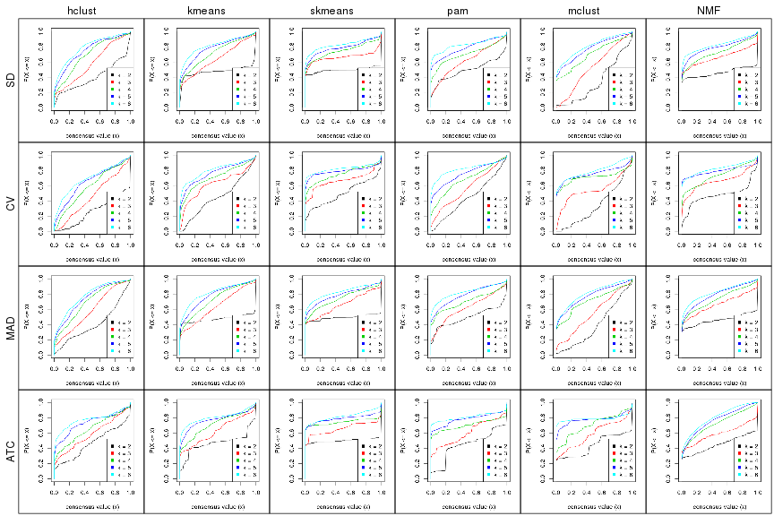


### Consensus heatmap

Consensus heatmaps for all methods. ([What is a consensus heatmap?](http://bioconductor.org/packages/devel/bioc/vignettes/cola/inst/doc/cola.html#toc_9))


<style type='text/css'>


.ui-helper-hidden {
	display: none;
}
.ui-helper-hidden-accessible {
	border: 0;
	clip: rect(0 0 0 0);
	height: 1px;
	margin: -1px;
	overflow: hidden;
	padding: 0;
	position: absolute;
	width: 1px;
}
.ui-helper-reset {
	margin: 0;
	padding: 0;
	border: 0;
	outline: 0;
	line-height: 1.3;
	text-decoration: none;
	font-size: 100%;
	list-style: none;
}
.ui-helper-clearfix:before,
.ui-helper-clearfix:after {
	content: "";
	display: table;
	border-collapse: collapse;
}
.ui-helper-clearfix:after {
	clear: both;
}
.ui-helper-zfix {
	width: 100%;
	height: 100%;
	top: 0;
	left: 0;
	position: absolute;
	opacity: 0;
	filter:Alpha(Opacity=0); 
}

.ui-front {
	z-index: 100;
}


.ui-state-disabled {
	cursor: default !important;
	pointer-events: none;
}


.ui-icon {
	display: inline-block;
	vertical-align: middle;
	margin-top: -.25em;
	position: relative;
	text-indent: -99999px;
	overflow: hidden;
	background-repeat: no-repeat;
}

.ui-widget-icon-block {
	left: 50%;
	margin-left: -8px;
	display: block;
}


.ui-widget-overlay {
	position: fixed;
	top: 0;
	left: 0;
	width: 100%;
	height: 100%;
}
.ui-accordion .ui-accordion-header {
	display: block;
	cursor: pointer;
	position: relative;
	margin: 2px 0 0 0;
	padding: .5em .5em .5em .7em;
	font-size: 100%;
}
.ui-accordion .ui-accordion-content {
	padding: 1em 2.2em;
	border-top: 0;
	overflow: auto;
}
.ui-autocomplete {
	position: absolute;
	top: 0;
	left: 0;
	cursor: default;
}
.ui-menu {
	list-style: none;
	padding: 0;
	margin: 0;
	display: block;
	outline: 0;
}
.ui-menu .ui-menu {
	position: absolute;
}
.ui-menu .ui-menu-item {
	margin: 0;
	cursor: pointer;
	
	list-style-image: url("data:image/gif;base64,R0lGODlhAQABAIAAAAAAAP///yH5BAEAAAAALAAAAAABAAEAAAIBRAA7");
}
.ui-menu .ui-menu-item-wrapper {
	position: relative;
	padding: 3px 1em 3px .4em;
}
.ui-menu .ui-menu-divider {
	margin: 5px 0;
	height: 0;
	font-size: 0;
	line-height: 0;
	border-width: 1px 0 0 0;
}
.ui-menu .ui-state-focus,
.ui-menu .ui-state-active {
	margin: -1px;
}


.ui-menu-icons {
	position: relative;
}
.ui-menu-icons .ui-menu-item-wrapper {
	padding-left: 2em;
}


.ui-menu .ui-icon {
	position: absolute;
	top: 0;
	bottom: 0;
	left: .2em;
	margin: auto 0;
}


.ui-menu .ui-menu-icon {
	left: auto;
	right: 0;
}
.ui-button {
	padding: .4em 1em;
	display: inline-block;
	position: relative;
	line-height: normal;
	margin-right: .1em;
	cursor: pointer;
	vertical-align: middle;
	text-align: center;
	-webkit-user-select: none;
	-moz-user-select: none;
	-ms-user-select: none;
	user-select: none;

	
	overflow: visible;
}

.ui-button,
.ui-button:link,
.ui-button:visited,
.ui-button:hover,
.ui-button:active {
	text-decoration: none;
}


.ui-button-icon-only {
	width: 2em;
	box-sizing: border-box;
	text-indent: -9999px;
	white-space: nowrap;
}


input.ui-button.ui-button-icon-only {
	text-indent: 0;
}


.ui-button-icon-only .ui-icon {
	position: absolute;
	top: 50%;
	left: 50%;
	margin-top: -8px;
	margin-left: -8px;
}

.ui-button.ui-icon-notext .ui-icon {
	padding: 0;
	width: 2.1em;
	height: 2.1em;
	text-indent: -9999px;
	white-space: nowrap;

}

input.ui-button.ui-icon-notext .ui-icon {
	width: auto;
	height: auto;
	text-indent: 0;
	white-space: normal;
	padding: .4em 1em;
}


input.ui-button::-moz-focus-inner,
button.ui-button::-moz-focus-inner {
	border: 0;
	padding: 0;
}
.ui-controlgroup {
	vertical-align: middle;
	display: inline-block;
}
.ui-controlgroup > .ui-controlgroup-item {
	float: left;
	margin-left: 0;
	margin-right: 0;
}
.ui-controlgroup > .ui-controlgroup-item:focus,
.ui-controlgroup > .ui-controlgroup-item.ui-visual-focus {
	z-index: 9999;
}
.ui-controlgroup-vertical > .ui-controlgroup-item {
	display: block;
	float: none;
	width: 100%;
	margin-top: 0;
	margin-bottom: 0;
	text-align: left;
}
.ui-controlgroup-vertical .ui-controlgroup-item {
	box-sizing: border-box;
}
.ui-controlgroup .ui-controlgroup-label {
	padding: .4em 1em;
}
.ui-controlgroup .ui-controlgroup-label span {
	font-size: 80%;
}
.ui-controlgroup-horizontal .ui-controlgroup-label + .ui-controlgroup-item {
	border-left: none;
}
.ui-controlgroup-vertical .ui-controlgroup-label + .ui-controlgroup-item {
	border-top: none;
}
.ui-controlgroup-horizontal .ui-controlgroup-label.ui-widget-content {
	border-right: none;
}
.ui-controlgroup-vertical .ui-controlgroup-label.ui-widget-content {
	border-bottom: none;
}


.ui-controlgroup-vertical .ui-spinner-input {

	
	width: 75%;
	width: calc( 100% - 2.4em );
}
.ui-controlgroup-vertical .ui-spinner .ui-spinner-up {
	border-top-style: solid;
}

.ui-checkboxradio-label .ui-icon-background {
	box-shadow: inset 1px 1px 1px #ccc;
	border-radius: .12em;
	border: none;
}
.ui-checkboxradio-radio-label .ui-icon-background {
	width: 16px;
	height: 16px;
	border-radius: 1em;
	overflow: visible;
	border: none;
}
.ui-checkboxradio-radio-label.ui-checkboxradio-checked .ui-icon,
.ui-checkboxradio-radio-label.ui-checkboxradio-checked:hover .ui-icon {
	background-image: none;
	width: 8px;
	height: 8px;
	border-width: 4px;
	border-style: solid;
}
.ui-checkboxradio-disabled {
	pointer-events: none;
}
.ui-datepicker {
	width: 17em;
	padding: .2em .2em 0;
	display: none;
}
.ui-datepicker .ui-datepicker-header {
	position: relative;
	padding: .2em 0;
}
.ui-datepicker .ui-datepicker-prev,
.ui-datepicker .ui-datepicker-next {
	position: absolute;
	top: 2px;
	width: 1.8em;
	height: 1.8em;
}
.ui-datepicker .ui-datepicker-prev-hover,
.ui-datepicker .ui-datepicker-next-hover {
	top: 1px;
}
.ui-datepicker .ui-datepicker-prev {
	left: 2px;
}
.ui-datepicker .ui-datepicker-next {
	right: 2px;
}
.ui-datepicker .ui-datepicker-prev-hover {
	left: 1px;
}
.ui-datepicker .ui-datepicker-next-hover {
	right: 1px;
}
.ui-datepicker .ui-datepicker-prev span,
.ui-datepicker .ui-datepicker-next span {
	display: block;
	position: absolute;
	left: 50%;
	margin-left: -8px;
	top: 50%;
	margin-top: -8px;
}
.ui-datepicker .ui-datepicker-title {
	margin: 0 2.3em;
	line-height: 1.8em;
	text-align: center;
}
.ui-datepicker .ui-datepicker-title select {
	font-size: 1em;
	margin: 1px 0;
}
.ui-datepicker select.ui-datepicker-month,
.ui-datepicker select.ui-datepicker-year {
	width: 45%;
}
.ui-datepicker table {
	width: 100%;
	font-size: .9em;
	border-collapse: collapse;
	margin: 0 0 .4em;
}
.ui-datepicker th {
	padding: .7em .3em;
	text-align: center;
	font-weight: bold;
	border: 0;
}
.ui-datepicker td {
	border: 0;
	padding: 1px;
}
.ui-datepicker td span,
.ui-datepicker td a {
	display: block;
	padding: .2em;
	text-align: right;
	text-decoration: none;
}
.ui-datepicker .ui-datepicker-buttonpane {
	background-image: none;
	margin: .7em 0 0 0;
	padding: 0 .2em;
	border-left: 0;
	border-right: 0;
	border-bottom: 0;
}
.ui-datepicker .ui-datepicker-buttonpane button {
	float: right;
	margin: .5em .2em .4em;
	cursor: pointer;
	padding: .2em .6em .3em .6em;
	width: auto;
	overflow: visible;
}
.ui-datepicker .ui-datepicker-buttonpane button.ui-datepicker-current {
	float: left;
}


.ui-datepicker.ui-datepicker-multi {
	width: auto;
}
.ui-datepicker-multi .ui-datepicker-group {
	float: left;
}
.ui-datepicker-multi .ui-datepicker-group table {
	width: 95%;
	margin: 0 auto .4em;
}
.ui-datepicker-multi-2 .ui-datepicker-group {
	width: 50%;
}
.ui-datepicker-multi-3 .ui-datepicker-group {
	width: 33.3%;
}
.ui-datepicker-multi-4 .ui-datepicker-group {
	width: 25%;
}
.ui-datepicker-multi .ui-datepicker-group-last .ui-datepicker-header,
.ui-datepicker-multi .ui-datepicker-group-middle .ui-datepicker-header {
	border-left-width: 0;
}
.ui-datepicker-multi .ui-datepicker-buttonpane {
	clear: left;
}
.ui-datepicker-row-break {
	clear: both;
	width: 100%;
	font-size: 0;
}


.ui-datepicker-rtl {
	direction: rtl;
}
.ui-datepicker-rtl .ui-datepicker-prev {
	right: 2px;
	left: auto;
}
.ui-datepicker-rtl .ui-datepicker-next {
	left: 2px;
	right: auto;
}
.ui-datepicker-rtl .ui-datepicker-prev:hover {
	right: 1px;
	left: auto;
}
.ui-datepicker-rtl .ui-datepicker-next:hover {
	left: 1px;
	right: auto;
}
.ui-datepicker-rtl .ui-datepicker-buttonpane {
	clear: right;
}
.ui-datepicker-rtl .ui-datepicker-buttonpane button {
	float: left;
}
.ui-datepicker-rtl .ui-datepicker-buttonpane button.ui-datepicker-current,
.ui-datepicker-rtl .ui-datepicker-group {
	float: right;
}
.ui-datepicker-rtl .ui-datepicker-group-last .ui-datepicker-header,
.ui-datepicker-rtl .ui-datepicker-group-middle .ui-datepicker-header {
	border-right-width: 0;
	border-left-width: 1px;
}


.ui-datepicker .ui-icon {
	display: block;
	text-indent: -99999px;
	overflow: hidden;
	background-repeat: no-repeat;
	left: .5em;
	top: .3em;
}
.ui-dialog {
	position: absolute;
	top: 0;
	left: 0;
	padding: .2em;
	outline: 0;
}
.ui-dialog .ui-dialog-titlebar {
	padding: .4em 1em;
	position: relative;
}
.ui-dialog .ui-dialog-title {
	float: left;
	margin: .1em 0;
	white-space: nowrap;
	width: 90%;
	overflow: hidden;
	text-overflow: ellipsis;
}
.ui-dialog .ui-dialog-titlebar-close {
	position: absolute;
	right: .3em;
	top: 50%;
	width: 20px;
	margin: -10px 0 0 0;
	padding: 1px;
	height: 20px;
}
.ui-dialog .ui-dialog-content {
	position: relative;
	border: 0;
	padding: .5em 1em;
	background: none;
	overflow: auto;
}
.ui-dialog .ui-dialog-buttonpane {
	text-align: left;
	border-width: 1px 0 0 0;
	background-image: none;
	margin-top: .5em;
	padding: .3em 1em .5em .4em;
}
.ui-dialog .ui-dialog-buttonpane .ui-dialog-buttonset {
	float: right;
}
.ui-dialog .ui-dialog-buttonpane button {
	margin: .5em .4em .5em 0;
	cursor: pointer;
}
.ui-dialog .ui-resizable-n {
	height: 2px;
	top: 0;
}
.ui-dialog .ui-resizable-e {
	width: 2px;
	right: 0;
}
.ui-dialog .ui-resizable-s {
	height: 2px;
	bottom: 0;
}
.ui-dialog .ui-resizable-w {
	width: 2px;
	left: 0;
}
.ui-dialog .ui-resizable-se,
.ui-dialog .ui-resizable-sw,
.ui-dialog .ui-resizable-ne,
.ui-dialog .ui-resizable-nw {
	width: 7px;
	height: 7px;
}
.ui-dialog .ui-resizable-se {
	right: 0;
	bottom: 0;
}
.ui-dialog .ui-resizable-sw {
	left: 0;
	bottom: 0;
}
.ui-dialog .ui-resizable-ne {
	right: 0;
	top: 0;
}
.ui-dialog .ui-resizable-nw {
	left: 0;
	top: 0;
}
.ui-draggable .ui-dialog-titlebar {
	cursor: move;
}
.ui-draggable-handle {
	-ms-touch-action: none;
	touch-action: none;
}
.ui-resizable {
	position: relative;
}
.ui-resizable-handle {
	position: absolute;
	font-size: 0.1px;
	display: block;
	-ms-touch-action: none;
	touch-action: none;
}
.ui-resizable-disabled .ui-resizable-handle,
.ui-resizable-autohide .ui-resizable-handle {
	display: none;
}
.ui-resizable-n {
	cursor: n-resize;
	height: 7px;
	width: 100%;
	top: -5px;
	left: 0;
}
.ui-resizable-s {
	cursor: s-resize;
	height: 7px;
	width: 100%;
	bottom: -5px;
	left: 0;
}
.ui-resizable-e {
	cursor: e-resize;
	width: 7px;
	right: -5px;
	top: 0;
	height: 100%;
}
.ui-resizable-w {
	cursor: w-resize;
	width: 7px;
	left: -5px;
	top: 0;
	height: 100%;
}
.ui-resizable-se {
	cursor: se-resize;
	width: 12px;
	height: 12px;
	right: 1px;
	bottom: 1px;
}
.ui-resizable-sw {
	cursor: sw-resize;
	width: 9px;
	height: 9px;
	left: -5px;
	bottom: -5px;
}
.ui-resizable-nw {
	cursor: nw-resize;
	width: 9px;
	height: 9px;
	left: -5px;
	top: -5px;
}
.ui-resizable-ne {
	cursor: ne-resize;
	width: 9px;
	height: 9px;
	right: -5px;
	top: -5px;
}
.ui-progressbar {
	height: 2em;
	text-align: left;
	overflow: hidden;
}
.ui-progressbar .ui-progressbar-value {
	margin: -1px;
	height: 100%;
}
.ui-progressbar .ui-progressbar-overlay {
	background: url("data:image/gif;base64,R0lGODlhKAAoAIABAAAAAP///yH/C05FVFNDQVBFMi4wAwEAAAAh+QQJAQABACwAAAAAKAAoAAACkYwNqXrdC52DS06a7MFZI+4FHBCKoDeWKXqymPqGqxvJrXZbMx7Ttc+w9XgU2FB3lOyQRWET2IFGiU9m1frDVpxZZc6bfHwv4c1YXP6k1Vdy292Fb6UkuvFtXpvWSzA+HycXJHUXiGYIiMg2R6W459gnWGfHNdjIqDWVqemH2ekpObkpOlppWUqZiqr6edqqWQAAIfkECQEAAQAsAAAAACgAKAAAApSMgZnGfaqcg1E2uuzDmmHUBR8Qil95hiPKqWn3aqtLsS18y7G1SzNeowWBENtQd+T1JktP05nzPTdJZlR6vUxNWWjV+vUWhWNkWFwxl9VpZRedYcflIOLafaa28XdsH/ynlcc1uPVDZxQIR0K25+cICCmoqCe5mGhZOfeYSUh5yJcJyrkZWWpaR8doJ2o4NYq62lAAACH5BAkBAAEALAAAAAAoACgAAAKVDI4Yy22ZnINRNqosw0Bv7i1gyHUkFj7oSaWlu3ovC8GxNso5fluz3qLVhBVeT/Lz7ZTHyxL5dDalQWPVOsQWtRnuwXaFTj9jVVh8pma9JjZ4zYSj5ZOyma7uuolffh+IR5aW97cHuBUXKGKXlKjn+DiHWMcYJah4N0lYCMlJOXipGRr5qdgoSTrqWSq6WFl2ypoaUAAAIfkECQEAAQAsAAAAACgAKAAAApaEb6HLgd/iO7FNWtcFWe+ufODGjRfoiJ2akShbueb0wtI50zm02pbvwfWEMWBQ1zKGlLIhskiEPm9R6vRXxV4ZzWT2yHOGpWMyorblKlNp8HmHEb/lCXjcW7bmtXP8Xt229OVWR1fod2eWqNfHuMjXCPkIGNileOiImVmCOEmoSfn3yXlJWmoHGhqp6ilYuWYpmTqKUgAAIfkECQEAAQAsAAAAACgAKAAAApiEH6kb58biQ3FNWtMFWW3eNVcojuFGfqnZqSebuS06w5V80/X02pKe8zFwP6EFWOT1lDFk8rGERh1TTNOocQ61Hm4Xm2VexUHpzjymViHrFbiELsefVrn6XKfnt2Q9G/+Xdie499XHd2g4h7ioOGhXGJboGAnXSBnoBwKYyfioubZJ2Hn0RuRZaflZOil56Zp6iioKSXpUAAAh+QQJAQABACwAAAAAKAAoAAACkoQRqRvnxuI7kU1a1UU5bd5tnSeOZXhmn5lWK3qNTWvRdQxP8qvaC+/yaYQzXO7BMvaUEmJRd3TsiMAgswmNYrSgZdYrTX6tSHGZO73ezuAw2uxuQ+BbeZfMxsexY35+/Qe4J1inV0g4x3WHuMhIl2jXOKT2Q+VU5fgoSUI52VfZyfkJGkha6jmY+aaYdirq+lQAACH5BAkBAAEALAAAAAAoACgAAAKWBIKpYe0L3YNKToqswUlvznigd4wiR4KhZrKt9Upqip61i9E3vMvxRdHlbEFiEXfk9YARYxOZZD6VQ2pUunBmtRXo1Lf8hMVVcNl8JafV38aM2/Fu5V16Bn63r6xt97j09+MXSFi4BniGFae3hzbH9+hYBzkpuUh5aZmHuanZOZgIuvbGiNeomCnaxxap2upaCZsq+1kAACH5BAkBAAEALAAAAAAoACgAAAKXjI8By5zf4kOxTVrXNVlv1X0d8IGZGKLnNpYtm8Lr9cqVeuOSvfOW79D9aDHizNhDJidFZhNydEahOaDH6nomtJjp1tutKoNWkvA6JqfRVLHU/QUfau9l2x7G54d1fl995xcIGAdXqMfBNadoYrhH+Mg2KBlpVpbluCiXmMnZ2Sh4GBqJ+ckIOqqJ6LmKSllZmsoq6wpQAAAh+QQJAQABACwAAAAAKAAoAAAClYx/oLvoxuJDkU1a1YUZbJ59nSd2ZXhWqbRa2/gF8Gu2DY3iqs7yrq+xBYEkYvFSM8aSSObE+ZgRl1BHFZNr7pRCavZ5BW2142hY3AN/zWtsmf12p9XxxFl2lpLn1rseztfXZjdIWIf2s5dItwjYKBgo9yg5pHgzJXTEeGlZuenpyPmpGQoKOWkYmSpaSnqKileI2FAAACH5BAkBAAEALAAAAAAoACgAAAKVjB+gu+jG4kORTVrVhRlsnn2dJ3ZleFaptFrb+CXmO9OozeL5VfP99HvAWhpiUdcwkpBH3825AwYdU8xTqlLGhtCosArKMpvfa1mMRae9VvWZfeB2XfPkeLmm18lUcBj+p5dnN8jXZ3YIGEhYuOUn45aoCDkp16hl5IjYJvjWKcnoGQpqyPlpOhr3aElaqrq56Bq7VAAAOw==");
	height: 100%;
	filter: alpha(opacity=25); 
	opacity: 0.25;
}
.ui-progressbar-indeterminate .ui-progressbar-value {
	background-image: none;
}
.ui-selectable {
	-ms-touch-action: none;
	touch-action: none;
}
.ui-selectable-helper {
	position: absolute;
	z-index: 100;
	border: 1px dotted black;
}
.ui-selectmenu-menu {
	padding: 0;
	margin: 0;
	position: absolute;
	top: 0;
	left: 0;
	display: none;
}
.ui-selectmenu-menu .ui-menu {
	overflow: auto;
	overflow-x: hidden;
	padding-bottom: 1px;
}
.ui-selectmenu-menu .ui-menu .ui-selectmenu-optgroup {
	font-size: 1em;
	font-weight: bold;
	line-height: 1.5;
	padding: 2px 0.4em;
	margin: 0.5em 0 0 0;
	height: auto;
	border: 0;
}
.ui-selectmenu-open {
	display: block;
}
.ui-selectmenu-text {
	display: block;
	margin-right: 20px;
	overflow: hidden;
	text-overflow: ellipsis;
}
.ui-selectmenu-button.ui-button {
	text-align: left;
	white-space: nowrap;
	width: 14em;
}
.ui-selectmenu-icon.ui-icon {
	float: right;
	margin-top: 0;
}
.ui-slider {
	position: relative;
	text-align: left;
}
.ui-slider .ui-slider-handle {
	position: absolute;
	z-index: 2;
	width: 1.2em;
	height: 1.2em;
	cursor: default;
	-ms-touch-action: none;
	touch-action: none;
}
.ui-slider .ui-slider-range {
	position: absolute;
	z-index: 1;
	font-size: .7em;
	display: block;
	border: 0;
	background-position: 0 0;
}


.ui-slider.ui-state-disabled .ui-slider-handle,
.ui-slider.ui-state-disabled .ui-slider-range {
	filter: inherit;
}

.ui-slider-horizontal {
	height: .8em;
}
.ui-slider-horizontal .ui-slider-handle {
	top: -.3em;
	margin-left: -.6em;
}
.ui-slider-horizontal .ui-slider-range {
	top: 0;
	height: 100%;
}
.ui-slider-horizontal .ui-slider-range-min {
	left: 0;
}
.ui-slider-horizontal .ui-slider-range-max {
	right: 0;
}

.ui-slider-vertical {
	width: .8em;
	height: 100px;
}
.ui-slider-vertical .ui-slider-handle {
	left: -.3em;
	margin-left: 0;
	margin-bottom: -.6em;
}
.ui-slider-vertical .ui-slider-range {
	left: 0;
	width: 100%;
}
.ui-slider-vertical .ui-slider-range-min {
	bottom: 0;
}
.ui-slider-vertical .ui-slider-range-max {
	top: 0;
}
.ui-sortable-handle {
	-ms-touch-action: none;
	touch-action: none;
}
.ui-spinner {
	position: relative;
	display: inline-block;
	overflow: hidden;
	padding: 0;
	vertical-align: middle;
}
.ui-spinner-input {
	border: none;
	background: none;
	color: inherit;
	padding: .222em 0;
	margin: .2em 0;
	vertical-align: middle;
	margin-left: .4em;
	margin-right: 2em;
}
.ui-spinner-button {
	width: 1.6em;
	height: 50%;
	font-size: .5em;
	padding: 0;
	margin: 0;
	text-align: center;
	position: absolute;
	cursor: default;
	display: block;
	overflow: hidden;
	right: 0;
}

.ui-spinner a.ui-spinner-button {
	border-top-style: none;
	border-bottom-style: none;
	border-right-style: none;
}
.ui-spinner-up {
	top: 0;
}
.ui-spinner-down {
	bottom: 0;
}
.ui-tabs {
	position: relative;
	padding: .2em;
}
.ui-tabs .ui-tabs-nav {
	margin: 0;
	padding: .2em .2em 0;
}
.ui-tabs .ui-tabs-nav li {
	list-style: none;
	float: left;
	position: relative;
	top: 0;
	margin: 1px .2em 0 0;
	border-bottom-width: 0;
	padding: 0;
	white-space: nowrap;
}
.ui-tabs .ui-tabs-nav .ui-tabs-anchor {
	float: left;
	padding: .5em 1em;
	text-decoration: none;
}
.ui-tabs .ui-tabs-nav li.ui-tabs-active {
	margin-bottom: -1px;
	padding-bottom: 1px;
}
.ui-tabs .ui-tabs-nav li.ui-tabs-active .ui-tabs-anchor,
.ui-tabs .ui-tabs-nav li.ui-state-disabled .ui-tabs-anchor,
.ui-tabs .ui-tabs-nav li.ui-tabs-loading .ui-tabs-anchor {
	cursor: text;
}
.ui-tabs-collapsible .ui-tabs-nav li.ui-tabs-active .ui-tabs-anchor {
	cursor: pointer;
}
.ui-tabs .ui-tabs-panel {
	display: block;
	border-width: 0;
	padding: 1em 1.4em;
	background: none;
}
.ui-tooltip {
	padding: 8px;
	position: absolute;
	z-index: 9999;
	max-width: 300px;
}
body .ui-tooltip {
	border-width: 2px;
}

.ui-widget {
	font-family: Arial,Helvetica,sans-serif;
	font-size: 1em;
}
.ui-widget .ui-widget {
	font-size: 1em;
}
.ui-widget input,
.ui-widget select,
.ui-widget textarea,
.ui-widget button {
	font-family: Arial,Helvetica,sans-serif;
	font-size: 1em;
}
.ui-widget.ui-widget-content {
	border: 1px solid #c5c5c5;
}
.ui-widget-content {
	border: 1px solid #dddddd;
	background: #ffffff;
	color: #333333;
}
.ui-widget-content a {
	color: #333333;
}
.ui-widget-header {
	border: 1px solid #dddddd;
	background: #e9e9e9;
	color: #333333;
	font-weight: bold;
}
.ui-widget-header a {
	color: #333333;
}


.ui-state-default,
.ui-widget-content .ui-state-default,
.ui-widget-header .ui-state-default,
.ui-button,


html .ui-button.ui-state-disabled:hover,
html .ui-button.ui-state-disabled:active {
	border: 1px solid #c5c5c5;
	background: #f6f6f6;
	font-weight: normal;
	color: #454545;
}
.ui-state-default a,
.ui-state-default a:link,
.ui-state-default a:visited,
a.ui-button,
a:link.ui-button,
a:visited.ui-button,
.ui-button {
	color: #454545;
	text-decoration: none;
}
.ui-state-hover,
.ui-widget-content .ui-state-hover,
.ui-widget-header .ui-state-hover,
.ui-state-focus,
.ui-widget-content .ui-state-focus,
.ui-widget-header .ui-state-focus,
.ui-button:hover,
.ui-button:focus {
	border: 1px solid #cccccc;
	background: #ededed;
	font-weight: normal;
	color: #2b2b2b;
}
.ui-state-hover a,
.ui-state-hover a:hover,
.ui-state-hover a:link,
.ui-state-hover a:visited,
.ui-state-focus a,
.ui-state-focus a:hover,
.ui-state-focus a:link,
.ui-state-focus a:visited,
a.ui-button:hover,
a.ui-button:focus {
	color: #2b2b2b;
	text-decoration: none;
}

.ui-visual-focus {
	box-shadow: 0 0 3px 1px rgb(94, 158, 214);
}
.ui-state-active,
.ui-widget-content .ui-state-active,
.ui-widget-header .ui-state-active,
a.ui-button:active,
.ui-button:active,
.ui-button.ui-state-active:hover {
	border: 1px solid #003eff;
	background: #007fff;
	font-weight: normal;
	color: #ffffff;
}
.ui-icon-background,
.ui-state-active .ui-icon-background {
	border: #003eff;
	background-color: #ffffff;
}
.ui-state-active a,
.ui-state-active a:link,
.ui-state-active a:visited {
	color: #ffffff;
	text-decoration: none;
}


.ui-state-highlight,
.ui-widget-content .ui-state-highlight,
.ui-widget-header .ui-state-highlight {
	border: 1px solid #dad55e;
	background: #fffa90;
	color: #777620;
}
.ui-state-checked {
	border: 1px solid #dad55e;
	background: #fffa90;
}
.ui-state-highlight a,
.ui-widget-content .ui-state-highlight a,
.ui-widget-header .ui-state-highlight a {
	color: #777620;
}
.ui-state-error,
.ui-widget-content .ui-state-error,
.ui-widget-header .ui-state-error {
	border: 1px solid #f1a899;
	background: #fddfdf;
	color: #5f3f3f;
}
.ui-state-error a,
.ui-widget-content .ui-state-error a,
.ui-widget-header .ui-state-error a {
	color: #5f3f3f;
}
.ui-state-error-text,
.ui-widget-content .ui-state-error-text,
.ui-widget-header .ui-state-error-text {
	color: #5f3f3f;
}
.ui-priority-primary,
.ui-widget-content .ui-priority-primary,
.ui-widget-header .ui-priority-primary {
	font-weight: bold;
}
.ui-priority-secondary,
.ui-widget-content .ui-priority-secondary,
.ui-widget-header .ui-priority-secondary {
	opacity: .7;
	filter:Alpha(Opacity=70); 
	font-weight: normal;
}
.ui-state-disabled,
.ui-widget-content .ui-state-disabled,
.ui-widget-header .ui-state-disabled {
	opacity: .35;
	filter:Alpha(Opacity=35); 
	background-image: none;
}
.ui-state-disabled .ui-icon {
	filter:Alpha(Opacity=35); 
}


.ui-icon {
	width: 16px;
	height: 16px;
}
.ui-icon,
.ui-widget-content .ui-icon {
	background-image: url("images/ui-icons_444444_256x240.png");
}
.ui-widget-header .ui-icon {
	background-image: url("images/ui-icons_444444_256x240.png");
}
.ui-state-hover .ui-icon,
.ui-state-focus .ui-icon,
.ui-button:hover .ui-icon,
.ui-button:focus .ui-icon {
	background-image: url("images/ui-icons_555555_256x240.png");
}
.ui-state-active .ui-icon,
.ui-button:active .ui-icon {
	background-image: url("images/ui-icons_ffffff_256x240.png");
}
.ui-state-highlight .ui-icon,
.ui-button .ui-state-highlight.ui-icon {
	background-image: url("images/ui-icons_777620_256x240.png");
}
.ui-state-error .ui-icon,
.ui-state-error-text .ui-icon {
	background-image: url("images/ui-icons_cc0000_256x240.png");
}
.ui-button .ui-icon {
	background-image: url("images/ui-icons_777777_256x240.png");
}


.ui-icon-blank { background-position: 16px 16px; }
.ui-icon-caret-1-n { background-position: 0 0; }
.ui-icon-caret-1-ne { background-position: -16px 0; }
.ui-icon-caret-1-e { background-position: -32px 0; }
.ui-icon-caret-1-se { background-position: -48px 0; }
.ui-icon-caret-1-s { background-position: -65px 0; }
.ui-icon-caret-1-sw { background-position: -80px 0; }
.ui-icon-caret-1-w { background-position: -96px 0; }
.ui-icon-caret-1-nw { background-position: -112px 0; }
.ui-icon-caret-2-n-s { background-position: -128px 0; }
.ui-icon-caret-2-e-w { background-position: -144px 0; }
.ui-icon-triangle-1-n { background-position: 0 -16px; }
.ui-icon-triangle-1-ne { background-position: -16px -16px; }
.ui-icon-triangle-1-e { background-position: -32px -16px; }
.ui-icon-triangle-1-se { background-position: -48px -16px; }
.ui-icon-triangle-1-s { background-position: -65px -16px; }
.ui-icon-triangle-1-sw { background-position: -80px -16px; }
.ui-icon-triangle-1-w { background-position: -96px -16px; }
.ui-icon-triangle-1-nw { background-position: -112px -16px; }
.ui-icon-triangle-2-n-s { background-position: -128px -16px; }
.ui-icon-triangle-2-e-w { background-position: -144px -16px; }
.ui-icon-arrow-1-n { background-position: 0 -32px; }
.ui-icon-arrow-1-ne { background-position: -16px -32px; }
.ui-icon-arrow-1-e { background-position: -32px -32px; }
.ui-icon-arrow-1-se { background-position: -48px -32px; }
.ui-icon-arrow-1-s { background-position: -65px -32px; }
.ui-icon-arrow-1-sw { background-position: -80px -32px; }
.ui-icon-arrow-1-w { background-position: -96px -32px; }
.ui-icon-arrow-1-nw { background-position: -112px -32px; }
.ui-icon-arrow-2-n-s { background-position: -128px -32px; }
.ui-icon-arrow-2-ne-sw { background-position: -144px -32px; }
.ui-icon-arrow-2-e-w { background-position: -160px -32px; }
.ui-icon-arrow-2-se-nw { background-position: -176px -32px; }
.ui-icon-arrowstop-1-n { background-position: -192px -32px; }
.ui-icon-arrowstop-1-e { background-position: -208px -32px; }
.ui-icon-arrowstop-1-s { background-position: -224px -32px; }
.ui-icon-arrowstop-1-w { background-position: -240px -32px; }
.ui-icon-arrowthick-1-n { background-position: 1px -48px; }
.ui-icon-arrowthick-1-ne { background-position: -16px -48px; }
.ui-icon-arrowthick-1-e { background-position: -32px -48px; }
.ui-icon-arrowthick-1-se { background-position: -48px -48px; }
.ui-icon-arrowthick-1-s { background-position: -64px -48px; }
.ui-icon-arrowthick-1-sw { background-position: -80px -48px; }
.ui-icon-arrowthick-1-w { background-position: -96px -48px; }
.ui-icon-arrowthick-1-nw { background-position: -112px -48px; }
.ui-icon-arrowthick-2-n-s { background-position: -128px -48px; }
.ui-icon-arrowthick-2-ne-sw { background-position: -144px -48px; }
.ui-icon-arrowthick-2-e-w { background-position: -160px -48px; }
.ui-icon-arrowthick-2-se-nw { background-position: -176px -48px; }
.ui-icon-arrowthickstop-1-n { background-position: -192px -48px; }
.ui-icon-arrowthickstop-1-e { background-position: -208px -48px; }
.ui-icon-arrowthickstop-1-s { background-position: -224px -48px; }
.ui-icon-arrowthickstop-1-w { background-position: -240px -48px; }
.ui-icon-arrowreturnthick-1-w { background-position: 0 -64px; }
.ui-icon-arrowreturnthick-1-n { background-position: -16px -64px; }
.ui-icon-arrowreturnthick-1-e { background-position: -32px -64px; }
.ui-icon-arrowreturnthick-1-s { background-position: -48px -64px; }
.ui-icon-arrowreturn-1-w { background-position: -64px -64px; }
.ui-icon-arrowreturn-1-n { background-position: -80px -64px; }
.ui-icon-arrowreturn-1-e { background-position: -96px -64px; }
.ui-icon-arrowreturn-1-s { background-position: -112px -64px; }
.ui-icon-arrowrefresh-1-w { background-position: -128px -64px; }
.ui-icon-arrowrefresh-1-n { background-position: -144px -64px; }
.ui-icon-arrowrefresh-1-e { background-position: -160px -64px; }
.ui-icon-arrowrefresh-1-s { background-position: -176px -64px; }
.ui-icon-arrow-4 { background-position: 0 -80px; }
.ui-icon-arrow-4-diag { background-position: -16px -80px; }
.ui-icon-extlink { background-position: -32px -80px; }
.ui-icon-newwin { background-position: -48px -80px; }
.ui-icon-refresh { background-position: -64px -80px; }
.ui-icon-shuffle { background-position: -80px -80px; }
.ui-icon-transfer-e-w { background-position: -96px -80px; }
.ui-icon-transferthick-e-w { background-position: -112px -80px; }
.ui-icon-folder-collapsed { background-position: 0 -96px; }
.ui-icon-folder-open { background-position: -16px -96px; }
.ui-icon-document { background-position: -32px -96px; }
.ui-icon-document-b { background-position: -48px -96px; }
.ui-icon-note { background-position: -64px -96px; }
.ui-icon-mail-closed { background-position: -80px -96px; }
.ui-icon-mail-open { background-position: -96px -96px; }
.ui-icon-suitcase { background-position: -112px -96px; }
.ui-icon-comment { background-position: -128px -96px; }
.ui-icon-person { background-position: -144px -96px; }
.ui-icon-print { background-position: -160px -96px; }
.ui-icon-trash { background-position: -176px -96px; }
.ui-icon-locked { background-position: -192px -96px; }
.ui-icon-unlocked { background-position: -208px -96px; }
.ui-icon-bookmark { background-position: -224px -96px; }
.ui-icon-tag { background-position: -240px -96px; }
.ui-icon-home { background-position: 0 -112px; }
.ui-icon-flag { background-position: -16px -112px; }
.ui-icon-calendar { background-position: -32px -112px; }
.ui-icon-cart { background-position: -48px -112px; }
.ui-icon-pencil { background-position: -64px -112px; }
.ui-icon-clock { background-position: -80px -112px; }
.ui-icon-disk { background-position: -96px -112px; }
.ui-icon-calculator { background-position: -112px -112px; }
.ui-icon-zoomin { background-position: -128px -112px; }
.ui-icon-zoomout { background-position: -144px -112px; }
.ui-icon-search { background-position: -160px -112px; }
.ui-icon-wrench { background-position: -176px -112px; }
.ui-icon-gear { background-position: -192px -112px; }
.ui-icon-heart { background-position: -208px -112px; }
.ui-icon-star { background-position: -224px -112px; }
.ui-icon-link { background-position: -240px -112px; }
.ui-icon-cancel { background-position: 0 -128px; }
.ui-icon-plus { background-position: -16px -128px; }
.ui-icon-plusthick { background-position: -32px -128px; }
.ui-icon-minus { background-position: -48px -128px; }
.ui-icon-minusthick { background-position: -64px -128px; }
.ui-icon-close { background-position: -80px -128px; }
.ui-icon-closethick { background-position: -96px -128px; }
.ui-icon-key { background-position: -112px -128px; }
.ui-icon-lightbulb { background-position: -128px -128px; }
.ui-icon-scissors { background-position: -144px -128px; }
.ui-icon-clipboard { background-position: -160px -128px; }
.ui-icon-copy { background-position: -176px -128px; }
.ui-icon-contact { background-position: -192px -128px; }
.ui-icon-image { background-position: -208px -128px; }
.ui-icon-video { background-position: -224px -128px; }
.ui-icon-script { background-position: -240px -128px; }
.ui-icon-alert { background-position: 0 -144px; }
.ui-icon-info { background-position: -16px -144px; }
.ui-icon-notice { background-position: -32px -144px; }
.ui-icon-help { background-position: -48px -144px; }
.ui-icon-check { background-position: -64px -144px; }
.ui-icon-bullet { background-position: -80px -144px; }
.ui-icon-radio-on { background-position: -96px -144px; }
.ui-icon-radio-off { background-position: -112px -144px; }
.ui-icon-pin-w { background-position: -128px -144px; }
.ui-icon-pin-s { background-position: -144px -144px; }
.ui-icon-play { background-position: 0 -160px; }
.ui-icon-pause { background-position: -16px -160px; }
.ui-icon-seek-next { background-position: -32px -160px; }
.ui-icon-seek-prev { background-position: -48px -160px; }
.ui-icon-seek-end { background-position: -64px -160px; }
.ui-icon-seek-start { background-position: -80px -160px; }

.ui-icon-seek-first { background-position: -80px -160px; }
.ui-icon-stop { background-position: -96px -160px; }
.ui-icon-eject { background-position: -112px -160px; }
.ui-icon-volume-off { background-position: -128px -160px; }
.ui-icon-volume-on { background-position: -144px -160px; }
.ui-icon-power { background-position: 0 -176px; }
.ui-icon-signal-diag { background-position: -16px -176px; }
.ui-icon-signal { background-position: -32px -176px; }
.ui-icon-battery-0 { background-position: -48px -176px; }
.ui-icon-battery-1 { background-position: -64px -176px; }
.ui-icon-battery-2 { background-position: -80px -176px; }
.ui-icon-battery-3 { background-position: -96px -176px; }
.ui-icon-circle-plus { background-position: 0 -192px; }
.ui-icon-circle-minus { background-position: -16px -192px; }
.ui-icon-circle-close { background-position: -32px -192px; }
.ui-icon-circle-triangle-e { background-position: -48px -192px; }
.ui-icon-circle-triangle-s { background-position: -64px -192px; }
.ui-icon-circle-triangle-w { background-position: -80px -192px; }
.ui-icon-circle-triangle-n { background-position: -96px -192px; }
.ui-icon-circle-arrow-e { background-position: -112px -192px; }
.ui-icon-circle-arrow-s { background-position: -128px -192px; }
.ui-icon-circle-arrow-w { background-position: -144px -192px; }
.ui-icon-circle-arrow-n { background-position: -160px -192px; }
.ui-icon-circle-zoomin { background-position: -176px -192px; }
.ui-icon-circle-zoomout { background-position: -192px -192px; }
.ui-icon-circle-check { background-position: -208px -192px; }
.ui-icon-circlesmall-plus { background-position: 0 -208px; }
.ui-icon-circlesmall-minus { background-position: -16px -208px; }
.ui-icon-circlesmall-close { background-position: -32px -208px; }
.ui-icon-squaresmall-plus { background-position: -48px -208px; }
.ui-icon-squaresmall-minus { background-position: -64px -208px; }
.ui-icon-squaresmall-close { background-position: -80px -208px; }
.ui-icon-grip-dotted-vertical { background-position: 0 -224px; }
.ui-icon-grip-dotted-horizontal { background-position: -16px -224px; }
.ui-icon-grip-solid-vertical { background-position: -32px -224px; }
.ui-icon-grip-solid-horizontal { background-position: -48px -224px; }
.ui-icon-gripsmall-diagonal-se { background-position: -64px -224px; }
.ui-icon-grip-diagonal-se { background-position: -80px -224px; }


.ui-corner-all,
.ui-corner-top,
.ui-corner-left,
.ui-corner-tl {
	border-top-left-radius: 3px;
}
.ui-corner-all,
.ui-corner-top,
.ui-corner-right,
.ui-corner-tr {
	border-top-right-radius: 3px;
}
.ui-corner-all,
.ui-corner-bottom,
.ui-corner-left,
.ui-corner-bl {
	border-bottom-left-radius: 3px;
}
.ui-corner-all,
.ui-corner-bottom,
.ui-corner-right,
.ui-corner-br {
	border-bottom-right-radius: 3px;
}


.ui-widget-overlay {
	background: #aaaaaa;
	opacity: .3;
	filter: Alpha(Opacity=30); 
}
.ui-widget-shadow {
	-webkit-box-shadow: 0px 0px 5px #666666;
	box-shadow: 0px 0px 5px #666666;
} 
</style>
<script src='js/jquery-1.12.4.js'></script>
<script src='js/jquery-ui.js'></script>

<script>
$( function() {
	$( '#tabs-collect-consensus-heatmap' ).tabs();
} );
</script>
<div id='tabs-collect-consensus-heatmap'>
<ul>
<li><a href='#tab-collect-consensus-heatmap-1'>k = 2</a></li>
<li><a href='#tab-collect-consensus-heatmap-2'>k = 3</a></li>
<li><a href='#tab-collect-consensus-heatmap-3'>k = 4</a></li>
<li><a href='#tab-collect-consensus-heatmap-4'>k = 5</a></li>
<li><a href='#tab-collect-consensus-heatmap-5'>k = 6</a></li>
</ul>
<div id='tab-collect-consensus-heatmap-1'>
<pre><code class="r">collect_plots(res_list, k = 2, fun = consensus_heatmap, mc.cores = 4)
</code></pre>

<p></p>

</div>
<div id='tab-collect-consensus-heatmap-2'>
<pre><code class="r">collect_plots(res_list, k = 3, fun = consensus_heatmap, mc.cores = 4)
</code></pre>

<p></p>

</div>
<div id='tab-collect-consensus-heatmap-3'>
<pre><code class="r">collect_plots(res_list, k = 4, fun = consensus_heatmap, mc.cores = 4)
</code></pre>

<p></p>

</div>
<div id='tab-collect-consensus-heatmap-4'>
<pre><code class="r">collect_plots(res_list, k = 5, fun = consensus_heatmap, mc.cores = 4)
</code></pre>

<p>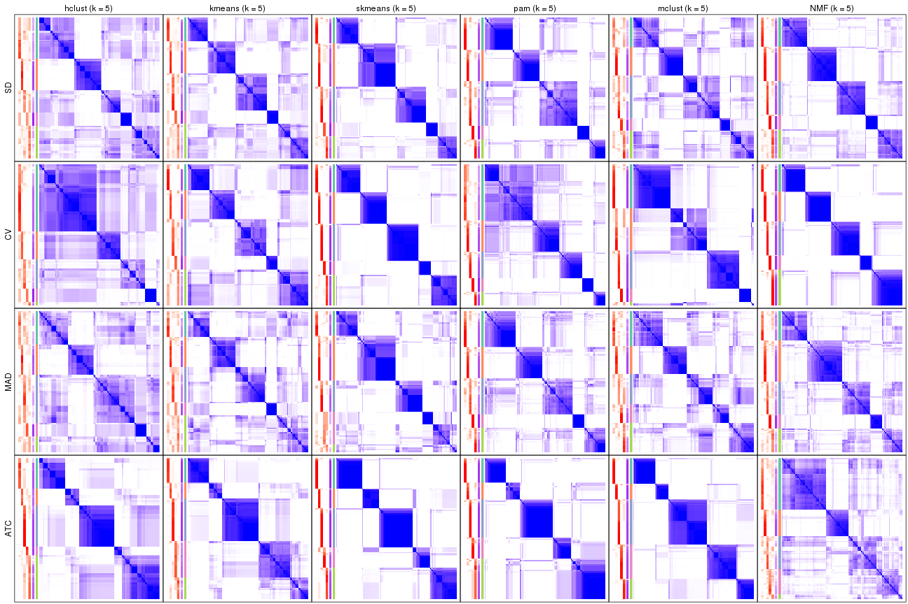</p>

</div>
<div id='tab-collect-consensus-heatmap-5'>
<pre><code class="r">collect_plots(res_list, k = 6, fun = consensus_heatmap, mc.cores = 4)
</code></pre>

<p></p>

</div>
</div>


### Membership heatmap

Membership heatmaps for all methods. ([What is a membership heatmap?](http://bioconductor.org/packages/devel/bioc/vignettes/cola/inst/doc/cola.html#toc_12))


<script>
$( function() {
	$( '#tabs-collect-membership-heatmap' ).tabs();
} );
</script>
<div id='tabs-collect-membership-heatmap'>
<ul>
<li><a href='#tab-collect-membership-heatmap-1'>k = 2</a></li>
<li><a href='#tab-collect-membership-heatmap-2'>k = 3</a></li>
<li><a href='#tab-collect-membership-heatmap-3'>k = 4</a></li>
<li><a href='#tab-collect-membership-heatmap-4'>k = 5</a></li>
<li><a href='#tab-collect-membership-heatmap-5'>k = 6</a></li>
</ul>
<div id='tab-collect-membership-heatmap-1'>
<pre><code class="r">collect_plots(res_list, k = 2, fun = membership_heatmap, mc.cores = 4)
</code></pre>

<p></p>

</div>
<div id='tab-collect-membership-heatmap-2'>
<pre><code class="r">collect_plots(res_list, k = 3, fun = membership_heatmap, mc.cores = 4)
</code></pre>

<p></p>

</div>
<div id='tab-collect-membership-heatmap-3'>
<pre><code class="r">collect_plots(res_list, k = 4, fun = membership_heatmap, mc.cores = 4)
</code></pre>

<p></p>

</div>
<div id='tab-collect-membership-heatmap-4'>
<pre><code class="r">collect_plots(res_list, k = 5, fun = membership_heatmap, mc.cores = 4)
</code></pre>

<p></p>

</div>
<div id='tab-collect-membership-heatmap-5'>
<pre><code class="r">collect_plots(res_list, k = 6, fun = membership_heatmap, mc.cores = 4)
</code></pre>

<p></p>

</div>
</div>


### Signature heatmap

Signature heatmaps for all methods. ([What is a signature heatmap?](http://bioconductor.org/packages/devel/bioc/vignettes/cola/inst/doc/cola.html#toc_22))


Note in following heatmaps, rows are scaled.


<script>
$( function() {
	$( '#tabs-collect-get-signatures' ).tabs();
} );
</script>
<div id='tabs-collect-get-signatures'>
<ul>
<li><a href='#tab-collect-get-signatures-1'>k = 2</a></li>
<li><a href='#tab-collect-get-signatures-2'>k = 3</a></li>
<li><a href='#tab-collect-get-signatures-3'>k = 4</a></li>
<li><a href='#tab-collect-get-signatures-4'>k = 5</a></li>
<li><a href='#tab-collect-get-signatures-5'>k = 6</a></li>
</ul>
<div id='tab-collect-get-signatures-1'>
<pre><code class="r">collect_plots(res_list, k = 2, fun = get_signatures, mc.cores = 4)
</code></pre>

<p></p>

</div>
<div id='tab-collect-get-signatures-2'>
<pre><code class="r">collect_plots(res_list, k = 3, fun = get_signatures, mc.cores = 4)
</code></pre>

<p></p>

</div>
<div id='tab-collect-get-signatures-3'>
<pre><code class="r">collect_plots(res_list, k = 4, fun = get_signatures, mc.cores = 4)
</code></pre>

<p></p>

</div>
<div id='tab-collect-get-signatures-4'>
<pre><code class="r">collect_plots(res_list, k = 5, fun = get_signatures, mc.cores = 4)
</code></pre>

<p></p>

</div>
<div id='tab-collect-get-signatures-5'>
<pre><code class="r">collect_plots(res_list, k = 6, fun = get_signatures, mc.cores = 4)
</code></pre>

<p></p>

</div>
</div>


### Statistics table

The statistics used for measuring the stability of consensus partitioning.
([How are they
defined?](http://bioconductor.org/packages/devel/bioc/vignettes/cola/inst/doc/cola.html#toc_13))


<script>
$( function() {
	$( '#tabs-get-stats-from-consensus-partition-list' ).tabs();
} );
</script>
<div id='tabs-get-stats-from-consensus-partition-list'>
<ul>
<li><a href='#tab-get-stats-from-consensus-partition-list-1'>k = 2</a></li>
<li><a href='#tab-get-stats-from-consensus-partition-list-2'>k = 3</a></li>
<li><a href='#tab-get-stats-from-consensus-partition-list-3'>k = 4</a></li>
<li><a href='#tab-get-stats-from-consensus-partition-list-4'>k = 5</a></li>
<li><a href='#tab-get-stats-from-consensus-partition-list-5'>k = 6</a></li>
</ul>
<div id='tab-get-stats-from-consensus-partition-list-1'>
<pre><code class="r">get_stats(res_list, k = 2)
</code></pre>

<pre><code>#&gt;             k 1-PAC mean_silhouette concordance area_increased  Rand Jaccard
#&gt; SD:NMF      2 0.966           0.933       0.973          0.459 0.547   0.547
#&gt; CV:NMF      2 0.679           0.889       0.921          0.478 0.517   0.517
#&gt; MAD:NMF     2 0.901           0.930       0.970          0.461 0.533   0.533
#&gt; ATC:NMF     2 0.780           0.872       0.946          0.450 0.537   0.537
#&gt; SD:skmeans  2 1.000           0.975       0.989          0.493 0.506   0.506
#&gt; CV:skmeans  2 0.647           0.805       0.914          0.498 0.511   0.511
#&gt; MAD:skmeans 2 1.000           0.971       0.987          0.492 0.506   0.506
#&gt; ATC:skmeans 2 1.000           0.974       0.990          0.501 0.499   0.499
#&gt; SD:mclust   2 0.258           0.516       0.740          0.339 0.511   0.511
#&gt; CV:mclust   2 0.246           0.668       0.805          0.339 0.801   0.801
#&gt; MAD:mclust  2 0.189           0.145       0.712          0.394 0.853   0.853
#&gt; ATC:mclust  2 0.744           0.813       0.924          0.436 0.537   0.537
#&gt; SD:kmeans   2 0.983           0.953       0.972          0.476 0.521   0.521
#&gt; CV:kmeans   2 0.325           0.755       0.835          0.449 0.552   0.552
#&gt; MAD:kmeans  2 0.983           0.948       0.977          0.474 0.529   0.529
#&gt; ATC:kmeans  2 0.612           0.897       0.929          0.473 0.514   0.514
#&gt; SD:pam      2 0.759           0.871       0.938          0.494 0.498   0.498
#&gt; CV:pam      2 0.307           0.713       0.844          0.445 0.547   0.547
#&gt; MAD:pam     2 0.830           0.865       0.939          0.495 0.497   0.497
#&gt; ATC:pam     2 0.463           0.859       0.899          0.445 0.521   0.521
#&gt; SD:hclust   2 0.560           0.796       0.906          0.403 0.618   0.618
#&gt; CV:hclust   2 0.552           0.827       0.903          0.263 0.689   0.689
#&gt; MAD:hclust  2 0.308           0.772       0.877          0.407 0.643   0.643
#&gt; ATC:hclust  2 0.509           0.776       0.886          0.467 0.497   0.497
</code></pre>

</div>
<div id='tab-get-stats-from-consensus-partition-list-2'>
<pre><code class="r">get_stats(res_list, k = 3)
</code></pre>

<pre><code>#&gt;             k 1-PAC mean_silhouette concordance area_increased  Rand Jaccard
#&gt; SD:NMF      3 0.746           0.830       0.929          0.442 0.722   0.522
#&gt; CV:NMF      3 0.650           0.838       0.898          0.381 0.706   0.490
#&gt; MAD:NMF     3 0.682           0.772       0.903          0.449 0.736   0.532
#&gt; ATC:NMF     3 0.705           0.830       0.927          0.314 0.713   0.526
#&gt; SD:skmeans  3 0.961           0.917       0.959          0.345 0.752   0.545
#&gt; CV:skmeans  3 0.800           0.848       0.913          0.343 0.676   0.445
#&gt; MAD:skmeans 3 0.630           0.717       0.848          0.350 0.783   0.590
#&gt; ATC:skmeans 3 0.900           0.864       0.937          0.316 0.768   0.566
#&gt; SD:mclust   3 0.167           0.346       0.617          0.565 0.720   0.536
#&gt; CV:mclust   3 0.538           0.858       0.889          0.623 0.635   0.555
#&gt; MAD:mclust  3 0.280           0.463       0.733          0.398 0.476   0.410
#&gt; ATC:mclust  3 0.585           0.720       0.829          0.346 0.656   0.464
#&gt; SD:kmeans   3 0.468           0.625       0.776          0.347 0.704   0.485
#&gt; CV:kmeans   3 0.537           0.807       0.818          0.387 0.724   0.527
#&gt; MAD:kmeans  3 0.424           0.587       0.799          0.353 0.711   0.496
#&gt; ATC:kmeans  3 0.544           0.671       0.790          0.331 0.712   0.511
#&gt; SD:pam      3 0.439           0.678       0.805          0.250 0.821   0.661
#&gt; CV:pam      3 0.324           0.563       0.796          0.287 0.756   0.602
#&gt; MAD:pam     3 0.504           0.712       0.836          0.255 0.835   0.683
#&gt; ATC:pam     3 0.669           0.710       0.823          0.361 0.809   0.659
#&gt; SD:hclust   3 0.321           0.476       0.710          0.451 0.766   0.628
#&gt; CV:hclust   3 0.187           0.466       0.761          0.756 0.850   0.786
#&gt; MAD:hclust  3 0.292           0.469       0.684          0.457 0.682   0.515
#&gt; ATC:hclust  3 0.458           0.678       0.722          0.260 0.918   0.839
</code></pre>

</div>
<div id='tab-get-stats-from-consensus-partition-list-3'>
<pre><code class="r">get_stats(res_list, k = 4)
</code></pre>

<pre><code>#&gt;             k 1-PAC mean_silhouette concordance area_increased  Rand Jaccard
#&gt; SD:NMF      4 0.664           0.746       0.851         0.0993 0.873   0.660
#&gt; CV:NMF      4 0.663           0.651       0.812         0.1082 0.883   0.685
#&gt; MAD:NMF     4 0.637           0.601       0.812         0.1033 0.847   0.593
#&gt; ATC:NMF     4 0.555           0.615       0.800         0.2294 0.779   0.486
#&gt; SD:skmeans  4 0.755           0.629       0.828         0.1255 0.898   0.706
#&gt; CV:skmeans  4 0.768           0.754       0.863         0.1216 0.839   0.565
#&gt; MAD:skmeans 4 0.651           0.529       0.769         0.1223 0.858   0.612
#&gt; ATC:skmeans 4 0.971           0.918       0.967         0.1283 0.855   0.606
#&gt; SD:mclust   4 0.530           0.524       0.797         0.3155 0.706   0.405
#&gt; CV:mclust   4 0.827           0.909       0.946         0.2919 0.793   0.569
#&gt; MAD:mclust  4 0.550           0.696       0.832         0.2947 0.741   0.433
#&gt; ATC:mclust  4 0.569           0.666       0.793         0.2008 0.835   0.600
#&gt; SD:kmeans   4 0.538           0.586       0.746         0.1287 0.813   0.530
#&gt; CV:kmeans   4 0.568           0.712       0.813         0.1424 0.905   0.734
#&gt; MAD:kmeans  4 0.495           0.479       0.680         0.1357 0.885   0.685
#&gt; ATC:kmeans  4 0.567           0.422       0.626         0.1380 0.755   0.447
#&gt; SD:pam      4 0.662           0.793       0.879         0.1406 0.883   0.705
#&gt; CV:pam      4 0.439           0.672       0.820         0.1907 0.814   0.603
#&gt; MAD:pam     4 0.716           0.768       0.881         0.1362 0.846   0.628
#&gt; ATC:pam     4 0.850           0.850       0.943         0.1611 0.859   0.666
#&gt; SD:hclust   4 0.383           0.446       0.612         0.1904 0.835   0.622
#&gt; CV:hclust   4 0.284           0.491       0.678         0.2741 0.728   0.542
#&gt; MAD:hclust  4 0.350           0.352       0.643         0.1770 0.696   0.395
#&gt; ATC:hclust  4 0.480           0.671       0.756         0.1140 0.926   0.832
</code></pre>

</div>
<div id='tab-get-stats-from-consensus-partition-list-4'>
<pre><code class="r">get_stats(res_list, k = 5)
</code></pre>

<pre><code>#&gt;             k 1-PAC mean_silhouette concordance area_increased  Rand Jaccard
#&gt; SD:NMF      5 0.742           0.771       0.860         0.0866 0.885   0.620
#&gt; CV:NMF      5 0.878           0.850       0.939         0.0803 0.830   0.489
#&gt; MAD:NMF     5 0.646           0.574       0.748         0.0740 0.894   0.637
#&gt; ATC:NMF     5 0.524           0.496       0.712         0.0576 0.815   0.461
#&gt; SD:skmeans  5 0.782           0.790       0.868         0.0560 0.914   0.694
#&gt; CV:skmeans  5 0.917           0.876       0.939         0.0544 0.930   0.732
#&gt; MAD:skmeans 5 0.708           0.545       0.758         0.0585 0.950   0.813
#&gt; ATC:skmeans 5 0.874           0.876       0.932         0.0602 0.899   0.640
#&gt; SD:mclust   5 0.604           0.495       0.697         0.1102 0.876   0.600
#&gt; CV:mclust   5 0.792           0.674       0.861         0.0633 0.966   0.881
#&gt; MAD:mclust  5 0.586           0.486       0.717         0.0913 0.841   0.483
#&gt; ATC:mclust  5 0.852           0.894       0.892         0.1013 0.917   0.705
#&gt; SD:kmeans   5 0.601           0.620       0.706         0.0789 0.863   0.563
#&gt; CV:kmeans   5 0.652           0.660       0.742         0.0762 0.869   0.579
#&gt; MAD:kmeans  5 0.554           0.467       0.671         0.0759 0.813   0.454
#&gt; ATC:kmeans  5 0.754           0.759       0.828         0.0816 0.841   0.505
#&gt; SD:pam      5 0.709           0.683       0.861         0.1124 0.797   0.438
#&gt; CV:pam      5 0.642           0.705       0.841         0.1089 0.912   0.732
#&gt; MAD:pam     5 0.678           0.643       0.814         0.1152 0.819   0.472
#&gt; ATC:pam     5 0.818           0.813       0.900         0.1097 0.858   0.565
#&gt; SD:hclust   5 0.489           0.520       0.648         0.0837 0.834   0.518
#&gt; CV:hclust   5 0.349           0.621       0.721         0.1067 0.829   0.593
#&gt; MAD:hclust  5 0.429           0.427       0.628         0.0702 0.773   0.442
#&gt; ATC:hclust  5 0.593           0.749       0.814         0.1228 0.873   0.654
</code></pre>

</div>
<div id='tab-get-stats-from-consensus-partition-list-5'>
<pre><code class="r">get_stats(res_list, k = 6)
</code></pre>

<pre><code>#&gt;             k 1-PAC mean_silhouette concordance area_increased  Rand Jaccard
#&gt; SD:NMF      6 0.786           0.689       0.819         0.0435 0.951   0.774
#&gt; CV:NMF      6 0.801           0.756       0.870         0.0427 0.908   0.618
#&gt; MAD:NMF     6 0.705           0.619       0.775         0.0427 0.922   0.675
#&gt; ATC:NMF     6 0.562           0.472       0.696         0.0458 0.854   0.526
#&gt; SD:skmeans  6 0.822           0.791       0.882         0.0488 0.935   0.719
#&gt; CV:skmeans  6 0.906           0.861       0.920         0.0407 0.946   0.756
#&gt; MAD:skmeans 6 0.792           0.684       0.827         0.0495 0.915   0.653
#&gt; ATC:skmeans 6 0.833           0.755       0.835         0.0394 0.948   0.766
#&gt; SD:mclust   6 0.620           0.483       0.709         0.0424 0.850   0.440
#&gt; CV:mclust   6 0.710           0.579       0.740         0.0476 0.921   0.712
#&gt; MAD:mclust  6 0.594           0.492       0.708         0.0386 0.897   0.582
#&gt; ATC:mclust  6 0.947           0.931       0.962         0.0158 0.915   0.676
#&gt; SD:kmeans   6 0.705           0.680       0.771         0.0484 0.946   0.757
#&gt; CV:kmeans   6 0.683           0.549       0.757         0.0490 0.960   0.826
#&gt; MAD:kmeans  6 0.662           0.587       0.734         0.0479 0.891   0.556
#&gt; ATC:kmeans  6 0.774           0.776       0.839         0.0425 0.943   0.755
#&gt; SD:pam      6 0.804           0.786       0.895         0.0544 0.886   0.555
#&gt; CV:pam      6 0.783           0.791       0.894         0.0846 0.915   0.672
#&gt; MAD:pam     6 0.778           0.742       0.870         0.0497 0.897   0.579
#&gt; ATC:pam     6 0.911           0.831       0.924         0.0393 0.961   0.827
#&gt; SD:hclust   6 0.526           0.485       0.621         0.0498 0.839   0.466
#&gt; CV:hclust   6 0.467           0.575       0.748         0.0656 1.000   0.999
#&gt; MAD:hclust  6 0.451           0.351       0.591         0.0429 0.880   0.593
#&gt; ATC:hclust  6 0.686           0.779       0.855         0.0555 0.978   0.910
</code></pre>

</div>
</div>

Following heatmap plots the partition for each combination of methods and the
lightness correspond to the silhouette scores for samples in each method. On
top the consensus subgroup is inferred from all methods by taking the mean
silhouette scores as weight.


<script>
$( function() {
	$( '#tabs-collect-stats-from-consensus-partition-list' ).tabs();
} );
</script>
<div id='tabs-collect-stats-from-consensus-partition-list'>
<ul>
<li><a href='#tab-collect-stats-from-consensus-partition-list-1'>k = 2</a></li>
<li><a href='#tab-collect-stats-from-consensus-partition-list-2'>k = 3</a></li>
<li><a href='#tab-collect-stats-from-consensus-partition-list-3'>k = 4</a></li>
<li><a href='#tab-collect-stats-from-consensus-partition-list-4'>k = 5</a></li>
<li><a href='#tab-collect-stats-from-consensus-partition-list-5'>k = 6</a></li>
</ul>
<div id='tab-collect-stats-from-consensus-partition-list-1'>
<pre><code class="r">collect_stats(res_list, k = 2)
</code></pre>

<p></p>

</div>
<div id='tab-collect-stats-from-consensus-partition-list-2'>
<pre><code class="r">collect_stats(res_list, k = 3)
</code></pre>

<p></p>

</div>
<div id='tab-collect-stats-from-consensus-partition-list-3'>
<pre><code class="r">collect_stats(res_list, k = 4)
</code></pre>

<p></p>

</div>
<div id='tab-collect-stats-from-consensus-partition-list-4'>
<pre><code class="r">collect_stats(res_list, k = 5)
</code></pre>

<p></p>

</div>
<div id='tab-collect-stats-from-consensus-partition-list-5'>
<pre><code class="r">collect_stats(res_list, k = 6)
</code></pre>

<p></p>

</div>
</div>

### Partition from all methods


Collect partitions from all methods:


<script>
$( function() {
	$( '#tabs-collect-classes-from-consensus-partition-list' ).tabs();
} );
</script>
<div id='tabs-collect-classes-from-consensus-partition-list'>
<ul>
<li><a href='#tab-collect-classes-from-consensus-partition-list-1'>k = 2</a></li>
<li><a href='#tab-collect-classes-from-consensus-partition-list-2'>k = 3</a></li>
<li><a href='#tab-collect-classes-from-consensus-partition-list-3'>k = 4</a></li>
<li><a href='#tab-collect-classes-from-consensus-partition-list-4'>k = 5</a></li>
<li><a href='#tab-collect-classes-from-consensus-partition-list-5'>k = 6</a></li>
</ul>
<div id='tab-collect-classes-from-consensus-partition-list-1'>
<pre><code class="r">collect_classes(res_list, k = 2)
</code></pre>

<p>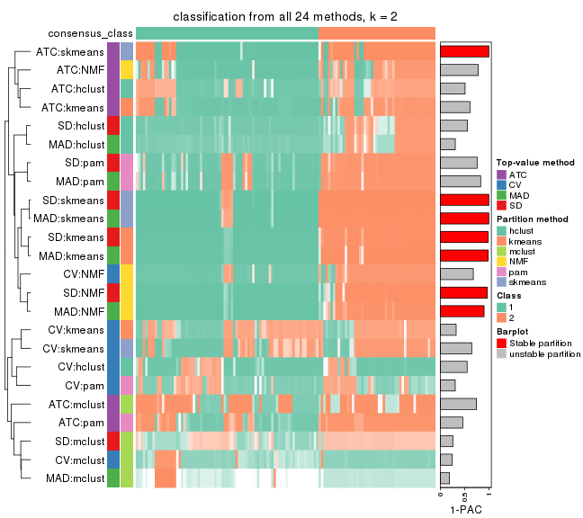</p>

</div>
<div id='tab-collect-classes-from-consensus-partition-list-2'>
<pre><code class="r">collect_classes(res_list, k = 3)
</code></pre>

<p></p>

</div>
<div id='tab-collect-classes-from-consensus-partition-list-3'>
<pre><code class="r">collect_classes(res_list, k = 4)
</code></pre>

<p></p>

</div>
<div id='tab-collect-classes-from-consensus-partition-list-4'>
<pre><code class="r">collect_classes(res_list, k = 5)
</code></pre>

<p></p>

</div>
<div id='tab-collect-classes-from-consensus-partition-list-5'>
<pre><code class="r">collect_classes(res_list, k = 6)
</code></pre>

<p></p>

</div>
</div>


### Top rows overlap


Overlap of top rows from different top-row methods:


<script>
$( function() {
	$( '#tabs-top-rows-overlap-by-euler' ).tabs();
} );
</script>
<div id='tabs-top-rows-overlap-by-euler'>
<ul>
<li><a href='#tab-top-rows-overlap-by-euler-1'>top_n = 1000</a></li>
<li><a href='#tab-top-rows-overlap-by-euler-2'>top_n = 2000</a></li>
<li><a href='#tab-top-rows-overlap-by-euler-3'>top_n = 3000</a></li>
<li><a href='#tab-top-rows-overlap-by-euler-4'>top_n = 4000</a></li>
<li><a href='#tab-top-rows-overlap-by-euler-5'>top_n = 5000</a></li>
</ul>
<div id='tab-top-rows-overlap-by-euler-1'>
<pre><code class="r">top_rows_overlap(res_list, top_n = 1000, method = &quot;euler&quot;)
</code></pre>

<p></p>

</div>
<div id='tab-top-rows-overlap-by-euler-2'>
<pre><code class="r">top_rows_overlap(res_list, top_n = 2000, method = &quot;euler&quot;)
</code></pre>

<p></p>

</div>
<div id='tab-top-rows-overlap-by-euler-3'>
<pre><code class="r">top_rows_overlap(res_list, top_n = 3000, method = &quot;euler&quot;)
</code></pre>

<p></p>

</div>
<div id='tab-top-rows-overlap-by-euler-4'>
<pre><code class="r">top_rows_overlap(res_list, top_n = 4000, method = &quot;euler&quot;)
</code></pre>

<p></p>

</div>
<div id='tab-top-rows-overlap-by-euler-5'>
<pre><code class="r">top_rows_overlap(res_list, top_n = 5000, method = &quot;euler&quot;)
</code></pre>

<p></p>

</div>
</div>

Also visualize the correspondance of rankings between different top-row methods:


<script>
$( function() {
	$( '#tabs-top-rows-overlap-by-correspondance' ).tabs();
} );
</script>
<div id='tabs-top-rows-overlap-by-correspondance'>
<ul>
<li><a href='#tab-top-rows-overlap-by-correspondance-1'>top_n = 1000</a></li>
<li><a href='#tab-top-rows-overlap-by-correspondance-2'>top_n = 2000</a></li>
<li><a href='#tab-top-rows-overlap-by-correspondance-3'>top_n = 3000</a></li>
<li><a href='#tab-top-rows-overlap-by-correspondance-4'>top_n = 4000</a></li>
<li><a href='#tab-top-rows-overlap-by-correspondance-5'>top_n = 5000</a></li>
</ul>
<div id='tab-top-rows-overlap-by-correspondance-1'>
<pre><code class="r">top_rows_overlap(res_list, top_n = 1000, method = &quot;correspondance&quot;)
</code></pre>

<p></p>

</div>
<div id='tab-top-rows-overlap-by-correspondance-2'>
<pre><code class="r">top_rows_overlap(res_list, top_n = 2000, method = &quot;correspondance&quot;)
</code></pre>

<p></p>

</div>
<div id='tab-top-rows-overlap-by-correspondance-3'>
<pre><code class="r">top_rows_overlap(res_list, top_n = 3000, method = &quot;correspondance&quot;)
</code></pre>

<p></p>

</div>
<div id='tab-top-rows-overlap-by-correspondance-4'>
<pre><code class="r">top_rows_overlap(res_list, top_n = 4000, method = &quot;correspondance&quot;)
</code></pre>

<p></p>

</div>
<div id='tab-top-rows-overlap-by-correspondance-5'>
<pre><code class="r">top_rows_overlap(res_list, top_n = 5000, method = &quot;correspondance&quot;)
</code></pre>

<p></p>

</div>
</div>


Heatmaps of the top rows:


<script>
$( function() {
	$( '#tabs-top-rows-heatmap' ).tabs();
} );
</script>
<div id='tabs-top-rows-heatmap'>
<ul>
<li><a href='#tab-top-rows-heatmap-1'>top_n = 1000</a></li>
<li><a href='#tab-top-rows-heatmap-2'>top_n = 2000</a></li>
<li><a href='#tab-top-rows-heatmap-3'>top_n = 3000</a></li>
<li><a href='#tab-top-rows-heatmap-4'>top_n = 4000</a></li>
<li><a href='#tab-top-rows-heatmap-5'>top_n = 5000</a></li>
</ul>
<div id='tab-top-rows-heatmap-1'>
<pre><code class="r">top_rows_heatmap(res_list, top_n = 1000)
</code></pre>

<p></p>

</div>
<div id='tab-top-rows-heatmap-2'>
<pre><code class="r">top_rows_heatmap(res_list, top_n = 2000)
</code></pre>

<p></p>

</div>
<div id='tab-top-rows-heatmap-3'>
<pre><code class="r">top_rows_heatmap(res_list, top_n = 3000)
</code></pre>

<p></p>

</div>
<div id='tab-top-rows-heatmap-4'>
<pre><code class="r">top_rows_heatmap(res_list, top_n = 4000)
</code></pre>

<p></p>

</div>
<div id='tab-top-rows-heatmap-5'>
<pre><code class="r">top_rows_heatmap(res_list, top_n = 5000)
</code></pre>

<p></p>

</div>
</div>


 
## Results for each method


---------------------------------------------------


### SD:hclust


The object with results only for a single top-value method and a single partition method 
can be extracted as:

```r
res = res_list["SD", "hclust"]
# you can also extract it by
# res = res_list["SD:hclust"]
```

A summary of `res` and all the functions that can be applied to it:

```r
res
```

```
#> A 'ConsensusPartition' object with k = 2, 3, 4, 5, 6.
#>   On a matrix with 18041 rows and 126 columns.
#>   Top rows (1000, 2000, 3000, 4000, 5000) are extracted by 'SD' method.
#>   Subgroups are detected by 'hclust' method.
#>   Performed in total 1250 partitions by row resampling.
#>   Best k for subgroups seems to be 5.
#> 
#> Following methods can be applied to this 'ConsensusPartition' object:
#>  [1] "cola_report"             "collect_classes"         "collect_plots"          
#>  [4] "collect_stats"           "colnames"                "compare_signatures"     
#>  [7] "consensus_heatmap"       "dimension_reduction"     "functional_enrichment"  
#> [10] "get_anno_col"            "get_anno"                "get_classes"            
#> [13] "get_consensus"           "get_matrix"              "get_membership"         
#> [16] "get_param"               "get_signatures"          "get_stats"              
#> [19] "is_best_k"               "is_stable_k"             "membership_heatmap"     
#> [22] "ncol"                    "nrow"                    "plot_ecdf"              
#> [25] "rownames"                "select_partition_number" "show"                   
#> [28] "suggest_best_k"          "test_to_known_factors"
```

`collect_plots()` function collects all the plots made from `res` for all `k` (number of partitions)
into one single page to provide an easy and fast comparison between different `k`.

```r
collect_plots(res)
```


The plots are:

- The first row: a plot of the ECDF (Empirical cumulative distribution
  function) curves of the consensus matrix for each `k` and the heatmap of
  predicted classes for each `k`.
- The second row: heatmaps of the consensus matrix for each `k`.
- The third row: heatmaps of the membership matrix for each `k`.
- The fouth row: heatmaps of the signatures for each `k`.

All the plots in panels can be made by individual functions and they are
plotted later in this section.

`select_partition_number()` produces several plots showing different
statistics for choosing "optimized" `k`. There are following statistics:

- ECDF curves of the consensus matrix for each `k`;
- 1-PAC. [The PAC
  score](https://en.wikipedia.org/wiki/Consensus_clustering#Over-interpretation_potential_of_consensus_clustering)
  measures the proportion of the ambiguous subgrouping.
- Mean silhouette score.
- Concordance. The mean probability of fiting the consensus class ids in all
  partitions.
- Area increased. Denote $A_k$ as the area under the ECDF curve for current
  `k`, the area increased is defined as $A_k - A_{k-1}$.
- Rand index. The percent of pairs of samples that are both in a same cluster
  or both are not in a same cluster in the partition of k and k-1.
- Jaccard index. The ratio of pairs of samples are both in a same cluster in
  the partition of k and k-1 and the pairs of samples are both in a same
  cluster in the partition k or k-1.

The detailed explanations of these statistics can be found in [the cola
vignette](http://bioconductor.org/packages/devel/bioc/vignettes/cola/inst/doc/cola.html#toc_13).

Generally speaking, lower PAC score, higher mean silhouette score or higher
concordance corresponds to better partition. Rand index and Jaccard index
measure how similar the current partition is compared to partition with `k-1`.
If they are too similar, we won't accept `k` is better than `k-1`.

```r
select_partition_number(res)
```


The numeric values for all these statistics can be obtained by `get_stats()`.

```r
get_stats(res)
```

```
#>   k 1-PAC mean_silhouette concordance area_increased  Rand Jaccard
#> 2 2 0.560           0.796       0.906         0.4026 0.618   0.618
#> 3 3 0.321           0.476       0.710         0.4508 0.766   0.628
#> 4 4 0.383           0.446       0.612         0.1904 0.835   0.622
#> 5 5 0.489           0.520       0.648         0.0837 0.834   0.518
#> 6 6 0.526           0.485       0.621         0.0498 0.839   0.466
```

`suggest_best_k()` suggests the best $k$ based on these statistics. The rules are as follows:

- All $k$ with Jaccard index larger than 0.95 are removed because the increase of
  the partition number does not provides enough extra information. If all $k$ are removed,
  the best $k$ is assigned by `NA`.
- For $k$ with 1-PAC larger than 0.9, the maximal $k$ is taken as the "best k". Other $k$ is called "optional k".
- If it does not fit the second rule. The $k$ with the highest vote of highest
  1-PAC, mean silhouette and concordance is taken as the "best k".

```r
suggest_best_k(res)
```

```
#> [1] 5
```


Following shows the table of the partitions (You need to click the **show/hide
code output** link to see it). The membership matrix (columns with name `p*`)
is inferred by
[`clue::cl_consensus()`](https://www.rdocumentation.org/link/cl_consensus?package=clue)
function with the `SE` method. Basically the value in the membership matrix
represents the probability to belong to a certain group. The finall class
label for an item is determined with the group with highest probability it
belongs to.

In `get_classes()` function, the entropy is calculated from the membership
matrix and the silhouette score is calculated from the consensus matrix.


<script>
$( function() {
	$( '#tabs-SD-hclust-get-classes' ).tabs();
} );
</script>
<div id='tabs-SD-hclust-get-classes'>
<ul>
<li><a href='#tab-SD-hclust-get-classes-1'>k = 2</a></li>
<li><a href='#tab-SD-hclust-get-classes-2'>k = 3</a></li>
<li><a href='#tab-SD-hclust-get-classes-3'>k = 4</a></li>
<li><a href='#tab-SD-hclust-get-classes-4'>k = 5</a></li>
<li><a href='#tab-SD-hclust-get-classes-5'>k = 6</a></li>
</ul>

<div id='tab-SD-hclust-get-classes-1'>
<p><a id='tab-SD-hclust-get-classes-1-a' style='color:#0366d6' href='#'>show/hide code output</a></p>
<pre><code class="r">cbind(get_classes(res, k = 2), get_membership(res, k = 2))
</code></pre>

<pre><code>#&gt;                                      class entropy silhouette    p1    p2
#&gt; DC1F29A2-39DE-44AD-936A-54B2B32D6370     1  0.0376     0.8943 0.996 0.004
#&gt; FA3C3413-FA8C-4A29-B9CA-5BC3A56274A8     1  0.9909     0.2702 0.556 0.444
#&gt; B9B72975-8134-475C-BC0B-0CFDB24F636A     2  0.1843     0.8802 0.028 0.972
#&gt; F44DB757-4D00-4BFC-99C5-AA82F99C5BDA     2  0.6048     0.7904 0.148 0.852
#&gt; 3BD942BB-A3A7-4993-B3F1-B8641626B773     1  0.1184     0.8948 0.984 0.016
#&gt; 431F73A2-2AB3-4101-B610-7FC02A7097EC     1  0.7745     0.7266 0.772 0.228
#&gt; 3067683D-43D4-4F6D-9338-17F6A75E4B25     1  0.7745     0.7266 0.772 0.228
#&gt; 2CE91B81-7CBE-4698-AFEE-6A154313D231     1  0.9909     0.2702 0.556 0.444
#&gt; A639CF4F-4591-4337-A12E-BED71EDDA10B     1  0.1414     0.8950 0.980 0.020
#&gt; 5482053D-9F48-4773-B68A-302B3A612503     1  0.0000     0.8935 1.000 0.000
#&gt; A31D342D-C67C-428B-BAED-C6E844277A09     1  0.8267     0.6669 0.740 0.260
#&gt; 0E9C5985-9AE0-4098-A076-6FFBBDF05110     2  0.9323     0.4661 0.348 0.652
#&gt; 08CCF8A0-15B7-4A13-BC43-6B3B3E2DDE95     1  0.9922     0.2702 0.552 0.448
#&gt; 10577D5B-AD56-403F-A562-73A9ACF2045B     1  0.0376     0.8939 0.996 0.004
#&gt; C940D443-5DDA-4403-868B-7AA6B9A50FC4     1  0.1414     0.8950 0.980 0.020
#&gt; 89D4D945-A717-495F-B253-F5A17CF5B9FA     1  0.7376     0.7522 0.792 0.208
#&gt; DC55EE78-203F-4092-9B83-14B1A529194B     2  0.0000     0.8831 0.000 1.000
#&gt; 8F7368BE-EB41-4192-89AA-9E0428C08851     1  0.0672     0.8937 0.992 0.008
#&gt; F772EA39-E408-4908-BADD-C786D702BF9B     2  0.4161     0.8451 0.084 0.916
#&gt; FD693D10-3ADA-4028-8392-41D2F0296F7E     1  0.2423     0.8911 0.960 0.040
#&gt; 84F16966-7640-49F9-95D1-7648FF74DCC9     2  0.0000     0.8831 0.000 1.000
#&gt; D26DAA2F-AE6A-42E1-9F1F-01943B99785F     2  0.9970     0.0291 0.468 0.532
#&gt; F325847E-F046-4B67-B01C-16919C401020     1  0.2778     0.8874 0.952 0.048
#&gt; 19EB2B10-2529-4A94-8FAE-1CE371A602D9     1  0.1633     0.8949 0.976 0.024
#&gt; B94B9CCF-5FB8-44AE-8D9C-A194C6801A27     2  0.0000     0.8831 0.000 1.000
#&gt; D2678E70-542A-4AB2-B881-12D66DBA44F5     1  0.2423     0.8911 0.960 0.040
#&gt; 4961CA2A-70CD-42AB-A676-4A98C85F449F     1  0.7745     0.7304 0.772 0.228
#&gt; 5AA74C5C-2AD1-4D59-A030-E964EB199581     1  0.0376     0.8939 0.996 0.004
#&gt; F9E11A1B-BD93-438F-9670-6FB7DFF9E910     1  0.0376     0.8943 0.996 0.004
#&gt; FB78CA5A-C8B9-42AF-9DAE-799CAB280B2E     1  0.0000     0.8935 1.000 0.000
#&gt; A8E48877-F8AB-44DD-A18B-194D87C44931     1  0.9909     0.2702 0.556 0.444
#&gt; CA50C495-F37E-4743-867D-FAF2DCC3376A     1  0.3114     0.8850 0.944 0.056
#&gt; 37342369-EC22-4904-8CCD-A0DC6BD8D183     2  0.1843     0.8812 0.028 0.972
#&gt; 91BA5F90-9174-4533-A050-39A28E34A94D     1  0.0000     0.8935 1.000 0.000
#&gt; 5BC371AC-1915-44E9-A114-2963E131EC8D     1  0.2236     0.8936 0.964 0.036
#&gt; 74A6C31A-7F21-45AF-A170-18C326D2AE69     1  0.0000     0.8935 1.000 0.000
#&gt; 984F27EF-D4D7-4E68-BD64-776FDFC04D07     1  0.2423     0.8911 0.960 0.040
#&gt; B05701C5-8C44-4FD1-94C9-FC0255A2EA24     1  0.2603     0.8900 0.956 0.044
#&gt; 91E4119C-2CE6-4447-A125-6A4F403A89E6     1  0.9491     0.4761 0.632 0.368
#&gt; 1570FCE7-F1B4-4BDF-A398-355EDF030864     2  0.1843     0.8802 0.028 0.972
#&gt; 604C06E9-A00E-435E-847A-3992922A5C56     1  0.2043     0.8937 0.968 0.032
#&gt; 455C9007-6FF4-4D63-83FA-4915F0331F9A     1  0.2423     0.8911 0.960 0.040
#&gt; FB8BD3CF-D2EC-47B6-B67F-65ADC1C3A6A7     1  0.7745     0.7304 0.772 0.228
#&gt; 9DC7443A-3C8F-4025-8312-3C98BF28D736     1  0.2423     0.8911 0.960 0.040
#&gt; CB207A52-09AC-49D3-8240-5840CDFBB154     1  0.0376     0.8939 0.996 0.004
#&gt; 2A335049-AD9F-4B32-92B7-69B04B0CF2BA     1  0.1414     0.8942 0.980 0.020
#&gt; 6ACA6293-371E-428D-BBAE-ABFD410C886F     1  0.9909     0.2702 0.556 0.444
#&gt; E8929929-73F9-4DB7-ABBA-0852BEFFFF7E     1  0.2043     0.8937 0.968 0.032
#&gt; 5E343116-414B-41F2-AAEE-A3225450135A     1  0.6148     0.7974 0.848 0.152
#&gt; 0A39073C-157C-48A1-B125-A6A04CB738DA     1  0.8499     0.6495 0.724 0.276
#&gt; 300D78E6-1C7E-4114-80EA-9204A6818B9A     1  0.0376     0.8939 0.996 0.004
#&gt; DAAF55AA-ED48-4221-9CD6-D1DEB6376017     1  0.2948     0.8744 0.948 0.052
#&gt; D76FCF4A-4ACF-41EF-A120-64136D6C845E     1  0.9881     0.2854 0.564 0.436
#&gt; AD294665-6F90-459C-90D5-3058F210225D     1  0.2236     0.8936 0.964 0.036
#&gt; 92E8AD7A-1084-44C8-BDC0-FE4E47B6143F     2  0.1843     0.8812 0.028 0.972
#&gt; 5644A861-3C59-486D-8FBE-4DF6A3B19558     1  0.0000     0.8935 1.000 0.000
#&gt; 1BF8AAE7-B771-4CF2-8B1C-D2BEB5E6579E     1  0.2043     0.8933 0.968 0.032
#&gt; A54731AE-FC40-407F-8D10-67DDC122237D     2  0.0000     0.8831 0.000 1.000
#&gt; 179DC906-5654-4CBA-9C27-C9560B5F12DE     1  0.1184     0.8948 0.984 0.016
#&gt; 979B9A2B-2D81-47C3-A553-9B9441CAAE47     1  0.2236     0.8936 0.964 0.036
#&gt; D69BD86A-08FB-49DA-9084-2725F6C9195F     1  0.0000     0.8935 1.000 0.000
#&gt; 84611033-BCF7-49D7-9B91-DA29B62AC8D3     1  0.1414     0.8942 0.980 0.020
#&gt; 8AA1DA3E-8C00-4653-AA33-EA70531C1E50     2  0.0000     0.8831 0.000 1.000
#&gt; CEBE9594-0F19-46B4-AF7D-F8DF33E00AFB     1  0.0000     0.8935 1.000 0.000
#&gt; C68E82D2-2BD3-41E9-92D7-D4C06E1953B2     1  0.1184     0.8948 0.984 0.016
#&gt; B855EF89-1E76-4408-AA65-61A0F0A4F412     2  0.0000     0.8831 0.000 1.000
#&gt; 4488EFB3-5B01-41E3-B57E-8E4F607CF448     1  0.2236     0.8936 0.964 0.036
#&gt; C2BD8440-CAC6-4FE5-8EBB-5E6AE308D52F     1  0.0000     0.8935 1.000 0.000
#&gt; E0E50F10-1FED-41C1-84DB-81A46F25D7E9     1  0.2423     0.8911 0.960 0.040
#&gt; EE16D845-31F2-4178-800B-CA2C358841AD     2  0.5737     0.8026 0.136 0.864
#&gt; 169828CF-5693-4A46-B5D7-E45CBA9DF317     2  0.0000     0.8831 0.000 1.000
#&gt; 51077BA3-AEE0-4BD4-A1B1-1B0A811642A1     1  0.0000     0.8935 1.000 0.000
#&gt; D2F4E240-C44C-4CF7-8016-6CACD370D093     1  0.0376     0.8939 0.996 0.004
#&gt; 721CDBE6-FC85-4C30-B23E-28407340286F     1  0.8499     0.6496 0.724 0.276
#&gt; 392897E4-6009-422C-B461-649F4DDF260C     1  0.8207     0.6832 0.744 0.256
#&gt; 617E13D2-6924-45F8-A8DE-BE21B718F822     1  0.2423     0.8911 0.960 0.040
#&gt; 5746C00F-9CBB-46B7-83FD-90B2AB3F507B     1  0.0376     0.8939 0.996 0.004
#&gt; 982B4344-A223-4D1F-9485-2E56F9FD45C0     2  0.0000     0.8831 0.000 1.000
#&gt; E5557F52-015D-49DC-9E23-989FC259976F     1  0.0000     0.8935 1.000 0.000
#&gt; F3135F5E-2E90-4923-B634-E994563D17B7     1  0.1184     0.8959 0.984 0.016
#&gt; D1ED15A5-9802-4314-B556-E89EB772D1F0     1  0.1633     0.8949 0.976 0.024
#&gt; 222B06E3-FCFB-4104-92C3-D73BC31854D4     1  0.0000     0.8935 1.000 0.000
#&gt; 4C810FFA-ED07-4F4C-9F81-B8F1CF4956F7     1  0.2423     0.8911 0.960 0.040
#&gt; 9A608964-ED12-4E6E-9D3A-430F59FFF65B     1  0.3431     0.8808 0.936 0.064
#&gt; 4087357F-C17A-4992-A8AB-41ACA2F72001     1  0.2423     0.8911 0.960 0.040
#&gt; B3F013A5-BCB8-4CE0-86B2-634EE180AA6E     2  0.0000     0.8831 0.000 1.000
#&gt; 322AF320-1379-4F51-AFDC-5292A060CD52     2  0.1414     0.8824 0.020 0.980
#&gt; 53A96249-66D5-4C26-893B-ADC71481D261     2  0.9850     0.2008 0.428 0.572
#&gt; 1AB7A6F2-14BD-447C-B2E3-DEB0CE56B209     1  0.0000     0.8935 1.000 0.000
#&gt; 8B4BCDA0-6787-4A55-99F7-AAF22AF85BA6     2  0.0000     0.8831 0.000 1.000
#&gt; 5D9D9E08-2C2C-414E-9547-62799F90D543     2  0.1414     0.8828 0.020 0.980
#&gt; C345CD17-E4F4-41D5-9891-FEFB19342C52     1  0.0376     0.8939 0.996 0.004
#&gt; 1AF8FDE1-1A74-41F6-A1C5-4952CDFB7D3F     1  0.0376     0.8939 0.996 0.004
#&gt; BC3405FF-0660-4B2B-8DC1-5F34D3133078     1  0.0938     0.8953 0.988 0.012
#&gt; C2662596-6E2F-4924-B051-CEA1AC87B197     1  0.0000     0.8935 1.000 0.000
#&gt; 39AE85F7-49FB-4438-BD41-6AC812FA1C72     1  0.0938     0.8953 0.988 0.012
#&gt; 6FF266DB-3F08-43F2-8F6F-679F805B80B8     1  0.6148     0.7974 0.848 0.152
#&gt; B03B7B81-BBD6-4194-BC5E-6EDF0D3F015A     1  0.1184     0.8948 0.984 0.016
#&gt; C7617D56-F13C-4C43-906C-BD458C5DC4CD     1  0.6148     0.7974 0.848 0.152
#&gt; 09420F8B-7A71-4B32-8388-4767670F1FEB     1  0.0000     0.8935 1.000 0.000
#&gt; 6AF47534-74FF-4128-865B-4E8EE1FFB469     2  0.0000     0.8831 0.000 1.000
#&gt; 8FF9E94A-2ED2-4727-947F-D524D7ECE815     1  0.0000     0.8935 1.000 0.000
#&gt; A390E20D-03F9-40E4-A132-0FA5C2BEDB63     1  0.2423     0.8911 0.960 0.040
#&gt; A489CCCA-1374-4071-80CE-05B83C9A0D5E     1  0.9909     0.2702 0.556 0.444
#&gt; 2D962371-EC83-490C-A663-478AF383BC1B     2  0.0000     0.8831 0.000 1.000
#&gt; D91B31A1-EE71-4726-B94C-0CC2815E9D4E     2  0.6048     0.7904 0.148 0.852
#&gt; E0123C5C-E1D1-4162-9895-CC8B01949D84     1  0.9522     0.4647 0.628 0.372
#&gt; EC73959A-2728-49FE-B72A-790BB14F4CBF     1  0.0000     0.8935 1.000 0.000
#&gt; A60DC925-7343-496E-900D-0DD81D5C8123     2  0.1843     0.8812 0.028 0.972
#&gt; 659B64DB-F4A5-43BD-811B-05004CB49D99     1  0.0000     0.8935 1.000 0.000
#&gt; 6969B6B2-7616-4664-9696-C4DACD10537B     2  0.1843     0.8812 0.028 0.972
#&gt; 2F6392DE-0D54-4768-B062-907C81E5B0CC     1  0.1184     0.8948 0.984 0.016
#&gt; C74BE8C5-BA6D-4596-9D67-3C731799F999     1  0.2423     0.8911 0.960 0.040
#&gt; 79A7647F-BDBA-45A2-B207-ABF788F6CC95     1  0.1633     0.8949 0.976 0.024
#&gt; D47D0433-2313-4A2F-B268-5AD293D7534E     2  0.0938     0.8832 0.012 0.988
#&gt; C5058B93-C1DA-43B9-9951-B23A9810AA6E     1  0.0376     0.8939 0.996 0.004
#&gt; 2629FEE3-A203-4411-8A70-02A796C9505C     1  0.7745     0.7304 0.772 0.228
#&gt; 1AF329E4-11D4-4CFC-801F-C24A1EA33102     2  0.9754     0.2881 0.408 0.592
#&gt; D453BEF8-3F18-4B89-BA42-CE74EB105032     1  0.4939     0.8468 0.892 0.108
#&gt; B12A4446-2310-4139-897F-CA030478CBD5     1  0.7950     0.7066 0.760 0.240
#&gt; BCAB1918-5FA9-4CBD-85CB-008743FEA2CC     1  0.1843     0.8949 0.972 0.028
#&gt; 9A5432D3-19EE-47B4-BD88-698DEC75A5E9     2  0.9552     0.3569 0.376 0.624
#&gt; A608BCEB-2C27-4927-A308-E6975F641722     2  0.8713     0.5822 0.292 0.708
#&gt; E4752275-7BF6-4C1E-8A45-C7D571ED85AD     2  0.0000     0.8831 0.000 1.000
#&gt; FDEC1714-C02D-4AB7-AE82-789E9D709EDE     1  0.2236     0.8936 0.964 0.036
#&gt; 33737781-8638-4FA2-AD4C-E888BB9343D8     1  0.9909     0.2702 0.556 0.444
</code></pre>

<script>
$('#tab-SD-hclust-get-classes-1-a').parent().next().next().hide();
$('#tab-SD-hclust-get-classes-1-a').click(function(){
  $('#tab-SD-hclust-get-classes-1-a').parent().next().next().toggle();
  return(false);
});
</script>
</div>

<div id='tab-SD-hclust-get-classes-2'>
<p><a id='tab-SD-hclust-get-classes-2-a' style='color:#0366d6' href='#'>show/hide code output</a></p>
<pre><code class="r">cbind(get_classes(res, k = 3), get_membership(res, k = 3))
</code></pre>

<pre><code>#&gt;                                      class entropy silhouette    p1    p2    p3
#&gt; DC1F29A2-39DE-44AD-936A-54B2B32D6370     1  0.5706     0.4548 0.680 0.000 0.320
#&gt; FA3C3413-FA8C-4A29-B9CA-5BC3A56274A8     3  0.9885     0.4791 0.260 0.368 0.372
#&gt; B9B72975-8134-475C-BC0B-0CFDB24F636A     2  0.1315     0.8512 0.020 0.972 0.008
#&gt; F44DB757-4D00-4BFC-99C5-AA82F99C5BDA     2  0.4349     0.7326 0.128 0.852 0.020
#&gt; 3BD942BB-A3A7-4993-B3F1-B8641626B773     1  0.5291     0.5399 0.732 0.000 0.268
#&gt; 431F73A2-2AB3-4101-B610-7FC02A7097EC     1  0.9154    -0.2212 0.468 0.148 0.384
#&gt; 3067683D-43D4-4F6D-9338-17F6A75E4B25     1  0.9154    -0.2212 0.468 0.148 0.384
#&gt; 2CE91B81-7CBE-4698-AFEE-6A154313D231     3  0.9885     0.4791 0.260 0.368 0.372
#&gt; A639CF4F-4591-4337-A12E-BED71EDDA10B     1  0.6309     0.0295 0.500 0.000 0.500
#&gt; 5482053D-9F48-4773-B68A-302B3A612503     1  0.1860     0.6244 0.948 0.000 0.052
#&gt; A31D342D-C67C-428B-BAED-C6E844277A09     3  0.5968     0.0980 0.364 0.000 0.636
#&gt; 0E9C5985-9AE0-4098-A076-6FFBBDF05110     2  0.8410     0.3248 0.216 0.620 0.164
#&gt; 08CCF8A0-15B7-4A13-BC43-6B3B3E2DDE95     3  0.9106     0.5236 0.180 0.284 0.536
#&gt; 10577D5B-AD56-403F-A562-73A9ACF2045B     1  0.3816     0.5883 0.852 0.000 0.148
#&gt; C940D443-5DDA-4403-868B-7AA6B9A50FC4     1  0.6309     0.0295 0.500 0.000 0.500
#&gt; 89D4D945-A717-495F-B253-F5A17CF5B9FA     1  0.8925    -0.1992 0.464 0.124 0.412
#&gt; DC55EE78-203F-4092-9B83-14B1A529194B     2  0.0000     0.8586 0.000 1.000 0.000
#&gt; 8F7368BE-EB41-4192-89AA-9E0428C08851     1  0.0892     0.6244 0.980 0.000 0.020
#&gt; F772EA39-E408-4908-BADD-C786D702BF9B     2  0.2939     0.8081 0.072 0.916 0.012
#&gt; FD693D10-3ADA-4028-8392-41D2F0296F7E     1  0.5650     0.4251 0.688 0.000 0.312
#&gt; 84F16966-7640-49F9-95D1-7648FF74DCC9     2  0.0237     0.8585 0.000 0.996 0.004
#&gt; D26DAA2F-AE6A-42E1-9F1F-01943B99785F     3  0.6887     0.3563 0.060 0.236 0.704
#&gt; F325847E-F046-4B67-B01C-16919C401020     1  0.6286     0.1037 0.536 0.000 0.464
#&gt; 19EB2B10-2529-4A94-8FAE-1CE371A602D9     3  0.6309    -0.0847 0.500 0.000 0.500
#&gt; B94B9CCF-5FB8-44AE-8D9C-A194C6801A27     2  0.0237     0.8585 0.000 0.996 0.004
#&gt; D2678E70-542A-4AB2-B881-12D66DBA44F5     1  0.5650     0.4251 0.688 0.000 0.312
#&gt; 4961CA2A-70CD-42AB-A676-4A98C85F449F     3  0.8554     0.4411 0.324 0.116 0.560
#&gt; 5AA74C5C-2AD1-4D59-A030-E964EB199581     1  0.2959     0.6148 0.900 0.000 0.100
#&gt; F9E11A1B-BD93-438F-9670-6FB7DFF9E910     1  0.5497     0.4889 0.708 0.000 0.292
#&gt; FB78CA5A-C8B9-42AF-9DAE-799CAB280B2E     1  0.1031     0.6243 0.976 0.000 0.024
#&gt; A8E48877-F8AB-44DD-A18B-194D87C44931     3  0.9885     0.4791 0.260 0.368 0.372
#&gt; CA50C495-F37E-4743-867D-FAF2DCC3376A     3  0.6274     0.0580 0.456 0.000 0.544
#&gt; 37342369-EC22-4904-8CCD-A0DC6BD8D183     2  0.3129     0.8365 0.008 0.904 0.088
#&gt; 91BA5F90-9174-4533-A050-39A28E34A94D     1  0.1860     0.6244 0.948 0.000 0.052
#&gt; 5BC371AC-1915-44E9-A114-2963E131EC8D     1  0.5363     0.5382 0.724 0.000 0.276
#&gt; 74A6C31A-7F21-45AF-A170-18C326D2AE69     1  0.1163     0.6215 0.972 0.000 0.028
#&gt; 984F27EF-D4D7-4E68-BD64-776FDFC04D07     1  0.5650     0.4251 0.688 0.000 0.312
#&gt; B05701C5-8C44-4FD1-94C9-FC0255A2EA24     3  0.6813     0.0310 0.468 0.012 0.520
#&gt; 91E4119C-2CE6-4447-A125-6A4F403A89E6     3  0.9687     0.4924 0.248 0.296 0.456
#&gt; 1570FCE7-F1B4-4BDF-A398-355EDF030864     2  0.1315     0.8512 0.020 0.972 0.008
#&gt; 604C06E9-A00E-435E-847A-3992922A5C56     3  0.6308    -0.0600 0.492 0.000 0.508
#&gt; 455C9007-6FF4-4D63-83FA-4915F0331F9A     1  0.5650     0.4251 0.688 0.000 0.312
#&gt; FB8BD3CF-D2EC-47B6-B67F-65ADC1C3A6A7     3  0.8554     0.4411 0.324 0.116 0.560
#&gt; 9DC7443A-3C8F-4025-8312-3C98BF28D736     1  0.5650     0.4251 0.688 0.000 0.312
#&gt; CB207A52-09AC-49D3-8240-5840CDFBB154     1  0.2959     0.6148 0.900 0.000 0.100
#&gt; 2A335049-AD9F-4B32-92B7-69B04B0CF2BA     1  0.5517     0.5174 0.728 0.004 0.268
#&gt; 6ACA6293-371E-428D-BBAE-ABFD410C886F     3  0.9885     0.4791 0.260 0.368 0.372
#&gt; E8929929-73F9-4DB7-ABBA-0852BEFFFF7E     3  0.6308    -0.0600 0.492 0.000 0.508
#&gt; 5E343116-414B-41F2-AAEE-A3225450135A     1  0.8513     0.0937 0.568 0.116 0.316
#&gt; 0A39073C-157C-48A1-B125-A6A04CB738DA     1  0.9773    -0.2929 0.412 0.236 0.352
#&gt; 300D78E6-1C7E-4114-80EA-9204A6818B9A     1  0.4178     0.5903 0.828 0.000 0.172
#&gt; DAAF55AA-ED48-4221-9CD6-D1DEB6376017     1  0.2959     0.5828 0.900 0.000 0.100
#&gt; D76FCF4A-4ACF-41EF-A120-64136D6C845E     2  0.9920    -0.5138 0.272 0.368 0.360
#&gt; AD294665-6F90-459C-90D5-3058F210225D     1  0.5363     0.5382 0.724 0.000 0.276
#&gt; 92E8AD7A-1084-44C8-BDC0-FE4E47B6143F     2  0.3129     0.8365 0.008 0.904 0.088
#&gt; 5644A861-3C59-486D-8FBE-4DF6A3B19558     1  0.1163     0.6215 0.972 0.000 0.028
#&gt; 1BF8AAE7-B771-4CF2-8B1C-D2BEB5E6579E     1  0.5560     0.4371 0.700 0.000 0.300
#&gt; A54731AE-FC40-407F-8D10-67DDC122237D     2  0.0000     0.8586 0.000 1.000 0.000
#&gt; 179DC906-5654-4CBA-9C27-C9560B5F12DE     1  0.5327     0.5365 0.728 0.000 0.272
#&gt; 979B9A2B-2D81-47C3-A553-9B9441CAAE47     1  0.5363     0.5382 0.724 0.000 0.276
#&gt; D69BD86A-08FB-49DA-9084-2725F6C9195F     1  0.1860     0.6244 0.948 0.000 0.052
#&gt; 84611033-BCF7-49D7-9B91-DA29B62AC8D3     1  0.5517     0.5174 0.728 0.004 0.268
#&gt; 8AA1DA3E-8C00-4653-AA33-EA70531C1E50     2  0.0237     0.8585 0.000 0.996 0.004
#&gt; CEBE9594-0F19-46B4-AF7D-F8DF33E00AFB     1  0.2261     0.6307 0.932 0.000 0.068
#&gt; C68E82D2-2BD3-41E9-92D7-D4C06E1953B2     1  0.5291     0.5399 0.732 0.000 0.268
#&gt; B855EF89-1E76-4408-AA65-61A0F0A4F412     2  0.0237     0.8585 0.000 0.996 0.004
#&gt; 4488EFB3-5B01-41E3-B57E-8E4F607CF448     1  0.5363     0.5382 0.724 0.000 0.276
#&gt; C2BD8440-CAC6-4FE5-8EBB-5E6AE308D52F     1  0.5785     0.4066 0.668 0.000 0.332
#&gt; E0E50F10-1FED-41C1-84DB-81A46F25D7E9     1  0.5650     0.4251 0.688 0.000 0.312
#&gt; EE16D845-31F2-4178-800B-CA2C358841AD     2  0.4136     0.7518 0.116 0.864 0.020
#&gt; 169828CF-5693-4A46-B5D7-E45CBA9DF317     2  0.0237     0.8585 0.000 0.996 0.004
#&gt; 51077BA3-AEE0-4BD4-A1B1-1B0A811642A1     1  0.1163     0.6215 0.972 0.000 0.028
#&gt; D2F4E240-C44C-4CF7-8016-6CACD370D093     1  0.3816     0.5883 0.852 0.000 0.148
#&gt; 721CDBE6-FC85-4C30-B23E-28407340286F     3  0.9250     0.4982 0.304 0.184 0.512
#&gt; 392897E4-6009-422C-B461-649F4DDF260C     3  0.8982     0.4845 0.308 0.156 0.536
#&gt; 617E13D2-6924-45F8-A8DE-BE21B718F822     1  0.5650     0.4251 0.688 0.000 0.312
#&gt; 5746C00F-9CBB-46B7-83FD-90B2AB3F507B     1  0.4121     0.5897 0.832 0.000 0.168
#&gt; 982B4344-A223-4D1F-9485-2E56F9FD45C0     2  0.0000     0.8586 0.000 1.000 0.000
#&gt; E5557F52-015D-49DC-9E23-989FC259976F     1  0.6260     0.1803 0.552 0.000 0.448
#&gt; F3135F5E-2E90-4923-B634-E994563D17B7     1  0.6299     0.0926 0.524 0.000 0.476
#&gt; D1ED15A5-9802-4314-B556-E89EB772D1F0     1  0.5560     0.4638 0.700 0.000 0.300
#&gt; 222B06E3-FCFB-4104-92C3-D73BC31854D4     1  0.1163     0.6215 0.972 0.000 0.028
#&gt; 4C810FFA-ED07-4F4C-9F81-B8F1CF4956F7     1  0.5650     0.4251 0.688 0.000 0.312
#&gt; 9A608964-ED12-4E6E-9D3A-430F59FFF65B     3  0.6468     0.0886 0.444 0.004 0.552
#&gt; 4087357F-C17A-4992-A8AB-41ACA2F72001     1  0.5650     0.4251 0.688 0.000 0.312
#&gt; B3F013A5-BCB8-4CE0-86B2-634EE180AA6E     2  0.0000     0.8586 0.000 1.000 0.000
#&gt; 322AF320-1379-4F51-AFDC-5292A060CD52     2  0.1315     0.8534 0.008 0.972 0.020
#&gt; 53A96249-66D5-4C26-893B-ADC71481D261     2  0.9229    -0.2925 0.152 0.428 0.420
#&gt; 1AB7A6F2-14BD-447C-B2E3-DEB0CE56B209     1  0.0747     0.6256 0.984 0.000 0.016
#&gt; 8B4BCDA0-6787-4A55-99F7-AAF22AF85BA6     2  0.0000     0.8586 0.000 1.000 0.000
#&gt; 5D9D9E08-2C2C-414E-9547-62799F90D543     2  0.2860     0.8379 0.004 0.912 0.084
#&gt; C345CD17-E4F4-41D5-9891-FEFB19342C52     1  0.5178     0.5390 0.744 0.000 0.256
#&gt; 1AF8FDE1-1A74-41F6-A1C5-4952CDFB7D3F     1  0.4121     0.5897 0.832 0.000 0.168
#&gt; BC3405FF-0660-4B2B-8DC1-5F34D3133078     1  0.5327     0.5381 0.728 0.000 0.272
#&gt; C2662596-6E2F-4924-B051-CEA1AC87B197     1  0.1860     0.6281 0.948 0.000 0.052
#&gt; 39AE85F7-49FB-4438-BD41-6AC812FA1C72     1  0.5327     0.5381 0.728 0.000 0.272
#&gt; 6FF266DB-3F08-43F2-8F6F-679F805B80B8     1  0.8513     0.0937 0.568 0.116 0.316
#&gt; B03B7B81-BBD6-4194-BC5E-6EDF0D3F015A     1  0.5327     0.5365 0.728 0.000 0.272
#&gt; C7617D56-F13C-4C43-906C-BD458C5DC4CD     1  0.8513     0.0937 0.568 0.116 0.316
#&gt; 09420F8B-7A71-4B32-8388-4767670F1FEB     1  0.1860     0.6244 0.948 0.000 0.052
#&gt; 6AF47534-74FF-4128-865B-4E8EE1FFB469     2  0.0000     0.8586 0.000 1.000 0.000
#&gt; 8FF9E94A-2ED2-4727-947F-D524D7ECE815     1  0.1163     0.6215 0.972 0.000 0.028
#&gt; A390E20D-03F9-40E4-A132-0FA5C2BEDB63     1  0.5650     0.4251 0.688 0.000 0.312
#&gt; A489CCCA-1374-4071-80CE-05B83C9A0D5E     3  0.9885     0.4791 0.260 0.368 0.372
#&gt; 2D962371-EC83-490C-A663-478AF383BC1B     2  0.0237     0.8585 0.000 0.996 0.004
#&gt; D91B31A1-EE71-4726-B94C-0CC2815E9D4E     2  0.4349     0.7326 0.128 0.852 0.020
#&gt; E0123C5C-E1D1-4162-9895-CC8B01949D84     3  0.9148     0.5261 0.220 0.236 0.544
#&gt; EC73959A-2728-49FE-B72A-790BB14F4CBF     1  0.1163     0.6215 0.972 0.000 0.028
#&gt; A60DC925-7343-496E-900D-0DD81D5C8123     2  0.3129     0.8365 0.008 0.904 0.088
#&gt; 659B64DB-F4A5-43BD-811B-05004CB49D99     1  0.1860     0.6244 0.948 0.000 0.052
#&gt; 6969B6B2-7616-4664-9696-C4DACD10537B     2  0.3129     0.8365 0.008 0.904 0.088
#&gt; 2F6392DE-0D54-4768-B062-907C81E5B0CC     1  0.5291     0.5399 0.732 0.000 0.268
#&gt; C74BE8C5-BA6D-4596-9D67-3C731799F999     1  0.5650     0.4251 0.688 0.000 0.312
#&gt; 79A7647F-BDBA-45A2-B207-ABF788F6CC95     1  0.6302     0.0993 0.520 0.000 0.480
#&gt; D47D0433-2313-4A2F-B268-5AD293D7534E     2  0.0983     0.8554 0.004 0.980 0.016
#&gt; C5058B93-C1DA-43B9-9951-B23A9810AA6E     1  0.4346     0.5971 0.816 0.000 0.184
#&gt; 2629FEE3-A203-4411-8A70-02A796C9505C     3  0.8554     0.4411 0.324 0.116 0.560
#&gt; 1AF329E4-11D4-4CFC-801F-C24A1EA33102     2  0.9034     0.1545 0.200 0.556 0.244
#&gt; D453BEF8-3F18-4B89-BA42-CE74EB105032     1  0.7690     0.1551 0.536 0.048 0.416
#&gt; B12A4446-2310-4139-897F-CA030478CBD5     3  0.8793     0.4725 0.308 0.140 0.552
#&gt; BCAB1918-5FA9-4CBD-85CB-008743FEA2CC     3  0.6308    -0.0542 0.492 0.000 0.508
#&gt; 9A5432D3-19EE-47B4-BD88-698DEC75A5E9     3  0.7537     0.1870 0.056 0.332 0.612
#&gt; A608BCEB-2C27-4927-A308-E6975F641722     2  0.7437     0.4801 0.200 0.692 0.108
#&gt; E4752275-7BF6-4C1E-8A45-C7D571ED85AD     2  0.0237     0.8585 0.000 0.996 0.004
#&gt; FDEC1714-C02D-4AB7-AE82-789E9D709EDE     1  0.5363     0.5382 0.724 0.000 0.276
#&gt; 33737781-8638-4FA2-AD4C-E888BB9343D8     3  0.9885     0.4791 0.260 0.368 0.372
</code></pre>

<script>
$('#tab-SD-hclust-get-classes-2-a').parent().next().next().hide();
$('#tab-SD-hclust-get-classes-2-a').click(function(){
  $('#tab-SD-hclust-get-classes-2-a').parent().next().next().toggle();
  return(false);
});
</script>
</div>

<div id='tab-SD-hclust-get-classes-3'>
<p><a id='tab-SD-hclust-get-classes-3-a' style='color:#0366d6' href='#'>show/hide code output</a></p>
<pre><code class="r">cbind(get_classes(res, k = 4), get_membership(res, k = 4))
</code></pre>

<pre><code>#&gt;                                      class entropy silhouette    p1    p2    p3    p4
#&gt; DC1F29A2-39DE-44AD-936A-54B2B32D6370     3  0.5387     0.2833 0.400 0.000 0.584 0.016
#&gt; FA3C3413-FA8C-4A29-B9CA-5BC3A56274A8     4  0.9857     0.7788 0.172 0.268 0.256 0.304
#&gt; B9B72975-8134-475C-BC0B-0CFDB24F636A     2  0.1139     0.8599 0.008 0.972 0.012 0.008
#&gt; F44DB757-4D00-4BFC-99C5-AA82F99C5BDA     2  0.4143     0.7517 0.072 0.852 0.040 0.036
#&gt; 3BD942BB-A3A7-4993-B3F1-B8641626B773     1  0.6637     0.2748 0.540 0.000 0.368 0.092
#&gt; 431F73A2-2AB3-4101-B610-7FC02A7097EC     3  0.8448     0.0935 0.200 0.056 0.504 0.240
#&gt; 3067683D-43D4-4F6D-9338-17F6A75E4B25     3  0.8448     0.0935 0.200 0.056 0.504 0.240
#&gt; 2CE91B81-7CBE-4698-AFEE-6A154313D231     4  0.9857     0.7788 0.172 0.268 0.256 0.304
#&gt; A639CF4F-4591-4337-A12E-BED71EDDA10B     3  0.3401     0.5984 0.152 0.000 0.840 0.008
#&gt; 5482053D-9F48-4773-B68A-302B3A612503     1  0.2973     0.4933 0.856 0.000 0.144 0.000
#&gt; A31D342D-C67C-428B-BAED-C6E844277A09     3  0.7371     0.1895 0.168 0.000 0.472 0.360
#&gt; 0E9C5985-9AE0-4098-A076-6FFBBDF05110     2  0.8542    -0.0542 0.120 0.532 0.124 0.224
#&gt; 08CCF8A0-15B7-4A13-BC43-6B3B3E2DDE95     4  0.9053     0.3792 0.084 0.184 0.356 0.376
#&gt; 10577D5B-AD56-403F-A562-73A9ACF2045B     1  0.5906     0.3040 0.644 0.000 0.292 0.064
#&gt; C940D443-5DDA-4403-868B-7AA6B9A50FC4     3  0.3401     0.5984 0.152 0.000 0.840 0.008
#&gt; 89D4D945-A717-495F-B253-F5A17CF5B9FA     3  0.8291     0.1448 0.200 0.052 0.524 0.224
#&gt; DC55EE78-203F-4092-9B83-14B1A529194B     2  0.0000     0.8671 0.000 1.000 0.000 0.000
#&gt; 8F7368BE-EB41-4192-89AA-9E0428C08851     1  0.2596     0.5127 0.908 0.000 0.068 0.024
#&gt; F772EA39-E408-4908-BADD-C786D702BF9B     2  0.2734     0.8184 0.036 0.916 0.024 0.024
#&gt; FD693D10-3ADA-4028-8392-41D2F0296F7E     1  0.6504     0.2750 0.476 0.000 0.072 0.452
#&gt; 84F16966-7640-49F9-95D1-7648FF74DCC9     2  0.0188     0.8674 0.000 0.996 0.000 0.004
#&gt; D26DAA2F-AE6A-42E1-9F1F-01943B99785F     4  0.6951     0.3647 0.000 0.140 0.304 0.556
#&gt; F325847E-F046-4B67-B01C-16919C401020     3  0.6359     0.4617 0.220 0.000 0.648 0.132
#&gt; 19EB2B10-2529-4A94-8FAE-1CE371A602D9     3  0.3401     0.5984 0.152 0.000 0.840 0.008
#&gt; B94B9CCF-5FB8-44AE-8D9C-A194C6801A27     2  0.0188     0.8674 0.000 0.996 0.000 0.004
#&gt; D2678E70-542A-4AB2-B881-12D66DBA44F5     1  0.6504     0.2750 0.476 0.000 0.072 0.452
#&gt; 4961CA2A-70CD-42AB-A676-4A98C85F449F     3  0.7533     0.3176 0.124 0.048 0.604 0.224
#&gt; 5AA74C5C-2AD1-4D59-A030-E964EB199581     1  0.5144     0.4307 0.732 0.000 0.216 0.052
#&gt; F9E11A1B-BD93-438F-9670-6FB7DFF9E910     3  0.6123     0.3722 0.336 0.000 0.600 0.064
#&gt; FB78CA5A-C8B9-42AF-9DAE-799CAB280B2E     1  0.2335     0.5145 0.920 0.000 0.060 0.020
#&gt; A8E48877-F8AB-44DD-A18B-194D87C44931     4  0.9857     0.7788 0.172 0.268 0.256 0.304
#&gt; CA50C495-F37E-4743-867D-FAF2DCC3376A     3  0.5783     0.5469 0.188 0.000 0.704 0.108
#&gt; 37342369-EC22-4904-8CCD-A0DC6BD8D183     2  0.2520     0.8380 0.004 0.904 0.004 0.088
#&gt; 91BA5F90-9174-4533-A050-39A28E34A94D     1  0.2973     0.4933 0.856 0.000 0.144 0.000
#&gt; 5BC371AC-1915-44E9-A114-2963E131EC8D     1  0.6532     0.2551 0.548 0.000 0.368 0.084
#&gt; 74A6C31A-7F21-45AF-A170-18C326D2AE69     1  0.2224     0.5206 0.928 0.000 0.040 0.032
#&gt; 984F27EF-D4D7-4E68-BD64-776FDFC04D07     1  0.6504     0.2750 0.476 0.000 0.072 0.452
#&gt; B05701C5-8C44-4FD1-94C9-FC0255A2EA24     3  0.4139     0.5882 0.144 0.000 0.816 0.040
#&gt; 91E4119C-2CE6-4447-A125-6A4F403A89E6     3  0.9203    -0.1820 0.104 0.228 0.432 0.236
#&gt; 1570FCE7-F1B4-4BDF-A398-355EDF030864     2  0.1139     0.8599 0.008 0.972 0.012 0.008
#&gt; 604C06E9-A00E-435E-847A-3992922A5C56     3  0.3806     0.5991 0.156 0.000 0.824 0.020
#&gt; 455C9007-6FF4-4D63-83FA-4915F0331F9A     1  0.6504     0.2750 0.476 0.000 0.072 0.452
#&gt; FB8BD3CF-D2EC-47B6-B67F-65ADC1C3A6A7     3  0.7533     0.3176 0.124 0.048 0.604 0.224
#&gt; 9DC7443A-3C8F-4025-8312-3C98BF28D736     1  0.6504     0.2750 0.476 0.000 0.072 0.452
#&gt; CB207A52-09AC-49D3-8240-5840CDFBB154     1  0.5144     0.4307 0.732 0.000 0.216 0.052
#&gt; 2A335049-AD9F-4B32-92B7-69B04B0CF2BA     1  0.6500     0.0831 0.484 0.000 0.444 0.072
#&gt; 6ACA6293-371E-428D-BBAE-ABFD410C886F     4  0.9857     0.7788 0.172 0.268 0.256 0.304
#&gt; E8929929-73F9-4DB7-ABBA-0852BEFFFF7E     3  0.3806     0.5991 0.156 0.000 0.824 0.020
#&gt; 5E343116-414B-41F2-AAEE-A3225450135A     1  0.8549    -0.1398 0.408 0.044 0.360 0.188
#&gt; 0A39073C-157C-48A1-B125-A6A04CB738DA     3  0.9733    -0.0777 0.264 0.160 0.348 0.228
#&gt; 300D78E6-1C7E-4114-80EA-9204A6818B9A     1  0.6549     0.3512 0.612 0.000 0.268 0.120
#&gt; DAAF55AA-ED48-4221-9CD6-D1DEB6376017     1  0.4072     0.4635 0.828 0.000 0.052 0.120
#&gt; D76FCF4A-4ACF-41EF-A120-64136D6C845E     4  0.9857     0.7593 0.172 0.268 0.256 0.304
#&gt; AD294665-6F90-459C-90D5-3058F210225D     1  0.6532     0.2551 0.548 0.000 0.368 0.084
#&gt; 92E8AD7A-1084-44C8-BDC0-FE4E47B6143F     2  0.2520     0.8380 0.004 0.904 0.004 0.088
#&gt; 5644A861-3C59-486D-8FBE-4DF6A3B19558     1  0.2224     0.5206 0.928 0.000 0.040 0.032
#&gt; 1BF8AAE7-B771-4CF2-8B1C-D2BEB5E6579E     1  0.6546     0.2747 0.492 0.000 0.076 0.432
#&gt; A54731AE-FC40-407F-8D10-67DDC122237D     2  0.0188     0.8673 0.000 0.996 0.000 0.004
#&gt; 179DC906-5654-4CBA-9C27-C9560B5F12DE     1  0.6648     0.2689 0.536 0.000 0.372 0.092
#&gt; 979B9A2B-2D81-47C3-A553-9B9441CAAE47     1  0.6532     0.2551 0.548 0.000 0.368 0.084
#&gt; D69BD86A-08FB-49DA-9084-2725F6C9195F     1  0.2973     0.4933 0.856 0.000 0.144 0.000
#&gt; 84611033-BCF7-49D7-9B91-DA29B62AC8D3     1  0.6500     0.0831 0.484 0.000 0.444 0.072
#&gt; 8AA1DA3E-8C00-4653-AA33-EA70531C1E50     2  0.0188     0.8674 0.000 0.996 0.000 0.004
#&gt; CEBE9594-0F19-46B4-AF7D-F8DF33E00AFB     1  0.3763     0.4872 0.832 0.000 0.144 0.024
#&gt; C68E82D2-2BD3-41E9-92D7-D4C06E1953B2     1  0.6637     0.2748 0.540 0.000 0.368 0.092
#&gt; B855EF89-1E76-4408-AA65-61A0F0A4F412     2  0.0188     0.8674 0.000 0.996 0.000 0.004
#&gt; 4488EFB3-5B01-41E3-B57E-8E4F607CF448     1  0.6532     0.2551 0.548 0.000 0.368 0.084
#&gt; C2BD8440-CAC6-4FE5-8EBB-5E6AE308D52F     3  0.4936     0.3780 0.372 0.000 0.624 0.004
#&gt; E0E50F10-1FED-41C1-84DB-81A46F25D7E9     1  0.6504     0.2750 0.476 0.000 0.072 0.452
#&gt; EE16D845-31F2-4178-800B-CA2C358841AD     2  0.3907     0.7686 0.064 0.864 0.036 0.036
#&gt; 169828CF-5693-4A46-B5D7-E45CBA9DF317     2  0.0188     0.8674 0.000 0.996 0.000 0.004
#&gt; 51077BA3-AEE0-4BD4-A1B1-1B0A811642A1     1  0.2224     0.5206 0.928 0.000 0.040 0.032
#&gt; D2F4E240-C44C-4CF7-8016-6CACD370D093     1  0.5906     0.3040 0.644 0.000 0.292 0.064
#&gt; 721CDBE6-FC85-4C30-B23E-28407340286F     3  0.8393     0.1111 0.116 0.092 0.520 0.272
#&gt; 392897E4-6009-422C-B461-649F4DDF260C     3  0.8116     0.1685 0.112 0.076 0.544 0.268
#&gt; 617E13D2-6924-45F8-A8DE-BE21B718F822     1  0.6504     0.2750 0.476 0.000 0.072 0.452
#&gt; 5746C00F-9CBB-46B7-83FD-90B2AB3F507B     1  0.6685     0.3329 0.600 0.000 0.268 0.132
#&gt; 982B4344-A223-4D1F-9485-2E56F9FD45C0     2  0.0188     0.8673 0.000 0.996 0.000 0.004
#&gt; E5557F52-015D-49DC-9E23-989FC259976F     3  0.4485     0.5491 0.248 0.000 0.740 0.012
#&gt; F3135F5E-2E90-4923-B634-E994563D17B7     3  0.4175     0.5965 0.200 0.000 0.784 0.016
#&gt; D1ED15A5-9802-4314-B556-E89EB772D1F0     3  0.5155     0.1614 0.468 0.000 0.528 0.004
#&gt; 222B06E3-FCFB-4104-92C3-D73BC31854D4     1  0.2224     0.5206 0.928 0.000 0.040 0.032
#&gt; 4C810FFA-ED07-4F4C-9F81-B8F1CF4956F7     1  0.6504     0.2750 0.476 0.000 0.072 0.452
#&gt; 9A608964-ED12-4E6E-9D3A-430F59FFF65B     3  0.5788     0.5462 0.176 0.004 0.716 0.104
#&gt; 4087357F-C17A-4992-A8AB-41ACA2F72001     1  0.6504     0.2750 0.476 0.000 0.072 0.452
#&gt; B3F013A5-BCB8-4CE0-86B2-634EE180AA6E     2  0.0188     0.8673 0.000 0.996 0.000 0.004
#&gt; 322AF320-1379-4F51-AFDC-5292A060CD52     2  0.1042     0.8597 0.000 0.972 0.008 0.020
#&gt; 53A96249-66D5-4C26-893B-ADC71481D261     2  0.8978    -0.4396 0.064 0.408 0.256 0.272
#&gt; 1AB7A6F2-14BD-447C-B2E3-DEB0CE56B209     1  0.2376     0.5128 0.916 0.000 0.068 0.016
#&gt; 8B4BCDA0-6787-4A55-99F7-AAF22AF85BA6     2  0.0188     0.8673 0.000 0.996 0.000 0.004
#&gt; 5D9D9E08-2C2C-414E-9547-62799F90D543     2  0.2266     0.8401 0.000 0.912 0.004 0.084
#&gt; C345CD17-E4F4-41D5-9891-FEFB19342C52     3  0.6668     0.0796 0.380 0.000 0.528 0.092
#&gt; 1AF8FDE1-1A74-41F6-A1C5-4952CDFB7D3F     1  0.6661     0.3362 0.604 0.000 0.264 0.132
#&gt; BC3405FF-0660-4B2B-8DC1-5F34D3133078     1  0.6626     0.2242 0.528 0.000 0.384 0.088
#&gt; C2662596-6E2F-4924-B051-CEA1AC87B197     1  0.3497     0.4877 0.852 0.000 0.124 0.024
#&gt; 39AE85F7-49FB-4438-BD41-6AC812FA1C72     1  0.6626     0.2242 0.528 0.000 0.384 0.088
#&gt; 6FF266DB-3F08-43F2-8F6F-679F805B80B8     1  0.8549    -0.1398 0.408 0.044 0.360 0.188
#&gt; B03B7B81-BBD6-4194-BC5E-6EDF0D3F015A     1  0.6648     0.2689 0.536 0.000 0.372 0.092
#&gt; C7617D56-F13C-4C43-906C-BD458C5DC4CD     1  0.8549    -0.1398 0.408 0.044 0.360 0.188
#&gt; 09420F8B-7A71-4B32-8388-4767670F1FEB     1  0.2973     0.4933 0.856 0.000 0.144 0.000
#&gt; 6AF47534-74FF-4128-865B-4E8EE1FFB469     2  0.0188     0.8673 0.000 0.996 0.000 0.004
#&gt; 8FF9E94A-2ED2-4727-947F-D524D7ECE815     1  0.2224     0.5206 0.928 0.000 0.040 0.032
#&gt; A390E20D-03F9-40E4-A132-0FA5C2BEDB63     1  0.6504     0.2750 0.476 0.000 0.072 0.452
#&gt; A489CCCA-1374-4071-80CE-05B83C9A0D5E     4  0.9857     0.7788 0.172 0.268 0.256 0.304
#&gt; 2D962371-EC83-490C-A663-478AF383BC1B     2  0.0188     0.8674 0.000 0.996 0.000 0.004
#&gt; D91B31A1-EE71-4726-B94C-0CC2815E9D4E     2  0.4143     0.7517 0.072 0.852 0.040 0.036
#&gt; E0123C5C-E1D1-4162-9895-CC8B01949D84     3  0.8908    -0.2953 0.096 0.140 0.396 0.368
#&gt; EC73959A-2728-49FE-B72A-790BB14F4CBF     1  0.2224     0.5206 0.928 0.000 0.040 0.032
#&gt; A60DC925-7343-496E-900D-0DD81D5C8123     2  0.2520     0.8380 0.004 0.904 0.004 0.088
#&gt; 659B64DB-F4A5-43BD-811B-05004CB49D99     1  0.2973     0.4933 0.856 0.000 0.144 0.000
#&gt; 6969B6B2-7616-4664-9696-C4DACD10537B     2  0.2520     0.8380 0.004 0.904 0.004 0.088
#&gt; 2F6392DE-0D54-4768-B062-907C81E5B0CC     1  0.6637     0.2748 0.540 0.000 0.368 0.092
#&gt; C74BE8C5-BA6D-4596-9D67-3C731799F999     1  0.6504     0.2750 0.476 0.000 0.072 0.452
#&gt; 79A7647F-BDBA-45A2-B207-ABF788F6CC95     3  0.3494     0.5980 0.172 0.000 0.824 0.004
#&gt; D47D0433-2313-4A2F-B268-5AD293D7534E     2  0.0707     0.8633 0.000 0.980 0.000 0.020
#&gt; C5058B93-C1DA-43B9-9951-B23A9810AA6E     1  0.6618     0.3510 0.604 0.000 0.272 0.124
#&gt; 2629FEE3-A203-4411-8A70-02A796C9505C     3  0.7533     0.3176 0.124 0.048 0.604 0.224
#&gt; 1AF329E4-11D4-4CFC-801F-C24A1EA33102     2  0.8919    -0.3576 0.104 0.460 0.152 0.284
#&gt; D453BEF8-3F18-4B89-BA42-CE74EB105032     3  0.7552     0.3145 0.264 0.024 0.564 0.148
#&gt; B12A4446-2310-4139-897F-CA030478CBD5     3  0.7994     0.2105 0.112 0.072 0.560 0.256
#&gt; BCAB1918-5FA9-4CBD-85CB-008743FEA2CC     3  0.3479     0.5977 0.148 0.000 0.840 0.012
#&gt; 9A5432D3-19EE-47B4-BD88-698DEC75A5E9     4  0.7548     0.4233 0.008 0.240 0.216 0.536
#&gt; A608BCEB-2C27-4927-A308-E6975F641722     2  0.7065     0.4248 0.104 0.676 0.084 0.136
#&gt; E4752275-7BF6-4C1E-8A45-C7D571ED85AD     2  0.0188     0.8674 0.000 0.996 0.000 0.004
#&gt; FDEC1714-C02D-4AB7-AE82-789E9D709EDE     1  0.6532     0.2551 0.548 0.000 0.368 0.084
#&gt; 33737781-8638-4FA2-AD4C-E888BB9343D8     4  0.9857     0.7788 0.172 0.268 0.256 0.304
</code></pre>

<script>
$('#tab-SD-hclust-get-classes-3-a').parent().next().next().hide();
$('#tab-SD-hclust-get-classes-3-a').click(function(){
  $('#tab-SD-hclust-get-classes-3-a').parent().next().next().toggle();
  return(false);
});
</script>
</div>

<div id='tab-SD-hclust-get-classes-4'>
<p><a id='tab-SD-hclust-get-classes-4-a' style='color:#0366d6' href='#'>show/hide code output</a></p>
<pre><code class="r">cbind(get_classes(res, k = 5), get_membership(res, k = 5))
</code></pre>

<pre><code>#&gt;                                      class entropy silhouette    p1    p2    p3    p4    p5
#&gt; DC1F29A2-39DE-44AD-936A-54B2B32D6370     3  0.7013     0.3853 0.256 0.000 0.472 0.020 0.252
#&gt; FA3C3413-FA8C-4A29-B9CA-5BC3A56274A8     5  0.5784     0.4647 0.028 0.132 0.052 0.064 0.724
#&gt; B9B72975-8134-475C-BC0B-0CFDB24F636A     2  0.2122     0.8981 0.000 0.924 0.008 0.036 0.032
#&gt; F44DB757-4D00-4BFC-99C5-AA82F99C5BDA     2  0.4196     0.8265 0.012 0.828 0.068 0.044 0.048
#&gt; 3BD942BB-A3A7-4993-B3F1-B8641626B773     1  0.7658     0.4498 0.444 0.000 0.084 0.172 0.300
#&gt; 431F73A2-2AB3-4101-B610-7FC02A7097EC     5  0.5935     0.0928 0.028 0.016 0.464 0.020 0.472
#&gt; 3067683D-43D4-4F6D-9338-17F6A75E4B25     5  0.5935     0.0928 0.028 0.016 0.464 0.020 0.472
#&gt; 2CE91B81-7CBE-4698-AFEE-6A154313D231     5  0.5784     0.4647 0.028 0.132 0.052 0.064 0.724
#&gt; A639CF4F-4591-4337-A12E-BED71EDDA10B     3  0.5242     0.5361 0.040 0.000 0.556 0.004 0.400
#&gt; 5482053D-9F48-4773-B68A-302B3A612503     1  0.3964     0.5435 0.796 0.000 0.032 0.012 0.160
#&gt; A31D342D-C67C-428B-BAED-C6E844277A09     3  0.8550     0.1242 0.204 0.000 0.304 0.240 0.252
#&gt; 0E9C5985-9AE0-4098-A076-6FFBBDF05110     2  0.7757     0.1048 0.020 0.432 0.136 0.060 0.352
#&gt; 08CCF8A0-15B7-4A13-BC43-6B3B3E2DDE95     5  0.4946     0.3768 0.020 0.052 0.052 0.092 0.784
#&gt; 10577D5B-AD56-403F-A562-73A9ACF2045B     1  0.5418     0.1180 0.480 0.000 0.476 0.028 0.016
#&gt; C940D443-5DDA-4403-868B-7AA6B9A50FC4     3  0.5242     0.5361 0.040 0.000 0.556 0.004 0.400
#&gt; 89D4D945-A717-495F-B253-F5A17CF5B9FA     3  0.5763    -0.1199 0.028 0.012 0.488 0.016 0.456
#&gt; DC55EE78-203F-4092-9B83-14B1A529194B     2  0.1661     0.8948 0.000 0.940 0.000 0.024 0.036
#&gt; 8F7368BE-EB41-4192-89AA-9E0428C08851     1  0.3206     0.5384 0.868 0.000 0.044 0.016 0.072
#&gt; F772EA39-E408-4908-BADD-C786D702BF9B     2  0.2986     0.8709 0.008 0.892 0.036 0.032 0.032
#&gt; FD693D10-3ADA-4028-8392-41D2F0296F7E     4  0.5804     0.9931 0.352 0.000 0.000 0.544 0.104
#&gt; 84F16966-7640-49F9-95D1-7648FF74DCC9     2  0.1579     0.8951 0.000 0.944 0.000 0.024 0.032
#&gt; D26DAA2F-AE6A-42E1-9F1F-01943B99785F     5  0.6700     0.2898 0.040 0.028 0.088 0.228 0.616
#&gt; F325847E-F046-4B67-B01C-16919C401020     3  0.5512     0.2278 0.048 0.000 0.596 0.016 0.340
#&gt; 19EB2B10-2529-4A94-8FAE-1CE371A602D9     3  0.5184     0.5372 0.036 0.000 0.556 0.004 0.404
#&gt; B94B9CCF-5FB8-44AE-8D9C-A194C6801A27     2  0.0290     0.8987 0.000 0.992 0.000 0.000 0.008
#&gt; D2678E70-542A-4AB2-B881-12D66DBA44F5     4  0.5804     0.9931 0.352 0.000 0.000 0.544 0.104
#&gt; 4961CA2A-70CD-42AB-A676-4A98C85F449F     5  0.4659     0.1423 0.028 0.004 0.208 0.020 0.740
#&gt; 5AA74C5C-2AD1-4D59-A030-E964EB199581     1  0.5984     0.4890 0.628 0.000 0.248 0.096 0.028
#&gt; F9E11A1B-BD93-438F-9670-6FB7DFF9E910     3  0.5512     0.4358 0.112 0.000 0.712 0.040 0.136
#&gt; FB78CA5A-C8B9-42AF-9DAE-799CAB280B2E     1  0.3328     0.5401 0.860 0.000 0.036 0.020 0.084
#&gt; A8E48877-F8AB-44DD-A18B-194D87C44931     5  0.5784     0.4647 0.028 0.132 0.052 0.064 0.724
#&gt; CA50C495-F37E-4743-867D-FAF2DCC3376A     5  0.5816    -0.2990 0.056 0.000 0.420 0.016 0.508
#&gt; 37342369-EC22-4904-8CCD-A0DC6BD8D183     2  0.2838     0.8751 0.008 0.888 0.008 0.076 0.020
#&gt; 91BA5F90-9174-4533-A050-39A28E34A94D     1  0.3964     0.5435 0.796 0.000 0.032 0.012 0.160
#&gt; 5BC371AC-1915-44E9-A114-2963E131EC8D     1  0.7679     0.4350 0.440 0.000 0.104 0.140 0.316
#&gt; 74A6C31A-7F21-45AF-A170-18C326D2AE69     1  0.2838     0.4845 0.884 0.000 0.008 0.036 0.072
#&gt; 984F27EF-D4D7-4E68-BD64-776FDFC04D07     4  0.5804     0.9931 0.352 0.000 0.000 0.544 0.104
#&gt; B05701C5-8C44-4FD1-94C9-FC0255A2EA24     3  0.5106     0.4850 0.036 0.000 0.508 0.000 0.456
#&gt; 91E4119C-2CE6-4447-A125-6A4F403A89E6     5  0.6836     0.2386 0.032 0.156 0.152 0.036 0.624
#&gt; 1570FCE7-F1B4-4BDF-A398-355EDF030864     2  0.2122     0.8981 0.000 0.924 0.008 0.036 0.032
#&gt; 604C06E9-A00E-435E-847A-3992922A5C56     3  0.5272     0.5335 0.040 0.000 0.540 0.004 0.416
#&gt; 455C9007-6FF4-4D63-83FA-4915F0331F9A     4  0.5804     0.9931 0.352 0.000 0.000 0.544 0.104
#&gt; FB8BD3CF-D2EC-47B6-B67F-65ADC1C3A6A7     5  0.4659     0.1423 0.028 0.004 0.208 0.020 0.740
#&gt; 9DC7443A-3C8F-4025-8312-3C98BF28D736     4  0.5804     0.9931 0.352 0.000 0.000 0.544 0.104
#&gt; CB207A52-09AC-49D3-8240-5840CDFBB154     1  0.5984     0.4890 0.628 0.000 0.248 0.096 0.028
#&gt; 2A335049-AD9F-4B32-92B7-69B04B0CF2BA     3  0.5526     0.1583 0.316 0.000 0.616 0.024 0.044
#&gt; 6ACA6293-371E-428D-BBAE-ABFD410C886F     5  0.5784     0.4647 0.028 0.132 0.052 0.064 0.724
#&gt; E8929929-73F9-4DB7-ABBA-0852BEFFFF7E     3  0.5272     0.5335 0.040 0.000 0.540 0.004 0.416
#&gt; 5E343116-414B-41F2-AAEE-A3225450135A     5  0.6942     0.0723 0.316 0.008 0.072 0.072 0.532
#&gt; 0A39073C-157C-48A1-B125-A6A04CB738DA     5  0.8304     0.2763 0.160 0.124 0.116 0.076 0.524
#&gt; 300D78E6-1C7E-4114-80EA-9204A6818B9A     1  0.6845     0.4308 0.500 0.000 0.284 0.196 0.020
#&gt; DAAF55AA-ED48-4221-9CD6-D1DEB6376017     1  0.3218     0.3923 0.860 0.000 0.032 0.096 0.012
#&gt; D76FCF4A-4ACF-41EF-A120-64136D6C845E     5  0.6031     0.4575 0.028 0.132 0.064 0.068 0.708
#&gt; AD294665-6F90-459C-90D5-3058F210225D     1  0.7679     0.4350 0.440 0.000 0.104 0.140 0.316
#&gt; 92E8AD7A-1084-44C8-BDC0-FE4E47B6143F     2  0.2838     0.8751 0.008 0.888 0.008 0.076 0.020
#&gt; 5644A861-3C59-486D-8FBE-4DF6A3B19558     1  0.2838     0.4845 0.884 0.000 0.008 0.036 0.072
#&gt; 1BF8AAE7-B771-4CF2-8B1C-D2BEB5E6579E     4  0.6196     0.9226 0.364 0.000 0.020 0.528 0.088
#&gt; A54731AE-FC40-407F-8D10-67DDC122237D     2  0.2313     0.8872 0.000 0.912 0.004 0.040 0.044
#&gt; 179DC906-5654-4CBA-9C27-C9560B5F12DE     1  0.7675     0.4469 0.444 0.000 0.088 0.168 0.300
#&gt; 979B9A2B-2D81-47C3-A553-9B9441CAAE47     1  0.7679     0.4350 0.440 0.000 0.104 0.140 0.316
#&gt; D69BD86A-08FB-49DA-9084-2725F6C9195F     1  0.3964     0.5435 0.796 0.000 0.032 0.012 0.160
#&gt; 84611033-BCF7-49D7-9B91-DA29B62AC8D3     3  0.5526     0.1583 0.316 0.000 0.616 0.024 0.044
#&gt; 8AA1DA3E-8C00-4653-AA33-EA70531C1E50     2  0.0290     0.8987 0.000 0.992 0.000 0.000 0.008
#&gt; CEBE9594-0F19-46B4-AF7D-F8DF33E00AFB     1  0.4875     0.5768 0.772 0.000 0.064 0.072 0.092
#&gt; C68E82D2-2BD3-41E9-92D7-D4C06E1953B2     1  0.7658     0.4498 0.444 0.000 0.084 0.172 0.300
#&gt; B855EF89-1E76-4408-AA65-61A0F0A4F412     2  0.0290     0.8987 0.000 0.992 0.000 0.000 0.008
#&gt; 4488EFB3-5B01-41E3-B57E-8E4F607CF448     1  0.7679     0.4350 0.440 0.000 0.104 0.140 0.316
#&gt; C2BD8440-CAC6-4FE5-8EBB-5E6AE308D52F     3  0.6900     0.3881 0.268 0.000 0.372 0.004 0.356
#&gt; E0E50F10-1FED-41C1-84DB-81A46F25D7E9     4  0.5804     0.9931 0.352 0.000 0.000 0.544 0.104
#&gt; EE16D845-31F2-4178-800B-CA2C358841AD     2  0.3987     0.8368 0.012 0.840 0.064 0.044 0.040
#&gt; 169828CF-5693-4A46-B5D7-E45CBA9DF317     2  0.0290     0.8987 0.000 0.992 0.000 0.000 0.008
#&gt; 51077BA3-AEE0-4BD4-A1B1-1B0A811642A1     1  0.2838     0.4845 0.884 0.000 0.008 0.036 0.072
#&gt; D2F4E240-C44C-4CF7-8016-6CACD370D093     1  0.5418     0.1180 0.480 0.000 0.476 0.028 0.016
#&gt; 721CDBE6-FC85-4C30-B23E-28407340286F     5  0.4931     0.1760 0.036 0.000 0.192 0.040 0.732
#&gt; 392897E4-6009-422C-B461-649F4DDF260C     5  0.5091     0.1550 0.032 0.000 0.204 0.048 0.716
#&gt; 617E13D2-6924-45F8-A8DE-BE21B718F822     4  0.5804     0.9931 0.352 0.000 0.000 0.544 0.104
#&gt; 5746C00F-9CBB-46B7-83FD-90B2AB3F507B     1  0.6678     0.3979 0.492 0.000 0.316 0.180 0.012
#&gt; 982B4344-A223-4D1F-9485-2E56F9FD45C0     2  0.2313     0.8872 0.000 0.912 0.004 0.040 0.044
#&gt; E5557F52-015D-49DC-9E23-989FC259976F     3  0.6322     0.4826 0.140 0.000 0.480 0.004 0.376
#&gt; F3135F5E-2E90-4923-B634-E994563D17B7     3  0.5960     0.5126 0.096 0.000 0.504 0.004 0.396
#&gt; D1ED15A5-9802-4314-B556-E89EB772D1F0     5  0.7008    -0.3321 0.348 0.000 0.272 0.008 0.372
#&gt; 222B06E3-FCFB-4104-92C3-D73BC31854D4     1  0.2838     0.4845 0.884 0.000 0.008 0.036 0.072
#&gt; 4C810FFA-ED07-4F4C-9F81-B8F1CF4956F7     4  0.5804     0.9931 0.352 0.000 0.000 0.544 0.104
#&gt; 9A608964-ED12-4E6E-9D3A-430F59FFF65B     5  0.5594    -0.2825 0.048 0.000 0.408 0.012 0.532
#&gt; 4087357F-C17A-4992-A8AB-41ACA2F72001     4  0.5804     0.9931 0.352 0.000 0.000 0.544 0.104
#&gt; B3F013A5-BCB8-4CE0-86B2-634EE180AA6E     2  0.2313     0.8872 0.000 0.912 0.004 0.040 0.044
#&gt; 322AF320-1379-4F51-AFDC-5292A060CD52     2  0.1992     0.8938 0.000 0.924 0.000 0.032 0.044
#&gt; 53A96249-66D5-4C26-893B-ADC71481D261     5  0.7043     0.2647 0.016 0.300 0.032 0.124 0.528
#&gt; 1AB7A6F2-14BD-447C-B2E3-DEB0CE56B209     1  0.3282     0.5447 0.860 0.000 0.044 0.012 0.084
#&gt; 8B4BCDA0-6787-4A55-99F7-AAF22AF85BA6     2  0.2313     0.8872 0.000 0.912 0.004 0.040 0.044
#&gt; 5D9D9E08-2C2C-414E-9547-62799F90D543     2  0.2617     0.8771 0.004 0.896 0.008 0.076 0.016
#&gt; C345CD17-E4F4-41D5-9891-FEFB19342C52     3  0.4480     0.2899 0.140 0.000 0.776 0.068 0.016
#&gt; 1AF8FDE1-1A74-41F6-A1C5-4952CDFB7D3F     1  0.6666     0.4025 0.496 0.000 0.312 0.180 0.012
#&gt; BC3405FF-0660-4B2B-8DC1-5F34D3133078     1  0.7809     0.3880 0.424 0.000 0.116 0.144 0.316
#&gt; C2662596-6E2F-4924-B051-CEA1AC87B197     1  0.4482     0.5191 0.788 0.000 0.100 0.024 0.088
#&gt; 39AE85F7-49FB-4438-BD41-6AC812FA1C72     1  0.7809     0.3880 0.424 0.000 0.116 0.144 0.316
#&gt; 6FF266DB-3F08-43F2-8F6F-679F805B80B8     5  0.6942     0.0723 0.316 0.008 0.072 0.072 0.532
#&gt; B03B7B81-BBD6-4194-BC5E-6EDF0D3F015A     1  0.7675     0.4469 0.444 0.000 0.088 0.168 0.300
#&gt; C7617D56-F13C-4C43-906C-BD458C5DC4CD     5  0.6942     0.0723 0.316 0.008 0.072 0.072 0.532
#&gt; 09420F8B-7A71-4B32-8388-4767670F1FEB     1  0.3964     0.5435 0.796 0.000 0.032 0.012 0.160
#&gt; 6AF47534-74FF-4128-865B-4E8EE1FFB469     2  0.2313     0.8872 0.000 0.912 0.004 0.040 0.044
#&gt; 8FF9E94A-2ED2-4727-947F-D524D7ECE815     1  0.2838     0.4845 0.884 0.000 0.008 0.036 0.072
#&gt; A390E20D-03F9-40E4-A132-0FA5C2BEDB63     4  0.5804     0.9931 0.352 0.000 0.000 0.544 0.104
#&gt; A489CCCA-1374-4071-80CE-05B83C9A0D5E     5  0.5784     0.4647 0.028 0.132 0.052 0.064 0.724
#&gt; 2D962371-EC83-490C-A663-478AF383BC1B     2  0.0290     0.8987 0.000 0.992 0.000 0.000 0.008
#&gt; D91B31A1-EE71-4726-B94C-0CC2815E9D4E     2  0.4196     0.8265 0.012 0.828 0.068 0.044 0.048
#&gt; E0123C5C-E1D1-4162-9895-CC8B01949D84     5  0.5396     0.3165 0.020 0.028 0.112 0.096 0.744
#&gt; EC73959A-2728-49FE-B72A-790BB14F4CBF     1  0.2838     0.4845 0.884 0.000 0.008 0.036 0.072
#&gt; A60DC925-7343-496E-900D-0DD81D5C8123     2  0.2838     0.8751 0.008 0.888 0.008 0.076 0.020
#&gt; 659B64DB-F4A5-43BD-811B-05004CB49D99     1  0.3964     0.5435 0.796 0.000 0.032 0.012 0.160
#&gt; 6969B6B2-7616-4664-9696-C4DACD10537B     2  0.2838     0.8751 0.008 0.888 0.008 0.076 0.020
#&gt; 2F6392DE-0D54-4768-B062-907C81E5B0CC     1  0.7658     0.4498 0.444 0.000 0.084 0.172 0.300
#&gt; C74BE8C5-BA6D-4596-9D67-3C731799F999     4  0.5804     0.9931 0.352 0.000 0.000 0.544 0.104
#&gt; 79A7647F-BDBA-45A2-B207-ABF788F6CC95     3  0.5304     0.5407 0.056 0.000 0.560 0.000 0.384
#&gt; D47D0433-2313-4A2F-B268-5AD293D7534E     2  0.1836     0.8957 0.000 0.932 0.000 0.032 0.036
#&gt; C5058B93-C1DA-43B9-9951-B23A9810AA6E     1  0.7079     0.4266 0.484 0.000 0.288 0.196 0.032
#&gt; 2629FEE3-A203-4411-8A70-02A796C9505C     5  0.4659     0.1423 0.028 0.004 0.208 0.020 0.740
#&gt; 1AF329E4-11D4-4CFC-801F-C24A1EA33102     5  0.7373     0.1430 0.012 0.332 0.108 0.064 0.484
#&gt; D453BEF8-3F18-4B89-BA42-CE74EB105032     3  0.5536     0.1751 0.068 0.004 0.672 0.020 0.236
#&gt; B12A4446-2310-4139-897F-CA030478CBD5     5  0.5182     0.1269 0.032 0.000 0.216 0.048 0.704
#&gt; BCAB1918-5FA9-4CBD-85CB-008743FEA2CC     3  0.5258     0.5315 0.040 0.000 0.548 0.004 0.408
#&gt; 9A5432D3-19EE-47B4-BD88-698DEC75A5E9     5  0.7331     0.3035 0.048 0.112 0.040 0.232 0.568
#&gt; A608BCEB-2C27-4927-A308-E6975F641722     2  0.7019     0.4926 0.012 0.576 0.108 0.064 0.240
#&gt; E4752275-7BF6-4C1E-8A45-C7D571ED85AD     2  0.0162     0.8980 0.000 0.996 0.000 0.000 0.004
#&gt; FDEC1714-C02D-4AB7-AE82-789E9D709EDE     1  0.7679     0.4350 0.440 0.000 0.104 0.140 0.316
#&gt; 33737781-8638-4FA2-AD4C-E888BB9343D8     5  0.5784     0.4647 0.028 0.132 0.052 0.064 0.724
</code></pre>

<script>
$('#tab-SD-hclust-get-classes-4-a').parent().next().next().hide();
$('#tab-SD-hclust-get-classes-4-a').click(function(){
  $('#tab-SD-hclust-get-classes-4-a').parent().next().next().toggle();
  return(false);
});
</script>
</div>

<div id='tab-SD-hclust-get-classes-5'>
<p><a id='tab-SD-hclust-get-classes-5-a' style='color:#0366d6' href='#'>show/hide code output</a></p>
<pre><code class="r">cbind(get_classes(res, k = 6), get_membership(res, k = 6))
</code></pre>

<pre><code>#&gt;                                      class entropy silhouette    p1    p2    p3    p4 p5    p6
#&gt; DC1F29A2-39DE-44AD-936A-54B2B32D6370     3  0.6513    0.27488 0.140 0.000 0.604 0.144 NA 0.028
#&gt; FA3C3413-FA8C-4A29-B9CA-5BC3A56274A8     6  0.5263    0.59145 0.000 0.048 0.168 0.104 NA 0.680
#&gt; B9B72975-8134-475C-BC0B-0CFDB24F636A     2  0.3905    0.79669 0.000 0.780 0.000 0.008 NA 0.076
#&gt; F44DB757-4D00-4BFC-99C5-AA82F99C5BDA     2  0.3856    0.74239 0.032 0.784 0.000 0.028 NA 0.156
#&gt; 3BD942BB-A3A7-4993-B3F1-B8641626B773     3  0.7707    0.20871 0.288 0.000 0.332 0.080 NA 0.028
#&gt; 431F73A2-2AB3-4101-B610-7FC02A7097EC     6  0.6679    0.28280 0.136 0.000 0.324 0.004 NA 0.468
#&gt; 3067683D-43D4-4F6D-9338-17F6A75E4B25     6  0.6679    0.28280 0.136 0.000 0.324 0.004 NA 0.468
#&gt; 2CE91B81-7CBE-4698-AFEE-6A154313D231     6  0.5263    0.59145 0.000 0.048 0.168 0.104 NA 0.680
#&gt; A639CF4F-4591-4337-A12E-BED71EDDA10B     3  0.0551    0.40619 0.004 0.000 0.984 0.000 NA 0.004
#&gt; 5482053D-9F48-4773-B68A-302B3A612503     1  0.5438    0.57658 0.568 0.000 0.172 0.260 NA 0.000
#&gt; A31D342D-C67C-428B-BAED-C6E844277A09     3  0.8209   -0.01477 0.160 0.000 0.352 0.048 NA 0.200
#&gt; 0E9C5985-9AE0-4098-A076-6FFBBDF05110     6  0.6134    0.11702 0.056 0.356 0.024 0.036 NA 0.524
#&gt; 08CCF8A0-15B7-4A13-BC43-6B3B3E2DDE95     6  0.6334    0.31296 0.000 0.036 0.304 0.016 NA 0.528
#&gt; 10577D5B-AD56-403F-A562-73A9ACF2045B     1  0.6400    0.35884 0.600 0.000 0.164 0.068 NA 0.020
#&gt; C940D443-5DDA-4403-868B-7AA6B9A50FC4     3  0.0767    0.40708 0.008 0.000 0.976 0.000 NA 0.004
#&gt; 89D4D945-A717-495F-B253-F5A17CF5B9FA     6  0.6766    0.24005 0.136 0.000 0.352 0.004 NA 0.436
#&gt; DC55EE78-203F-4092-9B83-14B1A529194B     2  0.3842    0.77549 0.000 0.768 0.000 0.000 NA 0.076
#&gt; 8F7368BE-EB41-4192-89AA-9E0428C08851     1  0.4777    0.61745 0.664 0.000 0.092 0.240 NA 0.004
#&gt; F772EA39-E408-4908-BADD-C786D702BF9B     2  0.2915    0.78205 0.008 0.848 0.000 0.024 NA 0.120
#&gt; FD693D10-3ADA-4028-8392-41D2F0296F7E     4  0.0790    0.99252 0.000 0.000 0.032 0.968 NA 0.000
#&gt; 84F16966-7640-49F9-95D1-7648FF74DCC9     2  0.3717    0.78003 0.000 0.780 0.000 0.000 NA 0.072
#&gt; D26DAA2F-AE6A-42E1-9F1F-01943B99785F     6  0.6611    0.37114 0.008 0.020 0.148 0.036 NA 0.556
#&gt; F325847E-F046-4B67-B01C-16919C401020     3  0.6528    0.06493 0.120 0.000 0.544 0.004 NA 0.240
#&gt; 19EB2B10-2529-4A94-8FAE-1CE371A602D9     3  0.0984    0.40693 0.012 0.000 0.968 0.000 NA 0.008
#&gt; B94B9CCF-5FB8-44AE-8D9C-A194C6801A27     2  0.0260    0.81352 0.000 0.992 0.000 0.000 NA 0.008
#&gt; D2678E70-542A-4AB2-B881-12D66DBA44F5     4  0.0790    0.99252 0.000 0.000 0.032 0.968 NA 0.000
#&gt; 4961CA2A-70CD-42AB-A676-4A98C85F449F     3  0.5115    0.06912 0.000 0.000 0.584 0.012 NA 0.336
#&gt; 5AA74C5C-2AD1-4D59-A030-E964EB199581     1  0.5138    0.49480 0.736 0.000 0.028 0.076 NA 0.100
#&gt; F9E11A1B-BD93-438F-9670-6FB7DFF9E910     3  0.6551    0.21377 0.092 0.000 0.600 0.028 NA 0.120
#&gt; FB78CA5A-C8B9-42AF-9DAE-799CAB280B2E     1  0.4750    0.61626 0.656 0.000 0.100 0.244 NA 0.000
#&gt; A8E48877-F8AB-44DD-A18B-194D87C44931     6  0.5263    0.59145 0.000 0.048 0.168 0.104 NA 0.680
#&gt; CA50C495-F37E-4743-867D-FAF2DCC3376A     3  0.4813    0.30111 0.016 0.000 0.728 0.024 NA 0.168
#&gt; 37342369-EC22-4904-8CCD-A0DC6BD8D183     2  0.3341    0.76828 0.000 0.836 0.000 0.016 NA 0.060
#&gt; 91BA5F90-9174-4533-A050-39A28E34A94D     1  0.5438    0.57658 0.568 0.000 0.172 0.260 NA 0.000
#&gt; 5BC371AC-1915-44E9-A114-2963E131EC8D     3  0.8451    0.17433 0.248 0.000 0.308 0.156 NA 0.068
#&gt; 74A6C31A-7F21-45AF-A170-18C326D2AE69     1  0.5151    0.58029 0.608 0.000 0.060 0.312 NA 0.004
#&gt; 984F27EF-D4D7-4E68-BD64-776FDFC04D07     4  0.0790    0.99252 0.000 0.000 0.032 0.968 NA 0.000
#&gt; B05701C5-8C44-4FD1-94C9-FC0255A2EA24     3  0.1873    0.39277 0.008 0.000 0.924 0.000 NA 0.048
#&gt; 91E4119C-2CE6-4447-A125-6A4F403A89E6     3  0.6926   -0.14381 0.008 0.152 0.472 0.012 NA 0.308
#&gt; 1570FCE7-F1B4-4BDF-A398-355EDF030864     2  0.3905    0.79669 0.000 0.780 0.000 0.008 NA 0.076
#&gt; 604C06E9-A00E-435E-847A-3992922A5C56     3  0.1180    0.40694 0.012 0.000 0.960 0.000 NA 0.016
#&gt; 455C9007-6FF4-4D63-83FA-4915F0331F9A     4  0.0790    0.99252 0.000 0.000 0.032 0.968 NA 0.000
#&gt; FB8BD3CF-D2EC-47B6-B67F-65ADC1C3A6A7     3  0.5115    0.06912 0.000 0.000 0.584 0.012 NA 0.336
#&gt; 9DC7443A-3C8F-4025-8312-3C98BF28D736     4  0.0790    0.99252 0.000 0.000 0.032 0.968 NA 0.000
#&gt; CB207A52-09AC-49D3-8240-5840CDFBB154     1  0.5138    0.49480 0.736 0.000 0.028 0.076 NA 0.100
#&gt; 2A335049-AD9F-4B32-92B7-69B04B0CF2BA     1  0.6998    0.15830 0.464 0.000 0.308 0.040 NA 0.036
#&gt; 6ACA6293-371E-428D-BBAE-ABFD410C886F     6  0.5263    0.59145 0.000 0.048 0.168 0.104 NA 0.680
#&gt; E8929929-73F9-4DB7-ABBA-0852BEFFFF7E     3  0.1180    0.40694 0.012 0.000 0.960 0.000 NA 0.016
#&gt; 5E343116-414B-41F2-AAEE-A3225450135A     3  0.8402    0.21644 0.180 0.000 0.340 0.124 NA 0.264
#&gt; 0A39073C-157C-48A1-B125-A6A04CB738DA     6  0.8514    0.13603 0.120 0.080 0.280 0.044 NA 0.392
#&gt; 300D78E6-1C7E-4114-80EA-9204A6818B9A     1  0.6461    0.25978 0.544 0.000 0.040 0.036 NA 0.092
#&gt; DAAF55AA-ED48-4221-9CD6-D1DEB6376017     1  0.4661    0.53613 0.688 0.000 0.000 0.240 NA 0.024
#&gt; D76FCF4A-4ACF-41EF-A120-64136D6C845E     6  0.5537    0.58755 0.012 0.048 0.160 0.104 NA 0.676
#&gt; AD294665-6F90-459C-90D5-3058F210225D     3  0.8451    0.17433 0.248 0.000 0.308 0.156 NA 0.068
#&gt; 92E8AD7A-1084-44C8-BDC0-FE4E47B6143F     2  0.3341    0.76828 0.000 0.836 0.000 0.016 NA 0.060
#&gt; 5644A861-3C59-486D-8FBE-4DF6A3B19558     1  0.5151    0.58029 0.608 0.000 0.060 0.312 NA 0.004
#&gt; 1BF8AAE7-B771-4CF2-8B1C-D2BEB5E6579E     4  0.1785    0.91527 0.048 0.000 0.016 0.928 NA 0.000
#&gt; A54731AE-FC40-407F-8D10-67DDC122237D     2  0.4756    0.72136 0.000 0.664 0.000 0.000 NA 0.112
#&gt; 179DC906-5654-4CBA-9C27-C9560B5F12DE     3  0.7674    0.21124 0.288 0.000 0.336 0.076 NA 0.028
#&gt; 979B9A2B-2D81-47C3-A553-9B9441CAAE47     3  0.8451    0.17433 0.248 0.000 0.308 0.156 NA 0.068
#&gt; D69BD86A-08FB-49DA-9084-2725F6C9195F     1  0.5438    0.57658 0.568 0.000 0.172 0.260 NA 0.000
#&gt; 84611033-BCF7-49D7-9B91-DA29B62AC8D3     1  0.6998    0.15830 0.464 0.000 0.308 0.040 NA 0.036
#&gt; 8AA1DA3E-8C00-4653-AA33-EA70531C1E50     2  0.0260    0.81352 0.000 0.992 0.000 0.000 NA 0.008
#&gt; CEBE9594-0F19-46B4-AF7D-F8DF33E00AFB     1  0.5938    0.59317 0.616 0.000 0.120 0.208 NA 0.008
#&gt; C68E82D2-2BD3-41E9-92D7-D4C06E1953B2     3  0.7707    0.20871 0.288 0.000 0.332 0.080 NA 0.028
#&gt; B855EF89-1E76-4408-AA65-61A0F0A4F412     2  0.0260    0.81352 0.000 0.992 0.000 0.000 NA 0.008
#&gt; 4488EFB3-5B01-41E3-B57E-8E4F607CF448     3  0.8451    0.17433 0.248 0.000 0.308 0.156 NA 0.068
#&gt; C2BD8440-CAC6-4FE5-8EBB-5E6AE308D52F     3  0.4085    0.37863 0.208 0.000 0.744 0.032 NA 0.004
#&gt; E0E50F10-1FED-41C1-84DB-81A46F25D7E9     4  0.0790    0.99252 0.000 0.000 0.032 0.968 NA 0.000
#&gt; EE16D845-31F2-4178-800B-CA2C358841AD     2  0.3709    0.75201 0.028 0.796 0.000 0.028 NA 0.148
#&gt; 169828CF-5693-4A46-B5D7-E45CBA9DF317     2  0.0260    0.81352 0.000 0.992 0.000 0.000 NA 0.008
#&gt; 51077BA3-AEE0-4BD4-A1B1-1B0A811642A1     1  0.5151    0.58029 0.608 0.000 0.060 0.312 NA 0.004
#&gt; D2F4E240-C44C-4CF7-8016-6CACD370D093     1  0.6400    0.35884 0.600 0.000 0.164 0.068 NA 0.020
#&gt; 721CDBE6-FC85-4C30-B23E-28407340286F     3  0.5008   -0.00273 0.008 0.000 0.564 0.004 NA 0.376
#&gt; 392897E4-6009-422C-B461-649F4DDF260C     3  0.5140    0.02684 0.008 0.000 0.580 0.012 NA 0.352
#&gt; 617E13D2-6924-45F8-A8DE-BE21B718F822     4  0.0790    0.99252 0.000 0.000 0.032 0.968 NA 0.000
#&gt; 5746C00F-9CBB-46B7-83FD-90B2AB3F507B     1  0.4650    0.26164 0.652 0.000 0.040 0.000 NA 0.016
#&gt; 982B4344-A223-4D1F-9485-2E56F9FD45C0     2  0.4756    0.72136 0.000 0.664 0.000 0.000 NA 0.112
#&gt; E5557F52-015D-49DC-9E23-989FC259976F     3  0.2986    0.41583 0.076 0.000 0.868 0.032 NA 0.012
#&gt; F3135F5E-2E90-4923-B634-E994563D17B7     3  0.2290    0.41259 0.040 0.000 0.912 0.020 NA 0.016
#&gt; D1ED15A5-9802-4314-B556-E89EB772D1F0     3  0.5411    0.20867 0.300 0.000 0.608 0.056 NA 0.016
#&gt; 222B06E3-FCFB-4104-92C3-D73BC31854D4     1  0.5151    0.58029 0.608 0.000 0.060 0.312 NA 0.004
#&gt; 4C810FFA-ED07-4F4C-9F81-B8F1CF4956F7     4  0.0790    0.99252 0.000 0.000 0.032 0.968 NA 0.000
#&gt; 9A608964-ED12-4E6E-9D3A-430F59FFF65B     3  0.4713    0.28808 0.016 0.000 0.724 0.012 NA 0.180
#&gt; 4087357F-C17A-4992-A8AB-41ACA2F72001     4  0.0790    0.99252 0.000 0.000 0.032 0.968 NA 0.000
#&gt; B3F013A5-BCB8-4CE0-86B2-634EE180AA6E     2  0.4756    0.72136 0.000 0.664 0.000 0.000 NA 0.112
#&gt; 322AF320-1379-4F51-AFDC-5292A060CD52     2  0.3677    0.79380 0.000 0.808 0.008 0.004 NA 0.064
#&gt; 53A96249-66D5-4C26-893B-ADC71481D261     6  0.7842    0.27828 0.000 0.220 0.224 0.016 NA 0.368
#&gt; 1AB7A6F2-14BD-447C-B2E3-DEB0CE56B209     1  0.4746    0.61813 0.660 0.000 0.104 0.236 NA 0.000
#&gt; 8B4BCDA0-6787-4A55-99F7-AAF22AF85BA6     2  0.4756    0.72136 0.000 0.664 0.000 0.000 NA 0.112
#&gt; 5D9D9E08-2C2C-414E-9547-62799F90D543     2  0.3086    0.77495 0.000 0.852 0.000 0.012 NA 0.056
#&gt; C345CD17-E4F4-41D5-9891-FEFB19342C52     1  0.7144   -0.04806 0.352 0.000 0.320 0.000 NA 0.080
#&gt; 1AF8FDE1-1A74-41F6-A1C5-4952CDFB7D3F     1  0.4587    0.26520 0.656 0.000 0.036 0.000 NA 0.016
#&gt; BC3405FF-0660-4B2B-8DC1-5F34D3133078     3  0.8225    0.21307 0.252 0.000 0.340 0.128 NA 0.056
#&gt; C2662596-6E2F-4924-B051-CEA1AC87B197     1  0.5658    0.60240 0.592 0.000 0.148 0.240 NA 0.000
#&gt; 39AE85F7-49FB-4438-BD41-6AC812FA1C72     3  0.8225    0.21307 0.252 0.000 0.340 0.128 NA 0.056
#&gt; 6FF266DB-3F08-43F2-8F6F-679F805B80B8     3  0.8402    0.21644 0.180 0.000 0.340 0.124 NA 0.264
#&gt; B03B7B81-BBD6-4194-BC5E-6EDF0D3F015A     3  0.7674    0.21124 0.288 0.000 0.336 0.076 NA 0.028
#&gt; C7617D56-F13C-4C43-906C-BD458C5DC4CD     3  0.8402    0.21644 0.180 0.000 0.340 0.124 NA 0.264
#&gt; 09420F8B-7A71-4B32-8388-4767670F1FEB     1  0.5438    0.57658 0.568 0.000 0.172 0.260 NA 0.000
#&gt; 6AF47534-74FF-4128-865B-4E8EE1FFB469     2  0.4756    0.72136 0.000 0.664 0.000 0.000 NA 0.112
#&gt; 8FF9E94A-2ED2-4727-947F-D524D7ECE815     1  0.5151    0.58029 0.608 0.000 0.060 0.312 NA 0.004
#&gt; A390E20D-03F9-40E4-A132-0FA5C2BEDB63     4  0.0790    0.99252 0.000 0.000 0.032 0.968 NA 0.000
#&gt; A489CCCA-1374-4071-80CE-05B83C9A0D5E     6  0.5263    0.59145 0.000 0.048 0.168 0.104 NA 0.680
#&gt; 2D962371-EC83-490C-A663-478AF383BC1B     2  0.0260    0.81352 0.000 0.992 0.000 0.000 NA 0.008
#&gt; D91B31A1-EE71-4726-B94C-0CC2815E9D4E     2  0.3856    0.74239 0.032 0.784 0.000 0.028 NA 0.156
#&gt; E0123C5C-E1D1-4162-9895-CC8B01949D84     6  0.5991    0.21255 0.000 0.020 0.396 0.008 NA 0.472
#&gt; EC73959A-2728-49FE-B72A-790BB14F4CBF     1  0.5151    0.58029 0.608 0.000 0.060 0.312 NA 0.004
#&gt; A60DC925-7343-496E-900D-0DD81D5C8123     2  0.3341    0.76828 0.000 0.836 0.000 0.016 NA 0.060
#&gt; 659B64DB-F4A5-43BD-811B-05004CB49D99     1  0.5438    0.57658 0.568 0.000 0.172 0.260 NA 0.000
#&gt; 6969B6B2-7616-4664-9696-C4DACD10537B     2  0.3341    0.76828 0.000 0.836 0.000 0.016 NA 0.060
#&gt; 2F6392DE-0D54-4768-B062-907C81E5B0CC     3  0.7707    0.20871 0.288 0.000 0.332 0.080 NA 0.028
#&gt; C74BE8C5-BA6D-4596-9D67-3C731799F999     4  0.0790    0.99252 0.000 0.000 0.032 0.968 NA 0.000
#&gt; 79A7647F-BDBA-45A2-B207-ABF788F6CC95     3  0.1503    0.40996 0.032 0.000 0.944 0.000 NA 0.016
#&gt; D47D0433-2313-4A2F-B268-5AD293D7534E     2  0.3426    0.79618 0.000 0.816 0.000 0.004 NA 0.064
#&gt; C5058B93-C1DA-43B9-9951-B23A9810AA6E     1  0.6694    0.22938 0.528 0.000 0.048 0.040 NA 0.100
#&gt; 2629FEE3-A203-4411-8A70-02A796C9505C     3  0.5115    0.06912 0.000 0.000 0.584 0.012 NA 0.336
#&gt; 1AF329E4-11D4-4CFC-801F-C24A1EA33102     6  0.5360    0.39472 0.040 0.248 0.020 0.040 NA 0.652
#&gt; D453BEF8-3F18-4B89-BA42-CE74EB105032     3  0.7382   -0.10236 0.220 0.000 0.364 0.000 NA 0.288
#&gt; B12A4446-2310-4139-897F-CA030478CBD5     3  0.5147    0.05801 0.008 0.000 0.592 0.012 NA 0.336
#&gt; BCAB1918-5FA9-4CBD-85CB-008743FEA2CC     3  0.0767    0.40389 0.004 0.000 0.976 0.000 NA 0.012
#&gt; 9A5432D3-19EE-47B4-BD88-698DEC75A5E9     6  0.6999    0.39599 0.016 0.092 0.072 0.032 NA 0.552
#&gt; A608BCEB-2C27-4927-A308-E6975F641722     2  0.6364    0.27454 0.040 0.452 0.004 0.040 NA 0.420
#&gt; E4752275-7BF6-4C1E-8A45-C7D571ED85AD     2  0.0520    0.81396 0.000 0.984 0.000 0.000 NA 0.008
#&gt; FDEC1714-C02D-4AB7-AE82-789E9D709EDE     3  0.8451    0.17433 0.248 0.000 0.308 0.156 NA 0.068
#&gt; 33737781-8638-4FA2-AD4C-E888BB9343D8     6  0.5263    0.59145 0.000 0.048 0.168 0.104 NA 0.680
</code></pre>

<script>
$('#tab-SD-hclust-get-classes-5-a').parent().next().next().hide();
$('#tab-SD-hclust-get-classes-5-a').click(function(){
  $('#tab-SD-hclust-get-classes-5-a').parent().next().next().toggle();
  return(false);
});
</script>
</div>
</div>

Heatmaps for the consensus matrix. It visualizes the probability of two
samples to be in a same group.


<script>
$( function() {
	$( '#tabs-SD-hclust-consensus-heatmap' ).tabs();
} );
</script>
<div id='tabs-SD-hclust-consensus-heatmap'>
<ul>
<li><a href='#tab-SD-hclust-consensus-heatmap-1'>k = 2</a></li>
<li><a href='#tab-SD-hclust-consensus-heatmap-2'>k = 3</a></li>
<li><a href='#tab-SD-hclust-consensus-heatmap-3'>k = 4</a></li>
<li><a href='#tab-SD-hclust-consensus-heatmap-4'>k = 5</a></li>
<li><a href='#tab-SD-hclust-consensus-heatmap-5'>k = 6</a></li>
</ul>
<div id='tab-SD-hclust-consensus-heatmap-1'>
<pre><code class="r">consensus_heatmap(res, k = 2)
</code></pre>

<p></p>

</div>
<div id='tab-SD-hclust-consensus-heatmap-2'>
<pre><code class="r">consensus_heatmap(res, k = 3)
</code></pre>

<p></p>

</div>
<div id='tab-SD-hclust-consensus-heatmap-3'>
<pre><code class="r">consensus_heatmap(res, k = 4)
</code></pre>

<p></p>

</div>
<div id='tab-SD-hclust-consensus-heatmap-4'>
<pre><code class="r">consensus_heatmap(res, k = 5)
</code></pre>

<p></p>

</div>
<div id='tab-SD-hclust-consensus-heatmap-5'>
<pre><code class="r">consensus_heatmap(res, k = 6)
</code></pre>

<p></p>

</div>
</div>

Heatmaps for the membership of samples in all partitions to see how consistent they are:


<script>
$( function() {
	$( '#tabs-SD-hclust-membership-heatmap' ).tabs();
} );
</script>
<div id='tabs-SD-hclust-membership-heatmap'>
<ul>
<li><a href='#tab-SD-hclust-membership-heatmap-1'>k = 2</a></li>
<li><a href='#tab-SD-hclust-membership-heatmap-2'>k = 3</a></li>
<li><a href='#tab-SD-hclust-membership-heatmap-3'>k = 4</a></li>
<li><a href='#tab-SD-hclust-membership-heatmap-4'>k = 5</a></li>
<li><a href='#tab-SD-hclust-membership-heatmap-5'>k = 6</a></li>
</ul>
<div id='tab-SD-hclust-membership-heatmap-1'>
<pre><code class="r">membership_heatmap(res, k = 2)
</code></pre>

<p></p>

</div>
<div id='tab-SD-hclust-membership-heatmap-2'>
<pre><code class="r">membership_heatmap(res, k = 3)
</code></pre>

<p></p>

</div>
<div id='tab-SD-hclust-membership-heatmap-3'>
<pre><code class="r">membership_heatmap(res, k = 4)
</code></pre>

<p></p>

</div>
<div id='tab-SD-hclust-membership-heatmap-4'>
<pre><code class="r">membership_heatmap(res, k = 5)
</code></pre>

<p></p>

</div>
<div id='tab-SD-hclust-membership-heatmap-5'>
<pre><code class="r">membership_heatmap(res, k = 6)
</code></pre>

<p></p>

</div>
</div>

As soon as we have had the classes for columns, we can look for signatures
which are significantly different between classes which can be candidate marks
for certain classes. Following are the heatmaps for signatures.


Signature heatmaps where rows are scaled:


<script>
$( function() {
	$( '#tabs-SD-hclust-get-signatures' ).tabs();
} );
</script>
<div id='tabs-SD-hclust-get-signatures'>
<ul>
<li><a href='#tab-SD-hclust-get-signatures-1'>k = 2</a></li>
<li><a href='#tab-SD-hclust-get-signatures-2'>k = 3</a></li>
<li><a href='#tab-SD-hclust-get-signatures-3'>k = 4</a></li>
<li><a href='#tab-SD-hclust-get-signatures-4'>k = 5</a></li>
<li><a href='#tab-SD-hclust-get-signatures-5'>k = 6</a></li>
</ul>
<div id='tab-SD-hclust-get-signatures-1'>
<pre><code class="r">get_signatures(res, k = 2)
</code></pre>

<p></p>

</div>
<div id='tab-SD-hclust-get-signatures-2'>
<pre><code class="r">get_signatures(res, k = 3)
</code></pre>

<p></p>

</div>
<div id='tab-SD-hclust-get-signatures-3'>
<pre><code class="r">get_signatures(res, k = 4)
</code></pre>

<p></p>

</div>
<div id='tab-SD-hclust-get-signatures-4'>
<pre><code class="r">get_signatures(res, k = 5)
</code></pre>

<p>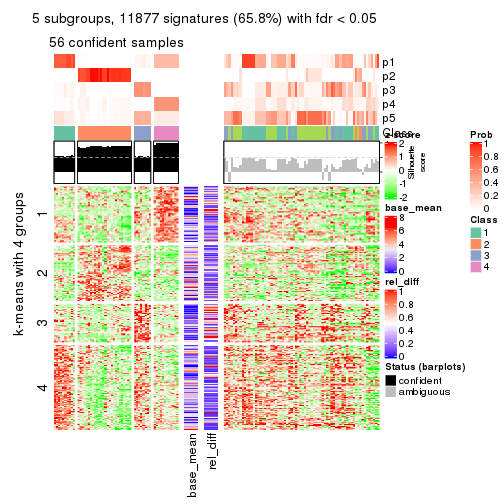</p>

</div>
<div id='tab-SD-hclust-get-signatures-5'>
<pre><code class="r">get_signatures(res, k = 6)
</code></pre>

<p></p>

</div>
</div>


Signature heatmaps where rows are not scaled:


<script>
$( function() {
	$( '#tabs-SD-hclust-get-signatures-no-scale' ).tabs();
} );
</script>
<div id='tabs-SD-hclust-get-signatures-no-scale'>
<ul>
<li><a href='#tab-SD-hclust-get-signatures-no-scale-1'>k = 2</a></li>
<li><a href='#tab-SD-hclust-get-signatures-no-scale-2'>k = 3</a></li>
<li><a href='#tab-SD-hclust-get-signatures-no-scale-3'>k = 4</a></li>
<li><a href='#tab-SD-hclust-get-signatures-no-scale-4'>k = 5</a></li>
<li><a href='#tab-SD-hclust-get-signatures-no-scale-5'>k = 6</a></li>
</ul>
<div id='tab-SD-hclust-get-signatures-no-scale-1'>
<pre><code class="r">get_signatures(res, k = 2, scale_rows = FALSE)
</code></pre>

<p></p>

</div>
<div id='tab-SD-hclust-get-signatures-no-scale-2'>
<pre><code class="r">get_signatures(res, k = 3, scale_rows = FALSE)
</code></pre>

<p>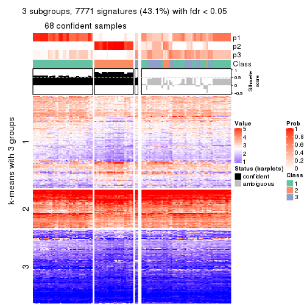</p>

</div>
<div id='tab-SD-hclust-get-signatures-no-scale-3'>
<pre><code class="r">get_signatures(res, k = 4, scale_rows = FALSE)
</code></pre>

<p></p>

</div>
<div id='tab-SD-hclust-get-signatures-no-scale-4'>
<pre><code class="r">get_signatures(res, k = 5, scale_rows = FALSE)
</code></pre>

<p></p>

</div>
<div id='tab-SD-hclust-get-signatures-no-scale-5'>
<pre><code class="r">get_signatures(res, k = 6, scale_rows = FALSE)
</code></pre>

<p></p>

</div>
</div>


Compare the overlap of signatures from different k:

```r
compare_signatures(res)
```


`get_signature()` returns a data frame invisibly. TO get the list of signatures, the function
call should be assigned to a variable explicitly. In following code, if `plot` argument is set
to `FALSE`, no heatmap is plotted while only the differential analysis is performed.

```r
# code only for demonstration
tb = get_signature(res, k = ..., plot = FALSE)
```

An example of the output of `tb` is:

```
#>   which_row         fdr    mean_1    mean_2 scaled_mean_1 scaled_mean_2 km
#> 1        38 0.042760348  8.373488  9.131774    -0.5533452     0.5164555  1
#> 2        40 0.018707592  7.106213  8.469186    -0.6173731     0.5762149  1
#> 3        55 0.019134737 10.221463 11.207825    -0.6159697     0.5749050  1
#> 4        59 0.006059896  5.921854  7.869574    -0.6899429     0.6439467  1
#> 5        60 0.018055526  8.928898 10.211722    -0.6204761     0.5791110  1
#> 6        98 0.009384629 15.714769 14.887706     0.6635654    -0.6193277  2
...
```

The columns in `tb` are:

1. `which_row`: row indices corresponding to the input matrix.
2. `fdr`: FDR for the differential test. 
3. `mean_x`: The mean value in group x.
4. `scaled_mean_x`: The mean value in group x after rows are scaled.
5. `km`: Row groups if k-means clustering is applied to rows.


UMAP plot which shows how samples are separated.


<script>
$( function() {
	$( '#tabs-SD-hclust-dimension-reduction' ).tabs();
} );
</script>
<div id='tabs-SD-hclust-dimension-reduction'>
<ul>
<li><a href='#tab-SD-hclust-dimension-reduction-1'>k = 2</a></li>
<li><a href='#tab-SD-hclust-dimension-reduction-2'>k = 3</a></li>
<li><a href='#tab-SD-hclust-dimension-reduction-3'>k = 4</a></li>
<li><a href='#tab-SD-hclust-dimension-reduction-4'>k = 5</a></li>
<li><a href='#tab-SD-hclust-dimension-reduction-5'>k = 6</a></li>
</ul>
<div id='tab-SD-hclust-dimension-reduction-1'>
<pre><code class="r">dimension_reduction(res, k = 2, method = &quot;UMAP&quot;)
</code></pre>

<p></p>

</div>
<div id='tab-SD-hclust-dimension-reduction-2'>
<pre><code class="r">dimension_reduction(res, k = 3, method = &quot;UMAP&quot;)
</code></pre>

<p></p>

</div>
<div id='tab-SD-hclust-dimension-reduction-3'>
<pre><code class="r">dimension_reduction(res, k = 4, method = &quot;UMAP&quot;)
</code></pre>

<p></p>

</div>
<div id='tab-SD-hclust-dimension-reduction-4'>
<pre><code class="r">dimension_reduction(res, k = 5, method = &quot;UMAP&quot;)
</code></pre>

<p></p>

</div>
<div id='tab-SD-hclust-dimension-reduction-5'>
<pre><code class="r">dimension_reduction(res, k = 6, method = &quot;UMAP&quot;)
</code></pre>

<p></p>

</div>
</div>


Following heatmap shows how subgroups are split when increasing `k`:

```r
collect_classes(res)
```


If matrix rows can be associated to genes, consider to use `GO_Enrichment(res,
...)` to perform function enrichment for the signature genes.


 

---------------------------------------------------


### SD:kmeans**


The object with results only for a single top-value method and a single partition method 
can be extracted as:

```r
res = res_list["SD", "kmeans"]
# you can also extract it by
# res = res_list["SD:kmeans"]
```

A summary of `res` and all the functions that can be applied to it:

```r
res
```

```
#> A 'ConsensusPartition' object with k = 2, 3, 4, 5, 6.
#>   On a matrix with 18041 rows and 126 columns.
#>   Top rows (1000, 2000, 3000, 4000, 5000) are extracted by 'SD' method.
#>   Subgroups are detected by 'kmeans' method.
#>   Performed in total 1250 partitions by row resampling.
#>   Best k for subgroups seems to be 2.
#> 
#> Following methods can be applied to this 'ConsensusPartition' object:
#>  [1] "cola_report"             "collect_classes"         "collect_plots"          
#>  [4] "collect_stats"           "colnames"                "compare_signatures"     
#>  [7] "consensus_heatmap"       "dimension_reduction"     "functional_enrichment"  
#> [10] "get_anno_col"            "get_anno"                "get_classes"            
#> [13] "get_consensus"           "get_matrix"              "get_membership"         
#> [16] "get_param"               "get_signatures"          "get_stats"              
#> [19] "is_best_k"               "is_stable_k"             "membership_heatmap"     
#> [22] "ncol"                    "nrow"                    "plot_ecdf"              
#> [25] "rownames"                "select_partition_number" "show"                   
#> [28] "suggest_best_k"          "test_to_known_factors"
```

`collect_plots()` function collects all the plots made from `res` for all `k` (number of partitions)
into one single page to provide an easy and fast comparison between different `k`.

```r
collect_plots(res)
```


The plots are:

- The first row: a plot of the ECDF (Empirical cumulative distribution
  function) curves of the consensus matrix for each `k` and the heatmap of
  predicted classes for each `k`.
- The second row: heatmaps of the consensus matrix for each `k`.
- The third row: heatmaps of the membership matrix for each `k`.
- The fouth row: heatmaps of the signatures for each `k`.

All the plots in panels can be made by individual functions and they are
plotted later in this section.

`select_partition_number()` produces several plots showing different
statistics for choosing "optimized" `k`. There are following statistics:

- ECDF curves of the consensus matrix for each `k`;
- 1-PAC. [The PAC
  score](https://en.wikipedia.org/wiki/Consensus_clustering#Over-interpretation_potential_of_consensus_clustering)
  measures the proportion of the ambiguous subgrouping.
- Mean silhouette score.
- Concordance. The mean probability of fiting the consensus class ids in all
  partitions.
- Area increased. Denote $A_k$ as the area under the ECDF curve for current
  `k`, the area increased is defined as $A_k - A_{k-1}$.
- Rand index. The percent of pairs of samples that are both in a same cluster
  or both are not in a same cluster in the partition of k and k-1.
- Jaccard index. The ratio of pairs of samples are both in a same cluster in
  the partition of k and k-1 and the pairs of samples are both in a same
  cluster in the partition k or k-1.

The detailed explanations of these statistics can be found in [the cola
vignette](http://bioconductor.org/packages/devel/bioc/vignettes/cola/inst/doc/cola.html#toc_13).

Generally speaking, lower PAC score, higher mean silhouette score or higher
concordance corresponds to better partition. Rand index and Jaccard index
measure how similar the current partition is compared to partition with `k-1`.
If they are too similar, we won't accept `k` is better than `k-1`.

```r
select_partition_number(res)
```


The numeric values for all these statistics can be obtained by `get_stats()`.

```r
get_stats(res)
```

```
#>   k 1-PAC mean_silhouette concordance area_increased  Rand Jaccard
#> 2 2 0.983           0.953       0.972         0.4762 0.521   0.521
#> 3 3 0.468           0.625       0.776         0.3470 0.704   0.485
#> 4 4 0.538           0.586       0.746         0.1287 0.813   0.530
#> 5 5 0.601           0.620       0.706         0.0789 0.863   0.563
#> 6 6 0.705           0.680       0.771         0.0484 0.946   0.757
```

`suggest_best_k()` suggests the best $k$ based on these statistics. The rules are as follows:

- All $k$ with Jaccard index larger than 0.95 are removed because the increase of
  the partition number does not provides enough extra information. If all $k$ are removed,
  the best $k$ is assigned by `NA`.
- For $k$ with 1-PAC larger than 0.9, the maximal $k$ is taken as the "best k". Other $k$ is called "optional k".
- If it does not fit the second rule. The $k$ with the highest vote of highest
  1-PAC, mean silhouette and concordance is taken as the "best k".

```r
suggest_best_k(res)
```

```
#> [1] 2
```


Following shows the table of the partitions (You need to click the **show/hide
code output** link to see it). The membership matrix (columns with name `p*`)
is inferred by
[`clue::cl_consensus()`](https://www.rdocumentation.org/link/cl_consensus?package=clue)
function with the `SE` method. Basically the value in the membership matrix
represents the probability to belong to a certain group. The finall class
label for an item is determined with the group with highest probability it
belongs to.

In `get_classes()` function, the entropy is calculated from the membership
matrix and the silhouette score is calculated from the consensus matrix.


<script>
$( function() {
	$( '#tabs-SD-kmeans-get-classes' ).tabs();
} );
</script>
<div id='tabs-SD-kmeans-get-classes'>
<ul>
<li><a href='#tab-SD-kmeans-get-classes-1'>k = 2</a></li>
<li><a href='#tab-SD-kmeans-get-classes-2'>k = 3</a></li>
<li><a href='#tab-SD-kmeans-get-classes-3'>k = 4</a></li>
<li><a href='#tab-SD-kmeans-get-classes-4'>k = 5</a></li>
<li><a href='#tab-SD-kmeans-get-classes-5'>k = 6</a></li>
</ul>

<div id='tab-SD-kmeans-get-classes-1'>
<p><a id='tab-SD-kmeans-get-classes-1-a' style='color:#0366d6' href='#'>show/hide code output</a></p>
<pre><code class="r">cbind(get_classes(res, k = 2), get_membership(res, k = 2))
</code></pre>

<pre><code>#&gt;                                      class entropy silhouette    p1    p2
#&gt; DC1F29A2-39DE-44AD-936A-54B2B32D6370     1  0.0000      0.980 1.000 0.000
#&gt; FA3C3413-FA8C-4A29-B9CA-5BC3A56274A8     2  0.1633      0.961 0.024 0.976
#&gt; B9B72975-8134-475C-BC0B-0CFDB24F636A     2  0.0672      0.963 0.008 0.992
#&gt; F44DB757-4D00-4BFC-99C5-AA82F99C5BDA     2  0.0376      0.962 0.004 0.996
#&gt; 3BD942BB-A3A7-4993-B3F1-B8641626B773     1  0.7056      0.756 0.808 0.192
#&gt; 431F73A2-2AB3-4101-B610-7FC02A7097EC     1  0.2948      0.943 0.948 0.052
#&gt; 3067683D-43D4-4F6D-9338-17F6A75E4B25     2  0.2423      0.954 0.040 0.960
#&gt; 2CE91B81-7CBE-4698-AFEE-6A154313D231     2  0.1633      0.961 0.024 0.976
#&gt; A639CF4F-4591-4337-A12E-BED71EDDA10B     1  0.0376      0.979 0.996 0.004
#&gt; 5482053D-9F48-4773-B68A-302B3A612503     1  0.1184      0.979 0.984 0.016
#&gt; A31D342D-C67C-428B-BAED-C6E844277A09     1  0.0376      0.979 0.996 0.004
#&gt; 0E9C5985-9AE0-4098-A076-6FFBBDF05110     2  0.1184      0.962 0.016 0.984
#&gt; 08CCF8A0-15B7-4A13-BC43-6B3B3E2DDE95     2  0.2603      0.954 0.044 0.956
#&gt; 10577D5B-AD56-403F-A562-73A9ACF2045B     1  0.1414      0.978 0.980 0.020
#&gt; C940D443-5DDA-4403-868B-7AA6B9A50FC4     1  0.0376      0.979 0.996 0.004
#&gt; 89D4D945-A717-495F-B253-F5A17CF5B9FA     2  0.1184      0.959 0.016 0.984
#&gt; DC55EE78-203F-4092-9B83-14B1A529194B     2  0.0672      0.963 0.008 0.992
#&gt; 8F7368BE-EB41-4192-89AA-9E0428C08851     1  0.1414      0.978 0.980 0.020
#&gt; F772EA39-E408-4908-BADD-C786D702BF9B     2  0.0672      0.963 0.008 0.992
#&gt; FD693D10-3ADA-4028-8392-41D2F0296F7E     1  0.1184      0.979 0.984 0.016
#&gt; 84F16966-7640-49F9-95D1-7648FF74DCC9     2  0.0672      0.963 0.008 0.992
#&gt; D26DAA2F-AE6A-42E1-9F1F-01943B99785F     2  0.2603      0.954 0.044 0.956
#&gt; F325847E-F046-4B67-B01C-16919C401020     1  0.0672      0.978 0.992 0.008
#&gt; 19EB2B10-2529-4A94-8FAE-1CE371A602D9     1  0.0376      0.979 0.996 0.004
#&gt; B94B9CCF-5FB8-44AE-8D9C-A194C6801A27     2  0.0672      0.963 0.008 0.992
#&gt; D2678E70-542A-4AB2-B881-12D66DBA44F5     1  0.1184      0.979 0.984 0.016
#&gt; 4961CA2A-70CD-42AB-A676-4A98C85F449F     2  0.2603      0.954 0.044 0.956
#&gt; 5AA74C5C-2AD1-4D59-A030-E964EB199581     1  0.0376      0.979 0.996 0.004
#&gt; F9E11A1B-BD93-438F-9670-6FB7DFF9E910     1  0.0672      0.978 0.992 0.008
#&gt; FB78CA5A-C8B9-42AF-9DAE-799CAB280B2E     1  0.1414      0.978 0.980 0.020
#&gt; A8E48877-F8AB-44DD-A18B-194D87C44931     2  0.2778      0.954 0.048 0.952
#&gt; CA50C495-F37E-4743-867D-FAF2DCC3376A     1  0.0376      0.979 0.996 0.004
#&gt; 37342369-EC22-4904-8CCD-A0DC6BD8D183     2  0.0672      0.963 0.008 0.992
#&gt; 91BA5F90-9174-4533-A050-39A28E34A94D     1  0.1184      0.979 0.984 0.016
#&gt; 5BC371AC-1915-44E9-A114-2963E131EC8D     1  0.0000      0.980 1.000 0.000
#&gt; 74A6C31A-7F21-45AF-A170-18C326D2AE69     1  0.1184      0.979 0.984 0.016
#&gt; 984F27EF-D4D7-4E68-BD64-776FDFC04D07     1  0.1184      0.979 0.984 0.016
#&gt; B05701C5-8C44-4FD1-94C9-FC0255A2EA24     1  0.0376      0.979 0.996 0.004
#&gt; 91E4119C-2CE6-4447-A125-6A4F403A89E6     2  0.2603      0.954 0.044 0.956
#&gt; 1570FCE7-F1B4-4BDF-A398-355EDF030864     2  0.0376      0.962 0.004 0.996
#&gt; 604C06E9-A00E-435E-847A-3992922A5C56     1  0.0376      0.979 0.996 0.004
#&gt; 455C9007-6FF4-4D63-83FA-4915F0331F9A     1  0.1184      0.979 0.984 0.016
#&gt; FB8BD3CF-D2EC-47B6-B67F-65ADC1C3A6A7     2  0.2603      0.954 0.044 0.956
#&gt; 9DC7443A-3C8F-4025-8312-3C98BF28D736     1  0.1184      0.979 0.984 0.016
#&gt; CB207A52-09AC-49D3-8240-5840CDFBB154     1  0.0938      0.980 0.988 0.012
#&gt; 2A335049-AD9F-4B32-92B7-69B04B0CF2BA     1  0.0672      0.978 0.992 0.008
#&gt; 6ACA6293-371E-428D-BBAE-ABFD410C886F     2  0.2778      0.954 0.048 0.952
#&gt; E8929929-73F9-4DB7-ABBA-0852BEFFFF7E     1  0.0376      0.979 0.996 0.004
#&gt; 5E343116-414B-41F2-AAEE-A3225450135A     1  0.0376      0.980 0.996 0.004
#&gt; 0A39073C-157C-48A1-B125-A6A04CB738DA     2  0.2778      0.954 0.048 0.952
#&gt; 300D78E6-1C7E-4114-80EA-9204A6818B9A     1  0.0938      0.980 0.988 0.012
#&gt; DAAF55AA-ED48-4221-9CD6-D1DEB6376017     1  0.1414      0.978 0.980 0.020
#&gt; D76FCF4A-4ACF-41EF-A120-64136D6C845E     1  0.7139      0.755 0.804 0.196
#&gt; AD294665-6F90-459C-90D5-3058F210225D     1  0.0376      0.979 0.996 0.004
#&gt; 92E8AD7A-1084-44C8-BDC0-FE4E47B6143F     2  0.2778      0.936 0.048 0.952
#&gt; 5644A861-3C59-486D-8FBE-4DF6A3B19558     1  0.1184      0.979 0.984 0.016
#&gt; 1BF8AAE7-B771-4CF2-8B1C-D2BEB5E6579E     1  0.1414      0.978 0.980 0.020
#&gt; A54731AE-FC40-407F-8D10-67DDC122237D     2  0.1184      0.961 0.016 0.984
#&gt; 179DC906-5654-4CBA-9C27-C9560B5F12DE     1  0.0000      0.980 1.000 0.000
#&gt; 979B9A2B-2D81-47C3-A553-9B9441CAAE47     1  0.0000      0.980 1.000 0.000
#&gt; D69BD86A-08FB-49DA-9084-2725F6C9195F     1  0.1184      0.979 0.984 0.016
#&gt; 84611033-BCF7-49D7-9B91-DA29B62AC8D3     1  0.0376      0.979 0.996 0.004
#&gt; 8AA1DA3E-8C00-4653-AA33-EA70531C1E50     2  0.0376      0.962 0.004 0.996
#&gt; CEBE9594-0F19-46B4-AF7D-F8DF33E00AFB     1  0.1184      0.979 0.984 0.016
#&gt; C68E82D2-2BD3-41E9-92D7-D4C06E1953B2     1  0.0938      0.974 0.988 0.012
#&gt; B855EF89-1E76-4408-AA65-61A0F0A4F412     2  0.0672      0.963 0.008 0.992
#&gt; 4488EFB3-5B01-41E3-B57E-8E4F607CF448     1  0.0376      0.979 0.996 0.004
#&gt; C2BD8440-CAC6-4FE5-8EBB-5E6AE308D52F     1  0.0376      0.979 0.996 0.004
#&gt; E0E50F10-1FED-41C1-84DB-81A46F25D7E9     1  0.1184      0.979 0.984 0.016
#&gt; EE16D845-31F2-4178-800B-CA2C358841AD     2  0.0376      0.962 0.004 0.996
#&gt; 169828CF-5693-4A46-B5D7-E45CBA9DF317     2  0.0672      0.963 0.008 0.992
#&gt; 51077BA3-AEE0-4BD4-A1B1-1B0A811642A1     1  0.1184      0.979 0.984 0.016
#&gt; D2F4E240-C44C-4CF7-8016-6CACD370D093     1  0.1414      0.978 0.980 0.020
#&gt; 721CDBE6-FC85-4C30-B23E-28407340286F     1  0.0376      0.979 0.996 0.004
#&gt; 392897E4-6009-422C-B461-649F4DDF260C     1  0.0376      0.979 0.996 0.004
#&gt; 617E13D2-6924-45F8-A8DE-BE21B718F822     1  0.1184      0.979 0.984 0.016
#&gt; 5746C00F-9CBB-46B7-83FD-90B2AB3F507B     1  0.0376      0.979 0.996 0.004
#&gt; 982B4344-A223-4D1F-9485-2E56F9FD45C0     2  0.0376      0.962 0.004 0.996
#&gt; E5557F52-015D-49DC-9E23-989FC259976F     1  0.0376      0.979 0.996 0.004
#&gt; F3135F5E-2E90-4923-B634-E994563D17B7     1  0.0376      0.979 0.996 0.004
#&gt; D1ED15A5-9802-4314-B556-E89EB772D1F0     1  0.0938      0.980 0.988 0.012
#&gt; 222B06E3-FCFB-4104-92C3-D73BC31854D4     1  0.1414      0.978 0.980 0.020
#&gt; 4C810FFA-ED07-4F4C-9F81-B8F1CF4956F7     2  0.6148      0.833 0.152 0.848
#&gt; 9A608964-ED12-4E6E-9D3A-430F59FFF65B     1  0.0376      0.979 0.996 0.004
#&gt; 4087357F-C17A-4992-A8AB-41ACA2F72001     1  0.1184      0.979 0.984 0.016
#&gt; B3F013A5-BCB8-4CE0-86B2-634EE180AA6E     2  0.0672      0.963 0.008 0.992
#&gt; 322AF320-1379-4F51-AFDC-5292A060CD52     2  0.0376      0.962 0.004 0.996
#&gt; 53A96249-66D5-4C26-893B-ADC71481D261     2  0.1414      0.960 0.020 0.980
#&gt; 1AB7A6F2-14BD-447C-B2E3-DEB0CE56B209     1  0.1414      0.978 0.980 0.020
#&gt; 8B4BCDA0-6787-4A55-99F7-AAF22AF85BA6     2  0.0000      0.961 0.000 1.000
#&gt; 5D9D9E08-2C2C-414E-9547-62799F90D543     2  0.0672      0.963 0.008 0.992
#&gt; C345CD17-E4F4-41D5-9891-FEFB19342C52     1  0.0672      0.978 0.992 0.008
#&gt; 1AF8FDE1-1A74-41F6-A1C5-4952CDFB7D3F     1  0.0672      0.980 0.992 0.008
#&gt; BC3405FF-0660-4B2B-8DC1-5F34D3133078     1  0.0000      0.980 1.000 0.000
#&gt; C2662596-6E2F-4924-B051-CEA1AC87B197     1  0.1184      0.979 0.984 0.016
#&gt; 39AE85F7-49FB-4438-BD41-6AC812FA1C72     1  0.0000      0.980 1.000 0.000
#&gt; 6FF266DB-3F08-43F2-8F6F-679F805B80B8     2  0.9815      0.295 0.420 0.580
#&gt; B03B7B81-BBD6-4194-BC5E-6EDF0D3F015A     1  0.0000      0.980 1.000 0.000
#&gt; C7617D56-F13C-4C43-906C-BD458C5DC4CD     1  0.1184      0.979 0.984 0.016
#&gt; 09420F8B-7A71-4B32-8388-4767670F1FEB     1  0.1184      0.979 0.984 0.016
#&gt; 6AF47534-74FF-4128-865B-4E8EE1FFB469     2  0.0938      0.960 0.012 0.988
#&gt; 8FF9E94A-2ED2-4727-947F-D524D7ECE815     1  0.1184      0.979 0.984 0.016
#&gt; A390E20D-03F9-40E4-A132-0FA5C2BEDB63     1  0.1184      0.979 0.984 0.016
#&gt; A489CCCA-1374-4071-80CE-05B83C9A0D5E     2  0.1633      0.960 0.024 0.976
#&gt; 2D962371-EC83-490C-A663-478AF383BC1B     2  0.0672      0.963 0.008 0.992
#&gt; D91B31A1-EE71-4726-B94C-0CC2815E9D4E     2  0.8267      0.654 0.260 0.740
#&gt; E0123C5C-E1D1-4162-9895-CC8B01949D84     2  0.2603      0.954 0.044 0.956
#&gt; EC73959A-2728-49FE-B72A-790BB14F4CBF     1  0.1184      0.979 0.984 0.016
#&gt; A60DC925-7343-496E-900D-0DD81D5C8123     2  0.8267      0.654 0.260 0.740
#&gt; 659B64DB-F4A5-43BD-811B-05004CB49D99     1  0.1184      0.979 0.984 0.016
#&gt; 6969B6B2-7616-4664-9696-C4DACD10537B     2  0.0672      0.963 0.008 0.992
#&gt; 2F6392DE-0D54-4768-B062-907C81E5B0CC     1  0.7139      0.755 0.804 0.196
#&gt; C74BE8C5-BA6D-4596-9D67-3C731799F999     1  0.1184      0.979 0.984 0.016
#&gt; 79A7647F-BDBA-45A2-B207-ABF788F6CC95     1  0.0376      0.979 0.996 0.004
#&gt; D47D0433-2313-4A2F-B268-5AD293D7534E     2  0.0376      0.962 0.004 0.996
#&gt; C5058B93-C1DA-43B9-9951-B23A9810AA6E     1  0.6438      0.807 0.836 0.164
#&gt; 2629FEE3-A203-4411-8A70-02A796C9505C     2  0.2603      0.954 0.044 0.956
#&gt; 1AF329E4-11D4-4CFC-801F-C24A1EA33102     2  0.1184      0.962 0.016 0.984
#&gt; D453BEF8-3F18-4B89-BA42-CE74EB105032     1  0.0672      0.978 0.992 0.008
#&gt; B12A4446-2310-4139-897F-CA030478CBD5     1  0.0376      0.979 0.996 0.004
#&gt; BCAB1918-5FA9-4CBD-85CB-008743FEA2CC     1  0.0376      0.979 0.996 0.004
#&gt; 9A5432D3-19EE-47B4-BD88-698DEC75A5E9     2  0.0672      0.963 0.008 0.992
#&gt; A608BCEB-2C27-4927-A308-E6975F641722     2  0.1184      0.962 0.016 0.984
#&gt; E4752275-7BF6-4C1E-8A45-C7D571ED85AD     2  0.0672      0.963 0.008 0.992
#&gt; FDEC1714-C02D-4AB7-AE82-789E9D709EDE     1  0.0000      0.980 1.000 0.000
#&gt; 33737781-8638-4FA2-AD4C-E888BB9343D8     2  0.2603      0.954 0.044 0.956
</code></pre>

<script>
$('#tab-SD-kmeans-get-classes-1-a').parent().next().next().hide();
$('#tab-SD-kmeans-get-classes-1-a').click(function(){
  $('#tab-SD-kmeans-get-classes-1-a').parent().next().next().toggle();
  return(false);
});
</script>
</div>

<div id='tab-SD-kmeans-get-classes-2'>
<p><a id='tab-SD-kmeans-get-classes-2-a' style='color:#0366d6' href='#'>show/hide code output</a></p>
<pre><code class="r">cbind(get_classes(res, k = 3), get_membership(res, k = 3))
</code></pre>

<pre><code>#&gt;                                      class entropy silhouette    p1    p2    p3
#&gt; DC1F29A2-39DE-44AD-936A-54B2B32D6370     3  0.6274    -0.1787 0.456 0.000 0.544
#&gt; FA3C3413-FA8C-4A29-B9CA-5BC3A56274A8     2  0.4887     0.7207 0.000 0.772 0.228
#&gt; B9B72975-8134-475C-BC0B-0CFDB24F636A     2  0.0000     0.8830 0.000 1.000 0.000
#&gt; F44DB757-4D00-4BFC-99C5-AA82F99C5BDA     2  0.1989     0.8543 0.048 0.948 0.004
#&gt; 3BD942BB-A3A7-4993-B3F1-B8641626B773     3  0.6597     0.3985 0.312 0.024 0.664
#&gt; 431F73A2-2AB3-4101-B610-7FC02A7097EC     3  0.1964     0.6664 0.056 0.000 0.944
#&gt; 3067683D-43D4-4F6D-9338-17F6A75E4B25     3  0.6318     0.5473 0.068 0.172 0.760
#&gt; 2CE91B81-7CBE-4698-AFEE-6A154313D231     2  0.4702     0.7372 0.000 0.788 0.212
#&gt; A639CF4F-4591-4337-A12E-BED71EDDA10B     3  0.0747     0.6828 0.016 0.000 0.984
#&gt; 5482053D-9F48-4773-B68A-302B3A612503     1  0.5465     0.7493 0.712 0.000 0.288
#&gt; A31D342D-C67C-428B-BAED-C6E844277A09     3  0.3941     0.5849 0.156 0.000 0.844
#&gt; 0E9C5985-9AE0-4098-A076-6FFBBDF05110     2  0.3983     0.8284 0.068 0.884 0.048
#&gt; 08CCF8A0-15B7-4A13-BC43-6B3B3E2DDE95     3  0.5216     0.4427 0.000 0.260 0.740
#&gt; 10577D5B-AD56-403F-A562-73A9ACF2045B     1  0.4178     0.7781 0.828 0.000 0.172
#&gt; C940D443-5DDA-4403-868B-7AA6B9A50FC4     3  0.0747     0.6828 0.016 0.000 0.984
#&gt; 89D4D945-A717-495F-B253-F5A17CF5B9FA     2  0.5201     0.7070 0.004 0.760 0.236
#&gt; DC55EE78-203F-4092-9B83-14B1A529194B     2  0.0000     0.8830 0.000 1.000 0.000
#&gt; 8F7368BE-EB41-4192-89AA-9E0428C08851     1  0.4235     0.7791 0.824 0.000 0.176
#&gt; F772EA39-E408-4908-BADD-C786D702BF9B     2  0.0000     0.8830 0.000 1.000 0.000
#&gt; FD693D10-3ADA-4028-8392-41D2F0296F7E     1  0.2796     0.7599 0.908 0.000 0.092
#&gt; 84F16966-7640-49F9-95D1-7648FF74DCC9     2  0.0000     0.8830 0.000 1.000 0.000
#&gt; D26DAA2F-AE6A-42E1-9F1F-01943B99785F     3  0.5327     0.4217 0.000 0.272 0.728
#&gt; F325847E-F046-4B67-B01C-16919C401020     3  0.2448     0.6557 0.076 0.000 0.924
#&gt; 19EB2B10-2529-4A94-8FAE-1CE371A602D9     3  0.2796     0.6431 0.092 0.000 0.908
#&gt; B94B9CCF-5FB8-44AE-8D9C-A194C6801A27     2  0.0000     0.8830 0.000 1.000 0.000
#&gt; D2678E70-542A-4AB2-B881-12D66DBA44F5     1  0.2796     0.7599 0.908 0.000 0.092
#&gt; 4961CA2A-70CD-42AB-A676-4A98C85F449F     3  0.2537     0.6561 0.000 0.080 0.920
#&gt; 5AA74C5C-2AD1-4D59-A030-E964EB199581     1  0.5650     0.6434 0.688 0.000 0.312
#&gt; F9E11A1B-BD93-438F-9670-6FB7DFF9E910     3  0.5327     0.5095 0.272 0.000 0.728
#&gt; FB78CA5A-C8B9-42AF-9DAE-799CAB280B2E     1  0.4235     0.7779 0.824 0.000 0.176
#&gt; A8E48877-F8AB-44DD-A18B-194D87C44931     2  0.6235     0.3534 0.000 0.564 0.436
#&gt; CA50C495-F37E-4743-867D-FAF2DCC3376A     3  0.0000     0.6801 0.000 0.000 1.000
#&gt; 37342369-EC22-4904-8CCD-A0DC6BD8D183     2  0.0237     0.8812 0.000 0.996 0.004
#&gt; 91BA5F90-9174-4533-A050-39A28E34A94D     1  0.5465     0.7493 0.712 0.000 0.288
#&gt; 5BC371AC-1915-44E9-A114-2963E131EC8D     1  0.6309     0.2786 0.500 0.000 0.500
#&gt; 74A6C31A-7F21-45AF-A170-18C326D2AE69     1  0.4452     0.7931 0.808 0.000 0.192
#&gt; 984F27EF-D4D7-4E68-BD64-776FDFC04D07     1  0.2796     0.7599 0.908 0.000 0.092
#&gt; B05701C5-8C44-4FD1-94C9-FC0255A2EA24     3  0.0747     0.6828 0.016 0.000 0.984
#&gt; 91E4119C-2CE6-4447-A125-6A4F403A89E6     3  0.4750     0.5184 0.000 0.216 0.784
#&gt; 1570FCE7-F1B4-4BDF-A398-355EDF030864     2  0.0000     0.8830 0.000 1.000 0.000
#&gt; 604C06E9-A00E-435E-847A-3992922A5C56     3  0.0747     0.6828 0.016 0.000 0.984
#&gt; 455C9007-6FF4-4D63-83FA-4915F0331F9A     1  0.2796     0.7599 0.908 0.000 0.092
#&gt; FB8BD3CF-D2EC-47B6-B67F-65ADC1C3A6A7     3  0.5327     0.4192 0.000 0.272 0.728
#&gt; 9DC7443A-3C8F-4025-8312-3C98BF28D736     1  0.2796     0.7599 0.908 0.000 0.092
#&gt; CB207A52-09AC-49D3-8240-5840CDFBB154     1  0.5678     0.7011 0.684 0.000 0.316
#&gt; 2A335049-AD9F-4B32-92B7-69B04B0CF2BA     3  0.5905     0.3719 0.352 0.000 0.648
#&gt; 6ACA6293-371E-428D-BBAE-ABFD410C886F     2  0.6235     0.3534 0.000 0.564 0.436
#&gt; E8929929-73F9-4DB7-ABBA-0852BEFFFF7E     3  0.0592     0.6820 0.012 0.000 0.988
#&gt; 5E343116-414B-41F2-AAEE-A3225450135A     3  0.5988     0.1688 0.368 0.000 0.632
#&gt; 0A39073C-157C-48A1-B125-A6A04CB738DA     3  0.6045     0.2132 0.000 0.380 0.620
#&gt; 300D78E6-1C7E-4114-80EA-9204A6818B9A     1  0.5560     0.6480 0.700 0.000 0.300
#&gt; DAAF55AA-ED48-4221-9CD6-D1DEB6376017     1  0.3340     0.7822 0.880 0.000 0.120
#&gt; D76FCF4A-4ACF-41EF-A120-64136D6C845E     3  0.6750     0.4259 0.336 0.024 0.640
#&gt; AD294665-6F90-459C-90D5-3058F210225D     1  0.5810     0.5725 0.664 0.000 0.336
#&gt; 92E8AD7A-1084-44C8-BDC0-FE4E47B6143F     2  0.4811     0.7610 0.148 0.828 0.024
#&gt; 5644A861-3C59-486D-8FBE-4DF6A3B19558     1  0.4504     0.7927 0.804 0.000 0.196
#&gt; 1BF8AAE7-B771-4CF2-8B1C-D2BEB5E6579E     1  0.0892     0.7286 0.980 0.000 0.020
#&gt; A54731AE-FC40-407F-8D10-67DDC122237D     2  0.0000     0.8830 0.000 1.000 0.000
#&gt; 179DC906-5654-4CBA-9C27-C9560B5F12DE     3  0.6295    -0.1183 0.472 0.000 0.528
#&gt; 979B9A2B-2D81-47C3-A553-9B9441CAAE47     3  0.6309    -0.3015 0.500 0.000 0.500
#&gt; D69BD86A-08FB-49DA-9084-2725F6C9195F     1  0.5465     0.7493 0.712 0.000 0.288
#&gt; 84611033-BCF7-49D7-9B91-DA29B62AC8D3     3  0.5098     0.5439 0.248 0.000 0.752
#&gt; 8AA1DA3E-8C00-4653-AA33-EA70531C1E50     2  0.0000     0.8830 0.000 1.000 0.000
#&gt; CEBE9594-0F19-46B4-AF7D-F8DF33E00AFB     1  0.4235     0.7811 0.824 0.000 0.176
#&gt; C68E82D2-2BD3-41E9-92D7-D4C06E1953B2     3  0.5650     0.3930 0.312 0.000 0.688
#&gt; B855EF89-1E76-4408-AA65-61A0F0A4F412     2  0.0000     0.8830 0.000 1.000 0.000
#&gt; 4488EFB3-5B01-41E3-B57E-8E4F607CF448     1  0.5859     0.5587 0.656 0.000 0.344
#&gt; C2BD8440-CAC6-4FE5-8EBB-5E6AE308D52F     3  0.4504     0.5397 0.196 0.000 0.804
#&gt; E0E50F10-1FED-41C1-84DB-81A46F25D7E9     1  0.2796     0.7599 0.908 0.000 0.092
#&gt; EE16D845-31F2-4178-800B-CA2C358841AD     2  0.0000     0.8830 0.000 1.000 0.000
#&gt; 169828CF-5693-4A46-B5D7-E45CBA9DF317     2  0.0000     0.8830 0.000 1.000 0.000
#&gt; 51077BA3-AEE0-4BD4-A1B1-1B0A811642A1     1  0.4504     0.7927 0.804 0.000 0.196
#&gt; D2F4E240-C44C-4CF7-8016-6CACD370D093     1  0.4346     0.7732 0.816 0.000 0.184
#&gt; 721CDBE6-FC85-4C30-B23E-28407340286F     3  0.0747     0.6828 0.016 0.000 0.984
#&gt; 392897E4-6009-422C-B461-649F4DDF260C     3  0.0892     0.6818 0.020 0.000 0.980
#&gt; 617E13D2-6924-45F8-A8DE-BE21B718F822     1  0.2796     0.7599 0.908 0.000 0.092
#&gt; 5746C00F-9CBB-46B7-83FD-90B2AB3F507B     1  0.6180     0.3997 0.584 0.000 0.416
#&gt; 982B4344-A223-4D1F-9485-2E56F9FD45C0     2  0.0000     0.8830 0.000 1.000 0.000
#&gt; E5557F52-015D-49DC-9E23-989FC259976F     3  0.1860     0.6691 0.052 0.000 0.948
#&gt; F3135F5E-2E90-4923-B634-E994563D17B7     3  0.0747     0.6828 0.016 0.000 0.984
#&gt; D1ED15A5-9802-4314-B556-E89EB772D1F0     3  0.5678     0.3582 0.316 0.000 0.684
#&gt; 222B06E3-FCFB-4104-92C3-D73BC31854D4     1  0.3482     0.7826 0.872 0.000 0.128
#&gt; 4C810FFA-ED07-4F4C-9F81-B8F1CF4956F7     1  0.5111     0.6828 0.820 0.036 0.144
#&gt; 9A608964-ED12-4E6E-9D3A-430F59FFF65B     3  0.0747     0.6828 0.016 0.000 0.984
#&gt; 4087357F-C17A-4992-A8AB-41ACA2F72001     1  0.2796     0.7599 0.908 0.000 0.092
#&gt; B3F013A5-BCB8-4CE0-86B2-634EE180AA6E     2  0.0000     0.8830 0.000 1.000 0.000
#&gt; 322AF320-1379-4F51-AFDC-5292A060CD52     2  0.0000     0.8830 0.000 1.000 0.000
#&gt; 53A96249-66D5-4C26-893B-ADC71481D261     2  0.4796     0.7275 0.000 0.780 0.220
#&gt; 1AB7A6F2-14BD-447C-B2E3-DEB0CE56B209     1  0.4235     0.7779 0.824 0.000 0.176
#&gt; 8B4BCDA0-6787-4A55-99F7-AAF22AF85BA6     2  0.0000     0.8830 0.000 1.000 0.000
#&gt; 5D9D9E08-2C2C-414E-9547-62799F90D543     2  0.0000     0.8830 0.000 1.000 0.000
#&gt; C345CD17-E4F4-41D5-9891-FEFB19342C52     3  0.5733     0.4256 0.324 0.000 0.676
#&gt; 1AF8FDE1-1A74-41F6-A1C5-4952CDFB7D3F     1  0.5560     0.6480 0.700 0.000 0.300
#&gt; BC3405FF-0660-4B2B-8DC1-5F34D3133078     3  0.6111     0.0916 0.396 0.000 0.604
#&gt; C2662596-6E2F-4924-B051-CEA1AC87B197     1  0.5098     0.7783 0.752 0.000 0.248
#&gt; 39AE85F7-49FB-4438-BD41-6AC812FA1C72     3  0.6309    -0.2958 0.496 0.000 0.504
#&gt; 6FF266DB-3F08-43F2-8F6F-679F805B80B8     3  0.9488     0.2838 0.248 0.256 0.496
#&gt; B03B7B81-BBD6-4194-BC5E-6EDF0D3F015A     3  0.6140     0.0606 0.404 0.000 0.596
#&gt; C7617D56-F13C-4C43-906C-BD458C5DC4CD     1  0.6302     0.3864 0.520 0.000 0.480
#&gt; 09420F8B-7A71-4B32-8388-4767670F1FEB     1  0.5465     0.7493 0.712 0.000 0.288
#&gt; 6AF47534-74FF-4128-865B-4E8EE1FFB469     2  0.0000     0.8830 0.000 1.000 0.000
#&gt; 8FF9E94A-2ED2-4727-947F-D524D7ECE815     1  0.3340     0.7823 0.880 0.000 0.120
#&gt; A390E20D-03F9-40E4-A132-0FA5C2BEDB63     1  0.2796     0.7599 0.908 0.000 0.092
#&gt; A489CCCA-1374-4071-80CE-05B83C9A0D5E     2  0.6180     0.4051 0.000 0.584 0.416
#&gt; 2D962371-EC83-490C-A663-478AF383BC1B     2  0.0000     0.8830 0.000 1.000 0.000
#&gt; D91B31A1-EE71-4726-B94C-0CC2815E9D4E     2  0.6601     0.5551 0.296 0.676 0.028
#&gt; E0123C5C-E1D1-4162-9895-CC8B01949D84     3  0.5327     0.4189 0.000 0.272 0.728
#&gt; EC73959A-2728-49FE-B72A-790BB14F4CBF     1  0.4504     0.7927 0.804 0.000 0.196
#&gt; A60DC925-7343-496E-900D-0DD81D5C8123     2  0.6497     0.5064 0.336 0.648 0.016
#&gt; 659B64DB-F4A5-43BD-811B-05004CB49D99     1  0.5397     0.7568 0.720 0.000 0.280
#&gt; 6969B6B2-7616-4664-9696-C4DACD10537B     2  0.0424     0.8793 0.000 0.992 0.008
#&gt; 2F6392DE-0D54-4768-B062-907C81E5B0CC     3  0.6726     0.2969 0.332 0.024 0.644
#&gt; C74BE8C5-BA6D-4596-9D67-3C731799F999     1  0.2796     0.7599 0.908 0.000 0.092
#&gt; 79A7647F-BDBA-45A2-B207-ABF788F6CC95     3  0.2165     0.6623 0.064 0.000 0.936
#&gt; D47D0433-2313-4A2F-B268-5AD293D7534E     2  0.0000     0.8830 0.000 1.000 0.000
#&gt; C5058B93-C1DA-43B9-9951-B23A9810AA6E     3  0.7072     0.0146 0.476 0.020 0.504
#&gt; 2629FEE3-A203-4411-8A70-02A796C9505C     3  0.4931     0.4909 0.000 0.232 0.768
#&gt; 1AF329E4-11D4-4CFC-801F-C24A1EA33102     2  0.2301     0.8524 0.004 0.936 0.060
#&gt; D453BEF8-3F18-4B89-BA42-CE74EB105032     3  0.3752     0.6267 0.144 0.000 0.856
#&gt; B12A4446-2310-4139-897F-CA030478CBD5     3  0.0747     0.6828 0.016 0.000 0.984
#&gt; BCAB1918-5FA9-4CBD-85CB-008743FEA2CC     3  0.0747     0.6828 0.016 0.000 0.984
#&gt; 9A5432D3-19EE-47B4-BD88-698DEC75A5E9     2  0.4750     0.7339 0.000 0.784 0.216
#&gt; A608BCEB-2C27-4927-A308-E6975F641722     2  0.0237     0.8815 0.000 0.996 0.004
#&gt; E4752275-7BF6-4C1E-8A45-C7D571ED85AD     2  0.0000     0.8830 0.000 1.000 0.000
#&gt; FDEC1714-C02D-4AB7-AE82-789E9D709EDE     3  0.6309    -0.2881 0.496 0.000 0.504
#&gt; 33737781-8638-4FA2-AD4C-E888BB9343D8     2  0.6305     0.2077 0.000 0.516 0.484
</code></pre>

<script>
$('#tab-SD-kmeans-get-classes-2-a').parent().next().next().hide();
$('#tab-SD-kmeans-get-classes-2-a').click(function(){
  $('#tab-SD-kmeans-get-classes-2-a').parent().next().next().toggle();
  return(false);
});
</script>
</div>

<div id='tab-SD-kmeans-get-classes-3'>
<p><a id='tab-SD-kmeans-get-classes-3-a' style='color:#0366d6' href='#'>show/hide code output</a></p>
<pre><code class="r">cbind(get_classes(res, k = 4), get_membership(res, k = 4))
</code></pre>

<pre><code>#&gt;                                      class entropy silhouette    p1    p2    p3    p4
#&gt; DC1F29A2-39DE-44AD-936A-54B2B32D6370     1  0.6462     0.3755 0.580 0.000 0.332 0.088
#&gt; FA3C3413-FA8C-4A29-B9CA-5BC3A56274A8     2  0.7804     0.3987 0.076 0.512 0.348 0.064
#&gt; B9B72975-8134-475C-BC0B-0CFDB24F636A     2  0.1124     0.8510 0.004 0.972 0.012 0.012
#&gt; F44DB757-4D00-4BFC-99C5-AA82F99C5BDA     2  0.2973     0.8102 0.096 0.884 0.000 0.020
#&gt; 3BD942BB-A3A7-4993-B3F1-B8641626B773     1  0.6617     0.2074 0.532 0.000 0.380 0.088
#&gt; 431F73A2-2AB3-4101-B610-7FC02A7097EC     3  0.4898     0.5969 0.260 0.000 0.716 0.024
#&gt; 3067683D-43D4-4F6D-9338-17F6A75E4B25     3  0.5837     0.5578 0.196 0.032 0.724 0.048
#&gt; 2CE91B81-7CBE-4698-AFEE-6A154313D231     2  0.7454     0.4576 0.060 0.548 0.332 0.060
#&gt; A639CF4F-4591-4337-A12E-BED71EDDA10B     3  0.3088     0.7093 0.128 0.000 0.864 0.008
#&gt; 5482053D-9F48-4773-B68A-302B3A612503     1  0.6369     0.4144 0.572 0.000 0.076 0.352
#&gt; A31D342D-C67C-428B-BAED-C6E844277A09     3  0.4706     0.6014 0.248 0.000 0.732 0.020
#&gt; 0E9C5985-9AE0-4098-A076-6FFBBDF05110     2  0.7819     0.6522 0.188 0.604 0.128 0.080
#&gt; 08CCF8A0-15B7-4A13-BC43-6B3B3E2DDE95     3  0.2522     0.6601 0.012 0.052 0.920 0.016
#&gt; 10577D5B-AD56-403F-A562-73A9ACF2045B     1  0.5172     0.4246 0.704 0.000 0.036 0.260
#&gt; C940D443-5DDA-4403-868B-7AA6B9A50FC4     3  0.3351     0.6977 0.148 0.000 0.844 0.008
#&gt; 89D4D945-A717-495F-B253-F5A17CF5B9FA     2  0.8136     0.4038 0.112 0.496 0.332 0.060
#&gt; DC55EE78-203F-4092-9B83-14B1A529194B     2  0.0188     0.8544 0.000 0.996 0.000 0.004
#&gt; 8F7368BE-EB41-4192-89AA-9E0428C08851     1  0.5343     0.4131 0.656 0.000 0.028 0.316
#&gt; F772EA39-E408-4908-BADD-C786D702BF9B     2  0.0524     0.8536 0.004 0.988 0.000 0.008
#&gt; FD693D10-3ADA-4028-8392-41D2F0296F7E     4  0.2611     0.9771 0.096 0.000 0.008 0.896
#&gt; 84F16966-7640-49F9-95D1-7648FF74DCC9     2  0.0188     0.8544 0.000 0.996 0.000 0.004
#&gt; D26DAA2F-AE6A-42E1-9F1F-01943B99785F     3  0.2761     0.6546 0.016 0.064 0.908 0.012
#&gt; F325847E-F046-4B67-B01C-16919C401020     3  0.4991     0.5332 0.388 0.000 0.608 0.004
#&gt; 19EB2B10-2529-4A94-8FAE-1CE371A602D9     3  0.4328     0.6144 0.244 0.000 0.748 0.008
#&gt; B94B9CCF-5FB8-44AE-8D9C-A194C6801A27     2  0.1256     0.8509 0.008 0.964 0.000 0.028
#&gt; D2678E70-542A-4AB2-B881-12D66DBA44F5     4  0.2611     0.9771 0.096 0.000 0.008 0.896
#&gt; 4961CA2A-70CD-42AB-A676-4A98C85F449F     3  0.1631     0.6761 0.020 0.008 0.956 0.016
#&gt; 5AA74C5C-2AD1-4D59-A030-E964EB199581     1  0.3996     0.5327 0.836 0.000 0.104 0.060
#&gt; F9E11A1B-BD93-438F-9670-6FB7DFF9E910     3  0.5257     0.4142 0.444 0.000 0.548 0.008
#&gt; FB78CA5A-C8B9-42AF-9DAE-799CAB280B2E     1  0.5473     0.4064 0.644 0.000 0.032 0.324
#&gt; A8E48877-F8AB-44DD-A18B-194D87C44931     3  0.8009    -0.1593 0.084 0.408 0.444 0.064
#&gt; CA50C495-F37E-4743-867D-FAF2DCC3376A     3  0.2859     0.7094 0.112 0.000 0.880 0.008
#&gt; 37342369-EC22-4904-8CCD-A0DC6BD8D183     2  0.1388     0.8500 0.012 0.960 0.000 0.028
#&gt; 91BA5F90-9174-4533-A050-39A28E34A94D     1  0.6369     0.4144 0.572 0.000 0.076 0.352
#&gt; 5BC371AC-1915-44E9-A114-2963E131EC8D     1  0.6133     0.5265 0.676 0.000 0.188 0.136
#&gt; 74A6C31A-7F21-45AF-A170-18C326D2AE69     1  0.5873     0.3306 0.548 0.000 0.036 0.416
#&gt; 984F27EF-D4D7-4E68-BD64-776FDFC04D07     4  0.2805     0.9715 0.100 0.000 0.012 0.888
#&gt; B05701C5-8C44-4FD1-94C9-FC0255A2EA24     3  0.3088     0.7093 0.128 0.000 0.864 0.008
#&gt; 91E4119C-2CE6-4447-A125-6A4F403A89E6     3  0.4149     0.6386 0.068 0.048 0.852 0.032
#&gt; 1570FCE7-F1B4-4BDF-A398-355EDF030864     2  0.0524     0.8541 0.004 0.988 0.000 0.008
#&gt; 604C06E9-A00E-435E-847A-3992922A5C56     3  0.3088     0.7093 0.128 0.000 0.864 0.008
#&gt; 455C9007-6FF4-4D63-83FA-4915F0331F9A     4  0.2611     0.9771 0.096 0.000 0.008 0.896
#&gt; FB8BD3CF-D2EC-47B6-B67F-65ADC1C3A6A7     3  0.3102     0.6479 0.016 0.064 0.896 0.024
#&gt; 9DC7443A-3C8F-4025-8312-3C98BF28D736     4  0.2611     0.9771 0.096 0.000 0.008 0.896
#&gt; CB207A52-09AC-49D3-8240-5840CDFBB154     1  0.5321     0.5022 0.716 0.000 0.056 0.228
#&gt; 2A335049-AD9F-4B32-92B7-69B04B0CF2BA     3  0.5776     0.3197 0.468 0.000 0.504 0.028
#&gt; 6ACA6293-371E-428D-BBAE-ABFD410C886F     3  0.8056    -0.1623 0.088 0.408 0.440 0.064
#&gt; E8929929-73F9-4DB7-ABBA-0852BEFFFF7E     3  0.3088     0.7093 0.128 0.000 0.864 0.008
#&gt; 5E343116-414B-41F2-AAEE-A3225450135A     1  0.6739     0.4106 0.576 0.000 0.304 0.120
#&gt; 0A39073C-157C-48A1-B125-A6A04CB738DA     3  0.8313     0.3441 0.216 0.192 0.532 0.060
#&gt; 300D78E6-1C7E-4114-80EA-9204A6818B9A     1  0.3533     0.5287 0.864 0.000 0.056 0.080
#&gt; DAAF55AA-ED48-4221-9CD6-D1DEB6376017     1  0.5400     0.3585 0.608 0.000 0.020 0.372
#&gt; D76FCF4A-4ACF-41EF-A120-64136D6C845E     1  0.6413     0.0122 0.516 0.000 0.416 0.068
#&gt; AD294665-6F90-459C-90D5-3058F210225D     1  0.4171     0.5291 0.828 0.000 0.088 0.084
#&gt; 92E8AD7A-1084-44C8-BDC0-FE4E47B6143F     2  0.5021     0.6849 0.240 0.724 0.000 0.036
#&gt; 5644A861-3C59-486D-8FBE-4DF6A3B19558     1  0.5942     0.3354 0.548 0.000 0.040 0.412
#&gt; 1BF8AAE7-B771-4CF2-8B1C-D2BEB5E6579E     4  0.3569     0.8171 0.196 0.000 0.000 0.804
#&gt; A54731AE-FC40-407F-8D10-67DDC122237D     2  0.3605     0.8093 0.004 0.864 0.088 0.044
#&gt; 179DC906-5654-4CBA-9C27-C9560B5F12DE     1  0.5565     0.4340 0.700 0.000 0.232 0.068
#&gt; 979B9A2B-2D81-47C3-A553-9B9441CAAE47     1  0.6240     0.5193 0.664 0.000 0.200 0.136
#&gt; D69BD86A-08FB-49DA-9084-2725F6C9195F     1  0.6369     0.4144 0.572 0.000 0.076 0.352
#&gt; 84611033-BCF7-49D7-9B91-DA29B62AC8D3     3  0.5731     0.4085 0.428 0.000 0.544 0.028
#&gt; 8AA1DA3E-8C00-4653-AA33-EA70531C1E50     2  0.1042     0.8518 0.008 0.972 0.000 0.020
#&gt; CEBE9594-0F19-46B4-AF7D-F8DF33E00AFB     1  0.5742     0.3899 0.596 0.000 0.036 0.368
#&gt; C68E82D2-2BD3-41E9-92D7-D4C06E1953B2     1  0.6586     0.2111 0.544 0.000 0.368 0.088
#&gt; B855EF89-1E76-4408-AA65-61A0F0A4F412     2  0.0524     0.8536 0.004 0.988 0.000 0.008
#&gt; 4488EFB3-5B01-41E3-B57E-8E4F607CF448     1  0.4036     0.5278 0.836 0.000 0.088 0.076
#&gt; C2BD8440-CAC6-4FE5-8EBB-5E6AE308D52F     3  0.5038     0.5359 0.296 0.000 0.684 0.020
#&gt; E0E50F10-1FED-41C1-84DB-81A46F25D7E9     4  0.2805     0.9715 0.100 0.000 0.012 0.888
#&gt; EE16D845-31F2-4178-800B-CA2C358841AD     2  0.1042     0.8518 0.008 0.972 0.000 0.020
#&gt; 169828CF-5693-4A46-B5D7-E45CBA9DF317     2  0.0524     0.8536 0.004 0.988 0.000 0.008
#&gt; 51077BA3-AEE0-4BD4-A1B1-1B0A811642A1     1  0.5942     0.3354 0.548 0.000 0.040 0.412
#&gt; D2F4E240-C44C-4CF7-8016-6CACD370D093     1  0.5083     0.4306 0.716 0.000 0.036 0.248
#&gt; 721CDBE6-FC85-4C30-B23E-28407340286F     3  0.2198     0.7061 0.072 0.000 0.920 0.008
#&gt; 392897E4-6009-422C-B461-649F4DDF260C     3  0.2799     0.7103 0.108 0.000 0.884 0.008
#&gt; 617E13D2-6924-45F8-A8DE-BE21B718F822     4  0.2611     0.9771 0.096 0.000 0.008 0.896
#&gt; 5746C00F-9CBB-46B7-83FD-90B2AB3F507B     1  0.3934     0.5181 0.836 0.000 0.116 0.048
#&gt; 982B4344-A223-4D1F-9485-2E56F9FD45C0     2  0.0524     0.8541 0.004 0.988 0.000 0.008
#&gt; E5557F52-015D-49DC-9E23-989FC259976F     3  0.3591     0.6840 0.168 0.000 0.824 0.008
#&gt; F3135F5E-2E90-4923-B634-E994563D17B7     3  0.3088     0.7093 0.128 0.000 0.864 0.008
#&gt; D1ED15A5-9802-4314-B556-E89EB772D1F0     3  0.6532     0.2943 0.336 0.000 0.572 0.092
#&gt; 222B06E3-FCFB-4104-92C3-D73BC31854D4     1  0.5467     0.3768 0.612 0.000 0.024 0.364
#&gt; 4C810FFA-ED07-4F4C-9F81-B8F1CF4956F7     4  0.3067     0.9351 0.084 0.004 0.024 0.888
#&gt; 9A608964-ED12-4E6E-9D3A-430F59FFF65B     3  0.3088     0.7093 0.128 0.000 0.864 0.008
#&gt; 4087357F-C17A-4992-A8AB-41ACA2F72001     4  0.2741     0.9755 0.096 0.000 0.012 0.892
#&gt; B3F013A5-BCB8-4CE0-86B2-634EE180AA6E     2  0.0524     0.8541 0.004 0.988 0.000 0.008
#&gt; 322AF320-1379-4F51-AFDC-5292A060CD52     2  0.4057     0.7910 0.008 0.836 0.120 0.036
#&gt; 53A96249-66D5-4C26-893B-ADC71481D261     2  0.6383     0.5212 0.016 0.600 0.336 0.048
#&gt; 1AB7A6F2-14BD-447C-B2E3-DEB0CE56B209     1  0.5473     0.4064 0.644 0.000 0.032 0.324
#&gt; 8B4BCDA0-6787-4A55-99F7-AAF22AF85BA6     2  0.0524     0.8541 0.004 0.988 0.000 0.008
#&gt; 5D9D9E08-2C2C-414E-9547-62799F90D543     2  0.1256     0.8509 0.008 0.964 0.000 0.028
#&gt; C345CD17-E4F4-41D5-9891-FEFB19342C52     3  0.5399     0.3652 0.468 0.000 0.520 0.012
#&gt; 1AF8FDE1-1A74-41F6-A1C5-4952CDFB7D3F     1  0.3533     0.5287 0.864 0.000 0.056 0.080
#&gt; BC3405FF-0660-4B2B-8DC1-5F34D3133078     1  0.6819     0.3008 0.540 0.000 0.348 0.112
#&gt; C2662596-6E2F-4924-B051-CEA1AC87B197     1  0.6123     0.3988 0.572 0.000 0.056 0.372
#&gt; 39AE85F7-49FB-4438-BD41-6AC812FA1C72     1  0.6181     0.5177 0.668 0.000 0.204 0.128
#&gt; 6FF266DB-3F08-43F2-8F6F-679F805B80B8     1  0.9252     0.1637 0.376 0.172 0.340 0.112
#&gt; B03B7B81-BBD6-4194-BC5E-6EDF0D3F015A     1  0.6746     0.3091 0.552 0.000 0.340 0.108
#&gt; C7617D56-F13C-4C43-906C-BD458C5DC4CD     1  0.6063     0.5228 0.680 0.000 0.196 0.124
#&gt; 09420F8B-7A71-4B32-8388-4767670F1FEB     1  0.6369     0.4144 0.572 0.000 0.076 0.352
#&gt; 6AF47534-74FF-4128-865B-4E8EE1FFB469     2  0.3605     0.8093 0.004 0.864 0.088 0.044
#&gt; 8FF9E94A-2ED2-4727-947F-D524D7ECE815     1  0.5660     0.3488 0.576 0.000 0.028 0.396
#&gt; A390E20D-03F9-40E4-A132-0FA5C2BEDB63     4  0.2611     0.9771 0.096 0.000 0.008 0.896
#&gt; A489CCCA-1374-4071-80CE-05B83C9A0D5E     3  0.7750    -0.1544 0.064 0.412 0.460 0.064
#&gt; 2D962371-EC83-490C-A663-478AF383BC1B     2  0.0895     0.8522 0.004 0.976 0.000 0.020
#&gt; D91B31A1-EE71-4726-B94C-0CC2815E9D4E     2  0.5805     0.4045 0.388 0.576 0.000 0.036
#&gt; E0123C5C-E1D1-4162-9895-CC8B01949D84     3  0.2510     0.6566 0.008 0.064 0.916 0.012
#&gt; EC73959A-2728-49FE-B72A-790BB14F4CBF     1  0.5942     0.3354 0.548 0.000 0.040 0.412
#&gt; A60DC925-7343-496E-900D-0DD81D5C8123     2  0.5664     0.6472 0.228 0.696 0.000 0.076
#&gt; 659B64DB-F4A5-43BD-811B-05004CB49D99     1  0.6383     0.4096 0.568 0.000 0.076 0.356
#&gt; 6969B6B2-7616-4664-9696-C4DACD10537B     2  0.1733     0.8457 0.024 0.948 0.000 0.028
#&gt; 2F6392DE-0D54-4768-B062-907C81E5B0CC     1  0.6937     0.2467 0.508 0.000 0.376 0.116
#&gt; C74BE8C5-BA6D-4596-9D67-3C731799F999     4  0.2611     0.9771 0.096 0.000 0.008 0.896
#&gt; 79A7647F-BDBA-45A2-B207-ABF788F6CC95     3  0.3591     0.6840 0.168 0.000 0.824 0.008
#&gt; D47D0433-2313-4A2F-B268-5AD293D7534E     2  0.0188     0.8544 0.000 0.996 0.000 0.004
#&gt; C5058B93-C1DA-43B9-9951-B23A9810AA6E     1  0.5753     0.3590 0.680 0.000 0.248 0.072
#&gt; 2629FEE3-A203-4411-8A70-02A796C9505C     3  0.2188     0.6672 0.012 0.032 0.936 0.020
#&gt; 1AF329E4-11D4-4CFC-801F-C24A1EA33102     2  0.7374     0.6541 0.136 0.640 0.164 0.060
#&gt; D453BEF8-3F18-4B89-BA42-CE74EB105032     3  0.4936     0.5372 0.372 0.000 0.624 0.004
#&gt; B12A4446-2310-4139-897F-CA030478CBD5     3  0.2675     0.7101 0.100 0.000 0.892 0.008
#&gt; BCAB1918-5FA9-4CBD-85CB-008743FEA2CC     3  0.2976     0.7106 0.120 0.000 0.872 0.008
#&gt; 9A5432D3-19EE-47B4-BD88-698DEC75A5E9     2  0.5904     0.5884 0.020 0.652 0.300 0.028
#&gt; A608BCEB-2C27-4927-A308-E6975F641722     2  0.4123     0.8025 0.012 0.844 0.088 0.056
#&gt; E4752275-7BF6-4C1E-8A45-C7D571ED85AD     2  0.0000     0.8544 0.000 1.000 0.000 0.000
#&gt; FDEC1714-C02D-4AB7-AE82-789E9D709EDE     1  0.6240     0.5193 0.664 0.000 0.200 0.136
#&gt; 33737781-8638-4FA2-AD4C-E888BB9343D8     3  0.7790    -0.1094 0.068 0.396 0.472 0.064
</code></pre>

<script>
$('#tab-SD-kmeans-get-classes-3-a').parent().next().next().hide();
$('#tab-SD-kmeans-get-classes-3-a').click(function(){
  $('#tab-SD-kmeans-get-classes-3-a').parent().next().next().toggle();
  return(false);
});
</script>
</div>

<div id='tab-SD-kmeans-get-classes-4'>
<p><a id='tab-SD-kmeans-get-classes-4-a' style='color:#0366d6' href='#'>show/hide code output</a></p>
<pre><code class="r">cbind(get_classes(res, k = 5), get_membership(res, k = 5))
</code></pre>

<pre><code>#&gt;                                      class entropy silhouette    p1    p2    p3    p4    p5
#&gt; DC1F29A2-39DE-44AD-936A-54B2B32D6370     3  0.7316    -0.0936 0.396 0.000 0.400 0.056 0.148
#&gt; FA3C3413-FA8C-4A29-B9CA-5BC3A56274A8     5  0.7463     0.2341 0.004 0.244 0.140 0.092 0.520
#&gt; B9B72975-8134-475C-BC0B-0CFDB24F636A     2  0.1750     0.8368 0.000 0.936 0.000 0.028 0.036
#&gt; F44DB757-4D00-4BFC-99C5-AA82F99C5BDA     2  0.2963     0.7936 0.048 0.888 0.004 0.016 0.044
#&gt; 3BD942BB-A3A7-4993-B3F1-B8641626B773     5  0.5451     0.5100 0.144 0.000 0.100 0.040 0.716
#&gt; 431F73A2-2AB3-4101-B610-7FC02A7097EC     3  0.6319     0.1875 0.052 0.000 0.472 0.048 0.428
#&gt; 3067683D-43D4-4F6D-9338-17F6A75E4B25     5  0.6470    -0.1141 0.032 0.000 0.392 0.088 0.488
#&gt; 2CE91B81-7CBE-4698-AFEE-6A154313D231     5  0.7414     0.1565 0.000 0.284 0.132 0.092 0.492
#&gt; A639CF4F-4591-4337-A12E-BED71EDDA10B     3  0.0510     0.7489 0.016 0.000 0.984 0.000 0.000
#&gt; 5482053D-9F48-4773-B68A-302B3A612503     1  0.3046     0.8232 0.880 0.000 0.052 0.048 0.020
#&gt; A31D342D-C67C-428B-BAED-C6E844277A09     3  0.3016     0.6820 0.132 0.000 0.848 0.000 0.020
#&gt; 0E9C5985-9AE0-4098-A076-6FFBBDF05110     5  0.7459     0.0409 0.068 0.312 0.024 0.092 0.504
#&gt; 08CCF8A0-15B7-4A13-BC43-6B3B3E2DDE95     3  0.4325     0.6052 0.000 0.004 0.756 0.048 0.192
#&gt; 10577D5B-AD56-403F-A562-73A9ACF2045B     1  0.3951     0.6638 0.812 0.000 0.016 0.044 0.128
#&gt; C940D443-5DDA-4403-868B-7AA6B9A50FC4     3  0.0771     0.7476 0.020 0.000 0.976 0.000 0.004
#&gt; 89D4D945-A717-495F-B253-F5A17CF5B9FA     5  0.8316     0.1886 0.024 0.220 0.180 0.116 0.460
#&gt; DC55EE78-203F-4092-9B83-14B1A529194B     2  0.1211     0.8419 0.000 0.960 0.000 0.024 0.016
#&gt; 8F7368BE-EB41-4192-89AA-9E0428C08851     1  0.1281     0.8040 0.956 0.000 0.012 0.000 0.032
#&gt; F772EA39-E408-4908-BADD-C786D702BF9B     2  0.0579     0.8434 0.000 0.984 0.000 0.008 0.008
#&gt; FD693D10-3ADA-4028-8392-41D2F0296F7E     4  0.3522     0.9869 0.212 0.000 0.004 0.780 0.004
#&gt; 84F16966-7640-49F9-95D1-7648FF74DCC9     2  0.0912     0.8433 0.000 0.972 0.000 0.016 0.012
#&gt; D26DAA2F-AE6A-42E1-9F1F-01943B99785F     3  0.4446     0.6104 0.004 0.004 0.756 0.048 0.188
#&gt; F325847E-F046-4B67-B01C-16919C401020     3  0.5641     0.5449 0.124 0.000 0.684 0.024 0.168
#&gt; 19EB2B10-2529-4A94-8FAE-1CE371A602D9     3  0.1983     0.7286 0.060 0.000 0.924 0.008 0.008
#&gt; B94B9CCF-5FB8-44AE-8D9C-A194C6801A27     2  0.1547     0.8371 0.004 0.948 0.000 0.032 0.016
#&gt; D2678E70-542A-4AB2-B881-12D66DBA44F5     4  0.3522     0.9869 0.212 0.000 0.004 0.780 0.004
#&gt; 4961CA2A-70CD-42AB-A676-4A98C85F449F     3  0.4291     0.6112 0.004 0.000 0.760 0.048 0.188
#&gt; 5AA74C5C-2AD1-4D59-A030-E964EB199581     1  0.6768     0.1747 0.556 0.000 0.140 0.044 0.260
#&gt; F9E11A1B-BD93-438F-9670-6FB7DFF9E910     3  0.6343     0.4869 0.184 0.000 0.624 0.040 0.152
#&gt; FB78CA5A-C8B9-42AF-9DAE-799CAB280B2E     1  0.1195     0.8091 0.960 0.000 0.012 0.000 0.028
#&gt; A8E48877-F8AB-44DD-A18B-194D87C44931     5  0.7504     0.2729 0.004 0.216 0.164 0.092 0.524
#&gt; CA50C495-F37E-4743-867D-FAF2DCC3376A     3  0.1569     0.7422 0.012 0.000 0.948 0.008 0.032
#&gt; 37342369-EC22-4904-8CCD-A0DC6BD8D183     2  0.1787     0.8334 0.004 0.936 0.000 0.044 0.016
#&gt; 91BA5F90-9174-4533-A050-39A28E34A94D     1  0.3082     0.8220 0.880 0.000 0.052 0.036 0.032
#&gt; 5BC371AC-1915-44E9-A114-2963E131EC8D     5  0.7580     0.3843 0.268 0.000 0.156 0.096 0.480
#&gt; 74A6C31A-7F21-45AF-A170-18C326D2AE69     1  0.2844     0.8106 0.880 0.000 0.020 0.088 0.012
#&gt; 984F27EF-D4D7-4E68-BD64-776FDFC04D07     4  0.3522     0.9869 0.212 0.000 0.004 0.780 0.004
#&gt; B05701C5-8C44-4FD1-94C9-FC0255A2EA24     3  0.0510     0.7489 0.016 0.000 0.984 0.000 0.000
#&gt; 91E4119C-2CE6-4447-A125-6A4F403A89E6     3  0.5598     0.3030 0.000 0.000 0.524 0.076 0.400
#&gt; 1570FCE7-F1B4-4BDF-A398-355EDF030864     2  0.1668     0.8381 0.000 0.940 0.000 0.028 0.032
#&gt; 604C06E9-A00E-435E-847A-3992922A5C56     3  0.0671     0.7485 0.016 0.000 0.980 0.000 0.004
#&gt; 455C9007-6FF4-4D63-83FA-4915F0331F9A     4  0.3522     0.9869 0.212 0.000 0.004 0.780 0.004
#&gt; FB8BD3CF-D2EC-47B6-B67F-65ADC1C3A6A7     3  0.4946     0.5393 0.000 0.004 0.696 0.068 0.232
#&gt; 9DC7443A-3C8F-4025-8312-3C98BF28D736     4  0.3522     0.9869 0.212 0.000 0.004 0.780 0.004
#&gt; CB207A52-09AC-49D3-8240-5840CDFBB154     5  0.6872     0.3120 0.336 0.000 0.064 0.092 0.508
#&gt; 2A335049-AD9F-4B32-92B7-69B04B0CF2BA     3  0.6678     0.4187 0.224 0.000 0.576 0.040 0.160
#&gt; 6ACA6293-371E-428D-BBAE-ABFD410C886F     5  0.7504     0.2729 0.004 0.216 0.164 0.092 0.524
#&gt; E8929929-73F9-4DB7-ABBA-0852BEFFFF7E     3  0.1012     0.7479 0.020 0.000 0.968 0.000 0.012
#&gt; 5E343116-414B-41F2-AAEE-A3225450135A     5  0.6890     0.3975 0.268 0.000 0.112 0.068 0.552
#&gt; 0A39073C-157C-48A1-B125-A6A04CB738DA     5  0.4840     0.4003 0.008 0.032 0.176 0.032 0.752
#&gt; 300D78E6-1C7E-4114-80EA-9204A6818B9A     5  0.6634     0.3308 0.352 0.000 0.068 0.064 0.516
#&gt; DAAF55AA-ED48-4221-9CD6-D1DEB6376017     1  0.1579     0.8050 0.944 0.000 0.000 0.024 0.032
#&gt; D76FCF4A-4ACF-41EF-A120-64136D6C845E     5  0.5430     0.4240 0.084 0.000 0.080 0.104 0.732
#&gt; AD294665-6F90-459C-90D5-3058F210225D     5  0.6996     0.3820 0.300 0.000 0.100 0.076 0.524
#&gt; 92E8AD7A-1084-44C8-BDC0-FE4E47B6143F     2  0.6434     0.5264 0.128 0.648 0.004 0.068 0.152
#&gt; 5644A861-3C59-486D-8FBE-4DF6A3B19558     1  0.3038     0.8085 0.872 0.000 0.024 0.088 0.016
#&gt; 1BF8AAE7-B771-4CF2-8B1C-D2BEB5E6579E     4  0.4090     0.8683 0.268 0.000 0.000 0.716 0.016
#&gt; A54731AE-FC40-407F-8D10-67DDC122237D     2  0.5057     0.6704 0.000 0.716 0.008 0.100 0.176
#&gt; 179DC906-5654-4CBA-9C27-C9560B5F12DE     5  0.7012     0.4271 0.252 0.000 0.160 0.052 0.536
#&gt; 979B9A2B-2D81-47C3-A553-9B9441CAAE47     5  0.7646     0.3776 0.264 0.000 0.168 0.096 0.472
#&gt; D69BD86A-08FB-49DA-9084-2725F6C9195F     1  0.3082     0.8220 0.880 0.000 0.052 0.036 0.032
#&gt; 84611033-BCF7-49D7-9B91-DA29B62AC8D3     3  0.6592     0.4348 0.200 0.000 0.596 0.044 0.160
#&gt; 8AA1DA3E-8C00-4653-AA33-EA70531C1E50     2  0.0912     0.8410 0.000 0.972 0.000 0.016 0.012
#&gt; CEBE9594-0F19-46B4-AF7D-F8DF33E00AFB     1  0.1525     0.8287 0.948 0.000 0.012 0.036 0.004
#&gt; C68E82D2-2BD3-41E9-92D7-D4C06E1953B2     5  0.5694     0.5080 0.152 0.000 0.108 0.044 0.696
#&gt; B855EF89-1E76-4408-AA65-61A0F0A4F412     2  0.0579     0.8434 0.000 0.984 0.000 0.008 0.008
#&gt; 4488EFB3-5B01-41E3-B57E-8E4F607CF448     5  0.7094     0.3622 0.316 0.000 0.100 0.080 0.504
#&gt; C2BD8440-CAC6-4FE5-8EBB-5E6AE308D52F     3  0.3634     0.6299 0.184 0.000 0.796 0.012 0.008
#&gt; E0E50F10-1FED-41C1-84DB-81A46F25D7E9     4  0.3522     0.9869 0.212 0.000 0.004 0.780 0.004
#&gt; EE16D845-31F2-4178-800B-CA2C358841AD     2  0.1074     0.8403 0.004 0.968 0.000 0.016 0.012
#&gt; 169828CF-5693-4A46-B5D7-E45CBA9DF317     2  0.0579     0.8434 0.000 0.984 0.000 0.008 0.008
#&gt; 51077BA3-AEE0-4BD4-A1B1-1B0A811642A1     1  0.2935     0.8094 0.876 0.000 0.024 0.088 0.012
#&gt; D2F4E240-C44C-4CF7-8016-6CACD370D093     1  0.3830     0.6765 0.824 0.000 0.020 0.040 0.116
#&gt; 721CDBE6-FC85-4C30-B23E-28407340286F     3  0.2037     0.7191 0.004 0.000 0.920 0.012 0.064
#&gt; 392897E4-6009-422C-B461-649F4DDF260C     3  0.1314     0.7464 0.016 0.000 0.960 0.012 0.012
#&gt; 617E13D2-6924-45F8-A8DE-BE21B718F822     4  0.3522     0.9869 0.212 0.000 0.004 0.780 0.004
#&gt; 5746C00F-9CBB-46B7-83FD-90B2AB3F507B     5  0.7017     0.3342 0.336 0.000 0.112 0.060 0.492
#&gt; 982B4344-A223-4D1F-9485-2E56F9FD45C0     2  0.1493     0.8399 0.000 0.948 0.000 0.028 0.024
#&gt; E5557F52-015D-49DC-9E23-989FC259976F     3  0.1124     0.7424 0.036 0.000 0.960 0.000 0.004
#&gt; F3135F5E-2E90-4923-B634-E994563D17B7     3  0.0510     0.7489 0.016 0.000 0.984 0.000 0.000
#&gt; D1ED15A5-9802-4314-B556-E89EB772D1F0     3  0.4318     0.4306 0.348 0.000 0.644 0.004 0.004
#&gt; 222B06E3-FCFB-4104-92C3-D73BC31854D4     1  0.1518     0.8126 0.952 0.000 0.012 0.016 0.020
#&gt; 4C810FFA-ED07-4F4C-9F81-B8F1CF4956F7     4  0.3907     0.9749 0.212 0.004 0.004 0.768 0.012
#&gt; 9A608964-ED12-4E6E-9D3A-430F59FFF65B     3  0.0671     0.7485 0.016 0.000 0.980 0.000 0.004
#&gt; 4087357F-C17A-4992-A8AB-41ACA2F72001     4  0.3643     0.9846 0.212 0.000 0.004 0.776 0.008
#&gt; B3F013A5-BCB8-4CE0-86B2-634EE180AA6E     2  0.1493     0.8399 0.000 0.948 0.000 0.028 0.024
#&gt; 322AF320-1379-4F51-AFDC-5292A060CD52     2  0.5204     0.6146 0.000 0.680 0.008 0.076 0.236
#&gt; 53A96249-66D5-4C26-893B-ADC71481D261     2  0.7547     0.2417 0.000 0.464 0.136 0.096 0.304
#&gt; 1AB7A6F2-14BD-447C-B2E3-DEB0CE56B209     1  0.1195     0.8091 0.960 0.000 0.012 0.000 0.028
#&gt; 8B4BCDA0-6787-4A55-99F7-AAF22AF85BA6     2  0.1493     0.8399 0.000 0.948 0.000 0.028 0.024
#&gt; 5D9D9E08-2C2C-414E-9547-62799F90D543     2  0.1682     0.8348 0.004 0.940 0.000 0.044 0.012
#&gt; C345CD17-E4F4-41D5-9891-FEFB19342C52     3  0.6575     0.4551 0.184 0.000 0.600 0.044 0.172
#&gt; 1AF8FDE1-1A74-41F6-A1C5-4952CDFB7D3F     5  0.6705     0.3071 0.364 0.000 0.076 0.060 0.500
#&gt; BC3405FF-0660-4B2B-8DC1-5F34D3133078     5  0.7431     0.4327 0.188 0.000 0.256 0.068 0.488
#&gt; C2662596-6E2F-4924-B051-CEA1AC87B197     1  0.2827     0.8300 0.892 0.000 0.044 0.044 0.020
#&gt; 39AE85F7-49FB-4438-BD41-6AC812FA1C72     5  0.7703     0.3725 0.264 0.000 0.184 0.092 0.460
#&gt; 6FF266DB-3F08-43F2-8F6F-679F805B80B8     5  0.8400     0.2892 0.308 0.092 0.096 0.068 0.436
#&gt; B03B7B81-BBD6-4194-BC5E-6EDF0D3F015A     5  0.7434     0.4408 0.184 0.000 0.240 0.076 0.500
#&gt; C7617D56-F13C-4C43-906C-BD458C5DC4CD     1  0.6033    -0.0358 0.476 0.000 0.044 0.036 0.444
#&gt; 09420F8B-7A71-4B32-8388-4767670F1FEB     1  0.3046     0.8232 0.880 0.000 0.052 0.048 0.020
#&gt; 6AF47534-74FF-4128-865B-4E8EE1FFB469     2  0.4796     0.6898 0.000 0.740 0.008 0.088 0.164
#&gt; 8FF9E94A-2ED2-4727-947F-D524D7ECE815     1  0.1704     0.8195 0.928 0.000 0.000 0.068 0.004
#&gt; A390E20D-03F9-40E4-A132-0FA5C2BEDB63     4  0.3522     0.9869 0.212 0.000 0.004 0.780 0.004
#&gt; A489CCCA-1374-4071-80CE-05B83C9A0D5E     5  0.7587     0.2673 0.004 0.216 0.176 0.092 0.512
#&gt; 2D962371-EC83-490C-A663-478AF383BC1B     2  0.0912     0.8410 0.000 0.972 0.000 0.016 0.012
#&gt; D91B31A1-EE71-4726-B94C-0CC2815E9D4E     2  0.6975     0.3141 0.252 0.544 0.004 0.040 0.160
#&gt; E0123C5C-E1D1-4162-9895-CC8B01949D84     3  0.4377     0.6076 0.000 0.008 0.760 0.048 0.184
#&gt; EC73959A-2728-49FE-B72A-790BB14F4CBF     1  0.2935     0.8094 0.876 0.000 0.024 0.088 0.012
#&gt; A60DC925-7343-496E-900D-0DD81D5C8123     2  0.6438     0.5326 0.132 0.648 0.004 0.068 0.148
#&gt; 659B64DB-F4A5-43BD-811B-05004CB49D99     1  0.3046     0.8232 0.880 0.000 0.052 0.048 0.020
#&gt; 6969B6B2-7616-4664-9696-C4DACD10537B     2  0.2267     0.8250 0.008 0.916 0.000 0.048 0.028
#&gt; 2F6392DE-0D54-4768-B062-907C81E5B0CC     5  0.5842     0.5009 0.164 0.000 0.100 0.052 0.684
#&gt; C74BE8C5-BA6D-4596-9D67-3C731799F999     4  0.3522     0.9869 0.212 0.000 0.004 0.780 0.004
#&gt; 79A7647F-BDBA-45A2-B207-ABF788F6CC95     3  0.1695     0.7359 0.044 0.000 0.940 0.008 0.008
#&gt; D47D0433-2313-4A2F-B268-5AD293D7534E     2  0.1018     0.8435 0.000 0.968 0.000 0.016 0.016
#&gt; C5058B93-C1DA-43B9-9951-B23A9810AA6E     5  0.6139     0.4565 0.236 0.000 0.076 0.056 0.632
#&gt; 2629FEE3-A203-4411-8A70-02A796C9505C     3  0.4492     0.5958 0.000 0.004 0.744 0.056 0.196
#&gt; 1AF329E4-11D4-4CFC-801F-C24A1EA33102     5  0.6793     0.0948 0.020 0.304 0.028 0.096 0.552
#&gt; D453BEF8-3F18-4B89-BA42-CE74EB105032     3  0.6180     0.4995 0.160 0.000 0.648 0.044 0.148
#&gt; B12A4446-2310-4139-897F-CA030478CBD5     3  0.1507     0.7417 0.012 0.000 0.952 0.012 0.024
#&gt; BCAB1918-5FA9-4CBD-85CB-008743FEA2CC     3  0.0451     0.7478 0.008 0.000 0.988 0.000 0.004
#&gt; 9A5432D3-19EE-47B4-BD88-698DEC75A5E9     2  0.6864     0.4478 0.004 0.588 0.120 0.068 0.220
#&gt; A608BCEB-2C27-4927-A308-E6975F641722     2  0.5602     0.5801 0.000 0.636 0.008 0.096 0.260
#&gt; E4752275-7BF6-4C1E-8A45-C7D571ED85AD     2  0.1117     0.8438 0.000 0.964 0.000 0.016 0.020
#&gt; FDEC1714-C02D-4AB7-AE82-789E9D709EDE     5  0.7646     0.3776 0.264 0.000 0.168 0.096 0.472
#&gt; 33737781-8638-4FA2-AD4C-E888BB9343D8     5  0.7565     0.2741 0.004 0.212 0.176 0.092 0.516
</code></pre>

<script>
$('#tab-SD-kmeans-get-classes-4-a').parent().next().next().hide();
$('#tab-SD-kmeans-get-classes-4-a').click(function(){
  $('#tab-SD-kmeans-get-classes-4-a').parent().next().next().toggle();
  return(false);
});
</script>
</div>

<div id='tab-SD-kmeans-get-classes-5'>
<p><a id='tab-SD-kmeans-get-classes-5-a' style='color:#0366d6' href='#'>show/hide code output</a></p>
<pre><code class="r">cbind(get_classes(res, k = 6), get_membership(res, k = 6))
</code></pre>

<pre><code>#&gt;                                      class entropy silhouette    p1    p2    p3    p4    p5    p6
#&gt; DC1F29A2-39DE-44AD-936A-54B2B32D6370     3  0.6850     0.0486 0.328 0.000 0.436 0.020 0.184 0.032
#&gt; FA3C3413-FA8C-4A29-B9CA-5BC3A56274A8     6  0.5069     0.6829 0.016 0.080 0.048 0.000 0.128 0.728
#&gt; B9B72975-8134-475C-BC0B-0CFDB24F636A     2  0.3811     0.7574 0.000 0.804 0.000 0.040 0.040 0.116
#&gt; F44DB757-4D00-4BFC-99C5-AA82F99C5BDA     2  0.2686     0.7288 0.008 0.880 0.000 0.008 0.024 0.080
#&gt; 3BD942BB-A3A7-4993-B3F1-B8641626B773     5  0.3841     0.7377 0.068 0.000 0.020 0.008 0.812 0.092
#&gt; 431F73A2-2AB3-4101-B610-7FC02A7097EC     6  0.6837     0.2801 0.004 0.000 0.260 0.048 0.248 0.440
#&gt; 3067683D-43D4-4F6D-9338-17F6A75E4B25     6  0.5827     0.4426 0.000 0.000 0.228 0.044 0.128 0.600
#&gt; 2CE91B81-7CBE-4698-AFEE-6A154313D231     6  0.4782     0.6847 0.000 0.092 0.048 0.000 0.128 0.732
#&gt; A639CF4F-4591-4337-A12E-BED71EDDA10B     3  0.0405     0.7527 0.004 0.000 0.988 0.000 0.008 0.000
#&gt; 5482053D-9F48-4773-B68A-302B3A612503     1  0.1434     0.8706 0.948 0.000 0.024 0.008 0.020 0.000
#&gt; A31D342D-C67C-428B-BAED-C6E844277A09     3  0.2095     0.7283 0.052 0.000 0.916 0.004 0.016 0.012
#&gt; 0E9C5985-9AE0-4098-A076-6FFBBDF05110     6  0.6025     0.4660 0.020 0.240 0.000 0.024 0.124 0.592
#&gt; 08CCF8A0-15B7-4A13-BC43-6B3B3E2DDE95     3  0.4804     0.4159 0.000 0.000 0.656 0.040 0.028 0.276
#&gt; 10577D5B-AD56-403F-A562-73A9ACF2045B     1  0.5121     0.5526 0.684 0.000 0.000 0.028 0.152 0.136
#&gt; C940D443-5DDA-4403-868B-7AA6B9A50FC4     3  0.0520     0.7522 0.008 0.000 0.984 0.000 0.008 0.000
#&gt; 89D4D945-A717-495F-B253-F5A17CF5B9FA     6  0.5107     0.6238 0.000 0.060 0.120 0.044 0.040 0.736
#&gt; DC55EE78-203F-4092-9B83-14B1A529194B     2  0.3342     0.7733 0.000 0.844 0.000 0.044 0.040 0.072
#&gt; 8F7368BE-EB41-4192-89AA-9E0428C08851     1  0.1594     0.8490 0.932 0.000 0.000 0.000 0.052 0.016
#&gt; F772EA39-E408-4908-BADD-C786D702BF9B     2  0.0146     0.7860 0.000 0.996 0.000 0.000 0.000 0.004
#&gt; FD693D10-3ADA-4028-8392-41D2F0296F7E     4  0.2932     0.9926 0.164 0.000 0.000 0.820 0.016 0.000
#&gt; 84F16966-7640-49F9-95D1-7648FF74DCC9     2  0.2777     0.7813 0.000 0.880 0.000 0.036 0.036 0.048
#&gt; D26DAA2F-AE6A-42E1-9F1F-01943B99785F     3  0.4637     0.4511 0.000 0.000 0.680 0.036 0.028 0.256
#&gt; F325847E-F046-4B67-B01C-16919C401020     3  0.5691     0.5347 0.032 0.000 0.660 0.020 0.156 0.132
#&gt; 19EB2B10-2529-4A94-8FAE-1CE371A602D9     3  0.1242     0.7469 0.012 0.000 0.960 0.008 0.008 0.012
#&gt; B94B9CCF-5FB8-44AE-8D9C-A194C6801A27     2  0.2032     0.7626 0.000 0.920 0.000 0.024 0.036 0.020
#&gt; D2678E70-542A-4AB2-B881-12D66DBA44F5     4  0.2932     0.9926 0.164 0.000 0.000 0.820 0.016 0.000
#&gt; 4961CA2A-70CD-42AB-A676-4A98C85F449F     3  0.4751     0.4133 0.000 0.000 0.656 0.040 0.024 0.280
#&gt; 5AA74C5C-2AD1-4D59-A030-E964EB199581     1  0.7832     0.0105 0.400 0.000 0.192 0.028 0.236 0.144
#&gt; F9E11A1B-BD93-438F-9670-6FB7DFF9E910     3  0.6588     0.4840 0.080 0.000 0.592 0.028 0.164 0.136
#&gt; FB78CA5A-C8B9-42AF-9DAE-799CAB280B2E     1  0.1225     0.8527 0.952 0.000 0.000 0.000 0.036 0.012
#&gt; A8E48877-F8AB-44DD-A18B-194D87C44931     6  0.5142     0.6869 0.016 0.072 0.060 0.000 0.128 0.724
#&gt; CA50C495-F37E-4743-867D-FAF2DCC3376A     3  0.2112     0.7313 0.000 0.000 0.916 0.020 0.028 0.036
#&gt; 37342369-EC22-4904-8CCD-A0DC6BD8D183     2  0.2763     0.7449 0.000 0.880 0.000 0.040 0.052 0.028
#&gt; 91BA5F90-9174-4533-A050-39A28E34A94D     1  0.1434     0.8706 0.948 0.000 0.024 0.008 0.020 0.000
#&gt; 5BC371AC-1915-44E9-A114-2963E131EC8D     5  0.5385     0.7398 0.120 0.000 0.060 0.036 0.716 0.068
#&gt; 74A6C31A-7F21-45AF-A170-18C326D2AE69     1  0.2127     0.8684 0.920 0.000 0.024 0.008 0.016 0.032
#&gt; 984F27EF-D4D7-4E68-BD64-776FDFC04D07     4  0.2932     0.9926 0.164 0.000 0.000 0.820 0.016 0.000
#&gt; B05701C5-8C44-4FD1-94C9-FC0255A2EA24     3  0.0260     0.7529 0.000 0.000 0.992 0.000 0.008 0.000
#&gt; 91E4119C-2CE6-4447-A125-6A4F403A89E6     6  0.6467     0.1140 0.008 0.000 0.400 0.048 0.112 0.432
#&gt; 1570FCE7-F1B4-4BDF-A398-355EDF030864     2  0.3811     0.7574 0.000 0.804 0.000 0.040 0.040 0.116
#&gt; 604C06E9-A00E-435E-847A-3992922A5C56     3  0.0260     0.7529 0.000 0.000 0.992 0.000 0.008 0.000
#&gt; 455C9007-6FF4-4D63-83FA-4915F0331F9A     4  0.2932     0.9926 0.164 0.000 0.000 0.820 0.016 0.000
#&gt; FB8BD3CF-D2EC-47B6-B67F-65ADC1C3A6A7     3  0.4814     0.3515 0.000 0.000 0.628 0.040 0.020 0.312
#&gt; 9DC7443A-3C8F-4025-8312-3C98BF28D736     4  0.2932     0.9926 0.164 0.000 0.000 0.820 0.016 0.000
#&gt; CB207A52-09AC-49D3-8240-5840CDFBB154     5  0.4165     0.7696 0.160 0.000 0.028 0.012 0.772 0.028
#&gt; 2A335049-AD9F-4B32-92B7-69B04B0CF2BA     3  0.6716     0.4709 0.092 0.000 0.580 0.028 0.164 0.136
#&gt; 6ACA6293-371E-428D-BBAE-ABFD410C886F     6  0.5142     0.6869 0.016 0.072 0.060 0.000 0.128 0.724
#&gt; E8929929-73F9-4DB7-ABBA-0852BEFFFF7E     3  0.0363     0.7530 0.000 0.000 0.988 0.000 0.012 0.000
#&gt; 5E343116-414B-41F2-AAEE-A3225450135A     5  0.4897     0.7293 0.176 0.000 0.028 0.016 0.720 0.060
#&gt; 0A39073C-157C-48A1-B125-A6A04CB738DA     5  0.5713     0.2180 0.020 0.000 0.048 0.032 0.564 0.336
#&gt; 300D78E6-1C7E-4114-80EA-9204A6818B9A     5  0.4850     0.6895 0.116 0.000 0.028 0.004 0.724 0.128
#&gt; DAAF55AA-ED48-4221-9CD6-D1DEB6376017     1  0.1930     0.8493 0.916 0.000 0.000 0.000 0.036 0.048
#&gt; D76FCF4A-4ACF-41EF-A120-64136D6C845E     6  0.4025     0.4933 0.016 0.000 0.024 0.000 0.228 0.732
#&gt; AD294665-6F90-459C-90D5-3058F210225D     5  0.4639     0.7423 0.104 0.000 0.032 0.028 0.768 0.068
#&gt; 92E8AD7A-1084-44C8-BDC0-FE4E47B6143F     2  0.6291     0.4786 0.044 0.624 0.000 0.044 0.140 0.148
#&gt; 5644A861-3C59-486D-8FBE-4DF6A3B19558     1  0.1971     0.8681 0.928 0.000 0.024 0.008 0.016 0.024
#&gt; 1BF8AAE7-B771-4CF2-8B1C-D2BEB5E6579E     4  0.3416     0.9237 0.140 0.000 0.000 0.804 0.056 0.000
#&gt; A54731AE-FC40-407F-8D10-67DDC122237D     2  0.5442     0.3051 0.000 0.512 0.000 0.044 0.040 0.404
#&gt; 179DC906-5654-4CBA-9C27-C9560B5F12DE     5  0.3798     0.7625 0.096 0.000 0.056 0.008 0.816 0.024
#&gt; 979B9A2B-2D81-47C3-A553-9B9441CAAE47     5  0.5538     0.7400 0.148 0.000 0.060 0.036 0.696 0.060
#&gt; D69BD86A-08FB-49DA-9084-2725F6C9195F     1  0.1434     0.8706 0.948 0.000 0.024 0.008 0.020 0.000
#&gt; 84611033-BCF7-49D7-9B91-DA29B62AC8D3     3  0.6882     0.4627 0.084 0.000 0.568 0.040 0.168 0.140
#&gt; 8AA1DA3E-8C00-4653-AA33-EA70531C1E50     2  0.0000     0.7862 0.000 1.000 0.000 0.000 0.000 0.000
#&gt; CEBE9594-0F19-46B4-AF7D-F8DF33E00AFB     1  0.0717     0.8691 0.976 0.000 0.000 0.000 0.016 0.008
#&gt; C68E82D2-2BD3-41E9-92D7-D4C06E1953B2     5  0.3873     0.7404 0.068 0.000 0.024 0.008 0.812 0.088
#&gt; B855EF89-1E76-4408-AA65-61A0F0A4F412     2  0.0146     0.7860 0.000 0.996 0.000 0.000 0.000 0.004
#&gt; 4488EFB3-5B01-41E3-B57E-8E4F607CF448     5  0.5774     0.6610 0.108 0.000 0.032 0.032 0.660 0.168
#&gt; C2BD8440-CAC6-4FE5-8EBB-5E6AE308D52F     3  0.2971     0.6893 0.100 0.000 0.860 0.012 0.012 0.016
#&gt; E0E50F10-1FED-41C1-84DB-81A46F25D7E9     4  0.2932     0.9926 0.164 0.000 0.000 0.820 0.016 0.000
#&gt; EE16D845-31F2-4178-800B-CA2C358841AD     2  0.0405     0.7866 0.000 0.988 0.000 0.004 0.000 0.008
#&gt; 169828CF-5693-4A46-B5D7-E45CBA9DF317     2  0.0146     0.7860 0.000 0.996 0.000 0.000 0.000 0.004
#&gt; 51077BA3-AEE0-4BD4-A1B1-1B0A811642A1     1  0.2127     0.8684 0.920 0.000 0.024 0.008 0.016 0.032
#&gt; D2F4E240-C44C-4CF7-8016-6CACD370D093     1  0.5016     0.5609 0.696 0.000 0.000 0.028 0.144 0.132
#&gt; 721CDBE6-FC85-4C30-B23E-28407340286F     3  0.1874     0.7278 0.000 0.000 0.928 0.028 0.016 0.028
#&gt; 392897E4-6009-422C-B461-649F4DDF260C     3  0.1353     0.7403 0.000 0.000 0.952 0.024 0.012 0.012
#&gt; 617E13D2-6924-45F8-A8DE-BE21B718F822     4  0.2932     0.9926 0.164 0.000 0.000 0.820 0.016 0.000
#&gt; 5746C00F-9CBB-46B7-83FD-90B2AB3F507B     5  0.5445     0.6768 0.116 0.000 0.044 0.016 0.692 0.132
#&gt; 982B4344-A223-4D1F-9485-2E56F9FD45C0     2  0.3789     0.7599 0.000 0.808 0.000 0.044 0.040 0.108
#&gt; E5557F52-015D-49DC-9E23-989FC259976F     3  0.0924     0.7502 0.008 0.000 0.972 0.008 0.008 0.004
#&gt; F3135F5E-2E90-4923-B634-E994563D17B7     3  0.0260     0.7529 0.000 0.000 0.992 0.000 0.008 0.000
#&gt; D1ED15A5-9802-4314-B556-E89EB772D1F0     3  0.3938     0.4720 0.312 0.000 0.672 0.012 0.004 0.000
#&gt; 222B06E3-FCFB-4104-92C3-D73BC31854D4     1  0.1408     0.8608 0.944 0.000 0.000 0.000 0.020 0.036
#&gt; 4C810FFA-ED07-4F4C-9F81-B8F1CF4956F7     4  0.3037     0.9875 0.160 0.000 0.000 0.820 0.016 0.004
#&gt; 9A608964-ED12-4E6E-9D3A-430F59FFF65B     3  0.0551     0.7521 0.000 0.000 0.984 0.004 0.008 0.004
#&gt; 4087357F-C17A-4992-A8AB-41ACA2F72001     4  0.2932     0.9926 0.164 0.000 0.000 0.820 0.016 0.000
#&gt; B3F013A5-BCB8-4CE0-86B2-634EE180AA6E     2  0.3789     0.7599 0.000 0.808 0.000 0.044 0.040 0.108
#&gt; 322AF320-1379-4F51-AFDC-5292A060CD52     2  0.6192     0.3142 0.000 0.520 0.012 0.076 0.052 0.340
#&gt; 53A96249-66D5-4C26-893B-ADC71481D261     6  0.6651     0.1998 0.000 0.372 0.056 0.056 0.048 0.468
#&gt; 1AB7A6F2-14BD-447C-B2E3-DEB0CE56B209     1  0.1082     0.8577 0.956 0.000 0.000 0.000 0.040 0.004
#&gt; 8B4BCDA0-6787-4A55-99F7-AAF22AF85BA6     2  0.3789     0.7599 0.000 0.808 0.000 0.044 0.040 0.108
#&gt; 5D9D9E08-2C2C-414E-9547-62799F90D543     2  0.2007     0.7631 0.000 0.920 0.000 0.032 0.036 0.012
#&gt; C345CD17-E4F4-41D5-9891-FEFB19342C52     3  0.6542     0.4849 0.076 0.000 0.596 0.028 0.164 0.136
#&gt; 1AF8FDE1-1A74-41F6-A1C5-4952CDFB7D3F     5  0.5030     0.6862 0.120 0.000 0.036 0.004 0.712 0.128
#&gt; BC3405FF-0660-4B2B-8DC1-5F34D3133078     5  0.5017     0.7283 0.120 0.000 0.136 0.012 0.712 0.020
#&gt; C2662596-6E2F-4924-B051-CEA1AC87B197     1  0.1346     0.8712 0.952 0.000 0.024 0.008 0.016 0.000
#&gt; 39AE85F7-49FB-4438-BD41-6AC812FA1C72     5  0.4898     0.7589 0.148 0.000 0.084 0.016 0.728 0.024
#&gt; 6FF266DB-3F08-43F2-8F6F-679F805B80B8     5  0.7845     0.2278 0.272 0.032 0.024 0.048 0.392 0.232
#&gt; B03B7B81-BBD6-4194-BC5E-6EDF0D3F015A     5  0.5015     0.7486 0.112 0.000 0.108 0.012 0.728 0.040
#&gt; C7617D56-F13C-4C43-906C-BD458C5DC4CD     5  0.5501     0.4809 0.376 0.000 0.012 0.020 0.540 0.052
#&gt; 09420F8B-7A71-4B32-8388-4767670F1FEB     1  0.1434     0.8706 0.948 0.000 0.024 0.008 0.020 0.000
#&gt; 6AF47534-74FF-4128-865B-4E8EE1FFB469     2  0.5439     0.4074 0.000 0.560 0.000 0.052 0.040 0.348
#&gt; 8FF9E94A-2ED2-4727-947F-D524D7ECE815     1  0.1296     0.8658 0.952 0.000 0.000 0.004 0.012 0.032
#&gt; A390E20D-03F9-40E4-A132-0FA5C2BEDB63     4  0.2932     0.9926 0.164 0.000 0.000 0.820 0.016 0.000
#&gt; A489CCCA-1374-4071-80CE-05B83C9A0D5E     6  0.5142     0.6869 0.016 0.072 0.060 0.000 0.128 0.724
#&gt; 2D962371-EC83-490C-A663-478AF383BC1B     2  0.0146     0.7860 0.000 0.996 0.000 0.000 0.000 0.004
#&gt; D91B31A1-EE71-4726-B94C-0CC2815E9D4E     2  0.6513     0.3827 0.116 0.596 0.000 0.016 0.140 0.132
#&gt; E0123C5C-E1D1-4162-9895-CC8B01949D84     3  0.4701     0.4445 0.000 0.000 0.676 0.040 0.028 0.256
#&gt; EC73959A-2728-49FE-B72A-790BB14F4CBF     1  0.2127     0.8684 0.920 0.000 0.024 0.008 0.016 0.032
#&gt; A60DC925-7343-496E-900D-0DD81D5C8123     2  0.6258     0.4855 0.044 0.628 0.000 0.044 0.140 0.144
#&gt; 659B64DB-F4A5-43BD-811B-05004CB49D99     1  0.1346     0.8712 0.952 0.000 0.024 0.008 0.016 0.000
#&gt; 6969B6B2-7616-4664-9696-C4DACD10537B     2  0.3150     0.7293 0.000 0.856 0.000 0.040 0.068 0.036
#&gt; 2F6392DE-0D54-4768-B062-907C81E5B0CC     5  0.4324     0.7384 0.092 0.000 0.024 0.008 0.776 0.100
#&gt; C74BE8C5-BA6D-4596-9D67-3C731799F999     4  0.2932     0.9926 0.164 0.000 0.000 0.820 0.016 0.000
#&gt; 79A7647F-BDBA-45A2-B207-ABF788F6CC95     3  0.0924     0.7502 0.008 0.000 0.972 0.008 0.008 0.004
#&gt; D47D0433-2313-4A2F-B268-5AD293D7534E     2  0.2973     0.7783 0.000 0.868 0.000 0.036 0.040 0.056
#&gt; C5058B93-C1DA-43B9-9951-B23A9810AA6E     5  0.4808     0.6554 0.080 0.000 0.012 0.012 0.712 0.184
#&gt; 2629FEE3-A203-4411-8A70-02A796C9505C     3  0.4770     0.4054 0.000 0.000 0.652 0.040 0.024 0.284
#&gt; 1AF329E4-11D4-4CFC-801F-C24A1EA33102     6  0.3544     0.6595 0.000 0.104 0.004 0.004 0.072 0.816
#&gt; D453BEF8-3F18-4B89-BA42-CE74EB105032     3  0.6431     0.4907 0.064 0.000 0.604 0.028 0.164 0.140
#&gt; B12A4446-2310-4139-897F-CA030478CBD5     3  0.2032     0.7284 0.000 0.000 0.920 0.036 0.020 0.024
#&gt; BCAB1918-5FA9-4CBD-85CB-008743FEA2CC     3  0.0146     0.7523 0.000 0.000 0.996 0.000 0.004 0.000
#&gt; 9A5432D3-19EE-47B4-BD88-698DEC75A5E9     2  0.6390     0.2243 0.000 0.528 0.036 0.056 0.056 0.324
#&gt; A608BCEB-2C27-4927-A308-E6975F641722     6  0.4613     0.1845 0.000 0.352 0.000 0.020 0.020 0.608
#&gt; E4752275-7BF6-4C1E-8A45-C7D571ED85AD     2  0.2709     0.7823 0.000 0.884 0.000 0.032 0.040 0.044
#&gt; FDEC1714-C02D-4AB7-AE82-789E9D709EDE     5  0.5538     0.7400 0.148 0.000 0.060 0.036 0.696 0.060
#&gt; 33737781-8638-4FA2-AD4C-E888BB9343D8     6  0.5142     0.6869 0.016 0.072 0.060 0.000 0.128 0.724
</code></pre>

<script>
$('#tab-SD-kmeans-get-classes-5-a').parent().next().next().hide();
$('#tab-SD-kmeans-get-classes-5-a').click(function(){
  $('#tab-SD-kmeans-get-classes-5-a').parent().next().next().toggle();
  return(false);
});
</script>
</div>
</div>

Heatmaps for the consensus matrix. It visualizes the probability of two
samples to be in a same group.


<script>
$( function() {
	$( '#tabs-SD-kmeans-consensus-heatmap' ).tabs();
} );
</script>
<div id='tabs-SD-kmeans-consensus-heatmap'>
<ul>
<li><a href='#tab-SD-kmeans-consensus-heatmap-1'>k = 2</a></li>
<li><a href='#tab-SD-kmeans-consensus-heatmap-2'>k = 3</a></li>
<li><a href='#tab-SD-kmeans-consensus-heatmap-3'>k = 4</a></li>
<li><a href='#tab-SD-kmeans-consensus-heatmap-4'>k = 5</a></li>
<li><a href='#tab-SD-kmeans-consensus-heatmap-5'>k = 6</a></li>
</ul>
<div id='tab-SD-kmeans-consensus-heatmap-1'>
<pre><code class="r">consensus_heatmap(res, k = 2)
</code></pre>

<p></p>

</div>
<div id='tab-SD-kmeans-consensus-heatmap-2'>
<pre><code class="r">consensus_heatmap(res, k = 3)
</code></pre>

<p></p>

</div>
<div id='tab-SD-kmeans-consensus-heatmap-3'>
<pre><code class="r">consensus_heatmap(res, k = 4)
</code></pre>

<p></p>

</div>
<div id='tab-SD-kmeans-consensus-heatmap-4'>
<pre><code class="r">consensus_heatmap(res, k = 5)
</code></pre>

<p></p>

</div>
<div id='tab-SD-kmeans-consensus-heatmap-5'>
<pre><code class="r">consensus_heatmap(res, k = 6)
</code></pre>

<p></p>

</div>
</div>

Heatmaps for the membership of samples in all partitions to see how consistent they are:


<script>
$( function() {
	$( '#tabs-SD-kmeans-membership-heatmap' ).tabs();
} );
</script>
<div id='tabs-SD-kmeans-membership-heatmap'>
<ul>
<li><a href='#tab-SD-kmeans-membership-heatmap-1'>k = 2</a></li>
<li><a href='#tab-SD-kmeans-membership-heatmap-2'>k = 3</a></li>
<li><a href='#tab-SD-kmeans-membership-heatmap-3'>k = 4</a></li>
<li><a href='#tab-SD-kmeans-membership-heatmap-4'>k = 5</a></li>
<li><a href='#tab-SD-kmeans-membership-heatmap-5'>k = 6</a></li>
</ul>
<div id='tab-SD-kmeans-membership-heatmap-1'>
<pre><code class="r">membership_heatmap(res, k = 2)
</code></pre>

<p></p>

</div>
<div id='tab-SD-kmeans-membership-heatmap-2'>
<pre><code class="r">membership_heatmap(res, k = 3)
</code></pre>

<p></p>

</div>
<div id='tab-SD-kmeans-membership-heatmap-3'>
<pre><code class="r">membership_heatmap(res, k = 4)
</code></pre>

<p></p>

</div>
<div id='tab-SD-kmeans-membership-heatmap-4'>
<pre><code class="r">membership_heatmap(res, k = 5)
</code></pre>

<p></p>

</div>
<div id='tab-SD-kmeans-membership-heatmap-5'>
<pre><code class="r">membership_heatmap(res, k = 6)
</code></pre>

<p></p>

</div>
</div>

As soon as we have had the classes for columns, we can look for signatures
which are significantly different between classes which can be candidate marks
for certain classes. Following are the heatmaps for signatures.


Signature heatmaps where rows are scaled:


<script>
$( function() {
	$( '#tabs-SD-kmeans-get-signatures' ).tabs();
} );
</script>
<div id='tabs-SD-kmeans-get-signatures'>
<ul>
<li><a href='#tab-SD-kmeans-get-signatures-1'>k = 2</a></li>
<li><a href='#tab-SD-kmeans-get-signatures-2'>k = 3</a></li>
<li><a href='#tab-SD-kmeans-get-signatures-3'>k = 4</a></li>
<li><a href='#tab-SD-kmeans-get-signatures-4'>k = 5</a></li>
<li><a href='#tab-SD-kmeans-get-signatures-5'>k = 6</a></li>
</ul>
<div id='tab-SD-kmeans-get-signatures-1'>
<pre><code class="r">get_signatures(res, k = 2)
</code></pre>

<p></p>

</div>
<div id='tab-SD-kmeans-get-signatures-2'>
<pre><code class="r">get_signatures(res, k = 3)
</code></pre>

<p></p>

</div>
<div id='tab-SD-kmeans-get-signatures-3'>
<pre><code class="r">get_signatures(res, k = 4)
</code></pre>

<p></p>

</div>
<div id='tab-SD-kmeans-get-signatures-4'>
<pre><code class="r">get_signatures(res, k = 5)
</code></pre>

<p></p>

</div>
<div id='tab-SD-kmeans-get-signatures-5'>
<pre><code class="r">get_signatures(res, k = 6)
</code></pre>

<p></p>

</div>
</div>


Signature heatmaps where rows are not scaled:


<script>
$( function() {
	$( '#tabs-SD-kmeans-get-signatures-no-scale' ).tabs();
} );
</script>
<div id='tabs-SD-kmeans-get-signatures-no-scale'>
<ul>
<li><a href='#tab-SD-kmeans-get-signatures-no-scale-1'>k = 2</a></li>
<li><a href='#tab-SD-kmeans-get-signatures-no-scale-2'>k = 3</a></li>
<li><a href='#tab-SD-kmeans-get-signatures-no-scale-3'>k = 4</a></li>
<li><a href='#tab-SD-kmeans-get-signatures-no-scale-4'>k = 5</a></li>
<li><a href='#tab-SD-kmeans-get-signatures-no-scale-5'>k = 6</a></li>
</ul>
<div id='tab-SD-kmeans-get-signatures-no-scale-1'>
<pre><code class="r">get_signatures(res, k = 2, scale_rows = FALSE)
</code></pre>

<p></p>

</div>
<div id='tab-SD-kmeans-get-signatures-no-scale-2'>
<pre><code class="r">get_signatures(res, k = 3, scale_rows = FALSE)
</code></pre>

<p></p>

</div>
<div id='tab-SD-kmeans-get-signatures-no-scale-3'>
<pre><code class="r">get_signatures(res, k = 4, scale_rows = FALSE)
</code></pre>

<p></p>

</div>
<div id='tab-SD-kmeans-get-signatures-no-scale-4'>
<pre><code class="r">get_signatures(res, k = 5, scale_rows = FALSE)
</code></pre>

<p></p>

</div>
<div id='tab-SD-kmeans-get-signatures-no-scale-5'>
<pre><code class="r">get_signatures(res, k = 6, scale_rows = FALSE)
</code></pre>

<p></p>

</div>
</div>


Compare the overlap of signatures from different k:

```r
compare_signatures(res)
```


`get_signature()` returns a data frame invisibly. TO get the list of signatures, the function
call should be assigned to a variable explicitly. In following code, if `plot` argument is set
to `FALSE`, no heatmap is plotted while only the differential analysis is performed.

```r
# code only for demonstration
tb = get_signature(res, k = ..., plot = FALSE)
```

An example of the output of `tb` is:

```
#>   which_row         fdr    mean_1    mean_2 scaled_mean_1 scaled_mean_2 km
#> 1        38 0.042760348  8.373488  9.131774    -0.5533452     0.5164555  1
#> 2        40 0.018707592  7.106213  8.469186    -0.6173731     0.5762149  1
#> 3        55 0.019134737 10.221463 11.207825    -0.6159697     0.5749050  1
#> 4        59 0.006059896  5.921854  7.869574    -0.6899429     0.6439467  1
#> 5        60 0.018055526  8.928898 10.211722    -0.6204761     0.5791110  1
#> 6        98 0.009384629 15.714769 14.887706     0.6635654    -0.6193277  2
...
```

The columns in `tb` are:

1. `which_row`: row indices corresponding to the input matrix.
2. `fdr`: FDR for the differential test. 
3. `mean_x`: The mean value in group x.
4. `scaled_mean_x`: The mean value in group x after rows are scaled.
5. `km`: Row groups if k-means clustering is applied to rows.


UMAP plot which shows how samples are separated.


<script>
$( function() {
	$( '#tabs-SD-kmeans-dimension-reduction' ).tabs();
} );
</script>
<div id='tabs-SD-kmeans-dimension-reduction'>
<ul>
<li><a href='#tab-SD-kmeans-dimension-reduction-1'>k = 2</a></li>
<li><a href='#tab-SD-kmeans-dimension-reduction-2'>k = 3</a></li>
<li><a href='#tab-SD-kmeans-dimension-reduction-3'>k = 4</a></li>
<li><a href='#tab-SD-kmeans-dimension-reduction-4'>k = 5</a></li>
<li><a href='#tab-SD-kmeans-dimension-reduction-5'>k = 6</a></li>
</ul>
<div id='tab-SD-kmeans-dimension-reduction-1'>
<pre><code class="r">dimension_reduction(res, k = 2, method = &quot;UMAP&quot;)
</code></pre>

<p></p>

</div>
<div id='tab-SD-kmeans-dimension-reduction-2'>
<pre><code class="r">dimension_reduction(res, k = 3, method = &quot;UMAP&quot;)
</code></pre>

<p></p>

</div>
<div id='tab-SD-kmeans-dimension-reduction-3'>
<pre><code class="r">dimension_reduction(res, k = 4, method = &quot;UMAP&quot;)
</code></pre>

<p></p>

</div>
<div id='tab-SD-kmeans-dimension-reduction-4'>
<pre><code class="r">dimension_reduction(res, k = 5, method = &quot;UMAP&quot;)
</code></pre>

<p></p>

</div>
<div id='tab-SD-kmeans-dimension-reduction-5'>
<pre><code class="r">dimension_reduction(res, k = 6, method = &quot;UMAP&quot;)
</code></pre>

<p></p>

</div>
</div>


Following heatmap shows how subgroups are split when increasing `k`:

```r
collect_classes(res)
```


If matrix rows can be associated to genes, consider to use `GO_Enrichment(res,
...)` to perform function enrichment for the signature genes.


 

---------------------------------------------------


### SD:skmeans**


The object with results only for a single top-value method and a single partition method 
can be extracted as:

```r
res = res_list["SD", "skmeans"]
# you can also extract it by
# res = res_list["SD:skmeans"]
```

A summary of `res` and all the functions that can be applied to it:

```r
res
```

```
#> A 'ConsensusPartition' object with k = 2, 3, 4, 5, 6.
#>   On a matrix with 18041 rows and 126 columns.
#>   Top rows (1000, 2000, 3000, 4000, 5000) are extracted by 'SD' method.
#>   Subgroups are detected by 'skmeans' method.
#>   Performed in total 1250 partitions by row resampling.
#>   Best k for subgroups seems to be 3.
#> 
#> Following methods can be applied to this 'ConsensusPartition' object:
#>  [1] "cola_report"             "collect_classes"         "collect_plots"          
#>  [4] "collect_stats"           "colnames"                "compare_signatures"     
#>  [7] "consensus_heatmap"       "dimension_reduction"     "functional_enrichment"  
#> [10] "get_anno_col"            "get_anno"                "get_classes"            
#> [13] "get_consensus"           "get_matrix"              "get_membership"         
#> [16] "get_param"               "get_signatures"          "get_stats"              
#> [19] "is_best_k"               "is_stable_k"             "membership_heatmap"     
#> [22] "ncol"                    "nrow"                    "plot_ecdf"              
#> [25] "rownames"                "select_partition_number" "show"                   
#> [28] "suggest_best_k"          "test_to_known_factors"
```

`collect_plots()` function collects all the plots made from `res` for all `k` (number of partitions)
into one single page to provide an easy and fast comparison between different `k`.

```r
collect_plots(res)
```


The plots are:

- The first row: a plot of the ECDF (Empirical cumulative distribution
  function) curves of the consensus matrix for each `k` and the heatmap of
  predicted classes for each `k`.
- The second row: heatmaps of the consensus matrix for each `k`.
- The third row: heatmaps of the membership matrix for each `k`.
- The fouth row: heatmaps of the signatures for each `k`.

All the plots in panels can be made by individual functions and they are
plotted later in this section.

`select_partition_number()` produces several plots showing different
statistics for choosing "optimized" `k`. There are following statistics:

- ECDF curves of the consensus matrix for each `k`;
- 1-PAC. [The PAC
  score](https://en.wikipedia.org/wiki/Consensus_clustering#Over-interpretation_potential_of_consensus_clustering)
  measures the proportion of the ambiguous subgrouping.
- Mean silhouette score.
- Concordance. The mean probability of fiting the consensus class ids in all
  partitions.
- Area increased. Denote $A_k$ as the area under the ECDF curve for current
  `k`, the area increased is defined as $A_k - A_{k-1}$.
- Rand index. The percent of pairs of samples that are both in a same cluster
  or both are not in a same cluster in the partition of k and k-1.
- Jaccard index. The ratio of pairs of samples are both in a same cluster in
  the partition of k and k-1 and the pairs of samples are both in a same
  cluster in the partition k or k-1.

The detailed explanations of these statistics can be found in [the cola
vignette](http://bioconductor.org/packages/devel/bioc/vignettes/cola/inst/doc/cola.html#toc_13).

Generally speaking, lower PAC score, higher mean silhouette score or higher
concordance corresponds to better partition. Rand index and Jaccard index
measure how similar the current partition is compared to partition with `k-1`.
If they are too similar, we won't accept `k` is better than `k-1`.

```r
select_partition_number(res)
```


The numeric values for all these statistics can be obtained by `get_stats()`.

```r
get_stats(res)
```

```
#>   k 1-PAC mean_silhouette concordance area_increased  Rand Jaccard
#> 2 2 1.000           0.975       0.989         0.4931 0.506   0.506
#> 3 3 0.961           0.917       0.959         0.3449 0.752   0.545
#> 4 4 0.755           0.629       0.828         0.1255 0.898   0.706
#> 5 5 0.782           0.790       0.868         0.0560 0.914   0.694
#> 6 6 0.822           0.791       0.882         0.0488 0.935   0.719
```

`suggest_best_k()` suggests the best $k$ based on these statistics. The rules are as follows:

- All $k$ with Jaccard index larger than 0.95 are removed because the increase of
  the partition number does not provides enough extra information. If all $k$ are removed,
  the best $k$ is assigned by `NA`.
- For $k$ with 1-PAC larger than 0.9, the maximal $k$ is taken as the "best k". Other $k$ is called "optional k".
- If it does not fit the second rule. The $k$ with the highest vote of highest
  1-PAC, mean silhouette and concordance is taken as the "best k".

```r
suggest_best_k(res)
```

```
#> [1] 3
#> attr(,"optional")
#> [1] 2
```

There is also optional best $k$ = 2 that is worth to check.

Following shows the table of the partitions (You need to click the **show/hide
code output** link to see it). The membership matrix (columns with name `p*`)
is inferred by
[`clue::cl_consensus()`](https://www.rdocumentation.org/link/cl_consensus?package=clue)
function with the `SE` method. Basically the value in the membership matrix
represents the probability to belong to a certain group. The finall class
label for an item is determined with the group with highest probability it
belongs to.

In `get_classes()` function, the entropy is calculated from the membership
matrix and the silhouette score is calculated from the consensus matrix.


<script>
$( function() {
	$( '#tabs-SD-skmeans-get-classes' ).tabs();
} );
</script>
<div id='tabs-SD-skmeans-get-classes'>
<ul>
<li><a href='#tab-SD-skmeans-get-classes-1'>k = 2</a></li>
<li><a href='#tab-SD-skmeans-get-classes-2'>k = 3</a></li>
<li><a href='#tab-SD-skmeans-get-classes-3'>k = 4</a></li>
<li><a href='#tab-SD-skmeans-get-classes-4'>k = 5</a></li>
<li><a href='#tab-SD-skmeans-get-classes-5'>k = 6</a></li>
</ul>

<div id='tab-SD-skmeans-get-classes-1'>
<p><a id='tab-SD-skmeans-get-classes-1-a' style='color:#0366d6' href='#'>show/hide code output</a></p>
<pre><code class="r">cbind(get_classes(res, k = 2), get_membership(res, k = 2))
</code></pre>

<pre><code>#&gt;                                      class entropy silhouette    p1    p2
#&gt; DC1F29A2-39DE-44AD-936A-54B2B32D6370     1  0.0000      0.991 1.000 0.000
#&gt; FA3C3413-FA8C-4A29-B9CA-5BC3A56274A8     2  0.0000      0.984 0.000 1.000
#&gt; B9B72975-8134-475C-BC0B-0CFDB24F636A     2  0.0000      0.984 0.000 1.000
#&gt; F44DB757-4D00-4BFC-99C5-AA82F99C5BDA     2  0.0000      0.984 0.000 1.000
#&gt; 3BD942BB-A3A7-4993-B3F1-B8641626B773     2  0.5059      0.875 0.112 0.888
#&gt; 431F73A2-2AB3-4101-B610-7FC02A7097EC     2  0.7674      0.724 0.224 0.776
#&gt; 3067683D-43D4-4F6D-9338-17F6A75E4B25     2  0.0000      0.984 0.000 1.000
#&gt; 2CE91B81-7CBE-4698-AFEE-6A154313D231     2  0.0000      0.984 0.000 1.000
#&gt; A639CF4F-4591-4337-A12E-BED71EDDA10B     1  0.0000      0.991 1.000 0.000
#&gt; 5482053D-9F48-4773-B68A-302B3A612503     1  0.0000      0.991 1.000 0.000
#&gt; A31D342D-C67C-428B-BAED-C6E844277A09     1  0.0000      0.991 1.000 0.000
#&gt; 0E9C5985-9AE0-4098-A076-6FFBBDF05110     2  0.0000      0.984 0.000 1.000
#&gt; 08CCF8A0-15B7-4A13-BC43-6B3B3E2DDE95     2  0.0000      0.984 0.000 1.000
#&gt; 10577D5B-AD56-403F-A562-73A9ACF2045B     1  0.0000      0.991 1.000 0.000
#&gt; C940D443-5DDA-4403-868B-7AA6B9A50FC4     1  0.0000      0.991 1.000 0.000
#&gt; 89D4D945-A717-495F-B253-F5A17CF5B9FA     2  0.0000      0.984 0.000 1.000
#&gt; DC55EE78-203F-4092-9B83-14B1A529194B     2  0.0000      0.984 0.000 1.000
#&gt; 8F7368BE-EB41-4192-89AA-9E0428C08851     1  0.0000      0.991 1.000 0.000
#&gt; F772EA39-E408-4908-BADD-C786D702BF9B     2  0.0000      0.984 0.000 1.000
#&gt; FD693D10-3ADA-4028-8392-41D2F0296F7E     1  0.0000      0.991 1.000 0.000
#&gt; 84F16966-7640-49F9-95D1-7648FF74DCC9     2  0.0000      0.984 0.000 1.000
#&gt; D26DAA2F-AE6A-42E1-9F1F-01943B99785F     2  0.0000      0.984 0.000 1.000
#&gt; F325847E-F046-4B67-B01C-16919C401020     1  0.0000      0.991 1.000 0.000
#&gt; 19EB2B10-2529-4A94-8FAE-1CE371A602D9     1  0.0000      0.991 1.000 0.000
#&gt; B94B9CCF-5FB8-44AE-8D9C-A194C6801A27     2  0.0000      0.984 0.000 1.000
#&gt; D2678E70-542A-4AB2-B881-12D66DBA44F5     1  0.0000      0.991 1.000 0.000
#&gt; 4961CA2A-70CD-42AB-A676-4A98C85F449F     2  0.0000      0.984 0.000 1.000
#&gt; 5AA74C5C-2AD1-4D59-A030-E964EB199581     1  0.0000      0.991 1.000 0.000
#&gt; F9E11A1B-BD93-438F-9670-6FB7DFF9E910     1  0.0000      0.991 1.000 0.000
#&gt; FB78CA5A-C8B9-42AF-9DAE-799CAB280B2E     1  0.0000      0.991 1.000 0.000
#&gt; A8E48877-F8AB-44DD-A18B-194D87C44931     2  0.0000      0.984 0.000 1.000
#&gt; CA50C495-F37E-4743-867D-FAF2DCC3376A     1  0.0000      0.991 1.000 0.000
#&gt; 37342369-EC22-4904-8CCD-A0DC6BD8D183     2  0.0000      0.984 0.000 1.000
#&gt; 91BA5F90-9174-4533-A050-39A28E34A94D     1  0.0000      0.991 1.000 0.000
#&gt; 5BC371AC-1915-44E9-A114-2963E131EC8D     1  0.0000      0.991 1.000 0.000
#&gt; 74A6C31A-7F21-45AF-A170-18C326D2AE69     1  0.0000      0.991 1.000 0.000
#&gt; 984F27EF-D4D7-4E68-BD64-776FDFC04D07     1  0.0000      0.991 1.000 0.000
#&gt; B05701C5-8C44-4FD1-94C9-FC0255A2EA24     1  0.0000      0.991 1.000 0.000
#&gt; 91E4119C-2CE6-4447-A125-6A4F403A89E6     2  0.0000      0.984 0.000 1.000
#&gt; 1570FCE7-F1B4-4BDF-A398-355EDF030864     2  0.0000      0.984 0.000 1.000
#&gt; 604C06E9-A00E-435E-847A-3992922A5C56     1  0.0000      0.991 1.000 0.000
#&gt; 455C9007-6FF4-4D63-83FA-4915F0331F9A     1  0.0000      0.991 1.000 0.000
#&gt; FB8BD3CF-D2EC-47B6-B67F-65ADC1C3A6A7     2  0.0000      0.984 0.000 1.000
#&gt; 9DC7443A-3C8F-4025-8312-3C98BF28D736     1  0.0000      0.991 1.000 0.000
#&gt; CB207A52-09AC-49D3-8240-5840CDFBB154     1  0.0000      0.991 1.000 0.000
#&gt; 2A335049-AD9F-4B32-92B7-69B04B0CF2BA     1  0.0000      0.991 1.000 0.000
#&gt; 6ACA6293-371E-428D-BBAE-ABFD410C886F     2  0.0000      0.984 0.000 1.000
#&gt; E8929929-73F9-4DB7-ABBA-0852BEFFFF7E     1  0.0000      0.991 1.000 0.000
#&gt; 5E343116-414B-41F2-AAEE-A3225450135A     1  0.0376      0.988 0.996 0.004
#&gt; 0A39073C-157C-48A1-B125-A6A04CB738DA     2  0.0000      0.984 0.000 1.000
#&gt; 300D78E6-1C7E-4114-80EA-9204A6818B9A     1  0.0000      0.991 1.000 0.000
#&gt; DAAF55AA-ED48-4221-9CD6-D1DEB6376017     1  0.0000      0.991 1.000 0.000
#&gt; D76FCF4A-4ACF-41EF-A120-64136D6C845E     2  0.6343      0.817 0.160 0.840
#&gt; AD294665-6F90-459C-90D5-3058F210225D     1  0.0000      0.991 1.000 0.000
#&gt; 92E8AD7A-1084-44C8-BDC0-FE4E47B6143F     2  0.0000      0.984 0.000 1.000
#&gt; 5644A861-3C59-486D-8FBE-4DF6A3B19558     1  0.0000      0.991 1.000 0.000
#&gt; 1BF8AAE7-B771-4CF2-8B1C-D2BEB5E6579E     1  0.0000      0.991 1.000 0.000
#&gt; A54731AE-FC40-407F-8D10-67DDC122237D     2  0.0000      0.984 0.000 1.000
#&gt; 179DC906-5654-4CBA-9C27-C9560B5F12DE     1  0.0000      0.991 1.000 0.000
#&gt; 979B9A2B-2D81-47C3-A553-9B9441CAAE47     1  0.0000      0.991 1.000 0.000
#&gt; D69BD86A-08FB-49DA-9084-2725F6C9195F     1  0.0000      0.991 1.000 0.000
#&gt; 84611033-BCF7-49D7-9B91-DA29B62AC8D3     1  0.0000      0.991 1.000 0.000
#&gt; 8AA1DA3E-8C00-4653-AA33-EA70531C1E50     2  0.0000      0.984 0.000 1.000
#&gt; CEBE9594-0F19-46B4-AF7D-F8DF33E00AFB     1  0.0000      0.991 1.000 0.000
#&gt; C68E82D2-2BD3-41E9-92D7-D4C06E1953B2     1  0.9170      0.494 0.668 0.332
#&gt; B855EF89-1E76-4408-AA65-61A0F0A4F412     2  0.0000      0.984 0.000 1.000
#&gt; 4488EFB3-5B01-41E3-B57E-8E4F607CF448     1  0.0000      0.991 1.000 0.000
#&gt; C2BD8440-CAC6-4FE5-8EBB-5E6AE308D52F     1  0.0000      0.991 1.000 0.000
#&gt; E0E50F10-1FED-41C1-84DB-81A46F25D7E9     1  0.0000      0.991 1.000 0.000
#&gt; EE16D845-31F2-4178-800B-CA2C358841AD     2  0.0000      0.984 0.000 1.000
#&gt; 169828CF-5693-4A46-B5D7-E45CBA9DF317     2  0.0000      0.984 0.000 1.000
#&gt; 51077BA3-AEE0-4BD4-A1B1-1B0A811642A1     1  0.0000      0.991 1.000 0.000
#&gt; D2F4E240-C44C-4CF7-8016-6CACD370D093     1  0.0000      0.991 1.000 0.000
#&gt; 721CDBE6-FC85-4C30-B23E-28407340286F     1  0.6343      0.805 0.840 0.160
#&gt; 392897E4-6009-422C-B461-649F4DDF260C     1  0.0000      0.991 1.000 0.000
#&gt; 617E13D2-6924-45F8-A8DE-BE21B718F822     1  0.0000      0.991 1.000 0.000
#&gt; 5746C00F-9CBB-46B7-83FD-90B2AB3F507B     1  0.0000      0.991 1.000 0.000
#&gt; 982B4344-A223-4D1F-9485-2E56F9FD45C0     2  0.0000      0.984 0.000 1.000
#&gt; E5557F52-015D-49DC-9E23-989FC259976F     1  0.0000      0.991 1.000 0.000
#&gt; F3135F5E-2E90-4923-B634-E994563D17B7     1  0.0000      0.991 1.000 0.000
#&gt; D1ED15A5-9802-4314-B556-E89EB772D1F0     1  0.0000      0.991 1.000 0.000
#&gt; 222B06E3-FCFB-4104-92C3-D73BC31854D4     1  0.0000      0.991 1.000 0.000
#&gt; 4C810FFA-ED07-4F4C-9F81-B8F1CF4956F7     2  0.0000      0.984 0.000 1.000
#&gt; 9A608964-ED12-4E6E-9D3A-430F59FFF65B     1  0.0000      0.991 1.000 0.000
#&gt; 4087357F-C17A-4992-A8AB-41ACA2F72001     1  0.0000      0.991 1.000 0.000
#&gt; B3F013A5-BCB8-4CE0-86B2-634EE180AA6E     2  0.0000      0.984 0.000 1.000
#&gt; 322AF320-1379-4F51-AFDC-5292A060CD52     2  0.0000      0.984 0.000 1.000
#&gt; 53A96249-66D5-4C26-893B-ADC71481D261     2  0.0000      0.984 0.000 1.000
#&gt; 1AB7A6F2-14BD-447C-B2E3-DEB0CE56B209     1  0.0000      0.991 1.000 0.000
#&gt; 8B4BCDA0-6787-4A55-99F7-AAF22AF85BA6     2  0.0000      0.984 0.000 1.000
#&gt; 5D9D9E08-2C2C-414E-9547-62799F90D543     2  0.0000      0.984 0.000 1.000
#&gt; C345CD17-E4F4-41D5-9891-FEFB19342C52     1  0.0000      0.991 1.000 0.000
#&gt; 1AF8FDE1-1A74-41F6-A1C5-4952CDFB7D3F     1  0.0000      0.991 1.000 0.000
#&gt; BC3405FF-0660-4B2B-8DC1-5F34D3133078     1  0.0000      0.991 1.000 0.000
#&gt; C2662596-6E2F-4924-B051-CEA1AC87B197     1  0.0000      0.991 1.000 0.000
#&gt; 39AE85F7-49FB-4438-BD41-6AC812FA1C72     1  0.0000      0.991 1.000 0.000
#&gt; 6FF266DB-3F08-43F2-8F6F-679F805B80B8     2  0.0000      0.984 0.000 1.000
#&gt; B03B7B81-BBD6-4194-BC5E-6EDF0D3F015A     1  0.0000      0.991 1.000 0.000
#&gt; C7617D56-F13C-4C43-906C-BD458C5DC4CD     1  0.4431      0.894 0.908 0.092
#&gt; 09420F8B-7A71-4B32-8388-4767670F1FEB     1  0.0000      0.991 1.000 0.000
#&gt; 6AF47534-74FF-4128-865B-4E8EE1FFB469     2  0.0000      0.984 0.000 1.000
#&gt; 8FF9E94A-2ED2-4727-947F-D524D7ECE815     1  0.0000      0.991 1.000 0.000
#&gt; A390E20D-03F9-40E4-A132-0FA5C2BEDB63     1  0.0000      0.991 1.000 0.000
#&gt; A489CCCA-1374-4071-80CE-05B83C9A0D5E     2  0.0000      0.984 0.000 1.000
#&gt; 2D962371-EC83-490C-A663-478AF383BC1B     2  0.0000      0.984 0.000 1.000
#&gt; D91B31A1-EE71-4726-B94C-0CC2815E9D4E     2  0.0000      0.984 0.000 1.000
#&gt; E0123C5C-E1D1-4162-9895-CC8B01949D84     2  0.0000      0.984 0.000 1.000
#&gt; EC73959A-2728-49FE-B72A-790BB14F4CBF     1  0.0000      0.991 1.000 0.000
#&gt; A60DC925-7343-496E-900D-0DD81D5C8123     2  0.0000      0.984 0.000 1.000
#&gt; 659B64DB-F4A5-43BD-811B-05004CB49D99     1  0.0000      0.991 1.000 0.000
#&gt; 6969B6B2-7616-4664-9696-C4DACD10537B     2  0.0000      0.984 0.000 1.000
#&gt; 2F6392DE-0D54-4768-B062-907C81E5B0CC     2  0.5059      0.875 0.112 0.888
#&gt; C74BE8C5-BA6D-4596-9D67-3C731799F999     1  0.0000      0.991 1.000 0.000
#&gt; 79A7647F-BDBA-45A2-B207-ABF788F6CC95     1  0.0000      0.991 1.000 0.000
#&gt; D47D0433-2313-4A2F-B268-5AD293D7534E     2  0.0000      0.984 0.000 1.000
#&gt; C5058B93-C1DA-43B9-9951-B23A9810AA6E     2  0.7453      0.743 0.212 0.788
#&gt; 2629FEE3-A203-4411-8A70-02A796C9505C     2  0.0000      0.984 0.000 1.000
#&gt; 1AF329E4-11D4-4CFC-801F-C24A1EA33102     2  0.0000      0.984 0.000 1.000
#&gt; D453BEF8-3F18-4B89-BA42-CE74EB105032     1  0.0672      0.984 0.992 0.008
#&gt; B12A4446-2310-4139-897F-CA030478CBD5     1  0.0000      0.991 1.000 0.000
#&gt; BCAB1918-5FA9-4CBD-85CB-008743FEA2CC     1  0.0000      0.991 1.000 0.000
#&gt; 9A5432D3-19EE-47B4-BD88-698DEC75A5E9     2  0.0000      0.984 0.000 1.000
#&gt; A608BCEB-2C27-4927-A308-E6975F641722     2  0.0000      0.984 0.000 1.000
#&gt; E4752275-7BF6-4C1E-8A45-C7D571ED85AD     2  0.0000      0.984 0.000 1.000
#&gt; FDEC1714-C02D-4AB7-AE82-789E9D709EDE     1  0.0000      0.991 1.000 0.000
#&gt; 33737781-8638-4FA2-AD4C-E888BB9343D8     2  0.0000      0.984 0.000 1.000
</code></pre>

<script>
$('#tab-SD-skmeans-get-classes-1-a').parent().next().next().hide();
$('#tab-SD-skmeans-get-classes-1-a').click(function(){
  $('#tab-SD-skmeans-get-classes-1-a').parent().next().next().toggle();
  return(false);
});
</script>
</div>

<div id='tab-SD-skmeans-get-classes-2'>
<p><a id='tab-SD-skmeans-get-classes-2-a' style='color:#0366d6' href='#'>show/hide code output</a></p>
<pre><code class="r">cbind(get_classes(res, k = 3), get_membership(res, k = 3))
</code></pre>

<pre><code>#&gt;                                      class entropy silhouette    p1    p2    p3
#&gt; DC1F29A2-39DE-44AD-936A-54B2B32D6370     1  0.5363     0.6774 0.724 0.000 0.276
#&gt; FA3C3413-FA8C-4A29-B9CA-5BC3A56274A8     2  0.0000     0.9723 0.000 1.000 0.000
#&gt; B9B72975-8134-475C-BC0B-0CFDB24F636A     2  0.0000     0.9723 0.000 1.000 0.000
#&gt; F44DB757-4D00-4BFC-99C5-AA82F99C5BDA     2  0.0237     0.9696 0.004 0.996 0.000
#&gt; 3BD942BB-A3A7-4993-B3F1-B8641626B773     2  0.7585    -0.0628 0.476 0.484 0.040
#&gt; 431F73A2-2AB3-4101-B610-7FC02A7097EC     3  0.0237     0.9573 0.004 0.000 0.996
#&gt; 3067683D-43D4-4F6D-9338-17F6A75E4B25     3  0.2860     0.9091 0.004 0.084 0.912
#&gt; 2CE91B81-7CBE-4698-AFEE-6A154313D231     2  0.0000     0.9723 0.000 1.000 0.000
#&gt; A639CF4F-4591-4337-A12E-BED71EDDA10B     3  0.0000     0.9586 0.000 0.000 1.000
#&gt; 5482053D-9F48-4773-B68A-302B3A612503     1  0.1163     0.9381 0.972 0.000 0.028
#&gt; A31D342D-C67C-428B-BAED-C6E844277A09     3  0.4291     0.7924 0.180 0.000 0.820
#&gt; 0E9C5985-9AE0-4098-A076-6FFBBDF05110     2  0.0237     0.9696 0.004 0.996 0.000
#&gt; 08CCF8A0-15B7-4A13-BC43-6B3B3E2DDE95     3  0.2356     0.9203 0.000 0.072 0.928
#&gt; 10577D5B-AD56-403F-A562-73A9ACF2045B     1  0.0000     0.9429 1.000 0.000 0.000
#&gt; C940D443-5DDA-4403-868B-7AA6B9A50FC4     3  0.0000     0.9586 0.000 0.000 1.000
#&gt; 89D4D945-A717-495F-B253-F5A17CF5B9FA     2  0.0237     0.9693 0.000 0.996 0.004
#&gt; DC55EE78-203F-4092-9B83-14B1A529194B     2  0.0000     0.9723 0.000 1.000 0.000
#&gt; 8F7368BE-EB41-4192-89AA-9E0428C08851     1  0.0000     0.9429 1.000 0.000 0.000
#&gt; F772EA39-E408-4908-BADD-C786D702BF9B     2  0.0000     0.9723 0.000 1.000 0.000
#&gt; FD693D10-3ADA-4028-8392-41D2F0296F7E     1  0.0237     0.9434 0.996 0.000 0.004
#&gt; 84F16966-7640-49F9-95D1-7648FF74DCC9     2  0.0000     0.9723 0.000 1.000 0.000
#&gt; D26DAA2F-AE6A-42E1-9F1F-01943B99785F     3  0.2356     0.9203 0.000 0.072 0.928
#&gt; F325847E-F046-4B67-B01C-16919C401020     3  0.0237     0.9573 0.004 0.000 0.996
#&gt; 19EB2B10-2529-4A94-8FAE-1CE371A602D9     3  0.0000     0.9586 0.000 0.000 1.000
#&gt; B94B9CCF-5FB8-44AE-8D9C-A194C6801A27     2  0.0000     0.9723 0.000 1.000 0.000
#&gt; D2678E70-542A-4AB2-B881-12D66DBA44F5     1  0.0237     0.9434 0.996 0.000 0.004
#&gt; 4961CA2A-70CD-42AB-A676-4A98C85F449F     3  0.0237     0.9573 0.000 0.004 0.996
#&gt; 5AA74C5C-2AD1-4D59-A030-E964EB199581     1  0.1964     0.9246 0.944 0.000 0.056
#&gt; F9E11A1B-BD93-438F-9670-6FB7DFF9E910     3  0.1163     0.9479 0.028 0.000 0.972
#&gt; FB78CA5A-C8B9-42AF-9DAE-799CAB280B2E     1  0.0000     0.9429 1.000 0.000 0.000
#&gt; A8E48877-F8AB-44DD-A18B-194D87C44931     2  0.0000     0.9723 0.000 1.000 0.000
#&gt; CA50C495-F37E-4743-867D-FAF2DCC3376A     3  0.0000     0.9586 0.000 0.000 1.000
#&gt; 37342369-EC22-4904-8CCD-A0DC6BD8D183     2  0.0000     0.9723 0.000 1.000 0.000
#&gt; 91BA5F90-9174-4533-A050-39A28E34A94D     1  0.1163     0.9381 0.972 0.000 0.028
#&gt; 5BC371AC-1915-44E9-A114-2963E131EC8D     1  0.2066     0.9249 0.940 0.000 0.060
#&gt; 74A6C31A-7F21-45AF-A170-18C326D2AE69     1  0.0237     0.9434 0.996 0.000 0.004
#&gt; 984F27EF-D4D7-4E68-BD64-776FDFC04D07     1  0.0237     0.9434 0.996 0.000 0.004
#&gt; B05701C5-8C44-4FD1-94C9-FC0255A2EA24     3  0.0000     0.9586 0.000 0.000 1.000
#&gt; 91E4119C-2CE6-4447-A125-6A4F403A89E6     3  0.2711     0.9067 0.000 0.088 0.912
#&gt; 1570FCE7-F1B4-4BDF-A398-355EDF030864     2  0.0000     0.9723 0.000 1.000 0.000
#&gt; 604C06E9-A00E-435E-847A-3992922A5C56     3  0.0000     0.9586 0.000 0.000 1.000
#&gt; 455C9007-6FF4-4D63-83FA-4915F0331F9A     1  0.0237     0.9434 0.996 0.000 0.004
#&gt; FB8BD3CF-D2EC-47B6-B67F-65ADC1C3A6A7     3  0.2356     0.9203 0.000 0.072 0.928
#&gt; 9DC7443A-3C8F-4025-8312-3C98BF28D736     1  0.0237     0.9434 0.996 0.000 0.004
#&gt; CB207A52-09AC-49D3-8240-5840CDFBB154     1  0.0000     0.9429 1.000 0.000 0.000
#&gt; 2A335049-AD9F-4B32-92B7-69B04B0CF2BA     3  0.1529     0.9425 0.040 0.000 0.960
#&gt; 6ACA6293-371E-428D-BBAE-ABFD410C886F     2  0.0000     0.9723 0.000 1.000 0.000
#&gt; E8929929-73F9-4DB7-ABBA-0852BEFFFF7E     3  0.0000     0.9586 0.000 0.000 1.000
#&gt; 5E343116-414B-41F2-AAEE-A3225450135A     1  0.2066     0.9291 0.940 0.000 0.060
#&gt; 0A39073C-157C-48A1-B125-A6A04CB738DA     2  0.0000     0.9723 0.000 1.000 0.000
#&gt; 300D78E6-1C7E-4114-80EA-9204A6818B9A     1  0.1529     0.9320 0.960 0.000 0.040
#&gt; DAAF55AA-ED48-4221-9CD6-D1DEB6376017     1  0.0000     0.9429 1.000 0.000 0.000
#&gt; D76FCF4A-4ACF-41EF-A120-64136D6C845E     2  0.2261     0.9146 0.068 0.932 0.000
#&gt; AD294665-6F90-459C-90D5-3058F210225D     1  0.1964     0.9246 0.944 0.000 0.056
#&gt; 92E8AD7A-1084-44C8-BDC0-FE4E47B6143F     2  0.0892     0.9574 0.020 0.980 0.000
#&gt; 5644A861-3C59-486D-8FBE-4DF6A3B19558     1  0.0747     0.9419 0.984 0.000 0.016
#&gt; 1BF8AAE7-B771-4CF2-8B1C-D2BEB5E6579E     1  0.0000     0.9429 1.000 0.000 0.000
#&gt; A54731AE-FC40-407F-8D10-67DDC122237D     2  0.0000     0.9723 0.000 1.000 0.000
#&gt; 179DC906-5654-4CBA-9C27-C9560B5F12DE     1  0.2711     0.9111 0.912 0.000 0.088
#&gt; 979B9A2B-2D81-47C3-A553-9B9441CAAE47     1  0.2625     0.9157 0.916 0.000 0.084
#&gt; D69BD86A-08FB-49DA-9084-2725F6C9195F     1  0.1163     0.9381 0.972 0.000 0.028
#&gt; 84611033-BCF7-49D7-9B91-DA29B62AC8D3     3  0.1529     0.9425 0.040 0.000 0.960
#&gt; 8AA1DA3E-8C00-4653-AA33-EA70531C1E50     2  0.0000     0.9723 0.000 1.000 0.000
#&gt; CEBE9594-0F19-46B4-AF7D-F8DF33E00AFB     1  0.0000     0.9429 1.000 0.000 0.000
#&gt; C68E82D2-2BD3-41E9-92D7-D4C06E1953B2     1  0.7029     0.2737 0.540 0.020 0.440
#&gt; B855EF89-1E76-4408-AA65-61A0F0A4F412     2  0.0000     0.9723 0.000 1.000 0.000
#&gt; 4488EFB3-5B01-41E3-B57E-8E4F607CF448     1  0.1964     0.9246 0.944 0.000 0.056
#&gt; C2BD8440-CAC6-4FE5-8EBB-5E6AE308D52F     3  0.4062     0.7951 0.164 0.000 0.836
#&gt; E0E50F10-1FED-41C1-84DB-81A46F25D7E9     1  0.0237     0.9434 0.996 0.000 0.004
#&gt; EE16D845-31F2-4178-800B-CA2C358841AD     2  0.0000     0.9723 0.000 1.000 0.000
#&gt; 169828CF-5693-4A46-B5D7-E45CBA9DF317     2  0.0000     0.9723 0.000 1.000 0.000
#&gt; 51077BA3-AEE0-4BD4-A1B1-1B0A811642A1     1  0.0747     0.9419 0.984 0.000 0.016
#&gt; D2F4E240-C44C-4CF7-8016-6CACD370D093     1  0.0000     0.9429 1.000 0.000 0.000
#&gt; 721CDBE6-FC85-4C30-B23E-28407340286F     3  0.0000     0.9586 0.000 0.000 1.000
#&gt; 392897E4-6009-422C-B461-649F4DDF260C     3  0.0000     0.9586 0.000 0.000 1.000
#&gt; 617E13D2-6924-45F8-A8DE-BE21B718F822     1  0.0237     0.9434 0.996 0.000 0.004
#&gt; 5746C00F-9CBB-46B7-83FD-90B2AB3F507B     1  0.1964     0.9246 0.944 0.000 0.056
#&gt; 982B4344-A223-4D1F-9485-2E56F9FD45C0     2  0.0000     0.9723 0.000 1.000 0.000
#&gt; E5557F52-015D-49DC-9E23-989FC259976F     3  0.0000     0.9586 0.000 0.000 1.000
#&gt; F3135F5E-2E90-4923-B634-E994563D17B7     3  0.0000     0.9586 0.000 0.000 1.000
#&gt; D1ED15A5-9802-4314-B556-E89EB772D1F0     3  0.4842     0.7387 0.224 0.000 0.776
#&gt; 222B06E3-FCFB-4104-92C3-D73BC31854D4     1  0.0000     0.9429 1.000 0.000 0.000
#&gt; 4C810FFA-ED07-4F4C-9F81-B8F1CF4956F7     2  0.4235     0.7830 0.176 0.824 0.000
#&gt; 9A608964-ED12-4E6E-9D3A-430F59FFF65B     3  0.0000     0.9586 0.000 0.000 1.000
#&gt; 4087357F-C17A-4992-A8AB-41ACA2F72001     1  0.0237     0.9434 0.996 0.000 0.004
#&gt; B3F013A5-BCB8-4CE0-86B2-634EE180AA6E     2  0.0000     0.9723 0.000 1.000 0.000
#&gt; 322AF320-1379-4F51-AFDC-5292A060CD52     2  0.0000     0.9723 0.000 1.000 0.000
#&gt; 53A96249-66D5-4C26-893B-ADC71481D261     2  0.0000     0.9723 0.000 1.000 0.000
#&gt; 1AB7A6F2-14BD-447C-B2E3-DEB0CE56B209     1  0.0000     0.9429 1.000 0.000 0.000
#&gt; 8B4BCDA0-6787-4A55-99F7-AAF22AF85BA6     2  0.0000     0.9723 0.000 1.000 0.000
#&gt; 5D9D9E08-2C2C-414E-9547-62799F90D543     2  0.0000     0.9723 0.000 1.000 0.000
#&gt; C345CD17-E4F4-41D5-9891-FEFB19342C52     3  0.1643     0.9415 0.044 0.000 0.956
#&gt; 1AF8FDE1-1A74-41F6-A1C5-4952CDFB7D3F     1  0.1860     0.9267 0.948 0.000 0.052
#&gt; BC3405FF-0660-4B2B-8DC1-5F34D3133078     1  0.2959     0.9046 0.900 0.000 0.100
#&gt; C2662596-6E2F-4924-B051-CEA1AC87B197     1  0.0747     0.9419 0.984 0.000 0.016
#&gt; 39AE85F7-49FB-4438-BD41-6AC812FA1C72     1  0.2878     0.9076 0.904 0.000 0.096
#&gt; 6FF266DB-3F08-43F2-8F6F-679F805B80B8     2  0.5060     0.7748 0.156 0.816 0.028
#&gt; B03B7B81-BBD6-4194-BC5E-6EDF0D3F015A     1  0.2878     0.9076 0.904 0.000 0.096
#&gt; C7617D56-F13C-4C43-906C-BD458C5DC4CD     1  0.1163     0.9381 0.972 0.000 0.028
#&gt; 09420F8B-7A71-4B32-8388-4767670F1FEB     1  0.1163     0.9381 0.972 0.000 0.028
#&gt; 6AF47534-74FF-4128-865B-4E8EE1FFB469     2  0.0000     0.9723 0.000 1.000 0.000
#&gt; 8FF9E94A-2ED2-4727-947F-D524D7ECE815     1  0.0000     0.9429 1.000 0.000 0.000
#&gt; A390E20D-03F9-40E4-A132-0FA5C2BEDB63     1  0.0237     0.9434 0.996 0.000 0.004
#&gt; A489CCCA-1374-4071-80CE-05B83C9A0D5E     2  0.0000     0.9723 0.000 1.000 0.000
#&gt; 2D962371-EC83-490C-A663-478AF383BC1B     2  0.0000     0.9723 0.000 1.000 0.000
#&gt; D91B31A1-EE71-4726-B94C-0CC2815E9D4E     2  0.1289     0.9477 0.032 0.968 0.000
#&gt; E0123C5C-E1D1-4162-9895-CC8B01949D84     3  0.2356     0.9203 0.000 0.072 0.928
#&gt; EC73959A-2728-49FE-B72A-790BB14F4CBF     1  0.0747     0.9419 0.984 0.000 0.016
#&gt; A60DC925-7343-496E-900D-0DD81D5C8123     2  0.1753     0.9345 0.048 0.952 0.000
#&gt; 659B64DB-F4A5-43BD-811B-05004CB49D99     1  0.1163     0.9381 0.972 0.000 0.028
#&gt; 6969B6B2-7616-4664-9696-C4DACD10537B     2  0.0000     0.9723 0.000 1.000 0.000
#&gt; 2F6392DE-0D54-4768-B062-907C81E5B0CC     1  0.7498     0.2737 0.548 0.412 0.040
#&gt; C74BE8C5-BA6D-4596-9D67-3C731799F999     1  0.0237     0.9434 0.996 0.000 0.004
#&gt; 79A7647F-BDBA-45A2-B207-ABF788F6CC95     3  0.0000     0.9586 0.000 0.000 1.000
#&gt; D47D0433-2313-4A2F-B268-5AD293D7534E     2  0.0000     0.9723 0.000 1.000 0.000
#&gt; C5058B93-C1DA-43B9-9951-B23A9810AA6E     1  0.7192     0.3545 0.588 0.380 0.032
#&gt; 2629FEE3-A203-4411-8A70-02A796C9505C     3  0.2066     0.9288 0.000 0.060 0.940
#&gt; 1AF329E4-11D4-4CFC-801F-C24A1EA33102     2  0.0000     0.9723 0.000 1.000 0.000
#&gt; D453BEF8-3F18-4B89-BA42-CE74EB105032     3  0.1163     0.9479 0.028 0.000 0.972
#&gt; B12A4446-2310-4139-897F-CA030478CBD5     3  0.0000     0.9586 0.000 0.000 1.000
#&gt; BCAB1918-5FA9-4CBD-85CB-008743FEA2CC     3  0.0000     0.9586 0.000 0.000 1.000
#&gt; 9A5432D3-19EE-47B4-BD88-698DEC75A5E9     2  0.0000     0.9723 0.000 1.000 0.000
#&gt; A608BCEB-2C27-4927-A308-E6975F641722     2  0.0000     0.9723 0.000 1.000 0.000
#&gt; E4752275-7BF6-4C1E-8A45-C7D571ED85AD     2  0.0000     0.9723 0.000 1.000 0.000
#&gt; FDEC1714-C02D-4AB7-AE82-789E9D709EDE     1  0.2625     0.9157 0.916 0.000 0.084
#&gt; 33737781-8638-4FA2-AD4C-E888BB9343D8     2  0.0000     0.9723 0.000 1.000 0.000
</code></pre>

<script>
$('#tab-SD-skmeans-get-classes-2-a').parent().next().next().hide();
$('#tab-SD-skmeans-get-classes-2-a').click(function(){
  $('#tab-SD-skmeans-get-classes-2-a').parent().next().next().toggle();
  return(false);
});
</script>
</div>

<div id='tab-SD-skmeans-get-classes-3'>
<p><a id='tab-SD-skmeans-get-classes-3-a' style='color:#0366d6' href='#'>show/hide code output</a></p>
<pre><code class="r">cbind(get_classes(res, k = 4), get_membership(res, k = 4))
</code></pre>

<pre><code>#&gt;                                      class entropy silhouette    p1    p2    p3    p4
#&gt; DC1F29A2-39DE-44AD-936A-54B2B32D6370     1  0.7613    -0.2537 0.440 0.000 0.208 0.352
#&gt; FA3C3413-FA8C-4A29-B9CA-5BC3A56274A8     2  0.1022     0.9337 0.032 0.968 0.000 0.000
#&gt; B9B72975-8134-475C-BC0B-0CFDB24F636A     2  0.0000     0.9425 0.000 1.000 0.000 0.000
#&gt; F44DB757-4D00-4BFC-99C5-AA82F99C5BDA     2  0.2281     0.8664 0.096 0.904 0.000 0.000
#&gt; 3BD942BB-A3A7-4993-B3F1-B8641626B773     1  0.5247     0.5045 0.684 0.032 0.000 0.284
#&gt; 431F73A2-2AB3-4101-B610-7FC02A7097EC     3  0.3975     0.7526 0.240 0.000 0.760 0.000
#&gt; 3067683D-43D4-4F6D-9338-17F6A75E4B25     3  0.4353     0.7503 0.232 0.012 0.756 0.000
#&gt; 2CE91B81-7CBE-4698-AFEE-6A154313D231     2  0.0817     0.9367 0.024 0.976 0.000 0.000
#&gt; A639CF4F-4591-4337-A12E-BED71EDDA10B     3  0.0000     0.8870 0.000 0.000 1.000 0.000
#&gt; 5482053D-9F48-4773-B68A-302B3A612503     4  0.5352     0.5344 0.388 0.000 0.016 0.596
#&gt; A31D342D-C67C-428B-BAED-C6E844277A09     3  0.5478     0.5634 0.248 0.000 0.696 0.056
#&gt; 0E9C5985-9AE0-4098-A076-6FFBBDF05110     2  0.3942     0.7303 0.236 0.764 0.000 0.000
#&gt; 08CCF8A0-15B7-4A13-BC43-6B3B3E2DDE95     3  0.1151     0.8772 0.024 0.008 0.968 0.000
#&gt; 10577D5B-AD56-403F-A562-73A9ACF2045B     1  0.4817    -0.2287 0.612 0.000 0.000 0.388
#&gt; C940D443-5DDA-4403-868B-7AA6B9A50FC4     3  0.0000     0.8870 0.000 0.000 1.000 0.000
#&gt; 89D4D945-A717-495F-B253-F5A17CF5B9FA     2  0.0817     0.9367 0.024 0.976 0.000 0.000
#&gt; DC55EE78-203F-4092-9B83-14B1A529194B     2  0.0000     0.9425 0.000 1.000 0.000 0.000
#&gt; 8F7368BE-EB41-4192-89AA-9E0428C08851     1  0.4994    -0.3801 0.520 0.000 0.000 0.480
#&gt; F772EA39-E408-4908-BADD-C786D702BF9B     2  0.0000     0.9425 0.000 1.000 0.000 0.000
#&gt; FD693D10-3ADA-4028-8392-41D2F0296F7E     4  0.0000     0.5258 0.000 0.000 0.000 1.000
#&gt; 84F16966-7640-49F9-95D1-7648FF74DCC9     2  0.0000     0.9425 0.000 1.000 0.000 0.000
#&gt; D26DAA2F-AE6A-42E1-9F1F-01943B99785F     3  0.1004     0.8784 0.024 0.004 0.972 0.000
#&gt; F325847E-F046-4B67-B01C-16919C401020     3  0.3801     0.7542 0.220 0.000 0.780 0.000
#&gt; 19EB2B10-2529-4A94-8FAE-1CE371A602D9     3  0.0000     0.8870 0.000 0.000 1.000 0.000
#&gt; B94B9CCF-5FB8-44AE-8D9C-A194C6801A27     2  0.0000     0.9425 0.000 1.000 0.000 0.000
#&gt; D2678E70-542A-4AB2-B881-12D66DBA44F5     4  0.0000     0.5258 0.000 0.000 0.000 1.000
#&gt; 4961CA2A-70CD-42AB-A676-4A98C85F449F     3  0.0817     0.8791 0.024 0.000 0.976 0.000
#&gt; 5AA74C5C-2AD1-4D59-A030-E964EB199581     1  0.5036    -0.0724 0.696 0.000 0.024 0.280
#&gt; F9E11A1B-BD93-438F-9670-6FB7DFF9E910     3  0.3569     0.7775 0.196 0.000 0.804 0.000
#&gt; FB78CA5A-C8B9-42AF-9DAE-799CAB280B2E     1  0.4992    -0.3737 0.524 0.000 0.000 0.476
#&gt; A8E48877-F8AB-44DD-A18B-194D87C44931     2  0.1118     0.9317 0.036 0.964 0.000 0.000
#&gt; CA50C495-F37E-4743-867D-FAF2DCC3376A     3  0.0000     0.8870 0.000 0.000 1.000 0.000
#&gt; 37342369-EC22-4904-8CCD-A0DC6BD8D183     2  0.0000     0.9425 0.000 1.000 0.000 0.000
#&gt; 91BA5F90-9174-4533-A050-39A28E34A94D     4  0.5352     0.5344 0.388 0.000 0.016 0.596
#&gt; 5BC371AC-1915-44E9-A114-2963E131EC8D     1  0.6077     0.3563 0.496 0.000 0.044 0.460
#&gt; 74A6C31A-7F21-45AF-A170-18C326D2AE69     4  0.4713     0.5469 0.360 0.000 0.000 0.640
#&gt; 984F27EF-D4D7-4E68-BD64-776FDFC04D07     4  0.0000     0.5258 0.000 0.000 0.000 1.000
#&gt; B05701C5-8C44-4FD1-94C9-FC0255A2EA24     3  0.0000     0.8870 0.000 0.000 1.000 0.000
#&gt; 91E4119C-2CE6-4447-A125-6A4F403A89E6     3  0.3015     0.8161 0.024 0.092 0.884 0.000
#&gt; 1570FCE7-F1B4-4BDF-A398-355EDF030864     2  0.0000     0.9425 0.000 1.000 0.000 0.000
#&gt; 604C06E9-A00E-435E-847A-3992922A5C56     3  0.0000     0.8870 0.000 0.000 1.000 0.000
#&gt; 455C9007-6FF4-4D63-83FA-4915F0331F9A     4  0.0000     0.5258 0.000 0.000 0.000 1.000
#&gt; FB8BD3CF-D2EC-47B6-B67F-65ADC1C3A6A7     3  0.1284     0.8753 0.024 0.012 0.964 0.000
#&gt; 9DC7443A-3C8F-4025-8312-3C98BF28D736     4  0.0000     0.5258 0.000 0.000 0.000 1.000
#&gt; CB207A52-09AC-49D3-8240-5840CDFBB154     4  0.4996    -0.3715 0.484 0.000 0.000 0.516
#&gt; 2A335049-AD9F-4B32-92B7-69B04B0CF2BA     3  0.4220     0.7243 0.248 0.000 0.748 0.004
#&gt; 6ACA6293-371E-428D-BBAE-ABFD410C886F     2  0.1118     0.9317 0.036 0.964 0.000 0.000
#&gt; E8929929-73F9-4DB7-ABBA-0852BEFFFF7E     3  0.0000     0.8870 0.000 0.000 1.000 0.000
#&gt; 5E343116-414B-41F2-AAEE-A3225450135A     4  0.5512    -0.3104 0.488 0.000 0.016 0.496
#&gt; 0A39073C-157C-48A1-B125-A6A04CB738DA     2  0.4713     0.4856 0.360 0.640 0.000 0.000
#&gt; 300D78E6-1C7E-4114-80EA-9204A6818B9A     1  0.4795     0.5170 0.696 0.000 0.012 0.292
#&gt; DAAF55AA-ED48-4221-9CD6-D1DEB6376017     4  0.4941     0.4639 0.436 0.000 0.000 0.564
#&gt; D76FCF4A-4ACF-41EF-A120-64136D6C845E     1  0.5878     0.2701 0.632 0.312 0.000 0.056
#&gt; AD294665-6F90-459C-90D5-3058F210225D     1  0.5013     0.5180 0.688 0.000 0.020 0.292
#&gt; 92E8AD7A-1084-44C8-BDC0-FE4E47B6143F     2  0.3688     0.7437 0.208 0.792 0.000 0.000
#&gt; 5644A861-3C59-486D-8FBE-4DF6A3B19558     4  0.4730     0.5472 0.364 0.000 0.000 0.636
#&gt; 1BF8AAE7-B771-4CF2-8B1C-D2BEB5E6579E     4  0.3688     0.1958 0.208 0.000 0.000 0.792
#&gt; A54731AE-FC40-407F-8D10-67DDC122237D     2  0.0817     0.9367 0.024 0.976 0.000 0.000
#&gt; 179DC906-5654-4CBA-9C27-C9560B5F12DE     1  0.5088     0.5180 0.688 0.000 0.024 0.288
#&gt; 979B9A2B-2D81-47C3-A553-9B9441CAAE47     1  0.6211     0.3486 0.488 0.000 0.052 0.460
#&gt; D69BD86A-08FB-49DA-9084-2725F6C9195F     4  0.5352     0.5344 0.388 0.000 0.016 0.596
#&gt; 84611033-BCF7-49D7-9B91-DA29B62AC8D3     3  0.4220     0.7243 0.248 0.000 0.748 0.004
#&gt; 8AA1DA3E-8C00-4653-AA33-EA70531C1E50     2  0.0000     0.9425 0.000 1.000 0.000 0.000
#&gt; CEBE9594-0F19-46B4-AF7D-F8DF33E00AFB     4  0.4877     0.5196 0.408 0.000 0.000 0.592
#&gt; C68E82D2-2BD3-41E9-92D7-D4C06E1953B2     1  0.5265     0.5076 0.684 0.004 0.024 0.288
#&gt; B855EF89-1E76-4408-AA65-61A0F0A4F412     2  0.0000     0.9425 0.000 1.000 0.000 0.000
#&gt; 4488EFB3-5B01-41E3-B57E-8E4F607CF448     1  0.4988     0.5187 0.692 0.000 0.020 0.288
#&gt; C2BD8440-CAC6-4FE5-8EBB-5E6AE308D52F     3  0.5312     0.5566 0.268 0.000 0.692 0.040
#&gt; E0E50F10-1FED-41C1-84DB-81A46F25D7E9     4  0.0000     0.5258 0.000 0.000 0.000 1.000
#&gt; EE16D845-31F2-4178-800B-CA2C358841AD     2  0.0000     0.9425 0.000 1.000 0.000 0.000
#&gt; 169828CF-5693-4A46-B5D7-E45CBA9DF317     2  0.0000     0.9425 0.000 1.000 0.000 0.000
#&gt; 51077BA3-AEE0-4BD4-A1B1-1B0A811642A1     4  0.4730     0.5472 0.364 0.000 0.000 0.636
#&gt; D2F4E240-C44C-4CF7-8016-6CACD370D093     1  0.4817    -0.2287 0.612 0.000 0.000 0.388
#&gt; 721CDBE6-FC85-4C30-B23E-28407340286F     3  0.0000     0.8870 0.000 0.000 1.000 0.000
#&gt; 392897E4-6009-422C-B461-649F4DDF260C     3  0.0000     0.8870 0.000 0.000 1.000 0.000
#&gt; 617E13D2-6924-45F8-A8DE-BE21B718F822     4  0.0000     0.5258 0.000 0.000 0.000 1.000
#&gt; 5746C00F-9CBB-46B7-83FD-90B2AB3F507B     1  0.4955     0.5178 0.708 0.000 0.024 0.268
#&gt; 982B4344-A223-4D1F-9485-2E56F9FD45C0     2  0.0000     0.9425 0.000 1.000 0.000 0.000
#&gt; E5557F52-015D-49DC-9E23-989FC259976F     3  0.0000     0.8870 0.000 0.000 1.000 0.000
#&gt; F3135F5E-2E90-4923-B634-E994563D17B7     3  0.0000     0.8870 0.000 0.000 1.000 0.000
#&gt; D1ED15A5-9802-4314-B556-E89EB772D1F0     3  0.7044     0.2942 0.276 0.000 0.560 0.164
#&gt; 222B06E3-FCFB-4104-92C3-D73BC31854D4     4  0.4933     0.4725 0.432 0.000 0.000 0.568
#&gt; 4C810FFA-ED07-4F4C-9F81-B8F1CF4956F7     4  0.0188     0.5225 0.000 0.004 0.000 0.996
#&gt; 9A608964-ED12-4E6E-9D3A-430F59FFF65B     3  0.0000     0.8870 0.000 0.000 1.000 0.000
#&gt; 4087357F-C17A-4992-A8AB-41ACA2F72001     4  0.0000     0.5258 0.000 0.000 0.000 1.000
#&gt; B3F013A5-BCB8-4CE0-86B2-634EE180AA6E     2  0.0000     0.9425 0.000 1.000 0.000 0.000
#&gt; 322AF320-1379-4F51-AFDC-5292A060CD52     2  0.0000     0.9425 0.000 1.000 0.000 0.000
#&gt; 53A96249-66D5-4C26-893B-ADC71481D261     2  0.0817     0.9367 0.024 0.976 0.000 0.000
#&gt; 1AB7A6F2-14BD-447C-B2E3-DEB0CE56B209     1  0.4996    -0.3873 0.516 0.000 0.000 0.484
#&gt; 8B4BCDA0-6787-4A55-99F7-AAF22AF85BA6     2  0.0000     0.9425 0.000 1.000 0.000 0.000
#&gt; 5D9D9E08-2C2C-414E-9547-62799F90D543     2  0.0000     0.9425 0.000 1.000 0.000 0.000
#&gt; C345CD17-E4F4-41D5-9891-FEFB19342C52     3  0.4008     0.7335 0.244 0.000 0.756 0.000
#&gt; 1AF8FDE1-1A74-41F6-A1C5-4952CDFB7D3F     1  0.4936     0.5192 0.700 0.000 0.020 0.280
#&gt; BC3405FF-0660-4B2B-8DC1-5F34D3133078     4  0.7146    -0.3709 0.412 0.000 0.132 0.456
#&gt; C2662596-6E2F-4924-B051-CEA1AC87B197     4  0.5352     0.5344 0.388 0.000 0.016 0.596
#&gt; 39AE85F7-49FB-4438-BD41-6AC812FA1C72     4  0.6549    -0.3578 0.436 0.000 0.076 0.488
#&gt; 6FF266DB-3F08-43F2-8F6F-679F805B80B8     2  0.7102     0.4080 0.148 0.612 0.016 0.224
#&gt; B03B7B81-BBD6-4194-BC5E-6EDF0D3F015A     1  0.7037     0.3522 0.464 0.000 0.120 0.416
#&gt; C7617D56-F13C-4C43-906C-BD458C5DC4CD     1  0.4535     0.0473 0.744 0.000 0.016 0.240
#&gt; 09420F8B-7A71-4B32-8388-4767670F1FEB     4  0.5352     0.5344 0.388 0.000 0.016 0.596
#&gt; 6AF47534-74FF-4128-865B-4E8EE1FFB469     2  0.0817     0.9367 0.024 0.976 0.000 0.000
#&gt; 8FF9E94A-2ED2-4727-947F-D524D7ECE815     4  0.4746     0.5428 0.368 0.000 0.000 0.632
#&gt; A390E20D-03F9-40E4-A132-0FA5C2BEDB63     4  0.0000     0.5258 0.000 0.000 0.000 1.000
#&gt; A489CCCA-1374-4071-80CE-05B83C9A0D5E     2  0.1022     0.9337 0.032 0.968 0.000 0.000
#&gt; 2D962371-EC83-490C-A663-478AF383BC1B     2  0.0000     0.9425 0.000 1.000 0.000 0.000
#&gt; D91B31A1-EE71-4726-B94C-0CC2815E9D4E     2  0.4509     0.6341 0.288 0.708 0.000 0.004
#&gt; E0123C5C-E1D1-4162-9895-CC8B01949D84     3  0.1151     0.8772 0.024 0.008 0.968 0.000
#&gt; EC73959A-2728-49FE-B72A-790BB14F4CBF     4  0.4730     0.5472 0.364 0.000 0.000 0.636
#&gt; A60DC925-7343-496E-900D-0DD81D5C8123     2  0.5066     0.7305 0.148 0.764 0.000 0.088
#&gt; 659B64DB-F4A5-43BD-811B-05004CB49D99     4  0.5352     0.5344 0.388 0.000 0.016 0.596
#&gt; 6969B6B2-7616-4664-9696-C4DACD10537B     2  0.0000     0.9425 0.000 1.000 0.000 0.000
#&gt; 2F6392DE-0D54-4768-B062-907C81E5B0CC     1  0.5649     0.4411 0.580 0.028 0.000 0.392
#&gt; C74BE8C5-BA6D-4596-9D67-3C731799F999     4  0.0000     0.5258 0.000 0.000 0.000 1.000
#&gt; 79A7647F-BDBA-45A2-B207-ABF788F6CC95     3  0.0000     0.8870 0.000 0.000 1.000 0.000
#&gt; D47D0433-2313-4A2F-B268-5AD293D7534E     2  0.0000     0.9425 0.000 1.000 0.000 0.000
#&gt; C5058B93-C1DA-43B9-9951-B23A9810AA6E     1  0.5157     0.5056 0.688 0.028 0.000 0.284
#&gt; 2629FEE3-A203-4411-8A70-02A796C9505C     3  0.1151     0.8772 0.024 0.008 0.968 0.000
#&gt; 1AF329E4-11D4-4CFC-801F-C24A1EA33102     2  0.0817     0.9367 0.024 0.976 0.000 0.000
#&gt; D453BEF8-3F18-4B89-BA42-CE74EB105032     3  0.3942     0.7396 0.236 0.000 0.764 0.000
#&gt; B12A4446-2310-4139-897F-CA030478CBD5     3  0.0000     0.8870 0.000 0.000 1.000 0.000
#&gt; BCAB1918-5FA9-4CBD-85CB-008743FEA2CC     3  0.0000     0.8870 0.000 0.000 1.000 0.000
#&gt; 9A5432D3-19EE-47B4-BD88-698DEC75A5E9     2  0.0000     0.9425 0.000 1.000 0.000 0.000
#&gt; A608BCEB-2C27-4927-A308-E6975F641722     2  0.0817     0.9367 0.024 0.976 0.000 0.000
#&gt; E4752275-7BF6-4C1E-8A45-C7D571ED85AD     2  0.0000     0.9425 0.000 1.000 0.000 0.000
#&gt; FDEC1714-C02D-4AB7-AE82-789E9D709EDE     1  0.6211     0.3486 0.488 0.000 0.052 0.460
#&gt; 33737781-8638-4FA2-AD4C-E888BB9343D8     2  0.1118     0.9317 0.036 0.964 0.000 0.000
</code></pre>

<script>
$('#tab-SD-skmeans-get-classes-3-a').parent().next().next().hide();
$('#tab-SD-skmeans-get-classes-3-a').click(function(){
  $('#tab-SD-skmeans-get-classes-3-a').parent().next().next().toggle();
  return(false);
});
</script>
</div>

<div id='tab-SD-skmeans-get-classes-4'>
<p><a id='tab-SD-skmeans-get-classes-4-a' style='color:#0366d6' href='#'>show/hide code output</a></p>
<pre><code class="r">cbind(get_classes(res, k = 5), get_membership(res, k = 5))
</code></pre>

<pre><code>#&gt;                                      class entropy silhouette    p1    p2    p3    p4    p5
#&gt; DC1F29A2-39DE-44AD-936A-54B2B32D6370     1  0.2753     0.7752 0.856 0.000 0.136 0.000 0.008
#&gt; FA3C3413-FA8C-4A29-B9CA-5BC3A56274A8     2  0.4197     0.7995 0.000 0.776 0.000 0.148 0.076
#&gt; B9B72975-8134-475C-BC0B-0CFDB24F636A     2  0.0000     0.8801 0.000 1.000 0.000 0.000 0.000
#&gt; F44DB757-4D00-4BFC-99C5-AA82F99C5BDA     2  0.1894     0.8312 0.000 0.920 0.000 0.008 0.072
#&gt; 3BD942BB-A3A7-4993-B3F1-B8641626B773     5  0.1211     0.7822 0.024 0.000 0.000 0.016 0.960
#&gt; 431F73A2-2AB3-4101-B610-7FC02A7097EC     3  0.6009     0.5177 0.000 0.000 0.544 0.136 0.320
#&gt; 3067683D-43D4-4F6D-9338-17F6A75E4B25     3  0.6705     0.4769 0.000 0.024 0.512 0.148 0.316
#&gt; 2CE91B81-7CBE-4698-AFEE-6A154313D231     2  0.4078     0.8041 0.000 0.784 0.000 0.148 0.068
#&gt; A639CF4F-4591-4337-A12E-BED71EDDA10B     3  0.0000     0.8437 0.000 0.000 1.000 0.000 0.000
#&gt; 5482053D-9F48-4773-B68A-302B3A612503     1  0.0000     0.8964 1.000 0.000 0.000 0.000 0.000
#&gt; A31D342D-C67C-428B-BAED-C6E844277A09     3  0.4161     0.2370 0.392 0.000 0.608 0.000 0.000
#&gt; 0E9C5985-9AE0-4098-A076-6FFBBDF05110     2  0.6086     0.5201 0.000 0.544 0.000 0.152 0.304
#&gt; 08CCF8A0-15B7-4A13-BC43-6B3B3E2DDE95     3  0.2438     0.8075 0.000 0.000 0.900 0.060 0.040
#&gt; 10577D5B-AD56-403F-A562-73A9ACF2045B     1  0.3885     0.6284 0.724 0.000 0.000 0.008 0.268
#&gt; C940D443-5DDA-4403-868B-7AA6B9A50FC4     3  0.0000     0.8437 0.000 0.000 1.000 0.000 0.000
#&gt; 89D4D945-A717-495F-B253-F5A17CF5B9FA     2  0.5136     0.7718 0.000 0.736 0.032 0.148 0.084
#&gt; DC55EE78-203F-4092-9B83-14B1A529194B     2  0.0000     0.8801 0.000 1.000 0.000 0.000 0.000
#&gt; 8F7368BE-EB41-4192-89AA-9E0428C08851     1  0.0955     0.8907 0.968 0.000 0.000 0.004 0.028
#&gt; F772EA39-E408-4908-BADD-C786D702BF9B     2  0.0000     0.8801 0.000 1.000 0.000 0.000 0.000
#&gt; FD693D10-3ADA-4028-8392-41D2F0296F7E     4  0.3346     0.9922 0.092 0.000 0.000 0.844 0.064
#&gt; 84F16966-7640-49F9-95D1-7648FF74DCC9     2  0.0000     0.8801 0.000 1.000 0.000 0.000 0.000
#&gt; D26DAA2F-AE6A-42E1-9F1F-01943B99785F     3  0.2074     0.8165 0.000 0.000 0.920 0.044 0.036
#&gt; F325847E-F046-4B67-B01C-16919C401020     3  0.3835     0.6715 0.000 0.000 0.732 0.008 0.260
#&gt; 19EB2B10-2529-4A94-8FAE-1CE371A602D9     3  0.0000     0.8437 0.000 0.000 1.000 0.000 0.000
#&gt; B94B9CCF-5FB8-44AE-8D9C-A194C6801A27     2  0.0000     0.8801 0.000 1.000 0.000 0.000 0.000
#&gt; D2678E70-542A-4AB2-B881-12D66DBA44F5     4  0.3346     0.9922 0.092 0.000 0.000 0.844 0.064
#&gt; 4961CA2A-70CD-42AB-A676-4A98C85F449F     3  0.2438     0.8075 0.000 0.000 0.900 0.060 0.040
#&gt; 5AA74C5C-2AD1-4D59-A030-E964EB199581     1  0.5590     0.4853 0.608 0.000 0.076 0.008 0.308
#&gt; F9E11A1B-BD93-438F-9670-6FB7DFF9E910     3  0.3611     0.7155 0.004 0.000 0.780 0.008 0.208
#&gt; FB78CA5A-C8B9-42AF-9DAE-799CAB280B2E     1  0.0955     0.8907 0.968 0.000 0.000 0.004 0.028
#&gt; A8E48877-F8AB-44DD-A18B-194D87C44931     2  0.4409     0.7953 0.004 0.768 0.000 0.148 0.080
#&gt; CA50C495-F37E-4743-867D-FAF2DCC3376A     3  0.0000     0.8437 0.000 0.000 1.000 0.000 0.000
#&gt; 37342369-EC22-4904-8CCD-A0DC6BD8D183     2  0.0000     0.8801 0.000 1.000 0.000 0.000 0.000
#&gt; 91BA5F90-9174-4533-A050-39A28E34A94D     1  0.0000     0.8964 1.000 0.000 0.000 0.000 0.000
#&gt; 5BC371AC-1915-44E9-A114-2963E131EC8D     5  0.5767     0.7115 0.156 0.000 0.036 0.124 0.684
#&gt; 74A6C31A-7F21-45AF-A170-18C326D2AE69     1  0.0609     0.8959 0.980 0.000 0.000 0.020 0.000
#&gt; 984F27EF-D4D7-4E68-BD64-776FDFC04D07     4  0.3346     0.9922 0.092 0.000 0.000 0.844 0.064
#&gt; B05701C5-8C44-4FD1-94C9-FC0255A2EA24     3  0.0000     0.8437 0.000 0.000 1.000 0.000 0.000
#&gt; 91E4119C-2CE6-4447-A125-6A4F403A89E6     3  0.5821     0.6392 0.000 0.124 0.696 0.116 0.064
#&gt; 1570FCE7-F1B4-4BDF-A398-355EDF030864     2  0.0000     0.8801 0.000 1.000 0.000 0.000 0.000
#&gt; 604C06E9-A00E-435E-847A-3992922A5C56     3  0.0000     0.8437 0.000 0.000 1.000 0.000 0.000
#&gt; 455C9007-6FF4-4D63-83FA-4915F0331F9A     4  0.3346     0.9922 0.092 0.000 0.000 0.844 0.064
#&gt; FB8BD3CF-D2EC-47B6-B67F-65ADC1C3A6A7     3  0.3350     0.7699 0.000 0.004 0.844 0.112 0.040
#&gt; 9DC7443A-3C8F-4025-8312-3C98BF28D736     4  0.3346     0.9922 0.092 0.000 0.000 0.844 0.064
#&gt; CB207A52-09AC-49D3-8240-5840CDFBB154     5  0.4333     0.7036 0.048 0.000 0.000 0.212 0.740
#&gt; 2A335049-AD9F-4B32-92B7-69B04B0CF2BA     3  0.4265     0.6538 0.012 0.000 0.712 0.008 0.268
#&gt; 6ACA6293-371E-428D-BBAE-ABFD410C886F     2  0.4409     0.7953 0.004 0.768 0.000 0.148 0.080
#&gt; E8929929-73F9-4DB7-ABBA-0852BEFFFF7E     3  0.0000     0.8437 0.000 0.000 1.000 0.000 0.000
#&gt; 5E343116-414B-41F2-AAEE-A3225450135A     5  0.4384     0.6013 0.324 0.000 0.000 0.016 0.660
#&gt; 0A39073C-157C-48A1-B125-A6A04CB738DA     5  0.5788     0.3459 0.000 0.300 0.000 0.120 0.580
#&gt; 300D78E6-1C7E-4114-80EA-9204A6818B9A     5  0.1907     0.7824 0.044 0.000 0.000 0.028 0.928
#&gt; DAAF55AA-ED48-4221-9CD6-D1DEB6376017     1  0.0865     0.8958 0.972 0.000 0.000 0.024 0.004
#&gt; D76FCF4A-4ACF-41EF-A120-64136D6C845E     5  0.3930     0.6081 0.000 0.056 0.000 0.152 0.792
#&gt; AD294665-6F90-459C-90D5-3058F210225D     5  0.2693     0.7873 0.028 0.000 0.016 0.060 0.896
#&gt; 92E8AD7A-1084-44C8-BDC0-FE4E47B6143F     2  0.3671     0.6470 0.000 0.756 0.000 0.008 0.236
#&gt; 5644A861-3C59-486D-8FBE-4DF6A3B19558     1  0.0609     0.8959 0.980 0.000 0.000 0.020 0.000
#&gt; 1BF8AAE7-B771-4CF2-8B1C-D2BEB5E6579E     4  0.4002     0.9107 0.084 0.000 0.000 0.796 0.120
#&gt; A54731AE-FC40-407F-8D10-67DDC122237D     2  0.3506     0.8227 0.000 0.824 0.000 0.132 0.044
#&gt; 179DC906-5654-4CBA-9C27-C9560B5F12DE     5  0.2564     0.7930 0.052 0.000 0.024 0.020 0.904
#&gt; 979B9A2B-2D81-47C3-A553-9B9441CAAE47     5  0.5767     0.7115 0.156 0.000 0.036 0.124 0.684
#&gt; D69BD86A-08FB-49DA-9084-2725F6C9195F     1  0.0000     0.8964 1.000 0.000 0.000 0.000 0.000
#&gt; 84611033-BCF7-49D7-9B91-DA29B62AC8D3     3  0.4493     0.6428 0.016 0.000 0.700 0.012 0.272
#&gt; 8AA1DA3E-8C00-4653-AA33-EA70531C1E50     2  0.0000     0.8801 0.000 1.000 0.000 0.000 0.000
#&gt; CEBE9594-0F19-46B4-AF7D-F8DF33E00AFB     1  0.0771     0.8958 0.976 0.000 0.000 0.020 0.004
#&gt; C68E82D2-2BD3-41E9-92D7-D4C06E1953B2     5  0.1106     0.7860 0.024 0.000 0.000 0.012 0.964
#&gt; B855EF89-1E76-4408-AA65-61A0F0A4F412     2  0.0000     0.8801 0.000 1.000 0.000 0.000 0.000
#&gt; 4488EFB3-5B01-41E3-B57E-8E4F607CF448     5  0.2228     0.7819 0.020 0.000 0.016 0.044 0.920
#&gt; C2BD8440-CAC6-4FE5-8EBB-5E6AE308D52F     3  0.4268     0.0682 0.444 0.000 0.556 0.000 0.000
#&gt; E0E50F10-1FED-41C1-84DB-81A46F25D7E9     4  0.3346     0.9922 0.092 0.000 0.000 0.844 0.064
#&gt; EE16D845-31F2-4178-800B-CA2C358841AD     2  0.0000     0.8801 0.000 1.000 0.000 0.000 0.000
#&gt; 169828CF-5693-4A46-B5D7-E45CBA9DF317     2  0.0000     0.8801 0.000 1.000 0.000 0.000 0.000
#&gt; 51077BA3-AEE0-4BD4-A1B1-1B0A811642A1     1  0.0609     0.8959 0.980 0.000 0.000 0.020 0.000
#&gt; D2F4E240-C44C-4CF7-8016-6CACD370D093     1  0.3756     0.6547 0.744 0.000 0.000 0.008 0.248
#&gt; 721CDBE6-FC85-4C30-B23E-28407340286F     3  0.0162     0.8426 0.000 0.000 0.996 0.000 0.004
#&gt; 392897E4-6009-422C-B461-649F4DDF260C     3  0.0000     0.8437 0.000 0.000 1.000 0.000 0.000
#&gt; 617E13D2-6924-45F8-A8DE-BE21B718F822     4  0.3346     0.9922 0.092 0.000 0.000 0.844 0.064
#&gt; 5746C00F-9CBB-46B7-83FD-90B2AB3F507B     5  0.2060     0.7761 0.024 0.000 0.036 0.012 0.928
#&gt; 982B4344-A223-4D1F-9485-2E56F9FD45C0     2  0.0000     0.8801 0.000 1.000 0.000 0.000 0.000
#&gt; E5557F52-015D-49DC-9E23-989FC259976F     3  0.0000     0.8437 0.000 0.000 1.000 0.000 0.000
#&gt; F3135F5E-2E90-4923-B634-E994563D17B7     3  0.0000     0.8437 0.000 0.000 1.000 0.000 0.000
#&gt; D1ED15A5-9802-4314-B556-E89EB772D1F0     1  0.4273     0.2089 0.552 0.000 0.448 0.000 0.000
#&gt; 222B06E3-FCFB-4104-92C3-D73BC31854D4     1  0.0771     0.8958 0.976 0.000 0.000 0.020 0.004
#&gt; 4C810FFA-ED07-4F4C-9F81-B8F1CF4956F7     4  0.3346     0.9922 0.092 0.000 0.000 0.844 0.064
#&gt; 9A608964-ED12-4E6E-9D3A-430F59FFF65B     3  0.0000     0.8437 0.000 0.000 1.000 0.000 0.000
#&gt; 4087357F-C17A-4992-A8AB-41ACA2F72001     4  0.3346     0.9922 0.092 0.000 0.000 0.844 0.064
#&gt; B3F013A5-BCB8-4CE0-86B2-634EE180AA6E     2  0.0000     0.8801 0.000 1.000 0.000 0.000 0.000
#&gt; 322AF320-1379-4F51-AFDC-5292A060CD52     2  0.0162     0.8792 0.000 0.996 0.000 0.004 0.000
#&gt; 53A96249-66D5-4C26-893B-ADC71481D261     2  0.3317     0.8290 0.000 0.840 0.000 0.116 0.044
#&gt; 1AB7A6F2-14BD-447C-B2E3-DEB0CE56B209     1  0.0955     0.8907 0.968 0.000 0.000 0.004 0.028
#&gt; 8B4BCDA0-6787-4A55-99F7-AAF22AF85BA6     2  0.0000     0.8801 0.000 1.000 0.000 0.000 0.000
#&gt; 5D9D9E08-2C2C-414E-9547-62799F90D543     2  0.0000     0.8801 0.000 1.000 0.000 0.000 0.000
#&gt; C345CD17-E4F4-41D5-9891-FEFB19342C52     3  0.3861     0.6680 0.000 0.000 0.728 0.008 0.264
#&gt; 1AF8FDE1-1A74-41F6-A1C5-4952CDFB7D3F     5  0.1907     0.7824 0.044 0.000 0.000 0.028 0.928
#&gt; BC3405FF-0660-4B2B-8DC1-5F34D3133078     5  0.6108     0.6495 0.044 0.000 0.152 0.148 0.656
#&gt; C2662596-6E2F-4924-B051-CEA1AC87B197     1  0.0000     0.8964 1.000 0.000 0.000 0.000 0.000
#&gt; 39AE85F7-49FB-4438-BD41-6AC812FA1C72     5  0.6080     0.6884 0.096 0.000 0.064 0.176 0.664
#&gt; 6FF266DB-3F08-43F2-8F6F-679F805B80B8     2  0.4889     0.0593 0.476 0.504 0.000 0.004 0.016
#&gt; B03B7B81-BBD6-4194-BC5E-6EDF0D3F015A     5  0.5848     0.6997 0.060 0.000 0.124 0.124 0.692
#&gt; C7617D56-F13C-4C43-906C-BD458C5DC4CD     1  0.2068     0.8085 0.904 0.000 0.000 0.004 0.092
#&gt; 09420F8B-7A71-4B32-8388-4767670F1FEB     1  0.0000     0.8964 1.000 0.000 0.000 0.000 0.000
#&gt; 6AF47534-74FF-4128-865B-4E8EE1FFB469     2  0.3365     0.8275 0.000 0.836 0.000 0.120 0.044
#&gt; 8FF9E94A-2ED2-4727-947F-D524D7ECE815     1  0.0771     0.8958 0.976 0.000 0.000 0.020 0.004
#&gt; A390E20D-03F9-40E4-A132-0FA5C2BEDB63     4  0.3346     0.9922 0.092 0.000 0.000 0.844 0.064
#&gt; A489CCCA-1374-4071-80CE-05B83C9A0D5E     2  0.4409     0.7953 0.004 0.768 0.000 0.148 0.080
#&gt; 2D962371-EC83-490C-A663-478AF383BC1B     2  0.0000     0.8801 0.000 1.000 0.000 0.000 0.000
#&gt; D91B31A1-EE71-4726-B94C-0CC2815E9D4E     2  0.5361     0.5323 0.084 0.664 0.000 0.008 0.244
#&gt; E0123C5C-E1D1-4162-9895-CC8B01949D84     3  0.2308     0.8136 0.000 0.004 0.912 0.048 0.036
#&gt; EC73959A-2728-49FE-B72A-790BB14F4CBF     1  0.0609     0.8959 0.980 0.000 0.000 0.020 0.000
#&gt; A60DC925-7343-496E-900D-0DD81D5C8123     2  0.4937     0.5406 0.000 0.672 0.000 0.264 0.064
#&gt; 659B64DB-F4A5-43BD-811B-05004CB49D99     1  0.0000     0.8964 1.000 0.000 0.000 0.000 0.000
#&gt; 6969B6B2-7616-4664-9696-C4DACD10537B     2  0.0000     0.8801 0.000 1.000 0.000 0.000 0.000
#&gt; 2F6392DE-0D54-4768-B062-907C81E5B0CC     5  0.2729     0.7845 0.056 0.000 0.000 0.060 0.884
#&gt; C74BE8C5-BA6D-4596-9D67-3C731799F999     4  0.3346     0.9922 0.092 0.000 0.000 0.844 0.064
#&gt; 79A7647F-BDBA-45A2-B207-ABF788F6CC95     3  0.0000     0.8437 0.000 0.000 1.000 0.000 0.000
#&gt; D47D0433-2313-4A2F-B268-5AD293D7534E     2  0.0000     0.8801 0.000 1.000 0.000 0.000 0.000
#&gt; C5058B93-C1DA-43B9-9951-B23A9810AA6E     5  0.0671     0.7733 0.004 0.000 0.000 0.016 0.980
#&gt; 2629FEE3-A203-4411-8A70-02A796C9505C     3  0.2754     0.7952 0.000 0.000 0.880 0.080 0.040
#&gt; 1AF329E4-11D4-4CFC-801F-C24A1EA33102     2  0.4036     0.8057 0.000 0.788 0.000 0.144 0.068
#&gt; D453BEF8-3F18-4B89-BA42-CE74EB105032     3  0.3835     0.6715 0.000 0.000 0.732 0.008 0.260
#&gt; B12A4446-2310-4139-897F-CA030478CBD5     3  0.0000     0.8437 0.000 0.000 1.000 0.000 0.000
#&gt; BCAB1918-5FA9-4CBD-85CB-008743FEA2CC     3  0.0000     0.8437 0.000 0.000 1.000 0.000 0.000
#&gt; 9A5432D3-19EE-47B4-BD88-698DEC75A5E9     2  0.0000     0.8801 0.000 1.000 0.000 0.000 0.000
#&gt; A608BCEB-2C27-4927-A308-E6975F641722     2  0.3911     0.8091 0.000 0.796 0.000 0.144 0.060
#&gt; E4752275-7BF6-4C1E-8A45-C7D571ED85AD     2  0.0000     0.8801 0.000 1.000 0.000 0.000 0.000
#&gt; FDEC1714-C02D-4AB7-AE82-789E9D709EDE     5  0.5767     0.7115 0.156 0.000 0.036 0.124 0.684
#&gt; 33737781-8638-4FA2-AD4C-E888BB9343D8     2  0.4409     0.7953 0.004 0.768 0.000 0.148 0.080
</code></pre>

<script>
$('#tab-SD-skmeans-get-classes-4-a').parent().next().next().hide();
$('#tab-SD-skmeans-get-classes-4-a').click(function(){
  $('#tab-SD-skmeans-get-classes-4-a').parent().next().next().toggle();
  return(false);
});
</script>
</div>

<div id='tab-SD-skmeans-get-classes-5'>
<p><a id='tab-SD-skmeans-get-classes-5-a' style='color:#0366d6' href='#'>show/hide code output</a></p>
<pre><code class="r">cbind(get_classes(res, k = 6), get_membership(res, k = 6))
</code></pre>

<pre><code>#&gt;                                      class entropy silhouette    p1    p2    p3    p4    p5    p6
#&gt; DC1F29A2-39DE-44AD-936A-54B2B32D6370     1  0.4572     0.7014 0.740 0.000 0.176 0.012 0.028 0.044
#&gt; FA3C3413-FA8C-4A29-B9CA-5BC3A56274A8     6  0.2402     0.8233 0.000 0.120 0.000 0.000 0.012 0.868
#&gt; B9B72975-8134-475C-BC0B-0CFDB24F636A     2  0.0000     0.9070 0.000 1.000 0.000 0.000 0.000 0.000
#&gt; F44DB757-4D00-4BFC-99C5-AA82F99C5BDA     2  0.1663     0.8271 0.000 0.912 0.000 0.000 0.000 0.088
#&gt; 3BD942BB-A3A7-4993-B3F1-B8641626B773     5  0.0806     0.8477 0.008 0.000 0.000 0.000 0.972 0.020
#&gt; 431F73A2-2AB3-4101-B610-7FC02A7097EC     6  0.4894     0.4998 0.000 0.000 0.212 0.012 0.100 0.676
#&gt; 3067683D-43D4-4F6D-9338-17F6A75E4B25     6  0.3257     0.6936 0.000 0.000 0.084 0.012 0.064 0.840
#&gt; 2CE91B81-7CBE-4698-AFEE-6A154313D231     6  0.2402     0.8233 0.000 0.120 0.000 0.000 0.012 0.868
#&gt; A639CF4F-4591-4337-A12E-BED71EDDA10B     3  0.0000     0.8292 0.000 0.000 1.000 0.000 0.000 0.000
#&gt; 5482053D-9F48-4773-B68A-302B3A612503     1  0.0146     0.9251 0.996 0.000 0.000 0.004 0.000 0.000
#&gt; A31D342D-C67C-428B-BAED-C6E844277A09     3  0.2135     0.7464 0.128 0.000 0.872 0.000 0.000 0.000
#&gt; 0E9C5985-9AE0-4098-A076-6FFBBDF05110     6  0.3072     0.7203 0.000 0.084 0.000 0.000 0.076 0.840
#&gt; 08CCF8A0-15B7-4A13-BC43-6B3B3E2DDE95     3  0.3314     0.6330 0.000 0.000 0.764 0.012 0.000 0.224
#&gt; 10577D5B-AD56-403F-A562-73A9ACF2045B     1  0.4613     0.6343 0.692 0.000 0.000 0.000 0.180 0.128
#&gt; C940D443-5DDA-4403-868B-7AA6B9A50FC4     3  0.0000     0.8292 0.000 0.000 1.000 0.000 0.000 0.000
#&gt; 89D4D945-A717-495F-B253-F5A17CF5B9FA     6  0.3268     0.7705 0.000 0.096 0.024 0.012 0.020 0.848
#&gt; DC55EE78-203F-4092-9B83-14B1A529194B     2  0.0000     0.9070 0.000 1.000 0.000 0.000 0.000 0.000
#&gt; 8F7368BE-EB41-4192-89AA-9E0428C08851     1  0.0458     0.9218 0.984 0.000 0.000 0.000 0.016 0.000
#&gt; F772EA39-E408-4908-BADD-C786D702BF9B     2  0.0000     0.9070 0.000 1.000 0.000 0.000 0.000 0.000
#&gt; FD693D10-3ADA-4028-8392-41D2F0296F7E     4  0.0622     0.9979 0.012 0.000 0.000 0.980 0.008 0.000
#&gt; 84F16966-7640-49F9-95D1-7648FF74DCC9     2  0.0000     0.9070 0.000 1.000 0.000 0.000 0.000 0.000
#&gt; D26DAA2F-AE6A-42E1-9F1F-01943B99785F     3  0.2805     0.7098 0.000 0.000 0.828 0.012 0.000 0.160
#&gt; F325847E-F046-4B67-B01C-16919C401020     3  0.4387     0.6523 0.000 0.000 0.720 0.000 0.152 0.128
#&gt; 19EB2B10-2529-4A94-8FAE-1CE371A602D9     3  0.0000     0.8292 0.000 0.000 1.000 0.000 0.000 0.000
#&gt; B94B9CCF-5FB8-44AE-8D9C-A194C6801A27     2  0.0000     0.9070 0.000 1.000 0.000 0.000 0.000 0.000
#&gt; D2678E70-542A-4AB2-B881-12D66DBA44F5     4  0.0622     0.9979 0.012 0.000 0.000 0.980 0.008 0.000
#&gt; 4961CA2A-70CD-42AB-A676-4A98C85F449F     3  0.3141     0.6651 0.000 0.000 0.788 0.012 0.000 0.200
#&gt; 5AA74C5C-2AD1-4D59-A030-E964EB199581     1  0.6578     0.4806 0.564 0.000 0.100 0.008 0.196 0.132
#&gt; F9E11A1B-BD93-438F-9670-6FB7DFF9E910     3  0.4774     0.6399 0.012 0.000 0.700 0.000 0.172 0.116
#&gt; FB78CA5A-C8B9-42AF-9DAE-799CAB280B2E     1  0.0363     0.9236 0.988 0.000 0.000 0.000 0.012 0.000
#&gt; A8E48877-F8AB-44DD-A18B-194D87C44931     6  0.2402     0.8233 0.000 0.120 0.000 0.000 0.012 0.868
#&gt; CA50C495-F37E-4743-867D-FAF2DCC3376A     3  0.0000     0.8292 0.000 0.000 1.000 0.000 0.000 0.000
#&gt; 37342369-EC22-4904-8CCD-A0DC6BD8D183     2  0.0000     0.9070 0.000 1.000 0.000 0.000 0.000 0.000
#&gt; 91BA5F90-9174-4533-A050-39A28E34A94D     1  0.0146     0.9251 0.996 0.000 0.000 0.004 0.000 0.000
#&gt; 5BC371AC-1915-44E9-A114-2963E131EC8D     5  0.3655     0.8270 0.028 0.000 0.004 0.052 0.824 0.092
#&gt; 74A6C31A-7F21-45AF-A170-18C326D2AE69     1  0.0551     0.9245 0.984 0.000 0.000 0.008 0.004 0.004
#&gt; 984F27EF-D4D7-4E68-BD64-776FDFC04D07     4  0.0622     0.9979 0.012 0.000 0.000 0.980 0.008 0.000
#&gt; B05701C5-8C44-4FD1-94C9-FC0255A2EA24     3  0.0000     0.8292 0.000 0.000 1.000 0.000 0.000 0.000
#&gt; 91E4119C-2CE6-4447-A125-6A4F403A89E6     6  0.5205     0.3765 0.000 0.028 0.344 0.012 0.028 0.588
#&gt; 1570FCE7-F1B4-4BDF-A398-355EDF030864     2  0.0000     0.9070 0.000 1.000 0.000 0.000 0.000 0.000
#&gt; 604C06E9-A00E-435E-847A-3992922A5C56     3  0.0000     0.8292 0.000 0.000 1.000 0.000 0.000 0.000
#&gt; 455C9007-6FF4-4D63-83FA-4915F0331F9A     4  0.0622     0.9979 0.012 0.000 0.000 0.980 0.008 0.000
#&gt; FB8BD3CF-D2EC-47B6-B67F-65ADC1C3A6A7     3  0.4076     0.2659 0.000 0.000 0.592 0.012 0.000 0.396
#&gt; 9DC7443A-3C8F-4025-8312-3C98BF28D736     4  0.0622     0.9979 0.012 0.000 0.000 0.980 0.008 0.000
#&gt; CB207A52-09AC-49D3-8240-5840CDFBB154     5  0.2959     0.8154 0.008 0.000 0.000 0.124 0.844 0.024
#&gt; 2A335049-AD9F-4B32-92B7-69B04B0CF2BA     3  0.5119     0.6128 0.020 0.000 0.672 0.000 0.180 0.128
#&gt; 6ACA6293-371E-428D-BBAE-ABFD410C886F     6  0.2402     0.8233 0.000 0.120 0.000 0.000 0.012 0.868
#&gt; E8929929-73F9-4DB7-ABBA-0852BEFFFF7E     3  0.0000     0.8292 0.000 0.000 1.000 0.000 0.000 0.000
#&gt; 5E343116-414B-41F2-AAEE-A3225450135A     5  0.2805     0.7525 0.184 0.000 0.000 0.000 0.812 0.004
#&gt; 0A39073C-157C-48A1-B125-A6A04CB738DA     5  0.5153    -0.0863 0.000 0.084 0.000 0.000 0.460 0.456
#&gt; 300D78E6-1C7E-4114-80EA-9204A6818B9A     5  0.1908     0.8072 0.004 0.000 0.000 0.000 0.900 0.096
#&gt; DAAF55AA-ED48-4221-9CD6-D1DEB6376017     1  0.0922     0.9209 0.968 0.000 0.000 0.004 0.024 0.004
#&gt; D76FCF4A-4ACF-41EF-A120-64136D6C845E     6  0.0260     0.7453 0.000 0.000 0.000 0.000 0.008 0.992
#&gt; AD294665-6F90-459C-90D5-3058F210225D     5  0.2361     0.8420 0.000 0.000 0.000 0.028 0.884 0.088
#&gt; 92E8AD7A-1084-44C8-BDC0-FE4E47B6143F     2  0.2843     0.7608 0.000 0.848 0.000 0.000 0.036 0.116
#&gt; 5644A861-3C59-486D-8FBE-4DF6A3B19558     1  0.0436     0.9248 0.988 0.000 0.000 0.004 0.004 0.004
#&gt; 1BF8AAE7-B771-4CF2-8B1C-D2BEB5E6579E     4  0.1088     0.9763 0.016 0.000 0.000 0.960 0.024 0.000
#&gt; A54731AE-FC40-407F-8D10-67DDC122237D     6  0.3864     0.2558 0.000 0.480 0.000 0.000 0.000 0.520
#&gt; 179DC906-5654-4CBA-9C27-C9560B5F12DE     5  0.0520     0.8473 0.008 0.000 0.000 0.000 0.984 0.008
#&gt; 979B9A2B-2D81-47C3-A553-9B9441CAAE47     5  0.3820     0.8247 0.040 0.000 0.004 0.052 0.816 0.088
#&gt; D69BD86A-08FB-49DA-9084-2725F6C9195F     1  0.0146     0.9251 0.996 0.000 0.000 0.004 0.000 0.000
#&gt; 84611033-BCF7-49D7-9B91-DA29B62AC8D3     3  0.5195     0.6091 0.024 0.000 0.668 0.000 0.180 0.128
#&gt; 8AA1DA3E-8C00-4653-AA33-EA70531C1E50     2  0.0000     0.9070 0.000 1.000 0.000 0.000 0.000 0.000
#&gt; CEBE9594-0F19-46B4-AF7D-F8DF33E00AFB     1  0.0748     0.9244 0.976 0.000 0.000 0.004 0.016 0.004
#&gt; C68E82D2-2BD3-41E9-92D7-D4C06E1953B2     5  0.0520     0.8473 0.008 0.000 0.000 0.000 0.984 0.008
#&gt; B855EF89-1E76-4408-AA65-61A0F0A4F412     2  0.0000     0.9070 0.000 1.000 0.000 0.000 0.000 0.000
#&gt; 4488EFB3-5B01-41E3-B57E-8E4F607CF448     5  0.2982     0.7938 0.004 0.000 0.000 0.012 0.820 0.164
#&gt; C2BD8440-CAC6-4FE5-8EBB-5E6AE308D52F     3  0.2805     0.6927 0.184 0.000 0.812 0.000 0.000 0.004
#&gt; E0E50F10-1FED-41C1-84DB-81A46F25D7E9     4  0.0622     0.9979 0.012 0.000 0.000 0.980 0.008 0.000
#&gt; EE16D845-31F2-4178-800B-CA2C358841AD     2  0.0000     0.9070 0.000 1.000 0.000 0.000 0.000 0.000
#&gt; 169828CF-5693-4A46-B5D7-E45CBA9DF317     2  0.0000     0.9070 0.000 1.000 0.000 0.000 0.000 0.000
#&gt; 51077BA3-AEE0-4BD4-A1B1-1B0A811642A1     1  0.0436     0.9248 0.988 0.000 0.000 0.004 0.004 0.004
#&gt; D2F4E240-C44C-4CF7-8016-6CACD370D093     1  0.4434     0.6561 0.712 0.000 0.000 0.000 0.172 0.116
#&gt; 721CDBE6-FC85-4C30-B23E-28407340286F     3  0.0363     0.8253 0.000 0.000 0.988 0.012 0.000 0.000
#&gt; 392897E4-6009-422C-B461-649F4DDF260C     3  0.0146     0.8280 0.000 0.000 0.996 0.004 0.000 0.000
#&gt; 617E13D2-6924-45F8-A8DE-BE21B718F822     4  0.0622     0.9979 0.012 0.000 0.000 0.980 0.008 0.000
#&gt; 5746C00F-9CBB-46B7-83FD-90B2AB3F507B     5  0.2213     0.8029 0.004 0.000 0.008 0.000 0.888 0.100
#&gt; 982B4344-A223-4D1F-9485-2E56F9FD45C0     2  0.0000     0.9070 0.000 1.000 0.000 0.000 0.000 0.000
#&gt; E5557F52-015D-49DC-9E23-989FC259976F     3  0.0000     0.8292 0.000 0.000 1.000 0.000 0.000 0.000
#&gt; F3135F5E-2E90-4923-B634-E994563D17B7     3  0.0000     0.8292 0.000 0.000 1.000 0.000 0.000 0.000
#&gt; D1ED15A5-9802-4314-B556-E89EB772D1F0     3  0.3851     0.1499 0.460 0.000 0.540 0.000 0.000 0.000
#&gt; 222B06E3-FCFB-4104-92C3-D73BC31854D4     1  0.0748     0.9244 0.976 0.000 0.000 0.004 0.016 0.004
#&gt; 4C810FFA-ED07-4F4C-9F81-B8F1CF4956F7     4  0.0622     0.9979 0.012 0.000 0.000 0.980 0.008 0.000
#&gt; 9A608964-ED12-4E6E-9D3A-430F59FFF65B     3  0.0000     0.8292 0.000 0.000 1.000 0.000 0.000 0.000
#&gt; 4087357F-C17A-4992-A8AB-41ACA2F72001     4  0.0622     0.9979 0.012 0.000 0.000 0.980 0.008 0.000
#&gt; B3F013A5-BCB8-4CE0-86B2-634EE180AA6E     2  0.0000     0.9070 0.000 1.000 0.000 0.000 0.000 0.000
#&gt; 322AF320-1379-4F51-AFDC-5292A060CD52     2  0.0622     0.8924 0.000 0.980 0.000 0.012 0.000 0.008
#&gt; 53A96249-66D5-4C26-893B-ADC71481D261     2  0.4293    -0.1350 0.000 0.536 0.004 0.012 0.000 0.448
#&gt; 1AB7A6F2-14BD-447C-B2E3-DEB0CE56B209     1  0.0363     0.9236 0.988 0.000 0.000 0.000 0.012 0.000
#&gt; 8B4BCDA0-6787-4A55-99F7-AAF22AF85BA6     2  0.0000     0.9070 0.000 1.000 0.000 0.000 0.000 0.000
#&gt; 5D9D9E08-2C2C-414E-9547-62799F90D543     2  0.0000     0.9070 0.000 1.000 0.000 0.000 0.000 0.000
#&gt; C345CD17-E4F4-41D5-9891-FEFB19342C52     3  0.4809     0.6190 0.004 0.000 0.680 0.000 0.188 0.128
#&gt; 1AF8FDE1-1A74-41F6-A1C5-4952CDFB7D3F     5  0.1908     0.8072 0.004 0.000 0.000 0.000 0.900 0.096
#&gt; BC3405FF-0660-4B2B-8DC1-5F34D3133078     5  0.3624     0.7798 0.016 0.000 0.112 0.060 0.812 0.000
#&gt; C2662596-6E2F-4924-B051-CEA1AC87B197     1  0.0146     0.9251 0.996 0.000 0.000 0.004 0.000 0.000
#&gt; 39AE85F7-49FB-4438-BD41-6AC812FA1C72     5  0.3761     0.7971 0.028 0.000 0.044 0.112 0.812 0.004
#&gt; 6FF266DB-3F08-43F2-8F6F-679F805B80B8     2  0.4818     0.3267 0.372 0.572 0.000 0.000 0.052 0.004
#&gt; B03B7B81-BBD6-4194-BC5E-6EDF0D3F015A     5  0.3243     0.8234 0.016 0.000 0.064 0.036 0.860 0.024
#&gt; C7617D56-F13C-4C43-906C-BD458C5DC4CD     1  0.1610     0.8638 0.916 0.000 0.000 0.000 0.084 0.000
#&gt; 09420F8B-7A71-4B32-8388-4767670F1FEB     1  0.0146     0.9251 0.996 0.000 0.000 0.004 0.000 0.000
#&gt; 6AF47534-74FF-4128-865B-4E8EE1FFB469     2  0.4051    -0.0564 0.000 0.560 0.000 0.008 0.000 0.432
#&gt; 8FF9E94A-2ED2-4727-947F-D524D7ECE815     1  0.0748     0.9244 0.976 0.000 0.000 0.004 0.016 0.004
#&gt; A390E20D-03F9-40E4-A132-0FA5C2BEDB63     4  0.0622     0.9979 0.012 0.000 0.000 0.980 0.008 0.000
#&gt; A489CCCA-1374-4071-80CE-05B83C9A0D5E     6  0.2402     0.8233 0.000 0.120 0.000 0.000 0.012 0.868
#&gt; 2D962371-EC83-490C-A663-478AF383BC1B     2  0.0000     0.9070 0.000 1.000 0.000 0.000 0.000 0.000
#&gt; D91B31A1-EE71-4726-B94C-0CC2815E9D4E     2  0.4678     0.6134 0.024 0.728 0.000 0.000 0.128 0.120
#&gt; E0123C5C-E1D1-4162-9895-CC8B01949D84     3  0.2946     0.6934 0.000 0.000 0.812 0.012 0.000 0.176
#&gt; EC73959A-2728-49FE-B72A-790BB14F4CBF     1  0.0436     0.9248 0.988 0.000 0.000 0.004 0.004 0.004
#&gt; A60DC925-7343-496E-900D-0DD81D5C8123     2  0.2721     0.7944 0.000 0.868 0.000 0.040 0.004 0.088
#&gt; 659B64DB-F4A5-43BD-811B-05004CB49D99     1  0.0146     0.9251 0.996 0.000 0.000 0.004 0.000 0.000
#&gt; 6969B6B2-7616-4664-9696-C4DACD10537B     2  0.0000     0.9070 0.000 1.000 0.000 0.000 0.000 0.000
#&gt; 2F6392DE-0D54-4768-B062-907C81E5B0CC     5  0.2122     0.8391 0.024 0.000 0.000 0.000 0.900 0.076
#&gt; C74BE8C5-BA6D-4596-9D67-3C731799F999     4  0.0622     0.9979 0.012 0.000 0.000 0.980 0.008 0.000
#&gt; 79A7647F-BDBA-45A2-B207-ABF788F6CC95     3  0.0000     0.8292 0.000 0.000 1.000 0.000 0.000 0.000
#&gt; D47D0433-2313-4A2F-B268-5AD293D7534E     2  0.0000     0.9070 0.000 1.000 0.000 0.000 0.000 0.000
#&gt; C5058B93-C1DA-43B9-9951-B23A9810AA6E     5  0.2146     0.7918 0.004 0.000 0.000 0.000 0.880 0.116
#&gt; 2629FEE3-A203-4411-8A70-02A796C9505C     3  0.3541     0.5748 0.000 0.000 0.728 0.012 0.000 0.260
#&gt; 1AF329E4-11D4-4CFC-801F-C24A1EA33102     6  0.2178     0.8201 0.000 0.132 0.000 0.000 0.000 0.868
#&gt; D453BEF8-3F18-4B89-BA42-CE74EB105032     3  0.4720     0.6289 0.004 0.000 0.692 0.000 0.176 0.128
#&gt; B12A4446-2310-4139-897F-CA030478CBD5     3  0.0260     0.8268 0.000 0.000 0.992 0.008 0.000 0.000
#&gt; BCAB1918-5FA9-4CBD-85CB-008743FEA2CC     3  0.0000     0.8292 0.000 0.000 1.000 0.000 0.000 0.000
#&gt; 9A5432D3-19EE-47B4-BD88-698DEC75A5E9     2  0.0405     0.8994 0.000 0.988 0.000 0.008 0.000 0.004
#&gt; A608BCEB-2C27-4927-A308-E6975F641722     6  0.2969     0.7553 0.000 0.224 0.000 0.000 0.000 0.776
#&gt; E4752275-7BF6-4C1E-8A45-C7D571ED85AD     2  0.0000     0.9070 0.000 1.000 0.000 0.000 0.000 0.000
#&gt; FDEC1714-C02D-4AB7-AE82-789E9D709EDE     5  0.3820     0.8247 0.040 0.000 0.004 0.052 0.816 0.088
#&gt; 33737781-8638-4FA2-AD4C-E888BB9343D8     6  0.2402     0.8233 0.000 0.120 0.000 0.000 0.012 0.868
</code></pre>

<script>
$('#tab-SD-skmeans-get-classes-5-a').parent().next().next().hide();
$('#tab-SD-skmeans-get-classes-5-a').click(function(){
  $('#tab-SD-skmeans-get-classes-5-a').parent().next().next().toggle();
  return(false);
});
</script>
</div>
</div>

Heatmaps for the consensus matrix. It visualizes the probability of two
samples to be in a same group.


<script>
$( function() {
	$( '#tabs-SD-skmeans-consensus-heatmap' ).tabs();
} );
</script>
<div id='tabs-SD-skmeans-consensus-heatmap'>
<ul>
<li><a href='#tab-SD-skmeans-consensus-heatmap-1'>k = 2</a></li>
<li><a href='#tab-SD-skmeans-consensus-heatmap-2'>k = 3</a></li>
<li><a href='#tab-SD-skmeans-consensus-heatmap-3'>k = 4</a></li>
<li><a href='#tab-SD-skmeans-consensus-heatmap-4'>k = 5</a></li>
<li><a href='#tab-SD-skmeans-consensus-heatmap-5'>k = 6</a></li>
</ul>
<div id='tab-SD-skmeans-consensus-heatmap-1'>
<pre><code class="r">consensus_heatmap(res, k = 2)
</code></pre>

<p></p>

</div>
<div id='tab-SD-skmeans-consensus-heatmap-2'>
<pre><code class="r">consensus_heatmap(res, k = 3)
</code></pre>

<p></p>

</div>
<div id='tab-SD-skmeans-consensus-heatmap-3'>
<pre><code class="r">consensus_heatmap(res, k = 4)
</code></pre>

<p></p>

</div>
<div id='tab-SD-skmeans-consensus-heatmap-4'>
<pre><code class="r">consensus_heatmap(res, k = 5)
</code></pre>

<p></p>

</div>
<div id='tab-SD-skmeans-consensus-heatmap-5'>
<pre><code class="r">consensus_heatmap(res, k = 6)
</code></pre>

<p></p>

</div>
</div>

Heatmaps for the membership of samples in all partitions to see how consistent they are:


<script>
$( function() {
	$( '#tabs-SD-skmeans-membership-heatmap' ).tabs();
} );
</script>
<div id='tabs-SD-skmeans-membership-heatmap'>
<ul>
<li><a href='#tab-SD-skmeans-membership-heatmap-1'>k = 2</a></li>
<li><a href='#tab-SD-skmeans-membership-heatmap-2'>k = 3</a></li>
<li><a href='#tab-SD-skmeans-membership-heatmap-3'>k = 4</a></li>
<li><a href='#tab-SD-skmeans-membership-heatmap-4'>k = 5</a></li>
<li><a href='#tab-SD-skmeans-membership-heatmap-5'>k = 6</a></li>
</ul>
<div id='tab-SD-skmeans-membership-heatmap-1'>
<pre><code class="r">membership_heatmap(res, k = 2)
</code></pre>

<p></p>

</div>
<div id='tab-SD-skmeans-membership-heatmap-2'>
<pre><code class="r">membership_heatmap(res, k = 3)
</code></pre>

<p></p>

</div>
<div id='tab-SD-skmeans-membership-heatmap-3'>
<pre><code class="r">membership_heatmap(res, k = 4)
</code></pre>

<p></p>

</div>
<div id='tab-SD-skmeans-membership-heatmap-4'>
<pre><code class="r">membership_heatmap(res, k = 5)
</code></pre>

<p></p>

</div>
<div id='tab-SD-skmeans-membership-heatmap-5'>
<pre><code class="r">membership_heatmap(res, k = 6)
</code></pre>

<p></p>

</div>
</div>

As soon as we have had the classes for columns, we can look for signatures
which are significantly different between classes which can be candidate marks
for certain classes. Following are the heatmaps for signatures.


Signature heatmaps where rows are scaled:


<script>
$( function() {
	$( '#tabs-SD-skmeans-get-signatures' ).tabs();
} );
</script>
<div id='tabs-SD-skmeans-get-signatures'>
<ul>
<li><a href='#tab-SD-skmeans-get-signatures-1'>k = 2</a></li>
<li><a href='#tab-SD-skmeans-get-signatures-2'>k = 3</a></li>
<li><a href='#tab-SD-skmeans-get-signatures-3'>k = 4</a></li>
<li><a href='#tab-SD-skmeans-get-signatures-4'>k = 5</a></li>
<li><a href='#tab-SD-skmeans-get-signatures-5'>k = 6</a></li>
</ul>
<div id='tab-SD-skmeans-get-signatures-1'>
<pre><code class="r">get_signatures(res, k = 2)
</code></pre>

<p></p>

</div>
<div id='tab-SD-skmeans-get-signatures-2'>
<pre><code class="r">get_signatures(res, k = 3)
</code></pre>

<p></p>

</div>
<div id='tab-SD-skmeans-get-signatures-3'>
<pre><code class="r">get_signatures(res, k = 4)
</code></pre>

<p></p>

</div>
<div id='tab-SD-skmeans-get-signatures-4'>
<pre><code class="r">get_signatures(res, k = 5)
</code></pre>

<p></p>

</div>
<div id='tab-SD-skmeans-get-signatures-5'>
<pre><code class="r">get_signatures(res, k = 6)
</code></pre>

<p></p>

</div>
</div>


Signature heatmaps where rows are not scaled:


<script>
$( function() {
	$( '#tabs-SD-skmeans-get-signatures-no-scale' ).tabs();
} );
</script>
<div id='tabs-SD-skmeans-get-signatures-no-scale'>
<ul>
<li><a href='#tab-SD-skmeans-get-signatures-no-scale-1'>k = 2</a></li>
<li><a href='#tab-SD-skmeans-get-signatures-no-scale-2'>k = 3</a></li>
<li><a href='#tab-SD-skmeans-get-signatures-no-scale-3'>k = 4</a></li>
<li><a href='#tab-SD-skmeans-get-signatures-no-scale-4'>k = 5</a></li>
<li><a href='#tab-SD-skmeans-get-signatures-no-scale-5'>k = 6</a></li>
</ul>
<div id='tab-SD-skmeans-get-signatures-no-scale-1'>
<pre><code class="r">get_signatures(res, k = 2, scale_rows = FALSE)
</code></pre>

<p></p>

</div>
<div id='tab-SD-skmeans-get-signatures-no-scale-2'>
<pre><code class="r">get_signatures(res, k = 3, scale_rows = FALSE)
</code></pre>

<p></p>

</div>
<div id='tab-SD-skmeans-get-signatures-no-scale-3'>
<pre><code class="r">get_signatures(res, k = 4, scale_rows = FALSE)
</code></pre>

<p></p>

</div>
<div id='tab-SD-skmeans-get-signatures-no-scale-4'>
<pre><code class="r">get_signatures(res, k = 5, scale_rows = FALSE)
</code></pre>

<p></p>

</div>
<div id='tab-SD-skmeans-get-signatures-no-scale-5'>
<pre><code class="r">get_signatures(res, k = 6, scale_rows = FALSE)
</code></pre>

<p></p>

</div>
</div>


Compare the overlap of signatures from different k:

```r
compare_signatures(res)
```


`get_signature()` returns a data frame invisibly. TO get the list of signatures, the function
call should be assigned to a variable explicitly. In following code, if `plot` argument is set
to `FALSE`, no heatmap is plotted while only the differential analysis is performed.

```r
# code only for demonstration
tb = get_signature(res, k = ..., plot = FALSE)
```

An example of the output of `tb` is:

```
#>   which_row         fdr    mean_1    mean_2 scaled_mean_1 scaled_mean_2 km
#> 1        38 0.042760348  8.373488  9.131774    -0.5533452     0.5164555  1
#> 2        40 0.018707592  7.106213  8.469186    -0.6173731     0.5762149  1
#> 3        55 0.019134737 10.221463 11.207825    -0.6159697     0.5749050  1
#> 4        59 0.006059896  5.921854  7.869574    -0.6899429     0.6439467  1
#> 5        60 0.018055526  8.928898 10.211722    -0.6204761     0.5791110  1
#> 6        98 0.009384629 15.714769 14.887706     0.6635654    -0.6193277  2
...
```

The columns in `tb` are:

1. `which_row`: row indices corresponding to the input matrix.
2. `fdr`: FDR for the differential test. 
3. `mean_x`: The mean value in group x.
4. `scaled_mean_x`: The mean value in group x after rows are scaled.
5. `km`: Row groups if k-means clustering is applied to rows.


UMAP plot which shows how samples are separated.


<script>
$( function() {
	$( '#tabs-SD-skmeans-dimension-reduction' ).tabs();
} );
</script>
<div id='tabs-SD-skmeans-dimension-reduction'>
<ul>
<li><a href='#tab-SD-skmeans-dimension-reduction-1'>k = 2</a></li>
<li><a href='#tab-SD-skmeans-dimension-reduction-2'>k = 3</a></li>
<li><a href='#tab-SD-skmeans-dimension-reduction-3'>k = 4</a></li>
<li><a href='#tab-SD-skmeans-dimension-reduction-4'>k = 5</a></li>
<li><a href='#tab-SD-skmeans-dimension-reduction-5'>k = 6</a></li>
</ul>
<div id='tab-SD-skmeans-dimension-reduction-1'>
<pre><code class="r">dimension_reduction(res, k = 2, method = &quot;UMAP&quot;)
</code></pre>

<p></p>

</div>
<div id='tab-SD-skmeans-dimension-reduction-2'>
<pre><code class="r">dimension_reduction(res, k = 3, method = &quot;UMAP&quot;)
</code></pre>

<p></p>

</div>
<div id='tab-SD-skmeans-dimension-reduction-3'>
<pre><code class="r">dimension_reduction(res, k = 4, method = &quot;UMAP&quot;)
</code></pre>

<p></p>

</div>
<div id='tab-SD-skmeans-dimension-reduction-4'>
<pre><code class="r">dimension_reduction(res, k = 5, method = &quot;UMAP&quot;)
</code></pre>

<p></p>

</div>
<div id='tab-SD-skmeans-dimension-reduction-5'>
<pre><code class="r">dimension_reduction(res, k = 6, method = &quot;UMAP&quot;)
</code></pre>

<p></p>

</div>
</div>


Following heatmap shows how subgroups are split when increasing `k`:

```r
collect_classes(res)
```


If matrix rows can be associated to genes, consider to use `GO_Enrichment(res,
...)` to perform function enrichment for the signature genes.


 

---------------------------------------------------


### SD:pam


The object with results only for a single top-value method and a single partition method 
can be extracted as:

```r
res = res_list["SD", "pam"]
# you can also extract it by
# res = res_list["SD:pam"]
```

A summary of `res` and all the functions that can be applied to it:

```r
res
```

```
#> A 'ConsensusPartition' object with k = 2, 3, 4, 5, 6.
#>   On a matrix with 18041 rows and 126 columns.
#>   Top rows (1000, 2000, 3000, 4000, 5000) are extracted by 'SD' method.
#>   Subgroups are detected by 'pam' method.
#>   Performed in total 1250 partitions by row resampling.
#>   Best k for subgroups seems to be 2.
#> 
#> Following methods can be applied to this 'ConsensusPartition' object:
#>  [1] "cola_report"             "collect_classes"         "collect_plots"          
#>  [4] "collect_stats"           "colnames"                "compare_signatures"     
#>  [7] "consensus_heatmap"       "dimension_reduction"     "functional_enrichment"  
#> [10] "get_anno_col"            "get_anno"                "get_classes"            
#> [13] "get_consensus"           "get_matrix"              "get_membership"         
#> [16] "get_param"               "get_signatures"          "get_stats"              
#> [19] "is_best_k"               "is_stable_k"             "membership_heatmap"     
#> [22] "ncol"                    "nrow"                    "plot_ecdf"              
#> [25] "rownames"                "select_partition_number" "show"                   
#> [28] "suggest_best_k"          "test_to_known_factors"
```

`collect_plots()` function collects all the plots made from `res` for all `k` (number of partitions)
into one single page to provide an easy and fast comparison between different `k`.

```r
collect_plots(res)
```

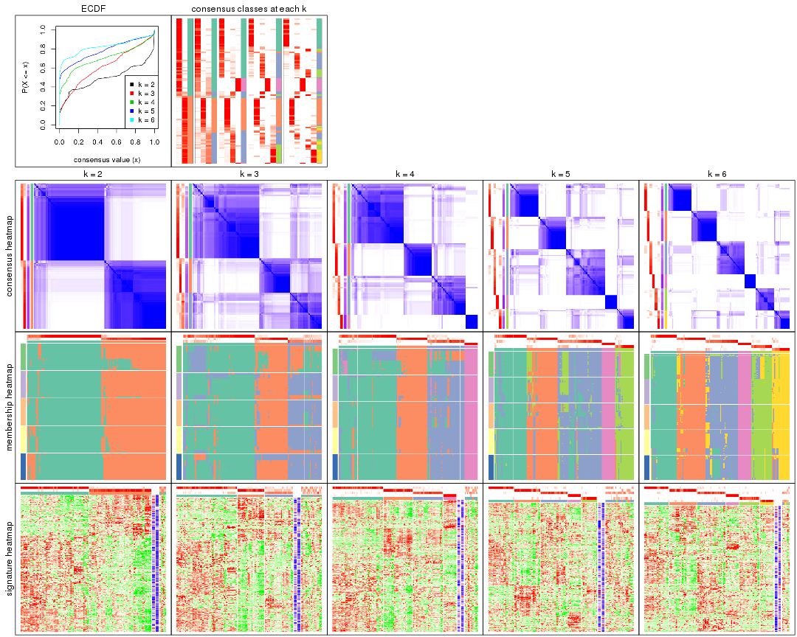

The plots are:

- The first row: a plot of the ECDF (Empirical cumulative distribution
  function) curves of the consensus matrix for each `k` and the heatmap of
  predicted classes for each `k`.
- The second row: heatmaps of the consensus matrix for each `k`.
- The third row: heatmaps of the membership matrix for each `k`.
- The fouth row: heatmaps of the signatures for each `k`.

All the plots in panels can be made by individual functions and they are
plotted later in this section.

`select_partition_number()` produces several plots showing different
statistics for choosing "optimized" `k`. There are following statistics:

- ECDF curves of the consensus matrix for each `k`;
- 1-PAC. [The PAC
  score](https://en.wikipedia.org/wiki/Consensus_clustering#Over-interpretation_potential_of_consensus_clustering)
  measures the proportion of the ambiguous subgrouping.
- Mean silhouette score.
- Concordance. The mean probability of fiting the consensus class ids in all
  partitions.
- Area increased. Denote $A_k$ as the area under the ECDF curve for current
  `k`, the area increased is defined as $A_k - A_{k-1}$.
- Rand index. The percent of pairs of samples that are both in a same cluster
  or both are not in a same cluster in the partition of k and k-1.
- Jaccard index. The ratio of pairs of samples are both in a same cluster in
  the partition of k and k-1 and the pairs of samples are both in a same
  cluster in the partition k or k-1.

The detailed explanations of these statistics can be found in [the cola
vignette](http://bioconductor.org/packages/devel/bioc/vignettes/cola/inst/doc/cola.html#toc_13).

Generally speaking, lower PAC score, higher mean silhouette score or higher
concordance corresponds to better partition. Rand index and Jaccard index
measure how similar the current partition is compared to partition with `k-1`.
If they are too similar, we won't accept `k` is better than `k-1`.

```r
select_partition_number(res)
```


The numeric values for all these statistics can be obtained by `get_stats()`.

```r
get_stats(res)
```

```
#>   k 1-PAC mean_silhouette concordance area_increased  Rand Jaccard
#> 2 2 0.759           0.871       0.938         0.4944 0.498   0.498
#> 3 3 0.439           0.678       0.805         0.2502 0.821   0.661
#> 4 4 0.662           0.793       0.879         0.1406 0.883   0.705
#> 5 5 0.709           0.683       0.861         0.1124 0.797   0.438
#> 6 6 0.804           0.786       0.895         0.0544 0.886   0.555
```

`suggest_best_k()` suggests the best $k$ based on these statistics. The rules are as follows:

- All $k$ with Jaccard index larger than 0.95 are removed because the increase of
  the partition number does not provides enough extra information. If all $k$ are removed,
  the best $k$ is assigned by `NA`.
- For $k$ with 1-PAC larger than 0.9, the maximal $k$ is taken as the "best k". Other $k$ is called "optional k".
- If it does not fit the second rule. The $k$ with the highest vote of highest
  1-PAC, mean silhouette and concordance is taken as the "best k".

```r
suggest_best_k(res)
```

```
#> [1] 2
```


Following shows the table of the partitions (You need to click the **show/hide
code output** link to see it). The membership matrix (columns with name `p*`)
is inferred by
[`clue::cl_consensus()`](https://www.rdocumentation.org/link/cl_consensus?package=clue)
function with the `SE` method. Basically the value in the membership matrix
represents the probability to belong to a certain group. The finall class
label for an item is determined with the group with highest probability it
belongs to.

In `get_classes()` function, the entropy is calculated from the membership
matrix and the silhouette score is calculated from the consensus matrix.


<script>
$( function() {
	$( '#tabs-SD-pam-get-classes' ).tabs();
} );
</script>
<div id='tabs-SD-pam-get-classes'>
<ul>
<li><a href='#tab-SD-pam-get-classes-1'>k = 2</a></li>
<li><a href='#tab-SD-pam-get-classes-2'>k = 3</a></li>
<li><a href='#tab-SD-pam-get-classes-3'>k = 4</a></li>
<li><a href='#tab-SD-pam-get-classes-4'>k = 5</a></li>
<li><a href='#tab-SD-pam-get-classes-5'>k = 6</a></li>
</ul>

<div id='tab-SD-pam-get-classes-1'>
<p><a id='tab-SD-pam-get-classes-1-a' style='color:#0366d6' href='#'>show/hide code output</a></p>
<pre><code class="r">cbind(get_classes(res, k = 2), get_membership(res, k = 2))
</code></pre>

<pre><code>#&gt;                                      class entropy silhouette    p1    p2
#&gt; DC1F29A2-39DE-44AD-936A-54B2B32D6370     1  0.0000     0.9358 1.000 0.000
#&gt; FA3C3413-FA8C-4A29-B9CA-5BC3A56274A8     2  0.0376     0.9273 0.004 0.996
#&gt; B9B72975-8134-475C-BC0B-0CFDB24F636A     2  0.0000     0.9268 0.000 1.000
#&gt; F44DB757-4D00-4BFC-99C5-AA82F99C5BDA     2  0.2778     0.9229 0.048 0.952
#&gt; 3BD942BB-A3A7-4993-B3F1-B8641626B773     2  0.3274     0.9212 0.060 0.940
#&gt; 431F73A2-2AB3-4101-B610-7FC02A7097EC     2  0.4562     0.9036 0.096 0.904
#&gt; 3067683D-43D4-4F6D-9338-17F6A75E4B25     2  0.4431     0.9060 0.092 0.908
#&gt; 2CE91B81-7CBE-4698-AFEE-6A154313D231     2  0.0000     0.9268 0.000 1.000
#&gt; A639CF4F-4591-4337-A12E-BED71EDDA10B     1  0.0000     0.9358 1.000 0.000
#&gt; 5482053D-9F48-4773-B68A-302B3A612503     1  0.0000     0.9358 1.000 0.000
#&gt; A31D342D-C67C-428B-BAED-C6E844277A09     1  0.0000     0.9358 1.000 0.000
#&gt; 0E9C5985-9AE0-4098-A076-6FFBBDF05110     2  0.1633     0.9275 0.024 0.976
#&gt; 08CCF8A0-15B7-4A13-BC43-6B3B3E2DDE95     2  0.4431     0.9060 0.092 0.908
#&gt; 10577D5B-AD56-403F-A562-73A9ACF2045B     1  0.0000     0.9358 1.000 0.000
#&gt; C940D443-5DDA-4403-868B-7AA6B9A50FC4     1  0.0000     0.9358 1.000 0.000
#&gt; 89D4D945-A717-495F-B253-F5A17CF5B9FA     2  0.2948     0.9236 0.052 0.948
#&gt; DC55EE78-203F-4092-9B83-14B1A529194B     2  0.0000     0.9268 0.000 1.000
#&gt; 8F7368BE-EB41-4192-89AA-9E0428C08851     1  0.0000     0.9358 1.000 0.000
#&gt; F772EA39-E408-4908-BADD-C786D702BF9B     2  0.0000     0.9268 0.000 1.000
#&gt; FD693D10-3ADA-4028-8392-41D2F0296F7E     1  0.8327     0.6281 0.736 0.264
#&gt; 84F16966-7640-49F9-95D1-7648FF74DCC9     2  0.0000     0.9268 0.000 1.000
#&gt; D26DAA2F-AE6A-42E1-9F1F-01943B99785F     2  0.9732     0.3700 0.404 0.596
#&gt; F325847E-F046-4B67-B01C-16919C401020     1  0.9393     0.4427 0.644 0.356
#&gt; 19EB2B10-2529-4A94-8FAE-1CE371A602D9     1  0.0000     0.9358 1.000 0.000
#&gt; B94B9CCF-5FB8-44AE-8D9C-A194C6801A27     2  0.0000     0.9268 0.000 1.000
#&gt; D2678E70-542A-4AB2-B881-12D66DBA44F5     1  0.7674     0.6927 0.776 0.224
#&gt; 4961CA2A-70CD-42AB-A676-4A98C85F449F     2  0.5178     0.8880 0.116 0.884
#&gt; 5AA74C5C-2AD1-4D59-A030-E964EB199581     1  0.0000     0.9358 1.000 0.000
#&gt; F9E11A1B-BD93-438F-9670-6FB7DFF9E910     1  0.0000     0.9358 1.000 0.000
#&gt; FB78CA5A-C8B9-42AF-9DAE-799CAB280B2E     1  0.0000     0.9358 1.000 0.000
#&gt; A8E48877-F8AB-44DD-A18B-194D87C44931     2  0.1633     0.9275 0.024 0.976
#&gt; CA50C495-F37E-4743-867D-FAF2DCC3376A     1  0.9970     0.0699 0.532 0.468
#&gt; 37342369-EC22-4904-8CCD-A0DC6BD8D183     2  0.0000     0.9268 0.000 1.000
#&gt; 91BA5F90-9174-4533-A050-39A28E34A94D     1  0.0672     0.9303 0.992 0.008
#&gt; 5BC371AC-1915-44E9-A114-2963E131EC8D     2  0.9393     0.5136 0.356 0.644
#&gt; 74A6C31A-7F21-45AF-A170-18C326D2AE69     1  0.0000     0.9358 1.000 0.000
#&gt; 984F27EF-D4D7-4E68-BD64-776FDFC04D07     1  0.0000     0.9358 1.000 0.000
#&gt; B05701C5-8C44-4FD1-94C9-FC0255A2EA24     1  0.0000     0.9358 1.000 0.000
#&gt; 91E4119C-2CE6-4447-A125-6A4F403A89E6     2  0.4431     0.9060 0.092 0.908
#&gt; 1570FCE7-F1B4-4BDF-A398-355EDF030864     2  0.0000     0.9268 0.000 1.000
#&gt; 604C06E9-A00E-435E-847A-3992922A5C56     1  0.0000     0.9358 1.000 0.000
#&gt; 455C9007-6FF4-4D63-83FA-4915F0331F9A     1  0.0000     0.9358 1.000 0.000
#&gt; FB8BD3CF-D2EC-47B6-B67F-65ADC1C3A6A7     2  0.4022     0.9123 0.080 0.920
#&gt; 9DC7443A-3C8F-4025-8312-3C98BF28D736     1  0.0000     0.9358 1.000 0.000
#&gt; CB207A52-09AC-49D3-8240-5840CDFBB154     2  0.4690     0.9009 0.100 0.900
#&gt; 2A335049-AD9F-4B32-92B7-69B04B0CF2BA     1  0.0000     0.9358 1.000 0.000
#&gt; 6ACA6293-371E-428D-BBAE-ABFD410C886F     2  0.1633     0.9275 0.024 0.976
#&gt; E8929929-73F9-4DB7-ABBA-0852BEFFFF7E     1  0.0000     0.9358 1.000 0.000
#&gt; 5E343116-414B-41F2-AAEE-A3225450135A     1  0.1414     0.9209 0.980 0.020
#&gt; 0A39073C-157C-48A1-B125-A6A04CB738DA     2  0.2236     0.9261 0.036 0.964
#&gt; 300D78E6-1C7E-4114-80EA-9204A6818B9A     2  0.4690     0.9009 0.100 0.900
#&gt; DAAF55AA-ED48-4221-9CD6-D1DEB6376017     1  0.0000     0.9358 1.000 0.000
#&gt; D76FCF4A-4ACF-41EF-A120-64136D6C845E     2  0.1843     0.9270 0.028 0.972
#&gt; AD294665-6F90-459C-90D5-3058F210225D     2  0.9170     0.5585 0.332 0.668
#&gt; 92E8AD7A-1084-44C8-BDC0-FE4E47B6143F     2  0.3733     0.9143 0.072 0.928
#&gt; 5644A861-3C59-486D-8FBE-4DF6A3B19558     1  0.0000     0.9358 1.000 0.000
#&gt; 1BF8AAE7-B771-4CF2-8B1C-D2BEB5E6579E     1  0.0000     0.9358 1.000 0.000
#&gt; A54731AE-FC40-407F-8D10-67DDC122237D     2  0.0000     0.9268 0.000 1.000
#&gt; 179DC906-5654-4CBA-9C27-C9560B5F12DE     1  0.0000     0.9358 1.000 0.000
#&gt; 979B9A2B-2D81-47C3-A553-9B9441CAAE47     1  0.0000     0.9358 1.000 0.000
#&gt; D69BD86A-08FB-49DA-9084-2725F6C9195F     1  0.0000     0.9358 1.000 0.000
#&gt; 84611033-BCF7-49D7-9B91-DA29B62AC8D3     1  0.9286     0.4331 0.656 0.344
#&gt; 8AA1DA3E-8C00-4653-AA33-EA70531C1E50     2  0.0000     0.9268 0.000 1.000
#&gt; CEBE9594-0F19-46B4-AF7D-F8DF33E00AFB     1  0.0000     0.9358 1.000 0.000
#&gt; C68E82D2-2BD3-41E9-92D7-D4C06E1953B2     1  0.8909     0.5170 0.692 0.308
#&gt; B855EF89-1E76-4408-AA65-61A0F0A4F412     2  0.0000     0.9268 0.000 1.000
#&gt; 4488EFB3-5B01-41E3-B57E-8E4F607CF448     2  0.4562     0.9036 0.096 0.904
#&gt; C2BD8440-CAC6-4FE5-8EBB-5E6AE308D52F     1  0.0000     0.9358 1.000 0.000
#&gt; E0E50F10-1FED-41C1-84DB-81A46F25D7E9     1  0.0672     0.9307 0.992 0.008
#&gt; EE16D845-31F2-4178-800B-CA2C358841AD     2  0.3274     0.9189 0.060 0.940
#&gt; 169828CF-5693-4A46-B5D7-E45CBA9DF317     2  0.0000     0.9268 0.000 1.000
#&gt; 51077BA3-AEE0-4BD4-A1B1-1B0A811642A1     1  0.0000     0.9358 1.000 0.000
#&gt; D2F4E240-C44C-4CF7-8016-6CACD370D093     1  0.0000     0.9358 1.000 0.000
#&gt; 721CDBE6-FC85-4C30-B23E-28407340286F     1  0.5059     0.8334 0.888 0.112
#&gt; 392897E4-6009-422C-B461-649F4DDF260C     1  0.0000     0.9358 1.000 0.000
#&gt; 617E13D2-6924-45F8-A8DE-BE21B718F822     1  0.0000     0.9358 1.000 0.000
#&gt; 5746C00F-9CBB-46B7-83FD-90B2AB3F507B     1  0.0000     0.9358 1.000 0.000
#&gt; 982B4344-A223-4D1F-9485-2E56F9FD45C0     2  0.0000     0.9268 0.000 1.000
#&gt; E5557F52-015D-49DC-9E23-989FC259976F     1  0.0000     0.9358 1.000 0.000
#&gt; F3135F5E-2E90-4923-B634-E994563D17B7     1  0.8555     0.5994 0.720 0.280
#&gt; D1ED15A5-9802-4314-B556-E89EB772D1F0     1  0.0000     0.9358 1.000 0.000
#&gt; 222B06E3-FCFB-4104-92C3-D73BC31854D4     1  0.0000     0.9358 1.000 0.000
#&gt; 4C810FFA-ED07-4F4C-9F81-B8F1CF4956F7     2  0.4161     0.8905 0.084 0.916
#&gt; 9A608964-ED12-4E6E-9D3A-430F59FFF65B     1  0.0000     0.9358 1.000 0.000
#&gt; 4087357F-C17A-4992-A8AB-41ACA2F72001     1  0.9393     0.4833 0.644 0.356
#&gt; B3F013A5-BCB8-4CE0-86B2-634EE180AA6E     2  0.0000     0.9268 0.000 1.000
#&gt; 322AF320-1379-4F51-AFDC-5292A060CD52     2  0.2236     0.9264 0.036 0.964
#&gt; 53A96249-66D5-4C26-893B-ADC71481D261     2  0.0000     0.9268 0.000 1.000
#&gt; 1AB7A6F2-14BD-447C-B2E3-DEB0CE56B209     1  0.0000     0.9358 1.000 0.000
#&gt; 8B4BCDA0-6787-4A55-99F7-AAF22AF85BA6     2  0.0000     0.9268 0.000 1.000
#&gt; 5D9D9E08-2C2C-414E-9547-62799F90D543     2  0.0000     0.9268 0.000 1.000
#&gt; C345CD17-E4F4-41D5-9891-FEFB19342C52     1  0.0000     0.9358 1.000 0.000
#&gt; 1AF8FDE1-1A74-41F6-A1C5-4952CDFB7D3F     1  0.8207     0.6247 0.744 0.256
#&gt; BC3405FF-0660-4B2B-8DC1-5F34D3133078     1  0.5408     0.8239 0.876 0.124
#&gt; C2662596-6E2F-4924-B051-CEA1AC87B197     1  0.0000     0.9358 1.000 0.000
#&gt; 39AE85F7-49FB-4438-BD41-6AC812FA1C72     1  0.0000     0.9358 1.000 0.000
#&gt; 6FF266DB-3F08-43F2-8F6F-679F805B80B8     1  0.2423     0.9080 0.960 0.040
#&gt; B03B7B81-BBD6-4194-BC5E-6EDF0D3F015A     1  0.0672     0.9307 0.992 0.008
#&gt; C7617D56-F13C-4C43-906C-BD458C5DC4CD     1  0.2423     0.9066 0.960 0.040
#&gt; 09420F8B-7A71-4B32-8388-4767670F1FEB     1  0.0376     0.9332 0.996 0.004
#&gt; 6AF47534-74FF-4128-865B-4E8EE1FFB469     2  0.0000     0.9268 0.000 1.000
#&gt; 8FF9E94A-2ED2-4727-947F-D524D7ECE815     1  0.0000     0.9358 1.000 0.000
#&gt; A390E20D-03F9-40E4-A132-0FA5C2BEDB63     1  0.0000     0.9358 1.000 0.000
#&gt; A489CCCA-1374-4071-80CE-05B83C9A0D5E     2  0.0376     0.9273 0.004 0.996
#&gt; 2D962371-EC83-490C-A663-478AF383BC1B     2  0.0000     0.9268 0.000 1.000
#&gt; D91B31A1-EE71-4726-B94C-0CC2815E9D4E     2  0.9248     0.5263 0.340 0.660
#&gt; E0123C5C-E1D1-4162-9895-CC8B01949D84     2  0.7376     0.7784 0.208 0.792
#&gt; EC73959A-2728-49FE-B72A-790BB14F4CBF     1  0.0000     0.9358 1.000 0.000
#&gt; A60DC925-7343-496E-900D-0DD81D5C8123     2  0.4562     0.9038 0.096 0.904
#&gt; 659B64DB-F4A5-43BD-811B-05004CB49D99     1  0.0000     0.9358 1.000 0.000
#&gt; 6969B6B2-7616-4664-9696-C4DACD10537B     2  0.3114     0.9215 0.056 0.944
#&gt; 2F6392DE-0D54-4768-B062-907C81E5B0CC     2  0.1184     0.9279 0.016 0.984
#&gt; C74BE8C5-BA6D-4596-9D67-3C731799F999     1  0.0000     0.9358 1.000 0.000
#&gt; 79A7647F-BDBA-45A2-B207-ABF788F6CC95     1  0.0000     0.9358 1.000 0.000
#&gt; D47D0433-2313-4A2F-B268-5AD293D7534E     2  0.3114     0.9203 0.056 0.944
#&gt; C5058B93-C1DA-43B9-9951-B23A9810AA6E     2  0.4562     0.9036 0.096 0.904
#&gt; 2629FEE3-A203-4411-8A70-02A796C9505C     2  0.4431     0.9060 0.092 0.908
#&gt; 1AF329E4-11D4-4CFC-801F-C24A1EA33102     2  0.0938     0.9278 0.012 0.988
#&gt; D453BEF8-3F18-4B89-BA42-CE74EB105032     2  0.9608     0.4492 0.384 0.616
#&gt; B12A4446-2310-4139-897F-CA030478CBD5     1  0.8608     0.5917 0.716 0.284
#&gt; BCAB1918-5FA9-4CBD-85CB-008743FEA2CC     1  0.0376     0.9333 0.996 0.004
#&gt; 9A5432D3-19EE-47B4-BD88-698DEC75A5E9     2  0.5519     0.8691 0.128 0.872
#&gt; A608BCEB-2C27-4927-A308-E6975F641722     2  0.0000     0.9268 0.000 1.000
#&gt; E4752275-7BF6-4C1E-8A45-C7D571ED85AD     2  0.0000     0.9268 0.000 1.000
#&gt; FDEC1714-C02D-4AB7-AE82-789E9D709EDE     1  0.8207     0.6552 0.744 0.256
#&gt; 33737781-8638-4FA2-AD4C-E888BB9343D8     2  0.1633     0.9275 0.024 0.976
</code></pre>

<script>
$('#tab-SD-pam-get-classes-1-a').parent().next().next().hide();
$('#tab-SD-pam-get-classes-1-a').click(function(){
  $('#tab-SD-pam-get-classes-1-a').parent().next().next().toggle();
  return(false);
});
</script>
</div>

<div id='tab-SD-pam-get-classes-2'>
<p><a id='tab-SD-pam-get-classes-2-a' style='color:#0366d6' href='#'>show/hide code output</a></p>
<pre><code class="r">cbind(get_classes(res, k = 3), get_membership(res, k = 3))
</code></pre>

<pre><code>#&gt;                                      class entropy silhouette    p1    p2    p3
#&gt; DC1F29A2-39DE-44AD-936A-54B2B32D6370     1  0.1163     0.8133 0.972 0.000 0.028
#&gt; FA3C3413-FA8C-4A29-B9CA-5BC3A56274A8     3  0.6282     0.6772 0.012 0.324 0.664
#&gt; B9B72975-8134-475C-BC0B-0CFDB24F636A     2  0.0592     0.8317 0.000 0.988 0.012
#&gt; F44DB757-4D00-4BFC-99C5-AA82F99C5BDA     2  0.2356     0.7942 0.072 0.928 0.000
#&gt; 3BD942BB-A3A7-4993-B3F1-B8641626B773     3  0.8842     0.4549 0.116 0.432 0.452
#&gt; 431F73A2-2AB3-4101-B610-7FC02A7097EC     3  0.9046     0.6323 0.312 0.160 0.528
#&gt; 3067683D-43D4-4F6D-9338-17F6A75E4B25     3  0.8433     0.7168 0.176 0.204 0.620
#&gt; 2CE91B81-7CBE-4698-AFEE-6A154313D231     3  0.5810     0.6579 0.000 0.336 0.664
#&gt; A639CF4F-4591-4337-A12E-BED71EDDA10B     1  0.6267    -0.0976 0.548 0.000 0.452
#&gt; 5482053D-9F48-4773-B68A-302B3A612503     1  0.0000     0.8222 1.000 0.000 0.000
#&gt; A31D342D-C67C-428B-BAED-C6E844277A09     1  0.0000     0.8222 1.000 0.000 0.000
#&gt; 0E9C5985-9AE0-4098-A076-6FFBBDF05110     2  0.7306     0.1054 0.044 0.616 0.340
#&gt; 08CCF8A0-15B7-4A13-BC43-6B3B3E2DDE95     3  0.8703     0.6989 0.180 0.228 0.592
#&gt; 10577D5B-AD56-403F-A562-73A9ACF2045B     1  0.0000     0.8222 1.000 0.000 0.000
#&gt; C940D443-5DDA-4403-868B-7AA6B9A50FC4     1  0.0000     0.8222 1.000 0.000 0.000
#&gt; 89D4D945-A717-495F-B253-F5A17CF5B9FA     3  0.8523     0.4113 0.092 0.444 0.464
#&gt; DC55EE78-203F-4092-9B83-14B1A529194B     2  0.0000     0.8374 0.000 1.000 0.000
#&gt; 8F7368BE-EB41-4192-89AA-9E0428C08851     1  0.0000     0.8222 1.000 0.000 0.000
#&gt; F772EA39-E408-4908-BADD-C786D702BF9B     2  0.0000     0.8374 0.000 1.000 0.000
#&gt; FD693D10-3ADA-4028-8392-41D2F0296F7E     1  0.6062     0.6006 0.616 0.000 0.384
#&gt; 84F16966-7640-49F9-95D1-7648FF74DCC9     2  0.0000     0.8374 0.000 1.000 0.000
#&gt; D26DAA2F-AE6A-42E1-9F1F-01943B99785F     3  0.7804     0.7198 0.216 0.120 0.664
#&gt; F325847E-F046-4B67-B01C-16919C401020     3  0.8236     0.4786 0.416 0.076 0.508
#&gt; 19EB2B10-2529-4A94-8FAE-1CE371A602D9     1  0.0000     0.8222 1.000 0.000 0.000
#&gt; B94B9CCF-5FB8-44AE-8D9C-A194C6801A27     2  0.0000     0.8374 0.000 1.000 0.000
#&gt; D2678E70-542A-4AB2-B881-12D66DBA44F5     1  0.6008     0.6119 0.628 0.000 0.372
#&gt; 4961CA2A-70CD-42AB-A676-4A98C85F449F     3  0.7909     0.7308 0.188 0.148 0.664
#&gt; 5AA74C5C-2AD1-4D59-A030-E964EB199581     1  0.1163     0.8133 0.972 0.000 0.028
#&gt; F9E11A1B-BD93-438F-9670-6FB7DFF9E910     1  0.1163     0.8133 0.972 0.000 0.028
#&gt; FB78CA5A-C8B9-42AF-9DAE-799CAB280B2E     1  0.0000     0.8222 1.000 0.000 0.000
#&gt; A8E48877-F8AB-44DD-A18B-194D87C44931     3  0.6998     0.7126 0.044 0.292 0.664
#&gt; CA50C495-F37E-4743-867D-FAF2DCC3376A     3  0.7265     0.7016 0.240 0.076 0.684
#&gt; 37342369-EC22-4904-8CCD-A0DC6BD8D183     2  0.0000     0.8374 0.000 1.000 0.000
#&gt; 91BA5F90-9174-4533-A050-39A28E34A94D     1  0.0747     0.8188 0.984 0.016 0.000
#&gt; 5BC371AC-1915-44E9-A114-2963E131EC8D     3  0.8768     0.5202 0.408 0.112 0.480
#&gt; 74A6C31A-7F21-45AF-A170-18C326D2AE69     1  0.4235     0.7402 0.824 0.000 0.176
#&gt; 984F27EF-D4D7-4E68-BD64-776FDFC04D07     1  0.9721     0.3569 0.432 0.232 0.336
#&gt; B05701C5-8C44-4FD1-94C9-FC0255A2EA24     1  0.1163     0.8133 0.972 0.000 0.028
#&gt; 91E4119C-2CE6-4447-A125-6A4F403A89E6     2  0.8512     0.3356 0.176 0.612 0.212
#&gt; 1570FCE7-F1B4-4BDF-A398-355EDF030864     2  0.0000     0.8374 0.000 1.000 0.000
#&gt; 604C06E9-A00E-435E-847A-3992922A5C56     1  0.1163     0.8133 0.972 0.000 0.028
#&gt; 455C9007-6FF4-4D63-83FA-4915F0331F9A     1  0.5810     0.6414 0.664 0.000 0.336
#&gt; FB8BD3CF-D2EC-47B6-B67F-65ADC1C3A6A7     3  0.7917     0.7368 0.152 0.184 0.664
#&gt; 9DC7443A-3C8F-4025-8312-3C98BF28D736     1  0.5968     0.6343 0.636 0.000 0.364
#&gt; CB207A52-09AC-49D3-8240-5840CDFBB154     3  0.5304     0.6801 0.068 0.108 0.824
#&gt; 2A335049-AD9F-4B32-92B7-69B04B0CF2BA     1  0.3933     0.7593 0.880 0.092 0.028
#&gt; 6ACA6293-371E-428D-BBAE-ABFD410C886F     3  0.6998     0.7126 0.044 0.292 0.664
#&gt; E8929929-73F9-4DB7-ABBA-0852BEFFFF7E     1  0.1289     0.8137 0.968 0.000 0.032
#&gt; 5E343116-414B-41F2-AAEE-A3225450135A     1  0.1529     0.8102 0.960 0.040 0.000
#&gt; 0A39073C-157C-48A1-B125-A6A04CB738DA     3  0.7351     0.7245 0.068 0.268 0.664
#&gt; 300D78E6-1C7E-4114-80EA-9204A6818B9A     3  0.9588     0.6025 0.240 0.284 0.476
#&gt; DAAF55AA-ED48-4221-9CD6-D1DEB6376017     1  0.5698     0.4997 0.736 0.012 0.252
#&gt; D76FCF4A-4ACF-41EF-A120-64136D6C845E     3  0.6998     0.7126 0.044 0.292 0.664
#&gt; AD294665-6F90-459C-90D5-3058F210225D     3  0.8436     0.6172 0.324 0.108 0.568
#&gt; 92E8AD7A-1084-44C8-BDC0-FE4E47B6143F     2  0.3686     0.7190 0.140 0.860 0.000
#&gt; 5644A861-3C59-486D-8FBE-4DF6A3B19558     1  0.4235     0.7402 0.824 0.000 0.176
#&gt; 1BF8AAE7-B771-4CF2-8B1C-D2BEB5E6579E     1  0.5810     0.6414 0.664 0.000 0.336
#&gt; A54731AE-FC40-407F-8D10-67DDC122237D     3  0.6062     0.5968 0.000 0.384 0.616
#&gt; 179DC906-5654-4CBA-9C27-C9560B5F12DE     1  0.0000     0.8222 1.000 0.000 0.000
#&gt; 979B9A2B-2D81-47C3-A553-9B9441CAAE47     1  0.4750     0.7311 0.784 0.000 0.216
#&gt; D69BD86A-08FB-49DA-9084-2725F6C9195F     1  0.0000     0.8222 1.000 0.000 0.000
#&gt; 84611033-BCF7-49D7-9B91-DA29B62AC8D3     1  0.7209     0.3462 0.604 0.360 0.036
#&gt; 8AA1DA3E-8C00-4653-AA33-EA70531C1E50     2  0.0000     0.8374 0.000 1.000 0.000
#&gt; CEBE9594-0F19-46B4-AF7D-F8DF33E00AFB     1  0.0892     0.8167 0.980 0.000 0.020
#&gt; C68E82D2-2BD3-41E9-92D7-D4C06E1953B2     1  0.5236     0.6757 0.804 0.168 0.028
#&gt; B855EF89-1E76-4408-AA65-61A0F0A4F412     2  0.0000     0.8374 0.000 1.000 0.000
#&gt; 4488EFB3-5B01-41E3-B57E-8E4F607CF448     3  0.7927     0.7323 0.176 0.160 0.664
#&gt; C2BD8440-CAC6-4FE5-8EBB-5E6AE308D52F     1  0.0000     0.8222 1.000 0.000 0.000
#&gt; E0E50F10-1FED-41C1-84DB-81A46F25D7E9     1  0.5810     0.6414 0.664 0.000 0.336
#&gt; EE16D845-31F2-4178-800B-CA2C358841AD     2  0.3116     0.7600 0.108 0.892 0.000
#&gt; 169828CF-5693-4A46-B5D7-E45CBA9DF317     2  0.0000     0.8374 0.000 1.000 0.000
#&gt; 51077BA3-AEE0-4BD4-A1B1-1B0A811642A1     1  0.4235     0.7402 0.824 0.000 0.176
#&gt; D2F4E240-C44C-4CF7-8016-6CACD370D093     1  0.0000     0.8222 1.000 0.000 0.000
#&gt; 721CDBE6-FC85-4C30-B23E-28407340286F     1  0.6232     0.5495 0.740 0.040 0.220
#&gt; 392897E4-6009-422C-B461-649F4DDF260C     1  0.1964     0.8117 0.944 0.000 0.056
#&gt; 617E13D2-6924-45F8-A8DE-BE21B718F822     1  0.5810     0.6414 0.664 0.000 0.336
#&gt; 5746C00F-9CBB-46B7-83FD-90B2AB3F507B     1  0.2261     0.7860 0.932 0.000 0.068
#&gt; 982B4344-A223-4D1F-9485-2E56F9FD45C0     2  0.0000     0.8374 0.000 1.000 0.000
#&gt; E5557F52-015D-49DC-9E23-989FC259976F     1  0.0892     0.8166 0.980 0.000 0.020
#&gt; F3135F5E-2E90-4923-B634-E994563D17B7     3  0.7513     0.6176 0.344 0.052 0.604
#&gt; D1ED15A5-9802-4314-B556-E89EB772D1F0     1  0.0000     0.8222 1.000 0.000 0.000
#&gt; 222B06E3-FCFB-4104-92C3-D73BC31854D4     1  0.0000     0.8222 1.000 0.000 0.000
#&gt; 4C810FFA-ED07-4F4C-9F81-B8F1CF4956F7     3  0.1964     0.4796 0.000 0.056 0.944
#&gt; 9A608964-ED12-4E6E-9D3A-430F59FFF65B     1  0.1753     0.8048 0.952 0.000 0.048
#&gt; 4087357F-C17A-4992-A8AB-41ACA2F72001     1  0.6299     0.4744 0.524 0.000 0.476
#&gt; B3F013A5-BCB8-4CE0-86B2-634EE180AA6E     2  0.0000     0.8374 0.000 1.000 0.000
#&gt; 322AF320-1379-4F51-AFDC-5292A060CD52     2  0.4357     0.7565 0.052 0.868 0.080
#&gt; 53A96249-66D5-4C26-893B-ADC71481D261     2  0.6386    -0.1084 0.004 0.584 0.412
#&gt; 1AB7A6F2-14BD-447C-B2E3-DEB0CE56B209     1  0.0000     0.8222 1.000 0.000 0.000
#&gt; 8B4BCDA0-6787-4A55-99F7-AAF22AF85BA6     2  0.0000     0.8374 0.000 1.000 0.000
#&gt; 5D9D9E08-2C2C-414E-9547-62799F90D543     2  0.0000     0.8374 0.000 1.000 0.000
#&gt; C345CD17-E4F4-41D5-9891-FEFB19342C52     1  0.0000     0.8222 1.000 0.000 0.000
#&gt; 1AF8FDE1-1A74-41F6-A1C5-4952CDFB7D3F     1  0.7898     0.2102 0.616 0.084 0.300
#&gt; BC3405FF-0660-4B2B-8DC1-5F34D3133078     1  0.4636     0.7608 0.848 0.036 0.116
#&gt; C2662596-6E2F-4924-B051-CEA1AC87B197     1  0.0000     0.8222 1.000 0.000 0.000
#&gt; 39AE85F7-49FB-4438-BD41-6AC812FA1C72     1  0.2261     0.8019 0.932 0.000 0.068
#&gt; 6FF266DB-3F08-43F2-8F6F-679F805B80B8     1  0.5968     0.3901 0.636 0.364 0.000
#&gt; B03B7B81-BBD6-4194-BC5E-6EDF0D3F015A     1  0.3267     0.7611 0.884 0.000 0.116
#&gt; C7617D56-F13C-4C43-906C-BD458C5DC4CD     1  0.2625     0.7881 0.916 0.084 0.000
#&gt; 09420F8B-7A71-4B32-8388-4767670F1FEB     1  0.0592     0.8200 0.988 0.012 0.000
#&gt; 6AF47534-74FF-4128-865B-4E8EE1FFB469     2  0.1411     0.8151 0.000 0.964 0.036
#&gt; 8FF9E94A-2ED2-4727-947F-D524D7ECE815     1  0.0000     0.8222 1.000 0.000 0.000
#&gt; A390E20D-03F9-40E4-A132-0FA5C2BEDB63     1  0.5810     0.6414 0.664 0.000 0.336
#&gt; A489CCCA-1374-4071-80CE-05B83C9A0D5E     3  0.6155     0.6710 0.008 0.328 0.664
#&gt; 2D962371-EC83-490C-A663-478AF383BC1B     2  0.0000     0.8374 0.000 1.000 0.000
#&gt; D91B31A1-EE71-4726-B94C-0CC2815E9D4E     2  0.4178     0.6840 0.172 0.828 0.000
#&gt; E0123C5C-E1D1-4162-9895-CC8B01949D84     1  0.9334    -0.4173 0.428 0.164 0.408
#&gt; EC73959A-2728-49FE-B72A-790BB14F4CBF     1  0.2711     0.7927 0.912 0.000 0.088
#&gt; A60DC925-7343-496E-900D-0DD81D5C8123     2  0.5798     0.6498 0.176 0.780 0.044
#&gt; 659B64DB-F4A5-43BD-811B-05004CB49D99     1  0.0000     0.8222 1.000 0.000 0.000
#&gt; 6969B6B2-7616-4664-9696-C4DACD10537B     2  0.2959     0.7700 0.100 0.900 0.000
#&gt; 2F6392DE-0D54-4768-B062-907C81E5B0CC     3  0.6772     0.7025 0.032 0.304 0.664
#&gt; C74BE8C5-BA6D-4596-9D67-3C731799F999     1  0.5810     0.6414 0.664 0.000 0.336
#&gt; 79A7647F-BDBA-45A2-B207-ABF788F6CC95     1  0.0424     0.8204 0.992 0.000 0.008
#&gt; D47D0433-2313-4A2F-B268-5AD293D7534E     2  0.4094     0.7516 0.100 0.872 0.028
#&gt; C5058B93-C1DA-43B9-9951-B23A9810AA6E     2  0.8433     0.3533 0.176 0.620 0.204
#&gt; 2629FEE3-A203-4411-8A70-02A796C9505C     3  0.7927     0.7323 0.176 0.160 0.664
#&gt; 1AF329E4-11D4-4CFC-801F-C24A1EA33102     3  0.6597     0.6927 0.024 0.312 0.664
#&gt; D453BEF8-3F18-4B89-BA42-CE74EB105032     1  0.7236     0.2720 0.576 0.392 0.032
#&gt; B12A4446-2310-4139-897F-CA030478CBD5     1  0.6446     0.5370 0.736 0.052 0.212
#&gt; BCAB1918-5FA9-4CBD-85CB-008743FEA2CC     1  0.3267     0.7480 0.884 0.000 0.116
#&gt; 9A5432D3-19EE-47B4-BD88-698DEC75A5E9     2  0.8996    -0.1509 0.140 0.504 0.356
#&gt; A608BCEB-2C27-4927-A308-E6975F641722     3  0.6062     0.5988 0.000 0.384 0.616
#&gt; E4752275-7BF6-4C1E-8A45-C7D571ED85AD     2  0.0892     0.8233 0.000 0.980 0.020
#&gt; FDEC1714-C02D-4AB7-AE82-789E9D709EDE     3  0.8714     0.4966 0.408 0.108 0.484
#&gt; 33737781-8638-4FA2-AD4C-E888BB9343D8     3  0.6998     0.7126 0.044 0.292 0.664
</code></pre>

<script>
$('#tab-SD-pam-get-classes-2-a').parent().next().next().hide();
$('#tab-SD-pam-get-classes-2-a').click(function(){
  $('#tab-SD-pam-get-classes-2-a').parent().next().next().toggle();
  return(false);
});
</script>
</div>

<div id='tab-SD-pam-get-classes-3'>
<p><a id='tab-SD-pam-get-classes-3-a' style='color:#0366d6' href='#'>show/hide code output</a></p>
<pre><code class="r">cbind(get_classes(res, k = 4), get_membership(res, k = 4))
</code></pre>

<pre><code>#&gt;                                      class entropy silhouette    p1    p2    p3    p4
#&gt; DC1F29A2-39DE-44AD-936A-54B2B32D6370     1  0.0592    0.87119 0.984 0.000 0.016 0.000
#&gt; FA3C3413-FA8C-4A29-B9CA-5BC3A56274A8     3  0.1940    0.79426 0.000 0.076 0.924 0.000
#&gt; B9B72975-8134-475C-BC0B-0CFDB24F636A     2  0.1211    0.91343 0.000 0.960 0.040 0.000
#&gt; F44DB757-4D00-4BFC-99C5-AA82F99C5BDA     2  0.0000    0.93633 0.000 1.000 0.000 0.000
#&gt; 3BD942BB-A3A7-4993-B3F1-B8641626B773     3  0.6362    0.60955 0.096 0.288 0.616 0.000
#&gt; 431F73A2-2AB3-4101-B610-7FC02A7097EC     3  0.5018    0.48663 0.332 0.012 0.656 0.000
#&gt; 3067683D-43D4-4F6D-9338-17F6A75E4B25     3  0.4274    0.76583 0.108 0.072 0.820 0.000
#&gt; 2CE91B81-7CBE-4698-AFEE-6A154313D231     3  0.1940    0.79426 0.000 0.076 0.924 0.000
#&gt; A639CF4F-4591-4337-A12E-BED71EDDA10B     3  0.4193    0.61700 0.268 0.000 0.732 0.000
#&gt; 5482053D-9F48-4773-B68A-302B3A612503     1  0.0000    0.87173 1.000 0.000 0.000 0.000
#&gt; A31D342D-C67C-428B-BAED-C6E844277A09     1  0.1940    0.86190 0.924 0.000 0.076 0.000
#&gt; 0E9C5985-9AE0-4098-A076-6FFBBDF05110     2  0.6491    0.00928 0.072 0.496 0.432 0.000
#&gt; 08CCF8A0-15B7-4A13-BC43-6B3B3E2DDE95     3  0.4411    0.76172 0.108 0.080 0.812 0.000
#&gt; 10577D5B-AD56-403F-A562-73A9ACF2045B     1  0.0000    0.87173 1.000 0.000 0.000 0.000
#&gt; C940D443-5DDA-4403-868B-7AA6B9A50FC4     1  0.1940    0.86190 0.924 0.000 0.076 0.000
#&gt; 89D4D945-A717-495F-B253-F5A17CF5B9FA     3  0.6649    0.45045 0.100 0.340 0.560 0.000
#&gt; DC55EE78-203F-4092-9B83-14B1A529194B     2  0.0000    0.93633 0.000 1.000 0.000 0.000
#&gt; 8F7368BE-EB41-4192-89AA-9E0428C08851     1  0.0000    0.87173 1.000 0.000 0.000 0.000
#&gt; F772EA39-E408-4908-BADD-C786D702BF9B     2  0.0000    0.93633 0.000 1.000 0.000 0.000
#&gt; FD693D10-3ADA-4028-8392-41D2F0296F7E     4  0.0000    1.00000 0.000 0.000 0.000 1.000
#&gt; 84F16966-7640-49F9-95D1-7648FF74DCC9     2  0.0000    0.93633 0.000 1.000 0.000 0.000
#&gt; D26DAA2F-AE6A-42E1-9F1F-01943B99785F     3  0.2469    0.77077 0.108 0.000 0.892 0.000
#&gt; F325847E-F046-4B67-B01C-16919C401020     3  0.3907    0.66997 0.232 0.000 0.768 0.000
#&gt; 19EB2B10-2529-4A94-8FAE-1CE371A602D9     1  0.1940    0.86190 0.924 0.000 0.076 0.000
#&gt; B94B9CCF-5FB8-44AE-8D9C-A194C6801A27     2  0.0000    0.93633 0.000 1.000 0.000 0.000
#&gt; D2678E70-542A-4AB2-B881-12D66DBA44F5     4  0.0000    1.00000 0.000 0.000 0.000 1.000
#&gt; 4961CA2A-70CD-42AB-A676-4A98C85F449F     3  0.0707    0.78190 0.020 0.000 0.980 0.000
#&gt; 5AA74C5C-2AD1-4D59-A030-E964EB199581     1  0.0592    0.87119 0.984 0.000 0.016 0.000
#&gt; F9E11A1B-BD93-438F-9670-6FB7DFF9E910     1  0.0707    0.87140 0.980 0.000 0.020 0.000
#&gt; FB78CA5A-C8B9-42AF-9DAE-799CAB280B2E     1  0.0000    0.87173 1.000 0.000 0.000 0.000
#&gt; A8E48877-F8AB-44DD-A18B-194D87C44931     3  0.1940    0.79426 0.000 0.076 0.924 0.000
#&gt; CA50C495-F37E-4743-867D-FAF2DCC3376A     3  0.2530    0.76967 0.112 0.000 0.888 0.000
#&gt; 37342369-EC22-4904-8CCD-A0DC6BD8D183     2  0.0000    0.93633 0.000 1.000 0.000 0.000
#&gt; 91BA5F90-9174-4533-A050-39A28E34A94D     1  0.0188    0.87119 0.996 0.004 0.000 0.000
#&gt; 5BC371AC-1915-44E9-A114-2963E131EC8D     3  0.3528    0.72529 0.192 0.000 0.808 0.000
#&gt; 74A6C31A-7F21-45AF-A170-18C326D2AE69     1  0.2469    0.79930 0.892 0.000 0.000 0.108
#&gt; 984F27EF-D4D7-4E68-BD64-776FDFC04D07     4  0.0000    1.00000 0.000 0.000 0.000 1.000
#&gt; B05701C5-8C44-4FD1-94C9-FC0255A2EA24     1  0.2216    0.85643 0.908 0.000 0.092 0.000
#&gt; 91E4119C-2CE6-4447-A125-6A4F403A89E6     2  0.5496    0.64517 0.108 0.732 0.160 0.000
#&gt; 1570FCE7-F1B4-4BDF-A398-355EDF030864     2  0.0000    0.93633 0.000 1.000 0.000 0.000
#&gt; 604C06E9-A00E-435E-847A-3992922A5C56     1  0.2216    0.85643 0.908 0.000 0.092 0.000
#&gt; 455C9007-6FF4-4D63-83FA-4915F0331F9A     4  0.0000    1.00000 0.000 0.000 0.000 1.000
#&gt; FB8BD3CF-D2EC-47B6-B67F-65ADC1C3A6A7     3  0.3117    0.78957 0.092 0.028 0.880 0.000
#&gt; 9DC7443A-3C8F-4025-8312-3C98BF28D736     4  0.0000    1.00000 0.000 0.000 0.000 1.000
#&gt; CB207A52-09AC-49D3-8240-5840CDFBB154     3  0.5778    0.44338 0.040 0.000 0.604 0.356
#&gt; 2A335049-AD9F-4B32-92B7-69B04B0CF2BA     1  0.4773    0.77485 0.788 0.120 0.092 0.000
#&gt; 6ACA6293-371E-428D-BBAE-ABFD410C886F     3  0.1940    0.79426 0.000 0.076 0.924 0.000
#&gt; E8929929-73F9-4DB7-ABBA-0852BEFFFF7E     1  0.2216    0.85643 0.908 0.000 0.092 0.000
#&gt; 5E343116-414B-41F2-AAEE-A3225450135A     1  0.1118    0.85843 0.964 0.036 0.000 0.000
#&gt; 0A39073C-157C-48A1-B125-A6A04CB738DA     3  0.1940    0.79426 0.000 0.076 0.924 0.000
#&gt; 300D78E6-1C7E-4114-80EA-9204A6818B9A     3  0.5948    0.75075 0.160 0.144 0.696 0.000
#&gt; DAAF55AA-ED48-4221-9CD6-D1DEB6376017     1  0.4950    0.23794 0.620 0.004 0.376 0.000
#&gt; D76FCF4A-4ACF-41EF-A120-64136D6C845E     3  0.1940    0.79426 0.000 0.076 0.924 0.000
#&gt; AD294665-6F90-459C-90D5-3058F210225D     3  0.5696    0.69505 0.232 0.000 0.692 0.076
#&gt; 92E8AD7A-1084-44C8-BDC0-FE4E47B6143F     2  0.1302    0.90085 0.044 0.956 0.000 0.000
#&gt; 5644A861-3C59-486D-8FBE-4DF6A3B19558     1  0.2469    0.79930 0.892 0.000 0.000 0.108
#&gt; 1BF8AAE7-B771-4CF2-8B1C-D2BEB5E6579E     4  0.0000    1.00000 0.000 0.000 0.000 1.000
#&gt; A54731AE-FC40-407F-8D10-67DDC122237D     3  0.2408    0.78157 0.000 0.104 0.896 0.000
#&gt; 179DC906-5654-4CBA-9C27-C9560B5F12DE     1  0.1940    0.86190 0.924 0.000 0.076 0.000
#&gt; 979B9A2B-2D81-47C3-A553-9B9441CAAE47     1  0.5423    0.69803 0.740 0.000 0.144 0.116
#&gt; D69BD86A-08FB-49DA-9084-2725F6C9195F     1  0.0188    0.87119 0.996 0.004 0.000 0.000
#&gt; 84611033-BCF7-49D7-9B91-DA29B62AC8D3     1  0.6811    0.25425 0.496 0.404 0.100 0.000
#&gt; 8AA1DA3E-8C00-4653-AA33-EA70531C1E50     2  0.0000    0.93633 0.000 1.000 0.000 0.000
#&gt; CEBE9594-0F19-46B4-AF7D-F8DF33E00AFB     1  0.1118    0.86169 0.964 0.000 0.036 0.000
#&gt; C68E82D2-2BD3-41E9-92D7-D4C06E1953B2     1  0.5266    0.74045 0.752 0.140 0.108 0.000
#&gt; B855EF89-1E76-4408-AA65-61A0F0A4F412     2  0.0000    0.93633 0.000 1.000 0.000 0.000
#&gt; 4488EFB3-5B01-41E3-B57E-8E4F607CF448     3  0.4514    0.79204 0.112 0.072 0.812 0.004
#&gt; C2BD8440-CAC6-4FE5-8EBB-5E6AE308D52F     1  0.0817    0.87183 0.976 0.000 0.024 0.000
#&gt; E0E50F10-1FED-41C1-84DB-81A46F25D7E9     4  0.0000    1.00000 0.000 0.000 0.000 1.000
#&gt; EE16D845-31F2-4178-800B-CA2C358841AD     2  0.0000    0.93633 0.000 1.000 0.000 0.000
#&gt; 169828CF-5693-4A46-B5D7-E45CBA9DF317     2  0.0000    0.93633 0.000 1.000 0.000 0.000
#&gt; 51077BA3-AEE0-4BD4-A1B1-1B0A811642A1     1  0.2469    0.79930 0.892 0.000 0.000 0.108
#&gt; D2F4E240-C44C-4CF7-8016-6CACD370D093     1  0.0000    0.87173 1.000 0.000 0.000 0.000
#&gt; 721CDBE6-FC85-4C30-B23E-28407340286F     1  0.4624    0.53872 0.660 0.000 0.340 0.000
#&gt; 392897E4-6009-422C-B461-649F4DDF260C     1  0.2676    0.85427 0.896 0.000 0.092 0.012
#&gt; 617E13D2-6924-45F8-A8DE-BE21B718F822     4  0.0000    1.00000 0.000 0.000 0.000 1.000
#&gt; 5746C00F-9CBB-46B7-83FD-90B2AB3F507B     1  0.3569    0.76970 0.804 0.000 0.196 0.000
#&gt; 982B4344-A223-4D1F-9485-2E56F9FD45C0     2  0.0000    0.93633 0.000 1.000 0.000 0.000
#&gt; E5557F52-015D-49DC-9E23-989FC259976F     1  0.2216    0.85643 0.908 0.000 0.092 0.000
#&gt; F3135F5E-2E90-4923-B634-E994563D17B7     3  0.3311    0.73974 0.172 0.000 0.828 0.000
#&gt; D1ED15A5-9802-4314-B556-E89EB772D1F0     1  0.0000    0.87173 1.000 0.000 0.000 0.000
#&gt; 222B06E3-FCFB-4104-92C3-D73BC31854D4     1  0.0000    0.87173 1.000 0.000 0.000 0.000
#&gt; 4C810FFA-ED07-4F4C-9F81-B8F1CF4956F7     4  0.0000    1.00000 0.000 0.000 0.000 1.000
#&gt; 9A608964-ED12-4E6E-9D3A-430F59FFF65B     1  0.2408    0.85222 0.896 0.000 0.104 0.000
#&gt; 4087357F-C17A-4992-A8AB-41ACA2F72001     4  0.0000    1.00000 0.000 0.000 0.000 1.000
#&gt; B3F013A5-BCB8-4CE0-86B2-634EE180AA6E     2  0.0000    0.93633 0.000 1.000 0.000 0.000
#&gt; 322AF320-1379-4F51-AFDC-5292A060CD52     2  0.3754    0.81430 0.064 0.852 0.084 0.000
#&gt; 53A96249-66D5-4C26-893B-ADC71481D261     3  0.4843    0.39072 0.000 0.396 0.604 0.000
#&gt; 1AB7A6F2-14BD-447C-B2E3-DEB0CE56B209     1  0.0188    0.87119 0.996 0.004 0.000 0.000
#&gt; 8B4BCDA0-6787-4A55-99F7-AAF22AF85BA6     2  0.0000    0.93633 0.000 1.000 0.000 0.000
#&gt; 5D9D9E08-2C2C-414E-9547-62799F90D543     2  0.0000    0.93633 0.000 1.000 0.000 0.000
#&gt; C345CD17-E4F4-41D5-9891-FEFB19342C52     1  0.1940    0.86190 0.924 0.000 0.076 0.000
#&gt; 1AF8FDE1-1A74-41F6-A1C5-4952CDFB7D3F     1  0.5512   -0.03829 0.492 0.016 0.492 0.000
#&gt; BC3405FF-0660-4B2B-8DC1-5F34D3133078     1  0.3335    0.83655 0.856 0.000 0.128 0.016
#&gt; C2662596-6E2F-4924-B051-CEA1AC87B197     1  0.0000    0.87173 1.000 0.000 0.000 0.000
#&gt; 39AE85F7-49FB-4438-BD41-6AC812FA1C72     1  0.2021    0.84081 0.932 0.000 0.012 0.056
#&gt; 6FF266DB-3F08-43F2-8F6F-679F805B80B8     1  0.5016    0.30547 0.600 0.396 0.004 0.000
#&gt; B03B7B81-BBD6-4194-BC5E-6EDF0D3F015A     1  0.4284    0.73358 0.764 0.000 0.224 0.012
#&gt; C7617D56-F13C-4C43-906C-BD458C5DC4CD     1  0.1833    0.84755 0.944 0.032 0.024 0.000
#&gt; 09420F8B-7A71-4B32-8388-4767670F1FEB     1  0.0188    0.87119 0.996 0.004 0.000 0.000
#&gt; 6AF47534-74FF-4128-865B-4E8EE1FFB469     2  0.1557    0.90153 0.000 0.944 0.056 0.000
#&gt; 8FF9E94A-2ED2-4727-947F-D524D7ECE815     1  0.0000    0.87173 1.000 0.000 0.000 0.000
#&gt; A390E20D-03F9-40E4-A132-0FA5C2BEDB63     4  0.0000    1.00000 0.000 0.000 0.000 1.000
#&gt; A489CCCA-1374-4071-80CE-05B83C9A0D5E     3  0.1940    0.79426 0.000 0.076 0.924 0.000
#&gt; 2D962371-EC83-490C-A663-478AF383BC1B     2  0.0000    0.93633 0.000 1.000 0.000 0.000
#&gt; D91B31A1-EE71-4726-B94C-0CC2815E9D4E     2  0.0592    0.92712 0.016 0.984 0.000 0.000
#&gt; E0123C5C-E1D1-4162-9895-CC8B01949D84     3  0.5928    0.02701 0.456 0.036 0.508 0.000
#&gt; EC73959A-2728-49FE-B72A-790BB14F4CBF     1  0.1474    0.84811 0.948 0.000 0.000 0.052
#&gt; A60DC925-7343-496E-900D-0DD81D5C8123     2  0.3160    0.81598 0.108 0.872 0.000 0.020
#&gt; 659B64DB-F4A5-43BD-811B-05004CB49D99     1  0.0000    0.87173 1.000 0.000 0.000 0.000
#&gt; 6969B6B2-7616-4664-9696-C4DACD10537B     2  0.0336    0.93197 0.008 0.992 0.000 0.000
#&gt; 2F6392DE-0D54-4768-B062-907C81E5B0CC     3  0.1940    0.79426 0.000 0.076 0.924 0.000
#&gt; C74BE8C5-BA6D-4596-9D67-3C731799F999     4  0.0000    1.00000 0.000 0.000 0.000 1.000
#&gt; 79A7647F-BDBA-45A2-B207-ABF788F6CC95     1  0.2011    0.86085 0.920 0.000 0.080 0.000
#&gt; D47D0433-2313-4A2F-B268-5AD293D7534E     2  0.0592    0.92643 0.000 0.984 0.016 0.000
#&gt; C5058B93-C1DA-43B9-9951-B23A9810AA6E     2  0.5624    0.62541 0.108 0.720 0.172 0.000
#&gt; 2629FEE3-A203-4411-8A70-02A796C9505C     3  0.0707    0.78190 0.020 0.000 0.980 0.000
#&gt; 1AF329E4-11D4-4CFC-801F-C24A1EA33102     3  0.1940    0.79426 0.000 0.076 0.924 0.000
#&gt; D453BEF8-3F18-4B89-BA42-CE74EB105032     1  0.7012    0.30330 0.504 0.372 0.124 0.000
#&gt; B12A4446-2310-4139-897F-CA030478CBD5     1  0.3764    0.75432 0.784 0.000 0.216 0.000
#&gt; BCAB1918-5FA9-4CBD-85CB-008743FEA2CC     1  0.3837    0.73749 0.776 0.000 0.224 0.000
#&gt; 9A5432D3-19EE-47B4-BD88-698DEC75A5E9     3  0.5682    0.25318 0.024 0.456 0.520 0.000
#&gt; A608BCEB-2C27-4927-A308-E6975F641722     3  0.2408    0.78202 0.000 0.104 0.896 0.000
#&gt; E4752275-7BF6-4C1E-8A45-C7D571ED85AD     2  0.0188    0.93411 0.000 0.996 0.004 0.000
#&gt; FDEC1714-C02D-4AB7-AE82-789E9D709EDE     3  0.4711    0.75558 0.152 0.064 0.784 0.000
#&gt; 33737781-8638-4FA2-AD4C-E888BB9343D8     3  0.1940    0.79426 0.000 0.076 0.924 0.000
</code></pre>

<script>
$('#tab-SD-pam-get-classes-3-a').parent().next().next().hide();
$('#tab-SD-pam-get-classes-3-a').click(function(){
  $('#tab-SD-pam-get-classes-3-a').parent().next().next().toggle();
  return(false);
});
</script>
</div>

<div id='tab-SD-pam-get-classes-4'>
<p><a id='tab-SD-pam-get-classes-4-a' style='color:#0366d6' href='#'>show/hide code output</a></p>
<pre><code class="r">cbind(get_classes(res, k = 5), get_membership(res, k = 5))
</code></pre>

<pre><code>#&gt;                                      class entropy silhouette    p1    p2    p3    p4    p5
#&gt; DC1F29A2-39DE-44AD-936A-54B2B32D6370     1  0.2286    0.77290 0.888 0.000 0.108 0.000 0.004
#&gt; FA3C3413-FA8C-4A29-B9CA-5BC3A56274A8     5  0.0000    0.85306 0.000 0.000 0.000 0.000 1.000
#&gt; B9B72975-8134-475C-BC0B-0CFDB24F636A     2  0.3661    0.59651 0.000 0.724 0.000 0.000 0.276
#&gt; F44DB757-4D00-4BFC-99C5-AA82F99C5BDA     2  0.0000    0.85227 0.000 1.000 0.000 0.000 0.000
#&gt; 3BD942BB-A3A7-4993-B3F1-B8641626B773     3  0.5176    0.28311 0.000 0.048 0.572 0.000 0.380
#&gt; 431F73A2-2AB3-4101-B610-7FC02A7097EC     3  0.2852    0.64117 0.000 0.000 0.828 0.000 0.172
#&gt; 3067683D-43D4-4F6D-9338-17F6A75E4B25     3  0.3424    0.57718 0.000 0.000 0.760 0.000 0.240
#&gt; 2CE91B81-7CBE-4698-AFEE-6A154313D231     5  0.0000    0.85306 0.000 0.000 0.000 0.000 1.000
#&gt; A639CF4F-4591-4337-A12E-BED71EDDA10B     3  0.2727    0.68264 0.016 0.000 0.868 0.000 0.116
#&gt; 5482053D-9F48-4773-B68A-302B3A612503     1  0.0000    0.87417 1.000 0.000 0.000 0.000 0.000
#&gt; A31D342D-C67C-428B-BAED-C6E844277A09     1  0.4210    0.23338 0.588 0.000 0.412 0.000 0.000
#&gt; 0E9C5985-9AE0-4098-A076-6FFBBDF05110     3  0.4235    0.28353 0.000 0.000 0.576 0.000 0.424
#&gt; 08CCF8A0-15B7-4A13-BC43-6B3B3E2DDE95     3  0.6278    0.24232 0.000 0.252 0.536 0.000 0.212
#&gt; 10577D5B-AD56-403F-A562-73A9ACF2045B     1  0.0000    0.87417 1.000 0.000 0.000 0.000 0.000
#&gt; C940D443-5DDA-4403-868B-7AA6B9A50FC4     3  0.4273    0.17518 0.448 0.000 0.552 0.000 0.000
#&gt; 89D4D945-A717-495F-B253-F5A17CF5B9FA     3  0.4235    0.28353 0.000 0.000 0.576 0.000 0.424
#&gt; DC55EE78-203F-4092-9B83-14B1A529194B     2  0.0000    0.85227 0.000 1.000 0.000 0.000 0.000
#&gt; 8F7368BE-EB41-4192-89AA-9E0428C08851     1  0.0000    0.87417 1.000 0.000 0.000 0.000 0.000
#&gt; F772EA39-E408-4908-BADD-C786D702BF9B     2  0.0000    0.85227 0.000 1.000 0.000 0.000 0.000
#&gt; FD693D10-3ADA-4028-8392-41D2F0296F7E     4  0.0000    1.00000 0.000 0.000 0.000 1.000 0.000
#&gt; 84F16966-7640-49F9-95D1-7648FF74DCC9     2  0.0000    0.85227 0.000 1.000 0.000 0.000 0.000
#&gt; D26DAA2F-AE6A-42E1-9F1F-01943B99785F     3  0.4302    0.03619 0.000 0.000 0.520 0.000 0.480
#&gt; F325847E-F046-4B67-B01C-16919C401020     3  0.0290    0.71418 0.008 0.000 0.992 0.000 0.000
#&gt; 19EB2B10-2529-4A94-8FAE-1CE371A602D9     3  0.2773    0.67866 0.164 0.000 0.836 0.000 0.000
#&gt; B94B9CCF-5FB8-44AE-8D9C-A194C6801A27     2  0.0000    0.85227 0.000 1.000 0.000 0.000 0.000
#&gt; D2678E70-542A-4AB2-B881-12D66DBA44F5     4  0.0000    1.00000 0.000 0.000 0.000 1.000 0.000
#&gt; 4961CA2A-70CD-42AB-A676-4A98C85F449F     3  0.3752    0.47587 0.000 0.000 0.708 0.000 0.292
#&gt; 5AA74C5C-2AD1-4D59-A030-E964EB199581     1  0.4138    0.33599 0.616 0.000 0.384 0.000 0.000
#&gt; F9E11A1B-BD93-438F-9670-6FB7DFF9E910     1  0.2516    0.75047 0.860 0.000 0.140 0.000 0.000
#&gt; FB78CA5A-C8B9-42AF-9DAE-799CAB280B2E     1  0.0000    0.87417 1.000 0.000 0.000 0.000 0.000
#&gt; A8E48877-F8AB-44DD-A18B-194D87C44931     5  0.0000    0.85306 0.000 0.000 0.000 0.000 1.000
#&gt; CA50C495-F37E-4743-867D-FAF2DCC3376A     3  0.0510    0.71267 0.000 0.000 0.984 0.000 0.016
#&gt; 37342369-EC22-4904-8CCD-A0DC6BD8D183     2  0.0000    0.85227 0.000 1.000 0.000 0.000 0.000
#&gt; 91BA5F90-9174-4533-A050-39A28E34A94D     1  0.0000    0.87417 1.000 0.000 0.000 0.000 0.000
#&gt; 5BC371AC-1915-44E9-A114-2963E131EC8D     5  0.4309    0.67511 0.148 0.000 0.084 0.000 0.768
#&gt; 74A6C31A-7F21-45AF-A170-18C326D2AE69     1  0.0000    0.87417 1.000 0.000 0.000 0.000 0.000
#&gt; 984F27EF-D4D7-4E68-BD64-776FDFC04D07     4  0.0000    1.00000 0.000 0.000 0.000 1.000 0.000
#&gt; B05701C5-8C44-4FD1-94C9-FC0255A2EA24     3  0.4278    0.08749 0.452 0.000 0.548 0.000 0.000
#&gt; 91E4119C-2CE6-4447-A125-6A4F403A89E6     3  0.4101    0.43977 0.000 0.004 0.664 0.000 0.332
#&gt; 1570FCE7-F1B4-4BDF-A398-355EDF030864     2  0.0880    0.83518 0.000 0.968 0.032 0.000 0.000
#&gt; 604C06E9-A00E-435E-847A-3992922A5C56     3  0.1121    0.71817 0.044 0.000 0.956 0.000 0.000
#&gt; 455C9007-6FF4-4D63-83FA-4915F0331F9A     4  0.0000    1.00000 0.000 0.000 0.000 1.000 0.000
#&gt; FB8BD3CF-D2EC-47B6-B67F-65ADC1C3A6A7     3  0.2424    0.66709 0.000 0.000 0.868 0.000 0.132
#&gt; 9DC7443A-3C8F-4025-8312-3C98BF28D736     4  0.0000    1.00000 0.000 0.000 0.000 1.000 0.000
#&gt; CB207A52-09AC-49D3-8240-5840CDFBB154     5  0.6801    0.15246 0.000 0.000 0.348 0.292 0.360
#&gt; 2A335049-AD9F-4B32-92B7-69B04B0CF2BA     3  0.3480    0.55696 0.248 0.000 0.752 0.000 0.000
#&gt; 6ACA6293-371E-428D-BBAE-ABFD410C886F     5  0.0000    0.85306 0.000 0.000 0.000 0.000 1.000
#&gt; E8929929-73F9-4DB7-ABBA-0852BEFFFF7E     3  0.3895    0.42794 0.320 0.000 0.680 0.000 0.000
#&gt; 5E343116-414B-41F2-AAEE-A3225450135A     1  0.4656   -0.11504 0.508 0.012 0.480 0.000 0.000
#&gt; 0A39073C-157C-48A1-B125-A6A04CB738DA     3  0.4138    0.34129 0.000 0.000 0.616 0.000 0.384
#&gt; 300D78E6-1C7E-4114-80EA-9204A6818B9A     5  0.3826    0.55395 0.008 0.004 0.236 0.000 0.752
#&gt; DAAF55AA-ED48-4221-9CD6-D1DEB6376017     1  0.3336    0.62554 0.772 0.000 0.000 0.000 0.228
#&gt; D76FCF4A-4ACF-41EF-A120-64136D6C845E     5  0.0000    0.85306 0.000 0.000 0.000 0.000 1.000
#&gt; AD294665-6F90-459C-90D5-3058F210225D     5  0.6680    0.56301 0.088 0.000 0.128 0.168 0.616
#&gt; 92E8AD7A-1084-44C8-BDC0-FE4E47B6143F     2  0.4976   -0.00498 0.000 0.504 0.468 0.000 0.028
#&gt; 5644A861-3C59-486D-8FBE-4DF6A3B19558     1  0.0000    0.87417 1.000 0.000 0.000 0.000 0.000
#&gt; 1BF8AAE7-B771-4CF2-8B1C-D2BEB5E6579E     4  0.0000    1.00000 0.000 0.000 0.000 1.000 0.000
#&gt; A54731AE-FC40-407F-8D10-67DDC122237D     5  0.3966    0.35134 0.000 0.336 0.000 0.000 0.664
#&gt; 179DC906-5654-4CBA-9C27-C9560B5F12DE     3  0.3395    0.61511 0.236 0.000 0.764 0.000 0.000
#&gt; 979B9A2B-2D81-47C3-A553-9B9441CAAE47     1  0.6630    0.33786 0.560 0.000 0.028 0.164 0.248
#&gt; D69BD86A-08FB-49DA-9084-2725F6C9195F     1  0.0000    0.87417 1.000 0.000 0.000 0.000 0.000
#&gt; 84611033-BCF7-49D7-9B91-DA29B62AC8D3     3  0.1809    0.70719 0.012 0.000 0.928 0.000 0.060
#&gt; 8AA1DA3E-8C00-4653-AA33-EA70531C1E50     2  0.0000    0.85227 0.000 1.000 0.000 0.000 0.000
#&gt; CEBE9594-0F19-46B4-AF7D-F8DF33E00AFB     1  0.0609    0.86163 0.980 0.000 0.000 0.000 0.020
#&gt; C68E82D2-2BD3-41E9-92D7-D4C06E1953B2     3  0.1251    0.71725 0.036 0.000 0.956 0.000 0.008
#&gt; B855EF89-1E76-4408-AA65-61A0F0A4F412     2  0.0000    0.85227 0.000 1.000 0.000 0.000 0.000
#&gt; 4488EFB3-5B01-41E3-B57E-8E4F607CF448     5  0.1502    0.81294 0.004 0.000 0.056 0.000 0.940
#&gt; C2BD8440-CAC6-4FE5-8EBB-5E6AE308D52F     1  0.2852    0.70550 0.828 0.000 0.172 0.000 0.000
#&gt; E0E50F10-1FED-41C1-84DB-81A46F25D7E9     4  0.0000    1.00000 0.000 0.000 0.000 1.000 0.000
#&gt; EE16D845-31F2-4178-800B-CA2C358841AD     2  0.0000    0.85227 0.000 1.000 0.000 0.000 0.000
#&gt; 169828CF-5693-4A46-B5D7-E45CBA9DF317     2  0.0000    0.85227 0.000 1.000 0.000 0.000 0.000
#&gt; 51077BA3-AEE0-4BD4-A1B1-1B0A811642A1     1  0.0000    0.87417 1.000 0.000 0.000 0.000 0.000
#&gt; D2F4E240-C44C-4CF7-8016-6CACD370D093     1  0.0000    0.87417 1.000 0.000 0.000 0.000 0.000
#&gt; 721CDBE6-FC85-4C30-B23E-28407340286F     3  0.5002    0.28545 0.364 0.000 0.596 0.000 0.040
#&gt; 392897E4-6009-422C-B461-649F4DDF260C     3  0.4302   -0.00444 0.480 0.000 0.520 0.000 0.000
#&gt; 617E13D2-6924-45F8-A8DE-BE21B718F822     4  0.0000    1.00000 0.000 0.000 0.000 1.000 0.000
#&gt; 5746C00F-9CBB-46B7-83FD-90B2AB3F507B     3  0.3305    0.62487 0.224 0.000 0.776 0.000 0.000
#&gt; 982B4344-A223-4D1F-9485-2E56F9FD45C0     2  0.0000    0.85227 0.000 1.000 0.000 0.000 0.000
#&gt; E5557F52-015D-49DC-9E23-989FC259976F     3  0.1671    0.71360 0.076 0.000 0.924 0.000 0.000
#&gt; F3135F5E-2E90-4923-B634-E994563D17B7     3  0.1408    0.71298 0.008 0.000 0.948 0.000 0.044
#&gt; D1ED15A5-9802-4314-B556-E89EB772D1F0     1  0.0000    0.87417 1.000 0.000 0.000 0.000 0.000
#&gt; 222B06E3-FCFB-4104-92C3-D73BC31854D4     1  0.0000    0.87417 1.000 0.000 0.000 0.000 0.000
#&gt; 4C810FFA-ED07-4F4C-9F81-B8F1CF4956F7     4  0.0000    1.00000 0.000 0.000 0.000 1.000 0.000
#&gt; 9A608964-ED12-4E6E-9D3A-430F59FFF65B     3  0.0404    0.71451 0.012 0.000 0.988 0.000 0.000
#&gt; 4087357F-C17A-4992-A8AB-41ACA2F72001     4  0.0000    1.00000 0.000 0.000 0.000 1.000 0.000
#&gt; B3F013A5-BCB8-4CE0-86B2-634EE180AA6E     2  0.0000    0.85227 0.000 1.000 0.000 0.000 0.000
#&gt; 322AF320-1379-4F51-AFDC-5292A060CD52     2  0.5950    0.45026 0.000 0.592 0.220 0.000 0.188
#&gt; 53A96249-66D5-4C26-893B-ADC71481D261     2  0.4930    0.56493 0.000 0.684 0.072 0.000 0.244
#&gt; 1AB7A6F2-14BD-447C-B2E3-DEB0CE56B209     1  0.0000    0.87417 1.000 0.000 0.000 0.000 0.000
#&gt; 8B4BCDA0-6787-4A55-99F7-AAF22AF85BA6     2  0.2732    0.71903 0.000 0.840 0.000 0.000 0.160
#&gt; 5D9D9E08-2C2C-414E-9547-62799F90D543     2  0.0000    0.85227 0.000 1.000 0.000 0.000 0.000
#&gt; C345CD17-E4F4-41D5-9891-FEFB19342C52     3  0.2605    0.69034 0.148 0.000 0.852 0.000 0.000
#&gt; 1AF8FDE1-1A74-41F6-A1C5-4952CDFB7D3F     3  0.4983    0.54454 0.272 0.000 0.664 0.000 0.064
#&gt; BC3405FF-0660-4B2B-8DC1-5F34D3133078     3  0.2020    0.70543 0.100 0.000 0.900 0.000 0.000
#&gt; C2662596-6E2F-4924-B051-CEA1AC87B197     1  0.0000    0.87417 1.000 0.000 0.000 0.000 0.000
#&gt; 39AE85F7-49FB-4438-BD41-6AC812FA1C72     3  0.4649    0.32408 0.404 0.000 0.580 0.016 0.000
#&gt; 6FF266DB-3F08-43F2-8F6F-679F805B80B8     2  0.3949    0.55267 0.300 0.696 0.004 0.000 0.000
#&gt; B03B7B81-BBD6-4194-BC5E-6EDF0D3F015A     3  0.4783    0.62329 0.176 0.000 0.724 0.000 0.100
#&gt; C7617D56-F13C-4C43-906C-BD458C5DC4CD     1  0.1608    0.81784 0.928 0.000 0.072 0.000 0.000
#&gt; 09420F8B-7A71-4B32-8388-4767670F1FEB     1  0.0000    0.87417 1.000 0.000 0.000 0.000 0.000
#&gt; 6AF47534-74FF-4128-865B-4E8EE1FFB469     2  0.5779    0.19301 0.000 0.508 0.092 0.000 0.400
#&gt; 8FF9E94A-2ED2-4727-947F-D524D7ECE815     1  0.0000    0.87417 1.000 0.000 0.000 0.000 0.000
#&gt; A390E20D-03F9-40E4-A132-0FA5C2BEDB63     4  0.0000    1.00000 0.000 0.000 0.000 1.000 0.000
#&gt; A489CCCA-1374-4071-80CE-05B83C9A0D5E     5  0.0000    0.85306 0.000 0.000 0.000 0.000 1.000
#&gt; 2D962371-EC83-490C-A663-478AF383BC1B     2  0.0000    0.85227 0.000 1.000 0.000 0.000 0.000
#&gt; D91B31A1-EE71-4726-B94C-0CC2815E9D4E     2  0.0290    0.84810 0.008 0.992 0.000 0.000 0.000
#&gt; E0123C5C-E1D1-4162-9895-CC8B01949D84     3  0.0510    0.71282 0.000 0.000 0.984 0.000 0.016
#&gt; EC73959A-2728-49FE-B72A-790BB14F4CBF     1  0.0000    0.87417 1.000 0.000 0.000 0.000 0.000
#&gt; A60DC925-7343-496E-900D-0DD81D5C8123     2  0.5195   -0.04488 0.004 0.488 0.480 0.004 0.024
#&gt; 659B64DB-F4A5-43BD-811B-05004CB49D99     1  0.0000    0.87417 1.000 0.000 0.000 0.000 0.000
#&gt; 6969B6B2-7616-4664-9696-C4DACD10537B     2  0.0609    0.84100 0.000 0.980 0.020 0.000 0.000
#&gt; 2F6392DE-0D54-4768-B062-907C81E5B0CC     5  0.0404    0.84672 0.000 0.000 0.012 0.000 0.988
#&gt; C74BE8C5-BA6D-4596-9D67-3C731799F999     4  0.0000    1.00000 0.000 0.000 0.000 1.000 0.000
#&gt; 79A7647F-BDBA-45A2-B207-ABF788F6CC95     1  0.4235    0.20367 0.576 0.000 0.424 0.000 0.000
#&gt; D47D0433-2313-4A2F-B268-5AD293D7534E     2  0.1792    0.79591 0.000 0.916 0.084 0.000 0.000
#&gt; C5058B93-C1DA-43B9-9951-B23A9810AA6E     3  0.4455    0.29272 0.000 0.008 0.588 0.000 0.404
#&gt; 2629FEE3-A203-4411-8A70-02A796C9505C     3  0.0609    0.71283 0.000 0.000 0.980 0.000 0.020
#&gt; 1AF329E4-11D4-4CFC-801F-C24A1EA33102     5  0.0000    0.85306 0.000 0.000 0.000 0.000 1.000
#&gt; D453BEF8-3F18-4B89-BA42-CE74EB105032     3  0.0404    0.71451 0.012 0.000 0.988 0.000 0.000
#&gt; B12A4446-2310-4139-897F-CA030478CBD5     3  0.0404    0.71248 0.000 0.000 0.988 0.000 0.012
#&gt; BCAB1918-5FA9-4CBD-85CB-008743FEA2CC     3  0.1410    0.71691 0.060 0.000 0.940 0.000 0.000
#&gt; 9A5432D3-19EE-47B4-BD88-698DEC75A5E9     2  0.4380    0.59632 0.000 0.708 0.032 0.000 0.260
#&gt; A608BCEB-2C27-4927-A308-E6975F641722     5  0.0000    0.85306 0.000 0.000 0.000 0.000 1.000
#&gt; E4752275-7BF6-4C1E-8A45-C7D571ED85AD     2  0.0000    0.85227 0.000 1.000 0.000 0.000 0.000
#&gt; FDEC1714-C02D-4AB7-AE82-789E9D709EDE     5  0.3878    0.62074 0.236 0.000 0.016 0.000 0.748
#&gt; 33737781-8638-4FA2-AD4C-E888BB9343D8     5  0.0000    0.85306 0.000 0.000 0.000 0.000 1.000
</code></pre>

<script>
$('#tab-SD-pam-get-classes-4-a').parent().next().next().hide();
$('#tab-SD-pam-get-classes-4-a').click(function(){
  $('#tab-SD-pam-get-classes-4-a').parent().next().next().toggle();
  return(false);
});
</script>
</div>

<div id='tab-SD-pam-get-classes-5'>
<p><a id='tab-SD-pam-get-classes-5-a' style='color:#0366d6' href='#'>show/hide code output</a></p>
<pre><code class="r">cbind(get_classes(res, k = 6), get_membership(res, k = 6))
</code></pre>

<pre><code>#&gt;                                      class entropy silhouette    p1    p2    p3    p4    p5    p6
#&gt; DC1F29A2-39DE-44AD-936A-54B2B32D6370     1  0.5296     0.5102 0.600 0.000 0.216 0.000 0.184 0.000
#&gt; FA3C3413-FA8C-4A29-B9CA-5BC3A56274A8     6  0.0000     0.8239 0.000 0.000 0.000 0.000 0.000 1.000
#&gt; B9B72975-8134-475C-BC0B-0CFDB24F636A     2  0.3244     0.6376 0.000 0.732 0.000 0.000 0.000 0.268
#&gt; F44DB757-4D00-4BFC-99C5-AA82F99C5BDA     2  0.0363     0.9093 0.000 0.988 0.000 0.000 0.000 0.012
#&gt; 3BD942BB-A3A7-4993-B3F1-B8641626B773     5  0.3071     0.7635 0.000 0.000 0.016 0.000 0.804 0.180
#&gt; 431F73A2-2AB3-4101-B610-7FC02A7097EC     3  0.4328    -0.0494 0.000 0.000 0.520 0.000 0.020 0.460
#&gt; 3067683D-43D4-4F6D-9338-17F6A75E4B25     6  0.3756     0.3784 0.000 0.000 0.400 0.000 0.000 0.600
#&gt; 2CE91B81-7CBE-4698-AFEE-6A154313D231     6  0.0000     0.8239 0.000 0.000 0.000 0.000 0.000 1.000
#&gt; A639CF4F-4591-4337-A12E-BED71EDDA10B     3  0.3806     0.7056 0.032 0.000 0.780 0.000 0.020 0.168
#&gt; 5482053D-9F48-4773-B68A-302B3A612503     1  0.0000     0.9219 1.000 0.000 0.000 0.000 0.000 0.000
#&gt; A31D342D-C67C-428B-BAED-C6E844277A09     3  0.3641     0.6832 0.248 0.000 0.732 0.000 0.020 0.000
#&gt; 0E9C5985-9AE0-4098-A076-6FFBBDF05110     6  0.3342     0.6676 0.000 0.012 0.228 0.000 0.000 0.760
#&gt; 08CCF8A0-15B7-4A13-BC43-6B3B3E2DDE95     3  0.1624     0.7800 0.000 0.020 0.936 0.000 0.004 0.040
#&gt; 10577D5B-AD56-403F-A562-73A9ACF2045B     1  0.0260     0.9161 0.992 0.000 0.008 0.000 0.000 0.000
#&gt; C940D443-5DDA-4403-868B-7AA6B9A50FC4     3  0.3460     0.7090 0.220 0.000 0.760 0.000 0.020 0.000
#&gt; 89D4D945-A717-495F-B253-F5A17CF5B9FA     6  0.3342     0.6676 0.000 0.012 0.228 0.000 0.000 0.760
#&gt; DC55EE78-203F-4092-9B83-14B1A529194B     2  0.0000     0.9157 0.000 1.000 0.000 0.000 0.000 0.000
#&gt; 8F7368BE-EB41-4192-89AA-9E0428C08851     1  0.0000     0.9219 1.000 0.000 0.000 0.000 0.000 0.000
#&gt; F772EA39-E408-4908-BADD-C786D702BF9B     2  0.0000     0.9157 0.000 1.000 0.000 0.000 0.000 0.000
#&gt; FD693D10-3ADA-4028-8392-41D2F0296F7E     4  0.0000     1.0000 0.000 0.000 0.000 1.000 0.000 0.000
#&gt; 84F16966-7640-49F9-95D1-7648FF74DCC9     2  0.0000     0.9157 0.000 1.000 0.000 0.000 0.000 0.000
#&gt; D26DAA2F-AE6A-42E1-9F1F-01943B99785F     3  0.0632     0.7914 0.000 0.000 0.976 0.000 0.000 0.024
#&gt; F325847E-F046-4B67-B01C-16919C401020     3  0.2631     0.7004 0.000 0.000 0.820 0.000 0.180 0.000
#&gt; 19EB2B10-2529-4A94-8FAE-1CE371A602D9     3  0.3487     0.7049 0.224 0.000 0.756 0.000 0.020 0.000
#&gt; B94B9CCF-5FB8-44AE-8D9C-A194C6801A27     2  0.0000     0.9157 0.000 1.000 0.000 0.000 0.000 0.000
#&gt; D2678E70-542A-4AB2-B881-12D66DBA44F5     4  0.0000     1.0000 0.000 0.000 0.000 1.000 0.000 0.000
#&gt; 4961CA2A-70CD-42AB-A676-4A98C85F449F     3  0.1806     0.7777 0.000 0.000 0.908 0.000 0.004 0.088
#&gt; 5AA74C5C-2AD1-4D59-A030-E964EB199581     1  0.4550     0.2800 0.544 0.000 0.420 0.000 0.036 0.000
#&gt; F9E11A1B-BD93-438F-9670-6FB7DFF9E910     1  0.3323     0.6570 0.752 0.000 0.240 0.000 0.008 0.000
#&gt; FB78CA5A-C8B9-42AF-9DAE-799CAB280B2E     1  0.0000     0.9219 1.000 0.000 0.000 0.000 0.000 0.000
#&gt; A8E48877-F8AB-44DD-A18B-194D87C44931     6  0.0000     0.8239 0.000 0.000 0.000 0.000 0.000 1.000
#&gt; CA50C495-F37E-4743-867D-FAF2DCC3376A     3  0.4325     0.5390 0.000 0.000 0.692 0.000 0.064 0.244
#&gt; 37342369-EC22-4904-8CCD-A0DC6BD8D183     2  0.0000     0.9157 0.000 1.000 0.000 0.000 0.000 0.000
#&gt; 91BA5F90-9174-4533-A050-39A28E34A94D     1  0.0000     0.9219 1.000 0.000 0.000 0.000 0.000 0.000
#&gt; 5BC371AC-1915-44E9-A114-2963E131EC8D     5  0.3265     0.6351 0.000 0.000 0.004 0.000 0.748 0.248
#&gt; 74A6C31A-7F21-45AF-A170-18C326D2AE69     1  0.0000     0.9219 1.000 0.000 0.000 0.000 0.000 0.000
#&gt; 984F27EF-D4D7-4E68-BD64-776FDFC04D07     4  0.0000     1.0000 0.000 0.000 0.000 1.000 0.000 0.000
#&gt; B05701C5-8C44-4FD1-94C9-FC0255A2EA24     3  0.1616     0.7959 0.048 0.000 0.932 0.000 0.020 0.000
#&gt; 91E4119C-2CE6-4447-A125-6A4F403A89E6     6  0.4453     0.3539 0.000 0.032 0.400 0.000 0.000 0.568
#&gt; 1570FCE7-F1B4-4BDF-A398-355EDF030864     2  0.0858     0.8971 0.000 0.968 0.028 0.000 0.000 0.004
#&gt; 604C06E9-A00E-435E-847A-3992922A5C56     3  0.1434     0.7950 0.048 0.000 0.940 0.000 0.012 0.000
#&gt; 455C9007-6FF4-4D63-83FA-4915F0331F9A     4  0.0000     1.0000 0.000 0.000 0.000 1.000 0.000 0.000
#&gt; FB8BD3CF-D2EC-47B6-B67F-65ADC1C3A6A7     3  0.3547     0.3989 0.000 0.000 0.668 0.000 0.000 0.332
#&gt; 9DC7443A-3C8F-4025-8312-3C98BF28D736     4  0.0000     1.0000 0.000 0.000 0.000 1.000 0.000 0.000
#&gt; CB207A52-09AC-49D3-8240-5840CDFBB154     5  0.0622     0.8354 0.000 0.000 0.012 0.008 0.980 0.000
#&gt; 2A335049-AD9F-4B32-92B7-69B04B0CF2BA     3  0.0547     0.7933 0.020 0.000 0.980 0.000 0.000 0.000
#&gt; 6ACA6293-371E-428D-BBAE-ABFD410C886F     6  0.0000     0.8239 0.000 0.000 0.000 0.000 0.000 1.000
#&gt; E8929929-73F9-4DB7-ABBA-0852BEFFFF7E     3  0.0725     0.7947 0.012 0.000 0.976 0.000 0.012 0.000
#&gt; 5E343116-414B-41F2-AAEE-A3225450135A     5  0.1549     0.8311 0.044 0.000 0.020 0.000 0.936 0.000
#&gt; 0A39073C-157C-48A1-B125-A6A04CB738DA     5  0.2948     0.7595 0.000 0.000 0.008 0.000 0.804 0.188
#&gt; 300D78E6-1C7E-4114-80EA-9204A6818B9A     5  0.0665     0.8356 0.004 0.000 0.008 0.000 0.980 0.008
#&gt; DAAF55AA-ED48-4221-9CD6-D1DEB6376017     1  0.3101     0.6643 0.756 0.000 0.000 0.000 0.000 0.244
#&gt; D76FCF4A-4ACF-41EF-A120-64136D6C845E     6  0.0000     0.8239 0.000 0.000 0.000 0.000 0.000 1.000
#&gt; AD294665-6F90-459C-90D5-3058F210225D     5  0.5173     0.5736 0.048 0.000 0.192 0.000 0.680 0.080
#&gt; 92E8AD7A-1084-44C8-BDC0-FE4E47B6143F     2  0.2331     0.8358 0.000 0.888 0.032 0.000 0.000 0.080
#&gt; 5644A861-3C59-486D-8FBE-4DF6A3B19558     1  0.0000     0.9219 1.000 0.000 0.000 0.000 0.000 0.000
#&gt; 1BF8AAE7-B771-4CF2-8B1C-D2BEB5E6579E     4  0.0000     1.0000 0.000 0.000 0.000 1.000 0.000 0.000
#&gt; A54731AE-FC40-407F-8D10-67DDC122237D     6  0.2730     0.6762 0.000 0.192 0.000 0.000 0.000 0.808
#&gt; 179DC906-5654-4CBA-9C27-C9560B5F12DE     5  0.2738     0.7670 0.004 0.000 0.176 0.000 0.820 0.000
#&gt; 979B9A2B-2D81-47C3-A553-9B9441CAAE47     5  0.0146     0.8356 0.000 0.000 0.004 0.000 0.996 0.000
#&gt; D69BD86A-08FB-49DA-9084-2725F6C9195F     1  0.0000     0.9219 1.000 0.000 0.000 0.000 0.000 0.000
#&gt; 84611033-BCF7-49D7-9B91-DA29B62AC8D3     3  0.3087     0.6486 0.004 0.012 0.808 0.000 0.000 0.176
#&gt; 8AA1DA3E-8C00-4653-AA33-EA70531C1E50     2  0.0000     0.9157 0.000 1.000 0.000 0.000 0.000 0.000
#&gt; CEBE9594-0F19-46B4-AF7D-F8DF33E00AFB     1  0.1124     0.8931 0.956 0.000 0.008 0.000 0.000 0.036
#&gt; C68E82D2-2BD3-41E9-92D7-D4C06E1953B2     5  0.2762     0.7636 0.000 0.000 0.196 0.000 0.804 0.000
#&gt; B855EF89-1E76-4408-AA65-61A0F0A4F412     2  0.0000     0.9157 0.000 1.000 0.000 0.000 0.000 0.000
#&gt; 4488EFB3-5B01-41E3-B57E-8E4F607CF448     6  0.3217     0.6011 0.000 0.000 0.008 0.000 0.224 0.768
#&gt; C2BD8440-CAC6-4FE5-8EBB-5E6AE308D52F     1  0.3713     0.6019 0.744 0.000 0.224 0.000 0.032 0.000
#&gt; E0E50F10-1FED-41C1-84DB-81A46F25D7E9     4  0.0000     1.0000 0.000 0.000 0.000 1.000 0.000 0.000
#&gt; EE16D845-31F2-4178-800B-CA2C358841AD     2  0.0000     0.9157 0.000 1.000 0.000 0.000 0.000 0.000
#&gt; 169828CF-5693-4A46-B5D7-E45CBA9DF317     2  0.0000     0.9157 0.000 1.000 0.000 0.000 0.000 0.000
#&gt; 51077BA3-AEE0-4BD4-A1B1-1B0A811642A1     1  0.0000     0.9219 1.000 0.000 0.000 0.000 0.000 0.000
#&gt; D2F4E240-C44C-4CF7-8016-6CACD370D093     1  0.0000     0.9219 1.000 0.000 0.000 0.000 0.000 0.000
#&gt; 721CDBE6-FC85-4C30-B23E-28407340286F     3  0.0603     0.7937 0.016 0.000 0.980 0.000 0.004 0.000
#&gt; 392897E4-6009-422C-B461-649F4DDF260C     3  0.1082     0.7929 0.040 0.000 0.956 0.000 0.004 0.000
#&gt; 617E13D2-6924-45F8-A8DE-BE21B718F822     4  0.0000     1.0000 0.000 0.000 0.000 1.000 0.000 0.000
#&gt; 5746C00F-9CBB-46B7-83FD-90B2AB3F507B     5  0.2300     0.7975 0.000 0.000 0.144 0.000 0.856 0.000
#&gt; 982B4344-A223-4D1F-9485-2E56F9FD45C0     2  0.0000     0.9157 0.000 1.000 0.000 0.000 0.000 0.000
#&gt; E5557F52-015D-49DC-9E23-989FC259976F     3  0.3432     0.7140 0.216 0.000 0.764 0.000 0.020 0.000
#&gt; F3135F5E-2E90-4923-B634-E994563D17B7     3  0.3374     0.6807 0.000 0.000 0.772 0.000 0.020 0.208
#&gt; D1ED15A5-9802-4314-B556-E89EB772D1F0     1  0.0000     0.9219 1.000 0.000 0.000 0.000 0.000 0.000
#&gt; 222B06E3-FCFB-4104-92C3-D73BC31854D4     1  0.0000     0.9219 1.000 0.000 0.000 0.000 0.000 0.000
#&gt; 4C810FFA-ED07-4F4C-9F81-B8F1CF4956F7     4  0.0000     1.0000 0.000 0.000 0.000 1.000 0.000 0.000
#&gt; 9A608964-ED12-4E6E-9D3A-430F59FFF65B     3  0.0547     0.7905 0.000 0.000 0.980 0.000 0.020 0.000
#&gt; 4087357F-C17A-4992-A8AB-41ACA2F72001     4  0.0000     1.0000 0.000 0.000 0.000 1.000 0.000 0.000
#&gt; B3F013A5-BCB8-4CE0-86B2-634EE180AA6E     2  0.0000     0.9157 0.000 1.000 0.000 0.000 0.000 0.000
#&gt; 322AF320-1379-4F51-AFDC-5292A060CD52     3  0.6103    -0.1513 0.000 0.320 0.380 0.000 0.000 0.300
#&gt; 53A96249-66D5-4C26-893B-ADC71481D261     2  0.4194     0.5330 0.000 0.664 0.020 0.000 0.008 0.308
#&gt; 1AB7A6F2-14BD-447C-B2E3-DEB0CE56B209     1  0.0000     0.9219 1.000 0.000 0.000 0.000 0.000 0.000
#&gt; 8B4BCDA0-6787-4A55-99F7-AAF22AF85BA6     2  0.3198     0.6195 0.000 0.740 0.000 0.000 0.000 0.260
#&gt; 5D9D9E08-2C2C-414E-9547-62799F90D543     2  0.0000     0.9157 0.000 1.000 0.000 0.000 0.000 0.000
#&gt; C345CD17-E4F4-41D5-9891-FEFB19342C52     3  0.3403     0.7196 0.212 0.000 0.768 0.000 0.020 0.000
#&gt; 1AF8FDE1-1A74-41F6-A1C5-4952CDFB7D3F     5  0.0508     0.8383 0.004 0.000 0.012 0.000 0.984 0.000
#&gt; BC3405FF-0660-4B2B-8DC1-5F34D3133078     5  0.2003     0.8147 0.000 0.000 0.116 0.000 0.884 0.000
#&gt; C2662596-6E2F-4924-B051-CEA1AC87B197     1  0.0000     0.9219 1.000 0.000 0.000 0.000 0.000 0.000
#&gt; 39AE85F7-49FB-4438-BD41-6AC812FA1C72     5  0.4209     0.6555 0.104 0.000 0.160 0.000 0.736 0.000
#&gt; 6FF266DB-3F08-43F2-8F6F-679F805B80B8     2  0.4176     0.6456 0.220 0.716 0.000 0.000 0.064 0.000
#&gt; B03B7B81-BBD6-4194-BC5E-6EDF0D3F015A     5  0.0458     0.8388 0.000 0.000 0.016 0.000 0.984 0.000
#&gt; C7617D56-F13C-4C43-906C-BD458C5DC4CD     5  0.2883     0.7212 0.212 0.000 0.000 0.000 0.788 0.000
#&gt; 09420F8B-7A71-4B32-8388-4767670F1FEB     1  0.0000     0.9219 1.000 0.000 0.000 0.000 0.000 0.000
#&gt; 6AF47534-74FF-4128-865B-4E8EE1FFB469     6  0.4499     0.1201 0.000 0.428 0.032 0.000 0.000 0.540
#&gt; 8FF9E94A-2ED2-4727-947F-D524D7ECE815     1  0.0000     0.9219 1.000 0.000 0.000 0.000 0.000 0.000
#&gt; A390E20D-03F9-40E4-A132-0FA5C2BEDB63     4  0.0000     1.0000 0.000 0.000 0.000 1.000 0.000 0.000
#&gt; A489CCCA-1374-4071-80CE-05B83C9A0D5E     6  0.0000     0.8239 0.000 0.000 0.000 0.000 0.000 1.000
#&gt; 2D962371-EC83-490C-A663-478AF383BC1B     2  0.0000     0.9157 0.000 1.000 0.000 0.000 0.000 0.000
#&gt; D91B31A1-EE71-4726-B94C-0CC2815E9D4E     2  0.0291     0.9122 0.004 0.992 0.004 0.000 0.000 0.000
#&gt; E0123C5C-E1D1-4162-9895-CC8B01949D84     3  0.0146     0.7894 0.000 0.000 0.996 0.000 0.000 0.004
#&gt; EC73959A-2728-49FE-B72A-790BB14F4CBF     1  0.0000     0.9219 1.000 0.000 0.000 0.000 0.000 0.000
#&gt; A60DC925-7343-496E-900D-0DD81D5C8123     2  0.4512     0.6020 0.000 0.708 0.192 0.004 0.000 0.096
#&gt; 659B64DB-F4A5-43BD-811B-05004CB49D99     1  0.0000     0.9219 1.000 0.000 0.000 0.000 0.000 0.000
#&gt; 6969B6B2-7616-4664-9696-C4DACD10537B     2  0.0000     0.9157 0.000 1.000 0.000 0.000 0.000 0.000
#&gt; 2F6392DE-0D54-4768-B062-907C81E5B0CC     5  0.2664     0.7665 0.000 0.000 0.000 0.000 0.816 0.184
#&gt; C74BE8C5-BA6D-4596-9D67-3C731799F999     4  0.0000     1.0000 0.000 0.000 0.000 1.000 0.000 0.000
#&gt; 79A7647F-BDBA-45A2-B207-ABF788F6CC95     3  0.3566     0.6959 0.236 0.000 0.744 0.000 0.020 0.000
#&gt; D47D0433-2313-4A2F-B268-5AD293D7534E     2  0.0790     0.8960 0.000 0.968 0.032 0.000 0.000 0.000
#&gt; C5058B93-C1DA-43B9-9951-B23A9810AA6E     5  0.3122     0.7651 0.000 0.000 0.020 0.000 0.804 0.176
#&gt; 2629FEE3-A203-4411-8A70-02A796C9505C     3  0.1957     0.7422 0.000 0.000 0.888 0.000 0.000 0.112
#&gt; 1AF329E4-11D4-4CFC-801F-C24A1EA33102     6  0.0000     0.8239 0.000 0.000 0.000 0.000 0.000 1.000
#&gt; D453BEF8-3F18-4B89-BA42-CE74EB105032     3  0.0146     0.7900 0.000 0.000 0.996 0.000 0.004 0.000
#&gt; B12A4446-2310-4139-897F-CA030478CBD5     3  0.1714     0.7517 0.000 0.000 0.908 0.000 0.000 0.092
#&gt; BCAB1918-5FA9-4CBD-85CB-008743FEA2CC     3  0.3315     0.7232 0.200 0.000 0.780 0.000 0.020 0.000
#&gt; 9A5432D3-19EE-47B4-BD88-698DEC75A5E9     2  0.4352     0.6494 0.000 0.720 0.056 0.000 0.012 0.212
#&gt; A608BCEB-2C27-4927-A308-E6975F641722     6  0.0000     0.8239 0.000 0.000 0.000 0.000 0.000 1.000
#&gt; E4752275-7BF6-4C1E-8A45-C7D571ED85AD     2  0.0000     0.9157 0.000 1.000 0.000 0.000 0.000 0.000
#&gt; FDEC1714-C02D-4AB7-AE82-789E9D709EDE     5  0.0146     0.8356 0.000 0.000 0.004 0.000 0.996 0.000
#&gt; 33737781-8638-4FA2-AD4C-E888BB9343D8     6  0.0000     0.8239 0.000 0.000 0.000 0.000 0.000 1.000
</code></pre>

<script>
$('#tab-SD-pam-get-classes-5-a').parent().next().next().hide();
$('#tab-SD-pam-get-classes-5-a').click(function(){
  $('#tab-SD-pam-get-classes-5-a').parent().next().next().toggle();
  return(false);
});
</script>
</div>
</div>

Heatmaps for the consensus matrix. It visualizes the probability of two
samples to be in a same group.


<script>
$( function() {
	$( '#tabs-SD-pam-consensus-heatmap' ).tabs();
} );
</script>
<div id='tabs-SD-pam-consensus-heatmap'>
<ul>
<li><a href='#tab-SD-pam-consensus-heatmap-1'>k = 2</a></li>
<li><a href='#tab-SD-pam-consensus-heatmap-2'>k = 3</a></li>
<li><a href='#tab-SD-pam-consensus-heatmap-3'>k = 4</a></li>
<li><a href='#tab-SD-pam-consensus-heatmap-4'>k = 5</a></li>
<li><a href='#tab-SD-pam-consensus-heatmap-5'>k = 6</a></li>
</ul>
<div id='tab-SD-pam-consensus-heatmap-1'>
<pre><code class="r">consensus_heatmap(res, k = 2)
</code></pre>

<p></p>

</div>
<div id='tab-SD-pam-consensus-heatmap-2'>
<pre><code class="r">consensus_heatmap(res, k = 3)
</code></pre>

<p></p>

</div>
<div id='tab-SD-pam-consensus-heatmap-3'>
<pre><code class="r">consensus_heatmap(res, k = 4)
</code></pre>

<p></p>

</div>
<div id='tab-SD-pam-consensus-heatmap-4'>
<pre><code class="r">consensus_heatmap(res, k = 5)
</code></pre>

<p></p>

</div>
<div id='tab-SD-pam-consensus-heatmap-5'>
<pre><code class="r">consensus_heatmap(res, k = 6)
</code></pre>

<p></p>

</div>
</div>

Heatmaps for the membership of samples in all partitions to see how consistent they are:


<script>
$( function() {
	$( '#tabs-SD-pam-membership-heatmap' ).tabs();
} );
</script>
<div id='tabs-SD-pam-membership-heatmap'>
<ul>
<li><a href='#tab-SD-pam-membership-heatmap-1'>k = 2</a></li>
<li><a href='#tab-SD-pam-membership-heatmap-2'>k = 3</a></li>
<li><a href='#tab-SD-pam-membership-heatmap-3'>k = 4</a></li>
<li><a href='#tab-SD-pam-membership-heatmap-4'>k = 5</a></li>
<li><a href='#tab-SD-pam-membership-heatmap-5'>k = 6</a></li>
</ul>
<div id='tab-SD-pam-membership-heatmap-1'>
<pre><code class="r">membership_heatmap(res, k = 2)
</code></pre>

<p></p>

</div>
<div id='tab-SD-pam-membership-heatmap-2'>
<pre><code class="r">membership_heatmap(res, k = 3)
</code></pre>

<p></p>

</div>
<div id='tab-SD-pam-membership-heatmap-3'>
<pre><code class="r">membership_heatmap(res, k = 4)
</code></pre>

<p></p>

</div>
<div id='tab-SD-pam-membership-heatmap-4'>
<pre><code class="r">membership_heatmap(res, k = 5)
</code></pre>

<p></p>

</div>
<div id='tab-SD-pam-membership-heatmap-5'>
<pre><code class="r">membership_heatmap(res, k = 6)
</code></pre>

<p></p>

</div>
</div>

As soon as we have had the classes for columns, we can look for signatures
which are significantly different between classes which can be candidate marks
for certain classes. Following are the heatmaps for signatures.


Signature heatmaps where rows are scaled:


<script>
$( function() {
	$( '#tabs-SD-pam-get-signatures' ).tabs();
} );
</script>
<div id='tabs-SD-pam-get-signatures'>
<ul>
<li><a href='#tab-SD-pam-get-signatures-1'>k = 2</a></li>
<li><a href='#tab-SD-pam-get-signatures-2'>k = 3</a></li>
<li><a href='#tab-SD-pam-get-signatures-3'>k = 4</a></li>
<li><a href='#tab-SD-pam-get-signatures-4'>k = 5</a></li>
<li><a href='#tab-SD-pam-get-signatures-5'>k = 6</a></li>
</ul>
<div id='tab-SD-pam-get-signatures-1'>
<pre><code class="r">get_signatures(res, k = 2)
</code></pre>

<p></p>

</div>
<div id='tab-SD-pam-get-signatures-2'>
<pre><code class="r">get_signatures(res, k = 3)
</code></pre>

<p></p>

</div>
<div id='tab-SD-pam-get-signatures-3'>
<pre><code class="r">get_signatures(res, k = 4)
</code></pre>

<p></p>

</div>
<div id='tab-SD-pam-get-signatures-4'>
<pre><code class="r">get_signatures(res, k = 5)
</code></pre>

<p></p>

</div>
<div id='tab-SD-pam-get-signatures-5'>
<pre><code class="r">get_signatures(res, k = 6)
</code></pre>

<p></p>

</div>
</div>


Signature heatmaps where rows are not scaled:


<script>
$( function() {
	$( '#tabs-SD-pam-get-signatures-no-scale' ).tabs();
} );
</script>
<div id='tabs-SD-pam-get-signatures-no-scale'>
<ul>
<li><a href='#tab-SD-pam-get-signatures-no-scale-1'>k = 2</a></li>
<li><a href='#tab-SD-pam-get-signatures-no-scale-2'>k = 3</a></li>
<li><a href='#tab-SD-pam-get-signatures-no-scale-3'>k = 4</a></li>
<li><a href='#tab-SD-pam-get-signatures-no-scale-4'>k = 5</a></li>
<li><a href='#tab-SD-pam-get-signatures-no-scale-5'>k = 6</a></li>
</ul>
<div id='tab-SD-pam-get-signatures-no-scale-1'>
<pre><code class="r">get_signatures(res, k = 2, scale_rows = FALSE)
</code></pre>

<p></p>

</div>
<div id='tab-SD-pam-get-signatures-no-scale-2'>
<pre><code class="r">get_signatures(res, k = 3, scale_rows = FALSE)
</code></pre>

<p></p>

</div>
<div id='tab-SD-pam-get-signatures-no-scale-3'>
<pre><code class="r">get_signatures(res, k = 4, scale_rows = FALSE)
</code></pre>

<p></p>

</div>
<div id='tab-SD-pam-get-signatures-no-scale-4'>
<pre><code class="r">get_signatures(res, k = 5, scale_rows = FALSE)
</code></pre>

<p></p>

</div>
<div id='tab-SD-pam-get-signatures-no-scale-5'>
<pre><code class="r">get_signatures(res, k = 6, scale_rows = FALSE)
</code></pre>

<p></p>

</div>
</div>


Compare the overlap of signatures from different k:

```r
compare_signatures(res)
```

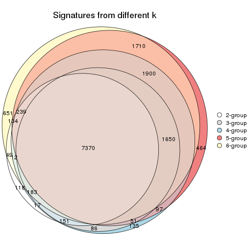

`get_signature()` returns a data frame invisibly. TO get the list of signatures, the function
call should be assigned to a variable explicitly. In following code, if `plot` argument is set
to `FALSE`, no heatmap is plotted while only the differential analysis is performed.

```r
# code only for demonstration
tb = get_signature(res, k = ..., plot = FALSE)
```

An example of the output of `tb` is:

```
#>   which_row         fdr    mean_1    mean_2 scaled_mean_1 scaled_mean_2 km
#> 1        38 0.042760348  8.373488  9.131774    -0.5533452     0.5164555  1
#> 2        40 0.018707592  7.106213  8.469186    -0.6173731     0.5762149  1
#> 3        55 0.019134737 10.221463 11.207825    -0.6159697     0.5749050  1
#> 4        59 0.006059896  5.921854  7.869574    -0.6899429     0.6439467  1
#> 5        60 0.018055526  8.928898 10.211722    -0.6204761     0.5791110  1
#> 6        98 0.009384629 15.714769 14.887706     0.6635654    -0.6193277  2
...
```

The columns in `tb` are:

1. `which_row`: row indices corresponding to the input matrix.
2. `fdr`: FDR for the differential test. 
3. `mean_x`: The mean value in group x.
4. `scaled_mean_x`: The mean value in group x after rows are scaled.
5. `km`: Row groups if k-means clustering is applied to rows.


UMAP plot which shows how samples are separated.


<script>
$( function() {
	$( '#tabs-SD-pam-dimension-reduction' ).tabs();
} );
</script>
<div id='tabs-SD-pam-dimension-reduction'>
<ul>
<li><a href='#tab-SD-pam-dimension-reduction-1'>k = 2</a></li>
<li><a href='#tab-SD-pam-dimension-reduction-2'>k = 3</a></li>
<li><a href='#tab-SD-pam-dimension-reduction-3'>k = 4</a></li>
<li><a href='#tab-SD-pam-dimension-reduction-4'>k = 5</a></li>
<li><a href='#tab-SD-pam-dimension-reduction-5'>k = 6</a></li>
</ul>
<div id='tab-SD-pam-dimension-reduction-1'>
<pre><code class="r">dimension_reduction(res, k = 2, method = &quot;UMAP&quot;)
</code></pre>

<p></p>

</div>
<div id='tab-SD-pam-dimension-reduction-2'>
<pre><code class="r">dimension_reduction(res, k = 3, method = &quot;UMAP&quot;)
</code></pre>

<p></p>

</div>
<div id='tab-SD-pam-dimension-reduction-3'>
<pre><code class="r">dimension_reduction(res, k = 4, method = &quot;UMAP&quot;)
</code></pre>

<p></p>

</div>
<div id='tab-SD-pam-dimension-reduction-4'>
<pre><code class="r">dimension_reduction(res, k = 5, method = &quot;UMAP&quot;)
</code></pre>

<p></p>

</div>
<div id='tab-SD-pam-dimension-reduction-5'>
<pre><code class="r">dimension_reduction(res, k = 6, method = &quot;UMAP&quot;)
</code></pre>

<p></p>

</div>
</div>


Following heatmap shows how subgroups are split when increasing `k`:

```r
collect_classes(res)
```


If matrix rows can be associated to genes, consider to use `GO_Enrichment(res,
...)` to perform function enrichment for the signature genes.


 

---------------------------------------------------


### SD:mclust


The object with results only for a single top-value method and a single partition method 
can be extracted as:

```r
res = res_list["SD", "mclust"]
# you can also extract it by
# res = res_list["SD:mclust"]
```

A summary of `res` and all the functions that can be applied to it:

```r
res
```

```
#> A 'ConsensusPartition' object with k = 2, 3, 4, 5, 6.
#>   On a matrix with 18041 rows and 126 columns.
#>   Top rows (1000, 2000, 3000, 4000, 5000) are extracted by 'SD' method.
#>   Subgroups are detected by 'mclust' method.
#>   Performed in total 1250 partitions by row resampling.
#>   Best k for subgroups seems to be 4.
#> 
#> Following methods can be applied to this 'ConsensusPartition' object:
#>  [1] "cola_report"             "collect_classes"         "collect_plots"          
#>  [4] "collect_stats"           "colnames"                "compare_signatures"     
#>  [7] "consensus_heatmap"       "dimension_reduction"     "functional_enrichment"  
#> [10] "get_anno_col"            "get_anno"                "get_classes"            
#> [13] "get_consensus"           "get_matrix"              "get_membership"         
#> [16] "get_param"               "get_signatures"          "get_stats"              
#> [19] "is_best_k"               "is_stable_k"             "membership_heatmap"     
#> [22] "ncol"                    "nrow"                    "plot_ecdf"              
#> [25] "rownames"                "select_partition_number" "show"                   
#> [28] "suggest_best_k"          "test_to_known_factors"
```

`collect_plots()` function collects all the plots made from `res` for all `k` (number of partitions)
into one single page to provide an easy and fast comparison between different `k`.

```r
collect_plots(res)
```


The plots are:

- The first row: a plot of the ECDF (Empirical cumulative distribution
  function) curves of the consensus matrix for each `k` and the heatmap of
  predicted classes for each `k`.
- The second row: heatmaps of the consensus matrix for each `k`.
- The third row: heatmaps of the membership matrix for each `k`.
- The fouth row: heatmaps of the signatures for each `k`.

All the plots in panels can be made by individual functions and they are
plotted later in this section.

`select_partition_number()` produces several plots showing different
statistics for choosing "optimized" `k`. There are following statistics:

- ECDF curves of the consensus matrix for each `k`;
- 1-PAC. [The PAC
  score](https://en.wikipedia.org/wiki/Consensus_clustering#Over-interpretation_potential_of_consensus_clustering)
  measures the proportion of the ambiguous subgrouping.
- Mean silhouette score.
- Concordance. The mean probability of fiting the consensus class ids in all
  partitions.
- Area increased. Denote $A_k$ as the area under the ECDF curve for current
  `k`, the area increased is defined as $A_k - A_{k-1}$.
- Rand index. The percent of pairs of samples that are both in a same cluster
  or both are not in a same cluster in the partition of k and k-1.
- Jaccard index. The ratio of pairs of samples are both in a same cluster in
  the partition of k and k-1 and the pairs of samples are both in a same
  cluster in the partition k or k-1.

The detailed explanations of these statistics can be found in [the cola
vignette](http://bioconductor.org/packages/devel/bioc/vignettes/cola/inst/doc/cola.html#toc_13).

Generally speaking, lower PAC score, higher mean silhouette score or higher
concordance corresponds to better partition. Rand index and Jaccard index
measure how similar the current partition is compared to partition with `k-1`.
If they are too similar, we won't accept `k` is better than `k-1`.

```r
select_partition_number(res)
```


The numeric values for all these statistics can be obtained by `get_stats()`.

```r
get_stats(res)
```

```
#>   k 1-PAC mean_silhouette concordance area_increased  Rand Jaccard
#> 2 2 0.258           0.516       0.740         0.3395 0.511   0.511
#> 3 3 0.167           0.346       0.617         0.5653 0.720   0.536
#> 4 4 0.530           0.524       0.797         0.3155 0.706   0.405
#> 5 5 0.604           0.495       0.697         0.1102 0.876   0.600
#> 6 6 0.620           0.483       0.709         0.0424 0.850   0.440
```

`suggest_best_k()` suggests the best $k$ based on these statistics. The rules are as follows:

- All $k$ with Jaccard index larger than 0.95 are removed because the increase of
  the partition number does not provides enough extra information. If all $k$ are removed,
  the best $k$ is assigned by `NA`.
- For $k$ with 1-PAC larger than 0.9, the maximal $k$ is taken as the "best k". Other $k$ is called "optional k".
- If it does not fit the second rule. The $k$ with the highest vote of highest
  1-PAC, mean silhouette and concordance is taken as the "best k".

```r
suggest_best_k(res)
```

```
#> [1] 4
```


Following shows the table of the partitions (You need to click the **show/hide
code output** link to see it). The membership matrix (columns with name `p*`)
is inferred by
[`clue::cl_consensus()`](https://www.rdocumentation.org/link/cl_consensus?package=clue)
function with the `SE` method. Basically the value in the membership matrix
represents the probability to belong to a certain group. The finall class
label for an item is determined with the group with highest probability it
belongs to.

In `get_classes()` function, the entropy is calculated from the membership
matrix and the silhouette score is calculated from the consensus matrix.


<script>
$( function() {
	$( '#tabs-SD-mclust-get-classes' ).tabs();
} );
</script>
<div id='tabs-SD-mclust-get-classes'>
<ul>
<li><a href='#tab-SD-mclust-get-classes-1'>k = 2</a></li>
<li><a href='#tab-SD-mclust-get-classes-2'>k = 3</a></li>
<li><a href='#tab-SD-mclust-get-classes-3'>k = 4</a></li>
<li><a href='#tab-SD-mclust-get-classes-4'>k = 5</a></li>
<li><a href='#tab-SD-mclust-get-classes-5'>k = 6</a></li>
</ul>

<div id='tab-SD-mclust-get-classes-1'>
<p><a id='tab-SD-mclust-get-classes-1-a' style='color:#0366d6' href='#'>show/hide code output</a></p>
<pre><code class="r">cbind(get_classes(res, k = 2), get_membership(res, k = 2))
</code></pre>

<pre><code>#&gt;                                      class entropy silhouette    p1    p2
#&gt; DC1F29A2-39DE-44AD-936A-54B2B32D6370     1  0.9909      0.162 0.556 0.444
#&gt; FA3C3413-FA8C-4A29-B9CA-5BC3A56274A8     2  0.9732      0.536 0.404 0.596
#&gt; B9B72975-8134-475C-BC0B-0CFDB24F636A     2  0.0000      0.495 0.000 1.000
#&gt; F44DB757-4D00-4BFC-99C5-AA82F99C5BDA     2  0.0938      0.497 0.012 0.988
#&gt; 3BD942BB-A3A7-4993-B3F1-B8641626B773     2  0.9732      0.536 0.404 0.596
#&gt; 431F73A2-2AB3-4101-B610-7FC02A7097EC     2  0.9710      0.537 0.400 0.600
#&gt; 3067683D-43D4-4F6D-9338-17F6A75E4B25     2  0.9732      0.536 0.404 0.596
#&gt; 2CE91B81-7CBE-4698-AFEE-6A154313D231     2  0.7056      0.513 0.192 0.808
#&gt; A639CF4F-4591-4337-A12E-BED71EDDA10B     2  0.9909      0.451 0.444 0.556
#&gt; 5482053D-9F48-4773-B68A-302B3A612503     1  0.7453      0.710 0.788 0.212
#&gt; A31D342D-C67C-428B-BAED-C6E844277A09     1  0.9710      0.383 0.600 0.400
#&gt; 0E9C5985-9AE0-4098-A076-6FFBBDF05110     2  0.9710      0.537 0.400 0.600
#&gt; 08CCF8A0-15B7-4A13-BC43-6B3B3E2DDE95     2  0.9732      0.536 0.404 0.596
#&gt; 10577D5B-AD56-403F-A562-73A9ACF2045B     1  0.7453      0.710 0.788 0.212
#&gt; C940D443-5DDA-4403-868B-7AA6B9A50FC4     2  0.9909      0.451 0.444 0.556
#&gt; 89D4D945-A717-495F-B253-F5A17CF5B9FA     2  0.9661      0.537 0.392 0.608
#&gt; DC55EE78-203F-4092-9B83-14B1A529194B     2  0.0000      0.495 0.000 1.000
#&gt; 8F7368BE-EB41-4192-89AA-9E0428C08851     1  0.7453      0.710 0.788 0.212
#&gt; F772EA39-E408-4908-BADD-C786D702BF9B     2  0.0000      0.495 0.000 1.000
#&gt; FD693D10-3ADA-4028-8392-41D2F0296F7E     1  0.0000      0.578 1.000 0.000
#&gt; 84F16966-7640-49F9-95D1-7648FF74DCC9     2  0.0000      0.495 0.000 1.000
#&gt; D26DAA2F-AE6A-42E1-9F1F-01943B99785F     2  0.9732      0.536 0.404 0.596
#&gt; F325847E-F046-4B67-B01C-16919C401020     1  0.9732      0.353 0.596 0.404
#&gt; 19EB2B10-2529-4A94-8FAE-1CE371A602D9     2  0.9909      0.451 0.444 0.556
#&gt; B94B9CCF-5FB8-44AE-8D9C-A194C6801A27     2  0.0000      0.495 0.000 1.000
#&gt; D2678E70-542A-4AB2-B881-12D66DBA44F5     1  0.0000      0.578 1.000 0.000
#&gt; 4961CA2A-70CD-42AB-A676-4A98C85F449F     2  0.9732      0.536 0.404 0.596
#&gt; 5AA74C5C-2AD1-4D59-A030-E964EB199581     1  0.9552      0.457 0.624 0.376
#&gt; F9E11A1B-BD93-438F-9670-6FB7DFF9E910     2  0.9983      0.310 0.476 0.524
#&gt; FB78CA5A-C8B9-42AF-9DAE-799CAB280B2E     1  0.7453      0.710 0.788 0.212
#&gt; A8E48877-F8AB-44DD-A18B-194D87C44931     2  0.9732      0.536 0.404 0.596
#&gt; CA50C495-F37E-4743-867D-FAF2DCC3376A     2  0.9833      0.498 0.424 0.576
#&gt; 37342369-EC22-4904-8CCD-A0DC6BD8D183     2  0.0938      0.497 0.012 0.988
#&gt; 91BA5F90-9174-4533-A050-39A28E34A94D     1  0.7453      0.710 0.788 0.212
#&gt; 5BC371AC-1915-44E9-A114-2963E131EC8D     1  0.9661      0.399 0.608 0.392
#&gt; 74A6C31A-7F21-45AF-A170-18C326D2AE69     1  0.7453      0.710 0.788 0.212
#&gt; 984F27EF-D4D7-4E68-BD64-776FDFC04D07     1  0.0000      0.578 1.000 0.000
#&gt; B05701C5-8C44-4FD1-94C9-FC0255A2EA24     2  0.9909      0.451 0.444 0.556
#&gt; 91E4119C-2CE6-4447-A125-6A4F403A89E6     2  0.9710      0.537 0.400 0.600
#&gt; 1570FCE7-F1B4-4BDF-A398-355EDF030864     2  0.6438      0.512 0.164 0.836
#&gt; 604C06E9-A00E-435E-847A-3992922A5C56     2  0.9909      0.451 0.444 0.556
#&gt; 455C9007-6FF4-4D63-83FA-4915F0331F9A     1  0.0000      0.578 1.000 0.000
#&gt; FB8BD3CF-D2EC-47B6-B67F-65ADC1C3A6A7     2  0.9710      0.537 0.400 0.600
#&gt; 9DC7443A-3C8F-4025-8312-3C98BF28D736     1  0.0000      0.578 1.000 0.000
#&gt; CB207A52-09AC-49D3-8240-5840CDFBB154     1  0.7376      0.708 0.792 0.208
#&gt; 2A335049-AD9F-4B32-92B7-69B04B0CF2BA     1  0.9710      0.383 0.600 0.400
#&gt; 6ACA6293-371E-428D-BBAE-ABFD410C886F     2  0.9710      0.537 0.400 0.600
#&gt; E8929929-73F9-4DB7-ABBA-0852BEFFFF7E     2  0.9909      0.451 0.444 0.556
#&gt; 5E343116-414B-41F2-AAEE-A3225450135A     2  1.0000      0.189 0.496 0.504
#&gt; 0A39073C-157C-48A1-B125-A6A04CB738DA     2  0.9710      0.537 0.400 0.600
#&gt; 300D78E6-1C7E-4114-80EA-9204A6818B9A     1  0.9608      0.434 0.616 0.384
#&gt; DAAF55AA-ED48-4221-9CD6-D1DEB6376017     1  0.7453      0.710 0.788 0.212
#&gt; D76FCF4A-4ACF-41EF-A120-64136D6C845E     2  0.9944      0.385 0.456 0.544
#&gt; AD294665-6F90-459C-90D5-3058F210225D     1  0.9170      0.550 0.668 0.332
#&gt; 92E8AD7A-1084-44C8-BDC0-FE4E47B6143F     2  0.9710      0.537 0.400 0.600
#&gt; 5644A861-3C59-486D-8FBE-4DF6A3B19558     1  0.7453      0.710 0.788 0.212
#&gt; 1BF8AAE7-B771-4CF2-8B1C-D2BEB5E6579E     1  0.0000      0.578 1.000 0.000
#&gt; A54731AE-FC40-407F-8D10-67DDC122237D     2  0.0000      0.495 0.000 1.000
#&gt; 179DC906-5654-4CBA-9C27-C9560B5F12DE     1  0.9686      0.385 0.604 0.396
#&gt; 979B9A2B-2D81-47C3-A553-9B9441CAAE47     1  0.9170      0.550 0.668 0.332
#&gt; D69BD86A-08FB-49DA-9084-2725F6C9195F     1  0.7602      0.703 0.780 0.220
#&gt; 84611033-BCF7-49D7-9B91-DA29B62AC8D3     1  0.9909      0.167 0.556 0.444
#&gt; 8AA1DA3E-8C00-4653-AA33-EA70531C1E50     2  0.0000      0.495 0.000 1.000
#&gt; CEBE9594-0F19-46B4-AF7D-F8DF33E00AFB     1  0.7453      0.710 0.788 0.212
#&gt; C68E82D2-2BD3-41E9-92D7-D4C06E1953B2     2  0.9732      0.536 0.404 0.596
#&gt; B855EF89-1E76-4408-AA65-61A0F0A4F412     2  0.0000      0.495 0.000 1.000
#&gt; 4488EFB3-5B01-41E3-B57E-8E4F607CF448     1  0.9323      0.518 0.652 0.348
#&gt; C2BD8440-CAC6-4FE5-8EBB-5E6AE308D52F     2  0.9896      0.453 0.440 0.560
#&gt; E0E50F10-1FED-41C1-84DB-81A46F25D7E9     1  0.0000      0.578 1.000 0.000
#&gt; EE16D845-31F2-4178-800B-CA2C358841AD     2  0.0000      0.495 0.000 1.000
#&gt; 169828CF-5693-4A46-B5D7-E45CBA9DF317     2  0.0000      0.495 0.000 1.000
#&gt; 51077BA3-AEE0-4BD4-A1B1-1B0A811642A1     1  0.7453      0.710 0.788 0.212
#&gt; D2F4E240-C44C-4CF7-8016-6CACD370D093     1  0.7453      0.710 0.788 0.212
#&gt; 721CDBE6-FC85-4C30-B23E-28407340286F     2  0.9833      0.498 0.424 0.576
#&gt; 392897E4-6009-422C-B461-649F4DDF260C     2  0.9909      0.451 0.444 0.556
#&gt; 617E13D2-6924-45F8-A8DE-BE21B718F822     1  0.0000      0.578 1.000 0.000
#&gt; 5746C00F-9CBB-46B7-83FD-90B2AB3F507B     1  0.9710      0.383 0.600 0.400
#&gt; 982B4344-A223-4D1F-9485-2E56F9FD45C0     2  0.0000      0.495 0.000 1.000
#&gt; E5557F52-015D-49DC-9E23-989FC259976F     2  0.9909      0.451 0.444 0.556
#&gt; F3135F5E-2E90-4923-B634-E994563D17B7     2  0.9909      0.451 0.444 0.556
#&gt; D1ED15A5-9802-4314-B556-E89EB772D1F0     1  0.9833      0.173 0.576 0.424
#&gt; 222B06E3-FCFB-4104-92C3-D73BC31854D4     1  0.7453      0.710 0.788 0.212
#&gt; 4C810FFA-ED07-4F4C-9F81-B8F1CF4956F7     1  0.0000      0.578 1.000 0.000
#&gt; 9A608964-ED12-4E6E-9D3A-430F59FFF65B     2  0.9909      0.451 0.444 0.556
#&gt; 4087357F-C17A-4992-A8AB-41ACA2F72001     1  0.0000      0.578 1.000 0.000
#&gt; B3F013A5-BCB8-4CE0-86B2-634EE180AA6E     2  0.0000      0.495 0.000 1.000
#&gt; 322AF320-1379-4F51-AFDC-5292A060CD52     2  0.5408      0.509 0.124 0.876
#&gt; 53A96249-66D5-4C26-893B-ADC71481D261     2  0.7376      0.513 0.208 0.792
#&gt; 1AB7A6F2-14BD-447C-B2E3-DEB0CE56B209     1  0.7453      0.710 0.788 0.212
#&gt; 8B4BCDA0-6787-4A55-99F7-AAF22AF85BA6     2  0.0000      0.495 0.000 1.000
#&gt; 5D9D9E08-2C2C-414E-9547-62799F90D543     2  0.0000      0.495 0.000 1.000
#&gt; C345CD17-E4F4-41D5-9891-FEFB19342C52     2  0.9993      0.286 0.484 0.516
#&gt; 1AF8FDE1-1A74-41F6-A1C5-4952CDFB7D3F     1  0.8763      0.613 0.704 0.296
#&gt; BC3405FF-0660-4B2B-8DC1-5F34D3133078     1  0.9580      0.436 0.620 0.380
#&gt; C2662596-6E2F-4924-B051-CEA1AC87B197     1  0.7453      0.710 0.788 0.212
#&gt; 39AE85F7-49FB-4438-BD41-6AC812FA1C72     1  0.9286      0.526 0.656 0.344
#&gt; 6FF266DB-3F08-43F2-8F6F-679F805B80B8     2  0.9710      0.537 0.400 0.600
#&gt; B03B7B81-BBD6-4194-BC5E-6EDF0D3F015A     1  0.9775      0.315 0.588 0.412
#&gt; C7617D56-F13C-4C43-906C-BD458C5DC4CD     2  0.9909      0.419 0.444 0.556
#&gt; 09420F8B-7A71-4B32-8388-4767670F1FEB     1  0.7453      0.710 0.788 0.212
#&gt; 6AF47534-74FF-4128-865B-4E8EE1FFB469     2  0.0000      0.495 0.000 1.000
#&gt; 8FF9E94A-2ED2-4727-947F-D524D7ECE815     1  0.7453      0.710 0.788 0.212
#&gt; A390E20D-03F9-40E4-A132-0FA5C2BEDB63     1  0.0000      0.578 1.000 0.000
#&gt; A489CCCA-1374-4071-80CE-05B83C9A0D5E     2  0.9710      0.537 0.400 0.600
#&gt; 2D962371-EC83-490C-A663-478AF383BC1B     2  0.0000      0.495 0.000 1.000
#&gt; D91B31A1-EE71-4726-B94C-0CC2815E9D4E     2  0.9710      0.537 0.400 0.600
#&gt; E0123C5C-E1D1-4162-9895-CC8B01949D84     2  0.9710      0.537 0.400 0.600
#&gt; EC73959A-2728-49FE-B72A-790BB14F4CBF     1  0.7453      0.710 0.788 0.212
#&gt; A60DC925-7343-496E-900D-0DD81D5C8123     2  0.9710      0.537 0.400 0.600
#&gt; 659B64DB-F4A5-43BD-811B-05004CB49D99     1  0.7453      0.710 0.788 0.212
#&gt; 6969B6B2-7616-4664-9696-C4DACD10537B     2  0.2043      0.500 0.032 0.968
#&gt; 2F6392DE-0D54-4768-B062-907C81E5B0CC     2  0.9732      0.536 0.404 0.596
#&gt; C74BE8C5-BA6D-4596-9D67-3C731799F999     1  0.0000      0.578 1.000 0.000
#&gt; 79A7647F-BDBA-45A2-B207-ABF788F6CC95     2  0.9909      0.451 0.444 0.556
#&gt; D47D0433-2313-4A2F-B268-5AD293D7534E     2  0.0000      0.495 0.000 1.000
#&gt; C5058B93-C1DA-43B9-9951-B23A9810AA6E     2  1.0000      0.191 0.496 0.504
#&gt; 2629FEE3-A203-4411-8A70-02A796C9505C     2  0.9732      0.536 0.404 0.596
#&gt; 1AF329E4-11D4-4CFC-801F-C24A1EA33102     2  0.5946      0.511 0.144 0.856
#&gt; D453BEF8-3F18-4B89-BA42-CE74EB105032     1  0.9710      0.383 0.600 0.400
#&gt; B12A4446-2310-4139-897F-CA030478CBD5     2  0.9754      0.529 0.408 0.592
#&gt; BCAB1918-5FA9-4CBD-85CB-008743FEA2CC     2  0.9909      0.451 0.444 0.556
#&gt; 9A5432D3-19EE-47B4-BD88-698DEC75A5E9     2  0.9710      0.537 0.400 0.600
#&gt; A608BCEB-2C27-4927-A308-E6975F641722     2  0.0000      0.495 0.000 1.000
#&gt; E4752275-7BF6-4C1E-8A45-C7D571ED85AD     2  0.0000      0.495 0.000 1.000
#&gt; FDEC1714-C02D-4AB7-AE82-789E9D709EDE     1  0.9775      0.315 0.588 0.412
#&gt; 33737781-8638-4FA2-AD4C-E888BB9343D8     2  0.9732      0.536 0.404 0.596
</code></pre>

<script>
$('#tab-SD-mclust-get-classes-1-a').parent().next().next().hide();
$('#tab-SD-mclust-get-classes-1-a').click(function(){
  $('#tab-SD-mclust-get-classes-1-a').parent().next().next().toggle();
  return(false);
});
</script>
</div>

<div id='tab-SD-mclust-get-classes-2'>
<p><a id='tab-SD-mclust-get-classes-2-a' style='color:#0366d6' href='#'>show/hide code output</a></p>
<pre><code class="r">cbind(get_classes(res, k = 3), get_membership(res, k = 3))
</code></pre>

<pre><code>#&gt;                                      class entropy silhouette    p1    p2    p3
#&gt; DC1F29A2-39DE-44AD-936A-54B2B32D6370     1  0.5706     0.4392 0.680 0.320 0.000
#&gt; FA3C3413-FA8C-4A29-B9CA-5BC3A56274A8     2  0.9189     0.2432 0.336 0.500 0.164
#&gt; B9B72975-8134-475C-BC0B-0CFDB24F636A     2  0.9161     0.2564 0.280 0.532 0.188
#&gt; F44DB757-4D00-4BFC-99C5-AA82F99C5BDA     1  0.9873    -0.1407 0.392 0.348 0.260
#&gt; 3BD942BB-A3A7-4993-B3F1-B8641626B773     1  0.6468     0.1895 0.552 0.444 0.004
#&gt; 431F73A2-2AB3-4101-B610-7FC02A7097EC     2  0.6286     0.0793 0.464 0.536 0.000
#&gt; 3067683D-43D4-4F6D-9338-17F6A75E4B25     2  0.6950     0.1834 0.408 0.572 0.020
#&gt; 2CE91B81-7CBE-4698-AFEE-6A154313D231     2  0.9151     0.2674 0.292 0.528 0.180
#&gt; A639CF4F-4591-4337-A12E-BED71EDDA10B     2  0.5905     0.2738 0.352 0.648 0.000
#&gt; 5482053D-9F48-4773-B68A-302B3A612503     1  0.0424     0.4942 0.992 0.008 0.000
#&gt; A31D342D-C67C-428B-BAED-C6E844277A09     2  0.7236     0.1348 0.392 0.576 0.032
#&gt; 0E9C5985-9AE0-4098-A076-6FFBBDF05110     2  0.9847     0.0869 0.316 0.416 0.268
#&gt; 08CCF8A0-15B7-4A13-BC43-6B3B3E2DDE95     2  0.5327     0.3442 0.272 0.728 0.000
#&gt; 10577D5B-AD56-403F-A562-73A9ACF2045B     1  0.3267     0.4464 0.884 0.000 0.116
#&gt; C940D443-5DDA-4403-868B-7AA6B9A50FC4     2  0.5905     0.2738 0.352 0.648 0.000
#&gt; 89D4D945-A717-495F-B253-F5A17CF5B9FA     2  0.8427     0.2828 0.240 0.612 0.148
#&gt; DC55EE78-203F-4092-9B83-14B1A529194B     2  0.9125     0.2613 0.268 0.540 0.192
#&gt; 8F7368BE-EB41-4192-89AA-9E0428C08851     1  0.3267     0.4464 0.884 0.000 0.116
#&gt; F772EA39-E408-4908-BADD-C786D702BF9B     2  0.9161     0.2564 0.280 0.532 0.188
#&gt; FD693D10-3ADA-4028-8392-41D2F0296F7E     3  0.5560     0.8627 0.300 0.000 0.700
#&gt; 84F16966-7640-49F9-95D1-7648FF74DCC9     2  0.9016     0.2663 0.252 0.556 0.192
#&gt; D26DAA2F-AE6A-42E1-9F1F-01943B99785F     2  0.5728     0.3409 0.272 0.720 0.008
#&gt; F325847E-F046-4B67-B01C-16919C401020     2  0.8535     0.0985 0.332 0.556 0.112
#&gt; 19EB2B10-2529-4A94-8FAE-1CE371A602D9     1  0.6291     0.1317 0.532 0.468 0.000
#&gt; B94B9CCF-5FB8-44AE-8D9C-A194C6801A27     2  0.9198     0.2560 0.280 0.528 0.192
#&gt; D2678E70-542A-4AB2-B881-12D66DBA44F5     3  0.5560     0.8627 0.300 0.000 0.700
#&gt; 4961CA2A-70CD-42AB-A676-4A98C85F449F     2  0.5882     0.2779 0.348 0.652 0.000
#&gt; 5AA74C5C-2AD1-4D59-A030-E964EB199581     1  0.7944     0.5007 0.644 0.244 0.112
#&gt; F9E11A1B-BD93-438F-9670-6FB7DFF9E910     1  0.6154     0.2864 0.592 0.408 0.000
#&gt; FB78CA5A-C8B9-42AF-9DAE-799CAB280B2E     1  0.4397     0.4868 0.856 0.028 0.116
#&gt; A8E48877-F8AB-44DD-A18B-194D87C44931     2  0.5905     0.2899 0.352 0.648 0.000
#&gt; CA50C495-F37E-4743-867D-FAF2DCC3376A     2  0.6180     0.2068 0.416 0.584 0.000
#&gt; 37342369-EC22-4904-8CCD-A0DC6BD8D183     2  0.9399     0.2477 0.292 0.500 0.208
#&gt; 91BA5F90-9174-4533-A050-39A28E34A94D     1  0.0000     0.4853 1.000 0.000 0.000
#&gt; 5BC371AC-1915-44E9-A114-2963E131EC8D     1  0.5497     0.4676 0.708 0.292 0.000
#&gt; 74A6C31A-7F21-45AF-A170-18C326D2AE69     1  0.4555    -0.0893 0.800 0.000 0.200
#&gt; 984F27EF-D4D7-4E68-BD64-776FDFC04D07     3  0.5621     0.8575 0.308 0.000 0.692
#&gt; B05701C5-8C44-4FD1-94C9-FC0255A2EA24     2  0.5926     0.2672 0.356 0.644 0.000
#&gt; 91E4119C-2CE6-4447-A125-6A4F403A89E6     2  0.6095     0.2477 0.392 0.608 0.000
#&gt; 1570FCE7-F1B4-4BDF-A398-355EDF030864     2  0.9412     0.2310 0.336 0.476 0.188
#&gt; 604C06E9-A00E-435E-847A-3992922A5C56     2  0.5905     0.2738 0.352 0.648 0.000
#&gt; 455C9007-6FF4-4D63-83FA-4915F0331F9A     3  0.5560     0.8627 0.300 0.000 0.700
#&gt; FB8BD3CF-D2EC-47B6-B67F-65ADC1C3A6A7     2  0.5327     0.3442 0.272 0.728 0.000
#&gt; 9DC7443A-3C8F-4025-8312-3C98BF28D736     3  0.6299     0.6247 0.476 0.000 0.524
#&gt; CB207A52-09AC-49D3-8240-5840CDFBB154     1  0.6075     0.4465 0.676 0.316 0.008
#&gt; 2A335049-AD9F-4B32-92B7-69B04B0CF2BA     1  0.8516     0.4316 0.560 0.328 0.112
#&gt; 6ACA6293-371E-428D-BBAE-ABFD410C886F     2  0.5988     0.2727 0.368 0.632 0.000
#&gt; E8929929-73F9-4DB7-ABBA-0852BEFFFF7E     2  0.5988     0.2421 0.368 0.632 0.000
#&gt; 5E343116-414B-41F2-AAEE-A3225450135A     1  0.5706     0.4266 0.680 0.320 0.000
#&gt; 0A39073C-157C-48A1-B125-A6A04CB738DA     2  0.6126     0.2307 0.400 0.600 0.000
#&gt; 300D78E6-1C7E-4114-80EA-9204A6818B9A     1  0.7126     0.5426 0.720 0.164 0.116
#&gt; DAAF55AA-ED48-4221-9CD6-D1DEB6376017     1  0.2537     0.4734 0.920 0.000 0.080
#&gt; D76FCF4A-4ACF-41EF-A120-64136D6C845E     2  0.8789    -0.2005 0.428 0.460 0.112
#&gt; AD294665-6F90-459C-90D5-3058F210225D     1  0.7497     0.4798 0.652 0.276 0.072
#&gt; 92E8AD7A-1084-44C8-BDC0-FE4E47B6143F     1  0.8113     0.3975 0.644 0.212 0.144
#&gt; 5644A861-3C59-486D-8FBE-4DF6A3B19558     1  0.4504    -0.0743 0.804 0.000 0.196
#&gt; 1BF8AAE7-B771-4CF2-8B1C-D2BEB5E6579E     3  0.6302     0.3091 0.480 0.000 0.520
#&gt; A54731AE-FC40-407F-8D10-67DDC122237D     2  0.6398     0.3043 0.060 0.748 0.192
#&gt; 179DC906-5654-4CBA-9C27-C9560B5F12DE     1  0.5785     0.4253 0.668 0.332 0.000
#&gt; 979B9A2B-2D81-47C3-A553-9B9441CAAE47     1  0.5560     0.4605 0.700 0.300 0.000
#&gt; D69BD86A-08FB-49DA-9084-2725F6C9195F     1  0.2066     0.5481 0.940 0.060 0.000
#&gt; 84611033-BCF7-49D7-9B91-DA29B62AC8D3     1  0.8779     0.2923 0.472 0.416 0.112
#&gt; 8AA1DA3E-8C00-4653-AA33-EA70531C1E50     2  0.9263     0.2374 0.220 0.528 0.252
#&gt; CEBE9594-0F19-46B4-AF7D-F8DF33E00AFB     1  0.2096     0.5385 0.944 0.052 0.004
#&gt; C68E82D2-2BD3-41E9-92D7-D4C06E1953B2     1  0.6274     0.1671 0.544 0.456 0.000
#&gt; B855EF89-1E76-4408-AA65-61A0F0A4F412     2  0.9198     0.2560 0.280 0.528 0.192
#&gt; 4488EFB3-5B01-41E3-B57E-8E4F607CF448     1  0.8262     0.4785 0.608 0.276 0.116
#&gt; C2BD8440-CAC6-4FE5-8EBB-5E6AE308D52F     2  0.6140     0.1619 0.404 0.596 0.000
#&gt; E0E50F10-1FED-41C1-84DB-81A46F25D7E9     3  0.5560     0.8627 0.300 0.000 0.700
#&gt; EE16D845-31F2-4178-800B-CA2C358841AD     2  0.9236     0.2377 0.220 0.532 0.248
#&gt; 169828CF-5693-4A46-B5D7-E45CBA9DF317     2  0.9198     0.2560 0.280 0.528 0.192
#&gt; 51077BA3-AEE0-4BD4-A1B1-1B0A811642A1     1  0.3816     0.1120 0.852 0.000 0.148
#&gt; D2F4E240-C44C-4CF7-8016-6CACD370D093     1  0.3267     0.4464 0.884 0.000 0.116
#&gt; 721CDBE6-FC85-4C30-B23E-28407340286F     2  0.5760     0.3026 0.328 0.672 0.000
#&gt; 392897E4-6009-422C-B461-649F4DDF260C     2  0.5733     0.3066 0.324 0.676 0.000
#&gt; 617E13D2-6924-45F8-A8DE-BE21B718F822     3  0.5560     0.8627 0.300 0.000 0.700
#&gt; 5746C00F-9CBB-46B7-83FD-90B2AB3F507B     1  0.8721     0.3535 0.504 0.384 0.112
#&gt; 982B4344-A223-4D1F-9485-2E56F9FD45C0     2  0.9263     0.2374 0.220 0.528 0.252
#&gt; E5557F52-015D-49DC-9E23-989FC259976F     2  0.5926     0.2672 0.356 0.644 0.000
#&gt; F3135F5E-2E90-4923-B634-E994563D17B7     2  0.5905     0.2738 0.352 0.648 0.000
#&gt; D1ED15A5-9802-4314-B556-E89EB772D1F0     1  0.6008     0.2357 0.628 0.372 0.000
#&gt; 222B06E3-FCFB-4104-92C3-D73BC31854D4     1  0.3267     0.4464 0.884 0.000 0.116
#&gt; 4C810FFA-ED07-4F4C-9F81-B8F1CF4956F7     3  0.6819     0.5908 0.476 0.012 0.512
#&gt; 9A608964-ED12-4E6E-9D3A-430F59FFF65B     2  0.5905     0.2738 0.352 0.648 0.000
#&gt; 4087357F-C17A-4992-A8AB-41ACA2F72001     3  0.6260     0.6841 0.448 0.000 0.552
#&gt; B3F013A5-BCB8-4CE0-86B2-634EE180AA6E     2  0.9198     0.2560 0.280 0.528 0.192
#&gt; 322AF320-1379-4F51-AFDC-5292A060CD52     2  0.8917     0.2706 0.244 0.568 0.188
#&gt; 53A96249-66D5-4C26-893B-ADC71481D261     2  0.5848     0.3437 0.268 0.720 0.012
#&gt; 1AB7A6F2-14BD-447C-B2E3-DEB0CE56B209     1  0.3267     0.4464 0.884 0.000 0.116
#&gt; 8B4BCDA0-6787-4A55-99F7-AAF22AF85BA6     2  0.8957     0.2684 0.244 0.564 0.192
#&gt; 5D9D9E08-2C2C-414E-9547-62799F90D543     2  0.9198     0.2560 0.280 0.528 0.192
#&gt; C345CD17-E4F4-41D5-9891-FEFB19342C52     1  0.8768     0.3074 0.480 0.408 0.112
#&gt; 1AF8FDE1-1A74-41F6-A1C5-4952CDFB7D3F     1  0.6325     0.5154 0.772 0.112 0.116
#&gt; BC3405FF-0660-4B2B-8DC1-5F34D3133078     1  0.6154     0.3074 0.592 0.408 0.000
#&gt; C2662596-6E2F-4924-B051-CEA1AC87B197     1  0.0237     0.4797 0.996 0.000 0.004
#&gt; 39AE85F7-49FB-4438-BD41-6AC812FA1C72     1  0.5529     0.4644 0.704 0.296 0.000
#&gt; 6FF266DB-3F08-43F2-8F6F-679F805B80B8     1  0.5220     0.4280 0.780 0.208 0.012
#&gt; B03B7B81-BBD6-4194-BC5E-6EDF0D3F015A     1  0.6168     0.3282 0.588 0.412 0.000
#&gt; C7617D56-F13C-4C43-906C-BD458C5DC4CD     1  0.4968     0.4487 0.800 0.188 0.012
#&gt; 09420F8B-7A71-4B32-8388-4767670F1FEB     1  0.0000     0.4853 1.000 0.000 0.000
#&gt; 6AF47534-74FF-4128-865B-4E8EE1FFB469     2  0.6258     0.3052 0.052 0.752 0.196
#&gt; 8FF9E94A-2ED2-4727-947F-D524D7ECE815     1  0.4357     0.5548 0.868 0.080 0.052
#&gt; A390E20D-03F9-40E4-A132-0FA5C2BEDB63     3  0.5560     0.8627 0.300 0.000 0.700
#&gt; A489CCCA-1374-4071-80CE-05B83C9A0D5E     2  0.5327     0.3442 0.272 0.728 0.000
#&gt; 2D962371-EC83-490C-A663-478AF383BC1B     2  0.9198     0.2560 0.280 0.528 0.192
#&gt; D91B31A1-EE71-4726-B94C-0CC2815E9D4E     1  0.7975     0.4170 0.656 0.204 0.140
#&gt; E0123C5C-E1D1-4162-9895-CC8B01949D84     2  0.5327     0.3442 0.272 0.728 0.000
#&gt; EC73959A-2728-49FE-B72A-790BB14F4CBF     1  0.3141     0.3893 0.912 0.020 0.068
#&gt; A60DC925-7343-496E-900D-0DD81D5C8123     1  0.7252     0.4362 0.704 0.196 0.100
#&gt; 659B64DB-F4A5-43BD-811B-05004CB49D99     1  0.1163     0.5189 0.972 0.028 0.000
#&gt; 6969B6B2-7616-4664-9696-C4DACD10537B     1  0.9515    -0.1859 0.424 0.388 0.188
#&gt; 2F6392DE-0D54-4768-B062-907C81E5B0CC     1  0.6527     0.2780 0.588 0.404 0.008
#&gt; C74BE8C5-BA6D-4596-9D67-3C731799F999     3  0.5560     0.8627 0.300 0.000 0.700
#&gt; 79A7647F-BDBA-45A2-B207-ABF788F6CC95     2  0.5926     0.2672 0.356 0.644 0.000
#&gt; D47D0433-2313-4A2F-B268-5AD293D7534E     2  0.8212     0.2831 0.168 0.640 0.192
#&gt; C5058B93-C1DA-43B9-9951-B23A9810AA6E     1  0.8902     0.3115 0.480 0.396 0.124
#&gt; 2629FEE3-A203-4411-8A70-02A796C9505C     2  0.5621     0.3197 0.308 0.692 0.000
#&gt; 1AF329E4-11D4-4CFC-801F-C24A1EA33102     2  0.9120     0.2492 0.200 0.544 0.256
#&gt; D453BEF8-3F18-4B89-BA42-CE74EB105032     2  0.8762    -0.1231 0.404 0.484 0.112
#&gt; B12A4446-2310-4139-897F-CA030478CBD5     2  0.5810     0.2941 0.336 0.664 0.000
#&gt; BCAB1918-5FA9-4CBD-85CB-008743FEA2CC     2  0.5905     0.2738 0.352 0.648 0.000
#&gt; 9A5432D3-19EE-47B4-BD88-698DEC75A5E9     2  0.7931     0.3168 0.284 0.624 0.092
#&gt; A608BCEB-2C27-4927-A308-E6975F641722     2  0.5803     0.2937 0.016 0.736 0.248
#&gt; E4752275-7BF6-4C1E-8A45-C7D571ED85AD     2  0.9198     0.2560 0.280 0.528 0.192
#&gt; FDEC1714-C02D-4AB7-AE82-789E9D709EDE     1  0.5678     0.4434 0.684 0.316 0.000
#&gt; 33737781-8638-4FA2-AD4C-E888BB9343D8     2  0.5760     0.3158 0.328 0.672 0.000
</code></pre>

<script>
$('#tab-SD-mclust-get-classes-2-a').parent().next().next().hide();
$('#tab-SD-mclust-get-classes-2-a').click(function(){
  $('#tab-SD-mclust-get-classes-2-a').parent().next().next().toggle();
  return(false);
});
</script>
</div>

<div id='tab-SD-mclust-get-classes-3'>
<p><a id='tab-SD-mclust-get-classes-3-a' style='color:#0366d6' href='#'>show/hide code output</a></p>
<pre><code class="r">cbind(get_classes(res, k = 4), get_membership(res, k = 4))
</code></pre>

<pre><code>#&gt;                                      class entropy silhouette    p1    p2    p3    p4
#&gt; DC1F29A2-39DE-44AD-936A-54B2B32D6370     3  0.6686     0.4080 0.200 0.000 0.620 0.180
#&gt; FA3C3413-FA8C-4A29-B9CA-5BC3A56274A8     2  0.5203     0.1977 0.000 0.576 0.416 0.008
#&gt; B9B72975-8134-475C-BC0B-0CFDB24F636A     2  0.0000     0.8818 0.000 1.000 0.000 0.000
#&gt; F44DB757-4D00-4BFC-99C5-AA82F99C5BDA     2  0.3123     0.7615 0.156 0.844 0.000 0.000
#&gt; 3BD942BB-A3A7-4993-B3F1-B8641626B773     3  0.7172     0.1045 0.376 0.000 0.484 0.140
#&gt; 431F73A2-2AB3-4101-B610-7FC02A7097EC     3  0.6856     0.3284 0.284 0.000 0.576 0.140
#&gt; 3067683D-43D4-4F6D-9338-17F6A75E4B25     3  0.5856     0.0601 0.464 0.000 0.504 0.032
#&gt; 2CE91B81-7CBE-4698-AFEE-6A154313D231     3  0.4967     0.1016 0.000 0.452 0.548 0.000
#&gt; A639CF4F-4591-4337-A12E-BED71EDDA10B     3  0.0000     0.7897 0.000 0.000 1.000 0.000
#&gt; 5482053D-9F48-4773-B68A-302B3A612503     1  0.4855     0.2168 0.600 0.000 0.000 0.400
#&gt; A31D342D-C67C-428B-BAED-C6E844277A09     3  0.0469     0.7848 0.000 0.000 0.988 0.012
#&gt; 0E9C5985-9AE0-4098-A076-6FFBBDF05110     1  0.7205     0.3286 0.548 0.252 0.200 0.000
#&gt; 08CCF8A0-15B7-4A13-BC43-6B3B3E2DDE95     3  0.0000     0.7897 0.000 0.000 1.000 0.000
#&gt; 10577D5B-AD56-403F-A562-73A9ACF2045B     1  0.0000     0.4538 1.000 0.000 0.000 0.000
#&gt; C940D443-5DDA-4403-868B-7AA6B9A50FC4     3  0.0000     0.7897 0.000 0.000 1.000 0.000
#&gt; 89D4D945-A717-495F-B253-F5A17CF5B9FA     3  0.5638     0.2948 0.028 0.388 0.584 0.000
#&gt; DC55EE78-203F-4092-9B83-14B1A529194B     2  0.0188     0.8805 0.000 0.996 0.004 0.000
#&gt; 8F7368BE-EB41-4192-89AA-9E0428C08851     1  0.2011     0.4312 0.920 0.000 0.000 0.080
#&gt; F772EA39-E408-4908-BADD-C786D702BF9B     2  0.0000     0.8818 0.000 1.000 0.000 0.000
#&gt; FD693D10-3ADA-4028-8392-41D2F0296F7E     4  0.0000     0.7342 0.000 0.000 0.000 1.000
#&gt; 84F16966-7640-49F9-95D1-7648FF74DCC9     2  0.0469     0.8770 0.000 0.988 0.012 0.000
#&gt; D26DAA2F-AE6A-42E1-9F1F-01943B99785F     3  0.0000     0.7897 0.000 0.000 1.000 0.000
#&gt; F325847E-F046-4B67-B01C-16919C401020     1  0.4941     0.1234 0.564 0.000 0.436 0.000
#&gt; 19EB2B10-2529-4A94-8FAE-1CE371A602D9     3  0.6142     0.4950 0.184 0.000 0.676 0.140
#&gt; B94B9CCF-5FB8-44AE-8D9C-A194C6801A27     2  0.0000     0.8818 0.000 1.000 0.000 0.000
#&gt; D2678E70-542A-4AB2-B881-12D66DBA44F5     4  0.0000     0.7342 0.000 0.000 0.000 1.000
#&gt; 4961CA2A-70CD-42AB-A676-4A98C85F449F     3  0.0000     0.7897 0.000 0.000 1.000 0.000
#&gt; 5AA74C5C-2AD1-4D59-A030-E964EB199581     1  0.3764     0.4785 0.784 0.000 0.216 0.000
#&gt; F9E11A1B-BD93-438F-9670-6FB7DFF9E910     1  0.7220     0.0375 0.440 0.000 0.420 0.140
#&gt; FB78CA5A-C8B9-42AF-9DAE-799CAB280B2E     1  0.0000     0.4538 1.000 0.000 0.000 0.000
#&gt; A8E48877-F8AB-44DD-A18B-194D87C44931     3  0.3196     0.7128 0.000 0.008 0.856 0.136
#&gt; CA50C495-F37E-4743-867D-FAF2DCC3376A     3  0.2868     0.7145 0.000 0.000 0.864 0.136
#&gt; 37342369-EC22-4904-8CCD-A0DC6BD8D183     2  0.0000     0.8818 0.000 1.000 0.000 0.000
#&gt; 91BA5F90-9174-4533-A050-39A28E34A94D     1  0.4855     0.2168 0.600 0.000 0.000 0.400
#&gt; 5BC371AC-1915-44E9-A114-2963E131EC8D     4  0.7824    -0.1044 0.264 0.000 0.336 0.400
#&gt; 74A6C31A-7F21-45AF-A170-18C326D2AE69     1  0.4888     0.1961 0.588 0.000 0.000 0.412
#&gt; 984F27EF-D4D7-4E68-BD64-776FDFC04D07     4  0.0000     0.7342 0.000 0.000 0.000 1.000
#&gt; B05701C5-8C44-4FD1-94C9-FC0255A2EA24     3  0.0000     0.7897 0.000 0.000 1.000 0.000
#&gt; 91E4119C-2CE6-4447-A125-6A4F403A89E6     3  0.2921     0.7116 0.000 0.000 0.860 0.140
#&gt; 1570FCE7-F1B4-4BDF-A398-355EDF030864     2  0.0000     0.8818 0.000 1.000 0.000 0.000
#&gt; 604C06E9-A00E-435E-847A-3992922A5C56     3  0.0000     0.7897 0.000 0.000 1.000 0.000
#&gt; 455C9007-6FF4-4D63-83FA-4915F0331F9A     4  0.0000     0.7342 0.000 0.000 0.000 1.000
#&gt; FB8BD3CF-D2EC-47B6-B67F-65ADC1C3A6A7     3  0.0000     0.7897 0.000 0.000 1.000 0.000
#&gt; 9DC7443A-3C8F-4025-8312-3C98BF28D736     4  0.0000     0.7342 0.000 0.000 0.000 1.000
#&gt; CB207A52-09AC-49D3-8240-5840CDFBB154     4  0.7841    -0.1322 0.324 0.000 0.276 0.400
#&gt; 2A335049-AD9F-4B32-92B7-69B04B0CF2BA     1  0.4855     0.2082 0.600 0.000 0.400 0.000
#&gt; 6ACA6293-371E-428D-BBAE-ABFD410C886F     3  0.3703     0.7017 0.012 0.008 0.840 0.140
#&gt; E8929929-73F9-4DB7-ABBA-0852BEFFFF7E     3  0.0000     0.7897 0.000 0.000 1.000 0.000
#&gt; 5E343116-414B-41F2-AAEE-A3225450135A     4  0.7666    -0.1699 0.388 0.000 0.212 0.400
#&gt; 0A39073C-157C-48A1-B125-A6A04CB738DA     3  0.5209     0.6112 0.104 0.000 0.756 0.140
#&gt; 300D78E6-1C7E-4114-80EA-9204A6818B9A     1  0.3528     0.4828 0.808 0.000 0.192 0.000
#&gt; DAAF55AA-ED48-4221-9CD6-D1DEB6376017     1  0.4134     0.3090 0.740 0.000 0.000 0.260
#&gt; D76FCF4A-4ACF-41EF-A120-64136D6C845E     1  0.4855     0.2082 0.600 0.000 0.400 0.000
#&gt; AD294665-6F90-459C-90D5-3058F210225D     1  0.4356     0.3946 0.708 0.000 0.292 0.000
#&gt; 92E8AD7A-1084-44C8-BDC0-FE4E47B6143F     1  0.4830     0.2004 0.608 0.392 0.000 0.000
#&gt; 5644A861-3C59-486D-8FBE-4DF6A3B19558     1  0.4916     0.1717 0.576 0.000 0.000 0.424
#&gt; 1BF8AAE7-B771-4CF2-8B1C-D2BEB5E6579E     1  0.4866     0.1537 0.596 0.000 0.000 0.404
#&gt; A54731AE-FC40-407F-8D10-67DDC122237D     2  0.3610     0.7114 0.000 0.800 0.200 0.000
#&gt; 179DC906-5654-4CBA-9C27-C9560B5F12DE     1  0.7569     0.1610 0.436 0.000 0.368 0.196
#&gt; 979B9A2B-2D81-47C3-A553-9B9441CAAE47     4  0.7729    -0.0990 0.228 0.000 0.372 0.400
#&gt; D69BD86A-08FB-49DA-9084-2725F6C9195F     1  0.4855     0.2168 0.600 0.000 0.000 0.400
#&gt; 84611033-BCF7-49D7-9B91-DA29B62AC8D3     1  0.4855     0.2082 0.600 0.000 0.400 0.000
#&gt; 8AA1DA3E-8C00-4653-AA33-EA70531C1E50     2  0.0000     0.8818 0.000 1.000 0.000 0.000
#&gt; CEBE9594-0F19-46B4-AF7D-F8DF33E00AFB     1  0.4855     0.2168 0.600 0.000 0.000 0.400
#&gt; C68E82D2-2BD3-41E9-92D7-D4C06E1953B2     3  0.6915     0.3029 0.296 0.000 0.564 0.140
#&gt; B855EF89-1E76-4408-AA65-61A0F0A4F412     2  0.0000     0.8818 0.000 1.000 0.000 0.000
#&gt; 4488EFB3-5B01-41E3-B57E-8E4F607CF448     1  0.4193     0.4247 0.732 0.000 0.268 0.000
#&gt; C2BD8440-CAC6-4FE5-8EBB-5E6AE308D52F     3  0.0817     0.7772 0.024 0.000 0.976 0.000
#&gt; E0E50F10-1FED-41C1-84DB-81A46F25D7E9     4  0.0000     0.7342 0.000 0.000 0.000 1.000
#&gt; EE16D845-31F2-4178-800B-CA2C358841AD     2  0.2760     0.7883 0.128 0.872 0.000 0.000
#&gt; 169828CF-5693-4A46-B5D7-E45CBA9DF317     2  0.0000     0.8818 0.000 1.000 0.000 0.000
#&gt; 51077BA3-AEE0-4BD4-A1B1-1B0A811642A1     1  0.4888     0.1961 0.588 0.000 0.000 0.412
#&gt; D2F4E240-C44C-4CF7-8016-6CACD370D093     1  0.0000     0.4538 1.000 0.000 0.000 0.000
#&gt; 721CDBE6-FC85-4C30-B23E-28407340286F     3  0.0000     0.7897 0.000 0.000 1.000 0.000
#&gt; 392897E4-6009-422C-B461-649F4DDF260C     3  0.0000     0.7897 0.000 0.000 1.000 0.000
#&gt; 617E13D2-6924-45F8-A8DE-BE21B718F822     4  0.0000     0.7342 0.000 0.000 0.000 1.000
#&gt; 5746C00F-9CBB-46B7-83FD-90B2AB3F507B     1  0.4454     0.3718 0.692 0.000 0.308 0.000
#&gt; 982B4344-A223-4D1F-9485-2E56F9FD45C0     2  0.0000     0.8818 0.000 1.000 0.000 0.000
#&gt; E5557F52-015D-49DC-9E23-989FC259976F     3  0.0000     0.7897 0.000 0.000 1.000 0.000
#&gt; F3135F5E-2E90-4923-B634-E994563D17B7     3  0.0000     0.7897 0.000 0.000 1.000 0.000
#&gt; D1ED15A5-9802-4314-B556-E89EB772D1F0     3  0.4134     0.5321 0.260 0.000 0.740 0.000
#&gt; 222B06E3-FCFB-4104-92C3-D73BC31854D4     1  0.2973     0.3927 0.856 0.000 0.000 0.144
#&gt; 4C810FFA-ED07-4F4C-9F81-B8F1CF4956F7     4  0.2011     0.6368 0.000 0.000 0.080 0.920
#&gt; 9A608964-ED12-4E6E-9D3A-430F59FFF65B     3  0.0000     0.7897 0.000 0.000 1.000 0.000
#&gt; 4087357F-C17A-4992-A8AB-41ACA2F72001     4  0.0000     0.7342 0.000 0.000 0.000 1.000
#&gt; B3F013A5-BCB8-4CE0-86B2-634EE180AA6E     2  0.0000     0.8818 0.000 1.000 0.000 0.000
#&gt; 322AF320-1379-4F51-AFDC-5292A060CD52     2  0.4585     0.4453 0.000 0.668 0.332 0.000
#&gt; 53A96249-66D5-4C26-893B-ADC71481D261     3  0.0469     0.7837 0.000 0.012 0.988 0.000
#&gt; 1AB7A6F2-14BD-447C-B2E3-DEB0CE56B209     1  0.0000     0.4538 1.000 0.000 0.000 0.000
#&gt; 8B4BCDA0-6787-4A55-99F7-AAF22AF85BA6     2  0.2011     0.8355 0.000 0.920 0.080 0.000
#&gt; 5D9D9E08-2C2C-414E-9547-62799F90D543     2  0.0000     0.8818 0.000 1.000 0.000 0.000
#&gt; C345CD17-E4F4-41D5-9891-FEFB19342C52     1  0.4855     0.2082 0.600 0.000 0.400 0.000
#&gt; 1AF8FDE1-1A74-41F6-A1C5-4952CDFB7D3F     1  0.2589     0.4822 0.884 0.000 0.116 0.000
#&gt; BC3405FF-0660-4B2B-8DC1-5F34D3133078     3  0.5463     0.5409 0.052 0.000 0.692 0.256
#&gt; C2662596-6E2F-4924-B051-CEA1AC87B197     1  0.4855     0.2168 0.600 0.000 0.000 0.400
#&gt; 39AE85F7-49FB-4438-BD41-6AC812FA1C72     3  0.7746    -0.0964 0.232 0.000 0.392 0.376
#&gt; 6FF266DB-3F08-43F2-8F6F-679F805B80B8     1  0.8130     0.1073 0.392 0.012 0.232 0.364
#&gt; B03B7B81-BBD6-4194-BC5E-6EDF0D3F015A     3  0.6907     0.2948 0.172 0.000 0.588 0.240
#&gt; C7617D56-F13C-4C43-906C-BD458C5DC4CD     1  0.6938     0.1619 0.488 0.000 0.112 0.400
#&gt; 09420F8B-7A71-4B32-8388-4767670F1FEB     1  0.4855     0.2168 0.600 0.000 0.000 0.400
#&gt; 6AF47534-74FF-4128-865B-4E8EE1FFB469     2  0.3610     0.7114 0.000 0.800 0.200 0.000
#&gt; 8FF9E94A-2ED2-4727-947F-D524D7ECE815     1  0.4830     0.2229 0.608 0.000 0.000 0.392
#&gt; A390E20D-03F9-40E4-A132-0FA5C2BEDB63     4  0.0000     0.7342 0.000 0.000 0.000 1.000
#&gt; A489CCCA-1374-4071-80CE-05B83C9A0D5E     3  0.0000     0.7897 0.000 0.000 1.000 0.000
#&gt; 2D962371-EC83-490C-A663-478AF383BC1B     2  0.0000     0.8818 0.000 1.000 0.000 0.000
#&gt; D91B31A1-EE71-4726-B94C-0CC2815E9D4E     1  0.4830     0.2005 0.608 0.392 0.000 0.000
#&gt; E0123C5C-E1D1-4162-9895-CC8B01949D84     3  0.0000     0.7897 0.000 0.000 1.000 0.000
#&gt; EC73959A-2728-49FE-B72A-790BB14F4CBF     1  0.4855     0.2168 0.600 0.000 0.000 0.400
#&gt; A60DC925-7343-496E-900D-0DD81D5C8123     1  0.5636     0.3644 0.680 0.260 0.000 0.060
#&gt; 659B64DB-F4A5-43BD-811B-05004CB49D99     1  0.4855     0.2168 0.600 0.000 0.000 0.400
#&gt; 6969B6B2-7616-4664-9696-C4DACD10537B     2  0.0000     0.8818 0.000 1.000 0.000 0.000
#&gt; 2F6392DE-0D54-4768-B062-907C81E5B0CC     3  0.7408     0.1873 0.276 0.000 0.512 0.212
#&gt; C74BE8C5-BA6D-4596-9D67-3C731799F999     4  0.0000     0.7342 0.000 0.000 0.000 1.000
#&gt; 79A7647F-BDBA-45A2-B207-ABF788F6CC95     3  0.0000     0.7897 0.000 0.000 1.000 0.000
#&gt; D47D0433-2313-4A2F-B268-5AD293D7534E     2  0.2149     0.8293 0.000 0.912 0.088 0.000
#&gt; C5058B93-C1DA-43B9-9951-B23A9810AA6E     1  0.4730     0.2777 0.636 0.000 0.364 0.000
#&gt; 2629FEE3-A203-4411-8A70-02A796C9505C     3  0.0000     0.7897 0.000 0.000 1.000 0.000
#&gt; 1AF329E4-11D4-4CFC-801F-C24A1EA33102     2  0.6386     0.5666 0.140 0.648 0.212 0.000
#&gt; D453BEF8-3F18-4B89-BA42-CE74EB105032     1  0.4855     0.2082 0.600 0.000 0.400 0.000
#&gt; B12A4446-2310-4139-897F-CA030478CBD5     3  0.0000     0.7897 0.000 0.000 1.000 0.000
#&gt; BCAB1918-5FA9-4CBD-85CB-008743FEA2CC     3  0.0000     0.7897 0.000 0.000 1.000 0.000
#&gt; 9A5432D3-19EE-47B4-BD88-698DEC75A5E9     3  0.4599     0.5996 0.000 0.212 0.760 0.028
#&gt; A608BCEB-2C27-4927-A308-E6975F641722     2  0.3610     0.7114 0.000 0.800 0.200 0.000
#&gt; E4752275-7BF6-4C1E-8A45-C7D571ED85AD     2  0.0000     0.8818 0.000 1.000 0.000 0.000
#&gt; FDEC1714-C02D-4AB7-AE82-789E9D709EDE     3  0.7469     0.1445 0.200 0.000 0.488 0.312
#&gt; 33737781-8638-4FA2-AD4C-E888BB9343D8     3  0.0000     0.7897 0.000 0.000 1.000 0.000
</code></pre>

<script>
$('#tab-SD-mclust-get-classes-3-a').parent().next().next().hide();
$('#tab-SD-mclust-get-classes-3-a').click(function(){
  $('#tab-SD-mclust-get-classes-3-a').parent().next().next().toggle();
  return(false);
});
</script>
</div>

<div id='tab-SD-mclust-get-classes-4'>
<p><a id='tab-SD-mclust-get-classes-4-a' style='color:#0366d6' href='#'>show/hide code output</a></p>
<pre><code class="r">cbind(get_classes(res, k = 5), get_membership(res, k = 5))
</code></pre>

<pre><code>#&gt;                                      class entropy silhouette    p1    p2    p3    p4    p5
#&gt; DC1F29A2-39DE-44AD-936A-54B2B32D6370     5  0.1471    0.44602 0.020 0.000 0.024 0.004 0.952
#&gt; FA3C3413-FA8C-4A29-B9CA-5BC3A56274A8     3  0.5458   -0.04041 0.000 0.380 0.552 0.000 0.068
#&gt; B9B72975-8134-475C-BC0B-0CFDB24F636A     2  0.0000    0.88225 0.000 1.000 0.000 0.000 0.000
#&gt; F44DB757-4D00-4BFC-99C5-AA82F99C5BDA     2  0.3123    0.70984 0.184 0.812 0.000 0.004 0.000
#&gt; 3BD942BB-A3A7-4993-B3F1-B8641626B773     3  0.6638   -0.19068 0.328 0.000 0.436 0.000 0.236
#&gt; 431F73A2-2AB3-4101-B610-7FC02A7097EC     5  0.6495    0.00188 0.216 0.000 0.304 0.000 0.480
#&gt; 3067683D-43D4-4F6D-9338-17F6A75E4B25     3  0.6855    0.18663 0.296 0.004 0.420 0.000 0.280
#&gt; 2CE91B81-7CBE-4698-AFEE-6A154313D231     3  0.4298    0.08111 0.000 0.352 0.640 0.000 0.008
#&gt; A639CF4F-4591-4337-A12E-BED71EDDA10B     3  0.7374    0.50961 0.272 0.000 0.456 0.044 0.228
#&gt; 5482053D-9F48-4773-B68A-302B3A612503     5  0.3579    0.45371 0.240 0.000 0.004 0.000 0.756
#&gt; A31D342D-C67C-428B-BAED-C6E844277A09     3  0.6758    0.36070 0.120 0.000 0.468 0.032 0.380
#&gt; 0E9C5985-9AE0-4098-A076-6FFBBDF05110     1  0.7145    0.24645 0.448 0.240 0.292 0.004 0.016
#&gt; 08CCF8A0-15B7-4A13-BC43-6B3B3E2DDE95     3  0.0162    0.59735 0.004 0.000 0.996 0.000 0.000
#&gt; 10577D5B-AD56-403F-A562-73A9ACF2045B     1  0.3684    0.45737 0.720 0.000 0.000 0.000 0.280
#&gt; C940D443-5DDA-4403-868B-7AA6B9A50FC4     3  0.7374    0.50961 0.272 0.000 0.456 0.044 0.228
#&gt; 89D4D945-A717-495F-B253-F5A17CF5B9FA     3  0.5836    0.06436 0.100 0.328 0.568 0.004 0.000
#&gt; DC55EE78-203F-4092-9B83-14B1A529194B     2  0.0000    0.88225 0.000 1.000 0.000 0.000 0.000
#&gt; 8F7368BE-EB41-4192-89AA-9E0428C08851     1  0.3913    0.39799 0.676 0.000 0.000 0.000 0.324
#&gt; F772EA39-E408-4908-BADD-C786D702BF9B     2  0.0000    0.88225 0.000 1.000 0.000 0.000 0.000
#&gt; FD693D10-3ADA-4028-8392-41D2F0296F7E     4  0.1197    0.93925 0.000 0.000 0.000 0.952 0.048
#&gt; 84F16966-7640-49F9-95D1-7648FF74DCC9     2  0.0162    0.88077 0.000 0.996 0.004 0.000 0.000
#&gt; D26DAA2F-AE6A-42E1-9F1F-01943B99785F     3  0.0000    0.59660 0.000 0.000 1.000 0.000 0.000
#&gt; F325847E-F046-4B67-B01C-16919C401020     1  0.4602    0.23959 0.708 0.000 0.052 0.000 0.240
#&gt; 19EB2B10-2529-4A94-8FAE-1CE371A602D9     5  0.7614   -0.43539 0.272 0.000 0.340 0.044 0.344
#&gt; B94B9CCF-5FB8-44AE-8D9C-A194C6801A27     2  0.0000    0.88225 0.000 1.000 0.000 0.000 0.000
#&gt; D2678E70-542A-4AB2-B881-12D66DBA44F5     4  0.1197    0.93925 0.000 0.000 0.000 0.952 0.048
#&gt; 4961CA2A-70CD-42AB-A676-4A98C85F449F     3  0.3934    0.58743 0.160 0.000 0.796 0.008 0.036
#&gt; 5AA74C5C-2AD1-4D59-A030-E964EB199581     1  0.4287    0.46982 0.540 0.000 0.000 0.000 0.460
#&gt; F9E11A1B-BD93-438F-9670-6FB7DFF9E910     5  0.5654   -0.27203 0.380 0.000 0.084 0.000 0.536
#&gt; FB78CA5A-C8B9-42AF-9DAE-799CAB280B2E     1  0.3684    0.45737 0.720 0.000 0.000 0.000 0.280
#&gt; A8E48877-F8AB-44DD-A18B-194D87C44931     3  0.2535    0.55523 0.000 0.032 0.892 0.000 0.076
#&gt; CA50C495-F37E-4743-867D-FAF2DCC3376A     3  0.7482    0.46025 0.252 0.000 0.404 0.040 0.304
#&gt; 37342369-EC22-4904-8CCD-A0DC6BD8D183     2  0.0000    0.88225 0.000 1.000 0.000 0.000 0.000
#&gt; 91BA5F90-9174-4533-A050-39A28E34A94D     5  0.3424    0.45354 0.240 0.000 0.000 0.000 0.760
#&gt; 5BC371AC-1915-44E9-A114-2963E131EC8D     5  0.1195    0.45744 0.012 0.000 0.028 0.000 0.960
#&gt; 74A6C31A-7F21-45AF-A170-18C326D2AE69     5  0.6703    0.25864 0.244 0.000 0.000 0.360 0.396
#&gt; 984F27EF-D4D7-4E68-BD64-776FDFC04D07     4  0.1197    0.93925 0.000 0.000 0.000 0.952 0.048
#&gt; B05701C5-8C44-4FD1-94C9-FC0255A2EA24     3  0.7070    0.52733 0.208 0.000 0.524 0.044 0.224
#&gt; 91E4119C-2CE6-4447-A125-6A4F403A89E6     3  0.1956    0.56363 0.000 0.008 0.916 0.000 0.076
#&gt; 1570FCE7-F1B4-4BDF-A398-355EDF030864     2  0.0000    0.88225 0.000 1.000 0.000 0.000 0.000
#&gt; 604C06E9-A00E-435E-847A-3992922A5C56     3  0.7374    0.50961 0.272 0.000 0.456 0.044 0.228
#&gt; 455C9007-6FF4-4D63-83FA-4915F0331F9A     4  0.1197    0.93925 0.000 0.000 0.000 0.952 0.048
#&gt; FB8BD3CF-D2EC-47B6-B67F-65ADC1C3A6A7     3  0.0000    0.59660 0.000 0.000 1.000 0.000 0.000
#&gt; 9DC7443A-3C8F-4025-8312-3C98BF28D736     4  0.3074    0.78465 0.000 0.000 0.000 0.804 0.196
#&gt; CB207A52-09AC-49D3-8240-5840CDFBB154     5  0.5382   -0.06705 0.276 0.000 0.052 0.020 0.652
#&gt; 2A335049-AD9F-4B32-92B7-69B04B0CF2BA     1  0.5039    0.44420 0.512 0.000 0.032 0.000 0.456
#&gt; 6ACA6293-371E-428D-BBAE-ABFD410C886F     3  0.3180    0.53816 0.000 0.068 0.856 0.000 0.076
#&gt; E8929929-73F9-4DB7-ABBA-0852BEFFFF7E     3  0.6920    0.53274 0.184 0.000 0.548 0.044 0.224
#&gt; 5E343116-414B-41F2-AAEE-A3225450135A     5  0.1410    0.44983 0.060 0.000 0.000 0.000 0.940
#&gt; 0A39073C-157C-48A1-B125-A6A04CB738DA     3  0.4147    0.54207 0.008 0.060 0.792 0.000 0.140
#&gt; 300D78E6-1C7E-4114-80EA-9204A6818B9A     1  0.4604    0.47995 0.560 0.000 0.012 0.000 0.428
#&gt; DAAF55AA-ED48-4221-9CD6-D1DEB6376017     1  0.4161    0.27607 0.608 0.000 0.000 0.000 0.392
#&gt; D76FCF4A-4ACF-41EF-A120-64136D6C845E     1  0.6327    0.33062 0.484 0.000 0.348 0.000 0.168
#&gt; AD294665-6F90-459C-90D5-3058F210225D     1  0.5044    0.46140 0.504 0.000 0.032 0.000 0.464
#&gt; 92E8AD7A-1084-44C8-BDC0-FE4E47B6143F     1  0.5953    0.33222 0.504 0.384 0.000 0.000 0.112
#&gt; 5644A861-3C59-486D-8FBE-4DF6A3B19558     5  0.6703    0.25864 0.244 0.000 0.000 0.360 0.396
#&gt; 1BF8AAE7-B771-4CF2-8B1C-D2BEB5E6579E     1  0.6480    0.22123 0.416 0.000 0.000 0.400 0.184
#&gt; A54731AE-FC40-407F-8D10-67DDC122237D     2  0.3480    0.68423 0.000 0.752 0.248 0.000 0.000
#&gt; 179DC906-5654-4CBA-9C27-C9560B5F12DE     5  0.4557   -0.29134 0.404 0.000 0.012 0.000 0.584
#&gt; 979B9A2B-2D81-47C3-A553-9B9441CAAE47     5  0.1444    0.45524 0.012 0.000 0.040 0.000 0.948
#&gt; D69BD86A-08FB-49DA-9084-2725F6C9195F     5  0.3424    0.45354 0.240 0.000 0.000 0.000 0.760
#&gt; 84611033-BCF7-49D7-9B91-DA29B62AC8D3     1  0.5165    0.44405 0.512 0.000 0.040 0.000 0.448
#&gt; 8AA1DA3E-8C00-4653-AA33-EA70531C1E50     2  0.0162    0.88084 0.000 0.996 0.000 0.004 0.000
#&gt; CEBE9594-0F19-46B4-AF7D-F8DF33E00AFB     1  0.5109    0.04777 0.504 0.000 0.000 0.036 0.460
#&gt; C68E82D2-2BD3-41E9-92D7-D4C06E1953B2     3  0.6281    0.07699 0.152 0.000 0.460 0.000 0.388
#&gt; B855EF89-1E76-4408-AA65-61A0F0A4F412     2  0.0000    0.88225 0.000 1.000 0.000 0.000 0.000
#&gt; 4488EFB3-5B01-41E3-B57E-8E4F607CF448     1  0.5042    0.46382 0.508 0.000 0.032 0.000 0.460
#&gt; C2BD8440-CAC6-4FE5-8EBB-5E6AE308D52F     3  0.7374    0.50961 0.272 0.000 0.456 0.044 0.228
#&gt; E0E50F10-1FED-41C1-84DB-81A46F25D7E9     4  0.1197    0.93925 0.000 0.000 0.000 0.952 0.048
#&gt; EE16D845-31F2-4178-800B-CA2C358841AD     2  0.1704    0.83109 0.068 0.928 0.000 0.004 0.000
#&gt; 169828CF-5693-4A46-B5D7-E45CBA9DF317     2  0.0000    0.88225 0.000 1.000 0.000 0.000 0.000
#&gt; 51077BA3-AEE0-4BD4-A1B1-1B0A811642A1     5  0.6697    0.25950 0.244 0.000 0.000 0.352 0.404
#&gt; D2F4E240-C44C-4CF7-8016-6CACD370D093     1  0.3684    0.45737 0.720 0.000 0.000 0.000 0.280
#&gt; 721CDBE6-FC85-4C30-B23E-28407340286F     3  0.4116    0.59822 0.100 0.000 0.816 0.044 0.040
#&gt; 392897E4-6009-422C-B461-649F4DDF260C     3  0.4748    0.58675 0.056 0.000 0.768 0.040 0.136
#&gt; 617E13D2-6924-45F8-A8DE-BE21B718F822     4  0.1270    0.93576 0.000 0.000 0.000 0.948 0.052
#&gt; 5746C00F-9CBB-46B7-83FD-90B2AB3F507B     1  0.3857    0.41997 0.688 0.000 0.000 0.000 0.312
#&gt; 982B4344-A223-4D1F-9485-2E56F9FD45C0     2  0.0162    0.88084 0.000 0.996 0.000 0.004 0.000
#&gt; E5557F52-015D-49DC-9E23-989FC259976F     3  0.7374    0.50961 0.272 0.000 0.456 0.044 0.228
#&gt; F3135F5E-2E90-4923-B634-E994563D17B7     3  0.7374    0.50961 0.272 0.000 0.456 0.044 0.228
#&gt; D1ED15A5-9802-4314-B556-E89EB772D1F0     3  0.7420    0.20523 0.288 0.000 0.440 0.044 0.228
#&gt; 222B06E3-FCFB-4104-92C3-D73BC31854D4     1  0.3816    0.43114 0.696 0.000 0.000 0.000 0.304
#&gt; 4C810FFA-ED07-4F4C-9F81-B8F1CF4956F7     4  0.6935    0.47976 0.000 0.128 0.196 0.584 0.092
#&gt; 9A608964-ED12-4E6E-9D3A-430F59FFF65B     3  0.7374    0.50961 0.272 0.000 0.456 0.044 0.228
#&gt; 4087357F-C17A-4992-A8AB-41ACA2F72001     4  0.1197    0.93925 0.000 0.000 0.000 0.952 0.048
#&gt; B3F013A5-BCB8-4CE0-86B2-634EE180AA6E     2  0.0000    0.88225 0.000 1.000 0.000 0.000 0.000
#&gt; 322AF320-1379-4F51-AFDC-5292A060CD52     2  0.4235    0.42717 0.000 0.576 0.424 0.000 0.000
#&gt; 53A96249-66D5-4C26-893B-ADC71481D261     3  0.2233    0.55353 0.004 0.104 0.892 0.000 0.000
#&gt; 1AB7A6F2-14BD-447C-B2E3-DEB0CE56B209     1  0.3707    0.45362 0.716 0.000 0.000 0.000 0.284
#&gt; 8B4BCDA0-6787-4A55-99F7-AAF22AF85BA6     2  0.0794    0.86857 0.000 0.972 0.028 0.000 0.000
#&gt; 5D9D9E08-2C2C-414E-9547-62799F90D543     2  0.0000    0.88225 0.000 1.000 0.000 0.000 0.000
#&gt; C345CD17-E4F4-41D5-9891-FEFB19342C52     1  0.3837    0.38380 0.692 0.000 0.000 0.000 0.308
#&gt; 1AF8FDE1-1A74-41F6-A1C5-4952CDFB7D3F     1  0.4060    0.48412 0.640 0.000 0.000 0.000 0.360
#&gt; BC3405FF-0660-4B2B-8DC1-5F34D3133078     5  0.3395    0.33529 0.000 0.000 0.236 0.000 0.764
#&gt; C2662596-6E2F-4924-B051-CEA1AC87B197     5  0.4930    0.21633 0.388 0.000 0.000 0.032 0.580
#&gt; 39AE85F7-49FB-4438-BD41-6AC812FA1C72     5  0.1121    0.45353 0.000 0.000 0.044 0.000 0.956
#&gt; 6FF266DB-3F08-43F2-8F6F-679F805B80B8     5  0.7356    0.20102 0.036 0.232 0.304 0.000 0.428
#&gt; B03B7B81-BBD6-4194-BC5E-6EDF0D3F015A     5  0.3242    0.35955 0.000 0.000 0.216 0.000 0.784
#&gt; C7617D56-F13C-4C43-906C-BD458C5DC4CD     5  0.3395    0.45463 0.236 0.000 0.000 0.000 0.764
#&gt; 09420F8B-7A71-4B32-8388-4767670F1FEB     5  0.3424    0.45354 0.240 0.000 0.000 0.000 0.760
#&gt; 6AF47534-74FF-4128-865B-4E8EE1FFB469     2  0.3607    0.68717 0.000 0.752 0.244 0.004 0.000
#&gt; 8FF9E94A-2ED2-4727-947F-D524D7ECE815     1  0.6183   -0.02021 0.456 0.000 0.000 0.136 0.408
#&gt; A390E20D-03F9-40E4-A132-0FA5C2BEDB63     4  0.1197    0.93925 0.000 0.000 0.000 0.952 0.048
#&gt; A489CCCA-1374-4071-80CE-05B83C9A0D5E     3  0.0404    0.59372 0.000 0.012 0.988 0.000 0.000
#&gt; 2D962371-EC83-490C-A663-478AF383BC1B     2  0.0000    0.88225 0.000 1.000 0.000 0.000 0.000
#&gt; D91B31A1-EE71-4726-B94C-0CC2815E9D4E     1  0.5825    0.34439 0.536 0.360 0.000 0.000 0.104
#&gt; E0123C5C-E1D1-4162-9895-CC8B01949D84     3  0.0000    0.59660 0.000 0.000 1.000 0.000 0.000
#&gt; EC73959A-2728-49FE-B72A-790BB14F4CBF     5  0.5716    0.38936 0.240 0.000 0.000 0.144 0.616
#&gt; A60DC925-7343-496E-900D-0DD81D5C8123     2  0.6603   -0.35584 0.388 0.400 0.000 0.000 0.212
#&gt; 659B64DB-F4A5-43BD-811B-05004CB49D99     5  0.3424    0.45354 0.240 0.000 0.000 0.000 0.760
#&gt; 6969B6B2-7616-4664-9696-C4DACD10537B     2  0.0000    0.88225 0.000 1.000 0.000 0.000 0.000
#&gt; 2F6392DE-0D54-4768-B062-907C81E5B0CC     3  0.6004    0.02909 0.120 0.000 0.508 0.000 0.372
#&gt; C74BE8C5-BA6D-4596-9D67-3C731799F999     4  0.1197    0.93925 0.000 0.000 0.000 0.952 0.048
#&gt; 79A7647F-BDBA-45A2-B207-ABF788F6CC95     3  0.7374    0.50961 0.272 0.000 0.456 0.044 0.228
#&gt; D47D0433-2313-4A2F-B268-5AD293D7534E     2  0.2280    0.81060 0.000 0.880 0.120 0.000 0.000
#&gt; C5058B93-C1DA-43B9-9951-B23A9810AA6E     1  0.6438    0.37363 0.496 0.000 0.292 0.000 0.212
#&gt; 2629FEE3-A203-4411-8A70-02A796C9505C     3  0.0290    0.59753 0.008 0.000 0.992 0.000 0.000
#&gt; 1AF329E4-11D4-4CFC-801F-C24A1EA33102     2  0.5487    0.51479 0.072 0.600 0.324 0.004 0.000
#&gt; D453BEF8-3F18-4B89-BA42-CE74EB105032     1  0.4329    0.37644 0.672 0.000 0.016 0.000 0.312
#&gt; B12A4446-2310-4139-897F-CA030478CBD5     3  0.5857    0.56045 0.096 0.000 0.668 0.040 0.196
#&gt; BCAB1918-5FA9-4CBD-85CB-008743FEA2CC     3  0.7374    0.50961 0.272 0.000 0.456 0.044 0.228
#&gt; 9A5432D3-19EE-47B4-BD88-698DEC75A5E9     3  0.4481    0.34359 0.000 0.232 0.720 0.048 0.000
#&gt; A608BCEB-2C27-4927-A308-E6975F641722     2  0.3266    0.72834 0.000 0.796 0.200 0.004 0.000
#&gt; E4752275-7BF6-4C1E-8A45-C7D571ED85AD     2  0.0000    0.88225 0.000 1.000 0.000 0.000 0.000
#&gt; FDEC1714-C02D-4AB7-AE82-789E9D709EDE     5  0.1410    0.44803 0.000 0.000 0.060 0.000 0.940
#&gt; 33737781-8638-4FA2-AD4C-E888BB9343D8     3  0.0290    0.59511 0.000 0.000 0.992 0.000 0.008
</code></pre>

<script>
$('#tab-SD-mclust-get-classes-4-a').parent().next().next().hide();
$('#tab-SD-mclust-get-classes-4-a').click(function(){
  $('#tab-SD-mclust-get-classes-4-a').parent().next().next().toggle();
  return(false);
});
</script>
</div>

<div id='tab-SD-mclust-get-classes-5'>
<p><a id='tab-SD-mclust-get-classes-5-a' style='color:#0366d6' href='#'>show/hide code output</a></p>
<pre><code class="r">cbind(get_classes(res, k = 6), get_membership(res, k = 6))
</code></pre>

<pre><code>#&gt;                                      class entropy silhouette    p1    p2    p3    p4    p5    p6
#&gt; DC1F29A2-39DE-44AD-936A-54B2B32D6370     1  0.4720    0.00768 0.560 0.000 0.052 0.000 0.388 0.000
#&gt; FA3C3413-FA8C-4A29-B9CA-5BC3A56274A8     6  0.3435    0.63059 0.060 0.136 0.000 0.000 0.000 0.804
#&gt; B9B72975-8134-475C-BC0B-0CFDB24F636A     2  0.3660    0.75887 0.000 0.780 0.000 0.000 0.060 0.160
#&gt; F44DB757-4D00-4BFC-99C5-AA82F99C5BDA     2  0.3708    0.72291 0.000 0.752 0.000 0.020 0.220 0.008
#&gt; 3BD942BB-A3A7-4993-B3F1-B8641626B773     5  0.6753    0.45384 0.232 0.012 0.068 0.000 0.524 0.164
#&gt; 431F73A2-2AB3-4101-B610-7FC02A7097EC     5  0.5463    0.50137 0.212 0.000 0.164 0.000 0.612 0.012
#&gt; 3067683D-43D4-4F6D-9338-17F6A75E4B25     5  0.6692    0.22303 0.020 0.004 0.216 0.016 0.484 0.260
#&gt; 2CE91B81-7CBE-4698-AFEE-6A154313D231     6  0.4081    0.63907 0.024 0.160 0.048 0.000 0.000 0.768
#&gt; A639CF4F-4591-4337-A12E-BED71EDDA10B     3  0.0713    0.68583 0.000 0.000 0.972 0.000 0.028 0.000
#&gt; 5482053D-9F48-4773-B68A-302B3A612503     1  0.0508    0.49246 0.984 0.000 0.000 0.004 0.012 0.000
#&gt; A31D342D-C67C-428B-BAED-C6E844277A09     3  0.6257    0.37691 0.028 0.000 0.460 0.000 0.348 0.164
#&gt; 0E9C5985-9AE0-4098-A076-6FFBBDF05110     5  0.5513    0.27389 0.004 0.192 0.000 0.020 0.636 0.148
#&gt; 08CCF8A0-15B7-4A13-BC43-6B3B3E2DDE95     6  0.3578    0.54487 0.000 0.000 0.340 0.000 0.000 0.660
#&gt; 10577D5B-AD56-403F-A562-73A9ACF2045B     1  0.3765    0.21724 0.596 0.000 0.000 0.000 0.404 0.000
#&gt; C940D443-5DDA-4403-868B-7AA6B9A50FC4     3  0.0713    0.68583 0.000 0.000 0.972 0.000 0.028 0.000
#&gt; 89D4D945-A717-495F-B253-F5A17CF5B9FA     6  0.5796    0.48430 0.000 0.292 0.108 0.016 0.012 0.572
#&gt; DC55EE78-203F-4092-9B83-14B1A529194B     2  0.3092    0.74781 0.000 0.840 0.028 0.000 0.012 0.120
#&gt; 8F7368BE-EB41-4192-89AA-9E0428C08851     1  0.4986    0.31843 0.612 0.000 0.000 0.000 0.284 0.104
#&gt; F772EA39-E408-4908-BADD-C786D702BF9B     2  0.2048    0.79139 0.000 0.880 0.000 0.000 0.120 0.000
#&gt; FD693D10-3ADA-4028-8392-41D2F0296F7E     4  0.0547    0.88312 0.020 0.000 0.000 0.980 0.000 0.000
#&gt; 84F16966-7640-49F9-95D1-7648FF74DCC9     2  0.3092    0.74781 0.000 0.840 0.028 0.000 0.012 0.120
#&gt; D26DAA2F-AE6A-42E1-9F1F-01943B99785F     6  0.3684    0.55722 0.000 0.004 0.332 0.000 0.000 0.664
#&gt; F325847E-F046-4B67-B01C-16919C401020     3  0.5112    0.04906 0.008 0.000 0.504 0.000 0.428 0.060
#&gt; 19EB2B10-2529-4A94-8FAE-1CE371A602D9     3  0.5098    0.24604 0.092 0.000 0.556 0.000 0.352 0.000
#&gt; B94B9CCF-5FB8-44AE-8D9C-A194C6801A27     2  0.1910    0.79421 0.000 0.892 0.000 0.000 0.108 0.000
#&gt; D2678E70-542A-4AB2-B881-12D66DBA44F5     4  0.0547    0.88312 0.020 0.000 0.000 0.980 0.000 0.000
#&gt; 4961CA2A-70CD-42AB-A676-4A98C85F449F     3  0.3828   -0.09210 0.000 0.000 0.560 0.000 0.000 0.440
#&gt; 5AA74C5C-2AD1-4D59-A030-E964EB199581     5  0.3806    0.54705 0.200 0.000 0.048 0.000 0.752 0.000
#&gt; F9E11A1B-BD93-438F-9670-6FB7DFF9E910     5  0.4330    0.53785 0.236 0.000 0.068 0.000 0.696 0.000
#&gt; FB78CA5A-C8B9-42AF-9DAE-799CAB280B2E     1  0.4975    0.29307 0.596 0.000 0.000 0.000 0.312 0.092
#&gt; A8E48877-F8AB-44DD-A18B-194D87C44931     6  0.3937    0.64037 0.064 0.036 0.080 0.000 0.008 0.812
#&gt; CA50C495-F37E-4743-867D-FAF2DCC3376A     3  0.6664    0.40994 0.080 0.000 0.500 0.000 0.256 0.164
#&gt; 37342369-EC22-4904-8CCD-A0DC6BD8D183     2  0.2378    0.78073 0.000 0.848 0.000 0.000 0.152 0.000
#&gt; 91BA5F90-9174-4533-A050-39A28E34A94D     1  0.0363    0.49196 0.988 0.000 0.000 0.000 0.012 0.000
#&gt; 5BC371AC-1915-44E9-A114-2963E131EC8D     1  0.4151    0.05112 0.576 0.000 0.004 0.000 0.412 0.008
#&gt; 74A6C31A-7F21-45AF-A170-18C326D2AE69     1  0.3899    0.25059 0.592 0.000 0.000 0.404 0.000 0.004
#&gt; 984F27EF-D4D7-4E68-BD64-776FDFC04D07     4  0.0547    0.88312 0.020 0.000 0.000 0.980 0.000 0.000
#&gt; B05701C5-8C44-4FD1-94C9-FC0255A2EA24     3  0.2170    0.66126 0.000 0.000 0.888 0.000 0.100 0.012
#&gt; 91E4119C-2CE6-4447-A125-6A4F403A89E6     6  0.5406    0.53720 0.064 0.000 0.148 0.000 0.112 0.676
#&gt; 1570FCE7-F1B4-4BDF-A398-355EDF030864     2  0.2963    0.77339 0.000 0.828 0.000 0.016 0.152 0.004
#&gt; 604C06E9-A00E-435E-847A-3992922A5C56     3  0.0713    0.68583 0.000 0.000 0.972 0.000 0.028 0.000
#&gt; 455C9007-6FF4-4D63-83FA-4915F0331F9A     4  0.0547    0.88312 0.020 0.000 0.000 0.980 0.000 0.000
#&gt; FB8BD3CF-D2EC-47B6-B67F-65ADC1C3A6A7     6  0.3578    0.54487 0.000 0.000 0.340 0.000 0.000 0.660
#&gt; 9DC7443A-3C8F-4025-8312-3C98BF28D736     4  0.2562    0.74488 0.172 0.000 0.000 0.828 0.000 0.000
#&gt; CB207A52-09AC-49D3-8240-5840CDFBB154     5  0.5147    0.34289 0.348 0.000 0.000 0.040 0.580 0.032
#&gt; 2A335049-AD9F-4B32-92B7-69B04B0CF2BA     5  0.3835    0.56610 0.164 0.000 0.060 0.000 0.772 0.004
#&gt; 6ACA6293-371E-428D-BBAE-ABFD410C886F     6  0.5023    0.63615 0.064 0.068 0.072 0.000 0.044 0.752
#&gt; E8929929-73F9-4DB7-ABBA-0852BEFFFF7E     3  0.4161    0.60383 0.028 0.000 0.752 0.000 0.184 0.036
#&gt; 5E343116-414B-41F2-AAEE-A3225450135A     1  0.4552    0.02062 0.572 0.000 0.040 0.000 0.388 0.000
#&gt; 0A39073C-157C-48A1-B125-A6A04CB738DA     6  0.6689    0.36599 0.064 0.056 0.064 0.000 0.272 0.544
#&gt; 300D78E6-1C7E-4114-80EA-9204A6818B9A     5  0.4284    0.16705 0.392 0.000 0.016 0.000 0.588 0.004
#&gt; DAAF55AA-ED48-4221-9CD6-D1DEB6376017     1  0.5003    0.31784 0.608 0.000 0.000 0.000 0.288 0.104
#&gt; D76FCF4A-4ACF-41EF-A120-64136D6C845E     5  0.4830    0.50564 0.160 0.000 0.000 0.000 0.668 0.172
#&gt; AD294665-6F90-459C-90D5-3058F210225D     5  0.3312    0.54653 0.180 0.000 0.000 0.000 0.792 0.028
#&gt; 92E8AD7A-1084-44C8-BDC0-FE4E47B6143F     5  0.5197   -0.22993 0.052 0.452 0.000 0.016 0.480 0.000
#&gt; 5644A861-3C59-486D-8FBE-4DF6A3B19558     1  0.3899    0.25380 0.592 0.000 0.000 0.404 0.000 0.004
#&gt; 1BF8AAE7-B771-4CF2-8B1C-D2BEB5E6579E     4  0.7181   -0.15661 0.196 0.000 0.000 0.400 0.296 0.108
#&gt; A54731AE-FC40-407F-8D10-67DDC122237D     2  0.4640    0.39155 0.000 0.592 0.028 0.000 0.012 0.368
#&gt; 179DC906-5654-4CBA-9C27-C9560B5F12DE     5  0.4271    0.47101 0.292 0.000 0.028 0.000 0.672 0.008
#&gt; 979B9A2B-2D81-47C3-A553-9B9441CAAE47     1  0.4109    0.05122 0.576 0.000 0.000 0.000 0.412 0.012
#&gt; D69BD86A-08FB-49DA-9084-2725F6C9195F     1  0.0363    0.49196 0.988 0.000 0.000 0.000 0.012 0.000
#&gt; 84611033-BCF7-49D7-9B91-DA29B62AC8D3     5  0.3718    0.56482 0.164 0.000 0.052 0.000 0.780 0.004
#&gt; 8AA1DA3E-8C00-4653-AA33-EA70531C1E50     2  0.0665    0.80457 0.000 0.980 0.000 0.004 0.008 0.008
#&gt; CEBE9594-0F19-46B4-AF7D-F8DF33E00AFB     1  0.4633    0.39706 0.716 0.000 0.000 0.056 0.196 0.032
#&gt; C68E82D2-2BD3-41E9-92D7-D4C06E1953B2     5  0.5841    0.43242 0.268 0.000 0.108 0.000 0.580 0.044
#&gt; B855EF89-1E76-4408-AA65-61A0F0A4F412     2  0.0000    0.80410 0.000 1.000 0.000 0.000 0.000 0.000
#&gt; 4488EFB3-5B01-41E3-B57E-8E4F607CF448     5  0.3088    0.55070 0.172 0.000 0.000 0.000 0.808 0.020
#&gt; C2BD8440-CAC6-4FE5-8EBB-5E6AE308D52F     3  0.3987    0.56418 0.024 0.000 0.728 0.000 0.236 0.012
#&gt; E0E50F10-1FED-41C1-84DB-81A46F25D7E9     4  0.0547    0.88312 0.020 0.000 0.000 0.980 0.000 0.000
#&gt; EE16D845-31F2-4178-800B-CA2C358841AD     2  0.3623    0.73248 0.000 0.764 0.000 0.020 0.208 0.008
#&gt; 169828CF-5693-4A46-B5D7-E45CBA9DF317     2  0.2260    0.78534 0.000 0.860 0.000 0.000 0.140 0.000
#&gt; 51077BA3-AEE0-4BD4-A1B1-1B0A811642A1     1  0.3807    0.32237 0.628 0.000 0.000 0.368 0.000 0.004
#&gt; D2F4E240-C44C-4CF7-8016-6CACD370D093     1  0.3765    0.21724 0.596 0.000 0.000 0.000 0.404 0.000
#&gt; 721CDBE6-FC85-4C30-B23E-28407340286F     3  0.3802    0.26654 0.000 0.000 0.676 0.000 0.012 0.312
#&gt; 392897E4-6009-422C-B461-649F4DDF260C     3  0.6114    0.01803 0.012 0.000 0.428 0.000 0.184 0.376
#&gt; 617E13D2-6924-45F8-A8DE-BE21B718F822     4  0.0547    0.88312 0.020 0.000 0.000 0.980 0.000 0.000
#&gt; 5746C00F-9CBB-46B7-83FD-90B2AB3F507B     5  0.6043    0.51165 0.172 0.000 0.172 0.000 0.596 0.060
#&gt; 982B4344-A223-4D1F-9485-2E56F9FD45C0     2  0.0653    0.80345 0.000 0.980 0.004 0.004 0.000 0.012
#&gt; E5557F52-015D-49DC-9E23-989FC259976F     3  0.0713    0.68583 0.000 0.000 0.972 0.000 0.028 0.000
#&gt; F3135F5E-2E90-4923-B634-E994563D17B7     3  0.0713    0.68583 0.000 0.000 0.972 0.000 0.028 0.000
#&gt; D1ED15A5-9802-4314-B556-E89EB772D1F0     3  0.5587    0.41265 0.240 0.000 0.548 0.000 0.212 0.000
#&gt; 222B06E3-FCFB-4104-92C3-D73BC31854D4     1  0.5051    0.30108 0.596 0.000 0.000 0.000 0.300 0.104
#&gt; 4C810FFA-ED07-4F4C-9F81-B8F1CF4956F7     4  0.6562    0.37398 0.064 0.148 0.032 0.592 0.000 0.164
#&gt; 9A608964-ED12-4E6E-9D3A-430F59FFF65B     3  0.0713    0.68583 0.000 0.000 0.972 0.000 0.028 0.000
#&gt; 4087357F-C17A-4992-A8AB-41ACA2F72001     4  0.0547    0.88312 0.020 0.000 0.000 0.980 0.000 0.000
#&gt; B3F013A5-BCB8-4CE0-86B2-634EE180AA6E     2  0.1616    0.79017 0.000 0.932 0.020 0.000 0.000 0.048
#&gt; 322AF320-1379-4F51-AFDC-5292A060CD52     6  0.3601    0.40168 0.004 0.312 0.000 0.000 0.000 0.684
#&gt; 53A96249-66D5-4C26-893B-ADC71481D261     6  0.4178    0.64269 0.000 0.120 0.104 0.000 0.012 0.764
#&gt; 1AB7A6F2-14BD-447C-B2E3-DEB0CE56B209     1  0.5051    0.30108 0.596 0.000 0.000 0.000 0.300 0.104
#&gt; 8B4BCDA0-6787-4A55-99F7-AAF22AF85BA6     2  0.3845    0.67356 0.000 0.756 0.028 0.000 0.012 0.204
#&gt; 5D9D9E08-2C2C-414E-9547-62799F90D543     2  0.0146    0.80430 0.000 0.996 0.000 0.000 0.004 0.000
#&gt; C345CD17-E4F4-41D5-9891-FEFB19342C52     5  0.5837    0.52649 0.152 0.000 0.164 0.000 0.624 0.060
#&gt; 1AF8FDE1-1A74-41F6-A1C5-4952CDFB7D3F     5  0.4534   -0.03756 0.476 0.000 0.032 0.000 0.492 0.000
#&gt; BC3405FF-0660-4B2B-8DC1-5F34D3133078     1  0.4792    0.02892 0.548 0.000 0.032 0.000 0.408 0.012
#&gt; C2662596-6E2F-4924-B051-CEA1AC87B197     1  0.2948    0.47366 0.848 0.000 0.000 0.060 0.092 0.000
#&gt; 39AE85F7-49FB-4438-BD41-6AC812FA1C72     1  0.4165    0.05326 0.568 0.000 0.004 0.000 0.420 0.008
#&gt; 6FF266DB-3F08-43F2-8F6F-679F805B80B8     6  0.8472    0.20847 0.108 0.256 0.100 0.000 0.224 0.312
#&gt; B03B7B81-BBD6-4194-BC5E-6EDF0D3F015A     1  0.6106   -0.10021 0.432 0.000 0.100 0.000 0.424 0.044
#&gt; C7617D56-F13C-4C43-906C-BD458C5DC4CD     1  0.0790    0.48364 0.968 0.000 0.000 0.000 0.032 0.000
#&gt; 09420F8B-7A71-4B32-8388-4767670F1FEB     1  0.0508    0.49277 0.984 0.000 0.000 0.004 0.012 0.000
#&gt; 6AF47534-74FF-4128-865B-4E8EE1FFB469     2  0.4629    0.39260 0.000 0.596 0.028 0.000 0.012 0.364
#&gt; 8FF9E94A-2ED2-4727-947F-D524D7ECE815     1  0.6036    0.38719 0.616 0.000 0.000 0.140 0.148 0.096
#&gt; A390E20D-03F9-40E4-A132-0FA5C2BEDB63     4  0.0547    0.88312 0.020 0.000 0.000 0.980 0.000 0.000
#&gt; A489CCCA-1374-4071-80CE-05B83C9A0D5E     6  0.3615    0.59028 0.000 0.008 0.292 0.000 0.000 0.700
#&gt; 2D962371-EC83-490C-A663-478AF383BC1B     2  0.0000    0.80410 0.000 1.000 0.000 0.000 0.000 0.000
#&gt; D91B31A1-EE71-4726-B94C-0CC2815E9D4E     5  0.5954   -0.00559 0.152 0.336 0.000 0.016 0.496 0.000
#&gt; E0123C5C-E1D1-4162-9895-CC8B01949D84     6  0.3464    0.57325 0.000 0.000 0.312 0.000 0.000 0.688
#&gt; EC73959A-2728-49FE-B72A-790BB14F4CBF     1  0.2362    0.47914 0.860 0.000 0.000 0.136 0.004 0.000
#&gt; A60DC925-7343-496E-900D-0DD81D5C8123     2  0.4700    0.25150 0.044 0.500 0.000 0.000 0.456 0.000
#&gt; 659B64DB-F4A5-43BD-811B-05004CB49D99     1  0.0692    0.49024 0.976 0.000 0.000 0.004 0.020 0.000
#&gt; 6969B6B2-7616-4664-9696-C4DACD10537B     2  0.2558    0.77849 0.000 0.840 0.000 0.004 0.156 0.000
#&gt; 2F6392DE-0D54-4768-B062-907C81E5B0CC     5  0.7663    0.28423 0.264 0.016 0.124 0.000 0.384 0.212
#&gt; C74BE8C5-BA6D-4596-9D67-3C731799F999     4  0.0547    0.88312 0.020 0.000 0.000 0.980 0.000 0.000
#&gt; 79A7647F-BDBA-45A2-B207-ABF788F6CC95     3  0.0713    0.68583 0.000 0.000 0.972 0.000 0.028 0.000
#&gt; D47D0433-2313-4A2F-B268-5AD293D7534E     2  0.4158    0.60541 0.000 0.708 0.028 0.000 0.012 0.252
#&gt; C5058B93-C1DA-43B9-9951-B23A9810AA6E     5  0.3825    0.55440 0.160 0.000 0.000 0.000 0.768 0.072
#&gt; 2629FEE3-A203-4411-8A70-02A796C9505C     6  0.3717    0.47963 0.000 0.000 0.384 0.000 0.000 0.616
#&gt; 1AF329E4-11D4-4CFC-801F-C24A1EA33102     6  0.6374   -0.23944 0.000 0.352 0.000 0.020 0.216 0.412
#&gt; D453BEF8-3F18-4B89-BA42-CE74EB105032     5  0.5793    0.52283 0.136 0.000 0.176 0.000 0.628 0.060
#&gt; B12A4446-2310-4139-897F-CA030478CBD5     3  0.5781    0.25275 0.008 0.000 0.524 0.000 0.164 0.304
#&gt; BCAB1918-5FA9-4CBD-85CB-008743FEA2CC     3  0.0713    0.68583 0.000 0.000 0.972 0.000 0.028 0.000
#&gt; 9A5432D3-19EE-47B4-BD88-698DEC75A5E9     6  0.5068    0.63142 0.016 0.164 0.060 0.000 0.044 0.716
#&gt; A608BCEB-2C27-4927-A308-E6975F641722     2  0.4907    0.51455 0.000 0.640 0.028 0.016 0.016 0.300
#&gt; E4752275-7BF6-4C1E-8A45-C7D571ED85AD     2  0.0603    0.80401 0.000 0.980 0.000 0.000 0.004 0.016
#&gt; FDEC1714-C02D-4AB7-AE82-789E9D709EDE     1  0.4136    0.04086 0.560 0.000 0.000 0.000 0.428 0.012
#&gt; 33737781-8638-4FA2-AD4C-E888BB9343D8     6  0.3916    0.57860 0.020 0.000 0.300 0.000 0.000 0.680
</code></pre>

<script>
$('#tab-SD-mclust-get-classes-5-a').parent().next().next().hide();
$('#tab-SD-mclust-get-classes-5-a').click(function(){
  $('#tab-SD-mclust-get-classes-5-a').parent().next().next().toggle();
  return(false);
});
</script>
</div>
</div>

Heatmaps for the consensus matrix. It visualizes the probability of two
samples to be in a same group.


<script>
$( function() {
	$( '#tabs-SD-mclust-consensus-heatmap' ).tabs();
} );
</script>
<div id='tabs-SD-mclust-consensus-heatmap'>
<ul>
<li><a href='#tab-SD-mclust-consensus-heatmap-1'>k = 2</a></li>
<li><a href='#tab-SD-mclust-consensus-heatmap-2'>k = 3</a></li>
<li><a href='#tab-SD-mclust-consensus-heatmap-3'>k = 4</a></li>
<li><a href='#tab-SD-mclust-consensus-heatmap-4'>k = 5</a></li>
<li><a href='#tab-SD-mclust-consensus-heatmap-5'>k = 6</a></li>
</ul>
<div id='tab-SD-mclust-consensus-heatmap-1'>
<pre><code class="r">consensus_heatmap(res, k = 2)
</code></pre>

<p></p>

</div>
<div id='tab-SD-mclust-consensus-heatmap-2'>
<pre><code class="r">consensus_heatmap(res, k = 3)
</code></pre>

<p></p>

</div>
<div id='tab-SD-mclust-consensus-heatmap-3'>
<pre><code class="r">consensus_heatmap(res, k = 4)
</code></pre>

<p></p>

</div>
<div id='tab-SD-mclust-consensus-heatmap-4'>
<pre><code class="r">consensus_heatmap(res, k = 5)
</code></pre>

<p></p>

</div>
<div id='tab-SD-mclust-consensus-heatmap-5'>
<pre><code class="r">consensus_heatmap(res, k = 6)
</code></pre>

<p></p>

</div>
</div>

Heatmaps for the membership of samples in all partitions to see how consistent they are:


<script>
$( function() {
	$( '#tabs-SD-mclust-membership-heatmap' ).tabs();
} );
</script>
<div id='tabs-SD-mclust-membership-heatmap'>
<ul>
<li><a href='#tab-SD-mclust-membership-heatmap-1'>k = 2</a></li>
<li><a href='#tab-SD-mclust-membership-heatmap-2'>k = 3</a></li>
<li><a href='#tab-SD-mclust-membership-heatmap-3'>k = 4</a></li>
<li><a href='#tab-SD-mclust-membership-heatmap-4'>k = 5</a></li>
<li><a href='#tab-SD-mclust-membership-heatmap-5'>k = 6</a></li>
</ul>
<div id='tab-SD-mclust-membership-heatmap-1'>
<pre><code class="r">membership_heatmap(res, k = 2)
</code></pre>

<p></p>

</div>
<div id='tab-SD-mclust-membership-heatmap-2'>
<pre><code class="r">membership_heatmap(res, k = 3)
</code></pre>

<p></p>

</div>
<div id='tab-SD-mclust-membership-heatmap-3'>
<pre><code class="r">membership_heatmap(res, k = 4)
</code></pre>

<p></p>

</div>
<div id='tab-SD-mclust-membership-heatmap-4'>
<pre><code class="r">membership_heatmap(res, k = 5)
</code></pre>

<p></p>

</div>
<div id='tab-SD-mclust-membership-heatmap-5'>
<pre><code class="r">membership_heatmap(res, k = 6)
</code></pre>

<p></p>

</div>
</div>

As soon as we have had the classes for columns, we can look for signatures
which are significantly different between classes which can be candidate marks
for certain classes. Following are the heatmaps for signatures.


Signature heatmaps where rows are scaled:


<script>
$( function() {
	$( '#tabs-SD-mclust-get-signatures' ).tabs();
} );
</script>
<div id='tabs-SD-mclust-get-signatures'>
<ul>
<li><a href='#tab-SD-mclust-get-signatures-1'>k = 2</a></li>
<li><a href='#tab-SD-mclust-get-signatures-2'>k = 3</a></li>
<li><a href='#tab-SD-mclust-get-signatures-3'>k = 4</a></li>
<li><a href='#tab-SD-mclust-get-signatures-4'>k = 5</a></li>
<li><a href='#tab-SD-mclust-get-signatures-5'>k = 6</a></li>
</ul>
<div id='tab-SD-mclust-get-signatures-1'>
<pre><code class="r">get_signatures(res, k = 2)
</code></pre>

<p>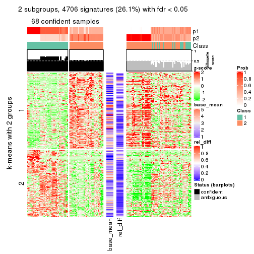</p>

</div>
<div id='tab-SD-mclust-get-signatures-2'>
<pre><code class="r">get_signatures(res, k = 3)
</code></pre>

<p></p>

</div>
<div id='tab-SD-mclust-get-signatures-3'>
<pre><code class="r">get_signatures(res, k = 4)
</code></pre>

<p>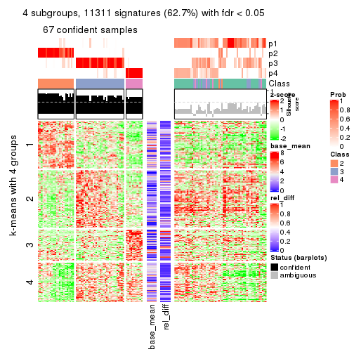</p>

</div>
<div id='tab-SD-mclust-get-signatures-4'>
<pre><code class="r">get_signatures(res, k = 5)
</code></pre>

<p></p>

</div>
<div id='tab-SD-mclust-get-signatures-5'>
<pre><code class="r">get_signatures(res, k = 6)
</code></pre>

<p></p>

</div>
</div>


Signature heatmaps where rows are not scaled:


<script>
$( function() {
	$( '#tabs-SD-mclust-get-signatures-no-scale' ).tabs();
} );
</script>
<div id='tabs-SD-mclust-get-signatures-no-scale'>
<ul>
<li><a href='#tab-SD-mclust-get-signatures-no-scale-1'>k = 2</a></li>
<li><a href='#tab-SD-mclust-get-signatures-no-scale-2'>k = 3</a></li>
<li><a href='#tab-SD-mclust-get-signatures-no-scale-3'>k = 4</a></li>
<li><a href='#tab-SD-mclust-get-signatures-no-scale-4'>k = 5</a></li>
<li><a href='#tab-SD-mclust-get-signatures-no-scale-5'>k = 6</a></li>
</ul>
<div id='tab-SD-mclust-get-signatures-no-scale-1'>
<pre><code class="r">get_signatures(res, k = 2, scale_rows = FALSE)
</code></pre>

<p></p>

</div>
<div id='tab-SD-mclust-get-signatures-no-scale-2'>
<pre><code class="r">get_signatures(res, k = 3, scale_rows = FALSE)
</code></pre>

<p></p>

</div>
<div id='tab-SD-mclust-get-signatures-no-scale-3'>
<pre><code class="r">get_signatures(res, k = 4, scale_rows = FALSE)
</code></pre>

<p>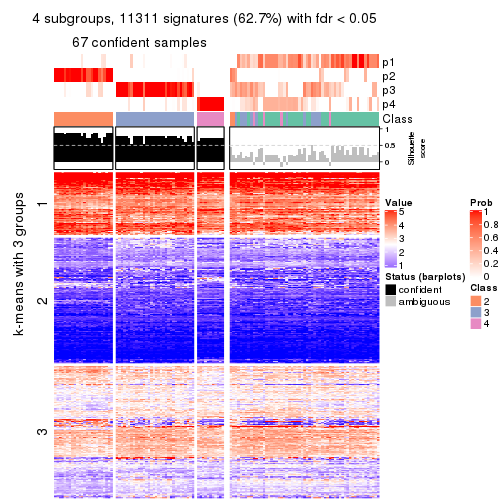</p>

</div>
<div id='tab-SD-mclust-get-signatures-no-scale-4'>
<pre><code class="r">get_signatures(res, k = 5, scale_rows = FALSE)
</code></pre>

<p></p>

</div>
<div id='tab-SD-mclust-get-signatures-no-scale-5'>
<pre><code class="r">get_signatures(res, k = 6, scale_rows = FALSE)
</code></pre>

<p></p>

</div>
</div>


Compare the overlap of signatures from different k:

```r
compare_signatures(res)
```


`get_signature()` returns a data frame invisibly. TO get the list of signatures, the function
call should be assigned to a variable explicitly. In following code, if `plot` argument is set
to `FALSE`, no heatmap is plotted while only the differential analysis is performed.

```r
# code only for demonstration
tb = get_signature(res, k = ..., plot = FALSE)
```

An example of the output of `tb` is:

```
#>   which_row         fdr    mean_1    mean_2 scaled_mean_1 scaled_mean_2 km
#> 1        38 0.042760348  8.373488  9.131774    -0.5533452     0.5164555  1
#> 2        40 0.018707592  7.106213  8.469186    -0.6173731     0.5762149  1
#> 3        55 0.019134737 10.221463 11.207825    -0.6159697     0.5749050  1
#> 4        59 0.006059896  5.921854  7.869574    -0.6899429     0.6439467  1
#> 5        60 0.018055526  8.928898 10.211722    -0.6204761     0.5791110  1
#> 6        98 0.009384629 15.714769 14.887706     0.6635654    -0.6193277  2
...
```

The columns in `tb` are:

1. `which_row`: row indices corresponding to the input matrix.
2. `fdr`: FDR for the differential test. 
3. `mean_x`: The mean value in group x.
4. `scaled_mean_x`: The mean value in group x after rows are scaled.
5. `km`: Row groups if k-means clustering is applied to rows.


UMAP plot which shows how samples are separated.


<script>
$( function() {
	$( '#tabs-SD-mclust-dimension-reduction' ).tabs();
} );
</script>
<div id='tabs-SD-mclust-dimension-reduction'>
<ul>
<li><a href='#tab-SD-mclust-dimension-reduction-1'>k = 2</a></li>
<li><a href='#tab-SD-mclust-dimension-reduction-2'>k = 3</a></li>
<li><a href='#tab-SD-mclust-dimension-reduction-3'>k = 4</a></li>
<li><a href='#tab-SD-mclust-dimension-reduction-4'>k = 5</a></li>
<li><a href='#tab-SD-mclust-dimension-reduction-5'>k = 6</a></li>
</ul>
<div id='tab-SD-mclust-dimension-reduction-1'>
<pre><code class="r">dimension_reduction(res, k = 2, method = &quot;UMAP&quot;)
</code></pre>

<p></p>

</div>
<div id='tab-SD-mclust-dimension-reduction-2'>
<pre><code class="r">dimension_reduction(res, k = 3, method = &quot;UMAP&quot;)
</code></pre>

<p></p>

</div>
<div id='tab-SD-mclust-dimension-reduction-3'>
<pre><code class="r">dimension_reduction(res, k = 4, method = &quot;UMAP&quot;)
</code></pre>

<p></p>

</div>
<div id='tab-SD-mclust-dimension-reduction-4'>
<pre><code class="r">dimension_reduction(res, k = 5, method = &quot;UMAP&quot;)
</code></pre>

<p></p>

</div>
<div id='tab-SD-mclust-dimension-reduction-5'>
<pre><code class="r">dimension_reduction(res, k = 6, method = &quot;UMAP&quot;)
</code></pre>

<p></p>

</div>
</div>


Following heatmap shows how subgroups are split when increasing `k`:

```r
collect_classes(res)
```


If matrix rows can be associated to genes, consider to use `GO_Enrichment(res,
...)` to perform function enrichment for the signature genes.


 

---------------------------------------------------


### SD:NMF**


The object with results only for a single top-value method and a single partition method 
can be extracted as:

```r
res = res_list["SD", "NMF"]
# you can also extract it by
# res = res_list["SD:NMF"]
```

A summary of `res` and all the functions that can be applied to it:

```r
res
```

```
#> A 'ConsensusPartition' object with k = 2, 3, 4, 5, 6.
#>   On a matrix with 18041 rows and 126 columns.
#>   Top rows (1000, 2000, 3000, 4000, 5000) are extracted by 'SD' method.
#>   Subgroups are detected by 'NMF' method.
#>   Performed in total 1250 partitions by row resampling.
#>   Best k for subgroups seems to be 2.
#> 
#> Following methods can be applied to this 'ConsensusPartition' object:
#>  [1] "cola_report"             "collect_classes"         "collect_plots"          
#>  [4] "collect_stats"           "colnames"                "compare_signatures"     
#>  [7] "consensus_heatmap"       "dimension_reduction"     "functional_enrichment"  
#> [10] "get_anno_col"            "get_anno"                "get_classes"            
#> [13] "get_consensus"           "get_matrix"              "get_membership"         
#> [16] "get_param"               "get_signatures"          "get_stats"              
#> [19] "is_best_k"               "is_stable_k"             "membership_heatmap"     
#> [22] "ncol"                    "nrow"                    "plot_ecdf"              
#> [25] "rownames"                "select_partition_number" "show"                   
#> [28] "suggest_best_k"          "test_to_known_factors"
```

`collect_plots()` function collects all the plots made from `res` for all `k` (number of partitions)
into one single page to provide an easy and fast comparison between different `k`.

```r
collect_plots(res)
```


The plots are:

- The first row: a plot of the ECDF (Empirical cumulative distribution
  function) curves of the consensus matrix for each `k` and the heatmap of
  predicted classes for each `k`.
- The second row: heatmaps of the consensus matrix for each `k`.
- The third row: heatmaps of the membership matrix for each `k`.
- The fouth row: heatmaps of the signatures for each `k`.

All the plots in panels can be made by individual functions and they are
plotted later in this section.

`select_partition_number()` produces several plots showing different
statistics for choosing "optimized" `k`. There are following statistics:

- ECDF curves of the consensus matrix for each `k`;
- 1-PAC. [The PAC
  score](https://en.wikipedia.org/wiki/Consensus_clustering#Over-interpretation_potential_of_consensus_clustering)
  measures the proportion of the ambiguous subgrouping.
- Mean silhouette score.
- Concordance. The mean probability of fiting the consensus class ids in all
  partitions.
- Area increased. Denote $A_k$ as the area under the ECDF curve for current
  `k`, the area increased is defined as $A_k - A_{k-1}$.
- Rand index. The percent of pairs of samples that are both in a same cluster
  or both are not in a same cluster in the partition of k and k-1.
- Jaccard index. The ratio of pairs of samples are both in a same cluster in
  the partition of k and k-1 and the pairs of samples are both in a same
  cluster in the partition k or k-1.

The detailed explanations of these statistics can be found in [the cola
vignette](http://bioconductor.org/packages/devel/bioc/vignettes/cola/inst/doc/cola.html#toc_13).

Generally speaking, lower PAC score, higher mean silhouette score or higher
concordance corresponds to better partition. Rand index and Jaccard index
measure how similar the current partition is compared to partition with `k-1`.
If they are too similar, we won't accept `k` is better than `k-1`.

```r
select_partition_number(res)
```


The numeric values for all these statistics can be obtained by `get_stats()`.

```r
get_stats(res)
```

```
#>   k 1-PAC mean_silhouette concordance area_increased  Rand Jaccard
#> 2 2 0.966           0.933       0.973         0.4587 0.547   0.547
#> 3 3 0.746           0.830       0.929         0.4416 0.722   0.522
#> 4 4 0.664           0.746       0.851         0.0993 0.873   0.660
#> 5 5 0.742           0.771       0.860         0.0866 0.885   0.620
#> 6 6 0.786           0.689       0.819         0.0435 0.951   0.774
```

`suggest_best_k()` suggests the best $k$ based on these statistics. The rules are as follows:

- All $k$ with Jaccard index larger than 0.95 are removed because the increase of
  the partition number does not provides enough extra information. If all $k$ are removed,
  the best $k$ is assigned by `NA`.
- For $k$ with 1-PAC larger than 0.9, the maximal $k$ is taken as the "best k". Other $k$ is called "optional k".
- If it does not fit the second rule. The $k$ with the highest vote of highest
  1-PAC, mean silhouette and concordance is taken as the "best k".

```r
suggest_best_k(res)
```

```
#> [1] 2
```


Following shows the table of the partitions (You need to click the **show/hide
code output** link to see it). The membership matrix (columns with name `p*`)
is inferred by
[`clue::cl_consensus()`](https://www.rdocumentation.org/link/cl_consensus?package=clue)
function with the `SE` method. Basically the value in the membership matrix
represents the probability to belong to a certain group. The finall class
label for an item is determined with the group with highest probability it
belongs to.

In `get_classes()` function, the entropy is calculated from the membership
matrix and the silhouette score is calculated from the consensus matrix.


<script>
$( function() {
	$( '#tabs-SD-NMF-get-classes' ).tabs();
} );
</script>
<div id='tabs-SD-NMF-get-classes'>
<ul>
<li><a href='#tab-SD-NMF-get-classes-1'>k = 2</a></li>
<li><a href='#tab-SD-NMF-get-classes-2'>k = 3</a></li>
<li><a href='#tab-SD-NMF-get-classes-3'>k = 4</a></li>
<li><a href='#tab-SD-NMF-get-classes-4'>k = 5</a></li>
<li><a href='#tab-SD-NMF-get-classes-5'>k = 6</a></li>
</ul>

<div id='tab-SD-NMF-get-classes-1'>
<p><a id='tab-SD-NMF-get-classes-1-a' style='color:#0366d6' href='#'>show/hide code output</a></p>
<pre><code class="r">cbind(get_classes(res, k = 2), get_membership(res, k = 2))
</code></pre>

<pre><code>#&gt;                                      class entropy silhouette    p1    p2
#&gt; DC1F29A2-39DE-44AD-936A-54B2B32D6370     1  0.0000      0.971 1.000 0.000
#&gt; FA3C3413-FA8C-4A29-B9CA-5BC3A56274A8     2  0.0000      0.974 0.000 1.000
#&gt; B9B72975-8134-475C-BC0B-0CFDB24F636A     2  0.0000      0.974 0.000 1.000
#&gt; F44DB757-4D00-4BFC-99C5-AA82F99C5BDA     2  0.0000      0.974 0.000 1.000
#&gt; 3BD942BB-A3A7-4993-B3F1-B8641626B773     1  0.9087      0.531 0.676 0.324
#&gt; 431F73A2-2AB3-4101-B610-7FC02A7097EC     1  0.0000      0.971 1.000 0.000
#&gt; 3067683D-43D4-4F6D-9338-17F6A75E4B25     2  0.9635      0.348 0.388 0.612
#&gt; 2CE91B81-7CBE-4698-AFEE-6A154313D231     2  0.0000      0.974 0.000 1.000
#&gt; A639CF4F-4591-4337-A12E-BED71EDDA10B     1  0.0000      0.971 1.000 0.000
#&gt; 5482053D-9F48-4773-B68A-302B3A612503     1  0.0000      0.971 1.000 0.000
#&gt; A31D342D-C67C-428B-BAED-C6E844277A09     1  0.0000      0.971 1.000 0.000
#&gt; 0E9C5985-9AE0-4098-A076-6FFBBDF05110     2  0.0000      0.974 0.000 1.000
#&gt; 08CCF8A0-15B7-4A13-BC43-6B3B3E2DDE95     2  0.3733      0.907 0.072 0.928
#&gt; 10577D5B-AD56-403F-A562-73A9ACF2045B     1  0.0000      0.971 1.000 0.000
#&gt; C940D443-5DDA-4403-868B-7AA6B9A50FC4     1  0.0000      0.971 1.000 0.000
#&gt; 89D4D945-A717-495F-B253-F5A17CF5B9FA     2  0.0000      0.974 0.000 1.000
#&gt; DC55EE78-203F-4092-9B83-14B1A529194B     2  0.0000      0.974 0.000 1.000
#&gt; 8F7368BE-EB41-4192-89AA-9E0428C08851     1  0.0000      0.971 1.000 0.000
#&gt; F772EA39-E408-4908-BADD-C786D702BF9B     2  0.0000      0.974 0.000 1.000
#&gt; FD693D10-3ADA-4028-8392-41D2F0296F7E     1  0.0000      0.971 1.000 0.000
#&gt; 84F16966-7640-49F9-95D1-7648FF74DCC9     2  0.0000      0.974 0.000 1.000
#&gt; D26DAA2F-AE6A-42E1-9F1F-01943B99785F     1  0.9866      0.240 0.568 0.432
#&gt; F325847E-F046-4B67-B01C-16919C401020     1  0.0000      0.971 1.000 0.000
#&gt; 19EB2B10-2529-4A94-8FAE-1CE371A602D9     1  0.0000      0.971 1.000 0.000
#&gt; B94B9CCF-5FB8-44AE-8D9C-A194C6801A27     2  0.0000      0.974 0.000 1.000
#&gt; D2678E70-542A-4AB2-B881-12D66DBA44F5     1  0.0000      0.971 1.000 0.000
#&gt; 4961CA2A-70CD-42AB-A676-4A98C85F449F     1  0.0376      0.968 0.996 0.004
#&gt; 5AA74C5C-2AD1-4D59-A030-E964EB199581     1  0.0000      0.971 1.000 0.000
#&gt; F9E11A1B-BD93-438F-9670-6FB7DFF9E910     1  0.0000      0.971 1.000 0.000
#&gt; FB78CA5A-C8B9-42AF-9DAE-799CAB280B2E     1  0.0000      0.971 1.000 0.000
#&gt; A8E48877-F8AB-44DD-A18B-194D87C44931     2  0.2236      0.944 0.036 0.964
#&gt; CA50C495-F37E-4743-867D-FAF2DCC3376A     1  0.0000      0.971 1.000 0.000
#&gt; 37342369-EC22-4904-8CCD-A0DC6BD8D183     2  0.0000      0.974 0.000 1.000
#&gt; 91BA5F90-9174-4533-A050-39A28E34A94D     1  0.0000      0.971 1.000 0.000
#&gt; 5BC371AC-1915-44E9-A114-2963E131EC8D     1  0.0000      0.971 1.000 0.000
#&gt; 74A6C31A-7F21-45AF-A170-18C326D2AE69     1  0.0000      0.971 1.000 0.000
#&gt; 984F27EF-D4D7-4E68-BD64-776FDFC04D07     1  0.0000      0.971 1.000 0.000
#&gt; B05701C5-8C44-4FD1-94C9-FC0255A2EA24     1  0.0000      0.971 1.000 0.000
#&gt; 91E4119C-2CE6-4447-A125-6A4F403A89E6     1  0.9209      0.505 0.664 0.336
#&gt; 1570FCE7-F1B4-4BDF-A398-355EDF030864     2  0.0000      0.974 0.000 1.000
#&gt; 604C06E9-A00E-435E-847A-3992922A5C56     1  0.0000      0.971 1.000 0.000
#&gt; 455C9007-6FF4-4D63-83FA-4915F0331F9A     1  0.0000      0.971 1.000 0.000
#&gt; FB8BD3CF-D2EC-47B6-B67F-65ADC1C3A6A7     2  0.0938      0.965 0.012 0.988
#&gt; 9DC7443A-3C8F-4025-8312-3C98BF28D736     1  0.0000      0.971 1.000 0.000
#&gt; CB207A52-09AC-49D3-8240-5840CDFBB154     1  0.0000      0.971 1.000 0.000
#&gt; 2A335049-AD9F-4B32-92B7-69B04B0CF2BA     1  0.0000      0.971 1.000 0.000
#&gt; 6ACA6293-371E-428D-BBAE-ABFD410C886F     2  0.0000      0.974 0.000 1.000
#&gt; E8929929-73F9-4DB7-ABBA-0852BEFFFF7E     1  0.0000      0.971 1.000 0.000
#&gt; 5E343116-414B-41F2-AAEE-A3225450135A     1  0.0000      0.971 1.000 0.000
#&gt; 0A39073C-157C-48A1-B125-A6A04CB738DA     2  0.0376      0.971 0.004 0.996
#&gt; 300D78E6-1C7E-4114-80EA-9204A6818B9A     1  0.0000      0.971 1.000 0.000
#&gt; DAAF55AA-ED48-4221-9CD6-D1DEB6376017     1  0.0000      0.971 1.000 0.000
#&gt; D76FCF4A-4ACF-41EF-A120-64136D6C845E     1  0.1184      0.957 0.984 0.016
#&gt; AD294665-6F90-459C-90D5-3058F210225D     1  0.0000      0.971 1.000 0.000
#&gt; 92E8AD7A-1084-44C8-BDC0-FE4E47B6143F     2  0.0000      0.974 0.000 1.000
#&gt; 5644A861-3C59-486D-8FBE-4DF6A3B19558     1  0.0000      0.971 1.000 0.000
#&gt; 1BF8AAE7-B771-4CF2-8B1C-D2BEB5E6579E     1  0.0000      0.971 1.000 0.000
#&gt; A54731AE-FC40-407F-8D10-67DDC122237D     2  0.0000      0.974 0.000 1.000
#&gt; 179DC906-5654-4CBA-9C27-C9560B5F12DE     1  0.0000      0.971 1.000 0.000
#&gt; 979B9A2B-2D81-47C3-A553-9B9441CAAE47     1  0.0000      0.971 1.000 0.000
#&gt; D69BD86A-08FB-49DA-9084-2725F6C9195F     1  0.0000      0.971 1.000 0.000
#&gt; 84611033-BCF7-49D7-9B91-DA29B62AC8D3     1  0.0000      0.971 1.000 0.000
#&gt; 8AA1DA3E-8C00-4653-AA33-EA70531C1E50     2  0.0000      0.974 0.000 1.000
#&gt; CEBE9594-0F19-46B4-AF7D-F8DF33E00AFB     1  0.0000      0.971 1.000 0.000
#&gt; C68E82D2-2BD3-41E9-92D7-D4C06E1953B2     1  0.0000      0.971 1.000 0.000
#&gt; B855EF89-1E76-4408-AA65-61A0F0A4F412     2  0.0000      0.974 0.000 1.000
#&gt; 4488EFB3-5B01-41E3-B57E-8E4F607CF448     1  0.0000      0.971 1.000 0.000
#&gt; C2BD8440-CAC6-4FE5-8EBB-5E6AE308D52F     1  0.0000      0.971 1.000 0.000
#&gt; E0E50F10-1FED-41C1-84DB-81A46F25D7E9     1  0.0000      0.971 1.000 0.000
#&gt; EE16D845-31F2-4178-800B-CA2C358841AD     2  0.0000      0.974 0.000 1.000
#&gt; 169828CF-5693-4A46-B5D7-E45CBA9DF317     2  0.0000      0.974 0.000 1.000
#&gt; 51077BA3-AEE0-4BD4-A1B1-1B0A811642A1     1  0.0000      0.971 1.000 0.000
#&gt; D2F4E240-C44C-4CF7-8016-6CACD370D093     1  0.0000      0.971 1.000 0.000
#&gt; 721CDBE6-FC85-4C30-B23E-28407340286F     1  0.0000      0.971 1.000 0.000
#&gt; 392897E4-6009-422C-B461-649F4DDF260C     1  0.0000      0.971 1.000 0.000
#&gt; 617E13D2-6924-45F8-A8DE-BE21B718F822     1  0.0000      0.971 1.000 0.000
#&gt; 5746C00F-9CBB-46B7-83FD-90B2AB3F507B     1  0.0000      0.971 1.000 0.000
#&gt; 982B4344-A223-4D1F-9485-2E56F9FD45C0     2  0.0000      0.974 0.000 1.000
#&gt; E5557F52-015D-49DC-9E23-989FC259976F     1  0.0000      0.971 1.000 0.000
#&gt; F3135F5E-2E90-4923-B634-E994563D17B7     1  0.0000      0.971 1.000 0.000
#&gt; D1ED15A5-9802-4314-B556-E89EB772D1F0     1  0.0000      0.971 1.000 0.000
#&gt; 222B06E3-FCFB-4104-92C3-D73BC31854D4     1  0.0000      0.971 1.000 0.000
#&gt; 4C810FFA-ED07-4F4C-9F81-B8F1CF4956F7     1  0.0376      0.968 0.996 0.004
#&gt; 9A608964-ED12-4E6E-9D3A-430F59FFF65B     1  0.0000      0.971 1.000 0.000
#&gt; 4087357F-C17A-4992-A8AB-41ACA2F72001     1  0.0000      0.971 1.000 0.000
#&gt; B3F013A5-BCB8-4CE0-86B2-634EE180AA6E     2  0.0000      0.974 0.000 1.000
#&gt; 322AF320-1379-4F51-AFDC-5292A060CD52     2  0.0000      0.974 0.000 1.000
#&gt; 53A96249-66D5-4C26-893B-ADC71481D261     2  0.0000      0.974 0.000 1.000
#&gt; 1AB7A6F2-14BD-447C-B2E3-DEB0CE56B209     1  0.0000      0.971 1.000 0.000
#&gt; 8B4BCDA0-6787-4A55-99F7-AAF22AF85BA6     2  0.0000      0.974 0.000 1.000
#&gt; 5D9D9E08-2C2C-414E-9547-62799F90D543     2  0.0000      0.974 0.000 1.000
#&gt; C345CD17-E4F4-41D5-9891-FEFB19342C52     1  0.0000      0.971 1.000 0.000
#&gt; 1AF8FDE1-1A74-41F6-A1C5-4952CDFB7D3F     1  0.0000      0.971 1.000 0.000
#&gt; BC3405FF-0660-4B2B-8DC1-5F34D3133078     1  0.0000      0.971 1.000 0.000
#&gt; C2662596-6E2F-4924-B051-CEA1AC87B197     1  0.0000      0.971 1.000 0.000
#&gt; 39AE85F7-49FB-4438-BD41-6AC812FA1C72     1  0.0000      0.971 1.000 0.000
#&gt; 6FF266DB-3F08-43F2-8F6F-679F805B80B8     1  0.9608      0.391 0.616 0.384
#&gt; B03B7B81-BBD6-4194-BC5E-6EDF0D3F015A     1  0.0000      0.971 1.000 0.000
#&gt; C7617D56-F13C-4C43-906C-BD458C5DC4CD     1  0.0000      0.971 1.000 0.000
#&gt; 09420F8B-7A71-4B32-8388-4767670F1FEB     1  0.0000      0.971 1.000 0.000
#&gt; 6AF47534-74FF-4128-865B-4E8EE1FFB469     2  0.0000      0.974 0.000 1.000
#&gt; 8FF9E94A-2ED2-4727-947F-D524D7ECE815     1  0.0000      0.971 1.000 0.000
#&gt; A390E20D-03F9-40E4-A132-0FA5C2BEDB63     1  0.0000      0.971 1.000 0.000
#&gt; A489CCCA-1374-4071-80CE-05B83C9A0D5E     2  0.0000      0.974 0.000 1.000
#&gt; 2D962371-EC83-490C-A663-478AF383BC1B     2  0.0000      0.974 0.000 1.000
#&gt; D91B31A1-EE71-4726-B94C-0CC2815E9D4E     2  0.0000      0.974 0.000 1.000
#&gt; E0123C5C-E1D1-4162-9895-CC8B01949D84     1  0.9248      0.493 0.660 0.340
#&gt; EC73959A-2728-49FE-B72A-790BB14F4CBF     1  0.0000      0.971 1.000 0.000
#&gt; A60DC925-7343-496E-900D-0DD81D5C8123     2  0.1633      0.955 0.024 0.976
#&gt; 659B64DB-F4A5-43BD-811B-05004CB49D99     1  0.0000      0.971 1.000 0.000
#&gt; 6969B6B2-7616-4664-9696-C4DACD10537B     2  0.0000      0.974 0.000 1.000
#&gt; 2F6392DE-0D54-4768-B062-907C81E5B0CC     1  0.7950      0.685 0.760 0.240
#&gt; C74BE8C5-BA6D-4596-9D67-3C731799F999     1  0.0000      0.971 1.000 0.000
#&gt; 79A7647F-BDBA-45A2-B207-ABF788F6CC95     1  0.0000      0.971 1.000 0.000
#&gt; D47D0433-2313-4A2F-B268-5AD293D7534E     2  0.0000      0.974 0.000 1.000
#&gt; C5058B93-C1DA-43B9-9951-B23A9810AA6E     1  0.7376      0.733 0.792 0.208
#&gt; 2629FEE3-A203-4411-8A70-02A796C9505C     2  0.9954      0.134 0.460 0.540
#&gt; 1AF329E4-11D4-4CFC-801F-C24A1EA33102     2  0.0000      0.974 0.000 1.000
#&gt; D453BEF8-3F18-4B89-BA42-CE74EB105032     1  0.0000      0.971 1.000 0.000
#&gt; B12A4446-2310-4139-897F-CA030478CBD5     1  0.0000      0.971 1.000 0.000
#&gt; BCAB1918-5FA9-4CBD-85CB-008743FEA2CC     1  0.0000      0.971 1.000 0.000
#&gt; 9A5432D3-19EE-47B4-BD88-698DEC75A5E9     2  0.0000      0.974 0.000 1.000
#&gt; A608BCEB-2C27-4927-A308-E6975F641722     2  0.0000      0.974 0.000 1.000
#&gt; E4752275-7BF6-4C1E-8A45-C7D571ED85AD     2  0.0000      0.974 0.000 1.000
#&gt; FDEC1714-C02D-4AB7-AE82-789E9D709EDE     1  0.0000      0.971 1.000 0.000
#&gt; 33737781-8638-4FA2-AD4C-E888BB9343D8     2  0.3274      0.920 0.060 0.940
</code></pre>

<script>
$('#tab-SD-NMF-get-classes-1-a').parent().next().next().hide();
$('#tab-SD-NMF-get-classes-1-a').click(function(){
  $('#tab-SD-NMF-get-classes-1-a').parent().next().next().toggle();
  return(false);
});
</script>
</div>

<div id='tab-SD-NMF-get-classes-2'>
<p><a id='tab-SD-NMF-get-classes-2-a' style='color:#0366d6' href='#'>show/hide code output</a></p>
<pre><code class="r">cbind(get_classes(res, k = 3), get_membership(res, k = 3))
</code></pre>

<pre><code>#&gt;                                      class entropy silhouette    p1    p2    p3
#&gt; DC1F29A2-39DE-44AD-936A-54B2B32D6370     3  0.1289     0.8980 0.032 0.000 0.968
#&gt; FA3C3413-FA8C-4A29-B9CA-5BC3A56274A8     2  0.0000     0.9232 0.000 1.000 0.000
#&gt; B9B72975-8134-475C-BC0B-0CFDB24F636A     2  0.0000     0.9232 0.000 1.000 0.000
#&gt; F44DB757-4D00-4BFC-99C5-AA82F99C5BDA     2  0.0000     0.9232 0.000 1.000 0.000
#&gt; 3BD942BB-A3A7-4993-B3F1-B8641626B773     3  0.2959     0.8435 0.000 0.100 0.900
#&gt; 431F73A2-2AB3-4101-B610-7FC02A7097EC     3  0.0237     0.9100 0.000 0.004 0.996
#&gt; 3067683D-43D4-4F6D-9338-17F6A75E4B25     3  0.0237     0.9100 0.000 0.004 0.996
#&gt; 2CE91B81-7CBE-4698-AFEE-6A154313D231     2  0.0000     0.9232 0.000 1.000 0.000
#&gt; A639CF4F-4591-4337-A12E-BED71EDDA10B     3  0.0000     0.9118 0.000 0.000 1.000
#&gt; 5482053D-9F48-4773-B68A-302B3A612503     1  0.0000     0.9307 1.000 0.000 0.000
#&gt; A31D342D-C67C-428B-BAED-C6E844277A09     1  0.6305    -0.0392 0.516 0.000 0.484
#&gt; 0E9C5985-9AE0-4098-A076-6FFBBDF05110     2  0.0892     0.9098 0.000 0.980 0.020
#&gt; 08CCF8A0-15B7-4A13-BC43-6B3B3E2DDE95     3  0.4452     0.7504 0.000 0.192 0.808
#&gt; 10577D5B-AD56-403F-A562-73A9ACF2045B     1  0.6008     0.3924 0.628 0.000 0.372
#&gt; C940D443-5DDA-4403-868B-7AA6B9A50FC4     3  0.0000     0.9118 0.000 0.000 1.000
#&gt; 89D4D945-A717-495F-B253-F5A17CF5B9FA     2  0.5254     0.6306 0.000 0.736 0.264
#&gt; DC55EE78-203F-4092-9B83-14B1A529194B     2  0.0000     0.9232 0.000 1.000 0.000
#&gt; 8F7368BE-EB41-4192-89AA-9E0428C08851     1  0.0000     0.9307 1.000 0.000 0.000
#&gt; F772EA39-E408-4908-BADD-C786D702BF9B     2  0.0000     0.9232 0.000 1.000 0.000
#&gt; FD693D10-3ADA-4028-8392-41D2F0296F7E     1  0.0237     0.9307 0.996 0.000 0.004
#&gt; 84F16966-7640-49F9-95D1-7648FF74DCC9     2  0.0000     0.9232 0.000 1.000 0.000
#&gt; D26DAA2F-AE6A-42E1-9F1F-01943B99785F     3  0.7157     0.5731 0.056 0.276 0.668
#&gt; F325847E-F046-4B67-B01C-16919C401020     3  0.0000     0.9118 0.000 0.000 1.000
#&gt; 19EB2B10-2529-4A94-8FAE-1CE371A602D9     3  0.0000     0.9118 0.000 0.000 1.000
#&gt; B94B9CCF-5FB8-44AE-8D9C-A194C6801A27     2  0.0000     0.9232 0.000 1.000 0.000
#&gt; D2678E70-542A-4AB2-B881-12D66DBA44F5     1  0.0237     0.9307 0.996 0.000 0.004
#&gt; 4961CA2A-70CD-42AB-A676-4A98C85F449F     3  0.0000     0.9118 0.000 0.000 1.000
#&gt; 5AA74C5C-2AD1-4D59-A030-E964EB199581     3  0.3116     0.8371 0.108 0.000 0.892
#&gt; F9E11A1B-BD93-438F-9670-6FB7DFF9E910     3  0.0000     0.9118 0.000 0.000 1.000
#&gt; FB78CA5A-C8B9-42AF-9DAE-799CAB280B2E     1  0.4452     0.7279 0.808 0.000 0.192
#&gt; A8E48877-F8AB-44DD-A18B-194D87C44931     2  0.3619     0.8004 0.000 0.864 0.136
#&gt; CA50C495-F37E-4743-867D-FAF2DCC3376A     3  0.0000     0.9118 0.000 0.000 1.000
#&gt; 37342369-EC22-4904-8CCD-A0DC6BD8D183     2  0.0747     0.9117 0.016 0.984 0.000
#&gt; 91BA5F90-9174-4533-A050-39A28E34A94D     1  0.0000     0.9307 1.000 0.000 0.000
#&gt; 5BC371AC-1915-44E9-A114-2963E131EC8D     3  0.4654     0.7385 0.208 0.000 0.792
#&gt; 74A6C31A-7F21-45AF-A170-18C326D2AE69     1  0.0000     0.9307 1.000 0.000 0.000
#&gt; 984F27EF-D4D7-4E68-BD64-776FDFC04D07     1  0.0237     0.9307 0.996 0.000 0.004
#&gt; B05701C5-8C44-4FD1-94C9-FC0255A2EA24     3  0.0000     0.9118 0.000 0.000 1.000
#&gt; 91E4119C-2CE6-4447-A125-6A4F403A89E6     3  0.3752     0.7982 0.000 0.144 0.856
#&gt; 1570FCE7-F1B4-4BDF-A398-355EDF030864     2  0.0000     0.9232 0.000 1.000 0.000
#&gt; 604C06E9-A00E-435E-847A-3992922A5C56     3  0.0000     0.9118 0.000 0.000 1.000
#&gt; 455C9007-6FF4-4D63-83FA-4915F0331F9A     1  0.0237     0.9307 0.996 0.000 0.004
#&gt; FB8BD3CF-D2EC-47B6-B67F-65ADC1C3A6A7     3  0.2625     0.8634 0.000 0.084 0.916
#&gt; 9DC7443A-3C8F-4025-8312-3C98BF28D736     1  0.0237     0.9307 0.996 0.000 0.004
#&gt; CB207A52-09AC-49D3-8240-5840CDFBB154     1  0.0424     0.9281 0.992 0.000 0.008
#&gt; 2A335049-AD9F-4B32-92B7-69B04B0CF2BA     3  0.0000     0.9118 0.000 0.000 1.000
#&gt; 6ACA6293-371E-428D-BBAE-ABFD410C886F     2  0.5760     0.4849 0.000 0.672 0.328
#&gt; E8929929-73F9-4DB7-ABBA-0852BEFFFF7E     3  0.0237     0.9103 0.004 0.000 0.996
#&gt; 5E343116-414B-41F2-AAEE-A3225450135A     3  0.6309     0.0590 0.496 0.000 0.504
#&gt; 0A39073C-157C-48A1-B125-A6A04CB738DA     2  0.6192     0.2404 0.000 0.580 0.420
#&gt; 300D78E6-1C7E-4114-80EA-9204A6818B9A     3  0.0000     0.9118 0.000 0.000 1.000
#&gt; DAAF55AA-ED48-4221-9CD6-D1DEB6376017     1  0.0000     0.9307 1.000 0.000 0.000
#&gt; D76FCF4A-4ACF-41EF-A120-64136D6C845E     3  0.0000     0.9118 0.000 0.000 1.000
#&gt; AD294665-6F90-459C-90D5-3058F210225D     3  0.0000     0.9118 0.000 0.000 1.000
#&gt; 92E8AD7A-1084-44C8-BDC0-FE4E47B6143F     2  0.0000     0.9232 0.000 1.000 0.000
#&gt; 5644A861-3C59-486D-8FBE-4DF6A3B19558     1  0.0000     0.9307 1.000 0.000 0.000
#&gt; 1BF8AAE7-B771-4CF2-8B1C-D2BEB5E6579E     1  0.0237     0.9307 0.996 0.000 0.004
#&gt; A54731AE-FC40-407F-8D10-67DDC122237D     2  0.0000     0.9232 0.000 1.000 0.000
#&gt; 179DC906-5654-4CBA-9C27-C9560B5F12DE     3  0.0000     0.9118 0.000 0.000 1.000
#&gt; 979B9A2B-2D81-47C3-A553-9B9441CAAE47     3  0.2796     0.8586 0.092 0.000 0.908
#&gt; D69BD86A-08FB-49DA-9084-2725F6C9195F     1  0.0000     0.9307 1.000 0.000 0.000
#&gt; 84611033-BCF7-49D7-9B91-DA29B62AC8D3     3  0.0000     0.9118 0.000 0.000 1.000
#&gt; 8AA1DA3E-8C00-4653-AA33-EA70531C1E50     2  0.0000     0.9232 0.000 1.000 0.000
#&gt; CEBE9594-0F19-46B4-AF7D-F8DF33E00AFB     1  0.0000     0.9307 1.000 0.000 0.000
#&gt; C68E82D2-2BD3-41E9-92D7-D4C06E1953B2     3  0.0000     0.9118 0.000 0.000 1.000
#&gt; B855EF89-1E76-4408-AA65-61A0F0A4F412     2  0.0000     0.9232 0.000 1.000 0.000
#&gt; 4488EFB3-5B01-41E3-B57E-8E4F607CF448     3  0.0000     0.9118 0.000 0.000 1.000
#&gt; C2BD8440-CAC6-4FE5-8EBB-5E6AE308D52F     3  0.2261     0.8759 0.068 0.000 0.932
#&gt; E0E50F10-1FED-41C1-84DB-81A46F25D7E9     1  0.0237     0.9307 0.996 0.000 0.004
#&gt; EE16D845-31F2-4178-800B-CA2C358841AD     2  0.0000     0.9232 0.000 1.000 0.000
#&gt; 169828CF-5693-4A46-B5D7-E45CBA9DF317     2  0.0000     0.9232 0.000 1.000 0.000
#&gt; 51077BA3-AEE0-4BD4-A1B1-1B0A811642A1     1  0.0000     0.9307 1.000 0.000 0.000
#&gt; D2F4E240-C44C-4CF7-8016-6CACD370D093     3  0.6305     0.0351 0.484 0.000 0.516
#&gt; 721CDBE6-FC85-4C30-B23E-28407340286F     3  0.0000     0.9118 0.000 0.000 1.000
#&gt; 392897E4-6009-422C-B461-649F4DDF260C     3  0.5465     0.6289 0.288 0.000 0.712
#&gt; 617E13D2-6924-45F8-A8DE-BE21B718F822     1  0.0237     0.9307 0.996 0.000 0.004
#&gt; 5746C00F-9CBB-46B7-83FD-90B2AB3F507B     3  0.0000     0.9118 0.000 0.000 1.000
#&gt; 982B4344-A223-4D1F-9485-2E56F9FD45C0     2  0.0000     0.9232 0.000 1.000 0.000
#&gt; E5557F52-015D-49DC-9E23-989FC259976F     3  0.0000     0.9118 0.000 0.000 1.000
#&gt; F3135F5E-2E90-4923-B634-E994563D17B7     3  0.0000     0.9118 0.000 0.000 1.000
#&gt; D1ED15A5-9802-4314-B556-E89EB772D1F0     3  0.5216     0.6509 0.260 0.000 0.740
#&gt; 222B06E3-FCFB-4104-92C3-D73BC31854D4     1  0.0000     0.9307 1.000 0.000 0.000
#&gt; 4C810FFA-ED07-4F4C-9F81-B8F1CF4956F7     1  0.0237     0.9307 0.996 0.000 0.004
#&gt; 9A608964-ED12-4E6E-9D3A-430F59FFF65B     3  0.0000     0.9118 0.000 0.000 1.000
#&gt; 4087357F-C17A-4992-A8AB-41ACA2F72001     1  0.0237     0.9307 0.996 0.000 0.004
#&gt; B3F013A5-BCB8-4CE0-86B2-634EE180AA6E     2  0.0000     0.9232 0.000 1.000 0.000
#&gt; 322AF320-1379-4F51-AFDC-5292A060CD52     2  0.0000     0.9232 0.000 1.000 0.000
#&gt; 53A96249-66D5-4C26-893B-ADC71481D261     2  0.0000     0.9232 0.000 1.000 0.000
#&gt; 1AB7A6F2-14BD-447C-B2E3-DEB0CE56B209     1  0.1289     0.9068 0.968 0.000 0.032
#&gt; 8B4BCDA0-6787-4A55-99F7-AAF22AF85BA6     2  0.0000     0.9232 0.000 1.000 0.000
#&gt; 5D9D9E08-2C2C-414E-9547-62799F90D543     2  0.0000     0.9232 0.000 1.000 0.000
#&gt; C345CD17-E4F4-41D5-9891-FEFB19342C52     3  0.0000     0.9118 0.000 0.000 1.000
#&gt; 1AF8FDE1-1A74-41F6-A1C5-4952CDFB7D3F     3  0.0000     0.9118 0.000 0.000 1.000
#&gt; BC3405FF-0660-4B2B-8DC1-5F34D3133078     1  0.6168     0.2326 0.588 0.000 0.412
#&gt; C2662596-6E2F-4924-B051-CEA1AC87B197     1  0.0000     0.9307 1.000 0.000 0.000
#&gt; 39AE85F7-49FB-4438-BD41-6AC812FA1C72     3  0.2959     0.8545 0.100 0.000 0.900
#&gt; 6FF266DB-3F08-43F2-8F6F-679F805B80B8     1  0.6111     0.3091 0.604 0.396 0.000
#&gt; B03B7B81-BBD6-4194-BC5E-6EDF0D3F015A     3  0.4750     0.7283 0.216 0.000 0.784
#&gt; C7617D56-F13C-4C43-906C-BD458C5DC4CD     1  0.4865     0.7710 0.832 0.136 0.032
#&gt; 09420F8B-7A71-4B32-8388-4767670F1FEB     1  0.0000     0.9307 1.000 0.000 0.000
#&gt; 6AF47534-74FF-4128-865B-4E8EE1FFB469     2  0.0000     0.9232 0.000 1.000 0.000
#&gt; 8FF9E94A-2ED2-4727-947F-D524D7ECE815     1  0.0000     0.9307 1.000 0.000 0.000
#&gt; A390E20D-03F9-40E4-A132-0FA5C2BEDB63     1  0.0237     0.9307 0.996 0.000 0.004
#&gt; A489CCCA-1374-4071-80CE-05B83C9A0D5E     2  0.2537     0.8599 0.000 0.920 0.080
#&gt; 2D962371-EC83-490C-A663-478AF383BC1B     2  0.0000     0.9232 0.000 1.000 0.000
#&gt; D91B31A1-EE71-4726-B94C-0CC2815E9D4E     2  0.2959     0.8388 0.100 0.900 0.000
#&gt; E0123C5C-E1D1-4162-9895-CC8B01949D84     2  0.6295     0.0655 0.000 0.528 0.472
#&gt; EC73959A-2728-49FE-B72A-790BB14F4CBF     1  0.0000     0.9307 1.000 0.000 0.000
#&gt; A60DC925-7343-496E-900D-0DD81D5C8123     2  0.6008     0.3767 0.372 0.628 0.000
#&gt; 659B64DB-F4A5-43BD-811B-05004CB49D99     1  0.0000     0.9307 1.000 0.000 0.000
#&gt; 6969B6B2-7616-4664-9696-C4DACD10537B     2  0.0000     0.9232 0.000 1.000 0.000
#&gt; 2F6392DE-0D54-4768-B062-907C81E5B0CC     3  0.6663     0.7449 0.124 0.124 0.752
#&gt; C74BE8C5-BA6D-4596-9D67-3C731799F999     1  0.0237     0.9307 0.996 0.000 0.004
#&gt; 79A7647F-BDBA-45A2-B207-ABF788F6CC95     3  0.0000     0.9118 0.000 0.000 1.000
#&gt; D47D0433-2313-4A2F-B268-5AD293D7534E     2  0.0000     0.9232 0.000 1.000 0.000
#&gt; C5058B93-C1DA-43B9-9951-B23A9810AA6E     3  0.3816     0.7927 0.000 0.148 0.852
#&gt; 2629FEE3-A203-4411-8A70-02A796C9505C     3  0.3267     0.8347 0.000 0.116 0.884
#&gt; 1AF329E4-11D4-4CFC-801F-C24A1EA33102     2  0.0000     0.9232 0.000 1.000 0.000
#&gt; D453BEF8-3F18-4B89-BA42-CE74EB105032     3  0.0000     0.9118 0.000 0.000 1.000
#&gt; B12A4446-2310-4139-897F-CA030478CBD5     3  0.0000     0.9118 0.000 0.000 1.000
#&gt; BCAB1918-5FA9-4CBD-85CB-008743FEA2CC     3  0.0000     0.9118 0.000 0.000 1.000
#&gt; 9A5432D3-19EE-47B4-BD88-698DEC75A5E9     2  0.6045     0.3555 0.380 0.620 0.000
#&gt; A608BCEB-2C27-4927-A308-E6975F641722     2  0.0000     0.9232 0.000 1.000 0.000
#&gt; E4752275-7BF6-4C1E-8A45-C7D571ED85AD     2  0.0000     0.9232 0.000 1.000 0.000
#&gt; FDEC1714-C02D-4AB7-AE82-789E9D709EDE     3  0.3482     0.8275 0.128 0.000 0.872
#&gt; 33737781-8638-4FA2-AD4C-E888BB9343D8     3  0.5835     0.4996 0.000 0.340 0.660
</code></pre>

<script>
$('#tab-SD-NMF-get-classes-2-a').parent().next().next().hide();
$('#tab-SD-NMF-get-classes-2-a').click(function(){
  $('#tab-SD-NMF-get-classes-2-a').parent().next().next().toggle();
  return(false);
});
</script>
</div>

<div id='tab-SD-NMF-get-classes-3'>
<p><a id='tab-SD-NMF-get-classes-3-a' style='color:#0366d6' href='#'>show/hide code output</a></p>
<pre><code class="r">cbind(get_classes(res, k = 4), get_membership(res, k = 4))
</code></pre>

<pre><code>#&gt;                                      class entropy silhouette    p1    p2    p3    p4
#&gt; DC1F29A2-39DE-44AD-936A-54B2B32D6370     1  0.6811    -0.1426 0.496 0.000 0.404 0.100
#&gt; FA3C3413-FA8C-4A29-B9CA-5BC3A56274A8     2  0.2781     0.8591 0.016 0.904 0.008 0.072
#&gt; B9B72975-8134-475C-BC0B-0CFDB24F636A     2  0.0000     0.9308 0.000 1.000 0.000 0.000
#&gt; F44DB757-4D00-4BFC-99C5-AA82F99C5BDA     2  0.0469     0.9262 0.012 0.988 0.000 0.000
#&gt; 3BD942BB-A3A7-4993-B3F1-B8641626B773     3  0.7904     0.6624 0.200 0.108 0.596 0.096
#&gt; 431F73A2-2AB3-4101-B610-7FC02A7097EC     3  0.3471     0.8093 0.060 0.000 0.868 0.072
#&gt; 3067683D-43D4-4F6D-9338-17F6A75E4B25     3  0.2075     0.8166 0.044 0.004 0.936 0.016
#&gt; 2CE91B81-7CBE-4698-AFEE-6A154313D231     2  0.2894     0.8554 0.020 0.900 0.008 0.072
#&gt; A639CF4F-4591-4337-A12E-BED71EDDA10B     3  0.3009     0.8077 0.052 0.000 0.892 0.056
#&gt; 5482053D-9F48-4773-B68A-302B3A612503     1  0.1004     0.7391 0.972 0.000 0.004 0.024
#&gt; A31D342D-C67C-428B-BAED-C6E844277A09     1  0.6022     0.5427 0.656 0.000 0.084 0.260
#&gt; 0E9C5985-9AE0-4098-A076-6FFBBDF05110     2  0.1585     0.8999 0.004 0.952 0.040 0.004
#&gt; 08CCF8A0-15B7-4A13-BC43-6B3B3E2DDE95     3  0.2197     0.8100 0.024 0.048 0.928 0.000
#&gt; 10577D5B-AD56-403F-A562-73A9ACF2045B     1  0.3143     0.6872 0.876 0.000 0.100 0.024
#&gt; C940D443-5DDA-4403-868B-7AA6B9A50FC4     3  0.1767     0.8162 0.044 0.000 0.944 0.012
#&gt; 89D4D945-A717-495F-B253-F5A17CF5B9FA     2  0.5000    -0.0131 0.000 0.504 0.496 0.000
#&gt; DC55EE78-203F-4092-9B83-14B1A529194B     2  0.0000     0.9308 0.000 1.000 0.000 0.000
#&gt; 8F7368BE-EB41-4192-89AA-9E0428C08851     1  0.1118     0.7381 0.964 0.000 0.000 0.036
#&gt; F772EA39-E408-4908-BADD-C786D702BF9B     2  0.0336     0.9282 0.008 0.992 0.000 0.000
#&gt; FD693D10-3ADA-4028-8392-41D2F0296F7E     4  0.2408     0.9222 0.104 0.000 0.000 0.896
#&gt; 84F16966-7640-49F9-95D1-7648FF74DCC9     2  0.0000     0.9308 0.000 1.000 0.000 0.000
#&gt; D26DAA2F-AE6A-42E1-9F1F-01943B99785F     3  0.4180     0.7735 0.028 0.080 0.848 0.044
#&gt; F325847E-F046-4B67-B01C-16919C401020     3  0.1677     0.8204 0.012 0.000 0.948 0.040
#&gt; 19EB2B10-2529-4A94-8FAE-1CE371A602D9     3  0.0524     0.8144 0.008 0.000 0.988 0.004
#&gt; B94B9CCF-5FB8-44AE-8D9C-A194C6801A27     2  0.0188     0.9297 0.004 0.996 0.000 0.000
#&gt; D2678E70-542A-4AB2-B881-12D66DBA44F5     4  0.2408     0.9222 0.104 0.000 0.000 0.896
#&gt; 4961CA2A-70CD-42AB-A676-4A98C85F449F     3  0.0817     0.8166 0.024 0.000 0.976 0.000
#&gt; 5AA74C5C-2AD1-4D59-A030-E964EB199581     1  0.5506    -0.1246 0.512 0.000 0.472 0.016
#&gt; F9E11A1B-BD93-438F-9670-6FB7DFF9E910     3  0.1174     0.8129 0.020 0.000 0.968 0.012
#&gt; FB78CA5A-C8B9-42AF-9DAE-799CAB280B2E     1  0.1398     0.7351 0.956 0.000 0.004 0.040
#&gt; A8E48877-F8AB-44DD-A18B-194D87C44931     2  0.6779     0.4841 0.028 0.648 0.232 0.092
#&gt; CA50C495-F37E-4743-867D-FAF2DCC3376A     3  0.1151     0.8179 0.024 0.000 0.968 0.008
#&gt; 37342369-EC22-4904-8CCD-A0DC6BD8D183     2  0.0672     0.9235 0.008 0.984 0.000 0.008
#&gt; 91BA5F90-9174-4533-A050-39A28E34A94D     1  0.0817     0.7282 0.976 0.000 0.000 0.024
#&gt; 5BC371AC-1915-44E9-A114-2963E131EC8D     3  0.6081     0.6684 0.088 0.000 0.652 0.260
#&gt; 74A6C31A-7F21-45AF-A170-18C326D2AE69     1  0.4103     0.5868 0.744 0.000 0.000 0.256
#&gt; 984F27EF-D4D7-4E68-BD64-776FDFC04D07     4  0.2408     0.9222 0.104 0.000 0.000 0.896
#&gt; B05701C5-8C44-4FD1-94C9-FC0255A2EA24     3  0.0524     0.8136 0.004 0.000 0.988 0.008
#&gt; 91E4119C-2CE6-4447-A125-6A4F403A89E6     3  0.3725     0.6905 0.000 0.180 0.812 0.008
#&gt; 1570FCE7-F1B4-4BDF-A398-355EDF030864     2  0.0000     0.9308 0.000 1.000 0.000 0.000
#&gt; 604C06E9-A00E-435E-847A-3992922A5C56     3  0.0524     0.8136 0.004 0.000 0.988 0.008
#&gt; 455C9007-6FF4-4D63-83FA-4915F0331F9A     4  0.2408     0.9222 0.104 0.000 0.000 0.896
#&gt; FB8BD3CF-D2EC-47B6-B67F-65ADC1C3A6A7     3  0.0524     0.8133 0.000 0.008 0.988 0.004
#&gt; 9DC7443A-3C8F-4025-8312-3C98BF28D736     4  0.2345     0.9183 0.100 0.000 0.000 0.900
#&gt; CB207A52-09AC-49D3-8240-5840CDFBB154     4  0.3837     0.6282 0.224 0.000 0.000 0.776
#&gt; 2A335049-AD9F-4B32-92B7-69B04B0CF2BA     3  0.4212     0.7246 0.216 0.000 0.772 0.012
#&gt; 6ACA6293-371E-428D-BBAE-ABFD410C886F     3  0.7485     0.3062 0.028 0.396 0.484 0.092
#&gt; E8929929-73F9-4DB7-ABBA-0852BEFFFF7E     3  0.0804     0.8145 0.012 0.000 0.980 0.008
#&gt; 5E343116-414B-41F2-AAEE-A3225450135A     1  0.8013     0.0808 0.388 0.004 0.332 0.276
#&gt; 0A39073C-157C-48A1-B125-A6A04CB738DA     3  0.6395     0.2167 0.000 0.460 0.476 0.064
#&gt; 300D78E6-1C7E-4114-80EA-9204A6818B9A     3  0.6415     0.6389 0.288 0.000 0.612 0.100
#&gt; DAAF55AA-ED48-4221-9CD6-D1DEB6376017     1  0.4072     0.5874 0.748 0.000 0.000 0.252
#&gt; D76FCF4A-4ACF-41EF-A120-64136D6C845E     3  0.5265     0.7600 0.160 0.000 0.748 0.092
#&gt; AD294665-6F90-459C-90D5-3058F210225D     3  0.6386     0.6831 0.236 0.000 0.640 0.124
#&gt; 92E8AD7A-1084-44C8-BDC0-FE4E47B6143F     2  0.0469     0.9264 0.012 0.988 0.000 0.000
#&gt; 5644A861-3C59-486D-8FBE-4DF6A3B19558     1  0.3219     0.6752 0.836 0.000 0.000 0.164
#&gt; 1BF8AAE7-B771-4CF2-8B1C-D2BEB5E6579E     4  0.4164     0.7073 0.264 0.000 0.000 0.736
#&gt; A54731AE-FC40-407F-8D10-67DDC122237D     2  0.0336     0.9286 0.000 0.992 0.008 0.000
#&gt; 179DC906-5654-4CBA-9C27-C9560B5F12DE     3  0.5280     0.7633 0.156 0.000 0.748 0.096
#&gt; 979B9A2B-2D81-47C3-A553-9B9441CAAE47     3  0.6036     0.6552 0.072 0.000 0.636 0.292
#&gt; D69BD86A-08FB-49DA-9084-2725F6C9195F     1  0.0336     0.7379 0.992 0.000 0.000 0.008
#&gt; 84611033-BCF7-49D7-9B91-DA29B62AC8D3     3  0.4248     0.7209 0.220 0.000 0.768 0.012
#&gt; 8AA1DA3E-8C00-4653-AA33-EA70531C1E50     2  0.0000     0.9308 0.000 1.000 0.000 0.000
#&gt; CEBE9594-0F19-46B4-AF7D-F8DF33E00AFB     1  0.1474     0.7341 0.948 0.000 0.000 0.052
#&gt; C68E82D2-2BD3-41E9-92D7-D4C06E1953B2     3  0.5102     0.7721 0.136 0.000 0.764 0.100
#&gt; B855EF89-1E76-4408-AA65-61A0F0A4F412     2  0.0000     0.9308 0.000 1.000 0.000 0.000
#&gt; 4488EFB3-5B01-41E3-B57E-8E4F607CF448     3  0.6542     0.6566 0.252 0.000 0.620 0.128
#&gt; C2BD8440-CAC6-4FE5-8EBB-5E6AE308D52F     1  0.7205     0.4131 0.532 0.000 0.296 0.172
#&gt; E0E50F10-1FED-41C1-84DB-81A46F25D7E9     4  0.2408     0.9222 0.104 0.000 0.000 0.896
#&gt; EE16D845-31F2-4178-800B-CA2C358841AD     2  0.0188     0.9297 0.004 0.996 0.000 0.000
#&gt; 169828CF-5693-4A46-B5D7-E45CBA9DF317     2  0.0336     0.9282 0.008 0.992 0.000 0.000
#&gt; 51077BA3-AEE0-4BD4-A1B1-1B0A811642A1     1  0.4008     0.5986 0.756 0.000 0.000 0.244
#&gt; D2F4E240-C44C-4CF7-8016-6CACD370D093     1  0.3625     0.6560 0.828 0.000 0.160 0.012
#&gt; 721CDBE6-FC85-4C30-B23E-28407340286F     3  0.0524     0.8138 0.004 0.000 0.988 0.008
#&gt; 392897E4-6009-422C-B461-649F4DDF260C     3  0.4290     0.6871 0.016 0.000 0.772 0.212
#&gt; 617E13D2-6924-45F8-A8DE-BE21B718F822     4  0.2408     0.9222 0.104 0.000 0.000 0.896
#&gt; 5746C00F-9CBB-46B7-83FD-90B2AB3F507B     3  0.4488     0.7907 0.096 0.000 0.808 0.096
#&gt; 982B4344-A223-4D1F-9485-2E56F9FD45C0     2  0.0000     0.9308 0.000 1.000 0.000 0.000
#&gt; E5557F52-015D-49DC-9E23-989FC259976F     3  0.1706     0.8182 0.036 0.000 0.948 0.016
#&gt; F3135F5E-2E90-4923-B634-E994563D17B7     3  0.2224     0.8156 0.032 0.000 0.928 0.040
#&gt; D1ED15A5-9802-4314-B556-E89EB772D1F0     1  0.5149     0.5135 0.648 0.000 0.336 0.016
#&gt; 222B06E3-FCFB-4104-92C3-D73BC31854D4     1  0.1211     0.7338 0.960 0.000 0.000 0.040
#&gt; 4C810FFA-ED07-4F4C-9F81-B8F1CF4956F7     4  0.2408     0.9222 0.104 0.000 0.000 0.896
#&gt; 9A608964-ED12-4E6E-9D3A-430F59FFF65B     3  0.0188     0.8132 0.000 0.000 0.996 0.004
#&gt; 4087357F-C17A-4992-A8AB-41ACA2F72001     4  0.2408     0.9222 0.104 0.000 0.000 0.896
#&gt; B3F013A5-BCB8-4CE0-86B2-634EE180AA6E     2  0.0000     0.9308 0.000 1.000 0.000 0.000
#&gt; 322AF320-1379-4F51-AFDC-5292A060CD52     2  0.0188     0.9299 0.000 0.996 0.004 0.000
#&gt; 53A96249-66D5-4C26-893B-ADC71481D261     2  0.0672     0.9250 0.008 0.984 0.008 0.000
#&gt; 1AB7A6F2-14BD-447C-B2E3-DEB0CE56B209     1  0.1305     0.7349 0.960 0.000 0.004 0.036
#&gt; 8B4BCDA0-6787-4A55-99F7-AAF22AF85BA6     2  0.0336     0.9286 0.000 0.992 0.008 0.000
#&gt; 5D9D9E08-2C2C-414E-9547-62799F90D543     2  0.0000     0.9308 0.000 1.000 0.000 0.000
#&gt; C345CD17-E4F4-41D5-9891-FEFB19342C52     3  0.1938     0.8112 0.052 0.000 0.936 0.012
#&gt; 1AF8FDE1-1A74-41F6-A1C5-4952CDFB7D3F     3  0.6195     0.6809 0.252 0.000 0.648 0.100
#&gt; BC3405FF-0660-4B2B-8DC1-5F34D3133078     4  0.4931     0.5352 0.092 0.000 0.132 0.776
#&gt; C2662596-6E2F-4924-B051-CEA1AC87B197     1  0.1118     0.7352 0.964 0.000 0.000 0.036
#&gt; 39AE85F7-49FB-4438-BD41-6AC812FA1C72     3  0.5790     0.6310 0.044 0.000 0.616 0.340
#&gt; 6FF266DB-3F08-43F2-8F6F-679F805B80B8     1  0.6178     0.5541 0.660 0.112 0.000 0.228
#&gt; B03B7B81-BBD6-4194-BC5E-6EDF0D3F015A     3  0.6500     0.5309 0.080 0.000 0.544 0.376
#&gt; C7617D56-F13C-4C43-906C-BD458C5DC4CD     1  0.3791     0.6745 0.796 0.000 0.004 0.200
#&gt; 09420F8B-7A71-4B32-8388-4767670F1FEB     1  0.1474     0.7335 0.948 0.000 0.000 0.052
#&gt; 6AF47534-74FF-4128-865B-4E8EE1FFB469     2  0.0336     0.9286 0.000 0.992 0.008 0.000
#&gt; 8FF9E94A-2ED2-4727-947F-D524D7ECE815     1  0.3266     0.6747 0.832 0.000 0.000 0.168
#&gt; A390E20D-03F9-40E4-A132-0FA5C2BEDB63     4  0.2408     0.9222 0.104 0.000 0.000 0.896
#&gt; A489CCCA-1374-4071-80CE-05B83C9A0D5E     2  0.6810     0.5204 0.032 0.648 0.232 0.088
#&gt; 2D962371-EC83-490C-A663-478AF383BC1B     2  0.0000     0.9308 0.000 1.000 0.000 0.000
#&gt; D91B31A1-EE71-4726-B94C-0CC2815E9D4E     1  0.3591     0.6240 0.824 0.168 0.000 0.008
#&gt; E0123C5C-E1D1-4162-9895-CC8B01949D84     3  0.4482     0.5661 0.000 0.264 0.728 0.008
#&gt; EC73959A-2728-49FE-B72A-790BB14F4CBF     1  0.4008     0.5986 0.756 0.000 0.000 0.244
#&gt; A60DC925-7343-496E-900D-0DD81D5C8123     2  0.4467     0.7108 0.040 0.788 0.000 0.172
#&gt; 659B64DB-F4A5-43BD-811B-05004CB49D99     1  0.1118     0.7372 0.964 0.000 0.000 0.036
#&gt; 6969B6B2-7616-4664-9696-C4DACD10537B     2  0.0000     0.9308 0.000 1.000 0.000 0.000
#&gt; 2F6392DE-0D54-4768-B062-907C81E5B0CC     3  0.8681     0.5874 0.188 0.124 0.528 0.160
#&gt; C74BE8C5-BA6D-4596-9D67-3C731799F999     4  0.2408     0.9222 0.104 0.000 0.000 0.896
#&gt; 79A7647F-BDBA-45A2-B207-ABF788F6CC95     3  0.0927     0.8131 0.016 0.000 0.976 0.008
#&gt; D47D0433-2313-4A2F-B268-5AD293D7534E     2  0.0000     0.9308 0.000 1.000 0.000 0.000
#&gt; C5058B93-C1DA-43B9-9951-B23A9810AA6E     3  0.7043     0.6633 0.236 0.048 0.636 0.080
#&gt; 2629FEE3-A203-4411-8A70-02A796C9505C     3  0.0376     0.8133 0.004 0.000 0.992 0.004
#&gt; 1AF329E4-11D4-4CFC-801F-C24A1EA33102     2  0.0524     0.9268 0.000 0.988 0.004 0.008
#&gt; D453BEF8-3F18-4B89-BA42-CE74EB105032     3  0.2976     0.7903 0.120 0.000 0.872 0.008
#&gt; B12A4446-2310-4139-897F-CA030478CBD5     3  0.0469     0.8129 0.000 0.000 0.988 0.012
#&gt; BCAB1918-5FA9-4CBD-85CB-008743FEA2CC     3  0.0921     0.8164 0.028 0.000 0.972 0.000
#&gt; 9A5432D3-19EE-47B4-BD88-698DEC75A5E9     2  0.5757     0.5328 0.076 0.684 0.000 0.240
#&gt; A608BCEB-2C27-4927-A308-E6975F641722     2  0.0188     0.9298 0.000 0.996 0.004 0.000
#&gt; E4752275-7BF6-4C1E-8A45-C7D571ED85AD     2  0.0000     0.9308 0.000 1.000 0.000 0.000
#&gt; FDEC1714-C02D-4AB7-AE82-789E9D709EDE     3  0.6028     0.6619 0.076 0.000 0.644 0.280
#&gt; 33737781-8638-4FA2-AD4C-E888BB9343D8     3  0.4972     0.7817 0.040 0.060 0.808 0.092
</code></pre>

<script>
$('#tab-SD-NMF-get-classes-3-a').parent().next().next().hide();
$('#tab-SD-NMF-get-classes-3-a').click(function(){
  $('#tab-SD-NMF-get-classes-3-a').parent().next().next().toggle();
  return(false);
});
</script>
</div>

<div id='tab-SD-NMF-get-classes-4'>
<p><a id='tab-SD-NMF-get-classes-4-a' style='color:#0366d6' href='#'>show/hide code output</a></p>
<pre><code class="r">cbind(get_classes(res, k = 5), get_membership(res, k = 5))
</code></pre>

<pre><code>#&gt;                                      class entropy silhouette    p1    p2    p3    p4    p5
#&gt; DC1F29A2-39DE-44AD-936A-54B2B32D6370     5  0.4745     0.1515 0.424 0.000 0.012 0.004 0.560
#&gt; FA3C3413-FA8C-4A29-B9CA-5BC3A56274A8     5  0.4047     0.5924 0.000 0.320 0.004 0.000 0.676
#&gt; B9B72975-8134-475C-BC0B-0CFDB24F636A     2  0.0404     0.9181 0.000 0.988 0.000 0.000 0.012
#&gt; F44DB757-4D00-4BFC-99C5-AA82F99C5BDA     2  0.2110     0.8672 0.072 0.912 0.000 0.000 0.016
#&gt; 3BD942BB-A3A7-4993-B3F1-B8641626B773     5  0.6272     0.7192 0.140 0.092 0.108 0.000 0.660
#&gt; 431F73A2-2AB3-4101-B610-7FC02A7097EC     3  0.5047    -0.1063 0.024 0.004 0.504 0.000 0.468
#&gt; 3067683D-43D4-4F6D-9338-17F6A75E4B25     3  0.3350     0.8092 0.004 0.040 0.844 0.000 0.112
#&gt; 2CE91B81-7CBE-4698-AFEE-6A154313D231     5  0.4236     0.5782 0.000 0.328 0.004 0.004 0.664
#&gt; A639CF4F-4591-4337-A12E-BED71EDDA10B     3  0.4776     0.4743 0.020 0.000 0.612 0.004 0.364
#&gt; 5482053D-9F48-4773-B68A-302B3A612503     1  0.2233     0.8326 0.892 0.000 0.000 0.004 0.104
#&gt; A31D342D-C67C-428B-BAED-C6E844277A09     1  0.5837     0.5962 0.600 0.000 0.092 0.012 0.296
#&gt; 0E9C5985-9AE0-4098-A076-6FFBBDF05110     2  0.2209     0.8739 0.000 0.912 0.032 0.000 0.056
#&gt; 08CCF8A0-15B7-4A13-BC43-6B3B3E2DDE95     3  0.3634     0.8063 0.000 0.076 0.832 0.004 0.088
#&gt; 10577D5B-AD56-403F-A562-73A9ACF2045B     1  0.4468     0.6641 0.756 0.000 0.172 0.004 0.068
#&gt; C940D443-5DDA-4403-868B-7AA6B9A50FC4     3  0.3239     0.8019 0.012 0.000 0.828 0.004 0.156
#&gt; 89D4D945-A717-495F-B253-F5A17CF5B9FA     2  0.4658     0.0314 0.000 0.504 0.484 0.000 0.012
#&gt; DC55EE78-203F-4092-9B83-14B1A529194B     2  0.0000     0.9208 0.000 1.000 0.000 0.000 0.000
#&gt; 8F7368BE-EB41-4192-89AA-9E0428C08851     1  0.0162     0.8539 0.996 0.000 0.000 0.000 0.004
#&gt; F772EA39-E408-4908-BADD-C786D702BF9B     2  0.0451     0.9195 0.004 0.988 0.000 0.000 0.008
#&gt; FD693D10-3ADA-4028-8392-41D2F0296F7E     4  0.0162     0.9495 0.004 0.000 0.000 0.996 0.000
#&gt; 84F16966-7640-49F9-95D1-7648FF74DCC9     2  0.0000     0.9208 0.000 1.000 0.000 0.000 0.000
#&gt; D26DAA2F-AE6A-42E1-9F1F-01943B99785F     3  0.5236     0.5852 0.008 0.060 0.652 0.000 0.280
#&gt; F325847E-F046-4B67-B01C-16919C401020     3  0.4166     0.4378 0.000 0.000 0.648 0.004 0.348
#&gt; 19EB2B10-2529-4A94-8FAE-1CE371A602D9     3  0.0932     0.8564 0.004 0.000 0.972 0.004 0.020
#&gt; B94B9CCF-5FB8-44AE-8D9C-A194C6801A27     2  0.0566     0.9182 0.004 0.984 0.000 0.000 0.012
#&gt; D2678E70-542A-4AB2-B881-12D66DBA44F5     4  0.0162     0.9495 0.004 0.000 0.000 0.996 0.000
#&gt; 4961CA2A-70CD-42AB-A676-4A98C85F449F     3  0.2848     0.8122 0.000 0.000 0.840 0.004 0.156
#&gt; 5AA74C5C-2AD1-4D59-A030-E964EB199581     1  0.5905     0.3224 0.556 0.000 0.336 0.004 0.104
#&gt; F9E11A1B-BD93-438F-9670-6FB7DFF9E910     3  0.0566     0.8503 0.000 0.000 0.984 0.004 0.012
#&gt; FB78CA5A-C8B9-42AF-9DAE-799CAB280B2E     1  0.0880     0.8415 0.968 0.000 0.000 0.000 0.032
#&gt; A8E48877-F8AB-44DD-A18B-194D87C44931     5  0.4456     0.6748 0.000 0.248 0.032 0.004 0.716
#&gt; CA50C495-F37E-4743-867D-FAF2DCC3376A     3  0.3123     0.7762 0.000 0.000 0.812 0.004 0.184
#&gt; 37342369-EC22-4904-8CCD-A0DC6BD8D183     2  0.1087     0.9128 0.008 0.968 0.000 0.008 0.016
#&gt; 91BA5F90-9174-4533-A050-39A28E34A94D     1  0.0510     0.8540 0.984 0.000 0.000 0.000 0.016
#&gt; 5BC371AC-1915-44E9-A114-2963E131EC8D     5  0.2387     0.7179 0.048 0.000 0.040 0.004 0.908
#&gt; 74A6C31A-7F21-45AF-A170-18C326D2AE69     1  0.2583     0.7983 0.864 0.000 0.000 0.132 0.004
#&gt; 984F27EF-D4D7-4E68-BD64-776FDFC04D07     4  0.0162     0.9495 0.004 0.000 0.000 0.996 0.000
#&gt; B05701C5-8C44-4FD1-94C9-FC0255A2EA24     3  0.0703     0.8549 0.000 0.000 0.976 0.000 0.024
#&gt; 91E4119C-2CE6-4447-A125-6A4F403A89E6     3  0.1830     0.8317 0.000 0.068 0.924 0.000 0.008
#&gt; 1570FCE7-F1B4-4BDF-A398-355EDF030864     2  0.0162     0.9205 0.000 0.996 0.000 0.000 0.004
#&gt; 604C06E9-A00E-435E-847A-3992922A5C56     3  0.0162     0.8543 0.000 0.000 0.996 0.000 0.004
#&gt; 455C9007-6FF4-4D63-83FA-4915F0331F9A     4  0.0162     0.9495 0.004 0.000 0.000 0.996 0.000
#&gt; FB8BD3CF-D2EC-47B6-B67F-65ADC1C3A6A7     3  0.2632     0.8263 0.000 0.072 0.888 0.000 0.040
#&gt; 9DC7443A-3C8F-4025-8312-3C98BF28D736     4  0.0162     0.9495 0.004 0.000 0.000 0.996 0.000
#&gt; CB207A52-09AC-49D3-8240-5840CDFBB154     4  0.6458    -0.1636 0.180 0.000 0.000 0.424 0.396
#&gt; 2A335049-AD9F-4B32-92B7-69B04B0CF2BA     3  0.3260     0.7739 0.084 0.000 0.856 0.004 0.056
#&gt; 6ACA6293-371E-428D-BBAE-ABFD410C886F     5  0.4863     0.7003 0.004 0.200 0.068 0.004 0.724
#&gt; E8929929-73F9-4DB7-ABBA-0852BEFFFF7E     3  0.0404     0.8554 0.000 0.000 0.988 0.000 0.012
#&gt; 5E343116-414B-41F2-AAEE-A3225450135A     5  0.2635     0.6980 0.088 0.016 0.008 0.000 0.888
#&gt; 0A39073C-157C-48A1-B125-A6A04CB738DA     5  0.4862     0.5353 0.000 0.364 0.032 0.000 0.604
#&gt; 300D78E6-1C7E-4114-80EA-9204A6818B9A     5  0.4701     0.6728 0.236 0.000 0.060 0.000 0.704
#&gt; DAAF55AA-ED48-4221-9CD6-D1DEB6376017     1  0.3760     0.7803 0.784 0.000 0.000 0.028 0.188
#&gt; D76FCF4A-4ACF-41EF-A120-64136D6C845E     5  0.4564     0.6901 0.072 0.000 0.176 0.004 0.748
#&gt; AD294665-6F90-459C-90D5-3058F210225D     5  0.4865     0.7223 0.160 0.000 0.088 0.012 0.740
#&gt; 92E8AD7A-1084-44C8-BDC0-FE4E47B6143F     2  0.1914     0.8785 0.060 0.924 0.000 0.000 0.016
#&gt; 5644A861-3C59-486D-8FBE-4DF6A3B19558     1  0.1117     0.8554 0.964 0.000 0.000 0.020 0.016
#&gt; 1BF8AAE7-B771-4CF2-8B1C-D2BEB5E6579E     4  0.0290     0.9451 0.008 0.000 0.000 0.992 0.000
#&gt; A54731AE-FC40-407F-8D10-67DDC122237D     2  0.0880     0.9081 0.000 0.968 0.000 0.000 0.032
#&gt; 179DC906-5654-4CBA-9C27-C9560B5F12DE     5  0.5421     0.6080 0.096 0.000 0.276 0.000 0.628
#&gt; 979B9A2B-2D81-47C3-A553-9B9441CAAE47     5  0.2199     0.7303 0.016 0.000 0.060 0.008 0.916
#&gt; D69BD86A-08FB-49DA-9084-2725F6C9195F     1  0.0794     0.8544 0.972 0.000 0.000 0.000 0.028
#&gt; 84611033-BCF7-49D7-9B91-DA29B62AC8D3     3  0.3142     0.7856 0.076 0.000 0.864 0.004 0.056
#&gt; 8AA1DA3E-8C00-4653-AA33-EA70531C1E50     2  0.0290     0.9200 0.000 0.992 0.000 0.000 0.008
#&gt; CEBE9594-0F19-46B4-AF7D-F8DF33E00AFB     1  0.0579     0.8535 0.984 0.000 0.000 0.008 0.008
#&gt; C68E82D2-2BD3-41E9-92D7-D4C06E1953B2     5  0.6166     0.4920 0.084 0.024 0.340 0.000 0.552
#&gt; B855EF89-1E76-4408-AA65-61A0F0A4F412     2  0.0162     0.9206 0.000 0.996 0.000 0.000 0.004
#&gt; 4488EFB3-5B01-41E3-B57E-8E4F607CF448     5  0.4583     0.7130 0.192 0.000 0.064 0.004 0.740
#&gt; C2BD8440-CAC6-4FE5-8EBB-5E6AE308D52F     1  0.4937     0.5662 0.604 0.000 0.028 0.004 0.364
#&gt; E0E50F10-1FED-41C1-84DB-81A46F25D7E9     4  0.0162     0.9495 0.004 0.000 0.000 0.996 0.000
#&gt; EE16D845-31F2-4178-800B-CA2C358841AD     2  0.0671     0.9166 0.004 0.980 0.000 0.000 0.016
#&gt; 169828CF-5693-4A46-B5D7-E45CBA9DF317     2  0.0451     0.9195 0.004 0.988 0.000 0.000 0.008
#&gt; 51077BA3-AEE0-4BD4-A1B1-1B0A811642A1     1  0.2304     0.8455 0.908 0.000 0.000 0.044 0.048
#&gt; D2F4E240-C44C-4CF7-8016-6CACD370D093     1  0.2747     0.7985 0.888 0.000 0.060 0.004 0.048
#&gt; 721CDBE6-FC85-4C30-B23E-28407340286F     3  0.0703     0.8574 0.000 0.000 0.976 0.000 0.024
#&gt; 392897E4-6009-422C-B461-649F4DDF260C     3  0.2674     0.7969 0.000 0.000 0.868 0.120 0.012
#&gt; 617E13D2-6924-45F8-A8DE-BE21B718F822     4  0.0162     0.9495 0.004 0.000 0.000 0.996 0.000
#&gt; 5746C00F-9CBB-46B7-83FD-90B2AB3F507B     5  0.4687     0.6048 0.040 0.000 0.288 0.000 0.672
#&gt; 982B4344-A223-4D1F-9485-2E56F9FD45C0     2  0.0290     0.9195 0.000 0.992 0.000 0.000 0.008
#&gt; E5557F52-015D-49DC-9E23-989FC259976F     3  0.2763     0.8079 0.000 0.000 0.848 0.004 0.148
#&gt; F3135F5E-2E90-4923-B634-E994563D17B7     3  0.3086     0.7796 0.000 0.000 0.816 0.004 0.180
#&gt; D1ED15A5-9802-4314-B556-E89EB772D1F0     1  0.4228     0.7503 0.748 0.000 0.032 0.004 0.216
#&gt; 222B06E3-FCFB-4104-92C3-D73BC31854D4     1  0.0693     0.8524 0.980 0.000 0.000 0.008 0.012
#&gt; 4C810FFA-ED07-4F4C-9F81-B8F1CF4956F7     4  0.0162     0.9495 0.004 0.000 0.000 0.996 0.000
#&gt; 9A608964-ED12-4E6E-9D3A-430F59FFF65B     3  0.1043     0.8558 0.000 0.000 0.960 0.000 0.040
#&gt; 4087357F-C17A-4992-A8AB-41ACA2F72001     4  0.0162     0.9495 0.004 0.000 0.000 0.996 0.000
#&gt; B3F013A5-BCB8-4CE0-86B2-634EE180AA6E     2  0.0290     0.9195 0.000 0.992 0.000 0.000 0.008
#&gt; 322AF320-1379-4F51-AFDC-5292A060CD52     2  0.0162     0.9205 0.000 0.996 0.000 0.000 0.004
#&gt; 53A96249-66D5-4C26-893B-ADC71481D261     2  0.3463     0.7750 0.016 0.820 0.008 0.000 0.156
#&gt; 1AB7A6F2-14BD-447C-B2E3-DEB0CE56B209     1  0.0566     0.8514 0.984 0.000 0.000 0.004 0.012
#&gt; 8B4BCDA0-6787-4A55-99F7-AAF22AF85BA6     2  0.0404     0.9181 0.000 0.988 0.000 0.000 0.012
#&gt; 5D9D9E08-2C2C-414E-9547-62799F90D543     2  0.0290     0.9200 0.000 0.992 0.000 0.000 0.008
#&gt; C345CD17-E4F4-41D5-9891-FEFB19342C52     3  0.1518     0.8378 0.004 0.000 0.944 0.004 0.048
#&gt; 1AF8FDE1-1A74-41F6-A1C5-4952CDFB7D3F     5  0.5251     0.6972 0.184 0.000 0.136 0.000 0.680
#&gt; BC3405FF-0660-4B2B-8DC1-5F34D3133078     5  0.4547     0.6519 0.056 0.000 0.044 0.112 0.788
#&gt; C2662596-6E2F-4924-B051-CEA1AC87B197     1  0.0579     0.8535 0.984 0.000 0.000 0.008 0.008
#&gt; 39AE85F7-49FB-4438-BD41-6AC812FA1C72     5  0.4840     0.6998 0.012 0.000 0.152 0.092 0.744
#&gt; 6FF266DB-3F08-43F2-8F6F-679F805B80B8     1  0.4318     0.7429 0.736 0.032 0.000 0.004 0.228
#&gt; B03B7B81-BBD6-4194-BC5E-6EDF0D3F015A     5  0.3442     0.7150 0.044 0.000 0.088 0.016 0.852
#&gt; C7617D56-F13C-4C43-906C-BD458C5DC4CD     1  0.3612     0.7552 0.764 0.000 0.000 0.008 0.228
#&gt; 09420F8B-7A71-4B32-8388-4767670F1FEB     1  0.2773     0.8023 0.836 0.000 0.000 0.000 0.164
#&gt; 6AF47534-74FF-4128-865B-4E8EE1FFB469     2  0.0671     0.9158 0.000 0.980 0.004 0.000 0.016
#&gt; 8FF9E94A-2ED2-4727-947F-D524D7ECE815     1  0.1549     0.8494 0.944 0.000 0.000 0.040 0.016
#&gt; A390E20D-03F9-40E4-A132-0FA5C2BEDB63     4  0.0162     0.9495 0.004 0.000 0.000 0.996 0.000
#&gt; A489CCCA-1374-4071-80CE-05B83C9A0D5E     5  0.4651     0.6959 0.000 0.208 0.060 0.004 0.728
#&gt; 2D962371-EC83-490C-A663-478AF383BC1B     2  0.0162     0.9206 0.000 0.996 0.000 0.000 0.004
#&gt; D91B31A1-EE71-4726-B94C-0CC2815E9D4E     1  0.3375     0.7517 0.840 0.104 0.000 0.000 0.056
#&gt; E0123C5C-E1D1-4162-9895-CC8B01949D84     3  0.1892     0.8239 0.000 0.080 0.916 0.000 0.004
#&gt; EC73959A-2728-49FE-B72A-790BB14F4CBF     1  0.1741     0.8512 0.936 0.000 0.000 0.040 0.024
#&gt; A60DC925-7343-496E-900D-0DD81D5C8123     2  0.4617     0.5182 0.008 0.660 0.000 0.316 0.016
#&gt; 659B64DB-F4A5-43BD-811B-05004CB49D99     1  0.0579     0.8535 0.984 0.000 0.000 0.008 0.008
#&gt; 6969B6B2-7616-4664-9696-C4DACD10537B     2  0.0671     0.9175 0.004 0.980 0.000 0.000 0.016
#&gt; 2F6392DE-0D54-4768-B062-907C81E5B0CC     5  0.2822     0.7411 0.064 0.012 0.036 0.000 0.888
#&gt; C74BE8C5-BA6D-4596-9D67-3C731799F999     4  0.0162     0.9495 0.004 0.000 0.000 0.996 0.000
#&gt; 79A7647F-BDBA-45A2-B207-ABF788F6CC95     3  0.0000     0.8534 0.000 0.000 1.000 0.000 0.000
#&gt; D47D0433-2313-4A2F-B268-5AD293D7534E     2  0.0000     0.9208 0.000 1.000 0.000 0.000 0.000
#&gt; C5058B93-C1DA-43B9-9951-B23A9810AA6E     5  0.7769     0.5575 0.204 0.160 0.148 0.000 0.488
#&gt; 2629FEE3-A203-4411-8A70-02A796C9505C     3  0.1894     0.8502 0.000 0.008 0.920 0.000 0.072
#&gt; 1AF329E4-11D4-4CFC-801F-C24A1EA33102     2  0.3774     0.5002 0.000 0.704 0.000 0.000 0.296
#&gt; D453BEF8-3F18-4B89-BA42-CE74EB105032     3  0.1701     0.8378 0.016 0.000 0.936 0.000 0.048
#&gt; B12A4446-2310-4139-897F-CA030478CBD5     3  0.0162     0.8543 0.000 0.000 0.996 0.000 0.004
#&gt; BCAB1918-5FA9-4CBD-85CB-008743FEA2CC     3  0.2068     0.8410 0.000 0.000 0.904 0.004 0.092
#&gt; 9A5432D3-19EE-47B4-BD88-698DEC75A5E9     2  0.5735     0.5608 0.088 0.652 0.000 0.024 0.236
#&gt; A608BCEB-2C27-4927-A308-E6975F641722     2  0.1121     0.9001 0.000 0.956 0.000 0.000 0.044
#&gt; E4752275-7BF6-4C1E-8A45-C7D571ED85AD     2  0.0162     0.9205 0.000 0.996 0.000 0.000 0.004
#&gt; FDEC1714-C02D-4AB7-AE82-789E9D709EDE     5  0.2125     0.7257 0.024 0.000 0.052 0.004 0.920
#&gt; 33737781-8638-4FA2-AD4C-E888BB9343D8     5  0.4141     0.6655 0.004 0.028 0.196 0.004 0.768
</code></pre>

<script>
$('#tab-SD-NMF-get-classes-4-a').parent().next().next().hide();
$('#tab-SD-NMF-get-classes-4-a').click(function(){
  $('#tab-SD-NMF-get-classes-4-a').parent().next().next().toggle();
  return(false);
});
</script>
</div>

<div id='tab-SD-NMF-get-classes-5'>
<p><a id='tab-SD-NMF-get-classes-5-a' style='color:#0366d6' href='#'>show/hide code output</a></p>
<pre><code class="r">cbind(get_classes(res, k = 6), get_membership(res, k = 6))
</code></pre>

<pre><code>#&gt;                                      class entropy silhouette    p1    p2    p3    p4    p5    p6
#&gt; DC1F29A2-39DE-44AD-936A-54B2B32D6370     6  0.5666     0.2826 0.276 0.000 0.024 0.000 0.120 0.580
#&gt; FA3C3413-FA8C-4A29-B9CA-5BC3A56274A8     6  0.4769     0.3697 0.000 0.060 0.000 0.000 0.364 0.576
#&gt; B9B72975-8134-475C-BC0B-0CFDB24F636A     2  0.3221     0.7635 0.000 0.736 0.000 0.000 0.000 0.264
#&gt; F44DB757-4D00-4BFC-99C5-AA82F99C5BDA     2  0.3389     0.6565 0.164 0.800 0.000 0.000 0.004 0.032
#&gt; 3BD942BB-A3A7-4993-B3F1-B8641626B773     5  0.1026     0.7304 0.008 0.004 0.008 0.000 0.968 0.012
#&gt; 431F73A2-2AB3-4101-B610-7FC02A7097EC     5  0.4823     0.3288 0.000 0.040 0.280 0.000 0.652 0.028
#&gt; 3067683D-43D4-4F6D-9338-17F6A75E4B25     3  0.5098     0.5083 0.000 0.020 0.652 0.000 0.240 0.088
#&gt; 2CE91B81-7CBE-4698-AFEE-6A154313D231     6  0.5170     0.3941 0.000 0.204 0.000 0.000 0.176 0.620
#&gt; A639CF4F-4591-4337-A12E-BED71EDDA10B     3  0.4960     0.5015 0.024 0.000 0.568 0.000 0.032 0.376
#&gt; 5482053D-9F48-4773-B68A-302B3A612503     1  0.0858     0.8490 0.968 0.000 0.000 0.000 0.004 0.028
#&gt; A31D342D-C67C-428B-BAED-C6E844277A09     1  0.5592     0.2862 0.484 0.000 0.112 0.000 0.008 0.396
#&gt; 0E9C5985-9AE0-4098-A076-6FFBBDF05110     2  0.5426     0.5060 0.000 0.628 0.016 0.000 0.188 0.168
#&gt; 08CCF8A0-15B7-4A13-BC43-6B3B3E2DDE95     3  0.4064     0.5773 0.000 0.020 0.644 0.000 0.000 0.336
#&gt; 10577D5B-AD56-403F-A562-73A9ACF2045B     1  0.5981     0.3697 0.536 0.000 0.324 0.000 0.072 0.068
#&gt; C940D443-5DDA-4403-868B-7AA6B9A50FC4     3  0.3514     0.7407 0.004 0.000 0.768 0.000 0.020 0.208
#&gt; 89D4D945-A717-495F-B253-F5A17CF5B9FA     3  0.5472     0.1372 0.000 0.364 0.504 0.000 0.000 0.132
#&gt; DC55EE78-203F-4092-9B83-14B1A529194B     2  0.2416     0.8051 0.000 0.844 0.000 0.000 0.000 0.156
#&gt; 8F7368BE-EB41-4192-89AA-9E0428C08851     1  0.0603     0.8558 0.980 0.000 0.000 0.000 0.016 0.004
#&gt; F772EA39-E408-4908-BADD-C786D702BF9B     2  0.0692     0.8180 0.004 0.976 0.000 0.000 0.000 0.020
#&gt; FD693D10-3ADA-4028-8392-41D2F0296F7E     4  0.0000     0.9996 0.000 0.000 0.000 1.000 0.000 0.000
#&gt; 84F16966-7640-49F9-95D1-7648FF74DCC9     2  0.1267     0.8183 0.000 0.940 0.000 0.000 0.000 0.060
#&gt; D26DAA2F-AE6A-42E1-9F1F-01943B99785F     3  0.4736     0.4474 0.024 0.004 0.532 0.000 0.008 0.432
#&gt; F325847E-F046-4B67-B01C-16919C401020     3  0.5648     0.2390 0.000 0.000 0.528 0.000 0.276 0.196
#&gt; 19EB2B10-2529-4A94-8FAE-1CE371A602D9     3  0.0363     0.8319 0.000 0.000 0.988 0.000 0.000 0.012
#&gt; B94B9CCF-5FB8-44AE-8D9C-A194C6801A27     2  0.0363     0.8118 0.000 0.988 0.000 0.000 0.000 0.012
#&gt; D2678E70-542A-4AB2-B881-12D66DBA44F5     4  0.0000     0.9996 0.000 0.000 0.000 1.000 0.000 0.000
#&gt; 4961CA2A-70CD-42AB-A676-4A98C85F449F     3  0.4018     0.6209 0.000 0.000 0.656 0.000 0.020 0.324
#&gt; 5AA74C5C-2AD1-4D59-A030-E964EB199581     1  0.7072     0.0437 0.360 0.000 0.336 0.000 0.228 0.076
#&gt; F9E11A1B-BD93-438F-9670-6FB7DFF9E910     3  0.1218     0.8240 0.004 0.000 0.956 0.000 0.012 0.028
#&gt; FB78CA5A-C8B9-42AF-9DAE-799CAB280B2E     1  0.0777     0.8529 0.972 0.000 0.000 0.000 0.024 0.004
#&gt; A8E48877-F8AB-44DD-A18B-194D87C44931     6  0.4097     0.1933 0.000 0.000 0.008 0.000 0.488 0.504
#&gt; CA50C495-F37E-4743-867D-FAF2DCC3376A     3  0.4039     0.7019 0.000 0.000 0.732 0.000 0.060 0.208
#&gt; 37342369-EC22-4904-8CCD-A0DC6BD8D183     2  0.1121     0.8038 0.008 0.964 0.000 0.008 0.004 0.016
#&gt; 91BA5F90-9174-4533-A050-39A28E34A94D     1  0.0806     0.8556 0.972 0.000 0.000 0.000 0.020 0.008
#&gt; 5BC371AC-1915-44E9-A114-2963E131EC8D     6  0.4792    -0.0202 0.024 0.000 0.016 0.000 0.452 0.508
#&gt; 74A6C31A-7F21-45AF-A170-18C326D2AE69     1  0.1232     0.8496 0.956 0.000 0.004 0.024 0.000 0.016
#&gt; 984F27EF-D4D7-4E68-BD64-776FDFC04D07     4  0.0000     0.9996 0.000 0.000 0.000 1.000 0.000 0.000
#&gt; B05701C5-8C44-4FD1-94C9-FC0255A2EA24     3  0.0547     0.8313 0.000 0.000 0.980 0.000 0.000 0.020
#&gt; 91E4119C-2CE6-4447-A125-6A4F403A89E6     3  0.1616     0.8194 0.000 0.020 0.932 0.000 0.000 0.048
#&gt; 1570FCE7-F1B4-4BDF-A398-355EDF030864     2  0.3221     0.7670 0.000 0.736 0.000 0.000 0.000 0.264
#&gt; 604C06E9-A00E-435E-847A-3992922A5C56     3  0.0603     0.8303 0.000 0.000 0.980 0.000 0.016 0.004
#&gt; 455C9007-6FF4-4D63-83FA-4915F0331F9A     4  0.0000     0.9996 0.000 0.000 0.000 1.000 0.000 0.000
#&gt; FB8BD3CF-D2EC-47B6-B67F-65ADC1C3A6A7     3  0.2163     0.8155 0.000 0.008 0.892 0.000 0.004 0.096
#&gt; 9DC7443A-3C8F-4025-8312-3C98BF28D736     4  0.0000     0.9996 0.000 0.000 0.000 1.000 0.000 0.000
#&gt; CB207A52-09AC-49D3-8240-5840CDFBB154     5  0.2698     0.6668 0.008 0.008 0.000 0.120 0.860 0.004
#&gt; 2A335049-AD9F-4B32-92B7-69B04B0CF2BA     3  0.2307     0.8046 0.032 0.000 0.904 0.000 0.016 0.048
#&gt; 6ACA6293-371E-428D-BBAE-ABFD410C886F     6  0.4179     0.2375 0.000 0.000 0.012 0.000 0.472 0.516
#&gt; E8929929-73F9-4DB7-ABBA-0852BEFFFF7E     3  0.0909     0.8317 0.000 0.000 0.968 0.000 0.020 0.012
#&gt; 5E343116-414B-41F2-AAEE-A3225450135A     5  0.2477     0.7041 0.032 0.024 0.000 0.000 0.896 0.048
#&gt; 0A39073C-157C-48A1-B125-A6A04CB738DA     5  0.2197     0.6778 0.000 0.056 0.000 0.000 0.900 0.044
#&gt; 300D78E6-1C7E-4114-80EA-9204A6818B9A     5  0.0912     0.7295 0.012 0.008 0.004 0.004 0.972 0.000
#&gt; DAAF55AA-ED48-4221-9CD6-D1DEB6376017     1  0.1364     0.8421 0.944 0.000 0.004 0.000 0.004 0.048
#&gt; D76FCF4A-4ACF-41EF-A120-64136D6C845E     5  0.4115     0.2103 0.004 0.000 0.012 0.000 0.624 0.360
#&gt; AD294665-6F90-459C-90D5-3058F210225D     5  0.3809     0.4535 0.008 0.000 0.012 0.000 0.716 0.264
#&gt; 92E8AD7A-1084-44C8-BDC0-FE4E47B6143F     2  0.3853     0.6395 0.156 0.780 0.000 0.000 0.012 0.052
#&gt; 5644A861-3C59-486D-8FBE-4DF6A3B19558     1  0.1059     0.8557 0.964 0.000 0.004 0.000 0.016 0.016
#&gt; 1BF8AAE7-B771-4CF2-8B1C-D2BEB5E6579E     4  0.0146     0.9958 0.000 0.000 0.000 0.996 0.000 0.004
#&gt; A54731AE-FC40-407F-8D10-67DDC122237D     2  0.3464     0.7263 0.000 0.688 0.000 0.000 0.000 0.312
#&gt; 179DC906-5654-4CBA-9C27-C9560B5F12DE     5  0.1003     0.7318 0.004 0.000 0.028 0.000 0.964 0.004
#&gt; 979B9A2B-2D81-47C3-A553-9B9441CAAE47     5  0.3787     0.4670 0.008 0.000 0.012 0.000 0.720 0.260
#&gt; D69BD86A-08FB-49DA-9084-2725F6C9195F     1  0.0914     0.8556 0.968 0.000 0.000 0.000 0.016 0.016
#&gt; 84611033-BCF7-49D7-9B91-DA29B62AC8D3     3  0.2213     0.8045 0.032 0.000 0.908 0.000 0.012 0.048
#&gt; 8AA1DA3E-8C00-4653-AA33-EA70531C1E50     2  0.0000     0.8148 0.000 1.000 0.000 0.000 0.000 0.000
#&gt; CEBE9594-0F19-46B4-AF7D-F8DF33E00AFB     1  0.1232     0.8544 0.956 0.000 0.004 0.000 0.024 0.016
#&gt; C68E82D2-2BD3-41E9-92D7-D4C06E1953B2     5  0.1296     0.7219 0.004 0.004 0.044 0.000 0.948 0.000
#&gt; B855EF89-1E76-4408-AA65-61A0F0A4F412     2  0.0547     0.8177 0.000 0.980 0.000 0.000 0.000 0.020
#&gt; 4488EFB3-5B01-41E3-B57E-8E4F607CF448     5  0.3863     0.5091 0.008 0.008 0.012 0.000 0.740 0.232
#&gt; C2BD8440-CAC6-4FE5-8EBB-5E6AE308D52F     6  0.5291    -0.0441 0.372 0.000 0.068 0.000 0.016 0.544
#&gt; E0E50F10-1FED-41C1-84DB-81A46F25D7E9     4  0.0000     0.9996 0.000 0.000 0.000 1.000 0.000 0.000
#&gt; EE16D845-31F2-4178-800B-CA2C358841AD     2  0.0858     0.8038 0.004 0.968 0.000 0.000 0.000 0.028
#&gt; 169828CF-5693-4A46-B5D7-E45CBA9DF317     2  0.0891     0.8183 0.008 0.968 0.000 0.000 0.000 0.024
#&gt; 51077BA3-AEE0-4BD4-A1B1-1B0A811642A1     1  0.0603     0.8534 0.980 0.000 0.004 0.000 0.000 0.016
#&gt; D2F4E240-C44C-4CF7-8016-6CACD370D093     1  0.3817     0.6987 0.784 0.000 0.152 0.000 0.012 0.052
#&gt; 721CDBE6-FC85-4C30-B23E-28407340286F     3  0.1418     0.8313 0.000 0.000 0.944 0.000 0.024 0.032
#&gt; 392897E4-6009-422C-B461-649F4DDF260C     3  0.1082     0.8259 0.000 0.000 0.956 0.040 0.004 0.000
#&gt; 617E13D2-6924-45F8-A8DE-BE21B718F822     4  0.0000     0.9996 0.000 0.000 0.000 1.000 0.000 0.000
#&gt; 5746C00F-9CBB-46B7-83FD-90B2AB3F507B     5  0.1138     0.7329 0.004 0.000 0.024 0.000 0.960 0.012
#&gt; 982B4344-A223-4D1F-9485-2E56F9FD45C0     2  0.2996     0.7830 0.000 0.772 0.000 0.000 0.000 0.228
#&gt; E5557F52-015D-49DC-9E23-989FC259976F     3  0.3053     0.7640 0.000 0.000 0.812 0.000 0.020 0.168
#&gt; F3135F5E-2E90-4923-B634-E994563D17B7     3  0.3592     0.7019 0.000 0.000 0.740 0.000 0.020 0.240
#&gt; D1ED15A5-9802-4314-B556-E89EB772D1F0     1  0.2994     0.7771 0.856 0.000 0.076 0.000 0.008 0.060
#&gt; 222B06E3-FCFB-4104-92C3-D73BC31854D4     1  0.1036     0.8532 0.964 0.000 0.004 0.000 0.024 0.008
#&gt; 4C810FFA-ED07-4F4C-9F81-B8F1CF4956F7     4  0.0000     0.9996 0.000 0.000 0.000 1.000 0.000 0.000
#&gt; 9A608964-ED12-4E6E-9D3A-430F59FFF65B     3  0.1049     0.8294 0.000 0.000 0.960 0.000 0.008 0.032
#&gt; 4087357F-C17A-4992-A8AB-41ACA2F72001     4  0.0000     0.9996 0.000 0.000 0.000 1.000 0.000 0.000
#&gt; B3F013A5-BCB8-4CE0-86B2-634EE180AA6E     2  0.3288     0.7551 0.000 0.724 0.000 0.000 0.000 0.276
#&gt; 322AF320-1379-4F51-AFDC-5292A060CD52     2  0.2912     0.7884 0.000 0.784 0.000 0.000 0.000 0.216
#&gt; 53A96249-66D5-4C26-893B-ADC71481D261     2  0.4415     0.5973 0.000 0.556 0.020 0.000 0.004 0.420
#&gt; 1AB7A6F2-14BD-447C-B2E3-DEB0CE56B209     1  0.0632     0.8537 0.976 0.000 0.000 0.000 0.024 0.000
#&gt; 8B4BCDA0-6787-4A55-99F7-AAF22AF85BA6     2  0.3309     0.7521 0.000 0.720 0.000 0.000 0.000 0.280
#&gt; 5D9D9E08-2C2C-414E-9547-62799F90D543     2  0.0146     0.8142 0.000 0.996 0.000 0.000 0.000 0.004
#&gt; C345CD17-E4F4-41D5-9891-FEFB19342C52     3  0.1390     0.8225 0.004 0.000 0.948 0.000 0.016 0.032
#&gt; 1AF8FDE1-1A74-41F6-A1C5-4952CDFB7D3F     5  0.0806     0.7331 0.008 0.000 0.020 0.000 0.972 0.000
#&gt; BC3405FF-0660-4B2B-8DC1-5F34D3133078     5  0.3529     0.6168 0.024 0.000 0.008 0.020 0.820 0.128
#&gt; C2662596-6E2F-4924-B051-CEA1AC87B197     1  0.0632     0.8537 0.976 0.000 0.000 0.000 0.024 0.000
#&gt; 39AE85F7-49FB-4438-BD41-6AC812FA1C72     5  0.3423     0.6195 0.008 0.000 0.012 0.016 0.812 0.152
#&gt; 6FF266DB-3F08-43F2-8F6F-679F805B80B8     1  0.3884     0.6704 0.736 0.020 0.000 0.000 0.012 0.232
#&gt; B03B7B81-BBD6-4194-BC5E-6EDF0D3F015A     5  0.4419     0.4010 0.024 0.000 0.024 0.000 0.684 0.268
#&gt; C7617D56-F13C-4C43-906C-BD458C5DC4CD     1  0.3452     0.6683 0.736 0.004 0.000 0.000 0.004 0.256
#&gt; 09420F8B-7A71-4B32-8388-4767670F1FEB     1  0.1082     0.8452 0.956 0.000 0.000 0.000 0.004 0.040
#&gt; 6AF47534-74FF-4128-865B-4E8EE1FFB469     2  0.3371     0.7423 0.000 0.708 0.000 0.000 0.000 0.292
#&gt; 8FF9E94A-2ED2-4727-947F-D524D7ECE815     1  0.1368     0.8513 0.956 0.012 0.004 0.008 0.004 0.016
#&gt; A390E20D-03F9-40E4-A132-0FA5C2BEDB63     4  0.0000     0.9996 0.000 0.000 0.000 1.000 0.000 0.000
#&gt; A489CCCA-1374-4071-80CE-05B83C9A0D5E     6  0.4370     0.3228 0.000 0.008 0.012 0.000 0.428 0.552
#&gt; 2D962371-EC83-490C-A663-478AF383BC1B     2  0.0146     0.8142 0.000 0.996 0.000 0.000 0.000 0.004
#&gt; D91B31A1-EE71-4726-B94C-0CC2815E9D4E     1  0.4867     0.4413 0.600 0.340 0.000 0.000 0.012 0.048
#&gt; E0123C5C-E1D1-4162-9895-CC8B01949D84     3  0.0622     0.8310 0.000 0.008 0.980 0.000 0.000 0.012
#&gt; EC73959A-2728-49FE-B72A-790BB14F4CBF     1  0.1138     0.8551 0.960 0.000 0.004 0.000 0.012 0.024
#&gt; A60DC925-7343-496E-900D-0DD81D5C8123     2  0.5082     0.4375 0.024 0.636 0.000 0.284 0.004 0.052
#&gt; 659B64DB-F4A5-43BD-811B-05004CB49D99     1  0.0603     0.8559 0.980 0.000 0.000 0.000 0.016 0.004
#&gt; 6969B6B2-7616-4664-9696-C4DACD10537B     2  0.0717     0.8081 0.000 0.976 0.000 0.000 0.008 0.016
#&gt; 2F6392DE-0D54-4768-B062-907C81E5B0CC     5  0.0717     0.7295 0.008 0.000 0.000 0.000 0.976 0.016
#&gt; C74BE8C5-BA6D-4596-9D67-3C731799F999     4  0.0000     0.9996 0.000 0.000 0.000 1.000 0.000 0.000
#&gt; 79A7647F-BDBA-45A2-B207-ABF788F6CC95     3  0.0725     0.8292 0.000 0.000 0.976 0.000 0.012 0.012
#&gt; D47D0433-2313-4A2F-B268-5AD293D7534E     2  0.0632     0.8185 0.000 0.976 0.000 0.000 0.000 0.024
#&gt; C5058B93-C1DA-43B9-9951-B23A9810AA6E     5  0.3573     0.6243 0.012 0.080 0.024 0.000 0.836 0.048
#&gt; 2629FEE3-A203-4411-8A70-02A796C9505C     3  0.2553     0.7960 0.000 0.000 0.848 0.000 0.008 0.144
#&gt; 1AF329E4-11D4-4CFC-801F-C24A1EA33102     6  0.5461     0.3387 0.000 0.140 0.000 0.000 0.332 0.528
#&gt; D453BEF8-3F18-4B89-BA42-CE74EB105032     3  0.1453     0.8220 0.008 0.000 0.944 0.000 0.008 0.040
#&gt; B12A4446-2310-4139-897F-CA030478CBD5     3  0.0291     0.8307 0.000 0.000 0.992 0.000 0.004 0.004
#&gt; BCAB1918-5FA9-4CBD-85CB-008743FEA2CC     3  0.1745     0.8203 0.000 0.000 0.920 0.000 0.012 0.068
#&gt; 9A5432D3-19EE-47B4-BD88-698DEC75A5E9     6  0.5374    -0.2715 0.068 0.344 0.012 0.000 0.008 0.568
#&gt; A608BCEB-2C27-4927-A308-E6975F641722     2  0.3819     0.6861 0.000 0.652 0.000 0.000 0.008 0.340
#&gt; E4752275-7BF6-4C1E-8A45-C7D571ED85AD     2  0.2697     0.7974 0.000 0.812 0.000 0.000 0.000 0.188
#&gt; FDEC1714-C02D-4AB7-AE82-789E9D709EDE     5  0.4190     0.3599 0.016 0.000 0.012 0.000 0.668 0.304
#&gt; 33737781-8638-4FA2-AD4C-E888BB9343D8     6  0.4136     0.3206 0.000 0.000 0.012 0.000 0.428 0.560
</code></pre>

<script>
$('#tab-SD-NMF-get-classes-5-a').parent().next().next().hide();
$('#tab-SD-NMF-get-classes-5-a').click(function(){
  $('#tab-SD-NMF-get-classes-5-a').parent().next().next().toggle();
  return(false);
});
</script>
</div>
</div>

Heatmaps for the consensus matrix. It visualizes the probability of two
samples to be in a same group.


<script>
$( function() {
	$( '#tabs-SD-NMF-consensus-heatmap' ).tabs();
} );
</script>
<div id='tabs-SD-NMF-consensus-heatmap'>
<ul>
<li><a href='#tab-SD-NMF-consensus-heatmap-1'>k = 2</a></li>
<li><a href='#tab-SD-NMF-consensus-heatmap-2'>k = 3</a></li>
<li><a href='#tab-SD-NMF-consensus-heatmap-3'>k = 4</a></li>
<li><a href='#tab-SD-NMF-consensus-heatmap-4'>k = 5</a></li>
<li><a href='#tab-SD-NMF-consensus-heatmap-5'>k = 6</a></li>
</ul>
<div id='tab-SD-NMF-consensus-heatmap-1'>
<pre><code class="r">consensus_heatmap(res, k = 2)
</code></pre>

<p></p>

</div>
<div id='tab-SD-NMF-consensus-heatmap-2'>
<pre><code class="r">consensus_heatmap(res, k = 3)
</code></pre>

<p></p>

</div>
<div id='tab-SD-NMF-consensus-heatmap-3'>
<pre><code class="r">consensus_heatmap(res, k = 4)
</code></pre>

<p></p>

</div>
<div id='tab-SD-NMF-consensus-heatmap-4'>
<pre><code class="r">consensus_heatmap(res, k = 5)
</code></pre>

<p></p>

</div>
<div id='tab-SD-NMF-consensus-heatmap-5'>
<pre><code class="r">consensus_heatmap(res, k = 6)
</code></pre>

<p>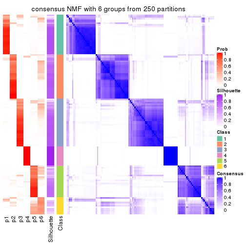</p>

</div>
</div>

Heatmaps for the membership of samples in all partitions to see how consistent they are:


<script>
$( function() {
	$( '#tabs-SD-NMF-membership-heatmap' ).tabs();
} );
</script>
<div id='tabs-SD-NMF-membership-heatmap'>
<ul>
<li><a href='#tab-SD-NMF-membership-heatmap-1'>k = 2</a></li>
<li><a href='#tab-SD-NMF-membership-heatmap-2'>k = 3</a></li>
<li><a href='#tab-SD-NMF-membership-heatmap-3'>k = 4</a></li>
<li><a href='#tab-SD-NMF-membership-heatmap-4'>k = 5</a></li>
<li><a href='#tab-SD-NMF-membership-heatmap-5'>k = 6</a></li>
</ul>
<div id='tab-SD-NMF-membership-heatmap-1'>
<pre><code class="r">membership_heatmap(res, k = 2)
</code></pre>

<p></p>

</div>
<div id='tab-SD-NMF-membership-heatmap-2'>
<pre><code class="r">membership_heatmap(res, k = 3)
</code></pre>

<p></p>

</div>
<div id='tab-SD-NMF-membership-heatmap-3'>
<pre><code class="r">membership_heatmap(res, k = 4)
</code></pre>

<p></p>

</div>
<div id='tab-SD-NMF-membership-heatmap-4'>
<pre><code class="r">membership_heatmap(res, k = 5)
</code></pre>

<p></p>

</div>
<div id='tab-SD-NMF-membership-heatmap-5'>
<pre><code class="r">membership_heatmap(res, k = 6)
</code></pre>

<p></p>

</div>
</div>

As soon as we have had the classes for columns, we can look for signatures
which are significantly different between classes which can be candidate marks
for certain classes. Following are the heatmaps for signatures.


Signature heatmaps where rows are scaled:


<script>
$( function() {
	$( '#tabs-SD-NMF-get-signatures' ).tabs();
} );
</script>
<div id='tabs-SD-NMF-get-signatures'>
<ul>
<li><a href='#tab-SD-NMF-get-signatures-1'>k = 2</a></li>
<li><a href='#tab-SD-NMF-get-signatures-2'>k = 3</a></li>
<li><a href='#tab-SD-NMF-get-signatures-3'>k = 4</a></li>
<li><a href='#tab-SD-NMF-get-signatures-4'>k = 5</a></li>
<li><a href='#tab-SD-NMF-get-signatures-5'>k = 6</a></li>
</ul>
<div id='tab-SD-NMF-get-signatures-1'>
<pre><code class="r">get_signatures(res, k = 2)
</code></pre>

<p></p>

</div>
<div id='tab-SD-NMF-get-signatures-2'>
<pre><code class="r">get_signatures(res, k = 3)
</code></pre>

<p></p>

</div>
<div id='tab-SD-NMF-get-signatures-3'>
<pre><code class="r">get_signatures(res, k = 4)
</code></pre>

<p></p>

</div>
<div id='tab-SD-NMF-get-signatures-4'>
<pre><code class="r">get_signatures(res, k = 5)
</code></pre>

<p></p>

</div>
<div id='tab-SD-NMF-get-signatures-5'>
<pre><code class="r">get_signatures(res, k = 6)
</code></pre>

<p></p>

</div>
</div>


Signature heatmaps where rows are not scaled:


<script>
$( function() {
	$( '#tabs-SD-NMF-get-signatures-no-scale' ).tabs();
} );
</script>
<div id='tabs-SD-NMF-get-signatures-no-scale'>
<ul>
<li><a href='#tab-SD-NMF-get-signatures-no-scale-1'>k = 2</a></li>
<li><a href='#tab-SD-NMF-get-signatures-no-scale-2'>k = 3</a></li>
<li><a href='#tab-SD-NMF-get-signatures-no-scale-3'>k = 4</a></li>
<li><a href='#tab-SD-NMF-get-signatures-no-scale-4'>k = 5</a></li>
<li><a href='#tab-SD-NMF-get-signatures-no-scale-5'>k = 6</a></li>
</ul>
<div id='tab-SD-NMF-get-signatures-no-scale-1'>
<pre><code class="r">get_signatures(res, k = 2, scale_rows = FALSE)
</code></pre>

<p></p>

</div>
<div id='tab-SD-NMF-get-signatures-no-scale-2'>
<pre><code class="r">get_signatures(res, k = 3, scale_rows = FALSE)
</code></pre>

<p></p>

</div>
<div id='tab-SD-NMF-get-signatures-no-scale-3'>
<pre><code class="r">get_signatures(res, k = 4, scale_rows = FALSE)
</code></pre>

<p></p>

</div>
<div id='tab-SD-NMF-get-signatures-no-scale-4'>
<pre><code class="r">get_signatures(res, k = 5, scale_rows = FALSE)
</code></pre>

<p></p>

</div>
<div id='tab-SD-NMF-get-signatures-no-scale-5'>
<pre><code class="r">get_signatures(res, k = 6, scale_rows = FALSE)
</code></pre>

<p></p>

</div>
</div>


Compare the overlap of signatures from different k:

```r
compare_signatures(res)
```


`get_signature()` returns a data frame invisibly. TO get the list of signatures, the function
call should be assigned to a variable explicitly. In following code, if `plot` argument is set
to `FALSE`, no heatmap is plotted while only the differential analysis is performed.

```r
# code only for demonstration
tb = get_signature(res, k = ..., plot = FALSE)
```

An example of the output of `tb` is:

```
#>   which_row         fdr    mean_1    mean_2 scaled_mean_1 scaled_mean_2 km
#> 1        38 0.042760348  8.373488  9.131774    -0.5533452     0.5164555  1
#> 2        40 0.018707592  7.106213  8.469186    -0.6173731     0.5762149  1
#> 3        55 0.019134737 10.221463 11.207825    -0.6159697     0.5749050  1
#> 4        59 0.006059896  5.921854  7.869574    -0.6899429     0.6439467  1
#> 5        60 0.018055526  8.928898 10.211722    -0.6204761     0.5791110  1
#> 6        98 0.009384629 15.714769 14.887706     0.6635654    -0.6193277  2
...
```

The columns in `tb` are:

1. `which_row`: row indices corresponding to the input matrix.
2. `fdr`: FDR for the differential test. 
3. `mean_x`: The mean value in group x.
4. `scaled_mean_x`: The mean value in group x after rows are scaled.
5. `km`: Row groups if k-means clustering is applied to rows.


UMAP plot which shows how samples are separated.


<script>
$( function() {
	$( '#tabs-SD-NMF-dimension-reduction' ).tabs();
} );
</script>
<div id='tabs-SD-NMF-dimension-reduction'>
<ul>
<li><a href='#tab-SD-NMF-dimension-reduction-1'>k = 2</a></li>
<li><a href='#tab-SD-NMF-dimension-reduction-2'>k = 3</a></li>
<li><a href='#tab-SD-NMF-dimension-reduction-3'>k = 4</a></li>
<li><a href='#tab-SD-NMF-dimension-reduction-4'>k = 5</a></li>
<li><a href='#tab-SD-NMF-dimension-reduction-5'>k = 6</a></li>
</ul>
<div id='tab-SD-NMF-dimension-reduction-1'>
<pre><code class="r">dimension_reduction(res, k = 2, method = &quot;UMAP&quot;)
</code></pre>

<p></p>

</div>
<div id='tab-SD-NMF-dimension-reduction-2'>
<pre><code class="r">dimension_reduction(res, k = 3, method = &quot;UMAP&quot;)
</code></pre>

<p></p>

</div>
<div id='tab-SD-NMF-dimension-reduction-3'>
<pre><code class="r">dimension_reduction(res, k = 4, method = &quot;UMAP&quot;)
</code></pre>

<p></p>

</div>
<div id='tab-SD-NMF-dimension-reduction-4'>
<pre><code class="r">dimension_reduction(res, k = 5, method = &quot;UMAP&quot;)
</code></pre>

<p></p>

</div>
<div id='tab-SD-NMF-dimension-reduction-5'>
<pre><code class="r">dimension_reduction(res, k = 6, method = &quot;UMAP&quot;)
</code></pre>

<p></p>

</div>
</div>


Following heatmap shows how subgroups are split when increasing `k`:

```r
collect_classes(res)
```


If matrix rows can be associated to genes, consider to use `GO_Enrichment(res,
...)` to perform function enrichment for the signature genes.


 

---------------------------------------------------


### CV:hclust


The object with results only for a single top-value method and a single partition method 
can be extracted as:

```r
res = res_list["CV", "hclust"]
# you can also extract it by
# res = res_list["CV:hclust"]
```

A summary of `res` and all the functions that can be applied to it:

```r
res
```

```
#> A 'ConsensusPartition' object with k = 2, 3, 4, 5, 6.
#>   On a matrix with 18041 rows and 126 columns.
#>   Top rows (1000, 2000, 3000, 4000, 5000) are extracted by 'CV' method.
#>   Subgroups are detected by 'hclust' method.
#>   Performed in total 1250 partitions by row resampling.
#>   Best k for subgroups seems to be 4.
#> 
#> Following methods can be applied to this 'ConsensusPartition' object:
#>  [1] "cola_report"             "collect_classes"         "collect_plots"          
#>  [4] "collect_stats"           "colnames"                "compare_signatures"     
#>  [7] "consensus_heatmap"       "dimension_reduction"     "functional_enrichment"  
#> [10] "get_anno_col"            "get_anno"                "get_classes"            
#> [13] "get_consensus"           "get_matrix"              "get_membership"         
#> [16] "get_param"               "get_signatures"          "get_stats"              
#> [19] "is_best_k"               "is_stable_k"             "membership_heatmap"     
#> [22] "ncol"                    "nrow"                    "plot_ecdf"              
#> [25] "rownames"                "select_partition_number" "show"                   
#> [28] "suggest_best_k"          "test_to_known_factors"
```

`collect_plots()` function collects all the plots made from `res` for all `k` (number of partitions)
into one single page to provide an easy and fast comparison between different `k`.

```r
collect_plots(res)
```


The plots are:

- The first row: a plot of the ECDF (Empirical cumulative distribution
  function) curves of the consensus matrix for each `k` and the heatmap of
  predicted classes for each `k`.
- The second row: heatmaps of the consensus matrix for each `k`.
- The third row: heatmaps of the membership matrix for each `k`.
- The fouth row: heatmaps of the signatures for each `k`.

All the plots in panels can be made by individual functions and they are
plotted later in this section.

`select_partition_number()` produces several plots showing different
statistics for choosing "optimized" `k`. There are following statistics:

- ECDF curves of the consensus matrix for each `k`;
- 1-PAC. [The PAC
  score](https://en.wikipedia.org/wiki/Consensus_clustering#Over-interpretation_potential_of_consensus_clustering)
  measures the proportion of the ambiguous subgrouping.
- Mean silhouette score.
- Concordance. The mean probability of fiting the consensus class ids in all
  partitions.
- Area increased. Denote $A_k$ as the area under the ECDF curve for current
  `k`, the area increased is defined as $A_k - A_{k-1}$.
- Rand index. The percent of pairs of samples that are both in a same cluster
  or both are not in a same cluster in the partition of k and k-1.
- Jaccard index. The ratio of pairs of samples are both in a same cluster in
  the partition of k and k-1 and the pairs of samples are both in a same
  cluster in the partition k or k-1.

The detailed explanations of these statistics can be found in [the cola
vignette](http://bioconductor.org/packages/devel/bioc/vignettes/cola/inst/doc/cola.html#toc_13).

Generally speaking, lower PAC score, higher mean silhouette score or higher
concordance corresponds to better partition. Rand index and Jaccard index
measure how similar the current partition is compared to partition with `k-1`.
If they are too similar, we won't accept `k` is better than `k-1`.

```r
select_partition_number(res)
```


The numeric values for all these statistics can be obtained by `get_stats()`.

```r
get_stats(res)
```

```
#>   k 1-PAC mean_silhouette concordance area_increased  Rand Jaccard
#> 2 2 0.552           0.827       0.903         0.2626 0.689   0.689
#> 3 3 0.187           0.466       0.761         0.7563 0.850   0.786
#> 4 4 0.284           0.491       0.678         0.2741 0.728   0.542
#> 5 5 0.349           0.621       0.721         0.1067 0.829   0.593
#> 6 6 0.467           0.575       0.748         0.0656 1.000   0.999
```

`suggest_best_k()` suggests the best $k$ based on these statistics. The rules are as follows:

- All $k$ with Jaccard index larger than 0.95 are removed because the increase of
  the partition number does not provides enough extra information. If all $k$ are removed,
  the best $k$ is assigned by `NA`.
- For $k$ with 1-PAC larger than 0.9, the maximal $k$ is taken as the "best k". Other $k$ is called "optional k".
- If it does not fit the second rule. The $k$ with the highest vote of highest
  1-PAC, mean silhouette and concordance is taken as the "best k".

```r
suggest_best_k(res)
```

```
#> [1] 4
```


Following shows the table of the partitions (You need to click the **show/hide
code output** link to see it). The membership matrix (columns with name `p*`)
is inferred by
[`clue::cl_consensus()`](https://www.rdocumentation.org/link/cl_consensus?package=clue)
function with the `SE` method. Basically the value in the membership matrix
represents the probability to belong to a certain group. The finall class
label for an item is determined with the group with highest probability it
belongs to.

In `get_classes()` function, the entropy is calculated from the membership
matrix and the silhouette score is calculated from the consensus matrix.


<script>
$( function() {
	$( '#tabs-CV-hclust-get-classes' ).tabs();
} );
</script>
<div id='tabs-CV-hclust-get-classes'>
<ul>
<li><a href='#tab-CV-hclust-get-classes-1'>k = 2</a></li>
<li><a href='#tab-CV-hclust-get-classes-2'>k = 3</a></li>
<li><a href='#tab-CV-hclust-get-classes-3'>k = 4</a></li>
<li><a href='#tab-CV-hclust-get-classes-4'>k = 5</a></li>
<li><a href='#tab-CV-hclust-get-classes-5'>k = 6</a></li>
</ul>

<div id='tab-CV-hclust-get-classes-1'>
<p><a id='tab-CV-hclust-get-classes-1-a' style='color:#0366d6' href='#'>show/hide code output</a></p>
<pre><code class="r">cbind(get_classes(res, k = 2), get_membership(res, k = 2))
</code></pre>

<pre><code>#&gt;                                      class entropy silhouette    p1    p2
#&gt; DC1F29A2-39DE-44AD-936A-54B2B32D6370     1  0.0376      0.930 0.996 0.004
#&gt; FA3C3413-FA8C-4A29-B9CA-5BC3A56274A8     1  0.0000      0.934 1.000 0.000
#&gt; B9B72975-8134-475C-BC0B-0CFDB24F636A     1  0.0000      0.934 1.000 0.000
#&gt; F44DB757-4D00-4BFC-99C5-AA82F99C5BDA     1  0.0000      0.934 1.000 0.000
#&gt; 3BD942BB-A3A7-4993-B3F1-B8641626B773     1  0.0000      0.934 1.000 0.000
#&gt; 431F73A2-2AB3-4101-B610-7FC02A7097EC     1  0.9608     -0.137 0.616 0.384
#&gt; 3067683D-43D4-4F6D-9338-17F6A75E4B25     1  0.9608     -0.137 0.616 0.384
#&gt; 2CE91B81-7CBE-4698-AFEE-6A154313D231     1  0.0000      0.934 1.000 0.000
#&gt; A639CF4F-4591-4337-A12E-BED71EDDA10B     2  0.9963      0.679 0.464 0.536
#&gt; 5482053D-9F48-4773-B68A-302B3A612503     1  0.0000      0.934 1.000 0.000
#&gt; A31D342D-C67C-428B-BAED-C6E844277A09     1  0.8955      0.234 0.688 0.312
#&gt; 0E9C5985-9AE0-4098-A076-6FFBBDF05110     1  0.7883      0.511 0.764 0.236
#&gt; 08CCF8A0-15B7-4A13-BC43-6B3B3E2DDE95     1  0.5408      0.761 0.876 0.124
#&gt; 10577D5B-AD56-403F-A562-73A9ACF2045B     1  0.6343      0.712 0.840 0.160
#&gt; C940D443-5DDA-4403-868B-7AA6B9A50FC4     2  0.9954      0.686 0.460 0.540
#&gt; 89D4D945-A717-495F-B253-F5A17CF5B9FA     2  0.9635      0.788 0.388 0.612
#&gt; DC55EE78-203F-4092-9B83-14B1A529194B     1  0.3733      0.849 0.928 0.072
#&gt; 8F7368BE-EB41-4192-89AA-9E0428C08851     1  0.0000      0.934 1.000 0.000
#&gt; F772EA39-E408-4908-BADD-C786D702BF9B     1  0.0000      0.934 1.000 0.000
#&gt; FD693D10-3ADA-4028-8392-41D2F0296F7E     1  0.0000      0.934 1.000 0.000
#&gt; 84F16966-7640-49F9-95D1-7648FF74DCC9     1  0.1184      0.917 0.984 0.016
#&gt; D26DAA2F-AE6A-42E1-9F1F-01943B99785F     2  0.9833      0.757 0.424 0.576
#&gt; F325847E-F046-4B67-B01C-16919C401020     2  0.9608      0.807 0.384 0.616
#&gt; 19EB2B10-2529-4A94-8FAE-1CE371A602D9     1  0.9087      0.179 0.676 0.324
#&gt; B94B9CCF-5FB8-44AE-8D9C-A194C6801A27     1  0.0000      0.934 1.000 0.000
#&gt; D2678E70-542A-4AB2-B881-12D66DBA44F5     1  0.0000      0.934 1.000 0.000
#&gt; 4961CA2A-70CD-42AB-A676-4A98C85F449F     2  0.9608      0.807 0.384 0.616
#&gt; 5AA74C5C-2AD1-4D59-A030-E964EB199581     1  0.0000      0.934 1.000 0.000
#&gt; F9E11A1B-BD93-438F-9670-6FB7DFF9E910     2  0.5737      0.717 0.136 0.864
#&gt; FB78CA5A-C8B9-42AF-9DAE-799CAB280B2E     1  0.0000      0.934 1.000 0.000
#&gt; A8E48877-F8AB-44DD-A18B-194D87C44931     1  0.0000      0.934 1.000 0.000
#&gt; CA50C495-F37E-4743-867D-FAF2DCC3376A     1  0.8386      0.409 0.732 0.268
#&gt; 37342369-EC22-4904-8CCD-A0DC6BD8D183     1  0.0000      0.934 1.000 0.000
#&gt; 91BA5F90-9174-4533-A050-39A28E34A94D     1  0.0000      0.934 1.000 0.000
#&gt; 5BC371AC-1915-44E9-A114-2963E131EC8D     1  0.0000      0.934 1.000 0.000
#&gt; 74A6C31A-7F21-45AF-A170-18C326D2AE69     1  0.0000      0.934 1.000 0.000
#&gt; 984F27EF-D4D7-4E68-BD64-776FDFC04D07     1  0.0000      0.934 1.000 0.000
#&gt; B05701C5-8C44-4FD1-94C9-FC0255A2EA24     2  0.4690      0.700 0.100 0.900
#&gt; 91E4119C-2CE6-4447-A125-6A4F403A89E6     1  0.9996     -0.526 0.512 0.488
#&gt; 1570FCE7-F1B4-4BDF-A398-355EDF030864     1  0.0672      0.925 0.992 0.008
#&gt; 604C06E9-A00E-435E-847A-3992922A5C56     2  0.9833      0.757 0.424 0.576
#&gt; 455C9007-6FF4-4D63-83FA-4915F0331F9A     1  0.0000      0.934 1.000 0.000
#&gt; FB8BD3CF-D2EC-47B6-B67F-65ADC1C3A6A7     2  0.9580      0.810 0.380 0.620
#&gt; 9DC7443A-3C8F-4025-8312-3C98BF28D736     1  0.0000      0.934 1.000 0.000
#&gt; CB207A52-09AC-49D3-8240-5840CDFBB154     1  0.0000      0.934 1.000 0.000
#&gt; 2A335049-AD9F-4B32-92B7-69B04B0CF2BA     2  0.9170      0.829 0.332 0.668
#&gt; 6ACA6293-371E-428D-BBAE-ABFD410C886F     1  0.0000      0.934 1.000 0.000
#&gt; E8929929-73F9-4DB7-ABBA-0852BEFFFF7E     2  0.9833      0.757 0.424 0.576
#&gt; 5E343116-414B-41F2-AAEE-A3225450135A     1  0.0000      0.934 1.000 0.000
#&gt; 0A39073C-157C-48A1-B125-A6A04CB738DA     1  0.1414      0.912 0.980 0.020
#&gt; 300D78E6-1C7E-4114-80EA-9204A6818B9A     1  0.0000      0.934 1.000 0.000
#&gt; DAAF55AA-ED48-4221-9CD6-D1DEB6376017     1  0.0000      0.934 1.000 0.000
#&gt; D76FCF4A-4ACF-41EF-A120-64136D6C845E     1  0.0000      0.934 1.000 0.000
#&gt; AD294665-6F90-459C-90D5-3058F210225D     1  0.0000      0.934 1.000 0.000
#&gt; 92E8AD7A-1084-44C8-BDC0-FE4E47B6143F     1  0.0000      0.934 1.000 0.000
#&gt; 5644A861-3C59-486D-8FBE-4DF6A3B19558     1  0.0000      0.934 1.000 0.000
#&gt; 1BF8AAE7-B771-4CF2-8B1C-D2BEB5E6579E     1  0.0000      0.934 1.000 0.000
#&gt; A54731AE-FC40-407F-8D10-67DDC122237D     1  0.0000      0.934 1.000 0.000
#&gt; 179DC906-5654-4CBA-9C27-C9560B5F12DE     1  0.0000      0.934 1.000 0.000
#&gt; 979B9A2B-2D81-47C3-A553-9B9441CAAE47     1  0.0000      0.934 1.000 0.000
#&gt; D69BD86A-08FB-49DA-9084-2725F6C9195F     1  0.0000      0.934 1.000 0.000
#&gt; 84611033-BCF7-49D7-9B91-DA29B62AC8D3     2  0.8443      0.815 0.272 0.728
#&gt; 8AA1DA3E-8C00-4653-AA33-EA70531C1E50     1  0.0000      0.934 1.000 0.000
#&gt; CEBE9594-0F19-46B4-AF7D-F8DF33E00AFB     1  0.0672      0.926 0.992 0.008
#&gt; C68E82D2-2BD3-41E9-92D7-D4C06E1953B2     1  0.0000      0.934 1.000 0.000
#&gt; B855EF89-1E76-4408-AA65-61A0F0A4F412     1  0.0000      0.934 1.000 0.000
#&gt; 4488EFB3-5B01-41E3-B57E-8E4F607CF448     1  0.0000      0.934 1.000 0.000
#&gt; C2BD8440-CAC6-4FE5-8EBB-5E6AE308D52F     1  0.7950      0.543 0.760 0.240
#&gt; E0E50F10-1FED-41C1-84DB-81A46F25D7E9     1  0.0000      0.934 1.000 0.000
#&gt; EE16D845-31F2-4178-800B-CA2C358841AD     1  0.1414      0.912 0.980 0.020
#&gt; 169828CF-5693-4A46-B5D7-E45CBA9DF317     1  0.0000      0.934 1.000 0.000
#&gt; 51077BA3-AEE0-4BD4-A1B1-1B0A811642A1     1  0.0000      0.934 1.000 0.000
#&gt; D2F4E240-C44C-4CF7-8016-6CACD370D093     1  0.4298      0.827 0.912 0.088
#&gt; 721CDBE6-FC85-4C30-B23E-28407340286F     2  0.7745      0.789 0.228 0.772
#&gt; 392897E4-6009-422C-B461-649F4DDF260C     2  0.9087      0.829 0.324 0.676
#&gt; 617E13D2-6924-45F8-A8DE-BE21B718F822     1  0.0000      0.934 1.000 0.000
#&gt; 5746C00F-9CBB-46B7-83FD-90B2AB3F507B     1  0.0000      0.934 1.000 0.000
#&gt; 982B4344-A223-4D1F-9485-2E56F9FD45C0     1  0.0000      0.934 1.000 0.000
#&gt; E5557F52-015D-49DC-9E23-989FC259976F     1  0.7745      0.565 0.772 0.228
#&gt; F3135F5E-2E90-4923-B634-E994563D17B7     1  0.8909      0.317 0.692 0.308
#&gt; D1ED15A5-9802-4314-B556-E89EB772D1F0     1  0.4431      0.821 0.908 0.092
#&gt; 222B06E3-FCFB-4104-92C3-D73BC31854D4     1  0.0000      0.934 1.000 0.000
#&gt; 4C810FFA-ED07-4F4C-9F81-B8F1CF4956F7     1  0.0000      0.934 1.000 0.000
#&gt; 9A608964-ED12-4E6E-9D3A-430F59FFF65B     2  0.9608      0.807 0.384 0.616
#&gt; 4087357F-C17A-4992-A8AB-41ACA2F72001     1  0.0000      0.934 1.000 0.000
#&gt; B3F013A5-BCB8-4CE0-86B2-634EE180AA6E     1  0.0000      0.934 1.000 0.000
#&gt; 322AF320-1379-4F51-AFDC-5292A060CD52     2  0.9087      0.829 0.324 0.676
#&gt; 53A96249-66D5-4C26-893B-ADC71481D261     1  0.0376      0.930 0.996 0.004
#&gt; 1AB7A6F2-14BD-447C-B2E3-DEB0CE56B209     1  0.0000      0.934 1.000 0.000
#&gt; 8B4BCDA0-6787-4A55-99F7-AAF22AF85BA6     1  0.7528      0.568 0.784 0.216
#&gt; 5D9D9E08-2C2C-414E-9547-62799F90D543     1  0.0000      0.934 1.000 0.000
#&gt; C345CD17-E4F4-41D5-9891-FEFB19342C52     2  0.7453      0.786 0.212 0.788
#&gt; 1AF8FDE1-1A74-41F6-A1C5-4952CDFB7D3F     1  0.0000      0.934 1.000 0.000
#&gt; BC3405FF-0660-4B2B-8DC1-5F34D3133078     1  0.0000      0.934 1.000 0.000
#&gt; C2662596-6E2F-4924-B051-CEA1AC87B197     1  0.0000      0.934 1.000 0.000
#&gt; 39AE85F7-49FB-4438-BD41-6AC812FA1C72     1  0.8327      0.399 0.736 0.264
#&gt; 6FF266DB-3F08-43F2-8F6F-679F805B80B8     1  0.0000      0.934 1.000 0.000
#&gt; B03B7B81-BBD6-4194-BC5E-6EDF0D3F015A     1  0.0000      0.934 1.000 0.000
#&gt; C7617D56-F13C-4C43-906C-BD458C5DC4CD     1  0.0000      0.934 1.000 0.000
#&gt; 09420F8B-7A71-4B32-8388-4767670F1FEB     1  0.0000      0.934 1.000 0.000
#&gt; 6AF47534-74FF-4128-865B-4E8EE1FFB469     1  0.0000      0.934 1.000 0.000
#&gt; 8FF9E94A-2ED2-4727-947F-D524D7ECE815     1  0.0000      0.934 1.000 0.000
#&gt; A390E20D-03F9-40E4-A132-0FA5C2BEDB63     1  0.0000      0.934 1.000 0.000
#&gt; A489CCCA-1374-4071-80CE-05B83C9A0D5E     1  0.0000      0.934 1.000 0.000
#&gt; 2D962371-EC83-490C-A663-478AF383BC1B     1  0.0000      0.934 1.000 0.000
#&gt; D91B31A1-EE71-4726-B94C-0CC2815E9D4E     1  0.0000      0.934 1.000 0.000
#&gt; E0123C5C-E1D1-4162-9895-CC8B01949D84     2  0.7376      0.780 0.208 0.792
#&gt; EC73959A-2728-49FE-B72A-790BB14F4CBF     1  0.0000      0.934 1.000 0.000
#&gt; A60DC925-7343-496E-900D-0DD81D5C8123     1  0.0000      0.934 1.000 0.000
#&gt; 659B64DB-F4A5-43BD-811B-05004CB49D99     1  0.0000      0.934 1.000 0.000
#&gt; 6969B6B2-7616-4664-9696-C4DACD10537B     1  0.0000      0.934 1.000 0.000
#&gt; 2F6392DE-0D54-4768-B062-907C81E5B0CC     1  0.0000      0.934 1.000 0.000
#&gt; C74BE8C5-BA6D-4596-9D67-3C731799F999     1  0.0000      0.934 1.000 0.000
#&gt; 79A7647F-BDBA-45A2-B207-ABF788F6CC95     2  0.0000      0.627 0.000 1.000
#&gt; D47D0433-2313-4A2F-B268-5AD293D7534E     1  0.8144      0.498 0.748 0.252
#&gt; C5058B93-C1DA-43B9-9951-B23A9810AA6E     1  0.0000      0.934 1.000 0.000
#&gt; 2629FEE3-A203-4411-8A70-02A796C9505C     2  0.9580      0.810 0.380 0.620
#&gt; 1AF329E4-11D4-4CFC-801F-C24A1EA33102     1  0.0000      0.934 1.000 0.000
#&gt; D453BEF8-3F18-4B89-BA42-CE74EB105032     2  0.8608      0.809 0.284 0.716
#&gt; B12A4446-2310-4139-897F-CA030478CBD5     2  0.9087      0.829 0.324 0.676
#&gt; BCAB1918-5FA9-4CBD-85CB-008743FEA2CC     2  0.9963      0.679 0.464 0.536
#&gt; 9A5432D3-19EE-47B4-BD88-698DEC75A5E9     1  0.0000      0.934 1.000 0.000
#&gt; A608BCEB-2C27-4927-A308-E6975F641722     1  0.0000      0.934 1.000 0.000
#&gt; E4752275-7BF6-4C1E-8A45-C7D571ED85AD     1  0.0000      0.934 1.000 0.000
#&gt; FDEC1714-C02D-4AB7-AE82-789E9D709EDE     1  0.0000      0.934 1.000 0.000
#&gt; 33737781-8638-4FA2-AD4C-E888BB9343D8     1  0.0000      0.934 1.000 0.000
</code></pre>

<script>
$('#tab-CV-hclust-get-classes-1-a').parent().next().next().hide();
$('#tab-CV-hclust-get-classes-1-a').click(function(){
  $('#tab-CV-hclust-get-classes-1-a').parent().next().next().toggle();
  return(false);
});
</script>
</div>

<div id='tab-CV-hclust-get-classes-2'>
<p><a id='tab-CV-hclust-get-classes-2-a' style='color:#0366d6' href='#'>show/hide code output</a></p>
<pre><code class="r">cbind(get_classes(res, k = 3), get_membership(res, k = 3))
</code></pre>

<pre><code>#&gt;                                      class entropy silhouette    p1    p2    p3
#&gt; DC1F29A2-39DE-44AD-936A-54B2B32D6370     1  0.1129     0.7001 0.976 0.004 0.020
#&gt; FA3C3413-FA8C-4A29-B9CA-5BC3A56274A8     1  0.4810     0.5562 0.832 0.140 0.028
#&gt; B9B72975-8134-475C-BC0B-0CFDB24F636A     1  0.6295    -0.6584 0.528 0.472 0.000
#&gt; F44DB757-4D00-4BFC-99C5-AA82F99C5BDA     1  0.6252    -0.5702 0.556 0.444 0.000
#&gt; 3BD942BB-A3A7-4993-B3F1-B8641626B773     1  0.1182     0.6966 0.976 0.012 0.012
#&gt; 431F73A2-2AB3-4101-B610-7FC02A7097EC     3  0.8979     0.3679 0.420 0.128 0.452
#&gt; 3067683D-43D4-4F6D-9338-17F6A75E4B25     3  0.8979     0.3679 0.420 0.128 0.452
#&gt; 2CE91B81-7CBE-4698-AFEE-6A154313D231     1  0.4810     0.5562 0.832 0.140 0.028
#&gt; A639CF4F-4591-4337-A12E-BED71EDDA10B     3  0.6584     0.6019 0.380 0.012 0.608
#&gt; 5482053D-9F48-4773-B68A-302B3A612503     1  0.0747     0.6984 0.984 0.000 0.016
#&gt; A31D342D-C67C-428B-BAED-C6E844277A09     1  0.6796     0.1012 0.612 0.020 0.368
#&gt; 0E9C5985-9AE0-4098-A076-6FFBBDF05110     1  0.8573     0.1158 0.584 0.136 0.280
#&gt; 08CCF8A0-15B7-4A13-BC43-6B3B3E2DDE95     1  0.7562     0.3324 0.692 0.148 0.160
#&gt; 10577D5B-AD56-403F-A562-73A9ACF2045B     1  0.5955     0.4851 0.772 0.048 0.180
#&gt; C940D443-5DDA-4403-868B-7AA6B9A50FC4     3  0.6721     0.6018 0.380 0.016 0.604
#&gt; 89D4D945-A717-495F-B253-F5A17CF5B9FA     3  0.8045     0.6812 0.272 0.104 0.624
#&gt; DC55EE78-203F-4092-9B83-14B1A529194B     2  0.7925     0.6728 0.344 0.584 0.072
#&gt; 8F7368BE-EB41-4192-89AA-9E0428C08851     1  0.1453     0.7003 0.968 0.008 0.024
#&gt; F772EA39-E408-4908-BADD-C786D702BF9B     1  0.6215    -0.5182 0.572 0.428 0.000
#&gt; FD693D10-3ADA-4028-8392-41D2F0296F7E     1  0.4121     0.6308 0.876 0.084 0.040
#&gt; 84F16966-7640-49F9-95D1-7648FF74DCC9     2  0.6520     0.7377 0.488 0.508 0.004
#&gt; D26DAA2F-AE6A-42E1-9F1F-01943B99785F     3  0.6750     0.6548 0.336 0.024 0.640
#&gt; F325847E-F046-4B67-B01C-16919C401020     3  0.7677     0.7232 0.204 0.120 0.676
#&gt; 19EB2B10-2529-4A94-8FAE-1CE371A602D9     1  0.6865     0.0335 0.596 0.020 0.384
#&gt; B94B9CCF-5FB8-44AE-8D9C-A194C6801A27     1  0.6280    -0.6221 0.540 0.460 0.000
#&gt; D2678E70-542A-4AB2-B881-12D66DBA44F5     1  0.4121     0.6308 0.876 0.084 0.040
#&gt; 4961CA2A-70CD-42AB-A676-4A98C85F449F     3  0.7677     0.7232 0.204 0.120 0.676
#&gt; 5AA74C5C-2AD1-4D59-A030-E964EB199581     1  0.0424     0.6996 0.992 0.000 0.008
#&gt; F9E11A1B-BD93-438F-9670-6FB7DFF9E910     3  0.7391     0.5819 0.056 0.308 0.636
#&gt; FB78CA5A-C8B9-42AF-9DAE-799CAB280B2E     1  0.0747     0.6984 0.984 0.000 0.016
#&gt; A8E48877-F8AB-44DD-A18B-194D87C44931     1  0.4810     0.5562 0.832 0.140 0.028
#&gt; CA50C495-F37E-4743-867D-FAF2DCC3376A     1  0.8362     0.0109 0.556 0.096 0.348
#&gt; 37342369-EC22-4904-8CCD-A0DC6BD8D183     2  0.6680     0.7616 0.484 0.508 0.008
#&gt; 91BA5F90-9174-4533-A050-39A28E34A94D     1  0.0747     0.6984 0.984 0.000 0.016
#&gt; 5BC371AC-1915-44E9-A114-2963E131EC8D     1  0.0592     0.6993 0.988 0.000 0.012
#&gt; 74A6C31A-7F21-45AF-A170-18C326D2AE69     1  0.0892     0.6971 0.980 0.000 0.020
#&gt; 984F27EF-D4D7-4E68-BD64-776FDFC04D07     1  0.4121     0.6308 0.876 0.084 0.040
#&gt; B05701C5-8C44-4FD1-94C9-FC0255A2EA24     3  0.6424     0.6166 0.068 0.180 0.752
#&gt; 91E4119C-2CE6-4447-A125-6A4F403A89E6     3  0.8872     0.5623 0.348 0.132 0.520
#&gt; 1570FCE7-F1B4-4BDF-A398-355EDF030864     1  0.6688    -0.4839 0.580 0.408 0.012
#&gt; 604C06E9-A00E-435E-847A-3992922A5C56     3  0.6627     0.6574 0.336 0.020 0.644
#&gt; 455C9007-6FF4-4D63-83FA-4915F0331F9A     1  0.4121     0.6308 0.876 0.084 0.040
#&gt; FB8BD3CF-D2EC-47B6-B67F-65ADC1C3A6A7     3  0.7651     0.7256 0.196 0.124 0.680
#&gt; 9DC7443A-3C8F-4025-8312-3C98BF28D736     1  0.4121     0.6308 0.876 0.084 0.040
#&gt; CB207A52-09AC-49D3-8240-5840CDFBB154     1  0.0424     0.6996 0.992 0.000 0.008
#&gt; 2A335049-AD9F-4B32-92B7-69B04B0CF2BA     3  0.7878     0.7259 0.172 0.160 0.668
#&gt; 6ACA6293-371E-428D-BBAE-ABFD410C886F     1  0.4810     0.5562 0.832 0.140 0.028
#&gt; E8929929-73F9-4DB7-ABBA-0852BEFFFF7E     3  0.6627     0.6574 0.336 0.020 0.644
#&gt; 5E343116-414B-41F2-AAEE-A3225450135A     1  0.1905     0.6882 0.956 0.028 0.016
#&gt; 0A39073C-157C-48A1-B125-A6A04CB738DA     1  0.3802     0.6329 0.888 0.080 0.032
#&gt; 300D78E6-1C7E-4114-80EA-9204A6818B9A     1  0.1182     0.6966 0.976 0.012 0.012
#&gt; DAAF55AA-ED48-4221-9CD6-D1DEB6376017     1  0.0424     0.6993 0.992 0.000 0.008
#&gt; D76FCF4A-4ACF-41EF-A120-64136D6C845E     1  0.4810     0.5562 0.832 0.140 0.028
#&gt; AD294665-6F90-459C-90D5-3058F210225D     1  0.0592     0.6993 0.988 0.000 0.012
#&gt; 92E8AD7A-1084-44C8-BDC0-FE4E47B6143F     2  0.6680     0.7616 0.484 0.508 0.008
#&gt; 5644A861-3C59-486D-8FBE-4DF6A3B19558     1  0.0892     0.6971 0.980 0.000 0.020
#&gt; 1BF8AAE7-B771-4CF2-8B1C-D2BEB5E6579E     1  0.4121     0.6308 0.876 0.084 0.040
#&gt; A54731AE-FC40-407F-8D10-67DDC122237D     1  0.6931    -0.6201 0.528 0.456 0.016
#&gt; 179DC906-5654-4CBA-9C27-C9560B5F12DE     1  0.1182     0.6966 0.976 0.012 0.012
#&gt; 979B9A2B-2D81-47C3-A553-9B9441CAAE47     1  0.0592     0.6993 0.988 0.000 0.012
#&gt; D69BD86A-08FB-49DA-9084-2725F6C9195F     1  0.0747     0.6984 0.984 0.000 0.016
#&gt; 84611033-BCF7-49D7-9B91-DA29B62AC8D3     3  0.8436     0.7166 0.160 0.224 0.616
#&gt; 8AA1DA3E-8C00-4653-AA33-EA70531C1E50     1  0.6252    -0.5702 0.556 0.444 0.000
#&gt; CEBE9594-0F19-46B4-AF7D-F8DF33E00AFB     1  0.0829     0.7002 0.984 0.004 0.012
#&gt; C68E82D2-2BD3-41E9-92D7-D4C06E1953B2     1  0.1182     0.6966 0.976 0.012 0.012
#&gt; B855EF89-1E76-4408-AA65-61A0F0A4F412     1  0.6235    -0.5453 0.564 0.436 0.000
#&gt; 4488EFB3-5B01-41E3-B57E-8E4F607CF448     1  0.0592     0.6993 0.988 0.000 0.012
#&gt; C2BD8440-CAC6-4FE5-8EBB-5E6AE308D52F     1  0.7044     0.4282 0.724 0.108 0.168
#&gt; E0E50F10-1FED-41C1-84DB-81A46F25D7E9     1  0.4121     0.6308 0.876 0.084 0.040
#&gt; EE16D845-31F2-4178-800B-CA2C358841AD     1  0.6516    -0.6896 0.516 0.480 0.004
#&gt; 169828CF-5693-4A46-B5D7-E45CBA9DF317     1  0.6045    -0.3464 0.620 0.380 0.000
#&gt; 51077BA3-AEE0-4BD4-A1B1-1B0A811642A1     1  0.0892     0.6971 0.980 0.000 0.020
#&gt; D2F4E240-C44C-4CF7-8016-6CACD370D093     1  0.3295     0.6434 0.896 0.008 0.096
#&gt; 721CDBE6-FC85-4C30-B23E-28407340286F     3  0.7108     0.6646 0.100 0.184 0.716
#&gt; 392897E4-6009-422C-B461-649F4DDF260C     3  0.7917     0.7148 0.152 0.184 0.664
#&gt; 617E13D2-6924-45F8-A8DE-BE21B718F822     1  0.4121     0.6308 0.876 0.084 0.040
#&gt; 5746C00F-9CBB-46B7-83FD-90B2AB3F507B     1  0.1182     0.6966 0.976 0.012 0.012
#&gt; 982B4344-A223-4D1F-9485-2E56F9FD45C0     1  0.6295    -0.6594 0.528 0.472 0.000
#&gt; E5557F52-015D-49DC-9E23-989FC259976F     1  0.6853     0.4125 0.712 0.064 0.224
#&gt; F3135F5E-2E90-4923-B634-E994563D17B7     1  0.7448     0.1716 0.616 0.052 0.332
#&gt; D1ED15A5-9802-4314-B556-E89EB772D1F0     1  0.3375     0.6392 0.892 0.008 0.100
#&gt; 222B06E3-FCFB-4104-92C3-D73BC31854D4     1  0.0892     0.6971 0.980 0.000 0.020
#&gt; 4C810FFA-ED07-4F4C-9F81-B8F1CF4956F7     1  0.4121     0.6308 0.876 0.084 0.040
#&gt; 9A608964-ED12-4E6E-9D3A-430F59FFF65B     3  0.7677     0.7232 0.204 0.120 0.676
#&gt; 4087357F-C17A-4992-A8AB-41ACA2F72001     1  0.4121     0.6308 0.876 0.084 0.040
#&gt; B3F013A5-BCB8-4CE0-86B2-634EE180AA6E     1  0.6291    -0.6505 0.532 0.468 0.000
#&gt; 322AF320-1379-4F51-AFDC-5292A060CD52     3  0.7917     0.7148 0.152 0.184 0.664
#&gt; 53A96249-66D5-4C26-893B-ADC71481D261     1  0.5803     0.2880 0.736 0.248 0.016
#&gt; 1AB7A6F2-14BD-447C-B2E3-DEB0CE56B209     1  0.0747     0.6984 0.984 0.000 0.016
#&gt; 8B4BCDA0-6787-4A55-99F7-AAF22AF85BA6     2  0.7605     0.3571 0.192 0.684 0.124
#&gt; 5D9D9E08-2C2C-414E-9547-62799F90D543     2  0.6680     0.7616 0.484 0.508 0.008
#&gt; C345CD17-E4F4-41D5-9891-FEFB19342C52     3  0.5677     0.7038 0.124 0.072 0.804
#&gt; 1AF8FDE1-1A74-41F6-A1C5-4952CDFB7D3F     1  0.1182     0.6966 0.976 0.012 0.012
#&gt; BC3405FF-0660-4B2B-8DC1-5F34D3133078     1  0.1182     0.6966 0.976 0.012 0.012
#&gt; C2662596-6E2F-4924-B051-CEA1AC87B197     1  0.0747     0.6984 0.984 0.000 0.016
#&gt; 39AE85F7-49FB-4438-BD41-6AC812FA1C72     1  0.6126     0.3385 0.712 0.020 0.268
#&gt; 6FF266DB-3F08-43F2-8F6F-679F805B80B8     1  0.1905     0.6882 0.956 0.028 0.016
#&gt; B03B7B81-BBD6-4194-BC5E-6EDF0D3F015A     1  0.1182     0.6966 0.976 0.012 0.012
#&gt; C7617D56-F13C-4C43-906C-BD458C5DC4CD     1  0.2031     0.6876 0.952 0.032 0.016
#&gt; 09420F8B-7A71-4B32-8388-4767670F1FEB     1  0.0747     0.6984 0.984 0.000 0.016
#&gt; 6AF47534-74FF-4128-865B-4E8EE1FFB469     1  0.6799    -0.6156 0.532 0.456 0.012
#&gt; 8FF9E94A-2ED2-4727-947F-D524D7ECE815     1  0.0424     0.6993 0.992 0.000 0.008
#&gt; A390E20D-03F9-40E4-A132-0FA5C2BEDB63     1  0.4121     0.6308 0.876 0.084 0.040
#&gt; A489CCCA-1374-4071-80CE-05B83C9A0D5E     1  0.4810     0.5562 0.832 0.140 0.028
#&gt; 2D962371-EC83-490C-A663-478AF383BC1B     1  0.6252    -0.5702 0.556 0.444 0.000
#&gt; D91B31A1-EE71-4726-B94C-0CC2815E9D4E     1  0.5988    -0.2841 0.632 0.368 0.000
#&gt; E0123C5C-E1D1-4162-9895-CC8B01949D84     3  0.6793     0.6995 0.128 0.128 0.744
#&gt; EC73959A-2728-49FE-B72A-790BB14F4CBF     1  0.0424     0.6993 0.992 0.000 0.008
#&gt; A60DC925-7343-496E-900D-0DD81D5C8123     2  0.6680     0.7616 0.484 0.508 0.008
#&gt; 659B64DB-F4A5-43BD-811B-05004CB49D99     1  0.0747     0.6984 0.984 0.000 0.016
#&gt; 6969B6B2-7616-4664-9696-C4DACD10537B     2  0.6680     0.7616 0.484 0.508 0.008
#&gt; 2F6392DE-0D54-4768-B062-907C81E5B0CC     1  0.1182     0.6966 0.976 0.012 0.012
#&gt; C74BE8C5-BA6D-4596-9D67-3C731799F999     1  0.4121     0.6308 0.876 0.084 0.040
#&gt; 79A7647F-BDBA-45A2-B207-ABF788F6CC95     3  0.5058     0.5447 0.000 0.244 0.756
#&gt; D47D0433-2313-4A2F-B268-5AD293D7534E     2  0.9616     0.3568 0.344 0.444 0.212
#&gt; C5058B93-C1DA-43B9-9951-B23A9810AA6E     1  0.1182     0.6966 0.976 0.012 0.012
#&gt; 2629FEE3-A203-4411-8A70-02A796C9505C     3  0.7651     0.7256 0.196 0.124 0.680
#&gt; 1AF329E4-11D4-4CFC-801F-C24A1EA33102     1  0.4810     0.5562 0.832 0.140 0.028
#&gt; D453BEF8-3F18-4B89-BA42-CE74EB105032     3  0.7635     0.7085 0.212 0.112 0.676
#&gt; B12A4446-2310-4139-897F-CA030478CBD5     3  0.7917     0.7148 0.152 0.184 0.664
#&gt; BCAB1918-5FA9-4CBD-85CB-008743FEA2CC     3  0.6584     0.6019 0.380 0.012 0.608
#&gt; 9A5432D3-19EE-47B4-BD88-698DEC75A5E9     1  0.3965     0.5785 0.860 0.132 0.008
#&gt; A608BCEB-2C27-4927-A308-E6975F641722     1  0.5681     0.3308 0.748 0.236 0.016
#&gt; E4752275-7BF6-4C1E-8A45-C7D571ED85AD     1  0.6008    -0.3129 0.628 0.372 0.000
#&gt; FDEC1714-C02D-4AB7-AE82-789E9D709EDE     1  0.0592     0.6993 0.988 0.000 0.012
#&gt; 33737781-8638-4FA2-AD4C-E888BB9343D8     1  0.4810     0.5562 0.832 0.140 0.028
</code></pre>

<script>
$('#tab-CV-hclust-get-classes-2-a').parent().next().next().hide();
$('#tab-CV-hclust-get-classes-2-a').click(function(){
  $('#tab-CV-hclust-get-classes-2-a').parent().next().next().toggle();
  return(false);
});
</script>
</div>

<div id='tab-CV-hclust-get-classes-3'>
<p><a id='tab-CV-hclust-get-classes-3-a' style='color:#0366d6' href='#'>show/hide code output</a></p>
<pre><code class="r">cbind(get_classes(res, k = 4), get_membership(res, k = 4))
</code></pre>

<pre><code>#&gt;                                      class entropy silhouette    p1    p2    p3    p4
#&gt; DC1F29A2-39DE-44AD-936A-54B2B32D6370     1   0.430    0.71620 0.752 0.240 0.008 0.000
#&gt; FA3C3413-FA8C-4A29-B9CA-5BC3A56274A8     2   0.586   -0.07938 0.484 0.484 0.032 0.000
#&gt; B9B72975-8134-475C-BC0B-0CFDB24F636A     2   0.205    0.71558 0.072 0.924 0.000 0.004
#&gt; F44DB757-4D00-4BFC-99C5-AA82F99C5BDA     2   0.253    0.72164 0.100 0.896 0.000 0.004
#&gt; 3BD942BB-A3A7-4993-B3F1-B8641626B773     1   0.443    0.69254 0.720 0.276 0.004 0.000
#&gt; 431F73A2-2AB3-4101-B610-7FC02A7097EC     3   0.747    0.41136 0.256 0.192 0.544 0.008
#&gt; 3067683D-43D4-4F6D-9338-17F6A75E4B25     3   0.747    0.41136 0.256 0.192 0.544 0.008
#&gt; 2CE91B81-7CBE-4698-AFEE-6A154313D231     2   0.586   -0.07938 0.484 0.484 0.032 0.000
#&gt; A639CF4F-4591-4337-A12E-BED71EDDA10B     3   0.716    0.34853 0.352 0.020 0.540 0.088
#&gt; 5482053D-9F48-4773-B68A-302B3A612503     1   0.379    0.72460 0.796 0.200 0.004 0.000
#&gt; A31D342D-C67C-428B-BAED-C6E844277A09     1   0.715    0.09037 0.584 0.036 0.304 0.076
#&gt; 0E9C5985-9AE0-4098-A076-6FFBBDF05110     3   0.817    0.08882 0.348 0.292 0.352 0.008
#&gt; 08CCF8A0-15B7-4A13-BC43-6B3B3E2DDE95     2   0.787    0.12377 0.380 0.456 0.140 0.024
#&gt; 10577D5B-AD56-403F-A562-73A9ACF2045B     1   0.792    0.51604 0.584 0.200 0.152 0.064
#&gt; C940D443-5DDA-4403-868B-7AA6B9A50FC4     3   0.721    0.34547 0.352 0.020 0.536 0.092
#&gt; 89D4D945-A717-495F-B253-F5A17CF5B9FA     3   0.748    0.36260 0.144 0.116 0.644 0.096
#&gt; DC55EE78-203F-4092-9B83-14B1A529194B     2   0.434    0.43623 0.008 0.820 0.128 0.044
#&gt; 8F7368BE-EB41-4192-89AA-9E0428C08851     1   0.419    0.71429 0.764 0.228 0.008 0.000
#&gt; F772EA39-E408-4908-BADD-C786D702BF9B     2   0.253    0.71575 0.112 0.888 0.000 0.000
#&gt; FD693D10-3ADA-4028-8392-41D2F0296F7E     1   0.443    0.50565 0.820 0.032 0.020 0.128
#&gt; 84F16966-7640-49F9-95D1-7648FF74DCC9     2   0.201    0.68687 0.040 0.940 0.008 0.012
#&gt; D26DAA2F-AE6A-42E1-9F1F-01943B99785F     3   0.716    0.35164 0.304 0.028 0.580 0.088
#&gt; F325847E-F046-4B67-B01C-16919C401020     3   0.515    0.44309 0.084 0.124 0.780 0.012
#&gt; 19EB2B10-2529-4A94-8FAE-1CE371A602D9     1   0.704   -0.00455 0.572 0.024 0.324 0.080
#&gt; B94B9CCF-5FB8-44AE-8D9C-A194C6801A27     2   0.194    0.71908 0.076 0.924 0.000 0.000
#&gt; D2678E70-542A-4AB2-B881-12D66DBA44F5     1   0.443    0.50565 0.820 0.032 0.020 0.128
#&gt; 4961CA2A-70CD-42AB-A676-4A98C85F449F     3   0.515    0.44309 0.084 0.124 0.780 0.012
#&gt; 5AA74C5C-2AD1-4D59-A030-E964EB199581     1   0.410    0.70865 0.744 0.256 0.000 0.000
#&gt; F9E11A1B-BD93-438F-9670-6FB7DFF9E910     4   0.678    0.68922 0.032 0.068 0.272 0.628
#&gt; FB78CA5A-C8B9-42AF-9DAE-799CAB280B2E     1   0.379    0.72460 0.796 0.200 0.004 0.000
#&gt; A8E48877-F8AB-44DD-A18B-194D87C44931     2   0.586   -0.07938 0.484 0.484 0.032 0.000
#&gt; CA50C495-F37E-4743-867D-FAF2DCC3376A     3   0.748    0.23084 0.420 0.152 0.424 0.004
#&gt; 37342369-EC22-4904-8CCD-A0DC6BD8D183     2   0.117    0.67080 0.020 0.968 0.000 0.012
#&gt; 91BA5F90-9174-4533-A050-39A28E34A94D     1   0.379    0.72460 0.796 0.200 0.004 0.000
#&gt; 5BC371AC-1915-44E9-A114-2963E131EC8D     1   0.431    0.70708 0.736 0.260 0.004 0.000
#&gt; 74A6C31A-7F21-45AF-A170-18C326D2AE69     1   0.379    0.72239 0.796 0.200 0.004 0.000
#&gt; 984F27EF-D4D7-4E68-BD64-776FDFC04D07     1   0.443    0.50565 0.820 0.032 0.020 0.128
#&gt; B05701C5-8C44-4FD1-94C9-FC0255A2EA24     4   0.660    0.60014 0.080 0.000 0.436 0.484
#&gt; 91E4119C-2CE6-4447-A125-6A4F403A89E6     3   0.768    0.40443 0.228 0.096 0.600 0.076
#&gt; 1570FCE7-F1B4-4BDF-A398-355EDF030864     2   0.398    0.64875 0.192 0.796 0.000 0.012
#&gt; 604C06E9-A00E-435E-847A-3992922A5C56     3   0.704    0.34800 0.308 0.020 0.580 0.092
#&gt; 455C9007-6FF4-4D63-83FA-4915F0331F9A     1   0.443    0.50565 0.820 0.032 0.020 0.128
#&gt; FB8BD3CF-D2EC-47B6-B67F-65ADC1C3A6A7     3   0.498    0.43327 0.084 0.112 0.792 0.012
#&gt; 9DC7443A-3C8F-4025-8312-3C98BF28D736     1   0.443    0.50565 0.820 0.032 0.020 0.128
#&gt; CB207A52-09AC-49D3-8240-5840CDFBB154     1   0.410    0.70865 0.744 0.256 0.000 0.000
#&gt; 2A335049-AD9F-4B32-92B7-69B04B0CF2BA     3   0.704    0.24734 0.088 0.048 0.644 0.220
#&gt; 6ACA6293-371E-428D-BBAE-ABFD410C886F     2   0.586   -0.07938 0.484 0.484 0.032 0.000
#&gt; E8929929-73F9-4DB7-ABBA-0852BEFFFF7E     3   0.704    0.34800 0.308 0.020 0.580 0.092
#&gt; 5E343116-414B-41F2-AAEE-A3225450135A     1   0.490    0.59945 0.660 0.332 0.008 0.000
#&gt; 0A39073C-157C-48A1-B125-A6A04CB738DA     1   0.572    0.44154 0.580 0.388 0.032 0.000
#&gt; 300D78E6-1C7E-4114-80EA-9204A6818B9A     1   0.443    0.69254 0.720 0.276 0.004 0.000
#&gt; DAAF55AA-ED48-4221-9CD6-D1DEB6376017     1   0.384    0.72279 0.776 0.224 0.000 0.000
#&gt; D76FCF4A-4ACF-41EF-A120-64136D6C845E     2   0.586   -0.07938 0.484 0.484 0.032 0.000
#&gt; AD294665-6F90-459C-90D5-3058F210225D     1   0.431    0.70708 0.736 0.260 0.004 0.000
#&gt; 92E8AD7A-1084-44C8-BDC0-FE4E47B6143F     2   0.117    0.67080 0.020 0.968 0.000 0.012
#&gt; 5644A861-3C59-486D-8FBE-4DF6A3B19558     1   0.379    0.72239 0.796 0.200 0.004 0.000
#&gt; 1BF8AAE7-B771-4CF2-8B1C-D2BEB5E6579E     1   0.443    0.50565 0.820 0.032 0.020 0.128
#&gt; A54731AE-FC40-407F-8D10-67DDC122237D     2   0.287    0.71411 0.104 0.884 0.012 0.000
#&gt; 179DC906-5654-4CBA-9C27-C9560B5F12DE     1   0.443    0.69254 0.720 0.276 0.004 0.000
#&gt; 979B9A2B-2D81-47C3-A553-9B9441CAAE47     1   0.431    0.70708 0.736 0.260 0.004 0.000
#&gt; D69BD86A-08FB-49DA-9084-2725F6C9195F     1   0.379    0.72460 0.796 0.200 0.004 0.000
#&gt; 84611033-BCF7-49D7-9B91-DA29B62AC8D3     3   0.768    0.06633 0.052 0.088 0.540 0.320
#&gt; 8AA1DA3E-8C00-4653-AA33-EA70531C1E50     2   0.253    0.72164 0.100 0.896 0.000 0.004
#&gt; CEBE9594-0F19-46B4-AF7D-F8DF33E00AFB     1   0.420    0.72412 0.768 0.224 0.004 0.004
#&gt; C68E82D2-2BD3-41E9-92D7-D4C06E1953B2     1   0.443    0.69254 0.720 0.276 0.004 0.000
#&gt; B855EF89-1E76-4408-AA65-61A0F0A4F412     2   0.241    0.71942 0.104 0.896 0.000 0.000
#&gt; 4488EFB3-5B01-41E3-B57E-8E4F607CF448     1   0.431    0.70708 0.736 0.260 0.004 0.000
#&gt; C2BD8440-CAC6-4FE5-8EBB-5E6AE308D52F     1   0.606    0.51723 0.712 0.032 0.060 0.196
#&gt; E0E50F10-1FED-41C1-84DB-81A46F25D7E9     1   0.443    0.50565 0.820 0.032 0.020 0.128
#&gt; EE16D845-31F2-4178-800B-CA2C358841AD     2   0.256    0.71153 0.068 0.912 0.004 0.016
#&gt; 169828CF-5693-4A46-B5D7-E45CBA9DF317     2   0.340    0.66363 0.180 0.820 0.000 0.000
#&gt; 51077BA3-AEE0-4BD4-A1B1-1B0A811642A1     1   0.387    0.72388 0.788 0.208 0.004 0.000
#&gt; D2F4E240-C44C-4CF7-8016-6CACD370D093     1   0.650    0.64884 0.688 0.200 0.052 0.060
#&gt; 721CDBE6-FC85-4C30-B23E-28407340286F     3   0.597   -0.09563 0.040 0.012 0.644 0.304
#&gt; 392897E4-6009-422C-B461-649F4DDF260C     3   0.665    0.24839 0.060 0.060 0.680 0.200
#&gt; 617E13D2-6924-45F8-A8DE-BE21B718F822     1   0.443    0.50565 0.820 0.032 0.020 0.128
#&gt; 5746C00F-9CBB-46B7-83FD-90B2AB3F507B     1   0.443    0.69254 0.720 0.276 0.004 0.000
#&gt; 982B4344-A223-4D1F-9485-2E56F9FD45C0     2   0.205    0.71564 0.072 0.924 0.000 0.004
#&gt; E5557F52-015D-49DC-9E23-989FC259976F     1   0.635    0.42731 0.692 0.016 0.164 0.128
#&gt; F3135F5E-2E90-4923-B634-E994563D17B7     1   0.786    0.11084 0.544 0.052 0.292 0.112
#&gt; D1ED15A5-9802-4314-B556-E89EB772D1F0     1   0.657    0.64484 0.684 0.200 0.052 0.064
#&gt; 222B06E3-FCFB-4104-92C3-D73BC31854D4     1   0.379    0.72239 0.796 0.200 0.004 0.000
#&gt; 4C810FFA-ED07-4F4C-9F81-B8F1CF4956F7     1   0.443    0.50565 0.820 0.032 0.020 0.128
#&gt; 9A608964-ED12-4E6E-9D3A-430F59FFF65B     3   0.515    0.44309 0.084 0.124 0.780 0.012
#&gt; 4087357F-C17A-4992-A8AB-41ACA2F72001     1   0.443    0.50565 0.820 0.032 0.020 0.128
#&gt; B3F013A5-BCB8-4CE0-86B2-634EE180AA6E     2   0.213    0.71713 0.076 0.920 0.000 0.004
#&gt; 322AF320-1379-4F51-AFDC-5292A060CD52     3   0.665    0.24839 0.060 0.060 0.680 0.200
#&gt; 53A96249-66D5-4C26-893B-ADC71481D261     2   0.516    0.31504 0.364 0.624 0.012 0.000
#&gt; 1AB7A6F2-14BD-447C-B2E3-DEB0CE56B209     1   0.379    0.72460 0.796 0.200 0.004 0.000
#&gt; 8B4BCDA0-6787-4A55-99F7-AAF22AF85BA6     2   0.660    0.18951 0.008 0.652 0.200 0.140
#&gt; 5D9D9E08-2C2C-414E-9547-62799F90D543     2   0.117    0.67080 0.020 0.968 0.000 0.012
#&gt; C345CD17-E4F4-41D5-9891-FEFB19342C52     3   0.600   -0.01405 0.088 0.008 0.696 0.208
#&gt; 1AF8FDE1-1A74-41F6-A1C5-4952CDFB7D3F     1   0.443    0.69254 0.720 0.276 0.004 0.000
#&gt; BC3405FF-0660-4B2B-8DC1-5F34D3133078     1   0.443    0.69254 0.720 0.276 0.004 0.000
#&gt; C2662596-6E2F-4924-B051-CEA1AC87B197     1   0.379    0.72460 0.796 0.200 0.004 0.000
#&gt; 39AE85F7-49FB-4438-BD41-6AC812FA1C72     1   0.847    0.32684 0.452 0.276 0.236 0.036
#&gt; 6FF266DB-3F08-43F2-8F6F-679F805B80B8     1   0.490    0.59945 0.660 0.332 0.008 0.000
#&gt; B03B7B81-BBD6-4194-BC5E-6EDF0D3F015A     1   0.443    0.69254 0.720 0.276 0.004 0.000
#&gt; C7617D56-F13C-4C43-906C-BD458C5DC4CD     1   0.494    0.58840 0.652 0.340 0.008 0.000
#&gt; 09420F8B-7A71-4B32-8388-4767670F1FEB     1   0.379    0.72460 0.796 0.200 0.004 0.000
#&gt; 6AF47534-74FF-4128-865B-4E8EE1FFB469     2   0.274    0.71659 0.104 0.888 0.008 0.000
#&gt; 8FF9E94A-2ED2-4727-947F-D524D7ECE815     1   0.384    0.72279 0.776 0.224 0.000 0.000
#&gt; A390E20D-03F9-40E4-A132-0FA5C2BEDB63     1   0.443    0.50565 0.820 0.032 0.020 0.128
#&gt; A489CCCA-1374-4071-80CE-05B83C9A0D5E     2   0.586   -0.07938 0.484 0.484 0.032 0.000
#&gt; 2D962371-EC83-490C-A663-478AF383BC1B     2   0.253    0.72164 0.100 0.896 0.000 0.004
#&gt; D91B31A1-EE71-4726-B94C-0CC2815E9D4E     2   0.367    0.65156 0.188 0.808 0.000 0.004
#&gt; E0123C5C-E1D1-4162-9895-CC8B01949D84     3   0.651   -0.14017 0.084 0.012 0.636 0.268
#&gt; EC73959A-2728-49FE-B72A-790BB14F4CBF     1   0.384    0.72279 0.776 0.224 0.000 0.000
#&gt; A60DC925-7343-496E-900D-0DD81D5C8123     2   0.117    0.67080 0.020 0.968 0.000 0.012
#&gt; 659B64DB-F4A5-43BD-811B-05004CB49D99     1   0.379    0.72460 0.796 0.200 0.004 0.000
#&gt; 6969B6B2-7616-4664-9696-C4DACD10537B     2   0.117    0.67080 0.020 0.968 0.000 0.012
#&gt; 2F6392DE-0D54-4768-B062-907C81E5B0CC     1   0.443    0.69254 0.720 0.276 0.004 0.000
#&gt; C74BE8C5-BA6D-4596-9D67-3C731799F999     1   0.443    0.50565 0.820 0.032 0.020 0.128
#&gt; 79A7647F-BDBA-45A2-B207-ABF788F6CC95     4   0.452    0.73303 0.000 0.000 0.320 0.680
#&gt; D47D0433-2313-4A2F-B268-5AD293D7534E     2   0.748    0.05223 0.048 0.592 0.260 0.100
#&gt; C5058B93-C1DA-43B9-9951-B23A9810AA6E     1   0.443    0.69254 0.720 0.276 0.004 0.000
#&gt; 2629FEE3-A203-4411-8A70-02A796C9505C     3   0.498    0.43327 0.084 0.112 0.792 0.012
#&gt; 1AF329E4-11D4-4CFC-801F-C24A1EA33102     1   0.586    0.03677 0.484 0.484 0.032 0.000
#&gt; D453BEF8-3F18-4B89-BA42-CE74EB105032     3   0.781    0.10320 0.116 0.076 0.596 0.212
#&gt; B12A4446-2310-4139-897F-CA030478CBD5     3   0.665    0.24839 0.060 0.060 0.680 0.200
#&gt; BCAB1918-5FA9-4CBD-85CB-008743FEA2CC     3   0.716    0.34853 0.352 0.020 0.540 0.088
#&gt; 9A5432D3-19EE-47B4-BD88-698DEC75A5E9     1   0.530    0.15210 0.504 0.488 0.008 0.000
#&gt; A608BCEB-2C27-4927-A308-E6975F641722     2   0.542    0.25939 0.388 0.596 0.012 0.004
#&gt; E4752275-7BF6-4C1E-8A45-C7D571ED85AD     2   0.349    0.65487 0.188 0.812 0.000 0.000
#&gt; FDEC1714-C02D-4AB7-AE82-789E9D709EDE     1   0.431    0.70708 0.736 0.260 0.004 0.000
#&gt; 33737781-8638-4FA2-AD4C-E888BB9343D8     2   0.586   -0.07938 0.484 0.484 0.032 0.000
</code></pre>

<script>
$('#tab-CV-hclust-get-classes-3-a').parent().next().next().hide();
$('#tab-CV-hclust-get-classes-3-a').click(function(){
  $('#tab-CV-hclust-get-classes-3-a').parent().next().next().toggle();
  return(false);
});
</script>
</div>

<div id='tab-CV-hclust-get-classes-4'>
<p><a id='tab-CV-hclust-get-classes-4-a' style='color:#0366d6' href='#'>show/hide code output</a></p>
<pre><code class="r">cbind(get_classes(res, k = 5), get_membership(res, k = 5))
</code></pre>

<pre><code>#&gt;                                      class entropy silhouette    p1    p2    p3    p4    p5
#&gt; DC1F29A2-39DE-44AD-936A-54B2B32D6370     1  0.1914    0.78128 0.928 0.056 0.008 0.008 0.000
#&gt; FA3C3413-FA8C-4A29-B9CA-5BC3A56274A8     1  0.4904    0.48892 0.644 0.316 0.036 0.004 0.000
#&gt; B9B72975-8134-475C-BC0B-0CFDB24F636A     2  0.3167    0.85062 0.172 0.820 0.004 0.004 0.000
#&gt; F44DB757-4D00-4BFC-99C5-AA82F99C5BDA     2  0.3143    0.85010 0.204 0.796 0.000 0.000 0.000
#&gt; 3BD942BB-A3A7-4993-B3F1-B8641626B773     1  0.2249    0.78251 0.896 0.096 0.008 0.000 0.000
#&gt; 431F73A2-2AB3-4101-B610-7FC02A7097EC     3  0.5810    0.40628 0.212 0.176 0.612 0.000 0.000
#&gt; 3067683D-43D4-4F6D-9338-17F6A75E4B25     3  0.5810    0.40628 0.212 0.176 0.612 0.000 0.000
#&gt; 2CE91B81-7CBE-4698-AFEE-6A154313D231     1  0.4904    0.48892 0.644 0.316 0.036 0.004 0.000
#&gt; A639CF4F-4591-4337-A12E-BED71EDDA10B     3  0.7459    0.29896 0.316 0.056 0.504 0.092 0.032
#&gt; 5482053D-9F48-4773-B68A-302B3A612503     1  0.0727    0.75156 0.980 0.012 0.004 0.004 0.000
#&gt; A31D342D-C67C-428B-BAED-C6E844277A09     1  0.6920    0.10082 0.580 0.060 0.268 0.064 0.028
#&gt; 0E9C5985-9AE0-4098-A076-6FFBBDF05110     3  0.6697    0.16469 0.352 0.244 0.404 0.000 0.000
#&gt; 08CCF8A0-15B7-4A13-BC43-6B3B3E2DDE95     1  0.6937    0.26206 0.512 0.312 0.144 0.020 0.012
#&gt; 10577D5B-AD56-403F-A562-73A9ACF2045B     1  0.5840    0.51928 0.708 0.044 0.164 0.056 0.028
#&gt; C940D443-5DDA-4403-868B-7AA6B9A50FC4     3  0.7526    0.29591 0.316 0.056 0.500 0.092 0.036
#&gt; 89D4D945-A717-495F-B253-F5A17CF5B9FA     3  0.6636    0.38582 0.116 0.112 0.656 0.016 0.100
#&gt; DC55EE78-203F-4092-9B83-14B1A529194B     2  0.4612    0.58000 0.044 0.788 0.124 0.008 0.036
#&gt; 8F7368BE-EB41-4192-89AA-9E0428C08851     1  0.1717    0.76158 0.936 0.052 0.008 0.004 0.000
#&gt; F772EA39-E408-4908-BADD-C786D702BF9B     2  0.3430    0.83777 0.220 0.776 0.000 0.004 0.000
#&gt; FD693D10-3ADA-4028-8392-41D2F0296F7E     4  0.4213    1.00000 0.308 0.000 0.012 0.680 0.000
#&gt; 84F16966-7640-49F9-95D1-7648FF74DCC9     2  0.3377    0.83009 0.136 0.836 0.020 0.004 0.004
#&gt; D26DAA2F-AE6A-42E1-9F1F-01943B99785F     3  0.7500    0.31439 0.272 0.056 0.540 0.064 0.068
#&gt; F325847E-F046-4B67-B01C-16919C401020     3  0.3117    0.45240 0.036 0.100 0.860 0.004 0.000
#&gt; 19EB2B10-2529-4A94-8FAE-1CE371A602D9     1  0.7078    0.02363 0.556 0.056 0.288 0.068 0.032
#&gt; B94B9CCF-5FB8-44AE-8D9C-A194C6801A27     2  0.3246    0.85231 0.184 0.808 0.000 0.008 0.000
#&gt; D2678E70-542A-4AB2-B881-12D66DBA44F5     4  0.4213    1.00000 0.308 0.000 0.012 0.680 0.000
#&gt; 4961CA2A-70CD-42AB-A676-4A98C85F449F     3  0.3117    0.45240 0.036 0.100 0.860 0.004 0.000
#&gt; 5AA74C5C-2AD1-4D59-A030-E964EB199581     1  0.1544    0.78196 0.932 0.068 0.000 0.000 0.000
#&gt; F9E11A1B-BD93-438F-9670-6FB7DFF9E910     5  0.5684    0.66645 0.024 0.044 0.072 0.132 0.728
#&gt; FB78CA5A-C8B9-42AF-9DAE-799CAB280B2E     1  0.0727    0.75156 0.980 0.012 0.004 0.004 0.000
#&gt; A8E48877-F8AB-44DD-A18B-194D87C44931     1  0.4904    0.48892 0.644 0.316 0.036 0.004 0.000
#&gt; CA50C495-F37E-4743-867D-FAF2DCC3376A     3  0.6284    0.27898 0.372 0.136 0.488 0.004 0.000
#&gt; 37342369-EC22-4904-8CCD-A0DC6BD8D183     2  0.3279    0.80696 0.116 0.852 0.012 0.016 0.004
#&gt; 91BA5F90-9174-4533-A050-39A28E34A94D     1  0.0727    0.75156 0.980 0.012 0.004 0.004 0.000
#&gt; 5BC371AC-1915-44E9-A114-2963E131EC8D     1  0.1991    0.78282 0.916 0.076 0.004 0.004 0.000
#&gt; 74A6C31A-7F21-45AF-A170-18C326D2AE69     1  0.0960    0.74790 0.972 0.016 0.008 0.004 0.000
#&gt; 984F27EF-D4D7-4E68-BD64-776FDFC04D07     4  0.4213    1.00000 0.308 0.000 0.012 0.680 0.000
#&gt; B05701C5-8C44-4FD1-94C9-FC0255A2EA24     5  0.6978    0.52760 0.056 0.016 0.292 0.084 0.552
#&gt; 91E4119C-2CE6-4447-A125-6A4F403A89E6     3  0.6959    0.38802 0.172 0.092 0.624 0.024 0.088
#&gt; 1570FCE7-F1B4-4BDF-A398-355EDF030864     2  0.4469    0.72428 0.320 0.664 0.004 0.004 0.008
#&gt; 604C06E9-A00E-435E-847A-3992922A5C56     3  0.7653    0.30392 0.272 0.056 0.528 0.072 0.072
#&gt; 455C9007-6FF4-4D63-83FA-4915F0331F9A     4  0.4213    1.00000 0.308 0.000 0.012 0.680 0.000
#&gt; FB8BD3CF-D2EC-47B6-B67F-65ADC1C3A6A7     3  0.2775    0.44089 0.020 0.100 0.876 0.004 0.000
#&gt; 9DC7443A-3C8F-4025-8312-3C98BF28D736     4  0.4213    1.00000 0.308 0.000 0.012 0.680 0.000
#&gt; CB207A52-09AC-49D3-8240-5840CDFBB154     1  0.1544    0.78196 0.932 0.068 0.000 0.000 0.000
#&gt; 2A335049-AD9F-4B32-92B7-69B04B0CF2BA     3  0.6472    0.25867 0.032 0.068 0.624 0.032 0.244
#&gt; 6ACA6293-371E-428D-BBAE-ABFD410C886F     1  0.4904    0.48892 0.644 0.316 0.036 0.004 0.000
#&gt; E8929929-73F9-4DB7-ABBA-0852BEFFFF7E     3  0.7653    0.30392 0.272 0.056 0.528 0.072 0.072
#&gt; 5E343116-414B-41F2-AAEE-A3225450135A     1  0.3123    0.73920 0.828 0.160 0.012 0.000 0.000
#&gt; 0A39073C-157C-48A1-B125-A6A04CB738DA     1  0.4054    0.67421 0.760 0.204 0.036 0.000 0.000
#&gt; 300D78E6-1C7E-4114-80EA-9204A6818B9A     1  0.2179    0.78204 0.896 0.100 0.004 0.000 0.000
#&gt; DAAF55AA-ED48-4221-9CD6-D1DEB6376017     1  0.0880    0.76776 0.968 0.032 0.000 0.000 0.000
#&gt; D76FCF4A-4ACF-41EF-A120-64136D6C845E     1  0.4904    0.48892 0.644 0.316 0.036 0.004 0.000
#&gt; AD294665-6F90-459C-90D5-3058F210225D     1  0.1991    0.78282 0.916 0.076 0.004 0.004 0.000
#&gt; 92E8AD7A-1084-44C8-BDC0-FE4E47B6143F     2  0.3279    0.80696 0.116 0.852 0.012 0.016 0.004
#&gt; 5644A861-3C59-486D-8FBE-4DF6A3B19558     1  0.0960    0.74790 0.972 0.016 0.008 0.004 0.000
#&gt; 1BF8AAE7-B771-4CF2-8B1C-D2BEB5E6579E     4  0.4213    1.00000 0.308 0.000 0.012 0.680 0.000
#&gt; A54731AE-FC40-407F-8D10-67DDC122237D     2  0.4313    0.78202 0.260 0.716 0.016 0.008 0.000
#&gt; 179DC906-5654-4CBA-9C27-C9560B5F12DE     1  0.2249    0.78251 0.896 0.096 0.008 0.000 0.000
#&gt; 979B9A2B-2D81-47C3-A553-9B9441CAAE47     1  0.1991    0.78282 0.916 0.076 0.004 0.004 0.000
#&gt; D69BD86A-08FB-49DA-9084-2725F6C9195F     1  0.0727    0.75156 0.980 0.012 0.004 0.004 0.000
#&gt; 84611033-BCF7-49D7-9B91-DA29B62AC8D3     3  0.7031    0.16727 0.032 0.088 0.488 0.024 0.368
#&gt; 8AA1DA3E-8C00-4653-AA33-EA70531C1E50     2  0.3143    0.85010 0.204 0.796 0.000 0.000 0.000
#&gt; CEBE9594-0F19-46B4-AF7D-F8DF33E00AFB     1  0.1365    0.77102 0.952 0.040 0.004 0.000 0.004
#&gt; C68E82D2-2BD3-41E9-92D7-D4C06E1953B2     1  0.2249    0.78251 0.896 0.096 0.008 0.000 0.000
#&gt; B855EF89-1E76-4408-AA65-61A0F0A4F412     2  0.3366    0.84437 0.212 0.784 0.000 0.004 0.000
#&gt; 4488EFB3-5B01-41E3-B57E-8E4F607CF448     1  0.1991    0.78282 0.916 0.076 0.004 0.004 0.000
#&gt; C2BD8440-CAC6-4FE5-8EBB-5E6AE308D52F     1  0.5460    0.42626 0.724 0.032 0.020 0.052 0.172
#&gt; E0E50F10-1FED-41C1-84DB-81A46F25D7E9     4  0.4213    1.00000 0.308 0.000 0.012 0.680 0.000
#&gt; EE16D845-31F2-4178-800B-CA2C358841AD     2  0.3437    0.85049 0.176 0.808 0.004 0.000 0.012
#&gt; 169828CF-5693-4A46-B5D7-E45CBA9DF317     2  0.4122    0.72004 0.304 0.688 0.004 0.004 0.000
#&gt; 51077BA3-AEE0-4BD4-A1B1-1B0A811642A1     1  0.1153    0.75463 0.964 0.024 0.008 0.004 0.000
#&gt; D2F4E240-C44C-4CF7-8016-6CACD370D093     1  0.3770    0.67358 0.852 0.024 0.048 0.060 0.016
#&gt; 721CDBE6-FC85-4C30-B23E-28407340286F     3  0.5900   -0.02560 0.000 0.036 0.560 0.044 0.360
#&gt; 392897E4-6009-422C-B461-649F4DDF260C     3  0.5730    0.25736 0.008 0.080 0.648 0.012 0.252
#&gt; 617E13D2-6924-45F8-A8DE-BE21B718F822     4  0.4213    1.00000 0.308 0.000 0.012 0.680 0.000
#&gt; 5746C00F-9CBB-46B7-83FD-90B2AB3F507B     1  0.2179    0.78204 0.896 0.100 0.004 0.000 0.000
#&gt; 982B4344-A223-4D1F-9485-2E56F9FD45C0     2  0.3243    0.85194 0.180 0.812 0.004 0.004 0.000
#&gt; E5557F52-015D-49DC-9E23-989FC259976F     1  0.6404    0.37716 0.664 0.020 0.164 0.052 0.100
#&gt; F3135F5E-2E90-4923-B634-E994563D17B7     1  0.7636    0.06285 0.516 0.056 0.288 0.052 0.088
#&gt; D1ED15A5-9802-4314-B556-E89EB772D1F0     1  0.3865    0.66986 0.848 0.024 0.048 0.060 0.020
#&gt; 222B06E3-FCFB-4104-92C3-D73BC31854D4     1  0.0960    0.74790 0.972 0.016 0.008 0.004 0.000
#&gt; 4C810FFA-ED07-4F4C-9F81-B8F1CF4956F7     4  0.4213    1.00000 0.308 0.000 0.012 0.680 0.000
#&gt; 9A608964-ED12-4E6E-9D3A-430F59FFF65B     3  0.3117    0.45240 0.036 0.100 0.860 0.004 0.000
#&gt; 4087357F-C17A-4992-A8AB-41ACA2F72001     4  0.4213    1.00000 0.308 0.000 0.012 0.680 0.000
#&gt; B3F013A5-BCB8-4CE0-86B2-634EE180AA6E     2  0.3317    0.85182 0.188 0.804 0.004 0.004 0.000
#&gt; 322AF320-1379-4F51-AFDC-5292A060CD52     3  0.5730    0.25736 0.008 0.080 0.648 0.012 0.252
#&gt; 53A96249-66D5-4C26-893B-ADC71481D261     1  0.4997   -0.00449 0.508 0.468 0.016 0.008 0.000
#&gt; 1AB7A6F2-14BD-447C-B2E3-DEB0CE56B209     1  0.0727    0.75156 0.980 0.012 0.004 0.004 0.000
#&gt; 8B4BCDA0-6787-4A55-99F7-AAF22AF85BA6     2  0.6950    0.31783 0.044 0.620 0.196 0.048 0.092
#&gt; 5D9D9E08-2C2C-414E-9547-62799F90D543     2  0.3279    0.80696 0.116 0.852 0.012 0.016 0.004
#&gt; C345CD17-E4F4-41D5-9891-FEFB19342C52     3  0.6572    0.03308 0.028 0.036 0.640 0.104 0.192
#&gt; 1AF8FDE1-1A74-41F6-A1C5-4952CDFB7D3F     1  0.2179    0.78204 0.896 0.100 0.004 0.000 0.000
#&gt; BC3405FF-0660-4B2B-8DC1-5F34D3133078     1  0.2124    0.78242 0.900 0.096 0.004 0.000 0.000
#&gt; C2662596-6E2F-4924-B051-CEA1AC87B197     1  0.0727    0.75156 0.980 0.012 0.004 0.004 0.000
#&gt; 39AE85F7-49FB-4438-BD41-6AC812FA1C72     1  0.6184    0.52300 0.636 0.092 0.228 0.040 0.004
#&gt; 6FF266DB-3F08-43F2-8F6F-679F805B80B8     1  0.3163    0.73645 0.824 0.164 0.012 0.000 0.000
#&gt; B03B7B81-BBD6-4194-BC5E-6EDF0D3F015A     1  0.2249    0.78251 0.896 0.096 0.008 0.000 0.000
#&gt; C7617D56-F13C-4C43-906C-BD458C5DC4CD     1  0.3242    0.73074 0.816 0.172 0.012 0.000 0.000
#&gt; 09420F8B-7A71-4B32-8388-4767670F1FEB     1  0.0727    0.75156 0.980 0.012 0.004 0.004 0.000
#&gt; 6AF47534-74FF-4128-865B-4E8EE1FFB469     2  0.4164    0.79679 0.252 0.728 0.012 0.008 0.000
#&gt; 8FF9E94A-2ED2-4727-947F-D524D7ECE815     1  0.0880    0.76776 0.968 0.032 0.000 0.000 0.000
#&gt; A390E20D-03F9-40E4-A132-0FA5C2BEDB63     4  0.4213    1.00000 0.308 0.000 0.012 0.680 0.000
#&gt; A489CCCA-1374-4071-80CE-05B83C9A0D5E     1  0.4904    0.48892 0.644 0.316 0.036 0.004 0.000
#&gt; 2D962371-EC83-490C-A663-478AF383BC1B     2  0.3177    0.84811 0.208 0.792 0.000 0.000 0.000
#&gt; D91B31A1-EE71-4726-B94C-0CC2815E9D4E     2  0.3774    0.73312 0.296 0.704 0.000 0.000 0.000
#&gt; E0123C5C-E1D1-4162-9895-CC8B01949D84     3  0.6975   -0.04351 0.056 0.040 0.528 0.040 0.336
#&gt; EC73959A-2728-49FE-B72A-790BB14F4CBF     1  0.0880    0.76776 0.968 0.032 0.000 0.000 0.000
#&gt; A60DC925-7343-496E-900D-0DD81D5C8123     2  0.3279    0.80696 0.116 0.852 0.012 0.016 0.004
#&gt; 659B64DB-F4A5-43BD-811B-05004CB49D99     1  0.0727    0.75156 0.980 0.012 0.004 0.004 0.000
#&gt; 6969B6B2-7616-4664-9696-C4DACD10537B     2  0.3279    0.80696 0.116 0.852 0.012 0.016 0.004
#&gt; 2F6392DE-0D54-4768-B062-907C81E5B0CC     1  0.2179    0.78204 0.896 0.100 0.004 0.000 0.000
#&gt; C74BE8C5-BA6D-4596-9D67-3C731799F999     4  0.4213    1.00000 0.308 0.000 0.012 0.680 0.000
#&gt; 79A7647F-BDBA-45A2-B207-ABF788F6CC95     5  0.4123    0.71335 0.000 0.004 0.132 0.072 0.792
#&gt; D47D0433-2313-4A2F-B268-5AD293D7534E     2  0.6762    0.24952 0.040 0.576 0.256 0.008 0.120
#&gt; C5058B93-C1DA-43B9-9951-B23A9810AA6E     1  0.2249    0.78251 0.896 0.096 0.008 0.000 0.000
#&gt; 2629FEE3-A203-4411-8A70-02A796C9505C     3  0.2775    0.44089 0.020 0.100 0.876 0.004 0.000
#&gt; 1AF329E4-11D4-4CFC-801F-C24A1EA33102     1  0.4904    0.48892 0.644 0.316 0.036 0.004 0.000
#&gt; D453BEF8-3F18-4B89-BA42-CE74EB105032     3  0.7458    0.18870 0.100 0.080 0.544 0.024 0.252
#&gt; B12A4446-2310-4139-897F-CA030478CBD5     3  0.5730    0.25736 0.008 0.080 0.648 0.012 0.252
#&gt; BCAB1918-5FA9-4CBD-85CB-008743FEA2CC     3  0.7459    0.29896 0.316 0.056 0.504 0.092 0.032
#&gt; 9A5432D3-19EE-47B4-BD88-698DEC75A5E9     1  0.4591    0.48420 0.648 0.332 0.012 0.008 0.000
#&gt; A608BCEB-2C27-4927-A308-E6975F641722     1  0.4713    0.15407 0.544 0.440 0.016 0.000 0.000
#&gt; E4752275-7BF6-4C1E-8A45-C7D571ED85AD     2  0.4162    0.70336 0.312 0.680 0.004 0.004 0.000
#&gt; FDEC1714-C02D-4AB7-AE82-789E9D709EDE     1  0.1991    0.78282 0.916 0.076 0.004 0.004 0.000
#&gt; 33737781-8638-4FA2-AD4C-E888BB9343D8     1  0.4904    0.48892 0.644 0.316 0.036 0.004 0.000
</code></pre>

<script>
$('#tab-CV-hclust-get-classes-4-a').parent().next().next().hide();
$('#tab-CV-hclust-get-classes-4-a').click(function(){
  $('#tab-CV-hclust-get-classes-4-a').parent().next().next().toggle();
  return(false);
});
</script>
</div>

<div id='tab-CV-hclust-get-classes-5'>
<p><a id='tab-CV-hclust-get-classes-5-a' style='color:#0366d6' href='#'>show/hide code output</a></p>
<pre><code class="r">cbind(get_classes(res, k = 6), get_membership(res, k = 6))
</code></pre>

<pre><code>#&gt;                                      class entropy silhouette    p1    p2    p3    p4    p5    p6
#&gt; DC1F29A2-39DE-44AD-936A-54B2B32D6370     1   0.151     0.7899 0.948 0.016 0.004 0.012 0.020 0.000
#&gt; FA3C3413-FA8C-4A29-B9CA-5BC3A56274A8     1   0.424     0.5269 0.704 0.244 0.048 0.000 0.004 0.000
#&gt; B9B72975-8134-475C-BC0B-0CFDB24F636A     2   0.363     0.8011 0.196 0.772 0.020 0.000 0.012 0.000
#&gt; F44DB757-4D00-4BFC-99C5-AA82F99C5BDA     2   0.343     0.8014 0.220 0.764 0.012 0.000 0.004 0.000
#&gt; 3BD942BB-A3A7-4993-B3F1-B8641626B773     1   0.115     0.7828 0.956 0.032 0.012 0.000 0.000 0.000
#&gt; 431F73A2-2AB3-4101-B610-7FC02A7097EC     3   0.495     0.3428 0.240 0.108 0.648 0.000 0.004 0.000
#&gt; 3067683D-43D4-4F6D-9338-17F6A75E4B25     3   0.495     0.3428 0.240 0.108 0.648 0.000 0.004 0.000
#&gt; 2CE91B81-7CBE-4698-AFEE-6A154313D231     1   0.424     0.5269 0.704 0.244 0.048 0.000 0.004 0.000
#&gt; A639CF4F-4591-4337-A12E-BED71EDDA10B     3   0.603     0.0941 0.248 0.000 0.396 0.000 0.356 0.000
#&gt; 5482053D-9F48-4773-B68A-302B3A612503     1   0.232     0.7670 0.896 0.000 0.004 0.036 0.064 0.000
#&gt; A31D342D-C67C-428B-BAED-C6E844277A09     1   0.618     0.0354 0.488 0.000 0.196 0.020 0.296 0.000
#&gt; 0E9C5985-9AE0-4098-A076-6FFBBDF05110     3   0.597     0.1767 0.380 0.172 0.440 0.000 0.008 0.000
#&gt; 08CCF8A0-15B7-4A13-BC43-6B3B3E2DDE95     1   0.623     0.3247 0.556 0.240 0.144 0.000 0.060 0.000
#&gt; 10577D5B-AD56-403F-A562-73A9ACF2045B     1   0.582     0.5095 0.640 0.004 0.172 0.028 0.144 0.012
#&gt; C940D443-5DDA-4403-868B-7AA6B9A50FC4     3   0.603     0.0898 0.248 0.000 0.392 0.000 0.360 0.000
#&gt; 89D4D945-A717-495F-B253-F5A17CF5B9FA     3   0.604     0.2416 0.144 0.040 0.652 0.000 0.116 0.048
#&gt; DC55EE78-203F-4092-9B83-14B1A529194B     2   0.358     0.5394 0.004 0.816 0.124 0.000 0.016 0.040
#&gt; 8F7368BE-EB41-4192-89AA-9E0428C08851     1   0.329     0.7726 0.856 0.040 0.008 0.036 0.060 0.000
#&gt; F772EA39-E408-4908-BADD-C786D702BF9B     2   0.339     0.7946 0.236 0.752 0.012 0.000 0.000 0.000
#&gt; FD693D10-3ADA-4028-8392-41D2F0296F7E     4   0.127     1.0000 0.060 0.000 0.000 0.940 0.000 0.000
#&gt; 84F16966-7640-49F9-95D1-7648FF74DCC9     2   0.366     0.7749 0.144 0.804 0.032 0.000 0.012 0.008
#&gt; D26DAA2F-AE6A-42E1-9F1F-01943B99785F     3   0.652     0.0879 0.212 0.004 0.432 0.000 0.328 0.024
#&gt; F325847E-F046-4B67-B01C-16919C401020     3   0.209     0.3585 0.068 0.028 0.904 0.000 0.000 0.000
#&gt; 19EB2B10-2529-4A94-8FAE-1CE371A602D9     1   0.627    -0.0359 0.464 0.000 0.208 0.020 0.308 0.000
#&gt; B94B9CCF-5FB8-44AE-8D9C-A194C6801A27     2   0.368     0.8001 0.192 0.772 0.012 0.000 0.024 0.000
#&gt; D2678E70-542A-4AB2-B881-12D66DBA44F5     4   0.127     1.0000 0.060 0.000 0.000 0.940 0.000 0.000
#&gt; 4961CA2A-70CD-42AB-A676-4A98C85F449F     3   0.209     0.3585 0.068 0.028 0.904 0.000 0.000 0.000
#&gt; 5AA74C5C-2AD1-4D59-A030-E964EB199581     1   0.209     0.7876 0.920 0.028 0.004 0.016 0.032 0.000
#&gt; F9E11A1B-BD93-438F-9670-6FB7DFF9E910     6   0.383     0.4228 0.000 0.020 0.004 0.024 0.172 0.780
#&gt; FB78CA5A-C8B9-42AF-9DAE-799CAB280B2E     1   0.232     0.7670 0.896 0.000 0.004 0.036 0.064 0.000
#&gt; A8E48877-F8AB-44DD-A18B-194D87C44931     1   0.424     0.5269 0.704 0.244 0.048 0.000 0.004 0.000
#&gt; CA50C495-F37E-4743-867D-FAF2DCC3376A     3   0.547     0.2517 0.396 0.076 0.512 0.004 0.012 0.000
#&gt; 37342369-EC22-4904-8CCD-A0DC6BD8D183     2   0.352     0.6215 0.056 0.820 0.000 0.016 0.108 0.000
#&gt; 91BA5F90-9174-4533-A050-39A28E34A94D     1   0.232     0.7670 0.896 0.000 0.004 0.036 0.064 0.000
#&gt; 5BC371AC-1915-44E9-A114-2963E131EC8D     1   0.105     0.7870 0.960 0.032 0.000 0.008 0.000 0.000
#&gt; 74A6C31A-7F21-45AF-A170-18C326D2AE69     1   0.258     0.7630 0.884 0.004 0.004 0.036 0.072 0.000
#&gt; 984F27EF-D4D7-4E68-BD64-776FDFC04D07     4   0.127     1.0000 0.060 0.000 0.000 0.940 0.000 0.000
#&gt; B05701C5-8C44-4FD1-94C9-FC0255A2EA24     5   0.631     0.0000 0.024 0.000 0.196 0.000 0.460 0.320
#&gt; 91E4119C-2CE6-4447-A125-6A4F403A89E6     3   0.654     0.3080 0.180 0.052 0.600 0.000 0.052 0.116
#&gt; 1570FCE7-F1B4-4BDF-A398-355EDF030864     2   0.513     0.6964 0.268 0.656 0.012 0.020 0.036 0.008
#&gt; 604C06E9-A00E-435E-847A-3992922A5C56     3   0.642     0.0710 0.212 0.000 0.416 0.000 0.348 0.024
#&gt; 455C9007-6FF4-4D63-83FA-4915F0331F9A     4   0.127     1.0000 0.060 0.000 0.000 0.940 0.000 0.000
#&gt; FB8BD3CF-D2EC-47B6-B67F-65ADC1C3A6A7     3   0.184     0.3471 0.052 0.028 0.920 0.000 0.000 0.000
#&gt; 9DC7443A-3C8F-4025-8312-3C98BF28D736     4   0.127     1.0000 0.060 0.000 0.000 0.940 0.000 0.000
#&gt; CB207A52-09AC-49D3-8240-5840CDFBB154     1   0.209     0.7876 0.920 0.028 0.004 0.016 0.032 0.000
#&gt; 2A335049-AD9F-4B32-92B7-69B04B0CF2BA     3   0.617     0.1687 0.036 0.032 0.568 0.000 0.076 0.288
#&gt; 6ACA6293-371E-428D-BBAE-ABFD410C886F     1   0.424     0.5269 0.704 0.244 0.048 0.000 0.004 0.000
#&gt; E8929929-73F9-4DB7-ABBA-0852BEFFFF7E     3   0.642     0.0710 0.212 0.000 0.416 0.000 0.348 0.024
#&gt; 5E343116-414B-41F2-AAEE-A3225450135A     1   0.221     0.7444 0.892 0.092 0.012 0.000 0.004 0.000
#&gt; 0A39073C-157C-48A1-B125-A6A04CB738DA     1   0.339     0.6853 0.812 0.136 0.048 0.000 0.004 0.000
#&gt; 300D78E6-1C7E-4114-80EA-9204A6818B9A     1   0.112     0.7815 0.956 0.036 0.008 0.000 0.000 0.000
#&gt; DAAF55AA-ED48-4221-9CD6-D1DEB6376017     1   0.199     0.7802 0.920 0.004 0.004 0.024 0.048 0.000
#&gt; D76FCF4A-4ACF-41EF-A120-64136D6C845E     1   0.424     0.5269 0.704 0.244 0.048 0.000 0.004 0.000
#&gt; AD294665-6F90-459C-90D5-3058F210225D     1   0.105     0.7870 0.960 0.032 0.000 0.008 0.000 0.000
#&gt; 92E8AD7A-1084-44C8-BDC0-FE4E47B6143F     2   0.352     0.6215 0.056 0.820 0.000 0.016 0.108 0.000
#&gt; 5644A861-3C59-486D-8FBE-4DF6A3B19558     1   0.258     0.7630 0.884 0.004 0.004 0.036 0.072 0.000
#&gt; 1BF8AAE7-B771-4CF2-8B1C-D2BEB5E6579E     4   0.127     1.0000 0.060 0.000 0.000 0.940 0.000 0.000
#&gt; A54731AE-FC40-407F-8D10-67DDC122237D     2   0.443     0.6996 0.312 0.648 0.032 0.000 0.008 0.000
#&gt; 179DC906-5654-4CBA-9C27-C9560B5F12DE     1   0.115     0.7828 0.956 0.032 0.012 0.000 0.000 0.000
#&gt; 979B9A2B-2D81-47C3-A553-9B9441CAAE47     1   0.105     0.7870 0.960 0.032 0.000 0.008 0.000 0.000
#&gt; D69BD86A-08FB-49DA-9084-2725F6C9195F     1   0.232     0.7670 0.896 0.000 0.004 0.036 0.064 0.000
#&gt; 84611033-BCF7-49D7-9B91-DA29B62AC8D3     3   0.690     0.0968 0.060 0.024 0.472 0.000 0.124 0.320
#&gt; 8AA1DA3E-8C00-4653-AA33-EA70531C1E50     2   0.343     0.8014 0.220 0.764 0.012 0.000 0.004 0.000
#&gt; CEBE9594-0F19-46B4-AF7D-F8DF33E00AFB     1   0.246     0.7820 0.904 0.012 0.008 0.024 0.048 0.004
#&gt; C68E82D2-2BD3-41E9-92D7-D4C06E1953B2     1   0.115     0.7828 0.956 0.032 0.012 0.000 0.000 0.000
#&gt; B855EF89-1E76-4408-AA65-61A0F0A4F412     2   0.334     0.7986 0.228 0.760 0.012 0.000 0.000 0.000
#&gt; 4488EFB3-5B01-41E3-B57E-8E4F607CF448     1   0.105     0.7870 0.960 0.032 0.000 0.008 0.000 0.000
#&gt; C2BD8440-CAC6-4FE5-8EBB-5E6AE308D52F     1   0.542     0.4570 0.628 0.000 0.004 0.032 0.260 0.076
#&gt; E0E50F10-1FED-41C1-84DB-81A46F25D7E9     4   0.127     1.0000 0.060 0.000 0.000 0.940 0.000 0.000
#&gt; EE16D845-31F2-4178-800B-CA2C358841AD     2   0.371     0.7986 0.188 0.776 0.016 0.000 0.004 0.016
#&gt; 169828CF-5693-4A46-B5D7-E45CBA9DF317     2   0.388     0.6847 0.332 0.656 0.012 0.000 0.000 0.000
#&gt; 51077BA3-AEE0-4BD4-A1B1-1B0A811642A1     1   0.245     0.7683 0.892 0.004 0.004 0.032 0.068 0.000
#&gt; D2F4E240-C44C-4CF7-8016-6CACD370D093     1   0.418     0.6785 0.768 0.000 0.032 0.028 0.164 0.008
#&gt; 721CDBE6-FC85-4C30-B23E-28407340286F     3   0.664    -0.0857 0.000 0.028 0.464 0.020 0.156 0.332
#&gt; 392897E4-6009-422C-B461-649F4DDF260C     3   0.564     0.1752 0.016 0.036 0.604 0.004 0.044 0.296
#&gt; 617E13D2-6924-45F8-A8DE-BE21B718F822     4   0.127     1.0000 0.060 0.000 0.000 0.940 0.000 0.000
#&gt; 5746C00F-9CBB-46B7-83FD-90B2AB3F507B     1   0.112     0.7815 0.956 0.036 0.008 0.000 0.000 0.000
#&gt; 982B4344-A223-4D1F-9485-2E56F9FD45C0     2   0.363     0.8006 0.196 0.772 0.020 0.000 0.012 0.000
#&gt; E5557F52-015D-49DC-9E23-989FC259976F     1   0.628     0.3712 0.600 0.000 0.140 0.024 0.192 0.044
#&gt; F3135F5E-2E90-4923-B634-E994563D17B7     1   0.668     0.0655 0.508 0.008 0.264 0.012 0.180 0.028
#&gt; D1ED15A5-9802-4314-B556-E89EB772D1F0     1   0.427     0.6746 0.764 0.000 0.032 0.028 0.164 0.012
#&gt; 222B06E3-FCFB-4104-92C3-D73BC31854D4     1   0.258     0.7630 0.884 0.004 0.004 0.036 0.072 0.000
#&gt; 4C810FFA-ED07-4F4C-9F81-B8F1CF4956F7     4   0.127     1.0000 0.060 0.000 0.000 0.940 0.000 0.000
#&gt; 9A608964-ED12-4E6E-9D3A-430F59FFF65B     3   0.209     0.3585 0.068 0.028 0.904 0.000 0.000 0.000
#&gt; 4087357F-C17A-4992-A8AB-41ACA2F72001     4   0.127     1.0000 0.060 0.000 0.000 0.940 0.000 0.000
#&gt; B3F013A5-BCB8-4CE0-86B2-634EE180AA6E     2   0.372     0.8000 0.208 0.760 0.020 0.000 0.012 0.000
#&gt; 322AF320-1379-4F51-AFDC-5292A060CD52     3   0.564     0.1752 0.016 0.036 0.604 0.004 0.044 0.296
#&gt; 53A96249-66D5-4C26-893B-ADC71481D261     1   0.470     0.0568 0.552 0.408 0.032 0.000 0.008 0.000
#&gt; 1AB7A6F2-14BD-447C-B2E3-DEB0CE56B209     1   0.232     0.7670 0.896 0.000 0.004 0.036 0.064 0.000
#&gt; 8B4BCDA0-6787-4A55-99F7-AAF22AF85BA6     2   0.584     0.2755 0.004 0.652 0.196 0.020 0.048 0.080
#&gt; 5D9D9E08-2C2C-414E-9547-62799F90D543     2   0.352     0.6215 0.056 0.820 0.000 0.016 0.108 0.000
#&gt; C345CD17-E4F4-41D5-9891-FEFB19342C52     3   0.558    -0.3385 0.000 0.008 0.456 0.000 0.428 0.108
#&gt; 1AF8FDE1-1A74-41F6-A1C5-4952CDFB7D3F     1   0.112     0.7815 0.956 0.036 0.008 0.000 0.000 0.000
#&gt; BC3405FF-0660-4B2B-8DC1-5F34D3133078     1   0.105     0.7825 0.960 0.032 0.008 0.000 0.000 0.000
#&gt; C2662596-6E2F-4924-B051-CEA1AC87B197     1   0.232     0.7670 0.896 0.000 0.004 0.036 0.064 0.000
#&gt; 39AE85F7-49FB-4438-BD41-6AC812FA1C72     1   0.516     0.5407 0.692 0.032 0.192 0.000 0.072 0.012
#&gt; 6FF266DB-3F08-43F2-8F6F-679F805B80B8     1   0.242     0.7412 0.880 0.100 0.012 0.000 0.008 0.000
#&gt; B03B7B81-BBD6-4194-BC5E-6EDF0D3F015A     1   0.115     0.7828 0.956 0.032 0.012 0.000 0.000 0.000
#&gt; C7617D56-F13C-4C43-906C-BD458C5DC4CD     1   0.252     0.7361 0.872 0.108 0.012 0.000 0.008 0.000
#&gt; 09420F8B-7A71-4B32-8388-4767670F1FEB     1   0.232     0.7670 0.896 0.000 0.004 0.036 0.064 0.000
#&gt; 6AF47534-74FF-4128-865B-4E8EE1FFB469     2   0.429     0.7269 0.296 0.668 0.028 0.000 0.008 0.000
#&gt; 8FF9E94A-2ED2-4727-947F-D524D7ECE815     1   0.199     0.7802 0.920 0.004 0.004 0.024 0.048 0.000
#&gt; A390E20D-03F9-40E4-A132-0FA5C2BEDB63     4   0.127     1.0000 0.060 0.000 0.000 0.940 0.000 0.000
#&gt; A489CCCA-1374-4071-80CE-05B83C9A0D5E     1   0.424     0.5269 0.704 0.244 0.048 0.000 0.004 0.000
#&gt; 2D962371-EC83-490C-A663-478AF383BC1B     2   0.345     0.8005 0.224 0.760 0.012 0.000 0.004 0.000
#&gt; D91B31A1-EE71-4726-B94C-0CC2815E9D4E     2   0.404     0.7132 0.312 0.668 0.012 0.000 0.008 0.000
#&gt; E0123C5C-E1D1-4162-9895-CC8B01949D84     3   0.714    -0.3210 0.032 0.016 0.420 0.008 0.284 0.240
#&gt; EC73959A-2728-49FE-B72A-790BB14F4CBF     1   0.199     0.7802 0.920 0.004 0.004 0.024 0.048 0.000
#&gt; A60DC925-7343-496E-900D-0DD81D5C8123     2   0.352     0.6215 0.056 0.820 0.000 0.016 0.108 0.000
#&gt; 659B64DB-F4A5-43BD-811B-05004CB49D99     1   0.232     0.7670 0.896 0.000 0.004 0.036 0.064 0.000
#&gt; 6969B6B2-7616-4664-9696-C4DACD10537B     2   0.352     0.6215 0.056 0.820 0.000 0.016 0.108 0.000
#&gt; 2F6392DE-0D54-4768-B062-907C81E5B0CC     1   0.112     0.7815 0.956 0.036 0.008 0.000 0.000 0.000
#&gt; C74BE8C5-BA6D-4596-9D67-3C731799F999     4   0.127     1.0000 0.060 0.000 0.000 0.940 0.000 0.000
#&gt; 79A7647F-BDBA-45A2-B207-ABF788F6CC95     6   0.527     0.1653 0.000 0.008 0.068 0.004 0.380 0.540
#&gt; D47D0433-2313-4A2F-B268-5AD293D7534E     2   0.701     0.2597 0.064 0.508 0.284 0.000 0.068 0.076
#&gt; C5058B93-C1DA-43B9-9951-B23A9810AA6E     1   0.115     0.7828 0.956 0.032 0.012 0.000 0.000 0.000
#&gt; 2629FEE3-A203-4411-8A70-02A796C9505C     3   0.184     0.3471 0.052 0.028 0.920 0.000 0.000 0.000
#&gt; 1AF329E4-11D4-4CFC-801F-C24A1EA33102     1   0.424     0.5269 0.704 0.244 0.048 0.000 0.004 0.000
#&gt; D453BEF8-3F18-4B89-BA42-CE74EB105032     3   0.693    -0.0285 0.124 0.008 0.524 0.000 0.184 0.160
#&gt; B12A4446-2310-4139-897F-CA030478CBD5     3   0.564     0.1752 0.016 0.036 0.604 0.004 0.044 0.296
#&gt; BCAB1918-5FA9-4CBD-85CB-008743FEA2CC     3   0.603     0.0941 0.248 0.000 0.396 0.000 0.356 0.000
#&gt; 9A5432D3-19EE-47B4-BD88-698DEC75A5E9     1   0.426     0.5169 0.692 0.272 0.016 0.004 0.016 0.000
#&gt; A608BCEB-2C27-4927-A308-E6975F641722     1   0.455     0.2215 0.596 0.368 0.028 0.000 0.008 0.000
#&gt; E4752275-7BF6-4C1E-8A45-C7D571ED85AD     2   0.391     0.6690 0.340 0.648 0.012 0.000 0.000 0.000
#&gt; FDEC1714-C02D-4AB7-AE82-789E9D709EDE     1   0.105     0.7870 0.960 0.032 0.000 0.008 0.000 0.000
#&gt; 33737781-8638-4FA2-AD4C-E888BB9343D8     1   0.424     0.5269 0.704 0.244 0.048 0.000 0.004 0.000
</code></pre>

<script>
$('#tab-CV-hclust-get-classes-5-a').parent().next().next().hide();
$('#tab-CV-hclust-get-classes-5-a').click(function(){
  $('#tab-CV-hclust-get-classes-5-a').parent().next().next().toggle();
  return(false);
});
</script>
</div>
</div>

Heatmaps for the consensus matrix. It visualizes the probability of two
samples to be in a same group.


<script>
$( function() {
	$( '#tabs-CV-hclust-consensus-heatmap' ).tabs();
} );
</script>
<div id='tabs-CV-hclust-consensus-heatmap'>
<ul>
<li><a href='#tab-CV-hclust-consensus-heatmap-1'>k = 2</a></li>
<li><a href='#tab-CV-hclust-consensus-heatmap-2'>k = 3</a></li>
<li><a href='#tab-CV-hclust-consensus-heatmap-3'>k = 4</a></li>
<li><a href='#tab-CV-hclust-consensus-heatmap-4'>k = 5</a></li>
<li><a href='#tab-CV-hclust-consensus-heatmap-5'>k = 6</a></li>
</ul>
<div id='tab-CV-hclust-consensus-heatmap-1'>
<pre><code class="r">consensus_heatmap(res, k = 2)
</code></pre>

<p></p>

</div>
<div id='tab-CV-hclust-consensus-heatmap-2'>
<pre><code class="r">consensus_heatmap(res, k = 3)
</code></pre>

<p></p>

</div>
<div id='tab-CV-hclust-consensus-heatmap-3'>
<pre><code class="r">consensus_heatmap(res, k = 4)
</code></pre>

<p></p>

</div>
<div id='tab-CV-hclust-consensus-heatmap-4'>
<pre><code class="r">consensus_heatmap(res, k = 5)
</code></pre>

<p></p>

</div>
<div id='tab-CV-hclust-consensus-heatmap-5'>
<pre><code class="r">consensus_heatmap(res, k = 6)
</code></pre>

<p></p>

</div>
</div>

Heatmaps for the membership of samples in all partitions to see how consistent they are:


<script>
$( function() {
	$( '#tabs-CV-hclust-membership-heatmap' ).tabs();
} );
</script>
<div id='tabs-CV-hclust-membership-heatmap'>
<ul>
<li><a href='#tab-CV-hclust-membership-heatmap-1'>k = 2</a></li>
<li><a href='#tab-CV-hclust-membership-heatmap-2'>k = 3</a></li>
<li><a href='#tab-CV-hclust-membership-heatmap-3'>k = 4</a></li>
<li><a href='#tab-CV-hclust-membership-heatmap-4'>k = 5</a></li>
<li><a href='#tab-CV-hclust-membership-heatmap-5'>k = 6</a></li>
</ul>
<div id='tab-CV-hclust-membership-heatmap-1'>
<pre><code class="r">membership_heatmap(res, k = 2)
</code></pre>

<p></p>

</div>
<div id='tab-CV-hclust-membership-heatmap-2'>
<pre><code class="r">membership_heatmap(res, k = 3)
</code></pre>

<p></p>

</div>
<div id='tab-CV-hclust-membership-heatmap-3'>
<pre><code class="r">membership_heatmap(res, k = 4)
</code></pre>

<p></p>

</div>
<div id='tab-CV-hclust-membership-heatmap-4'>
<pre><code class="r">membership_heatmap(res, k = 5)
</code></pre>

<p></p>

</div>
<div id='tab-CV-hclust-membership-heatmap-5'>
<pre><code class="r">membership_heatmap(res, k = 6)
</code></pre>

<p></p>

</div>
</div>

As soon as we have had the classes for columns, we can look for signatures
which are significantly different between classes which can be candidate marks
for certain classes. Following are the heatmaps for signatures.


Signature heatmaps where rows are scaled:


<script>
$( function() {
	$( '#tabs-CV-hclust-get-signatures' ).tabs();
} );
</script>
<div id='tabs-CV-hclust-get-signatures'>
<ul>
<li><a href='#tab-CV-hclust-get-signatures-1'>k = 2</a></li>
<li><a href='#tab-CV-hclust-get-signatures-2'>k = 3</a></li>
<li><a href='#tab-CV-hclust-get-signatures-3'>k = 4</a></li>
<li><a href='#tab-CV-hclust-get-signatures-4'>k = 5</a></li>
<li><a href='#tab-CV-hclust-get-signatures-5'>k = 6</a></li>
</ul>
<div id='tab-CV-hclust-get-signatures-1'>
<pre><code class="r">get_signatures(res, k = 2)
</code></pre>

<p></p>

</div>
<div id='tab-CV-hclust-get-signatures-2'>
<pre><code class="r">get_signatures(res, k = 3)
</code></pre>

<p></p>

</div>
<div id='tab-CV-hclust-get-signatures-3'>
<pre><code class="r">get_signatures(res, k = 4)
</code></pre>

<p></p>

</div>
<div id='tab-CV-hclust-get-signatures-4'>
<pre><code class="r">get_signatures(res, k = 5)
</code></pre>

<p></p>

</div>
<div id='tab-CV-hclust-get-signatures-5'>
<pre><code class="r">get_signatures(res, k = 6)
</code></pre>

<p></p>

</div>
</div>


Signature heatmaps where rows are not scaled:


<script>
$( function() {
	$( '#tabs-CV-hclust-get-signatures-no-scale' ).tabs();
} );
</script>
<div id='tabs-CV-hclust-get-signatures-no-scale'>
<ul>
<li><a href='#tab-CV-hclust-get-signatures-no-scale-1'>k = 2</a></li>
<li><a href='#tab-CV-hclust-get-signatures-no-scale-2'>k = 3</a></li>
<li><a href='#tab-CV-hclust-get-signatures-no-scale-3'>k = 4</a></li>
<li><a href='#tab-CV-hclust-get-signatures-no-scale-4'>k = 5</a></li>
<li><a href='#tab-CV-hclust-get-signatures-no-scale-5'>k = 6</a></li>
</ul>
<div id='tab-CV-hclust-get-signatures-no-scale-1'>
<pre><code class="r">get_signatures(res, k = 2, scale_rows = FALSE)
</code></pre>

<p></p>

</div>
<div id='tab-CV-hclust-get-signatures-no-scale-2'>
<pre><code class="r">get_signatures(res, k = 3, scale_rows = FALSE)
</code></pre>

<p></p>

</div>
<div id='tab-CV-hclust-get-signatures-no-scale-3'>
<pre><code class="r">get_signatures(res, k = 4, scale_rows = FALSE)
</code></pre>

<p></p>

</div>
<div id='tab-CV-hclust-get-signatures-no-scale-4'>
<pre><code class="r">get_signatures(res, k = 5, scale_rows = FALSE)
</code></pre>

<p></p>

</div>
<div id='tab-CV-hclust-get-signatures-no-scale-5'>
<pre><code class="r">get_signatures(res, k = 6, scale_rows = FALSE)
</code></pre>

<p>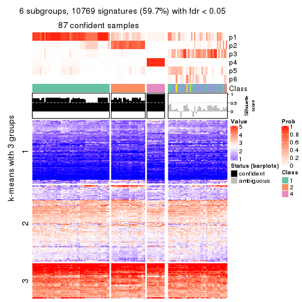</p>

</div>
</div>


Compare the overlap of signatures from different k:

```r
compare_signatures(res)
```


`get_signature()` returns a data frame invisibly. TO get the list of signatures, the function
call should be assigned to a variable explicitly. In following code, if `plot` argument is set
to `FALSE`, no heatmap is plotted while only the differential analysis is performed.

```r
# code only for demonstration
tb = get_signature(res, k = ..., plot = FALSE)
```

An example of the output of `tb` is:

```
#>   which_row         fdr    mean_1    mean_2 scaled_mean_1 scaled_mean_2 km
#> 1        38 0.042760348  8.373488  9.131774    -0.5533452     0.5164555  1
#> 2        40 0.018707592  7.106213  8.469186    -0.6173731     0.5762149  1
#> 3        55 0.019134737 10.221463 11.207825    -0.6159697     0.5749050  1
#> 4        59 0.006059896  5.921854  7.869574    -0.6899429     0.6439467  1
#> 5        60 0.018055526  8.928898 10.211722    -0.6204761     0.5791110  1
#> 6        98 0.009384629 15.714769 14.887706     0.6635654    -0.6193277  2
...
```

The columns in `tb` are:

1. `which_row`: row indices corresponding to the input matrix.
2. `fdr`: FDR for the differential test. 
3. `mean_x`: The mean value in group x.
4. `scaled_mean_x`: The mean value in group x after rows are scaled.
5. `km`: Row groups if k-means clustering is applied to rows.


UMAP plot which shows how samples are separated.


<script>
$( function() {
	$( '#tabs-CV-hclust-dimension-reduction' ).tabs();
} );
</script>
<div id='tabs-CV-hclust-dimension-reduction'>
<ul>
<li><a href='#tab-CV-hclust-dimension-reduction-1'>k = 2</a></li>
<li><a href='#tab-CV-hclust-dimension-reduction-2'>k = 3</a></li>
<li><a href='#tab-CV-hclust-dimension-reduction-3'>k = 4</a></li>
<li><a href='#tab-CV-hclust-dimension-reduction-4'>k = 5</a></li>
<li><a href='#tab-CV-hclust-dimension-reduction-5'>k = 6</a></li>
</ul>
<div id='tab-CV-hclust-dimension-reduction-1'>
<pre><code class="r">dimension_reduction(res, k = 2, method = &quot;UMAP&quot;)
</code></pre>

<p></p>

</div>
<div id='tab-CV-hclust-dimension-reduction-2'>
<pre><code class="r">dimension_reduction(res, k = 3, method = &quot;UMAP&quot;)
</code></pre>

<p></p>

</div>
<div id='tab-CV-hclust-dimension-reduction-3'>
<pre><code class="r">dimension_reduction(res, k = 4, method = &quot;UMAP&quot;)
</code></pre>

<p>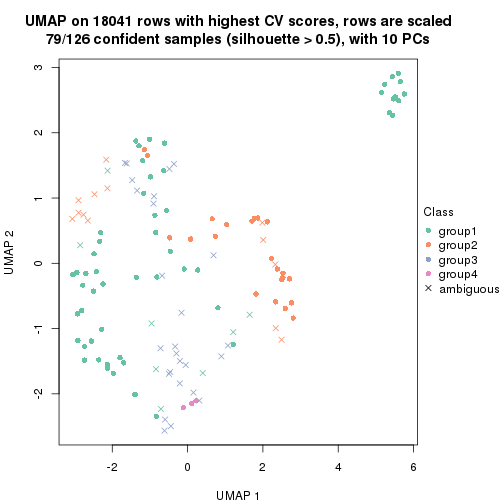</p>

</div>
<div id='tab-CV-hclust-dimension-reduction-4'>
<pre><code class="r">dimension_reduction(res, k = 5, method = &quot;UMAP&quot;)
</code></pre>

<p></p>

</div>
<div id='tab-CV-hclust-dimension-reduction-5'>
<pre><code class="r">dimension_reduction(res, k = 6, method = &quot;UMAP&quot;)
</code></pre>

<p></p>

</div>
</div>


Following heatmap shows how subgroups are split when increasing `k`:

```r
collect_classes(res)
```


If matrix rows can be associated to genes, consider to use `GO_Enrichment(res,
...)` to perform function enrichment for the signature genes.


 

---------------------------------------------------


### CV:kmeans


The object with results only for a single top-value method and a single partition method 
can be extracted as:

```r
res = res_list["CV", "kmeans"]
# you can also extract it by
# res = res_list["CV:kmeans"]
```

A summary of `res` and all the functions that can be applied to it:

```r
res
```

```
#> A 'ConsensusPartition' object with k = 2, 3, 4, 5, 6.
#>   On a matrix with 18041 rows and 126 columns.
#>   Top rows (1000, 2000, 3000, 4000, 5000) are extracted by 'CV' method.
#>   Subgroups are detected by 'kmeans' method.
#>   Performed in total 1250 partitions by row resampling.
#>   Best k for subgroups seems to be 2.
#> 
#> Following methods can be applied to this 'ConsensusPartition' object:
#>  [1] "cola_report"             "collect_classes"         "collect_plots"          
#>  [4] "collect_stats"           "colnames"                "compare_signatures"     
#>  [7] "consensus_heatmap"       "dimension_reduction"     "functional_enrichment"  
#> [10] "get_anno_col"            "get_anno"                "get_classes"            
#> [13] "get_consensus"           "get_matrix"              "get_membership"         
#> [16] "get_param"               "get_signatures"          "get_stats"              
#> [19] "is_best_k"               "is_stable_k"             "membership_heatmap"     
#> [22] "ncol"                    "nrow"                    "plot_ecdf"              
#> [25] "rownames"                "select_partition_number" "show"                   
#> [28] "suggest_best_k"          "test_to_known_factors"
```

`collect_plots()` function collects all the plots made from `res` for all `k` (number of partitions)
into one single page to provide an easy and fast comparison between different `k`.

```r
collect_plots(res)
```


The plots are:

- The first row: a plot of the ECDF (Empirical cumulative distribution
  function) curves of the consensus matrix for each `k` and the heatmap of
  predicted classes for each `k`.
- The second row: heatmaps of the consensus matrix for each `k`.
- The third row: heatmaps of the membership matrix for each `k`.
- The fouth row: heatmaps of the signatures for each `k`.

All the plots in panels can be made by individual functions and they are
plotted later in this section.

`select_partition_number()` produces several plots showing different
statistics for choosing "optimized" `k`. There are following statistics:

- ECDF curves of the consensus matrix for each `k`;
- 1-PAC. [The PAC
  score](https://en.wikipedia.org/wiki/Consensus_clustering#Over-interpretation_potential_of_consensus_clustering)
  measures the proportion of the ambiguous subgrouping.
- Mean silhouette score.
- Concordance. The mean probability of fiting the consensus class ids in all
  partitions.
- Area increased. Denote $A_k$ as the area under the ECDF curve for current
  `k`, the area increased is defined as $A_k - A_{k-1}$.
- Rand index. The percent of pairs of samples that are both in a same cluster
  or both are not in a same cluster in the partition of k and k-1.
- Jaccard index. The ratio of pairs of samples are both in a same cluster in
  the partition of k and k-1 and the pairs of samples are both in a same
  cluster in the partition k or k-1.

The detailed explanations of these statistics can be found in [the cola
vignette](http://bioconductor.org/packages/devel/bioc/vignettes/cola/inst/doc/cola.html#toc_13).

Generally speaking, lower PAC score, higher mean silhouette score or higher
concordance corresponds to better partition. Rand index and Jaccard index
measure how similar the current partition is compared to partition with `k-1`.
If they are too similar, we won't accept `k` is better than `k-1`.

```r
select_partition_number(res)
```


The numeric values for all these statistics can be obtained by `get_stats()`.

```r
get_stats(res)
```

```
#>   k 1-PAC mean_silhouette concordance area_increased  Rand Jaccard
#> 2 2 0.325           0.755       0.835         0.4493 0.552   0.552
#> 3 3 0.537           0.807       0.818         0.3866 0.724   0.527
#> 4 4 0.568           0.712       0.813         0.1424 0.905   0.734
#> 5 5 0.652           0.660       0.742         0.0762 0.869   0.579
#> 6 6 0.683           0.549       0.757         0.0490 0.960   0.826
```

`suggest_best_k()` suggests the best $k$ based on these statistics. The rules are as follows:

- All $k$ with Jaccard index larger than 0.95 are removed because the increase of
  the partition number does not provides enough extra information. If all $k$ are removed,
  the best $k$ is assigned by `NA`.
- For $k$ with 1-PAC larger than 0.9, the maximal $k$ is taken as the "best k". Other $k$ is called "optional k".
- If it does not fit the second rule. The $k$ with the highest vote of highest
  1-PAC, mean silhouette and concordance is taken as the "best k".

```r
suggest_best_k(res)
```

```
#> [1] 2
```


Following shows the table of the partitions (You need to click the **show/hide
code output** link to see it). The membership matrix (columns with name `p*`)
is inferred by
[`clue::cl_consensus()`](https://www.rdocumentation.org/link/cl_consensus?package=clue)
function with the `SE` method. Basically the value in the membership matrix
represents the probability to belong to a certain group. The finall class
label for an item is determined with the group with highest probability it
belongs to.

In `get_classes()` function, the entropy is calculated from the membership
matrix and the silhouette score is calculated from the consensus matrix.


<script>
$( function() {
	$( '#tabs-CV-kmeans-get-classes' ).tabs();
} );
</script>
<div id='tabs-CV-kmeans-get-classes'>
<ul>
<li><a href='#tab-CV-kmeans-get-classes-1'>k = 2</a></li>
<li><a href='#tab-CV-kmeans-get-classes-2'>k = 3</a></li>
<li><a href='#tab-CV-kmeans-get-classes-3'>k = 4</a></li>
<li><a href='#tab-CV-kmeans-get-classes-4'>k = 5</a></li>
<li><a href='#tab-CV-kmeans-get-classes-5'>k = 6</a></li>
</ul>

<div id='tab-CV-kmeans-get-classes-1'>
<p><a id='tab-CV-kmeans-get-classes-1-a' style='color:#0366d6' href='#'>show/hide code output</a></p>
<pre><code class="r">cbind(get_classes(res, k = 2), get_membership(res, k = 2))
</code></pre>

<pre><code>#&gt;                                      class entropy silhouette    p1    p2
#&gt; DC1F29A2-39DE-44AD-936A-54B2B32D6370     2  0.7883      0.772 0.236 0.764
#&gt; FA3C3413-FA8C-4A29-B9CA-5BC3A56274A8     2  0.4161      0.799 0.084 0.916
#&gt; B9B72975-8134-475C-BC0B-0CFDB24F636A     2  0.2778      0.790 0.048 0.952
#&gt; F44DB757-4D00-4BFC-99C5-AA82F99C5BDA     2  0.2778      0.790 0.048 0.952
#&gt; 3BD942BB-A3A7-4993-B3F1-B8641626B773     2  0.3274      0.808 0.060 0.940
#&gt; 431F73A2-2AB3-4101-B610-7FC02A7097EC     1  0.5946      0.814 0.856 0.144
#&gt; 3067683D-43D4-4F6D-9338-17F6A75E4B25     1  0.8499      0.672 0.724 0.276
#&gt; 2CE91B81-7CBE-4698-AFEE-6A154313D231     2  0.4161      0.799 0.084 0.916
#&gt; A639CF4F-4591-4337-A12E-BED71EDDA10B     1  0.4161      0.847 0.916 0.084
#&gt; 5482053D-9F48-4773-B68A-302B3A612503     2  0.8267      0.740 0.260 0.740
#&gt; A31D342D-C67C-428B-BAED-C6E844277A09     1  0.7815      0.676 0.768 0.232
#&gt; 0E9C5985-9AE0-4098-A076-6FFBBDF05110     2  0.3584      0.788 0.068 0.932
#&gt; 08CCF8A0-15B7-4A13-BC43-6B3B3E2DDE95     1  0.9427      0.556 0.640 0.360
#&gt; 10577D5B-AD56-403F-A562-73A9ACF2045B     1  0.9209      0.445 0.664 0.336
#&gt; C940D443-5DDA-4403-868B-7AA6B9A50FC4     1  0.3274      0.855 0.940 0.060
#&gt; 89D4D945-A717-495F-B253-F5A17CF5B9FA     1  0.7883      0.697 0.764 0.236
#&gt; DC55EE78-203F-4092-9B83-14B1A529194B     2  0.9922     -0.169 0.448 0.552
#&gt; 8F7368BE-EB41-4192-89AA-9E0428C08851     2  0.4815      0.805 0.104 0.896
#&gt; F772EA39-E408-4908-BADD-C786D702BF9B     2  0.1843      0.795 0.028 0.972
#&gt; FD693D10-3ADA-4028-8392-41D2F0296F7E     2  0.9552      0.614 0.376 0.624
#&gt; 84F16966-7640-49F9-95D1-7648FF74DCC9     2  0.2778      0.790 0.048 0.952
#&gt; D26DAA2F-AE6A-42E1-9F1F-01943B99785F     1  0.3274      0.855 0.940 0.060
#&gt; F325847E-F046-4B67-B01C-16919C401020     1  0.6343      0.784 0.840 0.160
#&gt; 19EB2B10-2529-4A94-8FAE-1CE371A602D9     1  0.3274      0.855 0.940 0.060
#&gt; B94B9CCF-5FB8-44AE-8D9C-A194C6801A27     2  0.2778      0.790 0.048 0.952
#&gt; D2678E70-542A-4AB2-B881-12D66DBA44F5     2  0.9954      0.422 0.460 0.540
#&gt; 4961CA2A-70CD-42AB-A676-4A98C85F449F     1  0.6801      0.788 0.820 0.180
#&gt; 5AA74C5C-2AD1-4D59-A030-E964EB199581     2  0.8016      0.767 0.244 0.756
#&gt; F9E11A1B-BD93-438F-9670-6FB7DFF9E910     1  0.1843      0.868 0.972 0.028
#&gt; FB78CA5A-C8B9-42AF-9DAE-799CAB280B2E     2  0.7674      0.770 0.224 0.776
#&gt; A8E48877-F8AB-44DD-A18B-194D87C44931     2  0.3879      0.802 0.076 0.924
#&gt; CA50C495-F37E-4743-867D-FAF2DCC3376A     1  0.4562      0.844 0.904 0.096
#&gt; 37342369-EC22-4904-8CCD-A0DC6BD8D183     2  0.3733      0.780 0.072 0.928
#&gt; 91BA5F90-9174-4533-A050-39A28E34A94D     2  0.6887      0.790 0.184 0.816
#&gt; 5BC371AC-1915-44E9-A114-2963E131EC8D     2  0.7883      0.772 0.236 0.764
#&gt; 74A6C31A-7F21-45AF-A170-18C326D2AE69     2  0.8267      0.743 0.260 0.740
#&gt; 984F27EF-D4D7-4E68-BD64-776FDFC04D07     2  0.9358      0.654 0.352 0.648
#&gt; B05701C5-8C44-4FD1-94C9-FC0255A2EA24     1  0.1843      0.868 0.972 0.028
#&gt; 91E4119C-2CE6-4447-A125-6A4F403A89E6     1  0.2423      0.865 0.960 0.040
#&gt; 1570FCE7-F1B4-4BDF-A398-355EDF030864     2  0.2778      0.790 0.048 0.952
#&gt; 604C06E9-A00E-435E-847A-3992922A5C56     1  0.1843      0.868 0.972 0.028
#&gt; 455C9007-6FF4-4D63-83FA-4915F0331F9A     2  0.9427      0.641 0.360 0.640
#&gt; FB8BD3CF-D2EC-47B6-B67F-65ADC1C3A6A7     1  0.4431      0.836 0.908 0.092
#&gt; 9DC7443A-3C8F-4025-8312-3C98BF28D736     1  0.5294      0.793 0.880 0.120
#&gt; CB207A52-09AC-49D3-8240-5840CDFBB154     2  0.7219      0.787 0.200 0.800
#&gt; 2A335049-AD9F-4B32-92B7-69B04B0CF2BA     1  0.1843      0.868 0.972 0.028
#&gt; 6ACA6293-371E-428D-BBAE-ABFD410C886F     2  0.3879      0.802 0.076 0.924
#&gt; E8929929-73F9-4DB7-ABBA-0852BEFFFF7E     1  0.1843      0.868 0.972 0.028
#&gt; 5E343116-414B-41F2-AAEE-A3225450135A     2  0.2778      0.808 0.048 0.952
#&gt; 0A39073C-157C-48A1-B125-A6A04CB738DA     2  0.4298      0.797 0.088 0.912
#&gt; 300D78E6-1C7E-4114-80EA-9204A6818B9A     2  0.2948      0.809 0.052 0.948
#&gt; DAAF55AA-ED48-4221-9CD6-D1DEB6376017     2  0.6887      0.790 0.184 0.816
#&gt; D76FCF4A-4ACF-41EF-A120-64136D6C845E     2  0.2948      0.806 0.052 0.948
#&gt; AD294665-6F90-459C-90D5-3058F210225D     2  0.7883      0.772 0.236 0.764
#&gt; 92E8AD7A-1084-44C8-BDC0-FE4E47B6143F     2  0.2778      0.790 0.048 0.952
#&gt; 5644A861-3C59-486D-8FBE-4DF6A3B19558     2  0.8327      0.739 0.264 0.736
#&gt; 1BF8AAE7-B771-4CF2-8B1C-D2BEB5E6579E     1  0.8861      0.470 0.696 0.304
#&gt; A54731AE-FC40-407F-8D10-67DDC122237D     2  0.3431      0.786 0.064 0.936
#&gt; 179DC906-5654-4CBA-9C27-C9560B5F12DE     2  0.9933      0.381 0.452 0.548
#&gt; 979B9A2B-2D81-47C3-A553-9B9441CAAE47     2  0.7883      0.772 0.236 0.764
#&gt; D69BD86A-08FB-49DA-9084-2725F6C9195F     2  0.6887      0.790 0.184 0.816
#&gt; 84611033-BCF7-49D7-9B91-DA29B62AC8D3     1  0.1843      0.868 0.972 0.028
#&gt; 8AA1DA3E-8C00-4653-AA33-EA70531C1E50     2  0.2778      0.790 0.048 0.952
#&gt; CEBE9594-0F19-46B4-AF7D-F8DF33E00AFB     2  0.7674      0.770 0.224 0.776
#&gt; C68E82D2-2BD3-41E9-92D7-D4C06E1953B2     2  0.5946      0.804 0.144 0.856
#&gt; B855EF89-1E76-4408-AA65-61A0F0A4F412     2  0.2778      0.790 0.048 0.952
#&gt; 4488EFB3-5B01-41E3-B57E-8E4F607CF448     2  0.7883      0.772 0.236 0.764
#&gt; C2BD8440-CAC6-4FE5-8EBB-5E6AE308D52F     1  0.4298      0.838 0.912 0.088
#&gt; E0E50F10-1FED-41C1-84DB-81A46F25D7E9     2  0.9393      0.648 0.356 0.644
#&gt; EE16D845-31F2-4178-800B-CA2C358841AD     2  0.2778      0.790 0.048 0.952
#&gt; 169828CF-5693-4A46-B5D7-E45CBA9DF317     2  0.1843      0.795 0.028 0.972
#&gt; 51077BA3-AEE0-4BD4-A1B1-1B0A811642A1     2  0.8327      0.739 0.264 0.736
#&gt; D2F4E240-C44C-4CF7-8016-6CACD370D093     2  0.8327      0.736 0.264 0.736
#&gt; 721CDBE6-FC85-4C30-B23E-28407340286F     1  0.1843      0.868 0.972 0.028
#&gt; 392897E4-6009-422C-B461-649F4DDF260C     1  0.1843      0.868 0.972 0.028
#&gt; 617E13D2-6924-45F8-A8DE-BE21B718F822     1  0.5294      0.793 0.880 0.120
#&gt; 5746C00F-9CBB-46B7-83FD-90B2AB3F507B     2  0.8499      0.737 0.276 0.724
#&gt; 982B4344-A223-4D1F-9485-2E56F9FD45C0     2  0.2778      0.790 0.048 0.952
#&gt; E5557F52-015D-49DC-9E23-989FC259976F     1  0.3431      0.852 0.936 0.064
#&gt; F3135F5E-2E90-4923-B634-E994563D17B7     1  0.2778      0.861 0.952 0.048
#&gt; D1ED15A5-9802-4314-B556-E89EB772D1F0     1  0.9522      0.392 0.628 0.372
#&gt; 222B06E3-FCFB-4104-92C3-D73BC31854D4     2  0.8327      0.739 0.264 0.736
#&gt; 4C810FFA-ED07-4F4C-9F81-B8F1CF4956F7     2  0.8443      0.750 0.272 0.728
#&gt; 9A608964-ED12-4E6E-9D3A-430F59FFF65B     1  0.3879      0.849 0.924 0.076
#&gt; 4087357F-C17A-4992-A8AB-41ACA2F72001     2  0.8207      0.762 0.256 0.744
#&gt; B3F013A5-BCB8-4CE0-86B2-634EE180AA6E     2  0.2778      0.790 0.048 0.952
#&gt; 322AF320-1379-4F51-AFDC-5292A060CD52     1  0.6973      0.744 0.812 0.188
#&gt; 53A96249-66D5-4C26-893B-ADC71481D261     2  0.3431      0.786 0.064 0.936
#&gt; 1AB7A6F2-14BD-447C-B2E3-DEB0CE56B209     2  0.6887      0.790 0.184 0.816
#&gt; 8B4BCDA0-6787-4A55-99F7-AAF22AF85BA6     1  0.9850      0.480 0.572 0.428
#&gt; 5D9D9E08-2C2C-414E-9547-62799F90D543     2  0.2778      0.790 0.048 0.952
#&gt; C345CD17-E4F4-41D5-9891-FEFB19342C52     1  0.2423      0.864 0.960 0.040
#&gt; 1AF8FDE1-1A74-41F6-A1C5-4952CDFB7D3F     2  0.6973      0.792 0.188 0.812
#&gt; BC3405FF-0660-4B2B-8DC1-5F34D3133078     2  0.8443      0.742 0.272 0.728
#&gt; C2662596-6E2F-4924-B051-CEA1AC87B197     2  0.8267      0.740 0.260 0.740
#&gt; 39AE85F7-49FB-4438-BD41-6AC812FA1C72     2  0.9922      0.399 0.448 0.552
#&gt; 6FF266DB-3F08-43F2-8F6F-679F805B80B8     2  0.2236      0.807 0.036 0.964
#&gt; B03B7B81-BBD6-4194-BC5E-6EDF0D3F015A     2  0.7299      0.788 0.204 0.796
#&gt; C7617D56-F13C-4C43-906C-BD458C5DC4CD     2  0.2236      0.807 0.036 0.964
#&gt; 09420F8B-7A71-4B32-8388-4767670F1FEB     2  0.6973      0.788 0.188 0.812
#&gt; 6AF47534-74FF-4128-865B-4E8EE1FFB469     2  0.6343      0.688 0.160 0.840
#&gt; 8FF9E94A-2ED2-4727-947F-D524D7ECE815     2  0.7056      0.787 0.192 0.808
#&gt; A390E20D-03F9-40E4-A132-0FA5C2BEDB63     2  0.9427      0.641 0.360 0.640
#&gt; A489CCCA-1374-4071-80CE-05B83C9A0D5E     2  0.4161      0.799 0.084 0.916
#&gt; 2D962371-EC83-490C-A663-478AF383BC1B     2  0.2778      0.790 0.048 0.952
#&gt; D91B31A1-EE71-4726-B94C-0CC2815E9D4E     2  0.0000      0.798 0.000 1.000
#&gt; E0123C5C-E1D1-4162-9895-CC8B01949D84     1  0.2603      0.862 0.956 0.044
#&gt; EC73959A-2728-49FE-B72A-790BB14F4CBF     2  0.8267      0.743 0.260 0.740
#&gt; A60DC925-7343-496E-900D-0DD81D5C8123     1  0.9209      0.530 0.664 0.336
#&gt; 659B64DB-F4A5-43BD-811B-05004CB49D99     2  0.8267      0.740 0.260 0.740
#&gt; 6969B6B2-7616-4664-9696-C4DACD10537B     2  0.2778      0.790 0.048 0.952
#&gt; 2F6392DE-0D54-4768-B062-907C81E5B0CC     2  0.2778      0.808 0.048 0.952
#&gt; C74BE8C5-BA6D-4596-9D67-3C731799F999     2  0.9393      0.648 0.356 0.644
#&gt; 79A7647F-BDBA-45A2-B207-ABF788F6CC95     1  0.1843      0.868 0.972 0.028
#&gt; D47D0433-2313-4A2F-B268-5AD293D7534E     1  0.9635      0.528 0.612 0.388
#&gt; C5058B93-C1DA-43B9-9951-B23A9810AA6E     2  0.4022      0.807 0.080 0.920
#&gt; 2629FEE3-A203-4411-8A70-02A796C9505C     1  0.4431      0.836 0.908 0.092
#&gt; 1AF329E4-11D4-4CFC-801F-C24A1EA33102     2  0.4161      0.799 0.084 0.916
#&gt; D453BEF8-3F18-4B89-BA42-CE74EB105032     1  0.1843      0.868 0.972 0.028
#&gt; B12A4446-2310-4139-897F-CA030478CBD5     1  0.1843      0.868 0.972 0.028
#&gt; BCAB1918-5FA9-4CBD-85CB-008743FEA2CC     1  0.1843      0.868 0.972 0.028
#&gt; 9A5432D3-19EE-47B4-BD88-698DEC75A5E9     2  0.0672      0.800 0.008 0.992
#&gt; A608BCEB-2C27-4927-A308-E6975F641722     2  0.3431      0.786 0.064 0.936
#&gt; E4752275-7BF6-4C1E-8A45-C7D571ED85AD     2  0.2778      0.790 0.048 0.952
#&gt; FDEC1714-C02D-4AB7-AE82-789E9D709EDE     2  0.7883      0.772 0.236 0.764
#&gt; 33737781-8638-4FA2-AD4C-E888BB9343D8     2  0.4022      0.800 0.080 0.920
</code></pre>

<script>
$('#tab-CV-kmeans-get-classes-1-a').parent().next().next().hide();
$('#tab-CV-kmeans-get-classes-1-a').click(function(){
  $('#tab-CV-kmeans-get-classes-1-a').parent().next().next().toggle();
  return(false);
});
</script>
</div>

<div id='tab-CV-kmeans-get-classes-2'>
<p><a id='tab-CV-kmeans-get-classes-2-a' style='color:#0366d6' href='#'>show/hide code output</a></p>
<pre><code class="r">cbind(get_classes(res, k = 3), get_membership(res, k = 3))
</code></pre>

<pre><code>#&gt;                                      class entropy silhouette    p1    p2    p3
#&gt; DC1F29A2-39DE-44AD-936A-54B2B32D6370     1   0.371     0.8207 0.892 0.032 0.076
#&gt; FA3C3413-FA8C-4A29-B9CA-5BC3A56274A8     2   0.677     0.8479 0.304 0.664 0.032
#&gt; B9B72975-8134-475C-BC0B-0CFDB24F636A     2   0.531     0.9158 0.216 0.772 0.012
#&gt; F44DB757-4D00-4BFC-99C5-AA82F99C5BDA     2   0.522     0.9180 0.208 0.780 0.012
#&gt; 3BD942BB-A3A7-4993-B3F1-B8641626B773     1   0.452     0.7556 0.852 0.116 0.032
#&gt; 431F73A2-2AB3-4101-B610-7FC02A7097EC     3   0.448     0.8482 0.072 0.064 0.864
#&gt; 3067683D-43D4-4F6D-9338-17F6A75E4B25     3   0.453     0.8444 0.052 0.088 0.860
#&gt; 2CE91B81-7CBE-4698-AFEE-6A154313D231     2   0.654     0.8546 0.304 0.672 0.024
#&gt; A639CF4F-4591-4337-A12E-BED71EDDA10B     3   0.220     0.8903 0.056 0.004 0.940
#&gt; 5482053D-9F48-4773-B68A-302B3A612503     1   0.325     0.8304 0.912 0.052 0.036
#&gt; A31D342D-C67C-428B-BAED-C6E844277A09     1   0.631     0.0599 0.504 0.000 0.496
#&gt; 0E9C5985-9AE0-4098-A076-6FFBBDF05110     2   0.638     0.8953 0.244 0.720 0.036
#&gt; 08CCF8A0-15B7-4A13-BC43-6B3B3E2DDE95     3   0.456     0.8355 0.064 0.076 0.860
#&gt; 10577D5B-AD56-403F-A562-73A9ACF2045B     1   0.541     0.7457 0.796 0.032 0.172
#&gt; C940D443-5DDA-4403-868B-7AA6B9A50FC4     3   0.165     0.8991 0.036 0.004 0.960
#&gt; 89D4D945-A717-495F-B253-F5A17CF5B9FA     3   0.188     0.8954 0.004 0.044 0.952
#&gt; DC55EE78-203F-4092-9B83-14B1A529194B     2   0.547     0.8985 0.176 0.792 0.032
#&gt; 8F7368BE-EB41-4192-89AA-9E0428C08851     1   0.333     0.8238 0.904 0.076 0.020
#&gt; F772EA39-E408-4908-BADD-C786D702BF9B     2   0.480     0.9128 0.220 0.780 0.000
#&gt; FD693D10-3ADA-4028-8392-41D2F0296F7E     1   0.663     0.6650 0.728 0.212 0.060
#&gt; 84F16966-7640-49F9-95D1-7648FF74DCC9     2   0.512     0.9160 0.200 0.788 0.012
#&gt; D26DAA2F-AE6A-42E1-9F1F-01943B99785F     3   0.140     0.9031 0.004 0.028 0.968
#&gt; F325847E-F046-4B67-B01C-16919C401020     3   0.504     0.8108 0.120 0.048 0.832
#&gt; 19EB2B10-2529-4A94-8FAE-1CE371A602D9     3   0.141     0.8986 0.036 0.000 0.964
#&gt; B94B9CCF-5FB8-44AE-8D9C-A194C6801A27     2   0.522     0.9180 0.208 0.780 0.012
#&gt; D2678E70-542A-4AB2-B881-12D66DBA44F5     1   0.672     0.6584 0.720 0.220 0.060
#&gt; 4961CA2A-70CD-42AB-A676-4A98C85F449F     3   0.498     0.8197 0.096 0.064 0.840
#&gt; 5AA74C5C-2AD1-4D59-A030-E964EB199581     1   0.371     0.8207 0.892 0.032 0.076
#&gt; F9E11A1B-BD93-438F-9670-6FB7DFF9E910     3   0.164     0.9080 0.016 0.020 0.964
#&gt; FB78CA5A-C8B9-42AF-9DAE-799CAB280B2E     1   0.313     0.8304 0.916 0.052 0.032
#&gt; A8E48877-F8AB-44DD-A18B-194D87C44931     2   0.698     0.8081 0.336 0.632 0.032
#&gt; CA50C495-F37E-4743-867D-FAF2DCC3376A     3   0.378     0.8725 0.064 0.044 0.892
#&gt; 37342369-EC22-4904-8CCD-A0DC6BD8D183     2   0.527     0.9144 0.200 0.784 0.016
#&gt; 91BA5F90-9174-4533-A050-39A28E34A94D     1   0.313     0.8304 0.916 0.052 0.032
#&gt; 5BC371AC-1915-44E9-A114-2963E131EC8D     1   0.390     0.8196 0.888 0.060 0.052
#&gt; 74A6C31A-7F21-45AF-A170-18C326D2AE69     1   0.325     0.8304 0.912 0.052 0.036
#&gt; 984F27EF-D4D7-4E68-BD64-776FDFC04D07     1   0.663     0.6650 0.728 0.212 0.060
#&gt; B05701C5-8C44-4FD1-94C9-FC0255A2EA24     3   0.134     0.9079 0.016 0.012 0.972
#&gt; 91E4119C-2CE6-4447-A125-6A4F403A89E6     3   0.175     0.9061 0.012 0.028 0.960
#&gt; 1570FCE7-F1B4-4BDF-A398-355EDF030864     2   0.522     0.9180 0.208 0.780 0.012
#&gt; 604C06E9-A00E-435E-847A-3992922A5C56     3   0.134     0.9079 0.016 0.012 0.972
#&gt; 455C9007-6FF4-4D63-83FA-4915F0331F9A     1   0.663     0.6650 0.728 0.212 0.060
#&gt; FB8BD3CF-D2EC-47B6-B67F-65ADC1C3A6A7     3   0.199     0.8985 0.004 0.048 0.948
#&gt; 9DC7443A-3C8F-4025-8312-3C98BF28D736     3   0.967     0.1236 0.376 0.212 0.412
#&gt; CB207A52-09AC-49D3-8240-5840CDFBB154     1   0.315     0.8215 0.916 0.048 0.036
#&gt; 2A335049-AD9F-4B32-92B7-69B04B0CF2BA     3   0.164     0.9080 0.016 0.020 0.964
#&gt; 6ACA6293-371E-428D-BBAE-ABFD410C886F     2   0.698     0.8081 0.336 0.632 0.032
#&gt; E8929929-73F9-4DB7-ABBA-0852BEFFFF7E     3   0.134     0.9079 0.016 0.012 0.972
#&gt; 5E343116-414B-41F2-AAEE-A3225450135A     1   0.372     0.7955 0.888 0.088 0.024
#&gt; 0A39073C-157C-48A1-B125-A6A04CB738DA     2   0.704     0.8212 0.328 0.636 0.036
#&gt; 300D78E6-1C7E-4114-80EA-9204A6818B9A     1   0.328     0.8086 0.908 0.068 0.024
#&gt; DAAF55AA-ED48-4221-9CD6-D1DEB6376017     1   0.328     0.8267 0.908 0.068 0.024
#&gt; D76FCF4A-4ACF-41EF-A120-64136D6C845E     1   0.718    -0.1715 0.564 0.408 0.028
#&gt; AD294665-6F90-459C-90D5-3058F210225D     1   0.390     0.8196 0.888 0.060 0.052
#&gt; 92E8AD7A-1084-44C8-BDC0-FE4E47B6143F     2   0.522     0.9180 0.208 0.780 0.012
#&gt; 5644A861-3C59-486D-8FBE-4DF6A3B19558     1   0.325     0.8304 0.912 0.052 0.036
#&gt; 1BF8AAE7-B771-4CF2-8B1C-D2BEB5E6579E     1   0.681     0.6541 0.720 0.212 0.068
#&gt; A54731AE-FC40-407F-8D10-67DDC122237D     2   0.623     0.8942 0.252 0.720 0.028
#&gt; 179DC906-5654-4CBA-9C27-C9560B5F12DE     1   0.427     0.8126 0.872 0.052 0.076
#&gt; 979B9A2B-2D81-47C3-A553-9B9441CAAE47     1   0.390     0.8196 0.888 0.060 0.052
#&gt; D69BD86A-08FB-49DA-9084-2725F6C9195F     1   0.313     0.8304 0.916 0.052 0.032
#&gt; 84611033-BCF7-49D7-9B91-DA29B62AC8D3     3   0.164     0.9080 0.016 0.020 0.964
#&gt; 8AA1DA3E-8C00-4653-AA33-EA70531C1E50     2   0.522     0.9180 0.208 0.780 0.012
#&gt; CEBE9594-0F19-46B4-AF7D-F8DF33E00AFB     1   0.313     0.8304 0.916 0.052 0.032
#&gt; C68E82D2-2BD3-41E9-92D7-D4C06E1953B2     1   0.460     0.7663 0.852 0.108 0.040
#&gt; B855EF89-1E76-4408-AA65-61A0F0A4F412     2   0.522     0.9180 0.208 0.780 0.012
#&gt; 4488EFB3-5B01-41E3-B57E-8E4F607CF448     1   0.390     0.8196 0.888 0.060 0.052
#&gt; C2BD8440-CAC6-4FE5-8EBB-5E6AE308D52F     3   0.626     0.0864 0.448 0.000 0.552
#&gt; E0E50F10-1FED-41C1-84DB-81A46F25D7E9     1   0.663     0.6650 0.728 0.212 0.060
#&gt; EE16D845-31F2-4178-800B-CA2C358841AD     2   0.517     0.9163 0.204 0.784 0.012
#&gt; 169828CF-5693-4A46-B5D7-E45CBA9DF317     2   0.480     0.9128 0.220 0.780 0.000
#&gt; 51077BA3-AEE0-4BD4-A1B1-1B0A811642A1     1   0.325     0.8304 0.912 0.052 0.036
#&gt; D2F4E240-C44C-4CF7-8016-6CACD370D093     1   0.325     0.8304 0.912 0.052 0.036
#&gt; 721CDBE6-FC85-4C30-B23E-28407340286F     3   0.164     0.9080 0.016 0.020 0.964
#&gt; 392897E4-6009-422C-B461-649F4DDF260C     3   0.164     0.9080 0.016 0.020 0.964
#&gt; 617E13D2-6924-45F8-A8DE-BE21B718F822     3   0.964     0.1841 0.356 0.212 0.432
#&gt; 5746C00F-9CBB-46B7-83FD-90B2AB3F507B     1   0.359     0.8222 0.900 0.048 0.052
#&gt; 982B4344-A223-4D1F-9485-2E56F9FD45C0     2   0.517     0.9175 0.204 0.784 0.012
#&gt; E5557F52-015D-49DC-9E23-989FC259976F     3   0.165     0.8991 0.036 0.004 0.960
#&gt; F3135F5E-2E90-4923-B634-E994563D17B7     3   0.153     0.9016 0.032 0.004 0.964
#&gt; D1ED15A5-9802-4314-B556-E89EB772D1F0     3   0.729     0.4263 0.356 0.040 0.604
#&gt; 222B06E3-FCFB-4104-92C3-D73BC31854D4     1   0.325     0.8304 0.912 0.052 0.036
#&gt; 4C810FFA-ED07-4F4C-9F81-B8F1CF4956F7     1   0.645     0.6697 0.736 0.212 0.052
#&gt; 9A608964-ED12-4E6E-9D3A-430F59FFF65B     3   0.260     0.8949 0.052 0.016 0.932
#&gt; 4087357F-C17A-4992-A8AB-41ACA2F72001     1   0.635     0.6706 0.740 0.212 0.048
#&gt; B3F013A5-BCB8-4CE0-86B2-634EE180AA6E     2   0.517     0.9175 0.204 0.784 0.012
#&gt; 322AF320-1379-4F51-AFDC-5292A060CD52     3   0.230     0.8856 0.004 0.060 0.936
#&gt; 53A96249-66D5-4C26-893B-ADC71481D261     2   0.598     0.9059 0.228 0.744 0.028
#&gt; 1AB7A6F2-14BD-447C-B2E3-DEB0CE56B209     1   0.313     0.8304 0.916 0.052 0.032
#&gt; 8B4BCDA0-6787-4A55-99F7-AAF22AF85BA6     2   0.616     0.7932 0.092 0.780 0.128
#&gt; 5D9D9E08-2C2C-414E-9547-62799F90D543     2   0.522     0.9180 0.208 0.780 0.012
#&gt; C345CD17-E4F4-41D5-9891-FEFB19342C52     3   0.117     0.9071 0.016 0.008 0.976
#&gt; 1AF8FDE1-1A74-41F6-A1C5-4952CDFB7D3F     1   0.326     0.8200 0.912 0.048 0.040
#&gt; BC3405FF-0660-4B2B-8DC1-5F34D3133078     1   0.380     0.8166 0.892 0.052 0.056
#&gt; C2662596-6E2F-4924-B051-CEA1AC87B197     1   0.325     0.8304 0.912 0.052 0.036
#&gt; 39AE85F7-49FB-4438-BD41-6AC812FA1C72     1   0.466     0.8052 0.852 0.048 0.100
#&gt; 6FF266DB-3F08-43F2-8F6F-679F805B80B8     1   0.429     0.7673 0.840 0.152 0.008
#&gt; B03B7B81-BBD6-4194-BC5E-6EDF0D3F015A     1   0.359     0.8169 0.900 0.052 0.048
#&gt; C7617D56-F13C-4C43-906C-BD458C5DC4CD     1   0.377     0.8008 0.876 0.112 0.012
#&gt; 09420F8B-7A71-4B32-8388-4767670F1FEB     1   0.313     0.8304 0.916 0.052 0.032
#&gt; 6AF47534-74FF-4128-865B-4E8EE1FFB469     2   0.601     0.9076 0.220 0.748 0.032
#&gt; 8FF9E94A-2ED2-4727-947F-D524D7ECE815     1   0.313     0.8304 0.916 0.052 0.032
#&gt; A390E20D-03F9-40E4-A132-0FA5C2BEDB63     1   0.663     0.6650 0.728 0.212 0.060
#&gt; A489CCCA-1374-4071-80CE-05B83C9A0D5E     2   0.677     0.8479 0.304 0.664 0.032
#&gt; 2D962371-EC83-490C-A663-478AF383BC1B     2   0.522     0.9180 0.208 0.780 0.012
#&gt; D91B31A1-EE71-4726-B94C-0CC2815E9D4E     2   0.520     0.8995 0.236 0.760 0.004
#&gt; E0123C5C-E1D1-4162-9895-CC8B01949D84     3   0.153     0.9026 0.004 0.032 0.964
#&gt; EC73959A-2728-49FE-B72A-790BB14F4CBF     1   0.324     0.8305 0.912 0.056 0.032
#&gt; A60DC925-7343-496E-900D-0DD81D5C8123     2   0.649     0.7864 0.096 0.760 0.144
#&gt; 659B64DB-F4A5-43BD-811B-05004CB49D99     1   0.325     0.8304 0.912 0.052 0.036
#&gt; 6969B6B2-7616-4664-9696-C4DACD10537B     2   0.522     0.9180 0.208 0.780 0.012
#&gt; 2F6392DE-0D54-4768-B062-907C81E5B0CC     1   0.412     0.7692 0.868 0.108 0.024
#&gt; C74BE8C5-BA6D-4596-9D67-3C731799F999     1   0.663     0.6650 0.728 0.212 0.060
#&gt; 79A7647F-BDBA-45A2-B207-ABF788F6CC95     3   0.149     0.9081 0.016 0.016 0.968
#&gt; D47D0433-2313-4A2F-B268-5AD293D7534E     2   0.628     0.6418 0.040 0.736 0.224
#&gt; C5058B93-C1DA-43B9-9951-B23A9810AA6E     1   0.466     0.7458 0.844 0.124 0.032
#&gt; 2629FEE3-A203-4411-8A70-02A796C9505C     3   0.199     0.8985 0.004 0.048 0.948
#&gt; 1AF329E4-11D4-4CFC-801F-C24A1EA33102     2   0.651     0.8583 0.300 0.676 0.024
#&gt; D453BEF8-3F18-4B89-BA42-CE74EB105032     3   0.134     0.9079 0.016 0.012 0.972
#&gt; B12A4446-2310-4139-897F-CA030478CBD5     3   0.164     0.9080 0.016 0.020 0.964
#&gt; BCAB1918-5FA9-4CBD-85CB-008743FEA2CC     3   0.149     0.9076 0.016 0.016 0.968
#&gt; 9A5432D3-19EE-47B4-BD88-698DEC75A5E9     2   0.617     0.7587 0.360 0.636 0.004
#&gt; A608BCEB-2C27-4927-A308-E6975F641722     2   0.614     0.8934 0.256 0.720 0.024
#&gt; E4752275-7BF6-4C1E-8A45-C7D571ED85AD     2   0.522     0.9180 0.208 0.780 0.012
#&gt; FDEC1714-C02D-4AB7-AE82-789E9D709EDE     1   0.390     0.8196 0.888 0.060 0.052
#&gt; 33737781-8638-4FA2-AD4C-E888BB9343D8     2   0.698     0.8081 0.336 0.632 0.032
</code></pre>

<script>
$('#tab-CV-kmeans-get-classes-2-a').parent().next().next().hide();
$('#tab-CV-kmeans-get-classes-2-a').click(function(){
  $('#tab-CV-kmeans-get-classes-2-a').parent().next().next().toggle();
  return(false);
});
</script>
</div>

<div id='tab-CV-kmeans-get-classes-3'>
<p><a id='tab-CV-kmeans-get-classes-3-a' style='color:#0366d6' href='#'>show/hide code output</a></p>
<pre><code class="r">cbind(get_classes(res, k = 4), get_membership(res, k = 4))
</code></pre>

<pre><code>#&gt;                                      class entropy silhouette    p1    p2    p3    p4
#&gt; DC1F29A2-39DE-44AD-936A-54B2B32D6370     1  0.2715     0.7149 0.916 0.036 0.032 0.016
#&gt; FA3C3413-FA8C-4A29-B9CA-5BC3A56274A8     2  0.7186     0.4854 0.356 0.520 0.008 0.116
#&gt; B9B72975-8134-475C-BC0B-0CFDB24F636A     2  0.3877     0.7829 0.124 0.840 0.004 0.032
#&gt; F44DB757-4D00-4BFC-99C5-AA82F99C5BDA     2  0.2334     0.8056 0.088 0.908 0.000 0.004
#&gt; 3BD942BB-A3A7-4993-B3F1-B8641626B773     1  0.4356     0.6881 0.828 0.092 0.008 0.072
#&gt; 431F73A2-2AB3-4101-B610-7FC02A7097EC     3  0.6314     0.6606 0.204 0.044 0.696 0.056
#&gt; 3067683D-43D4-4F6D-9338-17F6A75E4B25     3  0.7038     0.6774 0.160 0.076 0.672 0.092
#&gt; 2CE91B81-7CBE-4698-AFEE-6A154313D231     2  0.7186     0.4854 0.356 0.520 0.008 0.116
#&gt; A639CF4F-4591-4337-A12E-BED71EDDA10B     3  0.1229     0.8509 0.020 0.004 0.968 0.008
#&gt; 5482053D-9F48-4773-B68A-302B3A612503     1  0.5231     0.6437 0.764 0.052 0.016 0.168
#&gt; A31D342D-C67C-428B-BAED-C6E844277A09     3  0.6229     0.0567 0.440 0.004 0.512 0.044
#&gt; 0E9C5985-9AE0-4098-A076-6FFBBDF05110     2  0.5912     0.6644 0.276 0.664 0.008 0.052
#&gt; 08CCF8A0-15B7-4A13-BC43-6B3B3E2DDE95     3  0.5371     0.7418 0.108 0.064 0.784 0.044
#&gt; 10577D5B-AD56-403F-A562-73A9ACF2045B     1  0.5390     0.6309 0.760 0.040 0.032 0.168
#&gt; C940D443-5DDA-4403-868B-7AA6B9A50FC4     3  0.0804     0.8518 0.008 0.000 0.980 0.012
#&gt; 89D4D945-A717-495F-B253-F5A17CF5B9FA     3  0.3076     0.8397 0.016 0.036 0.900 0.048
#&gt; DC55EE78-203F-4092-9B83-14B1A529194B     2  0.1911     0.7796 0.032 0.944 0.004 0.020
#&gt; 8F7368BE-EB41-4192-89AA-9E0428C08851     1  0.3962     0.6812 0.844 0.052 0.004 0.100
#&gt; F772EA39-E408-4908-BADD-C786D702BF9B     2  0.2401     0.8047 0.092 0.904 0.000 0.004
#&gt; FD693D10-3ADA-4028-8392-41D2F0296F7E     4  0.4134     0.9411 0.188 0.008 0.008 0.796
#&gt; 84F16966-7640-49F9-95D1-7648FF74DCC9     2  0.1635     0.7931 0.044 0.948 0.000 0.008
#&gt; D26DAA2F-AE6A-42E1-9F1F-01943B99785F     3  0.0927     0.8536 0.008 0.000 0.976 0.016
#&gt; F325847E-F046-4B67-B01C-16919C401020     3  0.6246     0.5936 0.256 0.044 0.668 0.032
#&gt; 19EB2B10-2529-4A94-8FAE-1CE371A602D9     3  0.0779     0.8516 0.004 0.000 0.980 0.016
#&gt; B94B9CCF-5FB8-44AE-8D9C-A194C6801A27     2  0.2949     0.8018 0.088 0.888 0.000 0.024
#&gt; D2678E70-542A-4AB2-B881-12D66DBA44F5     4  0.3823     0.9219 0.160 0.008 0.008 0.824
#&gt; 4961CA2A-70CD-42AB-A676-4A98C85F449F     3  0.5063     0.7342 0.140 0.040 0.788 0.032
#&gt; 5AA74C5C-2AD1-4D59-A030-E964EB199581     1  0.3065     0.7128 0.900 0.032 0.052 0.016
#&gt; F9E11A1B-BD93-438F-9670-6FB7DFF9E910     3  0.3215     0.8405 0.000 0.032 0.876 0.092
#&gt; FB78CA5A-C8B9-42AF-9DAE-799CAB280B2E     1  0.5072     0.6498 0.772 0.052 0.012 0.164
#&gt; A8E48877-F8AB-44DD-A18B-194D87C44931     2  0.7279     0.3808 0.404 0.472 0.008 0.116
#&gt; CA50C495-F37E-4743-867D-FAF2DCC3376A     3  0.5382     0.7023 0.184 0.032 0.752 0.032
#&gt; 37342369-EC22-4904-8CCD-A0DC6BD8D183     2  0.2224     0.7762 0.040 0.928 0.000 0.032
#&gt; 91BA5F90-9174-4533-A050-39A28E34A94D     1  0.4837     0.6618 0.792 0.052 0.012 0.144
#&gt; 5BC371AC-1915-44E9-A114-2963E131EC8D     1  0.4419     0.6941 0.828 0.072 0.012 0.088
#&gt; 74A6C31A-7F21-45AF-A170-18C326D2AE69     1  0.5231     0.6437 0.764 0.052 0.016 0.168
#&gt; 984F27EF-D4D7-4E68-BD64-776FDFC04D07     4  0.4134     0.9411 0.188 0.008 0.008 0.796
#&gt; B05701C5-8C44-4FD1-94C9-FC0255A2EA24     3  0.1004     0.8531 0.000 0.004 0.972 0.024
#&gt; 91E4119C-2CE6-4447-A125-6A4F403A89E6     3  0.3818     0.8377 0.004 0.048 0.852 0.096
#&gt; 1570FCE7-F1B4-4BDF-A398-355EDF030864     2  0.2714     0.7876 0.112 0.884 0.000 0.004
#&gt; 604C06E9-A00E-435E-847A-3992922A5C56     3  0.0469     0.8529 0.000 0.000 0.988 0.012
#&gt; 455C9007-6FF4-4D63-83FA-4915F0331F9A     4  0.4134     0.9411 0.188 0.008 0.008 0.796
#&gt; FB8BD3CF-D2EC-47B6-B67F-65ADC1C3A6A7     3  0.3081     0.8488 0.016 0.040 0.900 0.044
#&gt; 9DC7443A-3C8F-4025-8312-3C98BF28D736     4  0.3338     0.8138 0.052 0.008 0.056 0.884
#&gt; CB207A52-09AC-49D3-8240-5840CDFBB154     1  0.3127     0.7152 0.892 0.032 0.008 0.068
#&gt; 2A335049-AD9F-4B32-92B7-69B04B0CF2BA     3  0.3399     0.8379 0.000 0.040 0.868 0.092
#&gt; 6ACA6293-371E-428D-BBAE-ABFD410C886F     2  0.7279     0.3808 0.404 0.472 0.008 0.116
#&gt; E8929929-73F9-4DB7-ABBA-0852BEFFFF7E     3  0.0707     0.8521 0.000 0.000 0.980 0.020
#&gt; 5E343116-414B-41F2-AAEE-A3225450135A     1  0.3862     0.7038 0.852 0.084 0.004 0.060
#&gt; 0A39073C-157C-48A1-B125-A6A04CB738DA     1  0.7085    -0.2927 0.468 0.428 0.008 0.096
#&gt; 300D78E6-1C7E-4114-80EA-9204A6818B9A     1  0.3658     0.7068 0.864 0.068 0.004 0.064
#&gt; DAAF55AA-ED48-4221-9CD6-D1DEB6376017     1  0.4141     0.6764 0.832 0.052 0.004 0.112
#&gt; D76FCF4A-4ACF-41EF-A120-64136D6C845E     1  0.7081     0.1027 0.552 0.324 0.008 0.116
#&gt; AD294665-6F90-459C-90D5-3058F210225D     1  0.4489     0.6924 0.824 0.076 0.012 0.088
#&gt; 92E8AD7A-1084-44C8-BDC0-FE4E47B6143F     2  0.2773     0.7991 0.072 0.900 0.000 0.028
#&gt; 5644A861-3C59-486D-8FBE-4DF6A3B19558     1  0.5231     0.6437 0.764 0.052 0.016 0.168
#&gt; 1BF8AAE7-B771-4CF2-8B1C-D2BEB5E6579E     4  0.3523     0.9029 0.136 0.008 0.008 0.848
#&gt; A54731AE-FC40-407F-8D10-67DDC122237D     2  0.5466     0.7182 0.200 0.732 0.008 0.060
#&gt; 179DC906-5654-4CBA-9C27-C9560B5F12DE     1  0.4071     0.7007 0.852 0.052 0.020 0.076
#&gt; 979B9A2B-2D81-47C3-A553-9B9441CAAE47     1  0.4419     0.6941 0.828 0.072 0.012 0.088
#&gt; D69BD86A-08FB-49DA-9084-2725F6C9195F     1  0.5072     0.6517 0.772 0.052 0.012 0.164
#&gt; 84611033-BCF7-49D7-9B91-DA29B62AC8D3     3  0.3550     0.8361 0.000 0.044 0.860 0.096
#&gt; 8AA1DA3E-8C00-4653-AA33-EA70531C1E50     2  0.2334     0.8056 0.088 0.908 0.000 0.004
#&gt; CEBE9594-0F19-46B4-AF7D-F8DF33E00AFB     1  0.5187     0.6469 0.768 0.052 0.016 0.164
#&gt; C68E82D2-2BD3-41E9-92D7-D4C06E1953B2     1  0.4226     0.6934 0.836 0.084 0.008 0.072
#&gt; B855EF89-1E76-4408-AA65-61A0F0A4F412     2  0.2334     0.8056 0.088 0.908 0.000 0.004
#&gt; 4488EFB3-5B01-41E3-B57E-8E4F607CF448     1  0.4489     0.6924 0.824 0.076 0.012 0.088
#&gt; C2BD8440-CAC6-4FE5-8EBB-5E6AE308D52F     3  0.6138     0.3625 0.332 0.008 0.612 0.048
#&gt; E0E50F10-1FED-41C1-84DB-81A46F25D7E9     4  0.4134     0.9411 0.188 0.008 0.008 0.796
#&gt; EE16D845-31F2-4178-800B-CA2C358841AD     2  0.2342     0.8042 0.080 0.912 0.000 0.008
#&gt; 169828CF-5693-4A46-B5D7-E45CBA9DF317     2  0.2401     0.8047 0.092 0.904 0.000 0.004
#&gt; 51077BA3-AEE0-4BD4-A1B1-1B0A811642A1     1  0.5231     0.6437 0.764 0.052 0.016 0.168
#&gt; D2F4E240-C44C-4CF7-8016-6CACD370D093     1  0.5231     0.6437 0.764 0.052 0.016 0.168
#&gt; 721CDBE6-FC85-4C30-B23E-28407340286F     3  0.3399     0.8379 0.000 0.040 0.868 0.092
#&gt; 392897E4-6009-422C-B461-649F4DDF260C     3  0.3308     0.8391 0.000 0.036 0.872 0.092
#&gt; 617E13D2-6924-45F8-A8DE-BE21B718F822     4  0.3325     0.8034 0.044 0.008 0.064 0.884
#&gt; 5746C00F-9CBB-46B7-83FD-90B2AB3F507B     1  0.3089     0.7137 0.896 0.044 0.008 0.052
#&gt; 982B4344-A223-4D1F-9485-2E56F9FD45C0     2  0.2197     0.8053 0.080 0.916 0.000 0.004
#&gt; E5557F52-015D-49DC-9E23-989FC259976F     3  0.0804     0.8518 0.008 0.000 0.980 0.012
#&gt; F3135F5E-2E90-4923-B634-E994563D17B7     3  0.0992     0.8512 0.012 0.004 0.976 0.008
#&gt; D1ED15A5-9802-4314-B556-E89EB772D1F0     3  0.7110     0.4005 0.284 0.036 0.600 0.080
#&gt; 222B06E3-FCFB-4104-92C3-D73BC31854D4     1  0.5231     0.6437 0.764 0.052 0.016 0.168
#&gt; 4C810FFA-ED07-4F4C-9F81-B8F1CF4956F7     4  0.4134     0.9411 0.188 0.008 0.008 0.796
#&gt; 9A608964-ED12-4E6E-9D3A-430F59FFF65B     3  0.2101     0.8338 0.060 0.012 0.928 0.000
#&gt; 4087357F-C17A-4992-A8AB-41ACA2F72001     4  0.4134     0.9411 0.188 0.008 0.008 0.796
#&gt; B3F013A5-BCB8-4CE0-86B2-634EE180AA6E     2  0.2197     0.8053 0.080 0.916 0.000 0.004
#&gt; 322AF320-1379-4F51-AFDC-5292A060CD52     3  0.3996     0.8306 0.000 0.060 0.836 0.104
#&gt; 53A96249-66D5-4C26-893B-ADC71481D261     2  0.5673     0.6910 0.252 0.692 0.008 0.048
#&gt; 1AB7A6F2-14BD-447C-B2E3-DEB0CE56B209     1  0.5116     0.6491 0.768 0.052 0.012 0.168
#&gt; 8B4BCDA0-6787-4A55-99F7-AAF22AF85BA6     2  0.2807     0.7547 0.024 0.912 0.020 0.044
#&gt; 5D9D9E08-2C2C-414E-9547-62799F90D543     2  0.2385     0.7871 0.052 0.920 0.000 0.028
#&gt; C345CD17-E4F4-41D5-9891-FEFB19342C52     3  0.1637     0.8504 0.000 0.000 0.940 0.060
#&gt; 1AF8FDE1-1A74-41F6-A1C5-4952CDFB7D3F     1  0.3272     0.7133 0.884 0.052 0.004 0.060
#&gt; BC3405FF-0660-4B2B-8DC1-5F34D3133078     1  0.3529     0.7104 0.876 0.044 0.012 0.068
#&gt; C2662596-6E2F-4924-B051-CEA1AC87B197     1  0.5231     0.6437 0.764 0.052 0.016 0.168
#&gt; 39AE85F7-49FB-4438-BD41-6AC812FA1C72     1  0.5870     0.6392 0.752 0.040 0.100 0.108
#&gt; 6FF266DB-3F08-43F2-8F6F-679F805B80B8     1  0.2773     0.7081 0.880 0.116 0.000 0.004
#&gt; B03B7B81-BBD6-4194-BC5E-6EDF0D3F015A     1  0.3876     0.7036 0.856 0.068 0.008 0.068
#&gt; C7617D56-F13C-4C43-906C-BD458C5DC4CD     1  0.2271     0.7165 0.916 0.076 0.000 0.008
#&gt; 09420F8B-7A71-4B32-8388-4767670F1FEB     1  0.5072     0.6498 0.772 0.052 0.012 0.164
#&gt; 6AF47534-74FF-4128-865B-4E8EE1FFB469     2  0.4867     0.7496 0.164 0.780 0.008 0.048
#&gt; 8FF9E94A-2ED2-4727-947F-D524D7ECE815     1  0.5231     0.6437 0.764 0.052 0.016 0.168
#&gt; A390E20D-03F9-40E4-A132-0FA5C2BEDB63     4  0.4134     0.9411 0.188 0.008 0.008 0.796
#&gt; A489CCCA-1374-4071-80CE-05B83C9A0D5E     2  0.7186     0.4854 0.356 0.520 0.008 0.116
#&gt; 2D962371-EC83-490C-A663-478AF383BC1B     2  0.2334     0.8056 0.088 0.908 0.000 0.004
#&gt; D91B31A1-EE71-4726-B94C-0CC2815E9D4E     2  0.4936     0.3475 0.372 0.624 0.000 0.004
#&gt; E0123C5C-E1D1-4162-9895-CC8B01949D84     3  0.3550     0.8361 0.000 0.044 0.860 0.096
#&gt; EC73959A-2728-49FE-B72A-790BB14F4CBF     1  0.5231     0.6437 0.764 0.052 0.016 0.168
#&gt; A60DC925-7343-496E-900D-0DD81D5C8123     2  0.3881     0.7180 0.028 0.860 0.028 0.084
#&gt; 659B64DB-F4A5-43BD-811B-05004CB49D99     1  0.5231     0.6437 0.764 0.052 0.016 0.168
#&gt; 6969B6B2-7616-4664-9696-C4DACD10537B     2  0.2773     0.7991 0.072 0.900 0.000 0.028
#&gt; 2F6392DE-0D54-4768-B062-907C81E5B0CC     1  0.4213     0.6912 0.832 0.092 0.004 0.072
#&gt; C74BE8C5-BA6D-4596-9D67-3C731799F999     4  0.4134     0.9411 0.188 0.008 0.008 0.796
#&gt; 79A7647F-BDBA-45A2-B207-ABF788F6CC95     3  0.2542     0.8452 0.000 0.012 0.904 0.084
#&gt; D47D0433-2313-4A2F-B268-5AD293D7534E     2  0.3134     0.7015 0.004 0.884 0.088 0.024
#&gt; C5058B93-C1DA-43B9-9951-B23A9810AA6E     1  0.4292     0.6911 0.832 0.088 0.008 0.072
#&gt; 2629FEE3-A203-4411-8A70-02A796C9505C     3  0.3081     0.8488 0.016 0.040 0.900 0.044
#&gt; 1AF329E4-11D4-4CFC-801F-C24A1EA33102     2  0.7186     0.4854 0.356 0.520 0.008 0.116
#&gt; D453BEF8-3F18-4B89-BA42-CE74EB105032     3  0.0937     0.8526 0.000 0.012 0.976 0.012
#&gt; B12A4446-2310-4139-897F-CA030478CBD5     3  0.3463     0.8375 0.000 0.040 0.864 0.096
#&gt; BCAB1918-5FA9-4CBD-85CB-008743FEA2CC     3  0.0804     0.8515 0.012 0.000 0.980 0.008
#&gt; 9A5432D3-19EE-47B4-BD88-698DEC75A5E9     1  0.5039     0.1002 0.592 0.404 0.000 0.004
#&gt; A608BCEB-2C27-4927-A308-E6975F641722     2  0.5922     0.6714 0.256 0.676 0.008 0.060
#&gt; E4752275-7BF6-4C1E-8A45-C7D571ED85AD     2  0.2334     0.8056 0.088 0.908 0.000 0.004
#&gt; FDEC1714-C02D-4AB7-AE82-789E9D709EDE     1  0.4419     0.6941 0.828 0.072 0.012 0.088
#&gt; 33737781-8638-4FA2-AD4C-E888BB9343D8     2  0.7279     0.3808 0.404 0.472 0.008 0.116
</code></pre>

<script>
$('#tab-CV-kmeans-get-classes-3-a').parent().next().next().hide();
$('#tab-CV-kmeans-get-classes-3-a').click(function(){
  $('#tab-CV-kmeans-get-classes-3-a').parent().next().next().toggle();
  return(false);
});
</script>
</div>

<div id='tab-CV-kmeans-get-classes-4'>
<p><a id='tab-CV-kmeans-get-classes-4-a' style='color:#0366d6' href='#'>show/hide code output</a></p>
<pre><code class="r">cbind(get_classes(res, k = 5), get_membership(res, k = 5))
</code></pre>

<pre><code>#&gt;                                      class entropy silhouette    p1    p2    p3    p4    p5
#&gt; DC1F29A2-39DE-44AD-936A-54B2B32D6370     1  0.5233    -0.3415 0.512 0.016 0.004 0.012 0.456
#&gt; FA3C3413-FA8C-4A29-B9CA-5BC3A56274A8     5  0.5667     0.4575 0.060 0.292 0.008 0.012 0.628
#&gt; B9B72975-8134-475C-BC0B-0CFDB24F636A     2  0.4479     0.7600 0.080 0.780 0.000 0.016 0.124
#&gt; F44DB757-4D00-4BFC-99C5-AA82F99C5BDA     2  0.2069     0.8763 0.076 0.912 0.000 0.000 0.012
#&gt; 3BD942BB-A3A7-4993-B3F1-B8641626B773     5  0.5935     0.6040 0.340 0.060 0.000 0.028 0.572
#&gt; 431F73A2-2AB3-4101-B610-7FC02A7097EC     5  0.5675    -0.2840 0.016 0.012 0.436 0.024 0.512
#&gt; 3067683D-43D4-4F6D-9338-17F6A75E4B25     5  0.5977    -0.3745 0.000 0.036 0.460 0.040 0.464
#&gt; 2CE91B81-7CBE-4698-AFEE-6A154313D231     5  0.5667     0.4575 0.060 0.292 0.008 0.012 0.628
#&gt; A639CF4F-4591-4337-A12E-BED71EDDA10B     3  0.2358     0.7588 0.000 0.000 0.888 0.008 0.104
#&gt; 5482053D-9F48-4773-B68A-302B3A612503     1  0.0486     0.8533 0.988 0.004 0.004 0.004 0.000
#&gt; A31D342D-C67C-428B-BAED-C6E844277A09     3  0.6027     0.1330 0.440 0.000 0.464 0.008 0.088
#&gt; 0E9C5985-9AE0-4098-A076-6FFBBDF05110     5  0.5499     0.2261 0.028 0.396 0.008 0.012 0.556
#&gt; 08CCF8A0-15B7-4A13-BC43-6B3B3E2DDE95     3  0.5838     0.4449 0.012 0.028 0.548 0.024 0.388
#&gt; 10577D5B-AD56-403F-A562-73A9ACF2045B     1  0.1362     0.8279 0.960 0.016 0.004 0.012 0.008
#&gt; C940D443-5DDA-4403-868B-7AA6B9A50FC4     3  0.2358     0.7588 0.000 0.000 0.888 0.008 0.104
#&gt; 89D4D945-A717-495F-B253-F5A17CF5B9FA     3  0.4338     0.7391 0.000 0.028 0.764 0.020 0.188
#&gt; DC55EE78-203F-4092-9B83-14B1A529194B     2  0.1574     0.8391 0.012 0.952 0.004 0.020 0.012
#&gt; 8F7368BE-EB41-4192-89AA-9E0428C08851     1  0.1202     0.8255 0.960 0.004 0.004 0.000 0.032
#&gt; F772EA39-E408-4908-BADD-C786D702BF9B     2  0.2069     0.8763 0.076 0.912 0.000 0.000 0.012
#&gt; FD693D10-3ADA-4028-8392-41D2F0296F7E     4  0.4028     0.9622 0.176 0.000 0.000 0.776 0.048
#&gt; 84F16966-7640-49F9-95D1-7648FF74DCC9     2  0.2053     0.8646 0.040 0.928 0.000 0.016 0.016
#&gt; D26DAA2F-AE6A-42E1-9F1F-01943B99785F     3  0.1725     0.7732 0.000 0.000 0.936 0.020 0.044
#&gt; F325847E-F046-4B67-B01C-16919C401020     3  0.5348     0.3687 0.012 0.008 0.500 0.016 0.464
#&gt; 19EB2B10-2529-4A94-8FAE-1CE371A602D9     3  0.2448     0.7616 0.000 0.000 0.892 0.020 0.088
#&gt; B94B9CCF-5FB8-44AE-8D9C-A194C6801A27     2  0.3011     0.8689 0.076 0.876 0.000 0.012 0.036
#&gt; D2678E70-542A-4AB2-B881-12D66DBA44F5     4  0.3914     0.9559 0.164 0.000 0.000 0.788 0.048
#&gt; 4961CA2A-70CD-42AB-A676-4A98C85F449F     3  0.4994     0.4965 0.000 0.012 0.576 0.016 0.396
#&gt; 5AA74C5C-2AD1-4D59-A030-E964EB199581     1  0.5667    -0.3119 0.520 0.024 0.012 0.016 0.428
#&gt; F9E11A1B-BD93-438F-9670-6FB7DFF9E910     3  0.4871     0.7482 0.000 0.056 0.764 0.128 0.052
#&gt; FB78CA5A-C8B9-42AF-9DAE-799CAB280B2E     1  0.0162     0.8534 0.996 0.000 0.004 0.000 0.000
#&gt; A8E48877-F8AB-44DD-A18B-194D87C44931     5  0.5789     0.4897 0.076 0.272 0.008 0.012 0.632
#&gt; CA50C495-F37E-4743-867D-FAF2DCC3376A     3  0.5023     0.4097 0.004 0.004 0.520 0.016 0.456
#&gt; 37342369-EC22-4904-8CCD-A0DC6BD8D183     2  0.2927     0.8491 0.048 0.888 0.000 0.036 0.028
#&gt; 91BA5F90-9174-4533-A050-39A28E34A94D     1  0.0613     0.8500 0.984 0.004 0.004 0.000 0.008
#&gt; 5BC371AC-1915-44E9-A114-2963E131EC8D     5  0.5985     0.5705 0.344 0.044 0.000 0.044 0.568
#&gt; 74A6C31A-7F21-45AF-A170-18C326D2AE69     1  0.0775     0.8530 0.980 0.004 0.004 0.004 0.008
#&gt; 984F27EF-D4D7-4E68-BD64-776FDFC04D07     4  0.3885     0.9626 0.176 0.000 0.000 0.784 0.040
#&gt; B05701C5-8C44-4FD1-94C9-FC0255A2EA24     3  0.1872     0.7756 0.000 0.000 0.928 0.052 0.020
#&gt; 91E4119C-2CE6-4447-A125-6A4F403A89E6     3  0.5522     0.7398 0.000 0.068 0.720 0.132 0.080
#&gt; 1570FCE7-F1B4-4BDF-A398-355EDF030864     2  0.2804     0.8667 0.092 0.880 0.000 0.016 0.012
#&gt; 604C06E9-A00E-435E-847A-3992922A5C56     3  0.1582     0.7748 0.000 0.000 0.944 0.028 0.028
#&gt; 455C9007-6FF4-4D63-83FA-4915F0331F9A     4  0.3885     0.9626 0.176 0.000 0.000 0.784 0.040
#&gt; FB8BD3CF-D2EC-47B6-B67F-65ADC1C3A6A7     3  0.5107     0.7513 0.000 0.048 0.748 0.076 0.128
#&gt; 9DC7443A-3C8F-4025-8312-3C98BF28D736     4  0.2871     0.8776 0.088 0.000 0.004 0.876 0.032
#&gt; CB207A52-09AC-49D3-8240-5840CDFBB154     5  0.5740     0.5382 0.412 0.036 0.000 0.028 0.524
#&gt; 2A335049-AD9F-4B32-92B7-69B04B0CF2BA     3  0.4935     0.7467 0.000 0.060 0.760 0.128 0.052
#&gt; 6ACA6293-371E-428D-BBAE-ABFD410C886F     5  0.5789     0.4897 0.076 0.272 0.008 0.012 0.632
#&gt; E8929929-73F9-4DB7-ABBA-0852BEFFFF7E     3  0.1750     0.7727 0.000 0.000 0.936 0.028 0.036
#&gt; 5E343116-414B-41F2-AAEE-A3225450135A     5  0.5615     0.5752 0.388 0.052 0.000 0.012 0.548
#&gt; 0A39073C-157C-48A1-B125-A6A04CB738DA     5  0.5679     0.5952 0.136 0.200 0.004 0.004 0.656
#&gt; 300D78E6-1C7E-4114-80EA-9204A6818B9A     5  0.5870     0.5789 0.380 0.048 0.000 0.028 0.544
#&gt; DAAF55AA-ED48-4221-9CD6-D1DEB6376017     1  0.0955     0.8377 0.968 0.000 0.004 0.000 0.028
#&gt; D76FCF4A-4ACF-41EF-A120-64136D6C845E     5  0.5636     0.5896 0.132 0.148 0.008 0.016 0.696
#&gt; AD294665-6F90-459C-90D5-3058F210225D     5  0.6035     0.5715 0.340 0.048 0.000 0.044 0.568
#&gt; 92E8AD7A-1084-44C8-BDC0-FE4E47B6143F     2  0.3411     0.8633 0.072 0.860 0.000 0.032 0.036
#&gt; 5644A861-3C59-486D-8FBE-4DF6A3B19558     1  0.0775     0.8530 0.980 0.004 0.004 0.004 0.008
#&gt; 1BF8AAE7-B771-4CF2-8B1C-D2BEB5E6579E     4  0.3551     0.9342 0.136 0.000 0.000 0.820 0.044
#&gt; A54731AE-FC40-407F-8D10-67DDC122237D     2  0.5967     0.1595 0.036 0.508 0.004 0.032 0.420
#&gt; 179DC906-5654-4CBA-9C27-C9560B5F12DE     5  0.5983     0.5849 0.372 0.052 0.000 0.032 0.544
#&gt; 979B9A2B-2D81-47C3-A553-9B9441CAAE47     5  0.5985     0.5705 0.344 0.044 0.000 0.044 0.568
#&gt; D69BD86A-08FB-49DA-9084-2725F6C9195F     1  0.0324     0.8540 0.992 0.004 0.004 0.000 0.000
#&gt; 84611033-BCF7-49D7-9B91-DA29B62AC8D3     3  0.4935     0.7472 0.000 0.060 0.760 0.128 0.052
#&gt; 8AA1DA3E-8C00-4653-AA33-EA70531C1E50     2  0.2069     0.8763 0.076 0.912 0.000 0.000 0.012
#&gt; CEBE9594-0F19-46B4-AF7D-F8DF33E00AFB     1  0.0451     0.8493 0.988 0.000 0.004 0.000 0.008
#&gt; C68E82D2-2BD3-41E9-92D7-D4C06E1953B2     5  0.5891     0.6028 0.344 0.056 0.000 0.028 0.572
#&gt; B855EF89-1E76-4408-AA65-61A0F0A4F412     2  0.2069     0.8763 0.076 0.912 0.000 0.000 0.012
#&gt; 4488EFB3-5B01-41E3-B57E-8E4F607CF448     5  0.6035     0.5715 0.340 0.048 0.000 0.044 0.568
#&gt; C2BD8440-CAC6-4FE5-8EBB-5E6AE308D52F     3  0.6249     0.3259 0.368 0.000 0.520 0.020 0.092
#&gt; E0E50F10-1FED-41C1-84DB-81A46F25D7E9     4  0.3885     0.9626 0.176 0.000 0.000 0.784 0.040
#&gt; EE16D845-31F2-4178-800B-CA2C358841AD     2  0.2069     0.8763 0.076 0.912 0.000 0.000 0.012
#&gt; 169828CF-5693-4A46-B5D7-E45CBA9DF317     2  0.2069     0.8763 0.076 0.912 0.000 0.000 0.012
#&gt; 51077BA3-AEE0-4BD4-A1B1-1B0A811642A1     1  0.0613     0.8533 0.984 0.000 0.004 0.004 0.008
#&gt; D2F4E240-C44C-4CF7-8016-6CACD370D093     1  0.0566     0.8478 0.984 0.000 0.012 0.004 0.000
#&gt; 721CDBE6-FC85-4C30-B23E-28407340286F     3  0.4997     0.7456 0.000 0.064 0.756 0.128 0.052
#&gt; 392897E4-6009-422C-B461-649F4DDF260C     3  0.4930     0.7467 0.000 0.064 0.760 0.128 0.048
#&gt; 617E13D2-6924-45F8-A8DE-BE21B718F822     4  0.3065     0.8551 0.080 0.004 0.012 0.876 0.028
#&gt; 5746C00F-9CBB-46B7-83FD-90B2AB3F507B     5  0.5452     0.5271 0.416 0.020 0.000 0.028 0.536
#&gt; 982B4344-A223-4D1F-9485-2E56F9FD45C0     2  0.2555     0.8661 0.052 0.904 0.000 0.016 0.028
#&gt; E5557F52-015D-49DC-9E23-989FC259976F     3  0.2777     0.7551 0.000 0.000 0.864 0.016 0.120
#&gt; F3135F5E-2E90-4923-B634-E994563D17B7     3  0.2563     0.7558 0.000 0.000 0.872 0.008 0.120
#&gt; D1ED15A5-9802-4314-B556-E89EB772D1F0     3  0.5675     0.2005 0.468 0.000 0.472 0.016 0.044
#&gt; 222B06E3-FCFB-4104-92C3-D73BC31854D4     1  0.0775     0.8530 0.980 0.004 0.004 0.004 0.008
#&gt; 4C810FFA-ED07-4F4C-9F81-B8F1CF4956F7     4  0.3958     0.9624 0.176 0.000 0.000 0.780 0.044
#&gt; 9A608964-ED12-4E6E-9D3A-430F59FFF65B     3  0.3759     0.7072 0.000 0.000 0.764 0.016 0.220
#&gt; 4087357F-C17A-4992-A8AB-41ACA2F72001     4  0.3995     0.9576 0.180 0.000 0.000 0.776 0.044
#&gt; B3F013A5-BCB8-4CE0-86B2-634EE180AA6E     2  0.2555     0.8661 0.052 0.904 0.000 0.016 0.028
#&gt; 322AF320-1379-4F51-AFDC-5292A060CD52     3  0.5724     0.7302 0.000 0.072 0.700 0.152 0.076
#&gt; 53A96249-66D5-4C26-893B-ADC71481D261     2  0.6155     0.0404 0.040 0.484 0.008 0.032 0.436
#&gt; 1AB7A6F2-14BD-447C-B2E3-DEB0CE56B209     1  0.0324     0.8540 0.992 0.004 0.004 0.000 0.000
#&gt; 8B4BCDA0-6787-4A55-99F7-AAF22AF85BA6     2  0.2142     0.8270 0.012 0.928 0.004 0.028 0.028
#&gt; 5D9D9E08-2C2C-414E-9547-62799F90D543     2  0.3138     0.8617 0.060 0.876 0.000 0.032 0.032
#&gt; C345CD17-E4F4-41D5-9891-FEFB19342C52     3  0.2331     0.7739 0.000 0.000 0.900 0.080 0.020
#&gt; 1AF8FDE1-1A74-41F6-A1C5-4952CDFB7D3F     5  0.5511     0.5491 0.404 0.024 0.000 0.028 0.544
#&gt; BC3405FF-0660-4B2B-8DC1-5F34D3133078     5  0.6148     0.5465 0.400 0.036 0.012 0.032 0.520
#&gt; C2662596-6E2F-4924-B051-CEA1AC87B197     1  0.0324     0.8537 0.992 0.000 0.004 0.004 0.000
#&gt; 39AE85F7-49FB-4438-BD41-6AC812FA1C72     5  0.7421     0.4304 0.364 0.028 0.108 0.040 0.460
#&gt; 6FF266DB-3F08-43F2-8F6F-679F805B80B8     1  0.5246    -0.2129 0.564 0.052 0.000 0.000 0.384
#&gt; B03B7B81-BBD6-4194-BC5E-6EDF0D3F015A     5  0.5911     0.5855 0.372 0.052 0.000 0.028 0.548
#&gt; C7617D56-F13C-4C43-906C-BD458C5DC4CD     5  0.5297     0.4394 0.476 0.048 0.000 0.000 0.476
#&gt; 09420F8B-7A71-4B32-8388-4767670F1FEB     1  0.0324     0.8540 0.992 0.004 0.004 0.000 0.000
#&gt; 6AF47534-74FF-4128-865B-4E8EE1FFB469     2  0.5442     0.4586 0.024 0.616 0.004 0.028 0.328
#&gt; 8FF9E94A-2ED2-4727-947F-D524D7ECE815     1  0.0775     0.8530 0.980 0.004 0.004 0.004 0.008
#&gt; A390E20D-03F9-40E4-A132-0FA5C2BEDB63     4  0.3958     0.9624 0.176 0.000 0.000 0.780 0.044
#&gt; A489CCCA-1374-4071-80CE-05B83C9A0D5E     5  0.5667     0.4575 0.060 0.292 0.008 0.012 0.628
#&gt; 2D962371-EC83-490C-A663-478AF383BC1B     2  0.2069     0.8763 0.076 0.912 0.000 0.000 0.012
#&gt; D91B31A1-EE71-4726-B94C-0CC2815E9D4E     2  0.3916     0.6441 0.256 0.732 0.000 0.000 0.012
#&gt; E0123C5C-E1D1-4162-9895-CC8B01949D84     3  0.4890     0.7479 0.000 0.060 0.764 0.124 0.052
#&gt; EC73959A-2728-49FE-B72A-790BB14F4CBF     1  0.0613     0.8533 0.984 0.000 0.004 0.004 0.008
#&gt; A60DC925-7343-496E-900D-0DD81D5C8123     2  0.4295     0.7649 0.028 0.828 0.036 0.056 0.052
#&gt; 659B64DB-F4A5-43BD-811B-05004CB49D99     1  0.0486     0.8533 0.988 0.004 0.004 0.004 0.000
#&gt; 6969B6B2-7616-4664-9696-C4DACD10537B     2  0.3426     0.8637 0.068 0.860 0.000 0.032 0.040
#&gt; 2F6392DE-0D54-4768-B062-907C81E5B0CC     5  0.5880     0.5947 0.360 0.052 0.000 0.028 0.560
#&gt; C74BE8C5-BA6D-4596-9D67-3C731799F999     4  0.3958     0.9624 0.176 0.000 0.000 0.780 0.044
#&gt; 79A7647F-BDBA-45A2-B207-ABF788F6CC95     3  0.4206     0.7544 0.000 0.024 0.800 0.128 0.048
#&gt; D47D0433-2313-4A2F-B268-5AD293D7534E     2  0.2330     0.8121 0.004 0.920 0.036 0.020 0.020
#&gt; C5058B93-C1DA-43B9-9951-B23A9810AA6E     5  0.5935     0.6040 0.340 0.060 0.000 0.028 0.572
#&gt; 2629FEE3-A203-4411-8A70-02A796C9505C     3  0.5107     0.7513 0.000 0.048 0.748 0.076 0.128
#&gt; 1AF329E4-11D4-4CFC-801F-C24A1EA33102     5  0.5667     0.4575 0.060 0.292 0.008 0.012 0.628
#&gt; D453BEF8-3F18-4B89-BA42-CE74EB105032     3  0.2353     0.7786 0.000 0.004 0.908 0.028 0.060
#&gt; B12A4446-2310-4139-897F-CA030478CBD5     3  0.5063     0.7453 0.000 0.064 0.752 0.128 0.056
#&gt; BCAB1918-5FA9-4CBD-85CB-008743FEA2CC     3  0.2233     0.7599 0.000 0.000 0.892 0.004 0.104
#&gt; 9A5432D3-19EE-47B4-BD88-698DEC75A5E9     1  0.6754    -0.4198 0.380 0.264 0.000 0.000 0.356
#&gt; A608BCEB-2C27-4927-A308-E6975F641722     5  0.5519     0.2348 0.036 0.392 0.004 0.012 0.556
#&gt; E4752275-7BF6-4C1E-8A45-C7D571ED85AD     2  0.2228     0.8758 0.076 0.908 0.000 0.004 0.012
#&gt; FDEC1714-C02D-4AB7-AE82-789E9D709EDE     5  0.5985     0.5705 0.344 0.044 0.000 0.044 0.568
#&gt; 33737781-8638-4FA2-AD4C-E888BB9343D8     5  0.5789     0.4897 0.076 0.272 0.008 0.012 0.632
</code></pre>

<script>
$('#tab-CV-kmeans-get-classes-4-a').parent().next().next().hide();
$('#tab-CV-kmeans-get-classes-4-a').click(function(){
  $('#tab-CV-kmeans-get-classes-4-a').parent().next().next().toggle();
  return(false);
});
</script>
</div>

<div id='tab-CV-kmeans-get-classes-5'>
<p><a id='tab-CV-kmeans-get-classes-5-a' style='color:#0366d6' href='#'>show/hide code output</a></p>
<pre><code class="r">cbind(get_classes(res, k = 6), get_membership(res, k = 6))
</code></pre>

<pre><code>#&gt;                                      class entropy silhouette    p1    p2    p3    p4    p5    p6
#&gt; DC1F29A2-39DE-44AD-936A-54B2B32D6370     5  0.5161    0.52539 0.400 0.004 0.016 0.008 0.544 0.028
#&gt; FA3C3413-FA8C-4A29-B9CA-5BC3A56274A8     5  0.6488    0.46024 0.040 0.196 0.000 0.020 0.560 0.184
#&gt; B9B72975-8134-475C-BC0B-0CFDB24F636A     2  0.3282    0.77245 0.036 0.844 0.000 0.004 0.096 0.020
#&gt; F44DB757-4D00-4BFC-99C5-AA82F99C5BDA     2  0.0993    0.87357 0.024 0.964 0.000 0.000 0.012 0.000
#&gt; 3BD942BB-A3A7-4993-B3F1-B8641626B773     5  0.4073    0.67916 0.236 0.012 0.000 0.016 0.728 0.008
#&gt; 431F73A2-2AB3-4101-B610-7FC02A7097EC     5  0.6770   -0.21715 0.008 0.004 0.336 0.024 0.412 0.216
#&gt; 3067683D-43D4-4F6D-9338-17F6A75E4B25     5  0.7085   -0.35041 0.000 0.020 0.304 0.028 0.344 0.304
#&gt; 2CE91B81-7CBE-4698-AFEE-6A154313D231     5  0.6488    0.46024 0.040 0.196 0.000 0.020 0.560 0.184
#&gt; A639CF4F-4591-4337-A12E-BED71EDDA10B     3  0.0363    0.33757 0.000 0.000 0.988 0.000 0.000 0.012
#&gt; 5482053D-9F48-4773-B68A-302B3A612503     1  0.0000    0.95890 1.000 0.000 0.000 0.000 0.000 0.000
#&gt; A31D342D-C67C-428B-BAED-C6E844277A09     3  0.3916    0.17547 0.300 0.000 0.680 0.000 0.000 0.020
#&gt; 0E9C5985-9AE0-4098-A076-6FFBBDF05110     5  0.6001    0.23147 0.004 0.324 0.000 0.016 0.512 0.144
#&gt; 08CCF8A0-15B7-4A13-BC43-6B3B3E2DDE95     3  0.6637    0.10168 0.008 0.028 0.528 0.016 0.252 0.168
#&gt; 10577D5B-AD56-403F-A562-73A9ACF2045B     1  0.0405    0.95644 0.988 0.004 0.000 0.000 0.000 0.008
#&gt; C940D443-5DDA-4403-868B-7AA6B9A50FC4     3  0.0146    0.33688 0.000 0.000 0.996 0.000 0.000 0.004
#&gt; 89D4D945-A717-495F-B253-F5A17CF5B9FA     3  0.5849   -0.00964 0.000 0.008 0.572 0.028 0.100 0.292
#&gt; DC55EE78-203F-4092-9B83-14B1A529194B     2  0.0692    0.86208 0.000 0.976 0.000 0.000 0.004 0.020
#&gt; 8F7368BE-EB41-4192-89AA-9E0428C08851     1  0.0547    0.94004 0.980 0.000 0.000 0.000 0.020 0.000
#&gt; F772EA39-E408-4908-BADD-C786D702BF9B     2  0.1151    0.87128 0.032 0.956 0.000 0.000 0.012 0.000
#&gt; FD693D10-3ADA-4028-8392-41D2F0296F7E     4  0.2294    0.97357 0.076 0.000 0.000 0.896 0.020 0.008
#&gt; 84F16966-7640-49F9-95D1-7648FF74DCC9     2  0.0767    0.87062 0.012 0.976 0.000 0.000 0.004 0.008
#&gt; D26DAA2F-AE6A-42E1-9F1F-01943B99785F     3  0.1858    0.27371 0.000 0.000 0.904 0.004 0.000 0.092
#&gt; F325847E-F046-4B67-B01C-16919C401020     3  0.6354    0.10981 0.008 0.000 0.444 0.020 0.368 0.160
#&gt; 19EB2B10-2529-4A94-8FAE-1CE371A602D9     3  0.0260    0.33582 0.000 0.000 0.992 0.000 0.000 0.008
#&gt; B94B9CCF-5FB8-44AE-8D9C-A194C6801A27     2  0.2698    0.85304 0.024 0.892 0.000 0.012 0.032 0.040
#&gt; D2678E70-542A-4AB2-B881-12D66DBA44F5     4  0.2782    0.96196 0.068 0.000 0.000 0.876 0.024 0.032
#&gt; 4961CA2A-70CD-42AB-A676-4A98C85F449F     3  0.6009    0.12699 0.000 0.000 0.544 0.024 0.252 0.180
#&gt; 5AA74C5C-2AD1-4D59-A030-E964EB199581     5  0.4918    0.58006 0.356 0.008 0.016 0.004 0.596 0.020
#&gt; F9E11A1B-BD93-438F-9670-6FB7DFF9E910     3  0.5108   -0.55124 0.000 0.016 0.512 0.020 0.016 0.436
#&gt; FB78CA5A-C8B9-42AF-9DAE-799CAB280B2E     1  0.0000    0.95890 1.000 0.000 0.000 0.000 0.000 0.000
#&gt; A8E48877-F8AB-44DD-A18B-194D87C44931     5  0.6523    0.46620 0.044 0.192 0.000 0.020 0.560 0.184
#&gt; CA50C495-F37E-4743-867D-FAF2DCC3376A     3  0.6143    0.11279 0.000 0.000 0.456 0.020 0.360 0.164
#&gt; 37342369-EC22-4904-8CCD-A0DC6BD8D183     2  0.3817    0.80557 0.012 0.808 0.000 0.024 0.032 0.124
#&gt; 91BA5F90-9174-4533-A050-39A28E34A94D     1  0.0146    0.95638 0.996 0.000 0.000 0.000 0.004 0.000
#&gt; 5BC371AC-1915-44E9-A114-2963E131EC8D     5  0.5700    0.65952 0.216 0.008 0.008 0.032 0.644 0.092
#&gt; 74A6C31A-7F21-45AF-A170-18C326D2AE69     1  0.0458    0.95635 0.984 0.000 0.000 0.000 0.000 0.016
#&gt; 984F27EF-D4D7-4E68-BD64-776FDFC04D07     4  0.2122    0.97330 0.076 0.000 0.000 0.900 0.024 0.000
#&gt; B05701C5-8C44-4FD1-94C9-FC0255A2EA24     3  0.3616    0.04118 0.000 0.000 0.748 0.008 0.012 0.232
#&gt; 91E4119C-2CE6-4447-A125-6A4F403A89E6     6  0.5338    0.91446 0.000 0.020 0.412 0.012 0.036 0.520
#&gt; 1570FCE7-F1B4-4BDF-A398-355EDF030864     2  0.1218    0.87177 0.028 0.956 0.000 0.000 0.004 0.012
#&gt; 604C06E9-A00E-435E-847A-3992922A5C56     3  0.2053    0.25819 0.000 0.000 0.888 0.004 0.000 0.108
#&gt; 455C9007-6FF4-4D63-83FA-4915F0331F9A     4  0.2039    0.97347 0.076 0.000 0.000 0.904 0.020 0.000
#&gt; FB8BD3CF-D2EC-47B6-B67F-65ADC1C3A6A7     3  0.5698   -0.33884 0.000 0.004 0.500 0.024 0.076 0.396
#&gt; 9DC7443A-3C8F-4025-8312-3C98BF28D736     4  0.2655    0.93436 0.036 0.000 0.000 0.884 0.020 0.060
#&gt; CB207A52-09AC-49D3-8240-5840CDFBB154     5  0.4326    0.64213 0.304 0.004 0.000 0.012 0.664 0.016
#&gt; 2A335049-AD9F-4B32-92B7-69B04B0CF2BA     3  0.4787   -0.59978 0.000 0.020 0.520 0.020 0.000 0.440
#&gt; 6ACA6293-371E-428D-BBAE-ABFD410C886F     5  0.6523    0.46620 0.044 0.192 0.000 0.020 0.560 0.184
#&gt; E8929929-73F9-4DB7-ABBA-0852BEFFFF7E     3  0.2006    0.26255 0.000 0.000 0.892 0.004 0.000 0.104
#&gt; 5E343116-414B-41F2-AAEE-A3225450135A     5  0.3767    0.66719 0.276 0.012 0.000 0.004 0.708 0.000
#&gt; 0A39073C-157C-48A1-B125-A6A04CB738DA     5  0.4319    0.66153 0.100 0.072 0.016 0.004 0.788 0.020
#&gt; 300D78E6-1C7E-4114-80EA-9204A6818B9A     5  0.3919    0.66930 0.268 0.008 0.000 0.016 0.708 0.000
#&gt; DAAF55AA-ED48-4221-9CD6-D1DEB6376017     1  0.0820    0.94593 0.972 0.000 0.000 0.000 0.012 0.016
#&gt; D76FCF4A-4ACF-41EF-A120-64136D6C845E     5  0.6047    0.54373 0.052 0.112 0.000 0.020 0.628 0.188
#&gt; AD294665-6F90-459C-90D5-3058F210225D     5  0.5675    0.66008 0.212 0.008 0.008 0.032 0.648 0.092
#&gt; 92E8AD7A-1084-44C8-BDC0-FE4E47B6143F     2  0.4142    0.81196 0.024 0.792 0.000 0.024 0.036 0.124
#&gt; 5644A861-3C59-486D-8FBE-4DF6A3B19558     1  0.0260    0.95793 0.992 0.000 0.000 0.000 0.000 0.008
#&gt; 1BF8AAE7-B771-4CF2-8B1C-D2BEB5E6579E     4  0.2725    0.95400 0.060 0.000 0.000 0.880 0.020 0.040
#&gt; A54731AE-FC40-407F-8D10-67DDC122237D     2  0.6573    0.09938 0.020 0.444 0.000 0.016 0.344 0.176
#&gt; 179DC906-5654-4CBA-9C27-C9560B5F12DE     5  0.4292    0.67469 0.244 0.008 0.000 0.020 0.712 0.016
#&gt; 979B9A2B-2D81-47C3-A553-9B9441CAAE47     5  0.5700    0.65952 0.216 0.008 0.008 0.032 0.644 0.092
#&gt; D69BD86A-08FB-49DA-9084-2725F6C9195F     1  0.0000    0.95890 1.000 0.000 0.000 0.000 0.000 0.000
#&gt; 84611033-BCF7-49D7-9B91-DA29B62AC8D3     3  0.5028   -0.55218 0.000 0.016 0.516 0.020 0.012 0.436
#&gt; 8AA1DA3E-8C00-4653-AA33-EA70531C1E50     2  0.0993    0.87357 0.024 0.964 0.000 0.000 0.012 0.000
#&gt; CEBE9594-0F19-46B4-AF7D-F8DF33E00AFB     1  0.0260    0.95781 0.992 0.000 0.000 0.000 0.000 0.008
#&gt; C68E82D2-2BD3-41E9-92D7-D4C06E1953B2     5  0.4073    0.67916 0.236 0.012 0.000 0.016 0.728 0.008
#&gt; B855EF89-1E76-4408-AA65-61A0F0A4F412     2  0.0993    0.87357 0.024 0.964 0.000 0.000 0.012 0.000
#&gt; 4488EFB3-5B01-41E3-B57E-8E4F607CF448     5  0.5675    0.66008 0.212 0.008 0.008 0.032 0.648 0.092
#&gt; C2BD8440-CAC6-4FE5-8EBB-5E6AE308D52F     3  0.4748    0.17256 0.272 0.000 0.656 0.004 0.004 0.064
#&gt; E0E50F10-1FED-41C1-84DB-81A46F25D7E9     4  0.2122    0.97330 0.076 0.000 0.000 0.900 0.024 0.000
#&gt; EE16D845-31F2-4178-800B-CA2C358841AD     2  0.1232    0.87335 0.024 0.956 0.000 0.000 0.016 0.004
#&gt; 169828CF-5693-4A46-B5D7-E45CBA9DF317     2  0.1074    0.87288 0.028 0.960 0.000 0.000 0.012 0.000
#&gt; 51077BA3-AEE0-4BD4-A1B1-1B0A811642A1     1  0.0458    0.95635 0.984 0.000 0.000 0.000 0.000 0.016
#&gt; D2F4E240-C44C-4CF7-8016-6CACD370D093     1  0.0000    0.95890 1.000 0.000 0.000 0.000 0.000 0.000
#&gt; 721CDBE6-FC85-4C30-B23E-28407340286F     3  0.4787   -0.59978 0.000 0.020 0.520 0.020 0.000 0.440
#&gt; 392897E4-6009-422C-B461-649F4DDF260C     3  0.4787   -0.59978 0.000 0.020 0.520 0.020 0.000 0.440
#&gt; 617E13D2-6924-45F8-A8DE-BE21B718F822     4  0.2649    0.91871 0.028 0.000 0.000 0.880 0.016 0.076
#&gt; 5746C00F-9CBB-46B7-83FD-90B2AB3F507B     5  0.4439    0.64758 0.296 0.004 0.008 0.008 0.668 0.016
#&gt; 982B4344-A223-4D1F-9485-2E56F9FD45C0     2  0.0767    0.86997 0.012 0.976 0.000 0.000 0.008 0.004
#&gt; E5557F52-015D-49DC-9E23-989FC259976F     3  0.1701    0.32853 0.000 0.000 0.920 0.008 0.000 0.072
#&gt; F3135F5E-2E90-4923-B634-E994563D17B7     3  0.1643    0.32970 0.000 0.000 0.924 0.008 0.000 0.068
#&gt; D1ED15A5-9802-4314-B556-E89EB772D1F0     1  0.5088    0.03505 0.516 0.000 0.412 0.004 0.000 0.068
#&gt; 222B06E3-FCFB-4104-92C3-D73BC31854D4     1  0.0458    0.95635 0.984 0.000 0.000 0.000 0.000 0.016
#&gt; 4C810FFA-ED07-4F4C-9F81-B8F1CF4956F7     4  0.2478    0.97301 0.076 0.000 0.000 0.888 0.024 0.012
#&gt; 9A608964-ED12-4E6E-9D3A-430F59FFF65B     3  0.5402    0.15117 0.000 0.000 0.644 0.024 0.152 0.180
#&gt; 4087357F-C17A-4992-A8AB-41ACA2F72001     4  0.2478    0.97301 0.076 0.000 0.000 0.888 0.024 0.012
#&gt; B3F013A5-BCB8-4CE0-86B2-634EE180AA6E     2  0.0767    0.86997 0.012 0.976 0.000 0.000 0.008 0.004
#&gt; 322AF320-1379-4F51-AFDC-5292A060CD52     6  0.5373    0.91499 0.000 0.024 0.412 0.020 0.024 0.520
#&gt; 53A96249-66D5-4C26-893B-ADC71481D261     2  0.6288    0.09127 0.012 0.472 0.004 0.016 0.368 0.128
#&gt; 1AB7A6F2-14BD-447C-B2E3-DEB0CE56B209     1  0.0000    0.95890 1.000 0.000 0.000 0.000 0.000 0.000
#&gt; 8B4BCDA0-6787-4A55-99F7-AAF22AF85BA6     2  0.1285    0.84917 0.000 0.944 0.000 0.000 0.004 0.052
#&gt; 5D9D9E08-2C2C-414E-9547-62799F90D543     2  0.4142    0.81196 0.024 0.792 0.000 0.024 0.036 0.124
#&gt; C345CD17-E4F4-41D5-9891-FEFB19342C52     3  0.3292    0.05805 0.000 0.000 0.784 0.008 0.008 0.200
#&gt; 1AF8FDE1-1A74-41F6-A1C5-4952CDFB7D3F     5  0.3851    0.66087 0.284 0.004 0.000 0.008 0.700 0.004
#&gt; BC3405FF-0660-4B2B-8DC1-5F34D3133078     5  0.4504    0.65981 0.272 0.004 0.008 0.016 0.684 0.016
#&gt; C2662596-6E2F-4924-B051-CEA1AC87B197     1  0.0000    0.95890 1.000 0.000 0.000 0.000 0.000 0.000
#&gt; 39AE85F7-49FB-4438-BD41-6AC812FA1C72     5  0.6908    0.53939 0.248 0.004 0.152 0.016 0.516 0.064
#&gt; 6FF266DB-3F08-43F2-8F6F-679F805B80B8     5  0.4218    0.49504 0.428 0.016 0.000 0.000 0.556 0.000
#&gt; B03B7B81-BBD6-4194-BC5E-6EDF0D3F015A     5  0.4146    0.67456 0.248 0.008 0.000 0.016 0.716 0.012
#&gt; C7617D56-F13C-4C43-906C-BD458C5DC4CD     5  0.3789    0.62885 0.332 0.008 0.000 0.000 0.660 0.000
#&gt; 09420F8B-7A71-4B32-8388-4767670F1FEB     1  0.0000    0.95890 1.000 0.000 0.000 0.000 0.000 0.000
#&gt; 6AF47534-74FF-4128-865B-4E8EE1FFB469     2  0.5401    0.48568 0.008 0.632 0.000 0.012 0.236 0.112
#&gt; 8FF9E94A-2ED2-4727-947F-D524D7ECE815     1  0.0458    0.95635 0.984 0.000 0.000 0.000 0.000 0.016
#&gt; A390E20D-03F9-40E4-A132-0FA5C2BEDB63     4  0.2478    0.97301 0.076 0.000 0.000 0.888 0.024 0.012
#&gt; A489CCCA-1374-4071-80CE-05B83C9A0D5E     5  0.6488    0.46024 0.040 0.196 0.000 0.020 0.560 0.184
#&gt; 2D962371-EC83-490C-A663-478AF383BC1B     2  0.0993    0.87357 0.024 0.964 0.000 0.000 0.012 0.000
#&gt; D91B31A1-EE71-4726-B94C-0CC2815E9D4E     2  0.2912    0.73060 0.172 0.816 0.000 0.000 0.012 0.000
#&gt; E0123C5C-E1D1-4162-9895-CC8B01949D84     3  0.4845   -0.55548 0.000 0.016 0.540 0.016 0.008 0.420
#&gt; EC73959A-2728-49FE-B72A-790BB14F4CBF     1  0.0458    0.95635 0.984 0.000 0.000 0.000 0.000 0.016
#&gt; A60DC925-7343-496E-900D-0DD81D5C8123     2  0.4365    0.74543 0.008 0.744 0.000 0.024 0.036 0.188
#&gt; 659B64DB-F4A5-43BD-811B-05004CB49D99     1  0.0000    0.95890 1.000 0.000 0.000 0.000 0.000 0.000
#&gt; 6969B6B2-7616-4664-9696-C4DACD10537B     2  0.4142    0.81196 0.024 0.792 0.000 0.024 0.036 0.124
#&gt; 2F6392DE-0D54-4768-B062-907C81E5B0CC     5  0.3992    0.67123 0.264 0.012 0.000 0.016 0.708 0.000
#&gt; C74BE8C5-BA6D-4596-9D67-3C731799F999     4  0.2478    0.97301 0.076 0.000 0.000 0.888 0.024 0.012
#&gt; 79A7647F-BDBA-45A2-B207-ABF788F6CC95     3  0.4820   -0.49934 0.000 0.004 0.540 0.020 0.016 0.420
#&gt; D47D0433-2313-4A2F-B268-5AD293D7534E     2  0.1845    0.83376 0.000 0.916 0.004 0.000 0.008 0.072
#&gt; C5058B93-C1DA-43B9-9951-B23A9810AA6E     5  0.4073    0.67916 0.236 0.012 0.000 0.016 0.728 0.008
#&gt; 2629FEE3-A203-4411-8A70-02A796C9505C     3  0.5698   -0.33884 0.000 0.004 0.500 0.024 0.076 0.396
#&gt; 1AF329E4-11D4-4CFC-801F-C24A1EA33102     5  0.6488    0.46024 0.040 0.196 0.000 0.020 0.560 0.184
#&gt; D453BEF8-3F18-4B89-BA42-CE74EB105032     3  0.3510    0.08067 0.000 0.000 0.772 0.008 0.016 0.204
#&gt; B12A4446-2310-4139-897F-CA030478CBD5     3  0.4797   -0.64037 0.000 0.020 0.508 0.020 0.000 0.452
#&gt; BCAB1918-5FA9-4CBD-85CB-008743FEA2CC     3  0.0405    0.33512 0.000 0.000 0.988 0.004 0.000 0.008
#&gt; 9A5432D3-19EE-47B4-BD88-698DEC75A5E9     5  0.6385    0.48262 0.292 0.272 0.000 0.000 0.420 0.016
#&gt; A608BCEB-2C27-4927-A308-E6975F641722     5  0.6573    0.21712 0.020 0.320 0.000 0.016 0.460 0.184
#&gt; E4752275-7BF6-4C1E-8A45-C7D571ED85AD     2  0.0891    0.87337 0.024 0.968 0.000 0.000 0.008 0.000
#&gt; FDEC1714-C02D-4AB7-AE82-789E9D709EDE     5  0.5700    0.65952 0.216 0.008 0.008 0.032 0.644 0.092
#&gt; 33737781-8638-4FA2-AD4C-E888BB9343D8     5  0.6523    0.46620 0.044 0.192 0.000 0.020 0.560 0.184
</code></pre>

<script>
$('#tab-CV-kmeans-get-classes-5-a').parent().next().next().hide();
$('#tab-CV-kmeans-get-classes-5-a').click(function(){
  $('#tab-CV-kmeans-get-classes-5-a').parent().next().next().toggle();
  return(false);
});
</script>
</div>
</div>

Heatmaps for the consensus matrix. It visualizes the probability of two
samples to be in a same group.


<script>
$( function() {
	$( '#tabs-CV-kmeans-consensus-heatmap' ).tabs();
} );
</script>
<div id='tabs-CV-kmeans-consensus-heatmap'>
<ul>
<li><a href='#tab-CV-kmeans-consensus-heatmap-1'>k = 2</a></li>
<li><a href='#tab-CV-kmeans-consensus-heatmap-2'>k = 3</a></li>
<li><a href='#tab-CV-kmeans-consensus-heatmap-3'>k = 4</a></li>
<li><a href='#tab-CV-kmeans-consensus-heatmap-4'>k = 5</a></li>
<li><a href='#tab-CV-kmeans-consensus-heatmap-5'>k = 6</a></li>
</ul>
<div id='tab-CV-kmeans-consensus-heatmap-1'>
<pre><code class="r">consensus_heatmap(res, k = 2)
</code></pre>

<p></p>

</div>
<div id='tab-CV-kmeans-consensus-heatmap-2'>
<pre><code class="r">consensus_heatmap(res, k = 3)
</code></pre>

<p></p>

</div>
<div id='tab-CV-kmeans-consensus-heatmap-3'>
<pre><code class="r">consensus_heatmap(res, k = 4)
</code></pre>

<p></p>

</div>
<div id='tab-CV-kmeans-consensus-heatmap-4'>
<pre><code class="r">consensus_heatmap(res, k = 5)
</code></pre>

<p></p>

</div>
<div id='tab-CV-kmeans-consensus-heatmap-5'>
<pre><code class="r">consensus_heatmap(res, k = 6)
</code></pre>

<p></p>

</div>
</div>

Heatmaps for the membership of samples in all partitions to see how consistent they are:


<script>
$( function() {
	$( '#tabs-CV-kmeans-membership-heatmap' ).tabs();
} );
</script>
<div id='tabs-CV-kmeans-membership-heatmap'>
<ul>
<li><a href='#tab-CV-kmeans-membership-heatmap-1'>k = 2</a></li>
<li><a href='#tab-CV-kmeans-membership-heatmap-2'>k = 3</a></li>
<li><a href='#tab-CV-kmeans-membership-heatmap-3'>k = 4</a></li>
<li><a href='#tab-CV-kmeans-membership-heatmap-4'>k = 5</a></li>
<li><a href='#tab-CV-kmeans-membership-heatmap-5'>k = 6</a></li>
</ul>
<div id='tab-CV-kmeans-membership-heatmap-1'>
<pre><code class="r">membership_heatmap(res, k = 2)
</code></pre>

<p></p>

</div>
<div id='tab-CV-kmeans-membership-heatmap-2'>
<pre><code class="r">membership_heatmap(res, k = 3)
</code></pre>

<p></p>

</div>
<div id='tab-CV-kmeans-membership-heatmap-3'>
<pre><code class="r">membership_heatmap(res, k = 4)
</code></pre>

<p></p>

</div>
<div id='tab-CV-kmeans-membership-heatmap-4'>
<pre><code class="r">membership_heatmap(res, k = 5)
</code></pre>

<p></p>

</div>
<div id='tab-CV-kmeans-membership-heatmap-5'>
<pre><code class="r">membership_heatmap(res, k = 6)
</code></pre>

<p></p>

</div>
</div>

As soon as we have had the classes for columns, we can look for signatures
which are significantly different between classes which can be candidate marks
for certain classes. Following are the heatmaps for signatures.


Signature heatmaps where rows are scaled:


<script>
$( function() {
	$( '#tabs-CV-kmeans-get-signatures' ).tabs();
} );
</script>
<div id='tabs-CV-kmeans-get-signatures'>
<ul>
<li><a href='#tab-CV-kmeans-get-signatures-1'>k = 2</a></li>
<li><a href='#tab-CV-kmeans-get-signatures-2'>k = 3</a></li>
<li><a href='#tab-CV-kmeans-get-signatures-3'>k = 4</a></li>
<li><a href='#tab-CV-kmeans-get-signatures-4'>k = 5</a></li>
<li><a href='#tab-CV-kmeans-get-signatures-5'>k = 6</a></li>
</ul>
<div id='tab-CV-kmeans-get-signatures-1'>
<pre><code class="r">get_signatures(res, k = 2)
</code></pre>

<p></p>

</div>
<div id='tab-CV-kmeans-get-signatures-2'>
<pre><code class="r">get_signatures(res, k = 3)
</code></pre>

<p></p>

</div>
<div id='tab-CV-kmeans-get-signatures-3'>
<pre><code class="r">get_signatures(res, k = 4)
</code></pre>

<p></p>

</div>
<div id='tab-CV-kmeans-get-signatures-4'>
<pre><code class="r">get_signatures(res, k = 5)
</code></pre>

<p></p>

</div>
<div id='tab-CV-kmeans-get-signatures-5'>
<pre><code class="r">get_signatures(res, k = 6)
</code></pre>

<p></p>

</div>
</div>


Signature heatmaps where rows are not scaled:


<script>
$( function() {
	$( '#tabs-CV-kmeans-get-signatures-no-scale' ).tabs();
} );
</script>
<div id='tabs-CV-kmeans-get-signatures-no-scale'>
<ul>
<li><a href='#tab-CV-kmeans-get-signatures-no-scale-1'>k = 2</a></li>
<li><a href='#tab-CV-kmeans-get-signatures-no-scale-2'>k = 3</a></li>
<li><a href='#tab-CV-kmeans-get-signatures-no-scale-3'>k = 4</a></li>
<li><a href='#tab-CV-kmeans-get-signatures-no-scale-4'>k = 5</a></li>
<li><a href='#tab-CV-kmeans-get-signatures-no-scale-5'>k = 6</a></li>
</ul>
<div id='tab-CV-kmeans-get-signatures-no-scale-1'>
<pre><code class="r">get_signatures(res, k = 2, scale_rows = FALSE)
</code></pre>

<p></p>

</div>
<div id='tab-CV-kmeans-get-signatures-no-scale-2'>
<pre><code class="r">get_signatures(res, k = 3, scale_rows = FALSE)
</code></pre>

<p></p>

</div>
<div id='tab-CV-kmeans-get-signatures-no-scale-3'>
<pre><code class="r">get_signatures(res, k = 4, scale_rows = FALSE)
</code></pre>

<p></p>

</div>
<div id='tab-CV-kmeans-get-signatures-no-scale-4'>
<pre><code class="r">get_signatures(res, k = 5, scale_rows = FALSE)
</code></pre>

<p></p>

</div>
<div id='tab-CV-kmeans-get-signatures-no-scale-5'>
<pre><code class="r">get_signatures(res, k = 6, scale_rows = FALSE)
</code></pre>

<p></p>

</div>
</div>


Compare the overlap of signatures from different k:

```r
compare_signatures(res)
```


`get_signature()` returns a data frame invisibly. TO get the list of signatures, the function
call should be assigned to a variable explicitly. In following code, if `plot` argument is set
to `FALSE`, no heatmap is plotted while only the differential analysis is performed.

```r
# code only for demonstration
tb = get_signature(res, k = ..., plot = FALSE)
```

An example of the output of `tb` is:

```
#>   which_row         fdr    mean_1    mean_2 scaled_mean_1 scaled_mean_2 km
#> 1        38 0.042760348  8.373488  9.131774    -0.5533452     0.5164555  1
#> 2        40 0.018707592  7.106213  8.469186    -0.6173731     0.5762149  1
#> 3        55 0.019134737 10.221463 11.207825    -0.6159697     0.5749050  1
#> 4        59 0.006059896  5.921854  7.869574    -0.6899429     0.6439467  1
#> 5        60 0.018055526  8.928898 10.211722    -0.6204761     0.5791110  1
#> 6        98 0.009384629 15.714769 14.887706     0.6635654    -0.6193277  2
...
```

The columns in `tb` are:

1. `which_row`: row indices corresponding to the input matrix.
2. `fdr`: FDR for the differential test. 
3. `mean_x`: The mean value in group x.
4. `scaled_mean_x`: The mean value in group x after rows are scaled.
5. `km`: Row groups if k-means clustering is applied to rows.


UMAP plot which shows how samples are separated.


<script>
$( function() {
	$( '#tabs-CV-kmeans-dimension-reduction' ).tabs();
} );
</script>
<div id='tabs-CV-kmeans-dimension-reduction'>
<ul>
<li><a href='#tab-CV-kmeans-dimension-reduction-1'>k = 2</a></li>
<li><a href='#tab-CV-kmeans-dimension-reduction-2'>k = 3</a></li>
<li><a href='#tab-CV-kmeans-dimension-reduction-3'>k = 4</a></li>
<li><a href='#tab-CV-kmeans-dimension-reduction-4'>k = 5</a></li>
<li><a href='#tab-CV-kmeans-dimension-reduction-5'>k = 6</a></li>
</ul>
<div id='tab-CV-kmeans-dimension-reduction-1'>
<pre><code class="r">dimension_reduction(res, k = 2, method = &quot;UMAP&quot;)
</code></pre>

<p></p>

</div>
<div id='tab-CV-kmeans-dimension-reduction-2'>
<pre><code class="r">dimension_reduction(res, k = 3, method = &quot;UMAP&quot;)
</code></pre>

<p></p>

</div>
<div id='tab-CV-kmeans-dimension-reduction-3'>
<pre><code class="r">dimension_reduction(res, k = 4, method = &quot;UMAP&quot;)
</code></pre>

<p></p>

</div>
<div id='tab-CV-kmeans-dimension-reduction-4'>
<pre><code class="r">dimension_reduction(res, k = 5, method = &quot;UMAP&quot;)
</code></pre>

<p></p>

</div>
<div id='tab-CV-kmeans-dimension-reduction-5'>
<pre><code class="r">dimension_reduction(res, k = 6, method = &quot;UMAP&quot;)
</code></pre>

<p></p>

</div>
</div>


Following heatmap shows how subgroups are split when increasing `k`:

```r
collect_classes(res)
```


If matrix rows can be associated to genes, consider to use `GO_Enrichment(res,
...)` to perform function enrichment for the signature genes.


 

---------------------------------------------------


### CV:skmeans*


The object with results only for a single top-value method and a single partition method 
can be extracted as:

```r
res = res_list["CV", "skmeans"]
# you can also extract it by
# res = res_list["CV:skmeans"]
```

A summary of `res` and all the functions that can be applied to it:

```r
res
```

```
#> A 'ConsensusPartition' object with k = 2, 3, 4, 5, 6.
#>   On a matrix with 18041 rows and 126 columns.
#>   Top rows (1000, 2000, 3000, 4000, 5000) are extracted by 'CV' method.
#>   Subgroups are detected by 'skmeans' method.
#>   Performed in total 1250 partitions by row resampling.
#>   Best k for subgroups seems to be 6.
#> 
#> Following methods can be applied to this 'ConsensusPartition' object:
#>  [1] "cola_report"             "collect_classes"         "collect_plots"          
#>  [4] "collect_stats"           "colnames"                "compare_signatures"     
#>  [7] "consensus_heatmap"       "dimension_reduction"     "functional_enrichment"  
#> [10] "get_anno_col"            "get_anno"                "get_classes"            
#> [13] "get_consensus"           "get_matrix"              "get_membership"         
#> [16] "get_param"               "get_signatures"          "get_stats"              
#> [19] "is_best_k"               "is_stable_k"             "membership_heatmap"     
#> [22] "ncol"                    "nrow"                    "plot_ecdf"              
#> [25] "rownames"                "select_partition_number" "show"                   
#> [28] "suggest_best_k"          "test_to_known_factors"
```

`collect_plots()` function collects all the plots made from `res` for all `k` (number of partitions)
into one single page to provide an easy and fast comparison between different `k`.

```r
collect_plots(res)
```


The plots are:

- The first row: a plot of the ECDF (Empirical cumulative distribution
  function) curves of the consensus matrix for each `k` and the heatmap of
  predicted classes for each `k`.
- The second row: heatmaps of the consensus matrix for each `k`.
- The third row: heatmaps of the membership matrix for each `k`.
- The fouth row: heatmaps of the signatures for each `k`.

All the plots in panels can be made by individual functions and they are
plotted later in this section.

`select_partition_number()` produces several plots showing different
statistics for choosing "optimized" `k`. There are following statistics:

- ECDF curves of the consensus matrix for each `k`;
- 1-PAC. [The PAC
  score](https://en.wikipedia.org/wiki/Consensus_clustering#Over-interpretation_potential_of_consensus_clustering)
  measures the proportion of the ambiguous subgrouping.
- Mean silhouette score.
- Concordance. The mean probability of fiting the consensus class ids in all
  partitions.
- Area increased. Denote $A_k$ as the area under the ECDF curve for current
  `k`, the area increased is defined as $A_k - A_{k-1}$.
- Rand index. The percent of pairs of samples that are both in a same cluster
  or both are not in a same cluster in the partition of k and k-1.
- Jaccard index. The ratio of pairs of samples are both in a same cluster in
  the partition of k and k-1 and the pairs of samples are both in a same
  cluster in the partition k or k-1.

The detailed explanations of these statistics can be found in [the cola
vignette](http://bioconductor.org/packages/devel/bioc/vignettes/cola/inst/doc/cola.html#toc_13).

Generally speaking, lower PAC score, higher mean silhouette score or higher
concordance corresponds to better partition. Rand index and Jaccard index
measure how similar the current partition is compared to partition with `k-1`.
If they are too similar, we won't accept `k` is better than `k-1`.

```r
select_partition_number(res)
```


The numeric values for all these statistics can be obtained by `get_stats()`.

```r
get_stats(res)
```

```
#>   k 1-PAC mean_silhouette concordance area_increased  Rand Jaccard
#> 2 2 0.647           0.805       0.914         0.4977 0.511   0.511
#> 3 3 0.800           0.848       0.913         0.3433 0.676   0.445
#> 4 4 0.768           0.754       0.863         0.1216 0.839   0.565
#> 5 5 0.917           0.876       0.939         0.0544 0.930   0.732
#> 6 6 0.906           0.861       0.920         0.0407 0.946   0.756
```

`suggest_best_k()` suggests the best $k$ based on these statistics. The rules are as follows:

- All $k$ with Jaccard index larger than 0.95 are removed because the increase of
  the partition number does not provides enough extra information. If all $k$ are removed,
  the best $k$ is assigned by `NA`.
- For $k$ with 1-PAC larger than 0.9, the maximal $k$ is taken as the "best k". Other $k$ is called "optional k".
- If it does not fit the second rule. The $k$ with the highest vote of highest
  1-PAC, mean silhouette and concordance is taken as the "best k".

```r
suggest_best_k(res)
```

```
#> [1] 6
#> attr(,"optional")
#> [1] 5
```

There is also optional best $k$ = 5 that is worth to check.

Following shows the table of the partitions (You need to click the **show/hide
code output** link to see it). The membership matrix (columns with name `p*`)
is inferred by
[`clue::cl_consensus()`](https://www.rdocumentation.org/link/cl_consensus?package=clue)
function with the `SE` method. Basically the value in the membership matrix
represents the probability to belong to a certain group. The finall class
label for an item is determined with the group with highest probability it
belongs to.

In `get_classes()` function, the entropy is calculated from the membership
matrix and the silhouette score is calculated from the consensus matrix.


<script>
$( function() {
	$( '#tabs-CV-skmeans-get-classes' ).tabs();
} );
</script>
<div id='tabs-CV-skmeans-get-classes'>
<ul>
<li><a href='#tab-CV-skmeans-get-classes-1'>k = 2</a></li>
<li><a href='#tab-CV-skmeans-get-classes-2'>k = 3</a></li>
<li><a href='#tab-CV-skmeans-get-classes-3'>k = 4</a></li>
<li><a href='#tab-CV-skmeans-get-classes-4'>k = 5</a></li>
<li><a href='#tab-CV-skmeans-get-classes-5'>k = 6</a></li>
</ul>

<div id='tab-CV-skmeans-get-classes-1'>
<p><a id='tab-CV-skmeans-get-classes-1-a' style='color:#0366d6' href='#'>show/hide code output</a></p>
<pre><code class="r">cbind(get_classes(res, k = 2), get_membership(res, k = 2))
</code></pre>

<pre><code>#&gt;                                      class entropy silhouette    p1    p2
#&gt; DC1F29A2-39DE-44AD-936A-54B2B32D6370     2  0.7219     0.7456 0.200 0.800
#&gt; FA3C3413-FA8C-4A29-B9CA-5BC3A56274A8     2  0.0000     0.8770 0.000 1.000
#&gt; B9B72975-8134-475C-BC0B-0CFDB24F636A     2  0.0000     0.8770 0.000 1.000
#&gt; F44DB757-4D00-4BFC-99C5-AA82F99C5BDA     2  0.0000     0.8770 0.000 1.000
#&gt; 3BD942BB-A3A7-4993-B3F1-B8641626B773     2  0.0000     0.8770 0.000 1.000
#&gt; 431F73A2-2AB3-4101-B610-7FC02A7097EC     1  0.3114     0.9033 0.944 0.056
#&gt; 3067683D-43D4-4F6D-9338-17F6A75E4B25     1  0.4562     0.8666 0.904 0.096
#&gt; 2CE91B81-7CBE-4698-AFEE-6A154313D231     2  0.0000     0.8770 0.000 1.000
#&gt; A639CF4F-4591-4337-A12E-BED71EDDA10B     1  0.0000     0.9357 1.000 0.000
#&gt; 5482053D-9F48-4773-B68A-302B3A612503     2  0.9795     0.3887 0.416 0.584
#&gt; A31D342D-C67C-428B-BAED-C6E844277A09     1  0.0000     0.9357 1.000 0.000
#&gt; 0E9C5985-9AE0-4098-A076-6FFBBDF05110     2  0.0000     0.8770 0.000 1.000
#&gt; 08CCF8A0-15B7-4A13-BC43-6B3B3E2DDE95     2  0.9970     0.0915 0.468 0.532
#&gt; 10577D5B-AD56-403F-A562-73A9ACF2045B     1  0.0000     0.9357 1.000 0.000
#&gt; C940D443-5DDA-4403-868B-7AA6B9A50FC4     1  0.0000     0.9357 1.000 0.000
#&gt; 89D4D945-A717-495F-B253-F5A17CF5B9FA     1  0.4690     0.8626 0.900 0.100
#&gt; DC55EE78-203F-4092-9B83-14B1A529194B     2  0.9909     0.1670 0.444 0.556
#&gt; 8F7368BE-EB41-4192-89AA-9E0428C08851     2  0.2423     0.8634 0.040 0.960
#&gt; F772EA39-E408-4908-BADD-C786D702BF9B     2  0.0000     0.8770 0.000 1.000
#&gt; FD693D10-3ADA-4028-8392-41D2F0296F7E     1  0.0376     0.9340 0.996 0.004
#&gt; 84F16966-7640-49F9-95D1-7648FF74DCC9     2  0.0376     0.8755 0.004 0.996
#&gt; D26DAA2F-AE6A-42E1-9F1F-01943B99785F     1  0.2778     0.9077 0.952 0.048
#&gt; F325847E-F046-4B67-B01C-16919C401020     1  0.0938     0.9295 0.988 0.012
#&gt; 19EB2B10-2529-4A94-8FAE-1CE371A602D9     1  0.0000     0.9357 1.000 0.000
#&gt; B94B9CCF-5FB8-44AE-8D9C-A194C6801A27     2  0.0000     0.8770 0.000 1.000
#&gt; D2678E70-542A-4AB2-B881-12D66DBA44F5     1  0.0376     0.9340 0.996 0.004
#&gt; 4961CA2A-70CD-42AB-A676-4A98C85F449F     1  0.3733     0.8949 0.928 0.072
#&gt; 5AA74C5C-2AD1-4D59-A030-E964EB199581     2  0.9732     0.4196 0.404 0.596
#&gt; F9E11A1B-BD93-438F-9670-6FB7DFF9E910     1  0.0000     0.9357 1.000 0.000
#&gt; FB78CA5A-C8B9-42AF-9DAE-799CAB280B2E     2  0.9286     0.5312 0.344 0.656
#&gt; A8E48877-F8AB-44DD-A18B-194D87C44931     2  0.0000     0.8770 0.000 1.000
#&gt; CA50C495-F37E-4743-867D-FAF2DCC3376A     1  0.0000     0.9357 1.000 0.000
#&gt; 37342369-EC22-4904-8CCD-A0DC6BD8D183     2  0.9686     0.3209 0.396 0.604
#&gt; 91BA5F90-9174-4533-A050-39A28E34A94D     2  0.2778     0.8599 0.048 0.952
#&gt; 5BC371AC-1915-44E9-A114-2963E131EC8D     2  0.3431     0.8535 0.064 0.936
#&gt; 74A6C31A-7F21-45AF-A170-18C326D2AE69     2  0.9795     0.3887 0.416 0.584
#&gt; 984F27EF-D4D7-4E68-BD64-776FDFC04D07     1  0.7376     0.6847 0.792 0.208
#&gt; B05701C5-8C44-4FD1-94C9-FC0255A2EA24     1  0.0000     0.9357 1.000 0.000
#&gt; 91E4119C-2CE6-4447-A125-6A4F403A89E6     1  0.2778     0.9077 0.952 0.048
#&gt; 1570FCE7-F1B4-4BDF-A398-355EDF030864     2  0.0000     0.8770 0.000 1.000
#&gt; 604C06E9-A00E-435E-847A-3992922A5C56     1  0.0000     0.9357 1.000 0.000
#&gt; 455C9007-6FF4-4D63-83FA-4915F0331F9A     1  0.0376     0.9340 0.996 0.004
#&gt; FB8BD3CF-D2EC-47B6-B67F-65ADC1C3A6A7     1  0.2778     0.9077 0.952 0.048
#&gt; 9DC7443A-3C8F-4025-8312-3C98BF28D736     1  0.0000     0.9357 1.000 0.000
#&gt; CB207A52-09AC-49D3-8240-5840CDFBB154     2  0.2778     0.8599 0.048 0.952
#&gt; 2A335049-AD9F-4B32-92B7-69B04B0CF2BA     1  0.0000     0.9357 1.000 0.000
#&gt; 6ACA6293-371E-428D-BBAE-ABFD410C886F     2  0.0000     0.8770 0.000 1.000
#&gt; E8929929-73F9-4DB7-ABBA-0852BEFFFF7E     1  0.0000     0.9357 1.000 0.000
#&gt; 5E343116-414B-41F2-AAEE-A3225450135A     2  0.0000     0.8770 0.000 1.000
#&gt; 0A39073C-157C-48A1-B125-A6A04CB738DA     2  0.0000     0.8770 0.000 1.000
#&gt; 300D78E6-1C7E-4114-80EA-9204A6818B9A     2  0.0000     0.8770 0.000 1.000
#&gt; DAAF55AA-ED48-4221-9CD6-D1DEB6376017     2  0.2778     0.8599 0.048 0.952
#&gt; D76FCF4A-4ACF-41EF-A120-64136D6C845E     2  0.0000     0.8770 0.000 1.000
#&gt; AD294665-6F90-459C-90D5-3058F210225D     2  0.9000     0.5859 0.316 0.684
#&gt; 92E8AD7A-1084-44C8-BDC0-FE4E47B6143F     2  0.0938     0.8736 0.012 0.988
#&gt; 5644A861-3C59-486D-8FBE-4DF6A3B19558     2  0.9795     0.3887 0.416 0.584
#&gt; 1BF8AAE7-B771-4CF2-8B1C-D2BEB5E6579E     1  0.0000     0.9357 1.000 0.000
#&gt; A54731AE-FC40-407F-8D10-67DDC122237D     2  0.0000     0.8770 0.000 1.000
#&gt; 179DC906-5654-4CBA-9C27-C9560B5F12DE     1  0.0000     0.9357 1.000 0.000
#&gt; 979B9A2B-2D81-47C3-A553-9B9441CAAE47     2  0.3431     0.8535 0.064 0.936
#&gt; D69BD86A-08FB-49DA-9084-2725F6C9195F     2  0.2778     0.8599 0.048 0.952
#&gt; 84611033-BCF7-49D7-9B91-DA29B62AC8D3     1  0.0000     0.9357 1.000 0.000
#&gt; 8AA1DA3E-8C00-4653-AA33-EA70531C1E50     2  0.0000     0.8770 0.000 1.000
#&gt; CEBE9594-0F19-46B4-AF7D-F8DF33E00AFB     2  0.9393     0.5096 0.356 0.644
#&gt; C68E82D2-2BD3-41E9-92D7-D4C06E1953B2     2  0.5059     0.7963 0.112 0.888
#&gt; B855EF89-1E76-4408-AA65-61A0F0A4F412     2  0.0000     0.8770 0.000 1.000
#&gt; 4488EFB3-5B01-41E3-B57E-8E4F607CF448     2  0.7453     0.7275 0.212 0.788
#&gt; C2BD8440-CAC6-4FE5-8EBB-5E6AE308D52F     1  0.0000     0.9357 1.000 0.000
#&gt; E0E50F10-1FED-41C1-84DB-81A46F25D7E9     1  0.8016     0.6146 0.756 0.244
#&gt; EE16D845-31F2-4178-800B-CA2C358841AD     2  0.0376     0.8755 0.004 0.996
#&gt; 169828CF-5693-4A46-B5D7-E45CBA9DF317     2  0.0000     0.8770 0.000 1.000
#&gt; 51077BA3-AEE0-4BD4-A1B1-1B0A811642A1     2  0.9795     0.3887 0.416 0.584
#&gt; D2F4E240-C44C-4CF7-8016-6CACD370D093     1  0.8661     0.5278 0.712 0.288
#&gt; 721CDBE6-FC85-4C30-B23E-28407340286F     1  0.0000     0.9357 1.000 0.000
#&gt; 392897E4-6009-422C-B461-649F4DDF260C     1  0.0000     0.9357 1.000 0.000
#&gt; 617E13D2-6924-45F8-A8DE-BE21B718F822     1  0.0000     0.9357 1.000 0.000
#&gt; 5746C00F-9CBB-46B7-83FD-90B2AB3F507B     2  0.9795     0.3887 0.416 0.584
#&gt; 982B4344-A223-4D1F-9485-2E56F9FD45C0     2  0.0000     0.8770 0.000 1.000
#&gt; E5557F52-015D-49DC-9E23-989FC259976F     1  0.0000     0.9357 1.000 0.000
#&gt; F3135F5E-2E90-4923-B634-E994563D17B7     1  0.0000     0.9357 1.000 0.000
#&gt; D1ED15A5-9802-4314-B556-E89EB772D1F0     1  0.7219     0.7024 0.800 0.200
#&gt; 222B06E3-FCFB-4104-92C3-D73BC31854D4     2  0.9795     0.3887 0.416 0.584
#&gt; 4C810FFA-ED07-4F4C-9F81-B8F1CF4956F7     2  0.7602     0.7244 0.220 0.780
#&gt; 9A608964-ED12-4E6E-9D3A-430F59FFF65B     1  0.0000     0.9357 1.000 0.000
#&gt; 4087357F-C17A-4992-A8AB-41ACA2F72001     2  0.6623     0.7711 0.172 0.828
#&gt; B3F013A5-BCB8-4CE0-86B2-634EE180AA6E     2  0.0000     0.8770 0.000 1.000
#&gt; 322AF320-1379-4F51-AFDC-5292A060CD52     1  0.2778     0.9077 0.952 0.048
#&gt; 53A96249-66D5-4C26-893B-ADC71481D261     2  0.0000     0.8770 0.000 1.000
#&gt; 1AB7A6F2-14BD-447C-B2E3-DEB0CE56B209     2  0.2778     0.8599 0.048 0.952
#&gt; 8B4BCDA0-6787-4A55-99F7-AAF22AF85BA6     1  0.9866     0.2165 0.568 0.432
#&gt; 5D9D9E08-2C2C-414E-9547-62799F90D543     2  0.0000     0.8770 0.000 1.000
#&gt; C345CD17-E4F4-41D5-9891-FEFB19342C52     1  0.0000     0.9357 1.000 0.000
#&gt; 1AF8FDE1-1A74-41F6-A1C5-4952CDFB7D3F     2  0.2603     0.8617 0.044 0.956
#&gt; BC3405FF-0660-4B2B-8DC1-5F34D3133078     1  0.4431     0.8545 0.908 0.092
#&gt; C2662596-6E2F-4924-B051-CEA1AC87B197     2  0.9795     0.3887 0.416 0.584
#&gt; 39AE85F7-49FB-4438-BD41-6AC812FA1C72     1  0.0672     0.9320 0.992 0.008
#&gt; 6FF266DB-3F08-43F2-8F6F-679F805B80B8     2  0.0000     0.8770 0.000 1.000
#&gt; B03B7B81-BBD6-4194-BC5E-6EDF0D3F015A     2  0.0938     0.8736 0.012 0.988
#&gt; C7617D56-F13C-4C43-906C-BD458C5DC4CD     2  0.0000     0.8770 0.000 1.000
#&gt; 09420F8B-7A71-4B32-8388-4767670F1FEB     2  0.2778     0.8599 0.048 0.952
#&gt; 6AF47534-74FF-4128-865B-4E8EE1FFB469     2  0.0938     0.8720 0.012 0.988
#&gt; 8FF9E94A-2ED2-4727-947F-D524D7ECE815     2  0.4431     0.8344 0.092 0.908
#&gt; A390E20D-03F9-40E4-A132-0FA5C2BEDB63     1  0.0376     0.9340 0.996 0.004
#&gt; A489CCCA-1374-4071-80CE-05B83C9A0D5E     2  0.0000     0.8770 0.000 1.000
#&gt; 2D962371-EC83-490C-A663-478AF383BC1B     2  0.0000     0.8770 0.000 1.000
#&gt; D91B31A1-EE71-4726-B94C-0CC2815E9D4E     2  0.0000     0.8770 0.000 1.000
#&gt; E0123C5C-E1D1-4162-9895-CC8B01949D84     1  0.0938     0.9301 0.988 0.012
#&gt; EC73959A-2728-49FE-B72A-790BB14F4CBF     2  0.9795     0.3887 0.416 0.584
#&gt; A60DC925-7343-496E-900D-0DD81D5C8123     1  0.1843     0.9210 0.972 0.028
#&gt; 659B64DB-F4A5-43BD-811B-05004CB49D99     2  0.9795     0.3887 0.416 0.584
#&gt; 6969B6B2-7616-4664-9696-C4DACD10537B     2  0.0000     0.8770 0.000 1.000
#&gt; 2F6392DE-0D54-4768-B062-907C81E5B0CC     2  0.0000     0.8770 0.000 1.000
#&gt; C74BE8C5-BA6D-4596-9D67-3C731799F999     1  0.7299     0.6918 0.796 0.204
#&gt; 79A7647F-BDBA-45A2-B207-ABF788F6CC95     1  0.0000     0.9357 1.000 0.000
#&gt; D47D0433-2313-4A2F-B268-5AD293D7534E     1  0.9795     0.2577 0.584 0.416
#&gt; C5058B93-C1DA-43B9-9951-B23A9810AA6E     2  0.0938     0.8725 0.012 0.988
#&gt; 2629FEE3-A203-4411-8A70-02A796C9505C     1  0.2778     0.9077 0.952 0.048
#&gt; 1AF329E4-11D4-4CFC-801F-C24A1EA33102     2  0.0000     0.8770 0.000 1.000
#&gt; D453BEF8-3F18-4B89-BA42-CE74EB105032     1  0.0000     0.9357 1.000 0.000
#&gt; B12A4446-2310-4139-897F-CA030478CBD5     1  0.0000     0.9357 1.000 0.000
#&gt; BCAB1918-5FA9-4CBD-85CB-008743FEA2CC     1  0.0000     0.9357 1.000 0.000
#&gt; 9A5432D3-19EE-47B4-BD88-698DEC75A5E9     2  0.0000     0.8770 0.000 1.000
#&gt; A608BCEB-2C27-4927-A308-E6975F641722     2  0.0000     0.8770 0.000 1.000
#&gt; E4752275-7BF6-4C1E-8A45-C7D571ED85AD     2  0.0000     0.8770 0.000 1.000
#&gt; FDEC1714-C02D-4AB7-AE82-789E9D709EDE     2  0.3431     0.8535 0.064 0.936
#&gt; 33737781-8638-4FA2-AD4C-E888BB9343D8     2  0.0000     0.8770 0.000 1.000
</code></pre>

<script>
$('#tab-CV-skmeans-get-classes-1-a').parent().next().next().hide();
$('#tab-CV-skmeans-get-classes-1-a').click(function(){
  $('#tab-CV-skmeans-get-classes-1-a').parent().next().next().toggle();
  return(false);
});
</script>
</div>

<div id='tab-CV-skmeans-get-classes-2'>
<p><a id='tab-CV-skmeans-get-classes-2-a' style='color:#0366d6' href='#'>show/hide code output</a></p>
<pre><code class="r">cbind(get_classes(res, k = 3), get_membership(res, k = 3))
</code></pre>

<pre><code>#&gt;                                      class entropy silhouette    p1    p2    p3
#&gt; DC1F29A2-39DE-44AD-936A-54B2B32D6370     1  0.2261      0.843 0.932 0.000 0.068
#&gt; FA3C3413-FA8C-4A29-B9CA-5BC3A56274A8     2  0.2878      0.900 0.096 0.904 0.000
#&gt; B9B72975-8134-475C-BC0B-0CFDB24F636A     2  0.0000      0.920 0.000 1.000 0.000
#&gt; F44DB757-4D00-4BFC-99C5-AA82F99C5BDA     2  0.0000      0.920 0.000 1.000 0.000
#&gt; 3BD942BB-A3A7-4993-B3F1-B8641626B773     2  0.6045      0.493 0.380 0.620 0.000
#&gt; 431F73A2-2AB3-4101-B610-7FC02A7097EC     3  0.2796      0.891 0.092 0.000 0.908
#&gt; 3067683D-43D4-4F6D-9338-17F6A75E4B25     3  0.2796      0.891 0.092 0.000 0.908
#&gt; 2CE91B81-7CBE-4698-AFEE-6A154313D231     2  0.2878      0.900 0.096 0.904 0.000
#&gt; A639CF4F-4591-4337-A12E-BED71EDDA10B     3  0.1643      0.922 0.044 0.000 0.956
#&gt; 5482053D-9F48-4773-B68A-302B3A612503     1  0.2878      0.876 0.904 0.096 0.000
#&gt; A31D342D-C67C-428B-BAED-C6E844277A09     3  0.2878      0.868 0.096 0.000 0.904
#&gt; 0E9C5985-9AE0-4098-A076-6FFBBDF05110     2  0.2878      0.900 0.096 0.904 0.000
#&gt; 08CCF8A0-15B7-4A13-BC43-6B3B3E2DDE95     3  0.4399      0.859 0.092 0.044 0.864
#&gt; 10577D5B-AD56-403F-A562-73A9ACF2045B     1  0.3192      0.847 0.888 0.000 0.112
#&gt; C940D443-5DDA-4403-868B-7AA6B9A50FC4     3  0.0000      0.945 0.000 0.000 1.000
#&gt; 89D4D945-A717-495F-B253-F5A17CF5B9FA     3  0.0000      0.945 0.000 0.000 1.000
#&gt; DC55EE78-203F-4092-9B83-14B1A529194B     2  0.0000      0.920 0.000 1.000 0.000
#&gt; 8F7368BE-EB41-4192-89AA-9E0428C08851     1  0.2878      0.876 0.904 0.096 0.000
#&gt; F772EA39-E408-4908-BADD-C786D702BF9B     2  0.0000      0.920 0.000 1.000 0.000
#&gt; FD693D10-3ADA-4028-8392-41D2F0296F7E     1  0.2796      0.858 0.908 0.000 0.092
#&gt; 84F16966-7640-49F9-95D1-7648FF74DCC9     2  0.0000      0.920 0.000 1.000 0.000
#&gt; D26DAA2F-AE6A-42E1-9F1F-01943B99785F     3  0.0000      0.945 0.000 0.000 1.000
#&gt; F325847E-F046-4B67-B01C-16919C401020     3  0.2796      0.891 0.092 0.000 0.908
#&gt; 19EB2B10-2529-4A94-8FAE-1CE371A602D9     3  0.0000      0.945 0.000 0.000 1.000
#&gt; B94B9CCF-5FB8-44AE-8D9C-A194C6801A27     2  0.0000      0.920 0.000 1.000 0.000
#&gt; D2678E70-542A-4AB2-B881-12D66DBA44F5     1  0.2796      0.858 0.908 0.000 0.092
#&gt; 4961CA2A-70CD-42AB-A676-4A98C85F449F     3  0.2796      0.891 0.092 0.000 0.908
#&gt; 5AA74C5C-2AD1-4D59-A030-E964EB199581     1  0.4555      0.778 0.800 0.000 0.200
#&gt; F9E11A1B-BD93-438F-9670-6FB7DFF9E910     3  0.0000      0.945 0.000 0.000 1.000
#&gt; FB78CA5A-C8B9-42AF-9DAE-799CAB280B2E     1  0.2878      0.876 0.904 0.096 0.000
#&gt; A8E48877-F8AB-44DD-A18B-194D87C44931     2  0.2878      0.900 0.096 0.904 0.000
#&gt; CA50C495-F37E-4743-867D-FAF2DCC3376A     3  0.2796      0.891 0.092 0.000 0.908
#&gt; 37342369-EC22-4904-8CCD-A0DC6BD8D183     2  0.0424      0.917 0.000 0.992 0.008
#&gt; 91BA5F90-9174-4533-A050-39A28E34A94D     1  0.2878      0.876 0.904 0.096 0.000
#&gt; 5BC371AC-1915-44E9-A114-2963E131EC8D     1  0.1989      0.845 0.948 0.048 0.004
#&gt; 74A6C31A-7F21-45AF-A170-18C326D2AE69     1  0.2878      0.876 0.904 0.096 0.000
#&gt; 984F27EF-D4D7-4E68-BD64-776FDFC04D07     1  0.2796      0.858 0.908 0.000 0.092
#&gt; B05701C5-8C44-4FD1-94C9-FC0255A2EA24     3  0.0000      0.945 0.000 0.000 1.000
#&gt; 91E4119C-2CE6-4447-A125-6A4F403A89E6     3  0.0000      0.945 0.000 0.000 1.000
#&gt; 1570FCE7-F1B4-4BDF-A398-355EDF030864     2  0.1529      0.886 0.040 0.960 0.000
#&gt; 604C06E9-A00E-435E-847A-3992922A5C56     3  0.0000      0.945 0.000 0.000 1.000
#&gt; 455C9007-6FF4-4D63-83FA-4915F0331F9A     1  0.2796      0.858 0.908 0.000 0.092
#&gt; FB8BD3CF-D2EC-47B6-B67F-65ADC1C3A6A7     3  0.0237      0.943 0.004 0.000 0.996
#&gt; 9DC7443A-3C8F-4025-8312-3C98BF28D736     3  0.5138      0.661 0.252 0.000 0.748
#&gt; CB207A52-09AC-49D3-8240-5840CDFBB154     1  0.0000      0.857 1.000 0.000 0.000
#&gt; 2A335049-AD9F-4B32-92B7-69B04B0CF2BA     3  0.0000      0.945 0.000 0.000 1.000
#&gt; 6ACA6293-371E-428D-BBAE-ABFD410C886F     2  0.2878      0.900 0.096 0.904 0.000
#&gt; E8929929-73F9-4DB7-ABBA-0852BEFFFF7E     3  0.0000      0.945 0.000 0.000 1.000
#&gt; 5E343116-414B-41F2-AAEE-A3225450135A     1  0.5529      0.513 0.704 0.296 0.000
#&gt; 0A39073C-157C-48A1-B125-A6A04CB738DA     2  0.2878      0.900 0.096 0.904 0.000
#&gt; 300D78E6-1C7E-4114-80EA-9204A6818B9A     1  0.3116      0.803 0.892 0.108 0.000
#&gt; DAAF55AA-ED48-4221-9CD6-D1DEB6376017     1  0.2878      0.876 0.904 0.096 0.000
#&gt; D76FCF4A-4ACF-41EF-A120-64136D6C845E     2  0.2878      0.900 0.096 0.904 0.000
#&gt; AD294665-6F90-459C-90D5-3058F210225D     1  0.1989      0.845 0.948 0.048 0.004
#&gt; 92E8AD7A-1084-44C8-BDC0-FE4E47B6143F     2  0.0000      0.920 0.000 1.000 0.000
#&gt; 5644A861-3C59-486D-8FBE-4DF6A3B19558     1  0.2878      0.876 0.904 0.096 0.000
#&gt; 1BF8AAE7-B771-4CF2-8B1C-D2BEB5E6579E     1  0.3619      0.830 0.864 0.000 0.136
#&gt; A54731AE-FC40-407F-8D10-67DDC122237D     2  0.2878      0.900 0.096 0.904 0.000
#&gt; 179DC906-5654-4CBA-9C27-C9560B5F12DE     1  0.6698      0.545 0.684 0.036 0.280
#&gt; 979B9A2B-2D81-47C3-A553-9B9441CAAE47     1  0.1989      0.845 0.948 0.048 0.004
#&gt; D69BD86A-08FB-49DA-9084-2725F6C9195F     1  0.2878      0.876 0.904 0.096 0.000
#&gt; 84611033-BCF7-49D7-9B91-DA29B62AC8D3     3  0.0000      0.945 0.000 0.000 1.000
#&gt; 8AA1DA3E-8C00-4653-AA33-EA70531C1E50     2  0.0000      0.920 0.000 1.000 0.000
#&gt; CEBE9594-0F19-46B4-AF7D-F8DF33E00AFB     1  0.2878      0.876 0.904 0.096 0.000
#&gt; C68E82D2-2BD3-41E9-92D7-D4C06E1953B2     2  0.6617      0.459 0.388 0.600 0.012
#&gt; B855EF89-1E76-4408-AA65-61A0F0A4F412     2  0.0000      0.920 0.000 1.000 0.000
#&gt; 4488EFB3-5B01-41E3-B57E-8E4F607CF448     1  0.1989      0.845 0.948 0.048 0.004
#&gt; C2BD8440-CAC6-4FE5-8EBB-5E6AE308D52F     3  0.3116      0.852 0.108 0.000 0.892
#&gt; E0E50F10-1FED-41C1-84DB-81A46F25D7E9     1  0.2796      0.858 0.908 0.000 0.092
#&gt; EE16D845-31F2-4178-800B-CA2C358841AD     2  0.0000      0.920 0.000 1.000 0.000
#&gt; 169828CF-5693-4A46-B5D7-E45CBA9DF317     2  0.0000      0.920 0.000 1.000 0.000
#&gt; 51077BA3-AEE0-4BD4-A1B1-1B0A811642A1     1  0.2878      0.876 0.904 0.096 0.000
#&gt; D2F4E240-C44C-4CF7-8016-6CACD370D093     1  0.2878      0.876 0.904 0.096 0.000
#&gt; 721CDBE6-FC85-4C30-B23E-28407340286F     3  0.0000      0.945 0.000 0.000 1.000
#&gt; 392897E4-6009-422C-B461-649F4DDF260C     3  0.0000      0.945 0.000 0.000 1.000
#&gt; 617E13D2-6924-45F8-A8DE-BE21B718F822     3  0.5098      0.668 0.248 0.000 0.752
#&gt; 5746C00F-9CBB-46B7-83FD-90B2AB3F507B     1  0.1964      0.841 0.944 0.056 0.000
#&gt; 982B4344-A223-4D1F-9485-2E56F9FD45C0     2  0.0000      0.920 0.000 1.000 0.000
#&gt; E5557F52-015D-49DC-9E23-989FC259976F     3  0.0000      0.945 0.000 0.000 1.000
#&gt; F3135F5E-2E90-4923-B634-E994563D17B7     3  0.0000      0.945 0.000 0.000 1.000
#&gt; D1ED15A5-9802-4314-B556-E89EB772D1F0     3  0.8065      0.450 0.304 0.092 0.604
#&gt; 222B06E3-FCFB-4104-92C3-D73BC31854D4     1  0.2878      0.876 0.904 0.096 0.000
#&gt; 4C810FFA-ED07-4F4C-9F81-B8F1CF4956F7     1  0.2796      0.858 0.908 0.000 0.092
#&gt; 9A608964-ED12-4E6E-9D3A-430F59FFF65B     3  0.2796      0.891 0.092 0.000 0.908
#&gt; 4087357F-C17A-4992-A8AB-41ACA2F72001     1  0.2796      0.858 0.908 0.000 0.092
#&gt; B3F013A5-BCB8-4CE0-86B2-634EE180AA6E     2  0.0000      0.920 0.000 1.000 0.000
#&gt; 322AF320-1379-4F51-AFDC-5292A060CD52     3  0.0000      0.945 0.000 0.000 1.000
#&gt; 53A96249-66D5-4C26-893B-ADC71481D261     2  0.2796      0.901 0.092 0.908 0.000
#&gt; 1AB7A6F2-14BD-447C-B2E3-DEB0CE56B209     1  0.2878      0.876 0.904 0.096 0.000
#&gt; 8B4BCDA0-6787-4A55-99F7-AAF22AF85BA6     2  0.0892      0.913 0.000 0.980 0.020
#&gt; 5D9D9E08-2C2C-414E-9547-62799F90D543     2  0.0000      0.920 0.000 1.000 0.000
#&gt; C345CD17-E4F4-41D5-9891-FEFB19342C52     3  0.0000      0.945 0.000 0.000 1.000
#&gt; 1AF8FDE1-1A74-41F6-A1C5-4952CDFB7D3F     1  0.3116      0.803 0.892 0.108 0.000
#&gt; BC3405FF-0660-4B2B-8DC1-5F34D3133078     1  0.3116      0.806 0.892 0.000 0.108
#&gt; C2662596-6E2F-4924-B051-CEA1AC87B197     1  0.2878      0.876 0.904 0.096 0.000
#&gt; 39AE85F7-49FB-4438-BD41-6AC812FA1C72     1  0.6308     -0.182 0.508 0.000 0.492
#&gt; 6FF266DB-3F08-43F2-8F6F-679F805B80B8     1  0.6180      0.460 0.584 0.416 0.000
#&gt; B03B7B81-BBD6-4194-BC5E-6EDF0D3F015A     1  0.3116      0.803 0.892 0.108 0.000
#&gt; C7617D56-F13C-4C43-906C-BD458C5DC4CD     1  0.5058      0.685 0.756 0.244 0.000
#&gt; 09420F8B-7A71-4B32-8388-4767670F1FEB     1  0.2878      0.876 0.904 0.096 0.000
#&gt; 6AF47534-74FF-4128-865B-4E8EE1FFB469     2  0.2796      0.901 0.092 0.908 0.000
#&gt; 8FF9E94A-2ED2-4727-947F-D524D7ECE815     1  0.2878      0.876 0.904 0.096 0.000
#&gt; A390E20D-03F9-40E4-A132-0FA5C2BEDB63     1  0.2796      0.858 0.908 0.000 0.092
#&gt; A489CCCA-1374-4071-80CE-05B83C9A0D5E     2  0.2878      0.900 0.096 0.904 0.000
#&gt; 2D962371-EC83-490C-A663-478AF383BC1B     2  0.0000      0.920 0.000 1.000 0.000
#&gt; D91B31A1-EE71-4726-B94C-0CC2815E9D4E     2  0.0000      0.920 0.000 1.000 0.000
#&gt; E0123C5C-E1D1-4162-9895-CC8B01949D84     3  0.0000      0.945 0.000 0.000 1.000
#&gt; EC73959A-2728-49FE-B72A-790BB14F4CBF     1  0.2878      0.876 0.904 0.096 0.000
#&gt; A60DC925-7343-496E-900D-0DD81D5C8123     3  0.1964      0.910 0.000 0.056 0.944
#&gt; 659B64DB-F4A5-43BD-811B-05004CB49D99     1  0.2878      0.876 0.904 0.096 0.000
#&gt; 6969B6B2-7616-4664-9696-C4DACD10537B     2  0.0000      0.920 0.000 1.000 0.000
#&gt; 2F6392DE-0D54-4768-B062-907C81E5B0CC     1  0.6308     -0.129 0.508 0.492 0.000
#&gt; C74BE8C5-BA6D-4596-9D67-3C731799F999     1  0.2796      0.858 0.908 0.000 0.092
#&gt; 79A7647F-BDBA-45A2-B207-ABF788F6CC95     3  0.0000      0.945 0.000 0.000 1.000
#&gt; D47D0433-2313-4A2F-B268-5AD293D7534E     2  0.5497      0.593 0.000 0.708 0.292
#&gt; C5058B93-C1DA-43B9-9951-B23A9810AA6E     2  0.6062      0.484 0.384 0.616 0.000
#&gt; 2629FEE3-A203-4411-8A70-02A796C9505C     3  0.0237      0.943 0.004 0.000 0.996
#&gt; 1AF329E4-11D4-4CFC-801F-C24A1EA33102     2  0.2878      0.900 0.096 0.904 0.000
#&gt; D453BEF8-3F18-4B89-BA42-CE74EB105032     3  0.0000      0.945 0.000 0.000 1.000
#&gt; B12A4446-2310-4139-897F-CA030478CBD5     3  0.0000      0.945 0.000 0.000 1.000
#&gt; BCAB1918-5FA9-4CBD-85CB-008743FEA2CC     3  0.0000      0.945 0.000 0.000 1.000
#&gt; 9A5432D3-19EE-47B4-BD88-698DEC75A5E9     2  0.0000      0.920 0.000 1.000 0.000
#&gt; A608BCEB-2C27-4927-A308-E6975F641722     2  0.2878      0.900 0.096 0.904 0.000
#&gt; E4752275-7BF6-4C1E-8A45-C7D571ED85AD     2  0.0000      0.920 0.000 1.000 0.000
#&gt; FDEC1714-C02D-4AB7-AE82-789E9D709EDE     1  0.1989      0.845 0.948 0.048 0.004
#&gt; 33737781-8638-4FA2-AD4C-E888BB9343D8     2  0.2878      0.900 0.096 0.904 0.000
</code></pre>

<script>
$('#tab-CV-skmeans-get-classes-2-a').parent().next().next().hide();
$('#tab-CV-skmeans-get-classes-2-a').click(function(){
  $('#tab-CV-skmeans-get-classes-2-a').parent().next().next().toggle();
  return(false);
});
</script>
</div>

<div id='tab-CV-skmeans-get-classes-3'>
<p><a id='tab-CV-skmeans-get-classes-3-a' style='color:#0366d6' href='#'>show/hide code output</a></p>
<pre><code class="r">cbind(get_classes(res, k = 4), get_membership(res, k = 4))
</code></pre>

<pre><code>#&gt;                                      class entropy silhouette    p1    p2    p3    p4
#&gt; DC1F29A2-39DE-44AD-936A-54B2B32D6370     4  0.7279    -0.0309 0.408 0.000 0.148 0.444
#&gt; FA3C3413-FA8C-4A29-B9CA-5BC3A56274A8     1  0.4907     0.4463 0.580 0.420 0.000 0.000
#&gt; B9B72975-8134-475C-BC0B-0CFDB24F636A     2  0.0657     0.9187 0.004 0.984 0.000 0.012
#&gt; F44DB757-4D00-4BFC-99C5-AA82F99C5BDA     2  0.0592     0.9202 0.000 0.984 0.000 0.016
#&gt; 3BD942BB-A3A7-4993-B3F1-B8641626B773     1  0.3280     0.6937 0.860 0.124 0.000 0.016
#&gt; 431F73A2-2AB3-4101-B610-7FC02A7097EC     3  0.0707     0.9459 0.020 0.000 0.980 0.000
#&gt; 3067683D-43D4-4F6D-9338-17F6A75E4B25     3  0.0707     0.9459 0.020 0.000 0.980 0.000
#&gt; 2CE91B81-7CBE-4698-AFEE-6A154313D231     1  0.4907     0.4463 0.580 0.420 0.000 0.000
#&gt; A639CF4F-4591-4337-A12E-BED71EDDA10B     3  0.0000     0.9612 0.000 0.000 1.000 0.000
#&gt; 5482053D-9F48-4773-B68A-302B3A612503     4  0.3149     0.7574 0.088 0.032 0.000 0.880
#&gt; A31D342D-C67C-428B-BAED-C6E844277A09     3  0.4356     0.6019 0.000 0.000 0.708 0.292
#&gt; 0E9C5985-9AE0-4098-A076-6FFBBDF05110     2  0.3356     0.7233 0.176 0.824 0.000 0.000
#&gt; 08CCF8A0-15B7-4A13-BC43-6B3B3E2DDE95     3  0.0188     0.9586 0.004 0.000 0.996 0.000
#&gt; 10577D5B-AD56-403F-A562-73A9ACF2045B     4  0.3236     0.7451 0.088 0.004 0.028 0.880
#&gt; C940D443-5DDA-4403-868B-7AA6B9A50FC4     3  0.0000     0.9612 0.000 0.000 1.000 0.000
#&gt; 89D4D945-A717-495F-B253-F5A17CF5B9FA     3  0.0000     0.9612 0.000 0.000 1.000 0.000
#&gt; DC55EE78-203F-4092-9B83-14B1A529194B     2  0.0000     0.9172 0.000 1.000 0.000 0.000
#&gt; 8F7368BE-EB41-4192-89AA-9E0428C08851     4  0.4057     0.7031 0.152 0.032 0.000 0.816
#&gt; F772EA39-E408-4908-BADD-C786D702BF9B     2  0.0707     0.9180 0.000 0.980 0.000 0.020
#&gt; FD693D10-3ADA-4028-8392-41D2F0296F7E     4  0.5245     0.6191 0.320 0.016 0.004 0.660
#&gt; 84F16966-7640-49F9-95D1-7648FF74DCC9     2  0.0000     0.9172 0.000 1.000 0.000 0.000
#&gt; D26DAA2F-AE6A-42E1-9F1F-01943B99785F     3  0.0000     0.9612 0.000 0.000 1.000 0.000
#&gt; F325847E-F046-4B67-B01C-16919C401020     3  0.2469     0.8530 0.108 0.000 0.892 0.000
#&gt; 19EB2B10-2529-4A94-8FAE-1CE371A602D9     3  0.0000     0.9612 0.000 0.000 1.000 0.000
#&gt; B94B9CCF-5FB8-44AE-8D9C-A194C6801A27     2  0.0592     0.9202 0.000 0.984 0.000 0.016
#&gt; D2678E70-542A-4AB2-B881-12D66DBA44F5     4  0.5245     0.6191 0.320 0.016 0.004 0.660
#&gt; 4961CA2A-70CD-42AB-A676-4A98C85F449F     3  0.2281     0.8670 0.096 0.000 0.904 0.000
#&gt; 5AA74C5C-2AD1-4D59-A030-E964EB199581     4  0.7159     0.3467 0.244 0.000 0.200 0.556
#&gt; F9E11A1B-BD93-438F-9670-6FB7DFF9E910     3  0.0000     0.9612 0.000 0.000 1.000 0.000
#&gt; FB78CA5A-C8B9-42AF-9DAE-799CAB280B2E     4  0.3342     0.7527 0.100 0.032 0.000 0.868
#&gt; A8E48877-F8AB-44DD-A18B-194D87C44931     1  0.4898     0.4532 0.584 0.416 0.000 0.000
#&gt; CA50C495-F37E-4743-867D-FAF2DCC3376A     3  0.0188     0.9586 0.004 0.000 0.996 0.000
#&gt; 37342369-EC22-4904-8CCD-A0DC6BD8D183     2  0.0000     0.9172 0.000 1.000 0.000 0.000
#&gt; 91BA5F90-9174-4533-A050-39A28E34A94D     4  0.3342     0.7527 0.100 0.032 0.000 0.868
#&gt; 5BC371AC-1915-44E9-A114-2963E131EC8D     1  0.0817     0.6764 0.976 0.000 0.000 0.024
#&gt; 74A6C31A-7F21-45AF-A170-18C326D2AE69     4  0.2699     0.7597 0.068 0.028 0.000 0.904
#&gt; 984F27EF-D4D7-4E68-BD64-776FDFC04D07     4  0.5245     0.6191 0.320 0.016 0.004 0.660
#&gt; B05701C5-8C44-4FD1-94C9-FC0255A2EA24     3  0.0000     0.9612 0.000 0.000 1.000 0.000
#&gt; 91E4119C-2CE6-4447-A125-6A4F403A89E6     3  0.0000     0.9612 0.000 0.000 1.000 0.000
#&gt; 1570FCE7-F1B4-4BDF-A398-355EDF030864     2  0.0707     0.9179 0.000 0.980 0.000 0.020
#&gt; 604C06E9-A00E-435E-847A-3992922A5C56     3  0.0000     0.9612 0.000 0.000 1.000 0.000
#&gt; 455C9007-6FF4-4D63-83FA-4915F0331F9A     4  0.5245     0.6191 0.320 0.016 0.004 0.660
#&gt; FB8BD3CF-D2EC-47B6-B67F-65ADC1C3A6A7     3  0.0000     0.9612 0.000 0.000 1.000 0.000
#&gt; 9DC7443A-3C8F-4025-8312-3C98BF28D736     4  0.5613     0.6086 0.320 0.016 0.016 0.648
#&gt; CB207A52-09AC-49D3-8240-5840CDFBB154     1  0.3801     0.5950 0.780 0.000 0.000 0.220
#&gt; 2A335049-AD9F-4B32-92B7-69B04B0CF2BA     3  0.0000     0.9612 0.000 0.000 1.000 0.000
#&gt; 6ACA6293-371E-428D-BBAE-ABFD410C886F     1  0.4898     0.4532 0.584 0.416 0.000 0.000
#&gt; E8929929-73F9-4DB7-ABBA-0852BEFFFF7E     3  0.0000     0.9612 0.000 0.000 1.000 0.000
#&gt; 5E343116-414B-41F2-AAEE-A3225450135A     1  0.4483     0.5412 0.712 0.004 0.000 0.284
#&gt; 0A39073C-157C-48A1-B125-A6A04CB738DA     1  0.4941     0.4092 0.564 0.436 0.000 0.000
#&gt; 300D78E6-1C7E-4114-80EA-9204A6818B9A     1  0.3157     0.6478 0.852 0.004 0.000 0.144
#&gt; DAAF55AA-ED48-4221-9CD6-D1DEB6376017     4  0.3367     0.7488 0.108 0.028 0.000 0.864
#&gt; D76FCF4A-4ACF-41EF-A120-64136D6C845E     1  0.4804     0.4948 0.616 0.384 0.000 0.000
#&gt; AD294665-6F90-459C-90D5-3058F210225D     1  0.0336     0.6711 0.992 0.000 0.000 0.008
#&gt; 92E8AD7A-1084-44C8-BDC0-FE4E47B6143F     2  0.0188     0.9178 0.000 0.996 0.000 0.004
#&gt; 5644A861-3C59-486D-8FBE-4DF6A3B19558     4  0.2699     0.7597 0.068 0.028 0.000 0.904
#&gt; 1BF8AAE7-B771-4CF2-8B1C-D2BEB5E6579E     4  0.5245     0.6191 0.320 0.016 0.004 0.660
#&gt; A54731AE-FC40-407F-8D10-67DDC122237D     2  0.3444     0.7097 0.184 0.816 0.000 0.000
#&gt; 179DC906-5654-4CBA-9C27-C9560B5F12DE     1  0.0469     0.6729 0.988 0.000 0.000 0.012
#&gt; 979B9A2B-2D81-47C3-A553-9B9441CAAE47     1  0.0817     0.6764 0.976 0.000 0.000 0.024
#&gt; D69BD86A-08FB-49DA-9084-2725F6C9195F     4  0.3342     0.7527 0.100 0.032 0.000 0.868
#&gt; 84611033-BCF7-49D7-9B91-DA29B62AC8D3     3  0.0000     0.9612 0.000 0.000 1.000 0.000
#&gt; 8AA1DA3E-8C00-4653-AA33-EA70531C1E50     2  0.0592     0.9202 0.000 0.984 0.000 0.016
#&gt; CEBE9594-0F19-46B4-AF7D-F8DF33E00AFB     4  0.3117     0.7571 0.092 0.028 0.000 0.880
#&gt; C68E82D2-2BD3-41E9-92D7-D4C06E1953B2     1  0.1406     0.6862 0.960 0.024 0.000 0.016
#&gt; B855EF89-1E76-4408-AA65-61A0F0A4F412     2  0.0592     0.9202 0.000 0.984 0.000 0.016
#&gt; 4488EFB3-5B01-41E3-B57E-8E4F607CF448     1  0.0336     0.6711 0.992 0.000 0.000 0.008
#&gt; C2BD8440-CAC6-4FE5-8EBB-5E6AE308D52F     3  0.4134     0.6512 0.000 0.000 0.740 0.260
#&gt; E0E50F10-1FED-41C1-84DB-81A46F25D7E9     4  0.5245     0.6191 0.320 0.016 0.004 0.660
#&gt; EE16D845-31F2-4178-800B-CA2C358841AD     2  0.0592     0.9202 0.000 0.984 0.000 0.016
#&gt; 169828CF-5693-4A46-B5D7-E45CBA9DF317     2  0.0592     0.9202 0.000 0.984 0.000 0.016
#&gt; 51077BA3-AEE0-4BD4-A1B1-1B0A811642A1     4  0.2699     0.7597 0.068 0.028 0.000 0.904
#&gt; D2F4E240-C44C-4CF7-8016-6CACD370D093     4  0.3149     0.7574 0.088 0.032 0.000 0.880
#&gt; 721CDBE6-FC85-4C30-B23E-28407340286F     3  0.0000     0.9612 0.000 0.000 1.000 0.000
#&gt; 392897E4-6009-422C-B461-649F4DDF260C     3  0.0000     0.9612 0.000 0.000 1.000 0.000
#&gt; 617E13D2-6924-45F8-A8DE-BE21B718F822     4  0.5613     0.6086 0.320 0.016 0.016 0.648
#&gt; 5746C00F-9CBB-46B7-83FD-90B2AB3F507B     1  0.4134     0.5622 0.740 0.000 0.000 0.260
#&gt; 982B4344-A223-4D1F-9485-2E56F9FD45C0     2  0.0469     0.9199 0.000 0.988 0.000 0.012
#&gt; E5557F52-015D-49DC-9E23-989FC259976F     3  0.0000     0.9612 0.000 0.000 1.000 0.000
#&gt; F3135F5E-2E90-4923-B634-E994563D17B7     3  0.0000     0.9612 0.000 0.000 1.000 0.000
#&gt; D1ED15A5-9802-4314-B556-E89EB772D1F0     3  0.5699     0.3244 0.000 0.032 0.588 0.380
#&gt; 222B06E3-FCFB-4104-92C3-D73BC31854D4     4  0.2699     0.7597 0.068 0.028 0.000 0.904
#&gt; 4C810FFA-ED07-4F4C-9F81-B8F1CF4956F7     4  0.5245     0.6191 0.320 0.016 0.004 0.660
#&gt; 9A608964-ED12-4E6E-9D3A-430F59FFF65B     3  0.0188     0.9586 0.004 0.000 0.996 0.000
#&gt; 4087357F-C17A-4992-A8AB-41ACA2F72001     4  0.5245     0.6191 0.320 0.016 0.004 0.660
#&gt; B3F013A5-BCB8-4CE0-86B2-634EE180AA6E     2  0.0469     0.9199 0.000 0.988 0.000 0.012
#&gt; 322AF320-1379-4F51-AFDC-5292A060CD52     3  0.0188     0.9585 0.000 0.004 0.996 0.000
#&gt; 53A96249-66D5-4C26-893B-ADC71481D261     2  0.1807     0.8819 0.052 0.940 0.000 0.008
#&gt; 1AB7A6F2-14BD-447C-B2E3-DEB0CE56B209     4  0.3342     0.7527 0.100 0.032 0.000 0.868
#&gt; 8B4BCDA0-6787-4A55-99F7-AAF22AF85BA6     2  0.0707     0.9021 0.000 0.980 0.020 0.000
#&gt; 5D9D9E08-2C2C-414E-9547-62799F90D543     2  0.0000     0.9172 0.000 1.000 0.000 0.000
#&gt; C345CD17-E4F4-41D5-9891-FEFB19342C52     3  0.0000     0.9612 0.000 0.000 1.000 0.000
#&gt; 1AF8FDE1-1A74-41F6-A1C5-4952CDFB7D3F     1  0.3801     0.5993 0.780 0.000 0.000 0.220
#&gt; BC3405FF-0660-4B2B-8DC1-5F34D3133078     1  0.1411     0.6687 0.960 0.000 0.020 0.020
#&gt; C2662596-6E2F-4924-B051-CEA1AC87B197     4  0.3051     0.7580 0.088 0.028 0.000 0.884
#&gt; 39AE85F7-49FB-4438-BD41-6AC812FA1C72     1  0.7050     0.2372 0.564 0.000 0.264 0.172
#&gt; 6FF266DB-3F08-43F2-8F6F-679F805B80B8     1  0.7734     0.2184 0.420 0.236 0.000 0.344
#&gt; B03B7B81-BBD6-4194-BC5E-6EDF0D3F015A     1  0.1209     0.6790 0.964 0.004 0.000 0.032
#&gt; C7617D56-F13C-4C43-906C-BD458C5DC4CD     1  0.5331     0.4543 0.644 0.024 0.000 0.332
#&gt; 09420F8B-7A71-4B32-8388-4767670F1FEB     4  0.3342     0.7527 0.100 0.032 0.000 0.868
#&gt; 6AF47534-74FF-4128-865B-4E8EE1FFB469     2  0.1637     0.8727 0.060 0.940 0.000 0.000
#&gt; 8FF9E94A-2ED2-4727-947F-D524D7ECE815     4  0.2699     0.7597 0.068 0.028 0.000 0.904
#&gt; A390E20D-03F9-40E4-A132-0FA5C2BEDB63     4  0.5245     0.6191 0.320 0.016 0.004 0.660
#&gt; A489CCCA-1374-4071-80CE-05B83C9A0D5E     1  0.4907     0.4463 0.580 0.420 0.000 0.000
#&gt; 2D962371-EC83-490C-A663-478AF383BC1B     2  0.0592     0.9202 0.000 0.984 0.000 0.016
#&gt; D91B31A1-EE71-4726-B94C-0CC2815E9D4E     2  0.5790     0.4950 0.080 0.684 0.000 0.236
#&gt; E0123C5C-E1D1-4162-9895-CC8B01949D84     3  0.0000     0.9612 0.000 0.000 1.000 0.000
#&gt; EC73959A-2728-49FE-B72A-790BB14F4CBF     4  0.2699     0.7597 0.068 0.028 0.000 0.904
#&gt; A60DC925-7343-496E-900D-0DD81D5C8123     2  0.6203     0.5865 0.016 0.700 0.180 0.104
#&gt; 659B64DB-F4A5-43BD-811B-05004CB49D99     4  0.3149     0.7574 0.088 0.032 0.000 0.880
#&gt; 6969B6B2-7616-4664-9696-C4DACD10537B     2  0.0000     0.9172 0.000 1.000 0.000 0.000
#&gt; 2F6392DE-0D54-4768-B062-907C81E5B0CC     1  0.3638     0.6681 0.848 0.032 0.000 0.120
#&gt; C74BE8C5-BA6D-4596-9D67-3C731799F999     4  0.5245     0.6191 0.320 0.016 0.004 0.660
#&gt; 79A7647F-BDBA-45A2-B207-ABF788F6CC95     3  0.0000     0.9612 0.000 0.000 1.000 0.000
#&gt; D47D0433-2313-4A2F-B268-5AD293D7534E     2  0.1867     0.8570 0.000 0.928 0.072 0.000
#&gt; C5058B93-C1DA-43B9-9951-B23A9810AA6E     1  0.1284     0.6855 0.964 0.024 0.000 0.012
#&gt; 2629FEE3-A203-4411-8A70-02A796C9505C     3  0.0000     0.9612 0.000 0.000 1.000 0.000
#&gt; 1AF329E4-11D4-4CFC-801F-C24A1EA33102     1  0.4907     0.4463 0.580 0.420 0.000 0.000
#&gt; D453BEF8-3F18-4B89-BA42-CE74EB105032     3  0.0000     0.9612 0.000 0.000 1.000 0.000
#&gt; B12A4446-2310-4139-897F-CA030478CBD5     3  0.0000     0.9612 0.000 0.000 1.000 0.000
#&gt; BCAB1918-5FA9-4CBD-85CB-008743FEA2CC     3  0.0000     0.9612 0.000 0.000 1.000 0.000
#&gt; 9A5432D3-19EE-47B4-BD88-698DEC75A5E9     2  0.3448     0.7387 0.004 0.828 0.000 0.168
#&gt; A608BCEB-2C27-4927-A308-E6975F641722     2  0.3837     0.6338 0.224 0.776 0.000 0.000
#&gt; E4752275-7BF6-4C1E-8A45-C7D571ED85AD     2  0.0592     0.9202 0.000 0.984 0.000 0.016
#&gt; FDEC1714-C02D-4AB7-AE82-789E9D709EDE     1  0.0817     0.6764 0.976 0.000 0.000 0.024
#&gt; 33737781-8638-4FA2-AD4C-E888BB9343D8     1  0.4898     0.4532 0.584 0.416 0.000 0.000
</code></pre>

<script>
$('#tab-CV-skmeans-get-classes-3-a').parent().next().next().hide();
$('#tab-CV-skmeans-get-classes-3-a').click(function(){
  $('#tab-CV-skmeans-get-classes-3-a').parent().next().next().toggle();
  return(false);
});
</script>
</div>

<div id='tab-CV-skmeans-get-classes-4'>
<p><a id='tab-CV-skmeans-get-classes-4-a' style='color:#0366d6' href='#'>show/hide code output</a></p>
<pre><code class="r">cbind(get_classes(res, k = 5), get_membership(res, k = 5))
</code></pre>

<pre><code>#&gt;                                      class entropy silhouette    p1    p2    p3    p4    p5
#&gt; DC1F29A2-39DE-44AD-936A-54B2B32D6370     1  0.3401    0.80015 0.840 0.000 0.096 0.000 0.064
#&gt; FA3C3413-FA8C-4A29-B9CA-5BC3A56274A8     5  0.2069    0.85815 0.000 0.076 0.000 0.012 0.912
#&gt; B9B72975-8134-475C-BC0B-0CFDB24F636A     2  0.0404    0.93276 0.000 0.988 0.000 0.000 0.012
#&gt; F44DB757-4D00-4BFC-99C5-AA82F99C5BDA     2  0.0000    0.93935 0.000 1.000 0.000 0.000 0.000
#&gt; 3BD942BB-A3A7-4993-B3F1-B8641626B773     5  0.1195    0.88661 0.028 0.000 0.000 0.012 0.960
#&gt; 431F73A2-2AB3-4101-B610-7FC02A7097EC     3  0.0898    0.95605 0.000 0.000 0.972 0.008 0.020
#&gt; 3067683D-43D4-4F6D-9338-17F6A75E4B25     3  0.1041    0.94874 0.000 0.000 0.964 0.004 0.032
#&gt; 2CE91B81-7CBE-4698-AFEE-6A154313D231     5  0.2189    0.85209 0.000 0.084 0.000 0.012 0.904
#&gt; A639CF4F-4591-4337-A12E-BED71EDDA10B     3  0.0000    0.97127 0.000 0.000 1.000 0.000 0.000
#&gt; 5482053D-9F48-4773-B68A-302B3A612503     1  0.0000    0.91682 1.000 0.000 0.000 0.000 0.000
#&gt; A31D342D-C67C-428B-BAED-C6E844277A09     1  0.3730    0.62086 0.712 0.000 0.288 0.000 0.000
#&gt; 0E9C5985-9AE0-4098-A076-6FFBBDF05110     2  0.4276    0.40762 0.000 0.616 0.000 0.004 0.380
#&gt; 08CCF8A0-15B7-4A13-BC43-6B3B3E2DDE95     3  0.0609    0.95814 0.000 0.000 0.980 0.000 0.020
#&gt; 10577D5B-AD56-403F-A562-73A9ACF2045B     1  0.0162    0.91601 0.996 0.000 0.000 0.004 0.000
#&gt; C940D443-5DDA-4403-868B-7AA6B9A50FC4     3  0.0000    0.97127 0.000 0.000 1.000 0.000 0.000
#&gt; 89D4D945-A717-495F-B253-F5A17CF5B9FA     3  0.0324    0.96971 0.000 0.000 0.992 0.004 0.004
#&gt; DC55EE78-203F-4092-9B83-14B1A529194B     2  0.0000    0.93935 0.000 1.000 0.000 0.000 0.000
#&gt; 8F7368BE-EB41-4192-89AA-9E0428C08851     1  0.0162    0.91470 0.996 0.000 0.000 0.000 0.004
#&gt; F772EA39-E408-4908-BADD-C786D702BF9B     2  0.0000    0.93935 0.000 1.000 0.000 0.000 0.000
#&gt; FD693D10-3ADA-4028-8392-41D2F0296F7E     4  0.0510    0.95992 0.016 0.000 0.000 0.984 0.000
#&gt; 84F16966-7640-49F9-95D1-7648FF74DCC9     2  0.0000    0.93935 0.000 1.000 0.000 0.000 0.000
#&gt; D26DAA2F-AE6A-42E1-9F1F-01943B99785F     3  0.0000    0.97127 0.000 0.000 1.000 0.000 0.000
#&gt; F325847E-F046-4B67-B01C-16919C401020     3  0.2329    0.84142 0.000 0.000 0.876 0.000 0.124
#&gt; 19EB2B10-2529-4A94-8FAE-1CE371A602D9     3  0.0000    0.97127 0.000 0.000 1.000 0.000 0.000
#&gt; B94B9CCF-5FB8-44AE-8D9C-A194C6801A27     2  0.0000    0.93935 0.000 1.000 0.000 0.000 0.000
#&gt; D2678E70-542A-4AB2-B881-12D66DBA44F5     4  0.0510    0.95992 0.016 0.000 0.000 0.984 0.000
#&gt; 4961CA2A-70CD-42AB-A676-4A98C85F449F     3  0.1908    0.87836 0.000 0.000 0.908 0.000 0.092
#&gt; 5AA74C5C-2AD1-4D59-A030-E964EB199581     1  0.4195    0.71144 0.768 0.000 0.188 0.008 0.036
#&gt; F9E11A1B-BD93-438F-9670-6FB7DFF9E910     3  0.0000    0.97127 0.000 0.000 1.000 0.000 0.000
#&gt; FB78CA5A-C8B9-42AF-9DAE-799CAB280B2E     1  0.0000    0.91682 1.000 0.000 0.000 0.000 0.000
#&gt; A8E48877-F8AB-44DD-A18B-194D87C44931     5  0.2006    0.86061 0.000 0.072 0.000 0.012 0.916
#&gt; CA50C495-F37E-4743-867D-FAF2DCC3376A     3  0.0324    0.96971 0.000 0.000 0.992 0.004 0.004
#&gt; 37342369-EC22-4904-8CCD-A0DC6BD8D183     2  0.0000    0.93935 0.000 1.000 0.000 0.000 0.000
#&gt; 91BA5F90-9174-4533-A050-39A28E34A94D     1  0.0000    0.91682 1.000 0.000 0.000 0.000 0.000
#&gt; 5BC371AC-1915-44E9-A114-2963E131EC8D     5  0.2735    0.86450 0.036 0.000 0.000 0.084 0.880
#&gt; 74A6C31A-7F21-45AF-A170-18C326D2AE69     1  0.0609    0.90959 0.980 0.000 0.000 0.020 0.000
#&gt; 984F27EF-D4D7-4E68-BD64-776FDFC04D07     4  0.0510    0.95992 0.016 0.000 0.000 0.984 0.000
#&gt; B05701C5-8C44-4FD1-94C9-FC0255A2EA24     3  0.0000    0.97127 0.000 0.000 1.000 0.000 0.000
#&gt; 91E4119C-2CE6-4447-A125-6A4F403A89E6     3  0.0324    0.96971 0.000 0.000 0.992 0.004 0.004
#&gt; 1570FCE7-F1B4-4BDF-A398-355EDF030864     2  0.0000    0.93935 0.000 1.000 0.000 0.000 0.000
#&gt; 604C06E9-A00E-435E-847A-3992922A5C56     3  0.0000    0.97127 0.000 0.000 1.000 0.000 0.000
#&gt; 455C9007-6FF4-4D63-83FA-4915F0331F9A     4  0.0510    0.95992 0.016 0.000 0.000 0.984 0.000
#&gt; FB8BD3CF-D2EC-47B6-B67F-65ADC1C3A6A7     3  0.0324    0.96971 0.000 0.000 0.992 0.004 0.004
#&gt; 9DC7443A-3C8F-4025-8312-3C98BF28D736     4  0.0404    0.95670 0.012 0.000 0.000 0.988 0.000
#&gt; CB207A52-09AC-49D3-8240-5840CDFBB154     5  0.3779    0.76254 0.200 0.000 0.000 0.024 0.776
#&gt; 2A335049-AD9F-4B32-92B7-69B04B0CF2BA     3  0.0162    0.97077 0.000 0.000 0.996 0.004 0.000
#&gt; 6ACA6293-371E-428D-BBAE-ABFD410C886F     5  0.2006    0.86061 0.000 0.072 0.000 0.012 0.916
#&gt; E8929929-73F9-4DB7-ABBA-0852BEFFFF7E     3  0.0000    0.97127 0.000 0.000 1.000 0.000 0.000
#&gt; 5E343116-414B-41F2-AAEE-A3225450135A     5  0.2077    0.87544 0.084 0.000 0.000 0.008 0.908
#&gt; 0A39073C-157C-48A1-B125-A6A04CB738DA     5  0.1251    0.88003 0.000 0.036 0.000 0.008 0.956
#&gt; 300D78E6-1C7E-4114-80EA-9204A6818B9A     5  0.2171    0.88178 0.064 0.000 0.000 0.024 0.912
#&gt; DAAF55AA-ED48-4221-9CD6-D1DEB6376017     1  0.0000    0.91682 1.000 0.000 0.000 0.000 0.000
#&gt; D76FCF4A-4ACF-41EF-A120-64136D6C845E     5  0.1444    0.87263 0.000 0.040 0.000 0.012 0.948
#&gt; AD294665-6F90-459C-90D5-3058F210225D     5  0.2769    0.86063 0.032 0.000 0.000 0.092 0.876
#&gt; 92E8AD7A-1084-44C8-BDC0-FE4E47B6143F     2  0.0000    0.93935 0.000 1.000 0.000 0.000 0.000
#&gt; 5644A861-3C59-486D-8FBE-4DF6A3B19558     1  0.0609    0.90959 0.980 0.000 0.000 0.020 0.000
#&gt; 1BF8AAE7-B771-4CF2-8B1C-D2BEB5E6579E     4  0.0510    0.95992 0.016 0.000 0.000 0.984 0.000
#&gt; A54731AE-FC40-407F-8D10-67DDC122237D     2  0.4251    0.42230 0.000 0.624 0.000 0.004 0.372
#&gt; 179DC906-5654-4CBA-9C27-C9560B5F12DE     5  0.2139    0.88295 0.032 0.000 0.000 0.052 0.916
#&gt; 979B9A2B-2D81-47C3-A553-9B9441CAAE47     5  0.2735    0.86450 0.036 0.000 0.000 0.084 0.880
#&gt; D69BD86A-08FB-49DA-9084-2725F6C9195F     1  0.0000    0.91682 1.000 0.000 0.000 0.000 0.000
#&gt; 84611033-BCF7-49D7-9B91-DA29B62AC8D3     3  0.0162    0.97077 0.000 0.000 0.996 0.004 0.000
#&gt; 8AA1DA3E-8C00-4653-AA33-EA70531C1E50     2  0.0000    0.93935 0.000 1.000 0.000 0.000 0.000
#&gt; CEBE9594-0F19-46B4-AF7D-F8DF33E00AFB     1  0.0000    0.91682 1.000 0.000 0.000 0.000 0.000
#&gt; C68E82D2-2BD3-41E9-92D7-D4C06E1953B2     5  0.1493    0.88727 0.028 0.000 0.000 0.024 0.948
#&gt; B855EF89-1E76-4408-AA65-61A0F0A4F412     2  0.0000    0.93935 0.000 1.000 0.000 0.000 0.000
#&gt; 4488EFB3-5B01-41E3-B57E-8E4F607CF448     5  0.2793    0.86202 0.036 0.000 0.000 0.088 0.876
#&gt; C2BD8440-CAC6-4FE5-8EBB-5E6AE308D52F     1  0.4015    0.50596 0.652 0.000 0.348 0.000 0.000
#&gt; E0E50F10-1FED-41C1-84DB-81A46F25D7E9     4  0.0510    0.95992 0.016 0.000 0.000 0.984 0.000
#&gt; EE16D845-31F2-4178-800B-CA2C358841AD     2  0.0000    0.93935 0.000 1.000 0.000 0.000 0.000
#&gt; 169828CF-5693-4A46-B5D7-E45CBA9DF317     2  0.0000    0.93935 0.000 1.000 0.000 0.000 0.000
#&gt; 51077BA3-AEE0-4BD4-A1B1-1B0A811642A1     1  0.0609    0.90959 0.980 0.000 0.000 0.020 0.000
#&gt; D2F4E240-C44C-4CF7-8016-6CACD370D093     1  0.0162    0.91558 0.996 0.000 0.004 0.000 0.000
#&gt; 721CDBE6-FC85-4C30-B23E-28407340286F     3  0.0162    0.97077 0.000 0.000 0.996 0.004 0.000
#&gt; 392897E4-6009-422C-B461-649F4DDF260C     3  0.0162    0.97077 0.000 0.000 0.996 0.004 0.000
#&gt; 617E13D2-6924-45F8-A8DE-BE21B718F822     4  0.0404    0.95670 0.012 0.000 0.000 0.988 0.000
#&gt; 5746C00F-9CBB-46B7-83FD-90B2AB3F507B     5  0.2771    0.84413 0.128 0.000 0.000 0.012 0.860
#&gt; 982B4344-A223-4D1F-9485-2E56F9FD45C0     2  0.0000    0.93935 0.000 1.000 0.000 0.000 0.000
#&gt; E5557F52-015D-49DC-9E23-989FC259976F     3  0.0000    0.97127 0.000 0.000 1.000 0.000 0.000
#&gt; F3135F5E-2E90-4923-B634-E994563D17B7     3  0.0000    0.97127 0.000 0.000 1.000 0.000 0.000
#&gt; D1ED15A5-9802-4314-B556-E89EB772D1F0     3  0.4297    0.07839 0.472 0.000 0.528 0.000 0.000
#&gt; 222B06E3-FCFB-4104-92C3-D73BC31854D4     1  0.0609    0.90959 0.980 0.000 0.000 0.020 0.000
#&gt; 4C810FFA-ED07-4F4C-9F81-B8F1CF4956F7     4  0.0510    0.95992 0.016 0.000 0.000 0.984 0.000
#&gt; 9A608964-ED12-4E6E-9D3A-430F59FFF65B     3  0.0000    0.97127 0.000 0.000 1.000 0.000 0.000
#&gt; 4087357F-C17A-4992-A8AB-41ACA2F72001     4  0.0510    0.95992 0.016 0.000 0.000 0.984 0.000
#&gt; B3F013A5-BCB8-4CE0-86B2-634EE180AA6E     2  0.0000    0.93935 0.000 1.000 0.000 0.000 0.000
#&gt; 322AF320-1379-4F51-AFDC-5292A060CD52     3  0.0324    0.96971 0.000 0.000 0.992 0.004 0.004
#&gt; 53A96249-66D5-4C26-893B-ADC71481D261     2  0.2583    0.83271 0.000 0.864 0.000 0.004 0.132
#&gt; 1AB7A6F2-14BD-447C-B2E3-DEB0CE56B209     1  0.0000    0.91682 1.000 0.000 0.000 0.000 0.000
#&gt; 8B4BCDA0-6787-4A55-99F7-AAF22AF85BA6     2  0.0162    0.93672 0.000 0.996 0.000 0.004 0.000
#&gt; 5D9D9E08-2C2C-414E-9547-62799F90D543     2  0.0000    0.93935 0.000 1.000 0.000 0.000 0.000
#&gt; C345CD17-E4F4-41D5-9891-FEFB19342C52     3  0.0000    0.97127 0.000 0.000 1.000 0.000 0.000
#&gt; 1AF8FDE1-1A74-41F6-A1C5-4952CDFB7D3F     5  0.2293    0.87450 0.084 0.000 0.000 0.016 0.900
#&gt; BC3405FF-0660-4B2B-8DC1-5F34D3133078     5  0.3817    0.84099 0.056 0.000 0.012 0.108 0.824
#&gt; C2662596-6E2F-4924-B051-CEA1AC87B197     1  0.0000    0.91682 1.000 0.000 0.000 0.000 0.000
#&gt; 39AE85F7-49FB-4438-BD41-6AC812FA1C72     4  0.6516    0.28948 0.004 0.000 0.200 0.504 0.292
#&gt; 6FF266DB-3F08-43F2-8F6F-679F805B80B8     1  0.1243    0.89133 0.960 0.004 0.000 0.008 0.028
#&gt; B03B7B81-BBD6-4194-BC5E-6EDF0D3F015A     5  0.1753    0.88679 0.032 0.000 0.000 0.032 0.936
#&gt; C7617D56-F13C-4C43-906C-BD458C5DC4CD     1  0.4549   -0.00218 0.528 0.000 0.000 0.008 0.464
#&gt; 09420F8B-7A71-4B32-8388-4767670F1FEB     1  0.0000    0.91682 1.000 0.000 0.000 0.000 0.000
#&gt; 6AF47534-74FF-4128-865B-4E8EE1FFB469     2  0.1892    0.87979 0.000 0.916 0.000 0.004 0.080
#&gt; 8FF9E94A-2ED2-4727-947F-D524D7ECE815     1  0.0609    0.90959 0.980 0.000 0.000 0.020 0.000
#&gt; A390E20D-03F9-40E4-A132-0FA5C2BEDB63     4  0.0510    0.95992 0.016 0.000 0.000 0.984 0.000
#&gt; A489CCCA-1374-4071-80CE-05B83C9A0D5E     5  0.2069    0.85815 0.000 0.076 0.000 0.012 0.912
#&gt; 2D962371-EC83-490C-A663-478AF383BC1B     2  0.0000    0.93935 0.000 1.000 0.000 0.000 0.000
#&gt; D91B31A1-EE71-4726-B94C-0CC2815E9D4E     2  0.1270    0.89550 0.052 0.948 0.000 0.000 0.000
#&gt; E0123C5C-E1D1-4162-9895-CC8B01949D84     3  0.0162    0.97077 0.000 0.000 0.996 0.004 0.000
#&gt; EC73959A-2728-49FE-B72A-790BB14F4CBF     1  0.0609    0.90959 0.980 0.000 0.000 0.020 0.000
#&gt; A60DC925-7343-496E-900D-0DD81D5C8123     2  0.1469    0.89794 0.000 0.948 0.016 0.036 0.000
#&gt; 659B64DB-F4A5-43BD-811B-05004CB49D99     1  0.0162    0.91608 0.996 0.000 0.000 0.004 0.000
#&gt; 6969B6B2-7616-4664-9696-C4DACD10537B     2  0.0000    0.93935 0.000 1.000 0.000 0.000 0.000
#&gt; 2F6392DE-0D54-4768-B062-907C81E5B0CC     5  0.1364    0.88751 0.036 0.000 0.000 0.012 0.952
#&gt; C74BE8C5-BA6D-4596-9D67-3C731799F999     4  0.0510    0.95992 0.016 0.000 0.000 0.984 0.000
#&gt; 79A7647F-BDBA-45A2-B207-ABF788F6CC95     3  0.0000    0.97127 0.000 0.000 1.000 0.000 0.000
#&gt; D47D0433-2313-4A2F-B268-5AD293D7534E     2  0.0404    0.92926 0.000 0.988 0.012 0.000 0.000
#&gt; C5058B93-C1DA-43B9-9951-B23A9810AA6E     5  0.1493    0.88727 0.028 0.000 0.000 0.024 0.948
#&gt; 2629FEE3-A203-4411-8A70-02A796C9505C     3  0.0324    0.96971 0.000 0.000 0.992 0.004 0.004
#&gt; 1AF329E4-11D4-4CFC-801F-C24A1EA33102     5  0.2189    0.85209 0.000 0.084 0.000 0.012 0.904
#&gt; D453BEF8-3F18-4B89-BA42-CE74EB105032     3  0.0000    0.97127 0.000 0.000 1.000 0.000 0.000
#&gt; B12A4446-2310-4139-897F-CA030478CBD5     3  0.0162    0.97077 0.000 0.000 0.996 0.004 0.000
#&gt; BCAB1918-5FA9-4CBD-85CB-008743FEA2CC     3  0.0000    0.97127 0.000 0.000 1.000 0.000 0.000
#&gt; 9A5432D3-19EE-47B4-BD88-698DEC75A5E9     2  0.4789    0.39809 0.368 0.608 0.000 0.004 0.020
#&gt; A608BCEB-2C27-4927-A308-E6975F641722     5  0.4450   -0.05357 0.000 0.488 0.000 0.004 0.508
#&gt; E4752275-7BF6-4C1E-8A45-C7D571ED85AD     2  0.0000    0.93935 0.000 1.000 0.000 0.000 0.000
#&gt; FDEC1714-C02D-4AB7-AE82-789E9D709EDE     5  0.2735    0.86450 0.036 0.000 0.000 0.084 0.880
#&gt; 33737781-8638-4FA2-AD4C-E888BB9343D8     5  0.2006    0.86061 0.000 0.072 0.000 0.012 0.916
</code></pre>

<script>
$('#tab-CV-skmeans-get-classes-4-a').parent().next().next().hide();
$('#tab-CV-skmeans-get-classes-4-a').click(function(){
  $('#tab-CV-skmeans-get-classes-4-a').parent().next().next().toggle();
  return(false);
});
</script>
</div>

<div id='tab-CV-skmeans-get-classes-5'>
<p><a id='tab-CV-skmeans-get-classes-5-a' style='color:#0366d6' href='#'>show/hide code output</a></p>
<pre><code class="r">cbind(get_classes(res, k = 6), get_membership(res, k = 6))
</code></pre>

<pre><code>#&gt;                                      class entropy silhouette    p1    p2    p3    p4    p5    p6
#&gt; DC1F29A2-39DE-44AD-936A-54B2B32D6370     1  0.4507     0.6991 0.756 0.000 0.076 0.000 0.048 0.120
#&gt; FA3C3413-FA8C-4A29-B9CA-5BC3A56274A8     6  0.2266     0.8897 0.000 0.012 0.000 0.000 0.108 0.880
#&gt; B9B72975-8134-475C-BC0B-0CFDB24F636A     2  0.1610     0.8872 0.000 0.916 0.000 0.000 0.000 0.084
#&gt; F44DB757-4D00-4BFC-99C5-AA82F99C5BDA     2  0.0260     0.9589 0.000 0.992 0.000 0.000 0.000 0.008
#&gt; 3BD942BB-A3A7-4993-B3F1-B8641626B773     5  0.0547     0.8632 0.000 0.000 0.000 0.000 0.980 0.020
#&gt; 431F73A2-2AB3-4101-B610-7FC02A7097EC     3  0.2706     0.8697 0.000 0.000 0.852 0.000 0.024 0.124
#&gt; 3067683D-43D4-4F6D-9338-17F6A75E4B25     3  0.3109     0.7793 0.000 0.000 0.772 0.000 0.004 0.224
#&gt; 2CE91B81-7CBE-4698-AFEE-6A154313D231     6  0.2266     0.8897 0.000 0.012 0.000 0.000 0.108 0.880
#&gt; A639CF4F-4591-4337-A12E-BED71EDDA10B     3  0.1333     0.9345 0.000 0.000 0.944 0.000 0.008 0.048
#&gt; 5482053D-9F48-4773-B68A-302B3A612503     1  0.0000     0.8880 1.000 0.000 0.000 0.000 0.000 0.000
#&gt; A31D342D-C67C-428B-BAED-C6E844277A09     1  0.4897     0.4800 0.604 0.000 0.332 0.000 0.012 0.052
#&gt; 0E9C5985-9AE0-4098-A076-6FFBBDF05110     6  0.3487     0.7749 0.000 0.168 0.000 0.000 0.044 0.788
#&gt; 08CCF8A0-15B7-4A13-BC43-6B3B3E2DDE95     3  0.3175     0.7272 0.000 0.000 0.744 0.000 0.000 0.256
#&gt; 10577D5B-AD56-403F-A562-73A9ACF2045B     1  0.1003     0.8817 0.964 0.000 0.004 0.000 0.004 0.028
#&gt; C940D443-5DDA-4403-868B-7AA6B9A50FC4     3  0.1219     0.9357 0.000 0.000 0.948 0.000 0.004 0.048
#&gt; 89D4D945-A717-495F-B253-F5A17CF5B9FA     3  0.1556     0.9227 0.000 0.000 0.920 0.000 0.000 0.080
#&gt; DC55EE78-203F-4092-9B83-14B1A529194B     2  0.0260     0.9586 0.000 0.992 0.000 0.000 0.000 0.008
#&gt; 8F7368BE-EB41-4192-89AA-9E0428C08851     1  0.0000     0.8880 1.000 0.000 0.000 0.000 0.000 0.000
#&gt; F772EA39-E408-4908-BADD-C786D702BF9B     2  0.0260     0.9589 0.000 0.992 0.000 0.000 0.000 0.008
#&gt; FD693D10-3ADA-4028-8392-41D2F0296F7E     4  0.0000     1.0000 0.000 0.000 0.000 1.000 0.000 0.000
#&gt; 84F16966-7640-49F9-95D1-7648FF74DCC9     2  0.0260     0.9586 0.000 0.992 0.000 0.000 0.000 0.008
#&gt; D26DAA2F-AE6A-42E1-9F1F-01943B99785F     3  0.0632     0.9397 0.000 0.000 0.976 0.000 0.000 0.024
#&gt; F325847E-F046-4B67-B01C-16919C401020     3  0.4671     0.6990 0.000 0.000 0.688 0.000 0.156 0.156
#&gt; 19EB2B10-2529-4A94-8FAE-1CE371A602D9     3  0.0865     0.9374 0.000 0.000 0.964 0.000 0.000 0.036
#&gt; B94B9CCF-5FB8-44AE-8D9C-A194C6801A27     2  0.0260     0.9579 0.000 0.992 0.000 0.000 0.000 0.008
#&gt; D2678E70-542A-4AB2-B881-12D66DBA44F5     4  0.0000     1.0000 0.000 0.000 0.000 1.000 0.000 0.000
#&gt; 4961CA2A-70CD-42AB-A676-4A98C85F449F     3  0.3734     0.7203 0.000 0.000 0.716 0.000 0.020 0.264
#&gt; 5AA74C5C-2AD1-4D59-A030-E964EB199581     1  0.6172     0.2311 0.468 0.000 0.176 0.000 0.336 0.020
#&gt; F9E11A1B-BD93-438F-9670-6FB7DFF9E910     3  0.0458     0.9404 0.000 0.000 0.984 0.000 0.000 0.016
#&gt; FB78CA5A-C8B9-42AF-9DAE-799CAB280B2E     1  0.0000     0.8880 1.000 0.000 0.000 0.000 0.000 0.000
#&gt; A8E48877-F8AB-44DD-A18B-194D87C44931     6  0.2266     0.8897 0.000 0.012 0.000 0.000 0.108 0.880
#&gt; CA50C495-F37E-4743-867D-FAF2DCC3376A     3  0.2350     0.9092 0.000 0.000 0.880 0.000 0.020 0.100
#&gt; 37342369-EC22-4904-8CCD-A0DC6BD8D183     2  0.0260     0.9562 0.000 0.992 0.000 0.000 0.000 0.008
#&gt; 91BA5F90-9174-4533-A050-39A28E34A94D     1  0.0000     0.8880 1.000 0.000 0.000 0.000 0.000 0.000
#&gt; 5BC371AC-1915-44E9-A114-2963E131EC8D     5  0.2805     0.7775 0.000 0.000 0.000 0.012 0.828 0.160
#&gt; 74A6C31A-7F21-45AF-A170-18C326D2AE69     1  0.0692     0.8860 0.976 0.000 0.000 0.000 0.004 0.020
#&gt; 984F27EF-D4D7-4E68-BD64-776FDFC04D07     4  0.0000     1.0000 0.000 0.000 0.000 1.000 0.000 0.000
#&gt; B05701C5-8C44-4FD1-94C9-FC0255A2EA24     3  0.0363     0.9413 0.000 0.000 0.988 0.000 0.000 0.012
#&gt; 91E4119C-2CE6-4447-A125-6A4F403A89E6     3  0.0713     0.9386 0.000 0.000 0.972 0.000 0.000 0.028
#&gt; 1570FCE7-F1B4-4BDF-A398-355EDF030864     2  0.0508     0.9543 0.000 0.984 0.000 0.000 0.004 0.012
#&gt; 604C06E9-A00E-435E-847A-3992922A5C56     3  0.0547     0.9404 0.000 0.000 0.980 0.000 0.000 0.020
#&gt; 455C9007-6FF4-4D63-83FA-4915F0331F9A     4  0.0000     1.0000 0.000 0.000 0.000 1.000 0.000 0.000
#&gt; FB8BD3CF-D2EC-47B6-B67F-65ADC1C3A6A7     3  0.1444     0.9236 0.000 0.000 0.928 0.000 0.000 0.072
#&gt; 9DC7443A-3C8F-4025-8312-3C98BF28D736     4  0.0000     1.0000 0.000 0.000 0.000 1.000 0.000 0.000
#&gt; CB207A52-09AC-49D3-8240-5840CDFBB154     5  0.1167     0.8444 0.012 0.000 0.000 0.008 0.960 0.020
#&gt; 2A335049-AD9F-4B32-92B7-69B04B0CF2BA     3  0.0363     0.9407 0.000 0.000 0.988 0.000 0.000 0.012
#&gt; 6ACA6293-371E-428D-BBAE-ABFD410C886F     6  0.2266     0.8897 0.000 0.012 0.000 0.000 0.108 0.880
#&gt; E8929929-73F9-4DB7-ABBA-0852BEFFFF7E     3  0.0713     0.9389 0.000 0.000 0.972 0.000 0.000 0.028
#&gt; 5E343116-414B-41F2-AAEE-A3225450135A     5  0.0717     0.8616 0.008 0.000 0.000 0.000 0.976 0.016
#&gt; 0A39073C-157C-48A1-B125-A6A04CB738DA     5  0.3189     0.6263 0.000 0.004 0.000 0.000 0.760 0.236
#&gt; 300D78E6-1C7E-4114-80EA-9204A6818B9A     5  0.0547     0.8632 0.000 0.000 0.000 0.000 0.980 0.020
#&gt; DAAF55AA-ED48-4221-9CD6-D1DEB6376017     1  0.0692     0.8860 0.976 0.000 0.000 0.000 0.004 0.020
#&gt; D76FCF4A-4ACF-41EF-A120-64136D6C845E     6  0.2191     0.8737 0.000 0.004 0.000 0.000 0.120 0.876
#&gt; AD294665-6F90-459C-90D5-3058F210225D     5  0.2805     0.7775 0.000 0.000 0.000 0.012 0.828 0.160
#&gt; 92E8AD7A-1084-44C8-BDC0-FE4E47B6143F     2  0.0260     0.9562 0.000 0.992 0.000 0.000 0.000 0.008
#&gt; 5644A861-3C59-486D-8FBE-4DF6A3B19558     1  0.0260     0.8876 0.992 0.000 0.000 0.000 0.000 0.008
#&gt; 1BF8AAE7-B771-4CF2-8B1C-D2BEB5E6579E     4  0.0000     1.0000 0.000 0.000 0.000 1.000 0.000 0.000
#&gt; A54731AE-FC40-407F-8D10-67DDC122237D     6  0.2860     0.8417 0.000 0.100 0.000 0.000 0.048 0.852
#&gt; 179DC906-5654-4CBA-9C27-C9560B5F12DE     5  0.0858     0.8595 0.000 0.000 0.004 0.000 0.968 0.028
#&gt; 979B9A2B-2D81-47C3-A553-9B9441CAAE47     5  0.2805     0.7775 0.000 0.000 0.000 0.012 0.828 0.160
#&gt; D69BD86A-08FB-49DA-9084-2725F6C9195F     1  0.0000     0.8880 1.000 0.000 0.000 0.000 0.000 0.000
#&gt; 84611033-BCF7-49D7-9B91-DA29B62AC8D3     3  0.0363     0.9407 0.000 0.000 0.988 0.000 0.000 0.012
#&gt; 8AA1DA3E-8C00-4653-AA33-EA70531C1E50     2  0.0260     0.9589 0.000 0.992 0.000 0.000 0.000 0.008
#&gt; CEBE9594-0F19-46B4-AF7D-F8DF33E00AFB     1  0.0692     0.8860 0.976 0.000 0.000 0.000 0.004 0.020
#&gt; C68E82D2-2BD3-41E9-92D7-D4C06E1953B2     5  0.0547     0.8632 0.000 0.000 0.000 0.000 0.980 0.020
#&gt; B855EF89-1E76-4408-AA65-61A0F0A4F412     2  0.0260     0.9589 0.000 0.992 0.000 0.000 0.000 0.008
#&gt; 4488EFB3-5B01-41E3-B57E-8E4F607CF448     5  0.2805     0.7775 0.000 0.000 0.000 0.012 0.828 0.160
#&gt; C2BD8440-CAC6-4FE5-8EBB-5E6AE308D52F     1  0.5170     0.3475 0.544 0.000 0.384 0.000 0.016 0.056
#&gt; E0E50F10-1FED-41C1-84DB-81A46F25D7E9     4  0.0000     1.0000 0.000 0.000 0.000 1.000 0.000 0.000
#&gt; EE16D845-31F2-4178-800B-CA2C358841AD     2  0.0000     0.9582 0.000 1.000 0.000 0.000 0.000 0.000
#&gt; 169828CF-5693-4A46-B5D7-E45CBA9DF317     2  0.0260     0.9589 0.000 0.992 0.000 0.000 0.000 0.008
#&gt; 51077BA3-AEE0-4BD4-A1B1-1B0A811642A1     1  0.0692     0.8860 0.976 0.000 0.000 0.000 0.004 0.020
#&gt; D2F4E240-C44C-4CF7-8016-6CACD370D093     1  0.0000     0.8880 1.000 0.000 0.000 0.000 0.000 0.000
#&gt; 721CDBE6-FC85-4C30-B23E-28407340286F     3  0.0363     0.9407 0.000 0.000 0.988 0.000 0.000 0.012
#&gt; 392897E4-6009-422C-B461-649F4DDF260C     3  0.0363     0.9407 0.000 0.000 0.988 0.000 0.000 0.012
#&gt; 617E13D2-6924-45F8-A8DE-BE21B718F822     4  0.0000     1.0000 0.000 0.000 0.000 1.000 0.000 0.000
#&gt; 5746C00F-9CBB-46B7-83FD-90B2AB3F507B     5  0.0458     0.8589 0.000 0.000 0.000 0.000 0.984 0.016
#&gt; 982B4344-A223-4D1F-9485-2E56F9FD45C0     2  0.0363     0.9582 0.000 0.988 0.000 0.000 0.000 0.012
#&gt; E5557F52-015D-49DC-9E23-989FC259976F     3  0.1333     0.9357 0.000 0.000 0.944 0.000 0.008 0.048
#&gt; F3135F5E-2E90-4923-B634-E994563D17B7     3  0.1398     0.9341 0.000 0.000 0.940 0.000 0.008 0.052
#&gt; D1ED15A5-9802-4314-B556-E89EB772D1F0     1  0.4305     0.1804 0.544 0.000 0.436 0.000 0.000 0.020
#&gt; 222B06E3-FCFB-4104-92C3-D73BC31854D4     1  0.0692     0.8860 0.976 0.000 0.000 0.000 0.004 0.020
#&gt; 4C810FFA-ED07-4F4C-9F81-B8F1CF4956F7     4  0.0000     1.0000 0.000 0.000 0.000 1.000 0.000 0.000
#&gt; 9A608964-ED12-4E6E-9D3A-430F59FFF65B     3  0.1643     0.9308 0.000 0.000 0.924 0.000 0.008 0.068
#&gt; 4087357F-C17A-4992-A8AB-41ACA2F72001     4  0.0000     1.0000 0.000 0.000 0.000 1.000 0.000 0.000
#&gt; B3F013A5-BCB8-4CE0-86B2-634EE180AA6E     2  0.0363     0.9582 0.000 0.988 0.000 0.000 0.000 0.012
#&gt; 322AF320-1379-4F51-AFDC-5292A060CD52     3  0.0858     0.9380 0.000 0.004 0.968 0.000 0.000 0.028
#&gt; 53A96249-66D5-4C26-893B-ADC71481D261     6  0.3290     0.6726 0.000 0.252 0.000 0.000 0.004 0.744
#&gt; 1AB7A6F2-14BD-447C-B2E3-DEB0CE56B209     1  0.0000     0.8880 1.000 0.000 0.000 0.000 0.000 0.000
#&gt; 8B4BCDA0-6787-4A55-99F7-AAF22AF85BA6     2  0.0260     0.9586 0.000 0.992 0.000 0.000 0.000 0.008
#&gt; 5D9D9E08-2C2C-414E-9547-62799F90D543     2  0.0260     0.9562 0.000 0.992 0.000 0.000 0.000 0.008
#&gt; C345CD17-E4F4-41D5-9891-FEFB19342C52     3  0.0363     0.9413 0.000 0.000 0.988 0.000 0.000 0.012
#&gt; 1AF8FDE1-1A74-41F6-A1C5-4952CDFB7D3F     5  0.0458     0.8628 0.000 0.000 0.000 0.000 0.984 0.016
#&gt; BC3405FF-0660-4B2B-8DC1-5F34D3133078     5  0.0951     0.8465 0.000 0.000 0.008 0.020 0.968 0.004
#&gt; C2662596-6E2F-4924-B051-CEA1AC87B197     1  0.0000     0.8880 1.000 0.000 0.000 0.000 0.000 0.000
#&gt; 39AE85F7-49FB-4438-BD41-6AC812FA1C72     5  0.6662     0.2924 0.004 0.004 0.232 0.236 0.488 0.036
#&gt; 6FF266DB-3F08-43F2-8F6F-679F805B80B8     1  0.3163     0.6656 0.780 0.004 0.000 0.000 0.212 0.004
#&gt; B03B7B81-BBD6-4194-BC5E-6EDF0D3F015A     5  0.0547     0.8632 0.000 0.000 0.000 0.000 0.980 0.020
#&gt; C7617D56-F13C-4C43-906C-BD458C5DC4CD     5  0.4089     0.0889 0.468 0.000 0.000 0.000 0.524 0.008
#&gt; 09420F8B-7A71-4B32-8388-4767670F1FEB     1  0.0000     0.8880 1.000 0.000 0.000 0.000 0.000 0.000
#&gt; 6AF47534-74FF-4128-865B-4E8EE1FFB469     6  0.3728     0.5177 0.000 0.344 0.000 0.000 0.004 0.652
#&gt; 8FF9E94A-2ED2-4727-947F-D524D7ECE815     1  0.0692     0.8860 0.976 0.000 0.000 0.000 0.004 0.020
#&gt; A390E20D-03F9-40E4-A132-0FA5C2BEDB63     4  0.0000     1.0000 0.000 0.000 0.000 1.000 0.000 0.000
#&gt; A489CCCA-1374-4071-80CE-05B83C9A0D5E     6  0.2266     0.8897 0.000 0.012 0.000 0.000 0.108 0.880
#&gt; 2D962371-EC83-490C-A663-478AF383BC1B     2  0.0260     0.9589 0.000 0.992 0.000 0.000 0.000 0.008
#&gt; D91B31A1-EE71-4726-B94C-0CC2815E9D4E     2  0.1082     0.9266 0.040 0.956 0.000 0.000 0.000 0.004
#&gt; E0123C5C-E1D1-4162-9895-CC8B01949D84     3  0.0363     0.9407 0.000 0.000 0.988 0.000 0.000 0.012
#&gt; EC73959A-2728-49FE-B72A-790BB14F4CBF     1  0.0692     0.8860 0.976 0.000 0.000 0.000 0.004 0.020
#&gt; A60DC925-7343-496E-900D-0DD81D5C8123     2  0.1003     0.9338 0.000 0.964 0.016 0.000 0.000 0.020
#&gt; 659B64DB-F4A5-43BD-811B-05004CB49D99     1  0.0000     0.8880 1.000 0.000 0.000 0.000 0.000 0.000
#&gt; 6969B6B2-7616-4664-9696-C4DACD10537B     2  0.0260     0.9562 0.000 0.992 0.000 0.000 0.000 0.008
#&gt; 2F6392DE-0D54-4768-B062-907C81E5B0CC     5  0.0547     0.8632 0.000 0.000 0.000 0.000 0.980 0.020
#&gt; C74BE8C5-BA6D-4596-9D67-3C731799F999     4  0.0000     1.0000 0.000 0.000 0.000 1.000 0.000 0.000
#&gt; 79A7647F-BDBA-45A2-B207-ABF788F6CC95     3  0.0363     0.9407 0.000 0.000 0.988 0.000 0.000 0.012
#&gt; D47D0433-2313-4A2F-B268-5AD293D7534E     2  0.0806     0.9504 0.000 0.972 0.008 0.000 0.000 0.020
#&gt; C5058B93-C1DA-43B9-9951-B23A9810AA6E     5  0.0547     0.8632 0.000 0.000 0.000 0.000 0.980 0.020
#&gt; 2629FEE3-A203-4411-8A70-02A796C9505C     3  0.1444     0.9236 0.000 0.000 0.928 0.000 0.000 0.072
#&gt; 1AF329E4-11D4-4CFC-801F-C24A1EA33102     6  0.2266     0.8897 0.000 0.012 0.000 0.000 0.108 0.880
#&gt; D453BEF8-3F18-4B89-BA42-CE74EB105032     3  0.0363     0.9420 0.000 0.000 0.988 0.000 0.000 0.012
#&gt; B12A4446-2310-4139-897F-CA030478CBD5     3  0.0363     0.9407 0.000 0.000 0.988 0.000 0.000 0.012
#&gt; BCAB1918-5FA9-4CBD-85CB-008743FEA2CC     3  0.1007     0.9376 0.000 0.000 0.956 0.000 0.000 0.044
#&gt; 9A5432D3-19EE-47B4-BD88-698DEC75A5E9     2  0.6363     0.0275 0.344 0.404 0.000 0.000 0.016 0.236
#&gt; A608BCEB-2C27-4927-A308-E6975F641722     6  0.2442     0.8734 0.000 0.048 0.000 0.000 0.068 0.884
#&gt; E4752275-7BF6-4C1E-8A45-C7D571ED85AD     2  0.0363     0.9582 0.000 0.988 0.000 0.000 0.000 0.012
#&gt; FDEC1714-C02D-4AB7-AE82-789E9D709EDE     5  0.2805     0.7775 0.000 0.000 0.000 0.012 0.828 0.160
#&gt; 33737781-8638-4FA2-AD4C-E888BB9343D8     6  0.2266     0.8897 0.000 0.012 0.000 0.000 0.108 0.880
</code></pre>

<script>
$('#tab-CV-skmeans-get-classes-5-a').parent().next().next().hide();
$('#tab-CV-skmeans-get-classes-5-a').click(function(){
  $('#tab-CV-skmeans-get-classes-5-a').parent().next().next().toggle();
  return(false);
});
</script>
</div>
</div>

Heatmaps for the consensus matrix. It visualizes the probability of two
samples to be in a same group.


<script>
$( function() {
	$( '#tabs-CV-skmeans-consensus-heatmap' ).tabs();
} );
</script>
<div id='tabs-CV-skmeans-consensus-heatmap'>
<ul>
<li><a href='#tab-CV-skmeans-consensus-heatmap-1'>k = 2</a></li>
<li><a href='#tab-CV-skmeans-consensus-heatmap-2'>k = 3</a></li>
<li><a href='#tab-CV-skmeans-consensus-heatmap-3'>k = 4</a></li>
<li><a href='#tab-CV-skmeans-consensus-heatmap-4'>k = 5</a></li>
<li><a href='#tab-CV-skmeans-consensus-heatmap-5'>k = 6</a></li>
</ul>
<div id='tab-CV-skmeans-consensus-heatmap-1'>
<pre><code class="r">consensus_heatmap(res, k = 2)
</code></pre>

<p></p>

</div>
<div id='tab-CV-skmeans-consensus-heatmap-2'>
<pre><code class="r">consensus_heatmap(res, k = 3)
</code></pre>

<p></p>

</div>
<div id='tab-CV-skmeans-consensus-heatmap-3'>
<pre><code class="r">consensus_heatmap(res, k = 4)
</code></pre>

<p></p>

</div>
<div id='tab-CV-skmeans-consensus-heatmap-4'>
<pre><code class="r">consensus_heatmap(res, k = 5)
</code></pre>

<p></p>

</div>
<div id='tab-CV-skmeans-consensus-heatmap-5'>
<pre><code class="r">consensus_heatmap(res, k = 6)
</code></pre>

<p></p>

</div>
</div>

Heatmaps for the membership of samples in all partitions to see how consistent they are:


<script>
$( function() {
	$( '#tabs-CV-skmeans-membership-heatmap' ).tabs();
} );
</script>
<div id='tabs-CV-skmeans-membership-heatmap'>
<ul>
<li><a href='#tab-CV-skmeans-membership-heatmap-1'>k = 2</a></li>
<li><a href='#tab-CV-skmeans-membership-heatmap-2'>k = 3</a></li>
<li><a href='#tab-CV-skmeans-membership-heatmap-3'>k = 4</a></li>
<li><a href='#tab-CV-skmeans-membership-heatmap-4'>k = 5</a></li>
<li><a href='#tab-CV-skmeans-membership-heatmap-5'>k = 6</a></li>
</ul>
<div id='tab-CV-skmeans-membership-heatmap-1'>
<pre><code class="r">membership_heatmap(res, k = 2)
</code></pre>

<p></p>

</div>
<div id='tab-CV-skmeans-membership-heatmap-2'>
<pre><code class="r">membership_heatmap(res, k = 3)
</code></pre>

<p></p>

</div>
<div id='tab-CV-skmeans-membership-heatmap-3'>
<pre><code class="r">membership_heatmap(res, k = 4)
</code></pre>

<p>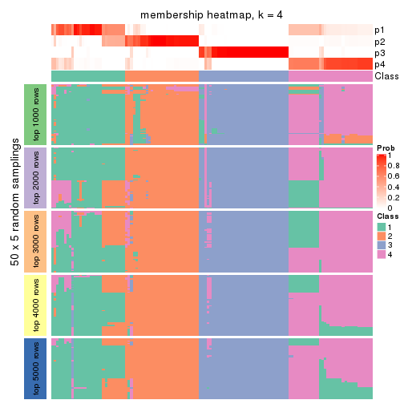</p>

</div>
<div id='tab-CV-skmeans-membership-heatmap-4'>
<pre><code class="r">membership_heatmap(res, k = 5)
</code></pre>

<p></p>

</div>
<div id='tab-CV-skmeans-membership-heatmap-5'>
<pre><code class="r">membership_heatmap(res, k = 6)
</code></pre>

<p></p>

</div>
</div>

As soon as we have had the classes for columns, we can look for signatures
which are significantly different between classes which can be candidate marks
for certain classes. Following are the heatmaps for signatures.


Signature heatmaps where rows are scaled:


<script>
$( function() {
	$( '#tabs-CV-skmeans-get-signatures' ).tabs();
} );
</script>
<div id='tabs-CV-skmeans-get-signatures'>
<ul>
<li><a href='#tab-CV-skmeans-get-signatures-1'>k = 2</a></li>
<li><a href='#tab-CV-skmeans-get-signatures-2'>k = 3</a></li>
<li><a href='#tab-CV-skmeans-get-signatures-3'>k = 4</a></li>
<li><a href='#tab-CV-skmeans-get-signatures-4'>k = 5</a></li>
<li><a href='#tab-CV-skmeans-get-signatures-5'>k = 6</a></li>
</ul>
<div id='tab-CV-skmeans-get-signatures-1'>
<pre><code class="r">get_signatures(res, k = 2)
</code></pre>

<p></p>

</div>
<div id='tab-CV-skmeans-get-signatures-2'>
<pre><code class="r">get_signatures(res, k = 3)
</code></pre>

<p></p>

</div>
<div id='tab-CV-skmeans-get-signatures-3'>
<pre><code class="r">get_signatures(res, k = 4)
</code></pre>

<p>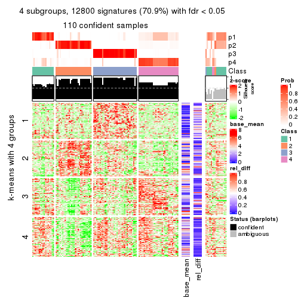</p>

</div>
<div id='tab-CV-skmeans-get-signatures-4'>
<pre><code class="r">get_signatures(res, k = 5)
</code></pre>

<p></p>

</div>
<div id='tab-CV-skmeans-get-signatures-5'>
<pre><code class="r">get_signatures(res, k = 6)
</code></pre>

<p></p>

</div>
</div>


Signature heatmaps where rows are not scaled:


<script>
$( function() {
	$( '#tabs-CV-skmeans-get-signatures-no-scale' ).tabs();
} );
</script>
<div id='tabs-CV-skmeans-get-signatures-no-scale'>
<ul>
<li><a href='#tab-CV-skmeans-get-signatures-no-scale-1'>k = 2</a></li>
<li><a href='#tab-CV-skmeans-get-signatures-no-scale-2'>k = 3</a></li>
<li><a href='#tab-CV-skmeans-get-signatures-no-scale-3'>k = 4</a></li>
<li><a href='#tab-CV-skmeans-get-signatures-no-scale-4'>k = 5</a></li>
<li><a href='#tab-CV-skmeans-get-signatures-no-scale-5'>k = 6</a></li>
</ul>
<div id='tab-CV-skmeans-get-signatures-no-scale-1'>
<pre><code class="r">get_signatures(res, k = 2, scale_rows = FALSE)
</code></pre>

<p></p>

</div>
<div id='tab-CV-skmeans-get-signatures-no-scale-2'>
<pre><code class="r">get_signatures(res, k = 3, scale_rows = FALSE)
</code></pre>

<p></p>

</div>
<div id='tab-CV-skmeans-get-signatures-no-scale-3'>
<pre><code class="r">get_signatures(res, k = 4, scale_rows = FALSE)
</code></pre>

<p></p>

</div>
<div id='tab-CV-skmeans-get-signatures-no-scale-4'>
<pre><code class="r">get_signatures(res, k = 5, scale_rows = FALSE)
</code></pre>

<p></p>

</div>
<div id='tab-CV-skmeans-get-signatures-no-scale-5'>
<pre><code class="r">get_signatures(res, k = 6, scale_rows = FALSE)
</code></pre>

<p></p>

</div>
</div>


Compare the overlap of signatures from different k:

```r
compare_signatures(res)
```


`get_signature()` returns a data frame invisibly. TO get the list of signatures, the function
call should be assigned to a variable explicitly. In following code, if `plot` argument is set
to `FALSE`, no heatmap is plotted while only the differential analysis is performed.

```r
# code only for demonstration
tb = get_signature(res, k = ..., plot = FALSE)
```

An example of the output of `tb` is:

```
#>   which_row         fdr    mean_1    mean_2 scaled_mean_1 scaled_mean_2 km
#> 1        38 0.042760348  8.373488  9.131774    -0.5533452     0.5164555  1
#> 2        40 0.018707592  7.106213  8.469186    -0.6173731     0.5762149  1
#> 3        55 0.019134737 10.221463 11.207825    -0.6159697     0.5749050  1
#> 4        59 0.006059896  5.921854  7.869574    -0.6899429     0.6439467  1
#> 5        60 0.018055526  8.928898 10.211722    -0.6204761     0.5791110  1
#> 6        98 0.009384629 15.714769 14.887706     0.6635654    -0.6193277  2
...
```

The columns in `tb` are:

1. `which_row`: row indices corresponding to the input matrix.
2. `fdr`: FDR for the differential test. 
3. `mean_x`: The mean value in group x.
4. `scaled_mean_x`: The mean value in group x after rows are scaled.
5. `km`: Row groups if k-means clustering is applied to rows.


UMAP plot which shows how samples are separated.


<script>
$( function() {
	$( '#tabs-CV-skmeans-dimension-reduction' ).tabs();
} );
</script>
<div id='tabs-CV-skmeans-dimension-reduction'>
<ul>
<li><a href='#tab-CV-skmeans-dimension-reduction-1'>k = 2</a></li>
<li><a href='#tab-CV-skmeans-dimension-reduction-2'>k = 3</a></li>
<li><a href='#tab-CV-skmeans-dimension-reduction-3'>k = 4</a></li>
<li><a href='#tab-CV-skmeans-dimension-reduction-4'>k = 5</a></li>
<li><a href='#tab-CV-skmeans-dimension-reduction-5'>k = 6</a></li>
</ul>
<div id='tab-CV-skmeans-dimension-reduction-1'>
<pre><code class="r">dimension_reduction(res, k = 2, method = &quot;UMAP&quot;)
</code></pre>

<p></p>

</div>
<div id='tab-CV-skmeans-dimension-reduction-2'>
<pre><code class="r">dimension_reduction(res, k = 3, method = &quot;UMAP&quot;)
</code></pre>

<p></p>

</div>
<div id='tab-CV-skmeans-dimension-reduction-3'>
<pre><code class="r">dimension_reduction(res, k = 4, method = &quot;UMAP&quot;)
</code></pre>

<p></p>

</div>
<div id='tab-CV-skmeans-dimension-reduction-4'>
<pre><code class="r">dimension_reduction(res, k = 5, method = &quot;UMAP&quot;)
</code></pre>

<p></p>

</div>
<div id='tab-CV-skmeans-dimension-reduction-5'>
<pre><code class="r">dimension_reduction(res, k = 6, method = &quot;UMAP&quot;)
</code></pre>

<p></p>

</div>
</div>


Following heatmap shows how subgroups are split when increasing `k`:

```r
collect_classes(res)
```


If matrix rows can be associated to genes, consider to use `GO_Enrichment(res,
...)` to perform function enrichment for the signature genes.


 

---------------------------------------------------


### CV:pam


The object with results only for a single top-value method and a single partition method 
can be extracted as:

```r
res = res_list["CV", "pam"]
# you can also extract it by
# res = res_list["CV:pam"]
```

A summary of `res` and all the functions that can be applied to it:

```r
res
```

```
#> A 'ConsensusPartition' object with k = 2, 3, 4, 5, 6.
#>   On a matrix with 18041 rows and 126 columns.
#>   Top rows (1000, 2000, 3000, 4000, 5000) are extracted by 'CV' method.
#>   Subgroups are detected by 'pam' method.
#>   Performed in total 1250 partitions by row resampling.
#>   Best k for subgroups seems to be 6.
#> 
#> Following methods can be applied to this 'ConsensusPartition' object:
#>  [1] "cola_report"             "collect_classes"         "collect_plots"          
#>  [4] "collect_stats"           "colnames"                "compare_signatures"     
#>  [7] "consensus_heatmap"       "dimension_reduction"     "functional_enrichment"  
#> [10] "get_anno_col"            "get_anno"                "get_classes"            
#> [13] "get_consensus"           "get_matrix"              "get_membership"         
#> [16] "get_param"               "get_signatures"          "get_stats"              
#> [19] "is_best_k"               "is_stable_k"             "membership_heatmap"     
#> [22] "ncol"                    "nrow"                    "plot_ecdf"              
#> [25] "rownames"                "select_partition_number" "show"                   
#> [28] "suggest_best_k"          "test_to_known_factors"
```

`collect_plots()` function collects all the plots made from `res` for all `k` (number of partitions)
into one single page to provide an easy and fast comparison between different `k`.

```r
collect_plots(res)
```


The plots are:

- The first row: a plot of the ECDF (Empirical cumulative distribution
  function) curves of the consensus matrix for each `k` and the heatmap of
  predicted classes for each `k`.
- The second row: heatmaps of the consensus matrix for each `k`.
- The third row: heatmaps of the membership matrix for each `k`.
- The fouth row: heatmaps of the signatures for each `k`.

All the plots in panels can be made by individual functions and they are
plotted later in this section.

`select_partition_number()` produces several plots showing different
statistics for choosing "optimized" `k`. There are following statistics:

- ECDF curves of the consensus matrix for each `k`;
- 1-PAC. [The PAC
  score](https://en.wikipedia.org/wiki/Consensus_clustering#Over-interpretation_potential_of_consensus_clustering)
  measures the proportion of the ambiguous subgrouping.
- Mean silhouette score.
- Concordance. The mean probability of fiting the consensus class ids in all
  partitions.
- Area increased. Denote $A_k$ as the area under the ECDF curve for current
  `k`, the area increased is defined as $A_k - A_{k-1}$.
- Rand index. The percent of pairs of samples that are both in a same cluster
  or both are not in a same cluster in the partition of k and k-1.
- Jaccard index. The ratio of pairs of samples are both in a same cluster in
  the partition of k and k-1 and the pairs of samples are both in a same
  cluster in the partition k or k-1.

The detailed explanations of these statistics can be found in [the cola
vignette](http://bioconductor.org/packages/devel/bioc/vignettes/cola/inst/doc/cola.html#toc_13).

Generally speaking, lower PAC score, higher mean silhouette score or higher
concordance corresponds to better partition. Rand index and Jaccard index
measure how similar the current partition is compared to partition with `k-1`.
If they are too similar, we won't accept `k` is better than `k-1`.

```r
select_partition_number(res)
```


The numeric values for all these statistics can be obtained by `get_stats()`.

```r
get_stats(res)
```

```
#>   k 1-PAC mean_silhouette concordance area_increased  Rand Jaccard
#> 2 2 0.307           0.713       0.844         0.4452 0.547   0.547
#> 3 3 0.324           0.563       0.796         0.2870 0.756   0.602
#> 4 4 0.439           0.672       0.820         0.1907 0.814   0.603
#> 5 5 0.642           0.705       0.841         0.1089 0.912   0.732
#> 6 6 0.783           0.791       0.894         0.0846 0.915   0.672
```

`suggest_best_k()` suggests the best $k$ based on these statistics. The rules are as follows:

- All $k$ with Jaccard index larger than 0.95 are removed because the increase of
  the partition number does not provides enough extra information. If all $k$ are removed,
  the best $k$ is assigned by `NA`.
- For $k$ with 1-PAC larger than 0.9, the maximal $k$ is taken as the "best k". Other $k$ is called "optional k".
- If it does not fit the second rule. The $k$ with the highest vote of highest
  1-PAC, mean silhouette and concordance is taken as the "best k".

```r
suggest_best_k(res)
```

```
#> [1] 6
```


Following shows the table of the partitions (You need to click the **show/hide
code output** link to see it). The membership matrix (columns with name `p*`)
is inferred by
[`clue::cl_consensus()`](https://www.rdocumentation.org/link/cl_consensus?package=clue)
function with the `SE` method. Basically the value in the membership matrix
represents the probability to belong to a certain group. The finall class
label for an item is determined with the group with highest probability it
belongs to.

In `get_classes()` function, the entropy is calculated from the membership
matrix and the silhouette score is calculated from the consensus matrix.


<script>
$( function() {
	$( '#tabs-CV-pam-get-classes' ).tabs();
} );
</script>
<div id='tabs-CV-pam-get-classes'>
<ul>
<li><a href='#tab-CV-pam-get-classes-1'>k = 2</a></li>
<li><a href='#tab-CV-pam-get-classes-2'>k = 3</a></li>
<li><a href='#tab-CV-pam-get-classes-3'>k = 4</a></li>
<li><a href='#tab-CV-pam-get-classes-4'>k = 5</a></li>
<li><a href='#tab-CV-pam-get-classes-5'>k = 6</a></li>
</ul>

<div id='tab-CV-pam-get-classes-1'>
<p><a id='tab-CV-pam-get-classes-1-a' style='color:#0366d6' href='#'>show/hide code output</a></p>
<pre><code class="r">cbind(get_classes(res, k = 2), get_membership(res, k = 2))
</code></pre>

<pre><code>#&gt;                                      class entropy silhouette    p1    p2
#&gt; DC1F29A2-39DE-44AD-936A-54B2B32D6370     1  0.7453     0.6505 0.788 0.212
#&gt; FA3C3413-FA8C-4A29-B9CA-5BC3A56274A8     1  0.5842     0.7909 0.860 0.140
#&gt; B9B72975-8134-475C-BC0B-0CFDB24F636A     1  0.9209     0.5462 0.664 0.336
#&gt; F44DB757-4D00-4BFC-99C5-AA82F99C5BDA     1  0.8386     0.6225 0.732 0.268
#&gt; 3BD942BB-A3A7-4993-B3F1-B8641626B773     1  0.5519     0.7978 0.872 0.128
#&gt; 431F73A2-2AB3-4101-B610-7FC02A7097EC     1  0.9795     0.0232 0.584 0.416
#&gt; 3067683D-43D4-4F6D-9338-17F6A75E4B25     2  0.8267     0.7317 0.260 0.740
#&gt; 2CE91B81-7CBE-4698-AFEE-6A154313D231     1  0.5946     0.7889 0.856 0.144
#&gt; A639CF4F-4591-4337-A12E-BED71EDDA10B     1  0.1414     0.8294 0.980 0.020
#&gt; 5482053D-9F48-4773-B68A-302B3A612503     1  0.0000     0.8330 1.000 0.000
#&gt; A31D342D-C67C-428B-BAED-C6E844277A09     1  0.0000     0.8330 1.000 0.000
#&gt; 0E9C5985-9AE0-4098-A076-6FFBBDF05110     2  0.3274     0.7789 0.060 0.940
#&gt; 08CCF8A0-15B7-4A13-BC43-6B3B3E2DDE95     2  0.9922     0.5305 0.448 0.552
#&gt; 10577D5B-AD56-403F-A562-73A9ACF2045B     2  0.9710     0.6344 0.400 0.600
#&gt; C940D443-5DDA-4403-868B-7AA6B9A50FC4     1  0.5629     0.7379 0.868 0.132
#&gt; 89D4D945-A717-495F-B253-F5A17CF5B9FA     2  0.3879     0.7821 0.076 0.924
#&gt; DC55EE78-203F-4092-9B83-14B1A529194B     2  0.3879     0.7747 0.076 0.924
#&gt; 8F7368BE-EB41-4192-89AA-9E0428C08851     1  0.0000     0.8330 1.000 0.000
#&gt; F772EA39-E408-4908-BADD-C786D702BF9B     1  0.8267     0.6306 0.740 0.260
#&gt; FD693D10-3ADA-4028-8392-41D2F0296F7E     1  0.4022     0.8067 0.920 0.080
#&gt; 84F16966-7640-49F9-95D1-7648FF74DCC9     2  0.5519     0.7449 0.128 0.872
#&gt; D26DAA2F-AE6A-42E1-9F1F-01943B99785F     2  0.8207     0.7370 0.256 0.744
#&gt; F325847E-F046-4B67-B01C-16919C401020     2  0.9909     0.4858 0.444 0.556
#&gt; 19EB2B10-2529-4A94-8FAE-1CE371A602D9     2  0.9393     0.6777 0.356 0.644
#&gt; B94B9CCF-5FB8-44AE-8D9C-A194C6801A27     1  0.9129     0.5828 0.672 0.328
#&gt; D2678E70-542A-4AB2-B881-12D66DBA44F5     2  0.9970     0.2457 0.468 0.532
#&gt; 4961CA2A-70CD-42AB-A676-4A98C85F449F     2  0.8661     0.7184 0.288 0.712
#&gt; 5AA74C5C-2AD1-4D59-A030-E964EB199581     1  0.5178     0.7851 0.884 0.116
#&gt; F9E11A1B-BD93-438F-9670-6FB7DFF9E910     2  0.4815     0.7843 0.104 0.896
#&gt; FB78CA5A-C8B9-42AF-9DAE-799CAB280B2E     1  0.0000     0.8330 1.000 0.000
#&gt; A8E48877-F8AB-44DD-A18B-194D87C44931     1  0.4431     0.8118 0.908 0.092
#&gt; CA50C495-F37E-4743-867D-FAF2DCC3376A     1  0.7376     0.7167 0.792 0.208
#&gt; 37342369-EC22-4904-8CCD-A0DC6BD8D183     1  0.9522     0.5332 0.628 0.372
#&gt; 91BA5F90-9174-4533-A050-39A28E34A94D     1  0.0000     0.8330 1.000 0.000
#&gt; 5BC371AC-1915-44E9-A114-2963E131EC8D     1  0.0376     0.8328 0.996 0.004
#&gt; 74A6C31A-7F21-45AF-A170-18C326D2AE69     1  0.0000     0.8330 1.000 0.000
#&gt; 984F27EF-D4D7-4E68-BD64-776FDFC04D07     1  0.5059     0.7974 0.888 0.112
#&gt; B05701C5-8C44-4FD1-94C9-FC0255A2EA24     2  0.9087     0.6966 0.324 0.676
#&gt; 91E4119C-2CE6-4447-A125-6A4F403A89E6     2  0.3114     0.7785 0.056 0.944
#&gt; 1570FCE7-F1B4-4BDF-A398-355EDF030864     2  0.9393     0.3449 0.356 0.644
#&gt; 604C06E9-A00E-435E-847A-3992922A5C56     2  0.9522     0.6633 0.372 0.628
#&gt; 455C9007-6FF4-4D63-83FA-4915F0331F9A     1  0.4161     0.7964 0.916 0.084
#&gt; FB8BD3CF-D2EC-47B6-B67F-65ADC1C3A6A7     2  0.3114     0.7785 0.056 0.944
#&gt; 9DC7443A-3C8F-4025-8312-3C98BF28D736     2  0.8081     0.7128 0.248 0.752
#&gt; CB207A52-09AC-49D3-8240-5840CDFBB154     1  0.0000     0.8330 1.000 0.000
#&gt; 2A335049-AD9F-4B32-92B7-69B04B0CF2BA     2  0.5059     0.7854 0.112 0.888
#&gt; 6ACA6293-371E-428D-BBAE-ABFD410C886F     1  0.4022     0.8172 0.920 0.080
#&gt; E8929929-73F9-4DB7-ABBA-0852BEFFFF7E     2  0.9286     0.6867 0.344 0.656
#&gt; 5E343116-414B-41F2-AAEE-A3225450135A     1  0.0672     0.8331 0.992 0.008
#&gt; 0A39073C-157C-48A1-B125-A6A04CB738DA     1  0.5842     0.7909 0.860 0.140
#&gt; 300D78E6-1C7E-4114-80EA-9204A6818B9A     1  0.0672     0.8331 0.992 0.008
#&gt; DAAF55AA-ED48-4221-9CD6-D1DEB6376017     1  0.0000     0.8330 1.000 0.000
#&gt; D76FCF4A-4ACF-41EF-A120-64136D6C845E     1  0.3879     0.8155 0.924 0.076
#&gt; AD294665-6F90-459C-90D5-3058F210225D     1  0.5737     0.7688 0.864 0.136
#&gt; 92E8AD7A-1084-44C8-BDC0-FE4E47B6143F     1  0.8207     0.6657 0.744 0.256
#&gt; 5644A861-3C59-486D-8FBE-4DF6A3B19558     1  0.0000     0.8330 1.000 0.000
#&gt; 1BF8AAE7-B771-4CF2-8B1C-D2BEB5E6579E     2  0.8661     0.6794 0.288 0.712
#&gt; A54731AE-FC40-407F-8D10-67DDC122237D     1  0.9881     0.3808 0.564 0.436
#&gt; 179DC906-5654-4CBA-9C27-C9560B5F12DE     1  0.8713     0.5196 0.708 0.292
#&gt; 979B9A2B-2D81-47C3-A553-9B9441CAAE47     1  0.0938     0.8326 0.988 0.012
#&gt; D69BD86A-08FB-49DA-9084-2725F6C9195F     1  0.0000     0.8330 1.000 0.000
#&gt; 84611033-BCF7-49D7-9B91-DA29B62AC8D3     2  0.4562     0.7846 0.096 0.904
#&gt; 8AA1DA3E-8C00-4653-AA33-EA70531C1E50     1  0.9248     0.5711 0.660 0.340
#&gt; CEBE9594-0F19-46B4-AF7D-F8DF33E00AFB     1  0.0000     0.8330 1.000 0.000
#&gt; C68E82D2-2BD3-41E9-92D7-D4C06E1953B2     2  0.9922     0.5252 0.448 0.552
#&gt; B855EF89-1E76-4408-AA65-61A0F0A4F412     1  0.8861     0.6026 0.696 0.304
#&gt; 4488EFB3-5B01-41E3-B57E-8E4F607CF448     1  0.4298     0.8097 0.912 0.088
#&gt; C2BD8440-CAC6-4FE5-8EBB-5E6AE308D52F     1  0.1843     0.8270 0.972 0.028
#&gt; E0E50F10-1FED-41C1-84DB-81A46F25D7E9     1  0.3114     0.8010 0.944 0.056
#&gt; EE16D845-31F2-4178-800B-CA2C358841AD     2  0.6148     0.7499 0.152 0.848
#&gt; 169828CF-5693-4A46-B5D7-E45CBA9DF317     1  0.6801     0.7293 0.820 0.180
#&gt; 51077BA3-AEE0-4BD4-A1B1-1B0A811642A1     1  0.0000     0.8330 1.000 0.000
#&gt; D2F4E240-C44C-4CF7-8016-6CACD370D093     1  0.9635    -0.0873 0.612 0.388
#&gt; 721CDBE6-FC85-4C30-B23E-28407340286F     2  0.2423     0.7727 0.040 0.960
#&gt; 392897E4-6009-422C-B461-649F4DDF260C     2  0.4562     0.7847 0.096 0.904
#&gt; 617E13D2-6924-45F8-A8DE-BE21B718F822     2  0.7299     0.7370 0.204 0.796
#&gt; 5746C00F-9CBB-46B7-83FD-90B2AB3F507B     1  0.0672     0.8324 0.992 0.008
#&gt; 982B4344-A223-4D1F-9485-2E56F9FD45C0     2  0.9963    -0.0459 0.464 0.536
#&gt; E5557F52-015D-49DC-9E23-989FC259976F     2  0.9170     0.6927 0.332 0.668
#&gt; F3135F5E-2E90-4923-B634-E994563D17B7     1  0.5842     0.7712 0.860 0.140
#&gt; D1ED15A5-9802-4314-B556-E89EB772D1F0     1  0.9988    -0.4298 0.520 0.480
#&gt; 222B06E3-FCFB-4104-92C3-D73BC31854D4     1  0.0000     0.8330 1.000 0.000
#&gt; 4C810FFA-ED07-4F4C-9F81-B8F1CF4956F7     1  0.3431     0.8033 0.936 0.064
#&gt; 9A608964-ED12-4E6E-9D3A-430F59FFF65B     2  0.9286     0.6867 0.344 0.656
#&gt; 4087357F-C17A-4992-A8AB-41ACA2F72001     1  0.3114     0.8010 0.944 0.056
#&gt; B3F013A5-BCB8-4CE0-86B2-634EE180AA6E     1  0.9087     0.5866 0.676 0.324
#&gt; 322AF320-1379-4F51-AFDC-5292A060CD52     2  0.2948     0.7776 0.052 0.948
#&gt; 53A96249-66D5-4C26-893B-ADC71481D261     1  0.9286     0.5733 0.656 0.344
#&gt; 1AB7A6F2-14BD-447C-B2E3-DEB0CE56B209     1  0.0000     0.8330 1.000 0.000
#&gt; 8B4BCDA0-6787-4A55-99F7-AAF22AF85BA6     2  0.3114     0.7785 0.056 0.944
#&gt; 5D9D9E08-2C2C-414E-9547-62799F90D543     1  0.9286     0.5694 0.656 0.344
#&gt; C345CD17-E4F4-41D5-9891-FEFB19342C52     2  0.9248     0.6881 0.340 0.660
#&gt; 1AF8FDE1-1A74-41F6-A1C5-4952CDFB7D3F     1  0.0000     0.8330 1.000 0.000
#&gt; BC3405FF-0660-4B2B-8DC1-5F34D3133078     1  0.1843     0.8308 0.972 0.028
#&gt; C2662596-6E2F-4924-B051-CEA1AC87B197     1  0.3584     0.7941 0.932 0.068
#&gt; 39AE85F7-49FB-4438-BD41-6AC812FA1C72     1  0.5946     0.7648 0.856 0.144
#&gt; 6FF266DB-3F08-43F2-8F6F-679F805B80B8     1  0.0938     0.8326 0.988 0.012
#&gt; B03B7B81-BBD6-4194-BC5E-6EDF0D3F015A     1  0.1414     0.8319 0.980 0.020
#&gt; C7617D56-F13C-4C43-906C-BD458C5DC4CD     1  0.0672     0.8331 0.992 0.008
#&gt; 09420F8B-7A71-4B32-8388-4767670F1FEB     1  0.0000     0.8330 1.000 0.000
#&gt; 6AF47534-74FF-4128-865B-4E8EE1FFB469     2  0.3879     0.7747 0.076 0.924
#&gt; 8FF9E94A-2ED2-4727-947F-D524D7ECE815     1  0.0000     0.8330 1.000 0.000
#&gt; A390E20D-03F9-40E4-A132-0FA5C2BEDB63     1  0.3114     0.8010 0.944 0.056
#&gt; A489CCCA-1374-4071-80CE-05B83C9A0D5E     1  0.5737     0.7933 0.864 0.136
#&gt; 2D962371-EC83-490C-A663-478AF383BC1B     1  0.9170     0.5796 0.668 0.332
#&gt; D91B31A1-EE71-4726-B94C-0CC2815E9D4E     1  0.3584     0.8159 0.932 0.068
#&gt; E0123C5C-E1D1-4162-9895-CC8B01949D84     2  0.2948     0.7776 0.052 0.948
#&gt; EC73959A-2728-49FE-B72A-790BB14F4CBF     1  0.0376     0.8327 0.996 0.004
#&gt; A60DC925-7343-496E-900D-0DD81D5C8123     2  0.3274     0.7783 0.060 0.940
#&gt; 659B64DB-F4A5-43BD-811B-05004CB49D99     1  0.3584     0.7941 0.932 0.068
#&gt; 6969B6B2-7616-4664-9696-C4DACD10537B     1  0.6623     0.7710 0.828 0.172
#&gt; 2F6392DE-0D54-4768-B062-907C81E5B0CC     1  0.2236     0.8315 0.964 0.036
#&gt; C74BE8C5-BA6D-4596-9D67-3C731799F999     1  0.3114     0.8010 0.944 0.056
#&gt; 79A7647F-BDBA-45A2-B207-ABF788F6CC95     2  0.7602     0.7596 0.220 0.780
#&gt; D47D0433-2313-4A2F-B268-5AD293D7534E     2  0.3879     0.7747 0.076 0.924
#&gt; C5058B93-C1DA-43B9-9951-B23A9810AA6E     1  0.5629     0.7966 0.868 0.132
#&gt; 2629FEE3-A203-4411-8A70-02A796C9505C     2  0.3114     0.7785 0.056 0.944
#&gt; 1AF329E4-11D4-4CFC-801F-C24A1EA33102     1  0.9000     0.6125 0.684 0.316
#&gt; D453BEF8-3F18-4B89-BA42-CE74EB105032     2  0.5178     0.7837 0.116 0.884
#&gt; B12A4446-2310-4139-897F-CA030478CBD5     2  0.3584     0.7821 0.068 0.932
#&gt; BCAB1918-5FA9-4CBD-85CB-008743FEA2CC     2  0.9427     0.6675 0.360 0.640
#&gt; 9A5432D3-19EE-47B4-BD88-698DEC75A5E9     1  0.3584     0.8185 0.932 0.068
#&gt; A608BCEB-2C27-4927-A308-E6975F641722     1  0.9323     0.5669 0.652 0.348
#&gt; E4752275-7BF6-4C1E-8A45-C7D571ED85AD     1  0.8386     0.6225 0.732 0.268
#&gt; FDEC1714-C02D-4AB7-AE82-789E9D709EDE     1  0.0938     0.8326 0.988 0.012
#&gt; 33737781-8638-4FA2-AD4C-E888BB9343D8     1  0.3431     0.8233 0.936 0.064
</code></pre>

<script>
$('#tab-CV-pam-get-classes-1-a').parent().next().next().hide();
$('#tab-CV-pam-get-classes-1-a').click(function(){
  $('#tab-CV-pam-get-classes-1-a').parent().next().next().toggle();
  return(false);
});
</script>
</div>

<div id='tab-CV-pam-get-classes-2'>
<p><a id='tab-CV-pam-get-classes-2-a' style='color:#0366d6' href='#'>show/hide code output</a></p>
<pre><code class="r">cbind(get_classes(res, k = 3), get_membership(res, k = 3))
</code></pre>

<pre><code>#&gt;                                      class entropy silhouette    p1    p2    p3
#&gt; DC1F29A2-39DE-44AD-936A-54B2B32D6370     1  0.5835     0.6304 0.784 0.052 0.164
#&gt; FA3C3413-FA8C-4A29-B9CA-5BC3A56274A8     1  0.4452     0.6834 0.808 0.000 0.192
#&gt; B9B72975-8134-475C-BC0B-0CFDB24F636A     3  0.6274    -0.0198 0.456 0.000 0.544
#&gt; F44DB757-4D00-4BFC-99C5-AA82F99C5BDA     1  0.6244     0.2281 0.560 0.000 0.440
#&gt; 3BD942BB-A3A7-4993-B3F1-B8641626B773     1  0.3619     0.7225 0.864 0.000 0.136
#&gt; 431F73A2-2AB3-4101-B610-7FC02A7097EC     1  0.7958     0.1534 0.544 0.064 0.392
#&gt; 3067683D-43D4-4F6D-9338-17F6A75E4B25     3  0.7338     0.4366 0.288 0.060 0.652
#&gt; 2CE91B81-7CBE-4698-AFEE-6A154313D231     1  0.4452     0.6834 0.808 0.000 0.192
#&gt; A639CF4F-4591-4337-A12E-BED71EDDA10B     1  0.1860     0.7470 0.948 0.000 0.052
#&gt; 5482053D-9F48-4773-B68A-302B3A612503     1  0.2878     0.7433 0.904 0.000 0.096
#&gt; A31D342D-C67C-428B-BAED-C6E844277A09     1  0.1267     0.7586 0.972 0.024 0.004
#&gt; 0E9C5985-9AE0-4098-A076-6FFBBDF05110     3  0.2651     0.6169 0.012 0.060 0.928
#&gt; 08CCF8A0-15B7-4A13-BC43-6B3B3E2DDE95     1  0.7990    -0.1021 0.532 0.064 0.404
#&gt; 10577D5B-AD56-403F-A562-73A9ACF2045B     3  0.8808     0.3194 0.400 0.116 0.484
#&gt; C940D443-5DDA-4403-868B-7AA6B9A50FC4     1  0.5650     0.6605 0.808 0.108 0.084
#&gt; 89D4D945-A717-495F-B253-F5A17CF5B9FA     3  0.3572     0.6259 0.040 0.060 0.900
#&gt; DC55EE78-203F-4092-9B83-14B1A529194B     3  0.1964     0.6012 0.056 0.000 0.944
#&gt; 8F7368BE-EB41-4192-89AA-9E0428C08851     1  0.2878     0.7433 0.904 0.000 0.096
#&gt; F772EA39-E408-4908-BADD-C786D702BF9B     1  0.6204     0.2569 0.576 0.000 0.424
#&gt; FD693D10-3ADA-4028-8392-41D2F0296F7E     2  0.3192     0.9523 0.112 0.888 0.000
#&gt; 84F16966-7640-49F9-95D1-7648FF74DCC9     3  0.3038     0.5847 0.104 0.000 0.896
#&gt; D26DAA2F-AE6A-42E1-9F1F-01943B99785F     3  0.8172     0.4750 0.272 0.112 0.616
#&gt; F325847E-F046-4B67-B01C-16919C401020     1  0.8069    -0.1576 0.476 0.064 0.460
#&gt; 19EB2B10-2529-4A94-8FAE-1CE371A602D9     3  0.8768     0.3150 0.408 0.112 0.480
#&gt; B94B9CCF-5FB8-44AE-8D9C-A194C6801A27     1  0.6309     0.1426 0.500 0.000 0.500
#&gt; D2678E70-542A-4AB2-B881-12D66DBA44F5     2  0.2165     0.9224 0.064 0.936 0.000
#&gt; 4961CA2A-70CD-42AB-A676-4A98C85F449F     3  0.8285     0.4480 0.288 0.112 0.600
#&gt; 5AA74C5C-2AD1-4D59-A030-E964EB199581     1  0.3879     0.7019 0.848 0.000 0.152
#&gt; F9E11A1B-BD93-438F-9670-6FB7DFF9E910     3  0.5538     0.5998 0.060 0.132 0.808
#&gt; FB78CA5A-C8B9-42AF-9DAE-799CAB280B2E     1  0.2878     0.7433 0.904 0.000 0.096
#&gt; A8E48877-F8AB-44DD-A18B-194D87C44931     1  0.3686     0.7220 0.860 0.000 0.140
#&gt; CA50C495-F37E-4743-867D-FAF2DCC3376A     1  0.6258     0.6512 0.752 0.052 0.196
#&gt; 37342369-EC22-4904-8CCD-A0DC6BD8D183     3  0.6252    -0.0805 0.444 0.000 0.556
#&gt; 91BA5F90-9174-4533-A050-39A28E34A94D     1  0.2878     0.7433 0.904 0.000 0.096
#&gt; 5BC371AC-1915-44E9-A114-2963E131EC8D     1  0.0747     0.7588 0.984 0.000 0.016
#&gt; 74A6C31A-7F21-45AF-A170-18C326D2AE69     1  0.3459     0.7420 0.892 0.012 0.096
#&gt; 984F27EF-D4D7-4E68-BD64-776FDFC04D07     2  0.3192     0.9523 0.112 0.888 0.000
#&gt; B05701C5-8C44-4FD1-94C9-FC0255A2EA24     3  0.9108     0.4081 0.316 0.164 0.520
#&gt; 91E4119C-2CE6-4447-A125-6A4F403A89E6     3  0.2400     0.6135 0.004 0.064 0.932
#&gt; 1570FCE7-F1B4-4BDF-A398-355EDF030864     3  0.5058     0.4237 0.244 0.000 0.756
#&gt; 604C06E9-A00E-435E-847A-3992922A5C56     3  0.9162     0.3645 0.368 0.152 0.480
#&gt; 455C9007-6FF4-4D63-83FA-4915F0331F9A     2  0.3192     0.9523 0.112 0.888 0.000
#&gt; FB8BD3CF-D2EC-47B6-B67F-65ADC1C3A6A7     3  0.3921     0.6094 0.016 0.112 0.872
#&gt; 9DC7443A-3C8F-4025-8312-3C98BF28D736     2  0.0000     0.8662 0.000 1.000 0.000
#&gt; CB207A52-09AC-49D3-8240-5840CDFBB154     1  0.0000     0.7588 1.000 0.000 0.000
#&gt; 2A335049-AD9F-4B32-92B7-69B04B0CF2BA     3  0.5891     0.5857 0.052 0.168 0.780
#&gt; 6ACA6293-371E-428D-BBAE-ABFD410C886F     1  0.3551     0.7265 0.868 0.000 0.132
#&gt; E8929929-73F9-4DB7-ABBA-0852BEFFFF7E     3  0.8747     0.3296 0.396 0.112 0.492
#&gt; 5E343116-414B-41F2-AAEE-A3225450135A     1  0.0000     0.7588 1.000 0.000 0.000
#&gt; 0A39073C-157C-48A1-B125-A6A04CB738DA     1  0.3879     0.7146 0.848 0.000 0.152
#&gt; 300D78E6-1C7E-4114-80EA-9204A6818B9A     1  0.0237     0.7599 0.996 0.000 0.004
#&gt; DAAF55AA-ED48-4221-9CD6-D1DEB6376017     1  0.0000     0.7588 1.000 0.000 0.000
#&gt; D76FCF4A-4ACF-41EF-A120-64136D6C845E     1  0.3551     0.7256 0.868 0.000 0.132
#&gt; AD294665-6F90-459C-90D5-3058F210225D     1  0.4002     0.6881 0.840 0.000 0.160
#&gt; 92E8AD7A-1084-44C8-BDC0-FE4E47B6143F     1  0.6126     0.3518 0.600 0.000 0.400
#&gt; 5644A861-3C59-486D-8FBE-4DF6A3B19558     1  0.2878     0.7433 0.904 0.000 0.096
#&gt; 1BF8AAE7-B771-4CF2-8B1C-D2BEB5E6579E     2  0.2031     0.8792 0.016 0.952 0.032
#&gt; A54731AE-FC40-407F-8D10-67DDC122237D     3  0.6252     0.1002 0.444 0.000 0.556
#&gt; 179DC906-5654-4CBA-9C27-C9560B5F12DE     1  0.5363     0.5506 0.724 0.000 0.276
#&gt; 979B9A2B-2D81-47C3-A553-9B9441CAAE47     1  0.1267     0.7580 0.972 0.004 0.024
#&gt; D69BD86A-08FB-49DA-9084-2725F6C9195F     1  0.2878     0.7433 0.904 0.000 0.096
#&gt; 84611033-BCF7-49D7-9B91-DA29B62AC8D3     3  0.4316     0.6197 0.044 0.088 0.868
#&gt; 8AA1DA3E-8C00-4653-AA33-EA70531C1E50     3  0.6267    -0.0712 0.452 0.000 0.548
#&gt; CEBE9594-0F19-46B4-AF7D-F8DF33E00AFB     1  0.2625     0.7476 0.916 0.000 0.084
#&gt; C68E82D2-2BD3-41E9-92D7-D4C06E1953B2     1  0.6516    -0.1816 0.516 0.004 0.480
#&gt; B855EF89-1E76-4408-AA65-61A0F0A4F412     3  0.6302    -0.1195 0.480 0.000 0.520
#&gt; 4488EFB3-5B01-41E3-B57E-8E4F607CF448     1  0.3412     0.7289 0.876 0.000 0.124
#&gt; C2BD8440-CAC6-4FE5-8EBB-5E6AE308D52F     1  0.2550     0.7407 0.932 0.012 0.056
#&gt; E0E50F10-1FED-41C1-84DB-81A46F25D7E9     2  0.3192     0.9523 0.112 0.888 0.000
#&gt; EE16D845-31F2-4178-800B-CA2C358841AD     3  0.4047     0.5794 0.148 0.004 0.848
#&gt; 169828CF-5693-4A46-B5D7-E45CBA9DF317     1  0.5733     0.4790 0.676 0.000 0.324
#&gt; 51077BA3-AEE0-4BD4-A1B1-1B0A811642A1     1  0.0747     0.7567 0.984 0.016 0.000
#&gt; D2F4E240-C44C-4CF7-8016-6CACD370D093     1  0.6314     0.2188 0.604 0.004 0.392
#&gt; 721CDBE6-FC85-4C30-B23E-28407340286F     3  0.4235     0.5757 0.000 0.176 0.824
#&gt; 392897E4-6009-422C-B461-649F4DDF260C     3  0.5637     0.5828 0.040 0.172 0.788
#&gt; 617E13D2-6924-45F8-A8DE-BE21B718F822     2  0.0000     0.8662 0.000 1.000 0.000
#&gt; 5746C00F-9CBB-46B7-83FD-90B2AB3F507B     1  0.0892     0.7582 0.980 0.000 0.020
#&gt; 982B4344-A223-4D1F-9485-2E56F9FD45C0     3  0.5178     0.3949 0.256 0.000 0.744
#&gt; E5557F52-015D-49DC-9E23-989FC259976F     3  0.8721     0.3409 0.384 0.112 0.504
#&gt; F3135F5E-2E90-4923-B634-E994563D17B7     1  0.5047     0.6999 0.824 0.036 0.140
#&gt; D1ED15A5-9802-4314-B556-E89EB772D1F0     1  0.8635    -0.1187 0.532 0.112 0.356
#&gt; 222B06E3-FCFB-4104-92C3-D73BC31854D4     1  0.2959     0.7410 0.900 0.000 0.100
#&gt; 4C810FFA-ED07-4F4C-9F81-B8F1CF4956F7     2  0.3192     0.9523 0.112 0.888 0.000
#&gt; 9A608964-ED12-4E6E-9D3A-430F59FFF65B     3  0.8739     0.3370 0.392 0.112 0.496
#&gt; 4087357F-C17A-4992-A8AB-41ACA2F72001     2  0.3192     0.9523 0.112 0.888 0.000
#&gt; B3F013A5-BCB8-4CE0-86B2-634EE180AA6E     3  0.6274    -0.0778 0.456 0.000 0.544
#&gt; 322AF320-1379-4F51-AFDC-5292A060CD52     3  0.2796     0.6085 0.000 0.092 0.908
#&gt; 53A96249-66D5-4C26-893B-ADC71481D261     1  0.6260     0.2016 0.552 0.000 0.448
#&gt; 1AB7A6F2-14BD-447C-B2E3-DEB0CE56B209     1  0.2878     0.7433 0.904 0.000 0.096
#&gt; 8B4BCDA0-6787-4A55-99F7-AAF22AF85BA6     3  0.0000     0.6080 0.000 0.000 1.000
#&gt; 5D9D9E08-2C2C-414E-9547-62799F90D543     3  0.6260    -0.0690 0.448 0.000 0.552
#&gt; C345CD17-E4F4-41D5-9891-FEFB19342C52     3  0.9098     0.3279 0.148 0.360 0.492
#&gt; 1AF8FDE1-1A74-41F6-A1C5-4952CDFB7D3F     1  0.0000     0.7588 1.000 0.000 0.000
#&gt; BC3405FF-0660-4B2B-8DC1-5F34D3133078     1  0.1031     0.7612 0.976 0.000 0.024
#&gt; C2662596-6E2F-4924-B051-CEA1AC87B197     1  0.2878     0.7433 0.904 0.000 0.096
#&gt; 39AE85F7-49FB-4438-BD41-6AC812FA1C72     1  0.4346     0.6732 0.816 0.000 0.184
#&gt; 6FF266DB-3F08-43F2-8F6F-679F805B80B8     1  0.0237     0.7596 0.996 0.000 0.004
#&gt; B03B7B81-BBD6-4194-BC5E-6EDF0D3F015A     1  0.1289     0.7581 0.968 0.000 0.032
#&gt; C7617D56-F13C-4C43-906C-BD458C5DC4CD     1  0.0000     0.7588 1.000 0.000 0.000
#&gt; 09420F8B-7A71-4B32-8388-4767670F1FEB     1  0.2796     0.7450 0.908 0.000 0.092
#&gt; 6AF47534-74FF-4128-865B-4E8EE1FFB469     3  0.1964     0.6042 0.056 0.000 0.944
#&gt; 8FF9E94A-2ED2-4727-947F-D524D7ECE815     1  0.2878     0.7433 0.904 0.000 0.096
#&gt; A390E20D-03F9-40E4-A132-0FA5C2BEDB63     2  0.3192     0.9523 0.112 0.888 0.000
#&gt; A489CCCA-1374-4071-80CE-05B83C9A0D5E     1  0.4399     0.6873 0.812 0.000 0.188
#&gt; 2D962371-EC83-490C-A663-478AF383BC1B     3  0.6280    -0.0840 0.460 0.000 0.540
#&gt; D91B31A1-EE71-4726-B94C-0CC2815E9D4E     1  0.4452     0.6664 0.808 0.000 0.192
#&gt; E0123C5C-E1D1-4162-9895-CC8B01949D84     3  0.3192     0.6039 0.000 0.112 0.888
#&gt; EC73959A-2728-49FE-B72A-790BB14F4CBF     1  0.0237     0.7597 0.996 0.004 0.000
#&gt; A60DC925-7343-496E-900D-0DD81D5C8123     3  0.1765     0.6197 0.040 0.004 0.956
#&gt; 659B64DB-F4A5-43BD-811B-05004CB49D99     1  0.2878     0.7433 0.904 0.000 0.096
#&gt; 6969B6B2-7616-4664-9696-C4DACD10537B     1  0.5706     0.5839 0.680 0.000 0.320
#&gt; 2F6392DE-0D54-4768-B062-907C81E5B0CC     1  0.1289     0.7614 0.968 0.000 0.032
#&gt; C74BE8C5-BA6D-4596-9D67-3C731799F999     2  0.3192     0.9523 0.112 0.888 0.000
#&gt; 79A7647F-BDBA-45A2-B207-ABF788F6CC95     3  0.8827     0.2967 0.120 0.384 0.496
#&gt; D47D0433-2313-4A2F-B268-5AD293D7534E     3  0.2496     0.5988 0.068 0.004 0.928
#&gt; C5058B93-C1DA-43B9-9951-B23A9810AA6E     1  0.3752     0.7158 0.856 0.000 0.144
#&gt; 2629FEE3-A203-4411-8A70-02A796C9505C     3  0.3607     0.6073 0.008 0.112 0.880
#&gt; 1AF329E4-11D4-4CFC-801F-C24A1EA33102     1  0.6111     0.3304 0.604 0.000 0.396
#&gt; D453BEF8-3F18-4B89-BA42-CE74EB105032     3  0.5815     0.6151 0.096 0.104 0.800
#&gt; B12A4446-2310-4139-897F-CA030478CBD5     3  0.3918     0.5946 0.004 0.140 0.856
#&gt; BCAB1918-5FA9-4CBD-85CB-008743FEA2CC     3  0.8774     0.3004 0.412 0.112 0.476
#&gt; 9A5432D3-19EE-47B4-BD88-698DEC75A5E9     1  0.3038     0.7259 0.896 0.000 0.104
#&gt; A608BCEB-2C27-4927-A308-E6975F641722     1  0.6280     0.1768 0.540 0.000 0.460
#&gt; E4752275-7BF6-4C1E-8A45-C7D571ED85AD     1  0.6252     0.2202 0.556 0.000 0.444
#&gt; FDEC1714-C02D-4AB7-AE82-789E9D709EDE     1  0.1031     0.7584 0.976 0.000 0.024
#&gt; 33737781-8638-4FA2-AD4C-E888BB9343D8     1  0.3482     0.7293 0.872 0.000 0.128
</code></pre>

<script>
$('#tab-CV-pam-get-classes-2-a').parent().next().next().hide();
$('#tab-CV-pam-get-classes-2-a').click(function(){
  $('#tab-CV-pam-get-classes-2-a').parent().next().next().toggle();
  return(false);
});
</script>
</div>

<div id='tab-CV-pam-get-classes-3'>
<p><a id='tab-CV-pam-get-classes-3-a' style='color:#0366d6' href='#'>show/hide code output</a></p>
<pre><code class="r">cbind(get_classes(res, k = 4), get_membership(res, k = 4))
</code></pre>

<pre><code>#&gt;                                      class entropy silhouette    p1    p2    p3    p4
#&gt; DC1F29A2-39DE-44AD-936A-54B2B32D6370     1  0.2737    0.72491 0.888 0.008 0.104 0.000
#&gt; FA3C3413-FA8C-4A29-B9CA-5BC3A56274A8     1  0.6875    0.13411 0.504 0.388 0.108 0.000
#&gt; B9B72975-8134-475C-BC0B-0CFDB24F636A     2  0.2011    0.73546 0.080 0.920 0.000 0.000
#&gt; F44DB757-4D00-4BFC-99C5-AA82F99C5BDA     2  0.4790    0.35191 0.380 0.620 0.000 0.000
#&gt; 3BD942BB-A3A7-4993-B3F1-B8641626B773     1  0.4182    0.66301 0.796 0.180 0.024 0.000
#&gt; 431F73A2-2AB3-4101-B610-7FC02A7097EC     1  0.6162    0.59347 0.676 0.168 0.156 0.000
#&gt; 3067683D-43D4-4F6D-9338-17F6A75E4B25     2  0.6974    0.34643 0.284 0.564 0.152 0.000
#&gt; 2CE91B81-7CBE-4698-AFEE-6A154313D231     1  0.6875    0.13411 0.504 0.388 0.108 0.000
#&gt; A639CF4F-4591-4337-A12E-BED71EDDA10B     1  0.0707    0.74304 0.980 0.000 0.020 0.000
#&gt; 5482053D-9F48-4773-B68A-302B3A612503     1  0.3907    0.64600 0.768 0.232 0.000 0.000
#&gt; A31D342D-C67C-428B-BAED-C6E844277A09     1  0.3978    0.65352 0.796 0.012 0.192 0.000
#&gt; 0E9C5985-9AE0-4098-A076-6FFBBDF05110     2  0.2796    0.69644 0.016 0.892 0.092 0.000
#&gt; 08CCF8A0-15B7-4A13-BC43-6B3B3E2DDE95     1  0.4969    0.66093 0.772 0.088 0.140 0.000
#&gt; 10577D5B-AD56-403F-A562-73A9ACF2045B     3  0.9649    0.25409 0.260 0.152 0.368 0.220
#&gt; C940D443-5DDA-4403-868B-7AA6B9A50FC4     3  0.3837    0.75131 0.224 0.000 0.776 0.000
#&gt; 89D4D945-A717-495F-B253-F5A17CF5B9FA     2  0.3471    0.69664 0.072 0.868 0.060 0.000
#&gt; DC55EE78-203F-4092-9B83-14B1A529194B     2  0.2843    0.71526 0.020 0.892 0.088 0.000
#&gt; 8F7368BE-EB41-4192-89AA-9E0428C08851     1  0.3873    0.64959 0.772 0.228 0.000 0.000
#&gt; F772EA39-E408-4908-BADD-C786D702BF9B     2  0.4907    0.26180 0.420 0.580 0.000 0.000
#&gt; FD693D10-3ADA-4028-8392-41D2F0296F7E     4  0.0000    1.00000 0.000 0.000 0.000 1.000
#&gt; 84F16966-7640-49F9-95D1-7648FF74DCC9     2  0.1724    0.73988 0.032 0.948 0.020 0.000
#&gt; D26DAA2F-AE6A-42E1-9F1F-01943B99785F     3  0.2266    0.82754 0.004 0.084 0.912 0.000
#&gt; F325847E-F046-4B67-B01C-16919C401020     1  0.4508    0.64852 0.780 0.036 0.184 0.000
#&gt; 19EB2B10-2529-4A94-8FAE-1CE371A602D9     3  0.2408    0.84772 0.104 0.000 0.896 0.000
#&gt; B94B9CCF-5FB8-44AE-8D9C-A194C6801A27     2  0.4936    0.52031 0.280 0.700 0.020 0.000
#&gt; D2678E70-542A-4AB2-B881-12D66DBA44F5     4  0.0000    1.00000 0.000 0.000 0.000 1.000
#&gt; 4961CA2A-70CD-42AB-A676-4A98C85F449F     3  0.4574    0.57813 0.220 0.024 0.756 0.000
#&gt; 5AA74C5C-2AD1-4D59-A030-E964EB199581     1  0.3037    0.73865 0.888 0.036 0.076 0.000
#&gt; F9E11A1B-BD93-438F-9670-6FB7DFF9E910     3  0.4839    0.72618 0.044 0.200 0.756 0.000
#&gt; FB78CA5A-C8B9-42AF-9DAE-799CAB280B2E     1  0.3907    0.64600 0.768 0.232 0.000 0.000
#&gt; A8E48877-F8AB-44DD-A18B-194D87C44931     1  0.6875    0.13411 0.504 0.388 0.108 0.000
#&gt; CA50C495-F37E-4743-867D-FAF2DCC3376A     1  0.4318    0.67350 0.816 0.116 0.068 0.000
#&gt; 37342369-EC22-4904-8CCD-A0DC6BD8D183     2  0.4579    0.63118 0.200 0.768 0.032 0.000
#&gt; 91BA5F90-9174-4533-A050-39A28E34A94D     1  0.3873    0.64959 0.772 0.228 0.000 0.000
#&gt; 5BC371AC-1915-44E9-A114-2963E131EC8D     1  0.1022    0.73669 0.968 0.032 0.000 0.000
#&gt; 74A6C31A-7F21-45AF-A170-18C326D2AE69     1  0.4464    0.64765 0.768 0.208 0.000 0.024
#&gt; 984F27EF-D4D7-4E68-BD64-776FDFC04D07     4  0.0000    1.00000 0.000 0.000 0.000 1.000
#&gt; B05701C5-8C44-4FD1-94C9-FC0255A2EA24     3  0.2281    0.84796 0.096 0.000 0.904 0.000
#&gt; 91E4119C-2CE6-4447-A125-6A4F403A89E6     2  0.3808    0.64266 0.012 0.812 0.176 0.000
#&gt; 1570FCE7-F1B4-4BDF-A398-355EDF030864     2  0.3004    0.73475 0.060 0.892 0.048 0.000
#&gt; 604C06E9-A00E-435E-847A-3992922A5C56     3  0.2530    0.84313 0.112 0.000 0.888 0.000
#&gt; 455C9007-6FF4-4D63-83FA-4915F0331F9A     4  0.0000    1.00000 0.000 0.000 0.000 1.000
#&gt; FB8BD3CF-D2EC-47B6-B67F-65ADC1C3A6A7     3  0.3311    0.77386 0.000 0.172 0.828 0.000
#&gt; 9DC7443A-3C8F-4025-8312-3C98BF28D736     4  0.0000    1.00000 0.000 0.000 0.000 1.000
#&gt; CB207A52-09AC-49D3-8240-5840CDFBB154     1  0.1211    0.74745 0.960 0.040 0.000 0.000
#&gt; 2A335049-AD9F-4B32-92B7-69B04B0CF2BA     3  0.2845    0.83948 0.028 0.076 0.896 0.000
#&gt; 6ACA6293-371E-428D-BBAE-ABFD410C886F     1  0.6875    0.13411 0.504 0.388 0.108 0.000
#&gt; E8929929-73F9-4DB7-ABBA-0852BEFFFF7E     3  0.2408    0.84772 0.104 0.000 0.896 0.000
#&gt; 5E343116-414B-41F2-AAEE-A3225450135A     1  0.1211    0.74745 0.960 0.040 0.000 0.000
#&gt; 0A39073C-157C-48A1-B125-A6A04CB738DA     1  0.4244    0.67389 0.804 0.160 0.036 0.000
#&gt; 300D78E6-1C7E-4114-80EA-9204A6818B9A     1  0.1474    0.74810 0.948 0.052 0.000 0.000
#&gt; DAAF55AA-ED48-4221-9CD6-D1DEB6376017     1  0.1211    0.74745 0.960 0.040 0.000 0.000
#&gt; D76FCF4A-4ACF-41EF-A120-64136D6C845E     1  0.6875    0.13411 0.504 0.388 0.108 0.000
#&gt; AD294665-6F90-459C-90D5-3058F210225D     1  0.2224    0.73258 0.928 0.032 0.040 0.000
#&gt; 92E8AD7A-1084-44C8-BDC0-FE4E47B6143F     2  0.5435    0.22386 0.420 0.564 0.016 0.000
#&gt; 5644A861-3C59-486D-8FBE-4DF6A3B19558     1  0.3907    0.64600 0.768 0.232 0.000 0.000
#&gt; 1BF8AAE7-B771-4CF2-8B1C-D2BEB5E6579E     4  0.0000    1.00000 0.000 0.000 0.000 1.000
#&gt; A54731AE-FC40-407F-8D10-67DDC122237D     2  0.6157    0.45962 0.232 0.660 0.108 0.000
#&gt; 179DC906-5654-4CBA-9C27-C9560B5F12DE     1  0.4599    0.68390 0.800 0.112 0.088 0.000
#&gt; 979B9A2B-2D81-47C3-A553-9B9441CAAE47     1  0.1182    0.74047 0.968 0.016 0.016 0.000
#&gt; D69BD86A-08FB-49DA-9084-2725F6C9195F     1  0.3907    0.64600 0.768 0.232 0.000 0.000
#&gt; 84611033-BCF7-49D7-9B91-DA29B62AC8D3     3  0.4262    0.69198 0.008 0.236 0.756 0.000
#&gt; 8AA1DA3E-8C00-4653-AA33-EA70531C1E50     2  0.1724    0.73988 0.032 0.948 0.020 0.000
#&gt; CEBE9594-0F19-46B4-AF7D-F8DF33E00AFB     1  0.3649    0.66931 0.796 0.204 0.000 0.000
#&gt; C68E82D2-2BD3-41E9-92D7-D4C06E1953B2     1  0.4817    0.66650 0.784 0.088 0.128 0.000
#&gt; B855EF89-1E76-4408-AA65-61A0F0A4F412     2  0.1724    0.73988 0.032 0.948 0.020 0.000
#&gt; 4488EFB3-5B01-41E3-B57E-8E4F607CF448     1  0.3004    0.71784 0.892 0.060 0.048 0.000
#&gt; C2BD8440-CAC6-4FE5-8EBB-5E6AE308D52F     1  0.1940    0.73063 0.924 0.000 0.076 0.000
#&gt; E0E50F10-1FED-41C1-84DB-81A46F25D7E9     4  0.0000    1.00000 0.000 0.000 0.000 1.000
#&gt; EE16D845-31F2-4178-800B-CA2C358841AD     2  0.3833    0.70610 0.072 0.848 0.080 0.000
#&gt; 169828CF-5693-4A46-B5D7-E45CBA9DF317     2  0.4996    0.00566 0.484 0.516 0.000 0.000
#&gt; 51077BA3-AEE0-4BD4-A1B1-1B0A811642A1     1  0.2142    0.74277 0.928 0.016 0.000 0.056
#&gt; D2F4E240-C44C-4CF7-8016-6CACD370D093     1  0.5938    0.56844 0.676 0.232 0.092 0.000
#&gt; 721CDBE6-FC85-4C30-B23E-28407340286F     3  0.2408    0.82237 0.000 0.104 0.896 0.000
#&gt; 392897E4-6009-422C-B461-649F4DDF260C     3  0.2737    0.82437 0.008 0.104 0.888 0.000
#&gt; 617E13D2-6924-45F8-A8DE-BE21B718F822     4  0.0000    1.00000 0.000 0.000 0.000 1.000
#&gt; 5746C00F-9CBB-46B7-83FD-90B2AB3F507B     1  0.0804    0.74190 0.980 0.012 0.008 0.000
#&gt; 982B4344-A223-4D1F-9485-2E56F9FD45C0     2  0.1724    0.73988 0.032 0.948 0.020 0.000
#&gt; E5557F52-015D-49DC-9E23-989FC259976F     3  0.2469    0.83229 0.108 0.000 0.892 0.000
#&gt; F3135F5E-2E90-4923-B634-E994563D17B7     1  0.3836    0.67235 0.816 0.016 0.168 0.000
#&gt; D1ED15A5-9802-4314-B556-E89EB772D1F0     3  0.4507    0.74734 0.224 0.020 0.756 0.000
#&gt; 222B06E3-FCFB-4104-92C3-D73BC31854D4     1  0.3907    0.64600 0.768 0.232 0.000 0.000
#&gt; 4C810FFA-ED07-4F4C-9F81-B8F1CF4956F7     4  0.0000    1.00000 0.000 0.000 0.000 1.000
#&gt; 9A608964-ED12-4E6E-9D3A-430F59FFF65B     3  0.2814    0.83600 0.132 0.000 0.868 0.000
#&gt; 4087357F-C17A-4992-A8AB-41ACA2F72001     4  0.0000    1.00000 0.000 0.000 0.000 1.000
#&gt; B3F013A5-BCB8-4CE0-86B2-634EE180AA6E     2  0.1624    0.73929 0.028 0.952 0.020 0.000
#&gt; 322AF320-1379-4F51-AFDC-5292A060CD52     2  0.4643    0.36154 0.000 0.656 0.344 0.000
#&gt; 53A96249-66D5-4C26-893B-ADC71481D261     2  0.5085    0.55093 0.260 0.708 0.032 0.000
#&gt; 1AB7A6F2-14BD-447C-B2E3-DEB0CE56B209     1  0.3907    0.64600 0.768 0.232 0.000 0.000
#&gt; 8B4BCDA0-6787-4A55-99F7-AAF22AF85BA6     2  0.2125    0.70842 0.004 0.920 0.076 0.000
#&gt; 5D9D9E08-2C2C-414E-9547-62799F90D543     2  0.1733    0.73920 0.028 0.948 0.024 0.000
#&gt; C345CD17-E4F4-41D5-9891-FEFB19342C52     3  0.2530    0.84923 0.100 0.004 0.896 0.000
#&gt; 1AF8FDE1-1A74-41F6-A1C5-4952CDFB7D3F     1  0.0188    0.74549 0.996 0.004 0.000 0.000
#&gt; BC3405FF-0660-4B2B-8DC1-5F34D3133078     1  0.1913    0.74991 0.940 0.040 0.020 0.000
#&gt; C2662596-6E2F-4924-B051-CEA1AC87B197     1  0.3907    0.64600 0.768 0.232 0.000 0.000
#&gt; 39AE85F7-49FB-4438-BD41-6AC812FA1C72     1  0.3279    0.72264 0.872 0.032 0.096 0.000
#&gt; 6FF266DB-3F08-43F2-8F6F-679F805B80B8     1  0.1302    0.74757 0.956 0.044 0.000 0.000
#&gt; B03B7B81-BBD6-4194-BC5E-6EDF0D3F015A     1  0.1520    0.74791 0.956 0.020 0.024 0.000
#&gt; C7617D56-F13C-4C43-906C-BD458C5DC4CD     1  0.1211    0.74745 0.960 0.040 0.000 0.000
#&gt; 09420F8B-7A71-4B32-8388-4767670F1FEB     1  0.3873    0.64959 0.772 0.228 0.000 0.000
#&gt; 6AF47534-74FF-4128-865B-4E8EE1FFB469     2  0.1452    0.73018 0.008 0.956 0.036 0.000
#&gt; 8FF9E94A-2ED2-4727-947F-D524D7ECE815     1  0.3907    0.64600 0.768 0.232 0.000 0.000
#&gt; A390E20D-03F9-40E4-A132-0FA5C2BEDB63     4  0.0000    1.00000 0.000 0.000 0.000 1.000
#&gt; A489CCCA-1374-4071-80CE-05B83C9A0D5E     1  0.6875    0.13411 0.504 0.388 0.108 0.000
#&gt; 2D962371-EC83-490C-A663-478AF383BC1B     2  0.1724    0.73988 0.032 0.948 0.020 0.000
#&gt; D91B31A1-EE71-4726-B94C-0CC2815E9D4E     1  0.4477    0.52419 0.688 0.312 0.000 0.000
#&gt; E0123C5C-E1D1-4162-9895-CC8B01949D84     3  0.2408    0.82237 0.000 0.104 0.896 0.000
#&gt; EC73959A-2728-49FE-B72A-790BB14F4CBF     1  0.1211    0.74745 0.960 0.040 0.000 0.000
#&gt; A60DC925-7343-496E-900D-0DD81D5C8123     2  0.6703    0.50728 0.232 0.612 0.156 0.000
#&gt; 659B64DB-F4A5-43BD-811B-05004CB49D99     1  0.3907    0.64600 0.768 0.232 0.000 0.000
#&gt; 6969B6B2-7616-4664-9696-C4DACD10537B     2  0.5699    0.19402 0.380 0.588 0.032 0.000
#&gt; 2F6392DE-0D54-4768-B062-907C81E5B0CC     1  0.1488    0.74585 0.956 0.032 0.012 0.000
#&gt; C74BE8C5-BA6D-4596-9D67-3C731799F999     4  0.0000    1.00000 0.000 0.000 0.000 1.000
#&gt; 79A7647F-BDBA-45A2-B207-ABF788F6CC95     3  0.2408    0.84772 0.104 0.000 0.896 0.000
#&gt; D47D0433-2313-4A2F-B268-5AD293D7534E     2  0.3278    0.69652 0.020 0.864 0.116 0.000
#&gt; C5058B93-C1DA-43B9-9951-B23A9810AA6E     1  0.4744    0.58770 0.736 0.240 0.024 0.000
#&gt; 2629FEE3-A203-4411-8A70-02A796C9505C     3  0.1302    0.80300 0.000 0.044 0.956 0.000
#&gt; 1AF329E4-11D4-4CFC-801F-C24A1EA33102     2  0.6578    0.36541 0.300 0.592 0.108 0.000
#&gt; D453BEF8-3F18-4B89-BA42-CE74EB105032     3  0.4004    0.78044 0.024 0.164 0.812 0.000
#&gt; B12A4446-2310-4139-897F-CA030478CBD5     3  0.2530    0.82536 0.004 0.100 0.896 0.000
#&gt; BCAB1918-5FA9-4CBD-85CB-008743FEA2CC     3  0.2654    0.84806 0.108 0.004 0.888 0.000
#&gt; 9A5432D3-19EE-47B4-BD88-698DEC75A5E9     1  0.3400    0.66821 0.820 0.180 0.000 0.000
#&gt; A608BCEB-2C27-4927-A308-E6975F641722     2  0.6296    0.47924 0.224 0.652 0.124 0.000
#&gt; E4752275-7BF6-4C1E-8A45-C7D571ED85AD     2  0.4164    0.56441 0.264 0.736 0.000 0.000
#&gt; FDEC1714-C02D-4AB7-AE82-789E9D709EDE     1  0.0779    0.74377 0.980 0.004 0.016 0.000
#&gt; 33737781-8638-4FA2-AD4C-E888BB9343D8     1  0.6875    0.13411 0.504 0.388 0.108 0.000
</code></pre>

<script>
$('#tab-CV-pam-get-classes-3-a').parent().next().next().hide();
$('#tab-CV-pam-get-classes-3-a').click(function(){
  $('#tab-CV-pam-get-classes-3-a').parent().next().next().toggle();
  return(false);
});
</script>
</div>

<div id='tab-CV-pam-get-classes-4'>
<p><a id='tab-CV-pam-get-classes-4-a' style='color:#0366d6' href='#'>show/hide code output</a></p>
<pre><code class="r">cbind(get_classes(res, k = 5), get_membership(res, k = 5))
</code></pre>

<pre><code>#&gt;                                      class entropy silhouette    p1    p2    p3    p4    p5
#&gt; DC1F29A2-39DE-44AD-936A-54B2B32D6370     1  0.1043   0.696724 0.960 0.000 0.040 0.000 0.000
#&gt; FA3C3413-FA8C-4A29-B9CA-5BC3A56274A8     5  0.0000   0.892512 0.000 0.000 0.000 0.000 1.000
#&gt; B9B72975-8134-475C-BC0B-0CFDB24F636A     2  0.3043   0.771158 0.056 0.864 0.000 0.000 0.080
#&gt; F44DB757-4D00-4BFC-99C5-AA82F99C5BDA     2  0.0000   0.867479 0.000 1.000 0.000 0.000 0.000
#&gt; 3BD942BB-A3A7-4993-B3F1-B8641626B773     1  0.5493   0.564889 0.664 0.220 0.008 0.000 0.108
#&gt; 431F73A2-2AB3-4101-B610-7FC02A7097EC     1  0.7207   0.504639 0.564 0.120 0.148 0.000 0.168
#&gt; 3067683D-43D4-4F6D-9338-17F6A75E4B25     2  0.8170  -0.056513 0.316 0.368 0.156 0.000 0.160
#&gt; 2CE91B81-7CBE-4698-AFEE-6A154313D231     5  0.0000   0.892512 0.000 0.000 0.000 0.000 1.000
#&gt; A639CF4F-4591-4337-A12E-BED71EDDA10B     1  0.0955   0.691484 0.968 0.000 0.004 0.000 0.028
#&gt; 5482053D-9F48-4773-B68A-302B3A612503     1  0.4015   0.494783 0.652 0.348 0.000 0.000 0.000
#&gt; A31D342D-C67C-428B-BAED-C6E844277A09     1  0.3684   0.506606 0.720 0.000 0.280 0.000 0.000
#&gt; 0E9C5985-9AE0-4098-A076-6FFBBDF05110     2  0.5052   0.697008 0.076 0.748 0.136 0.000 0.040
#&gt; 08CCF8A0-15B7-4A13-BC43-6B3B3E2DDE95     1  0.5992   0.527815 0.632 0.152 0.200 0.000 0.016
#&gt; 10577D5B-AD56-403F-A562-73A9ACF2045B     3  0.8488  -0.049930 0.272 0.268 0.292 0.168 0.000
#&gt; C940D443-5DDA-4403-868B-7AA6B9A50FC4     3  0.2471   0.739884 0.136 0.000 0.864 0.000 0.000
#&gt; 89D4D945-A717-495F-B253-F5A17CF5B9FA     5  0.6156   0.394893 0.008 0.308 0.128 0.000 0.556
#&gt; DC55EE78-203F-4092-9B83-14B1A529194B     2  0.0000   0.867479 0.000 1.000 0.000 0.000 0.000
#&gt; 8F7368BE-EB41-4192-89AA-9E0428C08851     1  0.4015   0.494783 0.652 0.348 0.000 0.000 0.000
#&gt; F772EA39-E408-4908-BADD-C786D702BF9B     2  0.1121   0.839813 0.044 0.956 0.000 0.000 0.000
#&gt; FD693D10-3ADA-4028-8392-41D2F0296F7E     4  0.0000   1.000000 0.000 0.000 0.000 1.000 0.000
#&gt; 84F16966-7640-49F9-95D1-7648FF74DCC9     2  0.0000   0.867479 0.000 1.000 0.000 0.000 0.000
#&gt; D26DAA2F-AE6A-42E1-9F1F-01943B99785F     3  0.0162   0.850761 0.000 0.004 0.996 0.000 0.000
#&gt; F325847E-F046-4B67-B01C-16919C401020     1  0.6614   0.433138 0.576 0.036 0.152 0.000 0.236
#&gt; 19EB2B10-2529-4A94-8FAE-1CE371A602D9     3  0.0000   0.852396 0.000 0.000 1.000 0.000 0.000
#&gt; B94B9CCF-5FB8-44AE-8D9C-A194C6801A27     2  0.0000   0.867479 0.000 1.000 0.000 0.000 0.000
#&gt; D2678E70-542A-4AB2-B881-12D66DBA44F5     4  0.0000   1.000000 0.000 0.000 0.000 1.000 0.000
#&gt; 4961CA2A-70CD-42AB-A676-4A98C85F449F     3  0.4909   0.321793 0.032 0.000 0.588 0.000 0.380
#&gt; 5AA74C5C-2AD1-4D59-A030-E964EB199581     1  0.3693   0.688640 0.836 0.036 0.024 0.000 0.104
#&gt; F9E11A1B-BD93-438F-9670-6FB7DFF9E910     3  0.3612   0.557874 0.000 0.268 0.732 0.000 0.000
#&gt; FB78CA5A-C8B9-42AF-9DAE-799CAB280B2E     1  0.4015   0.494783 0.652 0.348 0.000 0.000 0.000
#&gt; A8E48877-F8AB-44DD-A18B-194D87C44931     5  0.0000   0.892512 0.000 0.000 0.000 0.000 1.000
#&gt; CA50C495-F37E-4743-867D-FAF2DCC3376A     1  0.7858   0.251086 0.448 0.160 0.124 0.000 0.268
#&gt; 37342369-EC22-4904-8CCD-A0DC6BD8D183     2  0.0451   0.863268 0.008 0.988 0.004 0.000 0.000
#&gt; 91BA5F90-9174-4533-A050-39A28E34A94D     1  0.4015   0.494783 0.652 0.348 0.000 0.000 0.000
#&gt; 5BC371AC-1915-44E9-A114-2963E131EC8D     1  0.3561   0.597068 0.740 0.000 0.000 0.000 0.260
#&gt; 74A6C31A-7F21-45AF-A170-18C326D2AE69     1  0.4401   0.507530 0.656 0.328 0.000 0.016 0.000
#&gt; 984F27EF-D4D7-4E68-BD64-776FDFC04D07     4  0.0000   1.000000 0.000 0.000 0.000 1.000 0.000
#&gt; B05701C5-8C44-4FD1-94C9-FC0255A2EA24     3  0.0000   0.852396 0.000 0.000 1.000 0.000 0.000
#&gt; 91E4119C-2CE6-4447-A125-6A4F403A89E6     2  0.5603   0.597271 0.032 0.676 0.216 0.000 0.076
#&gt; 1570FCE7-F1B4-4BDF-A398-355EDF030864     2  0.0609   0.861097 0.020 0.980 0.000 0.000 0.000
#&gt; 604C06E9-A00E-435E-847A-3992922A5C56     3  0.0000   0.852396 0.000 0.000 1.000 0.000 0.000
#&gt; 455C9007-6FF4-4D63-83FA-4915F0331F9A     4  0.0000   1.000000 0.000 0.000 0.000 1.000 0.000
#&gt; FB8BD3CF-D2EC-47B6-B67F-65ADC1C3A6A7     3  0.3697   0.671216 0.008 0.180 0.796 0.000 0.016
#&gt; 9DC7443A-3C8F-4025-8312-3C98BF28D736     4  0.0000   1.000000 0.000 0.000 0.000 1.000 0.000
#&gt; CB207A52-09AC-49D3-8240-5840CDFBB154     1  0.2625   0.696205 0.876 0.016 0.000 0.000 0.108
#&gt; 2A335049-AD9F-4B32-92B7-69B04B0CF2BA     3  0.0000   0.852396 0.000 0.000 1.000 0.000 0.000
#&gt; 6ACA6293-371E-428D-BBAE-ABFD410C886F     5  0.0000   0.892512 0.000 0.000 0.000 0.000 1.000
#&gt; E8929929-73F9-4DB7-ABBA-0852BEFFFF7E     3  0.0000   0.852396 0.000 0.000 1.000 0.000 0.000
#&gt; 5E343116-414B-41F2-AAEE-A3225450135A     1  0.2669   0.698503 0.876 0.020 0.000 0.000 0.104
#&gt; 0A39073C-157C-48A1-B125-A6A04CB738DA     1  0.5541   0.555516 0.668 0.212 0.012 0.000 0.108
#&gt; 300D78E6-1C7E-4114-80EA-9204A6818B9A     1  0.3141   0.695102 0.852 0.040 0.000 0.000 0.108
#&gt; DAAF55AA-ED48-4221-9CD6-D1DEB6376017     1  0.2761   0.698745 0.872 0.024 0.000 0.000 0.104
#&gt; D76FCF4A-4ACF-41EF-A120-64136D6C845E     5  0.0000   0.892512 0.000 0.000 0.000 0.000 1.000
#&gt; AD294665-6F90-459C-90D5-3058F210225D     1  0.2771   0.685872 0.860 0.000 0.012 0.000 0.128
#&gt; 92E8AD7A-1084-44C8-BDC0-FE4E47B6143F     2  0.1270   0.841938 0.052 0.948 0.000 0.000 0.000
#&gt; 5644A861-3C59-486D-8FBE-4DF6A3B19558     1  0.4015   0.494783 0.652 0.348 0.000 0.000 0.000
#&gt; 1BF8AAE7-B771-4CF2-8B1C-D2BEB5E6579E     4  0.0000   1.000000 0.000 0.000 0.000 1.000 0.000
#&gt; A54731AE-FC40-407F-8D10-67DDC122237D     5  0.2690   0.772168 0.000 0.156 0.000 0.000 0.844
#&gt; 179DC906-5654-4CBA-9C27-C9560B5F12DE     1  0.5232   0.621376 0.732 0.128 0.032 0.000 0.108
#&gt; 979B9A2B-2D81-47C3-A553-9B9441CAAE47     1  0.2424   0.687330 0.868 0.000 0.000 0.000 0.132
#&gt; D69BD86A-08FB-49DA-9084-2725F6C9195F     1  0.4015   0.494783 0.652 0.348 0.000 0.000 0.000
#&gt; 84611033-BCF7-49D7-9B91-DA29B62AC8D3     3  0.3707   0.522562 0.000 0.284 0.716 0.000 0.000
#&gt; 8AA1DA3E-8C00-4653-AA33-EA70531C1E50     2  0.0000   0.867479 0.000 1.000 0.000 0.000 0.000
#&gt; CEBE9594-0F19-46B4-AF7D-F8DF33E00AFB     1  0.3707   0.559227 0.716 0.284 0.000 0.000 0.000
#&gt; C68E82D2-2BD3-41E9-92D7-D4C06E1953B2     1  0.4874   0.655385 0.760 0.108 0.028 0.000 0.104
#&gt; B855EF89-1E76-4408-AA65-61A0F0A4F412     2  0.0000   0.867479 0.000 1.000 0.000 0.000 0.000
#&gt; 4488EFB3-5B01-41E3-B57E-8E4F607CF448     1  0.3482   0.669229 0.812 0.008 0.012 0.000 0.168
#&gt; C2BD8440-CAC6-4FE5-8EBB-5E6AE308D52F     1  0.2974   0.659313 0.868 0.000 0.052 0.000 0.080
#&gt; E0E50F10-1FED-41C1-84DB-81A46F25D7E9     4  0.0000   1.000000 0.000 0.000 0.000 1.000 0.000
#&gt; EE16D845-31F2-4178-800B-CA2C358841AD     2  0.0000   0.867479 0.000 1.000 0.000 0.000 0.000
#&gt; 169828CF-5693-4A46-B5D7-E45CBA9DF317     2  0.1671   0.810640 0.076 0.924 0.000 0.000 0.000
#&gt; 51077BA3-AEE0-4BD4-A1B1-1B0A811642A1     1  0.2519   0.668958 0.884 0.016 0.000 0.100 0.000
#&gt; D2F4E240-C44C-4CF7-8016-6CACD370D093     1  0.4735   0.224243 0.524 0.460 0.016 0.000 0.000
#&gt; 721CDBE6-FC85-4C30-B23E-28407340286F     3  0.0000   0.852396 0.000 0.000 1.000 0.000 0.000
#&gt; 392897E4-6009-422C-B461-649F4DDF260C     3  0.0404   0.846275 0.000 0.012 0.988 0.000 0.000
#&gt; 617E13D2-6924-45F8-A8DE-BE21B718F822     4  0.0000   1.000000 0.000 0.000 0.000 1.000 0.000
#&gt; 5746C00F-9CBB-46B7-83FD-90B2AB3F507B     1  0.2280   0.691462 0.880 0.000 0.000 0.000 0.120
#&gt; 982B4344-A223-4D1F-9485-2E56F9FD45C0     2  0.0000   0.867479 0.000 1.000 0.000 0.000 0.000
#&gt; E5557F52-015D-49DC-9E23-989FC259976F     3  0.0963   0.830492 0.036 0.000 0.964 0.000 0.000
#&gt; F3135F5E-2E90-4923-B634-E994563D17B7     5  0.5901   0.510016 0.268 0.000 0.148 0.000 0.584
#&gt; D1ED15A5-9802-4314-B556-E89EB772D1F0     3  0.4467   0.475857 0.344 0.016 0.640 0.000 0.000
#&gt; 222B06E3-FCFB-4104-92C3-D73BC31854D4     1  0.4201   0.375839 0.592 0.408 0.000 0.000 0.000
#&gt; 4C810FFA-ED07-4F4C-9F81-B8F1CF4956F7     4  0.0000   1.000000 0.000 0.000 0.000 1.000 0.000
#&gt; 9A608964-ED12-4E6E-9D3A-430F59FFF65B     3  0.1704   0.810320 0.068 0.004 0.928 0.000 0.000
#&gt; 4087357F-C17A-4992-A8AB-41ACA2F72001     4  0.0000   1.000000 0.000 0.000 0.000 1.000 0.000
#&gt; B3F013A5-BCB8-4CE0-86B2-634EE180AA6E     2  0.0000   0.867479 0.000 1.000 0.000 0.000 0.000
#&gt; 322AF320-1379-4F51-AFDC-5292A060CD52     2  0.6068   0.000989 0.008 0.460 0.440 0.000 0.092
#&gt; 53A96249-66D5-4C26-893B-ADC71481D261     1  0.5953   0.359038 0.540 0.336 0.000 0.000 0.124
#&gt; 1AB7A6F2-14BD-447C-B2E3-DEB0CE56B209     1  0.4015   0.494783 0.652 0.348 0.000 0.000 0.000
#&gt; 8B4BCDA0-6787-4A55-99F7-AAF22AF85BA6     2  0.0693   0.859860 0.008 0.980 0.012 0.000 0.000
#&gt; 5D9D9E08-2C2C-414E-9547-62799F90D543     2  0.0451   0.864428 0.004 0.988 0.008 0.000 0.000
#&gt; C345CD17-E4F4-41D5-9891-FEFB19342C52     3  0.0000   0.852396 0.000 0.000 1.000 0.000 0.000
#&gt; 1AF8FDE1-1A74-41F6-A1C5-4952CDFB7D3F     1  0.2358   0.696234 0.888 0.008 0.000 0.000 0.104
#&gt; BC3405FF-0660-4B2B-8DC1-5F34D3133078     1  0.2753   0.697197 0.876 0.012 0.008 0.000 0.104
#&gt; C2662596-6E2F-4924-B051-CEA1AC87B197     1  0.4015   0.494783 0.652 0.348 0.000 0.000 0.000
#&gt; 39AE85F7-49FB-4438-BD41-6AC812FA1C72     1  0.4238   0.671529 0.788 0.024 0.024 0.004 0.160
#&gt; 6FF266DB-3F08-43F2-8F6F-679F805B80B8     1  0.0703   0.698276 0.976 0.024 0.000 0.000 0.000
#&gt; B03B7B81-BBD6-4194-BC5E-6EDF0D3F015A     1  0.2497   0.693273 0.880 0.004 0.004 0.000 0.112
#&gt; C7617D56-F13C-4C43-906C-BD458C5DC4CD     1  0.1281   0.700296 0.956 0.012 0.000 0.000 0.032
#&gt; 09420F8B-7A71-4B32-8388-4767670F1FEB     1  0.3999   0.499681 0.656 0.344 0.000 0.000 0.000
#&gt; 6AF47534-74FF-4128-865B-4E8EE1FFB469     2  0.5318   0.360370 0.008 0.616 0.052 0.000 0.324
#&gt; 8FF9E94A-2ED2-4727-947F-D524D7ECE815     1  0.4088   0.475652 0.632 0.368 0.000 0.000 0.000
#&gt; A390E20D-03F9-40E4-A132-0FA5C2BEDB63     4  0.0000   1.000000 0.000 0.000 0.000 1.000 0.000
#&gt; A489CCCA-1374-4071-80CE-05B83C9A0D5E     5  0.0000   0.892512 0.000 0.000 0.000 0.000 1.000
#&gt; 2D962371-EC83-490C-A663-478AF383BC1B     2  0.0000   0.867479 0.000 1.000 0.000 0.000 0.000
#&gt; D91B31A1-EE71-4726-B94C-0CC2815E9D4E     2  0.3837   0.363510 0.308 0.692 0.000 0.000 0.000
#&gt; E0123C5C-E1D1-4162-9895-CC8B01949D84     3  0.0000   0.852396 0.000 0.000 1.000 0.000 0.000
#&gt; EC73959A-2728-49FE-B72A-790BB14F4CBF     1  0.0960   0.696013 0.972 0.016 0.004 0.000 0.008
#&gt; A60DC925-7343-496E-900D-0DD81D5C8123     2  0.2017   0.822394 0.008 0.912 0.080 0.000 0.000
#&gt; 659B64DB-F4A5-43BD-811B-05004CB49D99     1  0.4015   0.494783 0.652 0.348 0.000 0.000 0.000
#&gt; 6969B6B2-7616-4664-9696-C4DACD10537B     2  0.2621   0.763213 0.112 0.876 0.008 0.000 0.004
#&gt; 2F6392DE-0D54-4768-B062-907C81E5B0CC     1  0.3080   0.692032 0.852 0.020 0.004 0.000 0.124
#&gt; C74BE8C5-BA6D-4596-9D67-3C731799F999     4  0.0000   1.000000 0.000 0.000 0.000 1.000 0.000
#&gt; 79A7647F-BDBA-45A2-B207-ABF788F6CC95     3  0.0000   0.852396 0.000 0.000 1.000 0.000 0.000
#&gt; D47D0433-2313-4A2F-B268-5AD293D7534E     2  0.1478   0.836800 0.000 0.936 0.064 0.000 0.000
#&gt; C5058B93-C1DA-43B9-9951-B23A9810AA6E     1  0.5585   0.541071 0.644 0.232 0.004 0.000 0.120
#&gt; 2629FEE3-A203-4411-8A70-02A796C9505C     3  0.1924   0.811755 0.008 0.004 0.924 0.000 0.064
#&gt; 1AF329E4-11D4-4CFC-801F-C24A1EA33102     5  0.0000   0.892512 0.000 0.000 0.000 0.000 1.000
#&gt; D453BEF8-3F18-4B89-BA42-CE74EB105032     3  0.2471   0.744885 0.000 0.136 0.864 0.000 0.000
#&gt; B12A4446-2310-4139-897F-CA030478CBD5     3  0.0000   0.852396 0.000 0.000 1.000 0.000 0.000
#&gt; BCAB1918-5FA9-4CBD-85CB-008743FEA2CC     3  0.0162   0.851081 0.004 0.000 0.996 0.000 0.000
#&gt; 9A5432D3-19EE-47B4-BD88-698DEC75A5E9     1  0.5090   0.596554 0.688 0.208 0.000 0.000 0.104
#&gt; A608BCEB-2C27-4927-A308-E6975F641722     5  0.1591   0.847642 0.004 0.052 0.004 0.000 0.940
#&gt; E4752275-7BF6-4C1E-8A45-C7D571ED85AD     2  0.0000   0.867479 0.000 1.000 0.000 0.000 0.000
#&gt; FDEC1714-C02D-4AB7-AE82-789E9D709EDE     1  0.2280   0.690955 0.880 0.000 0.000 0.000 0.120
#&gt; 33737781-8638-4FA2-AD4C-E888BB9343D8     5  0.0000   0.892512 0.000 0.000 0.000 0.000 1.000
</code></pre>

<script>
$('#tab-CV-pam-get-classes-4-a').parent().next().next().hide();
$('#tab-CV-pam-get-classes-4-a').click(function(){
  $('#tab-CV-pam-get-classes-4-a').parent().next().next().toggle();
  return(false);
});
</script>
</div>

<div id='tab-CV-pam-get-classes-5'>
<p><a id='tab-CV-pam-get-classes-5-a' style='color:#0366d6' href='#'>show/hide code output</a></p>
<pre><code class="r">cbind(get_classes(res, k = 6), get_membership(res, k = 6))
</code></pre>

<pre><code>#&gt;                                      class entropy silhouette    p1    p2    p3    p4    p5    p6
#&gt; DC1F29A2-39DE-44AD-936A-54B2B32D6370     1  0.4595      0.496 0.608 0.012 0.028 0.000 0.352 0.000
#&gt; FA3C3413-FA8C-4A29-B9CA-5BC3A56274A8     6  0.0000      0.922 0.000 0.000 0.000 0.000 0.000 1.000
#&gt; B9B72975-8134-475C-BC0B-0CFDB24F636A     2  0.3210      0.769 0.012 0.832 0.000 0.000 0.124 0.032
#&gt; F44DB757-4D00-4BFC-99C5-AA82F99C5BDA     2  0.0363      0.880 0.012 0.988 0.000 0.000 0.000 0.000
#&gt; 3BD942BB-A3A7-4993-B3F1-B8641626B773     5  0.0000      0.849 0.000 0.000 0.000 0.000 1.000 0.000
#&gt; 431F73A2-2AB3-4101-B610-7FC02A7097EC     5  0.6708      0.424 0.016 0.104 0.128 0.000 0.564 0.188
#&gt; 3067683D-43D4-4F6D-9338-17F6A75E4B25     2  0.7003      0.232 0.000 0.468 0.132 0.000 0.152 0.248
#&gt; 2CE91B81-7CBE-4698-AFEE-6A154313D231     6  0.0000      0.922 0.000 0.000 0.000 0.000 0.000 1.000
#&gt; A639CF4F-4591-4337-A12E-BED71EDDA10B     1  0.2969      0.756 0.776 0.000 0.000 0.000 0.224 0.000
#&gt; 5482053D-9F48-4773-B68A-302B3A612503     1  0.2398      0.856 0.876 0.020 0.000 0.000 0.104 0.000
#&gt; A31D342D-C67C-428B-BAED-C6E844277A09     1  0.2412      0.852 0.880 0.000 0.028 0.000 0.092 0.000
#&gt; 0E9C5985-9AE0-4098-A076-6FFBBDF05110     2  0.3866      0.739 0.000 0.800 0.112 0.000 0.060 0.028
#&gt; 08CCF8A0-15B7-4A13-BC43-6B3B3E2DDE95     5  0.6537      0.485 0.060 0.124 0.236 0.000 0.560 0.020
#&gt; 10577D5B-AD56-403F-A562-73A9ACF2045B     1  0.7500      0.167 0.432 0.268 0.132 0.148 0.020 0.000
#&gt; C940D443-5DDA-4403-868B-7AA6B9A50FC4     3  0.2135      0.773 0.128 0.000 0.872 0.000 0.000 0.000
#&gt; 89D4D945-A717-495F-B253-F5A17CF5B9FA     6  0.5070      0.472 0.000 0.300 0.056 0.000 0.024 0.620
#&gt; DC55EE78-203F-4092-9B83-14B1A529194B     2  0.0363      0.880 0.012 0.988 0.000 0.000 0.000 0.000
#&gt; 8F7368BE-EB41-4192-89AA-9E0428C08851     1  0.2398      0.856 0.876 0.020 0.000 0.000 0.104 0.000
#&gt; F772EA39-E408-4908-BADD-C786D702BF9B     2  0.1204      0.855 0.056 0.944 0.000 0.000 0.000 0.000
#&gt; FD693D10-3ADA-4028-8392-41D2F0296F7E     4  0.0000      1.000 0.000 0.000 0.000 1.000 0.000 0.000
#&gt; 84F16966-7640-49F9-95D1-7648FF74DCC9     2  0.0363      0.880 0.012 0.988 0.000 0.000 0.000 0.000
#&gt; D26DAA2F-AE6A-42E1-9F1F-01943B99785F     3  0.0000      0.882 0.000 0.000 1.000 0.000 0.000 0.000
#&gt; F325847E-F046-4B67-B01C-16919C401020     5  0.5697      0.355 0.004 0.012 0.128 0.000 0.564 0.292
#&gt; 19EB2B10-2529-4A94-8FAE-1CE371A602D9     3  0.0000      0.882 0.000 0.000 1.000 0.000 0.000 0.000
#&gt; B94B9CCF-5FB8-44AE-8D9C-A194C6801A27     2  0.0363      0.880 0.012 0.988 0.000 0.000 0.000 0.000
#&gt; D2678E70-542A-4AB2-B881-12D66DBA44F5     4  0.0000      1.000 0.000 0.000 0.000 1.000 0.000 0.000
#&gt; 4961CA2A-70CD-42AB-A676-4A98C85F449F     3  0.5702      0.426 0.000 0.012 0.576 0.000 0.204 0.208
#&gt; 5AA74C5C-2AD1-4D59-A030-E964EB199581     5  0.3269      0.742 0.184 0.024 0.000 0.000 0.792 0.000
#&gt; F9E11A1B-BD93-438F-9670-6FB7DFF9E910     3  0.3266      0.593 0.000 0.272 0.728 0.000 0.000 0.000
#&gt; FB78CA5A-C8B9-42AF-9DAE-799CAB280B2E     1  0.1863      0.856 0.896 0.000 0.000 0.000 0.104 0.000
#&gt; A8E48877-F8AB-44DD-A18B-194D87C44931     6  0.0000      0.922 0.000 0.000 0.000 0.000 0.000 1.000
#&gt; CA50C495-F37E-4743-867D-FAF2DCC3376A     5  0.5741      0.361 0.016 0.028 0.064 0.000 0.568 0.324
#&gt; 37342369-EC22-4904-8CCD-A0DC6BD8D183     2  0.0260      0.873 0.000 0.992 0.000 0.000 0.008 0.000
#&gt; 91BA5F90-9174-4533-A050-39A28E34A94D     1  0.2398      0.856 0.876 0.020 0.000 0.000 0.104 0.000
#&gt; 5BC371AC-1915-44E9-A114-2963E131EC8D     5  0.2629      0.801 0.040 0.000 0.000 0.000 0.868 0.092
#&gt; 74A6C31A-7F21-45AF-A170-18C326D2AE69     1  0.0000      0.837 1.000 0.000 0.000 0.000 0.000 0.000
#&gt; 984F27EF-D4D7-4E68-BD64-776FDFC04D07     4  0.0000      1.000 0.000 0.000 0.000 1.000 0.000 0.000
#&gt; B05701C5-8C44-4FD1-94C9-FC0255A2EA24     3  0.0000      0.882 0.000 0.000 1.000 0.000 0.000 0.000
#&gt; 91E4119C-2CE6-4447-A125-6A4F403A89E6     2  0.5699      0.540 0.000 0.628 0.216 0.000 0.076 0.080
#&gt; 1570FCE7-F1B4-4BDF-A398-355EDF030864     2  0.1267      0.861 0.060 0.940 0.000 0.000 0.000 0.000
#&gt; 604C06E9-A00E-435E-847A-3992922A5C56     3  0.0000      0.882 0.000 0.000 1.000 0.000 0.000 0.000
#&gt; 455C9007-6FF4-4D63-83FA-4915F0331F9A     4  0.0000      1.000 0.000 0.000 0.000 1.000 0.000 0.000
#&gt; FB8BD3CF-D2EC-47B6-B67F-65ADC1C3A6A7     3  0.3449      0.698 0.000 0.196 0.780 0.000 0.016 0.008
#&gt; 9DC7443A-3C8F-4025-8312-3C98BF28D736     4  0.0000      1.000 0.000 0.000 0.000 1.000 0.000 0.000
#&gt; CB207A52-09AC-49D3-8240-5840CDFBB154     5  0.0547      0.851 0.020 0.000 0.000 0.000 0.980 0.000
#&gt; 2A335049-AD9F-4B32-92B7-69B04B0CF2BA     3  0.0000      0.882 0.000 0.000 1.000 0.000 0.000 0.000
#&gt; 6ACA6293-371E-428D-BBAE-ABFD410C886F     6  0.0000      0.922 0.000 0.000 0.000 0.000 0.000 1.000
#&gt; E8929929-73F9-4DB7-ABBA-0852BEFFFF7E     3  0.0000      0.882 0.000 0.000 1.000 0.000 0.000 0.000
#&gt; 5E343116-414B-41F2-AAEE-A3225450135A     5  0.2135      0.771 0.128 0.000 0.000 0.000 0.872 0.000
#&gt; 0A39073C-157C-48A1-B125-A6A04CB738DA     5  0.0363      0.847 0.000 0.012 0.000 0.000 0.988 0.000
#&gt; 300D78E6-1C7E-4114-80EA-9204A6818B9A     5  0.0508      0.851 0.012 0.004 0.000 0.000 0.984 0.000
#&gt; DAAF55AA-ED48-4221-9CD6-D1DEB6376017     5  0.3955      0.313 0.436 0.004 0.000 0.000 0.560 0.000
#&gt; D76FCF4A-4ACF-41EF-A120-64136D6C845E     6  0.0000      0.922 0.000 0.000 0.000 0.000 0.000 1.000
#&gt; AD294665-6F90-459C-90D5-3058F210225D     5  0.1225      0.840 0.036 0.012 0.000 0.000 0.952 0.000
#&gt; 92E8AD7A-1084-44C8-BDC0-FE4E47B6143F     2  0.0820      0.874 0.012 0.972 0.000 0.000 0.016 0.000
#&gt; 5644A861-3C59-486D-8FBE-4DF6A3B19558     1  0.0000      0.837 1.000 0.000 0.000 0.000 0.000 0.000
#&gt; 1BF8AAE7-B771-4CF2-8B1C-D2BEB5E6579E     4  0.0000      1.000 0.000 0.000 0.000 1.000 0.000 0.000
#&gt; A54731AE-FC40-407F-8D10-67DDC122237D     6  0.2092      0.816 0.000 0.124 0.000 0.000 0.000 0.876
#&gt; 179DC906-5654-4CBA-9C27-C9560B5F12DE     5  0.0146      0.850 0.004 0.000 0.000 0.000 0.996 0.000
#&gt; 979B9A2B-2D81-47C3-A553-9B9441CAAE47     5  0.0547      0.850 0.020 0.000 0.000 0.000 0.980 0.000
#&gt; D69BD86A-08FB-49DA-9084-2725F6C9195F     1  0.2398      0.856 0.876 0.020 0.000 0.000 0.104 0.000
#&gt; 84611033-BCF7-49D7-9B91-DA29B62AC8D3     3  0.3565      0.527 0.000 0.304 0.692 0.000 0.004 0.000
#&gt; 8AA1DA3E-8C00-4653-AA33-EA70531C1E50     2  0.0363      0.880 0.012 0.988 0.000 0.000 0.000 0.000
#&gt; CEBE9594-0F19-46B4-AF7D-F8DF33E00AFB     1  0.4253      0.687 0.732 0.160 0.000 0.000 0.108 0.000
#&gt; C68E82D2-2BD3-41E9-92D7-D4C06E1953B2     5  0.0405      0.851 0.008 0.004 0.000 0.000 0.988 0.000
#&gt; B855EF89-1E76-4408-AA65-61A0F0A4F412     2  0.0363      0.880 0.012 0.988 0.000 0.000 0.000 0.000
#&gt; 4488EFB3-5B01-41E3-B57E-8E4F607CF448     5  0.1616      0.842 0.028 0.012 0.000 0.000 0.940 0.020
#&gt; C2BD8440-CAC6-4FE5-8EBB-5E6AE308D52F     1  0.0937      0.821 0.960 0.000 0.040 0.000 0.000 0.000
#&gt; E0E50F10-1FED-41C1-84DB-81A46F25D7E9     4  0.0000      1.000 0.000 0.000 0.000 1.000 0.000 0.000
#&gt; EE16D845-31F2-4178-800B-CA2C358841AD     2  0.0363      0.880 0.012 0.988 0.000 0.000 0.000 0.000
#&gt; 169828CF-5693-4A46-B5D7-E45CBA9DF317     2  0.1572      0.856 0.028 0.936 0.000 0.000 0.036 0.000
#&gt; 51077BA3-AEE0-4BD4-A1B1-1B0A811642A1     1  0.0000      0.837 1.000 0.000 0.000 0.000 0.000 0.000
#&gt; D2F4E240-C44C-4CF7-8016-6CACD370D093     1  0.2380      0.831 0.892 0.068 0.004 0.000 0.036 0.000
#&gt; 721CDBE6-FC85-4C30-B23E-28407340286F     3  0.0000      0.882 0.000 0.000 1.000 0.000 0.000 0.000
#&gt; 392897E4-6009-422C-B461-649F4DDF260C     3  0.0146      0.880 0.000 0.000 0.996 0.000 0.004 0.000
#&gt; 617E13D2-6924-45F8-A8DE-BE21B718F822     4  0.0000      1.000 0.000 0.000 0.000 1.000 0.000 0.000
#&gt; 5746C00F-9CBB-46B7-83FD-90B2AB3F507B     5  0.0790      0.848 0.032 0.000 0.000 0.000 0.968 0.000
#&gt; 982B4344-A223-4D1F-9485-2E56F9FD45C0     2  0.0363      0.880 0.012 0.988 0.000 0.000 0.000 0.000
#&gt; E5557F52-015D-49DC-9E23-989FC259976F     3  0.1908      0.829 0.096 0.000 0.900 0.000 0.004 0.000
#&gt; F3135F5E-2E90-4923-B634-E994563D17B7     6  0.4931      0.694 0.020 0.012 0.140 0.000 0.108 0.720
#&gt; D1ED15A5-9802-4314-B556-E89EB772D1F0     3  0.4224      0.166 0.432 0.000 0.552 0.000 0.016 0.000
#&gt; 222B06E3-FCFB-4104-92C3-D73BC31854D4     1  0.0000      0.837 1.000 0.000 0.000 0.000 0.000 0.000
#&gt; 4C810FFA-ED07-4F4C-9F81-B8F1CF4956F7     4  0.0000      1.000 0.000 0.000 0.000 1.000 0.000 0.000
#&gt; 9A608964-ED12-4E6E-9D3A-430F59FFF65B     3  0.2360      0.832 0.044 0.012 0.900 0.000 0.044 0.000
#&gt; 4087357F-C17A-4992-A8AB-41ACA2F72001     4  0.0000      1.000 0.000 0.000 0.000 1.000 0.000 0.000
#&gt; B3F013A5-BCB8-4CE0-86B2-634EE180AA6E     2  0.0363      0.880 0.012 0.988 0.000 0.000 0.000 0.000
#&gt; 322AF320-1379-4F51-AFDC-5292A060CD52     2  0.5592      0.097 0.000 0.476 0.412 0.000 0.012 0.100
#&gt; 53A96249-66D5-4C26-893B-ADC71481D261     5  0.3938      0.496 0.000 0.324 0.000 0.000 0.660 0.016
#&gt; 1AB7A6F2-14BD-447C-B2E3-DEB0CE56B209     1  0.2398      0.856 0.876 0.020 0.000 0.000 0.104 0.000
#&gt; 8B4BCDA0-6787-4A55-99F7-AAF22AF85BA6     2  0.0000      0.875 0.000 1.000 0.000 0.000 0.000 0.000
#&gt; 5D9D9E08-2C2C-414E-9547-62799F90D543     2  0.0520      0.877 0.008 0.984 0.000 0.000 0.008 0.000
#&gt; C345CD17-E4F4-41D5-9891-FEFB19342C52     3  0.0000      0.882 0.000 0.000 1.000 0.000 0.000 0.000
#&gt; 1AF8FDE1-1A74-41F6-A1C5-4952CDFB7D3F     5  0.0458      0.850 0.016 0.000 0.000 0.000 0.984 0.000
#&gt; BC3405FF-0660-4B2B-8DC1-5F34D3133078     5  0.0260      0.851 0.008 0.000 0.000 0.000 0.992 0.000
#&gt; C2662596-6E2F-4924-B051-CEA1AC87B197     1  0.1714      0.858 0.908 0.000 0.000 0.000 0.092 0.000
#&gt; 39AE85F7-49FB-4438-BD41-6AC812FA1C72     5  0.3718      0.757 0.108 0.012 0.012 0.000 0.816 0.052
#&gt; 6FF266DB-3F08-43F2-8F6F-679F805B80B8     1  0.2135      0.845 0.872 0.000 0.000 0.000 0.128 0.000
#&gt; B03B7B81-BBD6-4194-BC5E-6EDF0D3F015A     5  0.0260      0.851 0.008 0.000 0.000 0.000 0.992 0.000
#&gt; C7617D56-F13C-4C43-906C-BD458C5DC4CD     1  0.3817      0.338 0.568 0.000 0.000 0.000 0.432 0.000
#&gt; 09420F8B-7A71-4B32-8388-4767670F1FEB     1  0.1863      0.856 0.896 0.000 0.000 0.000 0.104 0.000
#&gt; 6AF47534-74FF-4128-865B-4E8EE1FFB469     2  0.4135      0.265 0.000 0.584 0.004 0.000 0.008 0.404
#&gt; 8FF9E94A-2ED2-4727-947F-D524D7ECE815     1  0.2664      0.702 0.816 0.184 0.000 0.000 0.000 0.000
#&gt; A390E20D-03F9-40E4-A132-0FA5C2BEDB63     4  0.0000      1.000 0.000 0.000 0.000 1.000 0.000 0.000
#&gt; A489CCCA-1374-4071-80CE-05B83C9A0D5E     6  0.0000      0.922 0.000 0.000 0.000 0.000 0.000 1.000
#&gt; 2D962371-EC83-490C-A663-478AF383BC1B     2  0.0363      0.880 0.012 0.988 0.000 0.000 0.000 0.000
#&gt; D91B31A1-EE71-4726-B94C-0CC2815E9D4E     2  0.4316      0.399 0.312 0.648 0.000 0.000 0.040 0.000
#&gt; E0123C5C-E1D1-4162-9895-CC8B01949D84     3  0.0000      0.882 0.000 0.000 1.000 0.000 0.000 0.000
#&gt; EC73959A-2728-49FE-B72A-790BB14F4CBF     1  0.0000      0.837 1.000 0.000 0.000 0.000 0.000 0.000
#&gt; A60DC925-7343-496E-900D-0DD81D5C8123     2  0.1245      0.855 0.000 0.952 0.032 0.000 0.016 0.000
#&gt; 659B64DB-F4A5-43BD-811B-05004CB49D99     1  0.1204      0.856 0.944 0.000 0.000 0.000 0.056 0.000
#&gt; 6969B6B2-7616-4664-9696-C4DACD10537B     2  0.1663      0.821 0.000 0.912 0.000 0.000 0.088 0.000
#&gt; 2F6392DE-0D54-4768-B062-907C81E5B0CC     5  0.0508      0.851 0.012 0.004 0.000 0.000 0.984 0.000
#&gt; C74BE8C5-BA6D-4596-9D67-3C731799F999     4  0.0000      1.000 0.000 0.000 0.000 1.000 0.000 0.000
#&gt; 79A7647F-BDBA-45A2-B207-ABF788F6CC95     3  0.0000      0.882 0.000 0.000 1.000 0.000 0.000 0.000
#&gt; D47D0433-2313-4A2F-B268-5AD293D7534E     2  0.1151      0.868 0.012 0.956 0.032 0.000 0.000 0.000
#&gt; C5058B93-C1DA-43B9-9951-B23A9810AA6E     5  0.0717      0.847 0.000 0.016 0.000 0.000 0.976 0.008
#&gt; 2629FEE3-A203-4411-8A70-02A796C9505C     3  0.2136      0.835 0.000 0.012 0.908 0.000 0.016 0.064
#&gt; 1AF329E4-11D4-4CFC-801F-C24A1EA33102     6  0.0000      0.922 0.000 0.000 0.000 0.000 0.000 1.000
#&gt; D453BEF8-3F18-4B89-BA42-CE74EB105032     3  0.2048      0.796 0.000 0.120 0.880 0.000 0.000 0.000
#&gt; B12A4446-2310-4139-897F-CA030478CBD5     3  0.0260      0.879 0.000 0.000 0.992 0.000 0.008 0.000
#&gt; BCAB1918-5FA9-4CBD-85CB-008743FEA2CC     3  0.0000      0.882 0.000 0.000 1.000 0.000 0.000 0.000
#&gt; 9A5432D3-19EE-47B4-BD88-698DEC75A5E9     5  0.4269      0.662 0.092 0.184 0.000 0.000 0.724 0.000
#&gt; A608BCEB-2C27-4927-A308-E6975F641722     6  0.0291      0.917 0.000 0.004 0.000 0.000 0.004 0.992
#&gt; E4752275-7BF6-4C1E-8A45-C7D571ED85AD     2  0.0363      0.880 0.012 0.988 0.000 0.000 0.000 0.000
#&gt; FDEC1714-C02D-4AB7-AE82-789E9D709EDE     5  0.0972      0.846 0.028 0.000 0.000 0.000 0.964 0.008
#&gt; 33737781-8638-4FA2-AD4C-E888BB9343D8     6  0.0000      0.922 0.000 0.000 0.000 0.000 0.000 1.000
</code></pre>

<script>
$('#tab-CV-pam-get-classes-5-a').parent().next().next().hide();
$('#tab-CV-pam-get-classes-5-a').click(function(){
  $('#tab-CV-pam-get-classes-5-a').parent().next().next().toggle();
  return(false);
});
</script>
</div>
</div>

Heatmaps for the consensus matrix. It visualizes the probability of two
samples to be in a same group.


<script>
$( function() {
	$( '#tabs-CV-pam-consensus-heatmap' ).tabs();
} );
</script>
<div id='tabs-CV-pam-consensus-heatmap'>
<ul>
<li><a href='#tab-CV-pam-consensus-heatmap-1'>k = 2</a></li>
<li><a href='#tab-CV-pam-consensus-heatmap-2'>k = 3</a></li>
<li><a href='#tab-CV-pam-consensus-heatmap-3'>k = 4</a></li>
<li><a href='#tab-CV-pam-consensus-heatmap-4'>k = 5</a></li>
<li><a href='#tab-CV-pam-consensus-heatmap-5'>k = 6</a></li>
</ul>
<div id='tab-CV-pam-consensus-heatmap-1'>
<pre><code class="r">consensus_heatmap(res, k = 2)
</code></pre>

<p></p>

</div>
<div id='tab-CV-pam-consensus-heatmap-2'>
<pre><code class="r">consensus_heatmap(res, k = 3)
</code></pre>

<p>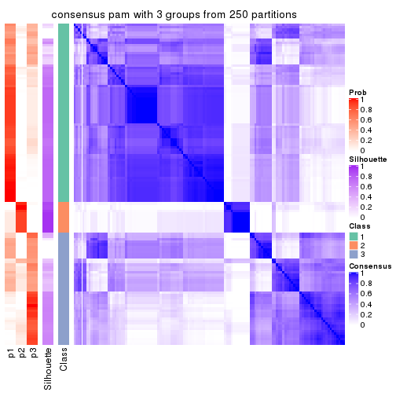</p>

</div>
<div id='tab-CV-pam-consensus-heatmap-3'>
<pre><code class="r">consensus_heatmap(res, k = 4)
</code></pre>

<p></p>

</div>
<div id='tab-CV-pam-consensus-heatmap-4'>
<pre><code class="r">consensus_heatmap(res, k = 5)
</code></pre>

<p></p>

</div>
<div id='tab-CV-pam-consensus-heatmap-5'>
<pre><code class="r">consensus_heatmap(res, k = 6)
</code></pre>

<p></p>

</div>
</div>

Heatmaps for the membership of samples in all partitions to see how consistent they are:


<script>
$( function() {
	$( '#tabs-CV-pam-membership-heatmap' ).tabs();
} );
</script>
<div id='tabs-CV-pam-membership-heatmap'>
<ul>
<li><a href='#tab-CV-pam-membership-heatmap-1'>k = 2</a></li>
<li><a href='#tab-CV-pam-membership-heatmap-2'>k = 3</a></li>
<li><a href='#tab-CV-pam-membership-heatmap-3'>k = 4</a></li>
<li><a href='#tab-CV-pam-membership-heatmap-4'>k = 5</a></li>
<li><a href='#tab-CV-pam-membership-heatmap-5'>k = 6</a></li>
</ul>
<div id='tab-CV-pam-membership-heatmap-1'>
<pre><code class="r">membership_heatmap(res, k = 2)
</code></pre>

<p></p>

</div>
<div id='tab-CV-pam-membership-heatmap-2'>
<pre><code class="r">membership_heatmap(res, k = 3)
</code></pre>

<p></p>

</div>
<div id='tab-CV-pam-membership-heatmap-3'>
<pre><code class="r">membership_heatmap(res, k = 4)
</code></pre>

<p></p>

</div>
<div id='tab-CV-pam-membership-heatmap-4'>
<pre><code class="r">membership_heatmap(res, k = 5)
</code></pre>

<p></p>

</div>
<div id='tab-CV-pam-membership-heatmap-5'>
<pre><code class="r">membership_heatmap(res, k = 6)
</code></pre>

<p></p>

</div>
</div>

As soon as we have had the classes for columns, we can look for signatures
which are significantly different between classes which can be candidate marks
for certain classes. Following are the heatmaps for signatures.


Signature heatmaps where rows are scaled:


<script>
$( function() {
	$( '#tabs-CV-pam-get-signatures' ).tabs();
} );
</script>
<div id='tabs-CV-pam-get-signatures'>
<ul>
<li><a href='#tab-CV-pam-get-signatures-1'>k = 2</a></li>
<li><a href='#tab-CV-pam-get-signatures-2'>k = 3</a></li>
<li><a href='#tab-CV-pam-get-signatures-3'>k = 4</a></li>
<li><a href='#tab-CV-pam-get-signatures-4'>k = 5</a></li>
<li><a href='#tab-CV-pam-get-signatures-5'>k = 6</a></li>
</ul>
<div id='tab-CV-pam-get-signatures-1'>
<pre><code class="r">get_signatures(res, k = 2)
</code></pre>

<p></p>

</div>
<div id='tab-CV-pam-get-signatures-2'>
<pre><code class="r">get_signatures(res, k = 3)
</code></pre>

<p></p>

</div>
<div id='tab-CV-pam-get-signatures-3'>
<pre><code class="r">get_signatures(res, k = 4)
</code></pre>

<p></p>

</div>
<div id='tab-CV-pam-get-signatures-4'>
<pre><code class="r">get_signatures(res, k = 5)
</code></pre>

<p></p>

</div>
<div id='tab-CV-pam-get-signatures-5'>
<pre><code class="r">get_signatures(res, k = 6)
</code></pre>

<p></p>

</div>
</div>


Signature heatmaps where rows are not scaled:


<script>
$( function() {
	$( '#tabs-CV-pam-get-signatures-no-scale' ).tabs();
} );
</script>
<div id='tabs-CV-pam-get-signatures-no-scale'>
<ul>
<li><a href='#tab-CV-pam-get-signatures-no-scale-1'>k = 2</a></li>
<li><a href='#tab-CV-pam-get-signatures-no-scale-2'>k = 3</a></li>
<li><a href='#tab-CV-pam-get-signatures-no-scale-3'>k = 4</a></li>
<li><a href='#tab-CV-pam-get-signatures-no-scale-4'>k = 5</a></li>
<li><a href='#tab-CV-pam-get-signatures-no-scale-5'>k = 6</a></li>
</ul>
<div id='tab-CV-pam-get-signatures-no-scale-1'>
<pre><code class="r">get_signatures(res, k = 2, scale_rows = FALSE)
</code></pre>

<p></p>

</div>
<div id='tab-CV-pam-get-signatures-no-scale-2'>
<pre><code class="r">get_signatures(res, k = 3, scale_rows = FALSE)
</code></pre>

<p></p>

</div>
<div id='tab-CV-pam-get-signatures-no-scale-3'>
<pre><code class="r">get_signatures(res, k = 4, scale_rows = FALSE)
</code></pre>

<p></p>

</div>
<div id='tab-CV-pam-get-signatures-no-scale-4'>
<pre><code class="r">get_signatures(res, k = 5, scale_rows = FALSE)
</code></pre>

<p>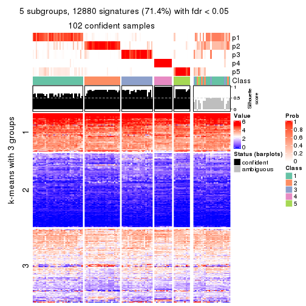</p>

</div>
<div id='tab-CV-pam-get-signatures-no-scale-5'>
<pre><code class="r">get_signatures(res, k = 6, scale_rows = FALSE)
</code></pre>

<p></p>

</div>
</div>


Compare the overlap of signatures from different k:

```r
compare_signatures(res)
```


`get_signature()` returns a data frame invisibly. TO get the list of signatures, the function
call should be assigned to a variable explicitly. In following code, if `plot` argument is set
to `FALSE`, no heatmap is plotted while only the differential analysis is performed.

```r
# code only for demonstration
tb = get_signature(res, k = ..., plot = FALSE)
```

An example of the output of `tb` is:

```
#>   which_row         fdr    mean_1    mean_2 scaled_mean_1 scaled_mean_2 km
#> 1        38 0.042760348  8.373488  9.131774    -0.5533452     0.5164555  1
#> 2        40 0.018707592  7.106213  8.469186    -0.6173731     0.5762149  1
#> 3        55 0.019134737 10.221463 11.207825    -0.6159697     0.5749050  1
#> 4        59 0.006059896  5.921854  7.869574    -0.6899429     0.6439467  1
#> 5        60 0.018055526  8.928898 10.211722    -0.6204761     0.5791110  1
#> 6        98 0.009384629 15.714769 14.887706     0.6635654    -0.6193277  2
...
```

The columns in `tb` are:

1. `which_row`: row indices corresponding to the input matrix.
2. `fdr`: FDR for the differential test. 
3. `mean_x`: The mean value in group x.
4. `scaled_mean_x`: The mean value in group x after rows are scaled.
5. `km`: Row groups if k-means clustering is applied to rows.


UMAP plot which shows how samples are separated.


<script>
$( function() {
	$( '#tabs-CV-pam-dimension-reduction' ).tabs();
} );
</script>
<div id='tabs-CV-pam-dimension-reduction'>
<ul>
<li><a href='#tab-CV-pam-dimension-reduction-1'>k = 2</a></li>
<li><a href='#tab-CV-pam-dimension-reduction-2'>k = 3</a></li>
<li><a href='#tab-CV-pam-dimension-reduction-3'>k = 4</a></li>
<li><a href='#tab-CV-pam-dimension-reduction-4'>k = 5</a></li>
<li><a href='#tab-CV-pam-dimension-reduction-5'>k = 6</a></li>
</ul>
<div id='tab-CV-pam-dimension-reduction-1'>
<pre><code class="r">dimension_reduction(res, k = 2, method = &quot;UMAP&quot;)
</code></pre>

<p></p>

</div>
<div id='tab-CV-pam-dimension-reduction-2'>
<pre><code class="r">dimension_reduction(res, k = 3, method = &quot;UMAP&quot;)
</code></pre>

<p></p>

</div>
<div id='tab-CV-pam-dimension-reduction-3'>
<pre><code class="r">dimension_reduction(res, k = 4, method = &quot;UMAP&quot;)
</code></pre>

<p></p>

</div>
<div id='tab-CV-pam-dimension-reduction-4'>
<pre><code class="r">dimension_reduction(res, k = 5, method = &quot;UMAP&quot;)
</code></pre>

<p></p>

</div>
<div id='tab-CV-pam-dimension-reduction-5'>
<pre><code class="r">dimension_reduction(res, k = 6, method = &quot;UMAP&quot;)
</code></pre>

<p></p>

</div>
</div>


Following heatmap shows how subgroups are split when increasing `k`:

```r
collect_classes(res)
```


If matrix rows can be associated to genes, consider to use `GO_Enrichment(res,
...)` to perform function enrichment for the signature genes.


 

---------------------------------------------------


### CV:mclust


The object with results only for a single top-value method and a single partition method 
can be extracted as:

```r
res = res_list["CV", "mclust"]
# you can also extract it by
# res = res_list["CV:mclust"]
```

A summary of `res` and all the functions that can be applied to it:

```r
res
```

```
#> A 'ConsensusPartition' object with k = 2, 3, 4, 5, 6.
#>   On a matrix with 18041 rows and 126 columns.
#>   Top rows (1000, 2000, 3000, 4000, 5000) are extracted by 'CV' method.
#>   Subgroups are detected by 'mclust' method.
#>   Performed in total 1250 partitions by row resampling.
#>   Best k for subgroups seems to be 4.
#> 
#> Following methods can be applied to this 'ConsensusPartition' object:
#>  [1] "cola_report"             "collect_classes"         "collect_plots"          
#>  [4] "collect_stats"           "colnames"                "compare_signatures"     
#>  [7] "consensus_heatmap"       "dimension_reduction"     "functional_enrichment"  
#> [10] "get_anno_col"            "get_anno"                "get_classes"            
#> [13] "get_consensus"           "get_matrix"              "get_membership"         
#> [16] "get_param"               "get_signatures"          "get_stats"              
#> [19] "is_best_k"               "is_stable_k"             "membership_heatmap"     
#> [22] "ncol"                    "nrow"                    "plot_ecdf"              
#> [25] "rownames"                "select_partition_number" "show"                   
#> [28] "suggest_best_k"          "test_to_known_factors"
```

`collect_plots()` function collects all the plots made from `res` for all `k` (number of partitions)
into one single page to provide an easy and fast comparison between different `k`.

```r
collect_plots(res)
```


The plots are:

- The first row: a plot of the ECDF (Empirical cumulative distribution
  function) curves of the consensus matrix for each `k` and the heatmap of
  predicted classes for each `k`.
- The second row: heatmaps of the consensus matrix for each `k`.
- The third row: heatmaps of the membership matrix for each `k`.
- The fouth row: heatmaps of the signatures for each `k`.

All the plots in panels can be made by individual functions and they are
plotted later in this section.

`select_partition_number()` produces several plots showing different
statistics for choosing "optimized" `k`. There are following statistics:

- ECDF curves of the consensus matrix for each `k`;
- 1-PAC. [The PAC
  score](https://en.wikipedia.org/wiki/Consensus_clustering#Over-interpretation_potential_of_consensus_clustering)
  measures the proportion of the ambiguous subgrouping.
- Mean silhouette score.
- Concordance. The mean probability of fiting the consensus class ids in all
  partitions.
- Area increased. Denote $A_k$ as the area under the ECDF curve for current
  `k`, the area increased is defined as $A_k - A_{k-1}$.
- Rand index. The percent of pairs of samples that are both in a same cluster
  or both are not in a same cluster in the partition of k and k-1.
- Jaccard index. The ratio of pairs of samples are both in a same cluster in
  the partition of k and k-1 and the pairs of samples are both in a same
  cluster in the partition k or k-1.

The detailed explanations of these statistics can be found in [the cola
vignette](http://bioconductor.org/packages/devel/bioc/vignettes/cola/inst/doc/cola.html#toc_13).

Generally speaking, lower PAC score, higher mean silhouette score or higher
concordance corresponds to better partition. Rand index and Jaccard index
measure how similar the current partition is compared to partition with `k-1`.
If they are too similar, we won't accept `k` is better than `k-1`.

```r
select_partition_number(res)
```


The numeric values for all these statistics can be obtained by `get_stats()`.

```r
get_stats(res)
```

```
#>   k 1-PAC mean_silhouette concordance area_increased  Rand Jaccard
#> 2 2 0.246           0.668       0.805         0.3388 0.801   0.801
#> 3 3 0.538           0.858       0.889         0.6233 0.635   0.555
#> 4 4 0.827           0.909       0.946         0.2919 0.793   0.569
#> 5 5 0.792           0.674       0.861         0.0633 0.966   0.881
#> 6 6 0.710           0.579       0.740         0.0476 0.921   0.712
```

`suggest_best_k()` suggests the best $k$ based on these statistics. The rules are as follows:

- All $k$ with Jaccard index larger than 0.95 are removed because the increase of
  the partition number does not provides enough extra information. If all $k$ are removed,
  the best $k$ is assigned by `NA`.
- For $k$ with 1-PAC larger than 0.9, the maximal $k$ is taken as the "best k". Other $k$ is called "optional k".
- If it does not fit the second rule. The $k$ with the highest vote of highest
  1-PAC, mean silhouette and concordance is taken as the "best k".

```r
suggest_best_k(res)
```

```
#> [1] 4
```


Following shows the table of the partitions (You need to click the **show/hide
code output** link to see it). The membership matrix (columns with name `p*`)
is inferred by
[`clue::cl_consensus()`](https://www.rdocumentation.org/link/cl_consensus?package=clue)
function with the `SE` method. Basically the value in the membership matrix
represents the probability to belong to a certain group. The finall class
label for an item is determined with the group with highest probability it
belongs to.

In `get_classes()` function, the entropy is calculated from the membership
matrix and the silhouette score is calculated from the consensus matrix.


<script>
$( function() {
	$( '#tabs-CV-mclust-get-classes' ).tabs();
} );
</script>
<div id='tabs-CV-mclust-get-classes'>
<ul>
<li><a href='#tab-CV-mclust-get-classes-1'>k = 2</a></li>
<li><a href='#tab-CV-mclust-get-classes-2'>k = 3</a></li>
<li><a href='#tab-CV-mclust-get-classes-3'>k = 4</a></li>
<li><a href='#tab-CV-mclust-get-classes-4'>k = 5</a></li>
<li><a href='#tab-CV-mclust-get-classes-5'>k = 6</a></li>
</ul>

<div id='tab-CV-mclust-get-classes-1'>
<p><a id='tab-CV-mclust-get-classes-1-a' style='color:#0366d6' href='#'>show/hide code output</a></p>
<pre><code class="r">cbind(get_classes(res, k = 2), get_membership(res, k = 2))
</code></pre>

<pre><code>#&gt;                                      class entropy silhouette    p1    p2
#&gt; DC1F29A2-39DE-44AD-936A-54B2B32D6370     1  0.8713      0.589 0.708 0.292
#&gt; FA3C3413-FA8C-4A29-B9CA-5BC3A56274A8     1  0.2948      0.753 0.948 0.052
#&gt; B9B72975-8134-475C-BC0B-0CFDB24F636A     1  0.0376      0.760 0.996 0.004
#&gt; F44DB757-4D00-4BFC-99C5-AA82F99C5BDA     1  0.0000      0.761 1.000 0.000
#&gt; 3BD942BB-A3A7-4993-B3F1-B8641626B773     1  0.2043      0.758 0.968 0.032
#&gt; 431F73A2-2AB3-4101-B610-7FC02A7097EC     1  0.5059      0.737 0.888 0.112
#&gt; 3067683D-43D4-4F6D-9338-17F6A75E4B25     1  0.5059      0.737 0.888 0.112
#&gt; 2CE91B81-7CBE-4698-AFEE-6A154313D231     1  0.4022      0.743 0.920 0.080
#&gt; A639CF4F-4591-4337-A12E-BED71EDDA10B     1  0.5408      0.738 0.876 0.124
#&gt; 5482053D-9F48-4773-B68A-302B3A612503     1  0.9833      0.397 0.576 0.424
#&gt; A31D342D-C67C-428B-BAED-C6E844277A09     1  0.7219      0.725 0.800 0.200
#&gt; 0E9C5985-9AE0-4098-A076-6FFBBDF05110     1  0.0376      0.760 0.996 0.004
#&gt; 08CCF8A0-15B7-4A13-BC43-6B3B3E2DDE95     1  0.5178      0.739 0.884 0.116
#&gt; 10577D5B-AD56-403F-A562-73A9ACF2045B     2  0.9970     -0.221 0.468 0.532
#&gt; C940D443-5DDA-4403-868B-7AA6B9A50FC4     1  0.5294      0.733 0.880 0.120
#&gt; 89D4D945-A717-495F-B253-F5A17CF5B9FA     1  0.5294      0.738 0.880 0.120
#&gt; DC55EE78-203F-4092-9B83-14B1A529194B     1  0.4815      0.741 0.896 0.104
#&gt; 8F7368BE-EB41-4192-89AA-9E0428C08851     1  0.9795      0.412 0.584 0.416
#&gt; F772EA39-E408-4908-BADD-C786D702BF9B     1  0.0376      0.760 0.996 0.004
#&gt; FD693D10-3ADA-4028-8392-41D2F0296F7E     2  0.4022      0.916 0.080 0.920
#&gt; 84F16966-7640-49F9-95D1-7648FF74DCC9     1  0.0000      0.761 1.000 0.000
#&gt; D26DAA2F-AE6A-42E1-9F1F-01943B99785F     1  0.5059      0.737 0.888 0.112
#&gt; F325847E-F046-4B67-B01C-16919C401020     1  0.6623      0.734 0.828 0.172
#&gt; 19EB2B10-2529-4A94-8FAE-1CE371A602D9     1  0.5294      0.733 0.880 0.120
#&gt; B94B9CCF-5FB8-44AE-8D9C-A194C6801A27     1  0.0000      0.761 1.000 0.000
#&gt; D2678E70-542A-4AB2-B881-12D66DBA44F5     2  0.4022      0.916 0.080 0.920
#&gt; 4961CA2A-70CD-42AB-A676-4A98C85F449F     1  0.7376      0.721 0.792 0.208
#&gt; 5AA74C5C-2AD1-4D59-A030-E964EB199581     1  0.9286      0.526 0.656 0.344
#&gt; F9E11A1B-BD93-438F-9670-6FB7DFF9E910     1  0.5408      0.731 0.876 0.124
#&gt; FB78CA5A-C8B9-42AF-9DAE-799CAB280B2E     1  0.9833      0.397 0.576 0.424
#&gt; A8E48877-F8AB-44DD-A18B-194D87C44931     1  0.5178      0.725 0.884 0.116
#&gt; CA50C495-F37E-4743-867D-FAF2DCC3376A     1  0.5059      0.737 0.888 0.112
#&gt; 37342369-EC22-4904-8CCD-A0DC6BD8D183     1  0.7883      0.671 0.764 0.236
#&gt; 91BA5F90-9174-4533-A050-39A28E34A94D     1  0.9833      0.397 0.576 0.424
#&gt; 5BC371AC-1915-44E9-A114-2963E131EC8D     1  0.9775      0.418 0.588 0.412
#&gt; 74A6C31A-7F21-45AF-A170-18C326D2AE69     2  0.9286      0.316 0.344 0.656
#&gt; 984F27EF-D4D7-4E68-BD64-776FDFC04D07     2  0.4022      0.916 0.080 0.920
#&gt; B05701C5-8C44-4FD1-94C9-FC0255A2EA24     1  0.5408      0.731 0.876 0.124
#&gt; 91E4119C-2CE6-4447-A125-6A4F403A89E6     1  0.5059      0.737 0.888 0.112
#&gt; 1570FCE7-F1B4-4BDF-A398-355EDF030864     1  0.0000      0.761 1.000 0.000
#&gt; 604C06E9-A00E-435E-847A-3992922A5C56     1  0.5408      0.731 0.876 0.124
#&gt; 455C9007-6FF4-4D63-83FA-4915F0331F9A     2  0.4022      0.916 0.080 0.920
#&gt; FB8BD3CF-D2EC-47B6-B67F-65ADC1C3A6A7     1  0.5408      0.736 0.876 0.124
#&gt; 9DC7443A-3C8F-4025-8312-3C98BF28D736     2  0.4022      0.916 0.080 0.920
#&gt; CB207A52-09AC-49D3-8240-5840CDFBB154     1  0.9833      0.397 0.576 0.424
#&gt; 2A335049-AD9F-4B32-92B7-69B04B0CF2BA     1  0.5629      0.725 0.868 0.132
#&gt; 6ACA6293-371E-428D-BBAE-ABFD410C886F     1  0.5294      0.723 0.880 0.120
#&gt; E8929929-73F9-4DB7-ABBA-0852BEFFFF7E     1  0.5408      0.731 0.876 0.124
#&gt; 5E343116-414B-41F2-AAEE-A3225450135A     1  0.8608      0.593 0.716 0.284
#&gt; 0A39073C-157C-48A1-B125-A6A04CB738DA     1  0.1843      0.759 0.972 0.028
#&gt; 300D78E6-1C7E-4114-80EA-9204A6818B9A     1  0.9087      0.549 0.676 0.324
#&gt; DAAF55AA-ED48-4221-9CD6-D1DEB6376017     1  0.9815      0.405 0.580 0.420
#&gt; D76FCF4A-4ACF-41EF-A120-64136D6C845E     1  0.6343      0.698 0.840 0.160
#&gt; AD294665-6F90-459C-90D5-3058F210225D     1  0.9754      0.438 0.592 0.408
#&gt; 92E8AD7A-1084-44C8-BDC0-FE4E47B6143F     1  0.0000      0.761 1.000 0.000
#&gt; 5644A861-3C59-486D-8FBE-4DF6A3B19558     1  0.9909      0.311 0.556 0.444
#&gt; 1BF8AAE7-B771-4CF2-8B1C-D2BEB5E6579E     2  0.4022      0.916 0.080 0.920
#&gt; A54731AE-FC40-407F-8D10-67DDC122237D     1  0.0376      0.760 0.996 0.004
#&gt; 179DC906-5654-4CBA-9C27-C9560B5F12DE     1  0.7602      0.716 0.780 0.220
#&gt; 979B9A2B-2D81-47C3-A553-9B9441CAAE47     1  0.9795      0.411 0.584 0.416
#&gt; D69BD86A-08FB-49DA-9084-2725F6C9195F     1  0.9833      0.397 0.576 0.424
#&gt; 84611033-BCF7-49D7-9B91-DA29B62AC8D3     1  0.5408      0.731 0.876 0.124
#&gt; 8AA1DA3E-8C00-4653-AA33-EA70531C1E50     1  0.0000      0.761 1.000 0.000
#&gt; CEBE9594-0F19-46B4-AF7D-F8DF33E00AFB     1  0.9833      0.397 0.576 0.424
#&gt; C68E82D2-2BD3-41E9-92D7-D4C06E1953B2     1  0.3274      0.751 0.940 0.060
#&gt; B855EF89-1E76-4408-AA65-61A0F0A4F412     1  0.0000      0.761 1.000 0.000
#&gt; 4488EFB3-5B01-41E3-B57E-8E4F607CF448     1  0.8763      0.570 0.704 0.296
#&gt; C2BD8440-CAC6-4FE5-8EBB-5E6AE308D52F     1  0.5946      0.740 0.856 0.144
#&gt; E0E50F10-1FED-41C1-84DB-81A46F25D7E9     2  0.4022      0.916 0.080 0.920
#&gt; EE16D845-31F2-4178-800B-CA2C358841AD     1  0.0000      0.761 1.000 0.000
#&gt; 169828CF-5693-4A46-B5D7-E45CBA9DF317     1  0.0376      0.760 0.996 0.004
#&gt; 51077BA3-AEE0-4BD4-A1B1-1B0A811642A1     1  0.9944      0.305 0.544 0.456
#&gt; D2F4E240-C44C-4CF7-8016-6CACD370D093     1  0.8499      0.595 0.724 0.276
#&gt; 721CDBE6-FC85-4C30-B23E-28407340286F     1  0.6531      0.689 0.832 0.168
#&gt; 392897E4-6009-422C-B461-649F4DDF260C     1  0.6887      0.672 0.816 0.184
#&gt; 617E13D2-6924-45F8-A8DE-BE21B718F822     2  0.4022      0.916 0.080 0.920
#&gt; 5746C00F-9CBB-46B7-83FD-90B2AB3F507B     1  0.8661      0.586 0.712 0.288
#&gt; 982B4344-A223-4D1F-9485-2E56F9FD45C0     1  0.0000      0.761 1.000 0.000
#&gt; E5557F52-015D-49DC-9E23-989FC259976F     1  0.5178      0.735 0.884 0.116
#&gt; F3135F5E-2E90-4923-B634-E994563D17B7     1  0.5178      0.735 0.884 0.116
#&gt; D1ED15A5-9802-4314-B556-E89EB772D1F0     1  0.8661      0.656 0.712 0.288
#&gt; 222B06E3-FCFB-4104-92C3-D73BC31854D4     1  0.9896      0.360 0.560 0.440
#&gt; 4C810FFA-ED07-4F4C-9F81-B8F1CF4956F7     2  0.4022      0.916 0.080 0.920
#&gt; 9A608964-ED12-4E6E-9D3A-430F59FFF65B     1  0.5294      0.733 0.880 0.120
#&gt; 4087357F-C17A-4992-A8AB-41ACA2F72001     2  0.4022      0.916 0.080 0.920
#&gt; B3F013A5-BCB8-4CE0-86B2-634EE180AA6E     1  0.0000      0.761 1.000 0.000
#&gt; 322AF320-1379-4F51-AFDC-5292A060CD52     1  0.5059      0.737 0.888 0.112
#&gt; 53A96249-66D5-4C26-893B-ADC71481D261     1  0.3879      0.752 0.924 0.076
#&gt; 1AB7A6F2-14BD-447C-B2E3-DEB0CE56B209     1  0.9833      0.397 0.576 0.424
#&gt; 8B4BCDA0-6787-4A55-99F7-AAF22AF85BA6     1  0.4815      0.741 0.896 0.104
#&gt; 5D9D9E08-2C2C-414E-9547-62799F90D543     1  0.0000      0.761 1.000 0.000
#&gt; C345CD17-E4F4-41D5-9891-FEFB19342C52     1  0.7299      0.721 0.796 0.204
#&gt; 1AF8FDE1-1A74-41F6-A1C5-4952CDFB7D3F     1  0.9795      0.412 0.584 0.416
#&gt; BC3405FF-0660-4B2B-8DC1-5F34D3133078     1  0.9522      0.483 0.628 0.372
#&gt; C2662596-6E2F-4924-B051-CEA1AC87B197     1  0.9833      0.397 0.576 0.424
#&gt; 39AE85F7-49FB-4438-BD41-6AC812FA1C72     1  0.8861      0.629 0.696 0.304
#&gt; 6FF266DB-3F08-43F2-8F6F-679F805B80B8     1  0.8327      0.614 0.736 0.264
#&gt; B03B7B81-BBD6-4194-BC5E-6EDF0D3F015A     1  0.9000      0.560 0.684 0.316
#&gt; C7617D56-F13C-4C43-906C-BD458C5DC4CD     1  0.9000      0.559 0.684 0.316
#&gt; 09420F8B-7A71-4B32-8388-4767670F1FEB     1  0.9833      0.397 0.576 0.424
#&gt; 6AF47534-74FF-4128-865B-4E8EE1FFB469     1  0.3274      0.754 0.940 0.060
#&gt; 8FF9E94A-2ED2-4727-947F-D524D7ECE815     1  0.9815      0.405 0.580 0.420
#&gt; A390E20D-03F9-40E4-A132-0FA5C2BEDB63     2  0.4022      0.916 0.080 0.920
#&gt; A489CCCA-1374-4071-80CE-05B83C9A0D5E     1  0.4562      0.736 0.904 0.096
#&gt; 2D962371-EC83-490C-A663-478AF383BC1B     1  0.0000      0.761 1.000 0.000
#&gt; D91B31A1-EE71-4726-B94C-0CC2815E9D4E     1  0.0376      0.760 0.996 0.004
#&gt; E0123C5C-E1D1-4162-9895-CC8B01949D84     1  0.5408      0.731 0.876 0.124
#&gt; EC73959A-2728-49FE-B72A-790BB14F4CBF     1  0.9970      0.286 0.532 0.468
#&gt; A60DC925-7343-496E-900D-0DD81D5C8123     1  0.8386      0.631 0.732 0.268
#&gt; 659B64DB-F4A5-43BD-811B-05004CB49D99     1  0.9815      0.405 0.580 0.420
#&gt; 6969B6B2-7616-4664-9696-C4DACD10537B     1  0.0000      0.761 1.000 0.000
#&gt; 2F6392DE-0D54-4768-B062-907C81E5B0CC     1  0.6247      0.701 0.844 0.156
#&gt; C74BE8C5-BA6D-4596-9D67-3C731799F999     2  0.4022      0.916 0.080 0.920
#&gt; 79A7647F-BDBA-45A2-B207-ABF788F6CC95     1  0.5408      0.731 0.876 0.124
#&gt; D47D0433-2313-4A2F-B268-5AD293D7534E     1  0.4939      0.739 0.892 0.108
#&gt; C5058B93-C1DA-43B9-9951-B23A9810AA6E     1  0.0938      0.760 0.988 0.012
#&gt; 2629FEE3-A203-4411-8A70-02A796C9505C     1  0.5408      0.736 0.876 0.124
#&gt; 1AF329E4-11D4-4CFC-801F-C24A1EA33102     1  0.2423      0.757 0.960 0.040
#&gt; D453BEF8-3F18-4B89-BA42-CE74EB105032     1  0.5408      0.731 0.876 0.124
#&gt; B12A4446-2310-4139-897F-CA030478CBD5     1  0.5842      0.718 0.860 0.140
#&gt; BCAB1918-5FA9-4CBD-85CB-008743FEA2CC     1  0.5519      0.728 0.872 0.128
#&gt; 9A5432D3-19EE-47B4-BD88-698DEC75A5E9     1  0.2043      0.759 0.968 0.032
#&gt; A608BCEB-2C27-4927-A308-E6975F641722     1  0.0376      0.760 0.996 0.004
#&gt; E4752275-7BF6-4C1E-8A45-C7D571ED85AD     1  0.0376      0.760 0.996 0.004
#&gt; FDEC1714-C02D-4AB7-AE82-789E9D709EDE     1  0.9000      0.558 0.684 0.316
#&gt; 33737781-8638-4FA2-AD4C-E888BB9343D8     1  0.5408      0.721 0.876 0.124
</code></pre>

<script>
$('#tab-CV-mclust-get-classes-1-a').parent().next().next().hide();
$('#tab-CV-mclust-get-classes-1-a').click(function(){
  $('#tab-CV-mclust-get-classes-1-a').parent().next().next().toggle();
  return(false);
});
</script>
</div>

<div id='tab-CV-mclust-get-classes-2'>
<p><a id='tab-CV-mclust-get-classes-2-a' style='color:#0366d6' href='#'>show/hide code output</a></p>
<pre><code class="r">cbind(get_classes(res, k = 3), get_membership(res, k = 3))
</code></pre>

<pre><code>#&gt;                                      class entropy silhouette    p1    p2    p3
#&gt; DC1F29A2-39DE-44AD-936A-54B2B32D6370     2  0.1170      0.866 0.008 0.976 0.016
#&gt; FA3C3413-FA8C-4A29-B9CA-5BC3A56274A8     2  0.4790      0.860 0.056 0.848 0.096
#&gt; B9B72975-8134-475C-BC0B-0CFDB24F636A     2  0.5564      0.845 0.064 0.808 0.128
#&gt; F44DB757-4D00-4BFC-99C5-AA82F99C5BDA     2  0.7337      0.794 0.152 0.708 0.140
#&gt; 3BD942BB-A3A7-4993-B3F1-B8641626B773     2  0.3692      0.868 0.056 0.896 0.048
#&gt; 431F73A2-2AB3-4101-B610-7FC02A7097EC     3  0.1289      0.928 0.000 0.032 0.968
#&gt; 3067683D-43D4-4F6D-9338-17F6A75E4B25     3  0.1753      0.912 0.000 0.048 0.952
#&gt; 2CE91B81-7CBE-4698-AFEE-6A154313D231     2  0.4628      0.862 0.056 0.856 0.088
#&gt; A639CF4F-4591-4337-A12E-BED71EDDA10B     3  0.1289      0.928 0.000 0.032 0.968
#&gt; 5482053D-9F48-4773-B68A-302B3A612503     2  0.0983      0.862 0.016 0.980 0.004
#&gt; A31D342D-C67C-428B-BAED-C6E844277A09     3  0.6057      0.470 0.004 0.340 0.656
#&gt; 0E9C5985-9AE0-4098-A076-6FFBBDF05110     2  0.5375      0.845 0.056 0.816 0.128
#&gt; 08CCF8A0-15B7-4A13-BC43-6B3B3E2DDE95     3  0.2356      0.890 0.000 0.072 0.928
#&gt; 10577D5B-AD56-403F-A562-73A9ACF2045B     2  0.4136      0.844 0.020 0.864 0.116
#&gt; C940D443-5DDA-4403-868B-7AA6B9A50FC4     3  0.1289      0.928 0.000 0.032 0.968
#&gt; 89D4D945-A717-495F-B253-F5A17CF5B9FA     3  0.1289      0.928 0.000 0.032 0.968
#&gt; DC55EE78-203F-4092-9B83-14B1A529194B     2  0.8290      0.701 0.164 0.632 0.204
#&gt; 8F7368BE-EB41-4192-89AA-9E0428C08851     2  0.0983      0.862 0.016 0.980 0.004
#&gt; F772EA39-E408-4908-BADD-C786D702BF9B     2  0.5810      0.843 0.072 0.796 0.132
#&gt; FD693D10-3ADA-4028-8392-41D2F0296F7E     1  0.2384      1.000 0.936 0.008 0.056
#&gt; 84F16966-7640-49F9-95D1-7648FF74DCC9     2  0.8309      0.711 0.180 0.632 0.188
#&gt; D26DAA2F-AE6A-42E1-9F1F-01943B99785F     3  0.1031      0.928 0.000 0.024 0.976
#&gt; F325847E-F046-4B67-B01C-16919C401020     3  0.1411      0.926 0.000 0.036 0.964
#&gt; 19EB2B10-2529-4A94-8FAE-1CE371A602D9     3  0.1289      0.928 0.000 0.032 0.968
#&gt; B94B9CCF-5FB8-44AE-8D9C-A194C6801A27     2  0.8072      0.743 0.208 0.648 0.144
#&gt; D2678E70-542A-4AB2-B881-12D66DBA44F5     1  0.2384      1.000 0.936 0.008 0.056
#&gt; 4961CA2A-70CD-42AB-A676-4A98C85F449F     3  0.1289      0.928 0.000 0.032 0.968
#&gt; 5AA74C5C-2AD1-4D59-A030-E964EB199581     2  0.2774      0.861 0.008 0.920 0.072
#&gt; F9E11A1B-BD93-438F-9670-6FB7DFF9E910     3  0.0424      0.922 0.000 0.008 0.992
#&gt; FB78CA5A-C8B9-42AF-9DAE-799CAB280B2E     2  0.1129      0.861 0.020 0.976 0.004
#&gt; A8E48877-F8AB-44DD-A18B-194D87C44931     2  0.3337      0.870 0.060 0.908 0.032
#&gt; CA50C495-F37E-4743-867D-FAF2DCC3376A     3  0.2959      0.853 0.000 0.100 0.900
#&gt; 37342369-EC22-4904-8CCD-A0DC6BD8D183     2  0.8290      0.701 0.164 0.632 0.204
#&gt; 91BA5F90-9174-4533-A050-39A28E34A94D     2  0.0983      0.862 0.016 0.980 0.004
#&gt; 5BC371AC-1915-44E9-A114-2963E131EC8D     2  0.0475      0.865 0.004 0.992 0.004
#&gt; 74A6C31A-7F21-45AF-A170-18C326D2AE69     2  0.2486      0.846 0.060 0.932 0.008
#&gt; 984F27EF-D4D7-4E68-BD64-776FDFC04D07     1  0.2384      1.000 0.936 0.008 0.056
#&gt; B05701C5-8C44-4FD1-94C9-FC0255A2EA24     3  0.0592      0.925 0.000 0.012 0.988
#&gt; 91E4119C-2CE6-4447-A125-6A4F403A89E6     3  0.0592      0.925 0.000 0.012 0.988
#&gt; 1570FCE7-F1B4-4BDF-A398-355EDF030864     2  0.6714      0.820 0.112 0.748 0.140
#&gt; 604C06E9-A00E-435E-847A-3992922A5C56     3  0.1031      0.928 0.000 0.024 0.976
#&gt; 455C9007-6FF4-4D63-83FA-4915F0331F9A     1  0.2384      1.000 0.936 0.008 0.056
#&gt; FB8BD3CF-D2EC-47B6-B67F-65ADC1C3A6A7     3  0.1031      0.928 0.000 0.024 0.976
#&gt; 9DC7443A-3C8F-4025-8312-3C98BF28D736     1  0.2384      1.000 0.936 0.008 0.056
#&gt; CB207A52-09AC-49D3-8240-5840CDFBB154     2  0.0829      0.863 0.012 0.984 0.004
#&gt; 2A335049-AD9F-4B32-92B7-69B04B0CF2BA     3  0.0424      0.922 0.000 0.008 0.992
#&gt; 6ACA6293-371E-428D-BBAE-ABFD410C886F     2  0.3237      0.870 0.056 0.912 0.032
#&gt; E8929929-73F9-4DB7-ABBA-0852BEFFFF7E     3  0.0892      0.928 0.000 0.020 0.980
#&gt; 5E343116-414B-41F2-AAEE-A3225450135A     2  0.0475      0.866 0.004 0.992 0.004
#&gt; 0A39073C-157C-48A1-B125-A6A04CB738DA     2  0.4945      0.858 0.056 0.840 0.104
#&gt; 300D78E6-1C7E-4114-80EA-9204A6818B9A     2  0.0237      0.866 0.000 0.996 0.004
#&gt; DAAF55AA-ED48-4221-9CD6-D1DEB6376017     2  0.1129      0.861 0.020 0.976 0.004
#&gt; D76FCF4A-4ACF-41EF-A120-64136D6C845E     2  0.1919      0.871 0.024 0.956 0.020
#&gt; AD294665-6F90-459C-90D5-3058F210225D     2  0.0661      0.864 0.008 0.988 0.004
#&gt; 92E8AD7A-1084-44C8-BDC0-FE4E47B6143F     2  0.6705      0.820 0.108 0.748 0.144
#&gt; 5644A861-3C59-486D-8FBE-4DF6A3B19558     2  0.1989      0.848 0.048 0.948 0.004
#&gt; 1BF8AAE7-B771-4CF2-8B1C-D2BEB5E6579E     1  0.2384      1.000 0.936 0.008 0.056
#&gt; A54731AE-FC40-407F-8D10-67DDC122237D     2  0.5334      0.849 0.060 0.820 0.120
#&gt; 179DC906-5654-4CBA-9C27-C9560B5F12DE     2  0.4413      0.841 0.008 0.832 0.160
#&gt; 979B9A2B-2D81-47C3-A553-9B9441CAAE47     2  0.0475      0.865 0.004 0.992 0.004
#&gt; D69BD86A-08FB-49DA-9084-2725F6C9195F     2  0.1129      0.861 0.020 0.976 0.004
#&gt; 84611033-BCF7-49D7-9B91-DA29B62AC8D3     3  0.0424      0.922 0.000 0.008 0.992
#&gt; 8AA1DA3E-8C00-4653-AA33-EA70531C1E50     2  0.8030      0.747 0.204 0.652 0.144
#&gt; CEBE9594-0F19-46B4-AF7D-F8DF33E00AFB     2  0.0829      0.863 0.012 0.984 0.004
#&gt; C68E82D2-2BD3-41E9-92D7-D4C06E1953B2     2  0.3816      0.849 0.000 0.852 0.148
#&gt; B855EF89-1E76-4408-AA65-61A0F0A4F412     2  0.8030      0.747 0.204 0.652 0.144
#&gt; 4488EFB3-5B01-41E3-B57E-8E4F607CF448     2  0.1315      0.869 0.008 0.972 0.020
#&gt; C2BD8440-CAC6-4FE5-8EBB-5E6AE308D52F     3  0.4062      0.769 0.000 0.164 0.836
#&gt; E0E50F10-1FED-41C1-84DB-81A46F25D7E9     1  0.2384      1.000 0.936 0.008 0.056
#&gt; EE16D845-31F2-4178-800B-CA2C358841AD     2  0.7888      0.758 0.196 0.664 0.140
#&gt; 169828CF-5693-4A46-B5D7-E45CBA9DF317     2  0.6349      0.830 0.092 0.768 0.140
#&gt; 51077BA3-AEE0-4BD4-A1B1-1B0A811642A1     2  0.1647      0.854 0.036 0.960 0.004
#&gt; D2F4E240-C44C-4CF7-8016-6CACD370D093     2  0.1482      0.866 0.012 0.968 0.020
#&gt; 721CDBE6-FC85-4C30-B23E-28407340286F     3  0.0424      0.922 0.000 0.008 0.992
#&gt; 392897E4-6009-422C-B461-649F4DDF260C     3  0.0424      0.922 0.000 0.008 0.992
#&gt; 617E13D2-6924-45F8-A8DE-BE21B718F822     1  0.2384      1.000 0.936 0.008 0.056
#&gt; 5746C00F-9CBB-46B7-83FD-90B2AB3F507B     2  0.2356      0.870 0.000 0.928 0.072
#&gt; 982B4344-A223-4D1F-9485-2E56F9FD45C0     2  0.7944      0.755 0.196 0.660 0.144
#&gt; E5557F52-015D-49DC-9E23-989FC259976F     3  0.1289      0.928 0.000 0.032 0.968
#&gt; F3135F5E-2E90-4923-B634-E994563D17B7     3  0.1289      0.928 0.000 0.032 0.968
#&gt; D1ED15A5-9802-4314-B556-E89EB772D1F0     3  0.6427      0.446 0.012 0.348 0.640
#&gt; 222B06E3-FCFB-4104-92C3-D73BC31854D4     2  0.1267      0.860 0.024 0.972 0.004
#&gt; 4C810FFA-ED07-4F4C-9F81-B8F1CF4956F7     1  0.2384      1.000 0.936 0.008 0.056
#&gt; 9A608964-ED12-4E6E-9D3A-430F59FFF65B     3  0.1289      0.928 0.000 0.032 0.968
#&gt; 4087357F-C17A-4992-A8AB-41ACA2F72001     1  0.2384      1.000 0.936 0.008 0.056
#&gt; B3F013A5-BCB8-4CE0-86B2-634EE180AA6E     2  0.7853      0.762 0.188 0.668 0.144
#&gt; 322AF320-1379-4F51-AFDC-5292A060CD52     3  0.8475      0.221 0.112 0.320 0.568
#&gt; 53A96249-66D5-4C26-893B-ADC71481D261     2  0.5852      0.833 0.060 0.788 0.152
#&gt; 1AB7A6F2-14BD-447C-B2E3-DEB0CE56B209     2  0.1267      0.860 0.024 0.972 0.004
#&gt; 8B4BCDA0-6787-4A55-99F7-AAF22AF85BA6     2  0.8521      0.671 0.164 0.608 0.228
#&gt; 5D9D9E08-2C2C-414E-9547-62799F90D543     2  0.8167      0.736 0.212 0.640 0.148
#&gt; C345CD17-E4F4-41D5-9891-FEFB19342C52     3  0.0747      0.926 0.000 0.016 0.984
#&gt; 1AF8FDE1-1A74-41F6-A1C5-4952CDFB7D3F     2  0.0661      0.865 0.008 0.988 0.004
#&gt; BC3405FF-0660-4B2B-8DC1-5F34D3133078     2  0.2063      0.863 0.008 0.948 0.044
#&gt; C2662596-6E2F-4924-B051-CEA1AC87B197     2  0.0829      0.863 0.012 0.984 0.004
#&gt; 39AE85F7-49FB-4438-BD41-6AC812FA1C72     2  0.4261      0.848 0.012 0.848 0.140
#&gt; 6FF266DB-3F08-43F2-8F6F-679F805B80B8     2  0.0983      0.868 0.016 0.980 0.004
#&gt; B03B7B81-BBD6-4194-BC5E-6EDF0D3F015A     2  0.0237      0.866 0.000 0.996 0.004
#&gt; C7617D56-F13C-4C43-906C-BD458C5DC4CD     2  0.0237      0.866 0.000 0.996 0.004
#&gt; 09420F8B-7A71-4B32-8388-4767670F1FEB     2  0.1129      0.861 0.020 0.976 0.004
#&gt; 6AF47534-74FF-4128-865B-4E8EE1FFB469     2  0.6192      0.819 0.060 0.764 0.176
#&gt; 8FF9E94A-2ED2-4727-947F-D524D7ECE815     2  0.0983      0.863 0.016 0.980 0.004
#&gt; A390E20D-03F9-40E4-A132-0FA5C2BEDB63     1  0.2384      1.000 0.936 0.008 0.056
#&gt; A489CCCA-1374-4071-80CE-05B83C9A0D5E     2  0.5117      0.860 0.060 0.832 0.108
#&gt; 2D962371-EC83-490C-A663-478AF383BC1B     2  0.8030      0.747 0.204 0.652 0.144
#&gt; D91B31A1-EE71-4726-B94C-0CC2815E9D4E     2  0.5137      0.857 0.064 0.832 0.104
#&gt; E0123C5C-E1D1-4162-9895-CC8B01949D84     3  0.0424      0.922 0.000 0.008 0.992
#&gt; EC73959A-2728-49FE-B72A-790BB14F4CBF     2  0.1267      0.860 0.024 0.972 0.004
#&gt; A60DC925-7343-496E-900D-0DD81D5C8123     2  0.8290      0.701 0.164 0.632 0.204
#&gt; 659B64DB-F4A5-43BD-811B-05004CB49D99     2  0.1129      0.862 0.020 0.976 0.004
#&gt; 6969B6B2-7616-4664-9696-C4DACD10537B     2  0.7888      0.758 0.196 0.664 0.140
#&gt; 2F6392DE-0D54-4768-B062-907C81E5B0CC     2  0.1765      0.868 0.040 0.956 0.004
#&gt; C74BE8C5-BA6D-4596-9D67-3C731799F999     1  0.2384      1.000 0.936 0.008 0.056
#&gt; 79A7647F-BDBA-45A2-B207-ABF788F6CC95     3  0.0424      0.922 0.000 0.008 0.992
#&gt; D47D0433-2313-4A2F-B268-5AD293D7534E     2  0.8543      0.665 0.160 0.604 0.236
#&gt; C5058B93-C1DA-43B9-9951-B23A9810AA6E     2  0.5020      0.857 0.056 0.836 0.108
#&gt; 2629FEE3-A203-4411-8A70-02A796C9505C     3  0.1031      0.928 0.000 0.024 0.976
#&gt; 1AF329E4-11D4-4CFC-801F-C24A1EA33102     2  0.4790      0.859 0.056 0.848 0.096
#&gt; D453BEF8-3F18-4B89-BA42-CE74EB105032     3  0.0892      0.927 0.000 0.020 0.980
#&gt; B12A4446-2310-4139-897F-CA030478CBD5     3  0.0424      0.922 0.000 0.008 0.992
#&gt; BCAB1918-5FA9-4CBD-85CB-008743FEA2CC     3  0.1289      0.928 0.000 0.032 0.968
#&gt; 9A5432D3-19EE-47B4-BD88-698DEC75A5E9     2  0.2550      0.868 0.056 0.932 0.012
#&gt; A608BCEB-2C27-4927-A308-E6975F641722     2  0.5334      0.849 0.060 0.820 0.120
#&gt; E4752275-7BF6-4C1E-8A45-C7D571ED85AD     2  0.6714      0.820 0.112 0.748 0.140
#&gt; FDEC1714-C02D-4AB7-AE82-789E9D709EDE     2  0.0237      0.866 0.000 0.996 0.004
#&gt; 33737781-8638-4FA2-AD4C-E888BB9343D8     2  0.4642      0.864 0.060 0.856 0.084
</code></pre>

<script>
$('#tab-CV-mclust-get-classes-2-a').parent().next().next().hide();
$('#tab-CV-mclust-get-classes-2-a').click(function(){
  $('#tab-CV-mclust-get-classes-2-a').parent().next().next().toggle();
  return(false);
});
</script>
</div>

<div id='tab-CV-mclust-get-classes-3'>
<p><a id='tab-CV-mclust-get-classes-3-a' style='color:#0366d6' href='#'>show/hide code output</a></p>
<pre><code class="r">cbind(get_classes(res, k = 4), get_membership(res, k = 4))
</code></pre>

<pre><code>#&gt;                                      class entropy silhouette    p1    p2    p3    p4
#&gt; DC1F29A2-39DE-44AD-936A-54B2B32D6370     1  0.0188      0.985 0.996 0.000 0.004 0.000
#&gt; FA3C3413-FA8C-4A29-B9CA-5BC3A56274A8     2  0.3569      0.842 0.196 0.804 0.000 0.000
#&gt; B9B72975-8134-475C-BC0B-0CFDB24F636A     2  0.3266      0.852 0.168 0.832 0.000 0.000
#&gt; F44DB757-4D00-4BFC-99C5-AA82F99C5BDA     2  0.0000      0.849 0.000 1.000 0.000 0.000
#&gt; 3BD942BB-A3A7-4993-B3F1-B8641626B773     2  0.4222      0.769 0.272 0.728 0.000 0.000
#&gt; 431F73A2-2AB3-4101-B610-7FC02A7097EC     3  0.1867      0.901 0.072 0.000 0.928 0.000
#&gt; 3067683D-43D4-4F6D-9338-17F6A75E4B25     3  0.3009      0.875 0.052 0.056 0.892 0.000
#&gt; 2CE91B81-7CBE-4698-AFEE-6A154313D231     2  0.3569      0.842 0.196 0.804 0.000 0.000
#&gt; A639CF4F-4591-4337-A12E-BED71EDDA10B     3  0.1637      0.913 0.060 0.000 0.940 0.000
#&gt; 5482053D-9F48-4773-B68A-302B3A612503     1  0.0000      0.989 1.000 0.000 0.000 0.000
#&gt; A31D342D-C67C-428B-BAED-C6E844277A09     3  0.3726      0.734 0.212 0.000 0.788 0.000
#&gt; 0E9C5985-9AE0-4098-A076-6FFBBDF05110     2  0.3311      0.851 0.172 0.828 0.000 0.000
#&gt; 08CCF8A0-15B7-4A13-BC43-6B3B3E2DDE95     3  0.3833      0.830 0.080 0.072 0.848 0.000
#&gt; 10577D5B-AD56-403F-A562-73A9ACF2045B     1  0.0707      0.969 0.980 0.000 0.020 0.000
#&gt; C940D443-5DDA-4403-868B-7AA6B9A50FC4     3  0.0000      0.950 0.000 0.000 1.000 0.000
#&gt; 89D4D945-A717-495F-B253-F5A17CF5B9FA     3  0.0000      0.950 0.000 0.000 1.000 0.000
#&gt; DC55EE78-203F-4092-9B83-14B1A529194B     2  0.0336      0.846 0.000 0.992 0.008 0.000
#&gt; 8F7368BE-EB41-4192-89AA-9E0428C08851     1  0.0000      0.989 1.000 0.000 0.000 0.000
#&gt; F772EA39-E408-4908-BADD-C786D702BF9B     2  0.1940      0.856 0.076 0.924 0.000 0.000
#&gt; FD693D10-3ADA-4028-8392-41D2F0296F7E     4  0.0000      0.999 0.000 0.000 0.000 1.000
#&gt; 84F16966-7640-49F9-95D1-7648FF74DCC9     2  0.0000      0.849 0.000 1.000 0.000 0.000
#&gt; D26DAA2F-AE6A-42E1-9F1F-01943B99785F     3  0.0000      0.950 0.000 0.000 1.000 0.000
#&gt; F325847E-F046-4B67-B01C-16919C401020     3  0.1792      0.905 0.068 0.000 0.932 0.000
#&gt; 19EB2B10-2529-4A94-8FAE-1CE371A602D9     3  0.0000      0.950 0.000 0.000 1.000 0.000
#&gt; B94B9CCF-5FB8-44AE-8D9C-A194C6801A27     2  0.0000      0.849 0.000 1.000 0.000 0.000
#&gt; D2678E70-542A-4AB2-B881-12D66DBA44F5     4  0.0000      0.999 0.000 0.000 0.000 1.000
#&gt; 4961CA2A-70CD-42AB-A676-4A98C85F449F     3  0.1792      0.905 0.068 0.000 0.932 0.000
#&gt; 5AA74C5C-2AD1-4D59-A030-E964EB199581     1  0.0188      0.986 0.996 0.000 0.004 0.000
#&gt; F9E11A1B-BD93-438F-9670-6FB7DFF9E910     3  0.0000      0.950 0.000 0.000 1.000 0.000
#&gt; FB78CA5A-C8B9-42AF-9DAE-799CAB280B2E     1  0.0000      0.989 1.000 0.000 0.000 0.000
#&gt; A8E48877-F8AB-44DD-A18B-194D87C44931     2  0.3764      0.829 0.216 0.784 0.000 0.000
#&gt; CA50C495-F37E-4743-867D-FAF2DCC3376A     3  0.2149      0.886 0.088 0.000 0.912 0.000
#&gt; 37342369-EC22-4904-8CCD-A0DC6BD8D183     2  0.0000      0.849 0.000 1.000 0.000 0.000
#&gt; 91BA5F90-9174-4533-A050-39A28E34A94D     1  0.0000      0.989 1.000 0.000 0.000 0.000
#&gt; 5BC371AC-1915-44E9-A114-2963E131EC8D     1  0.0000      0.989 1.000 0.000 0.000 0.000
#&gt; 74A6C31A-7F21-45AF-A170-18C326D2AE69     1  0.0000      0.989 1.000 0.000 0.000 0.000
#&gt; 984F27EF-D4D7-4E68-BD64-776FDFC04D07     4  0.0000      0.999 0.000 0.000 0.000 1.000
#&gt; B05701C5-8C44-4FD1-94C9-FC0255A2EA24     3  0.0000      0.950 0.000 0.000 1.000 0.000
#&gt; 91E4119C-2CE6-4447-A125-6A4F403A89E6     3  0.0000      0.950 0.000 0.000 1.000 0.000
#&gt; 1570FCE7-F1B4-4BDF-A398-355EDF030864     2  0.0000      0.849 0.000 1.000 0.000 0.000
#&gt; 604C06E9-A00E-435E-847A-3992922A5C56     3  0.0000      0.950 0.000 0.000 1.000 0.000
#&gt; 455C9007-6FF4-4D63-83FA-4915F0331F9A     4  0.0000      0.999 0.000 0.000 0.000 1.000
#&gt; FB8BD3CF-D2EC-47B6-B67F-65ADC1C3A6A7     3  0.0000      0.950 0.000 0.000 1.000 0.000
#&gt; 9DC7443A-3C8F-4025-8312-3C98BF28D736     4  0.0188      0.996 0.000 0.000 0.004 0.996
#&gt; CB207A52-09AC-49D3-8240-5840CDFBB154     1  0.0000      0.989 1.000 0.000 0.000 0.000
#&gt; 2A335049-AD9F-4B32-92B7-69B04B0CF2BA     3  0.0000      0.950 0.000 0.000 1.000 0.000
#&gt; 6ACA6293-371E-428D-BBAE-ABFD410C886F     2  0.3688      0.835 0.208 0.792 0.000 0.000
#&gt; E8929929-73F9-4DB7-ABBA-0852BEFFFF7E     3  0.0000      0.950 0.000 0.000 1.000 0.000
#&gt; 5E343116-414B-41F2-AAEE-A3225450135A     1  0.0592      0.972 0.984 0.016 0.000 0.000
#&gt; 0A39073C-157C-48A1-B125-A6A04CB738DA     2  0.3569      0.842 0.196 0.804 0.000 0.000
#&gt; 300D78E6-1C7E-4114-80EA-9204A6818B9A     1  0.0000      0.989 1.000 0.000 0.000 0.000
#&gt; DAAF55AA-ED48-4221-9CD6-D1DEB6376017     1  0.0000      0.989 1.000 0.000 0.000 0.000
#&gt; D76FCF4A-4ACF-41EF-A120-64136D6C845E     2  0.4830      0.569 0.392 0.608 0.000 0.000
#&gt; AD294665-6F90-459C-90D5-3058F210225D     1  0.0000      0.989 1.000 0.000 0.000 0.000
#&gt; 92E8AD7A-1084-44C8-BDC0-FE4E47B6143F     2  0.0000      0.849 0.000 1.000 0.000 0.000
#&gt; 5644A861-3C59-486D-8FBE-4DF6A3B19558     1  0.0000      0.989 1.000 0.000 0.000 0.000
#&gt; 1BF8AAE7-B771-4CF2-8B1C-D2BEB5E6579E     4  0.0000      0.999 0.000 0.000 0.000 1.000
#&gt; A54731AE-FC40-407F-8D10-67DDC122237D     2  0.3266      0.852 0.168 0.832 0.000 0.000
#&gt; 179DC906-5654-4CBA-9C27-C9560B5F12DE     1  0.0469      0.978 0.988 0.000 0.012 0.000
#&gt; 979B9A2B-2D81-47C3-A553-9B9441CAAE47     1  0.0000      0.989 1.000 0.000 0.000 0.000
#&gt; D69BD86A-08FB-49DA-9084-2725F6C9195F     1  0.0000      0.989 1.000 0.000 0.000 0.000
#&gt; 84611033-BCF7-49D7-9B91-DA29B62AC8D3     3  0.0000      0.950 0.000 0.000 1.000 0.000
#&gt; 8AA1DA3E-8C00-4653-AA33-EA70531C1E50     2  0.0000      0.849 0.000 1.000 0.000 0.000
#&gt; CEBE9594-0F19-46B4-AF7D-F8DF33E00AFB     1  0.0000      0.989 1.000 0.000 0.000 0.000
#&gt; C68E82D2-2BD3-41E9-92D7-D4C06E1953B2     2  0.4431      0.725 0.304 0.696 0.000 0.000
#&gt; B855EF89-1E76-4408-AA65-61A0F0A4F412     2  0.0000      0.849 0.000 1.000 0.000 0.000
#&gt; 4488EFB3-5B01-41E3-B57E-8E4F607CF448     1  0.0000      0.989 1.000 0.000 0.000 0.000
#&gt; C2BD8440-CAC6-4FE5-8EBB-5E6AE308D52F     3  0.2149      0.879 0.088 0.000 0.912 0.000
#&gt; E0E50F10-1FED-41C1-84DB-81A46F25D7E9     4  0.0000      0.999 0.000 0.000 0.000 1.000
#&gt; EE16D845-31F2-4178-800B-CA2C358841AD     2  0.0000      0.849 0.000 1.000 0.000 0.000
#&gt; 169828CF-5693-4A46-B5D7-E45CBA9DF317     2  0.1557      0.856 0.056 0.944 0.000 0.000
#&gt; 51077BA3-AEE0-4BD4-A1B1-1B0A811642A1     1  0.0000      0.989 1.000 0.000 0.000 0.000
#&gt; D2F4E240-C44C-4CF7-8016-6CACD370D093     1  0.0000      0.989 1.000 0.000 0.000 0.000
#&gt; 721CDBE6-FC85-4C30-B23E-28407340286F     3  0.0000      0.950 0.000 0.000 1.000 0.000
#&gt; 392897E4-6009-422C-B461-649F4DDF260C     3  0.0000      0.950 0.000 0.000 1.000 0.000
#&gt; 617E13D2-6924-45F8-A8DE-BE21B718F822     4  0.0188      0.996 0.000 0.000 0.004 0.996
#&gt; 5746C00F-9CBB-46B7-83FD-90B2AB3F507B     1  0.2760      0.835 0.872 0.000 0.128 0.000
#&gt; 982B4344-A223-4D1F-9485-2E56F9FD45C0     2  0.0000      0.849 0.000 1.000 0.000 0.000
#&gt; E5557F52-015D-49DC-9E23-989FC259976F     3  0.0000      0.950 0.000 0.000 1.000 0.000
#&gt; F3135F5E-2E90-4923-B634-E994563D17B7     3  0.0000      0.950 0.000 0.000 1.000 0.000
#&gt; D1ED15A5-9802-4314-B556-E89EB772D1F0     3  0.4543      0.543 0.324 0.000 0.676 0.000
#&gt; 222B06E3-FCFB-4104-92C3-D73BC31854D4     1  0.0000      0.989 1.000 0.000 0.000 0.000
#&gt; 4C810FFA-ED07-4F4C-9F81-B8F1CF4956F7     4  0.0000      0.999 0.000 0.000 0.000 1.000
#&gt; 9A608964-ED12-4E6E-9D3A-430F59FFF65B     3  0.1302      0.923 0.044 0.000 0.956 0.000
#&gt; 4087357F-C17A-4992-A8AB-41ACA2F72001     4  0.0000      0.999 0.000 0.000 0.000 1.000
#&gt; B3F013A5-BCB8-4CE0-86B2-634EE180AA6E     2  0.0000      0.849 0.000 1.000 0.000 0.000
#&gt; 322AF320-1379-4F51-AFDC-5292A060CD52     2  0.3172      0.744 0.000 0.840 0.160 0.000
#&gt; 53A96249-66D5-4C26-893B-ADC71481D261     2  0.3725      0.847 0.180 0.812 0.008 0.000
#&gt; 1AB7A6F2-14BD-447C-B2E3-DEB0CE56B209     1  0.0000      0.989 1.000 0.000 0.000 0.000
#&gt; 8B4BCDA0-6787-4A55-99F7-AAF22AF85BA6     2  0.0336      0.846 0.000 0.992 0.008 0.000
#&gt; 5D9D9E08-2C2C-414E-9547-62799F90D543     2  0.0000      0.849 0.000 1.000 0.000 0.000
#&gt; C345CD17-E4F4-41D5-9891-FEFB19342C52     3  0.0000      0.950 0.000 0.000 1.000 0.000
#&gt; 1AF8FDE1-1A74-41F6-A1C5-4952CDFB7D3F     1  0.0000      0.989 1.000 0.000 0.000 0.000
#&gt; BC3405FF-0660-4B2B-8DC1-5F34D3133078     1  0.0188      0.986 0.996 0.000 0.004 0.000
#&gt; C2662596-6E2F-4924-B051-CEA1AC87B197     1  0.0000      0.989 1.000 0.000 0.000 0.000
#&gt; 39AE85F7-49FB-4438-BD41-6AC812FA1C72     1  0.0188      0.986 0.996 0.000 0.004 0.000
#&gt; 6FF266DB-3F08-43F2-8F6F-679F805B80B8     1  0.2760      0.818 0.872 0.128 0.000 0.000
#&gt; B03B7B81-BBD6-4194-BC5E-6EDF0D3F015A     1  0.0000      0.989 1.000 0.000 0.000 0.000
#&gt; C7617D56-F13C-4C43-906C-BD458C5DC4CD     1  0.0000      0.989 1.000 0.000 0.000 0.000
#&gt; 09420F8B-7A71-4B32-8388-4767670F1FEB     1  0.0000      0.989 1.000 0.000 0.000 0.000
#&gt; 6AF47534-74FF-4128-865B-4E8EE1FFB469     2  0.3355      0.853 0.160 0.836 0.004 0.000
#&gt; 8FF9E94A-2ED2-4727-947F-D524D7ECE815     1  0.0000      0.989 1.000 0.000 0.000 0.000
#&gt; A390E20D-03F9-40E4-A132-0FA5C2BEDB63     4  0.0000      0.999 0.000 0.000 0.000 1.000
#&gt; A489CCCA-1374-4071-80CE-05B83C9A0D5E     2  0.3569      0.842 0.196 0.804 0.000 0.000
#&gt; 2D962371-EC83-490C-A663-478AF383BC1B     2  0.0000      0.849 0.000 1.000 0.000 0.000
#&gt; D91B31A1-EE71-4726-B94C-0CC2815E9D4E     2  0.3688      0.832 0.208 0.792 0.000 0.000
#&gt; E0123C5C-E1D1-4162-9895-CC8B01949D84     3  0.0000      0.950 0.000 0.000 1.000 0.000
#&gt; EC73959A-2728-49FE-B72A-790BB14F4CBF     1  0.0000      0.989 1.000 0.000 0.000 0.000
#&gt; A60DC925-7343-496E-900D-0DD81D5C8123     2  0.2342      0.795 0.000 0.912 0.008 0.080
#&gt; 659B64DB-F4A5-43BD-811B-05004CB49D99     1  0.0000      0.989 1.000 0.000 0.000 0.000
#&gt; 6969B6B2-7616-4664-9696-C4DACD10537B     2  0.0000      0.849 0.000 1.000 0.000 0.000
#&gt; 2F6392DE-0D54-4768-B062-907C81E5B0CC     2  0.4981      0.391 0.464 0.536 0.000 0.000
#&gt; C74BE8C5-BA6D-4596-9D67-3C731799F999     4  0.0000      0.999 0.000 0.000 0.000 1.000
#&gt; 79A7647F-BDBA-45A2-B207-ABF788F6CC95     3  0.0000      0.950 0.000 0.000 1.000 0.000
#&gt; D47D0433-2313-4A2F-B268-5AD293D7534E     2  0.0592      0.842 0.000 0.984 0.016 0.000
#&gt; C5058B93-C1DA-43B9-9951-B23A9810AA6E     2  0.3610      0.841 0.200 0.800 0.000 0.000
#&gt; 2629FEE3-A203-4411-8A70-02A796C9505C     3  0.0000      0.950 0.000 0.000 1.000 0.000
#&gt; 1AF329E4-11D4-4CFC-801F-C24A1EA33102     2  0.3569      0.842 0.196 0.804 0.000 0.000
#&gt; D453BEF8-3F18-4B89-BA42-CE74EB105032     3  0.0000      0.950 0.000 0.000 1.000 0.000
#&gt; B12A4446-2310-4139-897F-CA030478CBD5     3  0.0000      0.950 0.000 0.000 1.000 0.000
#&gt; BCAB1918-5FA9-4CBD-85CB-008743FEA2CC     3  0.0000      0.950 0.000 0.000 1.000 0.000
#&gt; 9A5432D3-19EE-47B4-BD88-698DEC75A5E9     2  0.4222      0.770 0.272 0.728 0.000 0.000
#&gt; A608BCEB-2C27-4927-A308-E6975F641722     2  0.3172      0.853 0.160 0.840 0.000 0.000
#&gt; E4752275-7BF6-4C1E-8A45-C7D571ED85AD     2  0.0000      0.849 0.000 1.000 0.000 0.000
#&gt; FDEC1714-C02D-4AB7-AE82-789E9D709EDE     1  0.0000      0.989 1.000 0.000 0.000 0.000
#&gt; 33737781-8638-4FA2-AD4C-E888BB9343D8     2  0.3688      0.835 0.208 0.792 0.000 0.000
</code></pre>

<script>
$('#tab-CV-mclust-get-classes-3-a').parent().next().next().hide();
$('#tab-CV-mclust-get-classes-3-a').click(function(){
  $('#tab-CV-mclust-get-classes-3-a').parent().next().next().toggle();
  return(false);
});
</script>
</div>

<div id='tab-CV-mclust-get-classes-4'>
<p><a id='tab-CV-mclust-get-classes-4-a' style='color:#0366d6' href='#'>show/hide code output</a></p>
<pre><code class="r">cbind(get_classes(res, k = 5), get_membership(res, k = 5))
</code></pre>

<pre><code>#&gt;                                      class entropy silhouette    p1    p2    p3    p4    p5
#&gt; DC1F29A2-39DE-44AD-936A-54B2B32D6370     1  0.1282     0.9083 0.952 0.000 0.004 0.000 0.044
#&gt; FA3C3413-FA8C-4A29-B9CA-5BC3A56274A8     2  0.5680     0.0863 0.080 0.492 0.000 0.000 0.428
#&gt; B9B72975-8134-475C-BC0B-0CFDB24F636A     2  0.5476     0.1602 0.068 0.544 0.000 0.000 0.388
#&gt; F44DB757-4D00-4BFC-99C5-AA82F99C5BDA     2  0.0000     0.5278 0.000 1.000 0.000 0.000 0.000
#&gt; 3BD942BB-A3A7-4993-B3F1-B8641626B773     2  0.5856     0.0167 0.096 0.464 0.000 0.000 0.440
#&gt; 431F73A2-2AB3-4101-B610-7FC02A7097EC     3  0.2074     0.8760 0.044 0.000 0.920 0.000 0.036
#&gt; 3067683D-43D4-4F6D-9338-17F6A75E4B25     3  0.2072     0.8861 0.020 0.036 0.928 0.000 0.016
#&gt; 2CE91B81-7CBE-4698-AFEE-6A154313D231     2  0.5810     0.0532 0.092 0.480 0.000 0.000 0.428
#&gt; A639CF4F-4591-4337-A12E-BED71EDDA10B     3  0.2962     0.8508 0.084 0.000 0.868 0.000 0.048
#&gt; 5482053D-9F48-4773-B68A-302B3A612503     1  0.0000     0.9198 1.000 0.000 0.000 0.000 0.000
#&gt; A31D342D-C67C-428B-BAED-C6E844277A09     3  0.5535     0.2892 0.392 0.000 0.536 0.000 0.072
#&gt; 0E9C5985-9AE0-4098-A076-6FFBBDF05110     2  0.5877     0.1022 0.076 0.500 0.008 0.000 0.416
#&gt; 08CCF8A0-15B7-4A13-BC43-6B3B3E2DDE95     3  0.4729     0.6856 0.048 0.140 0.768 0.000 0.044
#&gt; 10577D5B-AD56-403F-A562-73A9ACF2045B     1  0.1168     0.8987 0.960 0.000 0.032 0.000 0.008
#&gt; C940D443-5DDA-4403-868B-7AA6B9A50FC4     3  0.0880     0.9115 0.000 0.000 0.968 0.000 0.032
#&gt; 89D4D945-A717-495F-B253-F5A17CF5B9FA     3  0.0162     0.9150 0.000 0.000 0.996 0.000 0.004
#&gt; DC55EE78-203F-4092-9B83-14B1A529194B     2  0.4446    -0.0328 0.000 0.520 0.004 0.000 0.476
#&gt; 8F7368BE-EB41-4192-89AA-9E0428C08851     1  0.0000     0.9198 1.000 0.000 0.000 0.000 0.000
#&gt; F772EA39-E408-4908-BADD-C786D702BF9B     2  0.2006     0.5165 0.012 0.916 0.000 0.000 0.072
#&gt; FD693D10-3ADA-4028-8392-41D2F0296F7E     4  0.0000     0.9989 0.000 0.000 0.000 1.000 0.000
#&gt; 84F16966-7640-49F9-95D1-7648FF74DCC9     2  0.4249     0.0108 0.000 0.568 0.000 0.000 0.432
#&gt; D26DAA2F-AE6A-42E1-9F1F-01943B99785F     3  0.0162     0.9147 0.000 0.000 0.996 0.000 0.004
#&gt; F325847E-F046-4B67-B01C-16919C401020     3  0.2795     0.8626 0.056 0.000 0.880 0.000 0.064
#&gt; 19EB2B10-2529-4A94-8FAE-1CE371A602D9     3  0.0880     0.9115 0.000 0.000 0.968 0.000 0.032
#&gt; B94B9CCF-5FB8-44AE-8D9C-A194C6801A27     2  0.0000     0.5278 0.000 1.000 0.000 0.000 0.000
#&gt; D2678E70-542A-4AB2-B881-12D66DBA44F5     4  0.0000     0.9989 0.000 0.000 0.000 1.000 0.000
#&gt; 4961CA2A-70CD-42AB-A676-4A98C85F449F     3  0.2438     0.8758 0.040 0.000 0.900 0.000 0.060
#&gt; 5AA74C5C-2AD1-4D59-A030-E964EB199581     1  0.1121     0.9088 0.956 0.000 0.000 0.000 0.044
#&gt; F9E11A1B-BD93-438F-9670-6FB7DFF9E910     3  0.1121     0.9117 0.000 0.000 0.956 0.000 0.044
#&gt; FB78CA5A-C8B9-42AF-9DAE-799CAB280B2E     1  0.0000     0.9198 1.000 0.000 0.000 0.000 0.000
#&gt; A8E48877-F8AB-44DD-A18B-194D87C44931     2  0.5933    -0.0335 0.104 0.448 0.000 0.000 0.448
#&gt; CA50C495-F37E-4743-867D-FAF2DCC3376A     3  0.2554     0.8555 0.072 0.000 0.892 0.000 0.036
#&gt; 37342369-EC22-4904-8CCD-A0DC6BD8D183     2  0.2233     0.4616 0.000 0.892 0.004 0.000 0.104
#&gt; 91BA5F90-9174-4533-A050-39A28E34A94D     1  0.0000     0.9198 1.000 0.000 0.000 0.000 0.000
#&gt; 5BC371AC-1915-44E9-A114-2963E131EC8D     1  0.0880     0.9141 0.968 0.000 0.000 0.000 0.032
#&gt; 74A6C31A-7F21-45AF-A170-18C326D2AE69     1  0.0000     0.9198 1.000 0.000 0.000 0.000 0.000
#&gt; 984F27EF-D4D7-4E68-BD64-776FDFC04D07     4  0.0000     0.9989 0.000 0.000 0.000 1.000 0.000
#&gt; B05701C5-8C44-4FD1-94C9-FC0255A2EA24     3  0.1341     0.9136 0.000 0.000 0.944 0.000 0.056
#&gt; 91E4119C-2CE6-4447-A125-6A4F403A89E6     3  0.0703     0.9144 0.000 0.000 0.976 0.000 0.024
#&gt; 1570FCE7-F1B4-4BDF-A398-355EDF030864     2  0.2020     0.5070 0.000 0.900 0.000 0.000 0.100
#&gt; 604C06E9-A00E-435E-847A-3992922A5C56     3  0.0880     0.9123 0.000 0.000 0.968 0.000 0.032
#&gt; 455C9007-6FF4-4D63-83FA-4915F0331F9A     4  0.0000     0.9989 0.000 0.000 0.000 1.000 0.000
#&gt; FB8BD3CF-D2EC-47B6-B67F-65ADC1C3A6A7     3  0.0404     0.9148 0.000 0.000 0.988 0.000 0.012
#&gt; 9DC7443A-3C8F-4025-8312-3C98BF28D736     4  0.0162     0.9947 0.000 0.000 0.004 0.996 0.000
#&gt; CB207A52-09AC-49D3-8240-5840CDFBB154     1  0.0290     0.9190 0.992 0.000 0.000 0.000 0.008
#&gt; 2A335049-AD9F-4B32-92B7-69B04B0CF2BA     3  0.1121     0.9117 0.000 0.000 0.956 0.000 0.044
#&gt; 6ACA6293-371E-428D-BBAE-ABFD410C886F     2  0.5896    -0.0168 0.100 0.452 0.000 0.000 0.448
#&gt; E8929929-73F9-4DB7-ABBA-0852BEFFFF7E     3  0.0609     0.9153 0.000 0.000 0.980 0.000 0.020
#&gt; 5E343116-414B-41F2-AAEE-A3225450135A     1  0.3534     0.6637 0.744 0.000 0.000 0.000 0.256
#&gt; 0A39073C-157C-48A1-B125-A6A04CB738DA     2  0.5891     0.0188 0.100 0.468 0.000 0.000 0.432
#&gt; 300D78E6-1C7E-4114-80EA-9204A6818B9A     1  0.1671     0.8865 0.924 0.000 0.000 0.000 0.076
#&gt; DAAF55AA-ED48-4221-9CD6-D1DEB6376017     1  0.0000     0.9198 1.000 0.000 0.000 0.000 0.000
#&gt; D76FCF4A-4ACF-41EF-A120-64136D6C845E     1  0.5812    -0.0784 0.476 0.092 0.000 0.000 0.432
#&gt; AD294665-6F90-459C-90D5-3058F210225D     1  0.0963     0.9126 0.964 0.000 0.000 0.000 0.036
#&gt; 92E8AD7A-1084-44C8-BDC0-FE4E47B6143F     2  0.2020     0.5067 0.000 0.900 0.000 0.000 0.100
#&gt; 5644A861-3C59-486D-8FBE-4DF6A3B19558     1  0.0000     0.9198 1.000 0.000 0.000 0.000 0.000
#&gt; 1BF8AAE7-B771-4CF2-8B1C-D2BEB5E6579E     4  0.0000     0.9989 0.000 0.000 0.000 1.000 0.000
#&gt; A54731AE-FC40-407F-8D10-67DDC122237D     2  0.3215     0.4667 0.056 0.852 0.000 0.000 0.092
#&gt; 179DC906-5654-4CBA-9C27-C9560B5F12DE     1  0.2125     0.8872 0.920 0.004 0.024 0.000 0.052
#&gt; 979B9A2B-2D81-47C3-A553-9B9441CAAE47     1  0.0703     0.9171 0.976 0.000 0.000 0.000 0.024
#&gt; D69BD86A-08FB-49DA-9084-2725F6C9195F     1  0.0000     0.9198 1.000 0.000 0.000 0.000 0.000
#&gt; 84611033-BCF7-49D7-9B91-DA29B62AC8D3     3  0.1121     0.9117 0.000 0.000 0.956 0.000 0.044
#&gt; 8AA1DA3E-8C00-4653-AA33-EA70531C1E50     2  0.0000     0.5278 0.000 1.000 0.000 0.000 0.000
#&gt; CEBE9594-0F19-46B4-AF7D-F8DF33E00AFB     1  0.0000     0.9198 1.000 0.000 0.000 0.000 0.000
#&gt; C68E82D2-2BD3-41E9-92D7-D4C06E1953B2     5  0.6898     0.1448 0.300 0.296 0.004 0.000 0.400
#&gt; B855EF89-1E76-4408-AA65-61A0F0A4F412     2  0.0000     0.5278 0.000 1.000 0.000 0.000 0.000
#&gt; 4488EFB3-5B01-41E3-B57E-8E4F607CF448     1  0.0963     0.9126 0.964 0.000 0.000 0.000 0.036
#&gt; C2BD8440-CAC6-4FE5-8EBB-5E6AE308D52F     3  0.4451     0.6241 0.248 0.000 0.712 0.000 0.040
#&gt; E0E50F10-1FED-41C1-84DB-81A46F25D7E9     4  0.0000     0.9989 0.000 0.000 0.000 1.000 0.000
#&gt; EE16D845-31F2-4178-800B-CA2C358841AD     2  0.0000     0.5278 0.000 1.000 0.000 0.000 0.000
#&gt; 169828CF-5693-4A46-B5D7-E45CBA9DF317     2  0.2036     0.5147 0.024 0.920 0.000 0.000 0.056
#&gt; 51077BA3-AEE0-4BD4-A1B1-1B0A811642A1     1  0.0000     0.9198 1.000 0.000 0.000 0.000 0.000
#&gt; D2F4E240-C44C-4CF7-8016-6CACD370D093     1  0.0404     0.9185 0.988 0.000 0.000 0.000 0.012
#&gt; 721CDBE6-FC85-4C30-B23E-28407340286F     3  0.1121     0.9117 0.000 0.000 0.956 0.000 0.044
#&gt; 392897E4-6009-422C-B461-649F4DDF260C     3  0.1121     0.9117 0.000 0.000 0.956 0.000 0.044
#&gt; 617E13D2-6924-45F8-A8DE-BE21B718F822     4  0.0162     0.9947 0.000 0.000 0.004 0.996 0.000
#&gt; 5746C00F-9CBB-46B7-83FD-90B2AB3F507B     1  0.4254     0.6124 0.740 0.000 0.220 0.000 0.040
#&gt; 982B4344-A223-4D1F-9485-2E56F9FD45C0     2  0.0000     0.5278 0.000 1.000 0.000 0.000 0.000
#&gt; E5557F52-015D-49DC-9E23-989FC259976F     3  0.0794     0.9117 0.000 0.000 0.972 0.000 0.028
#&gt; F3135F5E-2E90-4923-B634-E994563D17B7     3  0.0880     0.9115 0.000 0.000 0.968 0.000 0.032
#&gt; D1ED15A5-9802-4314-B556-E89EB772D1F0     3  0.4718     0.4967 0.344 0.000 0.628 0.000 0.028
#&gt; 222B06E3-FCFB-4104-92C3-D73BC31854D4     1  0.0000     0.9198 1.000 0.000 0.000 0.000 0.000
#&gt; 4C810FFA-ED07-4F4C-9F81-B8F1CF4956F7     4  0.0000     0.9989 0.000 0.000 0.000 1.000 0.000
#&gt; 9A608964-ED12-4E6E-9D3A-430F59FFF65B     3  0.1981     0.8936 0.028 0.000 0.924 0.000 0.048
#&gt; 4087357F-C17A-4992-A8AB-41ACA2F72001     4  0.0000     0.9989 0.000 0.000 0.000 1.000 0.000
#&gt; B3F013A5-BCB8-4CE0-86B2-634EE180AA6E     2  0.0000     0.5278 0.000 1.000 0.000 0.000 0.000
#&gt; 322AF320-1379-4F51-AFDC-5292A060CD52     5  0.5178    -0.2757 0.000 0.476 0.040 0.000 0.484
#&gt; 53A96249-66D5-4C26-893B-ADC71481D261     2  0.6474     0.0712 0.084 0.500 0.036 0.000 0.380
#&gt; 1AB7A6F2-14BD-447C-B2E3-DEB0CE56B209     1  0.0000     0.9198 1.000 0.000 0.000 0.000 0.000
#&gt; 8B4BCDA0-6787-4A55-99F7-AAF22AF85BA6     2  0.4446    -0.0328 0.000 0.520 0.004 0.000 0.476
#&gt; 5D9D9E08-2C2C-414E-9547-62799F90D543     2  0.1478     0.4978 0.000 0.936 0.000 0.000 0.064
#&gt; C345CD17-E4F4-41D5-9891-FEFB19342C52     3  0.0865     0.9149 0.004 0.000 0.972 0.000 0.024
#&gt; 1AF8FDE1-1A74-41F6-A1C5-4952CDFB7D3F     1  0.0880     0.9141 0.968 0.000 0.000 0.000 0.032
#&gt; BC3405FF-0660-4B2B-8DC1-5F34D3133078     1  0.1270     0.9042 0.948 0.000 0.000 0.000 0.052
#&gt; C2662596-6E2F-4924-B051-CEA1AC87B197     1  0.0000     0.9198 1.000 0.000 0.000 0.000 0.000
#&gt; 39AE85F7-49FB-4438-BD41-6AC812FA1C72     1  0.1281     0.9109 0.956 0.000 0.012 0.000 0.032
#&gt; 6FF266DB-3F08-43F2-8F6F-679F805B80B8     1  0.3990     0.5512 0.688 0.004 0.000 0.000 0.308
#&gt; B03B7B81-BBD6-4194-BC5E-6EDF0D3F015A     1  0.1792     0.8804 0.916 0.000 0.000 0.000 0.084
#&gt; C7617D56-F13C-4C43-906C-BD458C5DC4CD     1  0.2648     0.8097 0.848 0.000 0.000 0.000 0.152
#&gt; 09420F8B-7A71-4B32-8388-4767670F1FEB     1  0.0000     0.9198 1.000 0.000 0.000 0.000 0.000
#&gt; 6AF47534-74FF-4128-865B-4E8EE1FFB469     2  0.3584     0.4727 0.040 0.848 0.028 0.000 0.084
#&gt; 8FF9E94A-2ED2-4727-947F-D524D7ECE815     1  0.0000     0.9198 1.000 0.000 0.000 0.000 0.000
#&gt; A390E20D-03F9-40E4-A132-0FA5C2BEDB63     4  0.0000     0.9989 0.000 0.000 0.000 1.000 0.000
#&gt; A489CCCA-1374-4071-80CE-05B83C9A0D5E     2  0.5847     0.0455 0.096 0.480 0.000 0.000 0.424
#&gt; 2D962371-EC83-490C-A663-478AF383BC1B     2  0.0000     0.5278 0.000 1.000 0.000 0.000 0.000
#&gt; D91B31A1-EE71-4726-B94C-0CC2815E9D4E     2  0.4402     0.3838 0.056 0.740 0.000 0.000 0.204
#&gt; E0123C5C-E1D1-4162-9895-CC8B01949D84     3  0.1121     0.9117 0.000 0.000 0.956 0.000 0.044
#&gt; EC73959A-2728-49FE-B72A-790BB14F4CBF     1  0.0000     0.9198 1.000 0.000 0.000 0.000 0.000
#&gt; A60DC925-7343-496E-900D-0DD81D5C8123     2  0.5113     0.2574 0.000 0.724 0.020 0.172 0.084
#&gt; 659B64DB-F4A5-43BD-811B-05004CB49D99     1  0.0000     0.9198 1.000 0.000 0.000 0.000 0.000
#&gt; 6969B6B2-7616-4664-9696-C4DACD10537B     2  0.0000     0.5278 0.000 1.000 0.000 0.000 0.000
#&gt; 2F6392DE-0D54-4768-B062-907C81E5B0CC     1  0.5382     0.2770 0.580 0.068 0.000 0.000 0.352
#&gt; C74BE8C5-BA6D-4596-9D67-3C731799F999     4  0.0000     0.9989 0.000 0.000 0.000 1.000 0.000
#&gt; 79A7647F-BDBA-45A2-B207-ABF788F6CC95     3  0.1544     0.9127 0.000 0.000 0.932 0.000 0.068
#&gt; D47D0433-2313-4A2F-B268-5AD293D7534E     2  0.4644    -0.0274 0.000 0.528 0.012 0.000 0.460
#&gt; C5058B93-C1DA-43B9-9951-B23A9810AA6E     2  0.5836     0.0887 0.100 0.516 0.000 0.000 0.384
#&gt; 2629FEE3-A203-4411-8A70-02A796C9505C     3  0.0609     0.9150 0.000 0.000 0.980 0.000 0.020
#&gt; 1AF329E4-11D4-4CFC-801F-C24A1EA33102     2  0.5680     0.0863 0.080 0.492 0.000 0.000 0.428
#&gt; D453BEF8-3F18-4B89-BA42-CE74EB105032     3  0.1197     0.9131 0.000 0.000 0.952 0.000 0.048
#&gt; B12A4446-2310-4139-897F-CA030478CBD5     3  0.1121     0.9117 0.000 0.000 0.956 0.000 0.044
#&gt; BCAB1918-5FA9-4CBD-85CB-008743FEA2CC     3  0.0963     0.9110 0.000 0.000 0.964 0.000 0.036
#&gt; 9A5432D3-19EE-47B4-BD88-698DEC75A5E9     5  0.6469    -0.0396 0.184 0.380 0.000 0.000 0.436
#&gt; A608BCEB-2C27-4927-A308-E6975F641722     2  0.3215     0.4667 0.056 0.852 0.000 0.000 0.092
#&gt; E4752275-7BF6-4C1E-8A45-C7D571ED85AD     2  0.0703     0.5270 0.000 0.976 0.000 0.000 0.024
#&gt; FDEC1714-C02D-4AB7-AE82-789E9D709EDE     1  0.1043     0.9114 0.960 0.000 0.000 0.000 0.040
#&gt; 33737781-8638-4FA2-AD4C-E888BB9343D8     2  0.5933    -0.0237 0.104 0.452 0.000 0.000 0.444
</code></pre>

<script>
$('#tab-CV-mclust-get-classes-4-a').parent().next().next().hide();
$('#tab-CV-mclust-get-classes-4-a').click(function(){
  $('#tab-CV-mclust-get-classes-4-a').parent().next().next().toggle();
  return(false);
});
</script>
</div>

<div id='tab-CV-mclust-get-classes-5'>
<p><a id='tab-CV-mclust-get-classes-5-a' style='color:#0366d6' href='#'>show/hide code output</a></p>
<pre><code class="r">cbind(get_classes(res, k = 6), get_membership(res, k = 6))
</code></pre>

<pre><code>#&gt;                                      class entropy silhouette    p1    p2    p3    p4    p5    p6
#&gt; DC1F29A2-39DE-44AD-936A-54B2B32D6370     1  0.1930    0.83077 0.916 0.000 0.000 0.000 0.048 0.036
#&gt; FA3C3413-FA8C-4A29-B9CA-5BC3A56274A8     2  0.5469    0.43840 0.064 0.484 0.000 0.000 0.024 0.428
#&gt; B9B72975-8134-475C-BC0B-0CFDB24F636A     2  0.4825    0.50621 0.036 0.560 0.000 0.000 0.012 0.392
#&gt; F44DB757-4D00-4BFC-99C5-AA82F99C5BDA     2  0.1863    0.56989 0.000 0.896 0.000 0.000 0.000 0.104
#&gt; 3BD942BB-A3A7-4993-B3F1-B8641626B773     2  0.5831    0.40442 0.076 0.468 0.000 0.000 0.040 0.416
#&gt; 431F73A2-2AB3-4101-B610-7FC02A7097EC     3  0.5572   -0.36174 0.004 0.028 0.520 0.000 0.388 0.060
#&gt; 3067683D-43D4-4F6D-9338-17F6A75E4B25     3  0.6564    0.03787 0.000 0.216 0.528 0.000 0.176 0.080
#&gt; 2CE91B81-7CBE-4698-AFEE-6A154313D231     2  0.5531    0.43655 0.064 0.484 0.000 0.000 0.028 0.424
#&gt; A639CF4F-4591-4337-A12E-BED71EDDA10B     5  0.3782    0.84118 0.000 0.000 0.412 0.000 0.588 0.000
#&gt; 5482053D-9F48-4773-B68A-302B3A612503     1  0.0865    0.82668 0.964 0.000 0.000 0.000 0.036 0.000
#&gt; A31D342D-C67C-428B-BAED-C6E844277A09     1  0.6260    0.07476 0.496 0.000 0.228 0.000 0.252 0.024
#&gt; 0E9C5985-9AE0-4098-A076-6FFBBDF05110     2  0.5390    0.46415 0.044 0.504 0.012 0.000 0.016 0.424
#&gt; 08CCF8A0-15B7-4A13-BC43-6B3B3E2DDE95     3  0.5506   -0.40215 0.004 0.028 0.504 0.000 0.412 0.052
#&gt; 10577D5B-AD56-403F-A562-73A9ACF2045B     1  0.2401    0.80544 0.892 0.000 0.060 0.000 0.044 0.004
#&gt; C940D443-5DDA-4403-868B-7AA6B9A50FC4     5  0.3810    0.85108 0.000 0.000 0.428 0.000 0.572 0.000
#&gt; 89D4D945-A717-495F-B253-F5A17CF5B9FA     3  0.4411   -0.24065 0.000 0.004 0.612 0.000 0.356 0.028
#&gt; DC55EE78-203F-4092-9B83-14B1A529194B     6  0.4666    0.34656 0.000 0.388 0.000 0.000 0.048 0.564
#&gt; 8F7368BE-EB41-4192-89AA-9E0428C08851     1  0.2772    0.80866 0.816 0.000 0.000 0.000 0.180 0.004
#&gt; F772EA39-E408-4908-BADD-C786D702BF9B     2  0.3076    0.59430 0.000 0.760 0.000 0.000 0.000 0.240
#&gt; FD693D10-3ADA-4028-8392-41D2F0296F7E     4  0.0000    0.99875 0.000 0.000 0.000 1.000 0.000 0.000
#&gt; 84F16966-7640-49F9-95D1-7648FF74DCC9     6  0.4401    0.30558 0.000 0.464 0.000 0.000 0.024 0.512
#&gt; D26DAA2F-AE6A-42E1-9F1F-01943B99785F     3  0.3101    0.37750 0.000 0.000 0.756 0.000 0.244 0.000
#&gt; F325847E-F046-4B67-B01C-16919C401020     5  0.4256    0.80154 0.012 0.000 0.420 0.000 0.564 0.004
#&gt; 19EB2B10-2529-4A94-8FAE-1CE371A602D9     5  0.3810    0.85108 0.000 0.000 0.428 0.000 0.572 0.000
#&gt; B94B9CCF-5FB8-44AE-8D9C-A194C6801A27     2  0.0632    0.51072 0.000 0.976 0.000 0.000 0.000 0.024
#&gt; D2678E70-542A-4AB2-B881-12D66DBA44F5     4  0.0000    0.99875 0.000 0.000 0.000 1.000 0.000 0.000
#&gt; 4961CA2A-70CD-42AB-A676-4A98C85F449F     5  0.4032    0.82025 0.008 0.000 0.420 0.000 0.572 0.000
#&gt; 5AA74C5C-2AD1-4D59-A030-E964EB199581     1  0.2402    0.81974 0.896 0.000 0.012 0.000 0.032 0.060
#&gt; F9E11A1B-BD93-438F-9670-6FB7DFF9E910     3  0.0000    0.65891 0.000 0.000 1.000 0.000 0.000 0.000
#&gt; FB78CA5A-C8B9-42AF-9DAE-799CAB280B2E     1  0.0935    0.82853 0.964 0.000 0.000 0.000 0.032 0.004
#&gt; A8E48877-F8AB-44DD-A18B-194D87C44931     6  0.6652   -0.31501 0.092 0.380 0.000 0.000 0.108 0.420
#&gt; CA50C495-F37E-4743-867D-FAF2DCC3376A     3  0.6358   -0.14871 0.184 0.000 0.516 0.000 0.256 0.044
#&gt; 37342369-EC22-4904-8CCD-A0DC6BD8D183     2  0.4332   -0.23974 0.000 0.564 0.004 0.000 0.016 0.416
#&gt; 91BA5F90-9174-4533-A050-39A28E34A94D     1  0.2738    0.81140 0.820 0.000 0.000 0.000 0.176 0.004
#&gt; 5BC371AC-1915-44E9-A114-2963E131EC8D     1  0.3213    0.81365 0.808 0.000 0.000 0.000 0.160 0.032
#&gt; 74A6C31A-7F21-45AF-A170-18C326D2AE69     1  0.1010    0.82535 0.960 0.000 0.000 0.000 0.036 0.004
#&gt; 984F27EF-D4D7-4E68-BD64-776FDFC04D07     4  0.0291    0.99305 0.004 0.000 0.000 0.992 0.000 0.004
#&gt; B05701C5-8C44-4FD1-94C9-FC0255A2EA24     3  0.2527    0.52064 0.000 0.000 0.832 0.000 0.168 0.000
#&gt; 91E4119C-2CE6-4447-A125-6A4F403A89E6     3  0.1958    0.60933 0.000 0.000 0.896 0.000 0.100 0.004
#&gt; 1570FCE7-F1B4-4BDF-A398-355EDF030864     2  0.2378    0.59205 0.000 0.848 0.000 0.000 0.000 0.152
#&gt; 604C06E9-A00E-435E-847A-3992922A5C56     3  0.3221    0.34628 0.000 0.000 0.736 0.000 0.264 0.000
#&gt; 455C9007-6FF4-4D63-83FA-4915F0331F9A     4  0.0000    0.99875 0.000 0.000 0.000 1.000 0.000 0.000
#&gt; FB8BD3CF-D2EC-47B6-B67F-65ADC1C3A6A7     3  0.1387    0.64282 0.000 0.000 0.932 0.000 0.068 0.000
#&gt; 9DC7443A-3C8F-4025-8312-3C98BF28D736     4  0.0000    0.99875 0.000 0.000 0.000 1.000 0.000 0.000
#&gt; CB207A52-09AC-49D3-8240-5840CDFBB154     1  0.2595    0.81810 0.836 0.000 0.000 0.000 0.160 0.004
#&gt; 2A335049-AD9F-4B32-92B7-69B04B0CF2BA     3  0.0000    0.65891 0.000 0.000 1.000 0.000 0.000 0.000
#&gt; 6ACA6293-371E-428D-BBAE-ABFD410C886F     6  0.6855   -0.26083 0.112 0.360 0.000 0.000 0.116 0.412
#&gt; E8929929-73F9-4DB7-ABBA-0852BEFFFF7E     3  0.2378    0.57059 0.000 0.000 0.848 0.000 0.152 0.000
#&gt; 5E343116-414B-41F2-AAEE-A3225450135A     1  0.5219    0.62017 0.552 0.000 0.000 0.000 0.340 0.108
#&gt; 0A39073C-157C-48A1-B125-A6A04CB738DA     2  0.5780    0.39810 0.076 0.464 0.000 0.000 0.036 0.424
#&gt; 300D78E6-1C7E-4114-80EA-9204A6818B9A     1  0.4368    0.76004 0.708 0.000 0.000 0.000 0.204 0.088
#&gt; DAAF55AA-ED48-4221-9CD6-D1DEB6376017     1  0.2703    0.81108 0.824 0.000 0.000 0.000 0.172 0.004
#&gt; D76FCF4A-4ACF-41EF-A120-64136D6C845E     1  0.6298    0.40917 0.512 0.044 0.000 0.000 0.156 0.288
#&gt; AD294665-6F90-459C-90D5-3058F210225D     1  0.1492    0.82953 0.940 0.000 0.000 0.000 0.024 0.036
#&gt; 92E8AD7A-1084-44C8-BDC0-FE4E47B6143F     2  0.2491    0.59385 0.000 0.836 0.000 0.000 0.000 0.164
#&gt; 5644A861-3C59-486D-8FBE-4DF6A3B19558     1  0.1010    0.82535 0.960 0.000 0.000 0.000 0.036 0.004
#&gt; 1BF8AAE7-B771-4CF2-8B1C-D2BEB5E6579E     4  0.0000    0.99875 0.000 0.000 0.000 1.000 0.000 0.000
#&gt; A54731AE-FC40-407F-8D10-67DDC122237D     2  0.3927    0.56493 0.040 0.752 0.000 0.000 0.008 0.200
#&gt; 179DC906-5654-4CBA-9C27-C9560B5F12DE     1  0.3830    0.76489 0.812 0.000 0.056 0.000 0.052 0.080
#&gt; 979B9A2B-2D81-47C3-A553-9B9441CAAE47     1  0.1498    0.83570 0.940 0.000 0.000 0.000 0.028 0.032
#&gt; D69BD86A-08FB-49DA-9084-2725F6C9195F     1  0.2597    0.81072 0.824 0.000 0.000 0.000 0.176 0.000
#&gt; 84611033-BCF7-49D7-9B91-DA29B62AC8D3     3  0.0000    0.65891 0.000 0.000 1.000 0.000 0.000 0.000
#&gt; 8AA1DA3E-8C00-4653-AA33-EA70531C1E50     2  0.0632    0.51072 0.000 0.976 0.000 0.000 0.000 0.024
#&gt; CEBE9594-0F19-46B4-AF7D-F8DF33E00AFB     1  0.0146    0.83183 0.996 0.000 0.000 0.000 0.004 0.000
#&gt; C68E82D2-2BD3-41E9-92D7-D4C06E1953B2     6  0.7632   -0.16006 0.208 0.328 0.052 0.000 0.052 0.360
#&gt; B855EF89-1E76-4408-AA65-61A0F0A4F412     2  0.0632    0.51072 0.000 0.976 0.000 0.000 0.000 0.024
#&gt; 4488EFB3-5B01-41E3-B57E-8E4F607CF448     1  0.3517    0.80590 0.820 0.000 0.012 0.000 0.072 0.096
#&gt; C2BD8440-CAC6-4FE5-8EBB-5E6AE308D52F     5  0.6054    0.22108 0.304 0.000 0.284 0.000 0.412 0.000
#&gt; E0E50F10-1FED-41C1-84DB-81A46F25D7E9     4  0.0000    0.99875 0.000 0.000 0.000 1.000 0.000 0.000
#&gt; EE16D845-31F2-4178-800B-CA2C358841AD     2  0.0713    0.51924 0.000 0.972 0.000 0.000 0.000 0.028
#&gt; 169828CF-5693-4A46-B5D7-E45CBA9DF317     2  0.3023    0.59642 0.004 0.784 0.000 0.000 0.000 0.212
#&gt; 51077BA3-AEE0-4BD4-A1B1-1B0A811642A1     1  0.1010    0.82535 0.960 0.000 0.000 0.000 0.036 0.004
#&gt; D2F4E240-C44C-4CF7-8016-6CACD370D093     1  0.0891    0.82972 0.968 0.000 0.000 0.000 0.024 0.008
#&gt; 721CDBE6-FC85-4C30-B23E-28407340286F     3  0.0000    0.65891 0.000 0.000 1.000 0.000 0.000 0.000
#&gt; 392897E4-6009-422C-B461-649F4DDF260C     3  0.0000    0.65891 0.000 0.000 1.000 0.000 0.000 0.000
#&gt; 617E13D2-6924-45F8-A8DE-BE21B718F822     4  0.0000    0.99875 0.000 0.000 0.000 1.000 0.000 0.000
#&gt; 5746C00F-9CBB-46B7-83FD-90B2AB3F507B     1  0.3497    0.77895 0.832 0.000 0.084 0.000 0.048 0.036
#&gt; 982B4344-A223-4D1F-9485-2E56F9FD45C0     2  0.0632    0.51072 0.000 0.976 0.000 0.000 0.000 0.024
#&gt; E5557F52-015D-49DC-9E23-989FC259976F     5  0.3810    0.85108 0.000 0.000 0.428 0.000 0.572 0.000
#&gt; F3135F5E-2E90-4923-B634-E994563D17B7     5  0.3810    0.85108 0.000 0.000 0.428 0.000 0.572 0.000
#&gt; D1ED15A5-9802-4314-B556-E89EB772D1F0     1  0.6397   -0.36020 0.372 0.000 0.300 0.000 0.316 0.012
#&gt; 222B06E3-FCFB-4104-92C3-D73BC31854D4     1  0.0865    0.82668 0.964 0.000 0.000 0.000 0.036 0.000
#&gt; 4C810FFA-ED07-4F4C-9F81-B8F1CF4956F7     4  0.0146    0.99688 0.000 0.000 0.000 0.996 0.000 0.004
#&gt; 9A608964-ED12-4E6E-9D3A-430F59FFF65B     5  0.3797    0.84753 0.000 0.000 0.420 0.000 0.580 0.000
#&gt; 4087357F-C17A-4992-A8AB-41ACA2F72001     4  0.0146    0.99688 0.000 0.000 0.000 0.996 0.000 0.004
#&gt; B3F013A5-BCB8-4CE0-86B2-634EE180AA6E     2  0.0260    0.52920 0.000 0.992 0.000 0.000 0.000 0.008
#&gt; 322AF320-1379-4F51-AFDC-5292A060CD52     6  0.6096    0.32779 0.000 0.288 0.152 0.000 0.032 0.528
#&gt; 53A96249-66D5-4C26-893B-ADC71481D261     2  0.5444    0.46007 0.048 0.500 0.012 0.000 0.016 0.424
#&gt; 1AB7A6F2-14BD-447C-B2E3-DEB0CE56B209     1  0.2378    0.81781 0.848 0.000 0.000 0.000 0.152 0.000
#&gt; 8B4BCDA0-6787-4A55-99F7-AAF22AF85BA6     6  0.4666    0.34656 0.000 0.388 0.000 0.000 0.048 0.564
#&gt; 5D9D9E08-2C2C-414E-9547-62799F90D543     2  0.3853    0.00888 0.000 0.680 0.000 0.000 0.016 0.304
#&gt; C345CD17-E4F4-41D5-9891-FEFB19342C52     3  0.1897    0.62847 0.004 0.000 0.908 0.000 0.084 0.004
#&gt; 1AF8FDE1-1A74-41F6-A1C5-4952CDFB7D3F     1  0.3388    0.80720 0.792 0.000 0.000 0.000 0.172 0.036
#&gt; BC3405FF-0660-4B2B-8DC1-5F34D3133078     1  0.1863    0.82613 0.920 0.000 0.000 0.000 0.036 0.044
#&gt; C2662596-6E2F-4924-B051-CEA1AC87B197     1  0.0865    0.82668 0.964 0.000 0.000 0.000 0.036 0.000
#&gt; 39AE85F7-49FB-4438-BD41-6AC812FA1C72     1  0.3445    0.79405 0.832 0.000 0.096 0.000 0.036 0.036
#&gt; 6FF266DB-3F08-43F2-8F6F-679F805B80B8     1  0.5185    0.62501 0.564 0.000 0.000 0.000 0.328 0.108
#&gt; B03B7B81-BBD6-4194-BC5E-6EDF0D3F015A     1  0.3746    0.79653 0.780 0.000 0.000 0.000 0.140 0.080
#&gt; C7617D56-F13C-4C43-906C-BD458C5DC4CD     1  0.4795    0.67754 0.604 0.000 0.000 0.000 0.324 0.072
#&gt; 09420F8B-7A71-4B32-8388-4767670F1FEB     1  0.2178    0.82269 0.868 0.000 0.000 0.000 0.132 0.000
#&gt; 6AF47534-74FF-4128-865B-4E8EE1FFB469     2  0.4060    0.57124 0.020 0.728 0.008 0.000 0.008 0.236
#&gt; 8FF9E94A-2ED2-4727-947F-D524D7ECE815     1  0.0935    0.83502 0.964 0.000 0.000 0.000 0.032 0.004
#&gt; A390E20D-03F9-40E4-A132-0FA5C2BEDB63     4  0.0000    0.99875 0.000 0.000 0.000 1.000 0.000 0.000
#&gt; A489CCCA-1374-4071-80CE-05B83C9A0D5E     2  0.5576    0.42960 0.068 0.480 0.000 0.000 0.028 0.424
#&gt; 2D962371-EC83-490C-A663-478AF383BC1B     2  0.0632    0.51072 0.000 0.976 0.000 0.000 0.000 0.024
#&gt; D91B31A1-EE71-4726-B94C-0CC2815E9D4E     2  0.4453    0.56142 0.012 0.660 0.000 0.000 0.032 0.296
#&gt; E0123C5C-E1D1-4162-9895-CC8B01949D84     3  0.0000    0.65891 0.000 0.000 1.000 0.000 0.000 0.000
#&gt; EC73959A-2728-49FE-B72A-790BB14F4CBF     1  0.0865    0.82668 0.964 0.000 0.000 0.000 0.036 0.000
#&gt; A60DC925-7343-496E-900D-0DD81D5C8123     6  0.6989    0.27591 0.000 0.376 0.128 0.072 0.016 0.408
#&gt; 659B64DB-F4A5-43BD-811B-05004CB49D99     1  0.0865    0.82668 0.964 0.000 0.000 0.000 0.036 0.000
#&gt; 6969B6B2-7616-4664-9696-C4DACD10537B     2  0.1075    0.53041 0.000 0.952 0.000 0.000 0.000 0.048
#&gt; 2F6392DE-0D54-4768-B062-907C81E5B0CC     1  0.5884    0.51835 0.496 0.008 0.000 0.000 0.324 0.172
#&gt; C74BE8C5-BA6D-4596-9D67-3C731799F999     4  0.0000    0.99875 0.000 0.000 0.000 1.000 0.000 0.000
#&gt; 79A7647F-BDBA-45A2-B207-ABF788F6CC95     3  0.2219    0.55166 0.000 0.000 0.864 0.000 0.136 0.000
#&gt; D47D0433-2313-4A2F-B268-5AD293D7534E     6  0.4620    0.32934 0.000 0.420 0.004 0.000 0.032 0.544
#&gt; C5058B93-C1DA-43B9-9951-B23A9810AA6E     2  0.5766    0.46210 0.076 0.528 0.004 0.000 0.032 0.360
#&gt; 2629FEE3-A203-4411-8A70-02A796C9505C     3  0.1141    0.64893 0.000 0.000 0.948 0.000 0.052 0.000
#&gt; 1AF329E4-11D4-4CFC-801F-C24A1EA33102     2  0.5463    0.44525 0.064 0.492 0.000 0.000 0.024 0.420
#&gt; D453BEF8-3F18-4B89-BA42-CE74EB105032     3  0.3847   -0.57476 0.000 0.000 0.544 0.000 0.456 0.000
#&gt; B12A4446-2310-4139-897F-CA030478CBD5     3  0.0000    0.65891 0.000 0.000 1.000 0.000 0.000 0.000
#&gt; BCAB1918-5FA9-4CBD-85CB-008743FEA2CC     5  0.3810    0.85108 0.000 0.000 0.428 0.000 0.572 0.000
#&gt; 9A5432D3-19EE-47B4-BD88-698DEC75A5E9     6  0.7350   -0.02624 0.284 0.228 0.000 0.000 0.120 0.368
#&gt; A608BCEB-2C27-4927-A308-E6975F641722     2  0.3604    0.56565 0.036 0.788 0.000 0.000 0.008 0.168
#&gt; E4752275-7BF6-4C1E-8A45-C7D571ED85AD     2  0.2631    0.59368 0.000 0.820 0.000 0.000 0.000 0.180
#&gt; FDEC1714-C02D-4AB7-AE82-789E9D709EDE     1  0.2706    0.82896 0.860 0.000 0.000 0.000 0.104 0.036
#&gt; 33737781-8638-4FA2-AD4C-E888BB9343D8     6  0.6944   -0.22309 0.136 0.344 0.000 0.000 0.108 0.412
</code></pre>

<script>
$('#tab-CV-mclust-get-classes-5-a').parent().next().next().hide();
$('#tab-CV-mclust-get-classes-5-a').click(function(){
  $('#tab-CV-mclust-get-classes-5-a').parent().next().next().toggle();
  return(false);
});
</script>
</div>
</div>

Heatmaps for the consensus matrix. It visualizes the probability of two
samples to be in a same group.


<script>
$( function() {
	$( '#tabs-CV-mclust-consensus-heatmap' ).tabs();
} );
</script>
<div id='tabs-CV-mclust-consensus-heatmap'>
<ul>
<li><a href='#tab-CV-mclust-consensus-heatmap-1'>k = 2</a></li>
<li><a href='#tab-CV-mclust-consensus-heatmap-2'>k = 3</a></li>
<li><a href='#tab-CV-mclust-consensus-heatmap-3'>k = 4</a></li>
<li><a href='#tab-CV-mclust-consensus-heatmap-4'>k = 5</a></li>
<li><a href='#tab-CV-mclust-consensus-heatmap-5'>k = 6</a></li>
</ul>
<div id='tab-CV-mclust-consensus-heatmap-1'>
<pre><code class="r">consensus_heatmap(res, k = 2)
</code></pre>

<p></p>

</div>
<div id='tab-CV-mclust-consensus-heatmap-2'>
<pre><code class="r">consensus_heatmap(res, k = 3)
</code></pre>

<p></p>

</div>
<div id='tab-CV-mclust-consensus-heatmap-3'>
<pre><code class="r">consensus_heatmap(res, k = 4)
</code></pre>

<p></p>

</div>
<div id='tab-CV-mclust-consensus-heatmap-4'>
<pre><code class="r">consensus_heatmap(res, k = 5)
</code></pre>

<p></p>

</div>
<div id='tab-CV-mclust-consensus-heatmap-5'>
<pre><code class="r">consensus_heatmap(res, k = 6)
</code></pre>

<p></p>

</div>
</div>

Heatmaps for the membership of samples in all partitions to see how consistent they are:


<script>
$( function() {
	$( '#tabs-CV-mclust-membership-heatmap' ).tabs();
} );
</script>
<div id='tabs-CV-mclust-membership-heatmap'>
<ul>
<li><a href='#tab-CV-mclust-membership-heatmap-1'>k = 2</a></li>
<li><a href='#tab-CV-mclust-membership-heatmap-2'>k = 3</a></li>
<li><a href='#tab-CV-mclust-membership-heatmap-3'>k = 4</a></li>
<li><a href='#tab-CV-mclust-membership-heatmap-4'>k = 5</a></li>
<li><a href='#tab-CV-mclust-membership-heatmap-5'>k = 6</a></li>
</ul>
<div id='tab-CV-mclust-membership-heatmap-1'>
<pre><code class="r">membership_heatmap(res, k = 2)
</code></pre>

<p></p>

</div>
<div id='tab-CV-mclust-membership-heatmap-2'>
<pre><code class="r">membership_heatmap(res, k = 3)
</code></pre>

<p></p>

</div>
<div id='tab-CV-mclust-membership-heatmap-3'>
<pre><code class="r">membership_heatmap(res, k = 4)
</code></pre>

<p></p>

</div>
<div id='tab-CV-mclust-membership-heatmap-4'>
<pre><code class="r">membership_heatmap(res, k = 5)
</code></pre>

<p></p>

</div>
<div id='tab-CV-mclust-membership-heatmap-5'>
<pre><code class="r">membership_heatmap(res, k = 6)
</code></pre>

<p></p>

</div>
</div>

As soon as we have had the classes for columns, we can look for signatures
which are significantly different between classes which can be candidate marks
for certain classes. Following are the heatmaps for signatures.


Signature heatmaps where rows are scaled:


<script>
$( function() {
	$( '#tabs-CV-mclust-get-signatures' ).tabs();
} );
</script>
<div id='tabs-CV-mclust-get-signatures'>
<ul>
<li><a href='#tab-CV-mclust-get-signatures-1'>k = 2</a></li>
<li><a href='#tab-CV-mclust-get-signatures-2'>k = 3</a></li>
<li><a href='#tab-CV-mclust-get-signatures-3'>k = 4</a></li>
<li><a href='#tab-CV-mclust-get-signatures-4'>k = 5</a></li>
<li><a href='#tab-CV-mclust-get-signatures-5'>k = 6</a></li>
</ul>
<div id='tab-CV-mclust-get-signatures-1'>
<pre><code class="r">get_signatures(res, k = 2)
</code></pre>

<p></p>

</div>
<div id='tab-CV-mclust-get-signatures-2'>
<pre><code class="r">get_signatures(res, k = 3)
</code></pre>

<p></p>

</div>
<div id='tab-CV-mclust-get-signatures-3'>
<pre><code class="r">get_signatures(res, k = 4)
</code></pre>

<p></p>

</div>
<div id='tab-CV-mclust-get-signatures-4'>
<pre><code class="r">get_signatures(res, k = 5)
</code></pre>

<p></p>

</div>
<div id='tab-CV-mclust-get-signatures-5'>
<pre><code class="r">get_signatures(res, k = 6)
</code></pre>

<p></p>

</div>
</div>


Signature heatmaps where rows are not scaled:


<script>
$( function() {
	$( '#tabs-CV-mclust-get-signatures-no-scale' ).tabs();
} );
</script>
<div id='tabs-CV-mclust-get-signatures-no-scale'>
<ul>
<li><a href='#tab-CV-mclust-get-signatures-no-scale-1'>k = 2</a></li>
<li><a href='#tab-CV-mclust-get-signatures-no-scale-2'>k = 3</a></li>
<li><a href='#tab-CV-mclust-get-signatures-no-scale-3'>k = 4</a></li>
<li><a href='#tab-CV-mclust-get-signatures-no-scale-4'>k = 5</a></li>
<li><a href='#tab-CV-mclust-get-signatures-no-scale-5'>k = 6</a></li>
</ul>
<div id='tab-CV-mclust-get-signatures-no-scale-1'>
<pre><code class="r">get_signatures(res, k = 2, scale_rows = FALSE)
</code></pre>

<p></p>

</div>
<div id='tab-CV-mclust-get-signatures-no-scale-2'>
<pre><code class="r">get_signatures(res, k = 3, scale_rows = FALSE)
</code></pre>

<p></p>

</div>
<div id='tab-CV-mclust-get-signatures-no-scale-3'>
<pre><code class="r">get_signatures(res, k = 4, scale_rows = FALSE)
</code></pre>

<p></p>

</div>
<div id='tab-CV-mclust-get-signatures-no-scale-4'>
<pre><code class="r">get_signatures(res, k = 5, scale_rows = FALSE)
</code></pre>

<p></p>

</div>
<div id='tab-CV-mclust-get-signatures-no-scale-5'>
<pre><code class="r">get_signatures(res, k = 6, scale_rows = FALSE)
</code></pre>

<p></p>

</div>
</div>


Compare the overlap of signatures from different k:

```r
compare_signatures(res)
```


`get_signature()` returns a data frame invisibly. TO get the list of signatures, the function
call should be assigned to a variable explicitly. In following code, if `plot` argument is set
to `FALSE`, no heatmap is plotted while only the differential analysis is performed.

```r
# code only for demonstration
tb = get_signature(res, k = ..., plot = FALSE)
```

An example of the output of `tb` is:

```
#>   which_row         fdr    mean_1    mean_2 scaled_mean_1 scaled_mean_2 km
#> 1        38 0.042760348  8.373488  9.131774    -0.5533452     0.5164555  1
#> 2        40 0.018707592  7.106213  8.469186    -0.6173731     0.5762149  1
#> 3        55 0.019134737 10.221463 11.207825    -0.6159697     0.5749050  1
#> 4        59 0.006059896  5.921854  7.869574    -0.6899429     0.6439467  1
#> 5        60 0.018055526  8.928898 10.211722    -0.6204761     0.5791110  1
#> 6        98 0.009384629 15.714769 14.887706     0.6635654    -0.6193277  2
...
```

The columns in `tb` are:

1. `which_row`: row indices corresponding to the input matrix.
2. `fdr`: FDR for the differential test. 
3. `mean_x`: The mean value in group x.
4. `scaled_mean_x`: The mean value in group x after rows are scaled.
5. `km`: Row groups if k-means clustering is applied to rows.


UMAP plot which shows how samples are separated.


<script>
$( function() {
	$( '#tabs-CV-mclust-dimension-reduction' ).tabs();
} );
</script>
<div id='tabs-CV-mclust-dimension-reduction'>
<ul>
<li><a href='#tab-CV-mclust-dimension-reduction-1'>k = 2</a></li>
<li><a href='#tab-CV-mclust-dimension-reduction-2'>k = 3</a></li>
<li><a href='#tab-CV-mclust-dimension-reduction-3'>k = 4</a></li>
<li><a href='#tab-CV-mclust-dimension-reduction-4'>k = 5</a></li>
<li><a href='#tab-CV-mclust-dimension-reduction-5'>k = 6</a></li>
</ul>
<div id='tab-CV-mclust-dimension-reduction-1'>
<pre><code class="r">dimension_reduction(res, k = 2, method = &quot;UMAP&quot;)
</code></pre>

<p></p>

</div>
<div id='tab-CV-mclust-dimension-reduction-2'>
<pre><code class="r">dimension_reduction(res, k = 3, method = &quot;UMAP&quot;)
</code></pre>

<p></p>

</div>
<div id='tab-CV-mclust-dimension-reduction-3'>
<pre><code class="r">dimension_reduction(res, k = 4, method = &quot;UMAP&quot;)
</code></pre>

<p></p>

</div>
<div id='tab-CV-mclust-dimension-reduction-4'>
<pre><code class="r">dimension_reduction(res, k = 5, method = &quot;UMAP&quot;)
</code></pre>

<p></p>

</div>
<div id='tab-CV-mclust-dimension-reduction-5'>
<pre><code class="r">dimension_reduction(res, k = 6, method = &quot;UMAP&quot;)
</code></pre>

<p></p>

</div>
</div>


Following heatmap shows how subgroups are split when increasing `k`:

```r
collect_classes(res)
```


If matrix rows can be associated to genes, consider to use `GO_Enrichment(res,
...)` to perform function enrichment for the signature genes.


 

---------------------------------------------------


### CV:NMF


The object with results only for a single top-value method and a single partition method 
can be extracted as:

```r
res = res_list["CV", "NMF"]
# you can also extract it by
# res = res_list["CV:NMF"]
```

A summary of `res` and all the functions that can be applied to it:

```r
res
```

```
#> A 'ConsensusPartition' object with k = 2, 3, 4, 5, 6.
#>   On a matrix with 18041 rows and 126 columns.
#>   Top rows (1000, 2000, 3000, 4000, 5000) are extracted by 'CV' method.
#>   Subgroups are detected by 'NMF' method.
#>   Performed in total 1250 partitions by row resampling.
#>   Best k for subgroups seems to be 5.
#> 
#> Following methods can be applied to this 'ConsensusPartition' object:
#>  [1] "cola_report"             "collect_classes"         "collect_plots"          
#>  [4] "collect_stats"           "colnames"                "compare_signatures"     
#>  [7] "consensus_heatmap"       "dimension_reduction"     "functional_enrichment"  
#> [10] "get_anno_col"            "get_anno"                "get_classes"            
#> [13] "get_consensus"           "get_matrix"              "get_membership"         
#> [16] "get_param"               "get_signatures"          "get_stats"              
#> [19] "is_best_k"               "is_stable_k"             "membership_heatmap"     
#> [22] "ncol"                    "nrow"                    "plot_ecdf"              
#> [25] "rownames"                "select_partition_number" "show"                   
#> [28] "suggest_best_k"          "test_to_known_factors"
```

`collect_plots()` function collects all the plots made from `res` for all `k` (number of partitions)
into one single page to provide an easy and fast comparison between different `k`.

```r
collect_plots(res)
```


The plots are:

- The first row: a plot of the ECDF (Empirical cumulative distribution
  function) curves of the consensus matrix for each `k` and the heatmap of
  predicted classes for each `k`.
- The second row: heatmaps of the consensus matrix for each `k`.
- The third row: heatmaps of the membership matrix for each `k`.
- The fouth row: heatmaps of the signatures for each `k`.

All the plots in panels can be made by individual functions and they are
plotted later in this section.

`select_partition_number()` produces several plots showing different
statistics for choosing "optimized" `k`. There are following statistics:

- ECDF curves of the consensus matrix for each `k`;
- 1-PAC. [The PAC
  score](https://en.wikipedia.org/wiki/Consensus_clustering#Over-interpretation_potential_of_consensus_clustering)
  measures the proportion of the ambiguous subgrouping.
- Mean silhouette score.
- Concordance. The mean probability of fiting the consensus class ids in all
  partitions.
- Area increased. Denote $A_k$ as the area under the ECDF curve for current
  `k`, the area increased is defined as $A_k - A_{k-1}$.
- Rand index. The percent of pairs of samples that are both in a same cluster
  or both are not in a same cluster in the partition of k and k-1.
- Jaccard index. The ratio of pairs of samples are both in a same cluster in
  the partition of k and k-1 and the pairs of samples are both in a same
  cluster in the partition k or k-1.

The detailed explanations of these statistics can be found in [the cola
vignette](http://bioconductor.org/packages/devel/bioc/vignettes/cola/inst/doc/cola.html#toc_13).

Generally speaking, lower PAC score, higher mean silhouette score or higher
concordance corresponds to better partition. Rand index and Jaccard index
measure how similar the current partition is compared to partition with `k-1`.
If they are too similar, we won't accept `k` is better than `k-1`.

```r
select_partition_number(res)
```


The numeric values for all these statistics can be obtained by `get_stats()`.

```r
get_stats(res)
```

```
#>   k 1-PAC mean_silhouette concordance area_increased  Rand Jaccard
#> 2 2 0.679           0.889       0.921         0.4783 0.517   0.517
#> 3 3 0.650           0.838       0.898         0.3807 0.706   0.490
#> 4 4 0.663           0.651       0.812         0.1082 0.883   0.685
#> 5 5 0.878           0.850       0.939         0.0803 0.830   0.489
#> 6 6 0.801           0.756       0.870         0.0427 0.908   0.618
```

`suggest_best_k()` suggests the best $k$ based on these statistics. The rules are as follows:

- All $k$ with Jaccard index larger than 0.95 are removed because the increase of
  the partition number does not provides enough extra information. If all $k$ are removed,
  the best $k$ is assigned by `NA`.
- For $k$ with 1-PAC larger than 0.9, the maximal $k$ is taken as the "best k". Other $k$ is called "optional k".
- If it does not fit the second rule. The $k$ with the highest vote of highest
  1-PAC, mean silhouette and concordance is taken as the "best k".

```r
suggest_best_k(res)
```

```
#> [1] 5
```


Following shows the table of the partitions (You need to click the **show/hide
code output** link to see it). The membership matrix (columns with name `p*`)
is inferred by
[`clue::cl_consensus()`](https://www.rdocumentation.org/link/cl_consensus?package=clue)
function with the `SE` method. Basically the value in the membership matrix
represents the probability to belong to a certain group. The finall class
label for an item is determined with the group with highest probability it
belongs to.

In `get_classes()` function, the entropy is calculated from the membership
matrix and the silhouette score is calculated from the consensus matrix.


<script>
$( function() {
	$( '#tabs-CV-NMF-get-classes' ).tabs();
} );
</script>
<div id='tabs-CV-NMF-get-classes'>
<ul>
<li><a href='#tab-CV-NMF-get-classes-1'>k = 2</a></li>
<li><a href='#tab-CV-NMF-get-classes-2'>k = 3</a></li>
<li><a href='#tab-CV-NMF-get-classes-3'>k = 4</a></li>
<li><a href='#tab-CV-NMF-get-classes-4'>k = 5</a></li>
<li><a href='#tab-CV-NMF-get-classes-5'>k = 6</a></li>
</ul>

<div id='tab-CV-NMF-get-classes-1'>
<p><a id='tab-CV-NMF-get-classes-1-a' style='color:#0366d6' href='#'>show/hide code output</a></p>
<pre><code class="r">cbind(get_classes(res, k = 2), get_membership(res, k = 2))
</code></pre>

<pre><code>#&gt;                                      class entropy silhouette    p1    p2
#&gt; DC1F29A2-39DE-44AD-936A-54B2B32D6370     1  0.4431      0.933 0.908 0.092
#&gt; FA3C3413-FA8C-4A29-B9CA-5BC3A56274A8     2  0.0000      0.900 0.000 1.000
#&gt; B9B72975-8134-475C-BC0B-0CFDB24F636A     2  0.4161      0.905 0.084 0.916
#&gt; F44DB757-4D00-4BFC-99C5-AA82F99C5BDA     2  0.4562      0.899 0.096 0.904
#&gt; 3BD942BB-A3A7-4993-B3F1-B8641626B773     2  0.5294      0.816 0.120 0.880
#&gt; 431F73A2-2AB3-4101-B610-7FC02A7097EC     1  0.8608      0.727 0.716 0.284
#&gt; 3067683D-43D4-4F6D-9338-17F6A75E4B25     2  0.0672      0.898 0.008 0.992
#&gt; 2CE91B81-7CBE-4698-AFEE-6A154313D231     2  0.0000      0.900 0.000 1.000
#&gt; A639CF4F-4591-4337-A12E-BED71EDDA10B     1  0.4690      0.932 0.900 0.100
#&gt; 5482053D-9F48-4773-B68A-302B3A612503     1  0.0672      0.921 0.992 0.008
#&gt; A31D342D-C67C-428B-BAED-C6E844277A09     1  0.4298      0.933 0.912 0.088
#&gt; 0E9C5985-9AE0-4098-A076-6FFBBDF05110     2  0.0376      0.899 0.004 0.996
#&gt; 08CCF8A0-15B7-4A13-BC43-6B3B3E2DDE95     2  0.0376      0.899 0.004 0.996
#&gt; 10577D5B-AD56-403F-A562-73A9ACF2045B     1  0.0000      0.924 1.000 0.000
#&gt; C940D443-5DDA-4403-868B-7AA6B9A50FC4     1  0.4562      0.933 0.904 0.096
#&gt; 89D4D945-A717-495F-B253-F5A17CF5B9FA     2  0.0672      0.898 0.008 0.992
#&gt; DC55EE78-203F-4092-9B83-14B1A529194B     2  0.4161      0.905 0.084 0.916
#&gt; 8F7368BE-EB41-4192-89AA-9E0428C08851     1  0.0672      0.921 0.992 0.008
#&gt; F772EA39-E408-4908-BADD-C786D702BF9B     2  0.4431      0.901 0.092 0.908
#&gt; FD693D10-3ADA-4028-8392-41D2F0296F7E     1  0.0000      0.924 1.000 0.000
#&gt; 84F16966-7640-49F9-95D1-7648FF74DCC9     2  0.4161      0.905 0.084 0.916
#&gt; D26DAA2F-AE6A-42E1-9F1F-01943B99785F     1  0.9044      0.665 0.680 0.320
#&gt; F325847E-F046-4B67-B01C-16919C401020     1  0.5737      0.915 0.864 0.136
#&gt; 19EB2B10-2529-4A94-8FAE-1CE371A602D9     1  0.4562      0.933 0.904 0.096
#&gt; B94B9CCF-5FB8-44AE-8D9C-A194C6801A27     2  0.4431      0.901 0.092 0.908
#&gt; D2678E70-542A-4AB2-B881-12D66DBA44F5     1  0.0000      0.924 1.000 0.000
#&gt; 4961CA2A-70CD-42AB-A676-4A98C85F449F     1  0.7883      0.805 0.764 0.236
#&gt; 5AA74C5C-2AD1-4D59-A030-E964EB199581     1  0.4431      0.933 0.908 0.092
#&gt; F9E11A1B-BD93-438F-9670-6FB7DFF9E910     1  0.4562      0.933 0.904 0.096
#&gt; FB78CA5A-C8B9-42AF-9DAE-799CAB280B2E     1  0.0376      0.923 0.996 0.004
#&gt; A8E48877-F8AB-44DD-A18B-194D87C44931     2  0.0000      0.900 0.000 1.000
#&gt; CA50C495-F37E-4743-867D-FAF2DCC3376A     1  0.5629      0.917 0.868 0.132
#&gt; 37342369-EC22-4904-8CCD-A0DC6BD8D183     2  0.4161      0.905 0.084 0.916
#&gt; 91BA5F90-9174-4533-A050-39A28E34A94D     1  0.0672      0.921 0.992 0.008
#&gt; 5BC371AC-1915-44E9-A114-2963E131EC8D     1  0.5294      0.925 0.880 0.120
#&gt; 74A6C31A-7F21-45AF-A170-18C326D2AE69     1  0.0376      0.923 0.996 0.004
#&gt; 984F27EF-D4D7-4E68-BD64-776FDFC04D07     1  0.0000      0.924 1.000 0.000
#&gt; B05701C5-8C44-4FD1-94C9-FC0255A2EA24     1  0.4562      0.933 0.904 0.096
#&gt; 91E4119C-2CE6-4447-A125-6A4F403A89E6     1  0.5178      0.927 0.884 0.116
#&gt; 1570FCE7-F1B4-4BDF-A398-355EDF030864     2  0.5294      0.885 0.120 0.880
#&gt; 604C06E9-A00E-435E-847A-3992922A5C56     1  0.4562      0.933 0.904 0.096
#&gt; 455C9007-6FF4-4D63-83FA-4915F0331F9A     1  0.0000      0.924 1.000 0.000
#&gt; FB8BD3CF-D2EC-47B6-B67F-65ADC1C3A6A7     2  0.6148      0.778 0.152 0.848
#&gt; 9DC7443A-3C8F-4025-8312-3C98BF28D736     1  0.0000      0.924 1.000 0.000
#&gt; CB207A52-09AC-49D3-8240-5840CDFBB154     1  0.3431      0.933 0.936 0.064
#&gt; 2A335049-AD9F-4B32-92B7-69B04B0CF2BA     1  0.4562      0.933 0.904 0.096
#&gt; 6ACA6293-371E-428D-BBAE-ABFD410C886F     2  0.0000      0.900 0.000 1.000
#&gt; E8929929-73F9-4DB7-ABBA-0852BEFFFF7E     1  0.4562      0.933 0.904 0.096
#&gt; 5E343116-414B-41F2-AAEE-A3225450135A     2  0.9358      0.381 0.352 0.648
#&gt; 0A39073C-157C-48A1-B125-A6A04CB738DA     2  0.0376      0.899 0.004 0.996
#&gt; 300D78E6-1C7E-4114-80EA-9204A6818B9A     1  0.7219      0.852 0.800 0.200
#&gt; DAAF55AA-ED48-4221-9CD6-D1DEB6376017     1  0.0000      0.924 1.000 0.000
#&gt; D76FCF4A-4ACF-41EF-A120-64136D6C845E     2  0.7453      0.690 0.212 0.788
#&gt; AD294665-6F90-459C-90D5-3058F210225D     1  0.5294      0.925 0.880 0.120
#&gt; 92E8AD7A-1084-44C8-BDC0-FE4E47B6143F     2  0.4161      0.905 0.084 0.916
#&gt; 5644A861-3C59-486D-8FBE-4DF6A3B19558     1  0.0672      0.921 0.992 0.008
#&gt; 1BF8AAE7-B771-4CF2-8B1C-D2BEB5E6579E     1  0.0000      0.924 1.000 0.000
#&gt; A54731AE-FC40-407F-8D10-67DDC122237D     2  0.0000      0.900 0.000 1.000
#&gt; 179DC906-5654-4CBA-9C27-C9560B5F12DE     1  0.5408      0.923 0.876 0.124
#&gt; 979B9A2B-2D81-47C3-A553-9B9441CAAE47     1  0.5294      0.925 0.880 0.120
#&gt; D69BD86A-08FB-49DA-9084-2725F6C9195F     1  0.0672      0.921 0.992 0.008
#&gt; 84611033-BCF7-49D7-9B91-DA29B62AC8D3     1  0.4431      0.933 0.908 0.092
#&gt; 8AA1DA3E-8C00-4653-AA33-EA70531C1E50     2  0.4161      0.905 0.084 0.916
#&gt; CEBE9594-0F19-46B4-AF7D-F8DF33E00AFB     1  0.0000      0.924 1.000 0.000
#&gt; C68E82D2-2BD3-41E9-92D7-D4C06E1953B2     1  0.7139      0.856 0.804 0.196
#&gt; B855EF89-1E76-4408-AA65-61A0F0A4F412     2  0.4161      0.905 0.084 0.916
#&gt; 4488EFB3-5B01-41E3-B57E-8E4F607CF448     1  0.5519      0.920 0.872 0.128
#&gt; C2BD8440-CAC6-4FE5-8EBB-5E6AE308D52F     1  0.4298      0.933 0.912 0.088
#&gt; E0E50F10-1FED-41C1-84DB-81A46F25D7E9     1  0.0000      0.924 1.000 0.000
#&gt; EE16D845-31F2-4178-800B-CA2C358841AD     2  0.4431      0.901 0.092 0.908
#&gt; 169828CF-5693-4A46-B5D7-E45CBA9DF317     2  0.4431      0.901 0.092 0.908
#&gt; 51077BA3-AEE0-4BD4-A1B1-1B0A811642A1     1  0.0000      0.924 1.000 0.000
#&gt; D2F4E240-C44C-4CF7-8016-6CACD370D093     1  0.0376      0.923 0.996 0.004
#&gt; 721CDBE6-FC85-4C30-B23E-28407340286F     1  0.5178      0.927 0.884 0.116
#&gt; 392897E4-6009-422C-B461-649F4DDF260C     1  0.4562      0.933 0.904 0.096
#&gt; 617E13D2-6924-45F8-A8DE-BE21B718F822     1  0.0000      0.924 1.000 0.000
#&gt; 5746C00F-9CBB-46B7-83FD-90B2AB3F507B     1  0.4815      0.931 0.896 0.104
#&gt; 982B4344-A223-4D1F-9485-2E56F9FD45C0     2  0.4161      0.905 0.084 0.916
#&gt; E5557F52-015D-49DC-9E23-989FC259976F     1  0.4562      0.933 0.904 0.096
#&gt; F3135F5E-2E90-4923-B634-E994563D17B7     1  0.5178      0.927 0.884 0.116
#&gt; D1ED15A5-9802-4314-B556-E89EB772D1F0     1  0.0376      0.923 0.996 0.004
#&gt; 222B06E3-FCFB-4104-92C3-D73BC31854D4     1  0.0376      0.923 0.996 0.004
#&gt; 4C810FFA-ED07-4F4C-9F81-B8F1CF4956F7     1  0.0000      0.924 1.000 0.000
#&gt; 9A608964-ED12-4E6E-9D3A-430F59FFF65B     1  0.5294      0.925 0.880 0.120
#&gt; 4087357F-C17A-4992-A8AB-41ACA2F72001     1  0.0000      0.924 1.000 0.000
#&gt; B3F013A5-BCB8-4CE0-86B2-634EE180AA6E     2  0.4161      0.905 0.084 0.916
#&gt; 322AF320-1379-4F51-AFDC-5292A060CD52     2  0.0938      0.896 0.012 0.988
#&gt; 53A96249-66D5-4C26-893B-ADC71481D261     2  0.0000      0.900 0.000 1.000
#&gt; 1AB7A6F2-14BD-447C-B2E3-DEB0CE56B209     1  0.0672      0.921 0.992 0.008
#&gt; 8B4BCDA0-6787-4A55-99F7-AAF22AF85BA6     2  0.3431      0.906 0.064 0.936
#&gt; 5D9D9E08-2C2C-414E-9547-62799F90D543     2  0.4161      0.905 0.084 0.916
#&gt; C345CD17-E4F4-41D5-9891-FEFB19342C52     1  0.4431      0.933 0.908 0.092
#&gt; 1AF8FDE1-1A74-41F6-A1C5-4952CDFB7D3F     1  0.5178      0.927 0.884 0.116
#&gt; BC3405FF-0660-4B2B-8DC1-5F34D3133078     1  0.4939      0.930 0.892 0.108
#&gt; C2662596-6E2F-4924-B051-CEA1AC87B197     1  0.0000      0.924 1.000 0.000
#&gt; 39AE85F7-49FB-4438-BD41-6AC812FA1C72     1  0.4562      0.933 0.904 0.096
#&gt; 6FF266DB-3F08-43F2-8F6F-679F805B80B8     2  0.8813      0.707 0.300 0.700
#&gt; B03B7B81-BBD6-4194-BC5E-6EDF0D3F015A     1  0.5629      0.917 0.868 0.132
#&gt; C7617D56-F13C-4C43-906C-BD458C5DC4CD     2  0.9983      0.211 0.476 0.524
#&gt; 09420F8B-7A71-4B32-8388-4767670F1FEB     1  0.0672      0.921 0.992 0.008
#&gt; 6AF47534-74FF-4128-865B-4E8EE1FFB469     2  0.0000      0.900 0.000 1.000
#&gt; 8FF9E94A-2ED2-4727-947F-D524D7ECE815     1  0.0672      0.921 0.992 0.008
#&gt; A390E20D-03F9-40E4-A132-0FA5C2BEDB63     1  0.0000      0.924 1.000 0.000
#&gt; A489CCCA-1374-4071-80CE-05B83C9A0D5E     2  0.0000      0.900 0.000 1.000
#&gt; 2D962371-EC83-490C-A663-478AF383BC1B     2  0.4161      0.905 0.084 0.916
#&gt; D91B31A1-EE71-4726-B94C-0CC2815E9D4E     2  0.4562      0.899 0.096 0.904
#&gt; E0123C5C-E1D1-4162-9895-CC8B01949D84     1  0.4690      0.932 0.900 0.100
#&gt; EC73959A-2728-49FE-B72A-790BB14F4CBF     1  0.0000      0.924 1.000 0.000
#&gt; A60DC925-7343-496E-900D-0DD81D5C8123     2  1.0000      0.226 0.496 0.504
#&gt; 659B64DB-F4A5-43BD-811B-05004CB49D99     1  0.0672      0.921 0.992 0.008
#&gt; 6969B6B2-7616-4664-9696-C4DACD10537B     2  0.4161      0.905 0.084 0.916
#&gt; 2F6392DE-0D54-4768-B062-907C81E5B0CC     2  0.5294      0.815 0.120 0.880
#&gt; C74BE8C5-BA6D-4596-9D67-3C731799F999     1  0.0000      0.924 1.000 0.000
#&gt; 79A7647F-BDBA-45A2-B207-ABF788F6CC95     1  0.4431      0.933 0.908 0.092
#&gt; D47D0433-2313-4A2F-B268-5AD293D7534E     2  0.3431      0.906 0.064 0.936
#&gt; C5058B93-C1DA-43B9-9951-B23A9810AA6E     2  0.2236      0.885 0.036 0.964
#&gt; 2629FEE3-A203-4411-8A70-02A796C9505C     2  0.6973      0.724 0.188 0.812
#&gt; 1AF329E4-11D4-4CFC-801F-C24A1EA33102     2  0.0000      0.900 0.000 1.000
#&gt; D453BEF8-3F18-4B89-BA42-CE74EB105032     1  0.4562      0.933 0.904 0.096
#&gt; B12A4446-2310-4139-897F-CA030478CBD5     1  0.4562      0.933 0.904 0.096
#&gt; BCAB1918-5FA9-4CBD-85CB-008743FEA2CC     1  0.5178      0.927 0.884 0.116
#&gt; 9A5432D3-19EE-47B4-BD88-698DEC75A5E9     2  0.5059      0.890 0.112 0.888
#&gt; A608BCEB-2C27-4927-A308-E6975F641722     2  0.0000      0.900 0.000 1.000
#&gt; E4752275-7BF6-4C1E-8A45-C7D571ED85AD     2  0.4161      0.905 0.084 0.916
#&gt; FDEC1714-C02D-4AB7-AE82-789E9D709EDE     1  0.5294      0.925 0.880 0.120
#&gt; 33737781-8638-4FA2-AD4C-E888BB9343D8     2  0.0376      0.899 0.004 0.996
</code></pre>

<script>
$('#tab-CV-NMF-get-classes-1-a').parent().next().next().hide();
$('#tab-CV-NMF-get-classes-1-a').click(function(){
  $('#tab-CV-NMF-get-classes-1-a').parent().next().next().toggle();
  return(false);
});
</script>
</div>

<div id='tab-CV-NMF-get-classes-2'>
<p><a id='tab-CV-NMF-get-classes-2-a' style='color:#0366d6' href='#'>show/hide code output</a></p>
<pre><code class="r">cbind(get_classes(res, k = 3), get_membership(res, k = 3))
</code></pre>

<pre><code>#&gt;                                      class entropy silhouette    p1    p2    p3
#&gt; DC1F29A2-39DE-44AD-936A-54B2B32D6370     3  0.6192      0.177 0.420 0.000 0.580
#&gt; FA3C3413-FA8C-4A29-B9CA-5BC3A56274A8     2  0.1585      0.935 0.008 0.964 0.028
#&gt; B9B72975-8134-475C-BC0B-0CFDB24F636A     2  0.0000      0.950 0.000 1.000 0.000
#&gt; F44DB757-4D00-4BFC-99C5-AA82F99C5BDA     2  0.0000      0.950 0.000 1.000 0.000
#&gt; 3BD942BB-A3A7-4993-B3F1-B8641626B773     3  0.5307      0.816 0.056 0.124 0.820
#&gt; 431F73A2-2AB3-4101-B610-7FC02A7097EC     3  0.2434      0.868 0.036 0.024 0.940
#&gt; 3067683D-43D4-4F6D-9338-17F6A75E4B25     3  0.4062      0.795 0.000 0.164 0.836
#&gt; 2CE91B81-7CBE-4698-AFEE-6A154313D231     2  0.1315      0.941 0.008 0.972 0.020
#&gt; A639CF4F-4591-4337-A12E-BED71EDDA10B     3  0.1643      0.864 0.044 0.000 0.956
#&gt; 5482053D-9F48-4773-B68A-302B3A612503     1  0.3896      0.886 0.864 0.008 0.128
#&gt; A31D342D-C67C-428B-BAED-C6E844277A09     3  0.2625      0.844 0.084 0.000 0.916
#&gt; 0E9C5985-9AE0-4098-A076-6FFBBDF05110     2  0.0892      0.944 0.000 0.980 0.020
#&gt; 08CCF8A0-15B7-4A13-BC43-6B3B3E2DDE95     3  0.3375      0.842 0.008 0.100 0.892
#&gt; 10577D5B-AD56-403F-A562-73A9ACF2045B     3  0.5968      0.476 0.364 0.000 0.636
#&gt; C940D443-5DDA-4403-868B-7AA6B9A50FC4     3  0.1643      0.864 0.044 0.000 0.956
#&gt; 89D4D945-A717-495F-B253-F5A17CF5B9FA     3  0.3816      0.809 0.000 0.148 0.852
#&gt; DC55EE78-203F-4092-9B83-14B1A529194B     2  0.0000      0.950 0.000 1.000 0.000
#&gt; 8F7368BE-EB41-4192-89AA-9E0428C08851     1  0.3896      0.886 0.864 0.008 0.128
#&gt; F772EA39-E408-4908-BADD-C786D702BF9B     2  0.0237      0.948 0.004 0.996 0.000
#&gt; FD693D10-3ADA-4028-8392-41D2F0296F7E     1  0.2063      0.834 0.948 0.008 0.044
#&gt; 84F16966-7640-49F9-95D1-7648FF74DCC9     2  0.0000      0.950 0.000 1.000 0.000
#&gt; D26DAA2F-AE6A-42E1-9F1F-01943B99785F     3  0.1647      0.869 0.004 0.036 0.960
#&gt; F325847E-F046-4B67-B01C-16919C401020     3  0.1647      0.867 0.036 0.004 0.960
#&gt; 19EB2B10-2529-4A94-8FAE-1CE371A602D9     3  0.1529      0.866 0.040 0.000 0.960
#&gt; B94B9CCF-5FB8-44AE-8D9C-A194C6801A27     2  0.0000      0.950 0.000 1.000 0.000
#&gt; D2678E70-542A-4AB2-B881-12D66DBA44F5     1  0.2063      0.834 0.948 0.008 0.044
#&gt; 4961CA2A-70CD-42AB-A676-4A98C85F449F     3  0.1647      0.867 0.036 0.004 0.960
#&gt; 5AA74C5C-2AD1-4D59-A030-E964EB199581     3  0.1643      0.874 0.044 0.000 0.956
#&gt; F9E11A1B-BD93-438F-9670-6FB7DFF9E910     3  0.0747      0.872 0.016 0.000 0.984
#&gt; FB78CA5A-C8B9-42AF-9DAE-799CAB280B2E     1  0.3896      0.886 0.864 0.008 0.128
#&gt; A8E48877-F8AB-44DD-A18B-194D87C44931     2  0.1711      0.932 0.008 0.960 0.032
#&gt; CA50C495-F37E-4743-867D-FAF2DCC3376A     3  0.1399      0.870 0.028 0.004 0.968
#&gt; 37342369-EC22-4904-8CCD-A0DC6BD8D183     2  0.0000      0.950 0.000 1.000 0.000
#&gt; 91BA5F90-9174-4533-A050-39A28E34A94D     1  0.3896      0.886 0.864 0.008 0.128
#&gt; 5BC371AC-1915-44E9-A114-2963E131EC8D     3  0.5058      0.683 0.244 0.000 0.756
#&gt; 74A6C31A-7F21-45AF-A170-18C326D2AE69     1  0.3715      0.886 0.868 0.004 0.128
#&gt; 984F27EF-D4D7-4E68-BD64-776FDFC04D07     1  0.2063      0.834 0.948 0.008 0.044
#&gt; B05701C5-8C44-4FD1-94C9-FC0255A2EA24     3  0.1289      0.868 0.032 0.000 0.968
#&gt; 91E4119C-2CE6-4447-A125-6A4F403A89E6     3  0.3425      0.847 0.112 0.004 0.884
#&gt; 1570FCE7-F1B4-4BDF-A398-355EDF030864     2  0.5247      0.687 0.224 0.768 0.008
#&gt; 604C06E9-A00E-435E-847A-3992922A5C56     3  0.0747      0.871 0.016 0.000 0.984
#&gt; 455C9007-6FF4-4D63-83FA-4915F0331F9A     1  0.2063      0.834 0.948 0.008 0.044
#&gt; FB8BD3CF-D2EC-47B6-B67F-65ADC1C3A6A7     3  0.3851      0.814 0.004 0.136 0.860
#&gt; 9DC7443A-3C8F-4025-8312-3C98BF28D736     1  0.4963      0.676 0.792 0.008 0.200
#&gt; CB207A52-09AC-49D3-8240-5840CDFBB154     1  0.4235      0.819 0.824 0.000 0.176
#&gt; 2A335049-AD9F-4B32-92B7-69B04B0CF2BA     3  0.3116      0.849 0.108 0.000 0.892
#&gt; 6ACA6293-371E-428D-BBAE-ABFD410C886F     2  0.1711      0.932 0.008 0.960 0.032
#&gt; E8929929-73F9-4DB7-ABBA-0852BEFFFF7E     3  0.0747      0.872 0.016 0.000 0.984
#&gt; 5E343116-414B-41F2-AAEE-A3225450135A     2  0.8346      0.258 0.360 0.548 0.092
#&gt; 0A39073C-157C-48A1-B125-A6A04CB738DA     3  0.6189      0.472 0.004 0.364 0.632
#&gt; 300D78E6-1C7E-4114-80EA-9204A6818B9A     3  0.4974      0.803 0.236 0.000 0.764
#&gt; DAAF55AA-ED48-4221-9CD6-D1DEB6376017     1  0.3715      0.886 0.868 0.004 0.128
#&gt; D76FCF4A-4ACF-41EF-A120-64136D6C845E     2  0.6940      0.646 0.068 0.708 0.224
#&gt; AD294665-6F90-459C-90D5-3058F210225D     3  0.3686      0.848 0.140 0.000 0.860
#&gt; 92E8AD7A-1084-44C8-BDC0-FE4E47B6143F     2  0.0000      0.950 0.000 1.000 0.000
#&gt; 5644A861-3C59-486D-8FBE-4DF6A3B19558     1  0.3896      0.886 0.864 0.008 0.128
#&gt; 1BF8AAE7-B771-4CF2-8B1C-D2BEB5E6579E     1  0.2866      0.815 0.916 0.008 0.076
#&gt; A54731AE-FC40-407F-8D10-67DDC122237D     2  0.0592      0.947 0.000 0.988 0.012
#&gt; 179DC906-5654-4CBA-9C27-C9560B5F12DE     3  0.3482      0.838 0.128 0.000 0.872
#&gt; 979B9A2B-2D81-47C3-A553-9B9441CAAE47     3  0.4796      0.745 0.220 0.000 0.780
#&gt; D69BD86A-08FB-49DA-9084-2725F6C9195F     1  0.3896      0.886 0.864 0.008 0.128
#&gt; 84611033-BCF7-49D7-9B91-DA29B62AC8D3     3  0.1643      0.869 0.044 0.000 0.956
#&gt; 8AA1DA3E-8C00-4653-AA33-EA70531C1E50     2  0.0000      0.950 0.000 1.000 0.000
#&gt; CEBE9594-0F19-46B4-AF7D-F8DF33E00AFB     1  0.3551      0.884 0.868 0.000 0.132
#&gt; C68E82D2-2BD3-41E9-92D7-D4C06E1953B2     3  0.3482      0.838 0.128 0.000 0.872
#&gt; B855EF89-1E76-4408-AA65-61A0F0A4F412     2  0.0000      0.950 0.000 1.000 0.000
#&gt; 4488EFB3-5B01-41E3-B57E-8E4F607CF448     3  0.3551      0.837 0.132 0.000 0.868
#&gt; C2BD8440-CAC6-4FE5-8EBB-5E6AE308D52F     3  0.6111      0.267 0.396 0.000 0.604
#&gt; E0E50F10-1FED-41C1-84DB-81A46F25D7E9     1  0.2063      0.834 0.948 0.008 0.044
#&gt; EE16D845-31F2-4178-800B-CA2C358841AD     2  0.0000      0.950 0.000 1.000 0.000
#&gt; 169828CF-5693-4A46-B5D7-E45CBA9DF317     2  0.0000      0.950 0.000 1.000 0.000
#&gt; 51077BA3-AEE0-4BD4-A1B1-1B0A811642A1     1  0.3715      0.886 0.868 0.004 0.128
#&gt; D2F4E240-C44C-4CF7-8016-6CACD370D093     1  0.3965      0.884 0.860 0.008 0.132
#&gt; 721CDBE6-FC85-4C30-B23E-28407340286F     3  0.3412      0.840 0.124 0.000 0.876
#&gt; 392897E4-6009-422C-B461-649F4DDF260C     3  0.3482      0.841 0.128 0.000 0.872
#&gt; 617E13D2-6924-45F8-A8DE-BE21B718F822     1  0.5958      0.486 0.692 0.008 0.300
#&gt; 5746C00F-9CBB-46B7-83FD-90B2AB3F507B     3  0.1643      0.867 0.044 0.000 0.956
#&gt; 982B4344-A223-4D1F-9485-2E56F9FD45C0     2  0.0000      0.950 0.000 1.000 0.000
#&gt; E5557F52-015D-49DC-9E23-989FC259976F     3  0.1529      0.866 0.040 0.000 0.960
#&gt; F3135F5E-2E90-4923-B634-E994563D17B7     3  0.1643      0.864 0.044 0.000 0.956
#&gt; D1ED15A5-9802-4314-B556-E89EB772D1F0     1  0.6683      0.209 0.500 0.008 0.492
#&gt; 222B06E3-FCFB-4104-92C3-D73BC31854D4     1  0.3715      0.886 0.868 0.004 0.128
#&gt; 4C810FFA-ED07-4F4C-9F81-B8F1CF4956F7     1  0.1950      0.835 0.952 0.008 0.040
#&gt; 9A608964-ED12-4E6E-9D3A-430F59FFF65B     3  0.1289      0.868 0.032 0.000 0.968
#&gt; 4087357F-C17A-4992-A8AB-41ACA2F72001     1  0.1950      0.835 0.952 0.008 0.040
#&gt; B3F013A5-BCB8-4CE0-86B2-634EE180AA6E     2  0.0000      0.950 0.000 1.000 0.000
#&gt; 322AF320-1379-4F51-AFDC-5292A060CD52     3  0.5237      0.817 0.120 0.056 0.824
#&gt; 53A96249-66D5-4C26-893B-ADC71481D261     2  0.0424      0.948 0.000 0.992 0.008
#&gt; 1AB7A6F2-14BD-447C-B2E3-DEB0CE56B209     1  0.3896      0.886 0.864 0.008 0.128
#&gt; 8B4BCDA0-6787-4A55-99F7-AAF22AF85BA6     2  0.0000      0.950 0.000 1.000 0.000
#&gt; 5D9D9E08-2C2C-414E-9547-62799F90D543     2  0.0000      0.950 0.000 1.000 0.000
#&gt; C345CD17-E4F4-41D5-9891-FEFB19342C52     3  0.2356      0.864 0.072 0.000 0.928
#&gt; 1AF8FDE1-1A74-41F6-A1C5-4952CDFB7D3F     3  0.4555      0.739 0.200 0.000 0.800
#&gt; BC3405FF-0660-4B2B-8DC1-5F34D3133078     3  0.5178      0.690 0.256 0.000 0.744
#&gt; C2662596-6E2F-4924-B051-CEA1AC87B197     1  0.3896      0.886 0.864 0.008 0.128
#&gt; 39AE85F7-49FB-4438-BD41-6AC812FA1C72     3  0.3551      0.864 0.132 0.000 0.868
#&gt; 6FF266DB-3F08-43F2-8F6F-679F805B80B8     1  0.5588      0.849 0.808 0.068 0.124
#&gt; B03B7B81-BBD6-4194-BC5E-6EDF0D3F015A     3  0.3482      0.838 0.128 0.000 0.872
#&gt; C7617D56-F13C-4C43-906C-BD458C5DC4CD     1  0.7898      0.539 0.616 0.300 0.084
#&gt; 09420F8B-7A71-4B32-8388-4767670F1FEB     1  0.3896      0.886 0.864 0.008 0.128
#&gt; 6AF47534-74FF-4128-865B-4E8EE1FFB469     2  0.0592      0.947 0.000 0.988 0.012
#&gt; 8FF9E94A-2ED2-4727-947F-D524D7ECE815     1  0.3896      0.886 0.864 0.008 0.128
#&gt; A390E20D-03F9-40E4-A132-0FA5C2BEDB63     1  0.1950      0.835 0.952 0.008 0.040
#&gt; A489CCCA-1374-4071-80CE-05B83C9A0D5E     2  0.1129      0.942 0.004 0.976 0.020
#&gt; 2D962371-EC83-490C-A663-478AF383BC1B     2  0.0000      0.950 0.000 1.000 0.000
#&gt; D91B31A1-EE71-4726-B94C-0CC2815E9D4E     2  0.1753      0.918 0.048 0.952 0.000
#&gt; E0123C5C-E1D1-4162-9895-CC8B01949D84     3  0.1529      0.869 0.040 0.000 0.960
#&gt; EC73959A-2728-49FE-B72A-790BB14F4CBF     1  0.3715      0.886 0.868 0.004 0.128
#&gt; A60DC925-7343-496E-900D-0DD81D5C8123     2  0.5944      0.762 0.088 0.792 0.120
#&gt; 659B64DB-F4A5-43BD-811B-05004CB49D99     1  0.3896      0.886 0.864 0.008 0.128
#&gt; 6969B6B2-7616-4664-9696-C4DACD10537B     2  0.0000      0.950 0.000 1.000 0.000
#&gt; 2F6392DE-0D54-4768-B062-907C81E5B0CC     2  0.7453      0.651 0.152 0.700 0.148
#&gt; C74BE8C5-BA6D-4596-9D67-3C731799F999     1  0.1950      0.835 0.952 0.008 0.040
#&gt; 79A7647F-BDBA-45A2-B207-ABF788F6CC95     3  0.0592      0.872 0.012 0.000 0.988
#&gt; D47D0433-2313-4A2F-B268-5AD293D7534E     2  0.0000      0.950 0.000 1.000 0.000
#&gt; C5058B93-C1DA-43B9-9951-B23A9810AA6E     3  0.4139      0.839 0.124 0.016 0.860
#&gt; 2629FEE3-A203-4411-8A70-02A796C9505C     3  0.3610      0.837 0.016 0.096 0.888
#&gt; 1AF329E4-11D4-4CFC-801F-C24A1EA33102     2  0.0829      0.946 0.004 0.984 0.012
#&gt; D453BEF8-3F18-4B89-BA42-CE74EB105032     3  0.1529      0.866 0.040 0.000 0.960
#&gt; B12A4446-2310-4139-897F-CA030478CBD5     3  0.3340      0.845 0.120 0.000 0.880
#&gt; BCAB1918-5FA9-4CBD-85CB-008743FEA2CC     3  0.1529      0.866 0.040 0.000 0.960
#&gt; 9A5432D3-19EE-47B4-BD88-698DEC75A5E9     2  0.1453      0.933 0.024 0.968 0.008
#&gt; A608BCEB-2C27-4927-A308-E6975F641722     2  0.0829      0.946 0.004 0.984 0.012
#&gt; E4752275-7BF6-4C1E-8A45-C7D571ED85AD     2  0.0000      0.950 0.000 1.000 0.000
#&gt; FDEC1714-C02D-4AB7-AE82-789E9D709EDE     3  0.2356      0.868 0.072 0.000 0.928
#&gt; 33737781-8638-4FA2-AD4C-E888BB9343D8     2  0.2063      0.922 0.008 0.948 0.044
</code></pre>

<script>
$('#tab-CV-NMF-get-classes-2-a').parent().next().next().hide();
$('#tab-CV-NMF-get-classes-2-a').click(function(){
  $('#tab-CV-NMF-get-classes-2-a').parent().next().next().toggle();
  return(false);
});
</script>
</div>

<div id='tab-CV-NMF-get-classes-3'>
<p><a id='tab-CV-NMF-get-classes-3-a' style='color:#0366d6' href='#'>show/hide code output</a></p>
<pre><code class="r">cbind(get_classes(res, k = 4), get_membership(res, k = 4))
</code></pre>

<pre><code>#&gt;                                      class entropy silhouette    p1    p2    p3    p4
#&gt; DC1F29A2-39DE-44AD-936A-54B2B32D6370     3  0.6897     0.5750 0.168 0.000 0.588 0.244
#&gt; FA3C3413-FA8C-4A29-B9CA-5BC3A56274A8     2  0.4933     0.5985 0.000 0.688 0.016 0.296
#&gt; B9B72975-8134-475C-BC0B-0CFDB24F636A     2  0.0524     0.8713 0.008 0.988 0.000 0.004
#&gt; F44DB757-4D00-4BFC-99C5-AA82F99C5BDA     2  0.0469     0.8702 0.012 0.988 0.000 0.000
#&gt; 3BD942BB-A3A7-4993-B3F1-B8641626B773     3  0.5769     0.6438 0.000 0.056 0.652 0.292
#&gt; 431F73A2-2AB3-4101-B610-7FC02A7097EC     3  0.4049     0.7094 0.000 0.008 0.780 0.212
#&gt; 3067683D-43D4-4F6D-9338-17F6A75E4B25     3  0.2546     0.7297 0.000 0.008 0.900 0.092
#&gt; 2CE91B81-7CBE-4698-AFEE-6A154313D231     2  0.4770     0.6094 0.000 0.700 0.012 0.288
#&gt; A639CF4F-4591-4337-A12E-BED71EDDA10B     3  0.4360     0.6967 0.008 0.000 0.744 0.248
#&gt; 5482053D-9F48-4773-B68A-302B3A612503     1  0.0188     0.8988 0.996 0.004 0.000 0.000
#&gt; A31D342D-C67C-428B-BAED-C6E844277A09     3  0.5250     0.6305 0.176 0.000 0.744 0.080
#&gt; 0E9C5985-9AE0-4098-A076-6FFBBDF05110     2  0.0927     0.8593 0.000 0.976 0.016 0.008
#&gt; 08CCF8A0-15B7-4A13-BC43-6B3B3E2DDE95     3  0.4228     0.7004 0.000 0.008 0.760 0.232
#&gt; 10577D5B-AD56-403F-A562-73A9ACF2045B     3  0.7841    -0.1877 0.356 0.000 0.380 0.264
#&gt; C940D443-5DDA-4403-868B-7AA6B9A50FC4     3  0.3249     0.7269 0.008 0.000 0.852 0.140
#&gt; 89D4D945-A717-495F-B253-F5A17CF5B9FA     3  0.3051     0.7305 0.000 0.028 0.884 0.088
#&gt; DC55EE78-203F-4092-9B83-14B1A529194B     2  0.0336     0.8726 0.008 0.992 0.000 0.000
#&gt; 8F7368BE-EB41-4192-89AA-9E0428C08851     1  0.0188     0.8988 0.996 0.004 0.000 0.000
#&gt; F772EA39-E408-4908-BADD-C786D702BF9B     2  0.1302     0.8468 0.044 0.956 0.000 0.000
#&gt; FD693D10-3ADA-4028-8392-41D2F0296F7E     4  0.4456     0.6592 0.280 0.004 0.000 0.716
#&gt; 84F16966-7640-49F9-95D1-7648FF74DCC9     2  0.0336     0.8726 0.008 0.992 0.000 0.000
#&gt; D26DAA2F-AE6A-42E1-9F1F-01943B99785F     3  0.0000     0.7195 0.000 0.000 1.000 0.000
#&gt; F325847E-F046-4B67-B01C-16919C401020     3  0.4621     0.6748 0.000 0.008 0.708 0.284
#&gt; 19EB2B10-2529-4A94-8FAE-1CE371A602D9     3  0.1452     0.7265 0.008 0.000 0.956 0.036
#&gt; B94B9CCF-5FB8-44AE-8D9C-A194C6801A27     2  0.0336     0.8726 0.008 0.992 0.000 0.000
#&gt; D2678E70-542A-4AB2-B881-12D66DBA44F5     4  0.4456     0.6592 0.280 0.004 0.000 0.716
#&gt; 4961CA2A-70CD-42AB-A676-4A98C85F449F     3  0.4621     0.6748 0.000 0.008 0.708 0.284
#&gt; 5AA74C5C-2AD1-4D59-A030-E964EB199581     3  0.3625     0.5842 0.012 0.000 0.828 0.160
#&gt; F9E11A1B-BD93-438F-9670-6FB7DFF9E910     3  0.0524     0.7159 0.008 0.000 0.988 0.004
#&gt; FB78CA5A-C8B9-42AF-9DAE-799CAB280B2E     1  0.0188     0.8988 0.996 0.004 0.000 0.000
#&gt; A8E48877-F8AB-44DD-A18B-194D87C44931     2  0.7786     0.0412 0.000 0.416 0.256 0.328
#&gt; CA50C495-F37E-4743-867D-FAF2DCC3376A     3  0.3300     0.7276 0.000 0.008 0.848 0.144
#&gt; 37342369-EC22-4904-8CCD-A0DC6BD8D183     2  0.0336     0.8726 0.008 0.992 0.000 0.000
#&gt; 91BA5F90-9174-4533-A050-39A28E34A94D     1  0.0188     0.8988 0.996 0.004 0.000 0.000
#&gt; 5BC371AC-1915-44E9-A114-2963E131EC8D     3  0.5345     0.5703 0.004 0.008 0.584 0.404
#&gt; 74A6C31A-7F21-45AF-A170-18C326D2AE69     1  0.0000     0.8966 1.000 0.000 0.000 0.000
#&gt; 984F27EF-D4D7-4E68-BD64-776FDFC04D07     4  0.4456     0.6592 0.280 0.004 0.000 0.716
#&gt; B05701C5-8C44-4FD1-94C9-FC0255A2EA24     3  0.0188     0.7186 0.004 0.000 0.996 0.000
#&gt; 91E4119C-2CE6-4447-A125-6A4F403A89E6     3  0.0469     0.7156 0.000 0.000 0.988 0.012
#&gt; 1570FCE7-F1B4-4BDF-A398-355EDF030864     1  0.4431     0.5469 0.696 0.304 0.000 0.000
#&gt; 604C06E9-A00E-435E-847A-3992922A5C56     3  0.0336     0.7173 0.008 0.000 0.992 0.000
#&gt; 455C9007-6FF4-4D63-83FA-4915F0331F9A     4  0.4456     0.6592 0.280 0.004 0.000 0.716
#&gt; FB8BD3CF-D2EC-47B6-B67F-65ADC1C3A6A7     3  0.1452     0.7267 0.000 0.008 0.956 0.036
#&gt; 9DC7443A-3C8F-4025-8312-3C98BF28D736     4  0.5334     0.6412 0.236 0.004 0.044 0.716
#&gt; CB207A52-09AC-49D3-8240-5840CDFBB154     1  0.6398     0.1349 0.576 0.000 0.080 0.344
#&gt; 2A335049-AD9F-4B32-92B7-69B04B0CF2BA     3  0.4122     0.4836 0.004 0.000 0.760 0.236
#&gt; 6ACA6293-371E-428D-BBAE-ABFD410C886F     2  0.7763     0.0598 0.000 0.432 0.264 0.304
#&gt; E8929929-73F9-4DB7-ABBA-0852BEFFFF7E     3  0.0336     0.7173 0.008 0.000 0.992 0.000
#&gt; 5E343116-414B-41F2-AAEE-A3225450135A     4  0.9858    -0.0530 0.276 0.272 0.168 0.284
#&gt; 0A39073C-157C-48A1-B125-A6A04CB738DA     3  0.6592     0.5907 0.000 0.116 0.600 0.284
#&gt; 300D78E6-1C7E-4114-80EA-9204A6818B9A     4  0.5229    -0.1971 0.008 0.008 0.336 0.648
#&gt; DAAF55AA-ED48-4221-9CD6-D1DEB6376017     1  0.0188     0.8974 0.996 0.000 0.004 0.000
#&gt; D76FCF4A-4ACF-41EF-A120-64136D6C845E     3  0.7459     0.4505 0.004 0.160 0.484 0.352
#&gt; AD294665-6F90-459C-90D5-3058F210225D     4  0.4814    -0.0891 0.000 0.008 0.316 0.676
#&gt; 92E8AD7A-1084-44C8-BDC0-FE4E47B6143F     2  0.0336     0.8726 0.008 0.992 0.000 0.000
#&gt; 5644A861-3C59-486D-8FBE-4DF6A3B19558     1  0.0188     0.8988 0.996 0.004 0.000 0.000
#&gt; 1BF8AAE7-B771-4CF2-8B1C-D2BEB5E6579E     4  0.4718     0.6571 0.272 0.004 0.008 0.716
#&gt; A54731AE-FC40-407F-8D10-67DDC122237D     2  0.2124     0.8262 0.000 0.924 0.008 0.068
#&gt; 179DC906-5654-4CBA-9C27-C9560B5F12DE     3  0.4955     0.4266 0.000 0.008 0.648 0.344
#&gt; 979B9A2B-2D81-47C3-A553-9B9441CAAE47     3  0.5447     0.4924 0.004 0.008 0.528 0.460
#&gt; D69BD86A-08FB-49DA-9084-2725F6C9195F     1  0.0188     0.8988 0.996 0.004 0.000 0.000
#&gt; 84611033-BCF7-49D7-9B91-DA29B62AC8D3     3  0.2048     0.6775 0.008 0.000 0.928 0.064
#&gt; 8AA1DA3E-8C00-4653-AA33-EA70531C1E50     2  0.0336     0.8726 0.008 0.992 0.000 0.000
#&gt; CEBE9594-0F19-46B4-AF7D-F8DF33E00AFB     1  0.0469     0.8890 0.988 0.000 0.012 0.000
#&gt; C68E82D2-2BD3-41E9-92D7-D4C06E1953B2     3  0.4539     0.6822 0.000 0.008 0.720 0.272
#&gt; B855EF89-1E76-4408-AA65-61A0F0A4F412     2  0.0336     0.8726 0.008 0.992 0.000 0.000
#&gt; 4488EFB3-5B01-41E3-B57E-8E4F607CF448     4  0.4917    -0.1454 0.000 0.008 0.336 0.656
#&gt; C2BD8440-CAC6-4FE5-8EBB-5E6AE308D52F     3  0.5408     0.0597 0.488 0.000 0.500 0.012
#&gt; E0E50F10-1FED-41C1-84DB-81A46F25D7E9     4  0.4456     0.6592 0.280 0.004 0.000 0.716
#&gt; EE16D845-31F2-4178-800B-CA2C358841AD     2  0.0336     0.8726 0.008 0.992 0.000 0.000
#&gt; 169828CF-5693-4A46-B5D7-E45CBA9DF317     2  0.0336     0.8726 0.008 0.992 0.000 0.000
#&gt; 51077BA3-AEE0-4BD4-A1B1-1B0A811642A1     1  0.0336     0.8886 0.992 0.000 0.000 0.008
#&gt; D2F4E240-C44C-4CF7-8016-6CACD370D093     1  0.0336     0.8948 0.992 0.000 0.008 0.000
#&gt; 721CDBE6-FC85-4C30-B23E-28407340286F     3  0.3610     0.5398 0.000 0.000 0.800 0.200
#&gt; 392897E4-6009-422C-B461-649F4DDF260C     3  0.4304     0.4103 0.000 0.000 0.716 0.284
#&gt; 617E13D2-6924-45F8-A8DE-BE21B718F822     4  0.5843     0.5949 0.156 0.004 0.124 0.716
#&gt; 5746C00F-9CBB-46B7-83FD-90B2AB3F507B     3  0.4799     0.6733 0.004 0.008 0.704 0.284
#&gt; 982B4344-A223-4D1F-9485-2E56F9FD45C0     2  0.0336     0.8726 0.008 0.992 0.000 0.000
#&gt; E5557F52-015D-49DC-9E23-989FC259976F     3  0.2342     0.7300 0.008 0.000 0.912 0.080
#&gt; F3135F5E-2E90-4923-B634-E994563D17B7     3  0.3649     0.7115 0.000 0.000 0.796 0.204
#&gt; D1ED15A5-9802-4314-B556-E89EB772D1F0     1  0.3610     0.6408 0.800 0.000 0.200 0.000
#&gt; 222B06E3-FCFB-4104-92C3-D73BC31854D4     1  0.0188     0.8974 0.996 0.000 0.004 0.000
#&gt; 4C810FFA-ED07-4F4C-9F81-B8F1CF4956F7     4  0.4456     0.6592 0.280 0.004 0.000 0.716
#&gt; 9A608964-ED12-4E6E-9D3A-430F59FFF65B     3  0.0817     0.7260 0.000 0.000 0.976 0.024
#&gt; 4087357F-C17A-4992-A8AB-41ACA2F72001     4  0.4456     0.6592 0.280 0.004 0.000 0.716
#&gt; B3F013A5-BCB8-4CE0-86B2-634EE180AA6E     2  0.0336     0.8726 0.008 0.992 0.000 0.000
#&gt; 322AF320-1379-4F51-AFDC-5292A060CD52     3  0.7753    -0.0700 0.000 0.256 0.432 0.312
#&gt; 53A96249-66D5-4C26-893B-ADC71481D261     2  0.1452     0.8473 0.000 0.956 0.008 0.036
#&gt; 1AB7A6F2-14BD-447C-B2E3-DEB0CE56B209     1  0.0188     0.8988 0.996 0.004 0.000 0.000
#&gt; 8B4BCDA0-6787-4A55-99F7-AAF22AF85BA6     2  0.0336     0.8726 0.008 0.992 0.000 0.000
#&gt; 5D9D9E08-2C2C-414E-9547-62799F90D543     2  0.0336     0.8726 0.008 0.992 0.000 0.000
#&gt; C345CD17-E4F4-41D5-9891-FEFB19342C52     3  0.0592     0.7136 0.000 0.000 0.984 0.016
#&gt; 1AF8FDE1-1A74-41F6-A1C5-4952CDFB7D3F     3  0.6945     0.5951 0.120 0.008 0.588 0.284
#&gt; BC3405FF-0660-4B2B-8DC1-5F34D3133078     3  0.5170     0.6477 0.008 0.008 0.660 0.324
#&gt; C2662596-6E2F-4924-B051-CEA1AC87B197     1  0.0188     0.8974 0.996 0.000 0.004 0.000
#&gt; 39AE85F7-49FB-4438-BD41-6AC812FA1C72     3  0.4574     0.6752 0.016 0.008 0.768 0.208
#&gt; 6FF266DB-3F08-43F2-8F6F-679F805B80B8     1  0.1724     0.8586 0.948 0.032 0.000 0.020
#&gt; B03B7B81-BBD6-4194-BC5E-6EDF0D3F015A     3  0.4697     0.6680 0.000 0.008 0.696 0.296
#&gt; C7617D56-F13C-4C43-906C-BD458C5DC4CD     1  0.4911     0.4917 0.704 0.008 0.008 0.280
#&gt; 09420F8B-7A71-4B32-8388-4767670F1FEB     1  0.0188     0.8988 0.996 0.004 0.000 0.000
#&gt; 6AF47534-74FF-4128-865B-4E8EE1FFB469     2  0.0336     0.8659 0.000 0.992 0.000 0.008
#&gt; 8FF9E94A-2ED2-4727-947F-D524D7ECE815     1  0.0188     0.8988 0.996 0.004 0.000 0.000
#&gt; A390E20D-03F9-40E4-A132-0FA5C2BEDB63     4  0.4456     0.6592 0.280 0.004 0.000 0.716
#&gt; A489CCCA-1374-4071-80CE-05B83C9A0D5E     2  0.6340     0.4989 0.000 0.620 0.096 0.284
#&gt; 2D962371-EC83-490C-A663-478AF383BC1B     2  0.0336     0.8726 0.008 0.992 0.000 0.000
#&gt; D91B31A1-EE71-4726-B94C-0CC2815E9D4E     1  0.4331     0.5666 0.712 0.288 0.000 0.000
#&gt; E0123C5C-E1D1-4162-9895-CC8B01949D84     3  0.0524     0.7159 0.008 0.000 0.988 0.004
#&gt; EC73959A-2728-49FE-B72A-790BB14F4CBF     1  0.0188     0.8974 0.996 0.000 0.004 0.000
#&gt; A60DC925-7343-496E-900D-0DD81D5C8123     2  0.7698     0.2524 0.036 0.536 0.116 0.312
#&gt; 659B64DB-F4A5-43BD-811B-05004CB49D99     1  0.0188     0.8988 0.996 0.004 0.000 0.000
#&gt; 6969B6B2-7616-4664-9696-C4DACD10537B     2  0.0336     0.8726 0.008 0.992 0.000 0.000
#&gt; 2F6392DE-0D54-4768-B062-907C81E5B0CC     3  0.8691     0.1943 0.032 0.328 0.328 0.312
#&gt; C74BE8C5-BA6D-4596-9D67-3C731799F999     4  0.4456     0.6592 0.280 0.004 0.000 0.716
#&gt; 79A7647F-BDBA-45A2-B207-ABF788F6CC95     3  0.0336     0.7173 0.008 0.000 0.992 0.000
#&gt; D47D0433-2313-4A2F-B268-5AD293D7534E     2  0.0336     0.8681 0.000 0.992 0.008 0.000
#&gt; C5058B93-C1DA-43B9-9951-B23A9810AA6E     4  0.6499    -0.3763 0.000 0.076 0.400 0.524
#&gt; 2629FEE3-A203-4411-8A70-02A796C9505C     3  0.1042     0.7253 0.000 0.008 0.972 0.020
#&gt; 1AF329E4-11D4-4CFC-801F-C24A1EA33102     2  0.4158     0.6852 0.000 0.768 0.008 0.224
#&gt; D453BEF8-3F18-4B89-BA42-CE74EB105032     3  0.0336     0.7173 0.008 0.000 0.992 0.000
#&gt; B12A4446-2310-4139-897F-CA030478CBD5     3  0.4193     0.4373 0.000 0.000 0.732 0.268
#&gt; BCAB1918-5FA9-4CBD-85CB-008743FEA2CC     3  0.3074     0.7255 0.000 0.000 0.848 0.152
#&gt; 9A5432D3-19EE-47B4-BD88-698DEC75A5E9     2  0.4543     0.4452 0.324 0.676 0.000 0.000
#&gt; A608BCEB-2C27-4927-A308-E6975F641722     2  0.2480     0.8115 0.000 0.904 0.008 0.088
#&gt; E4752275-7BF6-4C1E-8A45-C7D571ED85AD     2  0.0336     0.8726 0.008 0.992 0.000 0.000
#&gt; FDEC1714-C02D-4AB7-AE82-789E9D709EDE     3  0.5130     0.6317 0.004 0.008 0.644 0.344
#&gt; 33737781-8638-4FA2-AD4C-E888BB9343D8     3  0.7917     0.1934 0.000 0.340 0.348 0.312
</code></pre>

<script>
$('#tab-CV-NMF-get-classes-3-a').parent().next().next().hide();
$('#tab-CV-NMF-get-classes-3-a').click(function(){
  $('#tab-CV-NMF-get-classes-3-a').parent().next().next().toggle();
  return(false);
});
</script>
</div>

<div id='tab-CV-NMF-get-classes-4'>
<p><a id='tab-CV-NMF-get-classes-4-a' style='color:#0366d6' href='#'>show/hide code output</a></p>
<pre><code class="r">cbind(get_classes(res, k = 5), get_membership(res, k = 5))
</code></pre>

<pre><code>#&gt;                                      class entropy silhouette    p1    p2    p3    p4    p5
#&gt; DC1F29A2-39DE-44AD-936A-54B2B32D6370     5  0.5271     0.6333 0.168 0.000 0.152 0.000 0.680
#&gt; FA3C3413-FA8C-4A29-B9CA-5BC3A56274A8     5  0.0000     0.9075 0.000 0.000 0.000 0.000 1.000
#&gt; B9B72975-8134-475C-BC0B-0CFDB24F636A     2  0.0000     0.9487 0.000 1.000 0.000 0.000 0.000
#&gt; F44DB757-4D00-4BFC-99C5-AA82F99C5BDA     2  0.0000     0.9487 0.000 1.000 0.000 0.000 0.000
#&gt; 3BD942BB-A3A7-4993-B3F1-B8641626B773     5  0.0324     0.9053 0.000 0.000 0.004 0.004 0.992
#&gt; 431F73A2-2AB3-4101-B610-7FC02A7097EC     5  0.4161     0.3469 0.000 0.000 0.392 0.000 0.608
#&gt; 3067683D-43D4-4F6D-9338-17F6A75E4B25     3  0.2648     0.7990 0.000 0.000 0.848 0.000 0.152
#&gt; 2CE91B81-7CBE-4698-AFEE-6A154313D231     5  0.0000     0.9075 0.000 0.000 0.000 0.000 1.000
#&gt; A639CF4F-4591-4337-A12E-BED71EDDA10B     5  0.3274     0.7017 0.000 0.000 0.220 0.000 0.780
#&gt; 5482053D-9F48-4773-B68A-302B3A612503     1  0.0000     0.9243 1.000 0.000 0.000 0.000 0.000
#&gt; A31D342D-C67C-428B-BAED-C6E844277A09     1  0.4219     0.2830 0.584 0.000 0.416 0.000 0.000
#&gt; 0E9C5985-9AE0-4098-A076-6FFBBDF05110     2  0.0162     0.9454 0.000 0.996 0.000 0.000 0.004
#&gt; 08CCF8A0-15B7-4A13-BC43-6B3B3E2DDE95     3  0.4300     0.0513 0.000 0.000 0.524 0.000 0.476
#&gt; 10577D5B-AD56-403F-A562-73A9ACF2045B     3  0.2719     0.7963 0.144 0.000 0.852 0.004 0.000
#&gt; C940D443-5DDA-4403-868B-7AA6B9A50FC4     3  0.2471     0.8159 0.000 0.000 0.864 0.000 0.136
#&gt; 89D4D945-A717-495F-B253-F5A17CF5B9FA     3  0.1908     0.8596 0.000 0.000 0.908 0.000 0.092
#&gt; DC55EE78-203F-4092-9B83-14B1A529194B     2  0.0000     0.9487 0.000 1.000 0.000 0.000 0.000
#&gt; 8F7368BE-EB41-4192-89AA-9E0428C08851     1  0.0000     0.9243 1.000 0.000 0.000 0.000 0.000
#&gt; F772EA39-E408-4908-BADD-C786D702BF9B     2  0.0000     0.9487 0.000 1.000 0.000 0.000 0.000
#&gt; FD693D10-3ADA-4028-8392-41D2F0296F7E     4  0.0162     0.9562 0.004 0.000 0.000 0.996 0.000
#&gt; 84F16966-7640-49F9-95D1-7648FF74DCC9     2  0.0000     0.9487 0.000 1.000 0.000 0.000 0.000
#&gt; D26DAA2F-AE6A-42E1-9F1F-01943B99785F     3  0.0000     0.9193 0.000 0.000 1.000 0.000 0.000
#&gt; F325847E-F046-4B67-B01C-16919C401020     5  0.2690     0.7816 0.000 0.000 0.156 0.000 0.844
#&gt; 19EB2B10-2529-4A94-8FAE-1CE371A602D9     3  0.0000     0.9193 0.000 0.000 1.000 0.000 0.000
#&gt; B94B9CCF-5FB8-44AE-8D9C-A194C6801A27     2  0.0000     0.9487 0.000 1.000 0.000 0.000 0.000
#&gt; D2678E70-542A-4AB2-B881-12D66DBA44F5     4  0.0162     0.9562 0.004 0.000 0.000 0.996 0.000
#&gt; 4961CA2A-70CD-42AB-A676-4A98C85F449F     5  0.0609     0.8982 0.000 0.000 0.020 0.000 0.980
#&gt; 5AA74C5C-2AD1-4D59-A030-E964EB199581     3  0.1197     0.8888 0.048 0.000 0.952 0.000 0.000
#&gt; F9E11A1B-BD93-438F-9670-6FB7DFF9E910     3  0.0000     0.9193 0.000 0.000 1.000 0.000 0.000
#&gt; FB78CA5A-C8B9-42AF-9DAE-799CAB280B2E     1  0.0000     0.9243 1.000 0.000 0.000 0.000 0.000
#&gt; A8E48877-F8AB-44DD-A18B-194D87C44931     5  0.0000     0.9075 0.000 0.000 0.000 0.000 1.000
#&gt; CA50C495-F37E-4743-867D-FAF2DCC3376A     3  0.3796     0.5793 0.000 0.000 0.700 0.000 0.300
#&gt; 37342369-EC22-4904-8CCD-A0DC6BD8D183     2  0.0000     0.9487 0.000 1.000 0.000 0.000 0.000
#&gt; 91BA5F90-9174-4533-A050-39A28E34A94D     1  0.0000     0.9243 1.000 0.000 0.000 0.000 0.000
#&gt; 5BC371AC-1915-44E9-A114-2963E131EC8D     5  0.0000     0.9075 0.000 0.000 0.000 0.000 1.000
#&gt; 74A6C31A-7F21-45AF-A170-18C326D2AE69     1  0.0000     0.9243 1.000 0.000 0.000 0.000 0.000
#&gt; 984F27EF-D4D7-4E68-BD64-776FDFC04D07     4  0.0000     0.9532 0.000 0.000 0.000 1.000 0.000
#&gt; B05701C5-8C44-4FD1-94C9-FC0255A2EA24     3  0.0000     0.9193 0.000 0.000 1.000 0.000 0.000
#&gt; 91E4119C-2CE6-4447-A125-6A4F403A89E6     3  0.0162     0.9188 0.000 0.000 0.996 0.004 0.000
#&gt; 1570FCE7-F1B4-4BDF-A398-355EDF030864     1  0.4114     0.3692 0.624 0.376 0.000 0.000 0.000
#&gt; 604C06E9-A00E-435E-847A-3992922A5C56     3  0.0000     0.9193 0.000 0.000 1.000 0.000 0.000
#&gt; 455C9007-6FF4-4D63-83FA-4915F0331F9A     4  0.0162     0.9562 0.004 0.000 0.000 0.996 0.000
#&gt; FB8BD3CF-D2EC-47B6-B67F-65ADC1C3A6A7     3  0.1043     0.8988 0.000 0.000 0.960 0.000 0.040
#&gt; 9DC7443A-3C8F-4025-8312-3C98BF28D736     4  0.0000     0.9532 0.000 0.000 0.000 1.000 0.000
#&gt; CB207A52-09AC-49D3-8240-5840CDFBB154     5  0.5319     0.2680 0.012 0.000 0.032 0.400 0.556
#&gt; 2A335049-AD9F-4B32-92B7-69B04B0CF2BA     3  0.0162     0.9188 0.000 0.000 0.996 0.004 0.000
#&gt; 6ACA6293-371E-428D-BBAE-ABFD410C886F     5  0.0000     0.9075 0.000 0.000 0.000 0.000 1.000
#&gt; E8929929-73F9-4DB7-ABBA-0852BEFFFF7E     3  0.0000     0.9193 0.000 0.000 1.000 0.000 0.000
#&gt; 5E343116-414B-41F2-AAEE-A3225450135A     5  0.0000     0.9075 0.000 0.000 0.000 0.000 1.000
#&gt; 0A39073C-157C-48A1-B125-A6A04CB738DA     5  0.0162     0.9060 0.000 0.004 0.000 0.000 0.996
#&gt; 300D78E6-1C7E-4114-80EA-9204A6818B9A     5  0.0324     0.9053 0.000 0.000 0.004 0.004 0.992
#&gt; DAAF55AA-ED48-4221-9CD6-D1DEB6376017     1  0.0000     0.9243 1.000 0.000 0.000 0.000 0.000
#&gt; D76FCF4A-4ACF-41EF-A120-64136D6C845E     5  0.0000     0.9075 0.000 0.000 0.000 0.000 1.000
#&gt; AD294665-6F90-459C-90D5-3058F210225D     5  0.0290     0.9044 0.000 0.000 0.000 0.008 0.992
#&gt; 92E8AD7A-1084-44C8-BDC0-FE4E47B6143F     2  0.0000     0.9487 0.000 1.000 0.000 0.000 0.000
#&gt; 5644A861-3C59-486D-8FBE-4DF6A3B19558     1  0.0000     0.9243 1.000 0.000 0.000 0.000 0.000
#&gt; 1BF8AAE7-B771-4CF2-8B1C-D2BEB5E6579E     4  0.0162     0.9562 0.004 0.000 0.000 0.996 0.000
#&gt; A54731AE-FC40-407F-8D10-67DDC122237D     2  0.3274     0.7112 0.000 0.780 0.000 0.000 0.220
#&gt; 179DC906-5654-4CBA-9C27-C9560B5F12DE     3  0.3835     0.6494 0.000 0.000 0.732 0.008 0.260
#&gt; 979B9A2B-2D81-47C3-A553-9B9441CAAE47     5  0.0000     0.9075 0.000 0.000 0.000 0.000 1.000
#&gt; D69BD86A-08FB-49DA-9084-2725F6C9195F     1  0.0000     0.9243 1.000 0.000 0.000 0.000 0.000
#&gt; 84611033-BCF7-49D7-9B91-DA29B62AC8D3     3  0.0000     0.9193 0.000 0.000 1.000 0.000 0.000
#&gt; 8AA1DA3E-8C00-4653-AA33-EA70531C1E50     2  0.0000     0.9487 0.000 1.000 0.000 0.000 0.000
#&gt; CEBE9594-0F19-46B4-AF7D-F8DF33E00AFB     1  0.0162     0.9214 0.996 0.000 0.004 0.000 0.000
#&gt; C68E82D2-2BD3-41E9-92D7-D4C06E1953B2     5  0.2011     0.8453 0.000 0.000 0.088 0.004 0.908
#&gt; B855EF89-1E76-4408-AA65-61A0F0A4F412     2  0.0000     0.9487 0.000 1.000 0.000 0.000 0.000
#&gt; 4488EFB3-5B01-41E3-B57E-8E4F607CF448     5  0.0000     0.9075 0.000 0.000 0.000 0.000 1.000
#&gt; C2BD8440-CAC6-4FE5-8EBB-5E6AE308D52F     1  0.4192     0.3154 0.596 0.000 0.404 0.000 0.000
#&gt; E0E50F10-1FED-41C1-84DB-81A46F25D7E9     4  0.0162     0.9562 0.004 0.000 0.000 0.996 0.000
#&gt; EE16D845-31F2-4178-800B-CA2C358841AD     2  0.0000     0.9487 0.000 1.000 0.000 0.000 0.000
#&gt; 169828CF-5693-4A46-B5D7-E45CBA9DF317     2  0.0000     0.9487 0.000 1.000 0.000 0.000 0.000
#&gt; 51077BA3-AEE0-4BD4-A1B1-1B0A811642A1     1  0.0000     0.9243 1.000 0.000 0.000 0.000 0.000
#&gt; D2F4E240-C44C-4CF7-8016-6CACD370D093     1  0.0000     0.9243 1.000 0.000 0.000 0.000 0.000
#&gt; 721CDBE6-FC85-4C30-B23E-28407340286F     3  0.0162     0.9188 0.000 0.000 0.996 0.004 0.000
#&gt; 392897E4-6009-422C-B461-649F4DDF260C     3  0.0162     0.9188 0.000 0.000 0.996 0.004 0.000
#&gt; 617E13D2-6924-45F8-A8DE-BE21B718F822     4  0.0162     0.9562 0.004 0.000 0.000 0.996 0.000
#&gt; 5746C00F-9CBB-46B7-83FD-90B2AB3F507B     5  0.0404     0.9029 0.000 0.000 0.012 0.000 0.988
#&gt; 982B4344-A223-4D1F-9485-2E56F9FD45C0     2  0.0000     0.9487 0.000 1.000 0.000 0.000 0.000
#&gt; E5557F52-015D-49DC-9E23-989FC259976F     3  0.0290     0.9168 0.000 0.000 0.992 0.000 0.008
#&gt; F3135F5E-2E90-4923-B634-E994563D17B7     5  0.4088     0.4250 0.000 0.000 0.368 0.000 0.632
#&gt; D1ED15A5-9802-4314-B556-E89EB772D1F0     1  0.0404     0.9153 0.988 0.000 0.012 0.000 0.000
#&gt; 222B06E3-FCFB-4104-92C3-D73BC31854D4     1  0.0000     0.9243 1.000 0.000 0.000 0.000 0.000
#&gt; 4C810FFA-ED07-4F4C-9F81-B8F1CF4956F7     4  0.0162     0.9562 0.004 0.000 0.000 0.996 0.000
#&gt; 9A608964-ED12-4E6E-9D3A-430F59FFF65B     3  0.0000     0.9193 0.000 0.000 1.000 0.000 0.000
#&gt; 4087357F-C17A-4992-A8AB-41ACA2F72001     4  0.0162     0.9562 0.004 0.000 0.000 0.996 0.000
#&gt; B3F013A5-BCB8-4CE0-86B2-634EE180AA6E     2  0.0000     0.9487 0.000 1.000 0.000 0.000 0.000
#&gt; 322AF320-1379-4F51-AFDC-5292A060CD52     3  0.3491     0.6651 0.000 0.228 0.768 0.004 0.000
#&gt; 53A96249-66D5-4C26-893B-ADC71481D261     2  0.2020     0.8525 0.000 0.900 0.000 0.000 0.100
#&gt; 1AB7A6F2-14BD-447C-B2E3-DEB0CE56B209     1  0.0000     0.9243 1.000 0.000 0.000 0.000 0.000
#&gt; 8B4BCDA0-6787-4A55-99F7-AAF22AF85BA6     2  0.0000     0.9487 0.000 1.000 0.000 0.000 0.000
#&gt; 5D9D9E08-2C2C-414E-9547-62799F90D543     2  0.0000     0.9487 0.000 1.000 0.000 0.000 0.000
#&gt; C345CD17-E4F4-41D5-9891-FEFB19342C52     3  0.0162     0.9188 0.000 0.000 0.996 0.004 0.000
#&gt; 1AF8FDE1-1A74-41F6-A1C5-4952CDFB7D3F     5  0.0324     0.9053 0.000 0.000 0.004 0.004 0.992
#&gt; BC3405FF-0660-4B2B-8DC1-5F34D3133078     5  0.1430     0.8756 0.000 0.000 0.052 0.004 0.944
#&gt; C2662596-6E2F-4924-B051-CEA1AC87B197     1  0.0000     0.9243 1.000 0.000 0.000 0.000 0.000
#&gt; 39AE85F7-49FB-4438-BD41-6AC812FA1C72     4  0.6309     0.1599 0.000 0.000 0.368 0.472 0.160
#&gt; 6FF266DB-3F08-43F2-8F6F-679F805B80B8     1  0.0162     0.9213 0.996 0.004 0.000 0.000 0.000
#&gt; B03B7B81-BBD6-4194-BC5E-6EDF0D3F015A     5  0.0162     0.9065 0.000 0.000 0.000 0.004 0.996
#&gt; C7617D56-F13C-4C43-906C-BD458C5DC4CD     5  0.4219     0.2907 0.416 0.000 0.000 0.000 0.584
#&gt; 09420F8B-7A71-4B32-8388-4767670F1FEB     1  0.0000     0.9243 1.000 0.000 0.000 0.000 0.000
#&gt; 6AF47534-74FF-4128-865B-4E8EE1FFB469     2  0.0000     0.9487 0.000 1.000 0.000 0.000 0.000
#&gt; 8FF9E94A-2ED2-4727-947F-D524D7ECE815     1  0.0000     0.9243 1.000 0.000 0.000 0.000 0.000
#&gt; A390E20D-03F9-40E4-A132-0FA5C2BEDB63     4  0.0162     0.9562 0.004 0.000 0.000 0.996 0.000
#&gt; A489CCCA-1374-4071-80CE-05B83C9A0D5E     5  0.0000     0.9075 0.000 0.000 0.000 0.000 1.000
#&gt; 2D962371-EC83-490C-A663-478AF383BC1B     2  0.0000     0.9487 0.000 1.000 0.000 0.000 0.000
#&gt; D91B31A1-EE71-4726-B94C-0CC2815E9D4E     1  0.3274     0.6971 0.780 0.220 0.000 0.000 0.000
#&gt; E0123C5C-E1D1-4162-9895-CC8B01949D84     3  0.0000     0.9193 0.000 0.000 1.000 0.000 0.000
#&gt; EC73959A-2728-49FE-B72A-790BB14F4CBF     1  0.0000     0.9243 1.000 0.000 0.000 0.000 0.000
#&gt; A60DC925-7343-496E-900D-0DD81D5C8123     2  0.1205     0.9082 0.000 0.956 0.040 0.004 0.000
#&gt; 659B64DB-F4A5-43BD-811B-05004CB49D99     1  0.0000     0.9243 1.000 0.000 0.000 0.000 0.000
#&gt; 6969B6B2-7616-4664-9696-C4DACD10537B     2  0.0000     0.9487 0.000 1.000 0.000 0.000 0.000
#&gt; 2F6392DE-0D54-4768-B062-907C81E5B0CC     5  0.0000     0.9075 0.000 0.000 0.000 0.000 1.000
#&gt; C74BE8C5-BA6D-4596-9D67-3C731799F999     4  0.0162     0.9562 0.004 0.000 0.000 0.996 0.000
#&gt; 79A7647F-BDBA-45A2-B207-ABF788F6CC95     3  0.0000     0.9193 0.000 0.000 1.000 0.000 0.000
#&gt; D47D0433-2313-4A2F-B268-5AD293D7534E     2  0.0000     0.9487 0.000 1.000 0.000 0.000 0.000
#&gt; C5058B93-C1DA-43B9-9951-B23A9810AA6E     5  0.0613     0.9021 0.000 0.008 0.004 0.004 0.984
#&gt; 2629FEE3-A203-4411-8A70-02A796C9505C     3  0.0510     0.9136 0.000 0.000 0.984 0.000 0.016
#&gt; 1AF329E4-11D4-4CFC-801F-C24A1EA33102     5  0.0000     0.9075 0.000 0.000 0.000 0.000 1.000
#&gt; D453BEF8-3F18-4B89-BA42-CE74EB105032     3  0.0000     0.9193 0.000 0.000 1.000 0.000 0.000
#&gt; B12A4446-2310-4139-897F-CA030478CBD5     3  0.0162     0.9188 0.000 0.000 0.996 0.004 0.000
#&gt; BCAB1918-5FA9-4CBD-85CB-008743FEA2CC     3  0.0703     0.9087 0.000 0.000 0.976 0.000 0.024
#&gt; 9A5432D3-19EE-47B4-BD88-698DEC75A5E9     2  0.4291     0.1329 0.464 0.536 0.000 0.000 0.000
#&gt; A608BCEB-2C27-4927-A308-E6975F641722     2  0.3932     0.5382 0.000 0.672 0.000 0.000 0.328
#&gt; E4752275-7BF6-4C1E-8A45-C7D571ED85AD     2  0.0000     0.9487 0.000 1.000 0.000 0.000 0.000
#&gt; FDEC1714-C02D-4AB7-AE82-789E9D709EDE     5  0.0000     0.9075 0.000 0.000 0.000 0.000 1.000
#&gt; 33737781-8638-4FA2-AD4C-E888BB9343D8     5  0.0000     0.9075 0.000 0.000 0.000 0.000 1.000
</code></pre>

<script>
$('#tab-CV-NMF-get-classes-4-a').parent().next().next().hide();
$('#tab-CV-NMF-get-classes-4-a').click(function(){
  $('#tab-CV-NMF-get-classes-4-a').parent().next().next().toggle();
  return(false);
});
</script>
</div>

<div id='tab-CV-NMF-get-classes-5'>
<p><a id='tab-CV-NMF-get-classes-5-a' style='color:#0366d6' href='#'>show/hide code output</a></p>
<pre><code class="r">cbind(get_classes(res, k = 6), get_membership(res, k = 6))
</code></pre>

<pre><code>#&gt;                                      class entropy silhouette    p1    p2    p3    p4    p5    p6
#&gt; DC1F29A2-39DE-44AD-936A-54B2B32D6370     3  0.5167     0.5747 0.140 0.000 0.668 0.000 0.172 0.020
#&gt; FA3C3413-FA8C-4A29-B9CA-5BC3A56274A8     5  0.2219     0.7151 0.000 0.000 0.000 0.000 0.864 0.136
#&gt; B9B72975-8134-475C-BC0B-0CFDB24F636A     2  0.1141     0.8967 0.000 0.948 0.000 0.000 0.000 0.052
#&gt; F44DB757-4D00-4BFC-99C5-AA82F99C5BDA     2  0.0508     0.9005 0.004 0.984 0.000 0.000 0.000 0.012
#&gt; 3BD942BB-A3A7-4993-B3F1-B8641626B773     5  0.3965     0.3534 0.000 0.008 0.000 0.000 0.604 0.388
#&gt; 431F73A2-2AB3-4101-B610-7FC02A7097EC     5  0.4023     0.6550 0.000 0.000 0.100 0.000 0.756 0.144
#&gt; 3067683D-43D4-4F6D-9338-17F6A75E4B25     6  0.5633     0.4938 0.000 0.000 0.196 0.000 0.272 0.532
#&gt; 2CE91B81-7CBE-4698-AFEE-6A154313D231     5  0.2048     0.7221 0.000 0.000 0.000 0.000 0.880 0.120
#&gt; A639CF4F-4591-4337-A12E-BED71EDDA10B     3  0.2679     0.7831 0.032 0.000 0.868 0.000 0.096 0.004
#&gt; 5482053D-9F48-4773-B68A-302B3A612503     1  0.0000     0.9372 1.000 0.000 0.000 0.000 0.000 0.000
#&gt; A31D342D-C67C-428B-BAED-C6E844277A09     3  0.2320     0.7411 0.132 0.000 0.864 0.000 0.000 0.004
#&gt; 0E9C5985-9AE0-4098-A076-6FFBBDF05110     2  0.5361     0.2065 0.000 0.512 0.000 0.000 0.372 0.116
#&gt; 08CCF8A0-15B7-4A13-BC43-6B3B3E2DDE95     3  0.3854     0.7168 0.000 0.016 0.788 0.000 0.056 0.140
#&gt; 10577D5B-AD56-403F-A562-73A9ACF2045B     6  0.5373     0.5749 0.216 0.000 0.196 0.000 0.000 0.588
#&gt; C940D443-5DDA-4403-868B-7AA6B9A50FC4     3  0.1493     0.8174 0.004 0.000 0.936 0.000 0.056 0.004
#&gt; 89D4D945-A717-495F-B253-F5A17CF5B9FA     3  0.1995     0.8115 0.000 0.000 0.912 0.000 0.036 0.052
#&gt; DC55EE78-203F-4092-9B83-14B1A529194B     2  0.1007     0.8982 0.000 0.956 0.000 0.000 0.000 0.044
#&gt; 8F7368BE-EB41-4192-89AA-9E0428C08851     1  0.0000     0.9372 1.000 0.000 0.000 0.000 0.000 0.000
#&gt; F772EA39-E408-4908-BADD-C786D702BF9B     2  0.1007     0.8982 0.000 0.956 0.000 0.000 0.000 0.044
#&gt; FD693D10-3ADA-4028-8392-41D2F0296F7E     4  0.0000     1.0000 0.000 0.000 0.000 1.000 0.000 0.000
#&gt; 84F16966-7640-49F9-95D1-7648FF74DCC9     2  0.0146     0.9020 0.000 0.996 0.000 0.000 0.000 0.004
#&gt; D26DAA2F-AE6A-42E1-9F1F-01943B99785F     3  0.0458     0.8277 0.000 0.000 0.984 0.000 0.000 0.016
#&gt; F325847E-F046-4B67-B01C-16919C401020     3  0.4025     0.3603 0.000 0.000 0.576 0.000 0.416 0.008
#&gt; 19EB2B10-2529-4A94-8FAE-1CE371A602D9     3  0.0000     0.8260 0.000 0.000 1.000 0.000 0.000 0.000
#&gt; B94B9CCF-5FB8-44AE-8D9C-A194C6801A27     2  0.0458     0.9005 0.000 0.984 0.000 0.000 0.000 0.016
#&gt; D2678E70-542A-4AB2-B881-12D66DBA44F5     4  0.0000     1.0000 0.000 0.000 0.000 1.000 0.000 0.000
#&gt; 4961CA2A-70CD-42AB-A676-4A98C85F449F     5  0.5361    -0.0599 0.000 0.000 0.444 0.000 0.448 0.108
#&gt; 5AA74C5C-2AD1-4D59-A030-E964EB199581     3  0.4453     0.1495 0.036 0.000 0.592 0.000 0.000 0.372
#&gt; F9E11A1B-BD93-438F-9670-6FB7DFF9E910     3  0.1663     0.7829 0.000 0.000 0.912 0.000 0.000 0.088
#&gt; FB78CA5A-C8B9-42AF-9DAE-799CAB280B2E     1  0.0000     0.9372 1.000 0.000 0.000 0.000 0.000 0.000
#&gt; A8E48877-F8AB-44DD-A18B-194D87C44931     5  0.1957     0.7248 0.000 0.000 0.000 0.000 0.888 0.112
#&gt; CA50C495-F37E-4743-867D-FAF2DCC3376A     3  0.2553     0.7638 0.000 0.000 0.848 0.000 0.144 0.008
#&gt; 37342369-EC22-4904-8CCD-A0DC6BD8D183     2  0.0547     0.8998 0.000 0.980 0.000 0.000 0.000 0.020
#&gt; 91BA5F90-9174-4533-A050-39A28E34A94D     1  0.0000     0.9372 1.000 0.000 0.000 0.000 0.000 0.000
#&gt; 5BC371AC-1915-44E9-A114-2963E131EC8D     5  0.0405     0.7332 0.000 0.000 0.004 0.000 0.988 0.008
#&gt; 74A6C31A-7F21-45AF-A170-18C326D2AE69     1  0.1124     0.9293 0.956 0.000 0.008 0.000 0.000 0.036
#&gt; 984F27EF-D4D7-4E68-BD64-776FDFC04D07     4  0.0000     1.0000 0.000 0.000 0.000 1.000 0.000 0.000
#&gt; B05701C5-8C44-4FD1-94C9-FC0255A2EA24     3  0.0000     0.8260 0.000 0.000 1.000 0.000 0.000 0.000
#&gt; 91E4119C-2CE6-4447-A125-6A4F403A89E6     6  0.3244     0.7025 0.000 0.000 0.268 0.000 0.000 0.732
#&gt; 1570FCE7-F1B4-4BDF-A398-355EDF030864     2  0.4117     0.6172 0.256 0.704 0.004 0.000 0.000 0.036
#&gt; 604C06E9-A00E-435E-847A-3992922A5C56     3  0.0632     0.8227 0.000 0.000 0.976 0.000 0.000 0.024
#&gt; 455C9007-6FF4-4D63-83FA-4915F0331F9A     4  0.0000     1.0000 0.000 0.000 0.000 1.000 0.000 0.000
#&gt; FB8BD3CF-D2EC-47B6-B67F-65ADC1C3A6A7     3  0.4340     0.5915 0.000 0.000 0.720 0.000 0.176 0.104
#&gt; 9DC7443A-3C8F-4025-8312-3C98BF28D736     4  0.0000     1.0000 0.000 0.000 0.000 1.000 0.000 0.000
#&gt; CB207A52-09AC-49D3-8240-5840CDFBB154     5  0.6027     0.2754 0.004 0.000 0.036 0.360 0.504 0.096
#&gt; 2A335049-AD9F-4B32-92B7-69B04B0CF2BA     6  0.3695     0.5538 0.000 0.000 0.376 0.000 0.000 0.624
#&gt; 6ACA6293-371E-428D-BBAE-ABFD410C886F     5  0.1957     0.7248 0.000 0.000 0.000 0.000 0.888 0.112
#&gt; E8929929-73F9-4DB7-ABBA-0852BEFFFF7E     3  0.0458     0.8248 0.000 0.000 0.984 0.000 0.000 0.016
#&gt; 5E343116-414B-41F2-AAEE-A3225450135A     5  0.1075     0.7197 0.000 0.000 0.000 0.000 0.952 0.048
#&gt; 0A39073C-157C-48A1-B125-A6A04CB738DA     5  0.4375     0.6037 0.000 0.020 0.152 0.000 0.748 0.080
#&gt; 300D78E6-1C7E-4114-80EA-9204A6818B9A     5  0.3672     0.3940 0.000 0.000 0.000 0.000 0.632 0.368
#&gt; DAAF55AA-ED48-4221-9CD6-D1DEB6376017     1  0.1124     0.9293 0.956 0.000 0.008 0.000 0.000 0.036
#&gt; D76FCF4A-4ACF-41EF-A120-64136D6C845E     5  0.1910     0.7253 0.000 0.000 0.000 0.000 0.892 0.108
#&gt; AD294665-6F90-459C-90D5-3058F210225D     5  0.0520     0.7316 0.000 0.000 0.000 0.008 0.984 0.008
#&gt; 92E8AD7A-1084-44C8-BDC0-FE4E47B6143F     2  0.0717     0.8979 0.000 0.976 0.008 0.000 0.000 0.016
#&gt; 5644A861-3C59-486D-8FBE-4DF6A3B19558     1  0.0865     0.9306 0.964 0.000 0.000 0.000 0.000 0.036
#&gt; 1BF8AAE7-B771-4CF2-8B1C-D2BEB5E6579E     4  0.0000     1.0000 0.000 0.000 0.000 1.000 0.000 0.000
#&gt; A54731AE-FC40-407F-8D10-67DDC122237D     2  0.5440     0.3909 0.000 0.556 0.000 0.000 0.288 0.156
#&gt; 179DC906-5654-4CBA-9C27-C9560B5F12DE     6  0.3602     0.6360 0.000 0.000 0.056 0.000 0.160 0.784
#&gt; 979B9A2B-2D81-47C3-A553-9B9441CAAE47     5  0.0405     0.7319 0.000 0.000 0.004 0.000 0.988 0.008
#&gt; D69BD86A-08FB-49DA-9084-2725F6C9195F     1  0.0000     0.9372 1.000 0.000 0.000 0.000 0.000 0.000
#&gt; 84611033-BCF7-49D7-9B91-DA29B62AC8D3     3  0.3151     0.5346 0.000 0.000 0.748 0.000 0.000 0.252
#&gt; 8AA1DA3E-8C00-4653-AA33-EA70531C1E50     2  0.0363     0.9012 0.000 0.988 0.000 0.000 0.000 0.012
#&gt; CEBE9594-0F19-46B4-AF7D-F8DF33E00AFB     1  0.1492     0.9177 0.940 0.000 0.024 0.000 0.000 0.036
#&gt; C68E82D2-2BD3-41E9-92D7-D4C06E1953B2     6  0.4196     0.3785 0.000 0.000 0.028 0.000 0.332 0.640
#&gt; B855EF89-1E76-4408-AA65-61A0F0A4F412     2  0.0146     0.9020 0.000 0.996 0.000 0.000 0.000 0.004
#&gt; 4488EFB3-5B01-41E3-B57E-8E4F607CF448     5  0.0260     0.7319 0.000 0.000 0.000 0.000 0.992 0.008
#&gt; C2BD8440-CAC6-4FE5-8EBB-5E6AE308D52F     3  0.3094     0.7044 0.140 0.000 0.824 0.000 0.000 0.036
#&gt; E0E50F10-1FED-41C1-84DB-81A46F25D7E9     4  0.0000     1.0000 0.000 0.000 0.000 1.000 0.000 0.000
#&gt; EE16D845-31F2-4178-800B-CA2C358841AD     2  0.0363     0.9014 0.000 0.988 0.000 0.000 0.000 0.012
#&gt; 169828CF-5693-4A46-B5D7-E45CBA9DF317     2  0.0713     0.9007 0.000 0.972 0.000 0.000 0.000 0.028
#&gt; 51077BA3-AEE0-4BD4-A1B1-1B0A811642A1     1  0.1225     0.9272 0.952 0.000 0.012 0.000 0.000 0.036
#&gt; D2F4E240-C44C-4CF7-8016-6CACD370D093     1  0.0000     0.9372 1.000 0.000 0.000 0.000 0.000 0.000
#&gt; 721CDBE6-FC85-4C30-B23E-28407340286F     6  0.3175     0.7091 0.000 0.000 0.256 0.000 0.000 0.744
#&gt; 392897E4-6009-422C-B461-649F4DDF260C     3  0.2854     0.6169 0.000 0.000 0.792 0.000 0.000 0.208
#&gt; 617E13D2-6924-45F8-A8DE-BE21B718F822     4  0.0000     1.0000 0.000 0.000 0.000 1.000 0.000 0.000
#&gt; 5746C00F-9CBB-46B7-83FD-90B2AB3F507B     5  0.4798     0.3744 0.000 0.000 0.312 0.000 0.612 0.076
#&gt; 982B4344-A223-4D1F-9485-2E56F9FD45C0     2  0.1141     0.8967 0.000 0.948 0.000 0.000 0.000 0.052
#&gt; E5557F52-015D-49DC-9E23-989FC259976F     3  0.0632     0.8270 0.000 0.000 0.976 0.000 0.024 0.000
#&gt; F3135F5E-2E90-4923-B634-E994563D17B7     3  0.2480     0.7816 0.000 0.000 0.872 0.000 0.104 0.024
#&gt; D1ED15A5-9802-4314-B556-E89EB772D1F0     1  0.2941     0.6545 0.780 0.000 0.220 0.000 0.000 0.000
#&gt; 222B06E3-FCFB-4104-92C3-D73BC31854D4     1  0.1124     0.9293 0.956 0.000 0.008 0.000 0.000 0.036
#&gt; 4C810FFA-ED07-4F4C-9F81-B8F1CF4956F7     4  0.0000     1.0000 0.000 0.000 0.000 1.000 0.000 0.000
#&gt; 9A608964-ED12-4E6E-9D3A-430F59FFF65B     3  0.0547     0.8239 0.000 0.000 0.980 0.000 0.000 0.020
#&gt; 4087357F-C17A-4992-A8AB-41ACA2F72001     4  0.0000     1.0000 0.000 0.000 0.000 1.000 0.000 0.000
#&gt; B3F013A5-BCB8-4CE0-86B2-634EE180AA6E     2  0.1141     0.8967 0.000 0.948 0.000 0.000 0.000 0.052
#&gt; 322AF320-1379-4F51-AFDC-5292A060CD52     6  0.4131     0.6971 0.000 0.100 0.156 0.000 0.000 0.744
#&gt; 53A96249-66D5-4C26-893B-ADC71481D261     2  0.3943     0.7403 0.000 0.760 0.000 0.000 0.084 0.156
#&gt; 1AB7A6F2-14BD-447C-B2E3-DEB0CE56B209     1  0.0000     0.9372 1.000 0.000 0.000 0.000 0.000 0.000
#&gt; 8B4BCDA0-6787-4A55-99F7-AAF22AF85BA6     2  0.1141     0.8967 0.000 0.948 0.000 0.000 0.000 0.052
#&gt; 5D9D9E08-2C2C-414E-9547-62799F90D543     2  0.0458     0.9005 0.000 0.984 0.000 0.000 0.000 0.016
#&gt; C345CD17-E4F4-41D5-9891-FEFB19342C52     3  0.2100     0.7587 0.000 0.000 0.884 0.000 0.004 0.112
#&gt; 1AF8FDE1-1A74-41F6-A1C5-4952CDFB7D3F     5  0.3320     0.6013 0.016 0.000 0.000 0.000 0.772 0.212
#&gt; BC3405FF-0660-4B2B-8DC1-5F34D3133078     5  0.3509     0.5723 0.000 0.000 0.016 0.000 0.744 0.240
#&gt; C2662596-6E2F-4924-B051-CEA1AC87B197     1  0.0000     0.9372 1.000 0.000 0.000 0.000 0.000 0.000
#&gt; 39AE85F7-49FB-4438-BD41-6AC812FA1C72     5  0.7271     0.0124 0.000 0.000 0.292 0.108 0.376 0.224
#&gt; 6FF266DB-3F08-43F2-8F6F-679F805B80B8     1  0.0000     0.9372 1.000 0.000 0.000 0.000 0.000 0.000
#&gt; B03B7B81-BBD6-4194-BC5E-6EDF0D3F015A     5  0.3747     0.3383 0.000 0.000 0.000 0.000 0.604 0.396
#&gt; C7617D56-F13C-4C43-906C-BD458C5DC4CD     1  0.3955     0.3027 0.608 0.000 0.000 0.000 0.384 0.008
#&gt; 09420F8B-7A71-4B32-8388-4767670F1FEB     1  0.0000     0.9372 1.000 0.000 0.000 0.000 0.000 0.000
#&gt; 6AF47534-74FF-4128-865B-4E8EE1FFB469     2  0.1556     0.8828 0.000 0.920 0.000 0.000 0.000 0.080
#&gt; 8FF9E94A-2ED2-4727-947F-D524D7ECE815     1  0.1124     0.9293 0.956 0.000 0.008 0.000 0.000 0.036
#&gt; A390E20D-03F9-40E4-A132-0FA5C2BEDB63     4  0.0000     1.0000 0.000 0.000 0.000 1.000 0.000 0.000
#&gt; A489CCCA-1374-4071-80CE-05B83C9A0D5E     5  0.2048     0.7221 0.000 0.000 0.000 0.000 0.880 0.120
#&gt; 2D962371-EC83-490C-A663-478AF383BC1B     2  0.0363     0.9012 0.000 0.988 0.000 0.000 0.000 0.012
#&gt; D91B31A1-EE71-4726-B94C-0CC2815E9D4E     1  0.2416     0.7646 0.844 0.156 0.000 0.000 0.000 0.000
#&gt; E0123C5C-E1D1-4162-9895-CC8B01949D84     3  0.0363     0.8253 0.000 0.000 0.988 0.000 0.000 0.012
#&gt; EC73959A-2728-49FE-B72A-790BB14F4CBF     1  0.1124     0.9293 0.956 0.000 0.008 0.000 0.000 0.036
#&gt; A60DC925-7343-496E-900D-0DD81D5C8123     2  0.3333     0.7122 0.000 0.784 0.024 0.000 0.000 0.192
#&gt; 659B64DB-F4A5-43BD-811B-05004CB49D99     1  0.0000     0.9372 1.000 0.000 0.000 0.000 0.000 0.000
#&gt; 6969B6B2-7616-4664-9696-C4DACD10537B     2  0.0458     0.9005 0.000 0.984 0.000 0.000 0.000 0.016
#&gt; 2F6392DE-0D54-4768-B062-907C81E5B0CC     5  0.1910     0.6918 0.000 0.000 0.000 0.000 0.892 0.108
#&gt; C74BE8C5-BA6D-4596-9D67-3C731799F999     4  0.0000     1.0000 0.000 0.000 0.000 1.000 0.000 0.000
#&gt; 79A7647F-BDBA-45A2-B207-ABF788F6CC95     3  0.0458     0.8248 0.000 0.000 0.984 0.000 0.000 0.016
#&gt; D47D0433-2313-4A2F-B268-5AD293D7534E     2  0.0363     0.9005 0.000 0.988 0.012 0.000 0.000 0.000
#&gt; C5058B93-C1DA-43B9-9951-B23A9810AA6E     6  0.3831     0.4689 0.000 0.012 0.008 0.000 0.268 0.712
#&gt; 2629FEE3-A203-4411-8A70-02A796C9505C     3  0.3175     0.6997 0.000 0.000 0.808 0.000 0.164 0.028
#&gt; 1AF329E4-11D4-4CFC-801F-C24A1EA33102     5  0.2558     0.7006 0.000 0.004 0.000 0.000 0.840 0.156
#&gt; D453BEF8-3F18-4B89-BA42-CE74EB105032     3  0.0000     0.8260 0.000 0.000 1.000 0.000 0.000 0.000
#&gt; B12A4446-2310-4139-897F-CA030478CBD5     6  0.3351     0.6853 0.000 0.000 0.288 0.000 0.000 0.712
#&gt; BCAB1918-5FA9-4CBD-85CB-008743FEA2CC     3  0.0777     0.8277 0.000 0.000 0.972 0.000 0.024 0.004
#&gt; 9A5432D3-19EE-47B4-BD88-698DEC75A5E9     2  0.4209     0.7427 0.124 0.756 0.008 0.000 0.000 0.112
#&gt; A608BCEB-2C27-4927-A308-E6975F641722     5  0.5482     0.3433 0.000 0.300 0.000 0.000 0.544 0.156
#&gt; E4752275-7BF6-4C1E-8A45-C7D571ED85AD     2  0.1141     0.8967 0.000 0.948 0.000 0.000 0.000 0.052
#&gt; FDEC1714-C02D-4AB7-AE82-789E9D709EDE     5  0.0291     0.7328 0.000 0.000 0.004 0.000 0.992 0.004
#&gt; 33737781-8638-4FA2-AD4C-E888BB9343D8     5  0.1957     0.7248 0.000 0.000 0.000 0.000 0.888 0.112
</code></pre>

<script>
$('#tab-CV-NMF-get-classes-5-a').parent().next().next().hide();
$('#tab-CV-NMF-get-classes-5-a').click(function(){
  $('#tab-CV-NMF-get-classes-5-a').parent().next().next().toggle();
  return(false);
});
</script>
</div>
</div>

Heatmaps for the consensus matrix. It visualizes the probability of two
samples to be in a same group.


<script>
$( function() {
	$( '#tabs-CV-NMF-consensus-heatmap' ).tabs();
} );
</script>
<div id='tabs-CV-NMF-consensus-heatmap'>
<ul>
<li><a href='#tab-CV-NMF-consensus-heatmap-1'>k = 2</a></li>
<li><a href='#tab-CV-NMF-consensus-heatmap-2'>k = 3</a></li>
<li><a href='#tab-CV-NMF-consensus-heatmap-3'>k = 4</a></li>
<li><a href='#tab-CV-NMF-consensus-heatmap-4'>k = 5</a></li>
<li><a href='#tab-CV-NMF-consensus-heatmap-5'>k = 6</a></li>
</ul>
<div id='tab-CV-NMF-consensus-heatmap-1'>
<pre><code class="r">consensus_heatmap(res, k = 2)
</code></pre>

<p></p>

</div>
<div id='tab-CV-NMF-consensus-heatmap-2'>
<pre><code class="r">consensus_heatmap(res, k = 3)
</code></pre>

<p></p>

</div>
<div id='tab-CV-NMF-consensus-heatmap-3'>
<pre><code class="r">consensus_heatmap(res, k = 4)
</code></pre>

<p></p>

</div>
<div id='tab-CV-NMF-consensus-heatmap-4'>
<pre><code class="r">consensus_heatmap(res, k = 5)
</code></pre>

<p></p>

</div>
<div id='tab-CV-NMF-consensus-heatmap-5'>
<pre><code class="r">consensus_heatmap(res, k = 6)
</code></pre>

<p></p>

</div>
</div>

Heatmaps for the membership of samples in all partitions to see how consistent they are:


<script>
$( function() {
	$( '#tabs-CV-NMF-membership-heatmap' ).tabs();
} );
</script>
<div id='tabs-CV-NMF-membership-heatmap'>
<ul>
<li><a href='#tab-CV-NMF-membership-heatmap-1'>k = 2</a></li>
<li><a href='#tab-CV-NMF-membership-heatmap-2'>k = 3</a></li>
<li><a href='#tab-CV-NMF-membership-heatmap-3'>k = 4</a></li>
<li><a href='#tab-CV-NMF-membership-heatmap-4'>k = 5</a></li>
<li><a href='#tab-CV-NMF-membership-heatmap-5'>k = 6</a></li>
</ul>
<div id='tab-CV-NMF-membership-heatmap-1'>
<pre><code class="r">membership_heatmap(res, k = 2)
</code></pre>

<p></p>

</div>
<div id='tab-CV-NMF-membership-heatmap-2'>
<pre><code class="r">membership_heatmap(res, k = 3)
</code></pre>

<p></p>

</div>
<div id='tab-CV-NMF-membership-heatmap-3'>
<pre><code class="r">membership_heatmap(res, k = 4)
</code></pre>

<p></p>

</div>
<div id='tab-CV-NMF-membership-heatmap-4'>
<pre><code class="r">membership_heatmap(res, k = 5)
</code></pre>

<p></p>

</div>
<div id='tab-CV-NMF-membership-heatmap-5'>
<pre><code class="r">membership_heatmap(res, k = 6)
</code></pre>

<p></p>

</div>
</div>

As soon as we have had the classes for columns, we can look for signatures
which are significantly different between classes which can be candidate marks
for certain classes. Following are the heatmaps for signatures.


Signature heatmaps where rows are scaled:


<script>
$( function() {
	$( '#tabs-CV-NMF-get-signatures' ).tabs();
} );
</script>
<div id='tabs-CV-NMF-get-signatures'>
<ul>
<li><a href='#tab-CV-NMF-get-signatures-1'>k = 2</a></li>
<li><a href='#tab-CV-NMF-get-signatures-2'>k = 3</a></li>
<li><a href='#tab-CV-NMF-get-signatures-3'>k = 4</a></li>
<li><a href='#tab-CV-NMF-get-signatures-4'>k = 5</a></li>
<li><a href='#tab-CV-NMF-get-signatures-5'>k = 6</a></li>
</ul>
<div id='tab-CV-NMF-get-signatures-1'>
<pre><code class="r">get_signatures(res, k = 2)
</code></pre>

<p></p>

</div>
<div id='tab-CV-NMF-get-signatures-2'>
<pre><code class="r">get_signatures(res, k = 3)
</code></pre>

<p></p>

</div>
<div id='tab-CV-NMF-get-signatures-3'>
<pre><code class="r">get_signatures(res, k = 4)
</code></pre>

<p></p>

</div>
<div id='tab-CV-NMF-get-signatures-4'>
<pre><code class="r">get_signatures(res, k = 5)
</code></pre>

<p></p>

</div>
<div id='tab-CV-NMF-get-signatures-5'>
<pre><code class="r">get_signatures(res, k = 6)
</code></pre>

<p></p>

</div>
</div>


Signature heatmaps where rows are not scaled:


<script>
$( function() {
	$( '#tabs-CV-NMF-get-signatures-no-scale' ).tabs();
} );
</script>
<div id='tabs-CV-NMF-get-signatures-no-scale'>
<ul>
<li><a href='#tab-CV-NMF-get-signatures-no-scale-1'>k = 2</a></li>
<li><a href='#tab-CV-NMF-get-signatures-no-scale-2'>k = 3</a></li>
<li><a href='#tab-CV-NMF-get-signatures-no-scale-3'>k = 4</a></li>
<li><a href='#tab-CV-NMF-get-signatures-no-scale-4'>k = 5</a></li>
<li><a href='#tab-CV-NMF-get-signatures-no-scale-5'>k = 6</a></li>
</ul>
<div id='tab-CV-NMF-get-signatures-no-scale-1'>
<pre><code class="r">get_signatures(res, k = 2, scale_rows = FALSE)
</code></pre>

<p></p>

</div>
<div id='tab-CV-NMF-get-signatures-no-scale-2'>
<pre><code class="r">get_signatures(res, k = 3, scale_rows = FALSE)
</code></pre>

<p></p>

</div>
<div id='tab-CV-NMF-get-signatures-no-scale-3'>
<pre><code class="r">get_signatures(res, k = 4, scale_rows = FALSE)
</code></pre>

<p></p>

</div>
<div id='tab-CV-NMF-get-signatures-no-scale-4'>
<pre><code class="r">get_signatures(res, k = 5, scale_rows = FALSE)
</code></pre>

<p></p>

</div>
<div id='tab-CV-NMF-get-signatures-no-scale-5'>
<pre><code class="r">get_signatures(res, k = 6, scale_rows = FALSE)
</code></pre>

<p></p>

</div>
</div>


Compare the overlap of signatures from different k:

```r
compare_signatures(res)
```


`get_signature()` returns a data frame invisibly. TO get the list of signatures, the function
call should be assigned to a variable explicitly. In following code, if `plot` argument is set
to `FALSE`, no heatmap is plotted while only the differential analysis is performed.

```r
# code only for demonstration
tb = get_signature(res, k = ..., plot = FALSE)
```

An example of the output of `tb` is:

```
#>   which_row         fdr    mean_1    mean_2 scaled_mean_1 scaled_mean_2 km
#> 1        38 0.042760348  8.373488  9.131774    -0.5533452     0.5164555  1
#> 2        40 0.018707592  7.106213  8.469186    -0.6173731     0.5762149  1
#> 3        55 0.019134737 10.221463 11.207825    -0.6159697     0.5749050  1
#> 4        59 0.006059896  5.921854  7.869574    -0.6899429     0.6439467  1
#> 5        60 0.018055526  8.928898 10.211722    -0.6204761     0.5791110  1
#> 6        98 0.009384629 15.714769 14.887706     0.6635654    -0.6193277  2
...
```

The columns in `tb` are:

1. `which_row`: row indices corresponding to the input matrix.
2. `fdr`: FDR for the differential test. 
3. `mean_x`: The mean value in group x.
4. `scaled_mean_x`: The mean value in group x after rows are scaled.
5. `km`: Row groups if k-means clustering is applied to rows.


UMAP plot which shows how samples are separated.


<script>
$( function() {
	$( '#tabs-CV-NMF-dimension-reduction' ).tabs();
} );
</script>
<div id='tabs-CV-NMF-dimension-reduction'>
<ul>
<li><a href='#tab-CV-NMF-dimension-reduction-1'>k = 2</a></li>
<li><a href='#tab-CV-NMF-dimension-reduction-2'>k = 3</a></li>
<li><a href='#tab-CV-NMF-dimension-reduction-3'>k = 4</a></li>
<li><a href='#tab-CV-NMF-dimension-reduction-4'>k = 5</a></li>
<li><a href='#tab-CV-NMF-dimension-reduction-5'>k = 6</a></li>
</ul>
<div id='tab-CV-NMF-dimension-reduction-1'>
<pre><code class="r">dimension_reduction(res, k = 2, method = &quot;UMAP&quot;)
</code></pre>

<p></p>

</div>
<div id='tab-CV-NMF-dimension-reduction-2'>
<pre><code class="r">dimension_reduction(res, k = 3, method = &quot;UMAP&quot;)
</code></pre>

<p></p>

</div>
<div id='tab-CV-NMF-dimension-reduction-3'>
<pre><code class="r">dimension_reduction(res, k = 4, method = &quot;UMAP&quot;)
</code></pre>

<p></p>

</div>
<div id='tab-CV-NMF-dimension-reduction-4'>
<pre><code class="r">dimension_reduction(res, k = 5, method = &quot;UMAP&quot;)
</code></pre>

<p></p>

</div>
<div id='tab-CV-NMF-dimension-reduction-5'>
<pre><code class="r">dimension_reduction(res, k = 6, method = &quot;UMAP&quot;)
</code></pre>

<p></p>

</div>
</div>


Following heatmap shows how subgroups are split when increasing `k`:

```r
collect_classes(res)
```


If matrix rows can be associated to genes, consider to use `GO_Enrichment(res,
...)` to perform function enrichment for the signature genes.


 

---------------------------------------------------


### MAD:hclust


The object with results only for a single top-value method and a single partition method 
can be extracted as:

```r
res = res_list["MAD", "hclust"]
# you can also extract it by
# res = res_list["MAD:hclust"]
```

A summary of `res` and all the functions that can be applied to it:

```r
res
```

```
#> A 'ConsensusPartition' object with k = 2, 3, 4, 5, 6.
#>   On a matrix with 18041 rows and 126 columns.
#>   Top rows (1000, 2000, 3000, 4000, 5000) are extracted by 'MAD' method.
#>   Subgroups are detected by 'hclust' method.
#>   Performed in total 1250 partitions by row resampling.
#>   Best k for subgroups seems to be 3.
#> 
#> Following methods can be applied to this 'ConsensusPartition' object:
#>  [1] "cola_report"             "collect_classes"         "collect_plots"          
#>  [4] "collect_stats"           "colnames"                "compare_signatures"     
#>  [7] "consensus_heatmap"       "dimension_reduction"     "functional_enrichment"  
#> [10] "get_anno_col"            "get_anno"                "get_classes"            
#> [13] "get_consensus"           "get_matrix"              "get_membership"         
#> [16] "get_param"               "get_signatures"          "get_stats"              
#> [19] "is_best_k"               "is_stable_k"             "membership_heatmap"     
#> [22] "ncol"                    "nrow"                    "plot_ecdf"              
#> [25] "rownames"                "select_partition_number" "show"                   
#> [28] "suggest_best_k"          "test_to_known_factors"
```

`collect_plots()` function collects all the plots made from `res` for all `k` (number of partitions)
into one single page to provide an easy and fast comparison between different `k`.

```r
collect_plots(res)
```


The plots are:

- The first row: a plot of the ECDF (Empirical cumulative distribution
  function) curves of the consensus matrix for each `k` and the heatmap of
  predicted classes for each `k`.
- The second row: heatmaps of the consensus matrix for each `k`.
- The third row: heatmaps of the membership matrix for each `k`.
- The fouth row: heatmaps of the signatures for each `k`.

All the plots in panels can be made by individual functions and they are
plotted later in this section.

`select_partition_number()` produces several plots showing different
statistics for choosing "optimized" `k`. There are following statistics:

- ECDF curves of the consensus matrix for each `k`;
- 1-PAC. [The PAC
  score](https://en.wikipedia.org/wiki/Consensus_clustering#Over-interpretation_potential_of_consensus_clustering)
  measures the proportion of the ambiguous subgrouping.
- Mean silhouette score.
- Concordance. The mean probability of fiting the consensus class ids in all
  partitions.
- Area increased. Denote $A_k$ as the area under the ECDF curve for current
  `k`, the area increased is defined as $A_k - A_{k-1}$.
- Rand index. The percent of pairs of samples that are both in a same cluster
  or both are not in a same cluster in the partition of k and k-1.
- Jaccard index. The ratio of pairs of samples are both in a same cluster in
  the partition of k and k-1 and the pairs of samples are both in a same
  cluster in the partition k or k-1.

The detailed explanations of these statistics can be found in [the cola
vignette](http://bioconductor.org/packages/devel/bioc/vignettes/cola/inst/doc/cola.html#toc_13).

Generally speaking, lower PAC score, higher mean silhouette score or higher
concordance corresponds to better partition. Rand index and Jaccard index
measure how similar the current partition is compared to partition with `k-1`.
If they are too similar, we won't accept `k` is better than `k-1`.

```r
select_partition_number(res)
```


The numeric values for all these statistics can be obtained by `get_stats()`.

```r
get_stats(res)
```

```
#>   k 1-PAC mean_silhouette concordance area_increased  Rand Jaccard
#> 2 2 0.308           0.772       0.877         0.4065 0.643   0.643
#> 3 3 0.292           0.469       0.684         0.4567 0.682   0.515
#> 4 4 0.350           0.352       0.643         0.1770 0.696   0.395
#> 5 5 0.429           0.427       0.628         0.0702 0.773   0.442
#> 6 6 0.451           0.351       0.591         0.0429 0.880   0.593
```

`suggest_best_k()` suggests the best $k$ based on these statistics. The rules are as follows:

- All $k$ with Jaccard index larger than 0.95 are removed because the increase of
  the partition number does not provides enough extra information. If all $k$ are removed,
  the best $k$ is assigned by `NA`.
- For $k$ with 1-PAC larger than 0.9, the maximal $k$ is taken as the "best k". Other $k$ is called "optional k".
- If it does not fit the second rule. The $k$ with the highest vote of highest
  1-PAC, mean silhouette and concordance is taken as the "best k".

```r
suggest_best_k(res)
```

```
#> [1] 3
```


Following shows the table of the partitions (You need to click the **show/hide
code output** link to see it). The membership matrix (columns with name `p*`)
is inferred by
[`clue::cl_consensus()`](https://www.rdocumentation.org/link/cl_consensus?package=clue)
function with the `SE` method. Basically the value in the membership matrix
represents the probability to belong to a certain group. The finall class
label for an item is determined with the group with highest probability it
belongs to.

In `get_classes()` function, the entropy is calculated from the membership
matrix and the silhouette score is calculated from the consensus matrix.


<script>
$( function() {
	$( '#tabs-MAD-hclust-get-classes' ).tabs();
} );
</script>
<div id='tabs-MAD-hclust-get-classes'>
<ul>
<li><a href='#tab-MAD-hclust-get-classes-1'>k = 2</a></li>
<li><a href='#tab-MAD-hclust-get-classes-2'>k = 3</a></li>
<li><a href='#tab-MAD-hclust-get-classes-3'>k = 4</a></li>
<li><a href='#tab-MAD-hclust-get-classes-4'>k = 5</a></li>
<li><a href='#tab-MAD-hclust-get-classes-5'>k = 6</a></li>
</ul>

<div id='tab-MAD-hclust-get-classes-1'>
<p><a id='tab-MAD-hclust-get-classes-1-a' style='color:#0366d6' href='#'>show/hide code output</a></p>
<pre><code class="r">cbind(get_classes(res, k = 2), get_membership(res, k = 2))
</code></pre>

<pre><code>#&gt;                                      class entropy silhouette    p1    p2
#&gt; DC1F29A2-39DE-44AD-936A-54B2B32D6370     1  0.4298     0.8305 0.912 0.088
#&gt; FA3C3413-FA8C-4A29-B9CA-5BC3A56274A8     1  0.9129     0.5951 0.672 0.328
#&gt; B9B72975-8134-475C-BC0B-0CFDB24F636A     2  0.3733     0.8666 0.072 0.928
#&gt; F44DB757-4D00-4BFC-99C5-AA82F99C5BDA     2  0.7883     0.6630 0.236 0.764
#&gt; 3BD942BB-A3A7-4993-B3F1-B8641626B773     1  0.0938     0.8486 0.988 0.012
#&gt; 431F73A2-2AB3-4101-B610-7FC02A7097EC     1  0.9552     0.5413 0.624 0.376
#&gt; 3067683D-43D4-4F6D-9338-17F6A75E4B25     1  0.9552     0.5413 0.624 0.376
#&gt; 2CE91B81-7CBE-4698-AFEE-6A154313D231     1  0.9129     0.5951 0.672 0.328
#&gt; A639CF4F-4591-4337-A12E-BED71EDDA10B     1  0.2603     0.8510 0.956 0.044
#&gt; 5482053D-9F48-4773-B68A-302B3A612503     1  0.0000     0.8465 1.000 0.000
#&gt; A31D342D-C67C-428B-BAED-C6E844277A09     1  0.6973     0.7708 0.812 0.188
#&gt; 0E9C5985-9AE0-4098-A076-6FFBBDF05110     2  0.9732     0.1775 0.404 0.596
#&gt; 08CCF8A0-15B7-4A13-BC43-6B3B3E2DDE95     1  0.9460     0.5267 0.636 0.364
#&gt; 10577D5B-AD56-403F-A562-73A9ACF2045B     1  0.6048     0.7850 0.852 0.148
#&gt; C940D443-5DDA-4403-868B-7AA6B9A50FC4     1  0.2778     0.8506 0.952 0.048
#&gt; 89D4D945-A717-495F-B253-F5A17CF5B9FA     1  0.9922     0.3489 0.552 0.448
#&gt; DC55EE78-203F-4092-9B83-14B1A529194B     2  0.0000     0.8819 0.000 1.000
#&gt; 8F7368BE-EB41-4192-89AA-9E0428C08851     1  0.2948     0.8455 0.948 0.052
#&gt; F772EA39-E408-4908-BADD-C786D702BF9B     2  0.1184     0.8795 0.016 0.984
#&gt; FD693D10-3ADA-4028-8392-41D2F0296F7E     1  0.4815     0.8324 0.896 0.104
#&gt; 84F16966-7640-49F9-95D1-7648FF74DCC9     2  0.0000     0.8819 0.000 1.000
#&gt; D26DAA2F-AE6A-42E1-9F1F-01943B99785F     1  0.9580     0.4915 0.620 0.380
#&gt; F325847E-F046-4B67-B01C-16919C401020     1  0.7219     0.7664 0.800 0.200
#&gt; 19EB2B10-2529-4A94-8FAE-1CE371A602D9     1  0.2778     0.8506 0.952 0.048
#&gt; B94B9CCF-5FB8-44AE-8D9C-A194C6801A27     2  0.0000     0.8819 0.000 1.000
#&gt; D2678E70-542A-4AB2-B881-12D66DBA44F5     1  0.4815     0.8324 0.896 0.104
#&gt; 4961CA2A-70CD-42AB-A676-4A98C85F449F     1  0.6973     0.7748 0.812 0.188
#&gt; 5AA74C5C-2AD1-4D59-A030-E964EB199581     1  0.6531     0.7682 0.832 0.168
#&gt; F9E11A1B-BD93-438F-9670-6FB7DFF9E910     1  0.5946     0.7955 0.856 0.144
#&gt; FB78CA5A-C8B9-42AF-9DAE-799CAB280B2E     1  0.1843     0.8472 0.972 0.028
#&gt; A8E48877-F8AB-44DD-A18B-194D87C44931     1  0.9129     0.5951 0.672 0.328
#&gt; CA50C495-F37E-4743-867D-FAF2DCC3376A     1  0.2603     0.8518 0.956 0.044
#&gt; 37342369-EC22-4904-8CCD-A0DC6BD8D183     2  0.4562     0.8516 0.096 0.904
#&gt; 91BA5F90-9174-4533-A050-39A28E34A94D     1  0.0000     0.8465 1.000 0.000
#&gt; 5BC371AC-1915-44E9-A114-2963E131EC8D     1  0.1843     0.8515 0.972 0.028
#&gt; 74A6C31A-7F21-45AF-A170-18C326D2AE69     1  0.0000     0.8465 1.000 0.000
#&gt; 984F27EF-D4D7-4E68-BD64-776FDFC04D07     1  0.4815     0.8324 0.896 0.104
#&gt; B05701C5-8C44-4FD1-94C9-FC0255A2EA24     1  0.5946     0.8102 0.856 0.144
#&gt; 91E4119C-2CE6-4447-A125-6A4F403A89E6     1  0.9491     0.4935 0.632 0.368
#&gt; 1570FCE7-F1B4-4BDF-A398-355EDF030864     2  0.3733     0.8666 0.072 0.928
#&gt; 604C06E9-A00E-435E-847A-3992922A5C56     1  0.2778     0.8506 0.952 0.048
#&gt; 455C9007-6FF4-4D63-83FA-4915F0331F9A     1  0.4815     0.8324 0.896 0.104
#&gt; FB8BD3CF-D2EC-47B6-B67F-65ADC1C3A6A7     1  0.6531     0.7880 0.832 0.168
#&gt; 9DC7443A-3C8F-4025-8312-3C98BF28D736     1  0.4815     0.8324 0.896 0.104
#&gt; CB207A52-09AC-49D3-8240-5840CDFBB154     1  0.6531     0.7682 0.832 0.168
#&gt; 2A335049-AD9F-4B32-92B7-69B04B0CF2BA     1  0.6048     0.7850 0.852 0.148
#&gt; 6ACA6293-371E-428D-BBAE-ABFD410C886F     1  0.9129     0.5951 0.672 0.328
#&gt; E8929929-73F9-4DB7-ABBA-0852BEFFFF7E     1  0.2778     0.8506 0.952 0.048
#&gt; 5E343116-414B-41F2-AAEE-A3225450135A     1  0.5294     0.8167 0.880 0.120
#&gt; 0A39073C-157C-48A1-B125-A6A04CB738DA     1  0.8955     0.5926 0.688 0.312
#&gt; 300D78E6-1C7E-4114-80EA-9204A6818B9A     1  0.6531     0.7682 0.832 0.168
#&gt; DAAF55AA-ED48-4221-9CD6-D1DEB6376017     1  0.2603     0.8473 0.956 0.044
#&gt; D76FCF4A-4ACF-41EF-A120-64136D6C845E     1  0.9909     0.3879 0.556 0.444
#&gt; AD294665-6F90-459C-90D5-3058F210225D     1  0.1843     0.8515 0.972 0.028
#&gt; 92E8AD7A-1084-44C8-BDC0-FE4E47B6143F     2  0.5178     0.8397 0.116 0.884
#&gt; 5644A861-3C59-486D-8FBE-4DF6A3B19558     1  0.0000     0.8465 1.000 0.000
#&gt; 1BF8AAE7-B771-4CF2-8B1C-D2BEB5E6579E     1  0.7056     0.7794 0.808 0.192
#&gt; A54731AE-FC40-407F-8D10-67DDC122237D     2  0.0000     0.8819 0.000 1.000
#&gt; 179DC906-5654-4CBA-9C27-C9560B5F12DE     1  0.0938     0.8486 0.988 0.012
#&gt; 979B9A2B-2D81-47C3-A553-9B9441CAAE47     1  0.1843     0.8515 0.972 0.028
#&gt; D69BD86A-08FB-49DA-9084-2725F6C9195F     1  0.0000     0.8465 1.000 0.000
#&gt; 84611033-BCF7-49D7-9B91-DA29B62AC8D3     1  0.6048     0.7850 0.852 0.148
#&gt; 8AA1DA3E-8C00-4653-AA33-EA70531C1E50     2  0.0000     0.8819 0.000 1.000
#&gt; CEBE9594-0F19-46B4-AF7D-F8DF33E00AFB     1  0.2423     0.8442 0.960 0.040
#&gt; C68E82D2-2BD3-41E9-92D7-D4C06E1953B2     1  0.0938     0.8486 0.988 0.012
#&gt; B855EF89-1E76-4408-AA65-61A0F0A4F412     2  0.0000     0.8819 0.000 1.000
#&gt; 4488EFB3-5B01-41E3-B57E-8E4F607CF448     1  0.1843     0.8515 0.972 0.028
#&gt; C2BD8440-CAC6-4FE5-8EBB-5E6AE308D52F     1  0.0000     0.8465 1.000 0.000
#&gt; E0E50F10-1FED-41C1-84DB-81A46F25D7E9     1  0.4815     0.8324 0.896 0.104
#&gt; EE16D845-31F2-4178-800B-CA2C358841AD     2  0.5842     0.8005 0.140 0.860
#&gt; 169828CF-5693-4A46-B5D7-E45CBA9DF317     2  0.0000     0.8819 0.000 1.000
#&gt; 51077BA3-AEE0-4BD4-A1B1-1B0A811642A1     1  0.0000     0.8465 1.000 0.000
#&gt; D2F4E240-C44C-4CF7-8016-6CACD370D093     1  0.6048     0.7850 0.852 0.148
#&gt; 721CDBE6-FC85-4C30-B23E-28407340286F     1  0.8016     0.7096 0.756 0.244
#&gt; 392897E4-6009-422C-B461-649F4DDF260C     1  0.8081     0.7078 0.752 0.248
#&gt; 617E13D2-6924-45F8-A8DE-BE21B718F822     1  0.4815     0.8324 0.896 0.104
#&gt; 5746C00F-9CBB-46B7-83FD-90B2AB3F507B     1  0.6343     0.7754 0.840 0.160
#&gt; 982B4344-A223-4D1F-9485-2E56F9FD45C0     2  0.0000     0.8819 0.000 1.000
#&gt; E5557F52-015D-49DC-9E23-989FC259976F     1  0.0672     0.8494 0.992 0.008
#&gt; F3135F5E-2E90-4923-B634-E994563D17B7     1  0.0938     0.8506 0.988 0.012
#&gt; D1ED15A5-9802-4314-B556-E89EB772D1F0     1  0.2778     0.8506 0.952 0.048
#&gt; 222B06E3-FCFB-4104-92C3-D73BC31854D4     1  0.1843     0.8474 0.972 0.028
#&gt; 4C810FFA-ED07-4F4C-9F81-B8F1CF4956F7     1  0.4815     0.8324 0.896 0.104
#&gt; 9A608964-ED12-4E6E-9D3A-430F59FFF65B     1  0.3274     0.8504 0.940 0.060
#&gt; 4087357F-C17A-4992-A8AB-41ACA2F72001     1  0.4815     0.8324 0.896 0.104
#&gt; B3F013A5-BCB8-4CE0-86B2-634EE180AA6E     2  0.0000     0.8819 0.000 1.000
#&gt; 322AF320-1379-4F51-AFDC-5292A060CD52     2  0.4562     0.8529 0.096 0.904
#&gt; 53A96249-66D5-4C26-893B-ADC71481D261     1  0.9988     0.1741 0.520 0.480
#&gt; 1AB7A6F2-14BD-447C-B2E3-DEB0CE56B209     1  0.1843     0.8472 0.972 0.028
#&gt; 8B4BCDA0-6787-4A55-99F7-AAF22AF85BA6     2  0.0000     0.8819 0.000 1.000
#&gt; 5D9D9E08-2C2C-414E-9547-62799F90D543     2  0.3733     0.8630 0.072 0.928
#&gt; C345CD17-E4F4-41D5-9891-FEFB19342C52     1  0.6343     0.7754 0.840 0.160
#&gt; 1AF8FDE1-1A74-41F6-A1C5-4952CDFB7D3F     1  0.6343     0.7754 0.840 0.160
#&gt; BC3405FF-0660-4B2B-8DC1-5F34D3133078     1  0.1414     0.8508 0.980 0.020
#&gt; C2662596-6E2F-4924-B051-CEA1AC87B197     1  0.1633     0.8472 0.976 0.024
#&gt; 39AE85F7-49FB-4438-BD41-6AC812FA1C72     1  0.0938     0.8486 0.988 0.012
#&gt; 6FF266DB-3F08-43F2-8F6F-679F805B80B8     1  0.5294     0.8167 0.880 0.120
#&gt; B03B7B81-BBD6-4194-BC5E-6EDF0D3F015A     1  0.0938     0.8486 0.988 0.012
#&gt; C7617D56-F13C-4C43-906C-BD458C5DC4CD     1  0.5294     0.8167 0.880 0.120
#&gt; 09420F8B-7A71-4B32-8388-4767670F1FEB     1  0.0000     0.8465 1.000 0.000
#&gt; 6AF47534-74FF-4128-865B-4E8EE1FFB469     2  0.0000     0.8819 0.000 1.000
#&gt; 8FF9E94A-2ED2-4727-947F-D524D7ECE815     1  0.2236     0.8455 0.964 0.036
#&gt; A390E20D-03F9-40E4-A132-0FA5C2BEDB63     1  0.4815     0.8324 0.896 0.104
#&gt; A489CCCA-1374-4071-80CE-05B83C9A0D5E     1  0.9129     0.5951 0.672 0.328
#&gt; 2D962371-EC83-490C-A663-478AF383BC1B     2  0.0000     0.8819 0.000 1.000
#&gt; D91B31A1-EE71-4726-B94C-0CC2815E9D4E     2  0.7883     0.6630 0.236 0.764
#&gt; E0123C5C-E1D1-4162-9895-CC8B01949D84     1  0.9248     0.5664 0.660 0.340
#&gt; EC73959A-2728-49FE-B72A-790BB14F4CBF     1  0.0000     0.8465 1.000 0.000
#&gt; A60DC925-7343-496E-900D-0DD81D5C8123     2  0.5294     0.8344 0.120 0.880
#&gt; 659B64DB-F4A5-43BD-811B-05004CB49D99     1  0.0000     0.8465 1.000 0.000
#&gt; 6969B6B2-7616-4664-9696-C4DACD10537B     2  0.5294     0.8344 0.120 0.880
#&gt; 2F6392DE-0D54-4768-B062-907C81E5B0CC     1  0.0938     0.8486 0.988 0.012
#&gt; C74BE8C5-BA6D-4596-9D67-3C731799F999     1  0.4815     0.8324 0.896 0.104
#&gt; 79A7647F-BDBA-45A2-B207-ABF788F6CC95     1  0.2778     0.8506 0.952 0.048
#&gt; D47D0433-2313-4A2F-B268-5AD293D7534E     2  0.4562     0.8529 0.096 0.904
#&gt; C5058B93-C1DA-43B9-9951-B23A9810AA6E     1  0.6712     0.7709 0.824 0.176
#&gt; 2629FEE3-A203-4411-8A70-02A796C9505C     1  0.6531     0.7880 0.832 0.168
#&gt; 1AF329E4-11D4-4CFC-801F-C24A1EA33102     2  0.9881     0.0304 0.436 0.564
#&gt; D453BEF8-3F18-4B89-BA42-CE74EB105032     1  0.6801     0.7720 0.820 0.180
#&gt; B12A4446-2310-4139-897F-CA030478CBD5     1  0.7745     0.7326 0.772 0.228
#&gt; BCAB1918-5FA9-4CBD-85CB-008743FEA2CC     1  0.2948     0.8503 0.948 0.052
#&gt; 9A5432D3-19EE-47B4-BD88-698DEC75A5E9     1  0.9608     0.4827 0.616 0.384
#&gt; A608BCEB-2C27-4927-A308-E6975F641722     2  0.9129     0.4433 0.328 0.672
#&gt; E4752275-7BF6-4C1E-8A45-C7D571ED85AD     2  0.0000     0.8819 0.000 1.000
#&gt; FDEC1714-C02D-4AB7-AE82-789E9D709EDE     1  0.1843     0.8515 0.972 0.028
#&gt; 33737781-8638-4FA2-AD4C-E888BB9343D8     1  0.9129     0.5951 0.672 0.328
</code></pre>

<script>
$('#tab-MAD-hclust-get-classes-1-a').parent().next().next().hide();
$('#tab-MAD-hclust-get-classes-1-a').click(function(){
  $('#tab-MAD-hclust-get-classes-1-a').parent().next().next().toggle();
  return(false);
});
</script>
</div>

<div id='tab-MAD-hclust-get-classes-2'>
<p><a id='tab-MAD-hclust-get-classes-2-a' style='color:#0366d6' href='#'>show/hide code output</a></p>
<pre><code class="r">cbind(get_classes(res, k = 3), get_membership(res, k = 3))
</code></pre>

<pre><code>#&gt;                                      class entropy silhouette    p1    p2    p3
#&gt; DC1F29A2-39DE-44AD-936A-54B2B32D6370     1  0.6235     0.0477 0.564 0.000 0.436
#&gt; FA3C3413-FA8C-4A29-B9CA-5BC3A56274A8     3  0.9026     0.4502 0.196 0.248 0.556
#&gt; B9B72975-8134-475C-BC0B-0CFDB24F636A     2  0.3042     0.8587 0.040 0.920 0.040
#&gt; F44DB757-4D00-4BFC-99C5-AA82F99C5BDA     2  0.7328     0.5414 0.364 0.596 0.040
#&gt; 3BD942BB-A3A7-4993-B3F1-B8641626B773     1  0.6026     0.1760 0.624 0.000 0.376
#&gt; 431F73A2-2AB3-4101-B610-7FC02A7097EC     1  0.8985     0.0736 0.540 0.160 0.300
#&gt; 3067683D-43D4-4F6D-9338-17F6A75E4B25     1  0.8985     0.0736 0.540 0.160 0.300
#&gt; 2CE91B81-7CBE-4698-AFEE-6A154313D231     3  0.9026     0.4502 0.196 0.248 0.556
#&gt; A639CF4F-4591-4337-A12E-BED71EDDA10B     3  0.6079     0.4090 0.388 0.000 0.612
#&gt; 5482053D-9F48-4773-B68A-302B3A612503     1  0.6302     0.1503 0.520 0.000 0.480
#&gt; A31D342D-C67C-428B-BAED-C6E844277A09     3  0.4842     0.4327 0.224 0.000 0.776
#&gt; 0E9C5985-9AE0-4098-A076-6FFBBDF05110     1  0.9515    -0.1874 0.424 0.388 0.188
#&gt; 08CCF8A0-15B7-4A13-BC43-6B3B3E2DDE95     3  0.7244     0.4820 0.092 0.208 0.700
#&gt; 10577D5B-AD56-403F-A562-73A9ACF2045B     1  0.3551     0.5056 0.868 0.000 0.132
#&gt; C940D443-5DDA-4403-868B-7AA6B9A50FC4     3  0.6140     0.3837 0.404 0.000 0.596
#&gt; 89D4D945-A717-495F-B253-F5A17CF5B9FA     1  0.9170     0.1091 0.540 0.248 0.212
#&gt; DC55EE78-203F-4092-9B83-14B1A529194B     2  0.0000     0.8877 0.000 1.000 0.000
#&gt; 8F7368BE-EB41-4192-89AA-9E0428C08851     1  0.5397     0.4994 0.720 0.000 0.280
#&gt; F772EA39-E408-4908-BADD-C786D702BF9B     2  0.1585     0.8802 0.008 0.964 0.028
#&gt; FD693D10-3ADA-4028-8392-41D2F0296F7E     3  0.4931     0.4629 0.232 0.000 0.768
#&gt; 84F16966-7640-49F9-95D1-7648FF74DCC9     2  0.0000     0.8877 0.000 1.000 0.000
#&gt; D26DAA2F-AE6A-42E1-9F1F-01943B99785F     3  0.4002     0.4817 0.000 0.160 0.840
#&gt; F325847E-F046-4B67-B01C-16919C401020     1  0.5098     0.3539 0.752 0.000 0.248
#&gt; 19EB2B10-2529-4A94-8FAE-1CE371A602D9     3  0.6168     0.3728 0.412 0.000 0.588
#&gt; B94B9CCF-5FB8-44AE-8D9C-A194C6801A27     2  0.0000     0.8877 0.000 1.000 0.000
#&gt; D2678E70-542A-4AB2-B881-12D66DBA44F5     3  0.4931     0.4629 0.232 0.000 0.768
#&gt; 4961CA2A-70CD-42AB-A676-4A98C85F449F     3  0.7677     0.5335 0.244 0.096 0.660
#&gt; 5AA74C5C-2AD1-4D59-A030-E964EB199581     1  0.2384     0.5088 0.936 0.008 0.056
#&gt; F9E11A1B-BD93-438F-9670-6FB7DFF9E910     1  0.5692     0.3711 0.724 0.008 0.268
#&gt; FB78CA5A-C8B9-42AF-9DAE-799CAB280B2E     1  0.5465     0.4913 0.712 0.000 0.288
#&gt; A8E48877-F8AB-44DD-A18B-194D87C44931     3  0.9026     0.4502 0.196 0.248 0.556
#&gt; CA50C495-F37E-4743-867D-FAF2DCC3376A     3  0.6267     0.2571 0.452 0.000 0.548
#&gt; 37342369-EC22-4904-8CCD-A0DC6BD8D183     2  0.3752     0.8183 0.000 0.856 0.144
#&gt; 91BA5F90-9174-4533-A050-39A28E34A94D     1  0.6302     0.1503 0.520 0.000 0.480
#&gt; 5BC371AC-1915-44E9-A114-2963E131EC8D     1  0.5733     0.3006 0.676 0.000 0.324
#&gt; 74A6C31A-7F21-45AF-A170-18C326D2AE69     1  0.5465     0.4857 0.712 0.000 0.288
#&gt; 984F27EF-D4D7-4E68-BD64-776FDFC04D07     3  0.4931     0.4629 0.232 0.000 0.768
#&gt; B05701C5-8C44-4FD1-94C9-FC0255A2EA24     3  0.6168     0.5339 0.224 0.036 0.740
#&gt; 91E4119C-2CE6-4447-A125-6A4F403A89E6     3  0.8291     0.4198 0.116 0.280 0.604
#&gt; 1570FCE7-F1B4-4BDF-A398-355EDF030864     2  0.3042     0.8587 0.040 0.920 0.040
#&gt; 604C06E9-A00E-435E-847A-3992922A5C56     3  0.6180     0.3622 0.416 0.000 0.584
#&gt; 455C9007-6FF4-4D63-83FA-4915F0331F9A     3  0.4931     0.4629 0.232 0.000 0.768
#&gt; FB8BD3CF-D2EC-47B6-B67F-65ADC1C3A6A7     3  0.7778     0.5196 0.264 0.092 0.644
#&gt; 9DC7443A-3C8F-4025-8312-3C98BF28D736     3  0.4931     0.4629 0.232 0.000 0.768
#&gt; CB207A52-09AC-49D3-8240-5840CDFBB154     1  0.2384     0.5088 0.936 0.008 0.056
#&gt; 2A335049-AD9F-4B32-92B7-69B04B0CF2BA     1  0.4062     0.4560 0.836 0.000 0.164
#&gt; 6ACA6293-371E-428D-BBAE-ABFD410C886F     3  0.9026     0.4502 0.196 0.248 0.556
#&gt; E8929929-73F9-4DB7-ABBA-0852BEFFFF7E     3  0.6180     0.3622 0.416 0.000 0.584
#&gt; 5E343116-414B-41F2-AAEE-A3225450135A     3  0.8105     0.4273 0.336 0.084 0.580
#&gt; 0A39073C-157C-48A1-B125-A6A04CB738DA     3  0.9147     0.4233 0.200 0.260 0.540
#&gt; 300D78E6-1C7E-4114-80EA-9204A6818B9A     1  0.0848     0.4992 0.984 0.008 0.008
#&gt; DAAF55AA-ED48-4221-9CD6-D1DEB6376017     1  0.5623     0.4866 0.716 0.004 0.280
#&gt; D76FCF4A-4ACF-41EF-A120-64136D6C845E     1  0.9698    -0.0782 0.436 0.228 0.336
#&gt; AD294665-6F90-459C-90D5-3058F210225D     1  0.5733     0.3006 0.676 0.000 0.324
#&gt; 92E8AD7A-1084-44C8-BDC0-FE4E47B6143F     2  0.4575     0.7983 0.012 0.828 0.160
#&gt; 5644A861-3C59-486D-8FBE-4DF6A3B19558     1  0.5465     0.4857 0.712 0.000 0.288
#&gt; 1BF8AAE7-B771-4CF2-8B1C-D2BEB5E6579E     1  0.6126     0.2484 0.600 0.000 0.400
#&gt; A54731AE-FC40-407F-8D10-67DDC122237D     2  0.0000     0.8877 0.000 1.000 0.000
#&gt; 179DC906-5654-4CBA-9C27-C9560B5F12DE     1  0.6008     0.1855 0.628 0.000 0.372
#&gt; 979B9A2B-2D81-47C3-A553-9B9441CAAE47     1  0.5733     0.3006 0.676 0.000 0.324
#&gt; D69BD86A-08FB-49DA-9084-2725F6C9195F     1  0.6302     0.1503 0.520 0.000 0.480
#&gt; 84611033-BCF7-49D7-9B91-DA29B62AC8D3     1  0.4062     0.4560 0.836 0.000 0.164
#&gt; 8AA1DA3E-8C00-4653-AA33-EA70531C1E50     2  0.0000     0.8877 0.000 1.000 0.000
#&gt; CEBE9594-0F19-46B4-AF7D-F8DF33E00AFB     1  0.4605     0.4963 0.796 0.000 0.204
#&gt; C68E82D2-2BD3-41E9-92D7-D4C06E1953B2     1  0.6026     0.1760 0.624 0.000 0.376
#&gt; B855EF89-1E76-4408-AA65-61A0F0A4F412     2  0.0000     0.8877 0.000 1.000 0.000
#&gt; 4488EFB3-5B01-41E3-B57E-8E4F607CF448     1  0.5706     0.3092 0.680 0.000 0.320
#&gt; C2BD8440-CAC6-4FE5-8EBB-5E6AE308D52F     3  0.6225     0.2598 0.432 0.000 0.568
#&gt; E0E50F10-1FED-41C1-84DB-81A46F25D7E9     3  0.4931     0.4629 0.232 0.000 0.768
#&gt; EE16D845-31F2-4178-800B-CA2C358841AD     2  0.6452     0.7027 0.252 0.712 0.036
#&gt; 169828CF-5693-4A46-B5D7-E45CBA9DF317     2  0.0000     0.8877 0.000 1.000 0.000
#&gt; 51077BA3-AEE0-4BD4-A1B1-1B0A811642A1     1  0.5465     0.4857 0.712 0.000 0.288
#&gt; D2F4E240-C44C-4CF7-8016-6CACD370D093     1  0.3551     0.5056 0.868 0.000 0.132
#&gt; 721CDBE6-FC85-4C30-B23E-28407340286F     3  0.6721     0.5492 0.136 0.116 0.748
#&gt; 392897E4-6009-422C-B461-649F4DDF260C     3  0.6644     0.5459 0.140 0.108 0.752
#&gt; 617E13D2-6924-45F8-A8DE-BE21B718F822     3  0.4931     0.4629 0.232 0.000 0.768
#&gt; 5746C00F-9CBB-46B7-83FD-90B2AB3F507B     1  0.0892     0.4997 0.980 0.000 0.020
#&gt; 982B4344-A223-4D1F-9485-2E56F9FD45C0     2  0.0000     0.8877 0.000 1.000 0.000
#&gt; E5557F52-015D-49DC-9E23-989FC259976F     3  0.6095     0.3863 0.392 0.000 0.608
#&gt; F3135F5E-2E90-4923-B634-E994563D17B7     3  0.6095     0.3860 0.392 0.000 0.608
#&gt; D1ED15A5-9802-4314-B556-E89EB772D1F0     3  0.6204     0.3457 0.424 0.000 0.576
#&gt; 222B06E3-FCFB-4104-92C3-D73BC31854D4     1  0.5178     0.5031 0.744 0.000 0.256
#&gt; 4C810FFA-ED07-4F4C-9F81-B8F1CF4956F7     3  0.4931     0.4629 0.232 0.000 0.768
#&gt; 9A608964-ED12-4E6E-9D3A-430F59FFF65B     3  0.6225     0.3358 0.432 0.000 0.568
#&gt; 4087357F-C17A-4992-A8AB-41ACA2F72001     3  0.4931     0.4629 0.232 0.000 0.768
#&gt; B3F013A5-BCB8-4CE0-86B2-634EE180AA6E     2  0.0000     0.8877 0.000 1.000 0.000
#&gt; 322AF320-1379-4F51-AFDC-5292A060CD52     2  0.3623     0.8393 0.032 0.896 0.072
#&gt; 53A96249-66D5-4C26-893B-ADC71481D261     3  0.7467     0.3862 0.056 0.320 0.624
#&gt; 1AB7A6F2-14BD-447C-B2E3-DEB0CE56B209     1  0.5363     0.4939 0.724 0.000 0.276
#&gt; 8B4BCDA0-6787-4A55-99F7-AAF22AF85BA6     2  0.0000     0.8877 0.000 1.000 0.000
#&gt; 5D9D9E08-2C2C-414E-9547-62799F90D543     2  0.2796     0.8507 0.000 0.908 0.092
#&gt; C345CD17-E4F4-41D5-9891-FEFB19342C52     1  0.0892     0.4997 0.980 0.000 0.020
#&gt; 1AF8FDE1-1A74-41F6-A1C5-4952CDFB7D3F     1  0.0237     0.5003 0.996 0.000 0.004
#&gt; BC3405FF-0660-4B2B-8DC1-5F34D3133078     3  0.6309     0.1262 0.496 0.000 0.504
#&gt; C2662596-6E2F-4924-B051-CEA1AC87B197     1  0.5465     0.4843 0.712 0.000 0.288
#&gt; 39AE85F7-49FB-4438-BD41-6AC812FA1C72     1  0.6204     0.0587 0.576 0.000 0.424
#&gt; 6FF266DB-3F08-43F2-8F6F-679F805B80B8     3  0.8105     0.4273 0.336 0.084 0.580
#&gt; B03B7B81-BBD6-4194-BC5E-6EDF0D3F015A     1  0.6008     0.1855 0.628 0.000 0.372
#&gt; C7617D56-F13C-4C43-906C-BD458C5DC4CD     3  0.8105     0.4273 0.336 0.084 0.580
#&gt; 09420F8B-7A71-4B32-8388-4767670F1FEB     1  0.6302     0.1503 0.520 0.000 0.480
#&gt; 6AF47534-74FF-4128-865B-4E8EE1FFB469     2  0.0000     0.8877 0.000 1.000 0.000
#&gt; 8FF9E94A-2ED2-4727-947F-D524D7ECE815     1  0.5098     0.5052 0.752 0.000 0.248
#&gt; A390E20D-03F9-40E4-A132-0FA5C2BEDB63     3  0.4931     0.4629 0.232 0.000 0.768
#&gt; A489CCCA-1374-4071-80CE-05B83C9A0D5E     3  0.9026     0.4502 0.196 0.248 0.556
#&gt; 2D962371-EC83-490C-A663-478AF383BC1B     2  0.0000     0.8877 0.000 1.000 0.000
#&gt; D91B31A1-EE71-4726-B94C-0CC2815E9D4E     2  0.7328     0.5414 0.364 0.596 0.040
#&gt; E0123C5C-E1D1-4162-9895-CC8B01949D84     3  0.6208     0.5047 0.068 0.164 0.768
#&gt; EC73959A-2728-49FE-B72A-790BB14F4CBF     1  0.5465     0.4857 0.712 0.000 0.288
#&gt; A60DC925-7343-496E-900D-0DD81D5C8123     2  0.4178     0.7923 0.000 0.828 0.172
#&gt; 659B64DB-F4A5-43BD-811B-05004CB49D99     1  0.6299     0.1622 0.524 0.000 0.476
#&gt; 6969B6B2-7616-4664-9696-C4DACD10537B     2  0.4178     0.7923 0.000 0.828 0.172
#&gt; 2F6392DE-0D54-4768-B062-907C81E5B0CC     1  0.6026     0.1760 0.624 0.000 0.376
#&gt; C74BE8C5-BA6D-4596-9D67-3C731799F999     3  0.4931     0.4629 0.232 0.000 0.768
#&gt; 79A7647F-BDBA-45A2-B207-ABF788F6CC95     3  0.6180     0.3638 0.416 0.000 0.584
#&gt; D47D0433-2313-4A2F-B268-5AD293D7534E     2  0.3623     0.8393 0.032 0.896 0.072
#&gt; C5058B93-C1DA-43B9-9951-B23A9810AA6E     1  0.1711     0.5026 0.960 0.008 0.032
#&gt; 2629FEE3-A203-4411-8A70-02A796C9505C     3  0.7778     0.5196 0.264 0.092 0.644
#&gt; 1AF329E4-11D4-4CFC-801F-C24A1EA33102     1  0.9690    -0.1117 0.424 0.356 0.220
#&gt; D453BEF8-3F18-4B89-BA42-CE74EB105032     1  0.4978     0.3967 0.780 0.004 0.216
#&gt; B12A4446-2310-4139-897F-CA030478CBD5     3  0.6587     0.5493 0.156 0.092 0.752
#&gt; BCAB1918-5FA9-4CBD-85CB-008743FEA2CC     3  0.6026     0.4265 0.376 0.000 0.624
#&gt; 9A5432D3-19EE-47B4-BD88-698DEC75A5E9     3  0.4235     0.4767 0.000 0.176 0.824
#&gt; A608BCEB-2C27-4927-A308-E6975F641722     2  0.8445     0.3325 0.424 0.488 0.088
#&gt; E4752275-7BF6-4C1E-8A45-C7D571ED85AD     2  0.0000     0.8877 0.000 1.000 0.000
#&gt; FDEC1714-C02D-4AB7-AE82-789E9D709EDE     1  0.5733     0.3006 0.676 0.000 0.324
#&gt; 33737781-8638-4FA2-AD4C-E888BB9343D8     3  0.9026     0.4502 0.196 0.248 0.556
</code></pre>

<script>
$('#tab-MAD-hclust-get-classes-2-a').parent().next().next().hide();
$('#tab-MAD-hclust-get-classes-2-a').click(function(){
  $('#tab-MAD-hclust-get-classes-2-a').parent().next().next().toggle();
  return(false);
});
</script>
</div>

<div id='tab-MAD-hclust-get-classes-3'>
<p><a id='tab-MAD-hclust-get-classes-3-a' style='color:#0366d6' href='#'>show/hide code output</a></p>
<pre><code class="r">cbind(get_classes(res, k = 4), get_membership(res, k = 4))
</code></pre>

<pre><code>#&gt;                                      class entropy silhouette    p1    p2    p3    p4
#&gt; DC1F29A2-39DE-44AD-936A-54B2B32D6370     1  0.7126   0.252271 0.552 0.000 0.272 0.176
#&gt; FA3C3413-FA8C-4A29-B9CA-5BC3A56274A8     1  0.9648  -0.057898 0.368 0.184 0.276 0.172
#&gt; B9B72975-8134-475C-BC0B-0CFDB24F636A     2  0.2733   0.818194 0.032 0.916 0.032 0.020
#&gt; F44DB757-4D00-4BFC-99C5-AA82F99C5BDA     2  0.6387   0.433160 0.016 0.584 0.356 0.044
#&gt; 3BD942BB-A3A7-4993-B3F1-B8641626B773     1  0.1305   0.386913 0.960 0.000 0.004 0.036
#&gt; 431F73A2-2AB3-4101-B610-7FC02A7097EC     3  0.7571   0.420012 0.128 0.092 0.636 0.144
#&gt; 3067683D-43D4-4F6D-9338-17F6A75E4B25     3  0.7571   0.420012 0.128 0.092 0.636 0.144
#&gt; 2CE91B81-7CBE-4698-AFEE-6A154313D231     1  0.9648  -0.057898 0.368 0.184 0.276 0.172
#&gt; A639CF4F-4591-4337-A12E-BED71EDDA10B     1  0.5712   0.331167 0.644 0.000 0.308 0.048
#&gt; 5482053D-9F48-4773-B68A-302B3A612503     1  0.5519   0.230169 0.684 0.000 0.052 0.264
#&gt; A31D342D-C67C-428B-BAED-C6E844277A09     4  0.7900   0.100329 0.332 0.000 0.300 0.368
#&gt; 0E9C5985-9AE0-4098-A076-6FFBBDF05110     3  0.7347   0.167685 0.016 0.324 0.540 0.120
#&gt; 08CCF8A0-15B7-4A13-BC43-6B3B3E2DDE95     3  0.9372   0.057490 0.312 0.140 0.388 0.160
#&gt; 10577D5B-AD56-403F-A562-73A9ACF2045B     1  0.7806  -0.040219 0.408 0.000 0.332 0.260
#&gt; C940D443-5DDA-4403-868B-7AA6B9A50FC4     1  0.5535   0.332613 0.656 0.000 0.304 0.040
#&gt; 89D4D945-A717-495F-B253-F5A17CF5B9FA     3  0.8560   0.409490 0.128 0.196 0.540 0.136
#&gt; DC55EE78-203F-4092-9B83-14B1A529194B     2  0.0376   0.852469 0.000 0.992 0.004 0.004
#&gt; 8F7368BE-EB41-4192-89AA-9E0428C08851     1  0.7006   0.017094 0.456 0.000 0.116 0.428
#&gt; F772EA39-E408-4908-BADD-C786D702BF9B     2  0.1388   0.843803 0.000 0.960 0.012 0.028
#&gt; FD693D10-3ADA-4028-8392-41D2F0296F7E     4  0.4511   0.758161 0.268 0.000 0.008 0.724
#&gt; 84F16966-7640-49F9-95D1-7648FF74DCC9     2  0.0376   0.852469 0.000 0.992 0.004 0.004
#&gt; D26DAA2F-AE6A-42E1-9F1F-01943B99785F     3  0.9213   0.049335 0.220 0.088 0.384 0.308
#&gt; F325847E-F046-4B67-B01C-16919C401020     3  0.6607   0.303210 0.296 0.000 0.592 0.112
#&gt; 19EB2B10-2529-4A94-8FAE-1CE371A602D9     1  0.5592   0.332322 0.656 0.000 0.300 0.044
#&gt; B94B9CCF-5FB8-44AE-8D9C-A194C6801A27     2  0.0188   0.852132 0.000 0.996 0.000 0.004
#&gt; D2678E70-542A-4AB2-B881-12D66DBA44F5     4  0.4511   0.758161 0.268 0.000 0.008 0.724
#&gt; 4961CA2A-70CD-42AB-A676-4A98C85F449F     1  0.8077   0.106721 0.444 0.040 0.388 0.128
#&gt; 5AA74C5C-2AD1-4D59-A030-E964EB199581     1  0.6750  -0.128110 0.472 0.000 0.436 0.092
#&gt; F9E11A1B-BD93-438F-9670-6FB7DFF9E910     3  0.7270   0.204271 0.332 0.000 0.504 0.164
#&gt; FB78CA5A-C8B9-42AF-9DAE-799CAB280B2E     1  0.6843   0.125920 0.532 0.000 0.112 0.356
#&gt; A8E48877-F8AB-44DD-A18B-194D87C44931     1  0.9648  -0.057898 0.368 0.184 0.276 0.172
#&gt; CA50C495-F37E-4743-867D-FAF2DCC3376A     1  0.6500   0.301106 0.620 0.000 0.260 0.120
#&gt; 37342369-EC22-4904-8CCD-A0DC6BD8D183     2  0.3726   0.791724 0.012 0.844 0.012 0.132
#&gt; 91BA5F90-9174-4533-A050-39A28E34A94D     1  0.5519   0.230169 0.684 0.000 0.052 0.264
#&gt; 5BC371AC-1915-44E9-A114-2963E131EC8D     1  0.3107   0.367592 0.884 0.000 0.036 0.080
#&gt; 74A6C31A-7F21-45AF-A170-18C326D2AE69     1  0.6885   0.016094 0.460 0.000 0.104 0.436
#&gt; 984F27EF-D4D7-4E68-BD64-776FDFC04D07     4  0.4511   0.758161 0.268 0.000 0.008 0.724
#&gt; B05701C5-8C44-4FD1-94C9-FC0255A2EA24     1  0.6575   0.218951 0.508 0.000 0.412 0.080
#&gt; 91E4119C-2CE6-4447-A125-6A4F403A89E6     1  0.9206  -0.065067 0.368 0.224 0.324 0.084
#&gt; 1570FCE7-F1B4-4BDF-A398-355EDF030864     2  0.2733   0.818194 0.032 0.916 0.032 0.020
#&gt; 604C06E9-A00E-435E-847A-3992922A5C56     1  0.5546   0.335708 0.664 0.000 0.292 0.044
#&gt; 455C9007-6FF4-4D63-83FA-4915F0331F9A     4  0.4511   0.758161 0.268 0.000 0.008 0.724
#&gt; FB8BD3CF-D2EC-47B6-B67F-65ADC1C3A6A7     1  0.7978   0.118585 0.468 0.036 0.368 0.128
#&gt; 9DC7443A-3C8F-4025-8312-3C98BF28D736     4  0.4511   0.758161 0.268 0.000 0.008 0.724
#&gt; CB207A52-09AC-49D3-8240-5840CDFBB154     1  0.6750  -0.128110 0.472 0.000 0.436 0.092
#&gt; 2A335049-AD9F-4B32-92B7-69B04B0CF2BA     3  0.7554   0.216569 0.316 0.000 0.472 0.212
#&gt; 6ACA6293-371E-428D-BBAE-ABFD410C886F     1  0.9648  -0.057898 0.368 0.184 0.276 0.172
#&gt; E8929929-73F9-4DB7-ABBA-0852BEFFFF7E     1  0.5546   0.335708 0.664 0.000 0.292 0.044
#&gt; 5E343116-414B-41F2-AAEE-A3225450135A     1  0.6528   0.322199 0.688 0.040 0.192 0.080
#&gt; 0A39073C-157C-48A1-B125-A6A04CB738DA     1  0.9306  -0.000311 0.436 0.200 0.232 0.132
#&gt; 300D78E6-1C7E-4114-80EA-9204A6818B9A     1  0.6642  -0.142872 0.492 0.000 0.424 0.084
#&gt; DAAF55AA-ED48-4221-9CD6-D1DEB6376017     4  0.6985   0.071743 0.312 0.000 0.140 0.548
#&gt; D76FCF4A-4ACF-41EF-A120-64136D6C845E     3  0.8755   0.351820 0.172 0.160 0.524 0.144
#&gt; AD294665-6F90-459C-90D5-3058F210225D     1  0.3107   0.367592 0.884 0.000 0.036 0.080
#&gt; 92E8AD7A-1084-44C8-BDC0-FE4E47B6143F     2  0.4278   0.775955 0.016 0.816 0.020 0.148
#&gt; 5644A861-3C59-486D-8FBE-4DF6A3B19558     1  0.6885   0.016094 0.460 0.000 0.104 0.436
#&gt; 1BF8AAE7-B771-4CF2-8B1C-D2BEB5E6579E     4  0.6801   0.092652 0.124 0.000 0.308 0.568
#&gt; A54731AE-FC40-407F-8D10-67DDC122237D     2  0.0376   0.852469 0.000 0.992 0.004 0.004
#&gt; 179DC906-5654-4CBA-9C27-C9560B5F12DE     1  0.1209   0.387128 0.964 0.000 0.004 0.032
#&gt; 979B9A2B-2D81-47C3-A553-9B9441CAAE47     1  0.3107   0.367592 0.884 0.000 0.036 0.080
#&gt; D69BD86A-08FB-49DA-9084-2725F6C9195F     1  0.5519   0.230169 0.684 0.000 0.052 0.264
#&gt; 84611033-BCF7-49D7-9B91-DA29B62AC8D3     3  0.7554   0.216569 0.316 0.000 0.472 0.212
#&gt; 8AA1DA3E-8C00-4653-AA33-EA70531C1E50     2  0.0188   0.852132 0.000 0.996 0.000 0.004
#&gt; CEBE9594-0F19-46B4-AF7D-F8DF33E00AFB     1  0.6552   0.223757 0.628 0.000 0.144 0.228
#&gt; C68E82D2-2BD3-41E9-92D7-D4C06E1953B2     1  0.1305   0.386913 0.960 0.000 0.004 0.036
#&gt; B855EF89-1E76-4408-AA65-61A0F0A4F412     2  0.0000   0.852387 0.000 1.000 0.000 0.000
#&gt; 4488EFB3-5B01-41E3-B57E-8E4F607CF448     1  0.3198   0.366433 0.880 0.000 0.040 0.080
#&gt; C2BD8440-CAC6-4FE5-8EBB-5E6AE308D52F     1  0.6296   0.325875 0.652 0.000 0.224 0.124
#&gt; E0E50F10-1FED-41C1-84DB-81A46F25D7E9     4  0.4511   0.758161 0.268 0.000 0.008 0.724
#&gt; EE16D845-31F2-4178-800B-CA2C358841AD     2  0.5535   0.613925 0.008 0.704 0.244 0.044
#&gt; 169828CF-5693-4A46-B5D7-E45CBA9DF317     2  0.0000   0.852387 0.000 1.000 0.000 0.000
#&gt; 51077BA3-AEE0-4BD4-A1B1-1B0A811642A1     1  0.6885   0.016094 0.460 0.000 0.104 0.436
#&gt; D2F4E240-C44C-4CF7-8016-6CACD370D093     1  0.7806  -0.040219 0.408 0.000 0.332 0.260
#&gt; 721CDBE6-FC85-4C30-B23E-28407340286F     1  0.7704   0.146300 0.460 0.044 0.412 0.084
#&gt; 392897E4-6009-422C-B461-649F4DDF260C     1  0.7825   0.121138 0.436 0.040 0.424 0.100
#&gt; 617E13D2-6924-45F8-A8DE-BE21B718F822     4  0.4511   0.758161 0.268 0.000 0.008 0.724
#&gt; 5746C00F-9CBB-46B7-83FD-90B2AB3F507B     3  0.6960   0.119298 0.420 0.000 0.468 0.112
#&gt; 982B4344-A223-4D1F-9485-2E56F9FD45C0     2  0.0376   0.852469 0.000 0.992 0.004 0.004
#&gt; E5557F52-015D-49DC-9E23-989FC259976F     1  0.5883   0.345090 0.640 0.000 0.300 0.060
#&gt; F3135F5E-2E90-4923-B634-E994563D17B7     1  0.5814   0.345240 0.644 0.000 0.300 0.056
#&gt; D1ED15A5-9802-4314-B556-E89EB772D1F0     1  0.5472   0.341570 0.676 0.000 0.280 0.044
#&gt; 222B06E3-FCFB-4104-92C3-D73BC31854D4     1  0.7221   0.000812 0.432 0.000 0.140 0.428
#&gt; 4C810FFA-ED07-4F4C-9F81-B8F1CF4956F7     4  0.4511   0.758161 0.268 0.000 0.008 0.724
#&gt; 9A608964-ED12-4E6E-9D3A-430F59FFF65B     1  0.6587   0.247859 0.596 0.000 0.292 0.112
#&gt; 4087357F-C17A-4992-A8AB-41ACA2F72001     4  0.4511   0.758161 0.268 0.000 0.008 0.724
#&gt; B3F013A5-BCB8-4CE0-86B2-634EE180AA6E     2  0.0376   0.852469 0.000 0.992 0.004 0.004
#&gt; 322AF320-1379-4F51-AFDC-5292A060CD52     2  0.3272   0.795443 0.052 0.892 0.020 0.036
#&gt; 53A96249-66D5-4C26-893B-ADC71481D261     2  0.9852  -0.277632 0.280 0.292 0.260 0.168
#&gt; 1AB7A6F2-14BD-447C-B2E3-DEB0CE56B209     1  0.6792   0.149361 0.548 0.000 0.112 0.340
#&gt; 8B4BCDA0-6787-4A55-99F7-AAF22AF85BA6     2  0.0376   0.852469 0.000 0.992 0.004 0.004
#&gt; 5D9D9E08-2C2C-414E-9547-62799F90D543     2  0.2862   0.820709 0.012 0.900 0.012 0.076
#&gt; C345CD17-E4F4-41D5-9891-FEFB19342C52     3  0.6452   0.116666 0.460 0.000 0.472 0.068
#&gt; 1AF8FDE1-1A74-41F6-A1C5-4952CDFB7D3F     1  0.6875  -0.119114 0.504 0.000 0.388 0.108
#&gt; BC3405FF-0660-4B2B-8DC1-5F34D3133078     1  0.3691   0.377271 0.856 0.000 0.076 0.068
#&gt; C2662596-6E2F-4924-B051-CEA1AC87B197     1  0.6619   0.160107 0.568 0.000 0.100 0.332
#&gt; 39AE85F7-49FB-4438-BD41-6AC812FA1C72     1  0.2908   0.391176 0.896 0.000 0.064 0.040
#&gt; 6FF266DB-3F08-43F2-8F6F-679F805B80B8     1  0.6528   0.322199 0.688 0.040 0.192 0.080
#&gt; B03B7B81-BBD6-4194-BC5E-6EDF0D3F015A     1  0.1209   0.387128 0.964 0.000 0.004 0.032
#&gt; C7617D56-F13C-4C43-906C-BD458C5DC4CD     1  0.6528   0.322199 0.688 0.040 0.192 0.080
#&gt; 09420F8B-7A71-4B32-8388-4767670F1FEB     1  0.5519   0.230169 0.684 0.000 0.052 0.264
#&gt; 6AF47534-74FF-4128-865B-4E8EE1FFB469     2  0.0376   0.852469 0.000 0.992 0.004 0.004
#&gt; 8FF9E94A-2ED2-4727-947F-D524D7ECE815     4  0.7284  -0.077025 0.424 0.000 0.148 0.428
#&gt; A390E20D-03F9-40E4-A132-0FA5C2BEDB63     4  0.4511   0.758161 0.268 0.000 0.008 0.724
#&gt; A489CCCA-1374-4071-80CE-05B83C9A0D5E     1  0.9648  -0.057898 0.368 0.184 0.276 0.172
#&gt; 2D962371-EC83-490C-A663-478AF383BC1B     2  0.0000   0.852387 0.000 1.000 0.000 0.000
#&gt; D91B31A1-EE71-4726-B94C-0CC2815E9D4E     2  0.6387   0.433160 0.016 0.584 0.356 0.044
#&gt; E0123C5C-E1D1-4162-9895-CC8B01949D84     3  0.8857  -0.020383 0.356 0.092 0.412 0.140
#&gt; EC73959A-2728-49FE-B72A-790BB14F4CBF     1  0.6885   0.016094 0.460 0.000 0.104 0.436
#&gt; A60DC925-7343-496E-900D-0DD81D5C8123     2  0.4078   0.774985 0.012 0.816 0.012 0.160
#&gt; 659B64DB-F4A5-43BD-811B-05004CB49D99     1  0.5646   0.220717 0.672 0.000 0.056 0.272
#&gt; 6969B6B2-7616-4664-9696-C4DACD10537B     2  0.4078   0.774985 0.012 0.816 0.012 0.160
#&gt; 2F6392DE-0D54-4768-B062-907C81E5B0CC     1  0.1305   0.386913 0.960 0.000 0.004 0.036
#&gt; C74BE8C5-BA6D-4596-9D67-3C731799F999     4  0.4511   0.758161 0.268 0.000 0.008 0.724
#&gt; 79A7647F-BDBA-45A2-B207-ABF788F6CC95     1  0.5522   0.337520 0.668 0.000 0.288 0.044
#&gt; D47D0433-2313-4A2F-B268-5AD293D7534E     2  0.3272   0.795443 0.052 0.892 0.020 0.036
#&gt; C5058B93-C1DA-43B9-9951-B23A9810AA6E     1  0.6354  -0.136840 0.520 0.000 0.416 0.064
#&gt; 2629FEE3-A203-4411-8A70-02A796C9505C     1  0.7978   0.118585 0.468 0.036 0.368 0.128
#&gt; 1AF329E4-11D4-4CFC-801F-C24A1EA33102     3  0.7421   0.252323 0.020 0.288 0.560 0.132
#&gt; D453BEF8-3F18-4B89-BA42-CE74EB105032     3  0.6761   0.338205 0.224 0.000 0.608 0.168
#&gt; B12A4446-2310-4139-897F-CA030478CBD5     1  0.7719   0.139582 0.448 0.032 0.416 0.104
#&gt; BCAB1918-5FA9-4CBD-85CB-008743FEA2CC     1  0.5677   0.312420 0.628 0.000 0.332 0.040
#&gt; 9A5432D3-19EE-47B4-BD88-698DEC75A5E9     3  0.9418   0.034158 0.220 0.108 0.352 0.320
#&gt; A608BCEB-2C27-4927-A308-E6975F641722     2  0.7441   0.192449 0.016 0.476 0.396 0.112
#&gt; E4752275-7BF6-4C1E-8A45-C7D571ED85AD     2  0.0000   0.852387 0.000 1.000 0.000 0.000
#&gt; FDEC1714-C02D-4AB7-AE82-789E9D709EDE     1  0.3107   0.367592 0.884 0.000 0.036 0.080
#&gt; 33737781-8638-4FA2-AD4C-E888BB9343D8     1  0.9648  -0.057898 0.368 0.184 0.276 0.172
</code></pre>

<script>
$('#tab-MAD-hclust-get-classes-3-a').parent().next().next().hide();
$('#tab-MAD-hclust-get-classes-3-a').click(function(){
  $('#tab-MAD-hclust-get-classes-3-a').parent().next().next().toggle();
  return(false);
});
</script>
</div>

<div id='tab-MAD-hclust-get-classes-4'>
<p><a id='tab-MAD-hclust-get-classes-4-a' style='color:#0366d6' href='#'>show/hide code output</a></p>
<pre><code class="r">cbind(get_classes(res, k = 5), get_membership(res, k = 5))
</code></pre>

<pre><code>#&gt;                                      class entropy silhouette    p1    p2    p3    p4    p5
#&gt; DC1F29A2-39DE-44AD-936A-54B2B32D6370     3  0.6915    0.24216 0.200 0.000 0.584 0.128 0.088
#&gt; FA3C3413-FA8C-4A29-B9CA-5BC3A56274A8     5  0.7471    0.48020 0.000 0.104 0.368 0.104 0.424
#&gt; B9B72975-8134-475C-BC0B-0CFDB24F636A     2  0.3257    0.80118 0.000 0.856 0.024 0.016 0.104
#&gt; F44DB757-4D00-4BFC-99C5-AA82F99C5BDA     2  0.6568    0.50285 0.248 0.568 0.000 0.028 0.156
#&gt; 3BD942BB-A3A7-4993-B3F1-B8641626B773     3  0.5687    0.13408 0.432 0.000 0.496 0.068 0.004
#&gt; 431F73A2-2AB3-4101-B610-7FC02A7097EC     5  0.7808    0.36573 0.328 0.020 0.184 0.044 0.424
#&gt; 3067683D-43D4-4F6D-9338-17F6A75E4B25     5  0.7808    0.36573 0.328 0.020 0.184 0.044 0.424
#&gt; 2CE91B81-7CBE-4698-AFEE-6A154313D231     5  0.7471    0.48020 0.000 0.104 0.368 0.104 0.424
#&gt; A639CF4F-4591-4337-A12E-BED71EDDA10B     3  0.1883    0.47335 0.012 0.000 0.932 0.008 0.048
#&gt; 5482053D-9F48-4773-B68A-302B3A612503     3  0.6715    0.14209 0.252 0.000 0.532 0.196 0.020
#&gt; A31D342D-C67C-428B-BAED-C6E844277A09     3  0.7596    0.02767 0.072 0.000 0.460 0.264 0.204
#&gt; 0E9C5985-9AE0-4098-A076-6FFBBDF05110     5  0.7825    0.23044 0.264 0.248 0.012 0.048 0.428
#&gt; 08CCF8A0-15B7-4A13-BC43-6B3B3E2DDE95     5  0.6622    0.25034 0.000 0.060 0.408 0.064 0.468
#&gt; 10577D5B-AD56-403F-A562-73A9ACF2045B     1  0.5777    0.45818 0.652 0.000 0.184 0.152 0.012
#&gt; C940D443-5DDA-4403-868B-7AA6B9A50FC4     3  0.1195    0.47309 0.012 0.000 0.960 0.000 0.028
#&gt; 89D4D945-A717-495F-B253-F5A17CF5B9FA     1  0.8990   -0.31799 0.336 0.140 0.176 0.044 0.304
#&gt; DC55EE78-203F-4092-9B83-14B1A529194B     2  0.2304    0.81837 0.008 0.892 0.000 0.000 0.100
#&gt; 8F7368BE-EB41-4192-89AA-9E0428C08851     1  0.7378    0.41335 0.404 0.000 0.224 0.336 0.036
#&gt; F772EA39-E408-4908-BADD-C786D702BF9B     2  0.1310    0.82169 0.000 0.956 0.000 0.024 0.020
#&gt; FD693D10-3ADA-4028-8392-41D2F0296F7E     4  0.2813    0.94461 0.000 0.000 0.168 0.832 0.000
#&gt; 84F16966-7640-49F9-95D1-7648FF74DCC9     2  0.2017    0.82104 0.008 0.912 0.000 0.000 0.080
#&gt; D26DAA2F-AE6A-42E1-9F1F-01943B99785F     5  0.7358    0.22948 0.004 0.032 0.308 0.212 0.444
#&gt; F325847E-F046-4B67-B01C-16919C401020     3  0.7411   -0.12617 0.360 0.000 0.388 0.040 0.212
#&gt; 19EB2B10-2529-4A94-8FAE-1CE371A602D9     3  0.1799    0.47359 0.020 0.000 0.940 0.012 0.028
#&gt; B94B9CCF-5FB8-44AE-8D9C-A194C6801A27     2  0.0162    0.82699 0.000 0.996 0.000 0.000 0.004
#&gt; D2678E70-542A-4AB2-B881-12D66DBA44F5     4  0.2813    0.94461 0.000 0.000 0.168 0.832 0.000
#&gt; 4961CA2A-70CD-42AB-A676-4A98C85F449F     3  0.5330   -0.00316 0.000 0.012 0.596 0.040 0.352
#&gt; 5AA74C5C-2AD1-4D59-A030-E964EB199581     1  0.5327    0.43613 0.728 0.000 0.100 0.040 0.132
#&gt; F9E11A1B-BD93-438F-9670-6FB7DFF9E910     3  0.7761   -0.11019 0.268 0.000 0.456 0.104 0.172
#&gt; FB78CA5A-C8B9-42AF-9DAE-799CAB280B2E     1  0.7193    0.37231 0.412 0.000 0.300 0.268 0.020
#&gt; A8E48877-F8AB-44DD-A18B-194D87C44931     5  0.7471    0.48020 0.000 0.104 0.368 0.104 0.424
#&gt; CA50C495-F37E-4743-867D-FAF2DCC3376A     3  0.5627    0.37101 0.072 0.000 0.704 0.064 0.160
#&gt; 37342369-EC22-4904-8CCD-A0DC6BD8D183     2  0.4630    0.72709 0.000 0.744 0.000 0.116 0.140
#&gt; 91BA5F90-9174-4533-A050-39A28E34A94D     3  0.6715    0.14209 0.252 0.000 0.532 0.196 0.020
#&gt; 5BC371AC-1915-44E9-A114-2963E131EC8D     1  0.6510   -0.00365 0.452 0.000 0.424 0.096 0.028
#&gt; 74A6C31A-7F21-45AF-A170-18C326D2AE69     1  0.7003    0.41471 0.488 0.000 0.160 0.316 0.036
#&gt; 984F27EF-D4D7-4E68-BD64-776FDFC04D07     4  0.2813    0.94461 0.000 0.000 0.168 0.832 0.000
#&gt; B05701C5-8C44-4FD1-94C9-FC0255A2EA24     3  0.4000    0.33236 0.000 0.000 0.748 0.024 0.228
#&gt; 91E4119C-2CE6-4447-A125-6A4F403A89E6     3  0.7230   -0.14267 0.004 0.176 0.476 0.036 0.308
#&gt; 1570FCE7-F1B4-4BDF-A398-355EDF030864     2  0.3257    0.80118 0.000 0.856 0.024 0.016 0.104
#&gt; 604C06E9-A00E-435E-847A-3992922A5C56     3  0.2152    0.47794 0.032 0.000 0.924 0.012 0.032
#&gt; 455C9007-6FF4-4D63-83FA-4915F0331F9A     4  0.2813    0.94461 0.000 0.000 0.168 0.832 0.000
#&gt; FB8BD3CF-D2EC-47B6-B67F-65ADC1C3A6A7     3  0.5379   -0.00392 0.000 0.008 0.600 0.052 0.340
#&gt; 9DC7443A-3C8F-4025-8312-3C98BF28D736     4  0.2813    0.94461 0.000 0.000 0.168 0.832 0.000
#&gt; CB207A52-09AC-49D3-8240-5840CDFBB154     1  0.5327    0.43613 0.728 0.000 0.100 0.040 0.132
#&gt; 2A335049-AD9F-4B32-92B7-69B04B0CF2BA     1  0.7191    0.26257 0.448 0.000 0.372 0.108 0.072
#&gt; 6ACA6293-371E-428D-BBAE-ABFD410C886F     5  0.7471    0.48020 0.000 0.104 0.368 0.104 0.424
#&gt; E8929929-73F9-4DB7-ABBA-0852BEFFFF7E     3  0.2152    0.47794 0.032 0.000 0.924 0.012 0.032
#&gt; 5E343116-414B-41F2-AAEE-A3225450135A     3  0.7647    0.34012 0.196 0.004 0.500 0.088 0.212
#&gt; 0A39073C-157C-48A1-B125-A6A04CB738DA     3  0.8360   -0.26800 0.044 0.132 0.404 0.084 0.336
#&gt; 300D78E6-1C7E-4114-80EA-9204A6818B9A     1  0.3527    0.42410 0.828 0.000 0.056 0.000 0.116
#&gt; DAAF55AA-ED48-4221-9CD6-D1DEB6376017     1  0.5911    0.32337 0.528 0.000 0.020 0.392 0.060
#&gt; D76FCF4A-4ACF-41EF-A120-64136D6C845E     5  0.8720    0.46517 0.220 0.080 0.176 0.080 0.444
#&gt; AD294665-6F90-459C-90D5-3058F210225D     1  0.6510   -0.00365 0.452 0.000 0.424 0.096 0.028
#&gt; 92E8AD7A-1084-44C8-BDC0-FE4E47B6143F     2  0.5121    0.71600 0.008 0.716 0.000 0.132 0.144
#&gt; 5644A861-3C59-486D-8FBE-4DF6A3B19558     1  0.7003    0.41471 0.488 0.000 0.160 0.316 0.036
#&gt; 1BF8AAE7-B771-4CF2-8B1C-D2BEB5E6579E     4  0.5050    0.21047 0.356 0.000 0.024 0.608 0.012
#&gt; A54731AE-FC40-407F-8D10-67DDC122237D     2  0.3013    0.80472 0.008 0.832 0.000 0.000 0.160
#&gt; 179DC906-5654-4CBA-9C27-C9560B5F12DE     3  0.5546    0.12713 0.436 0.000 0.496 0.068 0.000
#&gt; 979B9A2B-2D81-47C3-A553-9B9441CAAE47     1  0.6510   -0.00365 0.452 0.000 0.424 0.096 0.028
#&gt; D69BD86A-08FB-49DA-9084-2725F6C9195F     3  0.6715    0.14209 0.252 0.000 0.532 0.196 0.020
#&gt; 84611033-BCF7-49D7-9B91-DA29B62AC8D3     1  0.7191    0.26257 0.448 0.000 0.372 0.108 0.072
#&gt; 8AA1DA3E-8C00-4653-AA33-EA70531C1E50     2  0.0162    0.82699 0.000 0.996 0.000 0.000 0.004
#&gt; CEBE9594-0F19-46B4-AF7D-F8DF33E00AFB     1  0.7034    0.37294 0.488 0.000 0.296 0.184 0.032
#&gt; C68E82D2-2BD3-41E9-92D7-D4C06E1953B2     3  0.5687    0.13408 0.432 0.000 0.496 0.068 0.004
#&gt; B855EF89-1E76-4408-AA65-61A0F0A4F412     2  0.0000    0.82702 0.000 1.000 0.000 0.000 0.000
#&gt; 4488EFB3-5B01-41E3-B57E-8E4F607CF448     1  0.6509    0.00636 0.456 0.000 0.420 0.096 0.028
#&gt; C2BD8440-CAC6-4FE5-8EBB-5E6AE308D52F     3  0.3784    0.47452 0.088 0.000 0.832 0.064 0.016
#&gt; E0E50F10-1FED-41C1-84DB-81A46F25D7E9     4  0.2813    0.94461 0.000 0.000 0.168 0.832 0.000
#&gt; EE16D845-31F2-4178-800B-CA2C358841AD     2  0.5488    0.64631 0.184 0.696 0.000 0.028 0.092
#&gt; 169828CF-5693-4A46-B5D7-E45CBA9DF317     2  0.0000    0.82702 0.000 1.000 0.000 0.000 0.000
#&gt; 51077BA3-AEE0-4BD4-A1B1-1B0A811642A1     1  0.7003    0.41471 0.488 0.000 0.160 0.316 0.036
#&gt; D2F4E240-C44C-4CF7-8016-6CACD370D093     1  0.5777    0.45818 0.652 0.000 0.184 0.152 0.012
#&gt; 721CDBE6-FC85-4C30-B23E-28407340286F     3  0.4865    0.19376 0.004 0.000 0.640 0.032 0.324
#&gt; 392897E4-6009-422C-B461-649F4DDF260C     3  0.5016    0.14700 0.004 0.000 0.616 0.036 0.344
#&gt; 617E13D2-6924-45F8-A8DE-BE21B718F822     4  0.2813    0.94461 0.000 0.000 0.168 0.832 0.000
#&gt; 5746C00F-9CBB-46B7-83FD-90B2AB3F507B     1  0.4629    0.40567 0.724 0.000 0.224 0.008 0.044
#&gt; 982B4344-A223-4D1F-9485-2E56F9FD45C0     2  0.3013    0.80472 0.008 0.832 0.000 0.000 0.160
#&gt; E5557F52-015D-49DC-9E23-989FC259976F     3  0.3297    0.47756 0.032 0.000 0.868 0.040 0.060
#&gt; F3135F5E-2E90-4923-B634-E994563D17B7     3  0.3076    0.47949 0.028 0.000 0.880 0.040 0.052
#&gt; D1ED15A5-9802-4314-B556-E89EB772D1F0     3  0.2171    0.48339 0.032 0.000 0.924 0.016 0.028
#&gt; 222B06E3-FCFB-4104-92C3-D73BC31854D4     1  0.6762    0.44238 0.524 0.000 0.132 0.308 0.036
#&gt; 4C810FFA-ED07-4F4C-9F81-B8F1CF4956F7     4  0.2813    0.94461 0.000 0.000 0.168 0.832 0.000
#&gt; 9A608964-ED12-4E6E-9D3A-430F59FFF65B     3  0.5635    0.28933 0.056 0.000 0.684 0.056 0.204
#&gt; 4087357F-C17A-4992-A8AB-41ACA2F72001     4  0.2813    0.94461 0.000 0.000 0.168 0.832 0.000
#&gt; B3F013A5-BCB8-4CE0-86B2-634EE180AA6E     2  0.3013    0.80472 0.008 0.832 0.000 0.000 0.160
#&gt; 322AF320-1379-4F51-AFDC-5292A060CD52     2  0.3661    0.78297 0.008 0.852 0.040 0.024 0.076
#&gt; 53A96249-66D5-4C26-893B-ADC71481D261     3  0.8351   -0.22814 0.012 0.244 0.360 0.092 0.292
#&gt; 1AB7A6F2-14BD-447C-B2E3-DEB0CE56B209     1  0.7188    0.36264 0.408 0.000 0.316 0.256 0.020
#&gt; 8B4BCDA0-6787-4A55-99F7-AAF22AF85BA6     2  0.3013    0.80472 0.008 0.832 0.000 0.000 0.160
#&gt; 5D9D9E08-2C2C-414E-9547-62799F90D543     2  0.3844    0.76322 0.000 0.804 0.000 0.064 0.132
#&gt; C345CD17-E4F4-41D5-9891-FEFB19342C52     1  0.5640    0.34827 0.588 0.000 0.336 0.012 0.064
#&gt; 1AF8FDE1-1A74-41F6-A1C5-4952CDFB7D3F     1  0.2494    0.44706 0.904 0.000 0.056 0.008 0.032
#&gt; BC3405FF-0660-4B2B-8DC1-5F34D3133078     3  0.6617    0.30359 0.320 0.000 0.540 0.088 0.052
#&gt; C2662596-6E2F-4924-B051-CEA1AC87B197     1  0.7202    0.33796 0.392 0.000 0.336 0.252 0.020
#&gt; 39AE85F7-49FB-4438-BD41-6AC812FA1C72     3  0.5743    0.28343 0.308 0.000 0.600 0.080 0.012
#&gt; 6FF266DB-3F08-43F2-8F6F-679F805B80B8     3  0.7647    0.34012 0.196 0.004 0.500 0.088 0.212
#&gt; B03B7B81-BBD6-4194-BC5E-6EDF0D3F015A     3  0.5546    0.12713 0.436 0.000 0.496 0.068 0.000
#&gt; C7617D56-F13C-4C43-906C-BD458C5DC4CD     3  0.7647    0.34012 0.196 0.004 0.500 0.088 0.212
#&gt; 09420F8B-7A71-4B32-8388-4767670F1FEB     3  0.6715    0.14209 0.252 0.000 0.532 0.196 0.020
#&gt; 6AF47534-74FF-4128-865B-4E8EE1FFB469     2  0.3013    0.80472 0.008 0.832 0.000 0.000 0.160
#&gt; 8FF9E94A-2ED2-4727-947F-D524D7ECE815     1  0.6700    0.44949 0.536 0.000 0.128 0.300 0.036
#&gt; A390E20D-03F9-40E4-A132-0FA5C2BEDB63     4  0.2813    0.94461 0.000 0.000 0.168 0.832 0.000
#&gt; A489CCCA-1374-4071-80CE-05B83C9A0D5E     5  0.7471    0.48020 0.000 0.104 0.368 0.104 0.424
#&gt; 2D962371-EC83-490C-A663-478AF383BC1B     2  0.0000    0.82702 0.000 1.000 0.000 0.000 0.000
#&gt; D91B31A1-EE71-4726-B94C-0CC2815E9D4E     2  0.6568    0.50285 0.248 0.568 0.000 0.028 0.156
#&gt; E0123C5C-E1D1-4162-9895-CC8B01949D84     3  0.6327   -0.13232 0.004 0.032 0.468 0.060 0.436
#&gt; EC73959A-2728-49FE-B72A-790BB14F4CBF     1  0.7003    0.41471 0.488 0.000 0.160 0.316 0.036
#&gt; A60DC925-7343-496E-900D-0DD81D5C8123     2  0.4930    0.71455 0.000 0.716 0.000 0.140 0.144
#&gt; 659B64DB-F4A5-43BD-811B-05004CB49D99     3  0.6826    0.09740 0.256 0.000 0.512 0.212 0.020
#&gt; 6969B6B2-7616-4664-9696-C4DACD10537B     2  0.4930    0.71455 0.000 0.716 0.000 0.140 0.144
#&gt; 2F6392DE-0D54-4768-B062-907C81E5B0CC     3  0.5687    0.13408 0.432 0.000 0.496 0.068 0.004
#&gt; C74BE8C5-BA6D-4596-9D67-3C731799F999     4  0.2813    0.94461 0.000 0.000 0.168 0.832 0.000
#&gt; 79A7647F-BDBA-45A2-B207-ABF788F6CC95     3  0.1997    0.48019 0.024 0.000 0.932 0.016 0.028
#&gt; D47D0433-2313-4A2F-B268-5AD293D7534E     2  0.3661    0.78297 0.008 0.852 0.040 0.024 0.076
#&gt; C5058B93-C1DA-43B9-9951-B23A9810AA6E     1  0.4285    0.41386 0.792 0.000 0.080 0.012 0.116
#&gt; 2629FEE3-A203-4411-8A70-02A796C9505C     3  0.5379   -0.00392 0.000 0.008 0.600 0.052 0.340
#&gt; 1AF329E4-11D4-4CFC-801F-C24A1EA33102     5  0.7844    0.31112 0.264 0.212 0.020 0.048 0.456
#&gt; D453BEF8-3F18-4B89-BA42-CE74EB105032     1  0.7694    0.08162 0.396 0.000 0.360 0.088 0.156
#&gt; B12A4446-2310-4139-897F-CA030478CBD5     3  0.5024    0.17613 0.004 0.000 0.628 0.040 0.328
#&gt; BCAB1918-5FA9-4CBD-85CB-008743FEA2CC     3  0.1357    0.45790 0.004 0.000 0.948 0.000 0.048
#&gt; 9A5432D3-19EE-47B4-BD88-698DEC75A5E9     5  0.7511    0.23561 0.004 0.044 0.276 0.224 0.452
#&gt; A608BCEB-2C27-4927-A308-E6975F641722     2  0.7662    0.25933 0.272 0.424 0.004 0.048 0.252
#&gt; E4752275-7BF6-4C1E-8A45-C7D571ED85AD     2  0.0162    0.82703 0.000 0.996 0.000 0.000 0.004
#&gt; FDEC1714-C02D-4AB7-AE82-789E9D709EDE     1  0.6510   -0.00365 0.452 0.000 0.424 0.096 0.028
#&gt; 33737781-8638-4FA2-AD4C-E888BB9343D8     5  0.7471    0.48020 0.000 0.104 0.368 0.104 0.424
</code></pre>

<script>
$('#tab-MAD-hclust-get-classes-4-a').parent().next().next().hide();
$('#tab-MAD-hclust-get-classes-4-a').click(function(){
  $('#tab-MAD-hclust-get-classes-4-a').parent().next().next().toggle();
  return(false);
});
</script>
</div>

<div id='tab-MAD-hclust-get-classes-5'>
<p><a id='tab-MAD-hclust-get-classes-5-a' style='color:#0366d6' href='#'>show/hide code output</a></p>
<pre><code class="r">cbind(get_classes(res, k = 6), get_membership(res, k = 6))
</code></pre>

<pre><code>#&gt;                                      class entropy silhouette    p1    p2    p3    p4    p5    p6
#&gt; DC1F29A2-39DE-44AD-936A-54B2B32D6370     6  0.7107    -0.2042 0.120 0.000 0.372 0.112 0.008 0.388
#&gt; FA3C3413-FA8C-4A29-B9CA-5BC3A56274A8     3  0.6532     0.2670 0.000 0.032 0.604 0.080 0.132 0.152
#&gt; B9B72975-8134-475C-BC0B-0CFDB24F636A     2  0.4419     0.2094 0.000 0.764 0.028 0.024 0.152 0.032
#&gt; F44DB757-4D00-4BFC-99C5-AA82F99C5BDA     2  0.6018     0.3468 0.016 0.544 0.012 0.020 0.068 0.340
#&gt; 3BD942BB-A3A7-4993-B3F1-B8641626B773     3  0.6803    -0.0333 0.400 0.000 0.428 0.064 0.044 0.064
#&gt; 431F73A2-2AB3-4101-B610-7FC02A7097EC     6  0.6039     0.4128 0.040 0.000 0.356 0.020 0.060 0.524
#&gt; 3067683D-43D4-4F6D-9338-17F6A75E4B25     6  0.6039     0.4128 0.040 0.000 0.356 0.020 0.060 0.524
#&gt; 2CE91B81-7CBE-4698-AFEE-6A154313D231     3  0.6532     0.2670 0.000 0.032 0.604 0.080 0.132 0.152
#&gt; A639CF4F-4591-4337-A12E-BED71EDDA10B     3  0.4746     0.4293 0.016 0.000 0.636 0.016 0.016 0.316
#&gt; 5482053D-9F48-4773-B68A-302B3A612503     3  0.7518    -0.0730 0.280 0.000 0.392 0.176 0.008 0.144
#&gt; A31D342D-C67C-428B-BAED-C6E844277A09     4  0.8382     0.0894 0.092 0.000 0.248 0.332 0.104 0.224
#&gt; 0E9C5985-9AE0-4098-A076-6FFBBDF05110     6  0.7970     0.3068 0.016 0.180 0.220 0.024 0.132 0.428
#&gt; 08CCF8A0-15B7-4A13-BC43-6B3B3E2DDE95     3  0.5814     0.2814 0.000 0.028 0.672 0.064 0.144 0.092
#&gt; 10577D5B-AD56-403F-A562-73A9ACF2045B     1  0.6297     0.1865 0.460 0.000 0.048 0.092 0.008 0.392
#&gt; C940D443-5DDA-4403-868B-7AA6B9A50FC4     3  0.4670     0.4216 0.020 0.000 0.636 0.012 0.012 0.320
#&gt; 89D4D945-A717-495F-B253-F5A17CF5B9FA     6  0.7305     0.4662 0.040 0.060 0.224 0.016 0.136 0.524
#&gt; DC55EE78-203F-4092-9B83-14B1A529194B     2  0.3756    -0.6821 0.000 0.600 0.000 0.000 0.400 0.000
#&gt; 8F7368BE-EB41-4192-89AA-9E0428C08851     1  0.6778     0.4278 0.544 0.000 0.112 0.168 0.008 0.168
#&gt; F772EA39-E408-4908-BADD-C786D702BF9B     2  0.1478     0.5322 0.000 0.944 0.000 0.004 0.032 0.020
#&gt; FD693D10-3ADA-4028-8392-41D2F0296F7E     4  0.1714     0.8990 0.000 0.000 0.092 0.908 0.000 0.000
#&gt; 84F16966-7640-49F9-95D1-7648FF74DCC9     2  0.3634    -0.5753 0.000 0.644 0.000 0.000 0.356 0.000
#&gt; D26DAA2F-AE6A-42E1-9F1F-01943B99785F     3  0.6838     0.0066 0.016 0.004 0.492 0.292 0.148 0.048
#&gt; F325847E-F046-4B67-B01C-16919C401020     6  0.4808     0.4493 0.060 0.000 0.164 0.020 0.024 0.732
#&gt; 19EB2B10-2529-4A94-8FAE-1CE371A602D9     3  0.4930     0.4177 0.024 0.000 0.620 0.016 0.016 0.324
#&gt; B94B9CCF-5FB8-44AE-8D9C-A194C6801A27     2  0.0146     0.5220 0.000 0.996 0.000 0.000 0.004 0.000
#&gt; D2678E70-542A-4AB2-B881-12D66DBA44F5     4  0.1714     0.8990 0.000 0.000 0.092 0.908 0.000 0.000
#&gt; 4961CA2A-70CD-42AB-A676-4A98C85F449F     3  0.5449     0.3574 0.000 0.000 0.624 0.044 0.076 0.256
#&gt; 5AA74C5C-2AD1-4D59-A030-E964EB199581     1  0.6234     0.1034 0.456 0.000 0.036 0.044 0.044 0.420
#&gt; F9E11A1B-BD93-438F-9670-6FB7DFF9E910     6  0.6027     0.3767 0.060 0.000 0.184 0.088 0.028 0.640
#&gt; FB78CA5A-C8B9-42AF-9DAE-799CAB280B2E     1  0.7275     0.4643 0.480 0.000 0.200 0.152 0.012 0.156
#&gt; A8E48877-F8AB-44DD-A18B-194D87C44931     3  0.6532     0.2670 0.000 0.032 0.604 0.080 0.132 0.152
#&gt; CA50C495-F37E-4743-867D-FAF2DCC3376A     3  0.6405     0.3543 0.060 0.000 0.472 0.044 0.036 0.388
#&gt; 37342369-EC22-4904-8CCD-A0DC6BD8D183     2  0.4657     0.5062 0.004 0.684 0.000 0.052 0.248 0.012
#&gt; 91BA5F90-9174-4533-A050-39A28E34A94D     3  0.7518    -0.0730 0.280 0.000 0.392 0.176 0.008 0.144
#&gt; 5BC371AC-1915-44E9-A114-2963E131EC8D     1  0.7372     0.1562 0.408 0.000 0.356 0.096 0.044 0.096
#&gt; 74A6C31A-7F21-45AF-A170-18C326D2AE69     1  0.5785     0.5145 0.632 0.000 0.120 0.204 0.020 0.024
#&gt; 984F27EF-D4D7-4E68-BD64-776FDFC04D07     4  0.1714     0.8990 0.000 0.000 0.092 0.908 0.000 0.000
#&gt; B05701C5-8C44-4FD1-94C9-FC0255A2EA24     3  0.4044     0.4432 0.008 0.000 0.788 0.024 0.044 0.136
#&gt; 91E4119C-2CE6-4447-A125-6A4F403A89E6     3  0.5611     0.2921 0.000 0.152 0.688 0.032 0.068 0.060
#&gt; 1570FCE7-F1B4-4BDF-A398-355EDF030864     2  0.4419     0.2094 0.000 0.764 0.028 0.024 0.152 0.032
#&gt; 604C06E9-A00E-435E-847A-3992922A5C56     3  0.5024     0.4189 0.032 0.000 0.624 0.016 0.016 0.312
#&gt; 455C9007-6FF4-4D63-83FA-4915F0331F9A     4  0.1714     0.8990 0.000 0.000 0.092 0.908 0.000 0.000
#&gt; FB8BD3CF-D2EC-47B6-B67F-65ADC1C3A6A7     3  0.5487     0.3537 0.000 0.000 0.612 0.048 0.068 0.272
#&gt; 9DC7443A-3C8F-4025-8312-3C98BF28D736     4  0.1714     0.8990 0.000 0.000 0.092 0.908 0.000 0.000
#&gt; CB207A52-09AC-49D3-8240-5840CDFBB154     1  0.6234     0.1034 0.456 0.000 0.036 0.044 0.044 0.420
#&gt; 2A335049-AD9F-4B32-92B7-69B04B0CF2BA     6  0.6011     0.3100 0.236 0.000 0.096 0.052 0.012 0.604
#&gt; 6ACA6293-371E-428D-BBAE-ABFD410C886F     3  0.6532     0.2670 0.000 0.032 0.604 0.080 0.132 0.152
#&gt; E8929929-73F9-4DB7-ABBA-0852BEFFFF7E     3  0.5024     0.4189 0.032 0.000 0.624 0.016 0.016 0.312
#&gt; 5E343116-414B-41F2-AAEE-A3225450135A     3  0.5315     0.3332 0.204 0.000 0.660 0.096 0.000 0.040
#&gt; 0A39073C-157C-48A1-B125-A6A04CB738DA     3  0.7334     0.3113 0.048 0.084 0.592 0.064 0.092 0.120
#&gt; 300D78E6-1C7E-4114-80EA-9204A6818B9A     1  0.5394     0.1180 0.544 0.000 0.012 0.012 0.056 0.376
#&gt; DAAF55AA-ED48-4221-9CD6-D1DEB6376017     1  0.3873     0.4012 0.772 0.000 0.000 0.176 0.020 0.032
#&gt; D76FCF4A-4ACF-41EF-A120-64136D6C845E     3  0.6929    -0.2693 0.016 0.004 0.420 0.052 0.132 0.376
#&gt; AD294665-6F90-459C-90D5-3058F210225D     1  0.7372     0.1562 0.408 0.000 0.356 0.096 0.044 0.096
#&gt; 92E8AD7A-1084-44C8-BDC0-FE4E47B6143F     2  0.5170     0.4997 0.008 0.656 0.000 0.064 0.248 0.024
#&gt; 5644A861-3C59-486D-8FBE-4DF6A3B19558     1  0.5785     0.5145 0.632 0.000 0.120 0.204 0.020 0.024
#&gt; 1BF8AAE7-B771-4CF2-8B1C-D2BEB5E6579E     4  0.5708     0.2411 0.164 0.000 0.012 0.564 0.000 0.260
#&gt; A54731AE-FC40-407F-8D10-67DDC122237D     5  0.3857     1.0000 0.000 0.468 0.000 0.000 0.532 0.000
#&gt; 179DC906-5654-4CBA-9C27-C9560B5F12DE     3  0.6805    -0.0420 0.404 0.000 0.424 0.064 0.044 0.064
#&gt; 979B9A2B-2D81-47C3-A553-9B9441CAAE47     1  0.7372     0.1562 0.408 0.000 0.356 0.096 0.044 0.096
#&gt; D69BD86A-08FB-49DA-9084-2725F6C9195F     3  0.7518    -0.0730 0.280 0.000 0.392 0.176 0.008 0.144
#&gt; 84611033-BCF7-49D7-9B91-DA29B62AC8D3     6  0.6011     0.3100 0.236 0.000 0.096 0.052 0.012 0.604
#&gt; 8AA1DA3E-8C00-4653-AA33-EA70531C1E50     2  0.0146     0.5220 0.000 0.996 0.000 0.000 0.004 0.000
#&gt; CEBE9594-0F19-46B4-AF7D-F8DF33E00AFB     1  0.7214     0.4553 0.512 0.000 0.180 0.092 0.032 0.184
#&gt; C68E82D2-2BD3-41E9-92D7-D4C06E1953B2     3  0.6803    -0.0333 0.400 0.000 0.428 0.064 0.044 0.064
#&gt; B855EF89-1E76-4408-AA65-61A0F0A4F412     2  0.0000     0.5197 0.000 1.000 0.000 0.000 0.000 0.000
#&gt; 4488EFB3-5B01-41E3-B57E-8E4F607CF448     1  0.7400     0.1628 0.408 0.000 0.352 0.096 0.044 0.100
#&gt; C2BD8440-CAC6-4FE5-8EBB-5E6AE308D52F     3  0.6102     0.3685 0.084 0.000 0.592 0.056 0.016 0.252
#&gt; E0E50F10-1FED-41C1-84DB-81A46F25D7E9     4  0.1714     0.8990 0.000 0.000 0.092 0.908 0.000 0.000
#&gt; EE16D845-31F2-4178-800B-CA2C358841AD     2  0.4914     0.4176 0.004 0.680 0.012 0.012 0.048 0.244
#&gt; 169828CF-5693-4A46-B5D7-E45CBA9DF317     2  0.0000     0.5197 0.000 1.000 0.000 0.000 0.000 0.000
#&gt; 51077BA3-AEE0-4BD4-A1B1-1B0A811642A1     1  0.5785     0.5145 0.632 0.000 0.120 0.204 0.020 0.024
#&gt; D2F4E240-C44C-4CF7-8016-6CACD370D093     1  0.6297     0.1865 0.460 0.000 0.048 0.092 0.008 0.392
#&gt; 721CDBE6-FC85-4C30-B23E-28407340286F     3  0.2615     0.4379 0.004 0.000 0.892 0.020 0.044 0.040
#&gt; 392897E4-6009-422C-B461-649F4DDF260C     3  0.2815     0.4231 0.000 0.000 0.876 0.024 0.044 0.056
#&gt; 617E13D2-6924-45F8-A8DE-BE21B718F822     4  0.1714     0.8990 0.000 0.000 0.092 0.908 0.000 0.000
#&gt; 5746C00F-9CBB-46B7-83FD-90B2AB3F507B     6  0.4683     0.0439 0.436 0.000 0.016 0.004 0.012 0.532
#&gt; 982B4344-A223-4D1F-9485-2E56F9FD45C0     5  0.3857     1.0000 0.000 0.468 0.000 0.000 0.532 0.000
#&gt; E5557F52-015D-49DC-9E23-989FC259976F     3  0.5455     0.4294 0.036 0.000 0.624 0.040 0.020 0.280
#&gt; F3135F5E-2E90-4923-B634-E994563D17B7     3  0.5328     0.4310 0.032 0.000 0.628 0.040 0.016 0.284
#&gt; D1ED15A5-9802-4314-B556-E89EB772D1F0     3  0.5274     0.4254 0.036 0.000 0.620 0.024 0.020 0.300
#&gt; 222B06E3-FCFB-4104-92C3-D73BC31854D4     1  0.5767     0.5179 0.656 0.000 0.104 0.176 0.020 0.044
#&gt; 4C810FFA-ED07-4F4C-9F81-B8F1CF4956F7     4  0.1714     0.8990 0.000 0.000 0.092 0.908 0.000 0.000
#&gt; 9A608964-ED12-4E6E-9D3A-430F59FFF65B     3  0.6155     0.3329 0.040 0.000 0.472 0.052 0.028 0.408
#&gt; 4087357F-C17A-4992-A8AB-41ACA2F72001     4  0.1714     0.8990 0.000 0.000 0.092 0.908 0.000 0.000
#&gt; B3F013A5-BCB8-4CE0-86B2-634EE180AA6E     5  0.3857     1.0000 0.000 0.468 0.000 0.000 0.532 0.000
#&gt; 322AF320-1379-4F51-AFDC-5292A060CD52     2  0.5346    -0.1565 0.000 0.672 0.032 0.044 0.220 0.032
#&gt; 53A96249-66D5-4C26-893B-ADC71481D261     3  0.7697     0.1266 0.000 0.108 0.448 0.100 0.268 0.076
#&gt; 1AB7A6F2-14BD-447C-B2E3-DEB0CE56B209     1  0.7231     0.4550 0.476 0.000 0.200 0.144 0.008 0.172
#&gt; 8B4BCDA0-6787-4A55-99F7-AAF22AF85BA6     5  0.3857     1.0000 0.000 0.468 0.000 0.000 0.532 0.000
#&gt; 5D9D9E08-2C2C-414E-9547-62799F90D543     2  0.3739     0.5151 0.004 0.752 0.000 0.020 0.220 0.004
#&gt; C345CD17-E4F4-41D5-9891-FEFB19342C52     6  0.4886     0.2200 0.264 0.000 0.048 0.012 0.012 0.664
#&gt; 1AF8FDE1-1A74-41F6-A1C5-4952CDFB7D3F     1  0.4686     0.1420 0.588 0.000 0.000 0.004 0.044 0.364
#&gt; BC3405FF-0660-4B2B-8DC1-5F34D3133078     3  0.6969     0.1600 0.296 0.000 0.496 0.096 0.036 0.076
#&gt; C2662596-6E2F-4924-B051-CEA1AC87B197     1  0.7146     0.4373 0.472 0.000 0.224 0.144 0.004 0.156
#&gt; 39AE85F7-49FB-4438-BD41-6AC812FA1C72     3  0.7427     0.1364 0.280 0.000 0.444 0.088 0.032 0.156
#&gt; 6FF266DB-3F08-43F2-8F6F-679F805B80B8     3  0.5315     0.3332 0.204 0.000 0.660 0.096 0.000 0.040
#&gt; B03B7B81-BBD6-4194-BC5E-6EDF0D3F015A     3  0.6805    -0.0420 0.404 0.000 0.424 0.064 0.044 0.064
#&gt; C7617D56-F13C-4C43-906C-BD458C5DC4CD     3  0.5315     0.3332 0.204 0.000 0.660 0.096 0.000 0.040
#&gt; 09420F8B-7A71-4B32-8388-4767670F1FEB     3  0.7518    -0.0730 0.280 0.000 0.392 0.176 0.008 0.144
#&gt; 6AF47534-74FF-4128-865B-4E8EE1FFB469     5  0.3857     1.0000 0.000 0.468 0.000 0.000 0.532 0.000
#&gt; 8FF9E94A-2ED2-4727-947F-D524D7ECE815     1  0.5783     0.5147 0.660 0.000 0.100 0.168 0.020 0.052
#&gt; A390E20D-03F9-40E4-A132-0FA5C2BEDB63     4  0.1714     0.8990 0.000 0.000 0.092 0.908 0.000 0.000
#&gt; A489CCCA-1374-4071-80CE-05B83C9A0D5E     3  0.6532     0.2670 0.000 0.032 0.604 0.080 0.132 0.152
#&gt; 2D962371-EC83-490C-A663-478AF383BC1B     2  0.0000     0.5197 0.000 1.000 0.000 0.000 0.000 0.000
#&gt; D91B31A1-EE71-4726-B94C-0CC2815E9D4E     2  0.6018     0.3468 0.016 0.544 0.012 0.020 0.068 0.340
#&gt; E0123C5C-E1D1-4162-9895-CC8B01949D84     3  0.4710     0.3485 0.000 0.008 0.752 0.052 0.120 0.068
#&gt; EC73959A-2728-49FE-B72A-790BB14F4CBF     1  0.5785     0.5145 0.632 0.000 0.120 0.204 0.020 0.024
#&gt; A60DC925-7343-496E-900D-0DD81D5C8123     2  0.5159     0.4974 0.016 0.656 0.000 0.068 0.248 0.012
#&gt; 659B64DB-F4A5-43BD-811B-05004CB49D99     3  0.7560    -0.1174 0.296 0.000 0.372 0.180 0.008 0.144
#&gt; 6969B6B2-7616-4664-9696-C4DACD10537B     2  0.5159     0.4974 0.016 0.656 0.000 0.068 0.248 0.012
#&gt; 2F6392DE-0D54-4768-B062-907C81E5B0CC     3  0.6803    -0.0333 0.400 0.000 0.428 0.064 0.044 0.064
#&gt; C74BE8C5-BA6D-4596-9D67-3C731799F999     4  0.1714     0.8990 0.000 0.000 0.092 0.908 0.000 0.000
#&gt; 79A7647F-BDBA-45A2-B207-ABF788F6CC95     3  0.5099     0.4246 0.028 0.000 0.624 0.020 0.020 0.308
#&gt; D47D0433-2313-4A2F-B268-5AD293D7534E     2  0.5346    -0.1565 0.000 0.672 0.032 0.044 0.220 0.032
#&gt; C5058B93-C1DA-43B9-9951-B23A9810AA6E     1  0.6099     0.1043 0.504 0.000 0.040 0.024 0.056 0.376
#&gt; 2629FEE3-A203-4411-8A70-02A796C9505C     3  0.5487     0.3537 0.000 0.000 0.612 0.048 0.068 0.272
#&gt; 1AF329E4-11D4-4CFC-801F-C24A1EA33102     6  0.7855     0.3517 0.016 0.140 0.252 0.024 0.132 0.436
#&gt; D453BEF8-3F18-4B89-BA42-CE74EB105032     6  0.5448     0.4639 0.096 0.000 0.112 0.056 0.028 0.708
#&gt; B12A4446-2310-4139-897F-CA030478CBD5     3  0.3299     0.4258 0.000 0.000 0.844 0.028 0.048 0.080
#&gt; BCAB1918-5FA9-4CBD-85CB-008743FEA2CC     3  0.4466     0.4234 0.008 0.000 0.652 0.012 0.016 0.312
#&gt; 9A5432D3-19EE-47B4-BD88-698DEC75A5E9     3  0.7398    -0.0444 0.020 0.016 0.444 0.304 0.156 0.060
#&gt; A608BCEB-2C27-4927-A308-E6975F641722     6  0.7331     0.0283 0.016 0.248 0.028 0.024 0.256 0.428
#&gt; E4752275-7BF6-4C1E-8A45-C7D571ED85AD     2  0.0405     0.5143 0.000 0.988 0.000 0.000 0.008 0.004
#&gt; FDEC1714-C02D-4AB7-AE82-789E9D709EDE     1  0.7372     0.1562 0.408 0.000 0.356 0.096 0.044 0.096
#&gt; 33737781-8638-4FA2-AD4C-E888BB9343D8     3  0.6532     0.2670 0.000 0.032 0.604 0.080 0.132 0.152
</code></pre>

<script>
$('#tab-MAD-hclust-get-classes-5-a').parent().next().next().hide();
$('#tab-MAD-hclust-get-classes-5-a').click(function(){
  $('#tab-MAD-hclust-get-classes-5-a').parent().next().next().toggle();
  return(false);
});
</script>
</div>
</div>

Heatmaps for the consensus matrix. It visualizes the probability of two
samples to be in a same group.


<script>
$( function() {
	$( '#tabs-MAD-hclust-consensus-heatmap' ).tabs();
} );
</script>
<div id='tabs-MAD-hclust-consensus-heatmap'>
<ul>
<li><a href='#tab-MAD-hclust-consensus-heatmap-1'>k = 2</a></li>
<li><a href='#tab-MAD-hclust-consensus-heatmap-2'>k = 3</a></li>
<li><a href='#tab-MAD-hclust-consensus-heatmap-3'>k = 4</a></li>
<li><a href='#tab-MAD-hclust-consensus-heatmap-4'>k = 5</a></li>
<li><a href='#tab-MAD-hclust-consensus-heatmap-5'>k = 6</a></li>
</ul>
<div id='tab-MAD-hclust-consensus-heatmap-1'>
<pre><code class="r">consensus_heatmap(res, k = 2)
</code></pre>

<p></p>

</div>
<div id='tab-MAD-hclust-consensus-heatmap-2'>
<pre><code class="r">consensus_heatmap(res, k = 3)
</code></pre>

<p></p>

</div>
<div id='tab-MAD-hclust-consensus-heatmap-3'>
<pre><code class="r">consensus_heatmap(res, k = 4)
</code></pre>

<p></p>

</div>
<div id='tab-MAD-hclust-consensus-heatmap-4'>
<pre><code class="r">consensus_heatmap(res, k = 5)
</code></pre>

<p></p>

</div>
<div id='tab-MAD-hclust-consensus-heatmap-5'>
<pre><code class="r">consensus_heatmap(res, k = 6)
</code></pre>

<p></p>

</div>
</div>

Heatmaps for the membership of samples in all partitions to see how consistent they are:


<script>
$( function() {
	$( '#tabs-MAD-hclust-membership-heatmap' ).tabs();
} );
</script>
<div id='tabs-MAD-hclust-membership-heatmap'>
<ul>
<li><a href='#tab-MAD-hclust-membership-heatmap-1'>k = 2</a></li>
<li><a href='#tab-MAD-hclust-membership-heatmap-2'>k = 3</a></li>
<li><a href='#tab-MAD-hclust-membership-heatmap-3'>k = 4</a></li>
<li><a href='#tab-MAD-hclust-membership-heatmap-4'>k = 5</a></li>
<li><a href='#tab-MAD-hclust-membership-heatmap-5'>k = 6</a></li>
</ul>
<div id='tab-MAD-hclust-membership-heatmap-1'>
<pre><code class="r">membership_heatmap(res, k = 2)
</code></pre>

<p></p>

</div>
<div id='tab-MAD-hclust-membership-heatmap-2'>
<pre><code class="r">membership_heatmap(res, k = 3)
</code></pre>

<p></p>

</div>
<div id='tab-MAD-hclust-membership-heatmap-3'>
<pre><code class="r">membership_heatmap(res, k = 4)
</code></pre>

<p></p>

</div>
<div id='tab-MAD-hclust-membership-heatmap-4'>
<pre><code class="r">membership_heatmap(res, k = 5)
</code></pre>

<p></p>

</div>
<div id='tab-MAD-hclust-membership-heatmap-5'>
<pre><code class="r">membership_heatmap(res, k = 6)
</code></pre>

<p></p>

</div>
</div>

As soon as we have had the classes for columns, we can look for signatures
which are significantly different between classes which can be candidate marks
for certain classes. Following are the heatmaps for signatures.


Signature heatmaps where rows are scaled:


<script>
$( function() {
	$( '#tabs-MAD-hclust-get-signatures' ).tabs();
} );
</script>
<div id='tabs-MAD-hclust-get-signatures'>
<ul>
<li><a href='#tab-MAD-hclust-get-signatures-1'>k = 2</a></li>
<li><a href='#tab-MAD-hclust-get-signatures-2'>k = 3</a></li>
<li><a href='#tab-MAD-hclust-get-signatures-3'>k = 4</a></li>
<li><a href='#tab-MAD-hclust-get-signatures-4'>k = 5</a></li>
<li><a href='#tab-MAD-hclust-get-signatures-5'>k = 6</a></li>
</ul>
<div id='tab-MAD-hclust-get-signatures-1'>
<pre><code class="r">get_signatures(res, k = 2)
</code></pre>

<p></p>

</div>
<div id='tab-MAD-hclust-get-signatures-2'>
<pre><code class="r">get_signatures(res, k = 3)
</code></pre>

<p></p>

</div>
<div id='tab-MAD-hclust-get-signatures-3'>
<pre><code class="r">get_signatures(res, k = 4)
</code></pre>

<p></p>

</div>
<div id='tab-MAD-hclust-get-signatures-4'>
<pre><code class="r">get_signatures(res, k = 5)
</code></pre>

<p></p>

</div>
<div id='tab-MAD-hclust-get-signatures-5'>
<pre><code class="r">get_signatures(res, k = 6)
</code></pre>

<p></p>

</div>
</div>


Signature heatmaps where rows are not scaled:


<script>
$( function() {
	$( '#tabs-MAD-hclust-get-signatures-no-scale' ).tabs();
} );
</script>
<div id='tabs-MAD-hclust-get-signatures-no-scale'>
<ul>
<li><a href='#tab-MAD-hclust-get-signatures-no-scale-1'>k = 2</a></li>
<li><a href='#tab-MAD-hclust-get-signatures-no-scale-2'>k = 3</a></li>
<li><a href='#tab-MAD-hclust-get-signatures-no-scale-3'>k = 4</a></li>
<li><a href='#tab-MAD-hclust-get-signatures-no-scale-4'>k = 5</a></li>
<li><a href='#tab-MAD-hclust-get-signatures-no-scale-5'>k = 6</a></li>
</ul>
<div id='tab-MAD-hclust-get-signatures-no-scale-1'>
<pre><code class="r">get_signatures(res, k = 2, scale_rows = FALSE)
</code></pre>

<p></p>

</div>
<div id='tab-MAD-hclust-get-signatures-no-scale-2'>
<pre><code class="r">get_signatures(res, k = 3, scale_rows = FALSE)
</code></pre>

<p></p>

</div>
<div id='tab-MAD-hclust-get-signatures-no-scale-3'>
<pre><code class="r">get_signatures(res, k = 4, scale_rows = FALSE)
</code></pre>

<p></p>

</div>
<div id='tab-MAD-hclust-get-signatures-no-scale-4'>
<pre><code class="r">get_signatures(res, k = 5, scale_rows = FALSE)
</code></pre>

<p>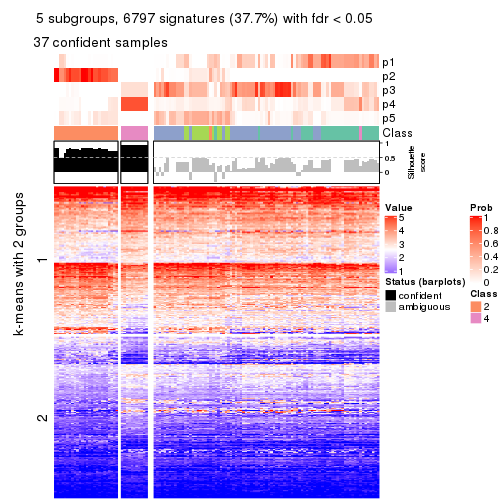</p>

</div>
<div id='tab-MAD-hclust-get-signatures-no-scale-5'>
<pre><code class="r">get_signatures(res, k = 6, scale_rows = FALSE)
</code></pre>

<p></p>

</div>
</div>


Compare the overlap of signatures from different k:

```r
compare_signatures(res)
```


`get_signature()` returns a data frame invisibly. TO get the list of signatures, the function
call should be assigned to a variable explicitly. In following code, if `plot` argument is set
to `FALSE`, no heatmap is plotted while only the differential analysis is performed.

```r
# code only for demonstration
tb = get_signature(res, k = ..., plot = FALSE)
```

An example of the output of `tb` is:

```
#>   which_row         fdr    mean_1    mean_2 scaled_mean_1 scaled_mean_2 km
#> 1        38 0.042760348  8.373488  9.131774    -0.5533452     0.5164555  1
#> 2        40 0.018707592  7.106213  8.469186    -0.6173731     0.5762149  1
#> 3        55 0.019134737 10.221463 11.207825    -0.6159697     0.5749050  1
#> 4        59 0.006059896  5.921854  7.869574    -0.6899429     0.6439467  1
#> 5        60 0.018055526  8.928898 10.211722    -0.6204761     0.5791110  1
#> 6        98 0.009384629 15.714769 14.887706     0.6635654    -0.6193277  2
...
```

The columns in `tb` are:

1. `which_row`: row indices corresponding to the input matrix.
2. `fdr`: FDR for the differential test. 
3. `mean_x`: The mean value in group x.
4. `scaled_mean_x`: The mean value in group x after rows are scaled.
5. `km`: Row groups if k-means clustering is applied to rows.


UMAP plot which shows how samples are separated.


<script>
$( function() {
	$( '#tabs-MAD-hclust-dimension-reduction' ).tabs();
} );
</script>
<div id='tabs-MAD-hclust-dimension-reduction'>
<ul>
<li><a href='#tab-MAD-hclust-dimension-reduction-1'>k = 2</a></li>
<li><a href='#tab-MAD-hclust-dimension-reduction-2'>k = 3</a></li>
<li><a href='#tab-MAD-hclust-dimension-reduction-3'>k = 4</a></li>
<li><a href='#tab-MAD-hclust-dimension-reduction-4'>k = 5</a></li>
<li><a href='#tab-MAD-hclust-dimension-reduction-5'>k = 6</a></li>
</ul>
<div id='tab-MAD-hclust-dimension-reduction-1'>
<pre><code class="r">dimension_reduction(res, k = 2, method = &quot;UMAP&quot;)
</code></pre>

<p></p>

</div>
<div id='tab-MAD-hclust-dimension-reduction-2'>
<pre><code class="r">dimension_reduction(res, k = 3, method = &quot;UMAP&quot;)
</code></pre>

<p></p>

</div>
<div id='tab-MAD-hclust-dimension-reduction-3'>
<pre><code class="r">dimension_reduction(res, k = 4, method = &quot;UMAP&quot;)
</code></pre>

<p></p>

</div>
<div id='tab-MAD-hclust-dimension-reduction-4'>
<pre><code class="r">dimension_reduction(res, k = 5, method = &quot;UMAP&quot;)
</code></pre>

<p></p>

</div>
<div id='tab-MAD-hclust-dimension-reduction-5'>
<pre><code class="r">dimension_reduction(res, k = 6, method = &quot;UMAP&quot;)
</code></pre>

<p></p>

</div>
</div>


Following heatmap shows how subgroups are split when increasing `k`:

```r
collect_classes(res)
```


If matrix rows can be associated to genes, consider to use `GO_Enrichment(res,
...)` to perform function enrichment for the signature genes.


 

---------------------------------------------------


### MAD:kmeans**


The object with results only for a single top-value method and a single partition method 
can be extracted as:

```r
res = res_list["MAD", "kmeans"]
# you can also extract it by
# res = res_list["MAD:kmeans"]
```

A summary of `res` and all the functions that can be applied to it:

```r
res
```

```
#> A 'ConsensusPartition' object with k = 2, 3, 4, 5, 6.
#>   On a matrix with 18041 rows and 126 columns.
#>   Top rows (1000, 2000, 3000, 4000, 5000) are extracted by 'MAD' method.
#>   Subgroups are detected by 'kmeans' method.
#>   Performed in total 1250 partitions by row resampling.
#>   Best k for subgroups seems to be 2.
#> 
#> Following methods can be applied to this 'ConsensusPartition' object:
#>  [1] "cola_report"             "collect_classes"         "collect_plots"          
#>  [4] "collect_stats"           "colnames"                "compare_signatures"     
#>  [7] "consensus_heatmap"       "dimension_reduction"     "functional_enrichment"  
#> [10] "get_anno_col"            "get_anno"                "get_classes"            
#> [13] "get_consensus"           "get_matrix"              "get_membership"         
#> [16] "get_param"               "get_signatures"          "get_stats"              
#> [19] "is_best_k"               "is_stable_k"             "membership_heatmap"     
#> [22] "ncol"                    "nrow"                    "plot_ecdf"              
#> [25] "rownames"                "select_partition_number" "show"                   
#> [28] "suggest_best_k"          "test_to_known_factors"
```

`collect_plots()` function collects all the plots made from `res` for all `k` (number of partitions)
into one single page to provide an easy and fast comparison between different `k`.

```r
collect_plots(res)
```


The plots are:

- The first row: a plot of the ECDF (Empirical cumulative distribution
  function) curves of the consensus matrix for each `k` and the heatmap of
  predicted classes for each `k`.
- The second row: heatmaps of the consensus matrix for each `k`.
- The third row: heatmaps of the membership matrix for each `k`.
- The fouth row: heatmaps of the signatures for each `k`.

All the plots in panels can be made by individual functions and they are
plotted later in this section.

`select_partition_number()` produces several plots showing different
statistics for choosing "optimized" `k`. There are following statistics:

- ECDF curves of the consensus matrix for each `k`;
- 1-PAC. [The PAC
  score](https://en.wikipedia.org/wiki/Consensus_clustering#Over-interpretation_potential_of_consensus_clustering)
  measures the proportion of the ambiguous subgrouping.
- Mean silhouette score.
- Concordance. The mean probability of fiting the consensus class ids in all
  partitions.
- Area increased. Denote $A_k$ as the area under the ECDF curve for current
  `k`, the area increased is defined as $A_k - A_{k-1}$.
- Rand index. The percent of pairs of samples that are both in a same cluster
  or both are not in a same cluster in the partition of k and k-1.
- Jaccard index. The ratio of pairs of samples are both in a same cluster in
  the partition of k and k-1 and the pairs of samples are both in a same
  cluster in the partition k or k-1.

The detailed explanations of these statistics can be found in [the cola
vignette](http://bioconductor.org/packages/devel/bioc/vignettes/cola/inst/doc/cola.html#toc_13).

Generally speaking, lower PAC score, higher mean silhouette score or higher
concordance corresponds to better partition. Rand index and Jaccard index
measure how similar the current partition is compared to partition with `k-1`.
If they are too similar, we won't accept `k` is better than `k-1`.

```r
select_partition_number(res)
```


The numeric values for all these statistics can be obtained by `get_stats()`.

```r
get_stats(res)
```

```
#>   k 1-PAC mean_silhouette concordance area_increased  Rand Jaccard
#> 2 2 0.983           0.948       0.977         0.4738 0.529   0.529
#> 3 3 0.424           0.587       0.799         0.3531 0.711   0.496
#> 4 4 0.495           0.479       0.680         0.1357 0.885   0.685
#> 5 5 0.554           0.467       0.671         0.0759 0.813   0.454
#> 6 6 0.662           0.587       0.734         0.0479 0.891   0.556
```

`suggest_best_k()` suggests the best $k$ based on these statistics. The rules are as follows:

- All $k$ with Jaccard index larger than 0.95 are removed because the increase of
  the partition number does not provides enough extra information. If all $k$ are removed,
  the best $k$ is assigned by `NA`.
- For $k$ with 1-PAC larger than 0.9, the maximal $k$ is taken as the "best k". Other $k$ is called "optional k".
- If it does not fit the second rule. The $k$ with the highest vote of highest
  1-PAC, mean silhouette and concordance is taken as the "best k".

```r
suggest_best_k(res)
```

```
#> [1] 2
```


Following shows the table of the partitions (You need to click the **show/hide
code output** link to see it). The membership matrix (columns with name `p*`)
is inferred by
[`clue::cl_consensus()`](https://www.rdocumentation.org/link/cl_consensus?package=clue)
function with the `SE` method. Basically the value in the membership matrix
represents the probability to belong to a certain group. The finall class
label for an item is determined with the group with highest probability it
belongs to.

In `get_classes()` function, the entropy is calculated from the membership
matrix and the silhouette score is calculated from the consensus matrix.


<script>
$( function() {
	$( '#tabs-MAD-kmeans-get-classes' ).tabs();
} );
</script>
<div id='tabs-MAD-kmeans-get-classes'>
<ul>
<li><a href='#tab-MAD-kmeans-get-classes-1'>k = 2</a></li>
<li><a href='#tab-MAD-kmeans-get-classes-2'>k = 3</a></li>
<li><a href='#tab-MAD-kmeans-get-classes-3'>k = 4</a></li>
<li><a href='#tab-MAD-kmeans-get-classes-4'>k = 5</a></li>
<li><a href='#tab-MAD-kmeans-get-classes-5'>k = 6</a></li>
</ul>

<div id='tab-MAD-kmeans-get-classes-1'>
<p><a id='tab-MAD-kmeans-get-classes-1-a' style='color:#0366d6' href='#'>show/hide code output</a></p>
<pre><code class="r">cbind(get_classes(res, k = 2), get_membership(res, k = 2))
</code></pre>

<pre><code>#&gt;                                      class entropy silhouette    p1    p2
#&gt; DC1F29A2-39DE-44AD-936A-54B2B32D6370     1  0.0000     0.9760 1.000 0.000
#&gt; FA3C3413-FA8C-4A29-B9CA-5BC3A56274A8     2  0.0672     0.9780 0.008 0.992
#&gt; B9B72975-8134-475C-BC0B-0CFDB24F636A     2  0.0376     0.9785 0.004 0.996
#&gt; F44DB757-4D00-4BFC-99C5-AA82F99C5BDA     2  0.0376     0.9785 0.004 0.996
#&gt; 3BD942BB-A3A7-4993-B3F1-B8641626B773     1  0.6887     0.7708 0.816 0.184
#&gt; 431F73A2-2AB3-4101-B610-7FC02A7097EC     1  0.1633     0.9601 0.976 0.024
#&gt; 3067683D-43D4-4F6D-9338-17F6A75E4B25     2  0.2236     0.9547 0.036 0.964
#&gt; 2CE91B81-7CBE-4698-AFEE-6A154313D231     2  0.0672     0.9780 0.008 0.992
#&gt; A639CF4F-4591-4337-A12E-BED71EDDA10B     1  0.0376     0.9751 0.996 0.004
#&gt; 5482053D-9F48-4773-B68A-302B3A612503     1  0.0376     0.9759 0.996 0.004
#&gt; A31D342D-C67C-428B-BAED-C6E844277A09     1  0.0376     0.9751 0.996 0.004
#&gt; 0E9C5985-9AE0-4098-A076-6FFBBDF05110     2  0.0672     0.9780 0.008 0.992
#&gt; 08CCF8A0-15B7-4A13-BC43-6B3B3E2DDE95     2  0.0938     0.9752 0.012 0.988
#&gt; 10577D5B-AD56-403F-A562-73A9ACF2045B     1  0.0376     0.9759 0.996 0.004
#&gt; C940D443-5DDA-4403-868B-7AA6B9A50FC4     1  0.0376     0.9751 0.996 0.004
#&gt; 89D4D945-A717-495F-B253-F5A17CF5B9FA     2  0.0376     0.9767 0.004 0.996
#&gt; DC55EE78-203F-4092-9B83-14B1A529194B     2  0.0376     0.9785 0.004 0.996
#&gt; 8F7368BE-EB41-4192-89AA-9E0428C08851     1  0.0376     0.9759 0.996 0.004
#&gt; F772EA39-E408-4908-BADD-C786D702BF9B     2  0.0376     0.9785 0.004 0.996
#&gt; FD693D10-3ADA-4028-8392-41D2F0296F7E     1  0.0376     0.9759 0.996 0.004
#&gt; 84F16966-7640-49F9-95D1-7648FF74DCC9     2  0.0376     0.9785 0.004 0.996
#&gt; D26DAA2F-AE6A-42E1-9F1F-01943B99785F     2  0.0938     0.9752 0.012 0.988
#&gt; F325847E-F046-4B67-B01C-16919C401020     1  0.0376     0.9751 0.996 0.004
#&gt; 19EB2B10-2529-4A94-8FAE-1CE371A602D9     1  0.0376     0.9751 0.996 0.004
#&gt; B94B9CCF-5FB8-44AE-8D9C-A194C6801A27     2  0.0376     0.9785 0.004 0.996
#&gt; D2678E70-542A-4AB2-B881-12D66DBA44F5     1  0.0376     0.9759 0.996 0.004
#&gt; 4961CA2A-70CD-42AB-A676-4A98C85F449F     2  0.0938     0.9752 0.012 0.988
#&gt; 5AA74C5C-2AD1-4D59-A030-E964EB199581     1  0.0000     0.9760 1.000 0.000
#&gt; F9E11A1B-BD93-438F-9670-6FB7DFF9E910     1  0.0376     0.9751 0.996 0.004
#&gt; FB78CA5A-C8B9-42AF-9DAE-799CAB280B2E     1  0.0376     0.9759 0.996 0.004
#&gt; A8E48877-F8AB-44DD-A18B-194D87C44931     2  0.1184     0.9755 0.016 0.984
#&gt; CA50C495-F37E-4743-867D-FAF2DCC3376A     1  0.0376     0.9751 0.996 0.004
#&gt; 37342369-EC22-4904-8CCD-A0DC6BD8D183     2  0.0376     0.9785 0.004 0.996
#&gt; 91BA5F90-9174-4533-A050-39A28E34A94D     1  0.0376     0.9759 0.996 0.004
#&gt; 5BC371AC-1915-44E9-A114-2963E131EC8D     1  0.0000     0.9760 1.000 0.000
#&gt; 74A6C31A-7F21-45AF-A170-18C326D2AE69     1  0.0376     0.9759 0.996 0.004
#&gt; 984F27EF-D4D7-4E68-BD64-776FDFC04D07     1  0.0376     0.9759 0.996 0.004
#&gt; B05701C5-8C44-4FD1-94C9-FC0255A2EA24     1  0.0376     0.9751 0.996 0.004
#&gt; 91E4119C-2CE6-4447-A125-6A4F403A89E6     2  0.1633     0.9661 0.024 0.976
#&gt; 1570FCE7-F1B4-4BDF-A398-355EDF030864     2  0.0376     0.9785 0.004 0.996
#&gt; 604C06E9-A00E-435E-847A-3992922A5C56     1  0.0376     0.9751 0.996 0.004
#&gt; 455C9007-6FF4-4D63-83FA-4915F0331F9A     1  0.0376     0.9759 0.996 0.004
#&gt; FB8BD3CF-D2EC-47B6-B67F-65ADC1C3A6A7     2  0.0938     0.9752 0.012 0.988
#&gt; 9DC7443A-3C8F-4025-8312-3C98BF28D736     1  0.0376     0.9759 0.996 0.004
#&gt; CB207A52-09AC-49D3-8240-5840CDFBB154     1  0.0376     0.9759 0.996 0.004
#&gt; 2A335049-AD9F-4B32-92B7-69B04B0CF2BA     1  0.0376     0.9751 0.996 0.004
#&gt; 6ACA6293-371E-428D-BBAE-ABFD410C886F     2  0.1184     0.9755 0.016 0.984
#&gt; E8929929-73F9-4DB7-ABBA-0852BEFFFF7E     1  0.0376     0.9751 0.996 0.004
#&gt; 5E343116-414B-41F2-AAEE-A3225450135A     1  0.0000     0.9760 1.000 0.000
#&gt; 0A39073C-157C-48A1-B125-A6A04CB738DA     2  0.0938     0.9752 0.012 0.988
#&gt; 300D78E6-1C7E-4114-80EA-9204A6818B9A     1  0.0000     0.9760 1.000 0.000
#&gt; DAAF55AA-ED48-4221-9CD6-D1DEB6376017     1  0.0376     0.9759 0.996 0.004
#&gt; D76FCF4A-4ACF-41EF-A120-64136D6C845E     1  0.6531     0.7931 0.832 0.168
#&gt; AD294665-6F90-459C-90D5-3058F210225D     1  0.0000     0.9760 1.000 0.000
#&gt; 92E8AD7A-1084-44C8-BDC0-FE4E47B6143F     2  0.8499     0.6098 0.276 0.724
#&gt; 5644A861-3C59-486D-8FBE-4DF6A3B19558     1  0.0376     0.9759 0.996 0.004
#&gt; 1BF8AAE7-B771-4CF2-8B1C-D2BEB5E6579E     1  0.0376     0.9759 0.996 0.004
#&gt; A54731AE-FC40-407F-8D10-67DDC122237D     2  0.0376     0.9767 0.004 0.996
#&gt; 179DC906-5654-4CBA-9C27-C9560B5F12DE     1  0.0000     0.9760 1.000 0.000
#&gt; 979B9A2B-2D81-47C3-A553-9B9441CAAE47     1  0.0000     0.9760 1.000 0.000
#&gt; D69BD86A-08FB-49DA-9084-2725F6C9195F     1  0.0376     0.9759 0.996 0.004
#&gt; 84611033-BCF7-49D7-9B91-DA29B62AC8D3     1  0.0000     0.9760 1.000 0.000
#&gt; 8AA1DA3E-8C00-4653-AA33-EA70531C1E50     2  0.0376     0.9785 0.004 0.996
#&gt; CEBE9594-0F19-46B4-AF7D-F8DF33E00AFB     1  0.0376     0.9759 0.996 0.004
#&gt; C68E82D2-2BD3-41E9-92D7-D4C06E1953B2     1  0.0376     0.9743 0.996 0.004
#&gt; B855EF89-1E76-4408-AA65-61A0F0A4F412     2  0.0376     0.9785 0.004 0.996
#&gt; 4488EFB3-5B01-41E3-B57E-8E4F607CF448     1  0.0000     0.9760 1.000 0.000
#&gt; C2BD8440-CAC6-4FE5-8EBB-5E6AE308D52F     1  0.0376     0.9751 0.996 0.004
#&gt; E0E50F10-1FED-41C1-84DB-81A46F25D7E9     1  0.0376     0.9759 0.996 0.004
#&gt; EE16D845-31F2-4178-800B-CA2C358841AD     2  0.0376     0.9785 0.004 0.996
#&gt; 169828CF-5693-4A46-B5D7-E45CBA9DF317     2  0.0376     0.9785 0.004 0.996
#&gt; 51077BA3-AEE0-4BD4-A1B1-1B0A811642A1     1  0.0376     0.9759 0.996 0.004
#&gt; D2F4E240-C44C-4CF7-8016-6CACD370D093     1  0.0376     0.9759 0.996 0.004
#&gt; 721CDBE6-FC85-4C30-B23E-28407340286F     1  0.0376     0.9751 0.996 0.004
#&gt; 392897E4-6009-422C-B461-649F4DDF260C     1  0.0376     0.9751 0.996 0.004
#&gt; 617E13D2-6924-45F8-A8DE-BE21B718F822     1  0.0376     0.9759 0.996 0.004
#&gt; 5746C00F-9CBB-46B7-83FD-90B2AB3F507B     1  0.0376     0.9751 0.996 0.004
#&gt; 982B4344-A223-4D1F-9485-2E56F9FD45C0     2  0.0376     0.9785 0.004 0.996
#&gt; E5557F52-015D-49DC-9E23-989FC259976F     1  0.0376     0.9751 0.996 0.004
#&gt; F3135F5E-2E90-4923-B634-E994563D17B7     1  0.0376     0.9751 0.996 0.004
#&gt; D1ED15A5-9802-4314-B556-E89EB772D1F0     1  0.0376     0.9751 0.996 0.004
#&gt; 222B06E3-FCFB-4104-92C3-D73BC31854D4     1  0.0376     0.9759 0.996 0.004
#&gt; 4C810FFA-ED07-4F4C-9F81-B8F1CF4956F7     2  0.0938     0.9756 0.012 0.988
#&gt; 9A608964-ED12-4E6E-9D3A-430F59FFF65B     1  0.0376     0.9751 0.996 0.004
#&gt; 4087357F-C17A-4992-A8AB-41ACA2F72001     1  0.0376     0.9759 0.996 0.004
#&gt; B3F013A5-BCB8-4CE0-86B2-634EE180AA6E     2  0.0376     0.9785 0.004 0.996
#&gt; 322AF320-1379-4F51-AFDC-5292A060CD52     2  0.0376     0.9785 0.004 0.996
#&gt; 53A96249-66D5-4C26-893B-ADC71481D261     2  0.0376     0.9767 0.004 0.996
#&gt; 1AB7A6F2-14BD-447C-B2E3-DEB0CE56B209     1  0.0376     0.9759 0.996 0.004
#&gt; 8B4BCDA0-6787-4A55-99F7-AAF22AF85BA6     2  0.0376     0.9767 0.004 0.996
#&gt; 5D9D9E08-2C2C-414E-9547-62799F90D543     2  0.0376     0.9785 0.004 0.996
#&gt; C345CD17-E4F4-41D5-9891-FEFB19342C52     1  0.0376     0.9751 0.996 0.004
#&gt; 1AF8FDE1-1A74-41F6-A1C5-4952CDFB7D3F     1  0.0000     0.9760 1.000 0.000
#&gt; BC3405FF-0660-4B2B-8DC1-5F34D3133078     1  0.0000     0.9760 1.000 0.000
#&gt; C2662596-6E2F-4924-B051-CEA1AC87B197     1  0.0376     0.9759 0.996 0.004
#&gt; 39AE85F7-49FB-4438-BD41-6AC812FA1C72     1  0.0000     0.9760 1.000 0.000
#&gt; 6FF266DB-3F08-43F2-8F6F-679F805B80B8     1  0.9815     0.2811 0.580 0.420
#&gt; B03B7B81-BBD6-4194-BC5E-6EDF0D3F015A     1  0.0000     0.9760 1.000 0.000
#&gt; C7617D56-F13C-4C43-906C-BD458C5DC4CD     1  0.0376     0.9759 0.996 0.004
#&gt; 09420F8B-7A71-4B32-8388-4767670F1FEB     1  0.0376     0.9759 0.996 0.004
#&gt; 6AF47534-74FF-4128-865B-4E8EE1FFB469     2  0.0376     0.9767 0.004 0.996
#&gt; 8FF9E94A-2ED2-4727-947F-D524D7ECE815     1  0.0376     0.9759 0.996 0.004
#&gt; A390E20D-03F9-40E4-A132-0FA5C2BEDB63     1  0.0376     0.9759 0.996 0.004
#&gt; A489CCCA-1374-4071-80CE-05B83C9A0D5E     2  0.0672     0.9765 0.008 0.992
#&gt; 2D962371-EC83-490C-A663-478AF383BC1B     2  0.0376     0.9785 0.004 0.996
#&gt; D91B31A1-EE71-4726-B94C-0CC2815E9D4E     2  0.9881     0.2025 0.436 0.564
#&gt; E0123C5C-E1D1-4162-9895-CC8B01949D84     2  0.0938     0.9752 0.012 0.988
#&gt; EC73959A-2728-49FE-B72A-790BB14F4CBF     1  0.0376     0.9759 0.996 0.004
#&gt; A60DC925-7343-496E-900D-0DD81D5C8123     1  0.9993     0.0676 0.516 0.484
#&gt; 659B64DB-F4A5-43BD-811B-05004CB49D99     1  0.0376     0.9759 0.996 0.004
#&gt; 6969B6B2-7616-4664-9696-C4DACD10537B     2  0.0376     0.9785 0.004 0.996
#&gt; 2F6392DE-0D54-4768-B062-907C81E5B0CC     1  0.6801     0.7764 0.820 0.180
#&gt; C74BE8C5-BA6D-4596-9D67-3C731799F999     1  0.0376     0.9759 0.996 0.004
#&gt; 79A7647F-BDBA-45A2-B207-ABF788F6CC95     1  0.0376     0.9751 0.996 0.004
#&gt; D47D0433-2313-4A2F-B268-5AD293D7534E     2  0.0376     0.9785 0.004 0.996
#&gt; C5058B93-C1DA-43B9-9951-B23A9810AA6E     1  0.5408     0.8494 0.876 0.124
#&gt; 2629FEE3-A203-4411-8A70-02A796C9505C     2  0.0938     0.9752 0.012 0.988
#&gt; 1AF329E4-11D4-4CFC-801F-C24A1EA33102     2  0.0672     0.9780 0.008 0.992
#&gt; D453BEF8-3F18-4B89-BA42-CE74EB105032     1  0.0376     0.9751 0.996 0.004
#&gt; B12A4446-2310-4139-897F-CA030478CBD5     1  0.0376     0.9751 0.996 0.004
#&gt; BCAB1918-5FA9-4CBD-85CB-008743FEA2CC     1  0.0376     0.9751 0.996 0.004
#&gt; 9A5432D3-19EE-47B4-BD88-698DEC75A5E9     2  0.0376     0.9785 0.004 0.996
#&gt; A608BCEB-2C27-4927-A308-E6975F641722     2  0.0672     0.9780 0.008 0.992
#&gt; E4752275-7BF6-4C1E-8A45-C7D571ED85AD     2  0.0376     0.9785 0.004 0.996
#&gt; FDEC1714-C02D-4AB7-AE82-789E9D709EDE     1  0.0000     0.9760 1.000 0.000
#&gt; 33737781-8638-4FA2-AD4C-E888BB9343D8     2  0.0938     0.9752 0.012 0.988
</code></pre>

<script>
$('#tab-MAD-kmeans-get-classes-1-a').parent().next().next().hide();
$('#tab-MAD-kmeans-get-classes-1-a').click(function(){
  $('#tab-MAD-kmeans-get-classes-1-a').parent().next().next().toggle();
  return(false);
});
</script>
</div>

<div id='tab-MAD-kmeans-get-classes-2'>
<p><a id='tab-MAD-kmeans-get-classes-2-a' style='color:#0366d6' href='#'>show/hide code output</a></p>
<pre><code class="r">cbind(get_classes(res, k = 3), get_membership(res, k = 3))
</code></pre>

<pre><code>#&gt;                                      class entropy silhouette    p1    p2    p3
#&gt; DC1F29A2-39DE-44AD-936A-54B2B32D6370     3  0.6026     0.0693 0.376 0.000 0.624
#&gt; FA3C3413-FA8C-4A29-B9CA-5BC3A56274A8     2  0.5760     0.5558 0.000 0.672 0.328
#&gt; B9B72975-8134-475C-BC0B-0CFDB24F636A     2  0.0000     0.8600 0.000 1.000 0.000
#&gt; F44DB757-4D00-4BFC-99C5-AA82F99C5BDA     2  0.3989     0.7728 0.124 0.864 0.012
#&gt; 3BD942BB-A3A7-4993-B3F1-B8641626B773     3  0.5200     0.5700 0.184 0.020 0.796
#&gt; 431F73A2-2AB3-4101-B610-7FC02A7097EC     3  0.3038     0.6256 0.104 0.000 0.896
#&gt; 3067683D-43D4-4F6D-9338-17F6A75E4B25     3  0.7104     0.5386 0.140 0.136 0.724
#&gt; 2CE91B81-7CBE-4698-AFEE-6A154313D231     2  0.5178     0.6531 0.000 0.744 0.256
#&gt; A639CF4F-4591-4337-A12E-BED71EDDA10B     3  0.0747     0.6790 0.016 0.000 0.984
#&gt; 5482053D-9F48-4773-B68A-302B3A612503     1  0.6062     0.5737 0.616 0.000 0.384
#&gt; A31D342D-C67C-428B-BAED-C6E844277A09     3  0.3752     0.6000 0.144 0.000 0.856
#&gt; 0E9C5985-9AE0-4098-A076-6FFBBDF05110     2  0.4874     0.7474 0.144 0.828 0.028
#&gt; 08CCF8A0-15B7-4A13-BC43-6B3B3E2DDE95     3  0.5678     0.3658 0.000 0.316 0.684
#&gt; 10577D5B-AD56-403F-A562-73A9ACF2045B     1  0.3879     0.7025 0.848 0.000 0.152
#&gt; C940D443-5DDA-4403-868B-7AA6B9A50FC4     3  0.0747     0.6790 0.016 0.000 0.984
#&gt; 89D4D945-A717-495F-B253-F5A17CF5B9FA     2  0.4937     0.7533 0.028 0.824 0.148
#&gt; DC55EE78-203F-4092-9B83-14B1A529194B     2  0.0000     0.8600 0.000 1.000 0.000
#&gt; 8F7368BE-EB41-4192-89AA-9E0428C08851     1  0.3752     0.7056 0.856 0.000 0.144
#&gt; F772EA39-E408-4908-BADD-C786D702BF9B     2  0.0424     0.8596 0.000 0.992 0.008
#&gt; FD693D10-3ADA-4028-8392-41D2F0296F7E     1  0.4121     0.6951 0.832 0.000 0.168
#&gt; 84F16966-7640-49F9-95D1-7648FF74DCC9     2  0.0000     0.8600 0.000 1.000 0.000
#&gt; D26DAA2F-AE6A-42E1-9F1F-01943B99785F     3  0.5706     0.3617 0.000 0.320 0.680
#&gt; F325847E-F046-4B67-B01C-16919C401020     3  0.4654     0.5356 0.208 0.000 0.792
#&gt; 19EB2B10-2529-4A94-8FAE-1CE371A602D9     3  0.4702     0.4706 0.212 0.000 0.788
#&gt; B94B9CCF-5FB8-44AE-8D9C-A194C6801A27     2  0.0424     0.8596 0.000 0.992 0.008
#&gt; D2678E70-542A-4AB2-B881-12D66DBA44F5     1  0.4121     0.6951 0.832 0.000 0.168
#&gt; 4961CA2A-70CD-42AB-A676-4A98C85F449F     3  0.4291     0.5948 0.000 0.180 0.820
#&gt; 5AA74C5C-2AD1-4D59-A030-E964EB199581     1  0.5291     0.6337 0.732 0.000 0.268
#&gt; F9E11A1B-BD93-438F-9670-6FB7DFF9E910     1  0.6308     0.1984 0.508 0.000 0.492
#&gt; FB78CA5A-C8B9-42AF-9DAE-799CAB280B2E     1  0.3752     0.7056 0.856 0.000 0.144
#&gt; A8E48877-F8AB-44DD-A18B-194D87C44931     2  0.6286     0.2667 0.000 0.536 0.464
#&gt; CA50C495-F37E-4743-867D-FAF2DCC3376A     3  0.0592     0.6783 0.012 0.000 0.988
#&gt; 37342369-EC22-4904-8CCD-A0DC6BD8D183     2  0.0424     0.8596 0.000 0.992 0.008
#&gt; 91BA5F90-9174-4533-A050-39A28E34A94D     1  0.6062     0.5737 0.616 0.000 0.384
#&gt; 5BC371AC-1915-44E9-A114-2963E131EC8D     3  0.6225    -0.0837 0.432 0.000 0.568
#&gt; 74A6C31A-7F21-45AF-A170-18C326D2AE69     1  0.5016     0.7074 0.760 0.000 0.240
#&gt; 984F27EF-D4D7-4E68-BD64-776FDFC04D07     1  0.4002     0.6955 0.840 0.000 0.160
#&gt; B05701C5-8C44-4FD1-94C9-FC0255A2EA24     3  0.0747     0.6790 0.016 0.000 0.984
#&gt; 91E4119C-2CE6-4447-A125-6A4F403A89E6     3  0.5363     0.4407 0.000 0.276 0.724
#&gt; 1570FCE7-F1B4-4BDF-A398-355EDF030864     2  0.0000     0.8600 0.000 1.000 0.000
#&gt; 604C06E9-A00E-435E-847A-3992922A5C56     3  0.0747     0.6790 0.016 0.000 0.984
#&gt; 455C9007-6FF4-4D63-83FA-4915F0331F9A     1  0.4121     0.6951 0.832 0.000 0.168
#&gt; FB8BD3CF-D2EC-47B6-B67F-65ADC1C3A6A7     3  0.5650     0.3729 0.000 0.312 0.688
#&gt; 9DC7443A-3C8F-4025-8312-3C98BF28D736     1  0.4121     0.6951 0.832 0.000 0.168
#&gt; CB207A52-09AC-49D3-8240-5840CDFBB154     1  0.6079     0.5952 0.612 0.000 0.388
#&gt; 2A335049-AD9F-4B32-92B7-69B04B0CF2BA     1  0.6204     0.3729 0.576 0.000 0.424
#&gt; 6ACA6293-371E-428D-BBAE-ABFD410C886F     2  0.6286     0.2667 0.000 0.536 0.464
#&gt; E8929929-73F9-4DB7-ABBA-0852BEFFFF7E     3  0.0747     0.6790 0.016 0.000 0.984
#&gt; 5E343116-414B-41F2-AAEE-A3225450135A     3  0.4750     0.5168 0.216 0.000 0.784
#&gt; 0A39073C-157C-48A1-B125-A6A04CB738DA     3  0.5835     0.3329 0.000 0.340 0.660
#&gt; 300D78E6-1C7E-4114-80EA-9204A6818B9A     1  0.5254     0.6344 0.736 0.000 0.264
#&gt; DAAF55AA-ED48-4221-9CD6-D1DEB6376017     1  0.2796     0.7017 0.908 0.000 0.092
#&gt; D76FCF4A-4ACF-41EF-A120-64136D6C845E     3  0.6859     0.1446 0.420 0.016 0.564
#&gt; AD294665-6F90-459C-90D5-3058F210225D     1  0.5497     0.5845 0.708 0.000 0.292
#&gt; 92E8AD7A-1084-44C8-BDC0-FE4E47B6143F     2  0.7181     0.5135 0.304 0.648 0.048
#&gt; 5644A861-3C59-486D-8FBE-4DF6A3B19558     1  0.5098     0.7035 0.752 0.000 0.248
#&gt; 1BF8AAE7-B771-4CF2-8B1C-D2BEB5E6579E     1  0.1031     0.6611 0.976 0.000 0.024
#&gt; A54731AE-FC40-407F-8D10-67DDC122237D     2  0.0237     0.8594 0.000 0.996 0.004
#&gt; 179DC906-5654-4CBA-9C27-C9560B5F12DE     3  0.6062     0.1252 0.384 0.000 0.616
#&gt; 979B9A2B-2D81-47C3-A553-9B9441CAAE47     3  0.6204    -0.0541 0.424 0.000 0.576
#&gt; D69BD86A-08FB-49DA-9084-2725F6C9195F     1  0.6062     0.5737 0.616 0.000 0.384
#&gt; 84611033-BCF7-49D7-9B91-DA29B62AC8D3     1  0.6299     0.2395 0.524 0.000 0.476
#&gt; 8AA1DA3E-8C00-4653-AA33-EA70531C1E50     2  0.0424     0.8596 0.000 0.992 0.008
#&gt; CEBE9594-0F19-46B4-AF7D-F8DF33E00AFB     1  0.4887     0.7162 0.772 0.000 0.228
#&gt; C68E82D2-2BD3-41E9-92D7-D4C06E1953B2     3  0.4575     0.5742 0.184 0.004 0.812
#&gt; B855EF89-1E76-4408-AA65-61A0F0A4F412     2  0.0000     0.8600 0.000 1.000 0.000
#&gt; 4488EFB3-5B01-41E3-B57E-8E4F607CF448     1  0.5560     0.5771 0.700 0.000 0.300
#&gt; C2BD8440-CAC6-4FE5-8EBB-5E6AE308D52F     3  0.4399     0.5290 0.188 0.000 0.812
#&gt; E0E50F10-1FED-41C1-84DB-81A46F25D7E9     1  0.4062     0.6938 0.836 0.000 0.164
#&gt; EE16D845-31F2-4178-800B-CA2C358841AD     2  0.0424     0.8596 0.000 0.992 0.008
#&gt; 169828CF-5693-4A46-B5D7-E45CBA9DF317     2  0.0424     0.8596 0.000 0.992 0.008
#&gt; 51077BA3-AEE0-4BD4-A1B1-1B0A811642A1     1  0.5098     0.7035 0.752 0.000 0.248
#&gt; D2F4E240-C44C-4CF7-8016-6CACD370D093     1  0.3941     0.7014 0.844 0.000 0.156
#&gt; 721CDBE6-FC85-4C30-B23E-28407340286F     3  0.0592     0.6785 0.012 0.000 0.988
#&gt; 392897E4-6009-422C-B461-649F4DDF260C     3  0.0892     0.6780 0.020 0.000 0.980
#&gt; 617E13D2-6924-45F8-A8DE-BE21B718F822     1  0.4121     0.6951 0.832 0.000 0.168
#&gt; 5746C00F-9CBB-46B7-83FD-90B2AB3F507B     1  0.5882     0.5140 0.652 0.000 0.348
#&gt; 982B4344-A223-4D1F-9485-2E56F9FD45C0     2  0.0000     0.8600 0.000 1.000 0.000
#&gt; E5557F52-015D-49DC-9E23-989FC259976F     3  0.1529     0.6690 0.040 0.000 0.960
#&gt; F3135F5E-2E90-4923-B634-E994563D17B7     3  0.0747     0.6790 0.016 0.000 0.984
#&gt; D1ED15A5-9802-4314-B556-E89EB772D1F0     3  0.5138     0.4457 0.252 0.000 0.748
#&gt; 222B06E3-FCFB-4104-92C3-D73BC31854D4     1  0.2878     0.7027 0.904 0.000 0.096
#&gt; 4C810FFA-ED07-4F4C-9F81-B8F1CF4956F7     3  0.9736     0.1503 0.356 0.228 0.416
#&gt; 9A608964-ED12-4E6E-9D3A-430F59FFF65B     3  0.0747     0.6790 0.016 0.000 0.984
#&gt; 4087357F-C17A-4992-A8AB-41ACA2F72001     1  0.4121     0.6951 0.832 0.000 0.168
#&gt; B3F013A5-BCB8-4CE0-86B2-634EE180AA6E     2  0.0000     0.8600 0.000 1.000 0.000
#&gt; 322AF320-1379-4F51-AFDC-5292A060CD52     2  0.0237     0.8594 0.000 0.996 0.004
#&gt; 53A96249-66D5-4C26-893B-ADC71481D261     2  0.5529     0.5949 0.000 0.704 0.296
#&gt; 1AB7A6F2-14BD-447C-B2E3-DEB0CE56B209     1  0.3752     0.7056 0.856 0.000 0.144
#&gt; 8B4BCDA0-6787-4A55-99F7-AAF22AF85BA6     2  0.0000     0.8600 0.000 1.000 0.000
#&gt; 5D9D9E08-2C2C-414E-9547-62799F90D543     2  0.0424     0.8596 0.000 0.992 0.008
#&gt; C345CD17-E4F4-41D5-9891-FEFB19342C52     1  0.6299     0.2445 0.524 0.000 0.476
#&gt; 1AF8FDE1-1A74-41F6-A1C5-4952CDFB7D3F     1  0.5216     0.6355 0.740 0.000 0.260
#&gt; BC3405FF-0660-4B2B-8DC1-5F34D3133078     3  0.4235     0.5784 0.176 0.000 0.824
#&gt; C2662596-6E2F-4924-B051-CEA1AC87B197     1  0.5560     0.6828 0.700 0.000 0.300
#&gt; 39AE85F7-49FB-4438-BD41-6AC812FA1C72     3  0.6045     0.0912 0.380 0.000 0.620
#&gt; 6FF266DB-3F08-43F2-8F6F-679F805B80B8     3  0.7633     0.5131 0.120 0.200 0.680
#&gt; B03B7B81-BBD6-4194-BC5E-6EDF0D3F015A     3  0.4555     0.5517 0.200 0.000 0.800
#&gt; C7617D56-F13C-4C43-906C-BD458C5DC4CD     3  0.6126     0.0460 0.400 0.000 0.600
#&gt; 09420F8B-7A71-4B32-8388-4767670F1FEB     1  0.6062     0.5737 0.616 0.000 0.384
#&gt; 6AF47534-74FF-4128-865B-4E8EE1FFB469     2  0.0237     0.8594 0.000 0.996 0.004
#&gt; 8FF9E94A-2ED2-4727-947F-D524D7ECE815     1  0.2878     0.7040 0.904 0.000 0.096
#&gt; A390E20D-03F9-40E4-A132-0FA5C2BEDB63     1  0.4121     0.6951 0.832 0.000 0.168
#&gt; A489CCCA-1374-4071-80CE-05B83C9A0D5E     2  0.6286     0.2667 0.000 0.536 0.464
#&gt; 2D962371-EC83-490C-A663-478AF383BC1B     2  0.0424     0.8596 0.000 0.992 0.008
#&gt; D91B31A1-EE71-4726-B94C-0CC2815E9D4E     2  0.8179     0.1555 0.424 0.504 0.072
#&gt; E0123C5C-E1D1-4162-9895-CC8B01949D84     3  0.5650     0.3729 0.000 0.312 0.688
#&gt; EC73959A-2728-49FE-B72A-790BB14F4CBF     1  0.5098     0.7035 0.752 0.000 0.248
#&gt; A60DC925-7343-496E-900D-0DD81D5C8123     1  0.7083     0.1776 0.592 0.380 0.028
#&gt; 659B64DB-F4A5-43BD-811B-05004CB49D99     1  0.5968     0.6074 0.636 0.000 0.364
#&gt; 6969B6B2-7616-4664-9696-C4DACD10537B     2  0.0424     0.8596 0.000 0.992 0.008
#&gt; 2F6392DE-0D54-4768-B062-907C81E5B0CC     3  0.5092     0.5670 0.176 0.020 0.804
#&gt; C74BE8C5-BA6D-4596-9D67-3C731799F999     1  0.4121     0.6951 0.832 0.000 0.168
#&gt; 79A7647F-BDBA-45A2-B207-ABF788F6CC95     3  0.1753     0.6646 0.048 0.000 0.952
#&gt; D47D0433-2313-4A2F-B268-5AD293D7534E     2  0.0000     0.8600 0.000 1.000 0.000
#&gt; C5058B93-C1DA-43B9-9951-B23A9810AA6E     1  0.7069     0.1663 0.508 0.020 0.472
#&gt; 2629FEE3-A203-4411-8A70-02A796C9505C     3  0.5216     0.4703 0.000 0.260 0.740
#&gt; 1AF329E4-11D4-4CFC-801F-C24A1EA33102     2  0.2681     0.8346 0.028 0.932 0.040
#&gt; D453BEF8-3F18-4B89-BA42-CE74EB105032     3  0.6026     0.2024 0.376 0.000 0.624
#&gt; B12A4446-2310-4139-897F-CA030478CBD5     3  0.0592     0.6785 0.012 0.000 0.988
#&gt; BCAB1918-5FA9-4CBD-85CB-008743FEA2CC     3  0.0592     0.6785 0.012 0.000 0.988
#&gt; 9A5432D3-19EE-47B4-BD88-698DEC75A5E9     2  0.5650     0.5719 0.000 0.688 0.312
#&gt; A608BCEB-2C27-4927-A308-E6975F641722     2  0.0424     0.8594 0.000 0.992 0.008
#&gt; E4752275-7BF6-4C1E-8A45-C7D571ED85AD     2  0.0000     0.8600 0.000 1.000 0.000
#&gt; FDEC1714-C02D-4AB7-AE82-789E9D709EDE     3  0.6154     0.0161 0.408 0.000 0.592
#&gt; 33737781-8638-4FA2-AD4C-E888BB9343D8     2  0.6308     0.1785 0.000 0.508 0.492
</code></pre>

<script>
$('#tab-MAD-kmeans-get-classes-2-a').parent().next().next().hide();
$('#tab-MAD-kmeans-get-classes-2-a').click(function(){
  $('#tab-MAD-kmeans-get-classes-2-a').parent().next().next().toggle();
  return(false);
});
</script>
</div>

<div id='tab-MAD-kmeans-get-classes-3'>
<p><a id='tab-MAD-kmeans-get-classes-3-a' style='color:#0366d6' href='#'>show/hide code output</a></p>
<pre><code class="r">cbind(get_classes(res, k = 4), get_membership(res, k = 4))
</code></pre>

<pre><code>#&gt;                                      class entropy silhouette    p1    p2    p3    p4
#&gt; DC1F29A2-39DE-44AD-936A-54B2B32D6370     3  0.7205     0.0482 0.344 0.000 0.504 0.152
#&gt; FA3C3413-FA8C-4A29-B9CA-5BC3A56274A8     2  0.7748     0.1628 0.000 0.436 0.304 0.260
#&gt; B9B72975-8134-475C-BC0B-0CFDB24F636A     2  0.1576     0.8394 0.004 0.948 0.000 0.048
#&gt; F44DB757-4D00-4BFC-99C5-AA82F99C5BDA     2  0.3925     0.7020 0.176 0.808 0.000 0.016
#&gt; 3BD942BB-A3A7-4993-B3F1-B8641626B773     3  0.7375     0.3738 0.176 0.000 0.488 0.336
#&gt; 431F73A2-2AB3-4101-B610-7FC02A7097EC     3  0.5200     0.5865 0.072 0.000 0.744 0.184
#&gt; 3067683D-43D4-4F6D-9338-17F6A75E4B25     3  0.7937     0.3982 0.224 0.024 0.524 0.228
#&gt; 2CE91B81-7CBE-4698-AFEE-6A154313D231     2  0.7372     0.3753 0.000 0.524 0.236 0.240
#&gt; A639CF4F-4591-4337-A12E-BED71EDDA10B     3  0.0927     0.6223 0.016 0.000 0.976 0.008
#&gt; 5482053D-9F48-4773-B68A-302B3A612503     1  0.6996     0.2052 0.580 0.000 0.228 0.192
#&gt; A31D342D-C67C-428B-BAED-C6E844277A09     3  0.4094     0.5530 0.116 0.000 0.828 0.056
#&gt; 0E9C5985-9AE0-4098-A076-6FFBBDF05110     2  0.7482     0.4235 0.316 0.504 0.004 0.176
#&gt; 08CCF8A0-15B7-4A13-BC43-6B3B3E2DDE95     3  0.5279     0.5785 0.000 0.072 0.736 0.192
#&gt; 10577D5B-AD56-403F-A562-73A9ACF2045B     1  0.1406     0.3993 0.960 0.000 0.024 0.016
#&gt; C940D443-5DDA-4403-868B-7AA6B9A50FC4     3  0.1356     0.6151 0.032 0.000 0.960 0.008
#&gt; 89D4D945-A717-495F-B253-F5A17CF5B9FA     2  0.8258     0.4961 0.080 0.556 0.156 0.208
#&gt; DC55EE78-203F-4092-9B83-14B1A529194B     2  0.0657     0.8457 0.004 0.984 0.000 0.012
#&gt; 8F7368BE-EB41-4192-89AA-9E0428C08851     1  0.2089     0.3851 0.932 0.000 0.020 0.048
#&gt; F772EA39-E408-4908-BADD-C786D702BF9B     2  0.0707     0.8464 0.000 0.980 0.000 0.020
#&gt; FD693D10-3ADA-4028-8392-41D2F0296F7E     4  0.5790     0.9505 0.340 0.000 0.044 0.616
#&gt; 84F16966-7640-49F9-95D1-7648FF74DCC9     2  0.0336     0.8463 0.000 0.992 0.000 0.008
#&gt; D26DAA2F-AE6A-42E1-9F1F-01943B99785F     3  0.5240     0.5809 0.000 0.072 0.740 0.188
#&gt; F325847E-F046-4B67-B01C-16919C401020     3  0.5700     0.1120 0.412 0.000 0.560 0.028
#&gt; 19EB2B10-2529-4A94-8FAE-1CE371A602D9     3  0.3498     0.5089 0.160 0.000 0.832 0.008
#&gt; B94B9CCF-5FB8-44AE-8D9C-A194C6801A27     2  0.1022     0.8445 0.000 0.968 0.000 0.032
#&gt; D2678E70-542A-4AB2-B881-12D66DBA44F5     4  0.5790     0.9505 0.340 0.000 0.044 0.616
#&gt; 4961CA2A-70CD-42AB-A676-4A98C85F449F     3  0.3626     0.6017 0.000 0.004 0.812 0.184
#&gt; 5AA74C5C-2AD1-4D59-A030-E964EB199581     1  0.3570     0.4425 0.860 0.000 0.092 0.048
#&gt; F9E11A1B-BD93-438F-9670-6FB7DFF9E910     1  0.5766     0.2200 0.564 0.000 0.404 0.032
#&gt; FB78CA5A-C8B9-42AF-9DAE-799CAB280B2E     1  0.2060     0.3787 0.932 0.000 0.016 0.052
#&gt; A8E48877-F8AB-44DD-A18B-194D87C44931     3  0.7828     0.1044 0.000 0.340 0.396 0.264
#&gt; CA50C495-F37E-4743-867D-FAF2DCC3376A     3  0.1022     0.6278 0.000 0.000 0.968 0.032
#&gt; 37342369-EC22-4904-8CCD-A0DC6BD8D183     2  0.1118     0.8439 0.000 0.964 0.000 0.036
#&gt; 91BA5F90-9174-4533-A050-39A28E34A94D     1  0.6969     0.2058 0.584 0.000 0.224 0.192
#&gt; 5BC371AC-1915-44E9-A114-2963E131EC8D     3  0.7911    -0.1177 0.348 0.000 0.348 0.304
#&gt; 74A6C31A-7F21-45AF-A170-18C326D2AE69     1  0.6275     0.0269 0.640 0.000 0.104 0.256
#&gt; 984F27EF-D4D7-4E68-BD64-776FDFC04D07     4  0.5790     0.9505 0.340 0.000 0.044 0.616
#&gt; B05701C5-8C44-4FD1-94C9-FC0255A2EA24     3  0.0657     0.6236 0.012 0.000 0.984 0.004
#&gt; 91E4119C-2CE6-4447-A125-6A4F403A89E6     3  0.6281     0.5654 0.020 0.068 0.672 0.240
#&gt; 1570FCE7-F1B4-4BDF-A398-355EDF030864     2  0.1109     0.8445 0.004 0.968 0.000 0.028
#&gt; 604C06E9-A00E-435E-847A-3992922A5C56     3  0.0469     0.6244 0.012 0.000 0.988 0.000
#&gt; 455C9007-6FF4-4D63-83FA-4915F0331F9A     4  0.5790     0.9505 0.340 0.000 0.044 0.616
#&gt; FB8BD3CF-D2EC-47B6-B67F-65ADC1C3A6A7     3  0.5318     0.5766 0.000 0.072 0.732 0.196
#&gt; 9DC7443A-3C8F-4025-8312-3C98BF28D736     4  0.5790     0.9505 0.340 0.000 0.044 0.616
#&gt; CB207A52-09AC-49D3-8240-5840CDFBB154     1  0.7122     0.1814 0.516 0.000 0.144 0.340
#&gt; 2A335049-AD9F-4B32-92B7-69B04B0CF2BA     1  0.5666     0.3137 0.616 0.000 0.348 0.036
#&gt; 6ACA6293-371E-428D-BBAE-ABFD410C886F     3  0.7828     0.1044 0.000 0.340 0.396 0.264
#&gt; E8929929-73F9-4DB7-ABBA-0852BEFFFF7E     3  0.0937     0.6258 0.012 0.000 0.976 0.012
#&gt; 5E343116-414B-41F2-AAEE-A3225450135A     3  0.7393     0.3155 0.180 0.000 0.488 0.332
#&gt; 0A39073C-157C-48A1-B125-A6A04CB738DA     3  0.8066     0.4364 0.028 0.172 0.484 0.316
#&gt; 300D78E6-1C7E-4114-80EA-9204A6818B9A     1  0.5248     0.4152 0.748 0.000 0.088 0.164
#&gt; DAAF55AA-ED48-4221-9CD6-D1DEB6376017     1  0.3208     0.2717 0.848 0.000 0.004 0.148
#&gt; D76FCF4A-4ACF-41EF-A120-64136D6C845E     1  0.7527     0.1501 0.484 0.000 0.216 0.300
#&gt; AD294665-6F90-459C-90D5-3058F210225D     1  0.5624     0.4088 0.720 0.000 0.108 0.172
#&gt; 92E8AD7A-1084-44C8-BDC0-FE4E47B6143F     2  0.6421     0.2132 0.432 0.508 0.004 0.056
#&gt; 5644A861-3C59-486D-8FBE-4DF6A3B19558     1  0.6648     0.0690 0.612 0.000 0.140 0.248
#&gt; 1BF8AAE7-B771-4CF2-8B1C-D2BEB5E6579E     1  0.5057    -0.1975 0.648 0.000 0.012 0.340
#&gt; A54731AE-FC40-407F-8D10-67DDC122237D     2  0.2466     0.8204 0.004 0.900 0.000 0.096
#&gt; 179DC906-5654-4CBA-9C27-C9560B5F12DE     3  0.7770     0.0280 0.336 0.000 0.416 0.248
#&gt; 979B9A2B-2D81-47C3-A553-9B9441CAAE47     3  0.7893    -0.0692 0.324 0.000 0.376 0.300
#&gt; D69BD86A-08FB-49DA-9084-2725F6C9195F     1  0.6969     0.2058 0.584 0.000 0.224 0.192
#&gt; 84611033-BCF7-49D7-9B91-DA29B62AC8D3     1  0.5860     0.2605 0.580 0.000 0.380 0.040
#&gt; 8AA1DA3E-8C00-4653-AA33-EA70531C1E50     2  0.0592     0.8448 0.000 0.984 0.000 0.016
#&gt; CEBE9594-0F19-46B4-AF7D-F8DF33E00AFB     1  0.4149     0.2484 0.804 0.000 0.028 0.168
#&gt; C68E82D2-2BD3-41E9-92D7-D4C06E1953B2     3  0.7327     0.3755 0.176 0.000 0.504 0.320
#&gt; B855EF89-1E76-4408-AA65-61A0F0A4F412     2  0.0817     0.8465 0.000 0.976 0.000 0.024
#&gt; 4488EFB3-5B01-41E3-B57E-8E4F607CF448     1  0.5731     0.4076 0.712 0.000 0.116 0.172
#&gt; C2BD8440-CAC6-4FE5-8EBB-5E6AE308D52F     3  0.5030     0.4535 0.188 0.000 0.752 0.060
#&gt; E0E50F10-1FED-41C1-84DB-81A46F25D7E9     4  0.5790     0.9505 0.340 0.000 0.044 0.616
#&gt; EE16D845-31F2-4178-800B-CA2C358841AD     2  0.0592     0.8448 0.000 0.984 0.000 0.016
#&gt; 169828CF-5693-4A46-B5D7-E45CBA9DF317     2  0.0707     0.8464 0.000 0.980 0.000 0.020
#&gt; 51077BA3-AEE0-4BD4-A1B1-1B0A811642A1     1  0.6648     0.0690 0.612 0.000 0.140 0.248
#&gt; D2F4E240-C44C-4CF7-8016-6CACD370D093     1  0.1584     0.4081 0.952 0.000 0.036 0.012
#&gt; 721CDBE6-FC85-4C30-B23E-28407340286F     3  0.1118     0.6278 0.000 0.000 0.964 0.036
#&gt; 392897E4-6009-422C-B461-649F4DDF260C     3  0.1042     0.6287 0.008 0.000 0.972 0.020
#&gt; 617E13D2-6924-45F8-A8DE-BE21B718F822     4  0.5790     0.9505 0.340 0.000 0.044 0.616
#&gt; 5746C00F-9CBB-46B7-83FD-90B2AB3F507B     1  0.6267     0.4195 0.664 0.000 0.188 0.148
#&gt; 982B4344-A223-4D1F-9485-2E56F9FD45C0     2  0.0779     0.8457 0.004 0.980 0.000 0.016
#&gt; E5557F52-015D-49DC-9E23-989FC259976F     3  0.1722     0.6061 0.048 0.000 0.944 0.008
#&gt; F3135F5E-2E90-4923-B634-E994563D17B7     3  0.0657     0.6236 0.012 0.000 0.984 0.004
#&gt; D1ED15A5-9802-4314-B556-E89EB772D1F0     3  0.4919     0.4613 0.200 0.000 0.752 0.048
#&gt; 222B06E3-FCFB-4104-92C3-D73BC31854D4     1  0.3142     0.2980 0.860 0.000 0.008 0.132
#&gt; 4C810FFA-ED07-4F4C-9F81-B8F1CF4956F7     4  0.5415     0.5794 0.144 0.028 0.060 0.768
#&gt; 9A608964-ED12-4E6E-9D3A-430F59FFF65B     3  0.0469     0.6244 0.012 0.000 0.988 0.000
#&gt; 4087357F-C17A-4992-A8AB-41ACA2F72001     4  0.5717     0.9220 0.324 0.000 0.044 0.632
#&gt; B3F013A5-BCB8-4CE0-86B2-634EE180AA6E     2  0.0779     0.8457 0.004 0.980 0.000 0.016
#&gt; 322AF320-1379-4F51-AFDC-5292A060CD52     2  0.3743     0.7711 0.000 0.824 0.016 0.160
#&gt; 53A96249-66D5-4C26-893B-ADC71481D261     2  0.7792     0.2360 0.004 0.460 0.304 0.232
#&gt; 1AB7A6F2-14BD-447C-B2E3-DEB0CE56B209     1  0.2174     0.3821 0.928 0.000 0.020 0.052
#&gt; 8B4BCDA0-6787-4A55-99F7-AAF22AF85BA6     2  0.0779     0.8457 0.004 0.980 0.000 0.016
#&gt; 5D9D9E08-2C2C-414E-9547-62799F90D543     2  0.1022     0.8445 0.000 0.968 0.000 0.032
#&gt; C345CD17-E4F4-41D5-9891-FEFB19342C52     1  0.5775     0.2131 0.560 0.000 0.408 0.032
#&gt; 1AF8FDE1-1A74-41F6-A1C5-4952CDFB7D3F     1  0.5096     0.4215 0.760 0.000 0.084 0.156
#&gt; BC3405FF-0660-4B2B-8DC1-5F34D3133078     3  0.6815     0.3798 0.136 0.000 0.580 0.284
#&gt; C2662596-6E2F-4924-B051-CEA1AC87B197     1  0.6653     0.1919 0.624 0.000 0.196 0.180
#&gt; 39AE85F7-49FB-4438-BD41-6AC812FA1C72     3  0.7802     0.0174 0.304 0.000 0.420 0.276
#&gt; 6FF266DB-3F08-43F2-8F6F-679F805B80B8     3  0.8743     0.4016 0.108 0.124 0.476 0.292
#&gt; B03B7B81-BBD6-4194-BC5E-6EDF0D3F015A     3  0.7285     0.3193 0.176 0.000 0.516 0.308
#&gt; C7617D56-F13C-4C43-906C-BD458C5DC4CD     1  0.7911     0.0071 0.348 0.000 0.348 0.304
#&gt; 09420F8B-7A71-4B32-8388-4767670F1FEB     1  0.6969     0.2058 0.584 0.000 0.224 0.192
#&gt; 6AF47534-74FF-4128-865B-4E8EE1FFB469     2  0.2466     0.8204 0.004 0.900 0.000 0.096
#&gt; 8FF9E94A-2ED2-4727-947F-D524D7ECE815     1  0.3870     0.1783 0.788 0.000 0.004 0.208
#&gt; A390E20D-03F9-40E4-A132-0FA5C2BEDB63     4  0.5790     0.9505 0.340 0.000 0.044 0.616
#&gt; A489CCCA-1374-4071-80CE-05B83C9A0D5E     3  0.7795     0.1000 0.000 0.344 0.404 0.252
#&gt; 2D962371-EC83-490C-A663-478AF383BC1B     2  0.0817     0.8455 0.000 0.976 0.000 0.024
#&gt; D91B31A1-EE71-4726-B94C-0CC2815E9D4E     1  0.6224    -0.0221 0.516 0.436 0.004 0.044
#&gt; E0123C5C-E1D1-4162-9895-CC8B01949D84     3  0.5240     0.5788 0.000 0.072 0.740 0.188
#&gt; EC73959A-2728-49FE-B72A-790BB14F4CBF     1  0.6648     0.0690 0.612 0.000 0.140 0.248
#&gt; A60DC925-7343-496E-900D-0DD81D5C8123     1  0.6345    -0.0171 0.520 0.424 0.004 0.052
#&gt; 659B64DB-F4A5-43BD-811B-05004CB49D99     1  0.6875     0.2039 0.596 0.000 0.220 0.184
#&gt; 6969B6B2-7616-4664-9696-C4DACD10537B     2  0.1398     0.8415 0.004 0.956 0.000 0.040
#&gt; 2F6392DE-0D54-4768-B062-907C81E5B0CC     3  0.7421     0.3394 0.172 0.000 0.456 0.372
#&gt; C74BE8C5-BA6D-4596-9D67-3C731799F999     4  0.5790     0.9505 0.340 0.000 0.044 0.616
#&gt; 79A7647F-BDBA-45A2-B207-ABF788F6CC95     3  0.1722     0.6048 0.048 0.000 0.944 0.008
#&gt; D47D0433-2313-4A2F-B268-5AD293D7534E     2  0.0592     0.8471 0.000 0.984 0.000 0.016
#&gt; C5058B93-C1DA-43B9-9951-B23A9810AA6E     1  0.7135     0.3089 0.560 0.000 0.200 0.240
#&gt; 2629FEE3-A203-4411-8A70-02A796C9505C     3  0.4959     0.5852 0.000 0.052 0.752 0.196
#&gt; 1AF329E4-11D4-4CFC-801F-C24A1EA33102     2  0.6552     0.6630 0.080 0.680 0.036 0.204
#&gt; D453BEF8-3F18-4B89-BA42-CE74EB105032     3  0.5856    -0.0352 0.464 0.000 0.504 0.032
#&gt; B12A4446-2310-4139-897F-CA030478CBD5     3  0.0817     0.6282 0.000 0.000 0.976 0.024
#&gt; BCAB1918-5FA9-4CBD-85CB-008743FEA2CC     3  0.0376     0.6254 0.004 0.000 0.992 0.004
#&gt; 9A5432D3-19EE-47B4-BD88-698DEC75A5E9     2  0.7366     0.3615 0.000 0.524 0.252 0.224
#&gt; A608BCEB-2C27-4927-A308-E6975F641722     2  0.2281     0.8181 0.000 0.904 0.000 0.096
#&gt; E4752275-7BF6-4C1E-8A45-C7D571ED85AD     2  0.0469     0.8471 0.000 0.988 0.000 0.012
#&gt; FDEC1714-C02D-4AB7-AE82-789E9D709EDE     3  0.7888    -0.0580 0.320 0.000 0.380 0.300
#&gt; 33737781-8638-4FA2-AD4C-E888BB9343D8     3  0.7798     0.1196 0.000 0.336 0.408 0.256
</code></pre>

<script>
$('#tab-MAD-kmeans-get-classes-3-a').parent().next().next().hide();
$('#tab-MAD-kmeans-get-classes-3-a').click(function(){
  $('#tab-MAD-kmeans-get-classes-3-a').parent().next().next().toggle();
  return(false);
});
</script>
</div>

<div id='tab-MAD-kmeans-get-classes-4'>
<p><a id='tab-MAD-kmeans-get-classes-4-a' style='color:#0366d6' href='#'>show/hide code output</a></p>
<pre><code class="r">cbind(get_classes(res, k = 5), get_membership(res, k = 5))
</code></pre>

<pre><code>#&gt;                                      class entropy silhouette    p1    p2    p3    p4    p5
#&gt; DC1F29A2-39DE-44AD-936A-54B2B32D6370     1  0.6893     0.1278 0.488 0.000 0.360 0.072 0.080
#&gt; FA3C3413-FA8C-4A29-B9CA-5BC3A56274A8     3  0.8916     0.1607 0.020 0.224 0.296 0.288 0.172
#&gt; B9B72975-8134-475C-BC0B-0CFDB24F636A     2  0.2569     0.8309 0.000 0.896 0.012 0.076 0.016
#&gt; F44DB757-4D00-4BFC-99C5-AA82F99C5BDA     2  0.3970     0.6068 0.000 0.744 0.000 0.020 0.236
#&gt; 3BD942BB-A3A7-4993-B3F1-B8641626B773     5  0.7099     0.2119 0.100 0.000 0.220 0.120 0.560
#&gt; 431F73A2-2AB3-4101-B610-7FC02A7097EC     3  0.7083     0.1631 0.040 0.000 0.444 0.148 0.368
#&gt; 3067683D-43D4-4F6D-9338-17F6A75E4B25     5  0.6827    -0.0719 0.012 0.000 0.356 0.192 0.440
#&gt; 2CE91B81-7CBE-4698-AFEE-6A154313D231     4  0.8781    -0.3591 0.012 0.256 0.280 0.288 0.164
#&gt; A639CF4F-4591-4337-A12E-BED71EDDA10B     3  0.2136     0.6324 0.088 0.000 0.904 0.000 0.008
#&gt; 5482053D-9F48-4773-B68A-302B3A612503     1  0.1671     0.6089 0.924 0.000 0.076 0.000 0.000
#&gt; A31D342D-C67C-428B-BAED-C6E844277A09     3  0.4015     0.5384 0.204 0.000 0.768 0.012 0.016
#&gt; 0E9C5985-9AE0-4098-A076-6FFBBDF05110     5  0.6135     0.1519 0.000 0.272 0.004 0.156 0.568
#&gt; 08CCF8A0-15B7-4A13-BC43-6B3B3E2DDE95     3  0.4665     0.5597 0.000 0.012 0.760 0.088 0.140
#&gt; 10577D5B-AD56-403F-A562-73A9ACF2045B     5  0.4830    -0.1115 0.488 0.000 0.020 0.000 0.492
#&gt; C940D443-5DDA-4403-868B-7AA6B9A50FC4     3  0.2248     0.6303 0.088 0.000 0.900 0.000 0.012
#&gt; 89D4D945-A717-495F-B253-F5A17CF5B9FA     5  0.8473    -0.1327 0.000 0.284 0.176 0.228 0.312
#&gt; DC55EE78-203F-4092-9B83-14B1A529194B     2  0.1444     0.8427 0.000 0.948 0.000 0.040 0.012
#&gt; 8F7368BE-EB41-4192-89AA-9E0428C08851     1  0.4499     0.4349 0.684 0.000 0.016 0.008 0.292
#&gt; F772EA39-E408-4908-BADD-C786D702BF9B     2  0.0566     0.8389 0.000 0.984 0.000 0.004 0.012
#&gt; FD693D10-3ADA-4028-8392-41D2F0296F7E     4  0.5241     0.8589 0.356 0.000 0.008 0.596 0.040
#&gt; 84F16966-7640-49F9-95D1-7648FF74DCC9     2  0.1041     0.8438 0.000 0.964 0.000 0.032 0.004
#&gt; D26DAA2F-AE6A-42E1-9F1F-01943B99785F     3  0.4914     0.5557 0.012 0.004 0.748 0.092 0.144
#&gt; F325847E-F046-4B67-B01C-16919C401020     5  0.5078     0.2446 0.020 0.000 0.464 0.008 0.508
#&gt; 19EB2B10-2529-4A94-8FAE-1CE371A602D9     3  0.4035     0.5116 0.156 0.000 0.784 0.000 0.060
#&gt; B94B9CCF-5FB8-44AE-8D9C-A194C6801A27     2  0.1978     0.8224 0.004 0.928 0.000 0.044 0.024
#&gt; D2678E70-542A-4AB2-B881-12D66DBA44F5     4  0.5241     0.8589 0.356 0.000 0.008 0.596 0.040
#&gt; 4961CA2A-70CD-42AB-A676-4A98C85F449F     3  0.4436     0.5609 0.000 0.004 0.768 0.088 0.140
#&gt; 5AA74C5C-2AD1-4D59-A030-E964EB199581     5  0.6132     0.1006 0.364 0.000 0.108 0.008 0.520
#&gt; F9E11A1B-BD93-438F-9670-6FB7DFF9E910     5  0.5808     0.3395 0.096 0.000 0.392 0.000 0.512
#&gt; FB78CA5A-C8B9-42AF-9DAE-799CAB280B2E     1  0.4173     0.4360 0.688 0.000 0.012 0.000 0.300
#&gt; A8E48877-F8AB-44DD-A18B-194D87C44931     3  0.8872     0.1964 0.020 0.204 0.316 0.288 0.172
#&gt; CA50C495-F37E-4743-867D-FAF2DCC3376A     3  0.1200     0.6271 0.012 0.000 0.964 0.008 0.016
#&gt; 37342369-EC22-4904-8CCD-A0DC6BD8D183     2  0.2693     0.8068 0.016 0.896 0.000 0.060 0.028
#&gt; 91BA5F90-9174-4533-A050-39A28E34A94D     1  0.2388     0.6095 0.900 0.000 0.072 0.028 0.000
#&gt; 5BC371AC-1915-44E9-A114-2963E131EC8D     1  0.8088    -0.0687 0.356 0.000 0.168 0.132 0.344
#&gt; 74A6C31A-7F21-45AF-A170-18C326D2AE69     1  0.1314     0.5740 0.960 0.000 0.012 0.012 0.016
#&gt; 984F27EF-D4D7-4E68-BD64-776FDFC04D07     4  0.5139     0.8539 0.360 0.000 0.004 0.596 0.040
#&gt; B05701C5-8C44-4FD1-94C9-FC0255A2EA24     3  0.2136     0.6322 0.088 0.000 0.904 0.000 0.008
#&gt; 91E4119C-2CE6-4447-A125-6A4F403A89E6     3  0.7127     0.3291 0.020 0.012 0.512 0.212 0.244
#&gt; 1570FCE7-F1B4-4BDF-A398-355EDF030864     2  0.2102     0.8379 0.000 0.916 0.004 0.068 0.012
#&gt; 604C06E9-A00E-435E-847A-3992922A5C56     3  0.2248     0.6303 0.088 0.000 0.900 0.000 0.012
#&gt; 455C9007-6FF4-4D63-83FA-4915F0331F9A     4  0.5241     0.8589 0.356 0.000 0.008 0.596 0.040
#&gt; FB8BD3CF-D2EC-47B6-B67F-65ADC1C3A6A7     3  0.5055     0.5317 0.000 0.008 0.720 0.112 0.160
#&gt; 9DC7443A-3C8F-4025-8312-3C98BF28D736     4  0.5241     0.8589 0.356 0.000 0.008 0.596 0.040
#&gt; CB207A52-09AC-49D3-8240-5840CDFBB154     5  0.7091     0.0212 0.360 0.000 0.068 0.104 0.468
#&gt; 2A335049-AD9F-4B32-92B7-69B04B0CF2BA     5  0.5868     0.3422 0.104 0.000 0.380 0.000 0.516
#&gt; 6ACA6293-371E-428D-BBAE-ABFD410C886F     3  0.8886     0.1912 0.020 0.204 0.312 0.288 0.176
#&gt; E8929929-73F9-4DB7-ABBA-0852BEFFFF7E     3  0.2786     0.6243 0.084 0.000 0.884 0.012 0.020
#&gt; 5E343116-414B-41F2-AAEE-A3225450135A     5  0.7809     0.0235 0.332 0.000 0.168 0.096 0.404
#&gt; 0A39073C-157C-48A1-B125-A6A04CB738DA     5  0.7488    -0.1300 0.020 0.016 0.356 0.208 0.400
#&gt; 300D78E6-1C7E-4114-80EA-9204A6818B9A     5  0.4529     0.3286 0.156 0.000 0.036 0.036 0.772
#&gt; DAAF55AA-ED48-4221-9CD6-D1DEB6376017     1  0.3750     0.4905 0.756 0.000 0.000 0.012 0.232
#&gt; D76FCF4A-4ACF-41EF-A120-64136D6C845E     5  0.5235     0.3600 0.028 0.000 0.060 0.208 0.704
#&gt; AD294665-6F90-459C-90D5-3058F210225D     5  0.5737     0.3288 0.148 0.000 0.084 0.068 0.700
#&gt; 92E8AD7A-1084-44C8-BDC0-FE4E47B6143F     5  0.6270     0.0340 0.032 0.428 0.004 0.056 0.480
#&gt; 5644A861-3C59-486D-8FBE-4DF6A3B19558     1  0.1012     0.5827 0.968 0.000 0.020 0.012 0.000
#&gt; 1BF8AAE7-B771-4CF2-8B1C-D2BEB5E6579E     5  0.6785    -0.2966 0.224 0.000 0.004 0.380 0.392
#&gt; A54731AE-FC40-407F-8D10-67DDC122237D     2  0.3984     0.7751 0.000 0.804 0.012 0.140 0.044
#&gt; 179DC906-5654-4CBA-9C27-C9560B5F12DE     5  0.7567     0.1929 0.220 0.000 0.208 0.084 0.488
#&gt; 979B9A2B-2D81-47C3-A553-9B9441CAAE47     1  0.8022    -0.0179 0.376 0.000 0.172 0.120 0.332
#&gt; D69BD86A-08FB-49DA-9084-2725F6C9195F     1  0.2388     0.6095 0.900 0.000 0.072 0.028 0.000
#&gt; 84611033-BCF7-49D7-9B91-DA29B62AC8D3     5  0.5846     0.3571 0.088 0.000 0.380 0.004 0.528
#&gt; 8AA1DA3E-8C00-4653-AA33-EA70531C1E50     2  0.1012     0.8349 0.000 0.968 0.000 0.012 0.020
#&gt; CEBE9594-0F19-46B4-AF7D-F8DF33E00AFB     1  0.3359     0.5506 0.816 0.000 0.020 0.000 0.164
#&gt; C68E82D2-2BD3-41E9-92D7-D4C06E1953B2     5  0.7231     0.2275 0.104 0.000 0.244 0.116 0.536
#&gt; B855EF89-1E76-4408-AA65-61A0F0A4F412     2  0.0404     0.8394 0.000 0.988 0.000 0.000 0.012
#&gt; 4488EFB3-5B01-41E3-B57E-8E4F607CF448     5  0.5049     0.3513 0.124 0.000 0.080 0.044 0.752
#&gt; C2BD8440-CAC6-4FE5-8EBB-5E6AE308D52F     3  0.4474     0.3536 0.332 0.000 0.652 0.004 0.012
#&gt; E0E50F10-1FED-41C1-84DB-81A46F25D7E9     4  0.5139     0.8539 0.360 0.000 0.004 0.596 0.040
#&gt; EE16D845-31F2-4178-800B-CA2C358841AD     2  0.1300     0.8369 0.000 0.956 0.000 0.016 0.028
#&gt; 169828CF-5693-4A46-B5D7-E45CBA9DF317     2  0.0566     0.8389 0.000 0.984 0.000 0.004 0.012
#&gt; 51077BA3-AEE0-4BD4-A1B1-1B0A811642A1     1  0.1012     0.5827 0.968 0.000 0.020 0.012 0.000
#&gt; D2F4E240-C44C-4CF7-8016-6CACD370D093     5  0.4980    -0.1112 0.484 0.000 0.028 0.000 0.488
#&gt; 721CDBE6-FC85-4C30-B23E-28407340286F     3  0.1989     0.6254 0.020 0.000 0.932 0.016 0.032
#&gt; 392897E4-6009-422C-B461-649F4DDF260C     3  0.2615     0.6368 0.080 0.000 0.892 0.008 0.020
#&gt; 617E13D2-6924-45F8-A8DE-BE21B718F822     4  0.5241     0.8589 0.356 0.000 0.008 0.596 0.040
#&gt; 5746C00F-9CBB-46B7-83FD-90B2AB3F507B     5  0.5033     0.3725 0.092 0.000 0.128 0.032 0.748
#&gt; 982B4344-A223-4D1F-9485-2E56F9FD45C0     2  0.1877     0.8397 0.000 0.924 0.000 0.064 0.012
#&gt; E5557F52-015D-49DC-9E23-989FC259976F     3  0.2880     0.6113 0.108 0.000 0.868 0.004 0.020
#&gt; F3135F5E-2E90-4923-B634-E994563D17B7     3  0.2011     0.6336 0.088 0.000 0.908 0.000 0.004
#&gt; D1ED15A5-9802-4314-B556-E89EB772D1F0     3  0.4356     0.3541 0.340 0.000 0.648 0.000 0.012
#&gt; 222B06E3-FCFB-4104-92C3-D73BC31854D4     1  0.3395     0.4997 0.764 0.000 0.000 0.000 0.236
#&gt; 4C810FFA-ED07-4F4C-9F81-B8F1CF4956F7     4  0.5919     0.7621 0.296 0.016 0.016 0.616 0.056
#&gt; 9A608964-ED12-4E6E-9D3A-430F59FFF65B     3  0.2189     0.6320 0.084 0.000 0.904 0.000 0.012
#&gt; 4087357F-C17A-4992-A8AB-41ACA2F72001     4  0.5241     0.8589 0.356 0.000 0.008 0.596 0.040
#&gt; B3F013A5-BCB8-4CE0-86B2-634EE180AA6E     2  0.1877     0.8397 0.000 0.924 0.000 0.064 0.012
#&gt; 322AF320-1379-4F51-AFDC-5292A060CD52     2  0.5755     0.6759 0.000 0.700 0.072 0.144 0.084
#&gt; 53A96249-66D5-4C26-893B-ADC71481D261     2  0.8243    -0.0398 0.000 0.340 0.328 0.184 0.148
#&gt; 1AB7A6F2-14BD-447C-B2E3-DEB0CE56B209     1  0.4249     0.4388 0.688 0.000 0.016 0.000 0.296
#&gt; 8B4BCDA0-6787-4A55-99F7-AAF22AF85BA6     2  0.1877     0.8397 0.000 0.924 0.000 0.064 0.012
#&gt; 5D9D9E08-2C2C-414E-9547-62799F90D543     2  0.1818     0.8246 0.000 0.932 0.000 0.044 0.024
#&gt; C345CD17-E4F4-41D5-9891-FEFB19342C52     5  0.5846     0.3506 0.088 0.000 0.380 0.004 0.528
#&gt; 1AF8FDE1-1A74-41F6-A1C5-4952CDFB7D3F     5  0.4530     0.3234 0.164 0.000 0.036 0.032 0.768
#&gt; BC3405FF-0660-4B2B-8DC1-5F34D3133078     5  0.8102     0.0876 0.256 0.000 0.320 0.096 0.328
#&gt; C2662596-6E2F-4924-B051-CEA1AC87B197     1  0.1597     0.6118 0.940 0.000 0.048 0.000 0.012
#&gt; 39AE85F7-49FB-4438-BD41-6AC812FA1C72     5  0.8088     0.0247 0.332 0.000 0.220 0.104 0.344
#&gt; 6FF266DB-3F08-43F2-8F6F-679F805B80B8     1  0.9171    -0.0423 0.356 0.052 0.188 0.168 0.236
#&gt; B03B7B81-BBD6-4194-BC5E-6EDF0D3F015A     5  0.8160     0.1445 0.228 0.000 0.288 0.116 0.368
#&gt; C7617D56-F13C-4C43-906C-BD458C5DC4CD     1  0.6699     0.2766 0.576 0.000 0.080 0.084 0.260
#&gt; 09420F8B-7A71-4B32-8388-4767670F1FEB     1  0.1608     0.6099 0.928 0.000 0.072 0.000 0.000
#&gt; 6AF47534-74FF-4128-865B-4E8EE1FFB469     2  0.3850     0.7818 0.000 0.816 0.012 0.128 0.044
#&gt; 8FF9E94A-2ED2-4727-947F-D524D7ECE815     1  0.2773     0.5270 0.836 0.000 0.000 0.000 0.164
#&gt; A390E20D-03F9-40E4-A132-0FA5C2BEDB63     4  0.5241     0.8589 0.356 0.000 0.008 0.596 0.040
#&gt; A489CCCA-1374-4071-80CE-05B83C9A0D5E     3  0.8872     0.1964 0.020 0.204 0.316 0.288 0.172
#&gt; 2D962371-EC83-490C-A663-478AF383BC1B     2  0.0798     0.8367 0.000 0.976 0.000 0.008 0.016
#&gt; D91B31A1-EE71-4726-B94C-0CC2815E9D4E     5  0.6275     0.0982 0.068 0.420 0.004 0.024 0.484
#&gt; E0123C5C-E1D1-4162-9895-CC8B01949D84     3  0.4503     0.5622 0.000 0.008 0.768 0.084 0.140
#&gt; EC73959A-2728-49FE-B72A-790BB14F4CBF     1  0.1012     0.5827 0.968 0.000 0.020 0.012 0.000
#&gt; A60DC925-7343-496E-900D-0DD81D5C8123     5  0.6664     0.0764 0.060 0.400 0.000 0.068 0.472
#&gt; 659B64DB-F4A5-43BD-811B-05004CB49D99     1  0.1608     0.6099 0.928 0.000 0.072 0.000 0.000
#&gt; 6969B6B2-7616-4664-9696-C4DACD10537B     2  0.3143     0.7936 0.016 0.872 0.000 0.068 0.044
#&gt; 2F6392DE-0D54-4768-B062-907C81E5B0CC     5  0.7393     0.1966 0.128 0.000 0.224 0.120 0.528
#&gt; C74BE8C5-BA6D-4596-9D67-3C731799F999     4  0.5241     0.8589 0.356 0.000 0.008 0.596 0.040
#&gt; 79A7647F-BDBA-45A2-B207-ABF788F6CC95     3  0.2677     0.6113 0.112 0.000 0.872 0.000 0.016
#&gt; D47D0433-2313-4A2F-B268-5AD293D7534E     2  0.0963     0.8438 0.000 0.964 0.000 0.036 0.000
#&gt; C5058B93-C1DA-43B9-9951-B23A9810AA6E     5  0.2878     0.3937 0.048 0.000 0.048 0.016 0.888
#&gt; 2629FEE3-A203-4411-8A70-02A796C9505C     3  0.4847     0.5544 0.004 0.008 0.748 0.092 0.148
#&gt; 1AF329E4-11D4-4CFC-801F-C24A1EA33102     2  0.7899     0.1954 0.000 0.352 0.072 0.260 0.316
#&gt; D453BEF8-3F18-4B89-BA42-CE74EB105032     5  0.5522     0.3085 0.056 0.000 0.424 0.004 0.516
#&gt; B12A4446-2310-4139-897F-CA030478CBD5     3  0.1597     0.6299 0.024 0.000 0.948 0.008 0.020
#&gt; BCAB1918-5FA9-4CBD-85CB-008743FEA2CC     3  0.2011     0.6336 0.088 0.000 0.908 0.000 0.004
#&gt; 9A5432D3-19EE-47B4-BD88-698DEC75A5E9     2  0.8475     0.1933 0.020 0.424 0.248 0.156 0.152
#&gt; A608BCEB-2C27-4927-A308-E6975F641722     2  0.4841     0.7136 0.000 0.716 0.012 0.220 0.052
#&gt; E4752275-7BF6-4C1E-8A45-C7D571ED85AD     2  0.0963     0.8438 0.000 0.964 0.000 0.036 0.000
#&gt; FDEC1714-C02D-4AB7-AE82-789E9D709EDE     1  0.8022    -0.0179 0.376 0.000 0.172 0.120 0.332
#&gt; 33737781-8638-4FA2-AD4C-E888BB9343D8     3  0.8872     0.1964 0.020 0.204 0.316 0.288 0.172
</code></pre>

<script>
$('#tab-MAD-kmeans-get-classes-4-a').parent().next().next().hide();
$('#tab-MAD-kmeans-get-classes-4-a').click(function(){
  $('#tab-MAD-kmeans-get-classes-4-a').parent().next().next().toggle();
  return(false);
});
</script>
</div>

<div id='tab-MAD-kmeans-get-classes-5'>
<p><a id='tab-MAD-kmeans-get-classes-5-a' style='color:#0366d6' href='#'>show/hide code output</a></p>
<pre><code class="r">cbind(get_classes(res, k = 6), get_membership(res, k = 6))
</code></pre>

<pre><code>#&gt;                                      class entropy silhouette    p1    p2    p3    p4    p5    p6
#&gt; DC1F29A2-39DE-44AD-936A-54B2B32D6370     3  0.7218   -0.16117 0.376 0.000 0.388 0.028 0.068 0.140
#&gt; FA3C3413-FA8C-4A29-B9CA-5BC3A56274A8     6  0.3607    0.69920 0.004 0.084 0.076 0.008 0.004 0.824
#&gt; B9B72975-8134-475C-BC0B-0CFDB24F636A     2  0.3181    0.79600 0.020 0.840 0.000 0.028 0.000 0.112
#&gt; F44DB757-4D00-4BFC-99C5-AA82F99C5BDA     2  0.4632    0.50637 0.004 0.652 0.000 0.020 0.300 0.024
#&gt; 3BD942BB-A3A7-4993-B3F1-B8641626B773     5  0.7067    0.33312 0.104 0.000 0.060 0.056 0.504 0.276
#&gt; 431F73A2-2AB3-4101-B610-7FC02A7097EC     6  0.6474    0.41460 0.012 0.000 0.156 0.024 0.360 0.448
#&gt; 3067683D-43D4-4F6D-9338-17F6A75E4B25     6  0.5918    0.53877 0.004 0.000 0.124 0.032 0.264 0.576
#&gt; 2CE91B81-7CBE-4698-AFEE-6A154313D231     6  0.3462    0.69783 0.000 0.088 0.072 0.008 0.004 0.828
#&gt; A639CF4F-4591-4337-A12E-BED71EDDA10B     3  0.0146    0.77143 0.000 0.000 0.996 0.000 0.004 0.000
#&gt; 5482053D-9F48-4773-B68A-302B3A612503     1  0.1912    0.79064 0.924 0.000 0.052 0.008 0.008 0.008
#&gt; A31D342D-C67C-428B-BAED-C6E844277A09     3  0.2265    0.74335 0.044 0.000 0.912 0.012 0.020 0.012
#&gt; 0E9C5985-9AE0-4098-A076-6FFBBDF05110     6  0.6197    0.30097 0.000 0.184 0.000 0.016 0.388 0.412
#&gt; 08CCF8A0-15B7-4A13-BC43-6B3B3E2DDE95     3  0.5008    0.34141 0.000 0.004 0.596 0.032 0.024 0.344
#&gt; 10577D5B-AD56-403F-A562-73A9ACF2045B     1  0.4566    0.23152 0.492 0.000 0.000 0.020 0.480 0.008
#&gt; C940D443-5DDA-4403-868B-7AA6B9A50FC4     3  0.0260    0.77062 0.000 0.000 0.992 0.000 0.008 0.000
#&gt; 89D4D945-A717-495F-B253-F5A17CF5B9FA     6  0.6110    0.61443 0.008 0.120 0.028 0.028 0.184 0.632
#&gt; DC55EE78-203F-4092-9B83-14B1A529194B     2  0.2537    0.81858 0.020 0.896 0.000 0.032 0.004 0.048
#&gt; 8F7368BE-EB41-4192-89AA-9E0428C08851     1  0.3568    0.71588 0.788 0.000 0.000 0.008 0.172 0.032
#&gt; F772EA39-E408-4908-BADD-C786D702BF9B     2  0.1346    0.82304 0.000 0.952 0.000 0.008 0.024 0.016
#&gt; FD693D10-3ADA-4028-8392-41D2F0296F7E     4  0.2562    0.95422 0.172 0.000 0.000 0.828 0.000 0.000
#&gt; 84F16966-7640-49F9-95D1-7648FF74DCC9     2  0.1657    0.82529 0.012 0.936 0.000 0.012 0.000 0.040
#&gt; D26DAA2F-AE6A-42E1-9F1F-01943B99785F     3  0.5264    0.37604 0.004 0.004 0.604 0.036 0.032 0.320
#&gt; F325847E-F046-4B67-B01C-16919C401020     3  0.4829   -0.06542 0.004 0.000 0.488 0.008 0.472 0.028
#&gt; 19EB2B10-2529-4A94-8FAE-1CE371A602D9     3  0.1401    0.74441 0.020 0.000 0.948 0.000 0.028 0.004
#&gt; B94B9CCF-5FB8-44AE-8D9C-A194C6801A27     2  0.2869    0.79647 0.008 0.880 0.000 0.036 0.052 0.024
#&gt; D2678E70-542A-4AB2-B881-12D66DBA44F5     4  0.2562    0.95422 0.172 0.000 0.000 0.828 0.000 0.000
#&gt; 4961CA2A-70CD-42AB-A676-4A98C85F449F     3  0.4874    0.34993 0.000 0.000 0.600 0.032 0.024 0.344
#&gt; 5AA74C5C-2AD1-4D59-A030-E964EB199581     5  0.5993    0.04013 0.332 0.000 0.116 0.012 0.524 0.016
#&gt; F9E11A1B-BD93-438F-9670-6FB7DFF9E910     5  0.5712    0.15666 0.080 0.000 0.412 0.016 0.484 0.008
#&gt; FB78CA5A-C8B9-42AF-9DAE-799CAB280B2E     1  0.2772    0.72344 0.816 0.000 0.000 0.000 0.180 0.004
#&gt; A8E48877-F8AB-44DD-A18B-194D87C44931     6  0.3663    0.70107 0.004 0.072 0.084 0.008 0.008 0.824
#&gt; CA50C495-F37E-4743-867D-FAF2DCC3376A     3  0.2307    0.73794 0.000 0.000 0.900 0.024 0.012 0.064
#&gt; 37342369-EC22-4904-8CCD-A0DC6BD8D183     2  0.3824    0.76452 0.012 0.824 0.000 0.048 0.072 0.044
#&gt; 91BA5F90-9174-4533-A050-39A28E34A94D     1  0.2050    0.78825 0.920 0.000 0.048 0.008 0.012 0.012
#&gt; 5BC371AC-1915-44E9-A114-2963E131EC8D     5  0.8085    0.40004 0.224 0.000 0.072 0.092 0.384 0.228
#&gt; 74A6C31A-7F21-45AF-A170-18C326D2AE69     1  0.2058    0.79356 0.924 0.000 0.028 0.024 0.012 0.012
#&gt; 984F27EF-D4D7-4E68-BD64-776FDFC04D07     4  0.2703    0.95311 0.172 0.000 0.000 0.824 0.000 0.004
#&gt; B05701C5-8C44-4FD1-94C9-FC0255A2EA24     3  0.0000    0.77149 0.000 0.000 1.000 0.000 0.000 0.000
#&gt; 91E4119C-2CE6-4447-A125-6A4F403A89E6     6  0.5305    0.53931 0.004 0.008 0.232 0.032 0.060 0.664
#&gt; 1570FCE7-F1B4-4BDF-A398-355EDF030864     2  0.3042    0.80356 0.020 0.852 0.000 0.028 0.000 0.100
#&gt; 604C06E9-A00E-435E-847A-3992922A5C56     3  0.0146    0.77143 0.000 0.000 0.996 0.000 0.004 0.000
#&gt; 455C9007-6FF4-4D63-83FA-4915F0331F9A     4  0.2562    0.95422 0.172 0.000 0.000 0.828 0.000 0.000
#&gt; FB8BD3CF-D2EC-47B6-B67F-65ADC1C3A6A7     3  0.5234    0.11489 0.000 0.004 0.512 0.036 0.024 0.424
#&gt; 9DC7443A-3C8F-4025-8312-3C98BF28D736     4  0.2562    0.95422 0.172 0.000 0.000 0.828 0.000 0.000
#&gt; CB207A52-09AC-49D3-8240-5840CDFBB154     5  0.6912    0.37840 0.280 0.000 0.012 0.064 0.476 0.168
#&gt; 2A335049-AD9F-4B32-92B7-69B04B0CF2BA     5  0.5811    0.17774 0.092 0.000 0.396 0.016 0.488 0.008
#&gt; 6ACA6293-371E-428D-BBAE-ABFD410C886F     6  0.3663    0.70107 0.004 0.072 0.084 0.008 0.008 0.824
#&gt; E8929929-73F9-4DB7-ABBA-0852BEFFFF7E     3  0.1223    0.76515 0.004 0.000 0.960 0.008 0.012 0.016
#&gt; 5E343116-414B-41F2-AAEE-A3225450135A     5  0.7510    0.38321 0.256 0.000 0.064 0.040 0.428 0.212
#&gt; 0A39073C-157C-48A1-B125-A6A04CB738DA     6  0.5670    0.50575 0.008 0.008 0.108 0.028 0.196 0.652
#&gt; 300D78E6-1C7E-4114-80EA-9204A6818B9A     5  0.3695    0.45328 0.096 0.000 0.008 0.032 0.824 0.040
#&gt; DAAF55AA-ED48-4221-9CD6-D1DEB6376017     1  0.3983    0.72318 0.776 0.000 0.000 0.024 0.156 0.044
#&gt; D76FCF4A-4ACF-41EF-A120-64136D6C845E     6  0.4644    0.41596 0.008 0.000 0.024 0.004 0.380 0.584
#&gt; AD294665-6F90-459C-90D5-3058F210225D     5  0.6112    0.46028 0.120 0.000 0.020 0.064 0.632 0.164
#&gt; 92E8AD7A-1084-44C8-BDC0-FE4E47B6143F     5  0.6432   -0.11591 0.040 0.404 0.000 0.048 0.456 0.052
#&gt; 5644A861-3C59-486D-8FBE-4DF6A3B19558     1  0.2179    0.79308 0.916 0.000 0.040 0.024 0.008 0.012
#&gt; 1BF8AAE7-B771-4CF2-8B1C-D2BEB5E6579E     4  0.5347    0.47318 0.136 0.000 0.000 0.560 0.304 0.000
#&gt; A54731AE-FC40-407F-8D10-67DDC122237D     2  0.4700    0.58421 0.020 0.660 0.000 0.032 0.004 0.284
#&gt; 179DC906-5654-4CBA-9C27-C9560B5F12DE     5  0.7221    0.45570 0.144 0.000 0.096 0.060 0.544 0.156
#&gt; 979B9A2B-2D81-47C3-A553-9B9441CAAE47     5  0.8185    0.39093 0.252 0.000 0.080 0.096 0.368 0.204
#&gt; D69BD86A-08FB-49DA-9084-2725F6C9195F     1  0.2050    0.78825 0.920 0.000 0.048 0.008 0.012 0.012
#&gt; 84611033-BCF7-49D7-9B91-DA29B62AC8D3     5  0.6013    0.18268 0.088 0.000 0.396 0.016 0.480 0.020
#&gt; 8AA1DA3E-8C00-4653-AA33-EA70531C1E50     2  0.1722    0.81906 0.004 0.936 0.000 0.016 0.036 0.008
#&gt; CEBE9594-0F19-46B4-AF7D-F8DF33E00AFB     1  0.1700    0.78575 0.916 0.000 0.000 0.000 0.080 0.004
#&gt; C68E82D2-2BD3-41E9-92D7-D4C06E1953B2     5  0.7057    0.35122 0.104 0.000 0.064 0.056 0.516 0.260
#&gt; B855EF89-1E76-4408-AA65-61A0F0A4F412     2  0.1003    0.82498 0.000 0.964 0.000 0.000 0.020 0.016
#&gt; 4488EFB3-5B01-41E3-B57E-8E4F607CF448     5  0.4608    0.44323 0.084 0.000 0.016 0.060 0.772 0.068
#&gt; C2BD8440-CAC6-4FE5-8EBB-5E6AE308D52F     3  0.2773    0.63934 0.152 0.000 0.836 0.000 0.008 0.004
#&gt; E0E50F10-1FED-41C1-84DB-81A46F25D7E9     4  0.2703    0.95311 0.172 0.000 0.000 0.824 0.000 0.004
#&gt; EE16D845-31F2-4178-800B-CA2C358841AD     2  0.2037    0.82214 0.012 0.924 0.000 0.012 0.036 0.016
#&gt; 169828CF-5693-4A46-B5D7-E45CBA9DF317     2  0.1346    0.82304 0.000 0.952 0.000 0.008 0.024 0.016
#&gt; 51077BA3-AEE0-4BD4-A1B1-1B0A811642A1     1  0.2179    0.79308 0.916 0.000 0.040 0.024 0.008 0.012
#&gt; D2F4E240-C44C-4CF7-8016-6CACD370D093     1  0.4536    0.25529 0.512 0.000 0.004 0.012 0.464 0.008
#&gt; 721CDBE6-FC85-4C30-B23E-28407340286F     3  0.2342    0.73918 0.000 0.000 0.904 0.032 0.024 0.040
#&gt; 392897E4-6009-422C-B461-649F4DDF260C     3  0.2271    0.74177 0.000 0.000 0.908 0.032 0.024 0.036
#&gt; 617E13D2-6924-45F8-A8DE-BE21B718F822     4  0.2562    0.95422 0.172 0.000 0.000 0.828 0.000 0.000
#&gt; 5746C00F-9CBB-46B7-83FD-90B2AB3F507B     5  0.3857    0.45864 0.072 0.000 0.052 0.020 0.824 0.032
#&gt; 982B4344-A223-4D1F-9485-2E56F9FD45C0     2  0.3060    0.80901 0.020 0.860 0.000 0.032 0.004 0.084
#&gt; E5557F52-015D-49DC-9E23-989FC259976F     3  0.0665    0.76743 0.004 0.000 0.980 0.000 0.008 0.008
#&gt; F3135F5E-2E90-4923-B634-E994563D17B7     3  0.0146    0.77143 0.000 0.000 0.996 0.000 0.004 0.000
#&gt; D1ED15A5-9802-4314-B556-E89EB772D1F0     3  0.2653    0.66446 0.144 0.000 0.844 0.000 0.012 0.000
#&gt; 222B06E3-FCFB-4104-92C3-D73BC31854D4     1  0.3056    0.75165 0.832 0.000 0.000 0.012 0.140 0.016
#&gt; 4C810FFA-ED07-4F4C-9F81-B8F1CF4956F7     4  0.2726    0.90810 0.136 0.000 0.000 0.848 0.008 0.008
#&gt; 9A608964-ED12-4E6E-9D3A-430F59FFF65B     3  0.0405    0.77103 0.000 0.000 0.988 0.000 0.008 0.004
#&gt; 4087357F-C17A-4992-A8AB-41ACA2F72001     4  0.2703    0.95311 0.172 0.000 0.000 0.824 0.000 0.004
#&gt; B3F013A5-BCB8-4CE0-86B2-634EE180AA6E     2  0.3060    0.80901 0.020 0.860 0.000 0.032 0.004 0.084
#&gt; 322AF320-1379-4F51-AFDC-5292A060CD52     2  0.5492    0.32678 0.012 0.564 0.004 0.040 0.024 0.356
#&gt; 53A96249-66D5-4C26-893B-ADC71481D261     6  0.6670    0.43411 0.000 0.304 0.124 0.040 0.028 0.504
#&gt; 1AB7A6F2-14BD-447C-B2E3-DEB0CE56B209     1  0.2738    0.72720 0.820 0.000 0.000 0.000 0.176 0.004
#&gt; 8B4BCDA0-6787-4A55-99F7-AAF22AF85BA6     2  0.3060    0.80901 0.020 0.860 0.000 0.032 0.004 0.084
#&gt; 5D9D9E08-2C2C-414E-9547-62799F90D543     2  0.2919    0.79519 0.008 0.876 0.000 0.040 0.056 0.020
#&gt; C345CD17-E4F4-41D5-9891-FEFB19342C52     5  0.5611    0.15284 0.056 0.000 0.416 0.012 0.496 0.020
#&gt; 1AF8FDE1-1A74-41F6-A1C5-4952CDFB7D3F     5  0.3674    0.45021 0.100 0.000 0.008 0.032 0.824 0.036
#&gt; BC3405FF-0660-4B2B-8DC1-5F34D3133078     5  0.8197    0.33710 0.156 0.000 0.204 0.064 0.392 0.184
#&gt; C2662596-6E2F-4924-B051-CEA1AC87B197     1  0.1590    0.79657 0.936 0.000 0.048 0.008 0.008 0.000
#&gt; 39AE85F7-49FB-4438-BD41-6AC812FA1C72     5  0.8094    0.40524 0.232 0.000 0.128 0.064 0.400 0.176
#&gt; 6FF266DB-3F08-43F2-8F6F-679F805B80B8     6  0.7619    0.13293 0.312 0.020 0.056 0.040 0.136 0.436
#&gt; B03B7B81-BBD6-4194-BC5E-6EDF0D3F015A     5  0.7884    0.37371 0.136 0.000 0.140 0.068 0.452 0.204
#&gt; C7617D56-F13C-4C43-906C-BD458C5DC4CD     1  0.6664   -0.00898 0.504 0.000 0.032 0.020 0.264 0.180
#&gt; 09420F8B-7A71-4B32-8388-4767670F1FEB     1  0.1912    0.79064 0.924 0.000 0.052 0.008 0.008 0.008
#&gt; 6AF47534-74FF-4128-865B-4E8EE1FFB469     2  0.4557    0.62191 0.020 0.688 0.000 0.032 0.004 0.256
#&gt; 8FF9E94A-2ED2-4727-947F-D524D7ECE815     1  0.2415    0.78090 0.888 0.000 0.000 0.012 0.084 0.016
#&gt; A390E20D-03F9-40E4-A132-0FA5C2BEDB63     4  0.2562    0.95422 0.172 0.000 0.000 0.828 0.000 0.000
#&gt; A489CCCA-1374-4071-80CE-05B83C9A0D5E     6  0.3603    0.70048 0.004 0.072 0.088 0.008 0.004 0.824
#&gt; 2D962371-EC83-490C-A663-478AF383BC1B     2  0.1659    0.81975 0.004 0.940 0.000 0.008 0.028 0.020
#&gt; D91B31A1-EE71-4726-B94C-0CC2815E9D4E     5  0.6059   -0.02850 0.084 0.408 0.000 0.020 0.468 0.020
#&gt; E0123C5C-E1D1-4162-9895-CC8B01949D84     3  0.4982    0.35676 0.000 0.004 0.604 0.032 0.024 0.336
#&gt; EC73959A-2728-49FE-B72A-790BB14F4CBF     1  0.2179    0.79308 0.916 0.000 0.040 0.024 0.008 0.012
#&gt; A60DC925-7343-496E-900D-0DD81D5C8123     5  0.6889   -0.14614 0.052 0.404 0.000 0.052 0.416 0.076
#&gt; 659B64DB-F4A5-43BD-811B-05004CB49D99     1  0.1655    0.79416 0.932 0.000 0.052 0.008 0.008 0.000
#&gt; 6969B6B2-7616-4664-9696-C4DACD10537B     2  0.4716    0.70399 0.012 0.756 0.000 0.048 0.112 0.072
#&gt; 2F6392DE-0D54-4768-B062-907C81E5B0CC     5  0.7116    0.33349 0.120 0.000 0.052 0.056 0.492 0.280
#&gt; C74BE8C5-BA6D-4596-9D67-3C731799F999     4  0.2562    0.95422 0.172 0.000 0.000 0.828 0.000 0.000
#&gt; 79A7647F-BDBA-45A2-B207-ABF788F6CC95     3  0.0508    0.76862 0.004 0.000 0.984 0.000 0.012 0.000
#&gt; D47D0433-2313-4A2F-B268-5AD293D7534E     2  0.1624    0.82735 0.008 0.936 0.000 0.012 0.000 0.044
#&gt; C5058B93-C1DA-43B9-9951-B23A9810AA6E     5  0.3212    0.41302 0.044 0.000 0.004 0.028 0.856 0.068
#&gt; 2629FEE3-A203-4411-8A70-02A796C9505C     3  0.4983    0.30877 0.000 0.000 0.580 0.036 0.024 0.360
#&gt; 1AF329E4-11D4-4CFC-801F-C24A1EA33102     6  0.4838    0.61783 0.008 0.128 0.004 0.004 0.144 0.712
#&gt; D453BEF8-3F18-4B89-BA42-CE74EB105032     5  0.5603    0.12969 0.048 0.000 0.432 0.020 0.484 0.016
#&gt; B12A4446-2310-4139-897F-CA030478CBD5     3  0.2477    0.73425 0.000 0.000 0.896 0.032 0.024 0.048
#&gt; BCAB1918-5FA9-4CBD-85CB-008743FEA2CC     3  0.0000    0.77149 0.000 0.000 1.000 0.000 0.000 0.000
#&gt; 9A5432D3-19EE-47B4-BD88-698DEC75A5E9     6  0.7353    0.25202 0.016 0.380 0.104 0.052 0.040 0.408
#&gt; A608BCEB-2C27-4927-A308-E6975F641722     2  0.4727    0.24006 0.020 0.504 0.000 0.016 0.000 0.460
#&gt; E4752275-7BF6-4C1E-8A45-C7D571ED85AD     2  0.1624    0.82737 0.008 0.936 0.000 0.012 0.000 0.044
#&gt; FDEC1714-C02D-4AB7-AE82-789E9D709EDE     5  0.8185    0.39093 0.252 0.000 0.080 0.096 0.368 0.204
#&gt; 33737781-8638-4FA2-AD4C-E888BB9343D8     6  0.3603    0.70048 0.004 0.072 0.088 0.008 0.004 0.824
</code></pre>

<script>
$('#tab-MAD-kmeans-get-classes-5-a').parent().next().next().hide();
$('#tab-MAD-kmeans-get-classes-5-a').click(function(){
  $('#tab-MAD-kmeans-get-classes-5-a').parent().next().next().toggle();
  return(false);
});
</script>
</div>
</div>

Heatmaps for the consensus matrix. It visualizes the probability of two
samples to be in a same group.


<script>
$( function() {
	$( '#tabs-MAD-kmeans-consensus-heatmap' ).tabs();
} );
</script>
<div id='tabs-MAD-kmeans-consensus-heatmap'>
<ul>
<li><a href='#tab-MAD-kmeans-consensus-heatmap-1'>k = 2</a></li>
<li><a href='#tab-MAD-kmeans-consensus-heatmap-2'>k = 3</a></li>
<li><a href='#tab-MAD-kmeans-consensus-heatmap-3'>k = 4</a></li>
<li><a href='#tab-MAD-kmeans-consensus-heatmap-4'>k = 5</a></li>
<li><a href='#tab-MAD-kmeans-consensus-heatmap-5'>k = 6</a></li>
</ul>
<div id='tab-MAD-kmeans-consensus-heatmap-1'>
<pre><code class="r">consensus_heatmap(res, k = 2)
</code></pre>

<p></p>

</div>
<div id='tab-MAD-kmeans-consensus-heatmap-2'>
<pre><code class="r">consensus_heatmap(res, k = 3)
</code></pre>

<p></p>

</div>
<div id='tab-MAD-kmeans-consensus-heatmap-3'>
<pre><code class="r">consensus_heatmap(res, k = 4)
</code></pre>

<p></p>

</div>
<div id='tab-MAD-kmeans-consensus-heatmap-4'>
<pre><code class="r">consensus_heatmap(res, k = 5)
</code></pre>

<p></p>

</div>
<div id='tab-MAD-kmeans-consensus-heatmap-5'>
<pre><code class="r">consensus_heatmap(res, k = 6)
</code></pre>

<p></p>

</div>
</div>

Heatmaps for the membership of samples in all partitions to see how consistent they are:


<script>
$( function() {
	$( '#tabs-MAD-kmeans-membership-heatmap' ).tabs();
} );
</script>
<div id='tabs-MAD-kmeans-membership-heatmap'>
<ul>
<li><a href='#tab-MAD-kmeans-membership-heatmap-1'>k = 2</a></li>
<li><a href='#tab-MAD-kmeans-membership-heatmap-2'>k = 3</a></li>
<li><a href='#tab-MAD-kmeans-membership-heatmap-3'>k = 4</a></li>
<li><a href='#tab-MAD-kmeans-membership-heatmap-4'>k = 5</a></li>
<li><a href='#tab-MAD-kmeans-membership-heatmap-5'>k = 6</a></li>
</ul>
<div id='tab-MAD-kmeans-membership-heatmap-1'>
<pre><code class="r">membership_heatmap(res, k = 2)
</code></pre>

<p></p>

</div>
<div id='tab-MAD-kmeans-membership-heatmap-2'>
<pre><code class="r">membership_heatmap(res, k = 3)
</code></pre>

<p></p>

</div>
<div id='tab-MAD-kmeans-membership-heatmap-3'>
<pre><code class="r">membership_heatmap(res, k = 4)
</code></pre>

<p></p>

</div>
<div id='tab-MAD-kmeans-membership-heatmap-4'>
<pre><code class="r">membership_heatmap(res, k = 5)
</code></pre>

<p></p>

</div>
<div id='tab-MAD-kmeans-membership-heatmap-5'>
<pre><code class="r">membership_heatmap(res, k = 6)
</code></pre>

<p></p>

</div>
</div>

As soon as we have had the classes for columns, we can look for signatures
which are significantly different between classes which can be candidate marks
for certain classes. Following are the heatmaps for signatures.


Signature heatmaps where rows are scaled:


<script>
$( function() {
	$( '#tabs-MAD-kmeans-get-signatures' ).tabs();
} );
</script>
<div id='tabs-MAD-kmeans-get-signatures'>
<ul>
<li><a href='#tab-MAD-kmeans-get-signatures-1'>k = 2</a></li>
<li><a href='#tab-MAD-kmeans-get-signatures-2'>k = 3</a></li>
<li><a href='#tab-MAD-kmeans-get-signatures-3'>k = 4</a></li>
<li><a href='#tab-MAD-kmeans-get-signatures-4'>k = 5</a></li>
<li><a href='#tab-MAD-kmeans-get-signatures-5'>k = 6</a></li>
</ul>
<div id='tab-MAD-kmeans-get-signatures-1'>
<pre><code class="r">get_signatures(res, k = 2)
</code></pre>

<p></p>

</div>
<div id='tab-MAD-kmeans-get-signatures-2'>
<pre><code class="r">get_signatures(res, k = 3)
</code></pre>

<p></p>

</div>
<div id='tab-MAD-kmeans-get-signatures-3'>
<pre><code class="r">get_signatures(res, k = 4)
</code></pre>

<p></p>

</div>
<div id='tab-MAD-kmeans-get-signatures-4'>
<pre><code class="r">get_signatures(res, k = 5)
</code></pre>

<p></p>

</div>
<div id='tab-MAD-kmeans-get-signatures-5'>
<pre><code class="r">get_signatures(res, k = 6)
</code></pre>

<p></p>

</div>
</div>


Signature heatmaps where rows are not scaled:


<script>
$( function() {
	$( '#tabs-MAD-kmeans-get-signatures-no-scale' ).tabs();
} );
</script>
<div id='tabs-MAD-kmeans-get-signatures-no-scale'>
<ul>
<li><a href='#tab-MAD-kmeans-get-signatures-no-scale-1'>k = 2</a></li>
<li><a href='#tab-MAD-kmeans-get-signatures-no-scale-2'>k = 3</a></li>
<li><a href='#tab-MAD-kmeans-get-signatures-no-scale-3'>k = 4</a></li>
<li><a href='#tab-MAD-kmeans-get-signatures-no-scale-4'>k = 5</a></li>
<li><a href='#tab-MAD-kmeans-get-signatures-no-scale-5'>k = 6</a></li>
</ul>
<div id='tab-MAD-kmeans-get-signatures-no-scale-1'>
<pre><code class="r">get_signatures(res, k = 2, scale_rows = FALSE)
</code></pre>

<p></p>

</div>
<div id='tab-MAD-kmeans-get-signatures-no-scale-2'>
<pre><code class="r">get_signatures(res, k = 3, scale_rows = FALSE)
</code></pre>

<p></p>

</div>
<div id='tab-MAD-kmeans-get-signatures-no-scale-3'>
<pre><code class="r">get_signatures(res, k = 4, scale_rows = FALSE)
</code></pre>

<p></p>

</div>
<div id='tab-MAD-kmeans-get-signatures-no-scale-4'>
<pre><code class="r">get_signatures(res, k = 5, scale_rows = FALSE)
</code></pre>

<p></p>

</div>
<div id='tab-MAD-kmeans-get-signatures-no-scale-5'>
<pre><code class="r">get_signatures(res, k = 6, scale_rows = FALSE)
</code></pre>

<p></p>

</div>
</div>


Compare the overlap of signatures from different k:

```r
compare_signatures(res)
```


`get_signature()` returns a data frame invisibly. TO get the list of signatures, the function
call should be assigned to a variable explicitly. In following code, if `plot` argument is set
to `FALSE`, no heatmap is plotted while only the differential analysis is performed.

```r
# code only for demonstration
tb = get_signature(res, k = ..., plot = FALSE)
```

An example of the output of `tb` is:

```
#>   which_row         fdr    mean_1    mean_2 scaled_mean_1 scaled_mean_2 km
#> 1        38 0.042760348  8.373488  9.131774    -0.5533452     0.5164555  1
#> 2        40 0.018707592  7.106213  8.469186    -0.6173731     0.5762149  1
#> 3        55 0.019134737 10.221463 11.207825    -0.6159697     0.5749050  1
#> 4        59 0.006059896  5.921854  7.869574    -0.6899429     0.6439467  1
#> 5        60 0.018055526  8.928898 10.211722    -0.6204761     0.5791110  1
#> 6        98 0.009384629 15.714769 14.887706     0.6635654    -0.6193277  2
...
```

The columns in `tb` are:

1. `which_row`: row indices corresponding to the input matrix.
2. `fdr`: FDR for the differential test. 
3. `mean_x`: The mean value in group x.
4. `scaled_mean_x`: The mean value in group x after rows are scaled.
5. `km`: Row groups if k-means clustering is applied to rows.


UMAP plot which shows how samples are separated.


<script>
$( function() {
	$( '#tabs-MAD-kmeans-dimension-reduction' ).tabs();
} );
</script>
<div id='tabs-MAD-kmeans-dimension-reduction'>
<ul>
<li><a href='#tab-MAD-kmeans-dimension-reduction-1'>k = 2</a></li>
<li><a href='#tab-MAD-kmeans-dimension-reduction-2'>k = 3</a></li>
<li><a href='#tab-MAD-kmeans-dimension-reduction-3'>k = 4</a></li>
<li><a href='#tab-MAD-kmeans-dimension-reduction-4'>k = 5</a></li>
<li><a href='#tab-MAD-kmeans-dimension-reduction-5'>k = 6</a></li>
</ul>
<div id='tab-MAD-kmeans-dimension-reduction-1'>
<pre><code class="r">dimension_reduction(res, k = 2, method = &quot;UMAP&quot;)
</code></pre>

<p></p>

</div>
<div id='tab-MAD-kmeans-dimension-reduction-2'>
<pre><code class="r">dimension_reduction(res, k = 3, method = &quot;UMAP&quot;)
</code></pre>

<p></p>

</div>
<div id='tab-MAD-kmeans-dimension-reduction-3'>
<pre><code class="r">dimension_reduction(res, k = 4, method = &quot;UMAP&quot;)
</code></pre>

<p></p>

</div>
<div id='tab-MAD-kmeans-dimension-reduction-4'>
<pre><code class="r">dimension_reduction(res, k = 5, method = &quot;UMAP&quot;)
</code></pre>

<p></p>

</div>
<div id='tab-MAD-kmeans-dimension-reduction-5'>
<pre><code class="r">dimension_reduction(res, k = 6, method = &quot;UMAP&quot;)
</code></pre>

<p></p>

</div>
</div>


Following heatmap shows how subgroups are split when increasing `k`:

```r
collect_classes(res)
```


If matrix rows can be associated to genes, consider to use `GO_Enrichment(res,
...)` to perform function enrichment for the signature genes.


 

---------------------------------------------------


### MAD:skmeans**


The object with results only for a single top-value method and a single partition method 
can be extracted as:

```r
res = res_list["MAD", "skmeans"]
# you can also extract it by
# res = res_list["MAD:skmeans"]
```

A summary of `res` and all the functions that can be applied to it:

```r
res
```

```
#> A 'ConsensusPartition' object with k = 2, 3, 4, 5, 6.
#>   On a matrix with 18041 rows and 126 columns.
#>   Top rows (1000, 2000, 3000, 4000, 5000) are extracted by 'MAD' method.
#>   Subgroups are detected by 'skmeans' method.
#>   Performed in total 1250 partitions by row resampling.
#>   Best k for subgroups seems to be 2.
#> 
#> Following methods can be applied to this 'ConsensusPartition' object:
#>  [1] "cola_report"             "collect_classes"         "collect_plots"          
#>  [4] "collect_stats"           "colnames"                "compare_signatures"     
#>  [7] "consensus_heatmap"       "dimension_reduction"     "functional_enrichment"  
#> [10] "get_anno_col"            "get_anno"                "get_classes"            
#> [13] "get_consensus"           "get_matrix"              "get_membership"         
#> [16] "get_param"               "get_signatures"          "get_stats"              
#> [19] "is_best_k"               "is_stable_k"             "membership_heatmap"     
#> [22] "ncol"                    "nrow"                    "plot_ecdf"              
#> [25] "rownames"                "select_partition_number" "show"                   
#> [28] "suggest_best_k"          "test_to_known_factors"
```

`collect_plots()` function collects all the plots made from `res` for all `k` (number of partitions)
into one single page to provide an easy and fast comparison between different `k`.

```r
collect_plots(res)
```


The plots are:

- The first row: a plot of the ECDF (Empirical cumulative distribution
  function) curves of the consensus matrix for each `k` and the heatmap of
  predicted classes for each `k`.
- The second row: heatmaps of the consensus matrix for each `k`.
- The third row: heatmaps of the membership matrix for each `k`.
- The fouth row: heatmaps of the signatures for each `k`.

All the plots in panels can be made by individual functions and they are
plotted later in this section.

`select_partition_number()` produces several plots showing different
statistics for choosing "optimized" `k`. There are following statistics:

- ECDF curves of the consensus matrix for each `k`;
- 1-PAC. [The PAC
  score](https://en.wikipedia.org/wiki/Consensus_clustering#Over-interpretation_potential_of_consensus_clustering)
  measures the proportion of the ambiguous subgrouping.
- Mean silhouette score.
- Concordance. The mean probability of fiting the consensus class ids in all
  partitions.
- Area increased. Denote $A_k$ as the area under the ECDF curve for current
  `k`, the area increased is defined as $A_k - A_{k-1}$.
- Rand index. The percent of pairs of samples that are both in a same cluster
  or both are not in a same cluster in the partition of k and k-1.
- Jaccard index. The ratio of pairs of samples are both in a same cluster in
  the partition of k and k-1 and the pairs of samples are both in a same
  cluster in the partition k or k-1.

The detailed explanations of these statistics can be found in [the cola
vignette](http://bioconductor.org/packages/devel/bioc/vignettes/cola/inst/doc/cola.html#toc_13).

Generally speaking, lower PAC score, higher mean silhouette score or higher
concordance corresponds to better partition. Rand index and Jaccard index
measure how similar the current partition is compared to partition with `k-1`.
If they are too similar, we won't accept `k` is better than `k-1`.

```r
select_partition_number(res)
```


The numeric values for all these statistics can be obtained by `get_stats()`.

```r
get_stats(res)
```

```
#>   k 1-PAC mean_silhouette concordance area_increased  Rand Jaccard
#> 2 2 1.000           0.971       0.987         0.4917 0.506   0.506
#> 3 3 0.630           0.717       0.848         0.3504 0.783   0.590
#> 4 4 0.651           0.529       0.769         0.1223 0.858   0.612
#> 5 5 0.708           0.545       0.758         0.0585 0.950   0.813
#> 6 6 0.792           0.684       0.827         0.0495 0.915   0.653
```

`suggest_best_k()` suggests the best $k$ based on these statistics. The rules are as follows:

- All $k$ with Jaccard index larger than 0.95 are removed because the increase of
  the partition number does not provides enough extra information. If all $k$ are removed,
  the best $k$ is assigned by `NA`.
- For $k$ with 1-PAC larger than 0.9, the maximal $k$ is taken as the "best k". Other $k$ is called "optional k".
- If it does not fit the second rule. The $k$ with the highest vote of highest
  1-PAC, mean silhouette and concordance is taken as the "best k".

```r
suggest_best_k(res)
```

```
#> [1] 2
```


Following shows the table of the partitions (You need to click the **show/hide
code output** link to see it). The membership matrix (columns with name `p*`)
is inferred by
[`clue::cl_consensus()`](https://www.rdocumentation.org/link/cl_consensus?package=clue)
function with the `SE` method. Basically the value in the membership matrix
represents the probability to belong to a certain group. The finall class
label for an item is determined with the group with highest probability it
belongs to.

In `get_classes()` function, the entropy is calculated from the membership
matrix and the silhouette score is calculated from the consensus matrix.


<script>
$( function() {
	$( '#tabs-MAD-skmeans-get-classes' ).tabs();
} );
</script>
<div id='tabs-MAD-skmeans-get-classes'>
<ul>
<li><a href='#tab-MAD-skmeans-get-classes-1'>k = 2</a></li>
<li><a href='#tab-MAD-skmeans-get-classes-2'>k = 3</a></li>
<li><a href='#tab-MAD-skmeans-get-classes-3'>k = 4</a></li>
<li><a href='#tab-MAD-skmeans-get-classes-4'>k = 5</a></li>
<li><a href='#tab-MAD-skmeans-get-classes-5'>k = 6</a></li>
</ul>

<div id='tab-MAD-skmeans-get-classes-1'>
<p><a id='tab-MAD-skmeans-get-classes-1-a' style='color:#0366d6' href='#'>show/hide code output</a></p>
<pre><code class="r">cbind(get_classes(res, k = 2), get_membership(res, k = 2))
</code></pre>

<pre><code>#&gt;                                      class entropy silhouette    p1    p2
#&gt; DC1F29A2-39DE-44AD-936A-54B2B32D6370     1   0.000      0.994 1.000 0.000
#&gt; FA3C3413-FA8C-4A29-B9CA-5BC3A56274A8     2   0.000      0.977 0.000 1.000
#&gt; B9B72975-8134-475C-BC0B-0CFDB24F636A     2   0.000      0.977 0.000 1.000
#&gt; F44DB757-4D00-4BFC-99C5-AA82F99C5BDA     2   0.000      0.977 0.000 1.000
#&gt; 3BD942BB-A3A7-4993-B3F1-B8641626B773     2   0.722      0.761 0.200 0.800
#&gt; 431F73A2-2AB3-4101-B610-7FC02A7097EC     2   0.949      0.442 0.368 0.632
#&gt; 3067683D-43D4-4F6D-9338-17F6A75E4B25     2   0.000      0.977 0.000 1.000
#&gt; 2CE91B81-7CBE-4698-AFEE-6A154313D231     2   0.000      0.977 0.000 1.000
#&gt; A639CF4F-4591-4337-A12E-BED71EDDA10B     1   0.000      0.994 1.000 0.000
#&gt; 5482053D-9F48-4773-B68A-302B3A612503     1   0.000      0.994 1.000 0.000
#&gt; A31D342D-C67C-428B-BAED-C6E844277A09     1   0.000      0.994 1.000 0.000
#&gt; 0E9C5985-9AE0-4098-A076-6FFBBDF05110     2   0.000      0.977 0.000 1.000
#&gt; 08CCF8A0-15B7-4A13-BC43-6B3B3E2DDE95     2   0.000      0.977 0.000 1.000
#&gt; 10577D5B-AD56-403F-A562-73A9ACF2045B     1   0.000      0.994 1.000 0.000
#&gt; C940D443-5DDA-4403-868B-7AA6B9A50FC4     1   0.000      0.994 1.000 0.000
#&gt; 89D4D945-A717-495F-B253-F5A17CF5B9FA     2   0.000      0.977 0.000 1.000
#&gt; DC55EE78-203F-4092-9B83-14B1A529194B     2   0.000      0.977 0.000 1.000
#&gt; 8F7368BE-EB41-4192-89AA-9E0428C08851     1   0.000      0.994 1.000 0.000
#&gt; F772EA39-E408-4908-BADD-C786D702BF9B     2   0.000      0.977 0.000 1.000
#&gt; FD693D10-3ADA-4028-8392-41D2F0296F7E     1   0.000      0.994 1.000 0.000
#&gt; 84F16966-7640-49F9-95D1-7648FF74DCC9     2   0.000      0.977 0.000 1.000
#&gt; D26DAA2F-AE6A-42E1-9F1F-01943B99785F     2   0.000      0.977 0.000 1.000
#&gt; F325847E-F046-4B67-B01C-16919C401020     1   0.000      0.994 1.000 0.000
#&gt; 19EB2B10-2529-4A94-8FAE-1CE371A602D9     1   0.000      0.994 1.000 0.000
#&gt; B94B9CCF-5FB8-44AE-8D9C-A194C6801A27     2   0.000      0.977 0.000 1.000
#&gt; D2678E70-542A-4AB2-B881-12D66DBA44F5     1   0.000      0.994 1.000 0.000
#&gt; 4961CA2A-70CD-42AB-A676-4A98C85F449F     2   0.000      0.977 0.000 1.000
#&gt; 5AA74C5C-2AD1-4D59-A030-E964EB199581     1   0.000      0.994 1.000 0.000
#&gt; F9E11A1B-BD93-438F-9670-6FB7DFF9E910     1   0.000      0.994 1.000 0.000
#&gt; FB78CA5A-C8B9-42AF-9DAE-799CAB280B2E     1   0.000      0.994 1.000 0.000
#&gt; A8E48877-F8AB-44DD-A18B-194D87C44931     2   0.000      0.977 0.000 1.000
#&gt; CA50C495-F37E-4743-867D-FAF2DCC3376A     1   0.000      0.994 1.000 0.000
#&gt; 37342369-EC22-4904-8CCD-A0DC6BD8D183     2   0.000      0.977 0.000 1.000
#&gt; 91BA5F90-9174-4533-A050-39A28E34A94D     1   0.000      0.994 1.000 0.000
#&gt; 5BC371AC-1915-44E9-A114-2963E131EC8D     1   0.000      0.994 1.000 0.000
#&gt; 74A6C31A-7F21-45AF-A170-18C326D2AE69     1   0.000      0.994 1.000 0.000
#&gt; 984F27EF-D4D7-4E68-BD64-776FDFC04D07     1   0.000      0.994 1.000 0.000
#&gt; B05701C5-8C44-4FD1-94C9-FC0255A2EA24     1   0.000      0.994 1.000 0.000
#&gt; 91E4119C-2CE6-4447-A125-6A4F403A89E6     2   0.000      0.977 0.000 1.000
#&gt; 1570FCE7-F1B4-4BDF-A398-355EDF030864     2   0.000      0.977 0.000 1.000
#&gt; 604C06E9-A00E-435E-847A-3992922A5C56     1   0.000      0.994 1.000 0.000
#&gt; 455C9007-6FF4-4D63-83FA-4915F0331F9A     1   0.000      0.994 1.000 0.000
#&gt; FB8BD3CF-D2EC-47B6-B67F-65ADC1C3A6A7     2   0.000      0.977 0.000 1.000
#&gt; 9DC7443A-3C8F-4025-8312-3C98BF28D736     1   0.000      0.994 1.000 0.000
#&gt; CB207A52-09AC-49D3-8240-5840CDFBB154     1   0.000      0.994 1.000 0.000
#&gt; 2A335049-AD9F-4B32-92B7-69B04B0CF2BA     1   0.000      0.994 1.000 0.000
#&gt; 6ACA6293-371E-428D-BBAE-ABFD410C886F     2   0.000      0.977 0.000 1.000
#&gt; E8929929-73F9-4DB7-ABBA-0852BEFFFF7E     1   0.000      0.994 1.000 0.000
#&gt; 5E343116-414B-41F2-AAEE-A3225450135A     1   0.141      0.974 0.980 0.020
#&gt; 0A39073C-157C-48A1-B125-A6A04CB738DA     2   0.000      0.977 0.000 1.000
#&gt; 300D78E6-1C7E-4114-80EA-9204A6818B9A     1   0.000      0.994 1.000 0.000
#&gt; DAAF55AA-ED48-4221-9CD6-D1DEB6376017     1   0.000      0.994 1.000 0.000
#&gt; D76FCF4A-4ACF-41EF-A120-64136D6C845E     2   0.730      0.755 0.204 0.796
#&gt; AD294665-6F90-459C-90D5-3058F210225D     1   0.000      0.994 1.000 0.000
#&gt; 92E8AD7A-1084-44C8-BDC0-FE4E47B6143F     2   0.000      0.977 0.000 1.000
#&gt; 5644A861-3C59-486D-8FBE-4DF6A3B19558     1   0.000      0.994 1.000 0.000
#&gt; 1BF8AAE7-B771-4CF2-8B1C-D2BEB5E6579E     1   0.000      0.994 1.000 0.000
#&gt; A54731AE-FC40-407F-8D10-67DDC122237D     2   0.000      0.977 0.000 1.000
#&gt; 179DC906-5654-4CBA-9C27-C9560B5F12DE     1   0.000      0.994 1.000 0.000
#&gt; 979B9A2B-2D81-47C3-A553-9B9441CAAE47     1   0.000      0.994 1.000 0.000
#&gt; D69BD86A-08FB-49DA-9084-2725F6C9195F     1   0.000      0.994 1.000 0.000
#&gt; 84611033-BCF7-49D7-9B91-DA29B62AC8D3     1   0.000      0.994 1.000 0.000
#&gt; 8AA1DA3E-8C00-4653-AA33-EA70531C1E50     2   0.000      0.977 0.000 1.000
#&gt; CEBE9594-0F19-46B4-AF7D-F8DF33E00AFB     1   0.000      0.994 1.000 0.000
#&gt; C68E82D2-2BD3-41E9-92D7-D4C06E1953B2     1   0.917      0.481 0.668 0.332
#&gt; B855EF89-1E76-4408-AA65-61A0F0A4F412     2   0.000      0.977 0.000 1.000
#&gt; 4488EFB3-5B01-41E3-B57E-8E4F607CF448     1   0.000      0.994 1.000 0.000
#&gt; C2BD8440-CAC6-4FE5-8EBB-5E6AE308D52F     1   0.000      0.994 1.000 0.000
#&gt; E0E50F10-1FED-41C1-84DB-81A46F25D7E9     1   0.000      0.994 1.000 0.000
#&gt; EE16D845-31F2-4178-800B-CA2C358841AD     2   0.000      0.977 0.000 1.000
#&gt; 169828CF-5693-4A46-B5D7-E45CBA9DF317     2   0.000      0.977 0.000 1.000
#&gt; 51077BA3-AEE0-4BD4-A1B1-1B0A811642A1     1   0.000      0.994 1.000 0.000
#&gt; D2F4E240-C44C-4CF7-8016-6CACD370D093     1   0.000      0.994 1.000 0.000
#&gt; 721CDBE6-FC85-4C30-B23E-28407340286F     1   0.295      0.940 0.948 0.052
#&gt; 392897E4-6009-422C-B461-649F4DDF260C     1   0.000      0.994 1.000 0.000
#&gt; 617E13D2-6924-45F8-A8DE-BE21B718F822     1   0.000      0.994 1.000 0.000
#&gt; 5746C00F-9CBB-46B7-83FD-90B2AB3F507B     1   0.000      0.994 1.000 0.000
#&gt; 982B4344-A223-4D1F-9485-2E56F9FD45C0     2   0.000      0.977 0.000 1.000
#&gt; E5557F52-015D-49DC-9E23-989FC259976F     1   0.000      0.994 1.000 0.000
#&gt; F3135F5E-2E90-4923-B634-E994563D17B7     1   0.000      0.994 1.000 0.000
#&gt; D1ED15A5-9802-4314-B556-E89EB772D1F0     1   0.000      0.994 1.000 0.000
#&gt; 222B06E3-FCFB-4104-92C3-D73BC31854D4     1   0.000      0.994 1.000 0.000
#&gt; 4C810FFA-ED07-4F4C-9F81-B8F1CF4956F7     2   0.000      0.977 0.000 1.000
#&gt; 9A608964-ED12-4E6E-9D3A-430F59FFF65B     1   0.000      0.994 1.000 0.000
#&gt; 4087357F-C17A-4992-A8AB-41ACA2F72001     1   0.000      0.994 1.000 0.000
#&gt; B3F013A5-BCB8-4CE0-86B2-634EE180AA6E     2   0.000      0.977 0.000 1.000
#&gt; 322AF320-1379-4F51-AFDC-5292A060CD52     2   0.000      0.977 0.000 1.000
#&gt; 53A96249-66D5-4C26-893B-ADC71481D261     2   0.000      0.977 0.000 1.000
#&gt; 1AB7A6F2-14BD-447C-B2E3-DEB0CE56B209     1   0.000      0.994 1.000 0.000
#&gt; 8B4BCDA0-6787-4A55-99F7-AAF22AF85BA6     2   0.000      0.977 0.000 1.000
#&gt; 5D9D9E08-2C2C-414E-9547-62799F90D543     2   0.000      0.977 0.000 1.000
#&gt; C345CD17-E4F4-41D5-9891-FEFB19342C52     1   0.000      0.994 1.000 0.000
#&gt; 1AF8FDE1-1A74-41F6-A1C5-4952CDFB7D3F     1   0.000      0.994 1.000 0.000
#&gt; BC3405FF-0660-4B2B-8DC1-5F34D3133078     1   0.000      0.994 1.000 0.000
#&gt; C2662596-6E2F-4924-B051-CEA1AC87B197     1   0.000      0.994 1.000 0.000
#&gt; 39AE85F7-49FB-4438-BD41-6AC812FA1C72     1   0.000      0.994 1.000 0.000
#&gt; 6FF266DB-3F08-43F2-8F6F-679F805B80B8     2   0.000      0.977 0.000 1.000
#&gt; B03B7B81-BBD6-4194-BC5E-6EDF0D3F015A     1   0.000      0.994 1.000 0.000
#&gt; C7617D56-F13C-4C43-906C-BD458C5DC4CD     1   0.141      0.974 0.980 0.020
#&gt; 09420F8B-7A71-4B32-8388-4767670F1FEB     1   0.000      0.994 1.000 0.000
#&gt; 6AF47534-74FF-4128-865B-4E8EE1FFB469     2   0.000      0.977 0.000 1.000
#&gt; 8FF9E94A-2ED2-4727-947F-D524D7ECE815     1   0.000      0.994 1.000 0.000
#&gt; A390E20D-03F9-40E4-A132-0FA5C2BEDB63     1   0.000      0.994 1.000 0.000
#&gt; A489CCCA-1374-4071-80CE-05B83C9A0D5E     2   0.000      0.977 0.000 1.000
#&gt; 2D962371-EC83-490C-A663-478AF383BC1B     2   0.000      0.977 0.000 1.000
#&gt; D91B31A1-EE71-4726-B94C-0CC2815E9D4E     2   0.000      0.977 0.000 1.000
#&gt; E0123C5C-E1D1-4162-9895-CC8B01949D84     2   0.000      0.977 0.000 1.000
#&gt; EC73959A-2728-49FE-B72A-790BB14F4CBF     1   0.000      0.994 1.000 0.000
#&gt; A60DC925-7343-496E-900D-0DD81D5C8123     2   0.000      0.977 0.000 1.000
#&gt; 659B64DB-F4A5-43BD-811B-05004CB49D99     1   0.000      0.994 1.000 0.000
#&gt; 6969B6B2-7616-4664-9696-C4DACD10537B     2   0.000      0.977 0.000 1.000
#&gt; 2F6392DE-0D54-4768-B062-907C81E5B0CC     2   0.722      0.761 0.200 0.800
#&gt; C74BE8C5-BA6D-4596-9D67-3C731799F999     1   0.000      0.994 1.000 0.000
#&gt; 79A7647F-BDBA-45A2-B207-ABF788F6CC95     1   0.000      0.994 1.000 0.000
#&gt; D47D0433-2313-4A2F-B268-5AD293D7534E     2   0.000      0.977 0.000 1.000
#&gt; C5058B93-C1DA-43B9-9951-B23A9810AA6E     2   0.745      0.743 0.212 0.788
#&gt; 2629FEE3-A203-4411-8A70-02A796C9505C     2   0.000      0.977 0.000 1.000
#&gt; 1AF329E4-11D4-4CFC-801F-C24A1EA33102     2   0.000      0.977 0.000 1.000
#&gt; D453BEF8-3F18-4B89-BA42-CE74EB105032     1   0.000      0.994 1.000 0.000
#&gt; B12A4446-2310-4139-897F-CA030478CBD5     1   0.000      0.994 1.000 0.000
#&gt; BCAB1918-5FA9-4CBD-85CB-008743FEA2CC     1   0.000      0.994 1.000 0.000
#&gt; 9A5432D3-19EE-47B4-BD88-698DEC75A5E9     2   0.000      0.977 0.000 1.000
#&gt; A608BCEB-2C27-4927-A308-E6975F641722     2   0.000      0.977 0.000 1.000
#&gt; E4752275-7BF6-4C1E-8A45-C7D571ED85AD     2   0.000      0.977 0.000 1.000
#&gt; FDEC1714-C02D-4AB7-AE82-789E9D709EDE     1   0.000      0.994 1.000 0.000
#&gt; 33737781-8638-4FA2-AD4C-E888BB9343D8     2   0.000      0.977 0.000 1.000
</code></pre>

<script>
$('#tab-MAD-skmeans-get-classes-1-a').parent().next().next().hide();
$('#tab-MAD-skmeans-get-classes-1-a').click(function(){
  $('#tab-MAD-skmeans-get-classes-1-a').parent().next().next().toggle();
  return(false);
});
</script>
</div>

<div id='tab-MAD-skmeans-get-classes-2'>
<p><a id='tab-MAD-skmeans-get-classes-2-a' style='color:#0366d6' href='#'>show/hide code output</a></p>
<pre><code class="r">cbind(get_classes(res, k = 3), get_membership(res, k = 3))
</code></pre>

<pre><code>#&gt;                                      class entropy silhouette    p1    p2    p3
#&gt; DC1F29A2-39DE-44AD-936A-54B2B32D6370     1  0.2066      0.703 0.940 0.000 0.060
#&gt; FA3C3413-FA8C-4A29-B9CA-5BC3A56274A8     2  0.0000      0.894 0.000 1.000 0.000
#&gt; B9B72975-8134-475C-BC0B-0CFDB24F636A     2  0.0000      0.894 0.000 1.000 0.000
#&gt; F44DB757-4D00-4BFC-99C5-AA82F99C5BDA     2  0.4555      0.723 0.000 0.800 0.200
#&gt; 3BD942BB-A3A7-4993-B3F1-B8641626B773     2  0.9429      0.324 0.264 0.504 0.232
#&gt; 431F73A2-2AB3-4101-B610-7FC02A7097EC     3  0.3644      0.665 0.124 0.004 0.872
#&gt; 3067683D-43D4-4F6D-9338-17F6A75E4B25     3  0.5327      0.449 0.000 0.272 0.728
#&gt; 2CE91B81-7CBE-4698-AFEE-6A154313D231     2  0.0000      0.894 0.000 1.000 0.000
#&gt; A639CF4F-4591-4337-A12E-BED71EDDA10B     3  0.5733      0.749 0.324 0.000 0.676
#&gt; 5482053D-9F48-4773-B68A-302B3A612503     1  0.0747      0.734 0.984 0.000 0.016
#&gt; A31D342D-C67C-428B-BAED-C6E844277A09     3  0.6305      0.521 0.484 0.000 0.516
#&gt; 0E9C5985-9AE0-4098-A076-6FFBBDF05110     2  0.4555      0.723 0.000 0.800 0.200
#&gt; 08CCF8A0-15B7-4A13-BC43-6B3B3E2DDE95     3  0.6008      0.457 0.000 0.372 0.628
#&gt; 10577D5B-AD56-403F-A562-73A9ACF2045B     1  0.5733      0.729 0.676 0.000 0.324
#&gt; C940D443-5DDA-4403-868B-7AA6B9A50FC4     3  0.5733      0.749 0.324 0.000 0.676
#&gt; 89D4D945-A717-495F-B253-F5A17CF5B9FA     2  0.0000      0.894 0.000 1.000 0.000
#&gt; DC55EE78-203F-4092-9B83-14B1A529194B     2  0.0000      0.894 0.000 1.000 0.000
#&gt; 8F7368BE-EB41-4192-89AA-9E0428C08851     1  0.5733      0.729 0.676 0.000 0.324
#&gt; F772EA39-E408-4908-BADD-C786D702BF9B     2  0.0000      0.894 0.000 1.000 0.000
#&gt; FD693D10-3ADA-4028-8392-41D2F0296F7E     1  0.3412      0.786 0.876 0.000 0.124
#&gt; 84F16966-7640-49F9-95D1-7648FF74DCC9     2  0.0000      0.894 0.000 1.000 0.000
#&gt; D26DAA2F-AE6A-42E1-9F1F-01943B99785F     3  0.6566      0.496 0.016 0.348 0.636
#&gt; F325847E-F046-4B67-B01C-16919C401020     3  0.1753      0.624 0.048 0.000 0.952
#&gt; 19EB2B10-2529-4A94-8FAE-1CE371A602D9     3  0.5733      0.749 0.324 0.000 0.676
#&gt; B94B9CCF-5FB8-44AE-8D9C-A194C6801A27     2  0.0000      0.894 0.000 1.000 0.000
#&gt; D2678E70-542A-4AB2-B881-12D66DBA44F5     1  0.3412      0.786 0.876 0.000 0.124
#&gt; 4961CA2A-70CD-42AB-A676-4A98C85F449F     3  0.7381      0.628 0.080 0.244 0.676
#&gt; 5AA74C5C-2AD1-4D59-A030-E964EB199581     1  0.5785      0.727 0.668 0.000 0.332
#&gt; F9E11A1B-BD93-438F-9670-6FB7DFF9E910     3  0.1860      0.538 0.052 0.000 0.948
#&gt; FB78CA5A-C8B9-42AF-9DAE-799CAB280B2E     1  0.5733      0.729 0.676 0.000 0.324
#&gt; A8E48877-F8AB-44DD-A18B-194D87C44931     2  0.0000      0.894 0.000 1.000 0.000
#&gt; CA50C495-F37E-4743-867D-FAF2DCC3376A     3  0.5733      0.749 0.324 0.000 0.676
#&gt; 37342369-EC22-4904-8CCD-A0DC6BD8D183     2  0.0000      0.894 0.000 1.000 0.000
#&gt; 91BA5F90-9174-4533-A050-39A28E34A94D     1  0.0747      0.734 0.984 0.000 0.016
#&gt; 5BC371AC-1915-44E9-A114-2963E131EC8D     1  0.4235      0.769 0.824 0.000 0.176
#&gt; 74A6C31A-7F21-45AF-A170-18C326D2AE69     1  0.3412      0.786 0.876 0.000 0.124
#&gt; 984F27EF-D4D7-4E68-BD64-776FDFC04D07     1  0.3412      0.786 0.876 0.000 0.124
#&gt; B05701C5-8C44-4FD1-94C9-FC0255A2EA24     3  0.5733      0.749 0.324 0.000 0.676
#&gt; 91E4119C-2CE6-4447-A125-6A4F403A89E6     2  0.5621      0.434 0.000 0.692 0.308
#&gt; 1570FCE7-F1B4-4BDF-A398-355EDF030864     2  0.0000      0.894 0.000 1.000 0.000
#&gt; 604C06E9-A00E-435E-847A-3992922A5C56     3  0.5733      0.749 0.324 0.000 0.676
#&gt; 455C9007-6FF4-4D63-83FA-4915F0331F9A     1  0.3412      0.786 0.876 0.000 0.124
#&gt; FB8BD3CF-D2EC-47B6-B67F-65ADC1C3A6A7     3  0.6045      0.442 0.000 0.380 0.620
#&gt; 9DC7443A-3C8F-4025-8312-3C98BF28D736     1  0.3412      0.786 0.876 0.000 0.124
#&gt; CB207A52-09AC-49D3-8240-5840CDFBB154     1  0.5733      0.729 0.676 0.000 0.324
#&gt; 2A335049-AD9F-4B32-92B7-69B04B0CF2BA     3  0.3038      0.471 0.104 0.000 0.896
#&gt; 6ACA6293-371E-428D-BBAE-ABFD410C886F     2  0.0000      0.894 0.000 1.000 0.000
#&gt; E8929929-73F9-4DB7-ABBA-0852BEFFFF7E     3  0.5733      0.749 0.324 0.000 0.676
#&gt; 5E343116-414B-41F2-AAEE-A3225450135A     1  0.2261      0.687 0.932 0.000 0.068
#&gt; 0A39073C-157C-48A1-B125-A6A04CB738DA     2  0.0000      0.894 0.000 1.000 0.000
#&gt; 300D78E6-1C7E-4114-80EA-9204A6818B9A     1  0.5760      0.728 0.672 0.000 0.328
#&gt; DAAF55AA-ED48-4221-9CD6-D1DEB6376017     1  0.5733      0.729 0.676 0.000 0.324
#&gt; D76FCF4A-4ACF-41EF-A120-64136D6C845E     2  0.6906      0.554 0.032 0.644 0.324
#&gt; AD294665-6F90-459C-90D5-3058F210225D     1  0.5882      0.721 0.652 0.000 0.348
#&gt; 92E8AD7A-1084-44C8-BDC0-FE4E47B6143F     2  0.5733      0.591 0.000 0.676 0.324
#&gt; 5644A861-3C59-486D-8FBE-4DF6A3B19558     1  0.0000      0.744 1.000 0.000 0.000
#&gt; 1BF8AAE7-B771-4CF2-8B1C-D2BEB5E6579E     1  0.5733      0.729 0.676 0.000 0.324
#&gt; A54731AE-FC40-407F-8D10-67DDC122237D     2  0.0000      0.894 0.000 1.000 0.000
#&gt; 179DC906-5654-4CBA-9C27-C9560B5F12DE     1  0.3686      0.600 0.860 0.000 0.140
#&gt; 979B9A2B-2D81-47C3-A553-9B9441CAAE47     1  0.2165      0.696 0.936 0.000 0.064
#&gt; D69BD86A-08FB-49DA-9084-2725F6C9195F     1  0.0747      0.734 0.984 0.000 0.016
#&gt; 84611033-BCF7-49D7-9B91-DA29B62AC8D3     3  0.3116      0.464 0.108 0.000 0.892
#&gt; 8AA1DA3E-8C00-4653-AA33-EA70531C1E50     2  0.0000      0.894 0.000 1.000 0.000
#&gt; CEBE9594-0F19-46B4-AF7D-F8DF33E00AFB     1  0.5733      0.729 0.676 0.000 0.324
#&gt; C68E82D2-2BD3-41E9-92D7-D4C06E1953B2     3  0.6633      0.536 0.444 0.008 0.548
#&gt; B855EF89-1E76-4408-AA65-61A0F0A4F412     2  0.0000      0.894 0.000 1.000 0.000
#&gt; 4488EFB3-5B01-41E3-B57E-8E4F607CF448     1  0.5882      0.721 0.652 0.000 0.348
#&gt; C2BD8440-CAC6-4FE5-8EBB-5E6AE308D52F     1  0.6267     -0.385 0.548 0.000 0.452
#&gt; E0E50F10-1FED-41C1-84DB-81A46F25D7E9     1  0.3412      0.786 0.876 0.000 0.124
#&gt; EE16D845-31F2-4178-800B-CA2C358841AD     2  0.0000      0.894 0.000 1.000 0.000
#&gt; 169828CF-5693-4A46-B5D7-E45CBA9DF317     2  0.0000      0.894 0.000 1.000 0.000
#&gt; 51077BA3-AEE0-4BD4-A1B1-1B0A811642A1     1  0.0000      0.744 1.000 0.000 0.000
#&gt; D2F4E240-C44C-4CF7-8016-6CACD370D093     1  0.5733      0.729 0.676 0.000 0.324
#&gt; 721CDBE6-FC85-4C30-B23E-28407340286F     3  0.5733      0.749 0.324 0.000 0.676
#&gt; 392897E4-6009-422C-B461-649F4DDF260C     3  0.5733      0.749 0.324 0.000 0.676
#&gt; 617E13D2-6924-45F8-A8DE-BE21B718F822     1  0.3412      0.786 0.876 0.000 0.124
#&gt; 5746C00F-9CBB-46B7-83FD-90B2AB3F507B     1  0.6062      0.703 0.616 0.000 0.384
#&gt; 982B4344-A223-4D1F-9485-2E56F9FD45C0     2  0.0000      0.894 0.000 1.000 0.000
#&gt; E5557F52-015D-49DC-9E23-989FC259976F     3  0.5733      0.749 0.324 0.000 0.676
#&gt; F3135F5E-2E90-4923-B634-E994563D17B7     3  0.5733      0.749 0.324 0.000 0.676
#&gt; D1ED15A5-9802-4314-B556-E89EB772D1F0     3  0.6308      0.508 0.492 0.000 0.508
#&gt; 222B06E3-FCFB-4104-92C3-D73BC31854D4     1  0.5733      0.729 0.676 0.000 0.324
#&gt; 4C810FFA-ED07-4F4C-9F81-B8F1CF4956F7     2  0.0592      0.884 0.012 0.988 0.000
#&gt; 9A608964-ED12-4E6E-9D3A-430F59FFF65B     3  0.5733      0.749 0.324 0.000 0.676
#&gt; 4087357F-C17A-4992-A8AB-41ACA2F72001     1  0.3412      0.786 0.876 0.000 0.124
#&gt; B3F013A5-BCB8-4CE0-86B2-634EE180AA6E     2  0.0000      0.894 0.000 1.000 0.000
#&gt; 322AF320-1379-4F51-AFDC-5292A060CD52     2  0.0000      0.894 0.000 1.000 0.000
#&gt; 53A96249-66D5-4C26-893B-ADC71481D261     2  0.0000      0.894 0.000 1.000 0.000
#&gt; 1AB7A6F2-14BD-447C-B2E3-DEB0CE56B209     1  0.5733      0.729 0.676 0.000 0.324
#&gt; 8B4BCDA0-6787-4A55-99F7-AAF22AF85BA6     2  0.0000      0.894 0.000 1.000 0.000
#&gt; 5D9D9E08-2C2C-414E-9547-62799F90D543     2  0.0000      0.894 0.000 1.000 0.000
#&gt; C345CD17-E4F4-41D5-9891-FEFB19342C52     3  0.1163      0.563 0.028 0.000 0.972
#&gt; 1AF8FDE1-1A74-41F6-A1C5-4952CDFB7D3F     1  0.5760      0.728 0.672 0.000 0.328
#&gt; BC3405FF-0660-4B2B-8DC1-5F34D3133078     1  0.3941      0.561 0.844 0.000 0.156
#&gt; C2662596-6E2F-4924-B051-CEA1AC87B197     1  0.0000      0.744 1.000 0.000 0.000
#&gt; 39AE85F7-49FB-4438-BD41-6AC812FA1C72     1  0.2796      0.662 0.908 0.000 0.092
#&gt; 6FF266DB-3F08-43F2-8F6F-679F805B80B8     2  0.6935      0.339 0.372 0.604 0.024
#&gt; B03B7B81-BBD6-4194-BC5E-6EDF0D3F015A     1  0.3879      0.569 0.848 0.000 0.152
#&gt; C7617D56-F13C-4C43-906C-BD458C5DC4CD     1  0.1031      0.726 0.976 0.000 0.024
#&gt; 09420F8B-7A71-4B32-8388-4767670F1FEB     1  0.0747      0.734 0.984 0.000 0.016
#&gt; 6AF47534-74FF-4128-865B-4E8EE1FFB469     2  0.0000      0.894 0.000 1.000 0.000
#&gt; 8FF9E94A-2ED2-4727-947F-D524D7ECE815     1  0.5733      0.729 0.676 0.000 0.324
#&gt; A390E20D-03F9-40E4-A132-0FA5C2BEDB63     1  0.3412      0.786 0.876 0.000 0.124
#&gt; A489CCCA-1374-4071-80CE-05B83C9A0D5E     2  0.0000      0.894 0.000 1.000 0.000
#&gt; 2D962371-EC83-490C-A663-478AF383BC1B     2  0.0000      0.894 0.000 1.000 0.000
#&gt; D91B31A1-EE71-4726-B94C-0CC2815E9D4E     2  0.6906      0.554 0.032 0.644 0.324
#&gt; E0123C5C-E1D1-4162-9895-CC8B01949D84     3  0.6062      0.434 0.000 0.384 0.616
#&gt; EC73959A-2728-49FE-B72A-790BB14F4CBF     1  0.0000      0.744 1.000 0.000 0.000
#&gt; A60DC925-7343-496E-900D-0DD81D5C8123     2  0.8554      0.444 0.116 0.560 0.324
#&gt; 659B64DB-F4A5-43BD-811B-05004CB49D99     1  0.0747      0.734 0.984 0.000 0.016
#&gt; 6969B6B2-7616-4664-9696-C4DACD10537B     2  0.0000      0.894 0.000 1.000 0.000
#&gt; 2F6392DE-0D54-4768-B062-907C81E5B0CC     2  0.7491      0.137 0.472 0.492 0.036
#&gt; C74BE8C5-BA6D-4596-9D67-3C731799F999     1  0.3412      0.786 0.876 0.000 0.124
#&gt; 79A7647F-BDBA-45A2-B207-ABF788F6CC95     3  0.5733      0.749 0.324 0.000 0.676
#&gt; D47D0433-2313-4A2F-B268-5AD293D7534E     2  0.0000      0.894 0.000 1.000 0.000
#&gt; C5058B93-C1DA-43B9-9951-B23A9810AA6E     2  0.9544      0.212 0.208 0.464 0.328
#&gt; 2629FEE3-A203-4411-8A70-02A796C9505C     3  0.5948      0.477 0.000 0.360 0.640
#&gt; 1AF329E4-11D4-4CFC-801F-C24A1EA33102     2  0.0000      0.894 0.000 1.000 0.000
#&gt; D453BEF8-3F18-4B89-BA42-CE74EB105032     3  0.1031      0.565 0.024 0.000 0.976
#&gt; B12A4446-2310-4139-897F-CA030478CBD5     3  0.5733      0.749 0.324 0.000 0.676
#&gt; BCAB1918-5FA9-4CBD-85CB-008743FEA2CC     3  0.5733      0.749 0.324 0.000 0.676
#&gt; 9A5432D3-19EE-47B4-BD88-698DEC75A5E9     2  0.0000      0.894 0.000 1.000 0.000
#&gt; A608BCEB-2C27-4927-A308-E6975F641722     2  0.0000      0.894 0.000 1.000 0.000
#&gt; E4752275-7BF6-4C1E-8A45-C7D571ED85AD     2  0.0000      0.894 0.000 1.000 0.000
#&gt; FDEC1714-C02D-4AB7-AE82-789E9D709EDE     1  0.2165      0.696 0.936 0.000 0.064
#&gt; 33737781-8638-4FA2-AD4C-E888BB9343D8     2  0.0000      0.894 0.000 1.000 0.000
</code></pre>

<script>
$('#tab-MAD-skmeans-get-classes-2-a').parent().next().next().hide();
$('#tab-MAD-skmeans-get-classes-2-a').click(function(){
  $('#tab-MAD-skmeans-get-classes-2-a').parent().next().next().toggle();
  return(false);
});
</script>
</div>

<div id='tab-MAD-skmeans-get-classes-3'>
<p><a id='tab-MAD-skmeans-get-classes-3-a' style='color:#0366d6' href='#'>show/hide code output</a></p>
<pre><code class="r">cbind(get_classes(res, k = 4), get_membership(res, k = 4))
</code></pre>

<pre><code>#&gt;                                      class entropy silhouette    p1    p2    p3    p4
#&gt; DC1F29A2-39DE-44AD-936A-54B2B32D6370     1  0.6535     0.3208 0.588 0.000 0.100 0.312
#&gt; FA3C3413-FA8C-4A29-B9CA-5BC3A56274A8     2  0.1297     0.8987 0.020 0.964 0.000 0.016
#&gt; B9B72975-8134-475C-BC0B-0CFDB24F636A     2  0.0000     0.9077 0.000 1.000 0.000 0.000
#&gt; F44DB757-4D00-4BFC-99C5-AA82F99C5BDA     2  0.4250     0.6312 0.000 0.724 0.276 0.000
#&gt; 3BD942BB-A3A7-4993-B3F1-B8641626B773     4  0.6945     0.4000 0.076 0.028 0.296 0.600
#&gt; 431F73A2-2AB3-4101-B610-7FC02A7097EC     3  0.4004     0.4555 0.064 0.004 0.844 0.088
#&gt; 3067683D-43D4-4F6D-9338-17F6A75E4B25     3  0.4572     0.3287 0.024 0.164 0.796 0.016
#&gt; 2CE91B81-7CBE-4698-AFEE-6A154313D231     2  0.1297     0.8987 0.020 0.964 0.000 0.016
#&gt; A639CF4F-4591-4337-A12E-BED71EDDA10B     3  0.4888     0.7592 0.412 0.000 0.588 0.000
#&gt; 5482053D-9F48-4773-B68A-302B3A612503     1  0.4624     0.4502 0.660 0.000 0.000 0.340
#&gt; A31D342D-C67C-428B-BAED-C6E844277A09     1  0.5080    -0.5811 0.576 0.000 0.420 0.004
#&gt; 0E9C5985-9AE0-4098-A076-6FFBBDF05110     2  0.5928     0.4260 0.020 0.560 0.408 0.012
#&gt; 08CCF8A0-15B7-4A13-BC43-6B3B3E2DDE95     3  0.7053     0.7077 0.336 0.100 0.552 0.012
#&gt; 10577D5B-AD56-403F-A562-73A9ACF2045B     1  0.6285     0.2789 0.528 0.000 0.412 0.060
#&gt; C940D443-5DDA-4403-868B-7AA6B9A50FC4     3  0.4888     0.7592 0.412 0.000 0.588 0.000
#&gt; 89D4D945-A717-495F-B253-F5A17CF5B9FA     2  0.1174     0.8998 0.020 0.968 0.000 0.012
#&gt; DC55EE78-203F-4092-9B83-14B1A529194B     2  0.0000     0.9077 0.000 1.000 0.000 0.000
#&gt; 8F7368BE-EB41-4192-89AA-9E0428C08851     1  0.6453     0.3629 0.560 0.000 0.360 0.080
#&gt; F772EA39-E408-4908-BADD-C786D702BF9B     2  0.0000     0.9077 0.000 1.000 0.000 0.000
#&gt; FD693D10-3ADA-4028-8392-41D2F0296F7E     4  0.4697     0.0735 0.356 0.000 0.000 0.644
#&gt; 84F16966-7640-49F9-95D1-7648FF74DCC9     2  0.0000     0.9077 0.000 1.000 0.000 0.000
#&gt; D26DAA2F-AE6A-42E1-9F1F-01943B99785F     3  0.6926     0.7170 0.360 0.084 0.544 0.012
#&gt; F325847E-F046-4B67-B01C-16919C401020     3  0.1305     0.4756 0.004 0.000 0.960 0.036
#&gt; 19EB2B10-2529-4A94-8FAE-1CE371A602D9     3  0.4888     0.7592 0.412 0.000 0.588 0.000
#&gt; B94B9CCF-5FB8-44AE-8D9C-A194C6801A27     2  0.0000     0.9077 0.000 1.000 0.000 0.000
#&gt; D2678E70-542A-4AB2-B881-12D66DBA44F5     4  0.4697     0.0735 0.356 0.000 0.000 0.644
#&gt; 4961CA2A-70CD-42AB-A676-4A98C85F449F     3  0.6531     0.7306 0.368 0.056 0.564 0.012
#&gt; 5AA74C5C-2AD1-4D59-A030-E964EB199581     1  0.6527     0.2552 0.508 0.000 0.416 0.076
#&gt; F9E11A1B-BD93-438F-9670-6FB7DFF9E910     3  0.2408     0.4231 0.044 0.000 0.920 0.036
#&gt; FB78CA5A-C8B9-42AF-9DAE-799CAB280B2E     1  0.6453     0.3629 0.560 0.000 0.360 0.080
#&gt; A8E48877-F8AB-44DD-A18B-194D87C44931     2  0.1297     0.8987 0.020 0.964 0.000 0.016
#&gt; CA50C495-F37E-4743-867D-FAF2DCC3376A     3  0.4888     0.7592 0.412 0.000 0.588 0.000
#&gt; 37342369-EC22-4904-8CCD-A0DC6BD8D183     2  0.0000     0.9077 0.000 1.000 0.000 0.000
#&gt; 91BA5F90-9174-4533-A050-39A28E34A94D     1  0.4624     0.4502 0.660 0.000 0.000 0.340
#&gt; 5BC371AC-1915-44E9-A114-2963E131EC8D     4  0.2796     0.4259 0.092 0.000 0.016 0.892
#&gt; 74A6C31A-7F21-45AF-A170-18C326D2AE69     1  0.4941     0.3910 0.564 0.000 0.000 0.436
#&gt; 984F27EF-D4D7-4E68-BD64-776FDFC04D07     4  0.4697     0.0735 0.356 0.000 0.000 0.644
#&gt; B05701C5-8C44-4FD1-94C9-FC0255A2EA24     3  0.4888     0.7592 0.412 0.000 0.588 0.000
#&gt; 91E4119C-2CE6-4447-A125-6A4F403A89E6     2  0.5585     0.6177 0.064 0.732 0.192 0.012
#&gt; 1570FCE7-F1B4-4BDF-A398-355EDF030864     2  0.0000     0.9077 0.000 1.000 0.000 0.000
#&gt; 604C06E9-A00E-435E-847A-3992922A5C56     3  0.4888     0.7592 0.412 0.000 0.588 0.000
#&gt; 455C9007-6FF4-4D63-83FA-4915F0331F9A     4  0.4697     0.0735 0.356 0.000 0.000 0.644
#&gt; FB8BD3CF-D2EC-47B6-B67F-65ADC1C3A6A7     3  0.7446     0.6785 0.336 0.136 0.516 0.012
#&gt; 9DC7443A-3C8F-4025-8312-3C98BF28D736     4  0.4697     0.0735 0.356 0.000 0.000 0.644
#&gt; CB207A52-09AC-49D3-8240-5840CDFBB154     4  0.1724     0.4117 0.032 0.000 0.020 0.948
#&gt; 2A335049-AD9F-4B32-92B7-69B04B0CF2BA     3  0.3793     0.3096 0.112 0.000 0.844 0.044
#&gt; 6ACA6293-371E-428D-BBAE-ABFD410C886F     2  0.1297     0.8987 0.020 0.964 0.000 0.016
#&gt; E8929929-73F9-4DB7-ABBA-0852BEFFFF7E     3  0.4888     0.7592 0.412 0.000 0.588 0.000
#&gt; 5E343116-414B-41F2-AAEE-A3225450135A     4  0.3545     0.4054 0.164 0.000 0.008 0.828
#&gt; 0A39073C-157C-48A1-B125-A6A04CB738DA     2  0.4436     0.6916 0.020 0.764 0.000 0.216
#&gt; 300D78E6-1C7E-4114-80EA-9204A6818B9A     4  0.6292     0.3524 0.060 0.000 0.416 0.524
#&gt; DAAF55AA-ED48-4221-9CD6-D1DEB6376017     1  0.7175     0.4002 0.556 0.000 0.220 0.224
#&gt; D76FCF4A-4ACF-41EF-A120-64136D6C845E     4  0.8119     0.2689 0.036 0.140 0.412 0.412
#&gt; AD294665-6F90-459C-90D5-3058F210225D     4  0.6114     0.3555 0.048 0.000 0.428 0.524
#&gt; 92E8AD7A-1084-44C8-BDC0-FE4E47B6143F     2  0.5039     0.4394 0.004 0.592 0.404 0.000
#&gt; 5644A861-3C59-486D-8FBE-4DF6A3B19558     1  0.4804     0.4362 0.616 0.000 0.000 0.384
#&gt; 1BF8AAE7-B771-4CF2-8B1C-D2BEB5E6579E     3  0.7803    -0.4731 0.352 0.000 0.396 0.252
#&gt; A54731AE-FC40-407F-8D10-67DDC122237D     2  0.0937     0.9022 0.012 0.976 0.000 0.012
#&gt; 179DC906-5654-4CBA-9C27-C9560B5F12DE     4  0.6571     0.4070 0.124 0.000 0.264 0.612
#&gt; 979B9A2B-2D81-47C3-A553-9B9441CAAE47     4  0.3743     0.4156 0.160 0.000 0.016 0.824
#&gt; D69BD86A-08FB-49DA-9084-2725F6C9195F     1  0.4624     0.4502 0.660 0.000 0.000 0.340
#&gt; 84611033-BCF7-49D7-9B91-DA29B62AC8D3     3  0.3850     0.3059 0.116 0.000 0.840 0.044
#&gt; 8AA1DA3E-8C00-4653-AA33-EA70531C1E50     2  0.0000     0.9077 0.000 1.000 0.000 0.000
#&gt; CEBE9594-0F19-46B4-AF7D-F8DF33E00AFB     1  0.6409     0.4258 0.560 0.000 0.076 0.364
#&gt; C68E82D2-2BD3-41E9-92D7-D4C06E1953B2     4  0.6570     0.4003 0.116 0.000 0.280 0.604
#&gt; B855EF89-1E76-4408-AA65-61A0F0A4F412     2  0.0000     0.9077 0.000 1.000 0.000 0.000
#&gt; 4488EFB3-5B01-41E3-B57E-8E4F607CF448     4  0.6114     0.3555 0.048 0.000 0.428 0.524
#&gt; C2BD8440-CAC6-4FE5-8EBB-5E6AE308D52F     1  0.5150    -0.5419 0.596 0.000 0.396 0.008
#&gt; E0E50F10-1FED-41C1-84DB-81A46F25D7E9     4  0.4697     0.0735 0.356 0.000 0.000 0.644
#&gt; EE16D845-31F2-4178-800B-CA2C358841AD     2  0.0000     0.9077 0.000 1.000 0.000 0.000
#&gt; 169828CF-5693-4A46-B5D7-E45CBA9DF317     2  0.0000     0.9077 0.000 1.000 0.000 0.000
#&gt; 51077BA3-AEE0-4BD4-A1B1-1B0A811642A1     1  0.4804     0.4362 0.616 0.000 0.000 0.384
#&gt; D2F4E240-C44C-4CF7-8016-6CACD370D093     1  0.6222     0.2835 0.532 0.000 0.412 0.056
#&gt; 721CDBE6-FC85-4C30-B23E-28407340286F     3  0.4888     0.7592 0.412 0.000 0.588 0.000
#&gt; 392897E4-6009-422C-B461-649F4DDF260C     3  0.5060     0.7569 0.412 0.000 0.584 0.004
#&gt; 617E13D2-6924-45F8-A8DE-BE21B718F822     4  0.4697     0.0735 0.356 0.000 0.000 0.644
#&gt; 5746C00F-9CBB-46B7-83FD-90B2AB3F507B     4  0.6257     0.3481 0.056 0.000 0.436 0.508
#&gt; 982B4344-A223-4D1F-9485-2E56F9FD45C0     2  0.0000     0.9077 0.000 1.000 0.000 0.000
#&gt; E5557F52-015D-49DC-9E23-989FC259976F     3  0.4888     0.7592 0.412 0.000 0.588 0.000
#&gt; F3135F5E-2E90-4923-B634-E994563D17B7     3  0.4888     0.7592 0.412 0.000 0.588 0.000
#&gt; D1ED15A5-9802-4314-B556-E89EB772D1F0     1  0.4790    -0.5302 0.620 0.000 0.380 0.000
#&gt; 222B06E3-FCFB-4104-92C3-D73BC31854D4     1  0.7050     0.4035 0.564 0.000 0.264 0.172
#&gt; 4C810FFA-ED07-4F4C-9F81-B8F1CF4956F7     4  0.6752     0.1475 0.132 0.280 0.000 0.588
#&gt; 9A608964-ED12-4E6E-9D3A-430F59FFF65B     3  0.4888     0.7592 0.412 0.000 0.588 0.000
#&gt; 4087357F-C17A-4992-A8AB-41ACA2F72001     4  0.4697     0.0735 0.356 0.000 0.000 0.644
#&gt; B3F013A5-BCB8-4CE0-86B2-634EE180AA6E     2  0.0000     0.9077 0.000 1.000 0.000 0.000
#&gt; 322AF320-1379-4F51-AFDC-5292A060CD52     2  0.0000     0.9077 0.000 1.000 0.000 0.000
#&gt; 53A96249-66D5-4C26-893B-ADC71481D261     2  0.0937     0.9022 0.012 0.976 0.000 0.012
#&gt; 1AB7A6F2-14BD-447C-B2E3-DEB0CE56B209     1  0.6453     0.3629 0.560 0.000 0.360 0.080
#&gt; 8B4BCDA0-6787-4A55-99F7-AAF22AF85BA6     2  0.0000     0.9077 0.000 1.000 0.000 0.000
#&gt; 5D9D9E08-2C2C-414E-9547-62799F90D543     2  0.0000     0.9077 0.000 1.000 0.000 0.000
#&gt; C345CD17-E4F4-41D5-9891-FEFB19342C52     3  0.2002     0.4416 0.020 0.000 0.936 0.044
#&gt; 1AF8FDE1-1A74-41F6-A1C5-4952CDFB7D3F     4  0.6354     0.3502 0.064 0.000 0.416 0.520
#&gt; BC3405FF-0660-4B2B-8DC1-5F34D3133078     4  0.5448     0.3625 0.196 0.000 0.080 0.724
#&gt; C2662596-6E2F-4924-B051-CEA1AC87B197     1  0.4624     0.4502 0.660 0.000 0.000 0.340
#&gt; 39AE85F7-49FB-4438-BD41-6AC812FA1C72     4  0.4010     0.4142 0.156 0.000 0.028 0.816
#&gt; 6FF266DB-3F08-43F2-8F6F-679F805B80B8     2  0.7201     0.1810 0.140 0.532 0.004 0.324
#&gt; B03B7B81-BBD6-4194-BC5E-6EDF0D3F015A     4  0.4418     0.4093 0.184 0.000 0.032 0.784
#&gt; C7617D56-F13C-4C43-906C-BD458C5DC4CD     4  0.4713     0.1227 0.360 0.000 0.000 0.640
#&gt; 09420F8B-7A71-4B32-8388-4767670F1FEB     1  0.4624     0.4502 0.660 0.000 0.000 0.340
#&gt; 6AF47534-74FF-4128-865B-4E8EE1FFB469     2  0.0937     0.9022 0.012 0.976 0.000 0.012
#&gt; 8FF9E94A-2ED2-4727-947F-D524D7ECE815     1  0.6465     0.4207 0.556 0.000 0.080 0.364
#&gt; A390E20D-03F9-40E4-A132-0FA5C2BEDB63     4  0.4697     0.0735 0.356 0.000 0.000 0.644
#&gt; A489CCCA-1374-4071-80CE-05B83C9A0D5E     2  0.1297     0.8987 0.020 0.964 0.000 0.016
#&gt; 2D962371-EC83-490C-A663-478AF383BC1B     2  0.0000     0.9077 0.000 1.000 0.000 0.000
#&gt; D91B31A1-EE71-4726-B94C-0CC2815E9D4E     2  0.6407     0.3197 0.068 0.520 0.412 0.000
#&gt; E0123C5C-E1D1-4162-9895-CC8B01949D84     3  0.7354     0.6875 0.332 0.128 0.528 0.012
#&gt; EC73959A-2728-49FE-B72A-790BB14F4CBF     1  0.4817     0.4337 0.612 0.000 0.000 0.388
#&gt; A60DC925-7343-496E-900D-0DD81D5C8123     2  0.8664     0.2086 0.100 0.464 0.320 0.116
#&gt; 659B64DB-F4A5-43BD-811B-05004CB49D99     1  0.4624     0.4502 0.660 0.000 0.000 0.340
#&gt; 6969B6B2-7616-4664-9696-C4DACD10537B     2  0.0000     0.9077 0.000 1.000 0.000 0.000
#&gt; 2F6392DE-0D54-4768-B062-907C81E5B0CC     4  0.5306     0.4356 0.112 0.032 0.072 0.784
#&gt; C74BE8C5-BA6D-4596-9D67-3C731799F999     4  0.4697     0.0735 0.356 0.000 0.000 0.644
#&gt; 79A7647F-BDBA-45A2-B207-ABF788F6CC95     3  0.4888     0.7592 0.412 0.000 0.588 0.000
#&gt; D47D0433-2313-4A2F-B268-5AD293D7534E     2  0.0000     0.9077 0.000 1.000 0.000 0.000
#&gt; C5058B93-C1DA-43B9-9951-B23A9810AA6E     4  0.6659     0.3470 0.040 0.024 0.416 0.520
#&gt; 2629FEE3-A203-4411-8A70-02A796C9505C     3  0.7088     0.7051 0.332 0.104 0.552 0.012
#&gt; 1AF329E4-11D4-4CFC-801F-C24A1EA33102     2  0.1297     0.8987 0.020 0.964 0.000 0.016
#&gt; D453BEF8-3F18-4B89-BA42-CE74EB105032     3  0.1706     0.4554 0.016 0.000 0.948 0.036
#&gt; B12A4446-2310-4139-897F-CA030478CBD5     3  0.4888     0.7592 0.412 0.000 0.588 0.000
#&gt; BCAB1918-5FA9-4CBD-85CB-008743FEA2CC     3  0.4888     0.7592 0.412 0.000 0.588 0.000
#&gt; 9A5432D3-19EE-47B4-BD88-698DEC75A5E9     2  0.0000     0.9077 0.000 1.000 0.000 0.000
#&gt; A608BCEB-2C27-4927-A308-E6975F641722     2  0.1174     0.8998 0.020 0.968 0.000 0.012
#&gt; E4752275-7BF6-4C1E-8A45-C7D571ED85AD     2  0.0000     0.9077 0.000 1.000 0.000 0.000
#&gt; FDEC1714-C02D-4AB7-AE82-789E9D709EDE     4  0.3743     0.4156 0.160 0.000 0.016 0.824
#&gt; 33737781-8638-4FA2-AD4C-E888BB9343D8     2  0.1297     0.8987 0.020 0.964 0.000 0.016
</code></pre>

<script>
$('#tab-MAD-skmeans-get-classes-3-a').parent().next().next().hide();
$('#tab-MAD-skmeans-get-classes-3-a').click(function(){
  $('#tab-MAD-skmeans-get-classes-3-a').parent().next().next().toggle();
  return(false);
});
</script>
</div>

<div id='tab-MAD-skmeans-get-classes-4'>
<p><a id='tab-MAD-skmeans-get-classes-4-a' style='color:#0366d6' href='#'>show/hide code output</a></p>
<pre><code class="r">cbind(get_classes(res, k = 5), get_membership(res, k = 5))
</code></pre>

<pre><code>#&gt;                                      class entropy silhouette    p1    p2    p3    p4    p5
#&gt; DC1F29A2-39DE-44AD-936A-54B2B32D6370     1  0.3197    0.67693 0.836 0.000 0.140 0.024 0.000
#&gt; FA3C3413-FA8C-4A29-B9CA-5BC3A56274A8     2  0.3944    0.76250 0.000 0.788 0.000 0.052 0.160
#&gt; B9B72975-8134-475C-BC0B-0CFDB24F636A     2  0.0000    0.84294 0.000 1.000 0.000 0.000 0.000
#&gt; F44DB757-4D00-4BFC-99C5-AA82F99C5BDA     2  0.3508    0.53390 0.000 0.748 0.000 0.000 0.252
#&gt; 3BD942BB-A3A7-4993-B3F1-B8641626B773     4  0.5849    0.22031 0.128 0.000 0.004 0.604 0.264
#&gt; 431F73A2-2AB3-4101-B610-7FC02A7097EC     5  0.5821    0.24868 0.000 0.000 0.400 0.096 0.504
#&gt; 3067683D-43D4-4F6D-9338-17F6A75E4B25     5  0.6507    0.38236 0.000 0.124 0.296 0.028 0.552
#&gt; 2CE91B81-7CBE-4698-AFEE-6A154313D231     2  0.3944    0.76250 0.000 0.788 0.000 0.052 0.160
#&gt; A639CF4F-4591-4337-A12E-BED71EDDA10B     3  0.0000    0.79449 0.000 0.000 1.000 0.000 0.000
#&gt; 5482053D-9F48-4773-B68A-302B3A612503     1  0.0693    0.79339 0.980 0.000 0.008 0.012 0.000
#&gt; A31D342D-C67C-428B-BAED-C6E844277A09     3  0.3305    0.55564 0.224 0.000 0.776 0.000 0.000
#&gt; 0E9C5985-9AE0-4098-A076-6FFBBDF05110     5  0.4622   -0.11052 0.000 0.440 0.000 0.012 0.548
#&gt; 08CCF8A0-15B7-4A13-BC43-6B3B3E2DDE95     3  0.2681    0.71299 0.000 0.012 0.876 0.004 0.108
#&gt; 10577D5B-AD56-403F-A562-73A9ACF2045B     1  0.5148    0.30171 0.528 0.000 0.000 0.040 0.432
#&gt; C940D443-5DDA-4403-868B-7AA6B9A50FC4     3  0.0000    0.79449 0.000 0.000 1.000 0.000 0.000
#&gt; 89D4D945-A717-495F-B253-F5A17CF5B9FA     2  0.3656    0.75676 0.000 0.784 0.000 0.020 0.196
#&gt; DC55EE78-203F-4092-9B83-14B1A529194B     2  0.0000    0.84294 0.000 1.000 0.000 0.000 0.000
#&gt; 8F7368BE-EB41-4192-89AA-9E0428C08851     1  0.3366    0.69350 0.768 0.000 0.000 0.000 0.232
#&gt; F772EA39-E408-4908-BADD-C786D702BF9B     2  0.0000    0.84294 0.000 1.000 0.000 0.000 0.000
#&gt; FD693D10-3ADA-4028-8392-41D2F0296F7E     4  0.6347    0.36834 0.160 0.000 0.000 0.432 0.408
#&gt; 84F16966-7640-49F9-95D1-7648FF74DCC9     2  0.0000    0.84294 0.000 1.000 0.000 0.000 0.000
#&gt; D26DAA2F-AE6A-42E1-9F1F-01943B99785F     3  0.2575    0.72066 0.000 0.012 0.884 0.004 0.100
#&gt; F325847E-F046-4B67-B01C-16919C401020     3  0.5250   -0.19945 0.000 0.000 0.536 0.048 0.416
#&gt; 19EB2B10-2529-4A94-8FAE-1CE371A602D9     3  0.0000    0.79449 0.000 0.000 1.000 0.000 0.000
#&gt; B94B9CCF-5FB8-44AE-8D9C-A194C6801A27     2  0.0000    0.84294 0.000 1.000 0.000 0.000 0.000
#&gt; D2678E70-542A-4AB2-B881-12D66DBA44F5     4  0.6347    0.36834 0.160 0.000 0.000 0.432 0.408
#&gt; 4961CA2A-70CD-42AB-A676-4A98C85F449F     3  0.2286    0.72344 0.000 0.000 0.888 0.004 0.108
#&gt; 5AA74C5C-2AD1-4D59-A030-E964EB199581     1  0.5816    0.25170 0.500 0.000 0.024 0.044 0.432
#&gt; F9E11A1B-BD93-438F-9670-6FB7DFF9E910     3  0.6586   -0.37799 0.084 0.000 0.444 0.040 0.432
#&gt; FB78CA5A-C8B9-42AF-9DAE-799CAB280B2E     1  0.3210    0.71552 0.788 0.000 0.000 0.000 0.212
#&gt; A8E48877-F8AB-44DD-A18B-194D87C44931     2  0.3944    0.76250 0.000 0.788 0.000 0.052 0.160
#&gt; CA50C495-F37E-4743-867D-FAF2DCC3376A     3  0.0000    0.79449 0.000 0.000 1.000 0.000 0.000
#&gt; 37342369-EC22-4904-8CCD-A0DC6BD8D183     2  0.0000    0.84294 0.000 1.000 0.000 0.000 0.000
#&gt; 91BA5F90-9174-4533-A050-39A28E34A94D     1  0.0693    0.79339 0.980 0.000 0.008 0.012 0.000
#&gt; 5BC371AC-1915-44E9-A114-2963E131EC8D     4  0.4267    0.36601 0.180 0.000 0.020 0.772 0.028
#&gt; 74A6C31A-7F21-45AF-A170-18C326D2AE69     1  0.1270    0.77330 0.948 0.000 0.000 0.052 0.000
#&gt; 984F27EF-D4D7-4E68-BD64-776FDFC04D07     4  0.6347    0.36834 0.160 0.000 0.000 0.432 0.408
#&gt; B05701C5-8C44-4FD1-94C9-FC0255A2EA24     3  0.0000    0.79449 0.000 0.000 1.000 0.000 0.000
#&gt; 91E4119C-2CE6-4447-A125-6A4F403A89E6     2  0.6451    0.40022 0.000 0.568 0.256 0.020 0.156
#&gt; 1570FCE7-F1B4-4BDF-A398-355EDF030864     2  0.0000    0.84294 0.000 1.000 0.000 0.000 0.000
#&gt; 604C06E9-A00E-435E-847A-3992922A5C56     3  0.0000    0.79449 0.000 0.000 1.000 0.000 0.000
#&gt; 455C9007-6FF4-4D63-83FA-4915F0331F9A     4  0.6347    0.36834 0.160 0.000 0.000 0.432 0.408
#&gt; FB8BD3CF-D2EC-47B6-B67F-65ADC1C3A6A7     3  0.3310    0.66709 0.000 0.024 0.836 0.004 0.136
#&gt; 9DC7443A-3C8F-4025-8312-3C98BF28D736     4  0.6347    0.36834 0.160 0.000 0.000 0.432 0.408
#&gt; CB207A52-09AC-49D3-8240-5840CDFBB154     4  0.5296    0.36211 0.180 0.000 0.000 0.676 0.144
#&gt; 2A335049-AD9F-4B32-92B7-69B04B0CF2BA     5  0.6875    0.31408 0.116 0.000 0.412 0.040 0.432
#&gt; 6ACA6293-371E-428D-BBAE-ABFD410C886F     2  0.3944    0.76250 0.000 0.788 0.000 0.052 0.160
#&gt; E8929929-73F9-4DB7-ABBA-0852BEFFFF7E     3  0.0000    0.79449 0.000 0.000 1.000 0.000 0.000
#&gt; 5E343116-414B-41F2-AAEE-A3225450135A     4  0.4567    0.13178 0.448 0.000 0.004 0.544 0.004
#&gt; 0A39073C-157C-48A1-B125-A6A04CB738DA     2  0.5887    0.49823 0.000 0.592 0.000 0.252 0.156
#&gt; 300D78E6-1C7E-4114-80EA-9204A6818B9A     4  0.5153    0.04023 0.040 0.000 0.000 0.524 0.436
#&gt; DAAF55AA-ED48-4221-9CD6-D1DEB6376017     1  0.4069    0.71797 0.792 0.000 0.000 0.112 0.096
#&gt; D76FCF4A-4ACF-41EF-A120-64136D6C845E     5  0.4582    0.05775 0.000 0.012 0.000 0.416 0.572
#&gt; AD294665-6F90-459C-90D5-3058F210225D     4  0.5166    0.05555 0.032 0.000 0.004 0.528 0.436
#&gt; 92E8AD7A-1084-44C8-BDC0-FE4E47B6143F     2  0.4219    0.14089 0.000 0.584 0.000 0.000 0.416
#&gt; 5644A861-3C59-486D-8FBE-4DF6A3B19558     1  0.0162    0.79159 0.996 0.000 0.000 0.004 0.000
#&gt; 1BF8AAE7-B771-4CF2-8B1C-D2BEB5E6579E     5  0.4893   -0.20727 0.088 0.000 0.000 0.208 0.704
#&gt; A54731AE-FC40-407F-8D10-67DDC122237D     2  0.2488    0.80045 0.000 0.872 0.000 0.004 0.124
#&gt; 179DC906-5654-4CBA-9C27-C9560B5F12DE     4  0.6276    0.24832 0.164 0.000 0.016 0.592 0.228
#&gt; 979B9A2B-2D81-47C3-A553-9B9441CAAE47     4  0.5079    0.33089 0.316 0.000 0.020 0.640 0.024
#&gt; D69BD86A-08FB-49DA-9084-2725F6C9195F     1  0.0693    0.79339 0.980 0.000 0.008 0.012 0.000
#&gt; 84611033-BCF7-49D7-9B91-DA29B62AC8D3     5  0.6932    0.31927 0.116 0.000 0.408 0.044 0.432
#&gt; 8AA1DA3E-8C00-4653-AA33-EA70531C1E50     2  0.0000    0.84294 0.000 1.000 0.000 0.000 0.000
#&gt; CEBE9594-0F19-46B4-AF7D-F8DF33E00AFB     1  0.3019    0.76697 0.864 0.000 0.000 0.048 0.088
#&gt; C68E82D2-2BD3-41E9-92D7-D4C06E1953B2     4  0.6024    0.23137 0.128 0.000 0.012 0.604 0.256
#&gt; B855EF89-1E76-4408-AA65-61A0F0A4F412     2  0.0000    0.84294 0.000 1.000 0.000 0.000 0.000
#&gt; 4488EFB3-5B01-41E3-B57E-8E4F607CF448     4  0.5174    0.04571 0.032 0.000 0.004 0.520 0.444
#&gt; C2BD8440-CAC6-4FE5-8EBB-5E6AE308D52F     3  0.4161    0.32531 0.392 0.000 0.608 0.000 0.000
#&gt; E0E50F10-1FED-41C1-84DB-81A46F25D7E9     4  0.6347    0.36834 0.160 0.000 0.000 0.432 0.408
#&gt; EE16D845-31F2-4178-800B-CA2C358841AD     2  0.0000    0.84294 0.000 1.000 0.000 0.000 0.000
#&gt; 169828CF-5693-4A46-B5D7-E45CBA9DF317     2  0.0000    0.84294 0.000 1.000 0.000 0.000 0.000
#&gt; 51077BA3-AEE0-4BD4-A1B1-1B0A811642A1     1  0.0162    0.79159 0.996 0.000 0.000 0.004 0.000
#&gt; D2F4E240-C44C-4CF7-8016-6CACD370D093     1  0.5083    0.30923 0.532 0.000 0.000 0.036 0.432
#&gt; 721CDBE6-FC85-4C30-B23E-28407340286F     3  0.0000    0.79449 0.000 0.000 1.000 0.000 0.000
#&gt; 392897E4-6009-422C-B461-649F4DDF260C     3  0.0000    0.79449 0.000 0.000 1.000 0.000 0.000
#&gt; 617E13D2-6924-45F8-A8DE-BE21B718F822     4  0.6347    0.36834 0.160 0.000 0.000 0.432 0.408
#&gt; 5746C00F-9CBB-46B7-83FD-90B2AB3F507B     4  0.5504    0.02491 0.040 0.000 0.012 0.516 0.432
#&gt; 982B4344-A223-4D1F-9485-2E56F9FD45C0     2  0.0000    0.84294 0.000 1.000 0.000 0.000 0.000
#&gt; E5557F52-015D-49DC-9E23-989FC259976F     3  0.0000    0.79449 0.000 0.000 1.000 0.000 0.000
#&gt; F3135F5E-2E90-4923-B634-E994563D17B7     3  0.0000    0.79449 0.000 0.000 1.000 0.000 0.000
#&gt; D1ED15A5-9802-4314-B556-E89EB772D1F0     3  0.3949    0.42723 0.332 0.000 0.668 0.000 0.000
#&gt; 222B06E3-FCFB-4104-92C3-D73BC31854D4     1  0.2690    0.75729 0.844 0.000 0.000 0.000 0.156
#&gt; 4C810FFA-ED07-4F4C-9F81-B8F1CF4956F7     4  0.6922    0.33622 0.108 0.048 0.000 0.432 0.412
#&gt; 9A608964-ED12-4E6E-9D3A-430F59FFF65B     3  0.0000    0.79449 0.000 0.000 1.000 0.000 0.000
#&gt; 4087357F-C17A-4992-A8AB-41ACA2F72001     4  0.6347    0.36834 0.160 0.000 0.000 0.432 0.408
#&gt; B3F013A5-BCB8-4CE0-86B2-634EE180AA6E     2  0.0000    0.84294 0.000 1.000 0.000 0.000 0.000
#&gt; 322AF320-1379-4F51-AFDC-5292A060CD52     2  0.0451    0.84015 0.000 0.988 0.000 0.004 0.008
#&gt; 53A96249-66D5-4C26-893B-ADC71481D261     2  0.2488    0.80046 0.000 0.872 0.000 0.004 0.124
#&gt; 1AB7A6F2-14BD-447C-B2E3-DEB0CE56B209     1  0.3003    0.73674 0.812 0.000 0.000 0.000 0.188
#&gt; 8B4BCDA0-6787-4A55-99F7-AAF22AF85BA6     2  0.0000    0.84294 0.000 1.000 0.000 0.000 0.000
#&gt; 5D9D9E08-2C2C-414E-9547-62799F90D543     2  0.0000    0.84294 0.000 1.000 0.000 0.000 0.000
#&gt; C345CD17-E4F4-41D5-9891-FEFB19342C52     3  0.5987   -0.29690 0.024 0.000 0.488 0.056 0.432
#&gt; 1AF8FDE1-1A74-41F6-A1C5-4952CDFB7D3F     4  0.5211    0.03955 0.044 0.000 0.000 0.524 0.432
#&gt; BC3405FF-0660-4B2B-8DC1-5F34D3133078     4  0.6292    0.22855 0.156 0.000 0.260 0.572 0.012
#&gt; C2662596-6E2F-4924-B051-CEA1AC87B197     1  0.0693    0.79339 0.980 0.000 0.008 0.012 0.000
#&gt; 39AE85F7-49FB-4438-BD41-6AC812FA1C72     4  0.5264    0.35664 0.264 0.000 0.068 0.660 0.008
#&gt; 6FF266DB-3F08-43F2-8F6F-679F805B80B8     2  0.5792    0.03487 0.452 0.468 0.004 0.076 0.000
#&gt; B03B7B81-BBD6-4194-BC5E-6EDF0D3F015A     4  0.5500    0.30963 0.172 0.000 0.144 0.676 0.008
#&gt; C7617D56-F13C-4C43-906C-BD458C5DC4CD     1  0.3086    0.62666 0.816 0.000 0.004 0.180 0.000
#&gt; 09420F8B-7A71-4B32-8388-4767670F1FEB     1  0.0693    0.79339 0.980 0.000 0.008 0.012 0.000
#&gt; 6AF47534-74FF-4128-865B-4E8EE1FFB469     2  0.2389    0.80354 0.000 0.880 0.000 0.004 0.116
#&gt; 8FF9E94A-2ED2-4727-947F-D524D7ECE815     1  0.3043    0.76697 0.864 0.000 0.000 0.056 0.080
#&gt; A390E20D-03F9-40E4-A132-0FA5C2BEDB63     4  0.6347    0.36834 0.160 0.000 0.000 0.432 0.408
#&gt; A489CCCA-1374-4071-80CE-05B83C9A0D5E     2  0.3944    0.76250 0.000 0.788 0.000 0.052 0.160
#&gt; 2D962371-EC83-490C-A663-478AF383BC1B     2  0.0000    0.84294 0.000 1.000 0.000 0.000 0.000
#&gt; D91B31A1-EE71-4726-B94C-0CC2815E9D4E     2  0.6033   -0.15062 0.100 0.468 0.000 0.004 0.428
#&gt; E0123C5C-E1D1-4162-9895-CC8B01949D84     3  0.2880    0.70406 0.000 0.020 0.868 0.004 0.108
#&gt; EC73959A-2728-49FE-B72A-790BB14F4CBF     1  0.0162    0.79159 0.996 0.000 0.000 0.004 0.000
#&gt; A60DC925-7343-496E-900D-0DD81D5C8123     2  0.6727   -0.01465 0.008 0.448 0.000 0.192 0.352
#&gt; 659B64DB-F4A5-43BD-811B-05004CB49D99     1  0.0693    0.79339 0.980 0.000 0.008 0.012 0.000
#&gt; 6969B6B2-7616-4664-9696-C4DACD10537B     2  0.0000    0.84294 0.000 1.000 0.000 0.000 0.000
#&gt; 2F6392DE-0D54-4768-B062-907C81E5B0CC     4  0.5556    0.30880 0.204 0.000 0.004 0.656 0.136
#&gt; C74BE8C5-BA6D-4596-9D67-3C731799F999     4  0.6347    0.36834 0.160 0.000 0.000 0.432 0.408
#&gt; 79A7647F-BDBA-45A2-B207-ABF788F6CC95     3  0.0000    0.79449 0.000 0.000 1.000 0.000 0.000
#&gt; D47D0433-2313-4A2F-B268-5AD293D7534E     2  0.0000    0.84294 0.000 1.000 0.000 0.000 0.000
#&gt; C5058B93-C1DA-43B9-9951-B23A9810AA6E     4  0.4440    0.00505 0.004 0.000 0.000 0.528 0.468
#&gt; 2629FEE3-A203-4411-8A70-02A796C9505C     3  0.2338    0.72041 0.000 0.000 0.884 0.004 0.112
#&gt; 1AF329E4-11D4-4CFC-801F-C24A1EA33102     2  0.3577    0.77104 0.000 0.808 0.000 0.032 0.160
#&gt; D453BEF8-3F18-4B89-BA42-CE74EB105032     3  0.5828   -0.28162 0.016 0.000 0.496 0.056 0.432
#&gt; B12A4446-2310-4139-897F-CA030478CBD5     3  0.0000    0.79449 0.000 0.000 1.000 0.000 0.000
#&gt; BCAB1918-5FA9-4CBD-85CB-008743FEA2CC     3  0.0000    0.79449 0.000 0.000 1.000 0.000 0.000
#&gt; 9A5432D3-19EE-47B4-BD88-698DEC75A5E9     2  0.0290    0.83874 0.000 0.992 0.000 0.008 0.000
#&gt; A608BCEB-2C27-4927-A308-E6975F641722     2  0.3236    0.78036 0.000 0.828 0.000 0.020 0.152
#&gt; E4752275-7BF6-4C1E-8A45-C7D571ED85AD     2  0.0000    0.84294 0.000 1.000 0.000 0.000 0.000
#&gt; FDEC1714-C02D-4AB7-AE82-789E9D709EDE     4  0.5079    0.33089 0.316 0.000 0.020 0.640 0.024
#&gt; 33737781-8638-4FA2-AD4C-E888BB9343D8     2  0.3944    0.76250 0.000 0.788 0.000 0.052 0.160
</code></pre>

<script>
$('#tab-MAD-skmeans-get-classes-4-a').parent().next().next().hide();
$('#tab-MAD-skmeans-get-classes-4-a').click(function(){
  $('#tab-MAD-skmeans-get-classes-4-a').parent().next().next().toggle();
  return(false);
});
</script>
</div>

<div id='tab-MAD-skmeans-get-classes-5'>
<p><a id='tab-MAD-skmeans-get-classes-5-a' style='color:#0366d6' href='#'>show/hide code output</a></p>
<pre><code class="r">cbind(get_classes(res, k = 6), get_membership(res, k = 6))
</code></pre>

<pre><code>#&gt;                                      class entropy silhouette    p1    p2    p3    p4    p5    p6
#&gt; DC1F29A2-39DE-44AD-936A-54B2B32D6370     1  0.3549     0.6520 0.784 0.000 0.184 0.004 0.004 0.024
#&gt; FA3C3413-FA8C-4A29-B9CA-5BC3A56274A8     6  0.2805     0.7851 0.000 0.184 0.000 0.000 0.004 0.812
#&gt; B9B72975-8134-475C-BC0B-0CFDB24F636A     2  0.0458     0.8362 0.000 0.984 0.000 0.000 0.000 0.016
#&gt; F44DB757-4D00-4BFC-99C5-AA82F99C5BDA     2  0.3641     0.5579 0.000 0.732 0.000 0.000 0.248 0.020
#&gt; 3BD942BB-A3A7-4993-B3F1-B8641626B773     5  0.4537     0.6498 0.060 0.000 0.000 0.008 0.684 0.248
#&gt; 431F73A2-2AB3-4101-B610-7FC02A7097EC     6  0.5125     0.4338 0.004 0.000 0.076 0.000 0.380 0.540
#&gt; 3067683D-43D4-4F6D-9338-17F6A75E4B25     6  0.4193     0.5926 0.000 0.008 0.028 0.000 0.276 0.688
#&gt; 2CE91B81-7CBE-4698-AFEE-6A154313D231     6  0.2805     0.7851 0.000 0.184 0.000 0.000 0.004 0.812
#&gt; A639CF4F-4591-4337-A12E-BED71EDDA10B     3  0.0000     0.8140 0.000 0.000 1.000 0.000 0.000 0.000
#&gt; 5482053D-9F48-4773-B68A-302B3A612503     1  0.0520     0.8579 0.984 0.000 0.008 0.008 0.000 0.000
#&gt; A31D342D-C67C-428B-BAED-C6E844277A09     3  0.0713     0.7970 0.028 0.000 0.972 0.000 0.000 0.000
#&gt; 0E9C5985-9AE0-4098-A076-6FFBBDF05110     6  0.5386     0.4989 0.000 0.136 0.000 0.000 0.316 0.548
#&gt; 08CCF8A0-15B7-4A13-BC43-6B3B3E2DDE95     3  0.3668     0.4904 0.000 0.000 0.668 0.000 0.004 0.328
#&gt; 10577D5B-AD56-403F-A562-73A9ACF2045B     1  0.4702     0.2955 0.496 0.000 0.000 0.000 0.460 0.044
#&gt; C940D443-5DDA-4403-868B-7AA6B9A50FC4     3  0.0000     0.8140 0.000 0.000 1.000 0.000 0.000 0.000
#&gt; 89D4D945-A717-495F-B253-F5A17CF5B9FA     6  0.4671     0.7244 0.000 0.152 0.000 0.000 0.160 0.688
#&gt; DC55EE78-203F-4092-9B83-14B1A529194B     2  0.0146     0.8399 0.000 0.996 0.000 0.000 0.000 0.004
#&gt; 8F7368BE-EB41-4192-89AA-9E0428C08851     1  0.1910     0.8248 0.892 0.000 0.000 0.000 0.108 0.000
#&gt; F772EA39-E408-4908-BADD-C786D702BF9B     2  0.0146     0.8401 0.000 0.996 0.000 0.000 0.000 0.004
#&gt; FD693D10-3ADA-4028-8392-41D2F0296F7E     4  0.0146     0.9713 0.004 0.000 0.000 0.996 0.000 0.000
#&gt; 84F16966-7640-49F9-95D1-7648FF74DCC9     2  0.0146     0.8399 0.000 0.996 0.000 0.000 0.000 0.004
#&gt; D26DAA2F-AE6A-42E1-9F1F-01943B99785F     3  0.3383     0.5779 0.000 0.000 0.728 0.000 0.004 0.268
#&gt; F325847E-F046-4B67-B01C-16919C401020     3  0.4689     0.1446 0.000 0.000 0.516 0.000 0.440 0.044
#&gt; 19EB2B10-2529-4A94-8FAE-1CE371A602D9     3  0.0000     0.8140 0.000 0.000 1.000 0.000 0.000 0.000
#&gt; B94B9CCF-5FB8-44AE-8D9C-A194C6801A27     2  0.0260     0.8388 0.000 0.992 0.000 0.000 0.000 0.008
#&gt; D2678E70-542A-4AB2-B881-12D66DBA44F5     4  0.0146     0.9713 0.004 0.000 0.000 0.996 0.000 0.000
#&gt; 4961CA2A-70CD-42AB-A676-4A98C85F449F     3  0.3547     0.5358 0.000 0.000 0.696 0.000 0.004 0.300
#&gt; 5AA74C5C-2AD1-4D59-A030-E964EB199581     1  0.5061     0.2688 0.480 0.000 0.008 0.004 0.464 0.044
#&gt; F9E11A1B-BD93-438F-9670-6FB7DFF9E910     5  0.5631    -0.0745 0.052 0.000 0.444 0.000 0.460 0.044
#&gt; FB78CA5A-C8B9-42AF-9DAE-799CAB280B2E     1  0.1814     0.8307 0.900 0.000 0.000 0.000 0.100 0.000
#&gt; A8E48877-F8AB-44DD-A18B-194D87C44931     6  0.2805     0.7851 0.000 0.184 0.000 0.000 0.004 0.812
#&gt; CA50C495-F37E-4743-867D-FAF2DCC3376A     3  0.0291     0.8108 0.004 0.000 0.992 0.000 0.000 0.004
#&gt; 37342369-EC22-4904-8CCD-A0DC6BD8D183     2  0.0260     0.8388 0.000 0.992 0.000 0.000 0.000 0.008
#&gt; 91BA5F90-9174-4533-A050-39A28E34A94D     1  0.0520     0.8579 0.984 0.000 0.008 0.008 0.000 0.000
#&gt; 5BC371AC-1915-44E9-A114-2963E131EC8D     5  0.6387     0.6325 0.072 0.000 0.004 0.120 0.548 0.256
#&gt; 74A6C31A-7F21-45AF-A170-18C326D2AE69     1  0.0713     0.8560 0.972 0.000 0.000 0.028 0.000 0.000
#&gt; 984F27EF-D4D7-4E68-BD64-776FDFC04D07     4  0.0146     0.9713 0.004 0.000 0.000 0.996 0.000 0.000
#&gt; B05701C5-8C44-4FD1-94C9-FC0255A2EA24     3  0.0000     0.8140 0.000 0.000 1.000 0.000 0.000 0.000
#&gt; 91E4119C-2CE6-4447-A125-6A4F403A89E6     6  0.5038     0.7036 0.000 0.208 0.108 0.000 0.016 0.668
#&gt; 1570FCE7-F1B4-4BDF-A398-355EDF030864     2  0.0458     0.8362 0.000 0.984 0.000 0.000 0.000 0.016
#&gt; 604C06E9-A00E-435E-847A-3992922A5C56     3  0.0000     0.8140 0.000 0.000 1.000 0.000 0.000 0.000
#&gt; 455C9007-6FF4-4D63-83FA-4915F0331F9A     4  0.0146     0.9713 0.004 0.000 0.000 0.996 0.000 0.000
#&gt; FB8BD3CF-D2EC-47B6-B67F-65ADC1C3A6A7     3  0.3890     0.3431 0.000 0.000 0.596 0.000 0.004 0.400
#&gt; 9DC7443A-3C8F-4025-8312-3C98BF28D736     4  0.0146     0.9713 0.004 0.000 0.000 0.996 0.000 0.000
#&gt; CB207A52-09AC-49D3-8240-5840CDFBB154     5  0.6010     0.4520 0.020 0.000 0.000 0.308 0.512 0.160
#&gt; 2A335049-AD9F-4B32-92B7-69B04B0CF2BA     5  0.6058     0.0175 0.096 0.000 0.396 0.000 0.464 0.044
#&gt; 6ACA6293-371E-428D-BBAE-ABFD410C886F     6  0.2805     0.7851 0.000 0.184 0.000 0.000 0.004 0.812
#&gt; E8929929-73F9-4DB7-ABBA-0852BEFFFF7E     3  0.0000     0.8140 0.000 0.000 1.000 0.000 0.000 0.000
#&gt; 5E343116-414B-41F2-AAEE-A3225450135A     5  0.5825     0.5208 0.280 0.000 0.000 0.008 0.528 0.184
#&gt; 0A39073C-157C-48A1-B125-A6A04CB738DA     6  0.4500     0.4836 0.016 0.104 0.000 0.000 0.144 0.736
#&gt; 300D78E6-1C7E-4114-80EA-9204A6818B9A     5  0.0291     0.5945 0.004 0.000 0.000 0.004 0.992 0.000
#&gt; DAAF55AA-ED48-4221-9CD6-D1DEB6376017     1  0.2331     0.8329 0.888 0.000 0.000 0.032 0.080 0.000
#&gt; D76FCF4A-4ACF-41EF-A120-64136D6C845E     6  0.3221     0.6051 0.000 0.000 0.000 0.000 0.264 0.736
#&gt; AD294665-6F90-459C-90D5-3058F210225D     5  0.3717     0.6267 0.004 0.000 0.004 0.060 0.796 0.136
#&gt; 92E8AD7A-1084-44C8-BDC0-FE4E47B6143F     2  0.4506     0.4004 0.000 0.608 0.000 0.000 0.348 0.044
#&gt; 5644A861-3C59-486D-8FBE-4DF6A3B19558     1  0.0547     0.8574 0.980 0.000 0.000 0.020 0.000 0.000
#&gt; 1BF8AAE7-B771-4CF2-8B1C-D2BEB5E6579E     4  0.3380     0.6279 0.004 0.000 0.000 0.748 0.244 0.004
#&gt; A54731AE-FC40-407F-8D10-67DDC122237D     2  0.3756     0.0620 0.000 0.600 0.000 0.000 0.000 0.400
#&gt; 179DC906-5654-4CBA-9C27-C9560B5F12DE     5  0.4916     0.6620 0.068 0.000 0.016 0.012 0.696 0.208
#&gt; 979B9A2B-2D81-47C3-A553-9B9441CAAE47     5  0.6530     0.6373 0.116 0.000 0.004 0.092 0.540 0.248
#&gt; D69BD86A-08FB-49DA-9084-2725F6C9195F     1  0.0520     0.8579 0.984 0.000 0.008 0.008 0.000 0.000
#&gt; 84611033-BCF7-49D7-9B91-DA29B62AC8D3     5  0.6106     0.0217 0.096 0.000 0.392 0.000 0.464 0.048
#&gt; 8AA1DA3E-8C00-4653-AA33-EA70531C1E50     2  0.0000     0.8400 0.000 1.000 0.000 0.000 0.000 0.000
#&gt; CEBE9594-0F19-46B4-AF7D-F8DF33E00AFB     1  0.1780     0.8503 0.924 0.000 0.000 0.028 0.048 0.000
#&gt; C68E82D2-2BD3-41E9-92D7-D4C06E1953B2     5  0.4666     0.6581 0.064 0.000 0.008 0.008 0.700 0.220
#&gt; B855EF89-1E76-4408-AA65-61A0F0A4F412     2  0.0146     0.8401 0.000 0.996 0.000 0.000 0.000 0.004
#&gt; 4488EFB3-5B01-41E3-B57E-8E4F607CF448     5  0.2610     0.5594 0.004 0.000 0.004 0.060 0.884 0.048
#&gt; C2BD8440-CAC6-4FE5-8EBB-5E6AE308D52F     3  0.2219     0.7098 0.136 0.000 0.864 0.000 0.000 0.000
#&gt; E0E50F10-1FED-41C1-84DB-81A46F25D7E9     4  0.0146     0.9713 0.004 0.000 0.000 0.996 0.000 0.000
#&gt; EE16D845-31F2-4178-800B-CA2C358841AD     2  0.0000     0.8400 0.000 1.000 0.000 0.000 0.000 0.000
#&gt; 169828CF-5693-4A46-B5D7-E45CBA9DF317     2  0.0146     0.8401 0.000 0.996 0.000 0.000 0.000 0.004
#&gt; 51077BA3-AEE0-4BD4-A1B1-1B0A811642A1     1  0.0547     0.8574 0.980 0.000 0.000 0.020 0.000 0.000
#&gt; D2F4E240-C44C-4CF7-8016-6CACD370D093     1  0.4698     0.3099 0.504 0.000 0.000 0.000 0.452 0.044
#&gt; 721CDBE6-FC85-4C30-B23E-28407340286F     3  0.0146     0.8125 0.000 0.000 0.996 0.000 0.000 0.004
#&gt; 392897E4-6009-422C-B461-649F4DDF260C     3  0.0000     0.8140 0.000 0.000 1.000 0.000 0.000 0.000
#&gt; 617E13D2-6924-45F8-A8DE-BE21B718F822     4  0.0146     0.9713 0.004 0.000 0.000 0.996 0.000 0.000
#&gt; 5746C00F-9CBB-46B7-83FD-90B2AB3F507B     5  0.0508     0.5929 0.004 0.000 0.012 0.000 0.984 0.000
#&gt; 982B4344-A223-4D1F-9485-2E56F9FD45C0     2  0.0458     0.8362 0.000 0.984 0.000 0.000 0.000 0.016
#&gt; E5557F52-015D-49DC-9E23-989FC259976F     3  0.0000     0.8140 0.000 0.000 1.000 0.000 0.000 0.000
#&gt; F3135F5E-2E90-4923-B634-E994563D17B7     3  0.0000     0.8140 0.000 0.000 1.000 0.000 0.000 0.000
#&gt; D1ED15A5-9802-4314-B556-E89EB772D1F0     3  0.3175     0.5936 0.256 0.000 0.744 0.000 0.000 0.000
#&gt; 222B06E3-FCFB-4104-92C3-D73BC31854D4     1  0.1524     0.8499 0.932 0.000 0.000 0.008 0.060 0.000
#&gt; 4C810FFA-ED07-4F4C-9F81-B8F1CF4956F7     4  0.0146     0.9659 0.000 0.004 0.000 0.996 0.000 0.000
#&gt; 9A608964-ED12-4E6E-9D3A-430F59FFF65B     3  0.0000     0.8140 0.000 0.000 1.000 0.000 0.000 0.000
#&gt; 4087357F-C17A-4992-A8AB-41ACA2F72001     4  0.0146     0.9713 0.004 0.000 0.000 0.996 0.000 0.000
#&gt; B3F013A5-BCB8-4CE0-86B2-634EE180AA6E     2  0.0458     0.8362 0.000 0.984 0.000 0.000 0.000 0.016
#&gt; 322AF320-1379-4F51-AFDC-5292A060CD52     2  0.1285     0.8041 0.000 0.944 0.000 0.000 0.004 0.052
#&gt; 53A96249-66D5-4C26-893B-ADC71481D261     2  0.3852     0.1173 0.000 0.612 0.000 0.000 0.004 0.384
#&gt; 1AB7A6F2-14BD-447C-B2E3-DEB0CE56B209     1  0.1714     0.8357 0.908 0.000 0.000 0.000 0.092 0.000
#&gt; 8B4BCDA0-6787-4A55-99F7-AAF22AF85BA6     2  0.0458     0.8362 0.000 0.984 0.000 0.000 0.000 0.016
#&gt; 5D9D9E08-2C2C-414E-9547-62799F90D543     2  0.0146     0.8401 0.000 0.996 0.000 0.000 0.000 0.004
#&gt; C345CD17-E4F4-41D5-9891-FEFB19342C52     3  0.5097     0.0603 0.016 0.000 0.476 0.000 0.464 0.044
#&gt; 1AF8FDE1-1A74-41F6-A1C5-4952CDFB7D3F     5  0.0291     0.5945 0.004 0.000 0.000 0.004 0.992 0.000
#&gt; BC3405FF-0660-4B2B-8DC1-5F34D3133078     5  0.7384     0.5744 0.072 0.000 0.148 0.080 0.520 0.180
#&gt; C2662596-6E2F-4924-B051-CEA1AC87B197     1  0.0520     0.8579 0.984 0.000 0.008 0.008 0.000 0.000
#&gt; 39AE85F7-49FB-4438-BD41-6AC812FA1C72     5  0.7383     0.6035 0.128 0.000 0.056 0.128 0.524 0.164
#&gt; 6FF266DB-3F08-43F2-8F6F-679F805B80B8     2  0.5642     0.0490 0.444 0.452 0.000 0.000 0.024 0.080
#&gt; B03B7B81-BBD6-4194-BC5E-6EDF0D3F015A     5  0.6328     0.6404 0.084 0.000 0.056 0.040 0.604 0.216
#&gt; C7617D56-F13C-4C43-906C-BD458C5DC4CD     1  0.3020     0.7038 0.844 0.000 0.000 0.000 0.076 0.080
#&gt; 09420F8B-7A71-4B32-8388-4767670F1FEB     1  0.0520     0.8579 0.984 0.000 0.008 0.008 0.000 0.000
#&gt; 6AF47534-74FF-4128-865B-4E8EE1FFB469     2  0.3841     0.1202 0.000 0.616 0.000 0.000 0.004 0.380
#&gt; 8FF9E94A-2ED2-4727-947F-D524D7ECE815     1  0.1644     0.8520 0.932 0.000 0.000 0.028 0.040 0.000
#&gt; A390E20D-03F9-40E4-A132-0FA5C2BEDB63     4  0.0146     0.9713 0.004 0.000 0.000 0.996 0.000 0.000
#&gt; A489CCCA-1374-4071-80CE-05B83C9A0D5E     6  0.2805     0.7851 0.000 0.184 0.000 0.000 0.004 0.812
#&gt; 2D962371-EC83-490C-A663-478AF383BC1B     2  0.0146     0.8401 0.000 0.996 0.000 0.000 0.000 0.004
#&gt; D91B31A1-EE71-4726-B94C-0CC2815E9D4E     2  0.4716     0.3551 0.004 0.576 0.000 0.000 0.376 0.044
#&gt; E0123C5C-E1D1-4162-9895-CC8B01949D84     3  0.3584     0.5215 0.000 0.000 0.688 0.000 0.004 0.308
#&gt; EC73959A-2728-49FE-B72A-790BB14F4CBF     1  0.0547     0.8574 0.980 0.000 0.000 0.020 0.000 0.000
#&gt; A60DC925-7343-496E-900D-0DD81D5C8123     2  0.5297     0.4936 0.000 0.656 0.000 0.080 0.220 0.044
#&gt; 659B64DB-F4A5-43BD-811B-05004CB49D99     1  0.0520     0.8579 0.984 0.000 0.008 0.008 0.000 0.000
#&gt; 6969B6B2-7616-4664-9696-C4DACD10537B     2  0.0260     0.8388 0.000 0.992 0.000 0.000 0.000 0.008
#&gt; 2F6392DE-0D54-4768-B062-907C81E5B0CC     5  0.5117     0.6263 0.076 0.000 0.000 0.016 0.620 0.288
#&gt; C74BE8C5-BA6D-4596-9D67-3C731799F999     4  0.0146     0.9713 0.004 0.000 0.000 0.996 0.000 0.000
#&gt; 79A7647F-BDBA-45A2-B207-ABF788F6CC95     3  0.0000     0.8140 0.000 0.000 1.000 0.000 0.000 0.000
#&gt; D47D0433-2313-4A2F-B268-5AD293D7534E     2  0.0146     0.8399 0.000 0.996 0.000 0.000 0.000 0.004
#&gt; C5058B93-C1DA-43B9-9951-B23A9810AA6E     5  0.0865     0.5688 0.000 0.000 0.000 0.000 0.964 0.036
#&gt; 2629FEE3-A203-4411-8A70-02A796C9505C     3  0.3652     0.4994 0.000 0.000 0.672 0.000 0.004 0.324
#&gt; 1AF329E4-11D4-4CFC-801F-C24A1EA33102     6  0.4011     0.7636 0.000 0.212 0.000 0.000 0.056 0.732
#&gt; D453BEF8-3F18-4B89-BA42-CE74EB105032     3  0.5070     0.0635 0.012 0.000 0.476 0.000 0.464 0.048
#&gt; B12A4446-2310-4139-897F-CA030478CBD5     3  0.0000     0.8140 0.000 0.000 1.000 0.000 0.000 0.000
#&gt; BCAB1918-5FA9-4CBD-85CB-008743FEA2CC     3  0.0000     0.8140 0.000 0.000 1.000 0.000 0.000 0.000
#&gt; 9A5432D3-19EE-47B4-BD88-698DEC75A5E9     2  0.0547     0.8349 0.000 0.980 0.000 0.000 0.000 0.020
#&gt; A608BCEB-2C27-4927-A308-E6975F641722     6  0.3668     0.6422 0.000 0.328 0.000 0.000 0.004 0.668
#&gt; E4752275-7BF6-4C1E-8A45-C7D571ED85AD     2  0.0260     0.8399 0.000 0.992 0.000 0.000 0.000 0.008
#&gt; FDEC1714-C02D-4AB7-AE82-789E9D709EDE     5  0.6530     0.6373 0.116 0.000 0.004 0.092 0.540 0.248
#&gt; 33737781-8638-4FA2-AD4C-E888BB9343D8     6  0.2805     0.7851 0.000 0.184 0.000 0.000 0.004 0.812
</code></pre>

<script>
$('#tab-MAD-skmeans-get-classes-5-a').parent().next().next().hide();
$('#tab-MAD-skmeans-get-classes-5-a').click(function(){
  $('#tab-MAD-skmeans-get-classes-5-a').parent().next().next().toggle();
  return(false);
});
</script>
</div>
</div>

Heatmaps for the consensus matrix. It visualizes the probability of two
samples to be in a same group.


<script>
$( function() {
	$( '#tabs-MAD-skmeans-consensus-heatmap' ).tabs();
} );
</script>
<div id='tabs-MAD-skmeans-consensus-heatmap'>
<ul>
<li><a href='#tab-MAD-skmeans-consensus-heatmap-1'>k = 2</a></li>
<li><a href='#tab-MAD-skmeans-consensus-heatmap-2'>k = 3</a></li>
<li><a href='#tab-MAD-skmeans-consensus-heatmap-3'>k = 4</a></li>
<li><a href='#tab-MAD-skmeans-consensus-heatmap-4'>k = 5</a></li>
<li><a href='#tab-MAD-skmeans-consensus-heatmap-5'>k = 6</a></li>
</ul>
<div id='tab-MAD-skmeans-consensus-heatmap-1'>
<pre><code class="r">consensus_heatmap(res, k = 2)
</code></pre>

<p></p>

</div>
<div id='tab-MAD-skmeans-consensus-heatmap-2'>
<pre><code class="r">consensus_heatmap(res, k = 3)
</code></pre>

<p></p>

</div>
<div id='tab-MAD-skmeans-consensus-heatmap-3'>
<pre><code class="r">consensus_heatmap(res, k = 4)
</code></pre>

<p></p>

</div>
<div id='tab-MAD-skmeans-consensus-heatmap-4'>
<pre><code class="r">consensus_heatmap(res, k = 5)
</code></pre>

<p>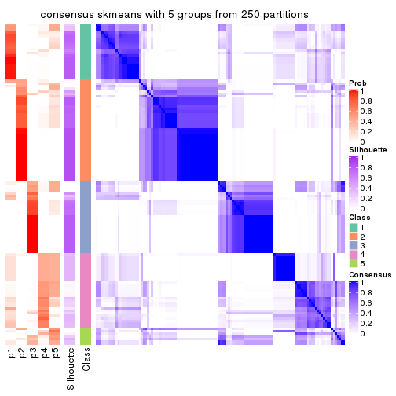</p>

</div>
<div id='tab-MAD-skmeans-consensus-heatmap-5'>
<pre><code class="r">consensus_heatmap(res, k = 6)
</code></pre>

<p></p>

</div>
</div>

Heatmaps for the membership of samples in all partitions to see how consistent they are:


<script>
$( function() {
	$( '#tabs-MAD-skmeans-membership-heatmap' ).tabs();
} );
</script>
<div id='tabs-MAD-skmeans-membership-heatmap'>
<ul>
<li><a href='#tab-MAD-skmeans-membership-heatmap-1'>k = 2</a></li>
<li><a href='#tab-MAD-skmeans-membership-heatmap-2'>k = 3</a></li>
<li><a href='#tab-MAD-skmeans-membership-heatmap-3'>k = 4</a></li>
<li><a href='#tab-MAD-skmeans-membership-heatmap-4'>k = 5</a></li>
<li><a href='#tab-MAD-skmeans-membership-heatmap-5'>k = 6</a></li>
</ul>
<div id='tab-MAD-skmeans-membership-heatmap-1'>
<pre><code class="r">membership_heatmap(res, k = 2)
</code></pre>

<p></p>

</div>
<div id='tab-MAD-skmeans-membership-heatmap-2'>
<pre><code class="r">membership_heatmap(res, k = 3)
</code></pre>

<p></p>

</div>
<div id='tab-MAD-skmeans-membership-heatmap-3'>
<pre><code class="r">membership_heatmap(res, k = 4)
</code></pre>

<p></p>

</div>
<div id='tab-MAD-skmeans-membership-heatmap-4'>
<pre><code class="r">membership_heatmap(res, k = 5)
</code></pre>

<p></p>

</div>
<div id='tab-MAD-skmeans-membership-heatmap-5'>
<pre><code class="r">membership_heatmap(res, k = 6)
</code></pre>

<p></p>

</div>
</div>

As soon as we have had the classes for columns, we can look for signatures
which are significantly different between classes which can be candidate marks
for certain classes. Following are the heatmaps for signatures.


Signature heatmaps where rows are scaled:


<script>
$( function() {
	$( '#tabs-MAD-skmeans-get-signatures' ).tabs();
} );
</script>
<div id='tabs-MAD-skmeans-get-signatures'>
<ul>
<li><a href='#tab-MAD-skmeans-get-signatures-1'>k = 2</a></li>
<li><a href='#tab-MAD-skmeans-get-signatures-2'>k = 3</a></li>
<li><a href='#tab-MAD-skmeans-get-signatures-3'>k = 4</a></li>
<li><a href='#tab-MAD-skmeans-get-signatures-4'>k = 5</a></li>
<li><a href='#tab-MAD-skmeans-get-signatures-5'>k = 6</a></li>
</ul>
<div id='tab-MAD-skmeans-get-signatures-1'>
<pre><code class="r">get_signatures(res, k = 2)
</code></pre>

<p></p>

</div>
<div id='tab-MAD-skmeans-get-signatures-2'>
<pre><code class="r">get_signatures(res, k = 3)
</code></pre>

<p></p>

</div>
<div id='tab-MAD-skmeans-get-signatures-3'>
<pre><code class="r">get_signatures(res, k = 4)
</code></pre>

<p></p>

</div>
<div id='tab-MAD-skmeans-get-signatures-4'>
<pre><code class="r">get_signatures(res, k = 5)
</code></pre>

<p></p>

</div>
<div id='tab-MAD-skmeans-get-signatures-5'>
<pre><code class="r">get_signatures(res, k = 6)
</code></pre>

<p></p>

</div>
</div>


Signature heatmaps where rows are not scaled:


<script>
$( function() {
	$( '#tabs-MAD-skmeans-get-signatures-no-scale' ).tabs();
} );
</script>
<div id='tabs-MAD-skmeans-get-signatures-no-scale'>
<ul>
<li><a href='#tab-MAD-skmeans-get-signatures-no-scale-1'>k = 2</a></li>
<li><a href='#tab-MAD-skmeans-get-signatures-no-scale-2'>k = 3</a></li>
<li><a href='#tab-MAD-skmeans-get-signatures-no-scale-3'>k = 4</a></li>
<li><a href='#tab-MAD-skmeans-get-signatures-no-scale-4'>k = 5</a></li>
<li><a href='#tab-MAD-skmeans-get-signatures-no-scale-5'>k = 6</a></li>
</ul>
<div id='tab-MAD-skmeans-get-signatures-no-scale-1'>
<pre><code class="r">get_signatures(res, k = 2, scale_rows = FALSE)
</code></pre>

<p></p>

</div>
<div id='tab-MAD-skmeans-get-signatures-no-scale-2'>
<pre><code class="r">get_signatures(res, k = 3, scale_rows = FALSE)
</code></pre>

<p></p>

</div>
<div id='tab-MAD-skmeans-get-signatures-no-scale-3'>
<pre><code class="r">get_signatures(res, k = 4, scale_rows = FALSE)
</code></pre>

<p></p>

</div>
<div id='tab-MAD-skmeans-get-signatures-no-scale-4'>
<pre><code class="r">get_signatures(res, k = 5, scale_rows = FALSE)
</code></pre>

<p></p>

</div>
<div id='tab-MAD-skmeans-get-signatures-no-scale-5'>
<pre><code class="r">get_signatures(res, k = 6, scale_rows = FALSE)
</code></pre>

<p></p>

</div>
</div>


Compare the overlap of signatures from different k:

```r
compare_signatures(res)
```


`get_signature()` returns a data frame invisibly. TO get the list of signatures, the function
call should be assigned to a variable explicitly. In following code, if `plot` argument is set
to `FALSE`, no heatmap is plotted while only the differential analysis is performed.

```r
# code only for demonstration
tb = get_signature(res, k = ..., plot = FALSE)
```

An example of the output of `tb` is:

```
#>   which_row         fdr    mean_1    mean_2 scaled_mean_1 scaled_mean_2 km
#> 1        38 0.042760348  8.373488  9.131774    -0.5533452     0.5164555  1
#> 2        40 0.018707592  7.106213  8.469186    -0.6173731     0.5762149  1
#> 3        55 0.019134737 10.221463 11.207825    -0.6159697     0.5749050  1
#> 4        59 0.006059896  5.921854  7.869574    -0.6899429     0.6439467  1
#> 5        60 0.018055526  8.928898 10.211722    -0.6204761     0.5791110  1
#> 6        98 0.009384629 15.714769 14.887706     0.6635654    -0.6193277  2
...
```

The columns in `tb` are:

1. `which_row`: row indices corresponding to the input matrix.
2. `fdr`: FDR for the differential test. 
3. `mean_x`: The mean value in group x.
4. `scaled_mean_x`: The mean value in group x after rows are scaled.
5. `km`: Row groups if k-means clustering is applied to rows.


UMAP plot which shows how samples are separated.


<script>
$( function() {
	$( '#tabs-MAD-skmeans-dimension-reduction' ).tabs();
} );
</script>
<div id='tabs-MAD-skmeans-dimension-reduction'>
<ul>
<li><a href='#tab-MAD-skmeans-dimension-reduction-1'>k = 2</a></li>
<li><a href='#tab-MAD-skmeans-dimension-reduction-2'>k = 3</a></li>
<li><a href='#tab-MAD-skmeans-dimension-reduction-3'>k = 4</a></li>
<li><a href='#tab-MAD-skmeans-dimension-reduction-4'>k = 5</a></li>
<li><a href='#tab-MAD-skmeans-dimension-reduction-5'>k = 6</a></li>
</ul>
<div id='tab-MAD-skmeans-dimension-reduction-1'>
<pre><code class="r">dimension_reduction(res, k = 2, method = &quot;UMAP&quot;)
</code></pre>

<p></p>

</div>
<div id='tab-MAD-skmeans-dimension-reduction-2'>
<pre><code class="r">dimension_reduction(res, k = 3, method = &quot;UMAP&quot;)
</code></pre>

<p>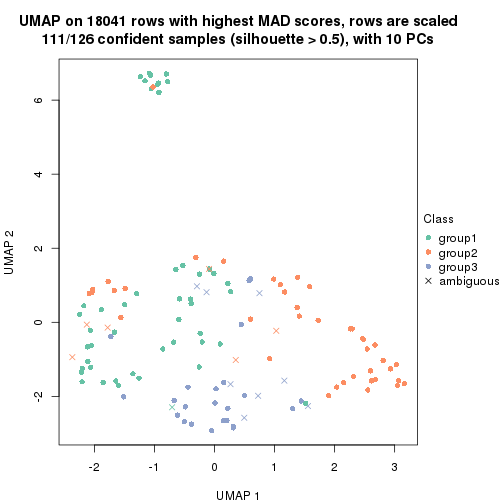</p>

</div>
<div id='tab-MAD-skmeans-dimension-reduction-3'>
<pre><code class="r">dimension_reduction(res, k = 4, method = &quot;UMAP&quot;)
</code></pre>

<p></p>

</div>
<div id='tab-MAD-skmeans-dimension-reduction-4'>
<pre><code class="r">dimension_reduction(res, k = 5, method = &quot;UMAP&quot;)
</code></pre>

<p></p>

</div>
<div id='tab-MAD-skmeans-dimension-reduction-5'>
<pre><code class="r">dimension_reduction(res, k = 6, method = &quot;UMAP&quot;)
</code></pre>

<p></p>

</div>
</div>


Following heatmap shows how subgroups are split when increasing `k`:

```r
collect_classes(res)
```


If matrix rows can be associated to genes, consider to use `GO_Enrichment(res,
...)` to perform function enrichment for the signature genes.


 

---------------------------------------------------


### MAD:pam


The object with results only for a single top-value method and a single partition method 
can be extracted as:

```r
res = res_list["MAD", "pam"]
# you can also extract it by
# res = res_list["MAD:pam"]
```

A summary of `res` and all the functions that can be applied to it:

```r
res
```

```
#> A 'ConsensusPartition' object with k = 2, 3, 4, 5, 6.
#>   On a matrix with 18041 rows and 126 columns.
#>   Top rows (1000, 2000, 3000, 4000, 5000) are extracted by 'MAD' method.
#>   Subgroups are detected by 'pam' method.
#>   Performed in total 1250 partitions by row resampling.
#>   Best k for subgroups seems to be 2.
#> 
#> Following methods can be applied to this 'ConsensusPartition' object:
#>  [1] "cola_report"             "collect_classes"         "collect_plots"          
#>  [4] "collect_stats"           "colnames"                "compare_signatures"     
#>  [7] "consensus_heatmap"       "dimension_reduction"     "functional_enrichment"  
#> [10] "get_anno_col"            "get_anno"                "get_classes"            
#> [13] "get_consensus"           "get_matrix"              "get_membership"         
#> [16] "get_param"               "get_signatures"          "get_stats"              
#> [19] "is_best_k"               "is_stable_k"             "membership_heatmap"     
#> [22] "ncol"                    "nrow"                    "plot_ecdf"              
#> [25] "rownames"                "select_partition_number" "show"                   
#> [28] "suggest_best_k"          "test_to_known_factors"
```

`collect_plots()` function collects all the plots made from `res` for all `k` (number of partitions)
into one single page to provide an easy and fast comparison between different `k`.

```r
collect_plots(res)
```


The plots are:

- The first row: a plot of the ECDF (Empirical cumulative distribution
  function) curves of the consensus matrix for each `k` and the heatmap of
  predicted classes for each `k`.
- The second row: heatmaps of the consensus matrix for each `k`.
- The third row: heatmaps of the membership matrix for each `k`.
- The fouth row: heatmaps of the signatures for each `k`.

All the plots in panels can be made by individual functions and they are
plotted later in this section.

`select_partition_number()` produces several plots showing different
statistics for choosing "optimized" `k`. There are following statistics:

- ECDF curves of the consensus matrix for each `k`;
- 1-PAC. [The PAC
  score](https://en.wikipedia.org/wiki/Consensus_clustering#Over-interpretation_potential_of_consensus_clustering)
  measures the proportion of the ambiguous subgrouping.
- Mean silhouette score.
- Concordance. The mean probability of fiting the consensus class ids in all
  partitions.
- Area increased. Denote $A_k$ as the area under the ECDF curve for current
  `k`, the area increased is defined as $A_k - A_{k-1}$.
- Rand index. The percent of pairs of samples that are both in a same cluster
  or both are not in a same cluster in the partition of k and k-1.
- Jaccard index. The ratio of pairs of samples are both in a same cluster in
  the partition of k and k-1 and the pairs of samples are both in a same
  cluster in the partition k or k-1.

The detailed explanations of these statistics can be found in [the cola
vignette](http://bioconductor.org/packages/devel/bioc/vignettes/cola/inst/doc/cola.html#toc_13).

Generally speaking, lower PAC score, higher mean silhouette score or higher
concordance corresponds to better partition. Rand index and Jaccard index
measure how similar the current partition is compared to partition with `k-1`.
If they are too similar, we won't accept `k` is better than `k-1`.

```r
select_partition_number(res)
```


The numeric values for all these statistics can be obtained by `get_stats()`.

```r
get_stats(res)
```

```
#>   k 1-PAC mean_silhouette concordance area_increased  Rand Jaccard
#> 2 2 0.830           0.865       0.939         0.4951 0.497   0.497
#> 3 3 0.504           0.712       0.836         0.2548 0.835   0.683
#> 4 4 0.716           0.768       0.881         0.1362 0.846   0.628
#> 5 5 0.678           0.643       0.814         0.1152 0.819   0.472
#> 6 6 0.778           0.742       0.870         0.0497 0.897   0.579
```

`suggest_best_k()` suggests the best $k$ based on these statistics. The rules are as follows:

- All $k$ with Jaccard index larger than 0.95 are removed because the increase of
  the partition number does not provides enough extra information. If all $k$ are removed,
  the best $k$ is assigned by `NA`.
- For $k$ with 1-PAC larger than 0.9, the maximal $k$ is taken as the "best k". Other $k$ is called "optional k".
- If it does not fit the second rule. The $k$ with the highest vote of highest
  1-PAC, mean silhouette and concordance is taken as the "best k".

```r
suggest_best_k(res)
```

```
#> [1] 2
```


Following shows the table of the partitions (You need to click the **show/hide
code output** link to see it). The membership matrix (columns with name `p*`)
is inferred by
[`clue::cl_consensus()`](https://www.rdocumentation.org/link/cl_consensus?package=clue)
function with the `SE` method. Basically the value in the membership matrix
represents the probability to belong to a certain group. The finall class
label for an item is determined with the group with highest probability it
belongs to.

In `get_classes()` function, the entropy is calculated from the membership
matrix and the silhouette score is calculated from the consensus matrix.


<script>
$( function() {
	$( '#tabs-MAD-pam-get-classes' ).tabs();
} );
</script>
<div id='tabs-MAD-pam-get-classes'>
<ul>
<li><a href='#tab-MAD-pam-get-classes-1'>k = 2</a></li>
<li><a href='#tab-MAD-pam-get-classes-2'>k = 3</a></li>
<li><a href='#tab-MAD-pam-get-classes-3'>k = 4</a></li>
<li><a href='#tab-MAD-pam-get-classes-4'>k = 5</a></li>
<li><a href='#tab-MAD-pam-get-classes-5'>k = 6</a></li>
</ul>

<div id='tab-MAD-pam-get-classes-1'>
<p><a id='tab-MAD-pam-get-classes-1-a' style='color:#0366d6' href='#'>show/hide code output</a></p>
<pre><code class="r">cbind(get_classes(res, k = 2), get_membership(res, k = 2))
</code></pre>

<pre><code>#&gt;                                      class entropy silhouette    p1    p2
#&gt; DC1F29A2-39DE-44AD-936A-54B2B32D6370     1  0.0000     0.9455 1.000 0.000
#&gt; FA3C3413-FA8C-4A29-B9CA-5BC3A56274A8     2  0.1843     0.9203 0.028 0.972
#&gt; B9B72975-8134-475C-BC0B-0CFDB24F636A     2  0.0000     0.9192 0.000 1.000
#&gt; F44DB757-4D00-4BFC-99C5-AA82F99C5BDA     2  0.2236     0.9170 0.036 0.964
#&gt; 3BD942BB-A3A7-4993-B3F1-B8641626B773     2  0.3879     0.9069 0.076 0.924
#&gt; 431F73A2-2AB3-4101-B610-7FC02A7097EC     2  0.4022     0.9045 0.080 0.920
#&gt; 3067683D-43D4-4F6D-9338-17F6A75E4B25     2  0.3879     0.9069 0.076 0.924
#&gt; 2CE91B81-7CBE-4698-AFEE-6A154313D231     2  0.0000     0.9192 0.000 1.000
#&gt; A639CF4F-4591-4337-A12E-BED71EDDA10B     1  0.0000     0.9455 1.000 0.000
#&gt; 5482053D-9F48-4773-B68A-302B3A612503     1  0.0000     0.9455 1.000 0.000
#&gt; A31D342D-C67C-428B-BAED-C6E844277A09     1  0.0000     0.9455 1.000 0.000
#&gt; 0E9C5985-9AE0-4098-A076-6FFBBDF05110     2  0.2423     0.9191 0.040 0.960
#&gt; 08CCF8A0-15B7-4A13-BC43-6B3B3E2DDE95     2  0.3879     0.9069 0.076 0.924
#&gt; 10577D5B-AD56-403F-A562-73A9ACF2045B     1  0.0000     0.9455 1.000 0.000
#&gt; C940D443-5DDA-4403-868B-7AA6B9A50FC4     1  0.0000     0.9455 1.000 0.000
#&gt; 89D4D945-A717-495F-B253-F5A17CF5B9FA     2  0.2778     0.9175 0.048 0.952
#&gt; DC55EE78-203F-4092-9B83-14B1A529194B     2  0.0000     0.9192 0.000 1.000
#&gt; 8F7368BE-EB41-4192-89AA-9E0428C08851     1  0.0000     0.9455 1.000 0.000
#&gt; F772EA39-E408-4908-BADD-C786D702BF9B     2  0.0000     0.9192 0.000 1.000
#&gt; FD693D10-3ADA-4028-8392-41D2F0296F7E     1  0.9686     0.2863 0.604 0.396
#&gt; 84F16966-7640-49F9-95D1-7648FF74DCC9     2  0.0000     0.9192 0.000 1.000
#&gt; D26DAA2F-AE6A-42E1-9F1F-01943B99785F     2  0.8144     0.7023 0.252 0.748
#&gt; F325847E-F046-4B67-B01C-16919C401020     1  0.9815     0.2233 0.580 0.420
#&gt; 19EB2B10-2529-4A94-8FAE-1CE371A602D9     1  0.0000     0.9455 1.000 0.000
#&gt; B94B9CCF-5FB8-44AE-8D9C-A194C6801A27     2  0.0000     0.9192 0.000 1.000
#&gt; D2678E70-542A-4AB2-B881-12D66DBA44F5     1  0.9286     0.4339 0.656 0.344
#&gt; 4961CA2A-70CD-42AB-A676-4A98C85F449F     2  0.3879     0.9069 0.076 0.924
#&gt; 5AA74C5C-2AD1-4D59-A030-E964EB199581     1  0.0000     0.9455 1.000 0.000
#&gt; F9E11A1B-BD93-438F-9670-6FB7DFF9E910     1  0.0000     0.9455 1.000 0.000
#&gt; FB78CA5A-C8B9-42AF-9DAE-799CAB280B2E     1  0.0000     0.9455 1.000 0.000
#&gt; A8E48877-F8AB-44DD-A18B-194D87C44931     2  0.2423     0.9191 0.040 0.960
#&gt; CA50C495-F37E-4743-867D-FAF2DCC3376A     2  0.9710     0.4030 0.400 0.600
#&gt; 37342369-EC22-4904-8CCD-A0DC6BD8D183     2  0.0000     0.9192 0.000 1.000
#&gt; 91BA5F90-9174-4533-A050-39A28E34A94D     1  0.0000     0.9455 1.000 0.000
#&gt; 5BC371AC-1915-44E9-A114-2963E131EC8D     2  0.9922     0.2487 0.448 0.552
#&gt; 74A6C31A-7F21-45AF-A170-18C326D2AE69     1  0.0000     0.9455 1.000 0.000
#&gt; 984F27EF-D4D7-4E68-BD64-776FDFC04D07     1  0.1184     0.9337 0.984 0.016
#&gt; B05701C5-8C44-4FD1-94C9-FC0255A2EA24     1  0.0000     0.9455 1.000 0.000
#&gt; 91E4119C-2CE6-4447-A125-6A4F403A89E6     2  0.3879     0.9069 0.076 0.924
#&gt; 1570FCE7-F1B4-4BDF-A398-355EDF030864     2  0.0000     0.9192 0.000 1.000
#&gt; 604C06E9-A00E-435E-847A-3992922A5C56     1  0.0000     0.9455 1.000 0.000
#&gt; 455C9007-6FF4-4D63-83FA-4915F0331F9A     1  0.0000     0.9455 1.000 0.000
#&gt; FB8BD3CF-D2EC-47B6-B67F-65ADC1C3A6A7     2  0.3584     0.9105 0.068 0.932
#&gt; 9DC7443A-3C8F-4025-8312-3C98BF28D736     1  0.2603     0.9099 0.956 0.044
#&gt; CB207A52-09AC-49D3-8240-5840CDFBB154     2  0.4022     0.9045 0.080 0.920
#&gt; 2A335049-AD9F-4B32-92B7-69B04B0CF2BA     1  0.0000     0.9455 1.000 0.000
#&gt; 6ACA6293-371E-428D-BBAE-ABFD410C886F     2  0.2423     0.9191 0.040 0.960
#&gt; E8929929-73F9-4DB7-ABBA-0852BEFFFF7E     1  0.0000     0.9455 1.000 0.000
#&gt; 5E343116-414B-41F2-AAEE-A3225450135A     1  0.0376     0.9427 0.996 0.004
#&gt; 0A39073C-157C-48A1-B125-A6A04CB738DA     2  0.2423     0.9191 0.040 0.960
#&gt; 300D78E6-1C7E-4114-80EA-9204A6818B9A     2  0.4431     0.8954 0.092 0.908
#&gt; DAAF55AA-ED48-4221-9CD6-D1DEB6376017     1  0.0000     0.9455 1.000 0.000
#&gt; D76FCF4A-4ACF-41EF-A120-64136D6C845E     2  0.2603     0.9182 0.044 0.956
#&gt; AD294665-6F90-459C-90D5-3058F210225D     2  0.9963     0.1963 0.464 0.536
#&gt; 92E8AD7A-1084-44C8-BDC0-FE4E47B6143F     2  0.2236     0.9170 0.036 0.964
#&gt; 5644A861-3C59-486D-8FBE-4DF6A3B19558     1  0.0000     0.9455 1.000 0.000
#&gt; 1BF8AAE7-B771-4CF2-8B1C-D2BEB5E6579E     1  0.0000     0.9455 1.000 0.000
#&gt; A54731AE-FC40-407F-8D10-67DDC122237D     2  0.0000     0.9192 0.000 1.000
#&gt; 179DC906-5654-4CBA-9C27-C9560B5F12DE     1  0.0000     0.9455 1.000 0.000
#&gt; 979B9A2B-2D81-47C3-A553-9B9441CAAE47     1  0.0000     0.9455 1.000 0.000
#&gt; D69BD86A-08FB-49DA-9084-2725F6C9195F     1  0.0000     0.9455 1.000 0.000
#&gt; 84611033-BCF7-49D7-9B91-DA29B62AC8D3     1  0.8763     0.5533 0.704 0.296
#&gt; 8AA1DA3E-8C00-4653-AA33-EA70531C1E50     2  0.0000     0.9192 0.000 1.000
#&gt; CEBE9594-0F19-46B4-AF7D-F8DF33E00AFB     1  0.0000     0.9455 1.000 0.000
#&gt; C68E82D2-2BD3-41E9-92D7-D4C06E1953B2     1  0.8386     0.6014 0.732 0.268
#&gt; B855EF89-1E76-4408-AA65-61A0F0A4F412     2  0.0000     0.9192 0.000 1.000
#&gt; 4488EFB3-5B01-41E3-B57E-8E4F607CF448     2  0.4022     0.9045 0.080 0.920
#&gt; C2BD8440-CAC6-4FE5-8EBB-5E6AE308D52F     1  0.0000     0.9455 1.000 0.000
#&gt; E0E50F10-1FED-41C1-84DB-81A46F25D7E9     1  0.5408     0.8241 0.876 0.124
#&gt; EE16D845-31F2-4178-800B-CA2C358841AD     2  0.1843     0.9187 0.028 0.972
#&gt; 169828CF-5693-4A46-B5D7-E45CBA9DF317     2  0.0000     0.9192 0.000 1.000
#&gt; 51077BA3-AEE0-4BD4-A1B1-1B0A811642A1     1  0.0000     0.9455 1.000 0.000
#&gt; D2F4E240-C44C-4CF7-8016-6CACD370D093     1  0.0000     0.9455 1.000 0.000
#&gt; 721CDBE6-FC85-4C30-B23E-28407340286F     1  0.0376     0.9427 0.996 0.004
#&gt; 392897E4-6009-422C-B461-649F4DDF260C     1  0.0000     0.9455 1.000 0.000
#&gt; 617E13D2-6924-45F8-A8DE-BE21B718F822     1  0.0000     0.9455 1.000 0.000
#&gt; 5746C00F-9CBB-46B7-83FD-90B2AB3F507B     1  0.0000     0.9455 1.000 0.000
#&gt; 982B4344-A223-4D1F-9485-2E56F9FD45C0     2  0.0000     0.9192 0.000 1.000
#&gt; E5557F52-015D-49DC-9E23-989FC259976F     1  0.0000     0.9455 1.000 0.000
#&gt; F3135F5E-2E90-4923-B634-E994563D17B7     1  0.9000     0.5020 0.684 0.316
#&gt; D1ED15A5-9802-4314-B556-E89EB772D1F0     1  0.0000     0.9455 1.000 0.000
#&gt; 222B06E3-FCFB-4104-92C3-D73BC31854D4     1  0.0000     0.9455 1.000 0.000
#&gt; 4C810FFA-ED07-4F4C-9F81-B8F1CF4956F7     2  0.0376     0.9190 0.004 0.996
#&gt; 9A608964-ED12-4E6E-9D3A-430F59FFF65B     1  0.0000     0.9455 1.000 0.000
#&gt; 4087357F-C17A-4992-A8AB-41ACA2F72001     2  0.8955     0.5766 0.312 0.688
#&gt; B3F013A5-BCB8-4CE0-86B2-634EE180AA6E     2  0.0000     0.9192 0.000 1.000
#&gt; 322AF320-1379-4F51-AFDC-5292A060CD52     2  0.0000     0.9192 0.000 1.000
#&gt; 53A96249-66D5-4C26-893B-ADC71481D261     2  0.0000     0.9192 0.000 1.000
#&gt; 1AB7A6F2-14BD-447C-B2E3-DEB0CE56B209     1  0.0000     0.9455 1.000 0.000
#&gt; 8B4BCDA0-6787-4A55-99F7-AAF22AF85BA6     2  0.0000     0.9192 0.000 1.000
#&gt; 5D9D9E08-2C2C-414E-9547-62799F90D543     2  0.0000     0.9192 0.000 1.000
#&gt; C345CD17-E4F4-41D5-9891-FEFB19342C52     1  0.0000     0.9455 1.000 0.000
#&gt; 1AF8FDE1-1A74-41F6-A1C5-4952CDFB7D3F     1  0.3274     0.8935 0.940 0.060
#&gt; BC3405FF-0660-4B2B-8DC1-5F34D3133078     1  0.4298     0.8670 0.912 0.088
#&gt; C2662596-6E2F-4924-B051-CEA1AC87B197     1  0.0000     0.9455 1.000 0.000
#&gt; 39AE85F7-49FB-4438-BD41-6AC812FA1C72     1  0.0000     0.9455 1.000 0.000
#&gt; 6FF266DB-3F08-43F2-8F6F-679F805B80B8     1  0.2603     0.9086 0.956 0.044
#&gt; B03B7B81-BBD6-4194-BC5E-6EDF0D3F015A     1  0.0000     0.9455 1.000 0.000
#&gt; C7617D56-F13C-4C43-906C-BD458C5DC4CD     1  0.2043     0.9184 0.968 0.032
#&gt; 09420F8B-7A71-4B32-8388-4767670F1FEB     1  0.0000     0.9455 1.000 0.000
#&gt; 6AF47534-74FF-4128-865B-4E8EE1FFB469     2  0.0000     0.9192 0.000 1.000
#&gt; 8FF9E94A-2ED2-4727-947F-D524D7ECE815     1  0.0000     0.9455 1.000 0.000
#&gt; A390E20D-03F9-40E4-A132-0FA5C2BEDB63     1  0.0000     0.9455 1.000 0.000
#&gt; A489CCCA-1374-4071-80CE-05B83C9A0D5E     2  0.1184     0.9205 0.016 0.984
#&gt; 2D962371-EC83-490C-A663-478AF383BC1B     2  0.0000     0.9192 0.000 1.000
#&gt; D91B31A1-EE71-4726-B94C-0CC2815E9D4E     2  0.9977     0.0915 0.472 0.528
#&gt; E0123C5C-E1D1-4162-9895-CC8B01949D84     2  0.5178     0.8746 0.116 0.884
#&gt; EC73959A-2728-49FE-B72A-790BB14F4CBF     1  0.0000     0.9455 1.000 0.000
#&gt; A60DC925-7343-496E-900D-0DD81D5C8123     2  0.3879     0.9069 0.076 0.924
#&gt; 659B64DB-F4A5-43BD-811B-05004CB49D99     1  0.0000     0.9455 1.000 0.000
#&gt; 6969B6B2-7616-4664-9696-C4DACD10537B     2  0.2236     0.9170 0.036 0.964
#&gt; 2F6392DE-0D54-4768-B062-907C81E5B0CC     2  0.2423     0.9191 0.040 0.960
#&gt; C74BE8C5-BA6D-4596-9D67-3C731799F999     1  0.0000     0.9455 1.000 0.000
#&gt; 79A7647F-BDBA-45A2-B207-ABF788F6CC95     1  0.0000     0.9455 1.000 0.000
#&gt; D47D0433-2313-4A2F-B268-5AD293D7534E     2  0.0376     0.9196 0.004 0.996
#&gt; C5058B93-C1DA-43B9-9951-B23A9810AA6E     2  0.4022     0.9045 0.080 0.920
#&gt; 2629FEE3-A203-4411-8A70-02A796C9505C     2  0.3879     0.9069 0.076 0.924
#&gt; 1AF329E4-11D4-4CFC-801F-C24A1EA33102     2  0.2423     0.9191 0.040 0.960
#&gt; D453BEF8-3F18-4B89-BA42-CE74EB105032     1  0.9286     0.4378 0.656 0.344
#&gt; B12A4446-2310-4139-897F-CA030478CBD5     2  0.9954     0.2267 0.460 0.540
#&gt; BCAB1918-5FA9-4CBD-85CB-008743FEA2CC     1  0.0000     0.9455 1.000 0.000
#&gt; 9A5432D3-19EE-47B4-BD88-698DEC75A5E9     2  0.4298     0.8859 0.088 0.912
#&gt; A608BCEB-2C27-4927-A308-E6975F641722     2  0.0000     0.9192 0.000 1.000
#&gt; E4752275-7BF6-4C1E-8A45-C7D571ED85AD     2  0.0000     0.9192 0.000 1.000
#&gt; FDEC1714-C02D-4AB7-AE82-789E9D709EDE     1  0.8499     0.5961 0.724 0.276
#&gt; 33737781-8638-4FA2-AD4C-E888BB9343D8     2  0.2423     0.9191 0.040 0.960
</code></pre>

<script>
$('#tab-MAD-pam-get-classes-1-a').parent().next().next().hide();
$('#tab-MAD-pam-get-classes-1-a').click(function(){
  $('#tab-MAD-pam-get-classes-1-a').parent().next().next().toggle();
  return(false);
});
</script>
</div>

<div id='tab-MAD-pam-get-classes-2'>
<p><a id='tab-MAD-pam-get-classes-2-a' style='color:#0366d6' href='#'>show/hide code output</a></p>
<pre><code class="r">cbind(get_classes(res, k = 3), get_membership(res, k = 3))
</code></pre>

<pre><code>#&gt;                                      class entropy silhouette    p1    p2    p3
#&gt; DC1F29A2-39DE-44AD-936A-54B2B32D6370     1  0.0000    0.85264 1.000 0.000 0.000
#&gt; FA3C3413-FA8C-4A29-B9CA-5BC3A56274A8     3  0.6292    0.78764 0.044 0.216 0.740
#&gt; B9B72975-8134-475C-BC0B-0CFDB24F636A     2  0.0000    0.82271 0.000 1.000 0.000
#&gt; F44DB757-4D00-4BFC-99C5-AA82F99C5BDA     2  0.2959    0.75864 0.100 0.900 0.000
#&gt; 3BD942BB-A3A7-4993-B3F1-B8641626B773     3  0.7975    0.75540 0.160 0.180 0.660
#&gt; 431F73A2-2AB3-4101-B610-7FC02A7097EC     3  0.8091    0.65954 0.320 0.088 0.592
#&gt; 3067683D-43D4-4F6D-9338-17F6A75E4B25     3  0.7978    0.75309 0.164 0.176 0.660
#&gt; 2CE91B81-7CBE-4698-AFEE-6A154313D231     3  0.5216    0.73861 0.000 0.260 0.740
#&gt; A639CF4F-4591-4337-A12E-BED71EDDA10B     1  0.4121    0.70627 0.832 0.000 0.168
#&gt; 5482053D-9F48-4773-B68A-302B3A612503     1  0.0000    0.85264 1.000 0.000 0.000
#&gt; A31D342D-C67C-428B-BAED-C6E844277A09     1  0.0000    0.85264 1.000 0.000 0.000
#&gt; 0E9C5985-9AE0-4098-A076-6FFBBDF05110     2  0.7053    0.40314 0.064 0.692 0.244
#&gt; 08CCF8A0-15B7-4A13-BC43-6B3B3E2DDE95     3  0.6754    0.78636 0.168 0.092 0.740
#&gt; 10577D5B-AD56-403F-A562-73A9ACF2045B     1  0.0000    0.85264 1.000 0.000 0.000
#&gt; C940D443-5DDA-4403-868B-7AA6B9A50FC4     1  0.0000    0.85264 1.000 0.000 0.000
#&gt; 89D4D945-A717-495F-B253-F5A17CF5B9FA     2  0.8271   -0.29781 0.076 0.480 0.444
#&gt; DC55EE78-203F-4092-9B83-14B1A529194B     2  0.0000    0.82271 0.000 1.000 0.000
#&gt; 8F7368BE-EB41-4192-89AA-9E0428C08851     1  0.0000    0.85264 1.000 0.000 0.000
#&gt; F772EA39-E408-4908-BADD-C786D702BF9B     2  0.0000    0.82271 0.000 1.000 0.000
#&gt; FD693D10-3ADA-4028-8392-41D2F0296F7E     1  0.6299    0.45005 0.524 0.000 0.476
#&gt; 84F16966-7640-49F9-95D1-7648FF74DCC9     2  0.0000    0.82271 0.000 1.000 0.000
#&gt; D26DAA2F-AE6A-42E1-9F1F-01943B99785F     3  0.7021    0.76231 0.216 0.076 0.708
#&gt; F325847E-F046-4B67-B01C-16919C401020     1  0.7582    0.17375 0.572 0.048 0.380
#&gt; 19EB2B10-2529-4A94-8FAE-1CE371A602D9     1  0.0000    0.85264 1.000 0.000 0.000
#&gt; B94B9CCF-5FB8-44AE-8D9C-A194C6801A27     2  0.0000    0.82271 0.000 1.000 0.000
#&gt; D2678E70-542A-4AB2-B881-12D66DBA44F5     1  0.6267    0.49098 0.548 0.000 0.452
#&gt; 4961CA2A-70CD-42AB-A676-4A98C85F449F     3  0.6731    0.78479 0.172 0.088 0.740
#&gt; 5AA74C5C-2AD1-4D59-A030-E964EB199581     1  0.0000    0.85264 1.000 0.000 0.000
#&gt; F9E11A1B-BD93-438F-9670-6FB7DFF9E910     1  0.0000    0.85264 1.000 0.000 0.000
#&gt; FB78CA5A-C8B9-42AF-9DAE-799CAB280B2E     1  0.0000    0.85264 1.000 0.000 0.000
#&gt; A8E48877-F8AB-44DD-A18B-194D87C44931     3  0.6537    0.80156 0.064 0.196 0.740
#&gt; CA50C495-F37E-4743-867D-FAF2DCC3376A     3  0.6007    0.76662 0.192 0.044 0.764
#&gt; 37342369-EC22-4904-8CCD-A0DC6BD8D183     2  0.0000    0.82271 0.000 1.000 0.000
#&gt; 91BA5F90-9174-4533-A050-39A28E34A94D     1  0.0000    0.85264 1.000 0.000 0.000
#&gt; 5BC371AC-1915-44E9-A114-2963E131EC8D     1  0.8043    0.12601 0.556 0.072 0.372
#&gt; 74A6C31A-7F21-45AF-A170-18C326D2AE69     1  0.4062    0.77240 0.836 0.000 0.164
#&gt; 984F27EF-D4D7-4E68-BD64-776FDFC04D07     1  0.9813    0.23409 0.424 0.316 0.260
#&gt; B05701C5-8C44-4FD1-94C9-FC0255A2EA24     1  0.0000    0.85264 1.000 0.000 0.000
#&gt; 91E4119C-2CE6-4447-A125-6A4F403A89E6     3  0.8889    0.62205 0.164 0.276 0.560
#&gt; 1570FCE7-F1B4-4BDF-A398-355EDF030864     2  0.0000    0.82271 0.000 1.000 0.000
#&gt; 604C06E9-A00E-435E-847A-3992922A5C56     1  0.0000    0.85264 1.000 0.000 0.000
#&gt; 455C9007-6FF4-4D63-83FA-4915F0331F9A     1  0.5327    0.71135 0.728 0.000 0.272
#&gt; FB8BD3CF-D2EC-47B6-B67F-65ADC1C3A6A7     3  0.6854    0.79782 0.136 0.124 0.740
#&gt; 9DC7443A-3C8F-4025-8312-3C98BF28D736     1  0.5497    0.69577 0.708 0.000 0.292
#&gt; CB207A52-09AC-49D3-8240-5840CDFBB154     3  0.1529    0.68512 0.000 0.040 0.960
#&gt; 2A335049-AD9F-4B32-92B7-69B04B0CF2BA     1  0.4346    0.70373 0.816 0.184 0.000
#&gt; 6ACA6293-371E-428D-BBAE-ABFD410C886F     3  0.6537    0.80156 0.064 0.196 0.740
#&gt; E8929929-73F9-4DB7-ABBA-0852BEFFFF7E     1  0.0747    0.84896 0.984 0.000 0.016
#&gt; 5E343116-414B-41F2-AAEE-A3225450135A     1  0.0000    0.85264 1.000 0.000 0.000
#&gt; 0A39073C-157C-48A1-B125-A6A04CB738DA     3  0.6537    0.80156 0.064 0.196 0.740
#&gt; 300D78E6-1C7E-4114-80EA-9204A6818B9A     2  0.9702    0.00937 0.364 0.416 0.220
#&gt; DAAF55AA-ED48-4221-9CD6-D1DEB6376017     1  0.7878    0.52226 0.668 0.160 0.172
#&gt; D76FCF4A-4ACF-41EF-A120-64136D6C845E     3  0.6576    0.80189 0.068 0.192 0.740
#&gt; AD294665-6F90-459C-90D5-3058F210225D     1  0.7570    0.17252 0.552 0.044 0.404
#&gt; 92E8AD7A-1084-44C8-BDC0-FE4E47B6143F     2  0.2959    0.75864 0.100 0.900 0.000
#&gt; 5644A861-3C59-486D-8FBE-4DF6A3B19558     1  0.3686    0.78831 0.860 0.000 0.140
#&gt; 1BF8AAE7-B771-4CF2-8B1C-D2BEB5E6579E     1  0.5216    0.71634 0.740 0.000 0.260
#&gt; A54731AE-FC40-407F-8D10-67DDC122237D     3  0.5216    0.73861 0.000 0.260 0.740
#&gt; 179DC906-5654-4CBA-9C27-C9560B5F12DE     1  0.0000    0.85264 1.000 0.000 0.000
#&gt; 979B9A2B-2D81-47C3-A553-9B9441CAAE47     1  0.3816    0.79736 0.852 0.000 0.148
#&gt; D69BD86A-08FB-49DA-9084-2725F6C9195F     1  0.0000    0.85264 1.000 0.000 0.000
#&gt; 84611033-BCF7-49D7-9B91-DA29B62AC8D3     2  0.6941    0.16866 0.464 0.520 0.016
#&gt; 8AA1DA3E-8C00-4653-AA33-EA70531C1E50     2  0.0000    0.82271 0.000 1.000 0.000
#&gt; CEBE9594-0F19-46B4-AF7D-F8DF33E00AFB     1  0.0592    0.84816 0.988 0.000 0.012
#&gt; C68E82D2-2BD3-41E9-92D7-D4C06E1953B2     1  0.2165    0.81570 0.936 0.064 0.000
#&gt; B855EF89-1E76-4408-AA65-61A0F0A4F412     2  0.0000    0.82271 0.000 1.000 0.000
#&gt; 4488EFB3-5B01-41E3-B57E-8E4F607CF448     3  0.6754    0.78562 0.168 0.092 0.740
#&gt; C2BD8440-CAC6-4FE5-8EBB-5E6AE308D52F     1  0.0000    0.85264 1.000 0.000 0.000
#&gt; E0E50F10-1FED-41C1-84DB-81A46F25D7E9     1  0.5948    0.62866 0.640 0.000 0.360
#&gt; EE16D845-31F2-4178-800B-CA2C358841AD     2  0.2356    0.78200 0.072 0.928 0.000
#&gt; 169828CF-5693-4A46-B5D7-E45CBA9DF317     2  0.0000    0.82271 0.000 1.000 0.000
#&gt; 51077BA3-AEE0-4BD4-A1B1-1B0A811642A1     1  0.4062    0.77240 0.836 0.000 0.164
#&gt; D2F4E240-C44C-4CF7-8016-6CACD370D093     1  0.0000    0.85264 1.000 0.000 0.000
#&gt; 721CDBE6-FC85-4C30-B23E-28407340286F     1  0.1163    0.83996 0.972 0.000 0.028
#&gt; 392897E4-6009-422C-B461-649F4DDF260C     1  0.1031    0.84704 0.976 0.000 0.024
#&gt; 617E13D2-6924-45F8-A8DE-BE21B718F822     1  0.5216    0.71634 0.740 0.000 0.260
#&gt; 5746C00F-9CBB-46B7-83FD-90B2AB3F507B     1  0.1860    0.82309 0.948 0.000 0.052
#&gt; 982B4344-A223-4D1F-9485-2E56F9FD45C0     2  0.0000    0.82271 0.000 1.000 0.000
#&gt; E5557F52-015D-49DC-9E23-989FC259976F     1  0.0000    0.85264 1.000 0.000 0.000
#&gt; F3135F5E-2E90-4923-B634-E994563D17B7     1  0.7295    0.20514 0.584 0.036 0.380
#&gt; D1ED15A5-9802-4314-B556-E89EB772D1F0     1  0.0000    0.85264 1.000 0.000 0.000
#&gt; 222B06E3-FCFB-4104-92C3-D73BC31854D4     1  0.0000    0.85264 1.000 0.000 0.000
#&gt; 4C810FFA-ED07-4F4C-9F81-B8F1CF4956F7     3  0.0000    0.65240 0.000 0.000 1.000
#&gt; 9A608964-ED12-4E6E-9D3A-430F59FFF65B     1  0.1031    0.84214 0.976 0.000 0.024
#&gt; 4087357F-C17A-4992-A8AB-41ACA2F72001     3  0.4555    0.48250 0.200 0.000 0.800
#&gt; B3F013A5-BCB8-4CE0-86B2-634EE180AA6E     2  0.0000    0.82271 0.000 1.000 0.000
#&gt; 322AF320-1379-4F51-AFDC-5292A060CD52     2  0.1411    0.79951 0.000 0.964 0.036
#&gt; 53A96249-66D5-4C26-893B-ADC71481D261     3  0.5873    0.68772 0.004 0.312 0.684
#&gt; 1AB7A6F2-14BD-447C-B2E3-DEB0CE56B209     1  0.0000    0.85264 1.000 0.000 0.000
#&gt; 8B4BCDA0-6787-4A55-99F7-AAF22AF85BA6     2  0.0000    0.82271 0.000 1.000 0.000
#&gt; 5D9D9E08-2C2C-414E-9547-62799F90D543     2  0.2448    0.75088 0.000 0.924 0.076
#&gt; C345CD17-E4F4-41D5-9891-FEFB19342C52     1  0.0000    0.85264 1.000 0.000 0.000
#&gt; 1AF8FDE1-1A74-41F6-A1C5-4952CDFB7D3F     1  0.8504    0.40478 0.612 0.216 0.172
#&gt; BC3405FF-0660-4B2B-8DC1-5F34D3133078     1  0.4796    0.75423 0.780 0.000 0.220
#&gt; C2662596-6E2F-4924-B051-CEA1AC87B197     1  0.0000    0.85264 1.000 0.000 0.000
#&gt; 39AE85F7-49FB-4438-BD41-6AC812FA1C72     1  0.4235    0.76762 0.824 0.000 0.176
#&gt; 6FF266DB-3F08-43F2-8F6F-679F805B80B8     1  0.5650    0.48410 0.688 0.312 0.000
#&gt; B03B7B81-BBD6-4194-BC5E-6EDF0D3F015A     1  0.2261    0.83584 0.932 0.000 0.068
#&gt; C7617D56-F13C-4C43-906C-BD458C5DC4CD     1  0.2066    0.82495 0.940 0.060 0.000
#&gt; 09420F8B-7A71-4B32-8388-4767670F1FEB     1  0.0000    0.85264 1.000 0.000 0.000
#&gt; 6AF47534-74FF-4128-865B-4E8EE1FFB469     2  0.0237    0.82074 0.000 0.996 0.004
#&gt; 8FF9E94A-2ED2-4727-947F-D524D7ECE815     1  0.0000    0.85264 1.000 0.000 0.000
#&gt; A390E20D-03F9-40E4-A132-0FA5C2BEDB63     1  0.5216    0.71634 0.740 0.000 0.260
#&gt; A489CCCA-1374-4071-80CE-05B83C9A0D5E     3  0.5858    0.76374 0.020 0.240 0.740
#&gt; 2D962371-EC83-490C-A663-478AF383BC1B     2  0.0000    0.82271 0.000 1.000 0.000
#&gt; D91B31A1-EE71-4726-B94C-0CC2815E9D4E     2  0.3412    0.73990 0.124 0.876 0.000
#&gt; E0123C5C-E1D1-4162-9895-CC8B01949D84     3  0.8044    0.66558 0.312 0.088 0.600
#&gt; EC73959A-2728-49FE-B72A-790BB14F4CBF     1  0.3686    0.78826 0.860 0.000 0.140
#&gt; A60DC925-7343-496E-900D-0DD81D5C8123     2  0.5413    0.67685 0.164 0.800 0.036
#&gt; 659B64DB-F4A5-43BD-811B-05004CB49D99     1  0.0000    0.85264 1.000 0.000 0.000
#&gt; 6969B6B2-7616-4664-9696-C4DACD10537B     2  0.2878    0.76249 0.096 0.904 0.000
#&gt; 2F6392DE-0D54-4768-B062-907C81E5B0CC     3  0.6537    0.80156 0.064 0.196 0.740
#&gt; C74BE8C5-BA6D-4596-9D67-3C731799F999     1  0.5216    0.71634 0.740 0.000 0.260
#&gt; 79A7647F-BDBA-45A2-B207-ABF788F6CC95     1  0.0000    0.85264 1.000 0.000 0.000
#&gt; D47D0433-2313-4A2F-B268-5AD293D7534E     2  0.0747    0.81659 0.016 0.984 0.000
#&gt; C5058B93-C1DA-43B9-9951-B23A9810AA6E     2  0.8703    0.30406 0.168 0.588 0.244
#&gt; 2629FEE3-A203-4411-8A70-02A796C9505C     3  0.6775    0.78696 0.164 0.096 0.740
#&gt; 1AF329E4-11D4-4CFC-801F-C24A1EA33102     3  0.6449    0.79688 0.056 0.204 0.740
#&gt; D453BEF8-3F18-4B89-BA42-CE74EB105032     2  0.6286    0.18744 0.464 0.536 0.000
#&gt; B12A4446-2310-4139-897F-CA030478CBD5     3  0.7526    0.46656 0.424 0.040 0.536
#&gt; BCAB1918-5FA9-4CBD-85CB-008743FEA2CC     1  0.0592    0.84800 0.988 0.000 0.012
#&gt; 9A5432D3-19EE-47B4-BD88-698DEC75A5E9     3  0.8684    0.40465 0.108 0.392 0.500
#&gt; A608BCEB-2C27-4927-A308-E6975F641722     3  0.5465    0.71417 0.000 0.288 0.712
#&gt; E4752275-7BF6-4C1E-8A45-C7D571ED85AD     2  0.4121    0.60840 0.000 0.832 0.168
#&gt; FDEC1714-C02D-4AB7-AE82-789E9D709EDE     1  0.7170    0.27823 0.612 0.036 0.352
#&gt; 33737781-8638-4FA2-AD4C-E888BB9343D8     3  0.6537    0.80156 0.064 0.196 0.740
</code></pre>

<script>
$('#tab-MAD-pam-get-classes-2-a').parent().next().next().hide();
$('#tab-MAD-pam-get-classes-2-a').click(function(){
  $('#tab-MAD-pam-get-classes-2-a').parent().next().next().toggle();
  return(false);
});
</script>
</div>

<div id='tab-MAD-pam-get-classes-3'>
<p><a id='tab-MAD-pam-get-classes-3-a' style='color:#0366d6' href='#'>show/hide code output</a></p>
<pre><code class="r">cbind(get_classes(res, k = 4), get_membership(res, k = 4))
</code></pre>

<pre><code>#&gt;                                      class entropy silhouette    p1    p2    p3    p4
#&gt; DC1F29A2-39DE-44AD-936A-54B2B32D6370     1  0.0469     0.8884 0.988 0.000 0.012 0.000
#&gt; FA3C3413-FA8C-4A29-B9CA-5BC3A56274A8     3  0.1389     0.7580 0.000 0.048 0.952 0.000
#&gt; B9B72975-8134-475C-BC0B-0CFDB24F636A     2  0.0000     0.9170 0.000 1.000 0.000 0.000
#&gt; F44DB757-4D00-4BFC-99C5-AA82F99C5BDA     2  0.0000     0.9170 0.000 1.000 0.000 0.000
#&gt; 3BD942BB-A3A7-4993-B3F1-B8641626B773     3  0.4568     0.7419 0.076 0.124 0.800 0.000
#&gt; 431F73A2-2AB3-4101-B610-7FC02A7097EC     3  0.4866     0.3063 0.404 0.000 0.596 0.000
#&gt; 3067683D-43D4-4F6D-9338-17F6A75E4B25     3  0.5598     0.6380 0.076 0.220 0.704 0.000
#&gt; 2CE91B81-7CBE-4698-AFEE-6A154313D231     3  0.1389     0.7580 0.000 0.048 0.952 0.000
#&gt; A639CF4F-4591-4337-A12E-BED71EDDA10B     1  0.4989     0.0932 0.528 0.000 0.472 0.000
#&gt; 5482053D-9F48-4773-B68A-302B3A612503     1  0.0000     0.8890 1.000 0.000 0.000 0.000
#&gt; A31D342D-C67C-428B-BAED-C6E844277A09     1  0.1389     0.8818 0.952 0.000 0.048 0.000
#&gt; 0E9C5985-9AE0-4098-A076-6FFBBDF05110     2  0.5630     0.3583 0.032 0.608 0.360 0.000
#&gt; 08CCF8A0-15B7-4A13-BC43-6B3B3E2DDE95     3  0.1940     0.7425 0.076 0.000 0.924 0.000
#&gt; 10577D5B-AD56-403F-A562-73A9ACF2045B     1  0.0000     0.8890 1.000 0.000 0.000 0.000
#&gt; C940D443-5DDA-4403-868B-7AA6B9A50FC4     1  0.1389     0.8818 0.952 0.000 0.048 0.000
#&gt; 89D4D945-A717-495F-B253-F5A17CF5B9FA     3  0.5915     0.2644 0.040 0.400 0.560 0.000
#&gt; DC55EE78-203F-4092-9B83-14B1A529194B     2  0.0000     0.9170 0.000 1.000 0.000 0.000
#&gt; 8F7368BE-EB41-4192-89AA-9E0428C08851     1  0.0000     0.8890 1.000 0.000 0.000 0.000
#&gt; F772EA39-E408-4908-BADD-C786D702BF9B     2  0.0000     0.9170 0.000 1.000 0.000 0.000
#&gt; FD693D10-3ADA-4028-8392-41D2F0296F7E     4  0.0000     1.0000 0.000 0.000 0.000 1.000
#&gt; 84F16966-7640-49F9-95D1-7648FF74DCC9     2  0.0000     0.9170 0.000 1.000 0.000 0.000
#&gt; D26DAA2F-AE6A-42E1-9F1F-01943B99785F     3  0.2469     0.7302 0.108 0.000 0.892 0.000
#&gt; F325847E-F046-4B67-B01C-16919C401020     3  0.4877     0.2871 0.408 0.000 0.592 0.000
#&gt; 19EB2B10-2529-4A94-8FAE-1CE371A602D9     1  0.1389     0.8818 0.952 0.000 0.048 0.000
#&gt; B94B9CCF-5FB8-44AE-8D9C-A194C6801A27     2  0.0000     0.9170 0.000 1.000 0.000 0.000
#&gt; D2678E70-542A-4AB2-B881-12D66DBA44F5     4  0.0000     1.0000 0.000 0.000 0.000 1.000
#&gt; 4961CA2A-70CD-42AB-A676-4A98C85F449F     3  0.1302     0.7487 0.044 0.000 0.956 0.000
#&gt; 5AA74C5C-2AD1-4D59-A030-E964EB199581     1  0.0000     0.8890 1.000 0.000 0.000 0.000
#&gt; F9E11A1B-BD93-438F-9670-6FB7DFF9E910     1  0.0817     0.8872 0.976 0.000 0.024 0.000
#&gt; FB78CA5A-C8B9-42AF-9DAE-799CAB280B2E     1  0.0000     0.8890 1.000 0.000 0.000 0.000
#&gt; A8E48877-F8AB-44DD-A18B-194D87C44931     3  0.1389     0.7580 0.000 0.048 0.952 0.000
#&gt; CA50C495-F37E-4743-867D-FAF2DCC3376A     3  0.2216     0.7379 0.092 0.000 0.908 0.000
#&gt; 37342369-EC22-4904-8CCD-A0DC6BD8D183     2  0.0000     0.9170 0.000 1.000 0.000 0.000
#&gt; 91BA5F90-9174-4533-A050-39A28E34A94D     1  0.0000     0.8890 1.000 0.000 0.000 0.000
#&gt; 5BC371AC-1915-44E9-A114-2963E131EC8D     3  0.5630     0.4247 0.360 0.032 0.608 0.000
#&gt; 74A6C31A-7F21-45AF-A170-18C326D2AE69     1  0.1940     0.8473 0.924 0.000 0.000 0.076
#&gt; 984F27EF-D4D7-4E68-BD64-776FDFC04D07     4  0.0000     1.0000 0.000 0.000 0.000 1.000
#&gt; B05701C5-8C44-4FD1-94C9-FC0255A2EA24     1  0.1389     0.8818 0.952 0.000 0.048 0.000
#&gt; 91E4119C-2CE6-4447-A125-6A4F403A89E6     3  0.6542     0.1606 0.076 0.428 0.496 0.000
#&gt; 1570FCE7-F1B4-4BDF-A398-355EDF030864     2  0.0000     0.9170 0.000 1.000 0.000 0.000
#&gt; 604C06E9-A00E-435E-847A-3992922A5C56     1  0.1389     0.8818 0.952 0.000 0.048 0.000
#&gt; 455C9007-6FF4-4D63-83FA-4915F0331F9A     4  0.0000     1.0000 0.000 0.000 0.000 1.000
#&gt; FB8BD3CF-D2EC-47B6-B67F-65ADC1C3A6A7     3  0.2739     0.7590 0.060 0.036 0.904 0.000
#&gt; 9DC7443A-3C8F-4025-8312-3C98BF28D736     4  0.0000     1.0000 0.000 0.000 0.000 1.000
#&gt; CB207A52-09AC-49D3-8240-5840CDFBB154     3  0.4955     0.1894 0.000 0.000 0.556 0.444
#&gt; 2A335049-AD9F-4B32-92B7-69B04B0CF2BA     1  0.4919     0.6923 0.752 0.200 0.048 0.000
#&gt; 6ACA6293-371E-428D-BBAE-ABFD410C886F     3  0.1389     0.7580 0.000 0.048 0.952 0.000
#&gt; E8929929-73F9-4DB7-ABBA-0852BEFFFF7E     1  0.4405     0.7888 0.800 0.000 0.048 0.152
#&gt; 5E343116-414B-41F2-AAEE-A3225450135A     1  0.0336     0.8887 0.992 0.000 0.008 0.000
#&gt; 0A39073C-157C-48A1-B125-A6A04CB738DA     3  0.1576     0.7586 0.004 0.048 0.948 0.000
#&gt; 300D78E6-1C7E-4114-80EA-9204A6818B9A     3  0.7430     0.5068 0.260 0.228 0.512 0.000
#&gt; DAAF55AA-ED48-4221-9CD6-D1DEB6376017     1  0.6801     0.1860 0.568 0.020 0.348 0.064
#&gt; D76FCF4A-4ACF-41EF-A120-64136D6C845E     3  0.1389     0.7580 0.000 0.048 0.952 0.000
#&gt; AD294665-6F90-459C-90D5-3058F210225D     3  0.6926     0.2815 0.392 0.000 0.496 0.112
#&gt; 92E8AD7A-1084-44C8-BDC0-FE4E47B6143F     2  0.0000     0.9170 0.000 1.000 0.000 0.000
#&gt; 5644A861-3C59-486D-8FBE-4DF6A3B19558     1  0.1716     0.8564 0.936 0.000 0.000 0.064
#&gt; 1BF8AAE7-B771-4CF2-8B1C-D2BEB5E6579E     4  0.0000     1.0000 0.000 0.000 0.000 1.000
#&gt; A54731AE-FC40-407F-8D10-67DDC122237D     3  0.1389     0.7580 0.000 0.048 0.952 0.000
#&gt; 179DC906-5654-4CBA-9C27-C9560B5F12DE     1  0.1211     0.8838 0.960 0.000 0.040 0.000
#&gt; 979B9A2B-2D81-47C3-A553-9B9441CAAE47     1  0.3616     0.8288 0.852 0.000 0.036 0.112
#&gt; D69BD86A-08FB-49DA-9084-2725F6C9195F     1  0.0000     0.8890 1.000 0.000 0.000 0.000
#&gt; 84611033-BCF7-49D7-9B91-DA29B62AC8D3     2  0.6158     0.2579 0.384 0.560 0.056 0.000
#&gt; 8AA1DA3E-8C00-4653-AA33-EA70531C1E50     2  0.0000     0.9170 0.000 1.000 0.000 0.000
#&gt; CEBE9594-0F19-46B4-AF7D-F8DF33E00AFB     1  0.2589     0.8046 0.884 0.000 0.116 0.000
#&gt; C68E82D2-2BD3-41E9-92D7-D4C06E1953B2     1  0.3679     0.8313 0.856 0.060 0.084 0.000
#&gt; B855EF89-1E76-4408-AA65-61A0F0A4F412     2  0.0000     0.9170 0.000 1.000 0.000 0.000
#&gt; 4488EFB3-5B01-41E3-B57E-8E4F607CF448     3  0.3301     0.7574 0.076 0.048 0.876 0.000
#&gt; C2BD8440-CAC6-4FE5-8EBB-5E6AE308D52F     1  0.0592     0.8882 0.984 0.000 0.016 0.000
#&gt; E0E50F10-1FED-41C1-84DB-81A46F25D7E9     4  0.0000     1.0000 0.000 0.000 0.000 1.000
#&gt; EE16D845-31F2-4178-800B-CA2C358841AD     2  0.0000     0.9170 0.000 1.000 0.000 0.000
#&gt; 169828CF-5693-4A46-B5D7-E45CBA9DF317     2  0.0000     0.9170 0.000 1.000 0.000 0.000
#&gt; 51077BA3-AEE0-4BD4-A1B1-1B0A811642A1     1  0.1940     0.8473 0.924 0.000 0.000 0.076
#&gt; D2F4E240-C44C-4CF7-8016-6CACD370D093     1  0.0000     0.8890 1.000 0.000 0.000 0.000
#&gt; 721CDBE6-FC85-4C30-B23E-28407340286F     1  0.3444     0.7732 0.816 0.000 0.184 0.000
#&gt; 392897E4-6009-422C-B461-649F4DDF260C     1  0.2926     0.8645 0.896 0.000 0.048 0.056
#&gt; 617E13D2-6924-45F8-A8DE-BE21B718F822     4  0.0000     1.0000 0.000 0.000 0.000 1.000
#&gt; 5746C00F-9CBB-46B7-83FD-90B2AB3F507B     1  0.3649     0.7270 0.796 0.000 0.204 0.000
#&gt; 982B4344-A223-4D1F-9485-2E56F9FD45C0     2  0.0000     0.9170 0.000 1.000 0.000 0.000
#&gt; E5557F52-015D-49DC-9E23-989FC259976F     1  0.1389     0.8818 0.952 0.000 0.048 0.000
#&gt; F3135F5E-2E90-4923-B634-E994563D17B7     3  0.4877     0.2871 0.408 0.000 0.592 0.000
#&gt; D1ED15A5-9802-4314-B556-E89EB772D1F0     1  0.0000     0.8890 1.000 0.000 0.000 0.000
#&gt; 222B06E3-FCFB-4104-92C3-D73BC31854D4     1  0.0000     0.8890 1.000 0.000 0.000 0.000
#&gt; 4C810FFA-ED07-4F4C-9F81-B8F1CF4956F7     4  0.0000     1.0000 0.000 0.000 0.000 1.000
#&gt; 9A608964-ED12-4E6E-9D3A-430F59FFF65B     1  0.2647     0.8399 0.880 0.000 0.120 0.000
#&gt; 4087357F-C17A-4992-A8AB-41ACA2F72001     4  0.0000     1.0000 0.000 0.000 0.000 1.000
#&gt; B3F013A5-BCB8-4CE0-86B2-634EE180AA6E     2  0.0000     0.9170 0.000 1.000 0.000 0.000
#&gt; 322AF320-1379-4F51-AFDC-5292A060CD52     2  0.1022     0.8929 0.000 0.968 0.032 0.000
#&gt; 53A96249-66D5-4C26-893B-ADC71481D261     3  0.4222     0.6008 0.000 0.272 0.728 0.000
#&gt; 1AB7A6F2-14BD-447C-B2E3-DEB0CE56B209     1  0.0000     0.8890 1.000 0.000 0.000 0.000
#&gt; 8B4BCDA0-6787-4A55-99F7-AAF22AF85BA6     2  0.1867     0.8653 0.000 0.928 0.072 0.000
#&gt; 5D9D9E08-2C2C-414E-9547-62799F90D543     2  0.0188     0.9142 0.000 0.996 0.004 0.000
#&gt; C345CD17-E4F4-41D5-9891-FEFB19342C52     1  0.1389     0.8818 0.952 0.000 0.048 0.000
#&gt; 1AF8FDE1-1A74-41F6-A1C5-4952CDFB7D3F     1  0.6564     0.0621 0.536 0.084 0.380 0.000
#&gt; BC3405FF-0660-4B2B-8DC1-5F34D3133078     1  0.4440     0.8003 0.804 0.000 0.060 0.136
#&gt; C2662596-6E2F-4924-B051-CEA1AC87B197     1  0.0000     0.8890 1.000 0.000 0.000 0.000
#&gt; 39AE85F7-49FB-4438-BD41-6AC812FA1C72     1  0.3271     0.8195 0.856 0.000 0.012 0.132
#&gt; 6FF266DB-3F08-43F2-8F6F-679F805B80B8     1  0.4830     0.3402 0.608 0.392 0.000 0.000
#&gt; B03B7B81-BBD6-4194-BC5E-6EDF0D3F015A     1  0.4274     0.7944 0.808 0.000 0.148 0.044
#&gt; C7617D56-F13C-4C43-906C-BD458C5DC4CD     1  0.1398     0.8676 0.956 0.040 0.004 0.000
#&gt; 09420F8B-7A71-4B32-8388-4767670F1FEB     1  0.0000     0.8890 1.000 0.000 0.000 0.000
#&gt; 6AF47534-74FF-4128-865B-4E8EE1FFB469     2  0.1940     0.8617 0.000 0.924 0.076 0.000
#&gt; 8FF9E94A-2ED2-4727-947F-D524D7ECE815     1  0.0000     0.8890 1.000 0.000 0.000 0.000
#&gt; A390E20D-03F9-40E4-A132-0FA5C2BEDB63     4  0.0000     1.0000 0.000 0.000 0.000 1.000
#&gt; A489CCCA-1374-4071-80CE-05B83C9A0D5E     3  0.1389     0.7580 0.000 0.048 0.952 0.000
#&gt; 2D962371-EC83-490C-A663-478AF383BC1B     2  0.0000     0.9170 0.000 1.000 0.000 0.000
#&gt; D91B31A1-EE71-4726-B94C-0CC2815E9D4E     2  0.0000     0.9170 0.000 1.000 0.000 0.000
#&gt; E0123C5C-E1D1-4162-9895-CC8B01949D84     3  0.4804     0.3448 0.384 0.000 0.616 0.000
#&gt; EC73959A-2728-49FE-B72A-790BB14F4CBF     1  0.1792     0.8534 0.932 0.000 0.000 0.068
#&gt; A60DC925-7343-496E-900D-0DD81D5C8123     2  0.1940     0.8344 0.076 0.924 0.000 0.000
#&gt; 659B64DB-F4A5-43BD-811B-05004CB49D99     1  0.0000     0.8890 1.000 0.000 0.000 0.000
#&gt; 6969B6B2-7616-4664-9696-C4DACD10537B     2  0.0000     0.9170 0.000 1.000 0.000 0.000
#&gt; 2F6392DE-0D54-4768-B062-907C81E5B0CC     3  0.1389     0.7580 0.000 0.048 0.952 0.000
#&gt; C74BE8C5-BA6D-4596-9D67-3C731799F999     4  0.0000     1.0000 0.000 0.000 0.000 1.000
#&gt; 79A7647F-BDBA-45A2-B207-ABF788F6CC95     1  0.1389     0.8818 0.952 0.000 0.048 0.000
#&gt; D47D0433-2313-4A2F-B268-5AD293D7534E     2  0.0000     0.9170 0.000 1.000 0.000 0.000
#&gt; C5058B93-C1DA-43B9-9951-B23A9810AA6E     2  0.6004     0.4410 0.076 0.648 0.276 0.000
#&gt; 2629FEE3-A203-4411-8A70-02A796C9505C     3  0.1302     0.7487 0.044 0.000 0.956 0.000
#&gt; 1AF329E4-11D4-4CFC-801F-C24A1EA33102     3  0.1389     0.7580 0.000 0.048 0.952 0.000
#&gt; D453BEF8-3F18-4B89-BA42-CE74EB105032     2  0.6738     0.2874 0.352 0.544 0.104 0.000
#&gt; B12A4446-2310-4139-897F-CA030478CBD5     1  0.4746     0.3814 0.632 0.000 0.368 0.000
#&gt; BCAB1918-5FA9-4CBD-85CB-008743FEA2CC     1  0.2589     0.8446 0.884 0.000 0.116 0.000
#&gt; 9A5432D3-19EE-47B4-BD88-698DEC75A5E9     3  0.4925     0.3240 0.000 0.428 0.572 0.000
#&gt; A608BCEB-2C27-4927-A308-E6975F641722     3  0.2760     0.7198 0.000 0.128 0.872 0.000
#&gt; E4752275-7BF6-4C1E-8A45-C7D571ED85AD     2  0.0336     0.9110 0.000 0.992 0.008 0.000
#&gt; FDEC1714-C02D-4AB7-AE82-789E9D709EDE     3  0.5423     0.5007 0.332 0.028 0.640 0.000
#&gt; 33737781-8638-4FA2-AD4C-E888BB9343D8     3  0.1389     0.7580 0.000 0.048 0.952 0.000
</code></pre>

<script>
$('#tab-MAD-pam-get-classes-3-a').parent().next().next().hide();
$('#tab-MAD-pam-get-classes-3-a').click(function(){
  $('#tab-MAD-pam-get-classes-3-a').parent().next().next().toggle();
  return(false);
});
</script>
</div>

<div id='tab-MAD-pam-get-classes-4'>
<p><a id='tab-MAD-pam-get-classes-4-a' style='color:#0366d6' href='#'>show/hide code output</a></p>
<pre><code class="r">cbind(get_classes(res, k = 5), get_membership(res, k = 5))
</code></pre>

<pre><code>#&gt;                                      class entropy silhouette    p1    p2    p3    p4    p5
#&gt; DC1F29A2-39DE-44AD-936A-54B2B32D6370     1  0.1908    0.76618 0.908 0.000 0.092 0.000 0.000
#&gt; FA3C3413-FA8C-4A29-B9CA-5BC3A56274A8     5  0.0000    0.74360 0.000 0.000 0.000 0.000 1.000
#&gt; B9B72975-8134-475C-BC0B-0CFDB24F636A     2  0.1197    0.84269 0.000 0.952 0.000 0.000 0.048
#&gt; F44DB757-4D00-4BFC-99C5-AA82F99C5BDA     2  0.1845    0.82411 0.000 0.928 0.056 0.000 0.016
#&gt; 3BD942BB-A3A7-4993-B3F1-B8641626B773     5  0.5659    0.54597 0.000 0.100 0.320 0.000 0.580
#&gt; 431F73A2-2AB3-4101-B610-7FC02A7097EC     3  0.3682    0.64791 0.072 0.000 0.820 0.000 0.108
#&gt; 3067683D-43D4-4F6D-9338-17F6A75E4B25     5  0.5456    0.50945 0.000 0.080 0.328 0.000 0.592
#&gt; 2CE91B81-7CBE-4698-AFEE-6A154313D231     5  0.0000    0.74360 0.000 0.000 0.000 0.000 1.000
#&gt; A639CF4F-4591-4337-A12E-BED71EDDA10B     3  0.3992    0.66466 0.080 0.000 0.796 0.000 0.124
#&gt; 5482053D-9F48-4773-B68A-302B3A612503     1  0.0000    0.82128 1.000 0.000 0.000 0.000 0.000
#&gt; A31D342D-C67C-428B-BAED-C6E844277A09     3  0.4273    0.29091 0.448 0.000 0.552 0.000 0.000
#&gt; 0E9C5985-9AE0-4098-A076-6FFBBDF05110     5  0.6289    0.42337 0.000 0.160 0.356 0.000 0.484
#&gt; 08CCF8A0-15B7-4A13-BC43-6B3B3E2DDE95     3  0.5426    0.44099 0.000 0.084 0.608 0.000 0.308
#&gt; 10577D5B-AD56-403F-A562-73A9ACF2045B     1  0.1341    0.79199 0.944 0.000 0.056 0.000 0.000
#&gt; C940D443-5DDA-4403-868B-7AA6B9A50FC4     3  0.4297    0.23066 0.472 0.000 0.528 0.000 0.000
#&gt; 89D4D945-A717-495F-B253-F5A17CF5B9FA     5  0.5696    0.49371 0.000 0.096 0.344 0.000 0.560
#&gt; DC55EE78-203F-4092-9B83-14B1A529194B     2  0.0000    0.86178 0.000 1.000 0.000 0.000 0.000
#&gt; 8F7368BE-EB41-4192-89AA-9E0428C08851     1  0.1121    0.79918 0.956 0.000 0.044 0.000 0.000
#&gt; F772EA39-E408-4908-BADD-C786D702BF9B     2  0.0000    0.86178 0.000 1.000 0.000 0.000 0.000
#&gt; FD693D10-3ADA-4028-8392-41D2F0296F7E     4  0.0000    0.99750 0.000 0.000 0.000 1.000 0.000
#&gt; 84F16966-7640-49F9-95D1-7648FF74DCC9     2  0.0000    0.86178 0.000 1.000 0.000 0.000 0.000
#&gt; D26DAA2F-AE6A-42E1-9F1F-01943B99785F     3  0.5309    0.42760 0.004 0.056 0.604 0.000 0.336
#&gt; F325847E-F046-4B67-B01C-16919C401020     3  0.1908    0.64345 0.000 0.000 0.908 0.000 0.092
#&gt; 19EB2B10-2529-4A94-8FAE-1CE371A602D9     1  0.4192    0.21446 0.596 0.000 0.404 0.000 0.000
#&gt; B94B9CCF-5FB8-44AE-8D9C-A194C6801A27     2  0.0000    0.86178 0.000 1.000 0.000 0.000 0.000
#&gt; D2678E70-542A-4AB2-B881-12D66DBA44F5     4  0.0000    0.99750 0.000 0.000 0.000 1.000 0.000
#&gt; 4961CA2A-70CD-42AB-A676-4A98C85F449F     3  0.3177    0.61370 0.000 0.000 0.792 0.000 0.208
#&gt; 5AA74C5C-2AD1-4D59-A030-E964EB199581     1  0.4302   -0.00854 0.520 0.000 0.480 0.000 0.000
#&gt; F9E11A1B-BD93-438F-9670-6FB7DFF9E910     1  0.2561    0.73148 0.856 0.000 0.144 0.000 0.000
#&gt; FB78CA5A-C8B9-42AF-9DAE-799CAB280B2E     1  0.0000    0.82128 1.000 0.000 0.000 0.000 0.000
#&gt; A8E48877-F8AB-44DD-A18B-194D87C44931     5  0.0000    0.74360 0.000 0.000 0.000 0.000 1.000
#&gt; CA50C495-F37E-4743-867D-FAF2DCC3376A     3  0.2424    0.64121 0.000 0.000 0.868 0.000 0.132
#&gt; 37342369-EC22-4904-8CCD-A0DC6BD8D183     2  0.0000    0.86178 0.000 1.000 0.000 0.000 0.000
#&gt; 91BA5F90-9174-4533-A050-39A28E34A94D     1  0.0000    0.82128 1.000 0.000 0.000 0.000 0.000
#&gt; 5BC371AC-1915-44E9-A114-2963E131EC8D     5  0.4404    0.55858 0.080 0.000 0.136 0.008 0.776
#&gt; 74A6C31A-7F21-45AF-A170-18C326D2AE69     1  0.0000    0.82128 1.000 0.000 0.000 0.000 0.000
#&gt; 984F27EF-D4D7-4E68-BD64-776FDFC04D07     4  0.0000    0.99750 0.000 0.000 0.000 1.000 0.000
#&gt; B05701C5-8C44-4FD1-94C9-FC0255A2EA24     3  0.4138    0.41172 0.384 0.000 0.616 0.000 0.000
#&gt; 91E4119C-2CE6-4447-A125-6A4F403A89E6     5  0.4937    0.05406 0.000 0.028 0.428 0.000 0.544
#&gt; 1570FCE7-F1B4-4BDF-A398-355EDF030864     2  0.0794    0.85187 0.000 0.972 0.028 0.000 0.000
#&gt; 604C06E9-A00E-435E-847A-3992922A5C56     3  0.3242    0.64474 0.216 0.000 0.784 0.000 0.000
#&gt; 455C9007-6FF4-4D63-83FA-4915F0331F9A     4  0.0000    0.99750 0.000 0.000 0.000 1.000 0.000
#&gt; FB8BD3CF-D2EC-47B6-B67F-65ADC1C3A6A7     3  0.4555    0.49101 0.000 0.056 0.720 0.000 0.224
#&gt; 9DC7443A-3C8F-4025-8312-3C98BF28D736     4  0.0000    0.99750 0.000 0.000 0.000 1.000 0.000
#&gt; CB207A52-09AC-49D3-8240-5840CDFBB154     3  0.6721    0.05261 0.000 0.000 0.420 0.304 0.276
#&gt; 2A335049-AD9F-4B32-92B7-69B04B0CF2BA     1  0.5663    0.28755 0.532 0.084 0.384 0.000 0.000
#&gt; 6ACA6293-371E-428D-BBAE-ABFD410C886F     5  0.0000    0.74360 0.000 0.000 0.000 0.000 1.000
#&gt; E8929929-73F9-4DB7-ABBA-0852BEFFFF7E     3  0.5699    0.47822 0.264 0.000 0.608 0.128 0.000
#&gt; 5E343116-414B-41F2-AAEE-A3225450135A     1  0.4238    0.36868 0.628 0.000 0.368 0.000 0.004
#&gt; 0A39073C-157C-48A1-B125-A6A04CB738DA     3  0.5063    0.12300 0.000 0.056 0.632 0.000 0.312
#&gt; 300D78E6-1C7E-4114-80EA-9204A6818B9A     5  0.4313    0.56310 0.000 0.008 0.356 0.000 0.636
#&gt; DAAF55AA-ED48-4221-9CD6-D1DEB6376017     1  0.5875    0.59915 0.708 0.016 0.048 0.088 0.140
#&gt; D76FCF4A-4ACF-41EF-A120-64136D6C845E     5  0.0000    0.74360 0.000 0.000 0.000 0.000 1.000
#&gt; AD294665-6F90-459C-90D5-3058F210225D     5  0.7407    0.35091 0.076 0.000 0.272 0.160 0.492
#&gt; 92E8AD7A-1084-44C8-BDC0-FE4E47B6143F     2  0.6406    0.17212 0.000 0.484 0.328 0.000 0.188
#&gt; 5644A861-3C59-486D-8FBE-4DF6A3B19558     1  0.0000    0.82128 1.000 0.000 0.000 0.000 0.000
#&gt; 1BF8AAE7-B771-4CF2-8B1C-D2BEB5E6579E     4  0.0703    0.97209 0.000 0.000 0.024 0.976 0.000
#&gt; A54731AE-FC40-407F-8D10-67DDC122237D     5  0.3534    0.51588 0.000 0.256 0.000 0.000 0.744
#&gt; 179DC906-5654-4CBA-9C27-C9560B5F12DE     1  0.4030    0.47456 0.648 0.000 0.352 0.000 0.000
#&gt; 979B9A2B-2D81-47C3-A553-9B9441CAAE47     1  0.7555    0.31970 0.504 0.000 0.160 0.108 0.228
#&gt; D69BD86A-08FB-49DA-9084-2725F6C9195F     1  0.0000    0.82128 1.000 0.000 0.000 0.000 0.000
#&gt; 84611033-BCF7-49D7-9B91-DA29B62AC8D3     3  0.6343    0.04495 0.012 0.160 0.564 0.000 0.264
#&gt; 8AA1DA3E-8C00-4653-AA33-EA70531C1E50     2  0.0000    0.86178 0.000 1.000 0.000 0.000 0.000
#&gt; CEBE9594-0F19-46B4-AF7D-F8DF33E00AFB     1  0.1043    0.80276 0.960 0.000 0.000 0.000 0.040
#&gt; C68E82D2-2BD3-41E9-92D7-D4C06E1953B2     3  0.4139    0.57335 0.164 0.004 0.780 0.000 0.052
#&gt; B855EF89-1E76-4408-AA65-61A0F0A4F412     2  0.0000    0.86178 0.000 1.000 0.000 0.000 0.000
#&gt; 4488EFB3-5B01-41E3-B57E-8E4F607CF448     5  0.2179    0.71739 0.000 0.000 0.112 0.000 0.888
#&gt; C2BD8440-CAC6-4FE5-8EBB-5E6AE308D52F     1  0.4171    0.11511 0.604 0.000 0.396 0.000 0.000
#&gt; E0E50F10-1FED-41C1-84DB-81A46F25D7E9     4  0.0000    0.99750 0.000 0.000 0.000 1.000 0.000
#&gt; EE16D845-31F2-4178-800B-CA2C358841AD     2  0.0290    0.85976 0.000 0.992 0.000 0.000 0.008
#&gt; 169828CF-5693-4A46-B5D7-E45CBA9DF317     2  0.0000    0.86178 0.000 1.000 0.000 0.000 0.000
#&gt; 51077BA3-AEE0-4BD4-A1B1-1B0A811642A1     1  0.0000    0.82128 1.000 0.000 0.000 0.000 0.000
#&gt; D2F4E240-C44C-4CF7-8016-6CACD370D093     1  0.1043    0.80168 0.960 0.000 0.040 0.000 0.000
#&gt; 721CDBE6-FC85-4C30-B23E-28407340286F     3  0.5376    0.48912 0.308 0.000 0.612 0.000 0.080
#&gt; 392897E4-6009-422C-B461-649F4DDF260C     3  0.4161    0.38646 0.392 0.000 0.608 0.000 0.000
#&gt; 617E13D2-6924-45F8-A8DE-BE21B718F822     4  0.0000    0.99750 0.000 0.000 0.000 1.000 0.000
#&gt; 5746C00F-9CBB-46B7-83FD-90B2AB3F507B     3  0.4861   -0.03190 0.428 0.000 0.548 0.000 0.024
#&gt; 982B4344-A223-4D1F-9485-2E56F9FD45C0     2  0.0290    0.85976 0.000 0.992 0.000 0.000 0.008
#&gt; E5557F52-015D-49DC-9E23-989FC259976F     3  0.3003    0.66213 0.188 0.000 0.812 0.000 0.000
#&gt; F3135F5E-2E90-4923-B634-E994563D17B7     3  0.3003    0.62177 0.000 0.000 0.812 0.000 0.188
#&gt; D1ED15A5-9802-4314-B556-E89EB772D1F0     1  0.0000    0.82128 1.000 0.000 0.000 0.000 0.000
#&gt; 222B06E3-FCFB-4104-92C3-D73BC31854D4     1  0.0000    0.82128 1.000 0.000 0.000 0.000 0.000
#&gt; 4C810FFA-ED07-4F4C-9F81-B8F1CF4956F7     4  0.0000    0.99750 0.000 0.000 0.000 1.000 0.000
#&gt; 9A608964-ED12-4E6E-9D3A-430F59FFF65B     3  0.2992    0.66971 0.064 0.000 0.868 0.000 0.068
#&gt; 4087357F-C17A-4992-A8AB-41ACA2F72001     4  0.0000    0.99750 0.000 0.000 0.000 1.000 0.000
#&gt; B3F013A5-BCB8-4CE0-86B2-634EE180AA6E     2  0.0000    0.86178 0.000 1.000 0.000 0.000 0.000
#&gt; 322AF320-1379-4F51-AFDC-5292A060CD52     2  0.4047    0.47418 0.000 0.676 0.320 0.000 0.004
#&gt; 53A96249-66D5-4C26-893B-ADC71481D261     2  0.3710    0.68581 0.000 0.784 0.024 0.000 0.192
#&gt; 1AB7A6F2-14BD-447C-B2E3-DEB0CE56B209     1  0.0000    0.82128 1.000 0.000 0.000 0.000 0.000
#&gt; 8B4BCDA0-6787-4A55-99F7-AAF22AF85BA6     2  0.4287    0.09522 0.000 0.540 0.000 0.000 0.460
#&gt; 5D9D9E08-2C2C-414E-9547-62799F90D543     2  0.0000    0.86178 0.000 1.000 0.000 0.000 0.000
#&gt; C345CD17-E4F4-41D5-9891-FEFB19342C52     3  0.2516    0.66676 0.140 0.000 0.860 0.000 0.000
#&gt; 1AF8FDE1-1A74-41F6-A1C5-4952CDFB7D3F     3  0.6657   -0.04685 0.352 0.000 0.416 0.000 0.232
#&gt; BC3405FF-0660-4B2B-8DC1-5F34D3133078     3  0.4269    0.64395 0.116 0.000 0.796 0.016 0.072
#&gt; C2662596-6E2F-4924-B051-CEA1AC87B197     1  0.0000    0.82128 1.000 0.000 0.000 0.000 0.000
#&gt; 39AE85F7-49FB-4438-BD41-6AC812FA1C72     3  0.4974    0.55881 0.212 0.000 0.696 0.092 0.000
#&gt; 6FF266DB-3F08-43F2-8F6F-679F805B80B8     2  0.3995    0.67001 0.180 0.776 0.044 0.000 0.000
#&gt; B03B7B81-BBD6-4194-BC5E-6EDF0D3F015A     1  0.6219    0.06392 0.440 0.000 0.420 0.000 0.140
#&gt; C7617D56-F13C-4C43-906C-BD458C5DC4CD     1  0.2179    0.74826 0.888 0.000 0.112 0.000 0.000
#&gt; 09420F8B-7A71-4B32-8388-4767670F1FEB     1  0.0000    0.82128 1.000 0.000 0.000 0.000 0.000
#&gt; 6AF47534-74FF-4128-865B-4E8EE1FFB469     2  0.4829   -0.00401 0.000 0.500 0.020 0.000 0.480
#&gt; 8FF9E94A-2ED2-4727-947F-D524D7ECE815     1  0.0000    0.82128 1.000 0.000 0.000 0.000 0.000
#&gt; A390E20D-03F9-40E4-A132-0FA5C2BEDB63     4  0.0000    0.99750 0.000 0.000 0.000 1.000 0.000
#&gt; A489CCCA-1374-4071-80CE-05B83C9A0D5E     5  0.0000    0.74360 0.000 0.000 0.000 0.000 1.000
#&gt; 2D962371-EC83-490C-A663-478AF383BC1B     2  0.0000    0.86178 0.000 1.000 0.000 0.000 0.000
#&gt; D91B31A1-EE71-4726-B94C-0CC2815E9D4E     2  0.1740    0.82642 0.000 0.932 0.056 0.000 0.012
#&gt; E0123C5C-E1D1-4162-9895-CC8B01949D84     3  0.3684    0.63662 0.004 0.056 0.824 0.000 0.116
#&gt; EC73959A-2728-49FE-B72A-790BB14F4CBF     1  0.0000    0.82128 1.000 0.000 0.000 0.000 0.000
#&gt; A60DC925-7343-496E-900D-0DD81D5C8123     2  0.5559    0.42760 0.000 0.608 0.320 0.016 0.056
#&gt; 659B64DB-F4A5-43BD-811B-05004CB49D99     1  0.0000    0.82128 1.000 0.000 0.000 0.000 0.000
#&gt; 6969B6B2-7616-4664-9696-C4DACD10537B     2  0.1121    0.83753 0.000 0.956 0.044 0.000 0.000
#&gt; 2F6392DE-0D54-4768-B062-907C81E5B0CC     5  0.1792    0.71777 0.000 0.000 0.084 0.000 0.916
#&gt; C74BE8C5-BA6D-4596-9D67-3C731799F999     4  0.0000    0.99750 0.000 0.000 0.000 1.000 0.000
#&gt; 79A7647F-BDBA-45A2-B207-ABF788F6CC95     1  0.3366    0.57582 0.768 0.000 0.232 0.000 0.000
#&gt; D47D0433-2313-4A2F-B268-5AD293D7534E     2  0.0963    0.84755 0.000 0.964 0.036 0.000 0.000
#&gt; C5058B93-C1DA-43B9-9951-B23A9810AA6E     5  0.5728    0.43877 0.000 0.084 0.432 0.000 0.484
#&gt; 2629FEE3-A203-4411-8A70-02A796C9505C     3  0.3058    0.64373 0.000 0.044 0.860 0.000 0.096
#&gt; 1AF329E4-11D4-4CFC-801F-C24A1EA33102     5  0.0000    0.74360 0.000 0.000 0.000 0.000 1.000
#&gt; D453BEF8-3F18-4B89-BA42-CE74EB105032     3  0.1851    0.61985 0.000 0.088 0.912 0.000 0.000
#&gt; B12A4446-2310-4139-897F-CA030478CBD5     3  0.2946    0.67309 0.088 0.044 0.868 0.000 0.000
#&gt; BCAB1918-5FA9-4CBD-85CB-008743FEA2CC     3  0.3209    0.66805 0.180 0.000 0.812 0.000 0.008
#&gt; 9A5432D3-19EE-47B4-BD88-698DEC75A5E9     2  0.4676    0.61165 0.000 0.720 0.072 0.000 0.208
#&gt; A608BCEB-2C27-4927-A308-E6975F641722     5  0.1544    0.71945 0.000 0.068 0.000 0.000 0.932
#&gt; E4752275-7BF6-4C1E-8A45-C7D571ED85AD     2  0.0609    0.85545 0.000 0.980 0.020 0.000 0.000
#&gt; FDEC1714-C02D-4AB7-AE82-789E9D709EDE     5  0.6255    0.26022 0.320 0.000 0.148 0.004 0.528
#&gt; 33737781-8638-4FA2-AD4C-E888BB9343D8     5  0.0000    0.74360 0.000 0.000 0.000 0.000 1.000
</code></pre>

<script>
$('#tab-MAD-pam-get-classes-4-a').parent().next().next().hide();
$('#tab-MAD-pam-get-classes-4-a').click(function(){
  $('#tab-MAD-pam-get-classes-4-a').parent().next().next().toggle();
  return(false);
});
</script>
</div>

<div id='tab-MAD-pam-get-classes-5'>
<p><a id='tab-MAD-pam-get-classes-5-a' style='color:#0366d6' href='#'>show/hide code output</a></p>
<pre><code class="r">cbind(get_classes(res, k = 6), get_membership(res, k = 6))
</code></pre>

<pre><code>#&gt;                                      class entropy silhouette    p1    p2    p3    p4    p5    p6
#&gt; DC1F29A2-39DE-44AD-936A-54B2B32D6370     1  0.5187     0.4464 0.600 0.000 0.264 0.000 0.136 0.000
#&gt; FA3C3413-FA8C-4A29-B9CA-5BC3A56274A8     6  0.0000     0.8245 0.000 0.000 0.000 0.000 0.000 1.000
#&gt; B9B72975-8134-475C-BC0B-0CFDB24F636A     2  0.1863     0.8513 0.000 0.896 0.000 0.000 0.000 0.104
#&gt; F44DB757-4D00-4BFC-99C5-AA82F99C5BDA     2  0.2594     0.8411 0.000 0.880 0.056 0.000 0.004 0.060
#&gt; 3BD942BB-A3A7-4993-B3F1-B8641626B773     5  0.2402     0.7598 0.000 0.000 0.004 0.000 0.856 0.140
#&gt; 431F73A2-2AB3-4101-B610-7FC02A7097EC     3  0.3000     0.7397 0.016 0.000 0.860 0.000 0.048 0.076
#&gt; 3067683D-43D4-4F6D-9338-17F6A75E4B25     6  0.3670     0.6297 0.000 0.024 0.240 0.000 0.000 0.736
#&gt; 2CE91B81-7CBE-4698-AFEE-6A154313D231     6  0.0000     0.8245 0.000 0.000 0.000 0.000 0.000 1.000
#&gt; A639CF4F-4591-4337-A12E-BED71EDDA10B     3  0.4085     0.6990 0.096 0.000 0.748 0.000 0.000 0.156
#&gt; 5482053D-9F48-4773-B68A-302B3A612503     1  0.0000     0.8779 1.000 0.000 0.000 0.000 0.000 0.000
#&gt; A31D342D-C67C-428B-BAED-C6E844277A09     3  0.3371     0.6217 0.292 0.000 0.708 0.000 0.000 0.000
#&gt; 0E9C5985-9AE0-4098-A076-6FFBBDF05110     6  0.4719     0.5914 0.000 0.084 0.272 0.000 0.000 0.644
#&gt; 08CCF8A0-15B7-4A13-BC43-6B3B3E2DDE95     3  0.2239     0.7501 0.000 0.048 0.908 0.000 0.020 0.024
#&gt; 10577D5B-AD56-403F-A562-73A9ACF2045B     1  0.1082     0.8538 0.956 0.000 0.040 0.000 0.004 0.000
#&gt; C940D443-5DDA-4403-868B-7AA6B9A50FC4     3  0.3684     0.4984 0.372 0.000 0.628 0.000 0.000 0.000
#&gt; 89D4D945-A717-495F-B253-F5A17CF5B9FA     6  0.4707     0.6167 0.000 0.080 0.252 0.000 0.004 0.664
#&gt; DC55EE78-203F-4092-9B83-14B1A529194B     2  0.0000     0.9086 0.000 1.000 0.000 0.000 0.000 0.000
#&gt; 8F7368BE-EB41-4192-89AA-9E0428C08851     1  0.1082     0.8538 0.956 0.000 0.040 0.000 0.004 0.000
#&gt; F772EA39-E408-4908-BADD-C786D702BF9B     2  0.0000     0.9086 0.000 1.000 0.000 0.000 0.000 0.000
#&gt; FD693D10-3ADA-4028-8392-41D2F0296F7E     4  0.0000     0.9988 0.000 0.000 0.000 1.000 0.000 0.000
#&gt; 84F16966-7640-49F9-95D1-7648FF74DCC9     2  0.0000     0.9086 0.000 1.000 0.000 0.000 0.000 0.000
#&gt; D26DAA2F-AE6A-42E1-9F1F-01943B99785F     3  0.2321     0.7534 0.008 0.032 0.904 0.000 0.004 0.052
#&gt; F325847E-F046-4B67-B01C-16919C401020     3  0.3586     0.6622 0.000 0.000 0.796 0.000 0.124 0.080
#&gt; 19EB2B10-2529-4A94-8FAE-1CE371A602D9     1  0.3843     0.0153 0.548 0.000 0.452 0.000 0.000 0.000
#&gt; B94B9CCF-5FB8-44AE-8D9C-A194C6801A27     2  0.0000     0.9086 0.000 1.000 0.000 0.000 0.000 0.000
#&gt; D2678E70-542A-4AB2-B881-12D66DBA44F5     4  0.0000     0.9988 0.000 0.000 0.000 1.000 0.000 0.000
#&gt; 4961CA2A-70CD-42AB-A676-4A98C85F449F     3  0.3109     0.7162 0.000 0.004 0.812 0.000 0.016 0.168
#&gt; 5AA74C5C-2AD1-4D59-A030-E964EB199581     3  0.2730     0.6644 0.192 0.000 0.808 0.000 0.000 0.000
#&gt; F9E11A1B-BD93-438F-9670-6FB7DFF9E910     1  0.3711     0.5878 0.720 0.000 0.260 0.000 0.020 0.000
#&gt; FB78CA5A-C8B9-42AF-9DAE-799CAB280B2E     1  0.0000     0.8779 1.000 0.000 0.000 0.000 0.000 0.000
#&gt; A8E48877-F8AB-44DD-A18B-194D87C44931     6  0.0000     0.8245 0.000 0.000 0.000 0.000 0.000 1.000
#&gt; CA50C495-F37E-4743-867D-FAF2DCC3376A     3  0.1204     0.7521 0.000 0.000 0.944 0.000 0.000 0.056
#&gt; 37342369-EC22-4904-8CCD-A0DC6BD8D183     2  0.0000     0.9086 0.000 1.000 0.000 0.000 0.000 0.000
#&gt; 91BA5F90-9174-4533-A050-39A28E34A94D     1  0.0000     0.8779 1.000 0.000 0.000 0.000 0.000 0.000
#&gt; 5BC371AC-1915-44E9-A114-2963E131EC8D     5  0.5609     0.2822 0.004 0.000 0.136 0.000 0.508 0.352
#&gt; 74A6C31A-7F21-45AF-A170-18C326D2AE69     1  0.0000     0.8779 1.000 0.000 0.000 0.000 0.000 0.000
#&gt; 984F27EF-D4D7-4E68-BD64-776FDFC04D07     4  0.0000     0.9988 0.000 0.000 0.000 1.000 0.000 0.000
#&gt; B05701C5-8C44-4FD1-94C9-FC0255A2EA24     3  0.3390     0.6239 0.296 0.000 0.704 0.000 0.000 0.000
#&gt; 91E4119C-2CE6-4447-A125-6A4F403A89E6     3  0.4263     0.2957 0.000 0.024 0.600 0.000 0.000 0.376
#&gt; 1570FCE7-F1B4-4BDF-A398-355EDF030864     2  0.1471     0.8760 0.000 0.932 0.064 0.000 0.000 0.004
#&gt; 604C06E9-A00E-435E-847A-3992922A5C56     3  0.2941     0.6903 0.220 0.000 0.780 0.000 0.000 0.000
#&gt; 455C9007-6FF4-4D63-83FA-4915F0331F9A     4  0.0000     0.9988 0.000 0.000 0.000 1.000 0.000 0.000
#&gt; FB8BD3CF-D2EC-47B6-B67F-65ADC1C3A6A7     3  0.3734     0.5421 0.000 0.020 0.716 0.000 0.000 0.264
#&gt; 9DC7443A-3C8F-4025-8312-3C98BF28D736     4  0.0000     0.9988 0.000 0.000 0.000 1.000 0.000 0.000
#&gt; CB207A52-09AC-49D3-8240-5840CDFBB154     5  0.1967     0.7813 0.000 0.000 0.012 0.084 0.904 0.000
#&gt; 2A335049-AD9F-4B32-92B7-69B04B0CF2BA     1  0.5155     0.1985 0.488 0.072 0.436 0.000 0.004 0.000
#&gt; 6ACA6293-371E-428D-BBAE-ABFD410C886F     6  0.0000     0.8245 0.000 0.000 0.000 0.000 0.000 1.000
#&gt; E8929929-73F9-4DB7-ABBA-0852BEFFFF7E     3  0.2511     0.7570 0.056 0.000 0.880 0.064 0.000 0.000
#&gt; 5E343116-414B-41F2-AAEE-A3225450135A     5  0.0858     0.8052 0.004 0.000 0.028 0.000 0.968 0.000
#&gt; 0A39073C-157C-48A1-B125-A6A04CB738DA     5  0.2402     0.7598 0.000 0.000 0.004 0.000 0.856 0.140
#&gt; 300D78E6-1C7E-4114-80EA-9204A6818B9A     5  0.0260     0.8034 0.000 0.000 0.008 0.000 0.992 0.000
#&gt; DAAF55AA-ED48-4221-9CD6-D1DEB6376017     1  0.4531     0.4179 0.608 0.000 0.036 0.000 0.004 0.352
#&gt; D76FCF4A-4ACF-41EF-A120-64136D6C845E     6  0.0000     0.8245 0.000 0.000 0.000 0.000 0.000 1.000
#&gt; AD294665-6F90-459C-90D5-3058F210225D     5  0.7112     0.0515 0.044 0.000 0.332 0.012 0.352 0.260
#&gt; 92E8AD7A-1084-44C8-BDC0-FE4E47B6143F     2  0.5869     0.1705 0.000 0.504 0.208 0.000 0.004 0.284
#&gt; 5644A861-3C59-486D-8FBE-4DF6A3B19558     1  0.0000     0.8779 1.000 0.000 0.000 0.000 0.000 0.000
#&gt; 1BF8AAE7-B771-4CF2-8B1C-D2BEB5E6579E     4  0.0405     0.9871 0.000 0.000 0.008 0.988 0.004 0.000
#&gt; A54731AE-FC40-407F-8D10-67DDC122237D     6  0.2135     0.7561 0.000 0.128 0.000 0.000 0.000 0.872
#&gt; 179DC906-5654-4CBA-9C27-C9560B5F12DE     5  0.2489     0.7756 0.012 0.000 0.128 0.000 0.860 0.000
#&gt; 979B9A2B-2D81-47C3-A553-9B9441CAAE47     5  0.1418     0.7990 0.032 0.000 0.024 0.000 0.944 0.000
#&gt; D69BD86A-08FB-49DA-9084-2725F6C9195F     1  0.0000     0.8779 1.000 0.000 0.000 0.000 0.000 0.000
#&gt; 84611033-BCF7-49D7-9B91-DA29B62AC8D3     3  0.6613    -0.0647 0.060 0.084 0.484 0.000 0.024 0.348
#&gt; 8AA1DA3E-8C00-4653-AA33-EA70531C1E50     2  0.0000     0.9086 0.000 1.000 0.000 0.000 0.000 0.000
#&gt; CEBE9594-0F19-46B4-AF7D-F8DF33E00AFB     1  0.2527     0.7468 0.832 0.000 0.000 0.000 0.000 0.168
#&gt; C68E82D2-2BD3-41E9-92D7-D4C06E1953B2     5  0.2300     0.7664 0.000 0.000 0.144 0.000 0.856 0.000
#&gt; B855EF89-1E76-4408-AA65-61A0F0A4F412     2  0.0000     0.9086 0.000 1.000 0.000 0.000 0.000 0.000
#&gt; 4488EFB3-5B01-41E3-B57E-8E4F607CF448     6  0.3744     0.6217 0.000 0.000 0.044 0.000 0.200 0.756
#&gt; C2BD8440-CAC6-4FE5-8EBB-5E6AE308D52F     3  0.3843     0.3492 0.452 0.000 0.548 0.000 0.000 0.000
#&gt; E0E50F10-1FED-41C1-84DB-81A46F25D7E9     4  0.0000     0.9988 0.000 0.000 0.000 1.000 0.000 0.000
#&gt; EE16D845-31F2-4178-800B-CA2C358841AD     2  0.0909     0.8989 0.000 0.968 0.020 0.000 0.000 0.012
#&gt; 169828CF-5693-4A46-B5D7-E45CBA9DF317     2  0.0000     0.9086 0.000 1.000 0.000 0.000 0.000 0.000
#&gt; 51077BA3-AEE0-4BD4-A1B1-1B0A811642A1     1  0.0000     0.8779 1.000 0.000 0.000 0.000 0.000 0.000
#&gt; D2F4E240-C44C-4CF7-8016-6CACD370D093     1  0.1082     0.8538 0.956 0.000 0.040 0.000 0.004 0.000
#&gt; 721CDBE6-FC85-4C30-B23E-28407340286F     3  0.2506     0.7545 0.068 0.000 0.880 0.000 0.052 0.000
#&gt; 392897E4-6009-422C-B461-649F4DDF260C     3  0.2066     0.7598 0.072 0.000 0.904 0.000 0.024 0.000
#&gt; 617E13D2-6924-45F8-A8DE-BE21B718F822     4  0.0000     0.9988 0.000 0.000 0.000 1.000 0.000 0.000
#&gt; 5746C00F-9CBB-46B7-83FD-90B2AB3F507B     5  0.2491     0.7642 0.000 0.000 0.164 0.000 0.836 0.000
#&gt; 982B4344-A223-4D1F-9485-2E56F9FD45C0     2  0.0363     0.9045 0.000 0.988 0.000 0.000 0.000 0.012
#&gt; E5557F52-015D-49DC-9E23-989FC259976F     3  0.3175     0.6566 0.256 0.000 0.744 0.000 0.000 0.000
#&gt; F3135F5E-2E90-4923-B634-E994563D17B7     3  0.3126     0.6508 0.000 0.000 0.752 0.000 0.000 0.248
#&gt; D1ED15A5-9802-4314-B556-E89EB772D1F0     1  0.0000     0.8779 1.000 0.000 0.000 0.000 0.000 0.000
#&gt; 222B06E3-FCFB-4104-92C3-D73BC31854D4     1  0.0000     0.8779 1.000 0.000 0.000 0.000 0.000 0.000
#&gt; 4C810FFA-ED07-4F4C-9F81-B8F1CF4956F7     4  0.0000     0.9988 0.000 0.000 0.000 1.000 0.000 0.000
#&gt; 9A608964-ED12-4E6E-9D3A-430F59FFF65B     3  0.0937     0.7568 0.040 0.000 0.960 0.000 0.000 0.000
#&gt; 4087357F-C17A-4992-A8AB-41ACA2F72001     4  0.0000     0.9988 0.000 0.000 0.000 1.000 0.000 0.000
#&gt; B3F013A5-BCB8-4CE0-86B2-634EE180AA6E     2  0.0000     0.9086 0.000 1.000 0.000 0.000 0.000 0.000
#&gt; 322AF320-1379-4F51-AFDC-5292A060CD52     3  0.4141     0.1541 0.000 0.432 0.556 0.000 0.000 0.012
#&gt; 53A96249-66D5-4C26-893B-ADC71481D261     2  0.3592     0.6535 0.000 0.740 0.020 0.000 0.000 0.240
#&gt; 1AB7A6F2-14BD-447C-B2E3-DEB0CE56B209     1  0.0000     0.8779 1.000 0.000 0.000 0.000 0.000 0.000
#&gt; 8B4BCDA0-6787-4A55-99F7-AAF22AF85BA6     6  0.3857     0.2119 0.000 0.468 0.000 0.000 0.000 0.532
#&gt; 5D9D9E08-2C2C-414E-9547-62799F90D543     2  0.0000     0.9086 0.000 1.000 0.000 0.000 0.000 0.000
#&gt; C345CD17-E4F4-41D5-9891-FEFB19342C52     3  0.2320     0.7444 0.132 0.000 0.864 0.000 0.004 0.000
#&gt; 1AF8FDE1-1A74-41F6-A1C5-4952CDFB7D3F     5  0.0000     0.8025 0.000 0.000 0.000 0.000 1.000 0.000
#&gt; BC3405FF-0660-4B2B-8DC1-5F34D3133078     5  0.2149     0.8030 0.004 0.000 0.080 0.016 0.900 0.000
#&gt; C2662596-6E2F-4924-B051-CEA1AC87B197     1  0.0000     0.8779 1.000 0.000 0.000 0.000 0.000 0.000
#&gt; 39AE85F7-49FB-4438-BD41-6AC812FA1C72     5  0.5453    -0.0242 0.104 0.000 0.428 0.004 0.464 0.000
#&gt; 6FF266DB-3F08-43F2-8F6F-679F805B80B8     2  0.2930     0.7830 0.124 0.840 0.000 0.000 0.036 0.000
#&gt; B03B7B81-BBD6-4194-BC5E-6EDF0D3F015A     5  0.0777     0.8092 0.004 0.000 0.024 0.000 0.972 0.000
#&gt; C7617D56-F13C-4C43-906C-BD458C5DC4CD     5  0.2912     0.6888 0.216 0.000 0.000 0.000 0.784 0.000
#&gt; 09420F8B-7A71-4B32-8388-4767670F1FEB     1  0.0000     0.8779 1.000 0.000 0.000 0.000 0.000 0.000
#&gt; 6AF47534-74FF-4128-865B-4E8EE1FFB469     6  0.4780     0.3393 0.000 0.392 0.056 0.000 0.000 0.552
#&gt; 8FF9E94A-2ED2-4727-947F-D524D7ECE815     1  0.0000     0.8779 1.000 0.000 0.000 0.000 0.000 0.000
#&gt; A390E20D-03F9-40E4-A132-0FA5C2BEDB63     4  0.0000     0.9988 0.000 0.000 0.000 1.000 0.000 0.000
#&gt; A489CCCA-1374-4071-80CE-05B83C9A0D5E     6  0.0260     0.8185 0.000 0.000 0.000 0.000 0.008 0.992
#&gt; 2D962371-EC83-490C-A663-478AF383BC1B     2  0.0000     0.9086 0.000 1.000 0.000 0.000 0.000 0.000
#&gt; D91B31A1-EE71-4726-B94C-0CC2815E9D4E     2  0.1801     0.8763 0.000 0.924 0.056 0.000 0.004 0.016
#&gt; E0123C5C-E1D1-4162-9895-CC8B01949D84     3  0.2573     0.7196 0.000 0.024 0.864 0.000 0.000 0.112
#&gt; EC73959A-2728-49FE-B72A-790BB14F4CBF     1  0.0000     0.8779 1.000 0.000 0.000 0.000 0.000 0.000
#&gt; A60DC925-7343-496E-900D-0DD81D5C8123     2  0.5705     0.4993 0.000 0.624 0.204 0.032 0.004 0.136
#&gt; 659B64DB-F4A5-43BD-811B-05004CB49D99     1  0.0000     0.8779 1.000 0.000 0.000 0.000 0.000 0.000
#&gt; 6969B6B2-7616-4664-9696-C4DACD10537B     2  0.0000     0.9086 0.000 1.000 0.000 0.000 0.000 0.000
#&gt; 2F6392DE-0D54-4768-B062-907C81E5B0CC     5  0.2178     0.7667 0.000 0.000 0.000 0.000 0.868 0.132
#&gt; C74BE8C5-BA6D-4596-9D67-3C731799F999     4  0.0000     0.9988 0.000 0.000 0.000 1.000 0.000 0.000
#&gt; 79A7647F-BDBA-45A2-B207-ABF788F6CC95     1  0.3023     0.6032 0.768 0.000 0.232 0.000 0.000 0.000
#&gt; D47D0433-2313-4A2F-B268-5AD293D7534E     2  0.1327     0.8768 0.000 0.936 0.064 0.000 0.000 0.000
#&gt; C5058B93-C1DA-43B9-9951-B23A9810AA6E     5  0.2260     0.7596 0.000 0.000 0.000 0.000 0.860 0.140
#&gt; 2629FEE3-A203-4411-8A70-02A796C9505C     3  0.2260     0.7289 0.000 0.000 0.860 0.000 0.000 0.140
#&gt; 1AF329E4-11D4-4CFC-801F-C24A1EA33102     6  0.0000     0.8245 0.000 0.000 0.000 0.000 0.000 1.000
#&gt; D453BEF8-3F18-4B89-BA42-CE74EB105032     3  0.2867     0.6953 0.000 0.076 0.868 0.000 0.016 0.040
#&gt; B12A4446-2310-4139-897F-CA030478CBD5     3  0.1262     0.7551 0.008 0.016 0.956 0.000 0.000 0.020
#&gt; BCAB1918-5FA9-4CBD-85CB-008743FEA2CC     3  0.3175     0.6554 0.256 0.000 0.744 0.000 0.000 0.000
#&gt; 9A5432D3-19EE-47B4-BD88-698DEC75A5E9     2  0.3885     0.6916 0.000 0.756 0.048 0.000 0.004 0.192
#&gt; A608BCEB-2C27-4927-A308-E6975F641722     6  0.0000     0.8245 0.000 0.000 0.000 0.000 0.000 1.000
#&gt; E4752275-7BF6-4C1E-8A45-C7D571ED85AD     2  0.0865     0.8922 0.000 0.964 0.036 0.000 0.000 0.000
#&gt; FDEC1714-C02D-4AB7-AE82-789E9D709EDE     5  0.1749     0.7958 0.036 0.000 0.024 0.000 0.932 0.008
#&gt; 33737781-8638-4FA2-AD4C-E888BB9343D8     6  0.0000     0.8245 0.000 0.000 0.000 0.000 0.000 1.000
</code></pre>

<script>
$('#tab-MAD-pam-get-classes-5-a').parent().next().next().hide();
$('#tab-MAD-pam-get-classes-5-a').click(function(){
  $('#tab-MAD-pam-get-classes-5-a').parent().next().next().toggle();
  return(false);
});
</script>
</div>
</div>

Heatmaps for the consensus matrix. It visualizes the probability of two
samples to be in a same group.


<script>
$( function() {
	$( '#tabs-MAD-pam-consensus-heatmap' ).tabs();
} );
</script>
<div id='tabs-MAD-pam-consensus-heatmap'>
<ul>
<li><a href='#tab-MAD-pam-consensus-heatmap-1'>k = 2</a></li>
<li><a href='#tab-MAD-pam-consensus-heatmap-2'>k = 3</a></li>
<li><a href='#tab-MAD-pam-consensus-heatmap-3'>k = 4</a></li>
<li><a href='#tab-MAD-pam-consensus-heatmap-4'>k = 5</a></li>
<li><a href='#tab-MAD-pam-consensus-heatmap-5'>k = 6</a></li>
</ul>
<div id='tab-MAD-pam-consensus-heatmap-1'>
<pre><code class="r">consensus_heatmap(res, k = 2)
</code></pre>

<p></p>

</div>
<div id='tab-MAD-pam-consensus-heatmap-2'>
<pre><code class="r">consensus_heatmap(res, k = 3)
</code></pre>

<p></p>

</div>
<div id='tab-MAD-pam-consensus-heatmap-3'>
<pre><code class="r">consensus_heatmap(res, k = 4)
</code></pre>

<p></p>

</div>
<div id='tab-MAD-pam-consensus-heatmap-4'>
<pre><code class="r">consensus_heatmap(res, k = 5)
</code></pre>

<p></p>

</div>
<div id='tab-MAD-pam-consensus-heatmap-5'>
<pre><code class="r">consensus_heatmap(res, k = 6)
</code></pre>

<p></p>

</div>
</div>

Heatmaps for the membership of samples in all partitions to see how consistent they are:


<script>
$( function() {
	$( '#tabs-MAD-pam-membership-heatmap' ).tabs();
} );
</script>
<div id='tabs-MAD-pam-membership-heatmap'>
<ul>
<li><a href='#tab-MAD-pam-membership-heatmap-1'>k = 2</a></li>
<li><a href='#tab-MAD-pam-membership-heatmap-2'>k = 3</a></li>
<li><a href='#tab-MAD-pam-membership-heatmap-3'>k = 4</a></li>
<li><a href='#tab-MAD-pam-membership-heatmap-4'>k = 5</a></li>
<li><a href='#tab-MAD-pam-membership-heatmap-5'>k = 6</a></li>
</ul>
<div id='tab-MAD-pam-membership-heatmap-1'>
<pre><code class="r">membership_heatmap(res, k = 2)
</code></pre>

<p></p>

</div>
<div id='tab-MAD-pam-membership-heatmap-2'>
<pre><code class="r">membership_heatmap(res, k = 3)
</code></pre>

<p></p>

</div>
<div id='tab-MAD-pam-membership-heatmap-3'>
<pre><code class="r">membership_heatmap(res, k = 4)
</code></pre>

<p></p>

</div>
<div id='tab-MAD-pam-membership-heatmap-4'>
<pre><code class="r">membership_heatmap(res, k = 5)
</code></pre>

<p></p>

</div>
<div id='tab-MAD-pam-membership-heatmap-5'>
<pre><code class="r">membership_heatmap(res, k = 6)
</code></pre>

<p></p>

</div>
</div>

As soon as we have had the classes for columns, we can look for signatures
which are significantly different between classes which can be candidate marks
for certain classes. Following are the heatmaps for signatures.


Signature heatmaps where rows are scaled:


<script>
$( function() {
	$( '#tabs-MAD-pam-get-signatures' ).tabs();
} );
</script>
<div id='tabs-MAD-pam-get-signatures'>
<ul>
<li><a href='#tab-MAD-pam-get-signatures-1'>k = 2</a></li>
<li><a href='#tab-MAD-pam-get-signatures-2'>k = 3</a></li>
<li><a href='#tab-MAD-pam-get-signatures-3'>k = 4</a></li>
<li><a href='#tab-MAD-pam-get-signatures-4'>k = 5</a></li>
<li><a href='#tab-MAD-pam-get-signatures-5'>k = 6</a></li>
</ul>
<div id='tab-MAD-pam-get-signatures-1'>
<pre><code class="r">get_signatures(res, k = 2)
</code></pre>

<p></p>

</div>
<div id='tab-MAD-pam-get-signatures-2'>
<pre><code class="r">get_signatures(res, k = 3)
</code></pre>

<p></p>

</div>
<div id='tab-MAD-pam-get-signatures-3'>
<pre><code class="r">get_signatures(res, k = 4)
</code></pre>

<p></p>

</div>
<div id='tab-MAD-pam-get-signatures-4'>
<pre><code class="r">get_signatures(res, k = 5)
</code></pre>

<p></p>

</div>
<div id='tab-MAD-pam-get-signatures-5'>
<pre><code class="r">get_signatures(res, k = 6)
</code></pre>

<p></p>

</div>
</div>


Signature heatmaps where rows are not scaled:


<script>
$( function() {
	$( '#tabs-MAD-pam-get-signatures-no-scale' ).tabs();
} );
</script>
<div id='tabs-MAD-pam-get-signatures-no-scale'>
<ul>
<li><a href='#tab-MAD-pam-get-signatures-no-scale-1'>k = 2</a></li>
<li><a href='#tab-MAD-pam-get-signatures-no-scale-2'>k = 3</a></li>
<li><a href='#tab-MAD-pam-get-signatures-no-scale-3'>k = 4</a></li>
<li><a href='#tab-MAD-pam-get-signatures-no-scale-4'>k = 5</a></li>
<li><a href='#tab-MAD-pam-get-signatures-no-scale-5'>k = 6</a></li>
</ul>
<div id='tab-MAD-pam-get-signatures-no-scale-1'>
<pre><code class="r">get_signatures(res, k = 2, scale_rows = FALSE)
</code></pre>

<p></p>

</div>
<div id='tab-MAD-pam-get-signatures-no-scale-2'>
<pre><code class="r">get_signatures(res, k = 3, scale_rows = FALSE)
</code></pre>

<p></p>

</div>
<div id='tab-MAD-pam-get-signatures-no-scale-3'>
<pre><code class="r">get_signatures(res, k = 4, scale_rows = FALSE)
</code></pre>

<p></p>

</div>
<div id='tab-MAD-pam-get-signatures-no-scale-4'>
<pre><code class="r">get_signatures(res, k = 5, scale_rows = FALSE)
</code></pre>

<p></p>

</div>
<div id='tab-MAD-pam-get-signatures-no-scale-5'>
<pre><code class="r">get_signatures(res, k = 6, scale_rows = FALSE)
</code></pre>

<p></p>

</div>
</div>


Compare the overlap of signatures from different k:

```r
compare_signatures(res)
```


`get_signature()` returns a data frame invisibly. TO get the list of signatures, the function
call should be assigned to a variable explicitly. In following code, if `plot` argument is set
to `FALSE`, no heatmap is plotted while only the differential analysis is performed.

```r
# code only for demonstration
tb = get_signature(res, k = ..., plot = FALSE)
```

An example of the output of `tb` is:

```
#>   which_row         fdr    mean_1    mean_2 scaled_mean_1 scaled_mean_2 km
#> 1        38 0.042760348  8.373488  9.131774    -0.5533452     0.5164555  1
#> 2        40 0.018707592  7.106213  8.469186    -0.6173731     0.5762149  1
#> 3        55 0.019134737 10.221463 11.207825    -0.6159697     0.5749050  1
#> 4        59 0.006059896  5.921854  7.869574    -0.6899429     0.6439467  1
#> 5        60 0.018055526  8.928898 10.211722    -0.6204761     0.5791110  1
#> 6        98 0.009384629 15.714769 14.887706     0.6635654    -0.6193277  2
...
```

The columns in `tb` are:

1. `which_row`: row indices corresponding to the input matrix.
2. `fdr`: FDR for the differential test. 
3. `mean_x`: The mean value in group x.
4. `scaled_mean_x`: The mean value in group x after rows are scaled.
5. `km`: Row groups if k-means clustering is applied to rows.


UMAP plot which shows how samples are separated.


<script>
$( function() {
	$( '#tabs-MAD-pam-dimension-reduction' ).tabs();
} );
</script>
<div id='tabs-MAD-pam-dimension-reduction'>
<ul>
<li><a href='#tab-MAD-pam-dimension-reduction-1'>k = 2</a></li>
<li><a href='#tab-MAD-pam-dimension-reduction-2'>k = 3</a></li>
<li><a href='#tab-MAD-pam-dimension-reduction-3'>k = 4</a></li>
<li><a href='#tab-MAD-pam-dimension-reduction-4'>k = 5</a></li>
<li><a href='#tab-MAD-pam-dimension-reduction-5'>k = 6</a></li>
</ul>
<div id='tab-MAD-pam-dimension-reduction-1'>
<pre><code class="r">dimension_reduction(res, k = 2, method = &quot;UMAP&quot;)
</code></pre>

<p></p>

</div>
<div id='tab-MAD-pam-dimension-reduction-2'>
<pre><code class="r">dimension_reduction(res, k = 3, method = &quot;UMAP&quot;)
</code></pre>

<p></p>

</div>
<div id='tab-MAD-pam-dimension-reduction-3'>
<pre><code class="r">dimension_reduction(res, k = 4, method = &quot;UMAP&quot;)
</code></pre>

<p></p>

</div>
<div id='tab-MAD-pam-dimension-reduction-4'>
<pre><code class="r">dimension_reduction(res, k = 5, method = &quot;UMAP&quot;)
</code></pre>

<p></p>

</div>
<div id='tab-MAD-pam-dimension-reduction-5'>
<pre><code class="r">dimension_reduction(res, k = 6, method = &quot;UMAP&quot;)
</code></pre>

<p></p>

</div>
</div>


Following heatmap shows how subgroups are split when increasing `k`:

```r
collect_classes(res)
```


If matrix rows can be associated to genes, consider to use `GO_Enrichment(res,
...)` to perform function enrichment for the signature genes.


 

---------------------------------------------------


### MAD:mclust


The object with results only for a single top-value method and a single partition method 
can be extracted as:

```r
res = res_list["MAD", "mclust"]
# you can also extract it by
# res = res_list["MAD:mclust"]
```

A summary of `res` and all the functions that can be applied to it:

```r
res
```

```
#> A 'ConsensusPartition' object with k = 2, 3, 4, 5, 6.
#>   On a matrix with 18041 rows and 126 columns.
#>   Top rows (1000, 2000, 3000, 4000, 5000) are extracted by 'MAD' method.
#>   Subgroups are detected by 'mclust' method.
#>   Performed in total 1250 partitions by row resampling.
#>   Best k for subgroups seems to be 4.
#> 
#> Following methods can be applied to this 'ConsensusPartition' object:
#>  [1] "cola_report"             "collect_classes"         "collect_plots"          
#>  [4] "collect_stats"           "colnames"                "compare_signatures"     
#>  [7] "consensus_heatmap"       "dimension_reduction"     "functional_enrichment"  
#> [10] "get_anno_col"            "get_anno"                "get_classes"            
#> [13] "get_consensus"           "get_matrix"              "get_membership"         
#> [16] "get_param"               "get_signatures"          "get_stats"              
#> [19] "is_best_k"               "is_stable_k"             "membership_heatmap"     
#> [22] "ncol"                    "nrow"                    "plot_ecdf"              
#> [25] "rownames"                "select_partition_number" "show"                   
#> [28] "suggest_best_k"          "test_to_known_factors"
```

`collect_plots()` function collects all the plots made from `res` for all `k` (number of partitions)
into one single page to provide an easy and fast comparison between different `k`.

```r
collect_plots(res)
```


The plots are:

- The first row: a plot of the ECDF (Empirical cumulative distribution
  function) curves of the consensus matrix for each `k` and the heatmap of
  predicted classes for each `k`.
- The second row: heatmaps of the consensus matrix for each `k`.
- The third row: heatmaps of the membership matrix for each `k`.
- The fouth row: heatmaps of the signatures for each `k`.

All the plots in panels can be made by individual functions and they are
plotted later in this section.

`select_partition_number()` produces several plots showing different
statistics for choosing "optimized" `k`. There are following statistics:

- ECDF curves of the consensus matrix for each `k`;
- 1-PAC. [The PAC
  score](https://en.wikipedia.org/wiki/Consensus_clustering#Over-interpretation_potential_of_consensus_clustering)
  measures the proportion of the ambiguous subgrouping.
- Mean silhouette score.
- Concordance. The mean probability of fiting the consensus class ids in all
  partitions.
- Area increased. Denote $A_k$ as the area under the ECDF curve for current
  `k`, the area increased is defined as $A_k - A_{k-1}$.
- Rand index. The percent of pairs of samples that are both in a same cluster
  or both are not in a same cluster in the partition of k and k-1.
- Jaccard index. The ratio of pairs of samples are both in a same cluster in
  the partition of k and k-1 and the pairs of samples are both in a same
  cluster in the partition k or k-1.

The detailed explanations of these statistics can be found in [the cola
vignette](http://bioconductor.org/packages/devel/bioc/vignettes/cola/inst/doc/cola.html#toc_13).

Generally speaking, lower PAC score, higher mean silhouette score or higher
concordance corresponds to better partition. Rand index and Jaccard index
measure how similar the current partition is compared to partition with `k-1`.
If they are too similar, we won't accept `k` is better than `k-1`.

```r
select_partition_number(res)
```


The numeric values for all these statistics can be obtained by `get_stats()`.

```r
get_stats(res)
```

```
#>   k 1-PAC mean_silhouette concordance area_increased  Rand Jaccard
#> 2 2 0.189           0.145       0.712         0.3944 0.853   0.853
#> 3 3 0.280           0.463       0.733         0.3975 0.476   0.410
#> 4 4 0.550           0.696       0.832         0.2947 0.741   0.433
#> 5 5 0.586           0.486       0.717         0.0913 0.841   0.483
#> 6 6 0.594           0.492       0.708         0.0386 0.897   0.582
```

`suggest_best_k()` suggests the best $k$ based on these statistics. The rules are as follows:

- All $k$ with Jaccard index larger than 0.95 are removed because the increase of
  the partition number does not provides enough extra information. If all $k$ are removed,
  the best $k$ is assigned by `NA`.
- For $k$ with 1-PAC larger than 0.9, the maximal $k$ is taken as the "best k". Other $k$ is called "optional k".
- If it does not fit the second rule. The $k$ with the highest vote of highest
  1-PAC, mean silhouette and concordance is taken as the "best k".

```r
suggest_best_k(res)
```

```
#> [1] 4
```


Following shows the table of the partitions (You need to click the **show/hide
code output** link to see it). The membership matrix (columns with name `p*`)
is inferred by
[`clue::cl_consensus()`](https://www.rdocumentation.org/link/cl_consensus?package=clue)
function with the `SE` method. Basically the value in the membership matrix
represents the probability to belong to a certain group. The finall class
label for an item is determined with the group with highest probability it
belongs to.

In `get_classes()` function, the entropy is calculated from the membership
matrix and the silhouette score is calculated from the consensus matrix.


<script>
$( function() {
	$( '#tabs-MAD-mclust-get-classes' ).tabs();
} );
</script>
<div id='tabs-MAD-mclust-get-classes'>
<ul>
<li><a href='#tab-MAD-mclust-get-classes-1'>k = 2</a></li>
<li><a href='#tab-MAD-mclust-get-classes-2'>k = 3</a></li>
<li><a href='#tab-MAD-mclust-get-classes-3'>k = 4</a></li>
<li><a href='#tab-MAD-mclust-get-classes-4'>k = 5</a></li>
<li><a href='#tab-MAD-mclust-get-classes-5'>k = 6</a></li>
</ul>

<div id='tab-MAD-mclust-get-classes-1'>
<p><a id='tab-MAD-mclust-get-classes-1-a' style='color:#0366d6' href='#'>show/hide code output</a></p>
<pre><code class="r">cbind(get_classes(res, k = 2), get_membership(res, k = 2))
</code></pre>

<pre><code>#&gt;                                      class entropy silhouette    p1    p2
#&gt; DC1F29A2-39DE-44AD-936A-54B2B32D6370     1  0.9248    -0.3875 0.660 0.340
#&gt; FA3C3413-FA8C-4A29-B9CA-5BC3A56274A8     1  0.7376     0.4182 0.792 0.208
#&gt; B9B72975-8134-475C-BC0B-0CFDB24F636A     1  0.9993     0.3835 0.516 0.484
#&gt; F44DB757-4D00-4BFC-99C5-AA82F99C5BDA     1  0.9988     0.3847 0.520 0.480
#&gt; 3BD942BB-A3A7-4993-B3F1-B8641626B773     1  0.0938     0.4228 0.988 0.012
#&gt; 431F73A2-2AB3-4101-B610-7FC02A7097EC     1  0.0938     0.4177 0.988 0.012
#&gt; 3067683D-43D4-4F6D-9338-17F6A75E4B25     1  0.1633     0.4248 0.976 0.024
#&gt; 2CE91B81-7CBE-4698-AFEE-6A154313D231     1  0.9754     0.3957 0.592 0.408
#&gt; A639CF4F-4591-4337-A12E-BED71EDDA10B     1  0.6048     0.2277 0.852 0.148
#&gt; 5482053D-9F48-4773-B68A-302B3A612503     1  1.0000    -0.8947 0.504 0.496
#&gt; A31D342D-C67C-428B-BAED-C6E844277A09     1  0.6343     0.1825 0.840 0.160
#&gt; 0E9C5985-9AE0-4098-A076-6FFBBDF05110     1  0.6623     0.4237 0.828 0.172
#&gt; 08CCF8A0-15B7-4A13-BC43-6B3B3E2DDE95     1  0.0938     0.4228 0.988 0.012
#&gt; 10577D5B-AD56-403F-A562-73A9ACF2045B     1  0.9358    -0.4370 0.648 0.352
#&gt; C940D443-5DDA-4403-868B-7AA6B9A50FC4     1  0.6048     0.2277 0.852 0.148
#&gt; 89D4D945-A717-495F-B253-F5A17CF5B9FA     1  0.7674     0.4181 0.776 0.224
#&gt; DC55EE78-203F-4092-9B83-14B1A529194B     1  0.9993     0.3835 0.516 0.484
#&gt; 8F7368BE-EB41-4192-89AA-9E0428C08851     1  0.9358    -0.4370 0.648 0.352
#&gt; F772EA39-E408-4908-BADD-C786D702BF9B     1  0.9993     0.3835 0.516 0.484
#&gt; FD693D10-3ADA-4028-8392-41D2F0296F7E     2  0.9993     0.9886 0.484 0.516
#&gt; 84F16966-7640-49F9-95D1-7648FF74DCC9     1  0.9993     0.3835 0.516 0.484
#&gt; D26DAA2F-AE6A-42E1-9F1F-01943B99785F     1  0.0938     0.4228 0.988 0.012
#&gt; F325847E-F046-4B67-B01C-16919C401020     1  0.5059     0.2606 0.888 0.112
#&gt; 19EB2B10-2529-4A94-8FAE-1CE371A602D9     1  0.0376     0.4156 0.996 0.004
#&gt; B94B9CCF-5FB8-44AE-8D9C-A194C6801A27     1  0.9993     0.3835 0.516 0.484
#&gt; D2678E70-542A-4AB2-B881-12D66DBA44F5     2  0.9993     0.9886 0.484 0.516
#&gt; 4961CA2A-70CD-42AB-A676-4A98C85F449F     1  0.0938     0.4228 0.988 0.012
#&gt; 5AA74C5C-2AD1-4D59-A030-E964EB199581     1  0.9044    -0.3613 0.680 0.320
#&gt; F9E11A1B-BD93-438F-9670-6FB7DFF9E910     1  0.5059     0.2930 0.888 0.112
#&gt; FB78CA5A-C8B9-42AF-9DAE-799CAB280B2E     1  0.9358    -0.4370 0.648 0.352
#&gt; A8E48877-F8AB-44DD-A18B-194D87C44931     1  0.0938     0.4228 0.988 0.012
#&gt; CA50C495-F37E-4743-867D-FAF2DCC3376A     1  0.4562     0.3127 0.904 0.096
#&gt; 37342369-EC22-4904-8CCD-A0DC6BD8D183     1  0.9954     0.3889 0.540 0.460
#&gt; 91BA5F90-9174-4533-A050-39A28E34A94D     1  1.0000    -0.9032 0.500 0.500
#&gt; 5BC371AC-1915-44E9-A114-2963E131EC8D     1  0.8661    -0.3192 0.712 0.288
#&gt; 74A6C31A-7F21-45AF-A170-18C326D2AE69     1  1.0000    -0.9032 0.500 0.500
#&gt; 984F27EF-D4D7-4E68-BD64-776FDFC04D07     2  0.9993     0.9886 0.484 0.516
#&gt; B05701C5-8C44-4FD1-94C9-FC0255A2EA24     1  0.6048     0.2277 0.852 0.148
#&gt; 91E4119C-2CE6-4447-A125-6A4F403A89E6     1  0.1633     0.4248 0.976 0.024
#&gt; 1570FCE7-F1B4-4BDF-A398-355EDF030864     1  0.9866     0.3939 0.568 0.432
#&gt; 604C06E9-A00E-435E-847A-3992922A5C56     1  0.6048     0.2277 0.852 0.148
#&gt; 455C9007-6FF4-4D63-83FA-4915F0331F9A     1  0.9522    -0.5406 0.628 0.372
#&gt; FB8BD3CF-D2EC-47B6-B67F-65ADC1C3A6A7     1  0.1184     0.4239 0.984 0.016
#&gt; 9DC7443A-3C8F-4025-8312-3C98BF28D736     2  0.9993     0.9886 0.484 0.516
#&gt; CB207A52-09AC-49D3-8240-5840CDFBB154     1  0.9209    -0.4527 0.664 0.336
#&gt; 2A335049-AD9F-4B32-92B7-69B04B0CF2BA     1  0.7139     0.0759 0.804 0.196
#&gt; 6ACA6293-371E-428D-BBAE-ABFD410C886F     1  0.0938     0.4228 0.988 0.012
#&gt; E8929929-73F9-4DB7-ABBA-0852BEFFFF7E     1  0.6048     0.2277 0.852 0.148
#&gt; 5E343116-414B-41F2-AAEE-A3225450135A     1  0.8207    -0.0499 0.744 0.256
#&gt; 0A39073C-157C-48A1-B125-A6A04CB738DA     1  0.1184     0.4239 0.984 0.016
#&gt; 300D78E6-1C7E-4114-80EA-9204A6818B9A     1  0.8207    -0.2113 0.744 0.256
#&gt; DAAF55AA-ED48-4221-9CD6-D1DEB6376017     1  0.9358    -0.4370 0.648 0.352
#&gt; D76FCF4A-4ACF-41EF-A120-64136D6C845E     1  0.0376     0.4110 0.996 0.004
#&gt; AD294665-6F90-459C-90D5-3058F210225D     1  0.8909    -0.3768 0.692 0.308
#&gt; 92E8AD7A-1084-44C8-BDC0-FE4E47B6143F     1  0.1843     0.4248 0.972 0.028
#&gt; 5644A861-3C59-486D-8FBE-4DF6A3B19558     2  1.0000     0.8915 0.500 0.500
#&gt; 1BF8AAE7-B771-4CF2-8B1C-D2BEB5E6579E     1  0.9491    -0.5267 0.632 0.368
#&gt; A54731AE-FC40-407F-8D10-67DDC122237D     1  0.9988     0.3842 0.520 0.480
#&gt; 179DC906-5654-4CBA-9C27-C9560B5F12DE     1  0.7299    -0.0136 0.796 0.204
#&gt; 979B9A2B-2D81-47C3-A553-9B9441CAAE47     1  0.9909    -0.8116 0.556 0.444
#&gt; D69BD86A-08FB-49DA-9084-2725F6C9195F     1  0.9993    -0.8699 0.516 0.484
#&gt; 84611033-BCF7-49D7-9B91-DA29B62AC8D3     1  0.4939     0.2985 0.892 0.108
#&gt; 8AA1DA3E-8C00-4653-AA33-EA70531C1E50     1  0.9993     0.3835 0.516 0.484
#&gt; CEBE9594-0F19-46B4-AF7D-F8DF33E00AFB     1  0.9358    -0.4370 0.648 0.352
#&gt; C68E82D2-2BD3-41E9-92D7-D4C06E1953B2     1  0.0376     0.4110 0.996 0.004
#&gt; B855EF89-1E76-4408-AA65-61A0F0A4F412     1  0.9993     0.3835 0.516 0.484
#&gt; 4488EFB3-5B01-41E3-B57E-8E4F607CF448     1  0.8909    -0.3765 0.692 0.308
#&gt; C2BD8440-CAC6-4FE5-8EBB-5E6AE308D52F     1  0.3879     0.3650 0.924 0.076
#&gt; E0E50F10-1FED-41C1-84DB-81A46F25D7E9     2  0.9993     0.9886 0.484 0.516
#&gt; EE16D845-31F2-4178-800B-CA2C358841AD     1  0.9993     0.3835 0.516 0.484
#&gt; 169828CF-5693-4A46-B5D7-E45CBA9DF317     1  0.9993     0.3835 0.516 0.484
#&gt; 51077BA3-AEE0-4BD4-A1B1-1B0A811642A1     1  0.9710    -0.6080 0.600 0.400
#&gt; D2F4E240-C44C-4CF7-8016-6CACD370D093     1  0.9323    -0.4276 0.652 0.348
#&gt; 721CDBE6-FC85-4C30-B23E-28407340286F     1  0.6048     0.2277 0.852 0.148
#&gt; 392897E4-6009-422C-B461-649F4DDF260C     1  0.3274     0.3500 0.940 0.060
#&gt; 617E13D2-6924-45F8-A8DE-BE21B718F822     2  0.9993     0.9886 0.484 0.516
#&gt; 5746C00F-9CBB-46B7-83FD-90B2AB3F507B     1  0.6048     0.1736 0.852 0.148
#&gt; 982B4344-A223-4D1F-9485-2E56F9FD45C0     1  0.9993     0.3835 0.516 0.484
#&gt; E5557F52-015D-49DC-9E23-989FC259976F     1  0.6048     0.2277 0.852 0.148
#&gt; F3135F5E-2E90-4923-B634-E994563D17B7     1  0.6048     0.2277 0.852 0.148
#&gt; D1ED15A5-9802-4314-B556-E89EB772D1F0     1  0.8813    -0.2396 0.700 0.300
#&gt; 222B06E3-FCFB-4104-92C3-D73BC31854D4     1  0.9358    -0.4370 0.648 0.352
#&gt; 4C810FFA-ED07-4F4C-9F81-B8F1CF4956F7     1  0.9129    -0.4209 0.672 0.328
#&gt; 9A608964-ED12-4E6E-9D3A-430F59FFF65B     1  0.6048     0.2277 0.852 0.148
#&gt; 4087357F-C17A-4992-A8AB-41ACA2F72001     2  0.9993     0.9886 0.484 0.516
#&gt; B3F013A5-BCB8-4CE0-86B2-634EE180AA6E     1  0.9993     0.3835 0.516 0.484
#&gt; 322AF320-1379-4F51-AFDC-5292A060CD52     1  0.9866     0.3938 0.568 0.432
#&gt; 53A96249-66D5-4C26-893B-ADC71481D261     1  0.9323     0.4038 0.652 0.348
#&gt; 1AB7A6F2-14BD-447C-B2E3-DEB0CE56B209     1  0.9358    -0.4370 0.648 0.352
#&gt; 8B4BCDA0-6787-4A55-99F7-AAF22AF85BA6     1  0.9988     0.3842 0.520 0.480
#&gt; 5D9D9E08-2C2C-414E-9547-62799F90D543     1  0.9993     0.3835 0.516 0.484
#&gt; C345CD17-E4F4-41D5-9891-FEFB19342C52     1  0.4022     0.3205 0.920 0.080
#&gt; 1AF8FDE1-1A74-41F6-A1C5-4952CDFB7D3F     1  0.9286    -0.4417 0.656 0.344
#&gt; BC3405FF-0660-4B2B-8DC1-5F34D3133078     1  0.9710    -0.6731 0.600 0.400
#&gt; C2662596-6E2F-4924-B051-CEA1AC87B197     1  0.9909    -0.7599 0.556 0.444
#&gt; 39AE85F7-49FB-4438-BD41-6AC812FA1C72     1  0.9933    -0.8328 0.548 0.452
#&gt; 6FF266DB-3F08-43F2-8F6F-679F805B80B8     1  0.1843     0.4248 0.972 0.028
#&gt; B03B7B81-BBD6-4194-BC5E-6EDF0D3F015A     1  0.7950    -0.1545 0.760 0.240
#&gt; C7617D56-F13C-4C43-906C-BD458C5DC4CD     1  0.7883     0.0450 0.764 0.236
#&gt; 09420F8B-7A71-4B32-8388-4767670F1FEB     1  1.0000    -0.9032 0.500 0.500
#&gt; 6AF47534-74FF-4128-865B-4E8EE1FFB469     1  0.9988     0.3842 0.520 0.480
#&gt; 8FF9E94A-2ED2-4727-947F-D524D7ECE815     1  0.9358    -0.4370 0.648 0.352
#&gt; A390E20D-03F9-40E4-A132-0FA5C2BEDB63     2  0.9993     0.9886 0.484 0.516
#&gt; A489CCCA-1374-4071-80CE-05B83C9A0D5E     1  0.5408     0.4266 0.876 0.124
#&gt; 2D962371-EC83-490C-A663-478AF383BC1B     1  0.9993     0.3835 0.516 0.484
#&gt; D91B31A1-EE71-4726-B94C-0CC2815E9D4E     1  0.1843     0.4248 0.972 0.028
#&gt; E0123C5C-E1D1-4162-9895-CC8B01949D84     1  0.1414     0.4245 0.980 0.020
#&gt; EC73959A-2728-49FE-B72A-790BB14F4CBF     1  1.0000    -0.9032 0.500 0.500
#&gt; A60DC925-7343-496E-900D-0DD81D5C8123     1  0.1843     0.4248 0.972 0.028
#&gt; 659B64DB-F4A5-43BD-811B-05004CB49D99     1  1.0000    -0.8947 0.504 0.496
#&gt; 6969B6B2-7616-4664-9696-C4DACD10537B     1  0.9552     0.4004 0.624 0.376
#&gt; 2F6392DE-0D54-4768-B062-907C81E5B0CC     1  0.0938     0.4228 0.988 0.012
#&gt; C74BE8C5-BA6D-4596-9D67-3C731799F999     2  0.9993     0.9886 0.484 0.516
#&gt; 79A7647F-BDBA-45A2-B207-ABF788F6CC95     1  0.6048     0.2277 0.852 0.148
#&gt; D47D0433-2313-4A2F-B268-5AD293D7534E     1  0.9988     0.3842 0.520 0.480
#&gt; C5058B93-C1DA-43B9-9951-B23A9810AA6E     1  0.2778     0.3658 0.952 0.048
#&gt; 2629FEE3-A203-4411-8A70-02A796C9505C     1  0.0938     0.4228 0.988 0.012
#&gt; 1AF329E4-11D4-4CFC-801F-C24A1EA33102     1  0.9881     0.3924 0.564 0.436
#&gt; D453BEF8-3F18-4B89-BA42-CE74EB105032     1  0.5178     0.2835 0.884 0.116
#&gt; B12A4446-2310-4139-897F-CA030478CBD5     1  0.6048     0.2277 0.852 0.148
#&gt; BCAB1918-5FA9-4CBD-85CB-008743FEA2CC     1  0.6048     0.2277 0.852 0.148
#&gt; 9A5432D3-19EE-47B4-BD88-698DEC75A5E9     1  0.2423     0.4150 0.960 0.040
#&gt; A608BCEB-2C27-4927-A308-E6975F641722     1  0.9988     0.3842 0.520 0.480
#&gt; E4752275-7BF6-4C1E-8A45-C7D571ED85AD     1  0.9993     0.3835 0.516 0.484
#&gt; FDEC1714-C02D-4AB7-AE82-789E9D709EDE     1  0.9580    -0.6013 0.620 0.380
#&gt; 33737781-8638-4FA2-AD4C-E888BB9343D8     1  0.0938     0.4228 0.988 0.012
</code></pre>

<script>
$('#tab-MAD-mclust-get-classes-1-a').parent().next().next().hide();
$('#tab-MAD-mclust-get-classes-1-a').click(function(){
  $('#tab-MAD-mclust-get-classes-1-a').parent().next().next().toggle();
  return(false);
});
</script>
</div>

<div id='tab-MAD-mclust-get-classes-2'>
<p><a id='tab-MAD-mclust-get-classes-2-a' style='color:#0366d6' href='#'>show/hide code output</a></p>
<pre><code class="r">cbind(get_classes(res, k = 3), get_membership(res, k = 3))
</code></pre>

<pre><code>#&gt;                                      class entropy silhouette    p1    p2    p3
#&gt; DC1F29A2-39DE-44AD-936A-54B2B32D6370     3  0.5517   4.45e-01 0.268 0.004 0.728
#&gt; FA3C3413-FA8C-4A29-B9CA-5BC3A56274A8     3  0.4931   4.46e-01 0.000 0.232 0.768
#&gt; B9B72975-8134-475C-BC0B-0CFDB24F636A     2  0.1031   8.37e-01 0.000 0.976 0.024
#&gt; F44DB757-4D00-4BFC-99C5-AA82F99C5BDA     2  0.8562   3.34e-01 0.208 0.608 0.184
#&gt; 3BD942BB-A3A7-4993-B3F1-B8641626B773     3  0.3918   5.67e-01 0.140 0.004 0.856
#&gt; 431F73A2-2AB3-4101-B610-7FC02A7097EC     3  0.3425   6.00e-01 0.112 0.004 0.884
#&gt; 3067683D-43D4-4F6D-9338-17F6A75E4B25     3  0.5285   3.21e-01 0.244 0.004 0.752
#&gt; 2CE91B81-7CBE-4698-AFEE-6A154313D231     3  0.6274   7.25e-02 0.000 0.456 0.544
#&gt; A639CF4F-4591-4337-A12E-BED71EDDA10B     3  0.0892   6.35e-01 0.020 0.000 0.980
#&gt; 5482053D-9F48-4773-B68A-302B3A612503     3  0.9173  -2.60e-02 0.304 0.176 0.520
#&gt; A31D342D-C67C-428B-BAED-C6E844277A09     3  0.2711   6.21e-01 0.088 0.000 0.912
#&gt; 0E9C5985-9AE0-4098-A076-6FFBBDF05110     3  0.9964  -1.88e-01 0.296 0.336 0.368
#&gt; 08CCF8A0-15B7-4A13-BC43-6B3B3E2DDE95     3  0.0747   6.29e-01 0.000 0.016 0.984
#&gt; 10577D5B-AD56-403F-A562-73A9ACF2045B     1  0.9018   4.82e-01 0.548 0.176 0.276
#&gt; C940D443-5DDA-4403-868B-7AA6B9A50FC4     3  0.0892   6.35e-01 0.020 0.000 0.980
#&gt; 89D4D945-A717-495F-B253-F5A17CF5B9FA     3  0.8503   1.08e-01 0.120 0.304 0.576
#&gt; DC55EE78-203F-4092-9B83-14B1A529194B     2  0.1643   8.31e-01 0.000 0.956 0.044
#&gt; 8F7368BE-EB41-4192-89AA-9E0428C08851     1  0.9018   4.82e-01 0.548 0.176 0.276
#&gt; F772EA39-E408-4908-BADD-C786D702BF9B     2  0.0000   8.37e-01 0.000 1.000 0.000
#&gt; FD693D10-3ADA-4028-8392-41D2F0296F7E     1  0.5722   3.60e-01 0.704 0.004 0.292
#&gt; 84F16966-7640-49F9-95D1-7648FF74DCC9     2  0.3192   7.98e-01 0.000 0.888 0.112
#&gt; D26DAA2F-AE6A-42E1-9F1F-01943B99785F     3  0.0892   6.28e-01 0.000 0.020 0.980
#&gt; F325847E-F046-4B67-B01C-16919C401020     3  0.6111   5.12e-02 0.396 0.000 0.604
#&gt; 19EB2B10-2529-4A94-8FAE-1CE371A602D9     3  0.5365   4.69e-01 0.252 0.004 0.744
#&gt; B94B9CCF-5FB8-44AE-8D9C-A194C6801A27     2  0.0237   8.37e-01 0.000 0.996 0.004
#&gt; D2678E70-542A-4AB2-B881-12D66DBA44F5     1  0.5722   3.60e-01 0.704 0.004 0.292
#&gt; 4961CA2A-70CD-42AB-A676-4A98C85F449F     3  0.0475   6.35e-01 0.004 0.004 0.992
#&gt; 5AA74C5C-2AD1-4D59-A030-E964EB199581     1  0.7660   3.45e-01 0.548 0.048 0.404
#&gt; F9E11A1B-BD93-438F-9670-6FB7DFF9E910     3  0.5553   4.44e-01 0.272 0.004 0.724
#&gt; FB78CA5A-C8B9-42AF-9DAE-799CAB280B2E     1  0.9018   4.82e-01 0.548 0.176 0.276
#&gt; A8E48877-F8AB-44DD-A18B-194D87C44931     3  0.0892   6.30e-01 0.000 0.020 0.980
#&gt; CA50C495-F37E-4743-867D-FAF2DCC3376A     3  0.1129   6.37e-01 0.020 0.004 0.976
#&gt; 37342369-EC22-4904-8CCD-A0DC6BD8D183     2  0.4842   5.70e-01 0.000 0.776 0.224
#&gt; 91BA5F90-9174-4533-A050-39A28E34A94D     3  0.9129   1.63e-02 0.288 0.180 0.532
#&gt; 5BC371AC-1915-44E9-A114-2963E131EC8D     3  0.5404   4.42e-01 0.256 0.004 0.740
#&gt; 74A6C31A-7F21-45AF-A170-18C326D2AE69     1  0.9192   3.64e-01 0.520 0.180 0.300
#&gt; 984F27EF-D4D7-4E68-BD64-776FDFC04D07     1  0.6421   2.33e-01 0.572 0.004 0.424
#&gt; B05701C5-8C44-4FD1-94C9-FC0255A2EA24     3  0.0892   6.35e-01 0.020 0.000 0.980
#&gt; 91E4119C-2CE6-4447-A125-6A4F403A89E6     3  0.0829   6.36e-01 0.004 0.012 0.984
#&gt; 1570FCE7-F1B4-4BDF-A398-355EDF030864     2  0.0592   8.35e-01 0.000 0.988 0.012
#&gt; 604C06E9-A00E-435E-847A-3992922A5C56     3  0.1031   6.35e-01 0.024 0.000 0.976
#&gt; 455C9007-6FF4-4D63-83FA-4915F0331F9A     1  0.5656   3.65e-01 0.712 0.004 0.284
#&gt; FB8BD3CF-D2EC-47B6-B67F-65ADC1C3A6A7     3  0.0747   6.29e-01 0.000 0.016 0.984
#&gt; 9DC7443A-3C8F-4025-8312-3C98BF28D736     1  0.6513   1.31e-01 0.520 0.004 0.476
#&gt; CB207A52-09AC-49D3-8240-5840CDFBB154     3  0.5404   4.42e-01 0.256 0.004 0.740
#&gt; 2A335049-AD9F-4B32-92B7-69B04B0CF2BA     1  0.6274   2.50e-01 0.544 0.000 0.456
#&gt; 6ACA6293-371E-428D-BBAE-ABFD410C886F     3  0.1620   6.32e-01 0.012 0.024 0.964
#&gt; E8929929-73F9-4DB7-ABBA-0852BEFFFF7E     3  0.0892   6.35e-01 0.020 0.000 0.980
#&gt; 5E343116-414B-41F2-AAEE-A3225450135A     3  0.6452   4.00e-01 0.264 0.032 0.704
#&gt; 0A39073C-157C-48A1-B125-A6A04CB738DA     3  0.1182   6.36e-01 0.012 0.012 0.976
#&gt; 300D78E6-1C7E-4114-80EA-9204A6818B9A     1  0.8375   4.12e-01 0.540 0.092 0.368
#&gt; DAAF55AA-ED48-4221-9CD6-D1DEB6376017     3  0.9434  -2.73e-01 0.408 0.176 0.416
#&gt; D76FCF4A-4ACF-41EF-A120-64136D6C845E     3  0.6154  -6.79e-05 0.408 0.000 0.592
#&gt; AD294665-6F90-459C-90D5-3058F210225D     3  0.6062   1.68e-01 0.384 0.000 0.616
#&gt; 92E8AD7A-1084-44C8-BDC0-FE4E47B6143F     1  0.9247   4.78e-01 0.524 0.200 0.276
#&gt; 5644A861-3C59-486D-8FBE-4DF6A3B19558     1  0.9192   3.64e-01 0.520 0.180 0.300
#&gt; 1BF8AAE7-B771-4CF2-8B1C-D2BEB5E6579E     1  0.5058   4.53e-01 0.756 0.000 0.244
#&gt; A54731AE-FC40-407F-8D10-67DDC122237D     2  0.4235   7.50e-01 0.000 0.824 0.176
#&gt; 179DC906-5654-4CBA-9C27-C9560B5F12DE     3  0.5480   4.39e-01 0.264 0.004 0.732
#&gt; 979B9A2B-2D81-47C3-A553-9B9441CAAE47     3  0.5365   4.45e-01 0.252 0.004 0.744
#&gt; D69BD86A-08FB-49DA-9084-2725F6C9195F     3  0.9033   5.34e-02 0.272 0.180 0.548
#&gt; 84611033-BCF7-49D7-9B91-DA29B62AC8D3     1  0.6280   2.42e-01 0.540 0.000 0.460
#&gt; 8AA1DA3E-8C00-4653-AA33-EA70531C1E50     2  0.0237   8.36e-01 0.004 0.996 0.000
#&gt; CEBE9594-0F19-46B4-AF7D-F8DF33E00AFB     3  0.9212  -2.20e-02 0.304 0.180 0.516
#&gt; C68E82D2-2BD3-41E9-92D7-D4C06E1953B2     3  0.3851   5.70e-01 0.136 0.004 0.860
#&gt; B855EF89-1E76-4408-AA65-61A0F0A4F412     2  0.0000   8.37e-01 0.000 1.000 0.000
#&gt; 4488EFB3-5B01-41E3-B57E-8E4F607CF448     1  0.6295   2.41e-01 0.528 0.000 0.472
#&gt; C2BD8440-CAC6-4FE5-8EBB-5E6AE308D52F     3  0.3941   5.67e-01 0.156 0.000 0.844
#&gt; E0E50F10-1FED-41C1-84DB-81A46F25D7E9     1  0.5722   3.60e-01 0.704 0.004 0.292
#&gt; EE16D845-31F2-4178-800B-CA2C358841AD     2  0.0747   8.33e-01 0.016 0.984 0.000
#&gt; 169828CF-5693-4A46-B5D7-E45CBA9DF317     2  0.0237   8.37e-01 0.000 0.996 0.004
#&gt; 51077BA3-AEE0-4BD4-A1B1-1B0A811642A1     1  0.9299   3.50e-01 0.496 0.180 0.324
#&gt; D2F4E240-C44C-4CF7-8016-6CACD370D093     1  0.9018   4.82e-01 0.548 0.176 0.276
#&gt; 721CDBE6-FC85-4C30-B23E-28407340286F     3  0.0000   6.35e-01 0.000 0.000 1.000
#&gt; 392897E4-6009-422C-B461-649F4DDF260C     3  0.0592   6.33e-01 0.012 0.000 0.988
#&gt; 617E13D2-6924-45F8-A8DE-BE21B718F822     1  0.5690   3.62e-01 0.708 0.004 0.288
#&gt; 5746C00F-9CBB-46B7-83FD-90B2AB3F507B     1  0.6274   2.50e-01 0.544 0.000 0.456
#&gt; 982B4344-A223-4D1F-9485-2E56F9FD45C0     2  0.0237   8.36e-01 0.004 0.996 0.000
#&gt; E5557F52-015D-49DC-9E23-989FC259976F     3  0.0892   6.35e-01 0.020 0.000 0.980
#&gt; F3135F5E-2E90-4923-B634-E994563D17B7     3  0.1031   6.35e-01 0.024 0.000 0.976
#&gt; D1ED15A5-9802-4314-B556-E89EB772D1F0     3  0.3879   5.71e-01 0.152 0.000 0.848
#&gt; 222B06E3-FCFB-4104-92C3-D73BC31854D4     1  0.8659   4.88e-01 0.596 0.176 0.228
#&gt; 4C810FFA-ED07-4F4C-9F81-B8F1CF4956F7     3  0.6510   1.97e-01 0.364 0.012 0.624
#&gt; 9A608964-ED12-4E6E-9D3A-430F59FFF65B     3  0.1031   6.35e-01 0.024 0.000 0.976
#&gt; 4087357F-C17A-4992-A8AB-41ACA2F72001     3  0.6521  -1.16e-01 0.496 0.004 0.500
#&gt; B3F013A5-BCB8-4CE0-86B2-634EE180AA6E     2  0.0000   8.37e-01 0.000 1.000 0.000
#&gt; 322AF320-1379-4F51-AFDC-5292A060CD52     2  0.4931   6.96e-01 0.000 0.768 0.232
#&gt; 53A96249-66D5-4C26-893B-ADC71481D261     3  0.2356   6.02e-01 0.000 0.072 0.928
#&gt; 1AB7A6F2-14BD-447C-B2E3-DEB0CE56B209     1  0.8883   4.87e-01 0.568 0.176 0.256
#&gt; 8B4BCDA0-6787-4A55-99F7-AAF22AF85BA6     2  0.4002   7.66e-01 0.000 0.840 0.160
#&gt; 5D9D9E08-2C2C-414E-9547-62799F90D543     2  0.0000   8.37e-01 0.000 1.000 0.000
#&gt; C345CD17-E4F4-41D5-9891-FEFB19342C52     1  0.6286   2.34e-01 0.536 0.000 0.464
#&gt; 1AF8FDE1-1A74-41F6-A1C5-4952CDFB7D3F     1  0.8666   4.44e-01 0.544 0.120 0.336
#&gt; BC3405FF-0660-4B2B-8DC1-5F34D3133078     3  0.4346   5.34e-01 0.184 0.000 0.816
#&gt; C2662596-6E2F-4924-B051-CEA1AC87B197     3  0.9267  -4.99e-02 0.316 0.180 0.504
#&gt; 39AE85F7-49FB-4438-BD41-6AC812FA1C72     3  0.5404   4.42e-01 0.256 0.004 0.740
#&gt; 6FF266DB-3F08-43F2-8F6F-679F805B80B8     3  0.6495   3.46e-01 0.060 0.200 0.740
#&gt; B03B7B81-BBD6-4194-BC5E-6EDF0D3F015A     3  0.4235   5.43e-01 0.176 0.000 0.824
#&gt; C7617D56-F13C-4C43-906C-BD458C5DC4CD     3  0.9007   5.68e-02 0.268 0.180 0.552
#&gt; 09420F8B-7A71-4B32-8388-4767670F1FEB     3  0.9231  -3.83e-02 0.308 0.180 0.512
#&gt; 6AF47534-74FF-4128-865B-4E8EE1FFB469     2  0.4235   7.50e-01 0.000 0.824 0.176
#&gt; 8FF9E94A-2ED2-4727-947F-D524D7ECE815     3  0.9343  -1.24e-01 0.348 0.176 0.476
#&gt; A390E20D-03F9-40E4-A132-0FA5C2BEDB63     1  0.5722   3.60e-01 0.704 0.004 0.292
#&gt; A489CCCA-1374-4071-80CE-05B83C9A0D5E     3  0.0747   6.29e-01 0.000 0.016 0.984
#&gt; 2D962371-EC83-490C-A663-478AF383BC1B     2  0.0237   8.37e-01 0.000 0.996 0.004
#&gt; D91B31A1-EE71-4726-B94C-0CC2815E9D4E     1  0.9247   4.78e-01 0.524 0.200 0.276
#&gt; E0123C5C-E1D1-4162-9895-CC8B01949D84     3  0.0747   6.29e-01 0.000 0.016 0.984
#&gt; EC73959A-2728-49FE-B72A-790BB14F4CBF     1  0.9314   3.47e-01 0.492 0.180 0.328
#&gt; A60DC925-7343-496E-900D-0DD81D5C8123     1  0.9576   3.44e-01 0.408 0.196 0.396
#&gt; 659B64DB-F4A5-43BD-811B-05004CB49D99     3  0.9231  -3.01e-02 0.308 0.180 0.512
#&gt; 6969B6B2-7616-4664-9696-C4DACD10537B     2  0.5431   4.20e-01 0.000 0.716 0.284
#&gt; 2F6392DE-0D54-4768-B062-907C81E5B0CC     3  0.4682   5.23e-01 0.192 0.004 0.804
#&gt; C74BE8C5-BA6D-4596-9D67-3C731799F999     1  0.5690   3.62e-01 0.708 0.004 0.288
#&gt; 79A7647F-BDBA-45A2-B207-ABF788F6CC95     3  0.0892   6.35e-01 0.020 0.000 0.980
#&gt; D47D0433-2313-4A2F-B268-5AD293D7534E     2  0.4002   7.66e-01 0.000 0.840 0.160
#&gt; C5058B93-C1DA-43B9-9951-B23A9810AA6E     1  0.6299   2.35e-01 0.524 0.000 0.476
#&gt; 2629FEE3-A203-4411-8A70-02A796C9505C     3  0.0747   6.29e-01 0.000 0.016 0.984
#&gt; 1AF329E4-11D4-4CFC-801F-C24A1EA33102     2  0.7969   3.07e-01 0.064 0.540 0.396
#&gt; D453BEF8-3F18-4B89-BA42-CE74EB105032     3  0.6215  -1.50e-02 0.428 0.000 0.572
#&gt; B12A4446-2310-4139-897F-CA030478CBD5     3  0.0000   6.35e-01 0.000 0.000 1.000
#&gt; BCAB1918-5FA9-4CBD-85CB-008743FEA2CC     3  0.1031   6.35e-01 0.024 0.000 0.976
#&gt; 9A5432D3-19EE-47B4-BD88-698DEC75A5E9     3  0.1753   6.18e-01 0.000 0.048 0.952
#&gt; A608BCEB-2C27-4927-A308-E6975F641722     2  0.4465   7.50e-01 0.004 0.820 0.176
#&gt; E4752275-7BF6-4C1E-8A45-C7D571ED85AD     2  0.1031   8.29e-01 0.000 0.976 0.024
#&gt; FDEC1714-C02D-4AB7-AE82-789E9D709EDE     3  0.5285   4.60e-01 0.244 0.004 0.752
#&gt; 33737781-8638-4FA2-AD4C-E888BB9343D8     3  0.0892   6.30e-01 0.000 0.020 0.980
</code></pre>

<script>
$('#tab-MAD-mclust-get-classes-2-a').parent().next().next().hide();
$('#tab-MAD-mclust-get-classes-2-a').click(function(){
  $('#tab-MAD-mclust-get-classes-2-a').parent().next().next().toggle();
  return(false);
});
</script>
</div>

<div id='tab-MAD-mclust-get-classes-3'>
<p><a id='tab-MAD-mclust-get-classes-3-a' style='color:#0366d6' href='#'>show/hide code output</a></p>
<pre><code class="r">cbind(get_classes(res, k = 4), get_membership(res, k = 4))
</code></pre>

<pre><code>#&gt;                                      class entropy silhouette    p1    p2    p3    p4
#&gt; DC1F29A2-39DE-44AD-936A-54B2B32D6370     3  0.7397     0.2567 0.292 0.000 0.508 0.200
#&gt; FA3C3413-FA8C-4A29-B9CA-5BC3A56274A8     2  0.4985     0.2308 0.000 0.532 0.468 0.000
#&gt; B9B72975-8134-475C-BC0B-0CFDB24F636A     2  0.0817     0.8559 0.000 0.976 0.024 0.000
#&gt; F44DB757-4D00-4BFC-99C5-AA82F99C5BDA     2  0.4008     0.6135 0.000 0.756 0.000 0.244
#&gt; 3BD942BB-A3A7-4993-B3F1-B8641626B773     3  0.5619     0.5336 0.064 0.000 0.688 0.248
#&gt; 431F73A2-2AB3-4101-B610-7FC02A7097EC     3  0.4669     0.6342 0.036 0.000 0.764 0.200
#&gt; 3067683D-43D4-4F6D-9338-17F6A75E4B25     3  0.5000    -0.2087 0.000 0.000 0.500 0.500
#&gt; 2CE91B81-7CBE-4698-AFEE-6A154313D231     2  0.4356     0.6442 0.000 0.708 0.292 0.000
#&gt; A639CF4F-4591-4337-A12E-BED71EDDA10B     3  0.0000     0.8364 0.000 0.000 1.000 0.000
#&gt; 5482053D-9F48-4773-B68A-302B3A612503     1  0.3205     0.7236 0.872 0.000 0.024 0.104
#&gt; A31D342D-C67C-428B-BAED-C6E844277A09     3  0.3610     0.6839 0.200 0.000 0.800 0.000
#&gt; 0E9C5985-9AE0-4098-A076-6FFBBDF05110     4  0.5874     0.7288 0.000 0.124 0.176 0.700
#&gt; 08CCF8A0-15B7-4A13-BC43-6B3B3E2DDE95     3  0.0000     0.8364 0.000 0.000 1.000 0.000
#&gt; 10577D5B-AD56-403F-A562-73A9ACF2045B     4  0.3610     0.6591 0.200 0.000 0.000 0.800
#&gt; C940D443-5DDA-4403-868B-7AA6B9A50FC4     3  0.0000     0.8364 0.000 0.000 1.000 0.000
#&gt; 89D4D945-A717-495F-B253-F5A17CF5B9FA     2  0.7270     0.3541 0.000 0.504 0.332 0.164
#&gt; DC55EE78-203F-4092-9B83-14B1A529194B     2  0.0188     0.8617 0.000 0.996 0.004 0.000
#&gt; 8F7368BE-EB41-4192-89AA-9E0428C08851     1  0.4522     0.5219 0.680 0.000 0.000 0.320
#&gt; F772EA39-E408-4908-BADD-C786D702BF9B     2  0.0000     0.8623 0.000 1.000 0.000 0.000
#&gt; FD693D10-3ADA-4028-8392-41D2F0296F7E     1  0.3610     0.7143 0.800 0.000 0.000 0.200
#&gt; 84F16966-7640-49F9-95D1-7648FF74DCC9     2  0.1716     0.8390 0.000 0.936 0.064 0.000
#&gt; D26DAA2F-AE6A-42E1-9F1F-01943B99785F     3  0.0000     0.8364 0.000 0.000 1.000 0.000
#&gt; F325847E-F046-4B67-B01C-16919C401020     4  0.3726     0.8013 0.000 0.000 0.212 0.788
#&gt; 19EB2B10-2529-4A94-8FAE-1CE371A602D9     3  0.5448     0.5981 0.080 0.000 0.724 0.196
#&gt; B94B9CCF-5FB8-44AE-8D9C-A194C6801A27     2  0.0000     0.8623 0.000 1.000 0.000 0.000
#&gt; D2678E70-542A-4AB2-B881-12D66DBA44F5     1  0.3610     0.7143 0.800 0.000 0.000 0.200
#&gt; 4961CA2A-70CD-42AB-A676-4A98C85F449F     3  0.0000     0.8364 0.000 0.000 1.000 0.000
#&gt; 5AA74C5C-2AD1-4D59-A030-E964EB199581     4  0.4079     0.8125 0.020 0.000 0.180 0.800
#&gt; F9E11A1B-BD93-438F-9670-6FB7DFF9E910     4  0.4888     0.7598 0.036 0.000 0.224 0.740
#&gt; FB78CA5A-C8B9-42AF-9DAE-799CAB280B2E     4  0.3801     0.6414 0.220 0.000 0.000 0.780
#&gt; A8E48877-F8AB-44DD-A18B-194D87C44931     3  0.0921     0.8265 0.028 0.000 0.972 0.000
#&gt; CA50C495-F37E-4743-867D-FAF2DCC3376A     3  0.0921     0.8265 0.028 0.000 0.972 0.000
#&gt; 37342369-EC22-4904-8CCD-A0DC6BD8D183     2  0.0000     0.8623 0.000 1.000 0.000 0.000
#&gt; 91BA5F90-9174-4533-A050-39A28E34A94D     1  0.3545     0.7034 0.828 0.000 0.008 0.164
#&gt; 5BC371AC-1915-44E9-A114-2963E131EC8D     1  0.6917     0.4600 0.592 0.000 0.208 0.200
#&gt; 74A6C31A-7F21-45AF-A170-18C326D2AE69     1  0.0469     0.7240 0.988 0.000 0.000 0.012
#&gt; 984F27EF-D4D7-4E68-BD64-776FDFC04D07     1  0.3610     0.7143 0.800 0.000 0.000 0.200
#&gt; B05701C5-8C44-4FD1-94C9-FC0255A2EA24     3  0.0000     0.8364 0.000 0.000 1.000 0.000
#&gt; 91E4119C-2CE6-4447-A125-6A4F403A89E6     3  0.1118     0.8225 0.036 0.000 0.964 0.000
#&gt; 1570FCE7-F1B4-4BDF-A398-355EDF030864     2  0.0000     0.8623 0.000 1.000 0.000 0.000
#&gt; 604C06E9-A00E-435E-847A-3992922A5C56     3  0.0000     0.8364 0.000 0.000 1.000 0.000
#&gt; 455C9007-6FF4-4D63-83FA-4915F0331F9A     1  0.3610     0.7143 0.800 0.000 0.000 0.200
#&gt; FB8BD3CF-D2EC-47B6-B67F-65ADC1C3A6A7     3  0.0000     0.8364 0.000 0.000 1.000 0.000
#&gt; 9DC7443A-3C8F-4025-8312-3C98BF28D736     1  0.3610     0.7143 0.800 0.000 0.000 0.200
#&gt; CB207A52-09AC-49D3-8240-5840CDFBB154     1  0.6650     0.5018 0.624 0.000 0.200 0.176
#&gt; 2A335049-AD9F-4B32-92B7-69B04B0CF2BA     4  0.3610     0.8130 0.000 0.000 0.200 0.800
#&gt; 6ACA6293-371E-428D-BBAE-ABFD410C886F     3  0.1118     0.8225 0.036 0.000 0.964 0.000
#&gt; E8929929-73F9-4DB7-ABBA-0852BEFFFF7E     3  0.0188     0.8353 0.004 0.000 0.996 0.000
#&gt; 5E343116-414B-41F2-AAEE-A3225450135A     1  0.6946     0.4549 0.588 0.000 0.212 0.200
#&gt; 0A39073C-157C-48A1-B125-A6A04CB738DA     3  0.3557     0.7382 0.036 0.000 0.856 0.108
#&gt; 300D78E6-1C7E-4114-80EA-9204A6818B9A     4  0.4436     0.7994 0.052 0.000 0.148 0.800
#&gt; DAAF55AA-ED48-4221-9CD6-D1DEB6376017     1  0.3649     0.6745 0.796 0.000 0.000 0.204
#&gt; D76FCF4A-4ACF-41EF-A120-64136D6C845E     4  0.3610     0.8130 0.000 0.000 0.200 0.800
#&gt; AD294665-6F90-459C-90D5-3058F210225D     4  0.6286     0.6588 0.140 0.000 0.200 0.660
#&gt; 92E8AD7A-1084-44C8-BDC0-FE4E47B6143F     4  0.3610     0.6572 0.000 0.200 0.000 0.800
#&gt; 5644A861-3C59-486D-8FBE-4DF6A3B19558     1  0.0000     0.7210 1.000 0.000 0.000 0.000
#&gt; 1BF8AAE7-B771-4CF2-8B1C-D2BEB5E6579E     4  0.1940     0.5489 0.076 0.000 0.000 0.924
#&gt; A54731AE-FC40-407F-8D10-67DDC122237D     2  0.3486     0.7506 0.000 0.812 0.188 0.000
#&gt; 179DC906-5654-4CBA-9C27-C9560B5F12DE     4  0.7699     0.0154 0.380 0.000 0.220 0.400
#&gt; 979B9A2B-2D81-47C3-A553-9B9441CAAE47     1  0.7031     0.4376 0.576 0.000 0.224 0.200
#&gt; D69BD86A-08FB-49DA-9084-2725F6C9195F     1  0.3450     0.7081 0.836 0.000 0.008 0.156
#&gt; 84611033-BCF7-49D7-9B91-DA29B62AC8D3     4  0.3610     0.8130 0.000 0.000 0.200 0.800
#&gt; 8AA1DA3E-8C00-4653-AA33-EA70531C1E50     2  0.0000     0.8623 0.000 1.000 0.000 0.000
#&gt; CEBE9594-0F19-46B4-AF7D-F8DF33E00AFB     1  0.3444     0.6912 0.816 0.000 0.000 0.184
#&gt; C68E82D2-2BD3-41E9-92D7-D4C06E1953B2     3  0.4994     0.6138 0.048 0.000 0.744 0.208
#&gt; B855EF89-1E76-4408-AA65-61A0F0A4F412     2  0.0000     0.8623 0.000 1.000 0.000 0.000
#&gt; 4488EFB3-5B01-41E3-B57E-8E4F607CF448     4  0.3610     0.8130 0.000 0.000 0.200 0.800
#&gt; C2BD8440-CAC6-4FE5-8EBB-5E6AE308D52F     3  0.2830     0.7827 0.040 0.000 0.900 0.060
#&gt; E0E50F10-1FED-41C1-84DB-81A46F25D7E9     1  0.3610     0.7143 0.800 0.000 0.000 0.200
#&gt; EE16D845-31F2-4178-800B-CA2C358841AD     2  0.0336     0.8584 0.000 0.992 0.000 0.008
#&gt; 169828CF-5693-4A46-B5D7-E45CBA9DF317     2  0.0000     0.8623 0.000 1.000 0.000 0.000
#&gt; 51077BA3-AEE0-4BD4-A1B1-1B0A811642A1     1  0.0707     0.7252 0.980 0.000 0.000 0.020
#&gt; D2F4E240-C44C-4CF7-8016-6CACD370D093     4  0.3610     0.6591 0.200 0.000 0.000 0.800
#&gt; 721CDBE6-FC85-4C30-B23E-28407340286F     3  0.0000     0.8364 0.000 0.000 1.000 0.000
#&gt; 392897E4-6009-422C-B461-649F4DDF260C     3  0.0000     0.8364 0.000 0.000 1.000 0.000
#&gt; 617E13D2-6924-45F8-A8DE-BE21B718F822     1  0.3610     0.7143 0.800 0.000 0.000 0.200
#&gt; 5746C00F-9CBB-46B7-83FD-90B2AB3F507B     4  0.3610     0.8130 0.000 0.000 0.200 0.800
#&gt; 982B4344-A223-4D1F-9485-2E56F9FD45C0     2  0.0000     0.8623 0.000 1.000 0.000 0.000
#&gt; E5557F52-015D-49DC-9E23-989FC259976F     3  0.0000     0.8364 0.000 0.000 1.000 0.000
#&gt; F3135F5E-2E90-4923-B634-E994563D17B7     3  0.0000     0.8364 0.000 0.000 1.000 0.000
#&gt; D1ED15A5-9802-4314-B556-E89EB772D1F0     3  0.2973     0.7286 0.000 0.000 0.856 0.144
#&gt; 222B06E3-FCFB-4104-92C3-D73BC31854D4     1  0.4907     0.2455 0.580 0.000 0.000 0.420
#&gt; 4C810FFA-ED07-4F4C-9F81-B8F1CF4956F7     1  0.4579     0.7001 0.768 0.000 0.032 0.200
#&gt; 9A608964-ED12-4E6E-9D3A-430F59FFF65B     3  0.0000     0.8364 0.000 0.000 1.000 0.000
#&gt; 4087357F-C17A-4992-A8AB-41ACA2F72001     1  0.3610     0.7143 0.800 0.000 0.000 0.200
#&gt; B3F013A5-BCB8-4CE0-86B2-634EE180AA6E     2  0.0000     0.8623 0.000 1.000 0.000 0.000
#&gt; 322AF320-1379-4F51-AFDC-5292A060CD52     2  0.3610     0.7361 0.000 0.800 0.200 0.000
#&gt; 53A96249-66D5-4C26-893B-ADC71481D261     3  0.0592     0.8283 0.000 0.016 0.984 0.000
#&gt; 1AB7A6F2-14BD-447C-B2E3-DEB0CE56B209     4  0.4564     0.4853 0.328 0.000 0.000 0.672
#&gt; 8B4BCDA0-6787-4A55-99F7-AAF22AF85BA6     2  0.3219     0.7735 0.000 0.836 0.164 0.000
#&gt; 5D9D9E08-2C2C-414E-9547-62799F90D543     2  0.0000     0.8623 0.000 1.000 0.000 0.000
#&gt; C345CD17-E4F4-41D5-9891-FEFB19342C52     4  0.3610     0.8130 0.000 0.000 0.200 0.800
#&gt; 1AF8FDE1-1A74-41F6-A1C5-4952CDFB7D3F     4  0.4581     0.7499 0.120 0.000 0.080 0.800
#&gt; BC3405FF-0660-4B2B-8DC1-5F34D3133078     3  0.5990     0.4818 0.284 0.000 0.644 0.072
#&gt; C2662596-6E2F-4924-B051-CEA1AC87B197     1  0.3266     0.7030 0.832 0.000 0.000 0.168
#&gt; 39AE85F7-49FB-4438-BD41-6AC812FA1C72     1  0.7481     0.2868 0.484 0.000 0.316 0.200
#&gt; 6FF266DB-3F08-43F2-8F6F-679F805B80B8     3  0.7235     0.4024 0.288 0.028 0.584 0.100
#&gt; B03B7B81-BBD6-4194-BC5E-6EDF0D3F015A     3  0.7561     0.0428 0.348 0.000 0.452 0.200
#&gt; C7617D56-F13C-4C43-906C-BD458C5DC4CD     1  0.5473     0.6250 0.724 0.000 0.084 0.192
#&gt; 09420F8B-7A71-4B32-8388-4767670F1FEB     1  0.3032     0.7211 0.868 0.000 0.008 0.124
#&gt; 6AF47534-74FF-4128-865B-4E8EE1FFB469     2  0.3444     0.7549 0.000 0.816 0.184 0.000
#&gt; 8FF9E94A-2ED2-4727-947F-D524D7ECE815     1  0.3219     0.7052 0.836 0.000 0.000 0.164
#&gt; A390E20D-03F9-40E4-A132-0FA5C2BEDB63     1  0.3610     0.7143 0.800 0.000 0.000 0.200
#&gt; A489CCCA-1374-4071-80CE-05B83C9A0D5E     3  0.0000     0.8364 0.000 0.000 1.000 0.000
#&gt; 2D962371-EC83-490C-A663-478AF383BC1B     2  0.0000     0.8623 0.000 1.000 0.000 0.000
#&gt; D91B31A1-EE71-4726-B94C-0CC2815E9D4E     4  0.3791     0.6564 0.004 0.200 0.000 0.796
#&gt; E0123C5C-E1D1-4162-9895-CC8B01949D84     3  0.0000     0.8364 0.000 0.000 1.000 0.000
#&gt; EC73959A-2728-49FE-B72A-790BB14F4CBF     1  0.2814     0.7191 0.868 0.000 0.000 0.132
#&gt; A60DC925-7343-496E-900D-0DD81D5C8123     1  0.7485     0.2713 0.440 0.180 0.000 0.380
#&gt; 659B64DB-F4A5-43BD-811B-05004CB49D99     1  0.3450     0.7081 0.836 0.000 0.008 0.156
#&gt; 6969B6B2-7616-4664-9696-C4DACD10537B     2  0.0000     0.8623 0.000 1.000 0.000 0.000
#&gt; 2F6392DE-0D54-4768-B062-907C81E5B0CC     3  0.6756     0.4419 0.188 0.000 0.612 0.200
#&gt; C74BE8C5-BA6D-4596-9D67-3C731799F999     1  0.3610     0.7143 0.800 0.000 0.000 0.200
#&gt; 79A7647F-BDBA-45A2-B207-ABF788F6CC95     3  0.0000     0.8364 0.000 0.000 1.000 0.000
#&gt; D47D0433-2313-4A2F-B268-5AD293D7534E     2  0.2704     0.8040 0.000 0.876 0.124 0.000
#&gt; C5058B93-C1DA-43B9-9951-B23A9810AA6E     4  0.3610     0.8130 0.000 0.000 0.200 0.800
#&gt; 2629FEE3-A203-4411-8A70-02A796C9505C     3  0.0000     0.8364 0.000 0.000 1.000 0.000
#&gt; 1AF329E4-11D4-4CFC-801F-C24A1EA33102     2  0.4485     0.7173 0.000 0.772 0.200 0.028
#&gt; D453BEF8-3F18-4B89-BA42-CE74EB105032     4  0.3610     0.8130 0.000 0.000 0.200 0.800
#&gt; B12A4446-2310-4139-897F-CA030478CBD5     3  0.0000     0.8364 0.000 0.000 1.000 0.000
#&gt; BCAB1918-5FA9-4CBD-85CB-008743FEA2CC     3  0.0000     0.8364 0.000 0.000 1.000 0.000
#&gt; 9A5432D3-19EE-47B4-BD88-698DEC75A5E9     3  0.5165     0.6351 0.080 0.168 0.752 0.000
#&gt; A608BCEB-2C27-4927-A308-E6975F641722     2  0.3311     0.7666 0.000 0.828 0.172 0.000
#&gt; E4752275-7BF6-4C1E-8A45-C7D571ED85AD     2  0.0000     0.8623 0.000 1.000 0.000 0.000
#&gt; FDEC1714-C02D-4AB7-AE82-789E9D709EDE     3  0.7609    -0.0937 0.396 0.000 0.404 0.200
#&gt; 33737781-8638-4FA2-AD4C-E888BB9343D8     3  0.0000     0.8364 0.000 0.000 1.000 0.000
</code></pre>

<script>
$('#tab-MAD-mclust-get-classes-3-a').parent().next().next().hide();
$('#tab-MAD-mclust-get-classes-3-a').click(function(){
  $('#tab-MAD-mclust-get-classes-3-a').parent().next().next().toggle();
  return(false);
});
</script>
</div>

<div id='tab-MAD-mclust-get-classes-4'>
<p><a id='tab-MAD-mclust-get-classes-4-a' style='color:#0366d6' href='#'>show/hide code output</a></p>
<pre><code class="r">cbind(get_classes(res, k = 5), get_membership(res, k = 5))
</code></pre>

<pre><code>#&gt;                                      class entropy silhouette    p1    p2    p3    p4    p5
#&gt; DC1F29A2-39DE-44AD-936A-54B2B32D6370     3  0.5652    0.23976 0.164 0.000 0.700 0.080 0.056
#&gt; FA3C3413-FA8C-4A29-B9CA-5BC3A56274A8     5  0.4235    0.26159 0.000 0.336 0.008 0.000 0.656
#&gt; B9B72975-8134-475C-BC0B-0CFDB24F636A     2  0.0162    0.89439 0.000 0.996 0.004 0.000 0.000
#&gt; F44DB757-4D00-4BFC-99C5-AA82F99C5BDA     2  0.3053    0.76867 0.164 0.828 0.008 0.000 0.000
#&gt; 3BD942BB-A3A7-4993-B3F1-B8641626B773     5  0.6509    0.23604 0.316 0.024 0.048 0.040 0.572
#&gt; 431F73A2-2AB3-4101-B610-7FC02A7097EC     5  0.7038   -0.10063 0.344 0.000 0.248 0.012 0.396
#&gt; 3067683D-43D4-4F6D-9338-17F6A75E4B25     5  0.7248    0.21874 0.324 0.028 0.196 0.004 0.448
#&gt; 2CE91B81-7CBE-4698-AFEE-6A154313D231     5  0.5375    0.00765 0.000 0.368 0.064 0.000 0.568
#&gt; A639CF4F-4591-4337-A12E-BED71EDDA10B     3  0.4304    0.26710 0.000 0.000 0.516 0.000 0.484
#&gt; 5482053D-9F48-4773-B68A-302B3A612503     4  0.8463    0.17452 0.284 0.000 0.268 0.288 0.160
#&gt; A31D342D-C67C-428B-BAED-C6E844277A09     3  0.5889    0.24761 0.000 0.020 0.512 0.056 0.412
#&gt; 0E9C5985-9AE0-4098-A076-6FFBBDF05110     1  0.6077    0.14647 0.512 0.392 0.016 0.000 0.080
#&gt; 08CCF8A0-15B7-4A13-BC43-6B3B3E2DDE95     5  0.1981    0.60967 0.000 0.028 0.048 0.000 0.924
#&gt; 10577D5B-AD56-403F-A562-73A9ACF2045B     1  0.0000    0.66786 1.000 0.000 0.000 0.000 0.000
#&gt; C940D443-5DDA-4403-868B-7AA6B9A50FC4     3  0.4304    0.26710 0.000 0.000 0.516 0.000 0.484
#&gt; 89D4D945-A717-495F-B253-F5A17CF5B9FA     5  0.6947    0.04477 0.132 0.356 0.040 0.000 0.472
#&gt; DC55EE78-203F-4092-9B83-14B1A529194B     2  0.0579    0.89250 0.000 0.984 0.008 0.000 0.008
#&gt; 8F7368BE-EB41-4192-89AA-9E0428C08851     1  0.2909    0.55803 0.848 0.000 0.012 0.140 0.000
#&gt; F772EA39-E408-4908-BADD-C786D702BF9B     2  0.1478    0.89547 0.000 0.936 0.064 0.000 0.000
#&gt; FD693D10-3ADA-4028-8392-41D2F0296F7E     4  0.0000    0.78604 0.000 0.000 0.000 1.000 0.000
#&gt; 84F16966-7640-49F9-95D1-7648FF74DCC9     2  0.1331    0.88386 0.000 0.952 0.008 0.000 0.040
#&gt; D26DAA2F-AE6A-42E1-9F1F-01943B99785F     5  0.1579    0.62439 0.000 0.032 0.024 0.000 0.944
#&gt; F325847E-F046-4B67-B01C-16919C401020     1  0.5535    0.36658 0.568 0.000 0.352 0.000 0.080
#&gt; 19EB2B10-2529-4A94-8FAE-1CE371A602D9     3  0.5287    0.28984 0.012 0.000 0.592 0.036 0.360
#&gt; B94B9CCF-5FB8-44AE-8D9C-A194C6801A27     2  0.1478    0.89547 0.000 0.936 0.064 0.000 0.000
#&gt; D2678E70-542A-4AB2-B881-12D66DBA44F5     4  0.0000    0.78604 0.000 0.000 0.000 1.000 0.000
#&gt; 4961CA2A-70CD-42AB-A676-4A98C85F449F     5  0.3238    0.51891 0.000 0.028 0.136 0.000 0.836
#&gt; 5AA74C5C-2AD1-4D59-A030-E964EB199581     1  0.2690    0.68451 0.844 0.000 0.156 0.000 0.000
#&gt; F9E11A1B-BD93-438F-9670-6FB7DFF9E910     1  0.3563    0.65808 0.780 0.000 0.208 0.012 0.000
#&gt; FB78CA5A-C8B9-42AF-9DAE-799CAB280B2E     1  0.0162    0.66646 0.996 0.000 0.000 0.004 0.000
#&gt; A8E48877-F8AB-44DD-A18B-194D87C44931     5  0.1483    0.62040 0.000 0.028 0.008 0.012 0.952
#&gt; CA50C495-F37E-4743-867D-FAF2DCC3376A     3  0.4610    0.27511 0.000 0.000 0.556 0.012 0.432
#&gt; 37342369-EC22-4904-8CCD-A0DC6BD8D183     2  0.1704    0.89389 0.000 0.928 0.068 0.000 0.004
#&gt; 91BA5F90-9174-4533-A050-39A28E34A94D     3  0.6765   -0.28012 0.344 0.000 0.384 0.272 0.000
#&gt; 5BC371AC-1915-44E9-A114-2963E131EC8D     3  0.7146    0.00687 0.188 0.000 0.512 0.252 0.048
#&gt; 74A6C31A-7F21-45AF-A170-18C326D2AE69     4  0.3724    0.68831 0.204 0.000 0.020 0.776 0.000
#&gt; 984F27EF-D4D7-4E68-BD64-776FDFC04D07     4  0.0703    0.78141 0.000 0.000 0.024 0.976 0.000
#&gt; B05701C5-8C44-4FD1-94C9-FC0255A2EA24     3  0.4305    0.25356 0.000 0.000 0.512 0.000 0.488
#&gt; 91E4119C-2CE6-4447-A125-6A4F403A89E6     5  0.1982    0.62195 0.000 0.028 0.028 0.012 0.932
#&gt; 1570FCE7-F1B4-4BDF-A398-355EDF030864     2  0.0290    0.89244 0.000 0.992 0.008 0.000 0.000
#&gt; 604C06E9-A00E-435E-847A-3992922A5C56     3  0.4304    0.26710 0.000 0.000 0.516 0.000 0.484
#&gt; 455C9007-6FF4-4D63-83FA-4915F0331F9A     4  0.0000    0.78604 0.000 0.000 0.000 1.000 0.000
#&gt; FB8BD3CF-D2EC-47B6-B67F-65ADC1C3A6A7     5  0.1582    0.62150 0.000 0.028 0.028 0.000 0.944
#&gt; 9DC7443A-3C8F-4025-8312-3C98BF28D736     4  0.3424    0.66324 0.000 0.000 0.240 0.760 0.000
#&gt; CB207A52-09AC-49D3-8240-5840CDFBB154     1  0.7619    0.20856 0.392 0.000 0.236 0.320 0.052
#&gt; 2A335049-AD9F-4B32-92B7-69B04B0CF2BA     1  0.3109    0.66305 0.800 0.000 0.200 0.000 0.000
#&gt; 6ACA6293-371E-428D-BBAE-ABFD410C886F     5  0.1808    0.62099 0.000 0.044 0.008 0.012 0.936
#&gt; E8929929-73F9-4DB7-ABBA-0852BEFFFF7E     3  0.4268    0.26718 0.000 0.000 0.556 0.000 0.444
#&gt; 5E343116-414B-41F2-AAEE-A3225450135A     3  0.6308    0.03710 0.196 0.000 0.552 0.248 0.004
#&gt; 0A39073C-157C-48A1-B125-A6A04CB738DA     5  0.3178    0.60209 0.032 0.036 0.036 0.012 0.884
#&gt; 300D78E6-1C7E-4114-80EA-9204A6818B9A     1  0.2775    0.69720 0.884 0.000 0.076 0.004 0.036
#&gt; DAAF55AA-ED48-4221-9CD6-D1DEB6376017     1  0.4874    0.17409 0.632 0.000 0.040 0.328 0.000
#&gt; D76FCF4A-4ACF-41EF-A120-64136D6C845E     1  0.3950    0.65827 0.796 0.000 0.068 0.000 0.136
#&gt; AD294665-6F90-459C-90D5-3058F210225D     1  0.4140    0.66898 0.792 0.000 0.148 0.012 0.048
#&gt; 92E8AD7A-1084-44C8-BDC0-FE4E47B6143F     1  0.3333    0.62319 0.788 0.208 0.004 0.000 0.000
#&gt; 5644A861-3C59-486D-8FBE-4DF6A3B19558     4  0.5253    0.65773 0.200 0.000 0.124 0.676 0.000
#&gt; 1BF8AAE7-B771-4CF2-8B1C-D2BEB5E6579E     1  0.4498    0.51067 0.688 0.000 0.032 0.280 0.000
#&gt; A54731AE-FC40-407F-8D10-67DDC122237D     2  0.3388    0.75444 0.000 0.792 0.008 0.000 0.200
#&gt; 179DC906-5654-4CBA-9C27-C9560B5F12DE     1  0.6692    0.43452 0.532 0.000 0.308 0.124 0.036
#&gt; 979B9A2B-2D81-47C3-A553-9B9441CAAE47     3  0.6648    0.17366 0.180 0.000 0.612 0.136 0.072
#&gt; D69BD86A-08FB-49DA-9084-2725F6C9195F     3  0.6908   -0.28196 0.340 0.000 0.380 0.276 0.004
#&gt; 84611033-BCF7-49D7-9B91-DA29B62AC8D3     1  0.3109    0.66305 0.800 0.000 0.200 0.000 0.000
#&gt; 8AA1DA3E-8C00-4653-AA33-EA70531C1E50     2  0.0404    0.89206 0.000 0.988 0.012 0.000 0.000
#&gt; CEBE9594-0F19-46B4-AF7D-F8DF33E00AFB     1  0.5797    0.12277 0.592 0.000 0.132 0.276 0.000
#&gt; C68E82D2-2BD3-41E9-92D7-D4C06E1953B2     5  0.7161    0.01899 0.284 0.000 0.180 0.044 0.492
#&gt; B855EF89-1E76-4408-AA65-61A0F0A4F412     2  0.1478    0.89547 0.000 0.936 0.064 0.000 0.000
#&gt; 4488EFB3-5B01-41E3-B57E-8E4F607CF448     1  0.3909    0.66890 0.800 0.000 0.148 0.004 0.048
#&gt; C2BD8440-CAC6-4FE5-8EBB-5E6AE308D52F     3  0.4383    0.28871 0.004 0.000 0.572 0.000 0.424
#&gt; E0E50F10-1FED-41C1-84DB-81A46F25D7E9     4  0.0000    0.78604 0.000 0.000 0.000 1.000 0.000
#&gt; EE16D845-31F2-4178-800B-CA2C358841AD     2  0.0798    0.88948 0.008 0.976 0.016 0.000 0.000
#&gt; 169828CF-5693-4A46-B5D7-E45CBA9DF317     2  0.1478    0.89547 0.000 0.936 0.064 0.000 0.000
#&gt; 51077BA3-AEE0-4BD4-A1B1-1B0A811642A1     4  0.5434    0.64297 0.208 0.000 0.136 0.656 0.000
#&gt; D2F4E240-C44C-4CF7-8016-6CACD370D093     1  0.0000    0.66786 1.000 0.000 0.000 0.000 0.000
#&gt; 721CDBE6-FC85-4C30-B23E-28407340286F     5  0.4262   -0.16531 0.000 0.000 0.440 0.000 0.560
#&gt; 392897E4-6009-422C-B461-649F4DDF260C     5  0.3999    0.10005 0.000 0.000 0.344 0.000 0.656
#&gt; 617E13D2-6924-45F8-A8DE-BE21B718F822     4  0.0404    0.78266 0.000 0.000 0.012 0.988 0.000
#&gt; 5746C00F-9CBB-46B7-83FD-90B2AB3F507B     1  0.3177    0.66172 0.792 0.000 0.208 0.000 0.000
#&gt; 982B4344-A223-4D1F-9485-2E56F9FD45C0     2  0.0404    0.89206 0.000 0.988 0.012 0.000 0.000
#&gt; E5557F52-015D-49DC-9E23-989FC259976F     3  0.4448    0.26993 0.004 0.000 0.516 0.000 0.480
#&gt; F3135F5E-2E90-4923-B634-E994563D17B7     3  0.4304    0.26710 0.000 0.000 0.516 0.000 0.484
#&gt; D1ED15A5-9802-4314-B556-E89EB772D1F0     3  0.4574    0.29174 0.012 0.000 0.576 0.000 0.412
#&gt; 222B06E3-FCFB-4104-92C3-D73BC31854D4     1  0.3731    0.48999 0.800 0.000 0.040 0.160 0.000
#&gt; 4C810FFA-ED07-4F4C-9F81-B8F1CF4956F7     4  0.7315    0.32706 0.000 0.192 0.096 0.540 0.172
#&gt; 9A608964-ED12-4E6E-9D3A-430F59FFF65B     3  0.4304    0.26710 0.000 0.000 0.516 0.000 0.484
#&gt; 4087357F-C17A-4992-A8AB-41ACA2F72001     4  0.0000    0.78604 0.000 0.000 0.000 1.000 0.000
#&gt; B3F013A5-BCB8-4CE0-86B2-634EE180AA6E     2  0.0290    0.89244 0.000 0.992 0.008 0.000 0.000
#&gt; 322AF320-1379-4F51-AFDC-5292A060CD52     2  0.5447    0.31856 0.000 0.500 0.060 0.000 0.440
#&gt; 53A96249-66D5-4C26-893B-ADC71481D261     5  0.3401    0.59283 0.000 0.096 0.064 0.000 0.840
#&gt; 1AB7A6F2-14BD-447C-B2E3-DEB0CE56B209     1  0.2193    0.61594 0.912 0.000 0.028 0.060 0.000
#&gt; 8B4BCDA0-6787-4A55-99F7-AAF22AF85BA6     2  0.2193    0.85408 0.000 0.900 0.008 0.000 0.092
#&gt; 5D9D9E08-2C2C-414E-9547-62799F90D543     2  0.1478    0.89547 0.000 0.936 0.064 0.000 0.000
#&gt; C345CD17-E4F4-41D5-9891-FEFB19342C52     1  0.3636    0.60755 0.728 0.000 0.272 0.000 0.000
#&gt; 1AF8FDE1-1A74-41F6-A1C5-4952CDFB7D3F     1  0.1408    0.69103 0.948 0.000 0.044 0.000 0.008
#&gt; BC3405FF-0660-4B2B-8DC1-5F34D3133078     3  0.7407    0.27330 0.128 0.000 0.536 0.140 0.196
#&gt; C2662596-6E2F-4924-B051-CEA1AC87B197     1  0.6483   -0.10713 0.484 0.000 0.216 0.300 0.000
#&gt; 39AE85F7-49FB-4438-BD41-6AC812FA1C72     3  0.6974    0.15636 0.180 0.000 0.580 0.156 0.084
#&gt; 6FF266DB-3F08-43F2-8F6F-679F805B80B8     5  0.5839    0.40960 0.000 0.192 0.072 0.060 0.676
#&gt; B03B7B81-BBD6-4194-BC5E-6EDF0D3F015A     3  0.7580    0.25763 0.160 0.000 0.468 0.088 0.284
#&gt; C7617D56-F13C-4C43-906C-BD458C5DC4CD     1  0.7455   -0.20824 0.360 0.008 0.360 0.252 0.020
#&gt; 09420F8B-7A71-4B32-8388-4767670F1FEB     3  0.6934   -0.33210 0.308 0.000 0.376 0.312 0.004
#&gt; 6AF47534-74FF-4128-865B-4E8EE1FFB469     2  0.3388    0.75444 0.000 0.792 0.008 0.000 0.200
#&gt; 8FF9E94A-2ED2-4727-947F-D524D7ECE815     4  0.5049    0.20720 0.484 0.000 0.032 0.484 0.000
#&gt; A390E20D-03F9-40E4-A132-0FA5C2BEDB63     4  0.0000    0.78604 0.000 0.000 0.000 1.000 0.000
#&gt; A489CCCA-1374-4071-80CE-05B83C9A0D5E     5  0.0794    0.62339 0.000 0.028 0.000 0.000 0.972
#&gt; 2D962371-EC83-490C-A663-478AF383BC1B     2  0.1478    0.89547 0.000 0.936 0.064 0.000 0.000
#&gt; D91B31A1-EE71-4726-B94C-0CC2815E9D4E     1  0.3010    0.64263 0.824 0.172 0.004 0.000 0.000
#&gt; E0123C5C-E1D1-4162-9895-CC8B01949D84     5  0.1195    0.62373 0.000 0.028 0.012 0.000 0.960
#&gt; EC73959A-2728-49FE-B72A-790BB14F4CBF     4  0.6301    0.46172 0.308 0.000 0.180 0.512 0.000
#&gt; A60DC925-7343-496E-900D-0DD81D5C8123     1  0.5882    0.52161 0.620 0.252 0.012 0.116 0.000
#&gt; 659B64DB-F4A5-43BD-811B-05004CB49D99     3  0.7018   -0.29340 0.328 0.000 0.380 0.284 0.008
#&gt; 6969B6B2-7616-4664-9696-C4DACD10537B     2  0.1544    0.89462 0.000 0.932 0.068 0.000 0.000
#&gt; 2F6392DE-0D54-4768-B062-907C81E5B0CC     5  0.6528    0.21552 0.200 0.000 0.100 0.080 0.620
#&gt; C74BE8C5-BA6D-4596-9D67-3C731799F999     4  0.0000    0.78604 0.000 0.000 0.000 1.000 0.000
#&gt; 79A7647F-BDBA-45A2-B207-ABF788F6CC95     3  0.4304    0.26710 0.000 0.000 0.516 0.000 0.484
#&gt; D47D0433-2313-4A2F-B268-5AD293D7534E     2  0.3291    0.85775 0.000 0.848 0.064 0.000 0.088
#&gt; C5058B93-C1DA-43B9-9951-B23A9810AA6E     1  0.3794    0.65236 0.800 0.000 0.048 0.000 0.152
#&gt; 2629FEE3-A203-4411-8A70-02A796C9505C     5  0.1750    0.61742 0.000 0.028 0.036 0.000 0.936
#&gt; 1AF329E4-11D4-4CFC-801F-C24A1EA33102     2  0.4933    0.71133 0.084 0.712 0.004 0.000 0.200
#&gt; D453BEF8-3F18-4B89-BA42-CE74EB105032     1  0.3305    0.65112 0.776 0.000 0.224 0.000 0.000
#&gt; B12A4446-2310-4139-897F-CA030478CBD5     5  0.4262   -0.12765 0.000 0.000 0.440 0.000 0.560
#&gt; BCAB1918-5FA9-4CBD-85CB-008743FEA2CC     3  0.4304    0.26710 0.000 0.000 0.516 0.000 0.484
#&gt; 9A5432D3-19EE-47B4-BD88-698DEC75A5E9     5  0.5497    0.33598 0.000 0.264 0.064 0.020 0.652
#&gt; A608BCEB-2C27-4927-A308-E6975F641722     2  0.3462    0.75784 0.000 0.792 0.012 0.000 0.196
#&gt; E4752275-7BF6-4C1E-8A45-C7D571ED85AD     2  0.1981    0.89035 0.000 0.920 0.064 0.000 0.016
#&gt; FDEC1714-C02D-4AB7-AE82-789E9D709EDE     3  0.6372    0.21202 0.168 0.000 0.644 0.108 0.080
#&gt; 33737781-8638-4FA2-AD4C-E888BB9343D8     5  0.0794    0.62339 0.000 0.028 0.000 0.000 0.972
</code></pre>

<script>
$('#tab-MAD-mclust-get-classes-4-a').parent().next().next().hide();
$('#tab-MAD-mclust-get-classes-4-a').click(function(){
  $('#tab-MAD-mclust-get-classes-4-a').parent().next().next().toggle();
  return(false);
});
</script>
</div>

<div id='tab-MAD-mclust-get-classes-5'>
<p><a id='tab-MAD-mclust-get-classes-5-a' style='color:#0366d6' href='#'>show/hide code output</a></p>
<pre><code class="r">cbind(get_classes(res, k = 6), get_membership(res, k = 6))
</code></pre>

<pre><code>#&gt;                                      class entropy silhouette    p1    p2    p3    p4    p5    p6
#&gt; DC1F29A2-39DE-44AD-936A-54B2B32D6370     5  0.7278     0.6594 0.184 0.000 0.304 0.128 0.384 0.000
#&gt; FA3C3413-FA8C-4A29-B9CA-5BC3A56274A8     6  0.5072     0.7053 0.000 0.120 0.068 0.028 0.048 0.736
#&gt; B9B72975-8134-475C-BC0B-0CFDB24F636A     2  0.1176     0.8101 0.000 0.956 0.000 0.000 0.024 0.020
#&gt; F44DB757-4D00-4BFC-99C5-AA82F99C5BDA     2  0.5917     0.4227 0.248 0.500 0.000 0.000 0.248 0.004
#&gt; 3BD942BB-A3A7-4993-B3F1-B8641626B773     1  0.8324    -0.1637 0.340 0.000 0.116 0.084 0.184 0.276
#&gt; 431F73A2-2AB3-4101-B610-7FC02A7097EC     3  0.7175    -0.2193 0.360 0.000 0.396 0.068 0.156 0.020
#&gt; 3067683D-43D4-4F6D-9338-17F6A75E4B25     1  0.7246     0.0724 0.372 0.000 0.208 0.000 0.108 0.312
#&gt; 2CE91B81-7CBE-4698-AFEE-6A154313D231     6  0.3972     0.6496 0.000 0.144 0.012 0.000 0.068 0.776
#&gt; A639CF4F-4591-4337-A12E-BED71EDDA10B     3  0.0000     0.7890 0.000 0.000 1.000 0.000 0.000 0.000
#&gt; 5482053D-9F48-4773-B68A-302B3A612503     1  0.7539    -0.4933 0.324 0.000 0.148 0.256 0.272 0.000
#&gt; A31D342D-C67C-428B-BAED-C6E844277A09     3  0.6346     0.5355 0.016 0.000 0.584 0.072 0.100 0.228
#&gt; 0E9C5985-9AE0-4098-A076-6FFBBDF05110     1  0.6821     0.2563 0.480 0.180 0.000 0.000 0.252 0.088
#&gt; 08CCF8A0-15B7-4A13-BC43-6B3B3E2DDE95     6  0.3198     0.7034 0.000 0.000 0.260 0.000 0.000 0.740
#&gt; 10577D5B-AD56-403F-A562-73A9ACF2045B     1  0.0937     0.4712 0.960 0.000 0.000 0.000 0.040 0.000
#&gt; C940D443-5DDA-4403-868B-7AA6B9A50FC4     3  0.0000     0.7890 0.000 0.000 1.000 0.000 0.000 0.000
#&gt; 89D4D945-A717-495F-B253-F5A17CF5B9FA     6  0.6188     0.2979 0.048 0.272 0.004 0.000 0.124 0.552
#&gt; DC55EE78-203F-4092-9B83-14B1A529194B     2  0.0603     0.8055 0.000 0.980 0.000 0.000 0.016 0.004
#&gt; 8F7368BE-EB41-4192-89AA-9E0428C08851     1  0.4041     0.3244 0.764 0.000 0.000 0.172 0.044 0.020
#&gt; F772EA39-E408-4908-BADD-C786D702BF9B     2  0.2930     0.8015 0.000 0.840 0.000 0.000 0.124 0.036
#&gt; FD693D10-3ADA-4028-8392-41D2F0296F7E     4  0.0000     0.7161 0.000 0.000 0.000 1.000 0.000 0.000
#&gt; 84F16966-7640-49F9-95D1-7648FF74DCC9     2  0.1745     0.7894 0.000 0.924 0.000 0.000 0.020 0.056
#&gt; D26DAA2F-AE6A-42E1-9F1F-01943B99785F     6  0.2454     0.7115 0.000 0.000 0.160 0.000 0.000 0.840
#&gt; F325847E-F046-4B67-B01C-16919C401020     1  0.4593     0.3086 0.604 0.000 0.352 0.000 0.004 0.040
#&gt; 19EB2B10-2529-4A94-8FAE-1CE371A602D9     3  0.5111     0.4878 0.132 0.000 0.708 0.076 0.084 0.000
#&gt; B94B9CCF-5FB8-44AE-8D9C-A194C6801A27     2  0.2930     0.8015 0.000 0.840 0.000 0.000 0.124 0.036
#&gt; D2678E70-542A-4AB2-B881-12D66DBA44F5     4  0.0260     0.7146 0.000 0.000 0.000 0.992 0.008 0.000
#&gt; 4961CA2A-70CD-42AB-A676-4A98C85F449F     6  0.3804     0.4400 0.000 0.000 0.424 0.000 0.000 0.576
#&gt; 5AA74C5C-2AD1-4D59-A030-E964EB199581     1  0.2630     0.4724 0.872 0.000 0.064 0.000 0.064 0.000
#&gt; F9E11A1B-BD93-438F-9670-6FB7DFF9E910     1  0.5753     0.3545 0.680 0.000 0.120 0.060 0.112 0.028
#&gt; FB78CA5A-C8B9-42AF-9DAE-799CAB280B2E     1  0.1453     0.4674 0.944 0.000 0.000 0.008 0.040 0.008
#&gt; A8E48877-F8AB-44DD-A18B-194D87C44931     6  0.4450     0.7093 0.000 0.000 0.136 0.060 0.048 0.756
#&gt; CA50C495-F37E-4743-867D-FAF2DCC3376A     3  0.5481     0.5989 0.016 0.000 0.696 0.060 0.108 0.120
#&gt; 37342369-EC22-4904-8CCD-A0DC6BD8D183     2  0.4507     0.7407 0.000 0.692 0.000 0.020 0.248 0.040
#&gt; 91BA5F90-9174-4533-A050-39A28E34A94D     1  0.6125    -0.3968 0.356 0.000 0.000 0.320 0.324 0.000
#&gt; 5BC371AC-1915-44E9-A114-2963E131EC8D     5  0.6219     0.6702 0.184 0.000 0.016 0.312 0.484 0.004
#&gt; 74A6C31A-7F21-45AF-A170-18C326D2AE69     4  0.3201     0.5850 0.208 0.000 0.000 0.780 0.012 0.000
#&gt; 984F27EF-D4D7-4E68-BD64-776FDFC04D07     4  0.0909     0.7094 0.012 0.000 0.000 0.968 0.020 0.000
#&gt; B05701C5-8C44-4FD1-94C9-FC0255A2EA24     3  0.1082     0.7778 0.000 0.000 0.956 0.000 0.040 0.004
#&gt; 91E4119C-2CE6-4447-A125-6A4F403A89E6     6  0.4640     0.6923 0.016 0.000 0.096 0.060 0.060 0.768
#&gt; 1570FCE7-F1B4-4BDF-A398-355EDF030864     2  0.2230     0.7965 0.000 0.892 0.000 0.000 0.084 0.024
#&gt; 604C06E9-A00E-435E-847A-3992922A5C56     3  0.0000     0.7890 0.000 0.000 1.000 0.000 0.000 0.000
#&gt; 455C9007-6FF4-4D63-83FA-4915F0331F9A     4  0.0260     0.7146 0.000 0.000 0.000 0.992 0.008 0.000
#&gt; FB8BD3CF-D2EC-47B6-B67F-65ADC1C3A6A7     6  0.3175     0.7070 0.000 0.000 0.256 0.000 0.000 0.744
#&gt; 9DC7443A-3C8F-4025-8312-3C98BF28D736     4  0.3201     0.4877 0.012 0.000 0.000 0.780 0.208 0.000
#&gt; CB207A52-09AC-49D3-8240-5840CDFBB154     4  0.6513    -0.4081 0.336 0.000 0.012 0.364 0.284 0.004
#&gt; 2A335049-AD9F-4B32-92B7-69B04B0CF2BA     1  0.3637     0.4443 0.792 0.000 0.124 0.000 0.084 0.000
#&gt; 6ACA6293-371E-428D-BBAE-ABFD410C886F     6  0.4141     0.7026 0.004 0.000 0.084 0.060 0.056 0.796
#&gt; E8929929-73F9-4DB7-ABBA-0852BEFFFF7E     3  0.3469     0.6391 0.008 0.000 0.764 0.004 0.220 0.004
#&gt; 5E343116-414B-41F2-AAEE-A3225450135A     5  0.7021     0.7130 0.196 0.000 0.088 0.296 0.420 0.000
#&gt; 0A39073C-157C-48A1-B125-A6A04CB738DA     6  0.5314     0.6646 0.020 0.004 0.088 0.060 0.104 0.724
#&gt; 300D78E6-1C7E-4114-80EA-9204A6818B9A     1  0.2346     0.4621 0.868 0.000 0.008 0.000 0.124 0.000
#&gt; DAAF55AA-ED48-4221-9CD6-D1DEB6376017     1  0.5080     0.1222 0.612 0.000 0.000 0.308 0.060 0.020
#&gt; D76FCF4A-4ACF-41EF-A120-64136D6C845E     1  0.4036     0.4364 0.772 0.000 0.008 0.000 0.100 0.120
#&gt; AD294665-6F90-459C-90D5-3058F210225D     1  0.3245     0.4274 0.796 0.000 0.016 0.000 0.184 0.004
#&gt; 92E8AD7A-1084-44C8-BDC0-FE4E47B6143F     1  0.5682     0.2967 0.528 0.224 0.000 0.000 0.248 0.000
#&gt; 5644A861-3C59-486D-8FBE-4DF6A3B19558     4  0.3261     0.5886 0.204 0.000 0.000 0.780 0.016 0.000
#&gt; 1BF8AAE7-B771-4CF2-8B1C-D2BEB5E6579E     1  0.4484     0.4130 0.688 0.000 0.000 0.252 0.048 0.012
#&gt; A54731AE-FC40-407F-8D10-67DDC122237D     2  0.3189     0.6766 0.000 0.796 0.000 0.000 0.020 0.184
#&gt; 179DC906-5654-4CBA-9C27-C9560B5F12DE     1  0.6752    -0.2332 0.476 0.000 0.072 0.192 0.260 0.000
#&gt; 979B9A2B-2D81-47C3-A553-9B9441CAAE47     5  0.7080     0.8048 0.192 0.000 0.112 0.216 0.476 0.004
#&gt; D69BD86A-08FB-49DA-9084-2725F6C9195F     1  0.6119    -0.4041 0.356 0.000 0.000 0.340 0.304 0.000
#&gt; 84611033-BCF7-49D7-9B91-DA29B62AC8D3     1  0.3650     0.4471 0.792 0.000 0.116 0.000 0.092 0.000
#&gt; 8AA1DA3E-8C00-4653-AA33-EA70531C1E50     2  0.2094     0.7901 0.024 0.908 0.000 0.000 0.064 0.004
#&gt; CEBE9594-0F19-46B4-AF7D-F8DF33E00AFB     1  0.5020    -0.0424 0.548 0.000 0.000 0.372 0.080 0.000
#&gt; C68E82D2-2BD3-41E9-92D7-D4C06E1953B2     1  0.7893    -0.3236 0.372 0.000 0.228 0.100 0.260 0.040
#&gt; B855EF89-1E76-4408-AA65-61A0F0A4F412     2  0.2815     0.8024 0.000 0.848 0.000 0.000 0.120 0.032
#&gt; 4488EFB3-5B01-41E3-B57E-8E4F607CF448     1  0.3245     0.4274 0.796 0.000 0.016 0.000 0.184 0.004
#&gt; C2BD8440-CAC6-4FE5-8EBB-5E6AE308D52F     3  0.1390     0.7745 0.016 0.000 0.948 0.004 0.032 0.000
#&gt; E0E50F10-1FED-41C1-84DB-81A46F25D7E9     4  0.0260     0.7146 0.000 0.000 0.000 0.992 0.008 0.000
#&gt; EE16D845-31F2-4178-800B-CA2C358841AD     2  0.4401     0.6422 0.040 0.656 0.000 0.000 0.300 0.004
#&gt; 169828CF-5693-4A46-B5D7-E45CBA9DF317     2  0.2930     0.8015 0.000 0.840 0.000 0.000 0.124 0.036
#&gt; 51077BA3-AEE0-4BD4-A1B1-1B0A811642A1     4  0.4228     0.5155 0.228 0.000 0.000 0.708 0.064 0.000
#&gt; D2F4E240-C44C-4CF7-8016-6CACD370D093     1  0.0363     0.4746 0.988 0.000 0.000 0.000 0.012 0.000
#&gt; 721CDBE6-FC85-4C30-B23E-28407340286F     3  0.3938     0.5172 0.000 0.000 0.728 0.000 0.044 0.228
#&gt; 392897E4-6009-422C-B461-649F4DDF260C     3  0.5877     0.3269 0.016 0.000 0.544 0.000 0.172 0.268
#&gt; 617E13D2-6924-45F8-A8DE-BE21B718F822     4  0.0363     0.7127 0.000 0.000 0.000 0.988 0.012 0.000
#&gt; 5746C00F-9CBB-46B7-83FD-90B2AB3F507B     1  0.4052     0.4383 0.752 0.000 0.192 0.000 0.016 0.040
#&gt; 982B4344-A223-4D1F-9485-2E56F9FD45C0     2  0.1501     0.7936 0.000 0.924 0.000 0.000 0.076 0.000
#&gt; E5557F52-015D-49DC-9E23-989FC259976F     3  0.0000     0.7890 0.000 0.000 1.000 0.000 0.000 0.000
#&gt; F3135F5E-2E90-4923-B634-E994563D17B7     3  0.0000     0.7890 0.000 0.000 1.000 0.000 0.000 0.000
#&gt; D1ED15A5-9802-4314-B556-E89EB772D1F0     3  0.2789     0.7348 0.044 0.000 0.864 0.004 0.088 0.000
#&gt; 222B06E3-FCFB-4104-92C3-D73BC31854D4     1  0.3404     0.4082 0.832 0.000 0.000 0.096 0.052 0.020
#&gt; 4C810FFA-ED07-4F4C-9F81-B8F1CF4956F7     4  0.7356     0.0966 0.016 0.052 0.036 0.452 0.120 0.324
#&gt; 9A608964-ED12-4E6E-9D3A-430F59FFF65B     3  0.0000     0.7890 0.000 0.000 1.000 0.000 0.000 0.000
#&gt; 4087357F-C17A-4992-A8AB-41ACA2F72001     4  0.0363     0.7115 0.012 0.000 0.000 0.988 0.000 0.000
#&gt; B3F013A5-BCB8-4CE0-86B2-634EE180AA6E     2  0.0458     0.8052 0.000 0.984 0.000 0.000 0.016 0.000
#&gt; 322AF320-1379-4F51-AFDC-5292A060CD52     6  0.4545     0.2659 0.000 0.344 0.008 0.000 0.032 0.616
#&gt; 53A96249-66D5-4C26-893B-ADC71481D261     6  0.3000     0.7103 0.000 0.032 0.124 0.000 0.004 0.840
#&gt; 1AB7A6F2-14BD-447C-B2E3-DEB0CE56B209     1  0.2670     0.4458 0.884 0.000 0.000 0.044 0.052 0.020
#&gt; 8B4BCDA0-6787-4A55-99F7-AAF22AF85BA6     2  0.3054     0.7270 0.000 0.828 0.000 0.000 0.036 0.136
#&gt; 5D9D9E08-2C2C-414E-9547-62799F90D543     2  0.2887     0.8018 0.000 0.844 0.000 0.000 0.120 0.036
#&gt; C345CD17-E4F4-41D5-9891-FEFB19342C52     1  0.4109     0.4300 0.736 0.000 0.212 0.000 0.012 0.040
#&gt; 1AF8FDE1-1A74-41F6-A1C5-4952CDFB7D3F     1  0.1124     0.4785 0.956 0.000 0.008 0.000 0.036 0.000
#&gt; BC3405FF-0660-4B2B-8DC1-5F34D3133078     5  0.7163     0.7429 0.156 0.000 0.228 0.144 0.468 0.004
#&gt; C2662596-6E2F-4924-B051-CEA1AC87B197     1  0.5720    -0.2116 0.472 0.000 0.000 0.356 0.172 0.000
#&gt; 39AE85F7-49FB-4438-BD41-6AC812FA1C72     5  0.7023     0.8036 0.184 0.000 0.108 0.220 0.484 0.004
#&gt; 6FF266DB-3F08-43F2-8F6F-679F805B80B8     6  0.8429     0.4219 0.016 0.176 0.168 0.100 0.112 0.428
#&gt; B03B7B81-BBD6-4194-BC5E-6EDF0D3F015A     5  0.7688     0.7324 0.172 0.000 0.188 0.148 0.456 0.036
#&gt; C7617D56-F13C-4C43-906C-BD458C5DC4CD     1  0.6206    -0.4407 0.392 0.000 0.004 0.312 0.292 0.000
#&gt; 09420F8B-7A71-4B32-8388-4767670F1FEB     4  0.6483    -0.2811 0.332 0.000 0.016 0.348 0.304 0.000
#&gt; 6AF47534-74FF-4128-865B-4E8EE1FFB469     2  0.4174     0.6519 0.000 0.732 0.000 0.000 0.084 0.184
#&gt; 8FF9E94A-2ED2-4727-947F-D524D7ECE815     1  0.5168    -0.1543 0.480 0.000 0.000 0.456 0.044 0.020
#&gt; A390E20D-03F9-40E4-A132-0FA5C2BEDB63     4  0.0146     0.7156 0.000 0.000 0.000 0.996 0.004 0.000
#&gt; A489CCCA-1374-4071-80CE-05B83C9A0D5E     6  0.3151     0.7089 0.000 0.000 0.252 0.000 0.000 0.748
#&gt; 2D962371-EC83-490C-A663-478AF383BC1B     2  0.2815     0.8024 0.000 0.848 0.000 0.000 0.120 0.032
#&gt; D91B31A1-EE71-4726-B94C-0CC2815E9D4E     1  0.5625     0.3109 0.540 0.216 0.000 0.000 0.244 0.000
#&gt; E0123C5C-E1D1-4162-9895-CC8B01949D84     6  0.3151     0.7089 0.000 0.000 0.252 0.000 0.000 0.748
#&gt; EC73959A-2728-49FE-B72A-790BB14F4CBF     4  0.5379     0.1705 0.336 0.000 0.000 0.536 0.128 0.000
#&gt; A60DC925-7343-496E-900D-0DD81D5C8123     1  0.7124     0.2813 0.436 0.224 0.000 0.108 0.232 0.000
#&gt; 659B64DB-F4A5-43BD-811B-05004CB49D99     1  0.6552    -0.4235 0.344 0.000 0.020 0.316 0.320 0.000
#&gt; 6969B6B2-7616-4664-9696-C4DACD10537B     2  0.5187     0.6804 0.012 0.608 0.000 0.024 0.320 0.036
#&gt; 2F6392DE-0D54-4768-B062-907C81E5B0CC     6  0.8800    -0.3850 0.192 0.000 0.136 0.156 0.248 0.268
#&gt; C74BE8C5-BA6D-4596-9D67-3C731799F999     4  0.0000     0.7161 0.000 0.000 0.000 1.000 0.000 0.000
#&gt; 79A7647F-BDBA-45A2-B207-ABF788F6CC95     3  0.0000     0.7890 0.000 0.000 1.000 0.000 0.000 0.000
#&gt; D47D0433-2313-4A2F-B268-5AD293D7534E     2  0.4121     0.7605 0.000 0.748 0.000 0.000 0.116 0.136
#&gt; C5058B93-C1DA-43B9-9951-B23A9810AA6E     1  0.3364     0.4329 0.780 0.000 0.000 0.000 0.196 0.024
#&gt; 2629FEE3-A203-4411-8A70-02A796C9505C     6  0.3175     0.7070 0.000 0.000 0.256 0.000 0.000 0.744
#&gt; 1AF329E4-11D4-4CFC-801F-C24A1EA33102     2  0.7223     0.3644 0.108 0.384 0.000 0.000 0.304 0.204
#&gt; D453BEF8-3F18-4B89-BA42-CE74EB105032     1  0.4253     0.4283 0.732 0.000 0.208 0.000 0.020 0.040
#&gt; B12A4446-2310-4139-897F-CA030478CBD5     3  0.5462     0.4097 0.016 0.000 0.600 0.000 0.120 0.264
#&gt; BCAB1918-5FA9-4CBD-85CB-008743FEA2CC     3  0.0000     0.7890 0.000 0.000 1.000 0.000 0.000 0.000
#&gt; 9A5432D3-19EE-47B4-BD88-698DEC75A5E9     6  0.4766     0.6457 0.016 0.060 0.048 0.000 0.124 0.752
#&gt; A608BCEB-2C27-4927-A308-E6975F641722     2  0.4634     0.6443 0.016 0.712 0.000 0.000 0.084 0.188
#&gt; E4752275-7BF6-4C1E-8A45-C7D571ED85AD     2  0.3172     0.7961 0.000 0.832 0.000 0.000 0.092 0.076
#&gt; FDEC1714-C02D-4AB7-AE82-789E9D709EDE     5  0.7152     0.8019 0.168 0.000 0.160 0.188 0.480 0.004
#&gt; 33737781-8638-4FA2-AD4C-E888BB9343D8     6  0.3420     0.7129 0.000 0.000 0.240 0.000 0.012 0.748
</code></pre>

<script>
$('#tab-MAD-mclust-get-classes-5-a').parent().next().next().hide();
$('#tab-MAD-mclust-get-classes-5-a').click(function(){
  $('#tab-MAD-mclust-get-classes-5-a').parent().next().next().toggle();
  return(false);
});
</script>
</div>
</div>

Heatmaps for the consensus matrix. It visualizes the probability of two
samples to be in a same group.


<script>
$( function() {
	$( '#tabs-MAD-mclust-consensus-heatmap' ).tabs();
} );
</script>
<div id='tabs-MAD-mclust-consensus-heatmap'>
<ul>
<li><a href='#tab-MAD-mclust-consensus-heatmap-1'>k = 2</a></li>
<li><a href='#tab-MAD-mclust-consensus-heatmap-2'>k = 3</a></li>
<li><a href='#tab-MAD-mclust-consensus-heatmap-3'>k = 4</a></li>
<li><a href='#tab-MAD-mclust-consensus-heatmap-4'>k = 5</a></li>
<li><a href='#tab-MAD-mclust-consensus-heatmap-5'>k = 6</a></li>
</ul>
<div id='tab-MAD-mclust-consensus-heatmap-1'>
<pre><code class="r">consensus_heatmap(res, k = 2)
</code></pre>

<p></p>

</div>
<div id='tab-MAD-mclust-consensus-heatmap-2'>
<pre><code class="r">consensus_heatmap(res, k = 3)
</code></pre>

<p></p>

</div>
<div id='tab-MAD-mclust-consensus-heatmap-3'>
<pre><code class="r">consensus_heatmap(res, k = 4)
</code></pre>

<p></p>

</div>
<div id='tab-MAD-mclust-consensus-heatmap-4'>
<pre><code class="r">consensus_heatmap(res, k = 5)
</code></pre>

<p></p>

</div>
<div id='tab-MAD-mclust-consensus-heatmap-5'>
<pre><code class="r">consensus_heatmap(res, k = 6)
</code></pre>

<p></p>

</div>
</div>

Heatmaps for the membership of samples in all partitions to see how consistent they are:


<script>
$( function() {
	$( '#tabs-MAD-mclust-membership-heatmap' ).tabs();
} );
</script>
<div id='tabs-MAD-mclust-membership-heatmap'>
<ul>
<li><a href='#tab-MAD-mclust-membership-heatmap-1'>k = 2</a></li>
<li><a href='#tab-MAD-mclust-membership-heatmap-2'>k = 3</a></li>
<li><a href='#tab-MAD-mclust-membership-heatmap-3'>k = 4</a></li>
<li><a href='#tab-MAD-mclust-membership-heatmap-4'>k = 5</a></li>
<li><a href='#tab-MAD-mclust-membership-heatmap-5'>k = 6</a></li>
</ul>
<div id='tab-MAD-mclust-membership-heatmap-1'>
<pre><code class="r">membership_heatmap(res, k = 2)
</code></pre>

<p></p>

</div>
<div id='tab-MAD-mclust-membership-heatmap-2'>
<pre><code class="r">membership_heatmap(res, k = 3)
</code></pre>

<p></p>

</div>
<div id='tab-MAD-mclust-membership-heatmap-3'>
<pre><code class="r">membership_heatmap(res, k = 4)
</code></pre>

<p></p>

</div>
<div id='tab-MAD-mclust-membership-heatmap-4'>
<pre><code class="r">membership_heatmap(res, k = 5)
</code></pre>

<p></p>

</div>
<div id='tab-MAD-mclust-membership-heatmap-5'>
<pre><code class="r">membership_heatmap(res, k = 6)
</code></pre>

<p></p>

</div>
</div>

As soon as we have had the classes for columns, we can look for signatures
which are significantly different between classes which can be candidate marks
for certain classes. Following are the heatmaps for signatures.


Signature heatmaps where rows are scaled:


<script>
$( function() {
	$( '#tabs-MAD-mclust-get-signatures' ).tabs();
} );
</script>
<div id='tabs-MAD-mclust-get-signatures'>
<ul>
<li><a href='#tab-MAD-mclust-get-signatures-1'>k = 2</a></li>
<li><a href='#tab-MAD-mclust-get-signatures-2'>k = 3</a></li>
<li><a href='#tab-MAD-mclust-get-signatures-3'>k = 4</a></li>
<li><a href='#tab-MAD-mclust-get-signatures-4'>k = 5</a></li>
<li><a href='#tab-MAD-mclust-get-signatures-5'>k = 6</a></li>
</ul>
<div id='tab-MAD-mclust-get-signatures-1'>
<pre><code class="r">get_signatures(res, k = 2)
</code></pre>

<p></p>

</div>
<div id='tab-MAD-mclust-get-signatures-2'>
<pre><code class="r">get_signatures(res, k = 3)
</code></pre>

<p></p>

</div>
<div id='tab-MAD-mclust-get-signatures-3'>
<pre><code class="r">get_signatures(res, k = 4)
</code></pre>

<p></p>

</div>
<div id='tab-MAD-mclust-get-signatures-4'>
<pre><code class="r">get_signatures(res, k = 5)
</code></pre>

<p></p>

</div>
<div id='tab-MAD-mclust-get-signatures-5'>
<pre><code class="r">get_signatures(res, k = 6)
</code></pre>

<p></p>

</div>
</div>


Signature heatmaps where rows are not scaled:


<script>
$( function() {
	$( '#tabs-MAD-mclust-get-signatures-no-scale' ).tabs();
} );
</script>
<div id='tabs-MAD-mclust-get-signatures-no-scale'>
<ul>
<li><a href='#tab-MAD-mclust-get-signatures-no-scale-1'>k = 2</a></li>
<li><a href='#tab-MAD-mclust-get-signatures-no-scale-2'>k = 3</a></li>
<li><a href='#tab-MAD-mclust-get-signatures-no-scale-3'>k = 4</a></li>
<li><a href='#tab-MAD-mclust-get-signatures-no-scale-4'>k = 5</a></li>
<li><a href='#tab-MAD-mclust-get-signatures-no-scale-5'>k = 6</a></li>
</ul>
<div id='tab-MAD-mclust-get-signatures-no-scale-1'>
<pre><code class="r">get_signatures(res, k = 2, scale_rows = FALSE)
</code></pre>

<p></p>

</div>
<div id='tab-MAD-mclust-get-signatures-no-scale-2'>
<pre><code class="r">get_signatures(res, k = 3, scale_rows = FALSE)
</code></pre>

<p></p>

</div>
<div id='tab-MAD-mclust-get-signatures-no-scale-3'>
<pre><code class="r">get_signatures(res, k = 4, scale_rows = FALSE)
</code></pre>

<p></p>

</div>
<div id='tab-MAD-mclust-get-signatures-no-scale-4'>
<pre><code class="r">get_signatures(res, k = 5, scale_rows = FALSE)
</code></pre>

<p></p>

</div>
<div id='tab-MAD-mclust-get-signatures-no-scale-5'>
<pre><code class="r">get_signatures(res, k = 6, scale_rows = FALSE)
</code></pre>

<p></p>

</div>
</div>


Compare the overlap of signatures from different k:

```r
compare_signatures(res)
```


`get_signature()` returns a data frame invisibly. TO get the list of signatures, the function
call should be assigned to a variable explicitly. In following code, if `plot` argument is set
to `FALSE`, no heatmap is plotted while only the differential analysis is performed.

```r
# code only for demonstration
tb = get_signature(res, k = ..., plot = FALSE)
```

An example of the output of `tb` is:

```
#>   which_row         fdr    mean_1    mean_2 scaled_mean_1 scaled_mean_2 km
#> 1        38 0.042760348  8.373488  9.131774    -0.5533452     0.5164555  1
#> 2        40 0.018707592  7.106213  8.469186    -0.6173731     0.5762149  1
#> 3        55 0.019134737 10.221463 11.207825    -0.6159697     0.5749050  1
#> 4        59 0.006059896  5.921854  7.869574    -0.6899429     0.6439467  1
#> 5        60 0.018055526  8.928898 10.211722    -0.6204761     0.5791110  1
#> 6        98 0.009384629 15.714769 14.887706     0.6635654    -0.6193277  2
...
```

The columns in `tb` are:

1. `which_row`: row indices corresponding to the input matrix.
2. `fdr`: FDR for the differential test. 
3. `mean_x`: The mean value in group x.
4. `scaled_mean_x`: The mean value in group x after rows are scaled.
5. `km`: Row groups if k-means clustering is applied to rows.


UMAP plot which shows how samples are separated.


<script>
$( function() {
	$( '#tabs-MAD-mclust-dimension-reduction' ).tabs();
} );
</script>
<div id='tabs-MAD-mclust-dimension-reduction'>
<ul>
<li><a href='#tab-MAD-mclust-dimension-reduction-1'>k = 2</a></li>
<li><a href='#tab-MAD-mclust-dimension-reduction-2'>k = 3</a></li>
<li><a href='#tab-MAD-mclust-dimension-reduction-3'>k = 4</a></li>
<li><a href='#tab-MAD-mclust-dimension-reduction-4'>k = 5</a></li>
<li><a href='#tab-MAD-mclust-dimension-reduction-5'>k = 6</a></li>
</ul>
<div id='tab-MAD-mclust-dimension-reduction-1'>
<pre><code class="r">dimension_reduction(res, k = 2, method = &quot;UMAP&quot;)
</code></pre>

<p></p>

</div>
<div id='tab-MAD-mclust-dimension-reduction-2'>
<pre><code class="r">dimension_reduction(res, k = 3, method = &quot;UMAP&quot;)
</code></pre>

<p></p>

</div>
<div id='tab-MAD-mclust-dimension-reduction-3'>
<pre><code class="r">dimension_reduction(res, k = 4, method = &quot;UMAP&quot;)
</code></pre>

<p></p>

</div>
<div id='tab-MAD-mclust-dimension-reduction-4'>
<pre><code class="r">dimension_reduction(res, k = 5, method = &quot;UMAP&quot;)
</code></pre>

<p></p>

</div>
<div id='tab-MAD-mclust-dimension-reduction-5'>
<pre><code class="r">dimension_reduction(res, k = 6, method = &quot;UMAP&quot;)
</code></pre>

<p></p>

</div>
</div>


Following heatmap shows how subgroups are split when increasing `k`:

```r
collect_classes(res)
```


If matrix rows can be associated to genes, consider to use `GO_Enrichment(res,
...)` to perform function enrichment for the signature genes.


 

---------------------------------------------------


### MAD:NMF*


The object with results only for a single top-value method and a single partition method 
can be extracted as:

```r
res = res_list["MAD", "NMF"]
# you can also extract it by
# res = res_list["MAD:NMF"]
```

A summary of `res` and all the functions that can be applied to it:

```r
res
```

```
#> A 'ConsensusPartition' object with k = 2, 3, 4, 5, 6.
#>   On a matrix with 18041 rows and 126 columns.
#>   Top rows (1000, 2000, 3000, 4000, 5000) are extracted by 'MAD' method.
#>   Subgroups are detected by 'NMF' method.
#>   Performed in total 1250 partitions by row resampling.
#>   Best k for subgroups seems to be 2.
#> 
#> Following methods can be applied to this 'ConsensusPartition' object:
#>  [1] "cola_report"             "collect_classes"         "collect_plots"          
#>  [4] "collect_stats"           "colnames"                "compare_signatures"     
#>  [7] "consensus_heatmap"       "dimension_reduction"     "functional_enrichment"  
#> [10] "get_anno_col"            "get_anno"                "get_classes"            
#> [13] "get_consensus"           "get_matrix"              "get_membership"         
#> [16] "get_param"               "get_signatures"          "get_stats"              
#> [19] "is_best_k"               "is_stable_k"             "membership_heatmap"     
#> [22] "ncol"                    "nrow"                    "plot_ecdf"              
#> [25] "rownames"                "select_partition_number" "show"                   
#> [28] "suggest_best_k"          "test_to_known_factors"
```

`collect_plots()` function collects all the plots made from `res` for all `k` (number of partitions)
into one single page to provide an easy and fast comparison between different `k`.

```r
collect_plots(res)
```


The plots are:

- The first row: a plot of the ECDF (Empirical cumulative distribution
  function) curves of the consensus matrix for each `k` and the heatmap of
  predicted classes for each `k`.
- The second row: heatmaps of the consensus matrix for each `k`.
- The third row: heatmaps of the membership matrix for each `k`.
- The fouth row: heatmaps of the signatures for each `k`.

All the plots in panels can be made by individual functions and they are
plotted later in this section.

`select_partition_number()` produces several plots showing different
statistics for choosing "optimized" `k`. There are following statistics:

- ECDF curves of the consensus matrix for each `k`;
- 1-PAC. [The PAC
  score](https://en.wikipedia.org/wiki/Consensus_clustering#Over-interpretation_potential_of_consensus_clustering)
  measures the proportion of the ambiguous subgrouping.
- Mean silhouette score.
- Concordance. The mean probability of fiting the consensus class ids in all
  partitions.
- Area increased. Denote $A_k$ as the area under the ECDF curve for current
  `k`, the area increased is defined as $A_k - A_{k-1}$.
- Rand index. The percent of pairs of samples that are both in a same cluster
  or both are not in a same cluster in the partition of k and k-1.
- Jaccard index. The ratio of pairs of samples are both in a same cluster in
  the partition of k and k-1 and the pairs of samples are both in a same
  cluster in the partition k or k-1.

The detailed explanations of these statistics can be found in [the cola
vignette](http://bioconductor.org/packages/devel/bioc/vignettes/cola/inst/doc/cola.html#toc_13).

Generally speaking, lower PAC score, higher mean silhouette score or higher
concordance corresponds to better partition. Rand index and Jaccard index
measure how similar the current partition is compared to partition with `k-1`.
If they are too similar, we won't accept `k` is better than `k-1`.

```r
select_partition_number(res)
```


The numeric values for all these statistics can be obtained by `get_stats()`.

```r
get_stats(res)
```

```
#>   k 1-PAC mean_silhouette concordance area_increased  Rand Jaccard
#> 2 2 0.901           0.930       0.970         0.4605 0.533   0.533
#> 3 3 0.682           0.772       0.903         0.4489 0.736   0.532
#> 4 4 0.637           0.601       0.812         0.1033 0.847   0.593
#> 5 5 0.646           0.574       0.748         0.0740 0.894   0.637
#> 6 6 0.705           0.619       0.775         0.0427 0.922   0.675
```

`suggest_best_k()` suggests the best $k$ based on these statistics. The rules are as follows:

- All $k$ with Jaccard index larger than 0.95 are removed because the increase of
  the partition number does not provides enough extra information. If all $k$ are removed,
  the best $k$ is assigned by `NA`.
- For $k$ with 1-PAC larger than 0.9, the maximal $k$ is taken as the "best k". Other $k$ is called "optional k".
- If it does not fit the second rule. The $k$ with the highest vote of highest
  1-PAC, mean silhouette and concordance is taken as the "best k".

```r
suggest_best_k(res)
```

```
#> [1] 2
```


Following shows the table of the partitions (You need to click the **show/hide
code output** link to see it). The membership matrix (columns with name `p*`)
is inferred by
[`clue::cl_consensus()`](https://www.rdocumentation.org/link/cl_consensus?package=clue)
function with the `SE` method. Basically the value in the membership matrix
represents the probability to belong to a certain group. The finall class
label for an item is determined with the group with highest probability it
belongs to.

In `get_classes()` function, the entropy is calculated from the membership
matrix and the silhouette score is calculated from the consensus matrix.


<script>
$( function() {
	$( '#tabs-MAD-NMF-get-classes' ).tabs();
} );
</script>
<div id='tabs-MAD-NMF-get-classes'>
<ul>
<li><a href='#tab-MAD-NMF-get-classes-1'>k = 2</a></li>
<li><a href='#tab-MAD-NMF-get-classes-2'>k = 3</a></li>
<li><a href='#tab-MAD-NMF-get-classes-3'>k = 4</a></li>
<li><a href='#tab-MAD-NMF-get-classes-4'>k = 5</a></li>
<li><a href='#tab-MAD-NMF-get-classes-5'>k = 6</a></li>
</ul>

<div id='tab-MAD-NMF-get-classes-1'>
<p><a id='tab-MAD-NMF-get-classes-1-a' style='color:#0366d6' href='#'>show/hide code output</a></p>
<pre><code class="r">cbind(get_classes(res, k = 2), get_membership(res, k = 2))
</code></pre>

<pre><code>#&gt;                                      class entropy silhouette    p1    p2
#&gt; DC1F29A2-39DE-44AD-936A-54B2B32D6370     1  0.0000     0.9825 1.000 0.000
#&gt; FA3C3413-FA8C-4A29-B9CA-5BC3A56274A8     2  0.0000     0.9431 0.000 1.000
#&gt; B9B72975-8134-475C-BC0B-0CFDB24F636A     2  0.0000     0.9431 0.000 1.000
#&gt; F44DB757-4D00-4BFC-99C5-AA82F99C5BDA     2  0.0000     0.9431 0.000 1.000
#&gt; 3BD942BB-A3A7-4993-B3F1-B8641626B773     1  0.8555     0.5929 0.720 0.280
#&gt; 431F73A2-2AB3-4101-B610-7FC02A7097EC     1  0.0000     0.9825 1.000 0.000
#&gt; 3067683D-43D4-4F6D-9338-17F6A75E4B25     2  0.9815     0.3293 0.420 0.580
#&gt; 2CE91B81-7CBE-4698-AFEE-6A154313D231     2  0.0000     0.9431 0.000 1.000
#&gt; A639CF4F-4591-4337-A12E-BED71EDDA10B     1  0.0000     0.9825 1.000 0.000
#&gt; 5482053D-9F48-4773-B68A-302B3A612503     1  0.0000     0.9825 1.000 0.000
#&gt; A31D342D-C67C-428B-BAED-C6E844277A09     1  0.0000     0.9825 1.000 0.000
#&gt; 0E9C5985-9AE0-4098-A076-6FFBBDF05110     2  0.0000     0.9431 0.000 1.000
#&gt; 08CCF8A0-15B7-4A13-BC43-6B3B3E2DDE95     2  0.2236     0.9198 0.036 0.964
#&gt; 10577D5B-AD56-403F-A562-73A9ACF2045B     1  0.0000     0.9825 1.000 0.000
#&gt; C940D443-5DDA-4403-868B-7AA6B9A50FC4     1  0.0000     0.9825 1.000 0.000
#&gt; 89D4D945-A717-495F-B253-F5A17CF5B9FA     2  0.0000     0.9431 0.000 1.000
#&gt; DC55EE78-203F-4092-9B83-14B1A529194B     2  0.0000     0.9431 0.000 1.000
#&gt; 8F7368BE-EB41-4192-89AA-9E0428C08851     1  0.0000     0.9825 1.000 0.000
#&gt; F772EA39-E408-4908-BADD-C786D702BF9B     2  0.0000     0.9431 0.000 1.000
#&gt; FD693D10-3ADA-4028-8392-41D2F0296F7E     1  0.0000     0.9825 1.000 0.000
#&gt; 84F16966-7640-49F9-95D1-7648FF74DCC9     2  0.0000     0.9431 0.000 1.000
#&gt; D26DAA2F-AE6A-42E1-9F1F-01943B99785F     2  0.7602     0.7300 0.220 0.780
#&gt; F325847E-F046-4B67-B01C-16919C401020     1  0.0000     0.9825 1.000 0.000
#&gt; 19EB2B10-2529-4A94-8FAE-1CE371A602D9     1  0.0000     0.9825 1.000 0.000
#&gt; B94B9CCF-5FB8-44AE-8D9C-A194C6801A27     2  0.0000     0.9431 0.000 1.000
#&gt; D2678E70-542A-4AB2-B881-12D66DBA44F5     1  0.0000     0.9825 1.000 0.000
#&gt; 4961CA2A-70CD-42AB-A676-4A98C85F449F     1  0.3584     0.9136 0.932 0.068
#&gt; 5AA74C5C-2AD1-4D59-A030-E964EB199581     1  0.0000     0.9825 1.000 0.000
#&gt; F9E11A1B-BD93-438F-9670-6FB7DFF9E910     1  0.0000     0.9825 1.000 0.000
#&gt; FB78CA5A-C8B9-42AF-9DAE-799CAB280B2E     1  0.0000     0.9825 1.000 0.000
#&gt; A8E48877-F8AB-44DD-A18B-194D87C44931     2  0.6712     0.7882 0.176 0.824
#&gt; CA50C495-F37E-4743-867D-FAF2DCC3376A     1  0.0000     0.9825 1.000 0.000
#&gt; 37342369-EC22-4904-8CCD-A0DC6BD8D183     2  0.0000     0.9431 0.000 1.000
#&gt; 91BA5F90-9174-4533-A050-39A28E34A94D     1  0.0000     0.9825 1.000 0.000
#&gt; 5BC371AC-1915-44E9-A114-2963E131EC8D     1  0.0000     0.9825 1.000 0.000
#&gt; 74A6C31A-7F21-45AF-A170-18C326D2AE69     1  0.0000     0.9825 1.000 0.000
#&gt; 984F27EF-D4D7-4E68-BD64-776FDFC04D07     1  0.0000     0.9825 1.000 0.000
#&gt; B05701C5-8C44-4FD1-94C9-FC0255A2EA24     1  0.0000     0.9825 1.000 0.000
#&gt; 91E4119C-2CE6-4447-A125-6A4F403A89E6     2  1.0000     0.0778 0.496 0.504
#&gt; 1570FCE7-F1B4-4BDF-A398-355EDF030864     2  0.0000     0.9431 0.000 1.000
#&gt; 604C06E9-A00E-435E-847A-3992922A5C56     1  0.0000     0.9825 1.000 0.000
#&gt; 455C9007-6FF4-4D63-83FA-4915F0331F9A     1  0.0000     0.9825 1.000 0.000
#&gt; FB8BD3CF-D2EC-47B6-B67F-65ADC1C3A6A7     2  0.0376     0.9409 0.004 0.996
#&gt; 9DC7443A-3C8F-4025-8312-3C98BF28D736     1  0.0000     0.9825 1.000 0.000
#&gt; CB207A52-09AC-49D3-8240-5840CDFBB154     1  0.0000     0.9825 1.000 0.000
#&gt; 2A335049-AD9F-4B32-92B7-69B04B0CF2BA     1  0.0000     0.9825 1.000 0.000
#&gt; 6ACA6293-371E-428D-BBAE-ABFD410C886F     2  0.1184     0.9336 0.016 0.984
#&gt; E8929929-73F9-4DB7-ABBA-0852BEFFFF7E     1  0.0000     0.9825 1.000 0.000
#&gt; 5E343116-414B-41F2-AAEE-A3225450135A     1  0.0000     0.9825 1.000 0.000
#&gt; 0A39073C-157C-48A1-B125-A6A04CB738DA     2  0.0000     0.9431 0.000 1.000
#&gt; 300D78E6-1C7E-4114-80EA-9204A6818B9A     1  0.0000     0.9825 1.000 0.000
#&gt; DAAF55AA-ED48-4221-9CD6-D1DEB6376017     1  0.0000     0.9825 1.000 0.000
#&gt; D76FCF4A-4ACF-41EF-A120-64136D6C845E     1  0.0672     0.9751 0.992 0.008
#&gt; AD294665-6F90-459C-90D5-3058F210225D     1  0.0000     0.9825 1.000 0.000
#&gt; 92E8AD7A-1084-44C8-BDC0-FE4E47B6143F     2  0.2236     0.9202 0.036 0.964
#&gt; 5644A861-3C59-486D-8FBE-4DF6A3B19558     1  0.0000     0.9825 1.000 0.000
#&gt; 1BF8AAE7-B771-4CF2-8B1C-D2BEB5E6579E     1  0.0000     0.9825 1.000 0.000
#&gt; A54731AE-FC40-407F-8D10-67DDC122237D     2  0.0000     0.9431 0.000 1.000
#&gt; 179DC906-5654-4CBA-9C27-C9560B5F12DE     1  0.0000     0.9825 1.000 0.000
#&gt; 979B9A2B-2D81-47C3-A553-9B9441CAAE47     1  0.0000     0.9825 1.000 0.000
#&gt; D69BD86A-08FB-49DA-9084-2725F6C9195F     1  0.0000     0.9825 1.000 0.000
#&gt; 84611033-BCF7-49D7-9B91-DA29B62AC8D3     1  0.0000     0.9825 1.000 0.000
#&gt; 8AA1DA3E-8C00-4653-AA33-EA70531C1E50     2  0.0000     0.9431 0.000 1.000
#&gt; CEBE9594-0F19-46B4-AF7D-F8DF33E00AFB     1  0.0000     0.9825 1.000 0.000
#&gt; C68E82D2-2BD3-41E9-92D7-D4C06E1953B2     1  0.0672     0.9751 0.992 0.008
#&gt; B855EF89-1E76-4408-AA65-61A0F0A4F412     2  0.0000     0.9431 0.000 1.000
#&gt; 4488EFB3-5B01-41E3-B57E-8E4F607CF448     1  0.0000     0.9825 1.000 0.000
#&gt; C2BD8440-CAC6-4FE5-8EBB-5E6AE308D52F     1  0.0000     0.9825 1.000 0.000
#&gt; E0E50F10-1FED-41C1-84DB-81A46F25D7E9     1  0.0000     0.9825 1.000 0.000
#&gt; EE16D845-31F2-4178-800B-CA2C358841AD     2  0.0000     0.9431 0.000 1.000
#&gt; 169828CF-5693-4A46-B5D7-E45CBA9DF317     2  0.0000     0.9431 0.000 1.000
#&gt; 51077BA3-AEE0-4BD4-A1B1-1B0A811642A1     1  0.0000     0.9825 1.000 0.000
#&gt; D2F4E240-C44C-4CF7-8016-6CACD370D093     1  0.0000     0.9825 1.000 0.000
#&gt; 721CDBE6-FC85-4C30-B23E-28407340286F     1  0.0000     0.9825 1.000 0.000
#&gt; 392897E4-6009-422C-B461-649F4DDF260C     1  0.0000     0.9825 1.000 0.000
#&gt; 617E13D2-6924-45F8-A8DE-BE21B718F822     1  0.0000     0.9825 1.000 0.000
#&gt; 5746C00F-9CBB-46B7-83FD-90B2AB3F507B     1  0.0000     0.9825 1.000 0.000
#&gt; 982B4344-A223-4D1F-9485-2E56F9FD45C0     2  0.0000     0.9431 0.000 1.000
#&gt; E5557F52-015D-49DC-9E23-989FC259976F     1  0.0000     0.9825 1.000 0.000
#&gt; F3135F5E-2E90-4923-B634-E994563D17B7     1  0.0000     0.9825 1.000 0.000
#&gt; D1ED15A5-9802-4314-B556-E89EB772D1F0     1  0.0000     0.9825 1.000 0.000
#&gt; 222B06E3-FCFB-4104-92C3-D73BC31854D4     1  0.0000     0.9825 1.000 0.000
#&gt; 4C810FFA-ED07-4F4C-9F81-B8F1CF4956F7     1  0.7139     0.7453 0.804 0.196
#&gt; 9A608964-ED12-4E6E-9D3A-430F59FFF65B     1  0.0000     0.9825 1.000 0.000
#&gt; 4087357F-C17A-4992-A8AB-41ACA2F72001     1  0.0000     0.9825 1.000 0.000
#&gt; B3F013A5-BCB8-4CE0-86B2-634EE180AA6E     2  0.0000     0.9431 0.000 1.000
#&gt; 322AF320-1379-4F51-AFDC-5292A060CD52     2  0.0000     0.9431 0.000 1.000
#&gt; 53A96249-66D5-4C26-893B-ADC71481D261     2  0.0000     0.9431 0.000 1.000
#&gt; 1AB7A6F2-14BD-447C-B2E3-DEB0CE56B209     1  0.0000     0.9825 1.000 0.000
#&gt; 8B4BCDA0-6787-4A55-99F7-AAF22AF85BA6     2  0.0000     0.9431 0.000 1.000
#&gt; 5D9D9E08-2C2C-414E-9547-62799F90D543     2  0.0000     0.9431 0.000 1.000
#&gt; C345CD17-E4F4-41D5-9891-FEFB19342C52     1  0.0000     0.9825 1.000 0.000
#&gt; 1AF8FDE1-1A74-41F6-A1C5-4952CDFB7D3F     1  0.0000     0.9825 1.000 0.000
#&gt; BC3405FF-0660-4B2B-8DC1-5F34D3133078     1  0.0000     0.9825 1.000 0.000
#&gt; C2662596-6E2F-4924-B051-CEA1AC87B197     1  0.0000     0.9825 1.000 0.000
#&gt; 39AE85F7-49FB-4438-BD41-6AC812FA1C72     1  0.0000     0.9825 1.000 0.000
#&gt; 6FF266DB-3F08-43F2-8F6F-679F805B80B8     1  0.8386     0.6171 0.732 0.268
#&gt; B03B7B81-BBD6-4194-BC5E-6EDF0D3F015A     1  0.0000     0.9825 1.000 0.000
#&gt; C7617D56-F13C-4C43-906C-BD458C5DC4CD     1  0.0000     0.9825 1.000 0.000
#&gt; 09420F8B-7A71-4B32-8388-4767670F1FEB     1  0.0000     0.9825 1.000 0.000
#&gt; 6AF47534-74FF-4128-865B-4E8EE1FFB469     2  0.0000     0.9431 0.000 1.000
#&gt; 8FF9E94A-2ED2-4727-947F-D524D7ECE815     1  0.0000     0.9825 1.000 0.000
#&gt; A390E20D-03F9-40E4-A132-0FA5C2BEDB63     1  0.0000     0.9825 1.000 0.000
#&gt; A489CCCA-1374-4071-80CE-05B83C9A0D5E     2  0.0000     0.9431 0.000 1.000
#&gt; 2D962371-EC83-490C-A663-478AF383BC1B     2  0.0000     0.9431 0.000 1.000
#&gt; D91B31A1-EE71-4726-B94C-0CC2815E9D4E     2  0.4161     0.8816 0.084 0.916
#&gt; E0123C5C-E1D1-4162-9895-CC8B01949D84     2  0.9710     0.3864 0.400 0.600
#&gt; EC73959A-2728-49FE-B72A-790BB14F4CBF     1  0.0000     0.9825 1.000 0.000
#&gt; A60DC925-7343-496E-900D-0DD81D5C8123     2  0.8207     0.6760 0.256 0.744
#&gt; 659B64DB-F4A5-43BD-811B-05004CB49D99     1  0.0000     0.9825 1.000 0.000
#&gt; 6969B6B2-7616-4664-9696-C4DACD10537B     2  0.0000     0.9431 0.000 1.000
#&gt; 2F6392DE-0D54-4768-B062-907C81E5B0CC     1  0.7528     0.7109 0.784 0.216
#&gt; C74BE8C5-BA6D-4596-9D67-3C731799F999     1  0.0000     0.9825 1.000 0.000
#&gt; 79A7647F-BDBA-45A2-B207-ABF788F6CC95     1  0.0000     0.9825 1.000 0.000
#&gt; D47D0433-2313-4A2F-B268-5AD293D7534E     2  0.0000     0.9431 0.000 1.000
#&gt; C5058B93-C1DA-43B9-9951-B23A9810AA6E     1  0.7883     0.6767 0.764 0.236
#&gt; 2629FEE3-A203-4411-8A70-02A796C9505C     2  0.7056     0.7680 0.192 0.808
#&gt; 1AF329E4-11D4-4CFC-801F-C24A1EA33102     2  0.0000     0.9431 0.000 1.000
#&gt; D453BEF8-3F18-4B89-BA42-CE74EB105032     1  0.0000     0.9825 1.000 0.000
#&gt; B12A4446-2310-4139-897F-CA030478CBD5     1  0.0000     0.9825 1.000 0.000
#&gt; BCAB1918-5FA9-4CBD-85CB-008743FEA2CC     1  0.0000     0.9825 1.000 0.000
#&gt; 9A5432D3-19EE-47B4-BD88-698DEC75A5E9     2  0.0000     0.9431 0.000 1.000
#&gt; A608BCEB-2C27-4927-A308-E6975F641722     2  0.0000     0.9431 0.000 1.000
#&gt; E4752275-7BF6-4C1E-8A45-C7D571ED85AD     2  0.0000     0.9431 0.000 1.000
#&gt; FDEC1714-C02D-4AB7-AE82-789E9D709EDE     1  0.0000     0.9825 1.000 0.000
#&gt; 33737781-8638-4FA2-AD4C-E888BB9343D8     2  0.5946     0.8246 0.144 0.856
</code></pre>

<script>
$('#tab-MAD-NMF-get-classes-1-a').parent().next().next().hide();
$('#tab-MAD-NMF-get-classes-1-a').click(function(){
  $('#tab-MAD-NMF-get-classes-1-a').parent().next().next().toggle();
  return(false);
});
</script>
</div>

<div id='tab-MAD-NMF-get-classes-2'>
<p><a id='tab-MAD-NMF-get-classes-2-a' style='color:#0366d6' href='#'>show/hide code output</a></p>
<pre><code class="r">cbind(get_classes(res, k = 3), get_membership(res, k = 3))
</code></pre>

<pre><code>#&gt;                                      class entropy silhouette    p1    p2    p3
#&gt; DC1F29A2-39DE-44AD-936A-54B2B32D6370     3  0.2625     0.8110 0.084 0.000 0.916
#&gt; FA3C3413-FA8C-4A29-B9CA-5BC3A56274A8     2  0.0000     0.9345 0.000 1.000 0.000
#&gt; B9B72975-8134-475C-BC0B-0CFDB24F636A     2  0.0000     0.9345 0.000 1.000 0.000
#&gt; F44DB757-4D00-4BFC-99C5-AA82F99C5BDA     2  0.0000     0.9345 0.000 1.000 0.000
#&gt; 3BD942BB-A3A7-4993-B3F1-B8641626B773     3  0.2448     0.8144 0.000 0.076 0.924
#&gt; 431F73A2-2AB3-4101-B610-7FC02A7097EC     3  0.0000     0.8642 0.000 0.000 1.000
#&gt; 3067683D-43D4-4F6D-9338-17F6A75E4B25     3  0.0424     0.8602 0.000 0.008 0.992
#&gt; 2CE91B81-7CBE-4698-AFEE-6A154313D231     2  0.0000     0.9345 0.000 1.000 0.000
#&gt; A639CF4F-4591-4337-A12E-BED71EDDA10B     3  0.0000     0.8642 0.000 0.000 1.000
#&gt; 5482053D-9F48-4773-B68A-302B3A612503     1  0.0592     0.8539 0.988 0.000 0.012
#&gt; A31D342D-C67C-428B-BAED-C6E844277A09     1  0.2878     0.7987 0.904 0.000 0.096
#&gt; 0E9C5985-9AE0-4098-A076-6FFBBDF05110     2  0.1031     0.9196 0.000 0.976 0.024
#&gt; 08CCF8A0-15B7-4A13-BC43-6B3B3E2DDE95     3  0.6180     0.2973 0.000 0.416 0.584
#&gt; 10577D5B-AD56-403F-A562-73A9ACF2045B     3  0.6308    -0.1028 0.492 0.000 0.508
#&gt; C940D443-5DDA-4403-868B-7AA6B9A50FC4     3  0.0000     0.8642 0.000 0.000 1.000
#&gt; 89D4D945-A717-495F-B253-F5A17CF5B9FA     2  0.1031     0.9208 0.000 0.976 0.024
#&gt; DC55EE78-203F-4092-9B83-14B1A529194B     2  0.0000     0.9345 0.000 1.000 0.000
#&gt; 8F7368BE-EB41-4192-89AA-9E0428C08851     1  0.2959     0.8065 0.900 0.000 0.100
#&gt; F772EA39-E408-4908-BADD-C786D702BF9B     2  0.0000     0.9345 0.000 1.000 0.000
#&gt; FD693D10-3ADA-4028-8392-41D2F0296F7E     1  0.0000     0.8578 1.000 0.000 0.000
#&gt; 84F16966-7640-49F9-95D1-7648FF74DCC9     2  0.0000     0.9345 0.000 1.000 0.000
#&gt; D26DAA2F-AE6A-42E1-9F1F-01943B99785F     2  0.9792     0.0461 0.352 0.408 0.240
#&gt; F325847E-F046-4B67-B01C-16919C401020     3  0.0000     0.8642 0.000 0.000 1.000
#&gt; 19EB2B10-2529-4A94-8FAE-1CE371A602D9     3  0.0000     0.8642 0.000 0.000 1.000
#&gt; B94B9CCF-5FB8-44AE-8D9C-A194C6801A27     2  0.0000     0.9345 0.000 1.000 0.000
#&gt; D2678E70-542A-4AB2-B881-12D66DBA44F5     1  0.0000     0.8578 1.000 0.000 0.000
#&gt; 4961CA2A-70CD-42AB-A676-4A98C85F449F     3  0.3686     0.7646 0.000 0.140 0.860
#&gt; 5AA74C5C-2AD1-4D59-A030-E964EB199581     3  0.4605     0.6579 0.204 0.000 0.796
#&gt; F9E11A1B-BD93-438F-9670-6FB7DFF9E910     3  0.0000     0.8642 0.000 0.000 1.000
#&gt; FB78CA5A-C8B9-42AF-9DAE-799CAB280B2E     1  0.6111     0.3985 0.604 0.000 0.396
#&gt; A8E48877-F8AB-44DD-A18B-194D87C44931     2  0.0000     0.9345 0.000 1.000 0.000
#&gt; CA50C495-F37E-4743-867D-FAF2DCC3376A     3  0.2165     0.8284 0.064 0.000 0.936
#&gt; 37342369-EC22-4904-8CCD-A0DC6BD8D183     2  0.5216     0.6174 0.260 0.740 0.000
#&gt; 91BA5F90-9174-4533-A050-39A28E34A94D     1  0.4555     0.7218 0.800 0.000 0.200
#&gt; 5BC371AC-1915-44E9-A114-2963E131EC8D     3  0.6140     0.3683 0.404 0.000 0.596
#&gt; 74A6C31A-7F21-45AF-A170-18C326D2AE69     1  0.0000     0.8578 1.000 0.000 0.000
#&gt; 984F27EF-D4D7-4E68-BD64-776FDFC04D07     1  0.0000     0.8578 1.000 0.000 0.000
#&gt; B05701C5-8C44-4FD1-94C9-FC0255A2EA24     3  0.0237     0.8626 0.004 0.000 0.996
#&gt; 91E4119C-2CE6-4447-A125-6A4F403A89E6     2  0.6180     0.2904 0.000 0.584 0.416
#&gt; 1570FCE7-F1B4-4BDF-A398-355EDF030864     2  0.0000     0.9345 0.000 1.000 0.000
#&gt; 604C06E9-A00E-435E-847A-3992922A5C56     3  0.0000     0.8642 0.000 0.000 1.000
#&gt; 455C9007-6FF4-4D63-83FA-4915F0331F9A     1  0.0000     0.8578 1.000 0.000 0.000
#&gt; FB8BD3CF-D2EC-47B6-B67F-65ADC1C3A6A7     3  0.6307     0.0773 0.000 0.488 0.512
#&gt; 9DC7443A-3C8F-4025-8312-3C98BF28D736     1  0.0000     0.8578 1.000 0.000 0.000
#&gt; CB207A52-09AC-49D3-8240-5840CDFBB154     1  0.4399     0.7341 0.812 0.000 0.188
#&gt; 2A335049-AD9F-4B32-92B7-69B04B0CF2BA     3  0.0000     0.8642 0.000 0.000 1.000
#&gt; 6ACA6293-371E-428D-BBAE-ABFD410C886F     2  0.1964     0.8935 0.000 0.944 0.056
#&gt; E8929929-73F9-4DB7-ABBA-0852BEFFFF7E     3  0.4887     0.6733 0.228 0.000 0.772
#&gt; 5E343116-414B-41F2-AAEE-A3225450135A     1  0.6192     0.1779 0.580 0.000 0.420
#&gt; 0A39073C-157C-48A1-B125-A6A04CB738DA     2  0.4654     0.7068 0.000 0.792 0.208
#&gt; 300D78E6-1C7E-4114-80EA-9204A6818B9A     3  0.0000     0.8642 0.000 0.000 1.000
#&gt; DAAF55AA-ED48-4221-9CD6-D1DEB6376017     1  0.0000     0.8578 1.000 0.000 0.000
#&gt; D76FCF4A-4ACF-41EF-A120-64136D6C845E     3  0.0000     0.8642 0.000 0.000 1.000
#&gt; AD294665-6F90-459C-90D5-3058F210225D     3  0.0237     0.8624 0.004 0.000 0.996
#&gt; 92E8AD7A-1084-44C8-BDC0-FE4E47B6143F     2  0.1289     0.9127 0.000 0.968 0.032
#&gt; 5644A861-3C59-486D-8FBE-4DF6A3B19558     1  0.0000     0.8578 1.000 0.000 0.000
#&gt; 1BF8AAE7-B771-4CF2-8B1C-D2BEB5E6579E     1  0.5859     0.5062 0.656 0.000 0.344
#&gt; A54731AE-FC40-407F-8D10-67DDC122237D     2  0.0000     0.9345 0.000 1.000 0.000
#&gt; 179DC906-5654-4CBA-9C27-C9560B5F12DE     3  0.0000     0.8642 0.000 0.000 1.000
#&gt; 979B9A2B-2D81-47C3-A553-9B9441CAAE47     3  0.5058     0.6514 0.244 0.000 0.756
#&gt; D69BD86A-08FB-49DA-9084-2725F6C9195F     1  0.0424     0.8554 0.992 0.000 0.008
#&gt; 84611033-BCF7-49D7-9B91-DA29B62AC8D3     3  0.0000     0.8642 0.000 0.000 1.000
#&gt; 8AA1DA3E-8C00-4653-AA33-EA70531C1E50     2  0.0000     0.9345 0.000 1.000 0.000
#&gt; CEBE9594-0F19-46B4-AF7D-F8DF33E00AFB     1  0.2261     0.8268 0.932 0.000 0.068
#&gt; C68E82D2-2BD3-41E9-92D7-D4C06E1953B2     3  0.0000     0.8642 0.000 0.000 1.000
#&gt; B855EF89-1E76-4408-AA65-61A0F0A4F412     2  0.0000     0.9345 0.000 1.000 0.000
#&gt; 4488EFB3-5B01-41E3-B57E-8E4F607CF448     3  0.0000     0.8642 0.000 0.000 1.000
#&gt; C2BD8440-CAC6-4FE5-8EBB-5E6AE308D52F     3  0.4796     0.6866 0.220 0.000 0.780
#&gt; E0E50F10-1FED-41C1-84DB-81A46F25D7E9     1  0.0000     0.8578 1.000 0.000 0.000
#&gt; EE16D845-31F2-4178-800B-CA2C358841AD     2  0.0000     0.9345 0.000 1.000 0.000
#&gt; 169828CF-5693-4A46-B5D7-E45CBA9DF317     2  0.0000     0.9345 0.000 1.000 0.000
#&gt; 51077BA3-AEE0-4BD4-A1B1-1B0A811642A1     1  0.0000     0.8578 1.000 0.000 0.000
#&gt; D2F4E240-C44C-4CF7-8016-6CACD370D093     3  0.5905     0.3642 0.352 0.000 0.648
#&gt; 721CDBE6-FC85-4C30-B23E-28407340286F     3  0.0000     0.8642 0.000 0.000 1.000
#&gt; 392897E4-6009-422C-B461-649F4DDF260C     1  0.4605     0.6703 0.796 0.000 0.204
#&gt; 617E13D2-6924-45F8-A8DE-BE21B718F822     1  0.0000     0.8578 1.000 0.000 0.000
#&gt; 5746C00F-9CBB-46B7-83FD-90B2AB3F507B     3  0.0000     0.8642 0.000 0.000 1.000
#&gt; 982B4344-A223-4D1F-9485-2E56F9FD45C0     2  0.0000     0.9345 0.000 1.000 0.000
#&gt; E5557F52-015D-49DC-9E23-989FC259976F     3  0.0000     0.8642 0.000 0.000 1.000
#&gt; F3135F5E-2E90-4923-B634-E994563D17B7     3  0.0000     0.8642 0.000 0.000 1.000
#&gt; D1ED15A5-9802-4314-B556-E89EB772D1F0     3  0.4605     0.7078 0.204 0.000 0.796
#&gt; 222B06E3-FCFB-4104-92C3-D73BC31854D4     1  0.5058     0.6693 0.756 0.000 0.244
#&gt; 4C810FFA-ED07-4F4C-9F81-B8F1CF4956F7     1  0.0000     0.8578 1.000 0.000 0.000
#&gt; 9A608964-ED12-4E6E-9D3A-430F59FFF65B     3  0.0000     0.8642 0.000 0.000 1.000
#&gt; 4087357F-C17A-4992-A8AB-41ACA2F72001     1  0.0000     0.8578 1.000 0.000 0.000
#&gt; B3F013A5-BCB8-4CE0-86B2-634EE180AA6E     2  0.0000     0.9345 0.000 1.000 0.000
#&gt; 322AF320-1379-4F51-AFDC-5292A060CD52     2  0.0000     0.9345 0.000 1.000 0.000
#&gt; 53A96249-66D5-4C26-893B-ADC71481D261     2  0.0000     0.9345 0.000 1.000 0.000
#&gt; 1AB7A6F2-14BD-447C-B2E3-DEB0CE56B209     1  0.6111     0.3985 0.604 0.000 0.396
#&gt; 8B4BCDA0-6787-4A55-99F7-AAF22AF85BA6     2  0.0000     0.9345 0.000 1.000 0.000
#&gt; 5D9D9E08-2C2C-414E-9547-62799F90D543     2  0.0000     0.9345 0.000 1.000 0.000
#&gt; C345CD17-E4F4-41D5-9891-FEFB19342C52     3  0.0000     0.8642 0.000 0.000 1.000
#&gt; 1AF8FDE1-1A74-41F6-A1C5-4952CDFB7D3F     3  0.0000     0.8642 0.000 0.000 1.000
#&gt; BC3405FF-0660-4B2B-8DC1-5F34D3133078     1  0.4062     0.7276 0.836 0.000 0.164
#&gt; C2662596-6E2F-4924-B051-CEA1AC87B197     1  0.4931     0.6838 0.768 0.000 0.232
#&gt; 39AE85F7-49FB-4438-BD41-6AC812FA1C72     3  0.3267     0.7881 0.116 0.000 0.884
#&gt; 6FF266DB-3F08-43F2-8F6F-679F805B80B8     1  0.5968     0.3930 0.636 0.364 0.000
#&gt; B03B7B81-BBD6-4194-BC5E-6EDF0D3F015A     3  0.6140     0.3683 0.404 0.000 0.596
#&gt; C7617D56-F13C-4C43-906C-BD458C5DC4CD     1  0.2866     0.8109 0.916 0.076 0.008
#&gt; 09420F8B-7A71-4B32-8388-4767670F1FEB     1  0.0000     0.8578 1.000 0.000 0.000
#&gt; 6AF47534-74FF-4128-865B-4E8EE1FFB469     2  0.0000     0.9345 0.000 1.000 0.000
#&gt; 8FF9E94A-2ED2-4727-947F-D524D7ECE815     1  0.0000     0.8578 1.000 0.000 0.000
#&gt; A390E20D-03F9-40E4-A132-0FA5C2BEDB63     1  0.0000     0.8578 1.000 0.000 0.000
#&gt; A489CCCA-1374-4071-80CE-05B83C9A0D5E     2  0.0000     0.9345 0.000 1.000 0.000
#&gt; 2D962371-EC83-490C-A663-478AF383BC1B     2  0.0000     0.9345 0.000 1.000 0.000
#&gt; D91B31A1-EE71-4726-B94C-0CC2815E9D4E     2  0.5798     0.7189 0.044 0.780 0.176
#&gt; E0123C5C-E1D1-4162-9895-CC8B01949D84     2  0.2448     0.8760 0.000 0.924 0.076
#&gt; EC73959A-2728-49FE-B72A-790BB14F4CBF     1  0.0000     0.8578 1.000 0.000 0.000
#&gt; A60DC925-7343-496E-900D-0DD81D5C8123     1  0.5138     0.6105 0.748 0.252 0.000
#&gt; 659B64DB-F4A5-43BD-811B-05004CB49D99     1  0.4399     0.7339 0.812 0.000 0.188
#&gt; 6969B6B2-7616-4664-9696-C4DACD10537B     2  0.3116     0.8354 0.108 0.892 0.000
#&gt; 2F6392DE-0D54-4768-B062-907C81E5B0CC     3  0.8333     0.4102 0.328 0.100 0.572
#&gt; C74BE8C5-BA6D-4596-9D67-3C731799F999     1  0.0000     0.8578 1.000 0.000 0.000
#&gt; 79A7647F-BDBA-45A2-B207-ABF788F6CC95     3  0.0000     0.8642 0.000 0.000 1.000
#&gt; D47D0433-2313-4A2F-B268-5AD293D7534E     2  0.0000     0.9345 0.000 1.000 0.000
#&gt; C5058B93-C1DA-43B9-9951-B23A9810AA6E     3  0.3267     0.7803 0.000 0.116 0.884
#&gt; 2629FEE3-A203-4411-8A70-02A796C9505C     3  0.6095     0.3562 0.000 0.392 0.608
#&gt; 1AF329E4-11D4-4CFC-801F-C24A1EA33102     2  0.0000     0.9345 0.000 1.000 0.000
#&gt; D453BEF8-3F18-4B89-BA42-CE74EB105032     3  0.0000     0.8642 0.000 0.000 1.000
#&gt; B12A4446-2310-4139-897F-CA030478CBD5     3  0.0237     0.8626 0.004 0.000 0.996
#&gt; BCAB1918-5FA9-4CBD-85CB-008743FEA2CC     3  0.0000     0.8642 0.000 0.000 1.000
#&gt; 9A5432D3-19EE-47B4-BD88-698DEC75A5E9     1  0.6305     0.0437 0.516 0.484 0.000
#&gt; A608BCEB-2C27-4927-A308-E6975F641722     2  0.0000     0.9345 0.000 1.000 0.000
#&gt; E4752275-7BF6-4C1E-8A45-C7D571ED85AD     2  0.0000     0.9345 0.000 1.000 0.000
#&gt; FDEC1714-C02D-4AB7-AE82-789E9D709EDE     3  0.5706     0.5356 0.320 0.000 0.680
#&gt; 33737781-8638-4FA2-AD4C-E888BB9343D8     2  0.5810     0.4592 0.000 0.664 0.336
</code></pre>

<script>
$('#tab-MAD-NMF-get-classes-2-a').parent().next().next().hide();
$('#tab-MAD-NMF-get-classes-2-a').click(function(){
  $('#tab-MAD-NMF-get-classes-2-a').parent().next().next().toggle();
  return(false);
});
</script>
</div>

<div id='tab-MAD-NMF-get-classes-3'>
<p><a id='tab-MAD-NMF-get-classes-3-a' style='color:#0366d6' href='#'>show/hide code output</a></p>
<pre><code class="r">cbind(get_classes(res, k = 4), get_membership(res, k = 4))
</code></pre>

<pre><code>#&gt;                                      class entropy silhouette    p1    p2    p3    p4
#&gt; DC1F29A2-39DE-44AD-936A-54B2B32D6370     1  0.6136     0.2844 0.632 0.000 0.288 0.080
#&gt; FA3C3413-FA8C-4A29-B9CA-5BC3A56274A8     2  0.0657     0.8877 0.012 0.984 0.004 0.000
#&gt; B9B72975-8134-475C-BC0B-0CFDB24F636A     2  0.0188     0.8910 0.000 0.996 0.004 0.000
#&gt; F44DB757-4D00-4BFC-99C5-AA82F99C5BDA     2  0.1940     0.8494 0.076 0.924 0.000 0.000
#&gt; 3BD942BB-A3A7-4993-B3F1-B8641626B773     3  0.6701     0.5575 0.296 0.120 0.584 0.000
#&gt; 431F73A2-2AB3-4101-B610-7FC02A7097EC     3  0.3486     0.7242 0.188 0.000 0.812 0.000
#&gt; 3067683D-43D4-4F6D-9338-17F6A75E4B25     3  0.3907     0.7335 0.140 0.032 0.828 0.000
#&gt; 2CE91B81-7CBE-4698-AFEE-6A154313D231     2  0.0524     0.8892 0.008 0.988 0.004 0.000
#&gt; A639CF4F-4591-4337-A12E-BED71EDDA10B     3  0.1743     0.7589 0.056 0.000 0.940 0.004
#&gt; 5482053D-9F48-4773-B68A-302B3A612503     1  0.5355     0.3308 0.620 0.000 0.020 0.360
#&gt; A31D342D-C67C-428B-BAED-C6E844277A09     4  0.6708    -0.0857 0.448 0.000 0.088 0.464
#&gt; 0E9C5985-9AE0-4098-A076-6FFBBDF05110     2  0.1677     0.8680 0.040 0.948 0.012 0.000
#&gt; 08CCF8A0-15B7-4A13-BC43-6B3B3E2DDE95     3  0.1716     0.7414 0.000 0.064 0.936 0.000
#&gt; 10577D5B-AD56-403F-A562-73A9ACF2045B     1  0.2563     0.5747 0.908 0.000 0.020 0.072
#&gt; C940D443-5DDA-4403-868B-7AA6B9A50FC4     3  0.1211     0.7628 0.040 0.000 0.960 0.000
#&gt; 89D4D945-A717-495F-B253-F5A17CF5B9FA     2  0.2401     0.8417 0.004 0.904 0.092 0.000
#&gt; DC55EE78-203F-4092-9B83-14B1A529194B     2  0.0188     0.8910 0.000 0.996 0.004 0.000
#&gt; 8F7368BE-EB41-4192-89AA-9E0428C08851     1  0.1867     0.5854 0.928 0.000 0.000 0.072
#&gt; F772EA39-E408-4908-BADD-C786D702BF9B     2  0.0188     0.8899 0.004 0.996 0.000 0.000
#&gt; FD693D10-3ADA-4028-8392-41D2F0296F7E     4  0.0592     0.7679 0.016 0.000 0.000 0.984
#&gt; 84F16966-7640-49F9-95D1-7648FF74DCC9     2  0.0000     0.8908 0.000 1.000 0.000 0.000
#&gt; D26DAA2F-AE6A-42E1-9F1F-01943B99785F     3  0.7816     0.3634 0.040 0.252 0.560 0.148
#&gt; F325847E-F046-4B67-B01C-16919C401020     3  0.1716     0.7642 0.064 0.000 0.936 0.000
#&gt; 19EB2B10-2529-4A94-8FAE-1CE371A602D9     3  0.1867     0.7631 0.072 0.000 0.928 0.000
#&gt; B94B9CCF-5FB8-44AE-8D9C-A194C6801A27     2  0.0524     0.8871 0.004 0.988 0.000 0.008
#&gt; D2678E70-542A-4AB2-B881-12D66DBA44F5     4  0.0592     0.7679 0.016 0.000 0.000 0.984
#&gt; 4961CA2A-70CD-42AB-A676-4A98C85F449F     3  0.0188     0.7656 0.004 0.000 0.996 0.000
#&gt; 5AA74C5C-2AD1-4D59-A030-E964EB199581     1  0.4540     0.4579 0.772 0.000 0.196 0.032
#&gt; F9E11A1B-BD93-438F-9670-6FB7DFF9E910     3  0.4655     0.6195 0.312 0.000 0.684 0.004
#&gt; FB78CA5A-C8B9-42AF-9DAE-799CAB280B2E     1  0.2060     0.5847 0.932 0.000 0.016 0.052
#&gt; A8E48877-F8AB-44DD-A18B-194D87C44931     2  0.2775     0.8357 0.020 0.896 0.084 0.000
#&gt; CA50C495-F37E-4743-867D-FAF2DCC3376A     3  0.1042     0.7633 0.020 0.000 0.972 0.008
#&gt; 37342369-EC22-4904-8CCD-A0DC6BD8D183     2  0.3161     0.7930 0.012 0.864 0.000 0.124
#&gt; 91BA5F90-9174-4533-A050-39A28E34A94D     1  0.1661     0.5877 0.944 0.000 0.004 0.052
#&gt; 5BC371AC-1915-44E9-A114-2963E131EC8D     3  0.5810     0.5374 0.064 0.000 0.660 0.276
#&gt; 74A6C31A-7F21-45AF-A170-18C326D2AE69     1  0.4998     0.1316 0.512 0.000 0.000 0.488
#&gt; 984F27EF-D4D7-4E68-BD64-776FDFC04D07     4  0.0592     0.7679 0.016 0.000 0.000 0.984
#&gt; B05701C5-8C44-4FD1-94C9-FC0255A2EA24     3  0.0592     0.7654 0.016 0.000 0.984 0.000
#&gt; 91E4119C-2CE6-4447-A125-6A4F403A89E6     2  0.4741     0.6770 0.028 0.744 0.228 0.000
#&gt; 1570FCE7-F1B4-4BDF-A398-355EDF030864     2  0.0188     0.8910 0.000 0.996 0.004 0.000
#&gt; 604C06E9-A00E-435E-847A-3992922A5C56     3  0.0707     0.7655 0.020 0.000 0.980 0.000
#&gt; 455C9007-6FF4-4D63-83FA-4915F0331F9A     4  0.0592     0.7679 0.016 0.000 0.000 0.984
#&gt; FB8BD3CF-D2EC-47B6-B67F-65ADC1C3A6A7     3  0.2737     0.7055 0.008 0.104 0.888 0.000
#&gt; 9DC7443A-3C8F-4025-8312-3C98BF28D736     4  0.0592     0.7651 0.016 0.000 0.000 0.984
#&gt; CB207A52-09AC-49D3-8240-5840CDFBB154     4  0.4643     0.3131 0.344 0.000 0.000 0.656
#&gt; 2A335049-AD9F-4B32-92B7-69B04B0CF2BA     3  0.5126     0.4305 0.444 0.000 0.552 0.004
#&gt; 6ACA6293-371E-428D-BBAE-ABFD410C886F     2  0.5193     0.5172 0.020 0.656 0.324 0.000
#&gt; E8929929-73F9-4DB7-ABBA-0852BEFFFF7E     3  0.2313     0.7479 0.032 0.000 0.924 0.044
#&gt; 5E343116-414B-41F2-AAEE-A3225450135A     4  0.7679    -0.0314 0.216 0.000 0.376 0.408
#&gt; 0A39073C-157C-48A1-B125-A6A04CB738DA     2  0.5217     0.2705 0.012 0.608 0.380 0.000
#&gt; 300D78E6-1C7E-4114-80EA-9204A6818B9A     1  0.5696    -0.3758 0.492 0.000 0.484 0.024
#&gt; DAAF55AA-ED48-4221-9CD6-D1DEB6376017     4  0.5168    -0.1690 0.496 0.000 0.004 0.500
#&gt; D76FCF4A-4ACF-41EF-A120-64136D6C845E     3  0.4605     0.6082 0.336 0.000 0.664 0.000
#&gt; AD294665-6F90-459C-90D5-3058F210225D     3  0.5691     0.4942 0.408 0.000 0.564 0.028
#&gt; 92E8AD7A-1084-44C8-BDC0-FE4E47B6143F     2  0.4262     0.6703 0.236 0.756 0.000 0.008
#&gt; 5644A861-3C59-486D-8FBE-4DF6A3B19558     1  0.4898     0.2646 0.584 0.000 0.000 0.416
#&gt; 1BF8AAE7-B771-4CF2-8B1C-D2BEB5E6579E     4  0.4776     0.2461 0.376 0.000 0.000 0.624
#&gt; A54731AE-FC40-407F-8D10-67DDC122237D     2  0.0188     0.8910 0.000 0.996 0.004 0.000
#&gt; 179DC906-5654-4CBA-9C27-C9560B5F12DE     3  0.4454     0.6398 0.308 0.000 0.692 0.000
#&gt; 979B9A2B-2D81-47C3-A553-9B9441CAAE47     3  0.6156     0.4413 0.064 0.000 0.592 0.344
#&gt; D69BD86A-08FB-49DA-9084-2725F6C9195F     1  0.3591     0.5394 0.824 0.000 0.008 0.168
#&gt; 84611033-BCF7-49D7-9B91-DA29B62AC8D3     3  0.5143     0.4076 0.456 0.000 0.540 0.004
#&gt; 8AA1DA3E-8C00-4653-AA33-EA70531C1E50     2  0.0000     0.8908 0.000 1.000 0.000 0.000
#&gt; CEBE9594-0F19-46B4-AF7D-F8DF33E00AFB     1  0.3311     0.5436 0.828 0.000 0.000 0.172
#&gt; C68E82D2-2BD3-41E9-92D7-D4C06E1953B2     3  0.4250     0.6671 0.276 0.000 0.724 0.000
#&gt; B855EF89-1E76-4408-AA65-61A0F0A4F412     2  0.0000     0.8908 0.000 1.000 0.000 0.000
#&gt; 4488EFB3-5B01-41E3-B57E-8E4F607CF448     1  0.6011    -0.3877 0.480 0.000 0.480 0.040
#&gt; C2BD8440-CAC6-4FE5-8EBB-5E6AE308D52F     1  0.7629     0.1978 0.452 0.000 0.328 0.220
#&gt; E0E50F10-1FED-41C1-84DB-81A46F25D7E9     4  0.0592     0.7679 0.016 0.000 0.000 0.984
#&gt; EE16D845-31F2-4178-800B-CA2C358841AD     2  0.0336     0.8888 0.008 0.992 0.000 0.000
#&gt; 169828CF-5693-4A46-B5D7-E45CBA9DF317     2  0.0188     0.8899 0.004 0.996 0.000 0.000
#&gt; 51077BA3-AEE0-4BD4-A1B1-1B0A811642A1     1  0.4998     0.1167 0.512 0.000 0.000 0.488
#&gt; D2F4E240-C44C-4CF7-8016-6CACD370D093     1  0.2329     0.5659 0.916 0.000 0.072 0.012
#&gt; 721CDBE6-FC85-4C30-B23E-28407340286F     3  0.0336     0.7646 0.008 0.000 0.992 0.000
#&gt; 392897E4-6009-422C-B461-649F4DDF260C     4  0.5137     0.5001 0.040 0.000 0.244 0.716
#&gt; 617E13D2-6924-45F8-A8DE-BE21B718F822     4  0.0592     0.7679 0.016 0.000 0.000 0.984
#&gt; 5746C00F-9CBB-46B7-83FD-90B2AB3F507B     3  0.2921     0.7458 0.140 0.000 0.860 0.000
#&gt; 982B4344-A223-4D1F-9485-2E56F9FD45C0     2  0.0188     0.8910 0.000 0.996 0.004 0.000
#&gt; E5557F52-015D-49DC-9E23-989FC259976F     3  0.1118     0.7679 0.036 0.000 0.964 0.000
#&gt; F3135F5E-2E90-4923-B634-E994563D17B7     3  0.1302     0.7653 0.044 0.000 0.956 0.000
#&gt; D1ED15A5-9802-4314-B556-E89EB772D1F0     1  0.6686     0.2885 0.520 0.000 0.388 0.092
#&gt; 222B06E3-FCFB-4104-92C3-D73BC31854D4     1  0.1978     0.5848 0.928 0.000 0.004 0.068
#&gt; 4C810FFA-ED07-4F4C-9F81-B8F1CF4956F7     4  0.0336     0.7593 0.008 0.000 0.000 0.992
#&gt; 9A608964-ED12-4E6E-9D3A-430F59FFF65B     3  0.0592     0.7658 0.016 0.000 0.984 0.000
#&gt; 4087357F-C17A-4992-A8AB-41ACA2F72001     4  0.0707     0.7645 0.020 0.000 0.000 0.980
#&gt; B3F013A5-BCB8-4CE0-86B2-634EE180AA6E     2  0.0188     0.8910 0.000 0.996 0.004 0.000
#&gt; 322AF320-1379-4F51-AFDC-5292A060CD52     2  0.0188     0.8910 0.000 0.996 0.004 0.000
#&gt; 53A96249-66D5-4C26-893B-ADC71481D261     2  0.4114     0.7719 0.016 0.812 0.164 0.008
#&gt; 1AB7A6F2-14BD-447C-B2E3-DEB0CE56B209     1  0.1824     0.5862 0.936 0.000 0.004 0.060
#&gt; 8B4BCDA0-6787-4A55-99F7-AAF22AF85BA6     2  0.0188     0.8910 0.000 0.996 0.004 0.000
#&gt; 5D9D9E08-2C2C-414E-9547-62799F90D543     2  0.0000     0.8908 0.000 1.000 0.000 0.000
#&gt; C345CD17-E4F4-41D5-9891-FEFB19342C52     3  0.4304     0.6498 0.284 0.000 0.716 0.000
#&gt; 1AF8FDE1-1A74-41F6-A1C5-4952CDFB7D3F     3  0.4866     0.5260 0.404 0.000 0.596 0.000
#&gt; BC3405FF-0660-4B2B-8DC1-5F34D3133078     4  0.3245     0.6728 0.064 0.000 0.056 0.880
#&gt; C2662596-6E2F-4924-B051-CEA1AC87B197     1  0.1824     0.5862 0.936 0.000 0.004 0.060
#&gt; 39AE85F7-49FB-4438-BD41-6AC812FA1C72     3  0.6083     0.4355 0.056 0.000 0.584 0.360
#&gt; 6FF266DB-3F08-43F2-8F6F-679F805B80B8     1  0.7978     0.0331 0.404 0.196 0.012 0.388
#&gt; B03B7B81-BBD6-4194-BC5E-6EDF0D3F015A     3  0.6106     0.4306 0.060 0.000 0.592 0.348
#&gt; C7617D56-F13C-4C43-906C-BD458C5DC4CD     1  0.5472     0.2692 0.608 0.004 0.016 0.372
#&gt; 09420F8B-7A71-4B32-8388-4767670F1FEB     1  0.5376     0.2740 0.588 0.000 0.016 0.396
#&gt; 6AF47534-74FF-4128-865B-4E8EE1FFB469     2  0.0469     0.8890 0.000 0.988 0.012 0.000
#&gt; 8FF9E94A-2ED2-4727-947F-D524D7ECE815     1  0.4643     0.3776 0.656 0.000 0.000 0.344
#&gt; A390E20D-03F9-40E4-A132-0FA5C2BEDB63     4  0.0592     0.7679 0.016 0.000 0.000 0.984
#&gt; A489CCCA-1374-4071-80CE-05B83C9A0D5E     2  0.5291     0.5637 0.024 0.652 0.324 0.000
#&gt; 2D962371-EC83-490C-A663-478AF383BC1B     2  0.0000     0.8908 0.000 1.000 0.000 0.000
#&gt; D91B31A1-EE71-4726-B94C-0CC2815E9D4E     1  0.2884     0.5593 0.900 0.068 0.004 0.028
#&gt; E0123C5C-E1D1-4162-9895-CC8B01949D84     2  0.5392     0.2838 0.012 0.528 0.460 0.000
#&gt; EC73959A-2728-49FE-B72A-790BB14F4CBF     1  0.4999     0.1114 0.508 0.000 0.000 0.492
#&gt; A60DC925-7343-496E-900D-0DD81D5C8123     2  0.6203     0.3799 0.068 0.592 0.000 0.340
#&gt; 659B64DB-F4A5-43BD-811B-05004CB49D99     1  0.2401     0.5822 0.904 0.000 0.004 0.092
#&gt; 6969B6B2-7616-4664-9696-C4DACD10537B     2  0.2149     0.8325 0.000 0.912 0.000 0.088
#&gt; 2F6392DE-0D54-4768-B062-907C81E5B0CC     3  0.8132     0.3386 0.068 0.100 0.496 0.336
#&gt; C74BE8C5-BA6D-4596-9D67-3C731799F999     4  0.0336     0.7645 0.008 0.000 0.000 0.992
#&gt; 79A7647F-BDBA-45A2-B207-ABF788F6CC95     3  0.1022     0.7657 0.032 0.000 0.968 0.000
#&gt; D47D0433-2313-4A2F-B268-5AD293D7534E     2  0.0000     0.8908 0.000 1.000 0.000 0.000
#&gt; C5058B93-C1DA-43B9-9951-B23A9810AA6E     1  0.6999    -0.3527 0.460 0.088 0.444 0.008
#&gt; 2629FEE3-A203-4411-8A70-02A796C9505C     3  0.1739     0.7556 0.024 0.016 0.952 0.008
#&gt; 1AF329E4-11D4-4CFC-801F-C24A1EA33102     2  0.0376     0.8903 0.004 0.992 0.004 0.000
#&gt; D453BEF8-3F18-4B89-BA42-CE74EB105032     3  0.4776     0.5497 0.376 0.000 0.624 0.000
#&gt; B12A4446-2310-4139-897F-CA030478CBD5     3  0.0592     0.7651 0.016 0.000 0.984 0.000
#&gt; BCAB1918-5FA9-4CBD-85CB-008743FEA2CC     3  0.0336     0.7652 0.008 0.000 0.992 0.000
#&gt; 9A5432D3-19EE-47B4-BD88-698DEC75A5E9     2  0.6837    -0.0161 0.048 0.464 0.024 0.464
#&gt; A608BCEB-2C27-4927-A308-E6975F641722     2  0.0000     0.8908 0.000 1.000 0.000 0.000
#&gt; E4752275-7BF6-4C1E-8A45-C7D571ED85AD     2  0.0000     0.8908 0.000 1.000 0.000 0.000
#&gt; FDEC1714-C02D-4AB7-AE82-789E9D709EDE     3  0.5972     0.5064 0.064 0.000 0.632 0.304
#&gt; 33737781-8638-4FA2-AD4C-E888BB9343D8     3  0.4090     0.6659 0.032 0.140 0.824 0.004
</code></pre>

<script>
$('#tab-MAD-NMF-get-classes-3-a').parent().next().next().hide();
$('#tab-MAD-NMF-get-classes-3-a').click(function(){
  $('#tab-MAD-NMF-get-classes-3-a').parent().next().next().toggle();
  return(false);
});
</script>
</div>

<div id='tab-MAD-NMF-get-classes-4'>
<p><a id='tab-MAD-NMF-get-classes-4-a' style='color:#0366d6' href='#'>show/hide code output</a></p>
<pre><code class="r">cbind(get_classes(res, k = 5), get_membership(res, k = 5))
</code></pre>

<pre><code>#&gt;                                      class entropy silhouette    p1    p2    p3    p4    p5
#&gt; DC1F29A2-39DE-44AD-936A-54B2B32D6370     1  0.6126     0.2214 0.484 0.000 0.100 0.008 0.408
#&gt; FA3C3413-FA8C-4A29-B9CA-5BC3A56274A8     2  0.4199     0.6780 0.000 0.772 0.068 0.000 0.160
#&gt; B9B72975-8134-475C-BC0B-0CFDB24F636A     2  0.0609     0.8301 0.000 0.980 0.020 0.000 0.000
#&gt; F44DB757-4D00-4BFC-99C5-AA82F99C5BDA     2  0.3289     0.7620 0.108 0.844 0.000 0.000 0.048
#&gt; 3BD942BB-A3A7-4993-B3F1-B8641626B773     5  0.6704     0.4696 0.212 0.068 0.124 0.000 0.596
#&gt; 431F73A2-2AB3-4101-B610-7FC02A7097EC     5  0.5778     0.2406 0.088 0.004 0.352 0.000 0.556
#&gt; 3067683D-43D4-4F6D-9338-17F6A75E4B25     3  0.6965     0.2505 0.048 0.148 0.528 0.000 0.276
#&gt; 2CE91B81-7CBE-4698-AFEE-6A154313D231     2  0.3620     0.7366 0.000 0.824 0.068 0.000 0.108
#&gt; A639CF4F-4591-4337-A12E-BED71EDDA10B     3  0.4774     0.3210 0.028 0.000 0.612 0.000 0.360
#&gt; 5482053D-9F48-4773-B68A-302B3A612503     1  0.5034     0.6311 0.648 0.000 0.016 0.028 0.308
#&gt; A31D342D-C67C-428B-BAED-C6E844277A09     1  0.7604     0.3468 0.404 0.000 0.216 0.056 0.324
#&gt; 0E9C5985-9AE0-4098-A076-6FFBBDF05110     2  0.4222     0.7210 0.020 0.792 0.044 0.000 0.144
#&gt; 08CCF8A0-15B7-4A13-BC43-6B3B3E2DDE95     3  0.3736     0.5798 0.000 0.140 0.808 0.000 0.052
#&gt; 10577D5B-AD56-403F-A562-73A9ACF2045B     1  0.5268     0.3838 0.692 0.000 0.076 0.016 0.216
#&gt; C940D443-5DDA-4403-868B-7AA6B9A50FC4     3  0.3596     0.5697 0.012 0.000 0.776 0.000 0.212
#&gt; 89D4D945-A717-495F-B253-F5A17CF5B9FA     2  0.3916     0.6266 0.000 0.732 0.256 0.000 0.012
#&gt; DC55EE78-203F-4092-9B83-14B1A529194B     2  0.0566     0.8311 0.000 0.984 0.012 0.000 0.004
#&gt; 8F7368BE-EB41-4192-89AA-9E0428C08851     1  0.0324     0.6873 0.992 0.000 0.000 0.004 0.004
#&gt; F772EA39-E408-4908-BADD-C786D702BF9B     2  0.0992     0.8277 0.008 0.968 0.000 0.000 0.024
#&gt; FD693D10-3ADA-4028-8392-41D2F0296F7E     4  0.0324     0.9525 0.004 0.000 0.004 0.992 0.000
#&gt; 84F16966-7640-49F9-95D1-7648FF74DCC9     2  0.0451     0.8308 0.000 0.988 0.004 0.000 0.008
#&gt; D26DAA2F-AE6A-42E1-9F1F-01943B99785F     3  0.6331     0.2763 0.004 0.104 0.568 0.020 0.304
#&gt; F325847E-F046-4B67-B01C-16919C401020     3  0.4283     0.3532 0.008 0.000 0.644 0.000 0.348
#&gt; 19EB2B10-2529-4A94-8FAE-1CE371A602D9     3  0.3119     0.6261 0.068 0.000 0.860 0.000 0.072
#&gt; B94B9CCF-5FB8-44AE-8D9C-A194C6801A27     2  0.1750     0.8196 0.036 0.936 0.000 0.000 0.028
#&gt; D2678E70-542A-4AB2-B881-12D66DBA44F5     4  0.0290     0.9540 0.008 0.000 0.000 0.992 0.000
#&gt; 4961CA2A-70CD-42AB-A676-4A98C85F449F     3  0.2233     0.6235 0.000 0.004 0.892 0.000 0.104
#&gt; 5AA74C5C-2AD1-4D59-A030-E964EB199581     1  0.5289     0.2898 0.652 0.000 0.096 0.000 0.252
#&gt; F9E11A1B-BD93-438F-9670-6FB7DFF9E910     3  0.5370     0.4241 0.136 0.000 0.680 0.004 0.180
#&gt; FB78CA5A-C8B9-42AF-9DAE-799CAB280B2E     1  0.1365     0.6709 0.952 0.000 0.004 0.004 0.040
#&gt; A8E48877-F8AB-44DD-A18B-194D87C44931     2  0.6224     0.0389 0.000 0.468 0.144 0.000 0.388
#&gt; CA50C495-F37E-4743-867D-FAF2DCC3376A     3  0.3300     0.5473 0.000 0.000 0.792 0.004 0.204
#&gt; 37342369-EC22-4904-8CCD-A0DC6BD8D183     2  0.2684     0.8071 0.044 0.900 0.000 0.024 0.032
#&gt; 91BA5F90-9174-4533-A050-39A28E34A94D     1  0.1704     0.6945 0.928 0.000 0.004 0.000 0.068
#&gt; 5BC371AC-1915-44E9-A114-2963E131EC8D     5  0.4766     0.3428 0.020 0.000 0.244 0.028 0.708
#&gt; 74A6C31A-7F21-45AF-A170-18C326D2AE69     1  0.4897     0.5827 0.688 0.000 0.004 0.252 0.056
#&gt; 984F27EF-D4D7-4E68-BD64-776FDFC04D07     4  0.0451     0.9537 0.008 0.000 0.000 0.988 0.004
#&gt; B05701C5-8C44-4FD1-94C9-FC0255A2EA24     3  0.1121     0.6523 0.000 0.000 0.956 0.000 0.044
#&gt; 91E4119C-2CE6-4447-A125-6A4F403A89E6     2  0.5650     0.0090 0.000 0.464 0.460 0.000 0.076
#&gt; 1570FCE7-F1B4-4BDF-A398-355EDF030864     2  0.0609     0.8301 0.000 0.980 0.020 0.000 0.000
#&gt; 604C06E9-A00E-435E-847A-3992922A5C56     3  0.1732     0.6447 0.000 0.000 0.920 0.000 0.080
#&gt; 455C9007-6FF4-4D63-83FA-4915F0331F9A     4  0.0671     0.9478 0.016 0.000 0.000 0.980 0.004
#&gt; FB8BD3CF-D2EC-47B6-B67F-65ADC1C3A6A7     3  0.3123     0.5623 0.000 0.160 0.828 0.000 0.012
#&gt; 9DC7443A-3C8F-4025-8312-3C98BF28D736     4  0.0451     0.9537 0.008 0.000 0.004 0.988 0.000
#&gt; CB207A52-09AC-49D3-8240-5840CDFBB154     4  0.5472     0.4759 0.208 0.000 0.000 0.652 0.140
#&gt; 2A335049-AD9F-4B32-92B7-69B04B0CF2BA     3  0.6855     0.0492 0.312 0.000 0.416 0.004 0.268
#&gt; 6ACA6293-371E-428D-BBAE-ABFD410C886F     5  0.6673     0.1291 0.000 0.380 0.232 0.000 0.388
#&gt; E8929929-73F9-4DB7-ABBA-0852BEFFFF7E     3  0.2280     0.6417 0.000 0.000 0.880 0.000 0.120
#&gt; 5E343116-414B-41F2-AAEE-A3225450135A     5  0.4817     0.3012 0.160 0.028 0.016 0.032 0.764
#&gt; 0A39073C-157C-48A1-B125-A6A04CB738DA     2  0.5505     0.3993 0.004 0.620 0.084 0.000 0.292
#&gt; 300D78E6-1C7E-4114-80EA-9204A6818B9A     5  0.5233     0.4661 0.304 0.000 0.052 0.008 0.636
#&gt; DAAF55AA-ED48-4221-9CD6-D1DEB6376017     1  0.5038     0.6321 0.656 0.000 0.004 0.052 0.288
#&gt; D76FCF4A-4ACF-41EF-A120-64136D6C845E     5  0.6495     0.4324 0.192 0.012 0.248 0.000 0.548
#&gt; AD294665-6F90-459C-90D5-3058F210225D     5  0.6520     0.4890 0.244 0.000 0.136 0.036 0.584
#&gt; 92E8AD7A-1084-44C8-BDC0-FE4E47B6143F     2  0.5433     0.5472 0.232 0.664 0.000 0.008 0.096
#&gt; 5644A861-3C59-486D-8FBE-4DF6A3B19558     1  0.3769     0.6873 0.796 0.000 0.004 0.028 0.172
#&gt; 1BF8AAE7-B771-4CF2-8B1C-D2BEB5E6579E     4  0.1648     0.9131 0.040 0.000 0.000 0.940 0.020
#&gt; A54731AE-FC40-407F-8D10-67DDC122237D     2  0.0880     0.8268 0.000 0.968 0.032 0.000 0.000
#&gt; 179DC906-5654-4CBA-9C27-C9560B5F12DE     5  0.5876     0.4372 0.192 0.000 0.204 0.000 0.604
#&gt; 979B9A2B-2D81-47C3-A553-9B9441CAAE47     5  0.5205     0.3976 0.008 0.000 0.200 0.096 0.696
#&gt; D69BD86A-08FB-49DA-9084-2725F6C9195F     1  0.3845     0.6754 0.760 0.000 0.004 0.012 0.224
#&gt; 84611033-BCF7-49D7-9B91-DA29B62AC8D3     3  0.7111     0.0219 0.336 0.004 0.392 0.008 0.260
#&gt; 8AA1DA3E-8C00-4653-AA33-EA70531C1E50     2  0.0865     0.8280 0.004 0.972 0.000 0.000 0.024
#&gt; CEBE9594-0F19-46B4-AF7D-F8DF33E00AFB     1  0.1059     0.6878 0.968 0.000 0.004 0.008 0.020
#&gt; C68E82D2-2BD3-41E9-92D7-D4C06E1953B2     5  0.6366     0.3044 0.168 0.004 0.308 0.000 0.520
#&gt; B855EF89-1E76-4408-AA65-61A0F0A4F412     2  0.0912     0.8294 0.012 0.972 0.000 0.000 0.016
#&gt; 4488EFB3-5B01-41E3-B57E-8E4F607CF448     5  0.6084     0.4804 0.284 0.000 0.120 0.012 0.584
#&gt; C2BD8440-CAC6-4FE5-8EBB-5E6AE308D52F     5  0.6724    -0.3633 0.416 0.000 0.152 0.016 0.416
#&gt; E0E50F10-1FED-41C1-84DB-81A46F25D7E9     4  0.0000     0.9514 0.000 0.000 0.000 1.000 0.000
#&gt; EE16D845-31F2-4178-800B-CA2C358841AD     2  0.1469     0.8234 0.016 0.948 0.000 0.000 0.036
#&gt; 169828CF-5693-4A46-B5D7-E45CBA9DF317     2  0.1750     0.8196 0.036 0.936 0.000 0.000 0.028
#&gt; 51077BA3-AEE0-4BD4-A1B1-1B0A811642A1     1  0.4907     0.6508 0.680 0.000 0.004 0.052 0.264
#&gt; D2F4E240-C44C-4CF7-8016-6CACD370D093     1  0.4593     0.4851 0.756 0.000 0.076 0.008 0.160
#&gt; 721CDBE6-FC85-4C30-B23E-28407340286F     3  0.1430     0.6522 0.000 0.004 0.944 0.000 0.052
#&gt; 392897E4-6009-422C-B461-649F4DDF260C     3  0.5613     0.3528 0.000 0.000 0.592 0.308 0.100
#&gt; 617E13D2-6924-45F8-A8DE-BE21B718F822     4  0.0451     0.9537 0.008 0.000 0.000 0.988 0.004
#&gt; 5746C00F-9CBB-46B7-83FD-90B2AB3F507B     5  0.5461     0.2600 0.076 0.000 0.344 0.000 0.580
#&gt; 982B4344-A223-4D1F-9485-2E56F9FD45C0     2  0.0609     0.8301 0.000 0.980 0.020 0.000 0.000
#&gt; E5557F52-015D-49DC-9E23-989FC259976F     3  0.3790     0.5206 0.004 0.000 0.724 0.000 0.272
#&gt; F3135F5E-2E90-4923-B634-E994563D17B7     3  0.4040     0.4840 0.012 0.000 0.712 0.000 0.276
#&gt; D1ED15A5-9802-4314-B556-E89EB772D1F0     1  0.6625     0.4865 0.516 0.000 0.188 0.012 0.284
#&gt; 222B06E3-FCFB-4104-92C3-D73BC31854D4     1  0.1202     0.6757 0.960 0.000 0.004 0.004 0.032
#&gt; 4C810FFA-ED07-4F4C-9F81-B8F1CF4956F7     4  0.0486     0.9451 0.004 0.000 0.004 0.988 0.004
#&gt; 9A608964-ED12-4E6E-9D3A-430F59FFF65B     3  0.1544     0.6528 0.000 0.000 0.932 0.000 0.068
#&gt; 4087357F-C17A-4992-A8AB-41ACA2F72001     4  0.0451     0.9537 0.008 0.000 0.000 0.988 0.004
#&gt; B3F013A5-BCB8-4CE0-86B2-634EE180AA6E     2  0.0609     0.8301 0.000 0.980 0.020 0.000 0.000
#&gt; 322AF320-1379-4F51-AFDC-5292A060CD52     2  0.0609     0.8301 0.000 0.980 0.020 0.000 0.000
#&gt; 53A96249-66D5-4C26-893B-ADC71481D261     2  0.5805     0.4927 0.000 0.624 0.148 0.004 0.224
#&gt; 1AB7A6F2-14BD-447C-B2E3-DEB0CE56B209     1  0.0955     0.6750 0.968 0.000 0.000 0.004 0.028
#&gt; 8B4BCDA0-6787-4A55-99F7-AAF22AF85BA6     2  0.0794     0.8278 0.000 0.972 0.028 0.000 0.000
#&gt; 5D9D9E08-2C2C-414E-9547-62799F90D543     2  0.1310     0.8256 0.020 0.956 0.000 0.000 0.024
#&gt; C345CD17-E4F4-41D5-9891-FEFB19342C52     3  0.5216     0.4063 0.092 0.000 0.660 0.000 0.248
#&gt; 1AF8FDE1-1A74-41F6-A1C5-4952CDFB7D3F     5  0.5748     0.4631 0.252 0.000 0.140 0.000 0.608
#&gt; BC3405FF-0660-4B2B-8DC1-5F34D3133078     5  0.5903     0.1751 0.036 0.000 0.048 0.340 0.576
#&gt; C2662596-6E2F-4924-B051-CEA1AC87B197     1  0.1116     0.6780 0.964 0.000 0.004 0.004 0.028
#&gt; 39AE85F7-49FB-4438-BD41-6AC812FA1C72     5  0.6900     0.3240 0.016 0.000 0.212 0.300 0.472
#&gt; 6FF266DB-3F08-43F2-8F6F-679F805B80B8     1  0.6791     0.5336 0.528 0.108 0.004 0.040 0.320
#&gt; B03B7B81-BBD6-4194-BC5E-6EDF0D3F015A     5  0.4976     0.3844 0.012 0.000 0.172 0.088 0.728
#&gt; C7617D56-F13C-4C43-906C-BD458C5DC4CD     1  0.5419     0.5922 0.600 0.016 0.004 0.032 0.348
#&gt; 09420F8B-7A71-4B32-8388-4767670F1FEB     1  0.4698     0.6310 0.664 0.000 0.004 0.028 0.304
#&gt; 6AF47534-74FF-4128-865B-4E8EE1FFB469     2  0.0963     0.8266 0.000 0.964 0.036 0.000 0.000
#&gt; 8FF9E94A-2ED2-4727-947F-D524D7ECE815     1  0.1872     0.6810 0.928 0.000 0.000 0.052 0.020
#&gt; A390E20D-03F9-40E4-A132-0FA5C2BEDB63     4  0.0451     0.9537 0.008 0.000 0.004 0.988 0.000
#&gt; A489CCCA-1374-4071-80CE-05B83C9A0D5E     2  0.6771    -0.1856 0.000 0.368 0.272 0.000 0.360
#&gt; 2D962371-EC83-490C-A663-478AF383BC1B     2  0.1106     0.8272 0.012 0.964 0.000 0.000 0.024
#&gt; D91B31A1-EE71-4726-B94C-0CC2815E9D4E     1  0.4754     0.4962 0.748 0.100 0.000 0.008 0.144
#&gt; E0123C5C-E1D1-4162-9895-CC8B01949D84     3  0.3796     0.4204 0.000 0.300 0.700 0.000 0.000
#&gt; EC73959A-2728-49FE-B72A-790BB14F4CBF     1  0.5082     0.6494 0.680 0.000 0.004 0.072 0.244
#&gt; A60DC925-7343-496E-900D-0DD81D5C8123     2  0.6600     0.0721 0.080 0.452 0.000 0.424 0.044
#&gt; 659B64DB-F4A5-43BD-811B-05004CB49D99     1  0.1116     0.6872 0.964 0.000 0.004 0.004 0.028
#&gt; 6969B6B2-7616-4664-9696-C4DACD10537B     2  0.2611     0.8083 0.028 0.904 0.000 0.028 0.040
#&gt; 2F6392DE-0D54-4768-B062-907C81E5B0CC     5  0.4610     0.4463 0.040 0.040 0.092 0.024 0.804
#&gt; C74BE8C5-BA6D-4596-9D67-3C731799F999     4  0.0486     0.9451 0.004 0.000 0.004 0.988 0.004
#&gt; 79A7647F-BDBA-45A2-B207-ABF788F6CC95     3  0.2248     0.6359 0.012 0.000 0.900 0.000 0.088
#&gt; D47D0433-2313-4A2F-B268-5AD293D7534E     2  0.0566     0.8306 0.000 0.984 0.004 0.000 0.012
#&gt; C5058B93-C1DA-43B9-9951-B23A9810AA6E     5  0.7420     0.3527 0.296 0.128 0.092 0.000 0.484
#&gt; 2629FEE3-A203-4411-8A70-02A796C9505C     3  0.1386     0.6457 0.000 0.016 0.952 0.000 0.032
#&gt; 1AF329E4-11D4-4CFC-801F-C24A1EA33102     2  0.2514     0.7964 0.000 0.896 0.044 0.000 0.060
#&gt; D453BEF8-3F18-4B89-BA42-CE74EB105032     3  0.6087     0.2572 0.188 0.000 0.568 0.000 0.244
#&gt; B12A4446-2310-4139-897F-CA030478CBD5     3  0.1282     0.6500 0.000 0.004 0.952 0.000 0.044
#&gt; BCAB1918-5FA9-4CBD-85CB-008743FEA2CC     3  0.1908     0.6379 0.000 0.000 0.908 0.000 0.092
#&gt; 9A5432D3-19EE-47B4-BD88-698DEC75A5E9     2  0.8015     0.2177 0.104 0.460 0.044 0.076 0.316
#&gt; A608BCEB-2C27-4927-A308-E6975F641722     2  0.1444     0.8211 0.000 0.948 0.040 0.000 0.012
#&gt; E4752275-7BF6-4C1E-8A45-C7D571ED85AD     2  0.0162     0.8309 0.000 0.996 0.004 0.000 0.000
#&gt; FDEC1714-C02D-4AB7-AE82-789E9D709EDE     5  0.4835     0.3738 0.008 0.000 0.244 0.048 0.700
#&gt; 33737781-8638-4FA2-AD4C-E888BB9343D8     3  0.5752     0.0903 0.000 0.092 0.524 0.000 0.384
</code></pre>

<script>
$('#tab-MAD-NMF-get-classes-4-a').parent().next().next().hide();
$('#tab-MAD-NMF-get-classes-4-a').click(function(){
  $('#tab-MAD-NMF-get-classes-4-a').parent().next().next().toggle();
  return(false);
});
</script>
</div>

<div id='tab-MAD-NMF-get-classes-5'>
<p><a id='tab-MAD-NMF-get-classes-5-a' style='color:#0366d6' href='#'>show/hide code output</a></p>
<pre><code class="r">cbind(get_classes(res, k = 6), get_membership(res, k = 6))
</code></pre>

<pre><code>#&gt;                                      class entropy silhouette    p1    p2    p3    p4    p5    p6
#&gt; DC1F29A2-39DE-44AD-936A-54B2B32D6370     6  0.5676     0.4413 0.336 0.000 0.060 0.000 0.052 0.552
#&gt; FA3C3413-FA8C-4A29-B9CA-5BC3A56274A8     5  0.6077     0.2818 0.000 0.368 0.004 0.000 0.408 0.220
#&gt; B9B72975-8134-475C-BC0B-0CFDB24F636A     2  0.0820     0.7997 0.000 0.972 0.012 0.000 0.000 0.016
#&gt; F44DB757-4D00-4BFC-99C5-AA82F99C5BDA     2  0.6181     0.4954 0.216 0.528 0.004 0.000 0.020 0.232
#&gt; 3BD942BB-A3A7-4993-B3F1-B8641626B773     5  0.1409     0.6608 0.008 0.000 0.012 0.000 0.948 0.032
#&gt; 431F73A2-2AB3-4101-B610-7FC02A7097EC     5  0.3892     0.6319 0.000 0.020 0.104 0.000 0.796 0.080
#&gt; 3067683D-43D4-4F6D-9338-17F6A75E4B25     5  0.6428     0.1002 0.000 0.140 0.384 0.000 0.428 0.048
#&gt; 2CE91B81-7CBE-4698-AFEE-6A154313D231     2  0.4495     0.4500 0.000 0.672 0.000 0.000 0.072 0.256
#&gt; A639CF4F-4591-4337-A12E-BED71EDDA10B     3  0.6517     0.2972 0.108 0.000 0.500 0.000 0.092 0.300
#&gt; 5482053D-9F48-4773-B68A-302B3A612503     1  0.2333     0.6996 0.872 0.000 0.004 0.000 0.004 0.120
#&gt; A31D342D-C67C-428B-BAED-C6E844277A09     6  0.5759     0.3784 0.376 0.000 0.120 0.008 0.004 0.492
#&gt; 0E9C5985-9AE0-4098-A076-6FFBBDF05110     2  0.5710     0.5916 0.012 0.612 0.012 0.000 0.208 0.156
#&gt; 08CCF8A0-15B7-4A13-BC43-6B3B3E2DDE95     3  0.4951     0.5016 0.000 0.276 0.620 0.000 0.000 0.104
#&gt; 10577D5B-AD56-403F-A562-73A9ACF2045B     1  0.6203     0.4254 0.612 0.000 0.136 0.004 0.120 0.128
#&gt; C940D443-5DDA-4403-868B-7AA6B9A50FC4     3  0.5336     0.5415 0.056 0.000 0.644 0.000 0.060 0.240
#&gt; 89D4D945-A717-495F-B253-F5A17CF5B9FA     2  0.2748     0.7259 0.000 0.848 0.128 0.000 0.000 0.024
#&gt; DC55EE78-203F-4092-9B83-14B1A529194B     2  0.0508     0.8054 0.000 0.984 0.012 0.000 0.000 0.004
#&gt; 8F7368BE-EB41-4192-89AA-9E0428C08851     1  0.0820     0.7545 0.972 0.000 0.000 0.000 0.012 0.016
#&gt; F772EA39-E408-4908-BADD-C786D702BF9B     2  0.2378     0.7975 0.000 0.848 0.000 0.000 0.000 0.152
#&gt; FD693D10-3ADA-4028-8392-41D2F0296F7E     4  0.0000     0.9429 0.000 0.000 0.000 1.000 0.000 0.000
#&gt; 84F16966-7640-49F9-95D1-7648FF74DCC9     2  0.1674     0.8087 0.000 0.924 0.004 0.000 0.004 0.068
#&gt; D26DAA2F-AE6A-42E1-9F1F-01943B99785F     3  0.6087     0.2968 0.020 0.132 0.516 0.008 0.000 0.324
#&gt; F325847E-F046-4B67-B01C-16919C401020     5  0.5527     0.1286 0.000 0.000 0.408 0.000 0.460 0.132
#&gt; 19EB2B10-2529-4A94-8FAE-1CE371A602D9     3  0.3351     0.7086 0.084 0.000 0.840 0.000 0.028 0.048
#&gt; B94B9CCF-5FB8-44AE-8D9C-A194C6801A27     2  0.4055     0.7525 0.008 0.728 0.000 0.000 0.036 0.228
#&gt; D2678E70-542A-4AB2-B881-12D66DBA44F5     4  0.0000     0.9429 0.000 0.000 0.000 1.000 0.000 0.000
#&gt; 4961CA2A-70CD-42AB-A676-4A98C85F449F     3  0.4562     0.6532 0.000 0.060 0.744 0.000 0.048 0.148
#&gt; 5AA74C5C-2AD1-4D59-A030-E964EB199581     1  0.6523     0.3088 0.548 0.000 0.112 0.000 0.208 0.132
#&gt; F9E11A1B-BD93-438F-9670-6FB7DFF9E910     3  0.3975     0.6340 0.132 0.000 0.788 0.000 0.036 0.044
#&gt; FB78CA5A-C8B9-42AF-9DAE-799CAB280B2E     1  0.1418     0.7480 0.944 0.000 0.000 0.000 0.024 0.032
#&gt; A8E48877-F8AB-44DD-A18B-194D87C44931     5  0.6034     0.5073 0.000 0.128 0.044 0.000 0.556 0.272
#&gt; CA50C495-F37E-4743-867D-FAF2DCC3376A     3  0.5026     0.5537 0.000 0.000 0.656 0.004 0.180 0.160
#&gt; 37342369-EC22-4904-8CCD-A0DC6BD8D183     2  0.4776     0.7215 0.008 0.676 0.000 0.016 0.044 0.256
#&gt; 91BA5F90-9174-4533-A050-39A28E34A94D     1  0.1088     0.7527 0.960 0.000 0.000 0.000 0.016 0.024
#&gt; 5BC371AC-1915-44E9-A114-2963E131EC8D     6  0.5563    -0.3706 0.016 0.000 0.064 0.008 0.452 0.460
#&gt; 74A6C31A-7F21-45AF-A170-18C326D2AE69     1  0.1913     0.7224 0.908 0.000 0.000 0.080 0.000 0.012
#&gt; 984F27EF-D4D7-4E68-BD64-776FDFC04D07     4  0.0146     0.9417 0.000 0.000 0.000 0.996 0.000 0.004
#&gt; B05701C5-8C44-4FD1-94C9-FC0255A2EA24     3  0.1480     0.7261 0.000 0.000 0.940 0.000 0.020 0.040
#&gt; 91E4119C-2CE6-4447-A125-6A4F403A89E6     3  0.5332     0.4032 0.000 0.332 0.580 0.000 0.036 0.052
#&gt; 1570FCE7-F1B4-4BDF-A398-355EDF030864     2  0.0820     0.7997 0.000 0.972 0.012 0.000 0.000 0.016
#&gt; 604C06E9-A00E-435E-847A-3992922A5C56     3  0.1138     0.7230 0.004 0.000 0.960 0.000 0.024 0.012
#&gt; 455C9007-6FF4-4D63-83FA-4915F0331F9A     4  0.0146     0.9417 0.000 0.000 0.000 0.996 0.000 0.004
#&gt; FB8BD3CF-D2EC-47B6-B67F-65ADC1C3A6A7     3  0.3795     0.6918 0.000 0.120 0.800 0.000 0.020 0.060
#&gt; 9DC7443A-3C8F-4025-8312-3C98BF28D736     4  0.0000     0.9429 0.000 0.000 0.000 1.000 0.000 0.000
#&gt; CB207A52-09AC-49D3-8240-5840CDFBB154     5  0.4864     0.3829 0.008 0.004 0.000 0.364 0.584 0.040
#&gt; 2A335049-AD9F-4B32-92B7-69B04B0CF2BA     3  0.5916     0.4077 0.280 0.000 0.572 0.000 0.064 0.084
#&gt; 6ACA6293-371E-428D-BBAE-ABFD410C886F     5  0.6199     0.5128 0.000 0.108 0.072 0.000 0.552 0.268
#&gt; E8929929-73F9-4DB7-ABBA-0852BEFFFF7E     3  0.1542     0.7214 0.000 0.000 0.936 0.004 0.008 0.052
#&gt; 5E343116-414B-41F2-AAEE-A3225450135A     5  0.3971     0.4766 0.016 0.004 0.004 0.000 0.704 0.272
#&gt; 0A39073C-157C-48A1-B125-A6A04CB738DA     5  0.3450     0.6029 0.004 0.116 0.004 0.000 0.820 0.056
#&gt; 300D78E6-1C7E-4114-80EA-9204A6818B9A     5  0.1218     0.6500 0.012 0.000 0.004 0.000 0.956 0.028
#&gt; DAAF55AA-ED48-4221-9CD6-D1DEB6376017     1  0.3323     0.5198 0.752 0.000 0.008 0.000 0.000 0.240
#&gt; D76FCF4A-4ACF-41EF-A120-64136D6C845E     5  0.4233     0.6218 0.008 0.004 0.040 0.000 0.724 0.224
#&gt; AD294665-6F90-459C-90D5-3058F210225D     5  0.3099     0.6487 0.008 0.000 0.008 0.000 0.808 0.176
#&gt; 92E8AD7A-1084-44C8-BDC0-FE4E47B6143F     2  0.6879     0.3848 0.216 0.424 0.000 0.004 0.052 0.304
#&gt; 5644A861-3C59-486D-8FBE-4DF6A3B19558     1  0.1225     0.7470 0.956 0.000 0.004 0.004 0.004 0.032
#&gt; 1BF8AAE7-B771-4CF2-8B1C-D2BEB5E6579E     4  0.0717     0.9267 0.000 0.000 0.008 0.976 0.000 0.016
#&gt; A54731AE-FC40-407F-8D10-67DDC122237D     2  0.1297     0.7899 0.000 0.948 0.012 0.000 0.000 0.040
#&gt; 179DC906-5654-4CBA-9C27-C9560B5F12DE     5  0.1461     0.6648 0.000 0.000 0.044 0.000 0.940 0.016
#&gt; 979B9A2B-2D81-47C3-A553-9B9441CAAE47     5  0.4035     0.6284 0.004 0.000 0.052 0.000 0.740 0.204
#&gt; D69BD86A-08FB-49DA-9084-2725F6C9195F     1  0.1949     0.7228 0.904 0.000 0.004 0.000 0.004 0.088
#&gt; 84611033-BCF7-49D7-9B91-DA29B62AC8D3     3  0.6105     0.3674 0.300 0.004 0.548 0.000 0.056 0.092
#&gt; 8AA1DA3E-8C00-4653-AA33-EA70531C1E50     2  0.3253     0.7808 0.000 0.788 0.000 0.000 0.020 0.192
#&gt; CEBE9594-0F19-46B4-AF7D-F8DF33E00AFB     1  0.1138     0.7535 0.960 0.000 0.004 0.000 0.024 0.012
#&gt; C68E82D2-2BD3-41E9-92D7-D4C06E1953B2     5  0.1779     0.6620 0.000 0.000 0.064 0.000 0.920 0.016
#&gt; B855EF89-1E76-4408-AA65-61A0F0A4F412     2  0.2416     0.7981 0.000 0.844 0.000 0.000 0.000 0.156
#&gt; 4488EFB3-5B01-41E3-B57E-8E4F607CF448     5  0.3130     0.6552 0.000 0.004 0.008 0.004 0.808 0.176
#&gt; C2BD8440-CAC6-4FE5-8EBB-5E6AE308D52F     6  0.5619     0.4519 0.356 0.000 0.088 0.000 0.024 0.532
#&gt; E0E50F10-1FED-41C1-84DB-81A46F25D7E9     4  0.0000     0.9429 0.000 0.000 0.000 1.000 0.000 0.000
#&gt; EE16D845-31F2-4178-800B-CA2C358841AD     2  0.3535     0.7687 0.012 0.760 0.000 0.000 0.008 0.220
#&gt; 169828CF-5693-4A46-B5D7-E45CBA9DF317     2  0.3087     0.7901 0.004 0.808 0.000 0.000 0.012 0.176
#&gt; 51077BA3-AEE0-4BD4-A1B1-1B0A811642A1     1  0.1542     0.7390 0.936 0.000 0.004 0.008 0.000 0.052
#&gt; D2F4E240-C44C-4CF7-8016-6CACD370D093     1  0.4989     0.5062 0.700 0.000 0.168 0.000 0.036 0.096
#&gt; 721CDBE6-FC85-4C30-B23E-28407340286F     3  0.1630     0.7275 0.000 0.016 0.940 0.000 0.020 0.024
#&gt; 392897E4-6009-422C-B461-649F4DDF260C     3  0.2950     0.6621 0.000 0.000 0.828 0.148 0.000 0.024
#&gt; 617E13D2-6924-45F8-A8DE-BE21B718F822     4  0.0146     0.9417 0.000 0.000 0.000 0.996 0.000 0.004
#&gt; 5746C00F-9CBB-46B7-83FD-90B2AB3F507B     5  0.1398     0.6645 0.000 0.000 0.052 0.000 0.940 0.008
#&gt; 982B4344-A223-4D1F-9485-2E56F9FD45C0     2  0.0622     0.8022 0.000 0.980 0.012 0.000 0.000 0.008
#&gt; E5557F52-015D-49DC-9E23-989FC259976F     3  0.6089     0.3736 0.020 0.000 0.524 0.000 0.224 0.232
#&gt; F3135F5E-2E90-4923-B634-E994563D17B7     3  0.5722     0.5025 0.052 0.000 0.612 0.000 0.100 0.236
#&gt; D1ED15A5-9802-4314-B556-E89EB772D1F0     1  0.4474     0.4519 0.708 0.000 0.172 0.000 0.000 0.120
#&gt; 222B06E3-FCFB-4104-92C3-D73BC31854D4     1  0.1176     0.7507 0.956 0.000 0.000 0.000 0.020 0.024
#&gt; 4C810FFA-ED07-4F4C-9F81-B8F1CF4956F7     4  0.0146     0.9408 0.000 0.000 0.000 0.996 0.000 0.004
#&gt; 9A608964-ED12-4E6E-9D3A-430F59FFF65B     3  0.1865     0.7245 0.000 0.000 0.920 0.000 0.040 0.040
#&gt; 4087357F-C17A-4992-A8AB-41ACA2F72001     4  0.0000     0.9429 0.000 0.000 0.000 1.000 0.000 0.000
#&gt; B3F013A5-BCB8-4CE0-86B2-634EE180AA6E     2  0.0725     0.8010 0.000 0.976 0.012 0.000 0.000 0.012
#&gt; 322AF320-1379-4F51-AFDC-5292A060CD52     2  0.0363     0.8044 0.000 0.988 0.012 0.000 0.000 0.000
#&gt; 53A96249-66D5-4C26-893B-ADC71481D261     2  0.4280     0.5322 0.004 0.708 0.056 0.000 0.000 0.232
#&gt; 1AB7A6F2-14BD-447C-B2E3-DEB0CE56B209     1  0.1074     0.7507 0.960 0.000 0.000 0.000 0.012 0.028
#&gt; 8B4BCDA0-6787-4A55-99F7-AAF22AF85BA6     2  0.0914     0.7990 0.000 0.968 0.016 0.000 0.000 0.016
#&gt; 5D9D9E08-2C2C-414E-9547-62799F90D543     2  0.3473     0.7776 0.004 0.780 0.000 0.000 0.024 0.192
#&gt; C345CD17-E4F4-41D5-9891-FEFB19342C52     3  0.3145     0.6912 0.028 0.000 0.856 0.000 0.060 0.056
#&gt; 1AF8FDE1-1A74-41F6-A1C5-4952CDFB7D3F     5  0.1649     0.6611 0.008 0.000 0.040 0.000 0.936 0.016
#&gt; BC3405FF-0660-4B2B-8DC1-5F34D3133078     5  0.5456     0.2528 0.016 0.000 0.024 0.044 0.576 0.340
#&gt; C2662596-6E2F-4924-B051-CEA1AC87B197     1  0.1168     0.7494 0.956 0.000 0.000 0.000 0.016 0.028
#&gt; 39AE85F7-49FB-4438-BD41-6AC812FA1C72     5  0.4307     0.6363 0.000 0.000 0.068 0.016 0.744 0.172
#&gt; 6FF266DB-3F08-43F2-8F6F-679F805B80B8     1  0.5884    -0.1514 0.456 0.036 0.008 0.000 0.064 0.436
#&gt; B03B7B81-BBD6-4194-BC5E-6EDF0D3F015A     5  0.5234     0.2228 0.016 0.000 0.040 0.016 0.592 0.336
#&gt; C7617D56-F13C-4C43-906C-BD458C5DC4CD     1  0.5237    -0.1162 0.480 0.004 0.000 0.000 0.080 0.436
#&gt; 09420F8B-7A71-4B32-8388-4767670F1FEB     1  0.2879     0.6375 0.816 0.000 0.004 0.000 0.004 0.176
#&gt; 6AF47534-74FF-4128-865B-4E8EE1FFB469     2  0.1480     0.7870 0.000 0.940 0.040 0.000 0.000 0.020
#&gt; 8FF9E94A-2ED2-4727-947F-D524D7ECE815     1  0.1265     0.7438 0.948 0.000 0.000 0.008 0.000 0.044
#&gt; A390E20D-03F9-40E4-A132-0FA5C2BEDB63     4  0.0000     0.9429 0.000 0.000 0.000 1.000 0.000 0.000
#&gt; A489CCCA-1374-4071-80CE-05B83C9A0D5E     5  0.6864     0.3897 0.000 0.208 0.068 0.000 0.436 0.288
#&gt; 2D962371-EC83-490C-A663-478AF383BC1B     2  0.3364     0.7774 0.000 0.780 0.000 0.000 0.024 0.196
#&gt; D91B31A1-EE71-4726-B94C-0CC2815E9D4E     1  0.5878     0.3302 0.576 0.112 0.000 0.000 0.044 0.268
#&gt; E0123C5C-E1D1-4162-9895-CC8B01949D84     3  0.3073     0.6344 0.000 0.204 0.788 0.000 0.000 0.008
#&gt; EC73959A-2728-49FE-B72A-790BB14F4CBF     1  0.2766     0.6837 0.852 0.000 0.004 0.020 0.000 0.124
#&gt; A60DC925-7343-496E-900D-0DD81D5C8123     4  0.6927     0.0691 0.036 0.256 0.000 0.420 0.012 0.276
#&gt; 659B64DB-F4A5-43BD-811B-05004CB49D99     1  0.0508     0.7549 0.984 0.000 0.004 0.000 0.012 0.000
#&gt; 6969B6B2-7616-4664-9696-C4DACD10537B     2  0.4384     0.7258 0.000 0.684 0.000 0.012 0.036 0.268
#&gt; 2F6392DE-0D54-4768-B062-907C81E5B0CC     5  0.1606     0.6549 0.000 0.004 0.008 0.000 0.932 0.056
#&gt; C74BE8C5-BA6D-4596-9D67-3C731799F999     4  0.0146     0.9408 0.000 0.000 0.000 0.996 0.000 0.004
#&gt; 79A7647F-BDBA-45A2-B207-ABF788F6CC95     3  0.1700     0.7176 0.012 0.000 0.936 0.000 0.024 0.028
#&gt; D47D0433-2313-4A2F-B268-5AD293D7534E     2  0.2500     0.8047 0.000 0.868 0.012 0.000 0.004 0.116
#&gt; C5058B93-C1DA-43B9-9951-B23A9810AA6E     5  0.3718     0.5841 0.020 0.016 0.024 0.000 0.812 0.128
#&gt; 2629FEE3-A203-4411-8A70-02A796C9505C     3  0.3466     0.6950 0.000 0.084 0.816 0.000 0.004 0.096
#&gt; 1AF329E4-11D4-4CFC-801F-C24A1EA33102     2  0.5029     0.3409 0.000 0.612 0.000 0.000 0.276 0.112
#&gt; D453BEF8-3F18-4B89-BA42-CE74EB105032     3  0.4694     0.6056 0.132 0.000 0.740 0.000 0.056 0.072
#&gt; B12A4446-2310-4139-897F-CA030478CBD5     3  0.0725     0.7267 0.000 0.012 0.976 0.000 0.012 0.000
#&gt; BCAB1918-5FA9-4CBD-85CB-008743FEA2CC     3  0.3237     0.6989 0.008 0.004 0.840 0.000 0.044 0.104
#&gt; 9A5432D3-19EE-47B4-BD88-698DEC75A5E9     6  0.6522     0.1702 0.140 0.384 0.032 0.012 0.000 0.432
#&gt; A608BCEB-2C27-4927-A308-E6975F641722     2  0.1333     0.7957 0.000 0.944 0.000 0.000 0.008 0.048
#&gt; E4752275-7BF6-4C1E-8A45-C7D571ED85AD     2  0.0909     0.8073 0.000 0.968 0.012 0.000 0.000 0.020
#&gt; FDEC1714-C02D-4AB7-AE82-789E9D709EDE     5  0.4305     0.6157 0.012 0.000 0.044 0.000 0.712 0.232
#&gt; 33737781-8638-4FA2-AD4C-E888BB9343D8     5  0.6806     0.4215 0.000 0.156 0.088 0.000 0.464 0.292
</code></pre>

<script>
$('#tab-MAD-NMF-get-classes-5-a').parent().next().next().hide();
$('#tab-MAD-NMF-get-classes-5-a').click(function(){
  $('#tab-MAD-NMF-get-classes-5-a').parent().next().next().toggle();
  return(false);
});
</script>
</div>
</div>

Heatmaps for the consensus matrix. It visualizes the probability of two
samples to be in a same group.


<script>
$( function() {
	$( '#tabs-MAD-NMF-consensus-heatmap' ).tabs();
} );
</script>
<div id='tabs-MAD-NMF-consensus-heatmap'>
<ul>
<li><a href='#tab-MAD-NMF-consensus-heatmap-1'>k = 2</a></li>
<li><a href='#tab-MAD-NMF-consensus-heatmap-2'>k = 3</a></li>
<li><a href='#tab-MAD-NMF-consensus-heatmap-3'>k = 4</a></li>
<li><a href='#tab-MAD-NMF-consensus-heatmap-4'>k = 5</a></li>
<li><a href='#tab-MAD-NMF-consensus-heatmap-5'>k = 6</a></li>
</ul>
<div id='tab-MAD-NMF-consensus-heatmap-1'>
<pre><code class="r">consensus_heatmap(res, k = 2)
</code></pre>

<p></p>

</div>
<div id='tab-MAD-NMF-consensus-heatmap-2'>
<pre><code class="r">consensus_heatmap(res, k = 3)
</code></pre>

<p></p>

</div>
<div id='tab-MAD-NMF-consensus-heatmap-3'>
<pre><code class="r">consensus_heatmap(res, k = 4)
</code></pre>

<p></p>

</div>
<div id='tab-MAD-NMF-consensus-heatmap-4'>
<pre><code class="r">consensus_heatmap(res, k = 5)
</code></pre>

<p></p>

</div>
<div id='tab-MAD-NMF-consensus-heatmap-5'>
<pre><code class="r">consensus_heatmap(res, k = 6)
</code></pre>

<p></p>

</div>
</div>

Heatmaps for the membership of samples in all partitions to see how consistent they are:


<script>
$( function() {
	$( '#tabs-MAD-NMF-membership-heatmap' ).tabs();
} );
</script>
<div id='tabs-MAD-NMF-membership-heatmap'>
<ul>
<li><a href='#tab-MAD-NMF-membership-heatmap-1'>k = 2</a></li>
<li><a href='#tab-MAD-NMF-membership-heatmap-2'>k = 3</a></li>
<li><a href='#tab-MAD-NMF-membership-heatmap-3'>k = 4</a></li>
<li><a href='#tab-MAD-NMF-membership-heatmap-4'>k = 5</a></li>
<li><a href='#tab-MAD-NMF-membership-heatmap-5'>k = 6</a></li>
</ul>
<div id='tab-MAD-NMF-membership-heatmap-1'>
<pre><code class="r">membership_heatmap(res, k = 2)
</code></pre>

<p></p>

</div>
<div id='tab-MAD-NMF-membership-heatmap-2'>
<pre><code class="r">membership_heatmap(res, k = 3)
</code></pre>

<p></p>

</div>
<div id='tab-MAD-NMF-membership-heatmap-3'>
<pre><code class="r">membership_heatmap(res, k = 4)
</code></pre>

<p></p>

</div>
<div id='tab-MAD-NMF-membership-heatmap-4'>
<pre><code class="r">membership_heatmap(res, k = 5)
</code></pre>

<p></p>

</div>
<div id='tab-MAD-NMF-membership-heatmap-5'>
<pre><code class="r">membership_heatmap(res, k = 6)
</code></pre>

<p></p>

</div>
</div>

As soon as we have had the classes for columns, we can look for signatures
which are significantly different between classes which can be candidate marks
for certain classes. Following are the heatmaps for signatures.


Signature heatmaps where rows are scaled:


<script>
$( function() {
	$( '#tabs-MAD-NMF-get-signatures' ).tabs();
} );
</script>
<div id='tabs-MAD-NMF-get-signatures'>
<ul>
<li><a href='#tab-MAD-NMF-get-signatures-1'>k = 2</a></li>
<li><a href='#tab-MAD-NMF-get-signatures-2'>k = 3</a></li>
<li><a href='#tab-MAD-NMF-get-signatures-3'>k = 4</a></li>
<li><a href='#tab-MAD-NMF-get-signatures-4'>k = 5</a></li>
<li><a href='#tab-MAD-NMF-get-signatures-5'>k = 6</a></li>
</ul>
<div id='tab-MAD-NMF-get-signatures-1'>
<pre><code class="r">get_signatures(res, k = 2)
</code></pre>

<p></p>

</div>
<div id='tab-MAD-NMF-get-signatures-2'>
<pre><code class="r">get_signatures(res, k = 3)
</code></pre>

<p></p>

</div>
<div id='tab-MAD-NMF-get-signatures-3'>
<pre><code class="r">get_signatures(res, k = 4)
</code></pre>

<p></p>

</div>
<div id='tab-MAD-NMF-get-signatures-4'>
<pre><code class="r">get_signatures(res, k = 5)
</code></pre>

<p>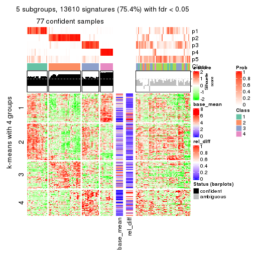</p>

</div>
<div id='tab-MAD-NMF-get-signatures-5'>
<pre><code class="r">get_signatures(res, k = 6)
</code></pre>

<p></p>

</div>
</div>


Signature heatmaps where rows are not scaled:


<script>
$( function() {
	$( '#tabs-MAD-NMF-get-signatures-no-scale' ).tabs();
} );
</script>
<div id='tabs-MAD-NMF-get-signatures-no-scale'>
<ul>
<li><a href='#tab-MAD-NMF-get-signatures-no-scale-1'>k = 2</a></li>
<li><a href='#tab-MAD-NMF-get-signatures-no-scale-2'>k = 3</a></li>
<li><a href='#tab-MAD-NMF-get-signatures-no-scale-3'>k = 4</a></li>
<li><a href='#tab-MAD-NMF-get-signatures-no-scale-4'>k = 5</a></li>
<li><a href='#tab-MAD-NMF-get-signatures-no-scale-5'>k = 6</a></li>
</ul>
<div id='tab-MAD-NMF-get-signatures-no-scale-1'>
<pre><code class="r">get_signatures(res, k = 2, scale_rows = FALSE)
</code></pre>

<p></p>

</div>
<div id='tab-MAD-NMF-get-signatures-no-scale-2'>
<pre><code class="r">get_signatures(res, k = 3, scale_rows = FALSE)
</code></pre>

<p></p>

</div>
<div id='tab-MAD-NMF-get-signatures-no-scale-3'>
<pre><code class="r">get_signatures(res, k = 4, scale_rows = FALSE)
</code></pre>

<p></p>

</div>
<div id='tab-MAD-NMF-get-signatures-no-scale-4'>
<pre><code class="r">get_signatures(res, k = 5, scale_rows = FALSE)
</code></pre>

<p>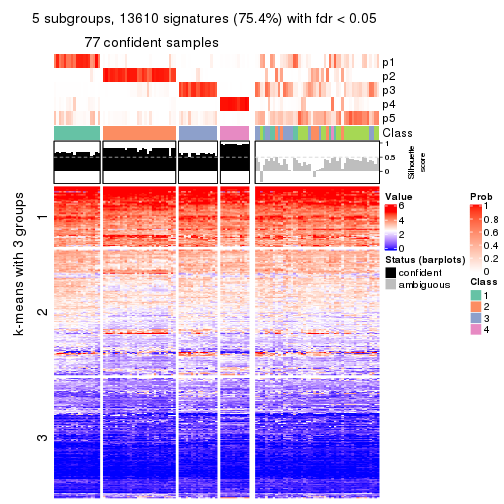</p>

</div>
<div id='tab-MAD-NMF-get-signatures-no-scale-5'>
<pre><code class="r">get_signatures(res, k = 6, scale_rows = FALSE)
</code></pre>

<p></p>

</div>
</div>


Compare the overlap of signatures from different k:

```r
compare_signatures(res)
```


`get_signature()` returns a data frame invisibly. TO get the list of signatures, the function
call should be assigned to a variable explicitly. In following code, if `plot` argument is set
to `FALSE`, no heatmap is plotted while only the differential analysis is performed.

```r
# code only for demonstration
tb = get_signature(res, k = ..., plot = FALSE)
```

An example of the output of `tb` is:

```
#>   which_row         fdr    mean_1    mean_2 scaled_mean_1 scaled_mean_2 km
#> 1        38 0.042760348  8.373488  9.131774    -0.5533452     0.5164555  1
#> 2        40 0.018707592  7.106213  8.469186    -0.6173731     0.5762149  1
#> 3        55 0.019134737 10.221463 11.207825    -0.6159697     0.5749050  1
#> 4        59 0.006059896  5.921854  7.869574    -0.6899429     0.6439467  1
#> 5        60 0.018055526  8.928898 10.211722    -0.6204761     0.5791110  1
#> 6        98 0.009384629 15.714769 14.887706     0.6635654    -0.6193277  2
...
```

The columns in `tb` are:

1. `which_row`: row indices corresponding to the input matrix.
2. `fdr`: FDR for the differential test. 
3. `mean_x`: The mean value in group x.
4. `scaled_mean_x`: The mean value in group x after rows are scaled.
5. `km`: Row groups if k-means clustering is applied to rows.


UMAP plot which shows how samples are separated.


<script>
$( function() {
	$( '#tabs-MAD-NMF-dimension-reduction' ).tabs();
} );
</script>
<div id='tabs-MAD-NMF-dimension-reduction'>
<ul>
<li><a href='#tab-MAD-NMF-dimension-reduction-1'>k = 2</a></li>
<li><a href='#tab-MAD-NMF-dimension-reduction-2'>k = 3</a></li>
<li><a href='#tab-MAD-NMF-dimension-reduction-3'>k = 4</a></li>
<li><a href='#tab-MAD-NMF-dimension-reduction-4'>k = 5</a></li>
<li><a href='#tab-MAD-NMF-dimension-reduction-5'>k = 6</a></li>
</ul>
<div id='tab-MAD-NMF-dimension-reduction-1'>
<pre><code class="r">dimension_reduction(res, k = 2, method = &quot;UMAP&quot;)
</code></pre>

<p></p>

</div>
<div id='tab-MAD-NMF-dimension-reduction-2'>
<pre><code class="r">dimension_reduction(res, k = 3, method = &quot;UMAP&quot;)
</code></pre>

<p></p>

</div>
<div id='tab-MAD-NMF-dimension-reduction-3'>
<pre><code class="r">dimension_reduction(res, k = 4, method = &quot;UMAP&quot;)
</code></pre>

<p></p>

</div>
<div id='tab-MAD-NMF-dimension-reduction-4'>
<pre><code class="r">dimension_reduction(res, k = 5, method = &quot;UMAP&quot;)
</code></pre>

<p></p>

</div>
<div id='tab-MAD-NMF-dimension-reduction-5'>
<pre><code class="r">dimension_reduction(res, k = 6, method = &quot;UMAP&quot;)
</code></pre>

<p></p>

</div>
</div>


Following heatmap shows how subgroups are split when increasing `k`:

```r
collect_classes(res)
```


If matrix rows can be associated to genes, consider to use `GO_Enrichment(res,
...)` to perform function enrichment for the signature genes.


 

---------------------------------------------------


### ATC:hclust


The object with results only for a single top-value method and a single partition method 
can be extracted as:

```r
res = res_list["ATC", "hclust"]
# you can also extract it by
# res = res_list["ATC:hclust"]
```

A summary of `res` and all the functions that can be applied to it:

```r
res
```

```
#> A 'ConsensusPartition' object with k = 2, 3, 4, 5, 6.
#>   On a matrix with 18041 rows and 126 columns.
#>   Top rows (1000, 2000, 3000, 4000, 5000) are extracted by 'ATC' method.
#>   Subgroups are detected by 'hclust' method.
#>   Performed in total 1250 partitions by row resampling.
#>   Best k for subgroups seems to be 6.
#> 
#> Following methods can be applied to this 'ConsensusPartition' object:
#>  [1] "cola_report"             "collect_classes"         "collect_plots"          
#>  [4] "collect_stats"           "colnames"                "compare_signatures"     
#>  [7] "consensus_heatmap"       "dimension_reduction"     "functional_enrichment"  
#> [10] "get_anno_col"            "get_anno"                "get_classes"            
#> [13] "get_consensus"           "get_matrix"              "get_membership"         
#> [16] "get_param"               "get_signatures"          "get_stats"              
#> [19] "is_best_k"               "is_stable_k"             "membership_heatmap"     
#> [22] "ncol"                    "nrow"                    "plot_ecdf"              
#> [25] "rownames"                "select_partition_number" "show"                   
#> [28] "suggest_best_k"          "test_to_known_factors"
```

`collect_plots()` function collects all the plots made from `res` for all `k` (number of partitions)
into one single page to provide an easy and fast comparison between different `k`.

```r
collect_plots(res)
```


The plots are:

- The first row: a plot of the ECDF (Empirical cumulative distribution
  function) curves of the consensus matrix for each `k` and the heatmap of
  predicted classes for each `k`.
- The second row: heatmaps of the consensus matrix for each `k`.
- The third row: heatmaps of the membership matrix for each `k`.
- The fouth row: heatmaps of the signatures for each `k`.

All the plots in panels can be made by individual functions and they are
plotted later in this section.

`select_partition_number()` produces several plots showing different
statistics for choosing "optimized" `k`. There are following statistics:

- ECDF curves of the consensus matrix for each `k`;
- 1-PAC. [The PAC
  score](https://en.wikipedia.org/wiki/Consensus_clustering#Over-interpretation_potential_of_consensus_clustering)
  measures the proportion of the ambiguous subgrouping.
- Mean silhouette score.
- Concordance. The mean probability of fiting the consensus class ids in all
  partitions.
- Area increased. Denote $A_k$ as the area under the ECDF curve for current
  `k`, the area increased is defined as $A_k - A_{k-1}$.
- Rand index. The percent of pairs of samples that are both in a same cluster
  or both are not in a same cluster in the partition of k and k-1.
- Jaccard index. The ratio of pairs of samples are both in a same cluster in
  the partition of k and k-1 and the pairs of samples are both in a same
  cluster in the partition k or k-1.

The detailed explanations of these statistics can be found in [the cola
vignette](http://bioconductor.org/packages/devel/bioc/vignettes/cola/inst/doc/cola.html#toc_13).

Generally speaking, lower PAC score, higher mean silhouette score or higher
concordance corresponds to better partition. Rand index and Jaccard index
measure how similar the current partition is compared to partition with `k-1`.
If they are too similar, we won't accept `k` is better than `k-1`.

```r
select_partition_number(res)
```


The numeric values for all these statistics can be obtained by `get_stats()`.

```r
get_stats(res)
```

```
#>   k 1-PAC mean_silhouette concordance area_increased  Rand Jaccard
#> 2 2 0.509           0.776       0.886         0.4669 0.497   0.497
#> 3 3 0.458           0.678       0.722         0.2596 0.918   0.839
#> 4 4 0.480           0.671       0.756         0.1140 0.926   0.832
#> 5 5 0.593           0.749       0.814         0.1228 0.873   0.654
#> 6 6 0.686           0.779       0.855         0.0555 0.978   0.910
```

`suggest_best_k()` suggests the best $k$ based on these statistics. The rules are as follows:

- All $k$ with Jaccard index larger than 0.95 are removed because the increase of
  the partition number does not provides enough extra information. If all $k$ are removed,
  the best $k$ is assigned by `NA`.
- For $k$ with 1-PAC larger than 0.9, the maximal $k$ is taken as the "best k". Other $k$ is called "optional k".
- If it does not fit the second rule. The $k$ with the highest vote of highest
  1-PAC, mean silhouette and concordance is taken as the "best k".

```r
suggest_best_k(res)
```

```
#> [1] 6
```


Following shows the table of the partitions (You need to click the **show/hide
code output** link to see it). The membership matrix (columns with name `p*`)
is inferred by
[`clue::cl_consensus()`](https://www.rdocumentation.org/link/cl_consensus?package=clue)
function with the `SE` method. Basically the value in the membership matrix
represents the probability to belong to a certain group. The finall class
label for an item is determined with the group with highest probability it
belongs to.

In `get_classes()` function, the entropy is calculated from the membership
matrix and the silhouette score is calculated from the consensus matrix.


<script>
$( function() {
	$( '#tabs-ATC-hclust-get-classes' ).tabs();
} );
</script>
<div id='tabs-ATC-hclust-get-classes'>
<ul>
<li><a href='#tab-ATC-hclust-get-classes-1'>k = 2</a></li>
<li><a href='#tab-ATC-hclust-get-classes-2'>k = 3</a></li>
<li><a href='#tab-ATC-hclust-get-classes-3'>k = 4</a></li>
<li><a href='#tab-ATC-hclust-get-classes-4'>k = 5</a></li>
<li><a href='#tab-ATC-hclust-get-classes-5'>k = 6</a></li>
</ul>

<div id='tab-ATC-hclust-get-classes-1'>
<p><a id='tab-ATC-hclust-get-classes-1-a' style='color:#0366d6' href='#'>show/hide code output</a></p>
<pre><code class="r">cbind(get_classes(res, k = 2), get_membership(res, k = 2))
</code></pre>

<pre><code>#&gt;                                      class entropy silhouette    p1    p2
#&gt; DC1F29A2-39DE-44AD-936A-54B2B32D6370     1  0.0000      0.920 1.000 0.000
#&gt; FA3C3413-FA8C-4A29-B9CA-5BC3A56274A8     2  0.8327      0.731 0.264 0.736
#&gt; B9B72975-8134-475C-BC0B-0CFDB24F636A     2  0.0672      0.796 0.008 0.992
#&gt; F44DB757-4D00-4BFC-99C5-AA82F99C5BDA     1  0.2948      0.889 0.948 0.052
#&gt; 3BD942BB-A3A7-4993-B3F1-B8641626B773     2  1.0000      0.317 0.500 0.500
#&gt; 431F73A2-2AB3-4101-B610-7FC02A7097EC     1  0.0672      0.916 0.992 0.008
#&gt; 3067683D-43D4-4F6D-9338-17F6A75E4B25     1  0.0672      0.916 0.992 0.008
#&gt; 2CE91B81-7CBE-4698-AFEE-6A154313D231     2  0.8327      0.731 0.264 0.736
#&gt; A639CF4F-4591-4337-A12E-BED71EDDA10B     1  0.0000      0.920 1.000 0.000
#&gt; 5482053D-9F48-4773-B68A-302B3A612503     1  0.0000      0.920 1.000 0.000
#&gt; A31D342D-C67C-428B-BAED-C6E844277A09     2  0.0000      0.796 0.000 1.000
#&gt; 0E9C5985-9AE0-4098-A076-6FFBBDF05110     1  0.2948      0.889 0.948 0.052
#&gt; 08CCF8A0-15B7-4A13-BC43-6B3B3E2DDE95     2  0.9661      0.585 0.392 0.608
#&gt; 10577D5B-AD56-403F-A562-73A9ACF2045B     1  0.0000      0.920 1.000 0.000
#&gt; C940D443-5DDA-4403-868B-7AA6B9A50FC4     1  0.0000      0.920 1.000 0.000
#&gt; 89D4D945-A717-495F-B253-F5A17CF5B9FA     1  0.9896      0.247 0.560 0.440
#&gt; DC55EE78-203F-4092-9B83-14B1A529194B     2  0.0000      0.796 0.000 1.000
#&gt; 8F7368BE-EB41-4192-89AA-9E0428C08851     2  0.0000      0.796 0.000 1.000
#&gt; F772EA39-E408-4908-BADD-C786D702BF9B     2  0.2603      0.795 0.044 0.956
#&gt; FD693D10-3ADA-4028-8392-41D2F0296F7E     2  0.9248      0.671 0.340 0.660
#&gt; 84F16966-7640-49F9-95D1-7648FF74DCC9     2  0.0000      0.796 0.000 1.000
#&gt; D26DAA2F-AE6A-42E1-9F1F-01943B99785F     2  0.0000      0.796 0.000 1.000
#&gt; F325847E-F046-4B67-B01C-16919C401020     1  0.0000      0.920 1.000 0.000
#&gt; 19EB2B10-2529-4A94-8FAE-1CE371A602D9     1  0.0000      0.920 1.000 0.000
#&gt; B94B9CCF-5FB8-44AE-8D9C-A194C6801A27     2  0.0000      0.796 0.000 1.000
#&gt; D2678E70-542A-4AB2-B881-12D66DBA44F5     2  0.9248      0.671 0.340 0.660
#&gt; 4961CA2A-70CD-42AB-A676-4A98C85F449F     2  0.9866      0.501 0.432 0.568
#&gt; 5AA74C5C-2AD1-4D59-A030-E964EB199581     1  0.0000      0.920 1.000 0.000
#&gt; F9E11A1B-BD93-438F-9670-6FB7DFF9E910     1  0.0000      0.920 1.000 0.000
#&gt; FB78CA5A-C8B9-42AF-9DAE-799CAB280B2E     1  0.0000      0.920 1.000 0.000
#&gt; A8E48877-F8AB-44DD-A18B-194D87C44931     2  0.8327      0.731 0.264 0.736
#&gt; CA50C495-F37E-4743-867D-FAF2DCC3376A     2  0.9170      0.679 0.332 0.668
#&gt; 37342369-EC22-4904-8CCD-A0DC6BD8D183     2  0.0000      0.796 0.000 1.000
#&gt; 91BA5F90-9174-4533-A050-39A28E34A94D     1  0.0000      0.920 1.000 0.000
#&gt; 5BC371AC-1915-44E9-A114-2963E131EC8D     2  0.0000      0.796 0.000 1.000
#&gt; 74A6C31A-7F21-45AF-A170-18C326D2AE69     1  0.0000      0.920 1.000 0.000
#&gt; 984F27EF-D4D7-4E68-BD64-776FDFC04D07     2  0.9323      0.661 0.348 0.652
#&gt; B05701C5-8C44-4FD1-94C9-FC0255A2EA24     1  0.4939      0.832 0.892 0.108
#&gt; 91E4119C-2CE6-4447-A125-6A4F403A89E6     1  0.5294      0.819 0.880 0.120
#&gt; 1570FCE7-F1B4-4BDF-A398-355EDF030864     2  0.8144      0.704 0.252 0.748
#&gt; 604C06E9-A00E-435E-847A-3992922A5C56     1  0.0376      0.918 0.996 0.004
#&gt; 455C9007-6FF4-4D63-83FA-4915F0331F9A     2  0.9323      0.661 0.348 0.652
#&gt; FB8BD3CF-D2EC-47B6-B67F-65ADC1C3A6A7     2  0.9866      0.501 0.432 0.568
#&gt; 9DC7443A-3C8F-4025-8312-3C98BF28D736     2  0.9248      0.671 0.340 0.660
#&gt; CB207A52-09AC-49D3-8240-5840CDFBB154     1  0.3114      0.883 0.944 0.056
#&gt; 2A335049-AD9F-4B32-92B7-69B04B0CF2BA     1  0.0000      0.920 1.000 0.000
#&gt; 6ACA6293-371E-428D-BBAE-ABFD410C886F     2  0.8327      0.731 0.264 0.736
#&gt; E8929929-73F9-4DB7-ABBA-0852BEFFFF7E     2  0.1633      0.796 0.024 0.976
#&gt; 5E343116-414B-41F2-AAEE-A3225450135A     1  0.6048      0.780 0.852 0.148
#&gt; 0A39073C-157C-48A1-B125-A6A04CB738DA     2  0.9129      0.682 0.328 0.672
#&gt; 300D78E6-1C7E-4114-80EA-9204A6818B9A     1  0.0000      0.920 1.000 0.000
#&gt; DAAF55AA-ED48-4221-9CD6-D1DEB6376017     2  0.0000      0.796 0.000 1.000
#&gt; D76FCF4A-4ACF-41EF-A120-64136D6C845E     1  0.0000      0.920 1.000 0.000
#&gt; AD294665-6F90-459C-90D5-3058F210225D     1  0.0000      0.920 1.000 0.000
#&gt; 92E8AD7A-1084-44C8-BDC0-FE4E47B6143F     1  0.2948      0.889 0.948 0.052
#&gt; 5644A861-3C59-486D-8FBE-4DF6A3B19558     1  0.0000      0.920 1.000 0.000
#&gt; 1BF8AAE7-B771-4CF2-8B1C-D2BEB5E6579E     1  0.0000      0.920 1.000 0.000
#&gt; A54731AE-FC40-407F-8D10-67DDC122237D     2  0.0000      0.796 0.000 1.000
#&gt; 179DC906-5654-4CBA-9C27-C9560B5F12DE     1  0.9970     -0.243 0.532 0.468
#&gt; 979B9A2B-2D81-47C3-A553-9B9441CAAE47     1  0.0000      0.920 1.000 0.000
#&gt; D69BD86A-08FB-49DA-9084-2725F6C9195F     1  0.2043      0.903 0.968 0.032
#&gt; 84611033-BCF7-49D7-9B91-DA29B62AC8D3     2  0.0000      0.796 0.000 1.000
#&gt; 8AA1DA3E-8C00-4653-AA33-EA70531C1E50     2  0.0000      0.796 0.000 1.000
#&gt; CEBE9594-0F19-46B4-AF7D-F8DF33E00AFB     2  0.9323      0.661 0.348 0.652
#&gt; C68E82D2-2BD3-41E9-92D7-D4C06E1953B2     1  1.0000     -0.328 0.504 0.496
#&gt; B855EF89-1E76-4408-AA65-61A0F0A4F412     2  0.0000      0.796 0.000 1.000
#&gt; 4488EFB3-5B01-41E3-B57E-8E4F607CF448     1  0.1843      0.906 0.972 0.028
#&gt; C2BD8440-CAC6-4FE5-8EBB-5E6AE308D52F     1  0.0000      0.920 1.000 0.000
#&gt; E0E50F10-1FED-41C1-84DB-81A46F25D7E9     2  0.9248      0.671 0.340 0.660
#&gt; EE16D845-31F2-4178-800B-CA2C358841AD     1  0.9896      0.247 0.560 0.440
#&gt; 169828CF-5693-4A46-B5D7-E45CBA9DF317     2  0.0000      0.796 0.000 1.000
#&gt; 51077BA3-AEE0-4BD4-A1B1-1B0A811642A1     1  0.0000      0.920 1.000 0.000
#&gt; D2F4E240-C44C-4CF7-8016-6CACD370D093     1  0.0000      0.920 1.000 0.000
#&gt; 721CDBE6-FC85-4C30-B23E-28407340286F     1  0.4815      0.836 0.896 0.104
#&gt; 392897E4-6009-422C-B461-649F4DDF260C     1  0.6148      0.772 0.848 0.152
#&gt; 617E13D2-6924-45F8-A8DE-BE21B718F822     2  0.9323      0.661 0.348 0.652
#&gt; 5746C00F-9CBB-46B7-83FD-90B2AB3F507B     1  0.0000      0.920 1.000 0.000
#&gt; 982B4344-A223-4D1F-9485-2E56F9FD45C0     2  0.0000      0.796 0.000 1.000
#&gt; E5557F52-015D-49DC-9E23-989FC259976F     1  0.0000      0.920 1.000 0.000
#&gt; F3135F5E-2E90-4923-B634-E994563D17B7     1  0.1184      0.912 0.984 0.016
#&gt; D1ED15A5-9802-4314-B556-E89EB772D1F0     1  0.0000      0.920 1.000 0.000
#&gt; 222B06E3-FCFB-4104-92C3-D73BC31854D4     1  0.0000      0.920 1.000 0.000
#&gt; 4C810FFA-ED07-4F4C-9F81-B8F1CF4956F7     2  0.9209      0.675 0.336 0.664
#&gt; 9A608964-ED12-4E6E-9D3A-430F59FFF65B     1  0.0000      0.920 1.000 0.000
#&gt; 4087357F-C17A-4992-A8AB-41ACA2F72001     2  0.9209      0.675 0.336 0.664
#&gt; B3F013A5-BCB8-4CE0-86B2-634EE180AA6E     2  0.0000      0.796 0.000 1.000
#&gt; 322AF320-1379-4F51-AFDC-5292A060CD52     2  0.2603      0.795 0.044 0.956
#&gt; 53A96249-66D5-4C26-893B-ADC71481D261     2  0.6712      0.764 0.176 0.824
#&gt; 1AB7A6F2-14BD-447C-B2E3-DEB0CE56B209     1  0.0000      0.920 1.000 0.000
#&gt; 8B4BCDA0-6787-4A55-99F7-AAF22AF85BA6     2  0.0000      0.796 0.000 1.000
#&gt; 5D9D9E08-2C2C-414E-9547-62799F90D543     2  0.0000      0.796 0.000 1.000
#&gt; C345CD17-E4F4-41D5-9891-FEFB19342C52     1  0.0000      0.920 1.000 0.000
#&gt; 1AF8FDE1-1A74-41F6-A1C5-4952CDFB7D3F     1  0.0000      0.920 1.000 0.000
#&gt; BC3405FF-0660-4B2B-8DC1-5F34D3133078     1  0.4815      0.836 0.896 0.104
#&gt; C2662596-6E2F-4924-B051-CEA1AC87B197     1  0.0000      0.920 1.000 0.000
#&gt; 39AE85F7-49FB-4438-BD41-6AC812FA1C72     1  0.0000      0.920 1.000 0.000
#&gt; 6FF266DB-3F08-43F2-8F6F-679F805B80B8     1  0.6048      0.780 0.852 0.148
#&gt; B03B7B81-BBD6-4194-BC5E-6EDF0D3F015A     2  0.0000      0.796 0.000 1.000
#&gt; C7617D56-F13C-4C43-906C-BD458C5DC4CD     1  0.6048      0.780 0.852 0.148
#&gt; 09420F8B-7A71-4B32-8388-4767670F1FEB     1  0.2043      0.903 0.968 0.032
#&gt; 6AF47534-74FF-4128-865B-4E8EE1FFB469     2  0.0000      0.796 0.000 1.000
#&gt; 8FF9E94A-2ED2-4727-947F-D524D7ECE815     2  0.9323      0.661 0.348 0.652
#&gt; A390E20D-03F9-40E4-A132-0FA5C2BEDB63     2  0.9552      0.619 0.376 0.624
#&gt; A489CCCA-1374-4071-80CE-05B83C9A0D5E     2  0.8327      0.731 0.264 0.736
#&gt; 2D962371-EC83-490C-A663-478AF383BC1B     2  0.0000      0.796 0.000 1.000
#&gt; D91B31A1-EE71-4726-B94C-0CC2815E9D4E     1  0.2948      0.889 0.948 0.052
#&gt; E0123C5C-E1D1-4162-9895-CC8B01949D84     2  0.9522      0.622 0.372 0.628
#&gt; EC73959A-2728-49FE-B72A-790BB14F4CBF     1  0.0000      0.920 1.000 0.000
#&gt; A60DC925-7343-496E-900D-0DD81D5C8123     2  0.0000      0.796 0.000 1.000
#&gt; 659B64DB-F4A5-43BD-811B-05004CB49D99     1  0.0000      0.920 1.000 0.000
#&gt; 6969B6B2-7616-4664-9696-C4DACD10537B     2  0.0000      0.796 0.000 1.000
#&gt; 2F6392DE-0D54-4768-B062-907C81E5B0CC     2  1.0000      0.317 0.500 0.500
#&gt; C74BE8C5-BA6D-4596-9D67-3C731799F999     2  0.9248      0.671 0.340 0.660
#&gt; 79A7647F-BDBA-45A2-B207-ABF788F6CC95     1  0.0000      0.920 1.000 0.000
#&gt; D47D0433-2313-4A2F-B268-5AD293D7534E     2  0.2423      0.796 0.040 0.960
#&gt; C5058B93-C1DA-43B9-9951-B23A9810AA6E     1  0.0000      0.920 1.000 0.000
#&gt; 2629FEE3-A203-4411-8A70-02A796C9505C     2  0.7056      0.760 0.192 0.808
#&gt; 1AF329E4-11D4-4CFC-801F-C24A1EA33102     1  0.9896      0.247 0.560 0.440
#&gt; D453BEF8-3F18-4B89-BA42-CE74EB105032     1  0.0000      0.920 1.000 0.000
#&gt; B12A4446-2310-4139-897F-CA030478CBD5     1  0.3431      0.876 0.936 0.064
#&gt; BCAB1918-5FA9-4CBD-85CB-008743FEA2CC     1  0.0000      0.920 1.000 0.000
#&gt; 9A5432D3-19EE-47B4-BD88-698DEC75A5E9     2  0.0000      0.796 0.000 1.000
#&gt; A608BCEB-2C27-4927-A308-E6975F641722     1  0.9896      0.247 0.560 0.440
#&gt; E4752275-7BF6-4C1E-8A45-C7D571ED85AD     2  0.2603      0.795 0.044 0.956
#&gt; FDEC1714-C02D-4AB7-AE82-789E9D709EDE     1  0.0000      0.920 1.000 0.000
#&gt; 33737781-8638-4FA2-AD4C-E888BB9343D8     2  0.8327      0.731 0.264 0.736
</code></pre>

<script>
$('#tab-ATC-hclust-get-classes-1-a').parent().next().next().hide();
$('#tab-ATC-hclust-get-classes-1-a').click(function(){
  $('#tab-ATC-hclust-get-classes-1-a').parent().next().next().toggle();
  return(false);
});
</script>
</div>

<div id='tab-ATC-hclust-get-classes-2'>
<p><a id='tab-ATC-hclust-get-classes-2-a' style='color:#0366d6' href='#'>show/hide code output</a></p>
<pre><code class="r">cbind(get_classes(res, k = 3), get_membership(res, k = 3))
</code></pre>

<pre><code>#&gt;                                      class entropy silhouette    p1    p2    p3
#&gt; DC1F29A2-39DE-44AD-936A-54B2B32D6370     1  0.4887      0.824 0.772 0.000 0.228
#&gt; FA3C3413-FA8C-4A29-B9CA-5BC3A56274A8     2  0.6931      0.693 0.032 0.640 0.328
#&gt; B9B72975-8134-475C-BC0B-0CFDB24F636A     2  0.3573      0.322 0.004 0.876 0.120
#&gt; F44DB757-4D00-4BFC-99C5-AA82F99C5BDA     1  0.3619      0.740 0.864 0.000 0.136
#&gt; 3BD942BB-A3A7-4993-B3F1-B8641626B773     2  0.9579      0.505 0.200 0.432 0.368
#&gt; 431F73A2-2AB3-4101-B610-7FC02A7097EC     1  0.2066      0.785 0.940 0.000 0.060
#&gt; 3067683D-43D4-4F6D-9338-17F6A75E4B25     1  0.2066      0.785 0.940 0.000 0.060
#&gt; 2CE91B81-7CBE-4698-AFEE-6A154313D231     2  0.6931      0.693 0.032 0.640 0.328
#&gt; A639CF4F-4591-4337-A12E-BED71EDDA10B     1  0.4796      0.826 0.780 0.000 0.220
#&gt; 5482053D-9F48-4773-B68A-302B3A612503     1  0.4796      0.826 0.780 0.000 0.220
#&gt; A31D342D-C67C-428B-BAED-C6E844277A09     2  0.1753      0.488 0.000 0.952 0.048
#&gt; 0E9C5985-9AE0-4098-A076-6FFBBDF05110     1  0.3619      0.740 0.864 0.000 0.136
#&gt; 08CCF8A0-15B7-4A13-BC43-6B3B3E2DDE95     2  0.8477      0.664 0.096 0.524 0.380
#&gt; 10577D5B-AD56-403F-A562-73A9ACF2045B     1  0.0000      0.769 1.000 0.000 0.000
#&gt; C940D443-5DDA-4403-868B-7AA6B9A50FC4     1  0.4796      0.826 0.780 0.000 0.220
#&gt; 89D4D945-A717-495F-B253-F5A17CF5B9FA     1  0.9588      0.271 0.476 0.240 0.284
#&gt; DC55EE78-203F-4092-9B83-14B1A529194B     3  0.6180      1.000 0.000 0.416 0.584
#&gt; 8F7368BE-EB41-4192-89AA-9E0428C08851     2  0.3482      0.313 0.000 0.872 0.128
#&gt; F772EA39-E408-4908-BADD-C786D702BF9B     2  0.1964      0.506 0.000 0.944 0.056
#&gt; FD693D10-3ADA-4028-8392-41D2F0296F7E     2  0.7451      0.694 0.040 0.564 0.396
#&gt; 84F16966-7640-49F9-95D1-7648FF74DCC9     3  0.6180      1.000 0.000 0.416 0.584
#&gt; D26DAA2F-AE6A-42E1-9F1F-01943B99785F     2  0.1753      0.488 0.000 0.952 0.048
#&gt; F325847E-F046-4B67-B01C-16919C401020     1  0.0000      0.769 1.000 0.000 0.000
#&gt; 19EB2B10-2529-4A94-8FAE-1CE371A602D9     1  0.4796      0.826 0.780 0.000 0.220
#&gt; B94B9CCF-5FB8-44AE-8D9C-A194C6801A27     2  0.2261      0.371 0.000 0.932 0.068
#&gt; D2678E70-542A-4AB2-B881-12D66DBA44F5     2  0.7451      0.694 0.040 0.564 0.396
#&gt; 4961CA2A-70CD-42AB-A676-4A98C85F449F     2  0.8927      0.622 0.128 0.488 0.384
#&gt; 5AA74C5C-2AD1-4D59-A030-E964EB199581     1  0.1411      0.770 0.964 0.000 0.036
#&gt; F9E11A1B-BD93-438F-9670-6FB7DFF9E910     1  0.4796      0.826 0.780 0.000 0.220
#&gt; FB78CA5A-C8B9-42AF-9DAE-799CAB280B2E     1  0.0000      0.769 1.000 0.000 0.000
#&gt; A8E48877-F8AB-44DD-A18B-194D87C44931     2  0.6931      0.693 0.032 0.640 0.328
#&gt; CA50C495-F37E-4743-867D-FAF2DCC3376A     2  0.7794      0.693 0.060 0.572 0.368
#&gt; 37342369-EC22-4904-8CCD-A0DC6BD8D183     2  0.1031      0.430 0.000 0.976 0.024
#&gt; 91BA5F90-9174-4533-A050-39A28E34A94D     1  0.4796      0.826 0.780 0.000 0.220
#&gt; 5BC371AC-1915-44E9-A114-2963E131EC8D     2  0.3619      0.285 0.000 0.864 0.136
#&gt; 74A6C31A-7F21-45AF-A170-18C326D2AE69     1  0.4842      0.825 0.776 0.000 0.224
#&gt; 984F27EF-D4D7-4E68-BD64-776FDFC04D07     2  0.7476      0.692 0.040 0.556 0.404
#&gt; B05701C5-8C44-4FD1-94C9-FC0255A2EA24     1  0.7442      0.699 0.604 0.048 0.348
#&gt; 91E4119C-2CE6-4447-A125-6A4F403A89E6     1  0.7705      0.698 0.604 0.064 0.332
#&gt; 1570FCE7-F1B4-4BDF-A398-355EDF030864     2  0.8436      0.435 0.160 0.616 0.224
#&gt; 604C06E9-A00E-435E-847A-3992922A5C56     1  0.4842      0.825 0.776 0.000 0.224
#&gt; 455C9007-6FF4-4D63-83FA-4915F0331F9A     2  0.7476      0.692 0.040 0.556 0.404
#&gt; FB8BD3CF-D2EC-47B6-B67F-65ADC1C3A6A7     2  0.8927      0.622 0.128 0.488 0.384
#&gt; 9DC7443A-3C8F-4025-8312-3C98BF28D736     2  0.7451      0.694 0.040 0.564 0.396
#&gt; CB207A52-09AC-49D3-8240-5840CDFBB154     1  0.6798      0.777 0.696 0.048 0.256
#&gt; 2A335049-AD9F-4B32-92B7-69B04B0CF2BA     1  0.1411      0.770 0.964 0.000 0.036
#&gt; 6ACA6293-371E-428D-BBAE-ABFD410C886F     2  0.6931      0.693 0.032 0.640 0.328
#&gt; E8929929-73F9-4DB7-ABBA-0852BEFFFF7E     2  0.3340      0.544 0.000 0.880 0.120
#&gt; 5E343116-414B-41F2-AAEE-A3225450135A     1  0.8022      0.625 0.544 0.068 0.388
#&gt; 0A39073C-157C-48A1-B125-A6A04CB738DA     2  0.7903      0.692 0.068 0.576 0.356
#&gt; 300D78E6-1C7E-4114-80EA-9204A6818B9A     1  0.1411      0.770 0.964 0.000 0.036
#&gt; DAAF55AA-ED48-4221-9CD6-D1DEB6376017     2  0.3619      0.238 0.000 0.864 0.136
#&gt; D76FCF4A-4ACF-41EF-A120-64136D6C845E     1  0.1411      0.770 0.964 0.000 0.036
#&gt; AD294665-6F90-459C-90D5-3058F210225D     1  0.4887      0.824 0.772 0.000 0.228
#&gt; 92E8AD7A-1084-44C8-BDC0-FE4E47B6143F     1  0.3619      0.740 0.864 0.000 0.136
#&gt; 5644A861-3C59-486D-8FBE-4DF6A3B19558     1  0.4796      0.826 0.780 0.000 0.220
#&gt; 1BF8AAE7-B771-4CF2-8B1C-D2BEB5E6579E     1  0.1411      0.770 0.964 0.000 0.036
#&gt; A54731AE-FC40-407F-8D10-67DDC122237D     3  0.6180      1.000 0.000 0.416 0.584
#&gt; 179DC906-5654-4CBA-9C27-C9560B5F12DE     2  0.9795      0.423 0.256 0.428 0.316
#&gt; 979B9A2B-2D81-47C3-A553-9B9441CAAE47     1  0.4887      0.824 0.772 0.000 0.228
#&gt; D69BD86A-08FB-49DA-9084-2725F6C9195F     1  0.5497      0.794 0.708 0.000 0.292
#&gt; 84611033-BCF7-49D7-9B91-DA29B62AC8D3     2  0.3482      0.313 0.000 0.872 0.128
#&gt; 8AA1DA3E-8C00-4653-AA33-EA70531C1E50     3  0.6180      1.000 0.000 0.416 0.584
#&gt; CEBE9594-0F19-46B4-AF7D-F8DF33E00AFB     2  0.7476      0.692 0.040 0.556 0.404
#&gt; C68E82D2-2BD3-41E9-92D7-D4C06E1953B2     2  0.9641      0.490 0.212 0.432 0.356
#&gt; B855EF89-1E76-4408-AA65-61A0F0A4F412     2  0.2261      0.371 0.000 0.932 0.068
#&gt; 4488EFB3-5B01-41E3-B57E-8E4F607CF448     1  0.2959      0.755 0.900 0.000 0.100
#&gt; C2BD8440-CAC6-4FE5-8EBB-5E6AE308D52F     1  0.4796      0.826 0.780 0.000 0.220
#&gt; E0E50F10-1FED-41C1-84DB-81A46F25D7E9     2  0.7451      0.694 0.040 0.564 0.396
#&gt; EE16D845-31F2-4178-800B-CA2C358841AD     1  0.9588      0.271 0.476 0.240 0.284
#&gt; 169828CF-5693-4A46-B5D7-E45CBA9DF317     2  0.2261      0.371 0.000 0.932 0.068
#&gt; 51077BA3-AEE0-4BD4-A1B1-1B0A811642A1     1  0.4796      0.826 0.780 0.000 0.220
#&gt; D2F4E240-C44C-4CF7-8016-6CACD370D093     1  0.0000      0.769 1.000 0.000 0.000
#&gt; 721CDBE6-FC85-4C30-B23E-28407340286F     1  0.7401      0.706 0.612 0.048 0.340
#&gt; 392897E4-6009-422C-B461-649F4DDF260C     1  0.8264      0.628 0.556 0.088 0.356
#&gt; 617E13D2-6924-45F8-A8DE-BE21B718F822     2  0.7476      0.692 0.040 0.556 0.404
#&gt; 5746C00F-9CBB-46B7-83FD-90B2AB3F507B     1  0.0000      0.769 1.000 0.000 0.000
#&gt; 982B4344-A223-4D1F-9485-2E56F9FD45C0     3  0.6180      1.000 0.000 0.416 0.584
#&gt; E5557F52-015D-49DC-9E23-989FC259976F     1  0.4796      0.826 0.780 0.000 0.220
#&gt; F3135F5E-2E90-4923-B634-E994563D17B7     1  0.5541      0.809 0.740 0.008 0.252
#&gt; D1ED15A5-9802-4314-B556-E89EB772D1F0     1  0.4796      0.826 0.780 0.000 0.220
#&gt; 222B06E3-FCFB-4104-92C3-D73BC31854D4     1  0.0000      0.769 1.000 0.000 0.000
#&gt; 4C810FFA-ED07-4F4C-9F81-B8F1CF4956F7     2  0.7438      0.695 0.040 0.568 0.392
#&gt; 9A608964-ED12-4E6E-9D3A-430F59FFF65B     1  0.4796      0.826 0.780 0.000 0.220
#&gt; 4087357F-C17A-4992-A8AB-41ACA2F72001     2  0.7438      0.695 0.040 0.568 0.392
#&gt; B3F013A5-BCB8-4CE0-86B2-634EE180AA6E     3  0.6180      1.000 0.000 0.416 0.584
#&gt; 322AF320-1379-4F51-AFDC-5292A060CD52     2  0.3500      0.470 0.004 0.880 0.116
#&gt; 53A96249-66D5-4C26-893B-ADC71481D261     2  0.5119      0.612 0.028 0.812 0.160
#&gt; 1AB7A6F2-14BD-447C-B2E3-DEB0CE56B209     1  0.0000      0.769 1.000 0.000 0.000
#&gt; 8B4BCDA0-6787-4A55-99F7-AAF22AF85BA6     3  0.6180      1.000 0.000 0.416 0.584
#&gt; 5D9D9E08-2C2C-414E-9547-62799F90D543     2  0.0592      0.436 0.000 0.988 0.012
#&gt; C345CD17-E4F4-41D5-9891-FEFB19342C52     1  0.0000      0.769 1.000 0.000 0.000
#&gt; 1AF8FDE1-1A74-41F6-A1C5-4952CDFB7D3F     1  0.0000      0.769 1.000 0.000 0.000
#&gt; BC3405FF-0660-4B2B-8DC1-5F34D3133078     1  0.7348      0.704 0.608 0.044 0.348
#&gt; C2662596-6E2F-4924-B051-CEA1AC87B197     1  0.4796      0.826 0.780 0.000 0.220
#&gt; 39AE85F7-49FB-4438-BD41-6AC812FA1C72     1  0.4796      0.826 0.780 0.000 0.220
#&gt; 6FF266DB-3F08-43F2-8F6F-679F805B80B8     1  0.8022      0.625 0.544 0.068 0.388
#&gt; B03B7B81-BBD6-4194-BC5E-6EDF0D3F015A     2  0.1753      0.488 0.000 0.952 0.048
#&gt; C7617D56-F13C-4C43-906C-BD458C5DC4CD     1  0.8022      0.625 0.544 0.068 0.388
#&gt; 09420F8B-7A71-4B32-8388-4767670F1FEB     1  0.5497      0.794 0.708 0.000 0.292
#&gt; 6AF47534-74FF-4128-865B-4E8EE1FFB469     3  0.6180      1.000 0.000 0.416 0.584
#&gt; 8FF9E94A-2ED2-4727-947F-D524D7ECE815     2  0.7476      0.692 0.040 0.556 0.404
#&gt; A390E20D-03F9-40E4-A132-0FA5C2BEDB63     2  0.8097      0.679 0.072 0.540 0.388
#&gt; A489CCCA-1374-4071-80CE-05B83C9A0D5E     2  0.6931      0.693 0.032 0.640 0.328
#&gt; 2D962371-EC83-490C-A663-478AF383BC1B     2  0.2261      0.371 0.000 0.932 0.068
#&gt; D91B31A1-EE71-4726-B94C-0CC2815E9D4E     1  0.3619      0.740 0.864 0.000 0.136
#&gt; E0123C5C-E1D1-4162-9895-CC8B01949D84     2  0.8257      0.677 0.084 0.544 0.372
#&gt; EC73959A-2728-49FE-B72A-790BB14F4CBF     1  0.4842      0.825 0.776 0.000 0.224
#&gt; A60DC925-7343-496E-900D-0DD81D5C8123     2  0.3412      0.331 0.000 0.876 0.124
#&gt; 659B64DB-F4A5-43BD-811B-05004CB49D99     1  0.4796      0.826 0.780 0.000 0.220
#&gt; 6969B6B2-7616-4664-9696-C4DACD10537B     2  0.2261      0.371 0.000 0.932 0.068
#&gt; 2F6392DE-0D54-4768-B062-907C81E5B0CC     2  0.9579      0.505 0.200 0.432 0.368
#&gt; C74BE8C5-BA6D-4596-9D67-3C731799F999     2  0.7451      0.694 0.040 0.564 0.396
#&gt; 79A7647F-BDBA-45A2-B207-ABF788F6CC95     1  0.4796      0.826 0.780 0.000 0.220
#&gt; D47D0433-2313-4A2F-B268-5AD293D7534E     2  0.1860      0.502 0.000 0.948 0.052
#&gt; C5058B93-C1DA-43B9-9951-B23A9810AA6E     1  0.1411      0.770 0.964 0.000 0.036
#&gt; 2629FEE3-A203-4411-8A70-02A796C9505C     2  0.6226      0.666 0.028 0.720 0.252
#&gt; 1AF329E4-11D4-4CFC-801F-C24A1EA33102     1  0.9588      0.271 0.476 0.240 0.284
#&gt; D453BEF8-3F18-4B89-BA42-CE74EB105032     1  0.0000      0.769 1.000 0.000 0.000
#&gt; B12A4446-2310-4139-897F-CA030478CBD5     1  0.6869      0.771 0.688 0.048 0.264
#&gt; BCAB1918-5FA9-4CBD-85CB-008743FEA2CC     1  0.4796      0.826 0.780 0.000 0.220
#&gt; 9A5432D3-19EE-47B4-BD88-698DEC75A5E9     2  0.2261      0.371 0.000 0.932 0.068
#&gt; A608BCEB-2C27-4927-A308-E6975F641722     1  0.9588      0.271 0.476 0.240 0.284
#&gt; E4752275-7BF6-4C1E-8A45-C7D571ED85AD     2  0.1964      0.506 0.000 0.944 0.056
#&gt; FDEC1714-C02D-4AB7-AE82-789E9D709EDE     1  0.4887      0.824 0.772 0.000 0.228
#&gt; 33737781-8638-4FA2-AD4C-E888BB9343D8     2  0.6931      0.693 0.032 0.640 0.328
</code></pre>

<script>
$('#tab-ATC-hclust-get-classes-2-a').parent().next().next().hide();
$('#tab-ATC-hclust-get-classes-2-a').click(function(){
  $('#tab-ATC-hclust-get-classes-2-a').parent().next().next().toggle();
  return(false);
});
</script>
</div>

<div id='tab-ATC-hclust-get-classes-3'>
<p><a id='tab-ATC-hclust-get-classes-3-a' style='color:#0366d6' href='#'>show/hide code output</a></p>
<pre><code class="r">cbind(get_classes(res, k = 4), get_membership(res, k = 4))
</code></pre>

<pre><code>#&gt;                                      class entropy silhouette    p1    p2    p3    p4
#&gt; DC1F29A2-39DE-44AD-936A-54B2B32D6370     1  0.0376     0.7440 0.992 0.000 0.004 0.004
#&gt; FA3C3413-FA8C-4A29-B9CA-5BC3A56274A8     4  0.4707     0.7567 0.204 0.036 0.000 0.760
#&gt; B9B72975-8134-475C-BC0B-0CFDB24F636A     4  0.6082     0.1191 0.008 0.192 0.104 0.696
#&gt; F44DB757-4D00-4BFC-99C5-AA82F99C5BDA     1  0.6961     0.6073 0.496 0.000 0.388 0.116
#&gt; 3BD942BB-A3A7-4993-B3F1-B8641626B773     4  0.5320     0.6428 0.416 0.000 0.012 0.572
#&gt; 431F73A2-2AB3-4101-B610-7FC02A7097EC     1  0.5184     0.6965 0.672 0.000 0.304 0.024
#&gt; 3067683D-43D4-4F6D-9338-17F6A75E4B25     1  0.5184     0.6965 0.672 0.000 0.304 0.024
#&gt; 2CE91B81-7CBE-4698-AFEE-6A154313D231     4  0.4707     0.7567 0.204 0.036 0.000 0.760
#&gt; A639CF4F-4591-4337-A12E-BED71EDDA10B     1  0.0000     0.7459 1.000 0.000 0.000 0.000
#&gt; 5482053D-9F48-4773-B68A-302B3A612503     1  0.0000     0.7459 1.000 0.000 0.000 0.000
#&gt; A31D342D-C67C-428B-BAED-C6E844277A09     2  0.4832     0.7638 0.000 0.768 0.056 0.176
#&gt; 0E9C5985-9AE0-4098-A076-6FFBBDF05110     1  0.6961     0.6073 0.496 0.000 0.388 0.116
#&gt; 08CCF8A0-15B7-4A13-BC43-6B3B3E2DDE95     4  0.4746     0.7683 0.304 0.000 0.008 0.688
#&gt; 10577D5B-AD56-403F-A562-73A9ACF2045B     1  0.4585     0.6759 0.668 0.000 0.332 0.000
#&gt; C940D443-5DDA-4403-868B-7AA6B9A50FC4     1  0.0000     0.7459 1.000 0.000 0.000 0.000
#&gt; 89D4D945-A717-495F-B253-F5A17CF5B9FA     1  0.9266     0.1663 0.372 0.088 0.236 0.304
#&gt; DC55EE78-203F-4092-9B83-14B1A529194B     3  0.7289     0.9824 0.000 0.252 0.536 0.212
#&gt; 8F7368BE-EB41-4192-89AA-9E0428C08851     4  0.5690     0.0948 0.000 0.216 0.084 0.700
#&gt; F772EA39-E408-4908-BADD-C786D702BF9B     2  0.5755     0.6693 0.040 0.664 0.008 0.288
#&gt; FD693D10-3ADA-4028-8392-41D2F0296F7E     4  0.4134     0.7927 0.260 0.000 0.000 0.740
#&gt; 84F16966-7640-49F9-95D1-7648FF74DCC9     3  0.7331     0.9804 0.000 0.260 0.528 0.212
#&gt; D26DAA2F-AE6A-42E1-9F1F-01943B99785F     2  0.4832     0.7638 0.000 0.768 0.056 0.176
#&gt; F325847E-F046-4B67-B01C-16919C401020     1  0.4564     0.6774 0.672 0.000 0.328 0.000
#&gt; 19EB2B10-2529-4A94-8FAE-1CE371A602D9     1  0.0000     0.7459 1.000 0.000 0.000 0.000
#&gt; B94B9CCF-5FB8-44AE-8D9C-A194C6801A27     2  0.3056     0.7260 0.000 0.888 0.072 0.040
#&gt; D2678E70-542A-4AB2-B881-12D66DBA44F5     4  0.4134     0.7927 0.260 0.000 0.000 0.740
#&gt; 4961CA2A-70CD-42AB-A676-4A98C85F449F     4  0.5057     0.7428 0.340 0.000 0.012 0.648
#&gt; 5AA74C5C-2AD1-4D59-A030-E964EB199581     1  0.5478     0.6710 0.628 0.000 0.344 0.028
#&gt; F9E11A1B-BD93-438F-9670-6FB7DFF9E910     1  0.0188     0.7461 0.996 0.000 0.004 0.000
#&gt; FB78CA5A-C8B9-42AF-9DAE-799CAB280B2E     1  0.4564     0.6774 0.672 0.000 0.328 0.000
#&gt; A8E48877-F8AB-44DD-A18B-194D87C44931     4  0.4707     0.7567 0.204 0.036 0.000 0.760
#&gt; CA50C495-F37E-4743-867D-FAF2DCC3376A     4  0.4452     0.7878 0.260 0.008 0.000 0.732
#&gt; 37342369-EC22-4904-8CCD-A0DC6BD8D183     2  0.2814     0.7750 0.000 0.868 0.000 0.132
#&gt; 91BA5F90-9174-4533-A050-39A28E34A94D     1  0.0000     0.7459 1.000 0.000 0.000 0.000
#&gt; 5BC371AC-1915-44E9-A114-2963E131EC8D     4  0.6549    -0.1257 0.000 0.268 0.120 0.612
#&gt; 74A6C31A-7F21-45AF-A170-18C326D2AE69     1  0.0188     0.7445 0.996 0.000 0.000 0.004
#&gt; 984F27EF-D4D7-4E68-BD64-776FDFC04D07     4  0.4452     0.7921 0.260 0.000 0.008 0.732
#&gt; B05701C5-8C44-4FD1-94C9-FC0255A2EA24     1  0.3718     0.5901 0.820 0.000 0.012 0.168
#&gt; 91E4119C-2CE6-4447-A125-6A4F403A89E6     1  0.3718     0.5854 0.820 0.000 0.012 0.168
#&gt; 1570FCE7-F1B4-4BDF-A398-355EDF030864     4  0.5919     0.3670 0.044 0.036 0.204 0.716
#&gt; 604C06E9-A00E-435E-847A-3992922A5C56     1  0.0188     0.7447 0.996 0.000 0.000 0.004
#&gt; 455C9007-6FF4-4D63-83FA-4915F0331F9A     4  0.4452     0.7921 0.260 0.000 0.008 0.732
#&gt; FB8BD3CF-D2EC-47B6-B67F-65ADC1C3A6A7     4  0.5057     0.7428 0.340 0.000 0.012 0.648
#&gt; 9DC7443A-3C8F-4025-8312-3C98BF28D736     4  0.4134     0.7927 0.260 0.000 0.000 0.740
#&gt; CB207A52-09AC-49D3-8240-5840CDFBB154     1  0.2402     0.6844 0.912 0.000 0.012 0.076
#&gt; 2A335049-AD9F-4B32-92B7-69B04B0CF2BA     1  0.5478     0.6710 0.628 0.000 0.344 0.028
#&gt; 6ACA6293-371E-428D-BBAE-ABFD410C886F     4  0.4707     0.7567 0.204 0.036 0.000 0.760
#&gt; E8929929-73F9-4DB7-ABBA-0852BEFFFF7E     2  0.4927     0.7219 0.012 0.728 0.012 0.248
#&gt; 5E343116-414B-41F2-AAEE-A3225450135A     1  0.4319     0.4987 0.760 0.000 0.012 0.228
#&gt; 0A39073C-157C-48A1-B125-A6A04CB738DA     4  0.4576     0.7838 0.260 0.012 0.000 0.728
#&gt; 300D78E6-1C7E-4114-80EA-9204A6818B9A     1  0.5478     0.6710 0.628 0.000 0.344 0.028
#&gt; DAAF55AA-ED48-4221-9CD6-D1DEB6376017     4  0.6178    -0.0338 0.000 0.228 0.112 0.660
#&gt; D76FCF4A-4ACF-41EF-A120-64136D6C845E     1  0.5478     0.6710 0.628 0.000 0.344 0.028
#&gt; AD294665-6F90-459C-90D5-3058F210225D     1  0.0376     0.7440 0.992 0.000 0.004 0.004
#&gt; 92E8AD7A-1084-44C8-BDC0-FE4E47B6143F     1  0.6961     0.6073 0.496 0.000 0.388 0.116
#&gt; 5644A861-3C59-486D-8FBE-4DF6A3B19558     1  0.0000     0.7459 1.000 0.000 0.000 0.000
#&gt; 1BF8AAE7-B771-4CF2-8B1C-D2BEB5E6579E     1  0.5478     0.6710 0.628 0.000 0.344 0.028
#&gt; A54731AE-FC40-407F-8D10-67DDC122237D     3  0.7171     0.9754 0.000 0.232 0.556 0.212
#&gt; 179DC906-5654-4CBA-9C27-C9560B5F12DE     4  0.5402     0.5594 0.472 0.000 0.012 0.516
#&gt; 979B9A2B-2D81-47C3-A553-9B9441CAAE47     1  0.0376     0.7440 0.992 0.000 0.004 0.004
#&gt; D69BD86A-08FB-49DA-9084-2725F6C9195F     1  0.2124     0.7019 0.924 0.000 0.008 0.068
#&gt; 84611033-BCF7-49D7-9B91-DA29B62AC8D3     4  0.5690     0.0948 0.000 0.216 0.084 0.700
#&gt; 8AA1DA3E-8C00-4653-AA33-EA70531C1E50     3  0.7331     0.9804 0.000 0.260 0.528 0.212
#&gt; CEBE9594-0F19-46B4-AF7D-F8DF33E00AFB     4  0.4452     0.7921 0.260 0.000 0.008 0.732
#&gt; C68E82D2-2BD3-41E9-92D7-D4C06E1953B2     4  0.5345     0.6268 0.428 0.000 0.012 0.560
#&gt; B855EF89-1E76-4408-AA65-61A0F0A4F412     2  0.3056     0.7260 0.000 0.888 0.072 0.040
#&gt; 4488EFB3-5B01-41E3-B57E-8E4F607CF448     1  0.6543     0.6361 0.544 0.000 0.372 0.084
#&gt; C2BD8440-CAC6-4FE5-8EBB-5E6AE308D52F     1  0.0000     0.7459 1.000 0.000 0.000 0.000
#&gt; E0E50F10-1FED-41C1-84DB-81A46F25D7E9     4  0.4134     0.7927 0.260 0.000 0.000 0.740
#&gt; EE16D845-31F2-4178-800B-CA2C358841AD     1  0.9266     0.1663 0.372 0.088 0.236 0.304
#&gt; 169828CF-5693-4A46-B5D7-E45CBA9DF317     2  0.3229     0.7251 0.000 0.880 0.072 0.048
#&gt; 51077BA3-AEE0-4BD4-A1B1-1B0A811642A1     1  0.0000     0.7459 1.000 0.000 0.000 0.000
#&gt; D2F4E240-C44C-4CF7-8016-6CACD370D093     1  0.4564     0.6774 0.672 0.000 0.328 0.000
#&gt; 721CDBE6-FC85-4C30-B23E-28407340286F     1  0.3545     0.5989 0.828 0.000 0.008 0.164
#&gt; 392897E4-6009-422C-B461-649F4DDF260C     1  0.4212     0.5071 0.772 0.000 0.012 0.216
#&gt; 617E13D2-6924-45F8-A8DE-BE21B718F822     4  0.4452     0.7921 0.260 0.000 0.008 0.732
#&gt; 5746C00F-9CBB-46B7-83FD-90B2AB3F507B     1  0.4564     0.6774 0.672 0.000 0.328 0.000
#&gt; 982B4344-A223-4D1F-9485-2E56F9FD45C0     3  0.7171     0.9754 0.000 0.232 0.556 0.212
#&gt; E5557F52-015D-49DC-9E23-989FC259976F     1  0.0000     0.7459 1.000 0.000 0.000 0.000
#&gt; F3135F5E-2E90-4923-B634-E994563D17B7     1  0.1706     0.7267 0.948 0.000 0.016 0.036
#&gt; D1ED15A5-9802-4314-B556-E89EB772D1F0     1  0.0000     0.7459 1.000 0.000 0.000 0.000
#&gt; 222B06E3-FCFB-4104-92C3-D73BC31854D4     1  0.4564     0.6774 0.672 0.000 0.328 0.000
#&gt; 4C810FFA-ED07-4F4C-9F81-B8F1CF4956F7     4  0.4103     0.7922 0.256 0.000 0.000 0.744
#&gt; 9A608964-ED12-4E6E-9D3A-430F59FFF65B     1  0.0000     0.7459 1.000 0.000 0.000 0.000
#&gt; 4087357F-C17A-4992-A8AB-41ACA2F72001     4  0.4103     0.7922 0.256 0.000 0.000 0.744
#&gt; B3F013A5-BCB8-4CE0-86B2-634EE180AA6E     3  0.7289     0.9824 0.000 0.252 0.536 0.212
#&gt; 322AF320-1379-4F51-AFDC-5292A060CD52     4  0.5936     0.3344 0.044 0.188 0.044 0.724
#&gt; 53A96249-66D5-4C26-893B-ADC71481D261     4  0.6959     0.5643 0.176 0.200 0.008 0.616
#&gt; 1AB7A6F2-14BD-447C-B2E3-DEB0CE56B209     1  0.4564     0.6774 0.672 0.000 0.328 0.000
#&gt; 8B4BCDA0-6787-4A55-99F7-AAF22AF85BA6     3  0.7331     0.9804 0.000 0.260 0.528 0.212
#&gt; 5D9D9E08-2C2C-414E-9547-62799F90D543     2  0.3444     0.7700 0.000 0.816 0.000 0.184
#&gt; C345CD17-E4F4-41D5-9891-FEFB19342C52     1  0.4564     0.6774 0.672 0.000 0.328 0.000
#&gt; 1AF8FDE1-1A74-41F6-A1C5-4952CDFB7D3F     1  0.4564     0.6774 0.672 0.000 0.328 0.000
#&gt; BC3405FF-0660-4B2B-8DC1-5F34D3133078     1  0.3672     0.5936 0.824 0.000 0.012 0.164
#&gt; C2662596-6E2F-4924-B051-CEA1AC87B197     1  0.0000     0.7459 1.000 0.000 0.000 0.000
#&gt; 39AE85F7-49FB-4438-BD41-6AC812FA1C72     1  0.0000     0.7459 1.000 0.000 0.000 0.000
#&gt; 6FF266DB-3F08-43F2-8F6F-679F805B80B8     1  0.4319     0.4987 0.760 0.000 0.012 0.228
#&gt; B03B7B81-BBD6-4194-BC5E-6EDF0D3F015A     2  0.4832     0.7638 0.000 0.768 0.056 0.176
#&gt; C7617D56-F13C-4C43-906C-BD458C5DC4CD     1  0.4319     0.4987 0.760 0.000 0.012 0.228
#&gt; 09420F8B-7A71-4B32-8388-4767670F1FEB     1  0.2124     0.7019 0.924 0.000 0.008 0.068
#&gt; 6AF47534-74FF-4128-865B-4E8EE1FFB469     3  0.7171     0.9754 0.000 0.232 0.556 0.212
#&gt; 8FF9E94A-2ED2-4727-947F-D524D7ECE815     4  0.4452     0.7921 0.260 0.000 0.008 0.732
#&gt; A390E20D-03F9-40E4-A132-0FA5C2BEDB63     4  0.4673     0.7805 0.292 0.000 0.008 0.700
#&gt; A489CCCA-1374-4071-80CE-05B83C9A0D5E     4  0.4707     0.7567 0.204 0.036 0.000 0.760
#&gt; 2D962371-EC83-490C-A663-478AF383BC1B     2  0.3056     0.7260 0.000 0.888 0.072 0.040
#&gt; D91B31A1-EE71-4726-B94C-0CC2815E9D4E     1  0.6961     0.6073 0.496 0.000 0.388 0.116
#&gt; E0123C5C-E1D1-4162-9895-CC8B01949D84     4  0.4621     0.7772 0.284 0.000 0.008 0.708
#&gt; EC73959A-2728-49FE-B72A-790BB14F4CBF     1  0.0188     0.7445 0.996 0.000 0.000 0.004
#&gt; A60DC925-7343-496E-900D-0DD81D5C8123     4  0.5585     0.1340 0.000 0.204 0.084 0.712
#&gt; 659B64DB-F4A5-43BD-811B-05004CB49D99     1  0.0000     0.7459 1.000 0.000 0.000 0.000
#&gt; 6969B6B2-7616-4664-9696-C4DACD10537B     2  0.3056     0.7260 0.000 0.888 0.072 0.040
#&gt; 2F6392DE-0D54-4768-B062-907C81E5B0CC     4  0.5320     0.6428 0.416 0.000 0.012 0.572
#&gt; C74BE8C5-BA6D-4596-9D67-3C731799F999     4  0.4134     0.7927 0.260 0.000 0.000 0.740
#&gt; 79A7647F-BDBA-45A2-B207-ABF788F6CC95     1  0.0000     0.7459 1.000 0.000 0.000 0.000
#&gt; D47D0433-2313-4A2F-B268-5AD293D7534E     2  0.5730     0.6712 0.040 0.668 0.008 0.284
#&gt; C5058B93-C1DA-43B9-9951-B23A9810AA6E     1  0.5478     0.6710 0.628 0.000 0.344 0.028
#&gt; 2629FEE3-A203-4411-8A70-02A796C9505C     4  0.5828     0.6813 0.180 0.104 0.004 0.712
#&gt; 1AF329E4-11D4-4CFC-801F-C24A1EA33102     1  0.9266     0.1663 0.372 0.088 0.236 0.304
#&gt; D453BEF8-3F18-4B89-BA42-CE74EB105032     1  0.4564     0.6774 0.672 0.000 0.328 0.000
#&gt; B12A4446-2310-4139-897F-CA030478CBD5     1  0.2542     0.6765 0.904 0.000 0.012 0.084
#&gt; BCAB1918-5FA9-4CBD-85CB-008743FEA2CC     1  0.0000     0.7459 1.000 0.000 0.000 0.000
#&gt; 9A5432D3-19EE-47B4-BD88-698DEC75A5E9     2  0.3056     0.7260 0.000 0.888 0.072 0.040
#&gt; A608BCEB-2C27-4927-A308-E6975F641722     1  0.9266     0.1663 0.372 0.088 0.236 0.304
#&gt; E4752275-7BF6-4C1E-8A45-C7D571ED85AD     2  0.5755     0.6693 0.040 0.664 0.008 0.288
#&gt; FDEC1714-C02D-4AB7-AE82-789E9D709EDE     1  0.0376     0.7440 0.992 0.000 0.004 0.004
#&gt; 33737781-8638-4FA2-AD4C-E888BB9343D8     4  0.4707     0.7567 0.204 0.036 0.000 0.760
</code></pre>

<script>
$('#tab-ATC-hclust-get-classes-3-a').parent().next().next().hide();
$('#tab-ATC-hclust-get-classes-3-a').click(function(){
  $('#tab-ATC-hclust-get-classes-3-a').parent().next().next().toggle();
  return(false);
});
</script>
</div>

<div id='tab-ATC-hclust-get-classes-4'>
<p><a id='tab-ATC-hclust-get-classes-4-a' style='color:#0366d6' href='#'>show/hide code output</a></p>
<pre><code class="r">cbind(get_classes(res, k = 5), get_membership(res, k = 5))
</code></pre>

<pre><code>#&gt;                                      class entropy silhouette    p1    p2    p3    p4    p5
#&gt; DC1F29A2-39DE-44AD-936A-54B2B32D6370     3  0.0451     0.9111 0.004 0.000 0.988 0.000 0.008
#&gt; FA3C3413-FA8C-4A29-B9CA-5BC3A56274A8     5  0.3964     0.7708 0.000 0.032 0.160 0.012 0.796
#&gt; B9B72975-8134-475C-BC0B-0CFDB24F636A     5  0.6063     0.1470 0.016 0.076 0.000 0.416 0.492
#&gt; F44DB757-4D00-4BFC-99C5-AA82F99C5BDA     1  0.1587     0.7686 0.952 0.012 0.020 0.008 0.008
#&gt; 3BD942BB-A3A7-4993-B3F1-B8641626B773     5  0.4527     0.5703 0.012 0.000 0.392 0.000 0.596
#&gt; 431F73A2-2AB3-4101-B610-7FC02A7097EC     1  0.4039     0.7305 0.720 0.004 0.268 0.000 0.008
#&gt; 3067683D-43D4-4F6D-9338-17F6A75E4B25     1  0.4039     0.7305 0.720 0.004 0.268 0.000 0.008
#&gt; 2CE91B81-7CBE-4698-AFEE-6A154313D231     5  0.3964     0.7708 0.000 0.032 0.160 0.012 0.796
#&gt; A639CF4F-4591-4337-A12E-BED71EDDA10B     3  0.0000     0.9138 0.000 0.000 1.000 0.000 0.000
#&gt; 5482053D-9F48-4773-B68A-302B3A612503     3  0.0000     0.9138 0.000 0.000 1.000 0.000 0.000
#&gt; A31D342D-C67C-428B-BAED-C6E844277A09     2  0.2338     0.7550 0.004 0.884 0.000 0.000 0.112
#&gt; 0E9C5985-9AE0-4098-A076-6FFBBDF05110     1  0.1587     0.7686 0.952 0.012 0.020 0.008 0.008
#&gt; 08CCF8A0-15B7-4A13-BC43-6B3B3E2DDE95     5  0.4159     0.7447 0.008 0.000 0.268 0.008 0.716
#&gt; 10577D5B-AD56-403F-A562-73A9ACF2045B     1  0.2966     0.8401 0.816 0.000 0.184 0.000 0.000
#&gt; C940D443-5DDA-4403-868B-7AA6B9A50FC4     3  0.0000     0.9138 0.000 0.000 1.000 0.000 0.000
#&gt; 89D4D945-A717-495F-B253-F5A17CF5B9FA     1  0.4931     0.2787 0.600 0.012 0.000 0.372 0.016
#&gt; DC55EE78-203F-4092-9B83-14B1A529194B     4  0.2411     0.9329 0.008 0.108 0.000 0.884 0.000
#&gt; 8F7368BE-EB41-4192-89AA-9E0428C08851     5  0.5406     0.2573 0.008 0.072 0.000 0.280 0.640
#&gt; F772EA39-E408-4908-BADD-C786D702BF9B     2  0.5532     0.6429 0.000 0.636 0.004 0.100 0.260
#&gt; FD693D10-3ADA-4028-8392-41D2F0296F7E     5  0.3210     0.7932 0.000 0.000 0.212 0.000 0.788
#&gt; 84F16966-7640-49F9-95D1-7648FF74DCC9     4  0.2127     0.9315 0.000 0.108 0.000 0.892 0.000
#&gt; D26DAA2F-AE6A-42E1-9F1F-01943B99785F     2  0.2338     0.7550 0.004 0.884 0.000 0.000 0.112
#&gt; F325847E-F046-4B67-B01C-16919C401020     1  0.3231     0.8384 0.800 0.000 0.196 0.000 0.004
#&gt; 19EB2B10-2529-4A94-8FAE-1CE371A602D9     3  0.0290     0.9083 0.008 0.000 0.992 0.000 0.000
#&gt; B94B9CCF-5FB8-44AE-8D9C-A194C6801A27     2  0.3039     0.7317 0.000 0.808 0.000 0.192 0.000
#&gt; D2678E70-542A-4AB2-B881-12D66DBA44F5     5  0.3210     0.7932 0.000 0.000 0.212 0.000 0.788
#&gt; 4961CA2A-70CD-42AB-A676-4A98C85F449F     5  0.4213     0.6997 0.012 0.000 0.308 0.000 0.680
#&gt; 5AA74C5C-2AD1-4D59-A030-E964EB199581     1  0.2424     0.8410 0.868 0.000 0.132 0.000 0.000
#&gt; F9E11A1B-BD93-438F-9670-6FB7DFF9E910     3  0.0404     0.9066 0.012 0.000 0.988 0.000 0.000
#&gt; FB78CA5A-C8B9-42AF-9DAE-799CAB280B2E     1  0.3231     0.8384 0.800 0.000 0.196 0.000 0.004
#&gt; A8E48877-F8AB-44DD-A18B-194D87C44931     5  0.3964     0.7708 0.000 0.032 0.160 0.012 0.796
#&gt; CA50C495-F37E-4743-867D-FAF2DCC3376A     5  0.3643     0.7902 0.004 0.008 0.212 0.000 0.776
#&gt; 37342369-EC22-4904-8CCD-A0DC6BD8D183     2  0.3532     0.7696 0.000 0.832 0.000 0.092 0.076
#&gt; 91BA5F90-9174-4533-A050-39A28E34A94D     3  0.0000     0.9138 0.000 0.000 1.000 0.000 0.000
#&gt; 5BC371AC-1915-44E9-A114-2963E131EC8D     5  0.6431     0.0515 0.012 0.160 0.000 0.284 0.544
#&gt; 74A6C31A-7F21-45AF-A170-18C326D2AE69     3  0.0162     0.9133 0.000 0.000 0.996 0.000 0.004
#&gt; 984F27EF-D4D7-4E68-BD64-776FDFC04D07     5  0.3487     0.7917 0.008 0.000 0.212 0.000 0.780
#&gt; B05701C5-8C44-4FD1-94C9-FC0255A2EA24     3  0.3391     0.7411 0.012 0.000 0.800 0.000 0.188
#&gt; 91E4119C-2CE6-4447-A125-6A4F403A89E6     3  0.3391     0.7440 0.012 0.000 0.800 0.000 0.188
#&gt; 1570FCE7-F1B4-4BDF-A398-355EDF030864     5  0.7125     0.1859 0.268 0.012 0.008 0.248 0.464
#&gt; 604C06E9-A00E-435E-847A-3992922A5C56     3  0.0324     0.9121 0.004 0.000 0.992 0.000 0.004
#&gt; 455C9007-6FF4-4D63-83FA-4915F0331F9A     5  0.3487     0.7917 0.008 0.000 0.212 0.000 0.780
#&gt; FB8BD3CF-D2EC-47B6-B67F-65ADC1C3A6A7     5  0.4213     0.6997 0.012 0.000 0.308 0.000 0.680
#&gt; 9DC7443A-3C8F-4025-8312-3C98BF28D736     5  0.3210     0.7932 0.000 0.000 0.212 0.000 0.788
#&gt; CB207A52-09AC-49D3-8240-5840CDFBB154     3  0.2361     0.8481 0.012 0.000 0.892 0.000 0.096
#&gt; 2A335049-AD9F-4B32-92B7-69B04B0CF2BA     1  0.2424     0.8410 0.868 0.000 0.132 0.000 0.000
#&gt; 6ACA6293-371E-428D-BBAE-ABFD410C886F     5  0.3964     0.7708 0.000 0.032 0.160 0.012 0.796
#&gt; E8929929-73F9-4DB7-ABBA-0852BEFFFF7E     2  0.3751     0.7134 0.000 0.772 0.004 0.012 0.212
#&gt; 5E343116-414B-41F2-AAEE-A3225450135A     3  0.3890     0.6302 0.012 0.000 0.736 0.000 0.252
#&gt; 0A39073C-157C-48A1-B125-A6A04CB738DA     5  0.3659     0.7846 0.000 0.012 0.220 0.000 0.768
#&gt; 300D78E6-1C7E-4114-80EA-9204A6818B9A     1  0.2424     0.8410 0.868 0.000 0.132 0.000 0.000
#&gt; DAAF55AA-ED48-4221-9CD6-D1DEB6376017     5  0.5549     0.1596 0.008 0.068 0.000 0.324 0.600
#&gt; D76FCF4A-4ACF-41EF-A120-64136D6C845E     1  0.2424     0.8410 0.868 0.000 0.132 0.000 0.000
#&gt; AD294665-6F90-459C-90D5-3058F210225D     3  0.0324     0.9123 0.004 0.000 0.992 0.000 0.004
#&gt; 92E8AD7A-1084-44C8-BDC0-FE4E47B6143F     1  0.1587     0.7686 0.952 0.012 0.020 0.008 0.008
#&gt; 5644A861-3C59-486D-8FBE-4DF6A3B19558     3  0.0000     0.9138 0.000 0.000 1.000 0.000 0.000
#&gt; 1BF8AAE7-B771-4CF2-8B1C-D2BEB5E6579E     1  0.2424     0.8410 0.868 0.000 0.132 0.000 0.000
#&gt; A54731AE-FC40-407F-8D10-67DDC122237D     4  0.0798     0.8976 0.016 0.008 0.000 0.976 0.000
#&gt; 179DC906-5654-4CBA-9C27-C9560B5F12DE     5  0.4632     0.4659 0.012 0.000 0.448 0.000 0.540
#&gt; 979B9A2B-2D81-47C3-A553-9B9441CAAE47     3  0.0324     0.9123 0.004 0.000 0.992 0.000 0.004
#&gt; D69BD86A-08FB-49DA-9084-2725F6C9195F     3  0.1830     0.8690 0.008 0.000 0.924 0.000 0.068
#&gt; 84611033-BCF7-49D7-9B91-DA29B62AC8D3     5  0.5406     0.2573 0.008 0.072 0.000 0.280 0.640
#&gt; 8AA1DA3E-8C00-4653-AA33-EA70531C1E50     4  0.2127     0.9315 0.000 0.108 0.000 0.892 0.000
#&gt; CEBE9594-0F19-46B4-AF7D-F8DF33E00AFB     5  0.3487     0.7917 0.008 0.000 0.212 0.000 0.780
#&gt; C68E82D2-2BD3-41E9-92D7-D4C06E1953B2     5  0.4557     0.5491 0.012 0.000 0.404 0.000 0.584
#&gt; B855EF89-1E76-4408-AA65-61A0F0A4F412     2  0.3039     0.7317 0.000 0.808 0.000 0.192 0.000
#&gt; 4488EFB3-5B01-41E3-B57E-8E4F607CF448     1  0.2400     0.8029 0.908 0.008 0.068 0.008 0.008
#&gt; C2BD8440-CAC6-4FE5-8EBB-5E6AE308D52F     3  0.0000     0.9138 0.000 0.000 1.000 0.000 0.000
#&gt; E0E50F10-1FED-41C1-84DB-81A46F25D7E9     5  0.3210     0.7932 0.000 0.000 0.212 0.000 0.788
#&gt; EE16D845-31F2-4178-800B-CA2C358841AD     1  0.4931     0.2787 0.600 0.012 0.000 0.372 0.016
#&gt; 169828CF-5693-4A46-B5D7-E45CBA9DF317     2  0.3318     0.7308 0.000 0.800 0.000 0.192 0.008
#&gt; 51077BA3-AEE0-4BD4-A1B1-1B0A811642A1     3  0.0000     0.9138 0.000 0.000 1.000 0.000 0.000
#&gt; D2F4E240-C44C-4CF7-8016-6CACD370D093     1  0.3231     0.8384 0.800 0.000 0.196 0.000 0.004
#&gt; 721CDBE6-FC85-4C30-B23E-28407340286F     3  0.3246     0.7511 0.008 0.000 0.808 0.000 0.184
#&gt; 392897E4-6009-422C-B461-649F4DDF260C     3  0.3779     0.6604 0.012 0.000 0.752 0.000 0.236
#&gt; 617E13D2-6924-45F8-A8DE-BE21B718F822     5  0.3487     0.7917 0.008 0.000 0.212 0.000 0.780
#&gt; 5746C00F-9CBB-46B7-83FD-90B2AB3F507B     1  0.3231     0.8384 0.800 0.000 0.196 0.000 0.004
#&gt; 982B4344-A223-4D1F-9485-2E56F9FD45C0     4  0.0798     0.8976 0.016 0.008 0.000 0.976 0.000
#&gt; E5557F52-015D-49DC-9E23-989FC259976F     3  0.0000     0.9138 0.000 0.000 1.000 0.000 0.000
#&gt; F3135F5E-2E90-4923-B634-E994563D17B7     3  0.2491     0.8564 0.068 0.000 0.896 0.000 0.036
#&gt; D1ED15A5-9802-4314-B556-E89EB772D1F0     3  0.0000     0.9138 0.000 0.000 1.000 0.000 0.000
#&gt; 222B06E3-FCFB-4104-92C3-D73BC31854D4     1  0.3231     0.8384 0.800 0.000 0.196 0.000 0.004
#&gt; 4C810FFA-ED07-4F4C-9F81-B8F1CF4956F7     5  0.3177     0.7939 0.000 0.000 0.208 0.000 0.792
#&gt; 9A608964-ED12-4E6E-9D3A-430F59FFF65B     3  0.0000     0.9138 0.000 0.000 1.000 0.000 0.000
#&gt; 4087357F-C17A-4992-A8AB-41ACA2F72001     5  0.3177     0.7939 0.000 0.000 0.208 0.000 0.792
#&gt; B3F013A5-BCB8-4CE0-86B2-634EE180AA6E     4  0.2411     0.9329 0.008 0.108 0.000 0.884 0.000
#&gt; 322AF320-1379-4F51-AFDC-5292A060CD52     5  0.6208     0.3538 0.016 0.112 0.004 0.276 0.592
#&gt; 53A96249-66D5-4C26-893B-ADC71481D261     5  0.6737     0.5905 0.000 0.144 0.136 0.104 0.616
#&gt; 1AB7A6F2-14BD-447C-B2E3-DEB0CE56B209     1  0.3231     0.8384 0.800 0.000 0.196 0.000 0.004
#&gt; 8B4BCDA0-6787-4A55-99F7-AAF22AF85BA6     4  0.2127     0.9315 0.000 0.108 0.000 0.892 0.000
#&gt; 5D9D9E08-2C2C-414E-9547-62799F90D543     2  0.4262     0.7606 0.000 0.776 0.000 0.100 0.124
#&gt; C345CD17-E4F4-41D5-9891-FEFB19342C52     1  0.3231     0.8384 0.800 0.000 0.196 0.000 0.004
#&gt; 1AF8FDE1-1A74-41F6-A1C5-4952CDFB7D3F     1  0.3231     0.8384 0.800 0.000 0.196 0.000 0.004
#&gt; BC3405FF-0660-4B2B-8DC1-5F34D3133078     3  0.3355     0.7456 0.012 0.000 0.804 0.000 0.184
#&gt; C2662596-6E2F-4924-B051-CEA1AC87B197     3  0.0000     0.9138 0.000 0.000 1.000 0.000 0.000
#&gt; 39AE85F7-49FB-4438-BD41-6AC812FA1C72     3  0.0000     0.9138 0.000 0.000 1.000 0.000 0.000
#&gt; 6FF266DB-3F08-43F2-8F6F-679F805B80B8     3  0.3890     0.6302 0.012 0.000 0.736 0.000 0.252
#&gt; B03B7B81-BBD6-4194-BC5E-6EDF0D3F015A     2  0.2338     0.7550 0.004 0.884 0.000 0.000 0.112
#&gt; C7617D56-F13C-4C43-906C-BD458C5DC4CD     3  0.3890     0.6302 0.012 0.000 0.736 0.000 0.252
#&gt; 09420F8B-7A71-4B32-8388-4767670F1FEB     3  0.1830     0.8690 0.008 0.000 0.924 0.000 0.068
#&gt; 6AF47534-74FF-4128-865B-4E8EE1FFB469     4  0.0798     0.8976 0.016 0.008 0.000 0.976 0.000
#&gt; 8FF9E94A-2ED2-4727-947F-D524D7ECE815     5  0.3487     0.7917 0.008 0.000 0.212 0.000 0.780
#&gt; A390E20D-03F9-40E4-A132-0FA5C2BEDB63     5  0.3728     0.7737 0.008 0.000 0.244 0.000 0.748
#&gt; A489CCCA-1374-4071-80CE-05B83C9A0D5E     5  0.3964     0.7708 0.000 0.032 0.160 0.012 0.796
#&gt; 2D962371-EC83-490C-A663-478AF383BC1B     2  0.3039     0.7317 0.000 0.808 0.000 0.192 0.000
#&gt; D91B31A1-EE71-4726-B94C-0CC2815E9D4E     1  0.1587     0.7686 0.952 0.012 0.020 0.008 0.008
#&gt; E0123C5C-E1D1-4162-9895-CC8B01949D84     5  0.3975     0.7698 0.008 0.000 0.240 0.008 0.744
#&gt; EC73959A-2728-49FE-B72A-790BB14F4CBF     3  0.0162     0.9133 0.000 0.000 0.996 0.000 0.004
#&gt; A60DC925-7343-496E-900D-0DD81D5C8123     5  0.5483     0.2813 0.008 0.088 0.000 0.256 0.648
#&gt; 659B64DB-F4A5-43BD-811B-05004CB49D99     3  0.0000     0.9138 0.000 0.000 1.000 0.000 0.000
#&gt; 6969B6B2-7616-4664-9696-C4DACD10537B     2  0.3039     0.7317 0.000 0.808 0.000 0.192 0.000
#&gt; 2F6392DE-0D54-4768-B062-907C81E5B0CC     5  0.4527     0.5703 0.012 0.000 0.392 0.000 0.596
#&gt; C74BE8C5-BA6D-4596-9D67-3C731799F999     5  0.3210     0.7932 0.000 0.000 0.212 0.000 0.788
#&gt; 79A7647F-BDBA-45A2-B207-ABF788F6CC95     3  0.0000     0.9138 0.000 0.000 1.000 0.000 0.000
#&gt; D47D0433-2313-4A2F-B268-5AD293D7534E     2  0.5555     0.6448 0.000 0.636 0.004 0.104 0.256
#&gt; C5058B93-C1DA-43B9-9951-B23A9810AA6E     1  0.2424     0.8410 0.868 0.000 0.132 0.000 0.000
#&gt; 2629FEE3-A203-4411-8A70-02A796C9505C     5  0.5411     0.6995 0.000 0.100 0.140 0.040 0.720
#&gt; 1AF329E4-11D4-4CFC-801F-C24A1EA33102     1  0.4931     0.2787 0.600 0.012 0.000 0.372 0.016
#&gt; D453BEF8-3F18-4B89-BA42-CE74EB105032     1  0.3231     0.8384 0.800 0.000 0.196 0.000 0.004
#&gt; B12A4446-2310-4139-897F-CA030478CBD5     3  0.2470     0.8406 0.012 0.000 0.884 0.000 0.104
#&gt; BCAB1918-5FA9-4CBD-85CB-008743FEA2CC     3  0.0000     0.9138 0.000 0.000 1.000 0.000 0.000
#&gt; 9A5432D3-19EE-47B4-BD88-698DEC75A5E9     2  0.3039     0.7317 0.000 0.808 0.000 0.192 0.000
#&gt; A608BCEB-2C27-4927-A308-E6975F641722     1  0.4931     0.2787 0.600 0.012 0.000 0.372 0.016
#&gt; E4752275-7BF6-4C1E-8A45-C7D571ED85AD     2  0.5532     0.6429 0.000 0.636 0.004 0.100 0.260
#&gt; FDEC1714-C02D-4AB7-AE82-789E9D709EDE     3  0.0324     0.9123 0.004 0.000 0.992 0.000 0.004
#&gt; 33737781-8638-4FA2-AD4C-E888BB9343D8     5  0.3964     0.7708 0.000 0.032 0.160 0.012 0.796
</code></pre>

<script>
$('#tab-ATC-hclust-get-classes-4-a').parent().next().next().hide();
$('#tab-ATC-hclust-get-classes-4-a').click(function(){
  $('#tab-ATC-hclust-get-classes-4-a').parent().next().next().toggle();
  return(false);
});
</script>
</div>

<div id='tab-ATC-hclust-get-classes-5'>
<p><a id='tab-ATC-hclust-get-classes-5-a' style='color:#0366d6' href='#'>show/hide code output</a></p>
<pre><code class="r">cbind(get_classes(res, k = 6), get_membership(res, k = 6))
</code></pre>

<pre><code>#&gt;                                      class entropy silhouette    p1    p2    p3    p4    p5    p6
#&gt; DC1F29A2-39DE-44AD-936A-54B2B32D6370     3  0.0405      0.903 0.000 0.004 0.988 0.008 0.000 0.000
#&gt; FA3C3413-FA8C-4A29-B9CA-5BC3A56274A8     4  0.2375      0.820 0.000 0.088 0.012 0.888 0.012 0.000
#&gt; B9B72975-8134-475C-BC0B-0CFDB24F636A     4  0.6227      0.168 0.088 0.068 0.000 0.484 0.360 0.000
#&gt; F44DB757-4D00-4BFC-99C5-AA82F99C5BDA     6  0.0862      0.733 0.016 0.008 0.000 0.000 0.004 0.972
#&gt; 3BD942BB-A3A7-4993-B3F1-B8641626B773     4  0.3463      0.678 0.000 0.004 0.240 0.748 0.000 0.008
#&gt; 431F73A2-2AB3-4101-B610-7FC02A7097EC     6  0.3591      0.703 0.004 0.000 0.256 0.004 0.004 0.732
#&gt; 3067683D-43D4-4F6D-9338-17F6A75E4B25     6  0.3591      0.703 0.004 0.000 0.256 0.004 0.004 0.732
#&gt; 2CE91B81-7CBE-4698-AFEE-6A154313D231     4  0.2375      0.820 0.000 0.088 0.012 0.888 0.012 0.000
#&gt; A639CF4F-4591-4337-A12E-BED71EDDA10B     3  0.0000      0.905 0.000 0.000 1.000 0.000 0.000 0.000
#&gt; 5482053D-9F48-4773-B68A-302B3A612503     3  0.0000      0.905 0.000 0.000 1.000 0.000 0.000 0.000
#&gt; A31D342D-C67C-428B-BAED-C6E844277A09     2  0.0806      0.732 0.008 0.972 0.000 0.020 0.000 0.000
#&gt; 0E9C5985-9AE0-4098-A076-6FFBBDF05110     6  0.0862      0.733 0.016 0.008 0.000 0.000 0.004 0.972
#&gt; 08CCF8A0-15B7-4A13-BC43-6B3B3E2DDE95     4  0.2674      0.803 0.000 0.008 0.108 0.868 0.008 0.008
#&gt; 10577D5B-AD56-403F-A562-73A9ACF2045B     6  0.3312      0.806 0.028 0.000 0.180 0.000 0.000 0.792
#&gt; C940D443-5DDA-4403-868B-7AA6B9A50FC4     3  0.0000      0.905 0.000 0.000 1.000 0.000 0.000 0.000
#&gt; 89D4D945-A717-495F-B253-F5A17CF5B9FA     6  0.5574      0.275 0.116 0.008 0.000 0.008 0.284 0.584
#&gt; DC55EE78-203F-4092-9B83-14B1A529194B     5  0.0603      0.883 0.004 0.016 0.000 0.000 0.980 0.000
#&gt; 8F7368BE-EB41-4192-89AA-9E0428C08851     1  0.1950      0.926 0.912 0.000 0.000 0.064 0.024 0.000
#&gt; F772EA39-E408-4908-BADD-C786D702BF9B     2  0.4992      0.621 0.012 0.668 0.000 0.208 0.112 0.000
#&gt; FD693D10-3ADA-4028-8392-41D2F0296F7E     4  0.0458      0.847 0.000 0.000 0.016 0.984 0.000 0.000
#&gt; 84F16966-7640-49F9-95D1-7648FF74DCC9     5  0.0717      0.881 0.008 0.016 0.000 0.000 0.976 0.000
#&gt; D26DAA2F-AE6A-42E1-9F1F-01943B99785F     2  0.0806      0.732 0.008 0.972 0.000 0.020 0.000 0.000
#&gt; F325847E-F046-4B67-B01C-16919C401020     6  0.3722      0.802 0.036 0.000 0.196 0.004 0.000 0.764
#&gt; 19EB2B10-2529-4A94-8FAE-1CE371A602D9     3  0.0260      0.899 0.000 0.000 0.992 0.000 0.000 0.008
#&gt; B94B9CCF-5FB8-44AE-8D9C-A194C6801A27     2  0.3534      0.746 0.008 0.716 0.000 0.000 0.276 0.000
#&gt; D2678E70-542A-4AB2-B881-12D66DBA44F5     4  0.0458      0.847 0.000 0.000 0.016 0.984 0.000 0.000
#&gt; 4961CA2A-70CD-42AB-A676-4A98C85F449F     4  0.2613      0.776 0.000 0.000 0.140 0.848 0.000 0.012
#&gt; 5AA74C5C-2AD1-4D59-A030-E964EB199581     6  0.1957      0.809 0.000 0.000 0.112 0.000 0.000 0.888
#&gt; F9E11A1B-BD93-438F-9670-6FB7DFF9E910     3  0.0363      0.898 0.000 0.000 0.988 0.000 0.000 0.012
#&gt; FB78CA5A-C8B9-42AF-9DAE-799CAB280B2E     6  0.3722      0.802 0.036 0.000 0.196 0.004 0.000 0.764
#&gt; A8E48877-F8AB-44DD-A18B-194D87C44931     4  0.2375      0.820 0.000 0.088 0.012 0.888 0.012 0.000
#&gt; CA50C495-F37E-4743-867D-FAF2DCC3376A     4  0.1788      0.845 0.000 0.028 0.040 0.928 0.000 0.004
#&gt; 37342369-EC22-4904-8CCD-A0DC6BD8D183     2  0.2494      0.773 0.000 0.864 0.000 0.016 0.120 0.000
#&gt; 91BA5F90-9174-4533-A050-39A28E34A94D     3  0.0000      0.905 0.000 0.000 1.000 0.000 0.000 0.000
#&gt; 5BC371AC-1915-44E9-A114-2963E131EC8D     1  0.3904      0.822 0.792 0.132 0.000 0.032 0.044 0.000
#&gt; 74A6C31A-7F21-45AF-A170-18C326D2AE69     3  0.0146      0.905 0.000 0.000 0.996 0.004 0.000 0.000
#&gt; 984F27EF-D4D7-4E68-BD64-776FDFC04D07     4  0.0748      0.847 0.000 0.004 0.016 0.976 0.000 0.004
#&gt; B05701C5-8C44-4FD1-94C9-FC0255A2EA24     3  0.3301      0.753 0.000 0.004 0.772 0.216 0.000 0.008
#&gt; 91E4119C-2CE6-4447-A125-6A4F403A89E6     3  0.3583      0.697 0.000 0.004 0.728 0.260 0.000 0.008
#&gt; 1570FCE7-F1B4-4BDF-A398-355EDF030864     4  0.7217      0.175 0.072 0.008 0.008 0.460 0.200 0.252
#&gt; 604C06E9-A00E-435E-847A-3992922A5C56     3  0.0291      0.903 0.000 0.000 0.992 0.004 0.000 0.004
#&gt; 455C9007-6FF4-4D63-83FA-4915F0331F9A     4  0.0748      0.847 0.000 0.004 0.016 0.976 0.000 0.004
#&gt; FB8BD3CF-D2EC-47B6-B67F-65ADC1C3A6A7     4  0.2613      0.776 0.000 0.000 0.140 0.848 0.000 0.012
#&gt; 9DC7443A-3C8F-4025-8312-3C98BF28D736     4  0.0458      0.847 0.000 0.000 0.016 0.984 0.000 0.000
#&gt; CB207A52-09AC-49D3-8240-5840CDFBB154     3  0.2920      0.797 0.000 0.004 0.820 0.168 0.000 0.008
#&gt; 2A335049-AD9F-4B32-92B7-69B04B0CF2BA     6  0.1957      0.809 0.000 0.000 0.112 0.000 0.000 0.888
#&gt; 6ACA6293-371E-428D-BBAE-ABFD410C886F     4  0.2375      0.820 0.000 0.088 0.012 0.888 0.012 0.000
#&gt; E8929929-73F9-4DB7-ABBA-0852BEFFFF7E     2  0.2877      0.687 0.000 0.820 0.000 0.168 0.012 0.000
#&gt; 5E343116-414B-41F2-AAEE-A3225450135A     3  0.3693      0.663 0.000 0.004 0.708 0.280 0.000 0.008
#&gt; 0A39073C-157C-48A1-B125-A6A04CB738DA     4  0.2328      0.836 0.000 0.052 0.056 0.892 0.000 0.000
#&gt; 300D78E6-1C7E-4114-80EA-9204A6818B9A     6  0.1957      0.809 0.000 0.000 0.112 0.000 0.000 0.888
#&gt; DAAF55AA-ED48-4221-9CD6-D1DEB6376017     1  0.1989      0.895 0.916 0.004 0.000 0.028 0.052 0.000
#&gt; D76FCF4A-4ACF-41EF-A120-64136D6C845E     6  0.1957      0.809 0.000 0.000 0.112 0.000 0.000 0.888
#&gt; AD294665-6F90-459C-90D5-3058F210225D     3  0.0291      0.904 0.000 0.004 0.992 0.004 0.000 0.000
#&gt; 92E8AD7A-1084-44C8-BDC0-FE4E47B6143F     6  0.0862      0.733 0.016 0.008 0.000 0.000 0.004 0.972
#&gt; 5644A861-3C59-486D-8FBE-4DF6A3B19558     3  0.0000      0.905 0.000 0.000 1.000 0.000 0.000 0.000
#&gt; 1BF8AAE7-B771-4CF2-8B1C-D2BEB5E6579E     6  0.1957      0.809 0.000 0.000 0.112 0.000 0.000 0.888
#&gt; A54731AE-FC40-407F-8D10-67DDC122237D     5  0.2631      0.788 0.180 0.000 0.000 0.000 0.820 0.000
#&gt; 179DC906-5654-4CBA-9C27-C9560B5F12DE     4  0.3772      0.611 0.000 0.004 0.296 0.692 0.000 0.008
#&gt; 979B9A2B-2D81-47C3-A553-9B9441CAAE47     3  0.0291      0.904 0.000 0.004 0.992 0.004 0.000 0.000
#&gt; D69BD86A-08FB-49DA-9084-2725F6C9195F     3  0.1674      0.866 0.000 0.004 0.924 0.068 0.000 0.004
#&gt; 84611033-BCF7-49D7-9B91-DA29B62AC8D3     1  0.1950      0.926 0.912 0.000 0.000 0.064 0.024 0.000
#&gt; 8AA1DA3E-8C00-4653-AA33-EA70531C1E50     5  0.0717      0.881 0.008 0.016 0.000 0.000 0.976 0.000
#&gt; CEBE9594-0F19-46B4-AF7D-F8DF33E00AFB     4  0.0748      0.847 0.000 0.004 0.016 0.976 0.000 0.004
#&gt; C68E82D2-2BD3-41E9-92D7-D4C06E1953B2     4  0.3536      0.664 0.000 0.004 0.252 0.736 0.000 0.008
#&gt; B855EF89-1E76-4408-AA65-61A0F0A4F412     2  0.3534      0.746 0.008 0.716 0.000 0.000 0.276 0.000
#&gt; 4488EFB3-5B01-41E3-B57E-8E4F607CF448     6  0.1836      0.769 0.012 0.008 0.048 0.000 0.004 0.928
#&gt; C2BD8440-CAC6-4FE5-8EBB-5E6AE308D52F     3  0.0000      0.905 0.000 0.000 1.000 0.000 0.000 0.000
#&gt; E0E50F10-1FED-41C1-84DB-81A46F25D7E9     4  0.0458      0.847 0.000 0.000 0.016 0.984 0.000 0.000
#&gt; EE16D845-31F2-4178-800B-CA2C358841AD     6  0.5574      0.275 0.116 0.008 0.000 0.008 0.284 0.584
#&gt; 169828CF-5693-4A46-B5D7-E45CBA9DF317     2  0.3779      0.745 0.008 0.708 0.000 0.008 0.276 0.000
#&gt; 51077BA3-AEE0-4BD4-A1B1-1B0A811642A1     3  0.0000      0.905 0.000 0.000 1.000 0.000 0.000 0.000
#&gt; D2F4E240-C44C-4CF7-8016-6CACD370D093     6  0.3722      0.802 0.036 0.000 0.196 0.004 0.000 0.764
#&gt; 721CDBE6-FC85-4C30-B23E-28407340286F     3  0.3163      0.760 0.000 0.004 0.780 0.212 0.000 0.004
#&gt; 392897E4-6009-422C-B461-649F4DDF260C     3  0.3606      0.689 0.000 0.004 0.724 0.264 0.000 0.008
#&gt; 617E13D2-6924-45F8-A8DE-BE21B718F822     4  0.0748      0.847 0.000 0.004 0.016 0.976 0.000 0.004
#&gt; 5746C00F-9CBB-46B7-83FD-90B2AB3F507B     6  0.3722      0.802 0.036 0.000 0.196 0.004 0.000 0.764
#&gt; 982B4344-A223-4D1F-9485-2E56F9FD45C0     5  0.2631      0.788 0.180 0.000 0.000 0.000 0.820 0.000
#&gt; E5557F52-015D-49DC-9E23-989FC259976F     3  0.0000      0.905 0.000 0.000 1.000 0.000 0.000 0.000
#&gt; F3135F5E-2E90-4923-B634-E994563D17B7     3  0.2308      0.850 0.000 0.000 0.892 0.040 0.000 0.068
#&gt; D1ED15A5-9802-4314-B556-E89EB772D1F0     3  0.0000      0.905 0.000 0.000 1.000 0.000 0.000 0.000
#&gt; 222B06E3-FCFB-4104-92C3-D73BC31854D4     6  0.3722      0.802 0.036 0.000 0.196 0.004 0.000 0.764
#&gt; 4C810FFA-ED07-4F4C-9F81-B8F1CF4956F7     4  0.0717      0.847 0.000 0.008 0.016 0.976 0.000 0.000
#&gt; 9A608964-ED12-4E6E-9D3A-430F59FFF65B     3  0.0000      0.905 0.000 0.000 1.000 0.000 0.000 0.000
#&gt; 4087357F-C17A-4992-A8AB-41ACA2F72001     4  0.0717      0.847 0.000 0.008 0.016 0.976 0.000 0.000
#&gt; B3F013A5-BCB8-4CE0-86B2-634EE180AA6E     5  0.0603      0.883 0.004 0.016 0.000 0.000 0.980 0.000
#&gt; 322AF320-1379-4F51-AFDC-5292A060CD52     4  0.6072      0.401 0.048 0.132 0.000 0.560 0.260 0.000
#&gt; 53A96249-66D5-4C26-893B-ADC71481D261     4  0.4912      0.615 0.012 0.172 0.004 0.696 0.116 0.000
#&gt; 1AB7A6F2-14BD-447C-B2E3-DEB0CE56B209     6  0.3722      0.802 0.036 0.000 0.196 0.004 0.000 0.764
#&gt; 8B4BCDA0-6787-4A55-99F7-AAF22AF85BA6     5  0.0717      0.881 0.008 0.016 0.000 0.000 0.976 0.000
#&gt; 5D9D9E08-2C2C-414E-9547-62799F90D543     2  0.3313      0.762 0.000 0.816 0.000 0.060 0.124 0.000
#&gt; C345CD17-E4F4-41D5-9891-FEFB19342C52     6  0.3722      0.802 0.036 0.000 0.196 0.004 0.000 0.764
#&gt; 1AF8FDE1-1A74-41F6-A1C5-4952CDFB7D3F     6  0.3722      0.802 0.036 0.000 0.196 0.004 0.000 0.764
#&gt; BC3405FF-0660-4B2B-8DC1-5F34D3133078     3  0.3273      0.756 0.000 0.004 0.776 0.212 0.000 0.008
#&gt; C2662596-6E2F-4924-B051-CEA1AC87B197     3  0.0000      0.905 0.000 0.000 1.000 0.000 0.000 0.000
#&gt; 39AE85F7-49FB-4438-BD41-6AC812FA1C72     3  0.0000      0.905 0.000 0.000 1.000 0.000 0.000 0.000
#&gt; 6FF266DB-3F08-43F2-8F6F-679F805B80B8     3  0.3693      0.663 0.000 0.004 0.708 0.280 0.000 0.008
#&gt; B03B7B81-BBD6-4194-BC5E-6EDF0D3F015A     2  0.0806      0.732 0.008 0.972 0.000 0.020 0.000 0.000
#&gt; C7617D56-F13C-4C43-906C-BD458C5DC4CD     3  0.3693      0.663 0.000 0.004 0.708 0.280 0.000 0.008
#&gt; 09420F8B-7A71-4B32-8388-4767670F1FEB     3  0.1674      0.866 0.000 0.004 0.924 0.068 0.000 0.004
#&gt; 6AF47534-74FF-4128-865B-4E8EE1FFB469     5  0.2631      0.788 0.180 0.000 0.000 0.000 0.820 0.000
#&gt; 8FF9E94A-2ED2-4727-947F-D524D7ECE815     4  0.0748      0.847 0.000 0.004 0.016 0.976 0.000 0.004
#&gt; A390E20D-03F9-40E4-A132-0FA5C2BEDB63     4  0.1364      0.838 0.000 0.004 0.048 0.944 0.000 0.004
#&gt; A489CCCA-1374-4071-80CE-05B83C9A0D5E     4  0.2375      0.820 0.000 0.088 0.012 0.888 0.012 0.000
#&gt; 2D962371-EC83-490C-A663-478AF383BC1B     2  0.3534      0.746 0.008 0.716 0.000 0.000 0.276 0.000
#&gt; D91B31A1-EE71-4726-B94C-0CC2815E9D4E     6  0.0862      0.733 0.016 0.008 0.000 0.000 0.004 0.972
#&gt; E0123C5C-E1D1-4162-9895-CC8B01949D84     4  0.2686      0.822 0.000 0.024 0.080 0.880 0.008 0.008
#&gt; EC73959A-2728-49FE-B72A-790BB14F4CBF     3  0.0146      0.905 0.000 0.000 0.996 0.004 0.000 0.000
#&gt; A60DC925-7343-496E-900D-0DD81D5C8123     1  0.2555      0.917 0.888 0.032 0.000 0.064 0.016 0.000
#&gt; 659B64DB-F4A5-43BD-811B-05004CB49D99     3  0.0000      0.905 0.000 0.000 1.000 0.000 0.000 0.000
#&gt; 6969B6B2-7616-4664-9696-C4DACD10537B     2  0.3534      0.746 0.008 0.716 0.000 0.000 0.276 0.000
#&gt; 2F6392DE-0D54-4768-B062-907C81E5B0CC     4  0.3463      0.678 0.000 0.004 0.240 0.748 0.000 0.008
#&gt; C74BE8C5-BA6D-4596-9D67-3C731799F999     4  0.0458      0.847 0.000 0.000 0.016 0.984 0.000 0.000
#&gt; 79A7647F-BDBA-45A2-B207-ABF788F6CC95     3  0.0000      0.905 0.000 0.000 1.000 0.000 0.000 0.000
#&gt; D47D0433-2313-4A2F-B268-5AD293D7534E     2  0.5005      0.624 0.012 0.668 0.000 0.204 0.116 0.000
#&gt; C5058B93-C1DA-43B9-9951-B23A9810AA6E     6  0.1957      0.809 0.000 0.000 0.112 0.000 0.000 0.888
#&gt; 2629FEE3-A203-4411-8A70-02A796C9505C     4  0.3304      0.748 0.000 0.140 0.004 0.816 0.040 0.000
#&gt; 1AF329E4-11D4-4CFC-801F-C24A1EA33102     6  0.5574      0.275 0.116 0.008 0.000 0.008 0.284 0.584
#&gt; D453BEF8-3F18-4B89-BA42-CE74EB105032     6  0.3722      0.802 0.036 0.000 0.196 0.004 0.000 0.764
#&gt; B12A4446-2310-4139-897F-CA030478CBD5     3  0.2989      0.791 0.000 0.004 0.812 0.176 0.000 0.008
#&gt; BCAB1918-5FA9-4CBD-85CB-008743FEA2CC     3  0.0000      0.905 0.000 0.000 1.000 0.000 0.000 0.000
#&gt; 9A5432D3-19EE-47B4-BD88-698DEC75A5E9     2  0.3534      0.746 0.008 0.716 0.000 0.000 0.276 0.000
#&gt; A608BCEB-2C27-4927-A308-E6975F641722     6  0.5574      0.275 0.116 0.008 0.000 0.008 0.284 0.584
#&gt; E4752275-7BF6-4C1E-8A45-C7D571ED85AD     2  0.4992      0.621 0.012 0.668 0.000 0.208 0.112 0.000
#&gt; FDEC1714-C02D-4AB7-AE82-789E9D709EDE     3  0.0291      0.904 0.000 0.004 0.992 0.004 0.000 0.000
#&gt; 33737781-8638-4FA2-AD4C-E888BB9343D8     4  0.2375      0.820 0.000 0.088 0.012 0.888 0.012 0.000
</code></pre>

<script>
$('#tab-ATC-hclust-get-classes-5-a').parent().next().next().hide();
$('#tab-ATC-hclust-get-classes-5-a').click(function(){
  $('#tab-ATC-hclust-get-classes-5-a').parent().next().next().toggle();
  return(false);
});
</script>
</div>
</div>

Heatmaps for the consensus matrix. It visualizes the probability of two
samples to be in a same group.


<script>
$( function() {
	$( '#tabs-ATC-hclust-consensus-heatmap' ).tabs();
} );
</script>
<div id='tabs-ATC-hclust-consensus-heatmap'>
<ul>
<li><a href='#tab-ATC-hclust-consensus-heatmap-1'>k = 2</a></li>
<li><a href='#tab-ATC-hclust-consensus-heatmap-2'>k = 3</a></li>
<li><a href='#tab-ATC-hclust-consensus-heatmap-3'>k = 4</a></li>
<li><a href='#tab-ATC-hclust-consensus-heatmap-4'>k = 5</a></li>
<li><a href='#tab-ATC-hclust-consensus-heatmap-5'>k = 6</a></li>
</ul>
<div id='tab-ATC-hclust-consensus-heatmap-1'>
<pre><code class="r">consensus_heatmap(res, k = 2)
</code></pre>

<p></p>

</div>
<div id='tab-ATC-hclust-consensus-heatmap-2'>
<pre><code class="r">consensus_heatmap(res, k = 3)
</code></pre>

<p></p>

</div>
<div id='tab-ATC-hclust-consensus-heatmap-3'>
<pre><code class="r">consensus_heatmap(res, k = 4)
</code></pre>

<p></p>

</div>
<div id='tab-ATC-hclust-consensus-heatmap-4'>
<pre><code class="r">consensus_heatmap(res, k = 5)
</code></pre>

<p></p>

</div>
<div id='tab-ATC-hclust-consensus-heatmap-5'>
<pre><code class="r">consensus_heatmap(res, k = 6)
</code></pre>

<p></p>

</div>
</div>

Heatmaps for the membership of samples in all partitions to see how consistent they are:


<script>
$( function() {
	$( '#tabs-ATC-hclust-membership-heatmap' ).tabs();
} );
</script>
<div id='tabs-ATC-hclust-membership-heatmap'>
<ul>
<li><a href='#tab-ATC-hclust-membership-heatmap-1'>k = 2</a></li>
<li><a href='#tab-ATC-hclust-membership-heatmap-2'>k = 3</a></li>
<li><a href='#tab-ATC-hclust-membership-heatmap-3'>k = 4</a></li>
<li><a href='#tab-ATC-hclust-membership-heatmap-4'>k = 5</a></li>
<li><a href='#tab-ATC-hclust-membership-heatmap-5'>k = 6</a></li>
</ul>
<div id='tab-ATC-hclust-membership-heatmap-1'>
<pre><code class="r">membership_heatmap(res, k = 2)
</code></pre>

<p></p>

</div>
<div id='tab-ATC-hclust-membership-heatmap-2'>
<pre><code class="r">membership_heatmap(res, k = 3)
</code></pre>

<p></p>

</div>
<div id='tab-ATC-hclust-membership-heatmap-3'>
<pre><code class="r">membership_heatmap(res, k = 4)
</code></pre>

<p></p>

</div>
<div id='tab-ATC-hclust-membership-heatmap-4'>
<pre><code class="r">membership_heatmap(res, k = 5)
</code></pre>

<p></p>

</div>
<div id='tab-ATC-hclust-membership-heatmap-5'>
<pre><code class="r">membership_heatmap(res, k = 6)
</code></pre>

<p></p>

</div>
</div>

As soon as we have had the classes for columns, we can look for signatures
which are significantly different between classes which can be candidate marks
for certain classes. Following are the heatmaps for signatures.


Signature heatmaps where rows are scaled:


<script>
$( function() {
	$( '#tabs-ATC-hclust-get-signatures' ).tabs();
} );
</script>
<div id='tabs-ATC-hclust-get-signatures'>
<ul>
<li><a href='#tab-ATC-hclust-get-signatures-1'>k = 2</a></li>
<li><a href='#tab-ATC-hclust-get-signatures-2'>k = 3</a></li>
<li><a href='#tab-ATC-hclust-get-signatures-3'>k = 4</a></li>
<li><a href='#tab-ATC-hclust-get-signatures-4'>k = 5</a></li>
<li><a href='#tab-ATC-hclust-get-signatures-5'>k = 6</a></li>
</ul>
<div id='tab-ATC-hclust-get-signatures-1'>
<pre><code class="r">get_signatures(res, k = 2)
</code></pre>

<p></p>

</div>
<div id='tab-ATC-hclust-get-signatures-2'>
<pre><code class="r">get_signatures(res, k = 3)
</code></pre>

<p></p>

</div>
<div id='tab-ATC-hclust-get-signatures-3'>
<pre><code class="r">get_signatures(res, k = 4)
</code></pre>

<p></p>

</div>
<div id='tab-ATC-hclust-get-signatures-4'>
<pre><code class="r">get_signatures(res, k = 5)
</code></pre>

<p></p>

</div>
<div id='tab-ATC-hclust-get-signatures-5'>
<pre><code class="r">get_signatures(res, k = 6)
</code></pre>

<p></p>

</div>
</div>


Signature heatmaps where rows are not scaled:


<script>
$( function() {
	$( '#tabs-ATC-hclust-get-signatures-no-scale' ).tabs();
} );
</script>
<div id='tabs-ATC-hclust-get-signatures-no-scale'>
<ul>
<li><a href='#tab-ATC-hclust-get-signatures-no-scale-1'>k = 2</a></li>
<li><a href='#tab-ATC-hclust-get-signatures-no-scale-2'>k = 3</a></li>
<li><a href='#tab-ATC-hclust-get-signatures-no-scale-3'>k = 4</a></li>
<li><a href='#tab-ATC-hclust-get-signatures-no-scale-4'>k = 5</a></li>
<li><a href='#tab-ATC-hclust-get-signatures-no-scale-5'>k = 6</a></li>
</ul>
<div id='tab-ATC-hclust-get-signatures-no-scale-1'>
<pre><code class="r">get_signatures(res, k = 2, scale_rows = FALSE)
</code></pre>

<p></p>

</div>
<div id='tab-ATC-hclust-get-signatures-no-scale-2'>
<pre><code class="r">get_signatures(res, k = 3, scale_rows = FALSE)
</code></pre>

<p></p>

</div>
<div id='tab-ATC-hclust-get-signatures-no-scale-3'>
<pre><code class="r">get_signatures(res, k = 4, scale_rows = FALSE)
</code></pre>

<p></p>

</div>
<div id='tab-ATC-hclust-get-signatures-no-scale-4'>
<pre><code class="r">get_signatures(res, k = 5, scale_rows = FALSE)
</code></pre>

<p></p>

</div>
<div id='tab-ATC-hclust-get-signatures-no-scale-5'>
<pre><code class="r">get_signatures(res, k = 6, scale_rows = FALSE)
</code></pre>

<p></p>

</div>
</div>


Compare the overlap of signatures from different k:

```r
compare_signatures(res)
```


`get_signature()` returns a data frame invisibly. TO get the list of signatures, the function
call should be assigned to a variable explicitly. In following code, if `plot` argument is set
to `FALSE`, no heatmap is plotted while only the differential analysis is performed.

```r
# code only for demonstration
tb = get_signature(res, k = ..., plot = FALSE)
```

An example of the output of `tb` is:

```
#>   which_row         fdr    mean_1    mean_2 scaled_mean_1 scaled_mean_2 km
#> 1        38 0.042760348  8.373488  9.131774    -0.5533452     0.5164555  1
#> 2        40 0.018707592  7.106213  8.469186    -0.6173731     0.5762149  1
#> 3        55 0.019134737 10.221463 11.207825    -0.6159697     0.5749050  1
#> 4        59 0.006059896  5.921854  7.869574    -0.6899429     0.6439467  1
#> 5        60 0.018055526  8.928898 10.211722    -0.6204761     0.5791110  1
#> 6        98 0.009384629 15.714769 14.887706     0.6635654    -0.6193277  2
...
```

The columns in `tb` are:

1. `which_row`: row indices corresponding to the input matrix.
2. `fdr`: FDR for the differential test. 
3. `mean_x`: The mean value in group x.
4. `scaled_mean_x`: The mean value in group x after rows are scaled.
5. `km`: Row groups if k-means clustering is applied to rows.


UMAP plot which shows how samples are separated.


<script>
$( function() {
	$( '#tabs-ATC-hclust-dimension-reduction' ).tabs();
} );
</script>
<div id='tabs-ATC-hclust-dimension-reduction'>
<ul>
<li><a href='#tab-ATC-hclust-dimension-reduction-1'>k = 2</a></li>
<li><a href='#tab-ATC-hclust-dimension-reduction-2'>k = 3</a></li>
<li><a href='#tab-ATC-hclust-dimension-reduction-3'>k = 4</a></li>
<li><a href='#tab-ATC-hclust-dimension-reduction-4'>k = 5</a></li>
<li><a href='#tab-ATC-hclust-dimension-reduction-5'>k = 6</a></li>
</ul>
<div id='tab-ATC-hclust-dimension-reduction-1'>
<pre><code class="r">dimension_reduction(res, k = 2, method = &quot;UMAP&quot;)
</code></pre>

<p></p>

</div>
<div id='tab-ATC-hclust-dimension-reduction-2'>
<pre><code class="r">dimension_reduction(res, k = 3, method = &quot;UMAP&quot;)
</code></pre>

<p></p>

</div>
<div id='tab-ATC-hclust-dimension-reduction-3'>
<pre><code class="r">dimension_reduction(res, k = 4, method = &quot;UMAP&quot;)
</code></pre>

<p></p>

</div>
<div id='tab-ATC-hclust-dimension-reduction-4'>
<pre><code class="r">dimension_reduction(res, k = 5, method = &quot;UMAP&quot;)
</code></pre>

<p></p>

</div>
<div id='tab-ATC-hclust-dimension-reduction-5'>
<pre><code class="r">dimension_reduction(res, k = 6, method = &quot;UMAP&quot;)
</code></pre>

<p>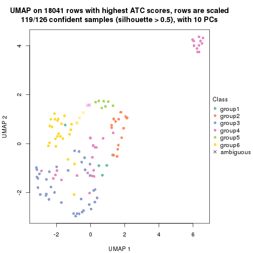</p>

</div>
</div>


Following heatmap shows how subgroups are split when increasing `k`:

```r
collect_classes(res)
```


If matrix rows can be associated to genes, consider to use `GO_Enrichment(res,
...)` to perform function enrichment for the signature genes.


 

---------------------------------------------------


### ATC:kmeans


The object with results only for a single top-value method and a single partition method 
can be extracted as:

```r
res = res_list["ATC", "kmeans"]
# you can also extract it by
# res = res_list["ATC:kmeans"]
```

A summary of `res` and all the functions that can be applied to it:

```r
res
```

```
#> A 'ConsensusPartition' object with k = 2, 3, 4, 5, 6.
#>   On a matrix with 18041 rows and 126 columns.
#>   Top rows (1000, 2000, 3000, 4000, 5000) are extracted by 'ATC' method.
#>   Subgroups are detected by 'kmeans' method.
#>   Performed in total 1250 partitions by row resampling.
#>   Best k for subgroups seems to be 2.
#> 
#> Following methods can be applied to this 'ConsensusPartition' object:
#>  [1] "cola_report"             "collect_classes"         "collect_plots"          
#>  [4] "collect_stats"           "colnames"                "compare_signatures"     
#>  [7] "consensus_heatmap"       "dimension_reduction"     "functional_enrichment"  
#> [10] "get_anno_col"            "get_anno"                "get_classes"            
#> [13] "get_consensus"           "get_matrix"              "get_membership"         
#> [16] "get_param"               "get_signatures"          "get_stats"              
#> [19] "is_best_k"               "is_stable_k"             "membership_heatmap"     
#> [22] "ncol"                    "nrow"                    "plot_ecdf"              
#> [25] "rownames"                "select_partition_number" "show"                   
#> [28] "suggest_best_k"          "test_to_known_factors"
```

`collect_plots()` function collects all the plots made from `res` for all `k` (number of partitions)
into one single page to provide an easy and fast comparison between different `k`.

```r
collect_plots(res)
```


The plots are:

- The first row: a plot of the ECDF (Empirical cumulative distribution
  function) curves of the consensus matrix for each `k` and the heatmap of
  predicted classes for each `k`.
- The second row: heatmaps of the consensus matrix for each `k`.
- The third row: heatmaps of the membership matrix for each `k`.
- The fouth row: heatmaps of the signatures for each `k`.

All the plots in panels can be made by individual functions and they are
plotted later in this section.

`select_partition_number()` produces several plots showing different
statistics for choosing "optimized" `k`. There are following statistics:

- ECDF curves of the consensus matrix for each `k`;
- 1-PAC. [The PAC
  score](https://en.wikipedia.org/wiki/Consensus_clustering#Over-interpretation_potential_of_consensus_clustering)
  measures the proportion of the ambiguous subgrouping.
- Mean silhouette score.
- Concordance. The mean probability of fiting the consensus class ids in all
  partitions.
- Area increased. Denote $A_k$ as the area under the ECDF curve for current
  `k`, the area increased is defined as $A_k - A_{k-1}$.
- Rand index. The percent of pairs of samples that are both in a same cluster
  or both are not in a same cluster in the partition of k and k-1.
- Jaccard index. The ratio of pairs of samples are both in a same cluster in
  the partition of k and k-1 and the pairs of samples are both in a same
  cluster in the partition k or k-1.

The detailed explanations of these statistics can be found in [the cola
vignette](http://bioconductor.org/packages/devel/bioc/vignettes/cola/inst/doc/cola.html#toc_13).

Generally speaking, lower PAC score, higher mean silhouette score or higher
concordance corresponds to better partition. Rand index and Jaccard index
measure how similar the current partition is compared to partition with `k-1`.
If they are too similar, we won't accept `k` is better than `k-1`.

```r
select_partition_number(res)
```


The numeric values for all these statistics can be obtained by `get_stats()`.

```r
get_stats(res)
```

```
#>   k 1-PAC mean_silhouette concordance area_increased  Rand Jaccard
#> 2 2 0.612           0.897       0.929         0.4727 0.514   0.514
#> 3 3 0.544           0.671       0.790         0.3305 0.712   0.511
#> 4 4 0.567           0.422       0.626         0.1380 0.755   0.447
#> 5 5 0.754           0.759       0.828         0.0816 0.841   0.505
#> 6 6 0.774           0.776       0.839         0.0425 0.943   0.755
```

`suggest_best_k()` suggests the best $k$ based on these statistics. The rules are as follows:

- All $k$ with Jaccard index larger than 0.95 are removed because the increase of
  the partition number does not provides enough extra information. If all $k$ are removed,
  the best $k$ is assigned by `NA`.
- For $k$ with 1-PAC larger than 0.9, the maximal $k$ is taken as the "best k". Other $k$ is called "optional k".
- If it does not fit the second rule. The $k$ with the highest vote of highest
  1-PAC, mean silhouette and concordance is taken as the "best k".

```r
suggest_best_k(res)
```

```
#> [1] 2
```


Following shows the table of the partitions (You need to click the **show/hide
code output** link to see it). The membership matrix (columns with name `p*`)
is inferred by
[`clue::cl_consensus()`](https://www.rdocumentation.org/link/cl_consensus?package=clue)
function with the `SE` method. Basically the value in the membership matrix
represents the probability to belong to a certain group. The finall class
label for an item is determined with the group with highest probability it
belongs to.

In `get_classes()` function, the entropy is calculated from the membership
matrix and the silhouette score is calculated from the consensus matrix.


<script>
$( function() {
	$( '#tabs-ATC-kmeans-get-classes' ).tabs();
} );
</script>
<div id='tabs-ATC-kmeans-get-classes'>
<ul>
<li><a href='#tab-ATC-kmeans-get-classes-1'>k = 2</a></li>
<li><a href='#tab-ATC-kmeans-get-classes-2'>k = 3</a></li>
<li><a href='#tab-ATC-kmeans-get-classes-3'>k = 4</a></li>
<li><a href='#tab-ATC-kmeans-get-classes-4'>k = 5</a></li>
<li><a href='#tab-ATC-kmeans-get-classes-5'>k = 6</a></li>
</ul>

<div id='tab-ATC-kmeans-get-classes-1'>
<p><a id='tab-ATC-kmeans-get-classes-1-a' style='color:#0366d6' href='#'>show/hide code output</a></p>
<pre><code class="r">cbind(get_classes(res, k = 2), get_membership(res, k = 2))
</code></pre>

<pre><code>#&gt;                                      class entropy silhouette    p1    p2
#&gt; DC1F29A2-39DE-44AD-936A-54B2B32D6370     1  0.2603      0.950 0.956 0.044
#&gt; FA3C3413-FA8C-4A29-B9CA-5BC3A56274A8     2  0.3733      0.915 0.072 0.928
#&gt; B9B72975-8134-475C-BC0B-0CFDB24F636A     2  0.0000      0.900 0.000 1.000
#&gt; F44DB757-4D00-4BFC-99C5-AA82F99C5BDA     1  0.3733      0.905 0.928 0.072
#&gt; 3BD942BB-A3A7-4993-B3F1-B8641626B773     1  0.2603      0.950 0.956 0.044
#&gt; 431F73A2-2AB3-4101-B610-7FC02A7097EC     1  0.3733      0.905 0.928 0.072
#&gt; 3067683D-43D4-4F6D-9338-17F6A75E4B25     1  0.3733      0.905 0.928 0.072
#&gt; 2CE91B81-7CBE-4698-AFEE-6A154313D231     2  0.3733      0.915 0.072 0.928
#&gt; A639CF4F-4591-4337-A12E-BED71EDDA10B     1  0.2603      0.950 0.956 0.044
#&gt; 5482053D-9F48-4773-B68A-302B3A612503     1  0.2603      0.950 0.956 0.044
#&gt; A31D342D-C67C-428B-BAED-C6E844277A09     2  0.3733      0.915 0.072 0.928
#&gt; 0E9C5985-9AE0-4098-A076-6FFBBDF05110     1  0.3733      0.905 0.928 0.072
#&gt; 08CCF8A0-15B7-4A13-BC43-6B3B3E2DDE95     2  0.8267      0.728 0.260 0.740
#&gt; 10577D5B-AD56-403F-A562-73A9ACF2045B     1  0.3733      0.905 0.928 0.072
#&gt; C940D443-5DDA-4403-868B-7AA6B9A50FC4     1  0.2603      0.950 0.956 0.044
#&gt; 89D4D945-A717-495F-B253-F5A17CF5B9FA     2  0.2603      0.871 0.044 0.956
#&gt; DC55EE78-203F-4092-9B83-14B1A529194B     2  0.0376      0.901 0.004 0.996
#&gt; 8F7368BE-EB41-4192-89AA-9E0428C08851     2  0.0000      0.900 0.000 1.000
#&gt; F772EA39-E408-4908-BADD-C786D702BF9B     2  0.3733      0.915 0.072 0.928
#&gt; FD693D10-3ADA-4028-8392-41D2F0296F7E     2  0.9286      0.590 0.344 0.656
#&gt; 84F16966-7640-49F9-95D1-7648FF74DCC9     2  0.0376      0.901 0.004 0.996
#&gt; D26DAA2F-AE6A-42E1-9F1F-01943B99785F     2  0.3733      0.915 0.072 0.928
#&gt; F325847E-F046-4B67-B01C-16919C401020     1  0.3733      0.905 0.928 0.072
#&gt; 19EB2B10-2529-4A94-8FAE-1CE371A602D9     1  0.0000      0.934 1.000 0.000
#&gt; B94B9CCF-5FB8-44AE-8D9C-A194C6801A27     2  0.3733      0.915 0.072 0.928
#&gt; D2678E70-542A-4AB2-B881-12D66DBA44F5     2  0.9286      0.590 0.344 0.656
#&gt; 4961CA2A-70CD-42AB-A676-4A98C85F449F     1  0.2778      0.947 0.952 0.048
#&gt; 5AA74C5C-2AD1-4D59-A030-E964EB199581     1  0.3733      0.905 0.928 0.072
#&gt; F9E11A1B-BD93-438F-9670-6FB7DFF9E910     1  0.0000      0.934 1.000 0.000
#&gt; FB78CA5A-C8B9-42AF-9DAE-799CAB280B2E     1  0.3733      0.905 0.928 0.072
#&gt; A8E48877-F8AB-44DD-A18B-194D87C44931     2  0.8081      0.745 0.248 0.752
#&gt; CA50C495-F37E-4743-867D-FAF2DCC3376A     2  0.9129      0.620 0.328 0.672
#&gt; 37342369-EC22-4904-8CCD-A0DC6BD8D183     2  0.3733      0.915 0.072 0.928
#&gt; 91BA5F90-9174-4533-A050-39A28E34A94D     1  0.2603      0.950 0.956 0.044
#&gt; 5BC371AC-1915-44E9-A114-2963E131EC8D     2  0.3733      0.915 0.072 0.928
#&gt; 74A6C31A-7F21-45AF-A170-18C326D2AE69     1  0.2603      0.950 0.956 0.044
#&gt; 984F27EF-D4D7-4E68-BD64-776FDFC04D07     1  0.2778      0.947 0.952 0.048
#&gt; B05701C5-8C44-4FD1-94C9-FC0255A2EA24     1  0.2603      0.950 0.956 0.044
#&gt; 91E4119C-2CE6-4447-A125-6A4F403A89E6     1  0.2603      0.950 0.956 0.044
#&gt; 1570FCE7-F1B4-4BDF-A398-355EDF030864     2  0.9954      0.175 0.460 0.540
#&gt; 604C06E9-A00E-435E-847A-3992922A5C56     1  0.2603      0.950 0.956 0.044
#&gt; 455C9007-6FF4-4D63-83FA-4915F0331F9A     1  0.2778      0.949 0.952 0.048
#&gt; FB8BD3CF-D2EC-47B6-B67F-65ADC1C3A6A7     1  0.2778      0.947 0.952 0.048
#&gt; 9DC7443A-3C8F-4025-8312-3C98BF28D736     1  0.2603      0.950 0.956 0.044
#&gt; CB207A52-09AC-49D3-8240-5840CDFBB154     1  0.0000      0.934 1.000 0.000
#&gt; 2A335049-AD9F-4B32-92B7-69B04B0CF2BA     1  0.3733      0.905 0.928 0.072
#&gt; 6ACA6293-371E-428D-BBAE-ABFD410C886F     2  0.0376      0.901 0.004 0.996
#&gt; E8929929-73F9-4DB7-ABBA-0852BEFFFF7E     2  0.3733      0.915 0.072 0.928
#&gt; 5E343116-414B-41F2-AAEE-A3225450135A     1  0.2603      0.950 0.956 0.044
#&gt; 0A39073C-157C-48A1-B125-A6A04CB738DA     2  0.4562      0.900 0.096 0.904
#&gt; 300D78E6-1C7E-4114-80EA-9204A6818B9A     1  0.3733      0.905 0.928 0.072
#&gt; DAAF55AA-ED48-4221-9CD6-D1DEB6376017     2  0.0376      0.901 0.004 0.996
#&gt; D76FCF4A-4ACF-41EF-A120-64136D6C845E     1  0.3733      0.905 0.928 0.072
#&gt; AD294665-6F90-459C-90D5-3058F210225D     1  0.0000      0.934 1.000 0.000
#&gt; 92E8AD7A-1084-44C8-BDC0-FE4E47B6143F     1  0.3733      0.905 0.928 0.072
#&gt; 5644A861-3C59-486D-8FBE-4DF6A3B19558     1  0.2603      0.950 0.956 0.044
#&gt; 1BF8AAE7-B771-4CF2-8B1C-D2BEB5E6579E     1  0.3733      0.905 0.928 0.072
#&gt; A54731AE-FC40-407F-8D10-67DDC122237D     2  0.0000      0.900 0.000 1.000
#&gt; 179DC906-5654-4CBA-9C27-C9560B5F12DE     1  0.2603      0.950 0.956 0.044
#&gt; 979B9A2B-2D81-47C3-A553-9B9441CAAE47     1  0.2603      0.950 0.956 0.044
#&gt; D69BD86A-08FB-49DA-9084-2725F6C9195F     1  0.2603      0.950 0.956 0.044
#&gt; 84611033-BCF7-49D7-9B91-DA29B62AC8D3     2  0.2603      0.871 0.044 0.956
#&gt; 8AA1DA3E-8C00-4653-AA33-EA70531C1E50     2  0.0000      0.900 0.000 1.000
#&gt; CEBE9594-0F19-46B4-AF7D-F8DF33E00AFB     1  0.2603      0.950 0.956 0.044
#&gt; C68E82D2-2BD3-41E9-92D7-D4C06E1953B2     1  0.2603      0.950 0.956 0.044
#&gt; B855EF89-1E76-4408-AA65-61A0F0A4F412     2  0.3733      0.915 0.072 0.928
#&gt; 4488EFB3-5B01-41E3-B57E-8E4F607CF448     1  0.3733      0.905 0.928 0.072
#&gt; C2BD8440-CAC6-4FE5-8EBB-5E6AE308D52F     1  0.2603      0.950 0.956 0.044
#&gt; E0E50F10-1FED-41C1-84DB-81A46F25D7E9     2  0.3733      0.915 0.072 0.928
#&gt; EE16D845-31F2-4178-800B-CA2C358841AD     2  0.2603      0.871 0.044 0.956
#&gt; 169828CF-5693-4A46-B5D7-E45CBA9DF317     2  0.3733      0.915 0.072 0.928
#&gt; 51077BA3-AEE0-4BD4-A1B1-1B0A811642A1     1  0.2603      0.950 0.956 0.044
#&gt; D2F4E240-C44C-4CF7-8016-6CACD370D093     1  0.3733      0.905 0.928 0.072
#&gt; 721CDBE6-FC85-4C30-B23E-28407340286F     1  0.2603      0.950 0.956 0.044
#&gt; 392897E4-6009-422C-B461-649F4DDF260C     1  0.2603      0.950 0.956 0.044
#&gt; 617E13D2-6924-45F8-A8DE-BE21B718F822     1  0.2603      0.950 0.956 0.044
#&gt; 5746C00F-9CBB-46B7-83FD-90B2AB3F507B     1  0.3733      0.905 0.928 0.072
#&gt; 982B4344-A223-4D1F-9485-2E56F9FD45C0     2  0.1633      0.885 0.024 0.976
#&gt; E5557F52-015D-49DC-9E23-989FC259976F     1  0.2603      0.950 0.956 0.044
#&gt; F3135F5E-2E90-4923-B634-E994563D17B7     1  0.2603      0.950 0.956 0.044
#&gt; D1ED15A5-9802-4314-B556-E89EB772D1F0     1  0.2603      0.950 0.956 0.044
#&gt; 222B06E3-FCFB-4104-92C3-D73BC31854D4     1  0.3733      0.905 0.928 0.072
#&gt; 4C810FFA-ED07-4F4C-9F81-B8F1CF4956F7     2  0.3733      0.915 0.072 0.928
#&gt; 9A608964-ED12-4E6E-9D3A-430F59FFF65B     1  0.2603      0.950 0.956 0.044
#&gt; 4087357F-C17A-4992-A8AB-41ACA2F72001     1  0.2603      0.950 0.956 0.044
#&gt; B3F013A5-BCB8-4CE0-86B2-634EE180AA6E     2  0.0000      0.900 0.000 1.000
#&gt; 322AF320-1379-4F51-AFDC-5292A060CD52     2  0.2603      0.910 0.044 0.956
#&gt; 53A96249-66D5-4C26-893B-ADC71481D261     2  0.3733      0.915 0.072 0.928
#&gt; 1AB7A6F2-14BD-447C-B2E3-DEB0CE56B209     1  0.3733      0.905 0.928 0.072
#&gt; 8B4BCDA0-6787-4A55-99F7-AAF22AF85BA6     2  0.0000      0.900 0.000 1.000
#&gt; 5D9D9E08-2C2C-414E-9547-62799F90D543     2  0.3733      0.915 0.072 0.928
#&gt; C345CD17-E4F4-41D5-9891-FEFB19342C52     1  0.3733      0.905 0.928 0.072
#&gt; 1AF8FDE1-1A74-41F6-A1C5-4952CDFB7D3F     1  0.3733      0.905 0.928 0.072
#&gt; BC3405FF-0660-4B2B-8DC1-5F34D3133078     1  0.2603      0.950 0.956 0.044
#&gt; C2662596-6E2F-4924-B051-CEA1AC87B197     1  0.2603      0.950 0.956 0.044
#&gt; 39AE85F7-49FB-4438-BD41-6AC812FA1C72     1  0.2603      0.950 0.956 0.044
#&gt; 6FF266DB-3F08-43F2-8F6F-679F805B80B8     1  0.2603      0.950 0.956 0.044
#&gt; B03B7B81-BBD6-4194-BC5E-6EDF0D3F015A     2  0.3733      0.915 0.072 0.928
#&gt; C7617D56-F13C-4C43-906C-BD458C5DC4CD     1  0.2603      0.950 0.956 0.044
#&gt; 09420F8B-7A71-4B32-8388-4767670F1FEB     1  0.2603      0.950 0.956 0.044
#&gt; 6AF47534-74FF-4128-865B-4E8EE1FFB469     2  0.2603      0.871 0.044 0.956
#&gt; 8FF9E94A-2ED2-4727-947F-D524D7ECE815     1  0.2603      0.950 0.956 0.044
#&gt; A390E20D-03F9-40E4-A132-0FA5C2BEDB63     1  0.2603      0.950 0.956 0.044
#&gt; A489CCCA-1374-4071-80CE-05B83C9A0D5E     2  0.3733      0.915 0.072 0.928
#&gt; 2D962371-EC83-490C-A663-478AF383BC1B     2  0.3733      0.915 0.072 0.928
#&gt; D91B31A1-EE71-4726-B94C-0CC2815E9D4E     1  0.3733      0.905 0.928 0.072
#&gt; E0123C5C-E1D1-4162-9895-CC8B01949D84     1  0.9661      0.281 0.608 0.392
#&gt; EC73959A-2728-49FE-B72A-790BB14F4CBF     1  0.2603      0.950 0.956 0.044
#&gt; A60DC925-7343-496E-900D-0DD81D5C8123     2  0.0376      0.901 0.004 0.996
#&gt; 659B64DB-F4A5-43BD-811B-05004CB49D99     1  0.2603      0.950 0.956 0.044
#&gt; 6969B6B2-7616-4664-9696-C4DACD10537B     2  0.3733      0.915 0.072 0.928
#&gt; 2F6392DE-0D54-4768-B062-907C81E5B0CC     1  0.2603      0.950 0.956 0.044
#&gt; C74BE8C5-BA6D-4596-9D67-3C731799F999     2  0.9044      0.635 0.320 0.680
#&gt; 79A7647F-BDBA-45A2-B207-ABF788F6CC95     1  0.2603      0.950 0.956 0.044
#&gt; D47D0433-2313-4A2F-B268-5AD293D7534E     2  0.3733      0.915 0.072 0.928
#&gt; C5058B93-C1DA-43B9-9951-B23A9810AA6E     1  0.3733      0.905 0.928 0.072
#&gt; 2629FEE3-A203-4411-8A70-02A796C9505C     2  0.3733      0.915 0.072 0.928
#&gt; 1AF329E4-11D4-4CFC-801F-C24A1EA33102     2  0.2603      0.871 0.044 0.956
#&gt; D453BEF8-3F18-4B89-BA42-CE74EB105032     1  0.3733      0.905 0.928 0.072
#&gt; B12A4446-2310-4139-897F-CA030478CBD5     1  0.2603      0.950 0.956 0.044
#&gt; BCAB1918-5FA9-4CBD-85CB-008743FEA2CC     1  0.2603      0.950 0.956 0.044
#&gt; 9A5432D3-19EE-47B4-BD88-698DEC75A5E9     2  0.3733      0.915 0.072 0.928
#&gt; A608BCEB-2C27-4927-A308-E6975F641722     2  0.2603      0.871 0.044 0.956
#&gt; E4752275-7BF6-4C1E-8A45-C7D571ED85AD     2  0.3733      0.915 0.072 0.928
#&gt; FDEC1714-C02D-4AB7-AE82-789E9D709EDE     1  0.2603      0.950 0.956 0.044
#&gt; 33737781-8638-4FA2-AD4C-E888BB9343D8     2  0.9358      0.573 0.352 0.648
</code></pre>

<script>
$('#tab-ATC-kmeans-get-classes-1-a').parent().next().next().hide();
$('#tab-ATC-kmeans-get-classes-1-a').click(function(){
  $('#tab-ATC-kmeans-get-classes-1-a').parent().next().next().toggle();
  return(false);
});
</script>
</div>

<div id='tab-ATC-kmeans-get-classes-2'>
<p><a id='tab-ATC-kmeans-get-classes-2-a' style='color:#0366d6' href='#'>show/hide code output</a></p>
<pre><code class="r">cbind(get_classes(res, k = 3), get_membership(res, k = 3))
</code></pre>

<pre><code>#&gt;                                      class entropy silhouette    p1    p2    p3
#&gt; DC1F29A2-39DE-44AD-936A-54B2B32D6370     1  0.6280      0.630 0.540 0.000 0.460
#&gt; FA3C3413-FA8C-4A29-B9CA-5BC3A56274A8     1  0.3425      0.417 0.884 0.112 0.004
#&gt; B9B72975-8134-475C-BC0B-0CFDB24F636A     2  0.0424      0.777 0.008 0.992 0.000
#&gt; F44DB757-4D00-4BFC-99C5-AA82F99C5BDA     3  0.8508      0.387 0.232 0.160 0.608
#&gt; 3BD942BB-A3A7-4993-B3F1-B8641626B773     1  0.4002      0.642 0.840 0.000 0.160
#&gt; 431F73A2-2AB3-4101-B610-7FC02A7097EC     3  0.6225     -0.432 0.432 0.000 0.568
#&gt; 3067683D-43D4-4F6D-9338-17F6A75E4B25     3  0.0237      0.860 0.004 0.000 0.996
#&gt; 2CE91B81-7CBE-4698-AFEE-6A154313D231     2  0.5178      0.807 0.256 0.744 0.000
#&gt; A639CF4F-4591-4337-A12E-BED71EDDA10B     1  0.6280      0.630 0.540 0.000 0.460
#&gt; 5482053D-9F48-4773-B68A-302B3A612503     1  0.6280      0.630 0.540 0.000 0.460
#&gt; A31D342D-C67C-428B-BAED-C6E844277A09     2  0.4931      0.805 0.232 0.768 0.000
#&gt; 0E9C5985-9AE0-4098-A076-6FFBBDF05110     3  0.8284      0.425 0.224 0.148 0.628
#&gt; 08CCF8A0-15B7-4A13-BC43-6B3B3E2DDE95     1  0.0475      0.599 0.992 0.004 0.004
#&gt; 10577D5B-AD56-403F-A562-73A9ACF2045B     3  0.0237      0.860 0.004 0.000 0.996
#&gt; C940D443-5DDA-4403-868B-7AA6B9A50FC4     1  0.6280      0.630 0.540 0.000 0.460
#&gt; 89D4D945-A717-495F-B253-F5A17CF5B9FA     2  0.9594      0.342 0.244 0.476 0.280
#&gt; DC55EE78-203F-4092-9B83-14B1A529194B     2  0.0424      0.777 0.008 0.992 0.000
#&gt; 8F7368BE-EB41-4192-89AA-9E0428C08851     2  0.6045      0.741 0.380 0.620 0.000
#&gt; F772EA39-E408-4908-BADD-C786D702BF9B     2  0.6451      0.709 0.436 0.560 0.004
#&gt; FD693D10-3ADA-4028-8392-41D2F0296F7E     1  0.0424      0.602 0.992 0.008 0.000
#&gt; 84F16966-7640-49F9-95D1-7648FF74DCC9     2  0.0237      0.777 0.004 0.996 0.000
#&gt; D26DAA2F-AE6A-42E1-9F1F-01943B99785F     2  0.4002      0.823 0.160 0.840 0.000
#&gt; F325847E-F046-4B67-B01C-16919C401020     3  0.0237      0.860 0.004 0.000 0.996
#&gt; 19EB2B10-2529-4A94-8FAE-1CE371A602D9     1  0.6309      0.570 0.504 0.000 0.496
#&gt; B94B9CCF-5FB8-44AE-8D9C-A194C6801A27     2  0.3816      0.824 0.148 0.852 0.000
#&gt; D2678E70-542A-4AB2-B881-12D66DBA44F5     1  0.0424      0.602 0.992 0.008 0.000
#&gt; 4961CA2A-70CD-42AB-A676-4A98C85F449F     1  0.2165      0.623 0.936 0.000 0.064
#&gt; 5AA74C5C-2AD1-4D59-A030-E964EB199581     3  0.0237      0.860 0.004 0.000 0.996
#&gt; F9E11A1B-BD93-438F-9670-6FB7DFF9E910     1  0.6302      0.598 0.520 0.000 0.480
#&gt; FB78CA5A-C8B9-42AF-9DAE-799CAB280B2E     3  0.0237      0.860 0.004 0.000 0.996
#&gt; A8E48877-F8AB-44DD-A18B-194D87C44931     1  0.0475      0.599 0.992 0.004 0.004
#&gt; CA50C495-F37E-4743-867D-FAF2DCC3376A     1  0.0475      0.599 0.992 0.004 0.004
#&gt; 37342369-EC22-4904-8CCD-A0DC6BD8D183     2  0.3879      0.824 0.152 0.848 0.000
#&gt; 91BA5F90-9174-4533-A050-39A28E34A94D     1  0.6280      0.630 0.540 0.000 0.460
#&gt; 5BC371AC-1915-44E9-A114-2963E131EC8D     2  0.3941      0.824 0.156 0.844 0.000
#&gt; 74A6C31A-7F21-45AF-A170-18C326D2AE69     1  0.6244      0.643 0.560 0.000 0.440
#&gt; 984F27EF-D4D7-4E68-BD64-776FDFC04D07     1  0.0661      0.607 0.988 0.004 0.008
#&gt; B05701C5-8C44-4FD1-94C9-FC0255A2EA24     1  0.4654      0.649 0.792 0.000 0.208
#&gt; 91E4119C-2CE6-4447-A125-6A4F403A89E6     1  0.3941      0.641 0.844 0.000 0.156
#&gt; 1570FCE7-F1B4-4BDF-A398-355EDF030864     1  0.9724     -0.150 0.452 0.268 0.280
#&gt; 604C06E9-A00E-435E-847A-3992922A5C56     1  0.6260      0.639 0.552 0.000 0.448
#&gt; 455C9007-6FF4-4D63-83FA-4915F0331F9A     1  0.3412      0.639 0.876 0.000 0.124
#&gt; FB8BD3CF-D2EC-47B6-B67F-65ADC1C3A6A7     1  0.0592      0.605 0.988 0.000 0.012
#&gt; 9DC7443A-3C8F-4025-8312-3C98BF28D736     1  0.1529      0.619 0.960 0.000 0.040
#&gt; CB207A52-09AC-49D3-8240-5840CDFBB154     1  0.6280      0.630 0.540 0.000 0.460
#&gt; 2A335049-AD9F-4B32-92B7-69B04B0CF2BA     3  0.0237      0.860 0.004 0.000 0.996
#&gt; 6ACA6293-371E-428D-BBAE-ABFD410C886F     2  0.6468      0.702 0.444 0.552 0.004
#&gt; E8929929-73F9-4DB7-ABBA-0852BEFFFF7E     2  0.6045      0.746 0.380 0.620 0.000
#&gt; 5E343116-414B-41F2-AAEE-A3225450135A     1  0.6140      0.655 0.596 0.000 0.404
#&gt; 0A39073C-157C-48A1-B125-A6A04CB738DA     1  0.1129      0.585 0.976 0.020 0.004
#&gt; 300D78E6-1C7E-4114-80EA-9204A6818B9A     3  0.0237      0.860 0.004 0.000 0.996
#&gt; DAAF55AA-ED48-4221-9CD6-D1DEB6376017     2  0.4062      0.824 0.164 0.836 0.000
#&gt; D76FCF4A-4ACF-41EF-A120-64136D6C845E     3  0.0237      0.860 0.004 0.000 0.996
#&gt; AD294665-6F90-459C-90D5-3058F210225D     1  0.6280      0.630 0.540 0.000 0.460
#&gt; 92E8AD7A-1084-44C8-BDC0-FE4E47B6143F     3  0.4750      0.586 0.216 0.000 0.784
#&gt; 5644A861-3C59-486D-8FBE-4DF6A3B19558     1  0.6280      0.630 0.540 0.000 0.460
#&gt; 1BF8AAE7-B771-4CF2-8B1C-D2BEB5E6579E     3  0.0424      0.860 0.008 0.000 0.992
#&gt; A54731AE-FC40-407F-8D10-67DDC122237D     2  0.0424      0.777 0.008 0.992 0.000
#&gt; 179DC906-5654-4CBA-9C27-C9560B5F12DE     1  0.6168      0.654 0.588 0.000 0.412
#&gt; 979B9A2B-2D81-47C3-A553-9B9441CAAE47     1  0.6260      0.639 0.552 0.000 0.448
#&gt; D69BD86A-08FB-49DA-9084-2725F6C9195F     1  0.6168      0.654 0.588 0.000 0.412
#&gt; 84611033-BCF7-49D7-9B91-DA29B62AC8D3     3  0.9825     -0.138 0.244 0.368 0.388
#&gt; 8AA1DA3E-8C00-4653-AA33-EA70531C1E50     2  0.0237      0.777 0.004 0.996 0.000
#&gt; CEBE9594-0F19-46B4-AF7D-F8DF33E00AFB     1  0.3879      0.643 0.848 0.000 0.152
#&gt; C68E82D2-2BD3-41E9-92D7-D4C06E1953B2     1  0.4842      0.648 0.776 0.000 0.224
#&gt; B855EF89-1E76-4408-AA65-61A0F0A4F412     2  0.3816      0.824 0.148 0.852 0.000
#&gt; 4488EFB3-5B01-41E3-B57E-8E4F607CF448     3  0.1031      0.839 0.024 0.000 0.976
#&gt; C2BD8440-CAC6-4FE5-8EBB-5E6AE308D52F     1  0.6280      0.630 0.540 0.000 0.460
#&gt; E0E50F10-1FED-41C1-84DB-81A46F25D7E9     2  0.6267      0.695 0.452 0.548 0.000
#&gt; EE16D845-31F2-4178-800B-CA2C358841AD     2  0.9411      0.397 0.240 0.508 0.252
#&gt; 169828CF-5693-4A46-B5D7-E45CBA9DF317     2  0.3816      0.824 0.148 0.852 0.000
#&gt; 51077BA3-AEE0-4BD4-A1B1-1B0A811642A1     1  0.6260      0.639 0.552 0.000 0.448
#&gt; D2F4E240-C44C-4CF7-8016-6CACD370D093     3  0.0237      0.860 0.004 0.000 0.996
#&gt; 721CDBE6-FC85-4C30-B23E-28407340286F     1  0.6168      0.654 0.588 0.000 0.412
#&gt; 392897E4-6009-422C-B461-649F4DDF260C     1  0.4002      0.644 0.840 0.000 0.160
#&gt; 617E13D2-6924-45F8-A8DE-BE21B718F822     1  0.1529      0.619 0.960 0.000 0.040
#&gt; 5746C00F-9CBB-46B7-83FD-90B2AB3F507B     3  0.0237      0.860 0.004 0.000 0.996
#&gt; 982B4344-A223-4D1F-9485-2E56F9FD45C0     2  0.0424      0.777 0.008 0.992 0.000
#&gt; E5557F52-015D-49DC-9E23-989FC259976F     1  0.6280      0.630 0.540 0.000 0.460
#&gt; F3135F5E-2E90-4923-B634-E994563D17B7     1  0.6267      0.636 0.548 0.000 0.452
#&gt; D1ED15A5-9802-4314-B556-E89EB772D1F0     1  0.6260      0.639 0.552 0.000 0.448
#&gt; 222B06E3-FCFB-4104-92C3-D73BC31854D4     3  0.0237      0.860 0.004 0.000 0.996
#&gt; 4C810FFA-ED07-4F4C-9F81-B8F1CF4956F7     2  0.6260      0.699 0.448 0.552 0.000
#&gt; 9A608964-ED12-4E6E-9D3A-430F59FFF65B     1  0.6280      0.630 0.540 0.000 0.460
#&gt; 4087357F-C17A-4992-A8AB-41ACA2F72001     1  0.0592      0.609 0.988 0.000 0.012
#&gt; B3F013A5-BCB8-4CE0-86B2-634EE180AA6E     2  0.0424      0.777 0.008 0.992 0.000
#&gt; 322AF320-1379-4F51-AFDC-5292A060CD52     2  0.5365      0.707 0.252 0.744 0.004
#&gt; 53A96249-66D5-4C26-893B-ADC71481D261     2  0.4796      0.813 0.220 0.780 0.000
#&gt; 1AB7A6F2-14BD-447C-B2E3-DEB0CE56B209     3  0.0237      0.860 0.004 0.000 0.996
#&gt; 8B4BCDA0-6787-4A55-99F7-AAF22AF85BA6     2  0.0424      0.777 0.008 0.992 0.000
#&gt; 5D9D9E08-2C2C-414E-9547-62799F90D543     2  0.3941      0.825 0.156 0.844 0.000
#&gt; C345CD17-E4F4-41D5-9891-FEFB19342C52     3  0.0237      0.860 0.004 0.000 0.996
#&gt; 1AF8FDE1-1A74-41F6-A1C5-4952CDFB7D3F     3  0.0237      0.860 0.004 0.000 0.996
#&gt; BC3405FF-0660-4B2B-8DC1-5F34D3133078     1  0.6140      0.655 0.596 0.000 0.404
#&gt; C2662596-6E2F-4924-B051-CEA1AC87B197     1  0.6280      0.630 0.540 0.000 0.460
#&gt; 39AE85F7-49FB-4438-BD41-6AC812FA1C72     1  0.6280      0.630 0.540 0.000 0.460
#&gt; 6FF266DB-3F08-43F2-8F6F-679F805B80B8     1  0.0592      0.609 0.988 0.000 0.012
#&gt; B03B7B81-BBD6-4194-BC5E-6EDF0D3F015A     2  0.4796      0.811 0.220 0.780 0.000
#&gt; C7617D56-F13C-4C43-906C-BD458C5DC4CD     1  0.0592      0.609 0.988 0.000 0.012
#&gt; 09420F8B-7A71-4B32-8388-4767670F1FEB     1  0.6180      0.653 0.584 0.000 0.416
#&gt; 6AF47534-74FF-4128-865B-4E8EE1FFB469     2  0.0661      0.777 0.008 0.988 0.004
#&gt; 8FF9E94A-2ED2-4727-947F-D524D7ECE815     1  0.0592      0.609 0.988 0.000 0.012
#&gt; A390E20D-03F9-40E4-A132-0FA5C2BEDB63     1  0.6140      0.655 0.596 0.000 0.404
#&gt; A489CCCA-1374-4071-80CE-05B83C9A0D5E     1  0.1129      0.585 0.976 0.020 0.004
#&gt; 2D962371-EC83-490C-A663-478AF383BC1B     2  0.3816      0.824 0.148 0.852 0.000
#&gt; D91B31A1-EE71-4726-B94C-0CC2815E9D4E     3  0.0237      0.860 0.004 0.000 0.996
#&gt; E0123C5C-E1D1-4162-9895-CC8B01949D84     1  0.0424      0.602 0.992 0.000 0.008
#&gt; EC73959A-2728-49FE-B72A-790BB14F4CBF     1  0.6244      0.643 0.560 0.000 0.440
#&gt; A60DC925-7343-496E-900D-0DD81D5C8123     2  0.6095      0.735 0.392 0.608 0.000
#&gt; 659B64DB-F4A5-43BD-811B-05004CB49D99     1  0.6280      0.630 0.540 0.000 0.460
#&gt; 6969B6B2-7616-4664-9696-C4DACD10537B     2  0.3816      0.824 0.148 0.852 0.000
#&gt; 2F6392DE-0D54-4768-B062-907C81E5B0CC     1  0.3941      0.643 0.844 0.000 0.156
#&gt; C74BE8C5-BA6D-4596-9D67-3C731799F999     1  0.0424      0.602 0.992 0.008 0.000
#&gt; 79A7647F-BDBA-45A2-B207-ABF788F6CC95     1  0.6280      0.630 0.540 0.000 0.460
#&gt; D47D0433-2313-4A2F-B268-5AD293D7534E     2  0.3879      0.824 0.152 0.848 0.000
#&gt; C5058B93-C1DA-43B9-9951-B23A9810AA6E     3  0.0237      0.860 0.004 0.000 0.996
#&gt; 2629FEE3-A203-4411-8A70-02A796C9505C     2  0.4399      0.820 0.188 0.812 0.000
#&gt; 1AF329E4-11D4-4CFC-801F-C24A1EA33102     2  0.9411      0.397 0.240 0.508 0.252
#&gt; D453BEF8-3F18-4B89-BA42-CE74EB105032     3  0.0237      0.860 0.004 0.000 0.996
#&gt; B12A4446-2310-4139-897F-CA030478CBD5     1  0.6168      0.654 0.588 0.000 0.412
#&gt; BCAB1918-5FA9-4CBD-85CB-008743FEA2CC     1  0.6280      0.630 0.540 0.000 0.460
#&gt; 9A5432D3-19EE-47B4-BD88-698DEC75A5E9     2  0.3816      0.824 0.148 0.852 0.000
#&gt; A608BCEB-2C27-4927-A308-E6975F641722     2  0.9543      0.344 0.236 0.484 0.280
#&gt; E4752275-7BF6-4C1E-8A45-C7D571ED85AD     2  0.6244      0.708 0.440 0.560 0.000
#&gt; FDEC1714-C02D-4AB7-AE82-789E9D709EDE     1  0.6168      0.654 0.588 0.000 0.412
#&gt; 33737781-8638-4FA2-AD4C-E888BB9343D8     1  0.0475      0.599 0.992 0.004 0.004
</code></pre>

<script>
$('#tab-ATC-kmeans-get-classes-2-a').parent().next().next().hide();
$('#tab-ATC-kmeans-get-classes-2-a').click(function(){
  $('#tab-ATC-kmeans-get-classes-2-a').parent().next().next().toggle();
  return(false);
});
</script>
</div>

<div id='tab-ATC-kmeans-get-classes-3'>
<p><a id='tab-ATC-kmeans-get-classes-3-a' style='color:#0366d6' href='#'>show/hide code output</a></p>
<pre><code class="r">cbind(get_classes(res, k = 4), get_membership(res, k = 4))
</code></pre>

<pre><code>#&gt;                                      class entropy silhouette    p1    p2    p3    p4
#&gt; DC1F29A2-39DE-44AD-936A-54B2B32D6370     1  0.7603     0.5377 0.436 0.000 0.360 0.204
#&gt; FA3C3413-FA8C-4A29-B9CA-5BC3A56274A8     3  0.3972     0.4795 0.080 0.080 0.840 0.000
#&gt; B9B72975-8134-475C-BC0B-0CFDB24F636A     2  0.1837     0.6982 0.028 0.944 0.028 0.000
#&gt; F44DB757-4D00-4BFC-99C5-AA82F99C5BDA     4  0.5054     0.7190 0.028 0.088 0.084 0.800
#&gt; 3BD942BB-A3A7-4993-B3F1-B8641626B773     3  0.1902     0.4896 0.064 0.000 0.932 0.004
#&gt; 431F73A2-2AB3-4101-B610-7FC02A7097EC     3  0.7910    -0.4126 0.308 0.000 0.360 0.332
#&gt; 3067683D-43D4-4F6D-9338-17F6A75E4B25     4  0.0336     0.9578 0.000 0.000 0.008 0.992
#&gt; 2CE91B81-7CBE-4698-AFEE-6A154313D231     3  0.7250    -0.0913 0.316 0.168 0.516 0.000
#&gt; A639CF4F-4591-4337-A12E-BED71EDDA10B     1  0.7603     0.5377 0.436 0.000 0.360 0.204
#&gt; 5482053D-9F48-4773-B68A-302B3A612503     1  0.7603     0.5377 0.436 0.000 0.360 0.204
#&gt; A31D342D-C67C-428B-BAED-C6E844277A09     1  0.6949    -0.3601 0.528 0.124 0.348 0.000
#&gt; 0E9C5985-9AE0-4098-A076-6FFBBDF05110     4  0.4786     0.7443 0.028 0.072 0.084 0.816
#&gt; 08CCF8A0-15B7-4A13-BC43-6B3B3E2DDE95     3  0.1004     0.5192 0.024 0.004 0.972 0.000
#&gt; 10577D5B-AD56-403F-A562-73A9ACF2045B     4  0.0000     0.9604 0.000 0.000 0.000 1.000
#&gt; C940D443-5DDA-4403-868B-7AA6B9A50FC4     1  0.7603     0.5377 0.436 0.000 0.360 0.204
#&gt; 89D4D945-A717-495F-B253-F5A17CF5B9FA     2  0.7160     0.4948 0.032 0.604 0.268 0.096
#&gt; DC55EE78-203F-4092-9B83-14B1A529194B     2  0.1022     0.7103 0.032 0.968 0.000 0.000
#&gt; 8F7368BE-EB41-4192-89AA-9E0428C08851     1  0.7512    -0.4573 0.496 0.236 0.268 0.000
#&gt; F772EA39-E408-4908-BADD-C786D702BF9B     3  0.6805     0.0214 0.148 0.260 0.592 0.000
#&gt; FD693D10-3ADA-4028-8392-41D2F0296F7E     3  0.4454     0.3980 0.308 0.000 0.692 0.000
#&gt; 84F16966-7640-49F9-95D1-7648FF74DCC9     2  0.1302     0.7108 0.044 0.956 0.000 0.000
#&gt; D26DAA2F-AE6A-42E1-9F1F-01943B99785F     2  0.7047     0.5658 0.440 0.440 0.120 0.000
#&gt; F325847E-F046-4B67-B01C-16919C401020     4  0.0188     0.9597 0.004 0.000 0.000 0.996
#&gt; 19EB2B10-2529-4A94-8FAE-1CE371A602D9     1  0.7720     0.5150 0.412 0.000 0.360 0.228
#&gt; B94B9CCF-5FB8-44AE-8D9C-A194C6801A27     2  0.5815     0.6362 0.428 0.540 0.032 0.000
#&gt; D2678E70-542A-4AB2-B881-12D66DBA44F5     3  0.4454     0.3980 0.308 0.000 0.692 0.000
#&gt; 4961CA2A-70CD-42AB-A676-4A98C85F449F     3  0.1489     0.5066 0.044 0.004 0.952 0.000
#&gt; 5AA74C5C-2AD1-4D59-A030-E964EB199581     4  0.0000     0.9604 0.000 0.000 0.000 1.000
#&gt; F9E11A1B-BD93-438F-9670-6FB7DFF9E910     1  0.7603     0.5377 0.436 0.000 0.360 0.204
#&gt; FB78CA5A-C8B9-42AF-9DAE-799CAB280B2E     4  0.0188     0.9597 0.004 0.000 0.000 0.996
#&gt; A8E48877-F8AB-44DD-A18B-194D87C44931     3  0.1209     0.5301 0.032 0.004 0.964 0.000
#&gt; CA50C495-F37E-4743-867D-FAF2DCC3376A     3  0.3444     0.4873 0.184 0.000 0.816 0.000
#&gt; 37342369-EC22-4904-8CCD-A0DC6BD8D183     2  0.7006     0.5755 0.428 0.456 0.116 0.000
#&gt; 91BA5F90-9174-4533-A050-39A28E34A94D     1  0.7603     0.5377 0.436 0.000 0.360 0.204
#&gt; 5BC371AC-1915-44E9-A114-2963E131EC8D     1  0.6031    -0.6122 0.536 0.420 0.044 0.000
#&gt; 74A6C31A-7F21-45AF-A170-18C326D2AE69     1  0.7466     0.4977 0.436 0.000 0.388 0.176
#&gt; 984F27EF-D4D7-4E68-BD64-776FDFC04D07     3  0.3400     0.5085 0.180 0.000 0.820 0.000
#&gt; B05701C5-8C44-4FD1-94C9-FC0255A2EA24     3  0.5738    -0.2010 0.432 0.000 0.540 0.028
#&gt; 91E4119C-2CE6-4447-A125-6A4F403A89E6     3  0.1489     0.5066 0.044 0.004 0.952 0.000
#&gt; 1570FCE7-F1B4-4BDF-A398-355EDF030864     3  0.6915    -0.2376 0.028 0.444 0.480 0.048
#&gt; 604C06E9-A00E-435E-847A-3992922A5C56     1  0.7469     0.4892 0.432 0.000 0.392 0.176
#&gt; 455C9007-6FF4-4D63-83FA-4915F0331F9A     3  0.3311     0.5119 0.172 0.000 0.828 0.000
#&gt; FB8BD3CF-D2EC-47B6-B67F-65ADC1C3A6A7     3  0.1489     0.5066 0.044 0.004 0.952 0.000
#&gt; 9DC7443A-3C8F-4025-8312-3C98BF28D736     3  0.1940     0.5237 0.076 0.000 0.924 0.000
#&gt; CB207A52-09AC-49D3-8240-5840CDFBB154     1  0.7625     0.5347 0.432 0.000 0.360 0.208
#&gt; 2A335049-AD9F-4B32-92B7-69B04B0CF2BA     4  0.0188     0.9606 0.000 0.000 0.004 0.996
#&gt; 6ACA6293-371E-428D-BBAE-ABFD410C886F     3  0.6860     0.0469 0.164 0.244 0.592 0.000
#&gt; E8929929-73F9-4DB7-ABBA-0852BEFFFF7E     1  0.6235    -0.3106 0.524 0.056 0.420 0.000
#&gt; 5E343116-414B-41F2-AAEE-A3225450135A     3  0.6748    -0.3274 0.432 0.000 0.476 0.092
#&gt; 0A39073C-157C-48A1-B125-A6A04CB738DA     3  0.2197     0.5245 0.080 0.004 0.916 0.000
#&gt; 300D78E6-1C7E-4114-80EA-9204A6818B9A     4  0.0188     0.9606 0.000 0.000 0.004 0.996
#&gt; DAAF55AA-ED48-4221-9CD6-D1DEB6376017     1  0.6599    -0.6048 0.488 0.432 0.080 0.000
#&gt; D76FCF4A-4ACF-41EF-A120-64136D6C845E     4  0.0188     0.9606 0.000 0.000 0.004 0.996
#&gt; AD294665-6F90-459C-90D5-3058F210225D     1  0.7625     0.5347 0.432 0.000 0.360 0.208
#&gt; 92E8AD7A-1084-44C8-BDC0-FE4E47B6143F     4  0.3533     0.8083 0.024 0.008 0.104 0.864
#&gt; 5644A861-3C59-486D-8FBE-4DF6A3B19558     1  0.7603     0.5377 0.436 0.000 0.360 0.204
#&gt; 1BF8AAE7-B771-4CF2-8B1C-D2BEB5E6579E     4  0.0188     0.9606 0.000 0.000 0.004 0.996
#&gt; A54731AE-FC40-407F-8D10-67DDC122237D     2  0.0895     0.7052 0.004 0.976 0.020 0.000
#&gt; 179DC906-5654-4CBA-9C27-C9560B5F12DE     3  0.6840    -0.3445 0.432 0.000 0.468 0.100
#&gt; 979B9A2B-2D81-47C3-A553-9B9441CAAE47     1  0.7550     0.5238 0.436 0.000 0.372 0.192
#&gt; D69BD86A-08FB-49DA-9084-2725F6C9195F     3  0.6840    -0.3445 0.432 0.000 0.468 0.100
#&gt; 84611033-BCF7-49D7-9B91-DA29B62AC8D3     2  0.8918     0.1905 0.072 0.404 0.188 0.336
#&gt; 8AA1DA3E-8C00-4653-AA33-EA70531C1E50     2  0.1302     0.7108 0.044 0.956 0.000 0.000
#&gt; CEBE9594-0F19-46B4-AF7D-F8DF33E00AFB     3  0.2589     0.5181 0.116 0.000 0.884 0.000
#&gt; C68E82D2-2BD3-41E9-92D7-D4C06E1953B2     3  0.5236    -0.1631 0.432 0.000 0.560 0.008
#&gt; B855EF89-1E76-4408-AA65-61A0F0A4F412     2  0.5659     0.6621 0.368 0.600 0.032 0.000
#&gt; 4488EFB3-5B01-41E3-B57E-8E4F607CF448     4  0.0817     0.9429 0.000 0.000 0.024 0.976
#&gt; C2BD8440-CAC6-4FE5-8EBB-5E6AE308D52F     1  0.7603     0.5377 0.436 0.000 0.360 0.204
#&gt; E0E50F10-1FED-41C1-84DB-81A46F25D7E9     3  0.5288     0.0991 0.472 0.008 0.520 0.000
#&gt; EE16D845-31F2-4178-800B-CA2C358841AD     2  0.7111     0.5044 0.032 0.612 0.260 0.096
#&gt; 169828CF-5693-4A46-B5D7-E45CBA9DF317     2  0.5742     0.6611 0.368 0.596 0.036 0.000
#&gt; 51077BA3-AEE0-4BD4-A1B1-1B0A811642A1     1  0.7550     0.5238 0.436 0.000 0.372 0.192
#&gt; D2F4E240-C44C-4CF7-8016-6CACD370D093     4  0.0000     0.9604 0.000 0.000 0.000 1.000
#&gt; 721CDBE6-FC85-4C30-B23E-28407340286F     3  0.6842    -0.3558 0.436 0.000 0.464 0.100
#&gt; 392897E4-6009-422C-B461-649F4DDF260C     3  0.5353    -0.1716 0.432 0.000 0.556 0.012
#&gt; 617E13D2-6924-45F8-A8DE-BE21B718F822     3  0.3311     0.5119 0.172 0.000 0.828 0.000
#&gt; 5746C00F-9CBB-46B7-83FD-90B2AB3F507B     4  0.0188     0.9597 0.004 0.000 0.000 0.996
#&gt; 982B4344-A223-4D1F-9485-2E56F9FD45C0     2  0.0469     0.7059 0.000 0.988 0.012 0.000
#&gt; E5557F52-015D-49DC-9E23-989FC259976F     1  0.7603     0.5377 0.436 0.000 0.360 0.204
#&gt; F3135F5E-2E90-4923-B634-E994563D17B7     1  0.7369     0.4559 0.432 0.000 0.408 0.160
#&gt; D1ED15A5-9802-4314-B556-E89EB772D1F0     1  0.7550     0.5238 0.436 0.000 0.372 0.192
#&gt; 222B06E3-FCFB-4104-92C3-D73BC31854D4     4  0.0592     0.9474 0.016 0.000 0.000 0.984
#&gt; 4C810FFA-ED07-4F4C-9F81-B8F1CF4956F7     3  0.5105     0.1545 0.432 0.004 0.564 0.000
#&gt; 9A608964-ED12-4E6E-9D3A-430F59FFF65B     1  0.7603     0.5377 0.436 0.000 0.360 0.204
#&gt; 4087357F-C17A-4992-A8AB-41ACA2F72001     3  0.0592     0.5254 0.016 0.000 0.984 0.000
#&gt; B3F013A5-BCB8-4CE0-86B2-634EE180AA6E     2  0.1022     0.7103 0.032 0.968 0.000 0.000
#&gt; 322AF320-1379-4F51-AFDC-5292A060CD52     2  0.5688     0.2467 0.024 0.512 0.464 0.000
#&gt; 53A96249-66D5-4C26-893B-ADC71481D261     1  0.7003    -0.3514 0.460 0.116 0.424 0.000
#&gt; 1AB7A6F2-14BD-447C-B2E3-DEB0CE56B209     4  0.0000     0.9604 0.000 0.000 0.000 1.000
#&gt; 8B4BCDA0-6787-4A55-99F7-AAF22AF85BA6     2  0.1022     0.7103 0.032 0.968 0.000 0.000
#&gt; 5D9D9E08-2C2C-414E-9547-62799F90D543     2  0.6733     0.6326 0.324 0.564 0.112 0.000
#&gt; C345CD17-E4F4-41D5-9891-FEFB19342C52     4  0.0188     0.9597 0.004 0.000 0.000 0.996
#&gt; 1AF8FDE1-1A74-41F6-A1C5-4952CDFB7D3F     4  0.0188     0.9597 0.004 0.000 0.000 0.996
#&gt; BC3405FF-0660-4B2B-8DC1-5F34D3133078     3  0.6748    -0.3274 0.432 0.000 0.476 0.092
#&gt; C2662596-6E2F-4924-B051-CEA1AC87B197     1  0.7603     0.5377 0.436 0.000 0.360 0.204
#&gt; 39AE85F7-49FB-4438-BD41-6AC812FA1C72     1  0.7603     0.5377 0.436 0.000 0.360 0.204
#&gt; 6FF266DB-3F08-43F2-8F6F-679F805B80B8     3  0.1557     0.5022 0.056 0.000 0.944 0.000
#&gt; B03B7B81-BBD6-4194-BC5E-6EDF0D3F015A     1  0.7189    -0.3991 0.532 0.168 0.300 0.000
#&gt; C7617D56-F13C-4C43-906C-BD458C5DC4CD     3  0.1637     0.4992 0.060 0.000 0.940 0.000
#&gt; 09420F8B-7A71-4B32-8388-4767670F1FEB     3  0.6928    -0.3746 0.436 0.000 0.456 0.108
#&gt; 6AF47534-74FF-4128-865B-4E8EE1FFB469     2  0.1733     0.6983 0.024 0.948 0.028 0.000
#&gt; 8FF9E94A-2ED2-4727-947F-D524D7ECE815     3  0.3444     0.5084 0.184 0.000 0.816 0.000
#&gt; A390E20D-03F9-40E4-A132-0FA5C2BEDB63     3  0.6748    -0.3274 0.432 0.000 0.476 0.092
#&gt; A489CCCA-1374-4071-80CE-05B83C9A0D5E     3  0.2266     0.5236 0.084 0.004 0.912 0.000
#&gt; 2D962371-EC83-490C-A663-478AF383BC1B     2  0.4855     0.6761 0.352 0.644 0.004 0.000
#&gt; D91B31A1-EE71-4726-B94C-0CC2815E9D4E     4  0.0336     0.9578 0.000 0.000 0.008 0.992
#&gt; E0123C5C-E1D1-4162-9895-CC8B01949D84     3  0.0779     0.5296 0.016 0.004 0.980 0.000
#&gt; EC73959A-2728-49FE-B72A-790BB14F4CBF     1  0.7488     0.5038 0.436 0.000 0.384 0.180
#&gt; A60DC925-7343-496E-900D-0DD81D5C8123     1  0.7363    -0.4014 0.492 0.176 0.332 0.000
#&gt; 659B64DB-F4A5-43BD-811B-05004CB49D99     1  0.7603     0.5377 0.436 0.000 0.360 0.204
#&gt; 6969B6B2-7616-4664-9696-C4DACD10537B     2  0.5815     0.6362 0.428 0.540 0.032 0.000
#&gt; 2F6392DE-0D54-4768-B062-907C81E5B0CC     3  0.3088     0.4147 0.128 0.000 0.864 0.008
#&gt; C74BE8C5-BA6D-4596-9D67-3C731799F999     3  0.4967     0.1732 0.452 0.000 0.548 0.000
#&gt; 79A7647F-BDBA-45A2-B207-ABF788F6CC95     1  0.7603     0.5377 0.436 0.000 0.360 0.204
#&gt; D47D0433-2313-4A2F-B268-5AD293D7534E     2  0.4175     0.7070 0.200 0.784 0.016 0.000
#&gt; C5058B93-C1DA-43B9-9951-B23A9810AA6E     4  0.0188     0.9606 0.000 0.000 0.004 0.996
#&gt; 2629FEE3-A203-4411-8A70-02A796C9505C     1  0.7332    -0.3808 0.480 0.164 0.356 0.000
#&gt; 1AF329E4-11D4-4CFC-801F-C24A1EA33102     2  0.7111     0.5044 0.032 0.612 0.260 0.096
#&gt; D453BEF8-3F18-4B89-BA42-CE74EB105032     4  0.0188     0.9597 0.004 0.000 0.000 0.996
#&gt; B12A4446-2310-4139-897F-CA030478CBD5     3  0.6926    -0.3630 0.432 0.000 0.460 0.108
#&gt; BCAB1918-5FA9-4CBD-85CB-008743FEA2CC     1  0.7603     0.5377 0.436 0.000 0.360 0.204
#&gt; 9A5432D3-19EE-47B4-BD88-698DEC75A5E9     2  0.5815     0.6362 0.428 0.540 0.032 0.000
#&gt; A608BCEB-2C27-4927-A308-E6975F641722     2  0.7111     0.5044 0.032 0.612 0.260 0.096
#&gt; E4752275-7BF6-4C1E-8A45-C7D571ED85AD     3  0.6656     0.0941 0.256 0.136 0.608 0.000
#&gt; FDEC1714-C02D-4AB7-AE82-789E9D709EDE     3  0.6840    -0.3445 0.432 0.000 0.468 0.100
#&gt; 33737781-8638-4FA2-AD4C-E888BB9343D8     3  0.0524     0.5274 0.008 0.004 0.988 0.000
</code></pre>

<script>
$('#tab-ATC-kmeans-get-classes-3-a').parent().next().next().hide();
$('#tab-ATC-kmeans-get-classes-3-a').click(function(){
  $('#tab-ATC-kmeans-get-classes-3-a').parent().next().next().toggle();
  return(false);
});
</script>
</div>

<div id='tab-ATC-kmeans-get-classes-4'>
<p><a id='tab-ATC-kmeans-get-classes-4-a' style='color:#0366d6' href='#'>show/hide code output</a></p>
<pre><code class="r">cbind(get_classes(res, k = 5), get_membership(res, k = 5))
</code></pre>

<pre><code>#&gt;                                      class entropy silhouette    p1    p2    p3    p4    p5
#&gt; DC1F29A2-39DE-44AD-936A-54B2B32D6370     3  0.0912     0.9416 0.016 0.000 0.972 0.000 0.012
#&gt; FA3C3413-FA8C-4A29-B9CA-5BC3A56274A8     4  0.3955     0.7337 0.020 0.016 0.120 0.824 0.020
#&gt; B9B72975-8134-475C-BC0B-0CFDB24F636A     2  0.2888     0.7458 0.020 0.888 0.000 0.056 0.036
#&gt; F44DB757-4D00-4BFC-99C5-AA82F99C5BDA     1  0.3521     0.7380 0.820 0.140 0.000 0.040 0.000
#&gt; 3BD942BB-A3A7-4993-B3F1-B8641626B773     4  0.3652     0.7066 0.004 0.000 0.200 0.784 0.012
#&gt; 431F73A2-2AB3-4101-B610-7FC02A7097EC     3  0.4070     0.6485 0.256 0.000 0.728 0.004 0.012
#&gt; 3067683D-43D4-4F6D-9338-17F6A75E4B25     1  0.1341     0.9574 0.944 0.000 0.056 0.000 0.000
#&gt; 2CE91B81-7CBE-4698-AFEE-6A154313D231     4  0.4617     0.5816 0.016 0.044 0.000 0.744 0.196
#&gt; A639CF4F-4591-4337-A12E-BED71EDDA10B     3  0.0510     0.9435 0.016 0.000 0.984 0.000 0.000
#&gt; 5482053D-9F48-4773-B68A-302B3A612503     3  0.0510     0.9435 0.016 0.000 0.984 0.000 0.000
#&gt; A31D342D-C67C-428B-BAED-C6E844277A09     5  0.1908     0.6231 0.000 0.000 0.000 0.092 0.908
#&gt; 0E9C5985-9AE0-4098-A076-6FFBBDF05110     1  0.2054     0.8563 0.920 0.052 0.000 0.028 0.000
#&gt; 08CCF8A0-15B7-4A13-BC43-6B3B3E2DDE95     4  0.3405     0.7357 0.004 0.008 0.136 0.836 0.016
#&gt; 10577D5B-AD56-403F-A562-73A9ACF2045B     1  0.2166     0.9604 0.912 0.004 0.072 0.012 0.000
#&gt; C940D443-5DDA-4403-868B-7AA6B9A50FC4     3  0.0510     0.9435 0.016 0.000 0.984 0.000 0.000
#&gt; 89D4D945-A717-495F-B253-F5A17CF5B9FA     2  0.4761     0.6906 0.052 0.748 0.000 0.176 0.024
#&gt; DC55EE78-203F-4092-9B83-14B1A529194B     2  0.2516     0.6995 0.000 0.860 0.000 0.000 0.140
#&gt; 8F7368BE-EB41-4192-89AA-9E0428C08851     5  0.6047     0.4832 0.028 0.128 0.000 0.204 0.640
#&gt; F772EA39-E408-4908-BADD-C786D702BF9B     4  0.4335     0.6382 0.020 0.044 0.004 0.792 0.140
#&gt; FD693D10-3ADA-4028-8392-41D2F0296F7E     4  0.4627     0.5823 0.032 0.000 0.008 0.704 0.256
#&gt; 84F16966-7640-49F9-95D1-7648FF74DCC9     2  0.2648     0.6866 0.000 0.848 0.000 0.000 0.152
#&gt; D26DAA2F-AE6A-42E1-9F1F-01943B99785F     5  0.3562     0.6276 0.000 0.196 0.000 0.016 0.788
#&gt; F325847E-F046-4B67-B01C-16919C401020     1  0.2429     0.9598 0.904 0.004 0.072 0.016 0.004
#&gt; 19EB2B10-2529-4A94-8FAE-1CE371A602D9     3  0.2349     0.8952 0.084 0.000 0.900 0.004 0.012
#&gt; B94B9CCF-5FB8-44AE-8D9C-A194C6801A27     5  0.3519     0.6182 0.000 0.216 0.000 0.008 0.776
#&gt; D2678E70-542A-4AB2-B881-12D66DBA44F5     4  0.4627     0.5823 0.032 0.000 0.008 0.704 0.256
#&gt; 4961CA2A-70CD-42AB-A676-4A98C85F449F     4  0.3354     0.7340 0.004 0.004 0.152 0.828 0.012
#&gt; 5AA74C5C-2AD1-4D59-A030-E964EB199581     1  0.1608     0.9592 0.928 0.000 0.072 0.000 0.000
#&gt; F9E11A1B-BD93-438F-9670-6FB7DFF9E910     3  0.1235     0.9399 0.016 0.004 0.964 0.004 0.012
#&gt; FB78CA5A-C8B9-42AF-9DAE-799CAB280B2E     1  0.2527     0.9584 0.900 0.004 0.072 0.020 0.004
#&gt; A8E48877-F8AB-44DD-A18B-194D87C44931     4  0.3023     0.7401 0.004 0.008 0.132 0.852 0.004
#&gt; CA50C495-F37E-4743-867D-FAF2DCC3376A     4  0.2674     0.7031 0.008 0.000 0.020 0.888 0.084
#&gt; 37342369-EC22-4904-8CCD-A0DC6BD8D183     5  0.3710     0.6284 0.000 0.192 0.000 0.024 0.784
#&gt; 91BA5F90-9174-4533-A050-39A28E34A94D     3  0.0510     0.9435 0.016 0.000 0.984 0.000 0.000
#&gt; 5BC371AC-1915-44E9-A114-2963E131EC8D     5  0.2886     0.5897 0.004 0.016 0.000 0.116 0.864
#&gt; 74A6C31A-7F21-45AF-A170-18C326D2AE69     3  0.0290     0.9423 0.008 0.000 0.992 0.000 0.000
#&gt; 984F27EF-D4D7-4E68-BD64-776FDFC04D07     4  0.4615     0.6153 0.032 0.000 0.020 0.736 0.212
#&gt; B05701C5-8C44-4FD1-94C9-FC0255A2EA24     3  0.3099     0.8343 0.008 0.000 0.848 0.132 0.012
#&gt; 91E4119C-2CE6-4447-A125-6A4F403A89E6     4  0.3396     0.7315 0.004 0.004 0.156 0.824 0.012
#&gt; 1570FCE7-F1B4-4BDF-A398-355EDF030864     4  0.5510     0.2954 0.040 0.352 0.000 0.588 0.020
#&gt; 604C06E9-A00E-435E-847A-3992922A5C56     3  0.1597     0.9247 0.000 0.000 0.940 0.048 0.012
#&gt; 455C9007-6FF4-4D63-83FA-4915F0331F9A     4  0.4615     0.6153 0.032 0.000 0.020 0.736 0.212
#&gt; FB8BD3CF-D2EC-47B6-B67F-65ADC1C3A6A7     4  0.3239     0.7327 0.004 0.000 0.156 0.828 0.012
#&gt; 9DC7443A-3C8F-4025-8312-3C98BF28D736     4  0.4814     0.6620 0.032 0.000 0.076 0.764 0.128
#&gt; CB207A52-09AC-49D3-8240-5840CDFBB154     3  0.1612     0.9370 0.016 0.000 0.948 0.024 0.012
#&gt; 2A335049-AD9F-4B32-92B7-69B04B0CF2BA     1  0.1410     0.9592 0.940 0.000 0.060 0.000 0.000
#&gt; 6ACA6293-371E-428D-BBAE-ABFD410C886F     4  0.2896     0.6778 0.020 0.052 0.004 0.892 0.032
#&gt; E8929929-73F9-4DB7-ABBA-0852BEFFFF7E     5  0.4252     0.4713 0.020 0.000 0.000 0.280 0.700
#&gt; 5E343116-414B-41F2-AAEE-A3225450135A     3  0.1478     0.9149 0.000 0.000 0.936 0.064 0.000
#&gt; 0A39073C-157C-48A1-B125-A6A04CB738DA     4  0.3401     0.7392 0.004 0.004 0.116 0.844 0.032
#&gt; 300D78E6-1C7E-4114-80EA-9204A6818B9A     1  0.1410     0.9592 0.940 0.000 0.060 0.000 0.000
#&gt; DAAF55AA-ED48-4221-9CD6-D1DEB6376017     5  0.5455     0.5109 0.020 0.132 0.000 0.148 0.700
#&gt; D76FCF4A-4ACF-41EF-A120-64136D6C845E     1  0.1341     0.9574 0.944 0.000 0.056 0.000 0.000
#&gt; AD294665-6F90-459C-90D5-3058F210225D     3  0.1525     0.9326 0.036 0.000 0.948 0.004 0.012
#&gt; 92E8AD7A-1084-44C8-BDC0-FE4E47B6143F     1  0.2745     0.8825 0.896 0.028 0.024 0.052 0.000
#&gt; 5644A861-3C59-486D-8FBE-4DF6A3B19558     3  0.0510     0.9435 0.016 0.000 0.984 0.000 0.000
#&gt; 1BF8AAE7-B771-4CF2-8B1C-D2BEB5E6579E     1  0.1478     0.9597 0.936 0.000 0.064 0.000 0.000
#&gt; A54731AE-FC40-407F-8D10-67DDC122237D     2  0.2591     0.7530 0.020 0.904 0.000 0.032 0.044
#&gt; 179DC906-5654-4CBA-9C27-C9560B5F12DE     3  0.1628     0.9191 0.000 0.000 0.936 0.056 0.008
#&gt; 979B9A2B-2D81-47C3-A553-9B9441CAAE47     3  0.0510     0.9435 0.016 0.000 0.984 0.000 0.000
#&gt; D69BD86A-08FB-49DA-9084-2725F6C9195F     3  0.1341     0.9207 0.000 0.000 0.944 0.056 0.000
#&gt; 84611033-BCF7-49D7-9B91-DA29B62AC8D3     2  0.6729     0.4622 0.284 0.556 0.000 0.060 0.100
#&gt; 8AA1DA3E-8C00-4653-AA33-EA70531C1E50     2  0.2648     0.6866 0.000 0.848 0.000 0.000 0.152
#&gt; CEBE9594-0F19-46B4-AF7D-F8DF33E00AFB     4  0.4691     0.6238 0.032 0.000 0.028 0.740 0.200
#&gt; C68E82D2-2BD3-41E9-92D7-D4C06E1953B2     3  0.4044     0.6503 0.004 0.000 0.732 0.252 0.012
#&gt; B855EF89-1E76-4408-AA65-61A0F0A4F412     5  0.4161     0.5612 0.000 0.280 0.000 0.016 0.704
#&gt; 4488EFB3-5B01-41E3-B57E-8E4F607CF448     1  0.1597     0.9384 0.940 0.000 0.048 0.012 0.000
#&gt; C2BD8440-CAC6-4FE5-8EBB-5E6AE308D52F     3  0.0510     0.9435 0.016 0.000 0.984 0.000 0.000
#&gt; E0E50F10-1FED-41C1-84DB-81A46F25D7E9     4  0.4520     0.5479 0.032 0.000 0.000 0.684 0.284
#&gt; EE16D845-31F2-4178-800B-CA2C358841AD     2  0.4761     0.6906 0.052 0.748 0.000 0.176 0.024
#&gt; 169828CF-5693-4A46-B5D7-E45CBA9DF317     5  0.4431     0.5975 0.000 0.216 0.000 0.052 0.732
#&gt; 51077BA3-AEE0-4BD4-A1B1-1B0A811642A1     3  0.0510     0.9435 0.016 0.000 0.984 0.000 0.000
#&gt; D2F4E240-C44C-4CF7-8016-6CACD370D093     1  0.2270     0.9601 0.908 0.004 0.072 0.016 0.000
#&gt; 721CDBE6-FC85-4C30-B23E-28407340286F     3  0.1670     0.9201 0.000 0.000 0.936 0.052 0.012
#&gt; 392897E4-6009-422C-B461-649F4DDF260C     3  0.4080     0.7028 0.016 0.000 0.760 0.212 0.012
#&gt; 617E13D2-6924-45F8-A8DE-BE21B718F822     4  0.4584     0.6168 0.032 0.000 0.020 0.740 0.208
#&gt; 5746C00F-9CBB-46B7-83FD-90B2AB3F507B     1  0.2429     0.9598 0.904 0.004 0.072 0.016 0.004
#&gt; 982B4344-A223-4D1F-9485-2E56F9FD45C0     2  0.1682     0.7445 0.004 0.940 0.000 0.012 0.044
#&gt; E5557F52-015D-49DC-9E23-989FC259976F     3  0.0510     0.9435 0.016 0.000 0.984 0.000 0.000
#&gt; F3135F5E-2E90-4923-B634-E994563D17B7     3  0.1597     0.9247 0.000 0.000 0.940 0.048 0.012
#&gt; D1ED15A5-9802-4314-B556-E89EB772D1F0     3  0.0510     0.9435 0.016 0.000 0.984 0.000 0.000
#&gt; 222B06E3-FCFB-4104-92C3-D73BC31854D4     1  0.2589     0.9553 0.896 0.004 0.076 0.020 0.004
#&gt; 4C810FFA-ED07-4F4C-9F81-B8F1CF4956F7     4  0.4086     0.6339 0.024 0.000 0.000 0.736 0.240
#&gt; 9A608964-ED12-4E6E-9D3A-430F59FFF65B     3  0.0912     0.9416 0.016 0.000 0.972 0.000 0.012
#&gt; 4087357F-C17A-4992-A8AB-41ACA2F72001     4  0.3935     0.7385 0.016 0.000 0.140 0.808 0.036
#&gt; B3F013A5-BCB8-4CE0-86B2-634EE180AA6E     2  0.2516     0.6995 0.000 0.860 0.000 0.000 0.140
#&gt; 322AF320-1379-4F51-AFDC-5292A060CD52     4  0.5469     0.0694 0.020 0.428 0.000 0.524 0.028
#&gt; 53A96249-66D5-4C26-893B-ADC71481D261     5  0.4900     0.1447 0.000 0.024 0.000 0.464 0.512
#&gt; 1AB7A6F2-14BD-447C-B2E3-DEB0CE56B209     1  0.2270     0.9601 0.908 0.004 0.072 0.016 0.000
#&gt; 8B4BCDA0-6787-4A55-99F7-AAF22AF85BA6     2  0.2516     0.6995 0.000 0.860 0.000 0.000 0.140
#&gt; 5D9D9E08-2C2C-414E-9547-62799F90D543     5  0.6659     0.4382 0.012 0.196 0.000 0.280 0.512
#&gt; C345CD17-E4F4-41D5-9891-FEFB19342C52     1  0.2429     0.9598 0.904 0.004 0.072 0.016 0.004
#&gt; 1AF8FDE1-1A74-41F6-A1C5-4952CDFB7D3F     1  0.2429     0.9598 0.904 0.004 0.072 0.016 0.004
#&gt; BC3405FF-0660-4B2B-8DC1-5F34D3133078     3  0.1942     0.9080 0.000 0.000 0.920 0.068 0.012
#&gt; C2662596-6E2F-4924-B051-CEA1AC87B197     3  0.0510     0.9435 0.016 0.000 0.984 0.000 0.000
#&gt; 39AE85F7-49FB-4438-BD41-6AC812FA1C72     3  0.0510     0.9435 0.016 0.000 0.984 0.000 0.000
#&gt; 6FF266DB-3F08-43F2-8F6F-679F805B80B8     4  0.3519     0.7011 0.008 0.000 0.216 0.776 0.000
#&gt; B03B7B81-BBD6-4194-BC5E-6EDF0D3F015A     5  0.1410     0.6302 0.000 0.000 0.000 0.060 0.940
#&gt; C7617D56-F13C-4C43-906C-BD458C5DC4CD     4  0.3612     0.6906 0.008 0.000 0.228 0.764 0.000
#&gt; 09420F8B-7A71-4B32-8388-4767670F1FEB     3  0.0880     0.9282 0.000 0.000 0.968 0.032 0.000
#&gt; 6AF47534-74FF-4128-865B-4E8EE1FFB469     2  0.2086     0.7535 0.020 0.924 0.000 0.048 0.008
#&gt; 8FF9E94A-2ED2-4727-947F-D524D7ECE815     4  0.4646     0.6137 0.032 0.000 0.020 0.732 0.216
#&gt; A390E20D-03F9-40E4-A132-0FA5C2BEDB63     3  0.2124     0.8992 0.028 0.000 0.916 0.056 0.000
#&gt; A489CCCA-1374-4071-80CE-05B83C9A0D5E     4  0.3608     0.7272 0.004 0.008 0.084 0.844 0.060
#&gt; 2D962371-EC83-490C-A663-478AF383BC1B     5  0.4088     0.5327 0.000 0.304 0.000 0.008 0.688
#&gt; D91B31A1-EE71-4726-B94C-0CC2815E9D4E     1  0.1270     0.9547 0.948 0.000 0.052 0.000 0.000
#&gt; E0123C5C-E1D1-4162-9895-CC8B01949D84     4  0.3114     0.7392 0.004 0.004 0.140 0.844 0.008
#&gt; EC73959A-2728-49FE-B72A-790BB14F4CBF     3  0.0510     0.9435 0.016 0.000 0.984 0.000 0.000
#&gt; A60DC925-7343-496E-900D-0DD81D5C8123     5  0.6290     0.4591 0.032 0.124 0.000 0.236 0.608
#&gt; 659B64DB-F4A5-43BD-811B-05004CB49D99     3  0.0510     0.9435 0.016 0.000 0.984 0.000 0.000
#&gt; 6969B6B2-7616-4664-9696-C4DACD10537B     5  0.3242     0.6188 0.000 0.216 0.000 0.000 0.784
#&gt; 2F6392DE-0D54-4768-B062-907C81E5B0CC     4  0.3845     0.6863 0.004 0.000 0.224 0.760 0.012
#&gt; C74BE8C5-BA6D-4596-9D67-3C731799F999     4  0.4700     0.5676 0.032 0.000 0.008 0.692 0.268
#&gt; 79A7647F-BDBA-45A2-B207-ABF788F6CC95     3  0.0510     0.9435 0.016 0.000 0.984 0.000 0.000
#&gt; D47D0433-2313-4A2F-B268-5AD293D7534E     5  0.6777     0.1128 0.012 0.404 0.000 0.176 0.408
#&gt; C5058B93-C1DA-43B9-9951-B23A9810AA6E     1  0.1410     0.9592 0.940 0.000 0.060 0.000 0.000
#&gt; 2629FEE3-A203-4411-8A70-02A796C9505C     5  0.4746     0.3275 0.000 0.024 0.000 0.376 0.600
#&gt; 1AF329E4-11D4-4CFC-801F-C24A1EA33102     2  0.4761     0.6906 0.052 0.748 0.000 0.176 0.024
#&gt; D453BEF8-3F18-4B89-BA42-CE74EB105032     1  0.2429     0.9598 0.904 0.004 0.072 0.016 0.004
#&gt; B12A4446-2310-4139-897F-CA030478CBD5     3  0.1740     0.9177 0.000 0.000 0.932 0.056 0.012
#&gt; BCAB1918-5FA9-4CBD-85CB-008743FEA2CC     3  0.0510     0.9435 0.016 0.000 0.984 0.000 0.000
#&gt; 9A5432D3-19EE-47B4-BD88-698DEC75A5E9     5  0.3242     0.6188 0.000 0.216 0.000 0.000 0.784
#&gt; A608BCEB-2C27-4927-A308-E6975F641722     2  0.4761     0.6906 0.052 0.748 0.000 0.176 0.024
#&gt; E4752275-7BF6-4C1E-8A45-C7D571ED85AD     4  0.4335     0.6382 0.020 0.044 0.004 0.792 0.140
#&gt; FDEC1714-C02D-4AB7-AE82-789E9D709EDE     3  0.1628     0.9191 0.000 0.000 0.936 0.056 0.008
#&gt; 33737781-8638-4FA2-AD4C-E888BB9343D8     4  0.3023     0.7401 0.004 0.008 0.132 0.852 0.004
</code></pre>

<script>
$('#tab-ATC-kmeans-get-classes-4-a').parent().next().next().hide();
$('#tab-ATC-kmeans-get-classes-4-a').click(function(){
  $('#tab-ATC-kmeans-get-classes-4-a').parent().next().next().toggle();
  return(false);
});
</script>
</div>

<div id='tab-ATC-kmeans-get-classes-5'>
<p><a id='tab-ATC-kmeans-get-classes-5-a' style='color:#0366d6' href='#'>show/hide code output</a></p>
<pre><code class="r">cbind(get_classes(res, k = 6), get_membership(res, k = 6))
</code></pre>

<pre><code>#&gt;                                      class entropy silhouette    p1    p2    p3    p4    p5    p6
#&gt; DC1F29A2-39DE-44AD-936A-54B2B32D6370     3  0.0767     0.9034 0.004 0.000 0.976 0.008 0.000 0.012
#&gt; FA3C3413-FA8C-4A29-B9CA-5BC3A56274A8     6  0.2429     0.7895 0.000 0.064 0.028 0.008 0.004 0.896
#&gt; B9B72975-8134-475C-BC0B-0CFDB24F636A     2  0.2032     0.7623 0.000 0.920 0.000 0.020 0.024 0.036
#&gt; F44DB757-4D00-4BFC-99C5-AA82F99C5BDA     1  0.4495     0.6508 0.716 0.208 0.000 0.056 0.000 0.020
#&gt; 3BD942BB-A3A7-4993-B3F1-B8641626B773     6  0.2121     0.7497 0.000 0.000 0.096 0.012 0.000 0.892
#&gt; 431F73A2-2AB3-4101-B610-7FC02A7097EC     3  0.4707     0.5793 0.284 0.004 0.660 0.028 0.000 0.024
#&gt; 3067683D-43D4-4F6D-9338-17F6A75E4B25     1  0.0810     0.9251 0.976 0.008 0.004 0.008 0.000 0.004
#&gt; 2CE91B81-7CBE-4698-AFEE-6A154313D231     6  0.3649     0.7315 0.000 0.112 0.000 0.004 0.084 0.800
#&gt; A639CF4F-4591-4337-A12E-BED71EDDA10B     3  0.0291     0.9041 0.004 0.000 0.992 0.004 0.000 0.000
#&gt; 5482053D-9F48-4773-B68A-302B3A612503     3  0.1554     0.9012 0.004 0.004 0.940 0.044 0.008 0.000
#&gt; A31D342D-C67C-428B-BAED-C6E844277A09     5  0.4508     0.5322 0.000 0.012 0.000 0.280 0.668 0.040
#&gt; 0E9C5985-9AE0-4098-A076-6FFBBDF05110     1  0.3343     0.8006 0.824 0.128 0.000 0.032 0.000 0.016
#&gt; 08CCF8A0-15B7-4A13-BC43-6B3B3E2DDE95     6  0.2328     0.7945 0.000 0.052 0.056 0.000 0.000 0.892
#&gt; 10577D5B-AD56-403F-A562-73A9ACF2045B     1  0.1994     0.9241 0.920 0.008 0.016 0.052 0.000 0.004
#&gt; C940D443-5DDA-4403-868B-7AA6B9A50FC4     3  0.0405     0.9041 0.004 0.000 0.988 0.008 0.000 0.000
#&gt; 89D4D945-A717-495F-B253-F5A17CF5B9FA     2  0.3231     0.7367 0.024 0.848 0.000 0.052 0.000 0.076
#&gt; DC55EE78-203F-4092-9B83-14B1A529194B     2  0.3725     0.6717 0.000 0.676 0.000 0.000 0.316 0.008
#&gt; 8F7368BE-EB41-4192-89AA-9E0428C08851     4  0.3786     0.6049 0.004 0.072 0.000 0.812 0.092 0.020
#&gt; F772EA39-E408-4908-BADD-C786D702BF9B     6  0.3286     0.7548 0.000 0.112 0.000 0.012 0.044 0.832
#&gt; FD693D10-3ADA-4028-8392-41D2F0296F7E     4  0.3464     0.7784 0.000 0.000 0.000 0.688 0.000 0.312
#&gt; 84F16966-7640-49F9-95D1-7648FF74DCC9     2  0.3668     0.6603 0.000 0.668 0.000 0.000 0.328 0.004
#&gt; D26DAA2F-AE6A-42E1-9F1F-01943B99785F     5  0.1682     0.8153 0.000 0.000 0.000 0.052 0.928 0.020
#&gt; F325847E-F046-4B67-B01C-16919C401020     1  0.2930     0.9149 0.876 0.012 0.016 0.072 0.004 0.020
#&gt; 19EB2B10-2529-4A94-8FAE-1CE371A602D9     3  0.3393     0.8273 0.124 0.000 0.824 0.028 0.000 0.024
#&gt; B94B9CCF-5FB8-44AE-8D9C-A194C6801A27     5  0.1353     0.8142 0.000 0.012 0.000 0.024 0.952 0.012
#&gt; D2678E70-542A-4AB2-B881-12D66DBA44F5     4  0.3464     0.7784 0.000 0.000 0.000 0.688 0.000 0.312
#&gt; 4961CA2A-70CD-42AB-A676-4A98C85F449F     6  0.1812     0.7683 0.000 0.000 0.080 0.008 0.000 0.912
#&gt; 5AA74C5C-2AD1-4D59-A030-E964EB199581     1  0.0458     0.9248 0.984 0.000 0.016 0.000 0.000 0.000
#&gt; F9E11A1B-BD93-438F-9670-6FB7DFF9E910     3  0.1920     0.8959 0.008 0.004 0.932 0.024 0.008 0.024
#&gt; FB78CA5A-C8B9-42AF-9DAE-799CAB280B2E     1  0.2985     0.9122 0.872 0.012 0.016 0.076 0.004 0.020
#&gt; A8E48877-F8AB-44DD-A18B-194D87C44931     6  0.2519     0.7941 0.000 0.056 0.048 0.008 0.000 0.888
#&gt; CA50C495-F37E-4743-867D-FAF2DCC3376A     6  0.2491     0.6577 0.000 0.000 0.000 0.164 0.000 0.836
#&gt; 37342369-EC22-4904-8CCD-A0DC6BD8D183     5  0.1564     0.8177 0.000 0.000 0.000 0.040 0.936 0.024
#&gt; 91BA5F90-9174-4533-A050-39A28E34A94D     3  0.1554     0.9012 0.004 0.004 0.940 0.044 0.008 0.000
#&gt; 5BC371AC-1915-44E9-A114-2963E131EC8D     4  0.4289     0.2807 0.004 0.024 0.000 0.632 0.340 0.000
#&gt; 74A6C31A-7F21-45AF-A170-18C326D2AE69     3  0.1554     0.9012 0.004 0.004 0.940 0.044 0.008 0.000
#&gt; 984F27EF-D4D7-4E68-BD64-776FDFC04D07     4  0.3547     0.7677 0.000 0.000 0.000 0.668 0.000 0.332
#&gt; B05701C5-8C44-4FD1-94C9-FC0255A2EA24     3  0.3189     0.8118 0.000 0.000 0.796 0.020 0.000 0.184
#&gt; 91E4119C-2CE6-4447-A125-6A4F403A89E6     6  0.1913     0.7661 0.000 0.000 0.080 0.012 0.000 0.908
#&gt; 1570FCE7-F1B4-4BDF-A398-355EDF030864     6  0.5053     0.4495 0.016 0.356 0.000 0.052 0.000 0.576
#&gt; 604C06E9-A00E-435E-847A-3992922A5C56     3  0.2651     0.8733 0.000 0.000 0.860 0.028 0.000 0.112
#&gt; 455C9007-6FF4-4D63-83FA-4915F0331F9A     4  0.3499     0.7757 0.000 0.000 0.000 0.680 0.000 0.320
#&gt; FB8BD3CF-D2EC-47B6-B67F-65ADC1C3A6A7     6  0.1812     0.7680 0.000 0.000 0.080 0.008 0.000 0.912
#&gt; 9DC7443A-3C8F-4025-8312-3C98BF28D736     4  0.4331     0.5161 0.000 0.000 0.020 0.516 0.000 0.464
#&gt; CB207A52-09AC-49D3-8240-5840CDFBB154     3  0.2686     0.8803 0.008 0.000 0.868 0.024 0.000 0.100
#&gt; 2A335049-AD9F-4B32-92B7-69B04B0CF2BA     1  0.0653     0.9215 0.980 0.004 0.004 0.012 0.000 0.000
#&gt; 6ACA6293-371E-428D-BBAE-ABFD410C886F     6  0.3150     0.7424 0.000 0.120 0.000 0.052 0.000 0.828
#&gt; E8929929-73F9-4DB7-ABBA-0852BEFFFF7E     4  0.4056     0.5658 0.004 0.016 0.000 0.756 0.192 0.032
#&gt; 5E343116-414B-41F2-AAEE-A3225450135A     3  0.3232     0.8877 0.000 0.004 0.844 0.056 0.008 0.088
#&gt; 0A39073C-157C-48A1-B125-A6A04CB738DA     6  0.2669     0.7936 0.000 0.056 0.036 0.008 0.012 0.888
#&gt; 300D78E6-1C7E-4114-80EA-9204A6818B9A     1  0.0748     0.9216 0.976 0.004 0.004 0.016 0.000 0.000
#&gt; DAAF55AA-ED48-4221-9CD6-D1DEB6376017     4  0.3743     0.5601 0.004 0.072 0.000 0.788 0.136 0.000
#&gt; D76FCF4A-4ACF-41EF-A120-64136D6C845E     1  0.0436     0.9240 0.988 0.004 0.004 0.004 0.000 0.000
#&gt; AD294665-6F90-459C-90D5-3058F210225D     3  0.2747     0.8830 0.040 0.000 0.880 0.024 0.000 0.056
#&gt; 92E8AD7A-1084-44C8-BDC0-FE4E47B6143F     1  0.2645     0.8642 0.884 0.044 0.000 0.056 0.000 0.016
#&gt; 5644A861-3C59-486D-8FBE-4DF6A3B19558     3  0.1554     0.9012 0.004 0.004 0.940 0.044 0.008 0.000
#&gt; 1BF8AAE7-B771-4CF2-8B1C-D2BEB5E6579E     1  0.0862     0.9221 0.972 0.004 0.008 0.016 0.000 0.000
#&gt; A54731AE-FC40-407F-8D10-67DDC122237D     2  0.2361     0.7570 0.000 0.884 0.000 0.000 0.088 0.028
#&gt; 179DC906-5654-4CBA-9C27-C9560B5F12DE     3  0.2301     0.8861 0.000 0.000 0.884 0.020 0.000 0.096
#&gt; 979B9A2B-2D81-47C3-A553-9B9441CAAE47     3  0.1554     0.9012 0.004 0.004 0.940 0.044 0.008 0.000
#&gt; D69BD86A-08FB-49DA-9084-2725F6C9195F     3  0.3181     0.8892 0.000 0.004 0.848 0.056 0.008 0.084
#&gt; 84611033-BCF7-49D7-9B91-DA29B62AC8D3     2  0.5669     0.5078 0.188 0.600 0.000 0.192 0.000 0.020
#&gt; 8AA1DA3E-8C00-4653-AA33-EA70531C1E50     2  0.3668     0.6603 0.000 0.668 0.000 0.000 0.328 0.004
#&gt; CEBE9594-0F19-46B4-AF7D-F8DF33E00AFB     4  0.3446     0.7805 0.000 0.000 0.000 0.692 0.000 0.308
#&gt; C68E82D2-2BD3-41E9-92D7-D4C06E1953B2     3  0.4121     0.4795 0.000 0.000 0.604 0.016 0.000 0.380
#&gt; B855EF89-1E76-4408-AA65-61A0F0A4F412     5  0.1225     0.7898 0.000 0.036 0.000 0.000 0.952 0.012
#&gt; 4488EFB3-5B01-41E3-B57E-8E4F607CF448     1  0.1053     0.9169 0.964 0.012 0.004 0.020 0.000 0.000
#&gt; C2BD8440-CAC6-4FE5-8EBB-5E6AE308D52F     3  0.1484     0.9016 0.004 0.004 0.944 0.040 0.008 0.000
#&gt; E0E50F10-1FED-41C1-84DB-81A46F25D7E9     4  0.3265     0.7819 0.000 0.000 0.000 0.748 0.004 0.248
#&gt; EE16D845-31F2-4178-800B-CA2C358841AD     2  0.3203     0.7351 0.020 0.848 0.000 0.052 0.000 0.080
#&gt; 169828CF-5693-4A46-B5D7-E45CBA9DF317     5  0.1370     0.8014 0.000 0.012 0.000 0.004 0.948 0.036
#&gt; 51077BA3-AEE0-4BD4-A1B1-1B0A811642A1     3  0.1554     0.9012 0.004 0.004 0.940 0.044 0.008 0.000
#&gt; D2F4E240-C44C-4CF7-8016-6CACD370D093     1  0.2338     0.9213 0.900 0.012 0.016 0.068 0.000 0.004
#&gt; 721CDBE6-FC85-4C30-B23E-28407340286F     3  0.2170     0.8832 0.000 0.000 0.888 0.012 0.000 0.100
#&gt; 392897E4-6009-422C-B461-649F4DDF260C     3  0.3534     0.7351 0.000 0.000 0.740 0.016 0.000 0.244
#&gt; 617E13D2-6924-45F8-A8DE-BE21B718F822     4  0.3756     0.7429 0.000 0.000 0.004 0.644 0.000 0.352
#&gt; 5746C00F-9CBB-46B7-83FD-90B2AB3F507B     1  0.2985     0.9136 0.872 0.012 0.016 0.076 0.004 0.020
#&gt; 982B4344-A223-4D1F-9485-2E56F9FD45C0     2  0.2743     0.7422 0.000 0.828 0.000 0.000 0.164 0.008
#&gt; E5557F52-015D-49DC-9E23-989FC259976F     3  0.1413     0.9019 0.004 0.004 0.948 0.036 0.008 0.000
#&gt; F3135F5E-2E90-4923-B634-E994563D17B7     3  0.2573     0.8742 0.000 0.000 0.864 0.024 0.000 0.112
#&gt; D1ED15A5-9802-4314-B556-E89EB772D1F0     3  0.1554     0.9012 0.004 0.004 0.940 0.044 0.008 0.000
#&gt; 222B06E3-FCFB-4104-92C3-D73BC31854D4     1  0.2985     0.9122 0.872 0.012 0.016 0.076 0.004 0.020
#&gt; 4C810FFA-ED07-4F4C-9F81-B8F1CF4956F7     6  0.3829     0.6966 0.000 0.036 0.000 0.112 0.048 0.804
#&gt; 9A608964-ED12-4E6E-9D3A-430F59FFF65B     3  0.0551     0.9037 0.004 0.000 0.984 0.004 0.000 0.008
#&gt; 4087357F-C17A-4992-A8AB-41ACA2F72001     6  0.2331     0.7312 0.000 0.000 0.032 0.080 0.000 0.888
#&gt; B3F013A5-BCB8-4CE0-86B2-634EE180AA6E     2  0.3725     0.6717 0.000 0.676 0.000 0.000 0.316 0.008
#&gt; 322AF320-1379-4F51-AFDC-5292A060CD52     6  0.3710     0.6200 0.000 0.292 0.000 0.012 0.000 0.696
#&gt; 53A96249-66D5-4C26-893B-ADC71481D261     6  0.5565     0.4635 0.000 0.100 0.000 0.028 0.280 0.592
#&gt; 1AB7A6F2-14BD-447C-B2E3-DEB0CE56B209     1  0.2095     0.9237 0.916 0.012 0.016 0.052 0.000 0.004
#&gt; 8B4BCDA0-6787-4A55-99F7-AAF22AF85BA6     2  0.3725     0.6717 0.000 0.676 0.000 0.000 0.316 0.008
#&gt; 5D9D9E08-2C2C-414E-9547-62799F90D543     5  0.5508    -0.1312 0.000 0.128 0.000 0.000 0.444 0.428
#&gt; C345CD17-E4F4-41D5-9891-FEFB19342C52     1  0.2985     0.9136 0.872 0.012 0.016 0.076 0.004 0.020
#&gt; 1AF8FDE1-1A74-41F6-A1C5-4952CDFB7D3F     1  0.2930     0.9149 0.876 0.012 0.016 0.072 0.004 0.020
#&gt; BC3405FF-0660-4B2B-8DC1-5F34D3133078     3  0.2450     0.8745 0.000 0.000 0.868 0.016 0.000 0.116
#&gt; C2662596-6E2F-4924-B051-CEA1AC87B197     3  0.1554     0.9012 0.004 0.004 0.940 0.044 0.008 0.000
#&gt; 39AE85F7-49FB-4438-BD41-6AC812FA1C72     3  0.0291     0.9044 0.004 0.000 0.992 0.004 0.000 0.000
#&gt; 6FF266DB-3F08-43F2-8F6F-679F805B80B8     6  0.2361     0.7525 0.000 0.000 0.088 0.028 0.000 0.884
#&gt; B03B7B81-BBD6-4194-BC5E-6EDF0D3F015A     5  0.4215     0.5658 0.000 0.012 0.000 0.276 0.688 0.024
#&gt; C7617D56-F13C-4C43-906C-BD458C5DC4CD     6  0.2679     0.7384 0.000 0.000 0.096 0.032 0.004 0.868
#&gt; 09420F8B-7A71-4B32-8388-4767670F1FEB     3  0.1621     0.9007 0.000 0.004 0.936 0.048 0.008 0.004
#&gt; 6AF47534-74FF-4128-865B-4E8EE1FFB469     2  0.1401     0.7637 0.000 0.948 0.000 0.004 0.020 0.028
#&gt; 8FF9E94A-2ED2-4727-947F-D524D7ECE815     4  0.3464     0.7795 0.000 0.000 0.000 0.688 0.000 0.312
#&gt; A390E20D-03F9-40E4-A132-0FA5C2BEDB63     3  0.3904     0.8223 0.000 0.000 0.784 0.112 0.008 0.096
#&gt; A489CCCA-1374-4071-80CE-05B83C9A0D5E     6  0.2701     0.7914 0.000 0.056 0.028 0.008 0.020 0.888
#&gt; 2D962371-EC83-490C-A663-478AF383BC1B     5  0.1367     0.7765 0.000 0.044 0.000 0.000 0.944 0.012
#&gt; D91B31A1-EE71-4726-B94C-0CC2815E9D4E     1  0.0964     0.9176 0.968 0.012 0.004 0.016 0.000 0.000
#&gt; E0123C5C-E1D1-4162-9895-CC8B01949D84     6  0.1285     0.7802 0.000 0.000 0.052 0.004 0.000 0.944
#&gt; EC73959A-2728-49FE-B72A-790BB14F4CBF     3  0.1554     0.9012 0.004 0.004 0.940 0.044 0.008 0.000
#&gt; A60DC925-7343-496E-900D-0DD81D5C8123     4  0.3951     0.6318 0.004 0.068 0.000 0.808 0.080 0.040
#&gt; 659B64DB-F4A5-43BD-811B-05004CB49D99     3  0.1554     0.9012 0.004 0.004 0.940 0.044 0.008 0.000
#&gt; 6969B6B2-7616-4664-9696-C4DACD10537B     5  0.1726     0.8182 0.000 0.012 0.000 0.044 0.932 0.012
#&gt; 2F6392DE-0D54-4768-B062-907C81E5B0CC     6  0.2312     0.7312 0.000 0.000 0.112 0.012 0.000 0.876
#&gt; C74BE8C5-BA6D-4596-9D67-3C731799F999     4  0.3337     0.7840 0.000 0.000 0.000 0.736 0.004 0.260
#&gt; 79A7647F-BDBA-45A2-B207-ABF788F6CC95     3  0.0291     0.9041 0.004 0.000 0.992 0.004 0.000 0.000
#&gt; D47D0433-2313-4A2F-B268-5AD293D7534E     6  0.5803     0.0117 0.000 0.180 0.000 0.000 0.408 0.412
#&gt; C5058B93-C1DA-43B9-9951-B23A9810AA6E     1  0.0436     0.9240 0.988 0.004 0.004 0.004 0.000 0.000
#&gt; 2629FEE3-A203-4411-8A70-02A796C9505C     6  0.6236     0.3716 0.000 0.080 0.000 0.096 0.284 0.540
#&gt; 1AF329E4-11D4-4CFC-801F-C24A1EA33102     2  0.3231     0.7367 0.024 0.848 0.000 0.052 0.000 0.076
#&gt; D453BEF8-3F18-4B89-BA42-CE74EB105032     1  0.2930     0.9149 0.876 0.012 0.016 0.072 0.004 0.020
#&gt; B12A4446-2310-4139-897F-CA030478CBD5     3  0.2357     0.8758 0.000 0.000 0.872 0.012 0.000 0.116
#&gt; BCAB1918-5FA9-4CBD-85CB-008743FEA2CC     3  0.0291     0.9041 0.004 0.000 0.992 0.004 0.000 0.000
#&gt; 9A5432D3-19EE-47B4-BD88-698DEC75A5E9     5  0.1726     0.8182 0.000 0.012 0.000 0.044 0.932 0.012
#&gt; A608BCEB-2C27-4927-A308-E6975F641722     2  0.3168     0.7380 0.024 0.852 0.000 0.048 0.000 0.076
#&gt; E4752275-7BF6-4C1E-8A45-C7D571ED85AD     6  0.3241     0.7567 0.000 0.108 0.000 0.012 0.044 0.836
#&gt; FDEC1714-C02D-4AB7-AE82-789E9D709EDE     3  0.2716     0.8878 0.000 0.000 0.868 0.028 0.008 0.096
#&gt; 33737781-8638-4FA2-AD4C-E888BB9343D8     6  0.2456     0.7942 0.000 0.052 0.048 0.008 0.000 0.892
</code></pre>

<script>
$('#tab-ATC-kmeans-get-classes-5-a').parent().next().next().hide();
$('#tab-ATC-kmeans-get-classes-5-a').click(function(){
  $('#tab-ATC-kmeans-get-classes-5-a').parent().next().next().toggle();
  return(false);
});
</script>
</div>
</div>

Heatmaps for the consensus matrix. It visualizes the probability of two
samples to be in a same group.


<script>
$( function() {
	$( '#tabs-ATC-kmeans-consensus-heatmap' ).tabs();
} );
</script>
<div id='tabs-ATC-kmeans-consensus-heatmap'>
<ul>
<li><a href='#tab-ATC-kmeans-consensus-heatmap-1'>k = 2</a></li>
<li><a href='#tab-ATC-kmeans-consensus-heatmap-2'>k = 3</a></li>
<li><a href='#tab-ATC-kmeans-consensus-heatmap-3'>k = 4</a></li>
<li><a href='#tab-ATC-kmeans-consensus-heatmap-4'>k = 5</a></li>
<li><a href='#tab-ATC-kmeans-consensus-heatmap-5'>k = 6</a></li>
</ul>
<div id='tab-ATC-kmeans-consensus-heatmap-1'>
<pre><code class="r">consensus_heatmap(res, k = 2)
</code></pre>

<p></p>

</div>
<div id='tab-ATC-kmeans-consensus-heatmap-2'>
<pre><code class="r">consensus_heatmap(res, k = 3)
</code></pre>

<p></p>

</div>
<div id='tab-ATC-kmeans-consensus-heatmap-3'>
<pre><code class="r">consensus_heatmap(res, k = 4)
</code></pre>

<p></p>

</div>
<div id='tab-ATC-kmeans-consensus-heatmap-4'>
<pre><code class="r">consensus_heatmap(res, k = 5)
</code></pre>

<p></p>

</div>
<div id='tab-ATC-kmeans-consensus-heatmap-5'>
<pre><code class="r">consensus_heatmap(res, k = 6)
</code></pre>

<p></p>

</div>
</div>

Heatmaps for the membership of samples in all partitions to see how consistent they are:


<script>
$( function() {
	$( '#tabs-ATC-kmeans-membership-heatmap' ).tabs();
} );
</script>
<div id='tabs-ATC-kmeans-membership-heatmap'>
<ul>
<li><a href='#tab-ATC-kmeans-membership-heatmap-1'>k = 2</a></li>
<li><a href='#tab-ATC-kmeans-membership-heatmap-2'>k = 3</a></li>
<li><a href='#tab-ATC-kmeans-membership-heatmap-3'>k = 4</a></li>
<li><a href='#tab-ATC-kmeans-membership-heatmap-4'>k = 5</a></li>
<li><a href='#tab-ATC-kmeans-membership-heatmap-5'>k = 6</a></li>
</ul>
<div id='tab-ATC-kmeans-membership-heatmap-1'>
<pre><code class="r">membership_heatmap(res, k = 2)
</code></pre>

<p></p>

</div>
<div id='tab-ATC-kmeans-membership-heatmap-2'>
<pre><code class="r">membership_heatmap(res, k = 3)
</code></pre>

<p></p>

</div>
<div id='tab-ATC-kmeans-membership-heatmap-3'>
<pre><code class="r">membership_heatmap(res, k = 4)
</code></pre>

<p></p>

</div>
<div id='tab-ATC-kmeans-membership-heatmap-4'>
<pre><code class="r">membership_heatmap(res, k = 5)
</code></pre>

<p></p>

</div>
<div id='tab-ATC-kmeans-membership-heatmap-5'>
<pre><code class="r">membership_heatmap(res, k = 6)
</code></pre>

<p></p>

</div>
</div>

As soon as we have had the classes for columns, we can look for signatures
which are significantly different between classes which can be candidate marks
for certain classes. Following are the heatmaps for signatures.


Signature heatmaps where rows are scaled:


<script>
$( function() {
	$( '#tabs-ATC-kmeans-get-signatures' ).tabs();
} );
</script>
<div id='tabs-ATC-kmeans-get-signatures'>
<ul>
<li><a href='#tab-ATC-kmeans-get-signatures-1'>k = 2</a></li>
<li><a href='#tab-ATC-kmeans-get-signatures-2'>k = 3</a></li>
<li><a href='#tab-ATC-kmeans-get-signatures-3'>k = 4</a></li>
<li><a href='#tab-ATC-kmeans-get-signatures-4'>k = 5</a></li>
<li><a href='#tab-ATC-kmeans-get-signatures-5'>k = 6</a></li>
</ul>
<div id='tab-ATC-kmeans-get-signatures-1'>
<pre><code class="r">get_signatures(res, k = 2)
</code></pre>

<p></p>

</div>
<div id='tab-ATC-kmeans-get-signatures-2'>
<pre><code class="r">get_signatures(res, k = 3)
</code></pre>

<p></p>

</div>
<div id='tab-ATC-kmeans-get-signatures-3'>
<pre><code class="r">get_signatures(res, k = 4)
</code></pre>

<p></p>

</div>
<div id='tab-ATC-kmeans-get-signatures-4'>
<pre><code class="r">get_signatures(res, k = 5)
</code></pre>

<p></p>

</div>
<div id='tab-ATC-kmeans-get-signatures-5'>
<pre><code class="r">get_signatures(res, k = 6)
</code></pre>

<p></p>

</div>
</div>


Signature heatmaps where rows are not scaled:


<script>
$( function() {
	$( '#tabs-ATC-kmeans-get-signatures-no-scale' ).tabs();
} );
</script>
<div id='tabs-ATC-kmeans-get-signatures-no-scale'>
<ul>
<li><a href='#tab-ATC-kmeans-get-signatures-no-scale-1'>k = 2</a></li>
<li><a href='#tab-ATC-kmeans-get-signatures-no-scale-2'>k = 3</a></li>
<li><a href='#tab-ATC-kmeans-get-signatures-no-scale-3'>k = 4</a></li>
<li><a href='#tab-ATC-kmeans-get-signatures-no-scale-4'>k = 5</a></li>
<li><a href='#tab-ATC-kmeans-get-signatures-no-scale-5'>k = 6</a></li>
</ul>
<div id='tab-ATC-kmeans-get-signatures-no-scale-1'>
<pre><code class="r">get_signatures(res, k = 2, scale_rows = FALSE)
</code></pre>

<p></p>

</div>
<div id='tab-ATC-kmeans-get-signatures-no-scale-2'>
<pre><code class="r">get_signatures(res, k = 3, scale_rows = FALSE)
</code></pre>

<p></p>

</div>
<div id='tab-ATC-kmeans-get-signatures-no-scale-3'>
<pre><code class="r">get_signatures(res, k = 4, scale_rows = FALSE)
</code></pre>

<p></p>

</div>
<div id='tab-ATC-kmeans-get-signatures-no-scale-4'>
<pre><code class="r">get_signatures(res, k = 5, scale_rows = FALSE)
</code></pre>

<p></p>

</div>
<div id='tab-ATC-kmeans-get-signatures-no-scale-5'>
<pre><code class="r">get_signatures(res, k = 6, scale_rows = FALSE)
</code></pre>

<p></p>

</div>
</div>


Compare the overlap of signatures from different k:

```r
compare_signatures(res)
```


`get_signature()` returns a data frame invisibly. TO get the list of signatures, the function
call should be assigned to a variable explicitly. In following code, if `plot` argument is set
to `FALSE`, no heatmap is plotted while only the differential analysis is performed.

```r
# code only for demonstration
tb = get_signature(res, k = ..., plot = FALSE)
```

An example of the output of `tb` is:

```
#>   which_row         fdr    mean_1    mean_2 scaled_mean_1 scaled_mean_2 km
#> 1        38 0.042760348  8.373488  9.131774    -0.5533452     0.5164555  1
#> 2        40 0.018707592  7.106213  8.469186    -0.6173731     0.5762149  1
#> 3        55 0.019134737 10.221463 11.207825    -0.6159697     0.5749050  1
#> 4        59 0.006059896  5.921854  7.869574    -0.6899429     0.6439467  1
#> 5        60 0.018055526  8.928898 10.211722    -0.6204761     0.5791110  1
#> 6        98 0.009384629 15.714769 14.887706     0.6635654    -0.6193277  2
...
```

The columns in `tb` are:

1. `which_row`: row indices corresponding to the input matrix.
2. `fdr`: FDR for the differential test. 
3. `mean_x`: The mean value in group x.
4. `scaled_mean_x`: The mean value in group x after rows are scaled.
5. `km`: Row groups if k-means clustering is applied to rows.


UMAP plot which shows how samples are separated.


<script>
$( function() {
	$( '#tabs-ATC-kmeans-dimension-reduction' ).tabs();
} );
</script>
<div id='tabs-ATC-kmeans-dimension-reduction'>
<ul>
<li><a href='#tab-ATC-kmeans-dimension-reduction-1'>k = 2</a></li>
<li><a href='#tab-ATC-kmeans-dimension-reduction-2'>k = 3</a></li>
<li><a href='#tab-ATC-kmeans-dimension-reduction-3'>k = 4</a></li>
<li><a href='#tab-ATC-kmeans-dimension-reduction-4'>k = 5</a></li>
<li><a href='#tab-ATC-kmeans-dimension-reduction-5'>k = 6</a></li>
</ul>
<div id='tab-ATC-kmeans-dimension-reduction-1'>
<pre><code class="r">dimension_reduction(res, k = 2, method = &quot;UMAP&quot;)
</code></pre>

<p></p>

</div>
<div id='tab-ATC-kmeans-dimension-reduction-2'>
<pre><code class="r">dimension_reduction(res, k = 3, method = &quot;UMAP&quot;)
</code></pre>

<p></p>

</div>
<div id='tab-ATC-kmeans-dimension-reduction-3'>
<pre><code class="r">dimension_reduction(res, k = 4, method = &quot;UMAP&quot;)
</code></pre>

<p></p>

</div>
<div id='tab-ATC-kmeans-dimension-reduction-4'>
<pre><code class="r">dimension_reduction(res, k = 5, method = &quot;UMAP&quot;)
</code></pre>

<p></p>

</div>
<div id='tab-ATC-kmeans-dimension-reduction-5'>
<pre><code class="r">dimension_reduction(res, k = 6, method = &quot;UMAP&quot;)
</code></pre>

<p></p>

</div>
</div>


Following heatmap shows how subgroups are split when increasing `k`:

```r
collect_classes(res)
```


If matrix rows can be associated to genes, consider to use `GO_Enrichment(res,
...)` to perform function enrichment for the signature genes.


 

---------------------------------------------------


### ATC:skmeans**


The object with results only for a single top-value method and a single partition method 
can be extracted as:

```r
res = res_list["ATC", "skmeans"]
# you can also extract it by
# res = res_list["ATC:skmeans"]
```

A summary of `res` and all the functions that can be applied to it:

```r
res
```

```
#> A 'ConsensusPartition' object with k = 2, 3, 4, 5, 6.
#>   On a matrix with 18041 rows and 126 columns.
#>   Top rows (1000, 2000, 3000, 4000, 5000) are extracted by 'ATC' method.
#>   Subgroups are detected by 'skmeans' method.
#>   Performed in total 1250 partitions by row resampling.
#>   Best k for subgroups seems to be 4.
#> 
#> Following methods can be applied to this 'ConsensusPartition' object:
#>  [1] "cola_report"             "collect_classes"         "collect_plots"          
#>  [4] "collect_stats"           "colnames"                "compare_signatures"     
#>  [7] "consensus_heatmap"       "dimension_reduction"     "functional_enrichment"  
#> [10] "get_anno_col"            "get_anno"                "get_classes"            
#> [13] "get_consensus"           "get_matrix"              "get_membership"         
#> [16] "get_param"               "get_signatures"          "get_stats"              
#> [19] "is_best_k"               "is_stable_k"             "membership_heatmap"     
#> [22] "ncol"                    "nrow"                    "plot_ecdf"              
#> [25] "rownames"                "select_partition_number" "show"                   
#> [28] "suggest_best_k"          "test_to_known_factors"
```

`collect_plots()` function collects all the plots made from `res` for all `k` (number of partitions)
into one single page to provide an easy and fast comparison between different `k`.

```r
collect_plots(res)
```

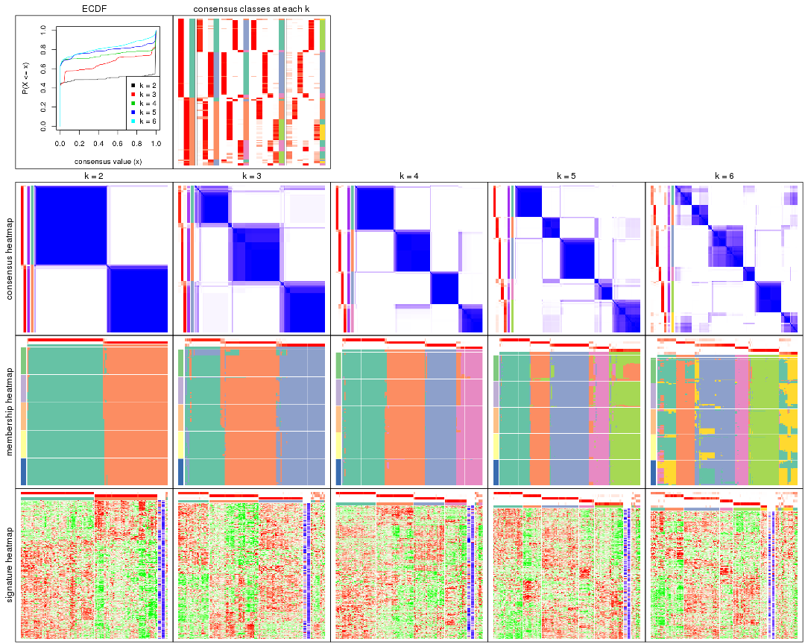

The plots are:

- The first row: a plot of the ECDF (Empirical cumulative distribution
  function) curves of the consensus matrix for each `k` and the heatmap of
  predicted classes for each `k`.
- The second row: heatmaps of the consensus matrix for each `k`.
- The third row: heatmaps of the membership matrix for each `k`.
- The fouth row: heatmaps of the signatures for each `k`.

All the plots in panels can be made by individual functions and they are
plotted later in this section.

`select_partition_number()` produces several plots showing different
statistics for choosing "optimized" `k`. There are following statistics:

- ECDF curves of the consensus matrix for each `k`;
- 1-PAC. [The PAC
  score](https://en.wikipedia.org/wiki/Consensus_clustering#Over-interpretation_potential_of_consensus_clustering)
  measures the proportion of the ambiguous subgrouping.
- Mean silhouette score.
- Concordance. The mean probability of fiting the consensus class ids in all
  partitions.
- Area increased. Denote $A_k$ as the area under the ECDF curve for current
  `k`, the area increased is defined as $A_k - A_{k-1}$.
- Rand index. The percent of pairs of samples that are both in a same cluster
  or both are not in a same cluster in the partition of k and k-1.
- Jaccard index. The ratio of pairs of samples are both in a same cluster in
  the partition of k and k-1 and the pairs of samples are both in a same
  cluster in the partition k or k-1.

The detailed explanations of these statistics can be found in [the cola
vignette](http://bioconductor.org/packages/devel/bioc/vignettes/cola/inst/doc/cola.html#toc_13).

Generally speaking, lower PAC score, higher mean silhouette score or higher
concordance corresponds to better partition. Rand index and Jaccard index
measure how similar the current partition is compared to partition with `k-1`.
If they are too similar, we won't accept `k` is better than `k-1`.

```r
select_partition_number(res)
```


The numeric values for all these statistics can be obtained by `get_stats()`.

```r
get_stats(res)
```

```
#>   k 1-PAC mean_silhouette concordance area_increased  Rand Jaccard
#> 2 2 1.000           0.974       0.990         0.5007 0.499   0.499
#> 3 3 0.900           0.864       0.937         0.3164 0.768   0.566
#> 4 4 0.971           0.918       0.967         0.1283 0.855   0.606
#> 5 5 0.874           0.876       0.932         0.0602 0.899   0.640
#> 6 6 0.833           0.755       0.835         0.0394 0.948   0.766
```

`suggest_best_k()` suggests the best $k$ based on these statistics. The rules are as follows:

- All $k$ with Jaccard index larger than 0.95 are removed because the increase of
  the partition number does not provides enough extra information. If all $k$ are removed,
  the best $k$ is assigned by `NA`.
- For $k$ with 1-PAC larger than 0.9, the maximal $k$ is taken as the "best k". Other $k$ is called "optional k".
- If it does not fit the second rule. The $k$ with the highest vote of highest
  1-PAC, mean silhouette and concordance is taken as the "best k".

```r
suggest_best_k(res)
```

```
#> [1] 4
#> attr(,"optional")
#> [1] 2 3
```

There is also optional best $k$ = 2 3 that is worth to check.

Following shows the table of the partitions (You need to click the **show/hide
code output** link to see it). The membership matrix (columns with name `p*`)
is inferred by
[`clue::cl_consensus()`](https://www.rdocumentation.org/link/cl_consensus?package=clue)
function with the `SE` method. Basically the value in the membership matrix
represents the probability to belong to a certain group. The finall class
label for an item is determined with the group with highest probability it
belongs to.

In `get_classes()` function, the entropy is calculated from the membership
matrix and the silhouette score is calculated from the consensus matrix.


<script>
$( function() {
	$( '#tabs-ATC-skmeans-get-classes' ).tabs();
} );
</script>
<div id='tabs-ATC-skmeans-get-classes'>
<ul>
<li><a href='#tab-ATC-skmeans-get-classes-1'>k = 2</a></li>
<li><a href='#tab-ATC-skmeans-get-classes-2'>k = 3</a></li>
<li><a href='#tab-ATC-skmeans-get-classes-3'>k = 4</a></li>
<li><a href='#tab-ATC-skmeans-get-classes-4'>k = 5</a></li>
<li><a href='#tab-ATC-skmeans-get-classes-5'>k = 6</a></li>
</ul>

<div id='tab-ATC-skmeans-get-classes-1'>
<p><a id='tab-ATC-skmeans-get-classes-1-a' style='color:#0366d6' href='#'>show/hide code output</a></p>
<pre><code class="r">cbind(get_classes(res, k = 2), get_membership(res, k = 2))
</code></pre>

<pre><code>#&gt;                                      class entropy silhouette    p1    p2
#&gt; DC1F29A2-39DE-44AD-936A-54B2B32D6370     1  0.0000      0.993 1.000 0.000
#&gt; FA3C3413-FA8C-4A29-B9CA-5BC3A56274A8     2  0.0000      0.985 0.000 1.000
#&gt; B9B72975-8134-475C-BC0B-0CFDB24F636A     2  0.0000      0.985 0.000 1.000
#&gt; F44DB757-4D00-4BFC-99C5-AA82F99C5BDA     2  0.4022      0.906 0.080 0.920
#&gt; 3BD942BB-A3A7-4993-B3F1-B8641626B773     1  0.0000      0.993 1.000 0.000
#&gt; 431F73A2-2AB3-4101-B610-7FC02A7097EC     1  0.0000      0.993 1.000 0.000
#&gt; 3067683D-43D4-4F6D-9338-17F6A75E4B25     1  0.0000      0.993 1.000 0.000
#&gt; 2CE91B81-7CBE-4698-AFEE-6A154313D231     2  0.0000      0.985 0.000 1.000
#&gt; A639CF4F-4591-4337-A12E-BED71EDDA10B     1  0.0000      0.993 1.000 0.000
#&gt; 5482053D-9F48-4773-B68A-302B3A612503     1  0.0000      0.993 1.000 0.000
#&gt; A31D342D-C67C-428B-BAED-C6E844277A09     2  0.0000      0.985 0.000 1.000
#&gt; 0E9C5985-9AE0-4098-A076-6FFBBDF05110     1  0.0000      0.993 1.000 0.000
#&gt; 08CCF8A0-15B7-4A13-BC43-6B3B3E2DDE95     2  0.0000      0.985 0.000 1.000
#&gt; 10577D5B-AD56-403F-A562-73A9ACF2045B     1  0.0000      0.993 1.000 0.000
#&gt; C940D443-5DDA-4403-868B-7AA6B9A50FC4     1  0.0000      0.993 1.000 0.000
#&gt; 89D4D945-A717-495F-B253-F5A17CF5B9FA     2  0.0000      0.985 0.000 1.000
#&gt; DC55EE78-203F-4092-9B83-14B1A529194B     2  0.0000      0.985 0.000 1.000
#&gt; 8F7368BE-EB41-4192-89AA-9E0428C08851     2  0.0000      0.985 0.000 1.000
#&gt; F772EA39-E408-4908-BADD-C786D702BF9B     2  0.0000      0.985 0.000 1.000
#&gt; FD693D10-3ADA-4028-8392-41D2F0296F7E     2  0.0000      0.985 0.000 1.000
#&gt; 84F16966-7640-49F9-95D1-7648FF74DCC9     2  0.0000      0.985 0.000 1.000
#&gt; D26DAA2F-AE6A-42E1-9F1F-01943B99785F     2  0.0000      0.985 0.000 1.000
#&gt; F325847E-F046-4B67-B01C-16919C401020     1  0.0000      0.993 1.000 0.000
#&gt; 19EB2B10-2529-4A94-8FAE-1CE371A602D9     1  0.0000      0.993 1.000 0.000
#&gt; B94B9CCF-5FB8-44AE-8D9C-A194C6801A27     2  0.0000      0.985 0.000 1.000
#&gt; D2678E70-542A-4AB2-B881-12D66DBA44F5     2  0.0000      0.985 0.000 1.000
#&gt; 4961CA2A-70CD-42AB-A676-4A98C85F449F     2  0.5946      0.830 0.144 0.856
#&gt; 5AA74C5C-2AD1-4D59-A030-E964EB199581     1  0.0000      0.993 1.000 0.000
#&gt; F9E11A1B-BD93-438F-9670-6FB7DFF9E910     1  0.0000      0.993 1.000 0.000
#&gt; FB78CA5A-C8B9-42AF-9DAE-799CAB280B2E     1  0.0000      0.993 1.000 0.000
#&gt; A8E48877-F8AB-44DD-A18B-194D87C44931     2  0.0000      0.985 0.000 1.000
#&gt; CA50C495-F37E-4743-867D-FAF2DCC3376A     2  0.0000      0.985 0.000 1.000
#&gt; 37342369-EC22-4904-8CCD-A0DC6BD8D183     2  0.0000      0.985 0.000 1.000
#&gt; 91BA5F90-9174-4533-A050-39A28E34A94D     1  0.0000      0.993 1.000 0.000
#&gt; 5BC371AC-1915-44E9-A114-2963E131EC8D     2  0.0000      0.985 0.000 1.000
#&gt; 74A6C31A-7F21-45AF-A170-18C326D2AE69     1  0.0000      0.993 1.000 0.000
#&gt; 984F27EF-D4D7-4E68-BD64-776FDFC04D07     2  0.5178      0.865 0.116 0.884
#&gt; B05701C5-8C44-4FD1-94C9-FC0255A2EA24     1  0.0000      0.993 1.000 0.000
#&gt; 91E4119C-2CE6-4447-A125-6A4F403A89E6     1  0.0000      0.993 1.000 0.000
#&gt; 1570FCE7-F1B4-4BDF-A398-355EDF030864     2  0.0000      0.985 0.000 1.000
#&gt; 604C06E9-A00E-435E-847A-3992922A5C56     1  0.0000      0.993 1.000 0.000
#&gt; 455C9007-6FF4-4D63-83FA-4915F0331F9A     1  0.0000      0.993 1.000 0.000
#&gt; FB8BD3CF-D2EC-47B6-B67F-65ADC1C3A6A7     2  0.0672      0.978 0.008 0.992
#&gt; 9DC7443A-3C8F-4025-8312-3C98BF28D736     1  0.0000      0.993 1.000 0.000
#&gt; CB207A52-09AC-49D3-8240-5840CDFBB154     1  0.0000      0.993 1.000 0.000
#&gt; 2A335049-AD9F-4B32-92B7-69B04B0CF2BA     1  0.0000      0.993 1.000 0.000
#&gt; 6ACA6293-371E-428D-BBAE-ABFD410C886F     2  0.0000      0.985 0.000 1.000
#&gt; E8929929-73F9-4DB7-ABBA-0852BEFFFF7E     2  0.0000      0.985 0.000 1.000
#&gt; 5E343116-414B-41F2-AAEE-A3225450135A     1  0.0000      0.993 1.000 0.000
#&gt; 0A39073C-157C-48A1-B125-A6A04CB738DA     2  0.0000      0.985 0.000 1.000
#&gt; 300D78E6-1C7E-4114-80EA-9204A6818B9A     1  0.0000      0.993 1.000 0.000
#&gt; DAAF55AA-ED48-4221-9CD6-D1DEB6376017     2  0.0000      0.985 0.000 1.000
#&gt; D76FCF4A-4ACF-41EF-A120-64136D6C845E     1  0.0000      0.993 1.000 0.000
#&gt; AD294665-6F90-459C-90D5-3058F210225D     1  0.0000      0.993 1.000 0.000
#&gt; 92E8AD7A-1084-44C8-BDC0-FE4E47B6143F     1  0.0000      0.993 1.000 0.000
#&gt; 5644A861-3C59-486D-8FBE-4DF6A3B19558     1  0.0000      0.993 1.000 0.000
#&gt; 1BF8AAE7-B771-4CF2-8B1C-D2BEB5E6579E     1  0.0000      0.993 1.000 0.000
#&gt; A54731AE-FC40-407F-8D10-67DDC122237D     2  0.0000      0.985 0.000 1.000
#&gt; 179DC906-5654-4CBA-9C27-C9560B5F12DE     1  0.0000      0.993 1.000 0.000
#&gt; 979B9A2B-2D81-47C3-A553-9B9441CAAE47     1  0.0000      0.993 1.000 0.000
#&gt; D69BD86A-08FB-49DA-9084-2725F6C9195F     1  0.0000      0.993 1.000 0.000
#&gt; 84611033-BCF7-49D7-9B91-DA29B62AC8D3     2  0.0000      0.985 0.000 1.000
#&gt; 8AA1DA3E-8C00-4653-AA33-EA70531C1E50     2  0.0000      0.985 0.000 1.000
#&gt; CEBE9594-0F19-46B4-AF7D-F8DF33E00AFB     1  0.0376      0.990 0.996 0.004
#&gt; C68E82D2-2BD3-41E9-92D7-D4C06E1953B2     1  0.0000      0.993 1.000 0.000
#&gt; B855EF89-1E76-4408-AA65-61A0F0A4F412     2  0.0000      0.985 0.000 1.000
#&gt; 4488EFB3-5B01-41E3-B57E-8E4F607CF448     1  0.0000      0.993 1.000 0.000
#&gt; C2BD8440-CAC6-4FE5-8EBB-5E6AE308D52F     1  0.0000      0.993 1.000 0.000
#&gt; E0E50F10-1FED-41C1-84DB-81A46F25D7E9     2  0.0000      0.985 0.000 1.000
#&gt; EE16D845-31F2-4178-800B-CA2C358841AD     2  0.0000      0.985 0.000 1.000
#&gt; 169828CF-5693-4A46-B5D7-E45CBA9DF317     2  0.0000      0.985 0.000 1.000
#&gt; 51077BA3-AEE0-4BD4-A1B1-1B0A811642A1     1  0.0000      0.993 1.000 0.000
#&gt; D2F4E240-C44C-4CF7-8016-6CACD370D093     1  0.0000      0.993 1.000 0.000
#&gt; 721CDBE6-FC85-4C30-B23E-28407340286F     1  0.0000      0.993 1.000 0.000
#&gt; 392897E4-6009-422C-B461-649F4DDF260C     1  0.0000      0.993 1.000 0.000
#&gt; 617E13D2-6924-45F8-A8DE-BE21B718F822     1  0.0000      0.993 1.000 0.000
#&gt; 5746C00F-9CBB-46B7-83FD-90B2AB3F507B     1  0.0000      0.993 1.000 0.000
#&gt; 982B4344-A223-4D1F-9485-2E56F9FD45C0     2  0.0000      0.985 0.000 1.000
#&gt; E5557F52-015D-49DC-9E23-989FC259976F     1  0.0000      0.993 1.000 0.000
#&gt; F3135F5E-2E90-4923-B634-E994563D17B7     1  0.0000      0.993 1.000 0.000
#&gt; D1ED15A5-9802-4314-B556-E89EB772D1F0     1  0.0000      0.993 1.000 0.000
#&gt; 222B06E3-FCFB-4104-92C3-D73BC31854D4     1  0.0000      0.993 1.000 0.000
#&gt; 4C810FFA-ED07-4F4C-9F81-B8F1CF4956F7     2  0.0000      0.985 0.000 1.000
#&gt; 9A608964-ED12-4E6E-9D3A-430F59FFF65B     1  0.0000      0.993 1.000 0.000
#&gt; 4087357F-C17A-4992-A8AB-41ACA2F72001     2  0.0000      0.985 0.000 1.000
#&gt; B3F013A5-BCB8-4CE0-86B2-634EE180AA6E     2  0.0000      0.985 0.000 1.000
#&gt; 322AF320-1379-4F51-AFDC-5292A060CD52     2  0.0000      0.985 0.000 1.000
#&gt; 53A96249-66D5-4C26-893B-ADC71481D261     2  0.0000      0.985 0.000 1.000
#&gt; 1AB7A6F2-14BD-447C-B2E3-DEB0CE56B209     1  0.0000      0.993 1.000 0.000
#&gt; 8B4BCDA0-6787-4A55-99F7-AAF22AF85BA6     2  0.0000      0.985 0.000 1.000
#&gt; 5D9D9E08-2C2C-414E-9547-62799F90D543     2  0.0000      0.985 0.000 1.000
#&gt; C345CD17-E4F4-41D5-9891-FEFB19342C52     1  0.0000      0.993 1.000 0.000
#&gt; 1AF8FDE1-1A74-41F6-A1C5-4952CDFB7D3F     1  0.0000      0.993 1.000 0.000
#&gt; BC3405FF-0660-4B2B-8DC1-5F34D3133078     1  0.0000      0.993 1.000 0.000
#&gt; C2662596-6E2F-4924-B051-CEA1AC87B197     1  0.0000      0.993 1.000 0.000
#&gt; 39AE85F7-49FB-4438-BD41-6AC812FA1C72     1  0.0000      0.993 1.000 0.000
#&gt; 6FF266DB-3F08-43F2-8F6F-679F805B80B8     2  0.9988      0.069 0.480 0.520
#&gt; B03B7B81-BBD6-4194-BC5E-6EDF0D3F015A     2  0.0000      0.985 0.000 1.000
#&gt; C7617D56-F13C-4C43-906C-BD458C5DC4CD     1  0.2423      0.953 0.960 0.040
#&gt; 09420F8B-7A71-4B32-8388-4767670F1FEB     1  0.0000      0.993 1.000 0.000
#&gt; 6AF47534-74FF-4128-865B-4E8EE1FFB469     2  0.0000      0.985 0.000 1.000
#&gt; 8FF9E94A-2ED2-4727-947F-D524D7ECE815     1  0.9661      0.344 0.608 0.392
#&gt; A390E20D-03F9-40E4-A132-0FA5C2BEDB63     1  0.0000      0.993 1.000 0.000
#&gt; A489CCCA-1374-4071-80CE-05B83C9A0D5E     2  0.0000      0.985 0.000 1.000
#&gt; 2D962371-EC83-490C-A663-478AF383BC1B     2  0.0000      0.985 0.000 1.000
#&gt; D91B31A1-EE71-4726-B94C-0CC2815E9D4E     1  0.0000      0.993 1.000 0.000
#&gt; E0123C5C-E1D1-4162-9895-CC8B01949D84     2  0.0000      0.985 0.000 1.000
#&gt; EC73959A-2728-49FE-B72A-790BB14F4CBF     1  0.0000      0.993 1.000 0.000
#&gt; A60DC925-7343-496E-900D-0DD81D5C8123     2  0.0000      0.985 0.000 1.000
#&gt; 659B64DB-F4A5-43BD-811B-05004CB49D99     1  0.0000      0.993 1.000 0.000
#&gt; 6969B6B2-7616-4664-9696-C4DACD10537B     2  0.0000      0.985 0.000 1.000
#&gt; 2F6392DE-0D54-4768-B062-907C81E5B0CC     1  0.0000      0.993 1.000 0.000
#&gt; C74BE8C5-BA6D-4596-9D67-3C731799F999     2  0.0000      0.985 0.000 1.000
#&gt; 79A7647F-BDBA-45A2-B207-ABF788F6CC95     1  0.0000      0.993 1.000 0.000
#&gt; D47D0433-2313-4A2F-B268-5AD293D7534E     2  0.0000      0.985 0.000 1.000
#&gt; C5058B93-C1DA-43B9-9951-B23A9810AA6E     1  0.0000      0.993 1.000 0.000
#&gt; 2629FEE3-A203-4411-8A70-02A796C9505C     2  0.0000      0.985 0.000 1.000
#&gt; 1AF329E4-11D4-4CFC-801F-C24A1EA33102     2  0.0000      0.985 0.000 1.000
#&gt; D453BEF8-3F18-4B89-BA42-CE74EB105032     1  0.0000      0.993 1.000 0.000
#&gt; B12A4446-2310-4139-897F-CA030478CBD5     1  0.0000      0.993 1.000 0.000
#&gt; BCAB1918-5FA9-4CBD-85CB-008743FEA2CC     1  0.0000      0.993 1.000 0.000
#&gt; 9A5432D3-19EE-47B4-BD88-698DEC75A5E9     2  0.0000      0.985 0.000 1.000
#&gt; A608BCEB-2C27-4927-A308-E6975F641722     2  0.0000      0.985 0.000 1.000
#&gt; E4752275-7BF6-4C1E-8A45-C7D571ED85AD     2  0.0000      0.985 0.000 1.000
#&gt; FDEC1714-C02D-4AB7-AE82-789E9D709EDE     1  0.0000      0.993 1.000 0.000
#&gt; 33737781-8638-4FA2-AD4C-E888BB9343D8     2  0.0000      0.985 0.000 1.000
</code></pre>

<script>
$('#tab-ATC-skmeans-get-classes-1-a').parent().next().next().hide();
$('#tab-ATC-skmeans-get-classes-1-a').click(function(){
  $('#tab-ATC-skmeans-get-classes-1-a').parent().next().next().toggle();
  return(false);
});
</script>
</div>

<div id='tab-ATC-skmeans-get-classes-2'>
<p><a id='tab-ATC-skmeans-get-classes-2-a' style='color:#0366d6' href='#'>show/hide code output</a></p>
<pre><code class="r">cbind(get_classes(res, k = 3), get_membership(res, k = 3))
</code></pre>

<pre><code>#&gt;                                      class entropy silhouette    p1    p2    p3
#&gt; DC1F29A2-39DE-44AD-936A-54B2B32D6370     3  0.0000     0.9430 0.000 0.000 1.000
#&gt; FA3C3413-FA8C-4A29-B9CA-5BC3A56274A8     2  0.0000     0.9434 0.000 1.000 0.000
#&gt; B9B72975-8134-475C-BC0B-0CFDB24F636A     2  0.0000     0.9434 0.000 1.000 0.000
#&gt; F44DB757-4D00-4BFC-99C5-AA82F99C5BDA     1  0.1643     0.8864 0.956 0.044 0.000
#&gt; 3BD942BB-A3A7-4993-B3F1-B8641626B773     3  0.0000     0.9430 0.000 0.000 1.000
#&gt; 431F73A2-2AB3-4101-B610-7FC02A7097EC     1  0.1643     0.9254 0.956 0.000 0.044
#&gt; 3067683D-43D4-4F6D-9338-17F6A75E4B25     1  0.1643     0.9254 0.956 0.000 0.044
#&gt; 2CE91B81-7CBE-4698-AFEE-6A154313D231     2  0.0000     0.9434 0.000 1.000 0.000
#&gt; A639CF4F-4591-4337-A12E-BED71EDDA10B     3  0.0000     0.9430 0.000 0.000 1.000
#&gt; 5482053D-9F48-4773-B68A-302B3A612503     3  0.0000     0.9430 0.000 0.000 1.000
#&gt; A31D342D-C67C-428B-BAED-C6E844277A09     2  0.1643     0.9252 0.044 0.956 0.000
#&gt; 0E9C5985-9AE0-4098-A076-6FFBBDF05110     1  0.1765     0.9224 0.956 0.004 0.040
#&gt; 08CCF8A0-15B7-4A13-BC43-6B3B3E2DDE95     2  0.0000     0.9434 0.000 1.000 0.000
#&gt; 10577D5B-AD56-403F-A562-73A9ACF2045B     1  0.1643     0.9254 0.956 0.000 0.044
#&gt; C940D443-5DDA-4403-868B-7AA6B9A50FC4     3  0.0000     0.9430 0.000 0.000 1.000
#&gt; 89D4D945-A717-495F-B253-F5A17CF5B9FA     2  0.6307     0.0596 0.488 0.512 0.000
#&gt; DC55EE78-203F-4092-9B83-14B1A529194B     2  0.0000     0.9434 0.000 1.000 0.000
#&gt; 8F7368BE-EB41-4192-89AA-9E0428C08851     2  0.1289     0.9314 0.032 0.968 0.000
#&gt; F772EA39-E408-4908-BADD-C786D702BF9B     2  0.0000     0.9434 0.000 1.000 0.000
#&gt; FD693D10-3ADA-4028-8392-41D2F0296F7E     2  0.1643     0.9252 0.044 0.956 0.000
#&gt; 84F16966-7640-49F9-95D1-7648FF74DCC9     2  0.0000     0.9434 0.000 1.000 0.000
#&gt; D26DAA2F-AE6A-42E1-9F1F-01943B99785F     2  0.0237     0.9425 0.004 0.996 0.000
#&gt; F325847E-F046-4B67-B01C-16919C401020     1  0.1643     0.9254 0.956 0.000 0.044
#&gt; 19EB2B10-2529-4A94-8FAE-1CE371A602D9     1  0.5216     0.6785 0.740 0.000 0.260
#&gt; B94B9CCF-5FB8-44AE-8D9C-A194C6801A27     2  0.0237     0.9425 0.004 0.996 0.000
#&gt; D2678E70-542A-4AB2-B881-12D66DBA44F5     2  0.1643     0.9252 0.044 0.956 0.000
#&gt; 4961CA2A-70CD-42AB-A676-4A98C85F449F     3  0.6140     0.3458 0.000 0.404 0.596
#&gt; 5AA74C5C-2AD1-4D59-A030-E964EB199581     1  0.1643     0.9254 0.956 0.000 0.044
#&gt; F9E11A1B-BD93-438F-9670-6FB7DFF9E910     1  0.6309     0.1390 0.500 0.000 0.500
#&gt; FB78CA5A-C8B9-42AF-9DAE-799CAB280B2E     1  0.1643     0.9254 0.956 0.000 0.044
#&gt; A8E48877-F8AB-44DD-A18B-194D87C44931     2  0.0000     0.9434 0.000 1.000 0.000
#&gt; CA50C495-F37E-4743-867D-FAF2DCC3376A     2  0.1643     0.9252 0.044 0.956 0.000
#&gt; 37342369-EC22-4904-8CCD-A0DC6BD8D183     2  0.0237     0.9425 0.004 0.996 0.000
#&gt; 91BA5F90-9174-4533-A050-39A28E34A94D     3  0.0000     0.9430 0.000 0.000 1.000
#&gt; 5BC371AC-1915-44E9-A114-2963E131EC8D     2  0.1289     0.9314 0.032 0.968 0.000
#&gt; 74A6C31A-7F21-45AF-A170-18C326D2AE69     3  0.0000     0.9430 0.000 0.000 1.000
#&gt; 984F27EF-D4D7-4E68-BD64-776FDFC04D07     2  0.7442     0.3243 0.044 0.588 0.368
#&gt; B05701C5-8C44-4FD1-94C9-FC0255A2EA24     3  0.0000     0.9430 0.000 0.000 1.000
#&gt; 91E4119C-2CE6-4447-A125-6A4F403A89E6     1  0.6483     0.2910 0.544 0.004 0.452
#&gt; 1570FCE7-F1B4-4BDF-A398-355EDF030864     1  0.5835     0.4482 0.660 0.340 0.000
#&gt; 604C06E9-A00E-435E-847A-3992922A5C56     3  0.0000     0.9430 0.000 0.000 1.000
#&gt; 455C9007-6FF4-4D63-83FA-4915F0331F9A     1  0.0000     0.8901 1.000 0.000 0.000
#&gt; FB8BD3CF-D2EC-47B6-B67F-65ADC1C3A6A7     3  0.2261     0.8819 0.000 0.068 0.932
#&gt; 9DC7443A-3C8F-4025-8312-3C98BF28D736     3  0.1643     0.9091 0.044 0.000 0.956
#&gt; CB207A52-09AC-49D3-8240-5840CDFBB154     1  0.1964     0.9168 0.944 0.000 0.056
#&gt; 2A335049-AD9F-4B32-92B7-69B04B0CF2BA     1  0.1643     0.9254 0.956 0.000 0.044
#&gt; 6ACA6293-371E-428D-BBAE-ABFD410C886F     2  0.0000     0.9434 0.000 1.000 0.000
#&gt; E8929929-73F9-4DB7-ABBA-0852BEFFFF7E     2  0.1643     0.9252 0.044 0.956 0.000
#&gt; 5E343116-414B-41F2-AAEE-A3225450135A     3  0.0000     0.9430 0.000 0.000 1.000
#&gt; 0A39073C-157C-48A1-B125-A6A04CB738DA     2  0.0000     0.9434 0.000 1.000 0.000
#&gt; 300D78E6-1C7E-4114-80EA-9204A6818B9A     1  0.1643     0.9254 0.956 0.000 0.044
#&gt; DAAF55AA-ED48-4221-9CD6-D1DEB6376017     2  0.1289     0.9314 0.032 0.968 0.000
#&gt; D76FCF4A-4ACF-41EF-A120-64136D6C845E     1  0.1643     0.9254 0.956 0.000 0.044
#&gt; AD294665-6F90-459C-90D5-3058F210225D     1  0.1643     0.9254 0.956 0.000 0.044
#&gt; 92E8AD7A-1084-44C8-BDC0-FE4E47B6143F     1  0.1643     0.9254 0.956 0.000 0.044
#&gt; 5644A861-3C59-486D-8FBE-4DF6A3B19558     3  0.0000     0.9430 0.000 0.000 1.000
#&gt; 1BF8AAE7-B771-4CF2-8B1C-D2BEB5E6579E     1  0.1643     0.9254 0.956 0.000 0.044
#&gt; A54731AE-FC40-407F-8D10-67DDC122237D     2  0.0000     0.9434 0.000 1.000 0.000
#&gt; 179DC906-5654-4CBA-9C27-C9560B5F12DE     3  0.0000     0.9430 0.000 0.000 1.000
#&gt; 979B9A2B-2D81-47C3-A553-9B9441CAAE47     3  0.0000     0.9430 0.000 0.000 1.000
#&gt; D69BD86A-08FB-49DA-9084-2725F6C9195F     3  0.0000     0.9430 0.000 0.000 1.000
#&gt; 84611033-BCF7-49D7-9B91-DA29B62AC8D3     1  0.4504     0.7092 0.804 0.196 0.000
#&gt; 8AA1DA3E-8C00-4653-AA33-EA70531C1E50     2  0.0000     0.9434 0.000 1.000 0.000
#&gt; CEBE9594-0F19-46B4-AF7D-F8DF33E00AFB     1  0.6209     0.3653 0.628 0.004 0.368
#&gt; C68E82D2-2BD3-41E9-92D7-D4C06E1953B2     3  0.0000     0.9430 0.000 0.000 1.000
#&gt; B855EF89-1E76-4408-AA65-61A0F0A4F412     2  0.0000     0.9434 0.000 1.000 0.000
#&gt; 4488EFB3-5B01-41E3-B57E-8E4F607CF448     1  0.1643     0.9254 0.956 0.000 0.044
#&gt; C2BD8440-CAC6-4FE5-8EBB-5E6AE308D52F     3  0.0000     0.9430 0.000 0.000 1.000
#&gt; E0E50F10-1FED-41C1-84DB-81A46F25D7E9     2  0.1643     0.9252 0.044 0.956 0.000
#&gt; EE16D845-31F2-4178-800B-CA2C358841AD     2  0.6154     0.3115 0.408 0.592 0.000
#&gt; 169828CF-5693-4A46-B5D7-E45CBA9DF317     2  0.0000     0.9434 0.000 1.000 0.000
#&gt; 51077BA3-AEE0-4BD4-A1B1-1B0A811642A1     3  0.0000     0.9430 0.000 0.000 1.000
#&gt; D2F4E240-C44C-4CF7-8016-6CACD370D093     1  0.1643     0.9254 0.956 0.000 0.044
#&gt; 721CDBE6-FC85-4C30-B23E-28407340286F     3  0.0000     0.9430 0.000 0.000 1.000
#&gt; 392897E4-6009-422C-B461-649F4DDF260C     3  0.0000     0.9430 0.000 0.000 1.000
#&gt; 617E13D2-6924-45F8-A8DE-BE21B718F822     3  0.1643     0.9091 0.044 0.000 0.956
#&gt; 5746C00F-9CBB-46B7-83FD-90B2AB3F507B     1  0.1643     0.9254 0.956 0.000 0.044
#&gt; 982B4344-A223-4D1F-9485-2E56F9FD45C0     2  0.0000     0.9434 0.000 1.000 0.000
#&gt; E5557F52-015D-49DC-9E23-989FC259976F     3  0.0000     0.9430 0.000 0.000 1.000
#&gt; F3135F5E-2E90-4923-B634-E994563D17B7     3  0.3686     0.7809 0.140 0.000 0.860
#&gt; D1ED15A5-9802-4314-B556-E89EB772D1F0     3  0.0000     0.9430 0.000 0.000 1.000
#&gt; 222B06E3-FCFB-4104-92C3-D73BC31854D4     1  0.1643     0.9254 0.956 0.000 0.044
#&gt; 4C810FFA-ED07-4F4C-9F81-B8F1CF4956F7     2  0.1529     0.9274 0.040 0.960 0.000
#&gt; 9A608964-ED12-4E6E-9D3A-430F59FFF65B     3  0.0000     0.9430 0.000 0.000 1.000
#&gt; 4087357F-C17A-4992-A8AB-41ACA2F72001     3  0.7328     0.4177 0.044 0.344 0.612
#&gt; B3F013A5-BCB8-4CE0-86B2-634EE180AA6E     2  0.0000     0.9434 0.000 1.000 0.000
#&gt; 322AF320-1379-4F51-AFDC-5292A060CD52     2  0.0000     0.9434 0.000 1.000 0.000
#&gt; 53A96249-66D5-4C26-893B-ADC71481D261     2  0.0000     0.9434 0.000 1.000 0.000
#&gt; 1AB7A6F2-14BD-447C-B2E3-DEB0CE56B209     1  0.1643     0.9254 0.956 0.000 0.044
#&gt; 8B4BCDA0-6787-4A55-99F7-AAF22AF85BA6     2  0.0000     0.9434 0.000 1.000 0.000
#&gt; 5D9D9E08-2C2C-414E-9547-62799F90D543     2  0.0000     0.9434 0.000 1.000 0.000
#&gt; C345CD17-E4F4-41D5-9891-FEFB19342C52     1  0.1643     0.9254 0.956 0.000 0.044
#&gt; 1AF8FDE1-1A74-41F6-A1C5-4952CDFB7D3F     1  0.1643     0.9254 0.956 0.000 0.044
#&gt; BC3405FF-0660-4B2B-8DC1-5F34D3133078     3  0.0000     0.9430 0.000 0.000 1.000
#&gt; C2662596-6E2F-4924-B051-CEA1AC87B197     3  0.0000     0.9430 0.000 0.000 1.000
#&gt; 39AE85F7-49FB-4438-BD41-6AC812FA1C72     3  0.0000     0.9430 0.000 0.000 1.000
#&gt; 6FF266DB-3F08-43F2-8F6F-679F805B80B8     3  0.1832     0.9102 0.036 0.008 0.956
#&gt; B03B7B81-BBD6-4194-BC5E-6EDF0D3F015A     2  0.1643     0.9252 0.044 0.956 0.000
#&gt; C7617D56-F13C-4C43-906C-BD458C5DC4CD     3  0.1643     0.9091 0.044 0.000 0.956
#&gt; 09420F8B-7A71-4B32-8388-4767670F1FEB     3  0.0000     0.9430 0.000 0.000 1.000
#&gt; 6AF47534-74FF-4128-865B-4E8EE1FFB469     2  0.0000     0.9434 0.000 1.000 0.000
#&gt; 8FF9E94A-2ED2-4727-947F-D524D7ECE815     3  0.8592     0.2999 0.108 0.360 0.532
#&gt; A390E20D-03F9-40E4-A132-0FA5C2BEDB63     3  0.0237     0.9401 0.004 0.000 0.996
#&gt; A489CCCA-1374-4071-80CE-05B83C9A0D5E     2  0.0000     0.9434 0.000 1.000 0.000
#&gt; 2D962371-EC83-490C-A663-478AF383BC1B     2  0.0000     0.9434 0.000 1.000 0.000
#&gt; D91B31A1-EE71-4726-B94C-0CC2815E9D4E     1  0.1643     0.9254 0.956 0.000 0.044
#&gt; E0123C5C-E1D1-4162-9895-CC8B01949D84     2  0.0000     0.9434 0.000 1.000 0.000
#&gt; EC73959A-2728-49FE-B72A-790BB14F4CBF     3  0.0000     0.9430 0.000 0.000 1.000
#&gt; A60DC925-7343-496E-900D-0DD81D5C8123     2  0.1289     0.9314 0.032 0.968 0.000
#&gt; 659B64DB-F4A5-43BD-811B-05004CB49D99     3  0.0000     0.9430 0.000 0.000 1.000
#&gt; 6969B6B2-7616-4664-9696-C4DACD10537B     2  0.0237     0.9425 0.004 0.996 0.000
#&gt; 2F6392DE-0D54-4768-B062-907C81E5B0CC     3  0.0000     0.9430 0.000 0.000 1.000
#&gt; C74BE8C5-BA6D-4596-9D67-3C731799F999     3  0.7459     0.3477 0.044 0.372 0.584
#&gt; 79A7647F-BDBA-45A2-B207-ABF788F6CC95     3  0.0000     0.9430 0.000 0.000 1.000
#&gt; D47D0433-2313-4A2F-B268-5AD293D7534E     2  0.0000     0.9434 0.000 1.000 0.000
#&gt; C5058B93-C1DA-43B9-9951-B23A9810AA6E     1  0.1643     0.9254 0.956 0.000 0.044
#&gt; 2629FEE3-A203-4411-8A70-02A796C9505C     2  0.0237     0.9425 0.004 0.996 0.000
#&gt; 1AF329E4-11D4-4CFC-801F-C24A1EA33102     2  0.6154     0.3115 0.408 0.592 0.000
#&gt; D453BEF8-3F18-4B89-BA42-CE74EB105032     1  0.1643     0.9254 0.956 0.000 0.044
#&gt; B12A4446-2310-4139-897F-CA030478CBD5     3  0.0000     0.9430 0.000 0.000 1.000
#&gt; BCAB1918-5FA9-4CBD-85CB-008743FEA2CC     3  0.0000     0.9430 0.000 0.000 1.000
#&gt; 9A5432D3-19EE-47B4-BD88-698DEC75A5E9     2  0.0237     0.9425 0.004 0.996 0.000
#&gt; A608BCEB-2C27-4927-A308-E6975F641722     2  0.6260     0.1956 0.448 0.552 0.000
#&gt; E4752275-7BF6-4C1E-8A45-C7D571ED85AD     2  0.0000     0.9434 0.000 1.000 0.000
#&gt; FDEC1714-C02D-4AB7-AE82-789E9D709EDE     3  0.0000     0.9430 0.000 0.000 1.000
#&gt; 33737781-8638-4FA2-AD4C-E888BB9343D8     2  0.0000     0.9434 0.000 1.000 0.000
</code></pre>

<script>
$('#tab-ATC-skmeans-get-classes-2-a').parent().next().next().hide();
$('#tab-ATC-skmeans-get-classes-2-a').click(function(){
  $('#tab-ATC-skmeans-get-classes-2-a').parent().next().next().toggle();
  return(false);
});
</script>
</div>

<div id='tab-ATC-skmeans-get-classes-3'>
<p><a id='tab-ATC-skmeans-get-classes-3-a' style='color:#0366d6' href='#'>show/hide code output</a></p>
<pre><code class="r">cbind(get_classes(res, k = 4), get_membership(res, k = 4))
</code></pre>

<pre><code>#&gt;                                      class entropy silhouette    p1    p2    p3    p4
#&gt; DC1F29A2-39DE-44AD-936A-54B2B32D6370     1  0.0000      0.979 1.000 0.000 0.000 0.000
#&gt; FA3C3413-FA8C-4A29-B9CA-5BC3A56274A8     2  0.0188      0.964 0.000 0.996 0.000 0.004
#&gt; B9B72975-8134-475C-BC0B-0CFDB24F636A     2  0.0000      0.965 0.000 1.000 0.000 0.000
#&gt; F44DB757-4D00-4BFC-99C5-AA82F99C5BDA     3  0.0000      0.978 0.000 0.000 1.000 0.000
#&gt; 3BD942BB-A3A7-4993-B3F1-B8641626B773     1  0.0000      0.979 1.000 0.000 0.000 0.000
#&gt; 431F73A2-2AB3-4101-B610-7FC02A7097EC     3  0.0000      0.978 0.000 0.000 1.000 0.000
#&gt; 3067683D-43D4-4F6D-9338-17F6A75E4B25     3  0.0000      0.978 0.000 0.000 1.000 0.000
#&gt; 2CE91B81-7CBE-4698-AFEE-6A154313D231     2  0.0188      0.964 0.000 0.996 0.000 0.004
#&gt; A639CF4F-4591-4337-A12E-BED71EDDA10B     1  0.0000      0.979 1.000 0.000 0.000 0.000
#&gt; 5482053D-9F48-4773-B68A-302B3A612503     1  0.0000      0.979 1.000 0.000 0.000 0.000
#&gt; A31D342D-C67C-428B-BAED-C6E844277A09     4  0.0592      0.906 0.000 0.016 0.000 0.984
#&gt; 0E9C5985-9AE0-4098-A076-6FFBBDF05110     3  0.0000      0.978 0.000 0.000 1.000 0.000
#&gt; 08CCF8A0-15B7-4A13-BC43-6B3B3E2DDE95     2  0.0188      0.964 0.000 0.996 0.000 0.004
#&gt; 10577D5B-AD56-403F-A562-73A9ACF2045B     3  0.0000      0.978 0.000 0.000 1.000 0.000
#&gt; C940D443-5DDA-4403-868B-7AA6B9A50FC4     1  0.0000      0.979 1.000 0.000 0.000 0.000
#&gt; 89D4D945-A717-495F-B253-F5A17CF5B9FA     2  0.0000      0.965 0.000 1.000 0.000 0.000
#&gt; DC55EE78-203F-4092-9B83-14B1A529194B     2  0.0000      0.965 0.000 1.000 0.000 0.000
#&gt; 8F7368BE-EB41-4192-89AA-9E0428C08851     4  0.1211      0.897 0.000 0.040 0.000 0.960
#&gt; F772EA39-E408-4908-BADD-C786D702BF9B     2  0.0000      0.965 0.000 1.000 0.000 0.000
#&gt; FD693D10-3ADA-4028-8392-41D2F0296F7E     4  0.0000      0.907 0.000 0.000 0.000 1.000
#&gt; 84F16966-7640-49F9-95D1-7648FF74DCC9     2  0.0000      0.965 0.000 1.000 0.000 0.000
#&gt; D26DAA2F-AE6A-42E1-9F1F-01943B99785F     4  0.4898      0.392 0.000 0.416 0.000 0.584
#&gt; F325847E-F046-4B67-B01C-16919C401020     3  0.0000      0.978 0.000 0.000 1.000 0.000
#&gt; 19EB2B10-2529-4A94-8FAE-1CE371A602D9     3  0.0000      0.978 0.000 0.000 1.000 0.000
#&gt; B94B9CCF-5FB8-44AE-8D9C-A194C6801A27     2  0.1557      0.910 0.000 0.944 0.000 0.056
#&gt; D2678E70-542A-4AB2-B881-12D66DBA44F5     4  0.0000      0.907 0.000 0.000 0.000 1.000
#&gt; 4961CA2A-70CD-42AB-A676-4A98C85F449F     2  0.4898      0.273 0.416 0.584 0.000 0.000
#&gt; 5AA74C5C-2AD1-4D59-A030-E964EB199581     3  0.0000      0.978 0.000 0.000 1.000 0.000
#&gt; F9E11A1B-BD93-438F-9670-6FB7DFF9E910     3  0.4454      0.544 0.308 0.000 0.692 0.000
#&gt; FB78CA5A-C8B9-42AF-9DAE-799CAB280B2E     3  0.0000      0.978 0.000 0.000 1.000 0.000
#&gt; A8E48877-F8AB-44DD-A18B-194D87C44931     2  0.0188      0.964 0.000 0.996 0.000 0.004
#&gt; CA50C495-F37E-4743-867D-FAF2DCC3376A     4  0.0336      0.907 0.000 0.008 0.000 0.992
#&gt; 37342369-EC22-4904-8CCD-A0DC6BD8D183     4  0.5000      0.159 0.000 0.496 0.000 0.504
#&gt; 91BA5F90-9174-4533-A050-39A28E34A94D     1  0.0000      0.979 1.000 0.000 0.000 0.000
#&gt; 5BC371AC-1915-44E9-A114-2963E131EC8D     4  0.1022      0.900 0.000 0.032 0.000 0.968
#&gt; 74A6C31A-7F21-45AF-A170-18C326D2AE69     1  0.0000      0.979 1.000 0.000 0.000 0.000
#&gt; 984F27EF-D4D7-4E68-BD64-776FDFC04D07     4  0.0000      0.907 0.000 0.000 0.000 1.000
#&gt; B05701C5-8C44-4FD1-94C9-FC0255A2EA24     1  0.0000      0.979 1.000 0.000 0.000 0.000
#&gt; 91E4119C-2CE6-4447-A125-6A4F403A89E6     2  0.4746      0.401 0.368 0.632 0.000 0.000
#&gt; 1570FCE7-F1B4-4BDF-A398-355EDF030864     2  0.0000      0.965 0.000 1.000 0.000 0.000
#&gt; 604C06E9-A00E-435E-847A-3992922A5C56     1  0.0469      0.968 0.988 0.000 0.012 0.000
#&gt; 455C9007-6FF4-4D63-83FA-4915F0331F9A     4  0.0188      0.904 0.000 0.000 0.004 0.996
#&gt; FB8BD3CF-D2EC-47B6-B67F-65ADC1C3A6A7     1  0.4477      0.529 0.688 0.312 0.000 0.000
#&gt; 9DC7443A-3C8F-4025-8312-3C98BF28D736     4  0.0000      0.907 0.000 0.000 0.000 1.000
#&gt; CB207A52-09AC-49D3-8240-5840CDFBB154     3  0.0188      0.974 0.004 0.000 0.996 0.000
#&gt; 2A335049-AD9F-4B32-92B7-69B04B0CF2BA     3  0.0000      0.978 0.000 0.000 1.000 0.000
#&gt; 6ACA6293-371E-428D-BBAE-ABFD410C886F     2  0.0000      0.965 0.000 1.000 0.000 0.000
#&gt; E8929929-73F9-4DB7-ABBA-0852BEFFFF7E     4  0.0592      0.906 0.000 0.016 0.000 0.984
#&gt; 5E343116-414B-41F2-AAEE-A3225450135A     1  0.0000      0.979 1.000 0.000 0.000 0.000
#&gt; 0A39073C-157C-48A1-B125-A6A04CB738DA     2  0.0188      0.964 0.000 0.996 0.000 0.004
#&gt; 300D78E6-1C7E-4114-80EA-9204A6818B9A     3  0.0000      0.978 0.000 0.000 1.000 0.000
#&gt; DAAF55AA-ED48-4221-9CD6-D1DEB6376017     4  0.1118      0.900 0.000 0.036 0.000 0.964
#&gt; D76FCF4A-4ACF-41EF-A120-64136D6C845E     3  0.0000      0.978 0.000 0.000 1.000 0.000
#&gt; AD294665-6F90-459C-90D5-3058F210225D     3  0.0000      0.978 0.000 0.000 1.000 0.000
#&gt; 92E8AD7A-1084-44C8-BDC0-FE4E47B6143F     3  0.0000      0.978 0.000 0.000 1.000 0.000
#&gt; 5644A861-3C59-486D-8FBE-4DF6A3B19558     1  0.0000      0.979 1.000 0.000 0.000 0.000
#&gt; 1BF8AAE7-B771-4CF2-8B1C-D2BEB5E6579E     3  0.0000      0.978 0.000 0.000 1.000 0.000
#&gt; A54731AE-FC40-407F-8D10-67DDC122237D     2  0.0000      0.965 0.000 1.000 0.000 0.000
#&gt; 179DC906-5654-4CBA-9C27-C9560B5F12DE     1  0.0000      0.979 1.000 0.000 0.000 0.000
#&gt; 979B9A2B-2D81-47C3-A553-9B9441CAAE47     1  0.0000      0.979 1.000 0.000 0.000 0.000
#&gt; D69BD86A-08FB-49DA-9084-2725F6C9195F     1  0.0000      0.979 1.000 0.000 0.000 0.000
#&gt; 84611033-BCF7-49D7-9B91-DA29B62AC8D3     3  0.4281      0.736 0.000 0.180 0.792 0.028
#&gt; 8AA1DA3E-8C00-4653-AA33-EA70531C1E50     2  0.0000      0.965 0.000 1.000 0.000 0.000
#&gt; CEBE9594-0F19-46B4-AF7D-F8DF33E00AFB     4  0.0188      0.904 0.000 0.000 0.004 0.996
#&gt; C68E82D2-2BD3-41E9-92D7-D4C06E1953B2     1  0.0000      0.979 1.000 0.000 0.000 0.000
#&gt; B855EF89-1E76-4408-AA65-61A0F0A4F412     2  0.0188      0.964 0.000 0.996 0.000 0.004
#&gt; 4488EFB3-5B01-41E3-B57E-8E4F607CF448     3  0.0000      0.978 0.000 0.000 1.000 0.000
#&gt; C2BD8440-CAC6-4FE5-8EBB-5E6AE308D52F     1  0.0000      0.979 1.000 0.000 0.000 0.000
#&gt; E0E50F10-1FED-41C1-84DB-81A46F25D7E9     4  0.0000      0.907 0.000 0.000 0.000 1.000
#&gt; EE16D845-31F2-4178-800B-CA2C358841AD     2  0.0000      0.965 0.000 1.000 0.000 0.000
#&gt; 169828CF-5693-4A46-B5D7-E45CBA9DF317     2  0.0188      0.964 0.000 0.996 0.000 0.004
#&gt; 51077BA3-AEE0-4BD4-A1B1-1B0A811642A1     1  0.0000      0.979 1.000 0.000 0.000 0.000
#&gt; D2F4E240-C44C-4CF7-8016-6CACD370D093     3  0.0000      0.978 0.000 0.000 1.000 0.000
#&gt; 721CDBE6-FC85-4C30-B23E-28407340286F     1  0.0000      0.979 1.000 0.000 0.000 0.000
#&gt; 392897E4-6009-422C-B461-649F4DDF260C     1  0.0000      0.979 1.000 0.000 0.000 0.000
#&gt; 617E13D2-6924-45F8-A8DE-BE21B718F822     4  0.0000      0.907 0.000 0.000 0.000 1.000
#&gt; 5746C00F-9CBB-46B7-83FD-90B2AB3F507B     3  0.0000      0.978 0.000 0.000 1.000 0.000
#&gt; 982B4344-A223-4D1F-9485-2E56F9FD45C0     2  0.0000      0.965 0.000 1.000 0.000 0.000
#&gt; E5557F52-015D-49DC-9E23-989FC259976F     1  0.0000      0.979 1.000 0.000 0.000 0.000
#&gt; F3135F5E-2E90-4923-B634-E994563D17B7     1  0.4679      0.445 0.648 0.000 0.352 0.000
#&gt; D1ED15A5-9802-4314-B556-E89EB772D1F0     1  0.0000      0.979 1.000 0.000 0.000 0.000
#&gt; 222B06E3-FCFB-4104-92C3-D73BC31854D4     3  0.0000      0.978 0.000 0.000 1.000 0.000
#&gt; 4C810FFA-ED07-4F4C-9F81-B8F1CF4956F7     4  0.1302      0.893 0.000 0.044 0.000 0.956
#&gt; 9A608964-ED12-4E6E-9D3A-430F59FFF65B     1  0.0000      0.979 1.000 0.000 0.000 0.000
#&gt; 4087357F-C17A-4992-A8AB-41ACA2F72001     4  0.0000      0.907 0.000 0.000 0.000 1.000
#&gt; B3F013A5-BCB8-4CE0-86B2-634EE180AA6E     2  0.0000      0.965 0.000 1.000 0.000 0.000
#&gt; 322AF320-1379-4F51-AFDC-5292A060CD52     2  0.0000      0.965 0.000 1.000 0.000 0.000
#&gt; 53A96249-66D5-4C26-893B-ADC71481D261     2  0.0188      0.964 0.000 0.996 0.000 0.004
#&gt; 1AB7A6F2-14BD-447C-B2E3-DEB0CE56B209     3  0.0000      0.978 0.000 0.000 1.000 0.000
#&gt; 8B4BCDA0-6787-4A55-99F7-AAF22AF85BA6     2  0.0000      0.965 0.000 1.000 0.000 0.000
#&gt; 5D9D9E08-2C2C-414E-9547-62799F90D543     2  0.0188      0.964 0.000 0.996 0.000 0.004
#&gt; C345CD17-E4F4-41D5-9891-FEFB19342C52     3  0.0000      0.978 0.000 0.000 1.000 0.000
#&gt; 1AF8FDE1-1A74-41F6-A1C5-4952CDFB7D3F     3  0.0000      0.978 0.000 0.000 1.000 0.000
#&gt; BC3405FF-0660-4B2B-8DC1-5F34D3133078     1  0.0000      0.979 1.000 0.000 0.000 0.000
#&gt; C2662596-6E2F-4924-B051-CEA1AC87B197     1  0.0000      0.979 1.000 0.000 0.000 0.000
#&gt; 39AE85F7-49FB-4438-BD41-6AC812FA1C72     1  0.0000      0.979 1.000 0.000 0.000 0.000
#&gt; 6FF266DB-3F08-43F2-8F6F-679F805B80B8     1  0.0000      0.979 1.000 0.000 0.000 0.000
#&gt; B03B7B81-BBD6-4194-BC5E-6EDF0D3F015A     4  0.0592      0.906 0.000 0.016 0.000 0.984
#&gt; C7617D56-F13C-4C43-906C-BD458C5DC4CD     1  0.0000      0.979 1.000 0.000 0.000 0.000
#&gt; 09420F8B-7A71-4B32-8388-4767670F1FEB     1  0.0000      0.979 1.000 0.000 0.000 0.000
#&gt; 6AF47534-74FF-4128-865B-4E8EE1FFB469     2  0.0000      0.965 0.000 1.000 0.000 0.000
#&gt; 8FF9E94A-2ED2-4727-947F-D524D7ECE815     4  0.0000      0.907 0.000 0.000 0.000 1.000
#&gt; A390E20D-03F9-40E4-A132-0FA5C2BEDB63     1  0.1118      0.947 0.964 0.000 0.000 0.036
#&gt; A489CCCA-1374-4071-80CE-05B83C9A0D5E     2  0.0188      0.964 0.000 0.996 0.000 0.004
#&gt; 2D962371-EC83-490C-A663-478AF383BC1B     2  0.0188      0.964 0.000 0.996 0.000 0.004
#&gt; D91B31A1-EE71-4726-B94C-0CC2815E9D4E     3  0.0000      0.978 0.000 0.000 1.000 0.000
#&gt; E0123C5C-E1D1-4162-9895-CC8B01949D84     2  0.0188      0.964 0.000 0.996 0.000 0.004
#&gt; EC73959A-2728-49FE-B72A-790BB14F4CBF     1  0.0000      0.979 1.000 0.000 0.000 0.000
#&gt; A60DC925-7343-496E-900D-0DD81D5C8123     4  0.0817      0.905 0.000 0.024 0.000 0.976
#&gt; 659B64DB-F4A5-43BD-811B-05004CB49D99     1  0.0000      0.979 1.000 0.000 0.000 0.000
#&gt; 6969B6B2-7616-4664-9696-C4DACD10537B     4  0.4898      0.392 0.000 0.416 0.000 0.584
#&gt; 2F6392DE-0D54-4768-B062-907C81E5B0CC     1  0.0000      0.979 1.000 0.000 0.000 0.000
#&gt; C74BE8C5-BA6D-4596-9D67-3C731799F999     4  0.0000      0.907 0.000 0.000 0.000 1.000
#&gt; 79A7647F-BDBA-45A2-B207-ABF788F6CC95     1  0.0000      0.979 1.000 0.000 0.000 0.000
#&gt; D47D0433-2313-4A2F-B268-5AD293D7534E     2  0.0000      0.965 0.000 1.000 0.000 0.000
#&gt; C5058B93-C1DA-43B9-9951-B23A9810AA6E     3  0.0000      0.978 0.000 0.000 1.000 0.000
#&gt; 2629FEE3-A203-4411-8A70-02A796C9505C     2  0.2149      0.872 0.000 0.912 0.000 0.088
#&gt; 1AF329E4-11D4-4CFC-801F-C24A1EA33102     2  0.0000      0.965 0.000 1.000 0.000 0.000
#&gt; D453BEF8-3F18-4B89-BA42-CE74EB105032     3  0.0000      0.978 0.000 0.000 1.000 0.000
#&gt; B12A4446-2310-4139-897F-CA030478CBD5     1  0.0000      0.979 1.000 0.000 0.000 0.000
#&gt; BCAB1918-5FA9-4CBD-85CB-008743FEA2CC     1  0.0000      0.979 1.000 0.000 0.000 0.000
#&gt; 9A5432D3-19EE-47B4-BD88-698DEC75A5E9     4  0.4898      0.392 0.000 0.416 0.000 0.584
#&gt; A608BCEB-2C27-4927-A308-E6975F641722     2  0.0000      0.965 0.000 1.000 0.000 0.000
#&gt; E4752275-7BF6-4C1E-8A45-C7D571ED85AD     2  0.0188      0.964 0.000 0.996 0.000 0.004
#&gt; FDEC1714-C02D-4AB7-AE82-789E9D709EDE     1  0.0000      0.979 1.000 0.000 0.000 0.000
#&gt; 33737781-8638-4FA2-AD4C-E888BB9343D8     2  0.0188      0.964 0.000 0.996 0.000 0.004
</code></pre>

<script>
$('#tab-ATC-skmeans-get-classes-3-a').parent().next().next().hide();
$('#tab-ATC-skmeans-get-classes-3-a').click(function(){
  $('#tab-ATC-skmeans-get-classes-3-a').parent().next().next().toggle();
  return(false);
});
</script>
</div>

<div id='tab-ATC-skmeans-get-classes-4'>
<p><a id='tab-ATC-skmeans-get-classes-4-a' style='color:#0366d6' href='#'>show/hide code output</a></p>
<pre><code class="r">cbind(get_classes(res, k = 5), get_membership(res, k = 5))
</code></pre>

<pre><code>#&gt;                                      class entropy silhouette    p1    p2    p3    p4    p5
#&gt; DC1F29A2-39DE-44AD-936A-54B2B32D6370     3  0.0000      0.973 0.000 0.000 1.000 0.000 0.000
#&gt; FA3C3413-FA8C-4A29-B9CA-5BC3A56274A8     5  0.0609      0.859 0.000 0.020 0.000 0.000 0.980
#&gt; B9B72975-8134-475C-BC0B-0CFDB24F636A     2  0.0000      0.948 0.000 1.000 0.000 0.000 0.000
#&gt; F44DB757-4D00-4BFC-99C5-AA82F99C5BDA     1  0.2773      0.800 0.836 0.164 0.000 0.000 0.000
#&gt; 3BD942BB-A3A7-4993-B3F1-B8641626B773     3  0.2020      0.885 0.000 0.000 0.900 0.000 0.100
#&gt; 431F73A2-2AB3-4101-B610-7FC02A7097EC     1  0.0000      0.975 1.000 0.000 0.000 0.000 0.000
#&gt; 3067683D-43D4-4F6D-9338-17F6A75E4B25     1  0.0000      0.975 1.000 0.000 0.000 0.000 0.000
#&gt; 2CE91B81-7CBE-4698-AFEE-6A154313D231     5  0.2329      0.893 0.000 0.124 0.000 0.000 0.876
#&gt; A639CF4F-4591-4337-A12E-BED71EDDA10B     3  0.0000      0.973 0.000 0.000 1.000 0.000 0.000
#&gt; 5482053D-9F48-4773-B68A-302B3A612503     3  0.0000      0.973 0.000 0.000 1.000 0.000 0.000
#&gt; A31D342D-C67C-428B-BAED-C6E844277A09     5  0.3912      0.693 0.000 0.020 0.000 0.228 0.752
#&gt; 0E9C5985-9AE0-4098-A076-6FFBBDF05110     1  0.0162      0.973 0.996 0.004 0.000 0.000 0.000
#&gt; 08CCF8A0-15B7-4A13-BC43-6B3B3E2DDE95     5  0.0510      0.860 0.000 0.016 0.000 0.000 0.984
#&gt; 10577D5B-AD56-403F-A562-73A9ACF2045B     1  0.0000      0.975 1.000 0.000 0.000 0.000 0.000
#&gt; C940D443-5DDA-4403-868B-7AA6B9A50FC4     3  0.0000      0.973 0.000 0.000 1.000 0.000 0.000
#&gt; 89D4D945-A717-495F-B253-F5A17CF5B9FA     2  0.0000      0.948 0.000 1.000 0.000 0.000 0.000
#&gt; DC55EE78-203F-4092-9B83-14B1A529194B     2  0.0510      0.945 0.000 0.984 0.000 0.000 0.016
#&gt; 8F7368BE-EB41-4192-89AA-9E0428C08851     4  0.4905      0.241 0.000 0.476 0.000 0.500 0.024
#&gt; F772EA39-E408-4908-BADD-C786D702BF9B     5  0.2377      0.891 0.000 0.128 0.000 0.000 0.872
#&gt; FD693D10-3ADA-4028-8392-41D2F0296F7E     4  0.0000      0.828 0.000 0.000 0.000 1.000 0.000
#&gt; 84F16966-7640-49F9-95D1-7648FF74DCC9     2  0.0794      0.937 0.000 0.972 0.000 0.000 0.028
#&gt; D26DAA2F-AE6A-42E1-9F1F-01943B99785F     5  0.2230      0.894 0.000 0.116 0.000 0.000 0.884
#&gt; F325847E-F046-4B67-B01C-16919C401020     1  0.0000      0.975 1.000 0.000 0.000 0.000 0.000
#&gt; 19EB2B10-2529-4A94-8FAE-1CE371A602D9     1  0.0162      0.972 0.996 0.000 0.004 0.000 0.000
#&gt; B94B9CCF-5FB8-44AE-8D9C-A194C6801A27     5  0.2280      0.893 0.000 0.120 0.000 0.000 0.880
#&gt; D2678E70-542A-4AB2-B881-12D66DBA44F5     4  0.0000      0.828 0.000 0.000 0.000 1.000 0.000
#&gt; 4961CA2A-70CD-42AB-A676-4A98C85F449F     5  0.4251      0.470 0.000 0.012 0.316 0.000 0.672
#&gt; 5AA74C5C-2AD1-4D59-A030-E964EB199581     1  0.0000      0.975 1.000 0.000 0.000 0.000 0.000
#&gt; F9E11A1B-BD93-438F-9670-6FB7DFF9E910     1  0.3932      0.512 0.672 0.000 0.328 0.000 0.000
#&gt; FB78CA5A-C8B9-42AF-9DAE-799CAB280B2E     1  0.0000      0.975 1.000 0.000 0.000 0.000 0.000
#&gt; A8E48877-F8AB-44DD-A18B-194D87C44931     5  0.0510      0.860 0.000 0.016 0.000 0.000 0.984
#&gt; CA50C495-F37E-4743-867D-FAF2DCC3376A     4  0.3812      0.654 0.000 0.024 0.000 0.772 0.204
#&gt; 37342369-EC22-4904-8CCD-A0DC6BD8D183     5  0.2280      0.893 0.000 0.120 0.000 0.000 0.880
#&gt; 91BA5F90-9174-4533-A050-39A28E34A94D     3  0.0000      0.973 0.000 0.000 1.000 0.000 0.000
#&gt; 5BC371AC-1915-44E9-A114-2963E131EC8D     4  0.5346      0.255 0.000 0.452 0.000 0.496 0.052
#&gt; 74A6C31A-7F21-45AF-A170-18C326D2AE69     3  0.0000      0.973 0.000 0.000 1.000 0.000 0.000
#&gt; 984F27EF-D4D7-4E68-BD64-776FDFC04D07     4  0.0000      0.828 0.000 0.000 0.000 1.000 0.000
#&gt; B05701C5-8C44-4FD1-94C9-FC0255A2EA24     3  0.0000      0.973 0.000 0.000 1.000 0.000 0.000
#&gt; 91E4119C-2CE6-4447-A125-6A4F403A89E6     2  0.6813      0.222 0.040 0.488 0.356 0.000 0.116
#&gt; 1570FCE7-F1B4-4BDF-A398-355EDF030864     2  0.0000      0.948 0.000 1.000 0.000 0.000 0.000
#&gt; 604C06E9-A00E-435E-847A-3992922A5C56     3  0.0510      0.958 0.016 0.000 0.984 0.000 0.000
#&gt; 455C9007-6FF4-4D63-83FA-4915F0331F9A     4  0.0000      0.828 0.000 0.000 0.000 1.000 0.000
#&gt; FB8BD3CF-D2EC-47B6-B67F-65ADC1C3A6A7     5  0.2248      0.789 0.000 0.012 0.088 0.000 0.900
#&gt; 9DC7443A-3C8F-4025-8312-3C98BF28D736     4  0.0000      0.828 0.000 0.000 0.000 1.000 0.000
#&gt; CB207A52-09AC-49D3-8240-5840CDFBB154     1  0.1043      0.934 0.960 0.000 0.040 0.000 0.000
#&gt; 2A335049-AD9F-4B32-92B7-69B04B0CF2BA     1  0.0000      0.975 1.000 0.000 0.000 0.000 0.000
#&gt; 6ACA6293-371E-428D-BBAE-ABFD410C886F     2  0.0510      0.945 0.000 0.984 0.000 0.000 0.016
#&gt; E8929929-73F9-4DB7-ABBA-0852BEFFFF7E     4  0.3929      0.649 0.000 0.028 0.000 0.764 0.208
#&gt; 5E343116-414B-41F2-AAEE-A3225450135A     3  0.0000      0.973 0.000 0.000 1.000 0.000 0.000
#&gt; 0A39073C-157C-48A1-B125-A6A04CB738DA     5  0.1121      0.880 0.000 0.044 0.000 0.000 0.956
#&gt; 300D78E6-1C7E-4114-80EA-9204A6818B9A     1  0.0000      0.975 1.000 0.000 0.000 0.000 0.000
#&gt; DAAF55AA-ED48-4221-9CD6-D1DEB6376017     4  0.4905      0.241 0.000 0.476 0.000 0.500 0.024
#&gt; D76FCF4A-4ACF-41EF-A120-64136D6C845E     1  0.0000      0.975 1.000 0.000 0.000 0.000 0.000
#&gt; AD294665-6F90-459C-90D5-3058F210225D     1  0.0162      0.972 0.996 0.000 0.004 0.000 0.000
#&gt; 92E8AD7A-1084-44C8-BDC0-FE4E47B6143F     1  0.0000      0.975 1.000 0.000 0.000 0.000 0.000
#&gt; 5644A861-3C59-486D-8FBE-4DF6A3B19558     3  0.0000      0.973 0.000 0.000 1.000 0.000 0.000
#&gt; 1BF8AAE7-B771-4CF2-8B1C-D2BEB5E6579E     1  0.0000      0.975 1.000 0.000 0.000 0.000 0.000
#&gt; A54731AE-FC40-407F-8D10-67DDC122237D     2  0.0510      0.945 0.000 0.984 0.000 0.000 0.016
#&gt; 179DC906-5654-4CBA-9C27-C9560B5F12DE     3  0.0000      0.973 0.000 0.000 1.000 0.000 0.000
#&gt; 979B9A2B-2D81-47C3-A553-9B9441CAAE47     3  0.0000      0.973 0.000 0.000 1.000 0.000 0.000
#&gt; D69BD86A-08FB-49DA-9084-2725F6C9195F     3  0.0000      0.973 0.000 0.000 1.000 0.000 0.000
#&gt; 84611033-BCF7-49D7-9B91-DA29B62AC8D3     2  0.0579      0.938 0.008 0.984 0.000 0.000 0.008
#&gt; 8AA1DA3E-8C00-4653-AA33-EA70531C1E50     2  0.0880      0.934 0.000 0.968 0.000 0.000 0.032
#&gt; CEBE9594-0F19-46B4-AF7D-F8DF33E00AFB     4  0.0000      0.828 0.000 0.000 0.000 1.000 0.000
#&gt; C68E82D2-2BD3-41E9-92D7-D4C06E1953B2     3  0.0290      0.967 0.000 0.000 0.992 0.000 0.008
#&gt; B855EF89-1E76-4408-AA65-61A0F0A4F412     5  0.2280      0.893 0.000 0.120 0.000 0.000 0.880
#&gt; 4488EFB3-5B01-41E3-B57E-8E4F607CF448     1  0.0000      0.975 1.000 0.000 0.000 0.000 0.000
#&gt; C2BD8440-CAC6-4FE5-8EBB-5E6AE308D52F     3  0.0000      0.973 0.000 0.000 1.000 0.000 0.000
#&gt; E0E50F10-1FED-41C1-84DB-81A46F25D7E9     4  0.0000      0.828 0.000 0.000 0.000 1.000 0.000
#&gt; EE16D845-31F2-4178-800B-CA2C358841AD     2  0.0000      0.948 0.000 1.000 0.000 0.000 0.000
#&gt; 169828CF-5693-4A46-B5D7-E45CBA9DF317     5  0.2280      0.893 0.000 0.120 0.000 0.000 0.880
#&gt; 51077BA3-AEE0-4BD4-A1B1-1B0A811642A1     3  0.0000      0.973 0.000 0.000 1.000 0.000 0.000
#&gt; D2F4E240-C44C-4CF7-8016-6CACD370D093     1  0.0000      0.975 1.000 0.000 0.000 0.000 0.000
#&gt; 721CDBE6-FC85-4C30-B23E-28407340286F     3  0.0000      0.973 0.000 0.000 1.000 0.000 0.000
#&gt; 392897E4-6009-422C-B461-649F4DDF260C     3  0.0000      0.973 0.000 0.000 1.000 0.000 0.000
#&gt; 617E13D2-6924-45F8-A8DE-BE21B718F822     4  0.0000      0.828 0.000 0.000 0.000 1.000 0.000
#&gt; 5746C00F-9CBB-46B7-83FD-90B2AB3F507B     1  0.0000      0.975 1.000 0.000 0.000 0.000 0.000
#&gt; 982B4344-A223-4D1F-9485-2E56F9FD45C0     2  0.0000      0.948 0.000 1.000 0.000 0.000 0.000
#&gt; E5557F52-015D-49DC-9E23-989FC259976F     3  0.0000      0.973 0.000 0.000 1.000 0.000 0.000
#&gt; F3135F5E-2E90-4923-B634-E994563D17B7     3  0.4074      0.409 0.364 0.000 0.636 0.000 0.000
#&gt; D1ED15A5-9802-4314-B556-E89EB772D1F0     3  0.0000      0.973 0.000 0.000 1.000 0.000 0.000
#&gt; 222B06E3-FCFB-4104-92C3-D73BC31854D4     1  0.0000      0.975 1.000 0.000 0.000 0.000 0.000
#&gt; 4C810FFA-ED07-4F4C-9F81-B8F1CF4956F7     5  0.2574      0.836 0.000 0.012 0.000 0.112 0.876
#&gt; 9A608964-ED12-4E6E-9D3A-430F59FFF65B     3  0.0000      0.973 0.000 0.000 1.000 0.000 0.000
#&gt; 4087357F-C17A-4992-A8AB-41ACA2F72001     4  0.0794      0.813 0.000 0.000 0.000 0.972 0.028
#&gt; B3F013A5-BCB8-4CE0-86B2-634EE180AA6E     2  0.0510      0.945 0.000 0.984 0.000 0.000 0.016
#&gt; 322AF320-1379-4F51-AFDC-5292A060CD52     2  0.0290      0.947 0.000 0.992 0.000 0.000 0.008
#&gt; 53A96249-66D5-4C26-893B-ADC71481D261     5  0.2127      0.894 0.000 0.108 0.000 0.000 0.892
#&gt; 1AB7A6F2-14BD-447C-B2E3-DEB0CE56B209     1  0.0000      0.975 1.000 0.000 0.000 0.000 0.000
#&gt; 8B4BCDA0-6787-4A55-99F7-AAF22AF85BA6     2  0.0510      0.945 0.000 0.984 0.000 0.000 0.016
#&gt; 5D9D9E08-2C2C-414E-9547-62799F90D543     5  0.2377      0.892 0.000 0.128 0.000 0.000 0.872
#&gt; C345CD17-E4F4-41D5-9891-FEFB19342C52     1  0.0000      0.975 1.000 0.000 0.000 0.000 0.000
#&gt; 1AF8FDE1-1A74-41F6-A1C5-4952CDFB7D3F     1  0.0000      0.975 1.000 0.000 0.000 0.000 0.000
#&gt; BC3405FF-0660-4B2B-8DC1-5F34D3133078     3  0.0000      0.973 0.000 0.000 1.000 0.000 0.000
#&gt; C2662596-6E2F-4924-B051-CEA1AC87B197     3  0.0000      0.973 0.000 0.000 1.000 0.000 0.000
#&gt; 39AE85F7-49FB-4438-BD41-6AC812FA1C72     3  0.0000      0.973 0.000 0.000 1.000 0.000 0.000
#&gt; 6FF266DB-3F08-43F2-8F6F-679F805B80B8     5  0.4015      0.404 0.000 0.000 0.348 0.000 0.652
#&gt; B03B7B81-BBD6-4194-BC5E-6EDF0D3F015A     5  0.2669      0.841 0.000 0.020 0.000 0.104 0.876
#&gt; C7617D56-F13C-4C43-906C-BD458C5DC4CD     3  0.3561      0.679 0.000 0.000 0.740 0.000 0.260
#&gt; 09420F8B-7A71-4B32-8388-4767670F1FEB     3  0.0000      0.973 0.000 0.000 1.000 0.000 0.000
#&gt; 6AF47534-74FF-4128-865B-4E8EE1FFB469     2  0.0000      0.948 0.000 1.000 0.000 0.000 0.000
#&gt; 8FF9E94A-2ED2-4727-947F-D524D7ECE815     4  0.0000      0.828 0.000 0.000 0.000 1.000 0.000
#&gt; A390E20D-03F9-40E4-A132-0FA5C2BEDB63     4  0.3210      0.636 0.000 0.000 0.212 0.788 0.000
#&gt; A489CCCA-1374-4071-80CE-05B83C9A0D5E     5  0.0404      0.860 0.000 0.012 0.000 0.000 0.988
#&gt; 2D962371-EC83-490C-A663-478AF383BC1B     5  0.2329      0.891 0.000 0.124 0.000 0.000 0.876
#&gt; D91B31A1-EE71-4726-B94C-0CC2815E9D4E     1  0.0000      0.975 1.000 0.000 0.000 0.000 0.000
#&gt; E0123C5C-E1D1-4162-9895-CC8B01949D84     5  0.0404      0.860 0.000 0.012 0.000 0.000 0.988
#&gt; EC73959A-2728-49FE-B72A-790BB14F4CBF     3  0.0000      0.973 0.000 0.000 1.000 0.000 0.000
#&gt; A60DC925-7343-496E-900D-0DD81D5C8123     4  0.4658      0.241 0.000 0.484 0.000 0.504 0.012
#&gt; 659B64DB-F4A5-43BD-811B-05004CB49D99     3  0.0000      0.973 0.000 0.000 1.000 0.000 0.000
#&gt; 6969B6B2-7616-4664-9696-C4DACD10537B     5  0.2488      0.890 0.000 0.124 0.000 0.004 0.872
#&gt; 2F6392DE-0D54-4768-B062-907C81E5B0CC     3  0.2020      0.885 0.000 0.000 0.900 0.000 0.100
#&gt; C74BE8C5-BA6D-4596-9D67-3C731799F999     4  0.0000      0.828 0.000 0.000 0.000 1.000 0.000
#&gt; 79A7647F-BDBA-45A2-B207-ABF788F6CC95     3  0.0000      0.973 0.000 0.000 1.000 0.000 0.000
#&gt; D47D0433-2313-4A2F-B268-5AD293D7534E     5  0.2471      0.890 0.000 0.136 0.000 0.000 0.864
#&gt; C5058B93-C1DA-43B9-9951-B23A9810AA6E     1  0.0000      0.975 1.000 0.000 0.000 0.000 0.000
#&gt; 2629FEE3-A203-4411-8A70-02A796C9505C     5  0.2329      0.891 0.000 0.124 0.000 0.000 0.876
#&gt; 1AF329E4-11D4-4CFC-801F-C24A1EA33102     2  0.0000      0.948 0.000 1.000 0.000 0.000 0.000
#&gt; D453BEF8-3F18-4B89-BA42-CE74EB105032     1  0.0000      0.975 1.000 0.000 0.000 0.000 0.000
#&gt; B12A4446-2310-4139-897F-CA030478CBD5     3  0.0000      0.973 0.000 0.000 1.000 0.000 0.000
#&gt; BCAB1918-5FA9-4CBD-85CB-008743FEA2CC     3  0.0000      0.973 0.000 0.000 1.000 0.000 0.000
#&gt; 9A5432D3-19EE-47B4-BD88-698DEC75A5E9     5  0.2329      0.891 0.000 0.124 0.000 0.000 0.876
#&gt; A608BCEB-2C27-4927-A308-E6975F641722     2  0.0000      0.948 0.000 1.000 0.000 0.000 0.000
#&gt; E4752275-7BF6-4C1E-8A45-C7D571ED85AD     5  0.2127      0.893 0.000 0.108 0.000 0.000 0.892
#&gt; FDEC1714-C02D-4AB7-AE82-789E9D709EDE     3  0.0000      0.973 0.000 0.000 1.000 0.000 0.000
#&gt; 33737781-8638-4FA2-AD4C-E888BB9343D8     5  0.0609      0.859 0.000 0.020 0.000 0.000 0.980
</code></pre>

<script>
$('#tab-ATC-skmeans-get-classes-4-a').parent().next().next().hide();
$('#tab-ATC-skmeans-get-classes-4-a').click(function(){
  $('#tab-ATC-skmeans-get-classes-4-a').parent().next().next().toggle();
  return(false);
});
</script>
</div>

<div id='tab-ATC-skmeans-get-classes-5'>
<p><a id='tab-ATC-skmeans-get-classes-5-a' style='color:#0366d6' href='#'>show/hide code output</a></p>
<pre><code class="r">cbind(get_classes(res, k = 6), get_membership(res, k = 6))
</code></pre>

<pre><code>#&gt;                                      class entropy silhouette    p1    p2    p3    p4    p5    p6
#&gt; DC1F29A2-39DE-44AD-936A-54B2B32D6370     3  0.2823     0.8148 0.204 0.000 0.796 0.000 0.000 0.000
#&gt; FA3C3413-FA8C-4A29-B9CA-5BC3A56274A8     6  0.0405     0.6259 0.008 0.004 0.000 0.000 0.000 0.988
#&gt; B9B72975-8134-475C-BC0B-0CFDB24F636A     2  0.1814     0.9055 0.100 0.900 0.000 0.000 0.000 0.000
#&gt; F44DB757-4D00-4BFC-99C5-AA82F99C5BDA     5  0.3965     0.4234 0.008 0.388 0.000 0.000 0.604 0.000
#&gt; 3BD942BB-A3A7-4993-B3F1-B8641626B773     3  0.4871     0.4127 0.072 0.000 0.580 0.000 0.000 0.348
#&gt; 431F73A2-2AB3-4101-B610-7FC02A7097EC     5  0.0000     0.9485 0.000 0.000 0.000 0.000 1.000 0.000
#&gt; 3067683D-43D4-4F6D-9338-17F6A75E4B25     5  0.0260     0.9485 0.008 0.000 0.000 0.000 0.992 0.000
#&gt; 2CE91B81-7CBE-4698-AFEE-6A154313D231     6  0.3748     0.3848 0.300 0.012 0.000 0.000 0.000 0.688
#&gt; A639CF4F-4591-4337-A12E-BED71EDDA10B     3  0.2912     0.8106 0.216 0.000 0.784 0.000 0.000 0.000
#&gt; 5482053D-9F48-4773-B68A-302B3A612503     3  0.0000     0.8444 0.000 0.000 1.000 0.000 0.000 0.000
#&gt; A31D342D-C67C-428B-BAED-C6E844277A09     1  0.4274     0.6348 0.676 0.000 0.000 0.048 0.000 0.276
#&gt; 0E9C5985-9AE0-4098-A076-6FFBBDF05110     5  0.2257     0.8558 0.008 0.116 0.000 0.000 0.876 0.000
#&gt; 08CCF8A0-15B7-4A13-BC43-6B3B3E2DDE95     6  0.0405     0.6198 0.008 0.004 0.000 0.000 0.000 0.988
#&gt; 10577D5B-AD56-403F-A562-73A9ACF2045B     5  0.0260     0.9485 0.008 0.000 0.000 0.000 0.992 0.000
#&gt; C940D443-5DDA-4403-868B-7AA6B9A50FC4     3  0.2912     0.8106 0.216 0.000 0.784 0.000 0.000 0.000
#&gt; 89D4D945-A717-495F-B253-F5A17CF5B9FA     2  0.0000     0.9014 0.000 1.000 0.000 0.000 0.000 0.000
#&gt; DC55EE78-203F-4092-9B83-14B1A529194B     2  0.2346     0.8972 0.124 0.868 0.000 0.000 0.000 0.008
#&gt; 8F7368BE-EB41-4192-89AA-9E0428C08851     1  0.5597     0.3576 0.532 0.288 0.000 0.180 0.000 0.000
#&gt; F772EA39-E408-4908-BADD-C786D702BF9B     6  0.3821     0.4774 0.220 0.040 0.000 0.000 0.000 0.740
#&gt; FD693D10-3ADA-4028-8392-41D2F0296F7E     4  0.0000     0.9771 0.000 0.000 0.000 1.000 0.000 0.000
#&gt; 84F16966-7640-49F9-95D1-7648FF74DCC9     2  0.2706     0.8597 0.160 0.832 0.000 0.000 0.000 0.008
#&gt; D26DAA2F-AE6A-42E1-9F1F-01943B99785F     1  0.3940     0.6328 0.640 0.012 0.000 0.000 0.000 0.348
#&gt; F325847E-F046-4B67-B01C-16919C401020     5  0.0000     0.9485 0.000 0.000 0.000 0.000 1.000 0.000
#&gt; 19EB2B10-2529-4A94-8FAE-1CE371A602D9     5  0.2308     0.8469 0.040 0.000 0.068 0.000 0.892 0.000
#&gt; B94B9CCF-5FB8-44AE-8D9C-A194C6801A27     1  0.3967     0.6256 0.632 0.012 0.000 0.000 0.000 0.356
#&gt; D2678E70-542A-4AB2-B881-12D66DBA44F5     4  0.0000     0.9771 0.000 0.000 0.000 1.000 0.000 0.000
#&gt; 4961CA2A-70CD-42AB-A676-4A98C85F449F     6  0.4405     0.4265 0.240 0.000 0.072 0.000 0.000 0.688
#&gt; 5AA74C5C-2AD1-4D59-A030-E964EB199581     5  0.0260     0.9485 0.008 0.000 0.000 0.000 0.992 0.000
#&gt; F9E11A1B-BD93-438F-9670-6FB7DFF9E910     5  0.5680     0.0291 0.164 0.000 0.360 0.000 0.476 0.000
#&gt; FB78CA5A-C8B9-42AF-9DAE-799CAB280B2E     5  0.0000     0.9485 0.000 0.000 0.000 0.000 1.000 0.000
#&gt; A8E48877-F8AB-44DD-A18B-194D87C44931     6  0.0405     0.6259 0.008 0.004 0.000 0.000 0.000 0.988
#&gt; CA50C495-F37E-4743-867D-FAF2DCC3376A     1  0.4736     0.4785 0.620 0.000 0.000 0.308 0.000 0.072
#&gt; 37342369-EC22-4904-8CCD-A0DC6BD8D183     1  0.3967     0.6256 0.632 0.012 0.000 0.000 0.000 0.356
#&gt; 91BA5F90-9174-4533-A050-39A28E34A94D     3  0.0458     0.8406 0.016 0.000 0.984 0.000 0.000 0.000
#&gt; 5BC371AC-1915-44E9-A114-2963E131EC8D     1  0.5131     0.5156 0.652 0.160 0.000 0.180 0.000 0.008
#&gt; 74A6C31A-7F21-45AF-A170-18C326D2AE69     3  0.0146     0.8437 0.004 0.000 0.996 0.000 0.000 0.000
#&gt; 984F27EF-D4D7-4E68-BD64-776FDFC04D07     4  0.0000     0.9771 0.000 0.000 0.000 1.000 0.000 0.000
#&gt; B05701C5-8C44-4FD1-94C9-FC0255A2EA24     3  0.2912     0.8106 0.216 0.000 0.784 0.000 0.000 0.000
#&gt; 91E4119C-2CE6-4447-A125-6A4F403A89E6     6  0.5522     0.3934 0.236 0.064 0.068 0.000 0.000 0.632
#&gt; 1570FCE7-F1B4-4BDF-A398-355EDF030864     2  0.0000     0.9014 0.000 1.000 0.000 0.000 0.000 0.000
#&gt; 604C06E9-A00E-435E-847A-3992922A5C56     3  0.3720     0.7841 0.236 0.000 0.736 0.000 0.028 0.000
#&gt; 455C9007-6FF4-4D63-83FA-4915F0331F9A     4  0.0000     0.9771 0.000 0.000 0.000 1.000 0.000 0.000
#&gt; FB8BD3CF-D2EC-47B6-B67F-65ADC1C3A6A7     6  0.3420     0.4676 0.240 0.000 0.012 0.000 0.000 0.748
#&gt; 9DC7443A-3C8F-4025-8312-3C98BF28D736     4  0.0000     0.9771 0.000 0.000 0.000 1.000 0.000 0.000
#&gt; CB207A52-09AC-49D3-8240-5840CDFBB154     5  0.0632     0.9302 0.000 0.000 0.024 0.000 0.976 0.000
#&gt; 2A335049-AD9F-4B32-92B7-69B04B0CF2BA     5  0.0260     0.9485 0.008 0.000 0.000 0.000 0.992 0.000
#&gt; 6ACA6293-371E-428D-BBAE-ABFD410C886F     2  0.2257     0.9012 0.116 0.876 0.000 0.000 0.000 0.008
#&gt; E8929929-73F9-4DB7-ABBA-0852BEFFFF7E     1  0.4476     0.5170 0.664 0.000 0.000 0.272 0.000 0.064
#&gt; 5E343116-414B-41F2-AAEE-A3225450135A     3  0.1588     0.8168 0.072 0.000 0.924 0.000 0.000 0.004
#&gt; 0A39073C-157C-48A1-B125-A6A04CB738DA     6  0.3528     0.4064 0.296 0.004 0.000 0.000 0.000 0.700
#&gt; 300D78E6-1C7E-4114-80EA-9204A6818B9A     5  0.0260     0.9485 0.008 0.000 0.000 0.000 0.992 0.000
#&gt; DAAF55AA-ED48-4221-9CD6-D1DEB6376017     1  0.5597     0.3581 0.532 0.288 0.000 0.180 0.000 0.000
#&gt; D76FCF4A-4ACF-41EF-A120-64136D6C845E     5  0.0260     0.9485 0.008 0.000 0.000 0.000 0.992 0.000
#&gt; AD294665-6F90-459C-90D5-3058F210225D     5  0.0260     0.9439 0.000 0.000 0.008 0.000 0.992 0.000
#&gt; 92E8AD7A-1084-44C8-BDC0-FE4E47B6143F     5  0.0405     0.9468 0.008 0.004 0.000 0.000 0.988 0.000
#&gt; 5644A861-3C59-486D-8FBE-4DF6A3B19558     3  0.0000     0.8444 0.000 0.000 1.000 0.000 0.000 0.000
#&gt; 1BF8AAE7-B771-4CF2-8B1C-D2BEB5E6579E     5  0.0260     0.9485 0.008 0.000 0.000 0.000 0.992 0.000
#&gt; A54731AE-FC40-407F-8D10-67DDC122237D     2  0.2257     0.9017 0.116 0.876 0.000 0.000 0.000 0.008
#&gt; 179DC906-5654-4CBA-9C27-C9560B5F12DE     3  0.1204     0.8262 0.056 0.000 0.944 0.000 0.000 0.000
#&gt; 979B9A2B-2D81-47C3-A553-9B9441CAAE47     3  0.0000     0.8444 0.000 0.000 1.000 0.000 0.000 0.000
#&gt; D69BD86A-08FB-49DA-9084-2725F6C9195F     3  0.1588     0.8168 0.072 0.000 0.924 0.000 0.000 0.004
#&gt; 84611033-BCF7-49D7-9B91-DA29B62AC8D3     2  0.0458     0.8951 0.016 0.984 0.000 0.000 0.000 0.000
#&gt; 8AA1DA3E-8C00-4653-AA33-EA70531C1E50     2  0.2706     0.8597 0.160 0.832 0.000 0.000 0.000 0.008
#&gt; CEBE9594-0F19-46B4-AF7D-F8DF33E00AFB     4  0.1327     0.9345 0.064 0.000 0.000 0.936 0.000 0.000
#&gt; C68E82D2-2BD3-41E9-92D7-D4C06E1953B2     3  0.1983     0.8086 0.072 0.000 0.908 0.000 0.000 0.020
#&gt; B855EF89-1E76-4408-AA65-61A0F0A4F412     1  0.4015     0.6025 0.616 0.012 0.000 0.000 0.000 0.372
#&gt; 4488EFB3-5B01-41E3-B57E-8E4F607CF448     5  0.0260     0.9485 0.008 0.000 0.000 0.000 0.992 0.000
#&gt; C2BD8440-CAC6-4FE5-8EBB-5E6AE308D52F     3  0.2562     0.8230 0.172 0.000 0.828 0.000 0.000 0.000
#&gt; E0E50F10-1FED-41C1-84DB-81A46F25D7E9     4  0.0000     0.9771 0.000 0.000 0.000 1.000 0.000 0.000
#&gt; EE16D845-31F2-4178-800B-CA2C358841AD     2  0.0000     0.9014 0.000 1.000 0.000 0.000 0.000 0.000
#&gt; 169828CF-5693-4A46-B5D7-E45CBA9DF317     1  0.4015     0.6025 0.616 0.012 0.000 0.000 0.000 0.372
#&gt; 51077BA3-AEE0-4BD4-A1B1-1B0A811642A1     3  0.0000     0.8444 0.000 0.000 1.000 0.000 0.000 0.000
#&gt; D2F4E240-C44C-4CF7-8016-6CACD370D093     5  0.0000     0.9485 0.000 0.000 0.000 0.000 1.000 0.000
#&gt; 721CDBE6-FC85-4C30-B23E-28407340286F     3  0.3050     0.8012 0.236 0.000 0.764 0.000 0.000 0.000
#&gt; 392897E4-6009-422C-B461-649F4DDF260C     3  0.3298     0.7975 0.236 0.000 0.756 0.000 0.000 0.008
#&gt; 617E13D2-6924-45F8-A8DE-BE21B718F822     4  0.0000     0.9771 0.000 0.000 0.000 1.000 0.000 0.000
#&gt; 5746C00F-9CBB-46B7-83FD-90B2AB3F507B     5  0.0000     0.9485 0.000 0.000 0.000 0.000 1.000 0.000
#&gt; 982B4344-A223-4D1F-9485-2E56F9FD45C0     2  0.0547     0.9050 0.020 0.980 0.000 0.000 0.000 0.000
#&gt; E5557F52-015D-49DC-9E23-989FC259976F     3  0.2883     0.8122 0.212 0.000 0.788 0.000 0.000 0.000
#&gt; F3135F5E-2E90-4923-B634-E994563D17B7     3  0.5801     0.4618 0.224 0.000 0.496 0.000 0.280 0.000
#&gt; D1ED15A5-9802-4314-B556-E89EB772D1F0     3  0.0000     0.8444 0.000 0.000 1.000 0.000 0.000 0.000
#&gt; 222B06E3-FCFB-4104-92C3-D73BC31854D4     5  0.0000     0.9485 0.000 0.000 0.000 0.000 1.000 0.000
#&gt; 4C810FFA-ED07-4F4C-9F81-B8F1CF4956F7     6  0.6125    -0.2101 0.340 0.000 0.000 0.312 0.000 0.348
#&gt; 9A608964-ED12-4E6E-9D3A-430F59FFF65B     3  0.3050     0.8012 0.236 0.000 0.764 0.000 0.000 0.000
#&gt; 4087357F-C17A-4992-A8AB-41ACA2F72001     4  0.1049     0.9487 0.032 0.000 0.000 0.960 0.000 0.008
#&gt; B3F013A5-BCB8-4CE0-86B2-634EE180AA6E     2  0.2346     0.8972 0.124 0.868 0.000 0.000 0.000 0.008
#&gt; 322AF320-1379-4F51-AFDC-5292A060CD52     2  0.2257     0.9017 0.116 0.876 0.000 0.000 0.000 0.008
#&gt; 53A96249-66D5-4C26-893B-ADC71481D261     6  0.3965     0.1490 0.388 0.008 0.000 0.000 0.000 0.604
#&gt; 1AB7A6F2-14BD-447C-B2E3-DEB0CE56B209     5  0.0000     0.9485 0.000 0.000 0.000 0.000 1.000 0.000
#&gt; 8B4BCDA0-6787-4A55-99F7-AAF22AF85BA6     2  0.2346     0.8972 0.124 0.868 0.000 0.000 0.000 0.008
#&gt; 5D9D9E08-2C2C-414E-9547-62799F90D543     6  0.4052     0.2462 0.356 0.016 0.000 0.000 0.000 0.628
#&gt; C345CD17-E4F4-41D5-9891-FEFB19342C52     5  0.0000     0.9485 0.000 0.000 0.000 0.000 1.000 0.000
#&gt; 1AF8FDE1-1A74-41F6-A1C5-4952CDFB7D3F     5  0.0000     0.9485 0.000 0.000 0.000 0.000 1.000 0.000
#&gt; BC3405FF-0660-4B2B-8DC1-5F34D3133078     3  0.0790     0.8441 0.032 0.000 0.968 0.000 0.000 0.000
#&gt; C2662596-6E2F-4924-B051-CEA1AC87B197     3  0.0260     0.8428 0.008 0.000 0.992 0.000 0.000 0.000
#&gt; 39AE85F7-49FB-4438-BD41-6AC812FA1C72     3  0.1714     0.8378 0.092 0.000 0.908 0.000 0.000 0.000
#&gt; 6FF266DB-3F08-43F2-8F6F-679F805B80B8     3  0.5387     0.1063 0.112 0.000 0.464 0.000 0.000 0.424
#&gt; B03B7B81-BBD6-4194-BC5E-6EDF0D3F015A     1  0.3952     0.6423 0.672 0.000 0.000 0.020 0.000 0.308
#&gt; C7617D56-F13C-4C43-906C-BD458C5DC4CD     3  0.4608     0.5796 0.100 0.000 0.680 0.000 0.000 0.220
#&gt; 09420F8B-7A71-4B32-8388-4767670F1FEB     3  0.0790     0.8357 0.032 0.000 0.968 0.000 0.000 0.000
#&gt; 6AF47534-74FF-4128-865B-4E8EE1FFB469     2  0.0000     0.9014 0.000 1.000 0.000 0.000 0.000 0.000
#&gt; 8FF9E94A-2ED2-4727-947F-D524D7ECE815     4  0.1444     0.9271 0.072 0.000 0.000 0.928 0.000 0.000
#&gt; A390E20D-03F9-40E4-A132-0FA5C2BEDB63     4  0.1204     0.9201 0.000 0.000 0.056 0.944 0.000 0.000
#&gt; A489CCCA-1374-4071-80CE-05B83C9A0D5E     6  0.0405     0.6259 0.008 0.004 0.000 0.000 0.000 0.988
#&gt; 2D962371-EC83-490C-A663-478AF383BC1B     1  0.4015     0.6025 0.616 0.012 0.000 0.000 0.000 0.372
#&gt; D91B31A1-EE71-4726-B94C-0CC2815E9D4E     5  0.0260     0.9485 0.008 0.000 0.000 0.000 0.992 0.000
#&gt; E0123C5C-E1D1-4162-9895-CC8B01949D84     6  0.1219     0.6161 0.048 0.004 0.000 0.000 0.000 0.948
#&gt; EC73959A-2728-49FE-B72A-790BB14F4CBF     3  0.0000     0.8444 0.000 0.000 1.000 0.000 0.000 0.000
#&gt; A60DC925-7343-496E-900D-0DD81D5C8123     1  0.5716     0.3142 0.504 0.304 0.000 0.192 0.000 0.000
#&gt; 659B64DB-F4A5-43BD-811B-05004CB49D99     3  0.0146     0.8437 0.004 0.000 0.996 0.000 0.000 0.000
#&gt; 6969B6B2-7616-4664-9696-C4DACD10537B     1  0.3921     0.6489 0.676 0.012 0.000 0.004 0.000 0.308
#&gt; 2F6392DE-0D54-4768-B062-907C81E5B0CC     3  0.4516     0.5621 0.072 0.000 0.668 0.000 0.000 0.260
#&gt; C74BE8C5-BA6D-4596-9D67-3C731799F999     4  0.0000     0.9771 0.000 0.000 0.000 1.000 0.000 0.000
#&gt; 79A7647F-BDBA-45A2-B207-ABF788F6CC95     3  0.2912     0.8106 0.216 0.000 0.784 0.000 0.000 0.000
#&gt; D47D0433-2313-4A2F-B268-5AD293D7534E     6  0.4408     0.3040 0.320 0.044 0.000 0.000 0.000 0.636
#&gt; C5058B93-C1DA-43B9-9951-B23A9810AA6E     5  0.0260     0.9485 0.008 0.000 0.000 0.000 0.992 0.000
#&gt; 2629FEE3-A203-4411-8A70-02A796C9505C     1  0.3898     0.6405 0.652 0.012 0.000 0.000 0.000 0.336
#&gt; 1AF329E4-11D4-4CFC-801F-C24A1EA33102     2  0.0000     0.9014 0.000 1.000 0.000 0.000 0.000 0.000
#&gt; D453BEF8-3F18-4B89-BA42-CE74EB105032     5  0.0000     0.9485 0.000 0.000 0.000 0.000 1.000 0.000
#&gt; B12A4446-2310-4139-897F-CA030478CBD5     3  0.3050     0.8012 0.236 0.000 0.764 0.000 0.000 0.000
#&gt; BCAB1918-5FA9-4CBD-85CB-008743FEA2CC     3  0.2912     0.8106 0.216 0.000 0.784 0.000 0.000 0.000
#&gt; 9A5432D3-19EE-47B4-BD88-698DEC75A5E9     1  0.3972     0.6473 0.664 0.012 0.000 0.004 0.000 0.320
#&gt; A608BCEB-2C27-4927-A308-E6975F641722     2  0.0000     0.9014 0.000 1.000 0.000 0.000 0.000 0.000
#&gt; E4752275-7BF6-4C1E-8A45-C7D571ED85AD     6  0.3217     0.4963 0.224 0.008 0.000 0.000 0.000 0.768
#&gt; FDEC1714-C02D-4AB7-AE82-789E9D709EDE     3  0.1141     0.8279 0.052 0.000 0.948 0.000 0.000 0.000
#&gt; 33737781-8638-4FA2-AD4C-E888BB9343D8     6  0.0405     0.6259 0.008 0.004 0.000 0.000 0.000 0.988
</code></pre>

<script>
$('#tab-ATC-skmeans-get-classes-5-a').parent().next().next().hide();
$('#tab-ATC-skmeans-get-classes-5-a').click(function(){
  $('#tab-ATC-skmeans-get-classes-5-a').parent().next().next().toggle();
  return(false);
});
</script>
</div>
</div>

Heatmaps for the consensus matrix. It visualizes the probability of two
samples to be in a same group.


<script>
$( function() {
	$( '#tabs-ATC-skmeans-consensus-heatmap' ).tabs();
} );
</script>
<div id='tabs-ATC-skmeans-consensus-heatmap'>
<ul>
<li><a href='#tab-ATC-skmeans-consensus-heatmap-1'>k = 2</a></li>
<li><a href='#tab-ATC-skmeans-consensus-heatmap-2'>k = 3</a></li>
<li><a href='#tab-ATC-skmeans-consensus-heatmap-3'>k = 4</a></li>
<li><a href='#tab-ATC-skmeans-consensus-heatmap-4'>k = 5</a></li>
<li><a href='#tab-ATC-skmeans-consensus-heatmap-5'>k = 6</a></li>
</ul>
<div id='tab-ATC-skmeans-consensus-heatmap-1'>
<pre><code class="r">consensus_heatmap(res, k = 2)
</code></pre>

<p></p>

</div>
<div id='tab-ATC-skmeans-consensus-heatmap-2'>
<pre><code class="r">consensus_heatmap(res, k = 3)
</code></pre>

<p></p>

</div>
<div id='tab-ATC-skmeans-consensus-heatmap-3'>
<pre><code class="r">consensus_heatmap(res, k = 4)
</code></pre>

<p></p>

</div>
<div id='tab-ATC-skmeans-consensus-heatmap-4'>
<pre><code class="r">consensus_heatmap(res, k = 5)
</code></pre>

<p></p>

</div>
<div id='tab-ATC-skmeans-consensus-heatmap-5'>
<pre><code class="r">consensus_heatmap(res, k = 6)
</code></pre>

<p></p>

</div>
</div>

Heatmaps for the membership of samples in all partitions to see how consistent they are:


<script>
$( function() {
	$( '#tabs-ATC-skmeans-membership-heatmap' ).tabs();
} );
</script>
<div id='tabs-ATC-skmeans-membership-heatmap'>
<ul>
<li><a href='#tab-ATC-skmeans-membership-heatmap-1'>k = 2</a></li>
<li><a href='#tab-ATC-skmeans-membership-heatmap-2'>k = 3</a></li>
<li><a href='#tab-ATC-skmeans-membership-heatmap-3'>k = 4</a></li>
<li><a href='#tab-ATC-skmeans-membership-heatmap-4'>k = 5</a></li>
<li><a href='#tab-ATC-skmeans-membership-heatmap-5'>k = 6</a></li>
</ul>
<div id='tab-ATC-skmeans-membership-heatmap-1'>
<pre><code class="r">membership_heatmap(res, k = 2)
</code></pre>

<p></p>

</div>
<div id='tab-ATC-skmeans-membership-heatmap-2'>
<pre><code class="r">membership_heatmap(res, k = 3)
</code></pre>

<p></p>

</div>
<div id='tab-ATC-skmeans-membership-heatmap-3'>
<pre><code class="r">membership_heatmap(res, k = 4)
</code></pre>

<p></p>

</div>
<div id='tab-ATC-skmeans-membership-heatmap-4'>
<pre><code class="r">membership_heatmap(res, k = 5)
</code></pre>

<p></p>

</div>
<div id='tab-ATC-skmeans-membership-heatmap-5'>
<pre><code class="r">membership_heatmap(res, k = 6)
</code></pre>

<p></p>

</div>
</div>

As soon as we have had the classes for columns, we can look for signatures
which are significantly different between classes which can be candidate marks
for certain classes. Following are the heatmaps for signatures.


Signature heatmaps where rows are scaled:


<script>
$( function() {
	$( '#tabs-ATC-skmeans-get-signatures' ).tabs();
} );
</script>
<div id='tabs-ATC-skmeans-get-signatures'>
<ul>
<li><a href='#tab-ATC-skmeans-get-signatures-1'>k = 2</a></li>
<li><a href='#tab-ATC-skmeans-get-signatures-2'>k = 3</a></li>
<li><a href='#tab-ATC-skmeans-get-signatures-3'>k = 4</a></li>
<li><a href='#tab-ATC-skmeans-get-signatures-4'>k = 5</a></li>
<li><a href='#tab-ATC-skmeans-get-signatures-5'>k = 6</a></li>
</ul>
<div id='tab-ATC-skmeans-get-signatures-1'>
<pre><code class="r">get_signatures(res, k = 2)
</code></pre>

<p></p>

</div>
<div id='tab-ATC-skmeans-get-signatures-2'>
<pre><code class="r">get_signatures(res, k = 3)
</code></pre>

<p></p>

</div>
<div id='tab-ATC-skmeans-get-signatures-3'>
<pre><code class="r">get_signatures(res, k = 4)
</code></pre>

<p></p>

</div>
<div id='tab-ATC-skmeans-get-signatures-4'>
<pre><code class="r">get_signatures(res, k = 5)
</code></pre>

<p></p>

</div>
<div id='tab-ATC-skmeans-get-signatures-5'>
<pre><code class="r">get_signatures(res, k = 6)
</code></pre>

<p></p>

</div>
</div>


Signature heatmaps where rows are not scaled:


<script>
$( function() {
	$( '#tabs-ATC-skmeans-get-signatures-no-scale' ).tabs();
} );
</script>
<div id='tabs-ATC-skmeans-get-signatures-no-scale'>
<ul>
<li><a href='#tab-ATC-skmeans-get-signatures-no-scale-1'>k = 2</a></li>
<li><a href='#tab-ATC-skmeans-get-signatures-no-scale-2'>k = 3</a></li>
<li><a href='#tab-ATC-skmeans-get-signatures-no-scale-3'>k = 4</a></li>
<li><a href='#tab-ATC-skmeans-get-signatures-no-scale-4'>k = 5</a></li>
<li><a href='#tab-ATC-skmeans-get-signatures-no-scale-5'>k = 6</a></li>
</ul>
<div id='tab-ATC-skmeans-get-signatures-no-scale-1'>
<pre><code class="r">get_signatures(res, k = 2, scale_rows = FALSE)
</code></pre>

<p></p>

</div>
<div id='tab-ATC-skmeans-get-signatures-no-scale-2'>
<pre><code class="r">get_signatures(res, k = 3, scale_rows = FALSE)
</code></pre>

<p></p>

</div>
<div id='tab-ATC-skmeans-get-signatures-no-scale-3'>
<pre><code class="r">get_signatures(res, k = 4, scale_rows = FALSE)
</code></pre>

<p></p>

</div>
<div id='tab-ATC-skmeans-get-signatures-no-scale-4'>
<pre><code class="r">get_signatures(res, k = 5, scale_rows = FALSE)
</code></pre>

<p>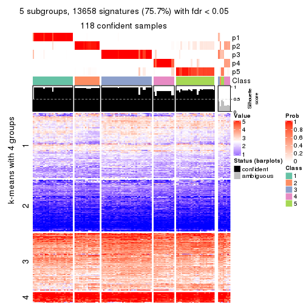</p>

</div>
<div id='tab-ATC-skmeans-get-signatures-no-scale-5'>
<pre><code class="r">get_signatures(res, k = 6, scale_rows = FALSE)
</code></pre>

<p></p>

</div>
</div>


Compare the overlap of signatures from different k:

```r
compare_signatures(res)
```


`get_signature()` returns a data frame invisibly. TO get the list of signatures, the function
call should be assigned to a variable explicitly. In following code, if `plot` argument is set
to `FALSE`, no heatmap is plotted while only the differential analysis is performed.

```r
# code only for demonstration
tb = get_signature(res, k = ..., plot = FALSE)
```

An example of the output of `tb` is:

```
#>   which_row         fdr    mean_1    mean_2 scaled_mean_1 scaled_mean_2 km
#> 1        38 0.042760348  8.373488  9.131774    -0.5533452     0.5164555  1
#> 2        40 0.018707592  7.106213  8.469186    -0.6173731     0.5762149  1
#> 3        55 0.019134737 10.221463 11.207825    -0.6159697     0.5749050  1
#> 4        59 0.006059896  5.921854  7.869574    -0.6899429     0.6439467  1
#> 5        60 0.018055526  8.928898 10.211722    -0.6204761     0.5791110  1
#> 6        98 0.009384629 15.714769 14.887706     0.6635654    -0.6193277  2
...
```

The columns in `tb` are:

1. `which_row`: row indices corresponding to the input matrix.
2. `fdr`: FDR for the differential test. 
3. `mean_x`: The mean value in group x.
4. `scaled_mean_x`: The mean value in group x after rows are scaled.
5. `km`: Row groups if k-means clustering is applied to rows.


UMAP plot which shows how samples are separated.


<script>
$( function() {
	$( '#tabs-ATC-skmeans-dimension-reduction' ).tabs();
} );
</script>
<div id='tabs-ATC-skmeans-dimension-reduction'>
<ul>
<li><a href='#tab-ATC-skmeans-dimension-reduction-1'>k = 2</a></li>
<li><a href='#tab-ATC-skmeans-dimension-reduction-2'>k = 3</a></li>
<li><a href='#tab-ATC-skmeans-dimension-reduction-3'>k = 4</a></li>
<li><a href='#tab-ATC-skmeans-dimension-reduction-4'>k = 5</a></li>
<li><a href='#tab-ATC-skmeans-dimension-reduction-5'>k = 6</a></li>
</ul>
<div id='tab-ATC-skmeans-dimension-reduction-1'>
<pre><code class="r">dimension_reduction(res, k = 2, method = &quot;UMAP&quot;)
</code></pre>

<p></p>

</div>
<div id='tab-ATC-skmeans-dimension-reduction-2'>
<pre><code class="r">dimension_reduction(res, k = 3, method = &quot;UMAP&quot;)
</code></pre>

<p></p>

</div>
<div id='tab-ATC-skmeans-dimension-reduction-3'>
<pre><code class="r">dimension_reduction(res, k = 4, method = &quot;UMAP&quot;)
</code></pre>

<p></p>

</div>
<div id='tab-ATC-skmeans-dimension-reduction-4'>
<pre><code class="r">dimension_reduction(res, k = 5, method = &quot;UMAP&quot;)
</code></pre>

<p></p>

</div>
<div id='tab-ATC-skmeans-dimension-reduction-5'>
<pre><code class="r">dimension_reduction(res, k = 6, method = &quot;UMAP&quot;)
</code></pre>

<p></p>

</div>
</div>


Following heatmap shows how subgroups are split when increasing `k`:

```r
collect_classes(res)
```


If matrix rows can be associated to genes, consider to use `GO_Enrichment(res,
...)` to perform function enrichment for the signature genes.


 

---------------------------------------------------


### ATC:pam*


The object with results only for a single top-value method and a single partition method 
can be extracted as:

```r
res = res_list["ATC", "pam"]
# you can also extract it by
# res = res_list["ATC:pam"]
```

A summary of `res` and all the functions that can be applied to it:

```r
res
```

```
#> A 'ConsensusPartition' object with k = 2, 3, 4, 5, 6.
#>   On a matrix with 18041 rows and 126 columns.
#>   Top rows (1000, 2000, 3000, 4000, 5000) are extracted by 'ATC' method.
#>   Subgroups are detected by 'pam' method.
#>   Performed in total 1250 partitions by row resampling.
#>   Best k for subgroups seems to be 6.
#> 
#> Following methods can be applied to this 'ConsensusPartition' object:
#>  [1] "cola_report"             "collect_classes"         "collect_plots"          
#>  [4] "collect_stats"           "colnames"                "compare_signatures"     
#>  [7] "consensus_heatmap"       "dimension_reduction"     "functional_enrichment"  
#> [10] "get_anno_col"            "get_anno"                "get_classes"            
#> [13] "get_consensus"           "get_matrix"              "get_membership"         
#> [16] "get_param"               "get_signatures"          "get_stats"              
#> [19] "is_best_k"               "is_stable_k"             "membership_heatmap"     
#> [22] "ncol"                    "nrow"                    "plot_ecdf"              
#> [25] "rownames"                "select_partition_number" "show"                   
#> [28] "suggest_best_k"          "test_to_known_factors"
```

`collect_plots()` function collects all the plots made from `res` for all `k` (number of partitions)
into one single page to provide an easy and fast comparison between different `k`.

```r
collect_plots(res)
```

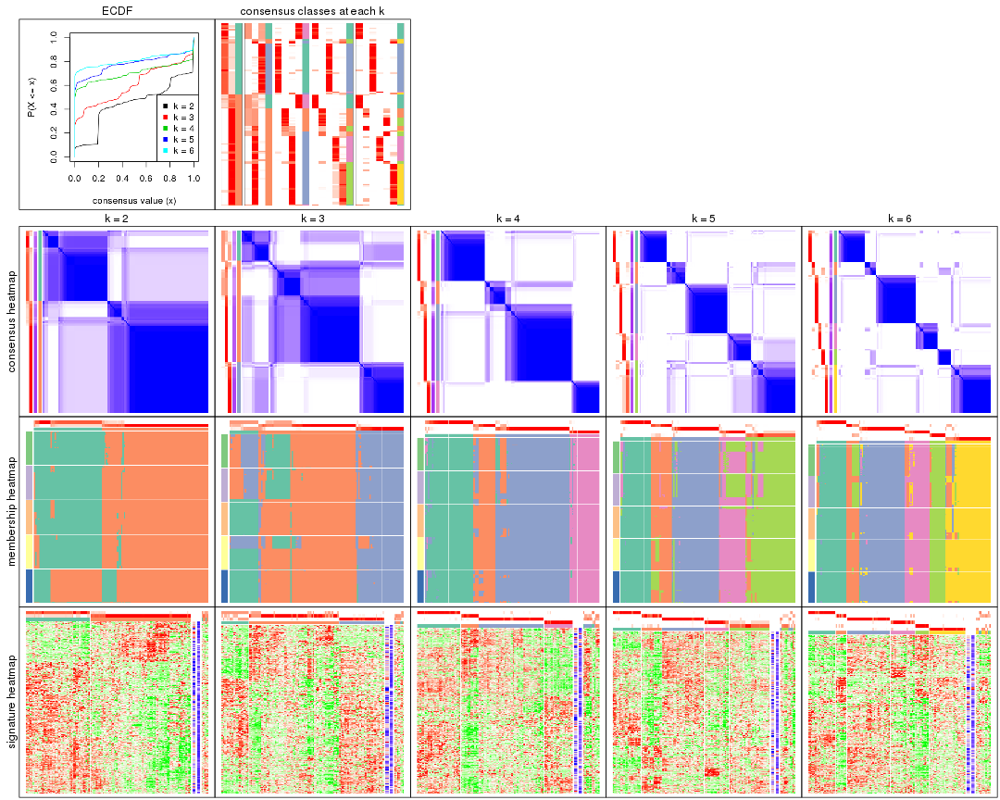

The plots are:

- The first row: a plot of the ECDF (Empirical cumulative distribution
  function) curves of the consensus matrix for each `k` and the heatmap of
  predicted classes for each `k`.
- The second row: heatmaps of the consensus matrix for each `k`.
- The third row: heatmaps of the membership matrix for each `k`.
- The fouth row: heatmaps of the signatures for each `k`.

All the plots in panels can be made by individual functions and they are
plotted later in this section.

`select_partition_number()` produces several plots showing different
statistics for choosing "optimized" `k`. There are following statistics:

- ECDF curves of the consensus matrix for each `k`;
- 1-PAC. [The PAC
  score](https://en.wikipedia.org/wiki/Consensus_clustering#Over-interpretation_potential_of_consensus_clustering)
  measures the proportion of the ambiguous subgrouping.
- Mean silhouette score.
- Concordance. The mean probability of fiting the consensus class ids in all
  partitions.
- Area increased. Denote $A_k$ as the area under the ECDF curve for current
  `k`, the area increased is defined as $A_k - A_{k-1}$.
- Rand index. The percent of pairs of samples that are both in a same cluster
  or both are not in a same cluster in the partition of k and k-1.
- Jaccard index. The ratio of pairs of samples are both in a same cluster in
  the partition of k and k-1 and the pairs of samples are both in a same
  cluster in the partition k or k-1.

The detailed explanations of these statistics can be found in [the cola
vignette](http://bioconductor.org/packages/devel/bioc/vignettes/cola/inst/doc/cola.html#toc_13).

Generally speaking, lower PAC score, higher mean silhouette score or higher
concordance corresponds to better partition. Rand index and Jaccard index
measure how similar the current partition is compared to partition with `k-1`.
If they are too similar, we won't accept `k` is better than `k-1`.

```r
select_partition_number(res)
```


The numeric values for all these statistics can be obtained by `get_stats()`.

```r
get_stats(res)
```

```
#>   k 1-PAC mean_silhouette concordance area_increased  Rand Jaccard
#> 2 2 0.463           0.859       0.899         0.4448 0.521   0.521
#> 3 3 0.669           0.710       0.823         0.3606 0.809   0.659
#> 4 4 0.850           0.850       0.943         0.1611 0.859   0.666
#> 5 5 0.818           0.813       0.900         0.1097 0.858   0.565
#> 6 6 0.911           0.831       0.924         0.0393 0.961   0.827
```

`suggest_best_k()` suggests the best $k$ based on these statistics. The rules are as follows:

- All $k$ with Jaccard index larger than 0.95 are removed because the increase of
  the partition number does not provides enough extra information. If all $k$ are removed,
  the best $k$ is assigned by `NA`.
- For $k$ with 1-PAC larger than 0.9, the maximal $k$ is taken as the "best k". Other $k$ is called "optional k".
- If it does not fit the second rule. The $k$ with the highest vote of highest
  1-PAC, mean silhouette and concordance is taken as the "best k".

```r
suggest_best_k(res)
```

```
#> [1] 6
```


Following shows the table of the partitions (You need to click the **show/hide
code output** link to see it). The membership matrix (columns with name `p*`)
is inferred by
[`clue::cl_consensus()`](https://www.rdocumentation.org/link/cl_consensus?package=clue)
function with the `SE` method. Basically the value in the membership matrix
represents the probability to belong to a certain group. The finall class
label for an item is determined with the group with highest probability it
belongs to.

In `get_classes()` function, the entropy is calculated from the membership
matrix and the silhouette score is calculated from the consensus matrix.


<script>
$( function() {
	$( '#tabs-ATC-pam-get-classes' ).tabs();
} );
</script>
<div id='tabs-ATC-pam-get-classes'>
<ul>
<li><a href='#tab-ATC-pam-get-classes-1'>k = 2</a></li>
<li><a href='#tab-ATC-pam-get-classes-2'>k = 3</a></li>
<li><a href='#tab-ATC-pam-get-classes-3'>k = 4</a></li>
<li><a href='#tab-ATC-pam-get-classes-4'>k = 5</a></li>
<li><a href='#tab-ATC-pam-get-classes-5'>k = 6</a></li>
</ul>

<div id='tab-ATC-pam-get-classes-1'>
<p><a id='tab-ATC-pam-get-classes-1-a' style='color:#0366d6' href='#'>show/hide code output</a></p>
<pre><code class="r">cbind(get_classes(res, k = 2), get_membership(res, k = 2))
</code></pre>

<pre><code>#&gt;                                      class entropy silhouette    p1    p2
#&gt; DC1F29A2-39DE-44AD-936A-54B2B32D6370     1  0.7056      0.903 0.808 0.192
#&gt; FA3C3413-FA8C-4A29-B9CA-5BC3A56274A8     2  0.0000      0.937 0.000 1.000
#&gt; B9B72975-8134-475C-BC0B-0CFDB24F636A     2  0.0000      0.937 0.000 1.000
#&gt; F44DB757-4D00-4BFC-99C5-AA82F99C5BDA     2  0.7139      0.749 0.196 0.804
#&gt; 3BD942BB-A3A7-4993-B3F1-B8641626B773     2  0.0000      0.937 0.000 1.000
#&gt; 431F73A2-2AB3-4101-B610-7FC02A7097EC     1  0.7056      0.903 0.808 0.192
#&gt; 3067683D-43D4-4F6D-9338-17F6A75E4B25     2  0.7745      0.727 0.228 0.772
#&gt; 2CE91B81-7CBE-4698-AFEE-6A154313D231     2  0.0000      0.937 0.000 1.000
#&gt; A639CF4F-4591-4337-A12E-BED71EDDA10B     1  0.7056      0.903 0.808 0.192
#&gt; 5482053D-9F48-4773-B68A-302B3A612503     1  0.7056      0.903 0.808 0.192
#&gt; A31D342D-C67C-428B-BAED-C6E844277A09     2  0.0000      0.937 0.000 1.000
#&gt; 0E9C5985-9AE0-4098-A076-6FFBBDF05110     2  0.7139      0.749 0.196 0.804
#&gt; 08CCF8A0-15B7-4A13-BC43-6B3B3E2DDE95     2  0.0000      0.937 0.000 1.000
#&gt; 10577D5B-AD56-403F-A562-73A9ACF2045B     1  0.0000      0.778 1.000 0.000
#&gt; C940D443-5DDA-4403-868B-7AA6B9A50FC4     1  0.7056      0.903 0.808 0.192
#&gt; 89D4D945-A717-495F-B253-F5A17CF5B9FA     2  0.0376      0.934 0.004 0.996
#&gt; DC55EE78-203F-4092-9B83-14B1A529194B     2  0.0000      0.937 0.000 1.000
#&gt; 8F7368BE-EB41-4192-89AA-9E0428C08851     2  0.0000      0.937 0.000 1.000
#&gt; F772EA39-E408-4908-BADD-C786D702BF9B     2  0.0000      0.937 0.000 1.000
#&gt; FD693D10-3ADA-4028-8392-41D2F0296F7E     2  0.0000      0.937 0.000 1.000
#&gt; 84F16966-7640-49F9-95D1-7648FF74DCC9     2  0.0000      0.937 0.000 1.000
#&gt; D26DAA2F-AE6A-42E1-9F1F-01943B99785F     2  0.0000      0.937 0.000 1.000
#&gt; F325847E-F046-4B67-B01C-16919C401020     1  0.7299      0.621 0.796 0.204
#&gt; 19EB2B10-2529-4A94-8FAE-1CE371A602D9     1  0.7056      0.903 0.808 0.192
#&gt; B94B9CCF-5FB8-44AE-8D9C-A194C6801A27     2  0.0000      0.937 0.000 1.000
#&gt; D2678E70-542A-4AB2-B881-12D66DBA44F5     2  0.0000      0.937 0.000 1.000
#&gt; 4961CA2A-70CD-42AB-A676-4A98C85F449F     2  0.0000      0.937 0.000 1.000
#&gt; 5AA74C5C-2AD1-4D59-A030-E964EB199581     1  0.7528      0.611 0.784 0.216
#&gt; F9E11A1B-BD93-438F-9670-6FB7DFF9E910     1  0.7056      0.903 0.808 0.192
#&gt; FB78CA5A-C8B9-42AF-9DAE-799CAB280B2E     1  0.0000      0.778 1.000 0.000
#&gt; A8E48877-F8AB-44DD-A18B-194D87C44931     2  0.0000      0.937 0.000 1.000
#&gt; CA50C495-F37E-4743-867D-FAF2DCC3376A     2  0.0000      0.937 0.000 1.000
#&gt; 37342369-EC22-4904-8CCD-A0DC6BD8D183     2  0.0000      0.937 0.000 1.000
#&gt; 91BA5F90-9174-4533-A050-39A28E34A94D     1  0.7056      0.903 0.808 0.192
#&gt; 5BC371AC-1915-44E9-A114-2963E131EC8D     2  0.0000      0.937 0.000 1.000
#&gt; 74A6C31A-7F21-45AF-A170-18C326D2AE69     1  0.7056      0.903 0.808 0.192
#&gt; 984F27EF-D4D7-4E68-BD64-776FDFC04D07     2  0.0376      0.934 0.004 0.996
#&gt; B05701C5-8C44-4FD1-94C9-FC0255A2EA24     1  0.8267      0.835 0.740 0.260
#&gt; 91E4119C-2CE6-4447-A125-6A4F403A89E6     2  0.0000      0.937 0.000 1.000
#&gt; 1570FCE7-F1B4-4BDF-A398-355EDF030864     2  0.0376      0.934 0.004 0.996
#&gt; 604C06E9-A00E-435E-847A-3992922A5C56     1  0.7056      0.903 0.808 0.192
#&gt; 455C9007-6FF4-4D63-83FA-4915F0331F9A     2  0.0376      0.934 0.004 0.996
#&gt; FB8BD3CF-D2EC-47B6-B67F-65ADC1C3A6A7     2  0.0000      0.937 0.000 1.000
#&gt; 9DC7443A-3C8F-4025-8312-3C98BF28D736     2  0.8499      0.466 0.276 0.724
#&gt; CB207A52-09AC-49D3-8240-5840CDFBB154     1  0.9286      0.713 0.656 0.344
#&gt; 2A335049-AD9F-4B32-92B7-69B04B0CF2BA     2  0.9732      0.452 0.404 0.596
#&gt; 6ACA6293-371E-428D-BBAE-ABFD410C886F     2  0.0000      0.937 0.000 1.000
#&gt; E8929929-73F9-4DB7-ABBA-0852BEFFFF7E     2  0.0000      0.937 0.000 1.000
#&gt; 5E343116-414B-41F2-AAEE-A3225450135A     1  0.7139      0.901 0.804 0.196
#&gt; 0A39073C-157C-48A1-B125-A6A04CB738DA     2  0.0000      0.937 0.000 1.000
#&gt; 300D78E6-1C7E-4114-80EA-9204A6818B9A     2  0.8081      0.707 0.248 0.752
#&gt; DAAF55AA-ED48-4221-9CD6-D1DEB6376017     2  0.0000      0.937 0.000 1.000
#&gt; D76FCF4A-4ACF-41EF-A120-64136D6C845E     2  0.8267      0.695 0.260 0.740
#&gt; AD294665-6F90-459C-90D5-3058F210225D     1  0.7674      0.876 0.776 0.224
#&gt; 92E8AD7A-1084-44C8-BDC0-FE4E47B6143F     2  0.7139      0.749 0.196 0.804
#&gt; 5644A861-3C59-486D-8FBE-4DF6A3B19558     1  0.7056      0.903 0.808 0.192
#&gt; 1BF8AAE7-B771-4CF2-8B1C-D2BEB5E6579E     1  0.9998     -0.183 0.508 0.492
#&gt; A54731AE-FC40-407F-8D10-67DDC122237D     2  0.0000      0.937 0.000 1.000
#&gt; 179DC906-5654-4CBA-9C27-C9560B5F12DE     1  0.7139      0.901 0.804 0.196
#&gt; 979B9A2B-2D81-47C3-A553-9B9441CAAE47     1  0.7056      0.903 0.808 0.192
#&gt; D69BD86A-08FB-49DA-9084-2725F6C9195F     1  0.7139      0.901 0.804 0.196
#&gt; 84611033-BCF7-49D7-9B91-DA29B62AC8D3     2  0.7056      0.752 0.192 0.808
#&gt; 8AA1DA3E-8C00-4653-AA33-EA70531C1E50     2  0.0000      0.937 0.000 1.000
#&gt; CEBE9594-0F19-46B4-AF7D-F8DF33E00AFB     2  0.0000      0.937 0.000 1.000
#&gt; C68E82D2-2BD3-41E9-92D7-D4C06E1953B2     1  0.9922      0.498 0.552 0.448
#&gt; B855EF89-1E76-4408-AA65-61A0F0A4F412     2  0.0000      0.937 0.000 1.000
#&gt; 4488EFB3-5B01-41E3-B57E-8E4F607CF448     2  0.7056      0.752 0.192 0.808
#&gt; C2BD8440-CAC6-4FE5-8EBB-5E6AE308D52F     1  0.7056      0.903 0.808 0.192
#&gt; E0E50F10-1FED-41C1-84DB-81A46F25D7E9     2  0.0000      0.937 0.000 1.000
#&gt; EE16D845-31F2-4178-800B-CA2C358841AD     2  0.0000      0.937 0.000 1.000
#&gt; 169828CF-5693-4A46-B5D7-E45CBA9DF317     2  0.0000      0.937 0.000 1.000
#&gt; 51077BA3-AEE0-4BD4-A1B1-1B0A811642A1     1  0.7056      0.903 0.808 0.192
#&gt; D2F4E240-C44C-4CF7-8016-6CACD370D093     1  0.0000      0.778 1.000 0.000
#&gt; 721CDBE6-FC85-4C30-B23E-28407340286F     1  0.7056      0.903 0.808 0.192
#&gt; 392897E4-6009-422C-B461-649F4DDF260C     1  0.7453      0.887 0.788 0.212
#&gt; 617E13D2-6924-45F8-A8DE-BE21B718F822     2  0.4431      0.838 0.092 0.908
#&gt; 5746C00F-9CBB-46B7-83FD-90B2AB3F507B     1  0.0000      0.778 1.000 0.000
#&gt; 982B4344-A223-4D1F-9485-2E56F9FD45C0     2  0.0000      0.937 0.000 1.000
#&gt; E5557F52-015D-49DC-9E23-989FC259976F     1  0.7056      0.903 0.808 0.192
#&gt; F3135F5E-2E90-4923-B634-E994563D17B7     2  0.7528      0.630 0.216 0.784
#&gt; D1ED15A5-9802-4314-B556-E89EB772D1F0     1  0.7056      0.903 0.808 0.192
#&gt; 222B06E3-FCFB-4104-92C3-D73BC31854D4     1  0.0000      0.778 1.000 0.000
#&gt; 4C810FFA-ED07-4F4C-9F81-B8F1CF4956F7     2  0.0000      0.937 0.000 1.000
#&gt; 9A608964-ED12-4E6E-9D3A-430F59FFF65B     1  0.7056      0.903 0.808 0.192
#&gt; 4087357F-C17A-4992-A8AB-41ACA2F72001     2  0.0000      0.937 0.000 1.000
#&gt; B3F013A5-BCB8-4CE0-86B2-634EE180AA6E     2  0.0000      0.937 0.000 1.000
#&gt; 322AF320-1379-4F51-AFDC-5292A060CD52     2  0.0000      0.937 0.000 1.000
#&gt; 53A96249-66D5-4C26-893B-ADC71481D261     2  0.0000      0.937 0.000 1.000
#&gt; 1AB7A6F2-14BD-447C-B2E3-DEB0CE56B209     1  0.0000      0.778 1.000 0.000
#&gt; 8B4BCDA0-6787-4A55-99F7-AAF22AF85BA6     2  0.0000      0.937 0.000 1.000
#&gt; 5D9D9E08-2C2C-414E-9547-62799F90D543     2  0.0000      0.937 0.000 1.000
#&gt; C345CD17-E4F4-41D5-9891-FEFB19342C52     1  0.0000      0.778 1.000 0.000
#&gt; 1AF8FDE1-1A74-41F6-A1C5-4952CDFB7D3F     1  0.7219      0.627 0.800 0.200
#&gt; BC3405FF-0660-4B2B-8DC1-5F34D3133078     1  0.7139      0.901 0.804 0.196
#&gt; C2662596-6E2F-4924-B051-CEA1AC87B197     1  0.7056      0.903 0.808 0.192
#&gt; 39AE85F7-49FB-4438-BD41-6AC812FA1C72     1  0.7056      0.903 0.808 0.192
#&gt; 6FF266DB-3F08-43F2-8F6F-679F805B80B8     2  0.6887      0.685 0.184 0.816
#&gt; B03B7B81-BBD6-4194-BC5E-6EDF0D3F015A     2  0.0000      0.937 0.000 1.000
#&gt; C7617D56-F13C-4C43-906C-BD458C5DC4CD     2  0.7528      0.620 0.216 0.784
#&gt; 09420F8B-7A71-4B32-8388-4767670F1FEB     1  0.7139      0.901 0.804 0.196
#&gt; 6AF47534-74FF-4128-865B-4E8EE1FFB469     2  0.0000      0.937 0.000 1.000
#&gt; 8FF9E94A-2ED2-4727-947F-D524D7ECE815     2  0.0000      0.937 0.000 1.000
#&gt; A390E20D-03F9-40E4-A132-0FA5C2BEDB63     1  0.7056      0.903 0.808 0.192
#&gt; A489CCCA-1374-4071-80CE-05B83C9A0D5E     2  0.0000      0.937 0.000 1.000
#&gt; 2D962371-EC83-490C-A663-478AF383BC1B     2  0.0000      0.937 0.000 1.000
#&gt; D91B31A1-EE71-4726-B94C-0CC2815E9D4E     2  0.7299      0.744 0.204 0.796
#&gt; E0123C5C-E1D1-4162-9895-CC8B01949D84     2  0.0000      0.937 0.000 1.000
#&gt; EC73959A-2728-49FE-B72A-790BB14F4CBF     1  0.7056      0.903 0.808 0.192
#&gt; A60DC925-7343-496E-900D-0DD81D5C8123     2  0.0000      0.937 0.000 1.000
#&gt; 659B64DB-F4A5-43BD-811B-05004CB49D99     1  0.7056      0.903 0.808 0.192
#&gt; 6969B6B2-7616-4664-9696-C4DACD10537B     2  0.0000      0.937 0.000 1.000
#&gt; 2F6392DE-0D54-4768-B062-907C81E5B0CC     2  0.0000      0.937 0.000 1.000
#&gt; C74BE8C5-BA6D-4596-9D67-3C731799F999     2  0.6048      0.755 0.148 0.852
#&gt; 79A7647F-BDBA-45A2-B207-ABF788F6CC95     1  0.7056      0.903 0.808 0.192
#&gt; D47D0433-2313-4A2F-B268-5AD293D7534E     2  0.0000      0.937 0.000 1.000
#&gt; C5058B93-C1DA-43B9-9951-B23A9810AA6E     2  0.9710      0.462 0.400 0.600
#&gt; 2629FEE3-A203-4411-8A70-02A796C9505C     2  0.0000      0.937 0.000 1.000
#&gt; 1AF329E4-11D4-4CFC-801F-C24A1EA33102     2  0.0000      0.937 0.000 1.000
#&gt; D453BEF8-3F18-4B89-BA42-CE74EB105032     1  0.0000      0.778 1.000 0.000
#&gt; B12A4446-2310-4139-897F-CA030478CBD5     1  0.9129      0.740 0.672 0.328
#&gt; BCAB1918-5FA9-4CBD-85CB-008743FEA2CC     1  0.7056      0.903 0.808 0.192
#&gt; 9A5432D3-19EE-47B4-BD88-698DEC75A5E9     2  0.0000      0.937 0.000 1.000
#&gt; A608BCEB-2C27-4927-A308-E6975F641722     2  0.0000      0.937 0.000 1.000
#&gt; E4752275-7BF6-4C1E-8A45-C7D571ED85AD     2  0.0000      0.937 0.000 1.000
#&gt; FDEC1714-C02D-4AB7-AE82-789E9D709EDE     1  0.7139      0.901 0.804 0.196
#&gt; 33737781-8638-4FA2-AD4C-E888BB9343D8     2  0.0000      0.937 0.000 1.000
</code></pre>

<script>
$('#tab-ATC-pam-get-classes-1-a').parent().next().next().hide();
$('#tab-ATC-pam-get-classes-1-a').click(function(){
  $('#tab-ATC-pam-get-classes-1-a').parent().next().next().toggle();
  return(false);
});
</script>
</div>

<div id='tab-ATC-pam-get-classes-2'>
<p><a id='tab-ATC-pam-get-classes-2-a' style='color:#0366d6' href='#'>show/hide code output</a></p>
<pre><code class="r">cbind(get_classes(res, k = 3), get_membership(res, k = 3))
</code></pre>

<pre><code>#&gt;                                      class entropy silhouette    p1    p2    p3
#&gt; DC1F29A2-39DE-44AD-936A-54B2B32D6370     3  0.0237     0.8944 0.000 0.004 0.996
#&gt; FA3C3413-FA8C-4A29-B9CA-5BC3A56274A8     2  0.0000     0.8140 0.000 1.000 0.000
#&gt; B9B72975-8134-475C-BC0B-0CFDB24F636A     2  0.2796     0.7743 0.092 0.908 0.000
#&gt; F44DB757-4D00-4BFC-99C5-AA82F99C5BDA     1  0.8227     0.5648 0.536 0.384 0.080
#&gt; 3BD942BB-A3A7-4993-B3F1-B8641626B773     2  0.0000     0.8140 0.000 1.000 0.000
#&gt; 431F73A2-2AB3-4101-B610-7FC02A7097EC     3  0.0424     0.8898 0.000 0.008 0.992
#&gt; 3067683D-43D4-4F6D-9338-17F6A75E4B25     1  0.8227     0.5648 0.536 0.384 0.080
#&gt; 2CE91B81-7CBE-4698-AFEE-6A154313D231     2  0.0000     0.8140 0.000 1.000 0.000
#&gt; A639CF4F-4591-4337-A12E-BED71EDDA10B     3  0.0000     0.8968 0.000 0.000 1.000
#&gt; 5482053D-9F48-4773-B68A-302B3A612503     3  0.0000     0.8968 0.000 0.000 1.000
#&gt; A31D342D-C67C-428B-BAED-C6E844277A09     2  0.5988     0.6510 0.304 0.688 0.008
#&gt; 0E9C5985-9AE0-4098-A076-6FFBBDF05110     1  0.8227     0.5648 0.536 0.384 0.080
#&gt; 08CCF8A0-15B7-4A13-BC43-6B3B3E2DDE95     2  0.0000     0.8140 0.000 1.000 0.000
#&gt; 10577D5B-AD56-403F-A562-73A9ACF2045B     1  0.6286     0.5767 0.536 0.000 0.464
#&gt; C940D443-5DDA-4403-868B-7AA6B9A50FC4     3  0.0000     0.8968 0.000 0.000 1.000
#&gt; 89D4D945-A717-495F-B253-F5A17CF5B9FA     2  0.2066     0.7694 0.000 0.940 0.060
#&gt; DC55EE78-203F-4092-9B83-14B1A529194B     2  0.6286     0.5570 0.464 0.536 0.000
#&gt; 8F7368BE-EB41-4192-89AA-9E0428C08851     2  0.0000     0.8140 0.000 1.000 0.000
#&gt; F772EA39-E408-4908-BADD-C786D702BF9B     2  0.0000     0.8140 0.000 1.000 0.000
#&gt; FD693D10-3ADA-4028-8392-41D2F0296F7E     2  0.0000     0.8140 0.000 1.000 0.000
#&gt; 84F16966-7640-49F9-95D1-7648FF74DCC9     2  0.6286     0.5570 0.464 0.536 0.000
#&gt; D26DAA2F-AE6A-42E1-9F1F-01943B99785F     2  0.6026     0.6082 0.376 0.624 0.000
#&gt; F325847E-F046-4B67-B01C-16919C401020     1  0.6286     0.5767 0.536 0.000 0.464
#&gt; 19EB2B10-2529-4A94-8FAE-1CE371A602D9     3  0.0000     0.8968 0.000 0.000 1.000
#&gt; B94B9CCF-5FB8-44AE-8D9C-A194C6801A27     2  0.6286     0.5570 0.464 0.536 0.000
#&gt; D2678E70-542A-4AB2-B881-12D66DBA44F5     2  0.0000     0.8140 0.000 1.000 0.000
#&gt; 4961CA2A-70CD-42AB-A676-4A98C85F449F     2  0.0000     0.8140 0.000 1.000 0.000
#&gt; 5AA74C5C-2AD1-4D59-A030-E964EB199581     1  0.6495     0.5795 0.536 0.004 0.460
#&gt; F9E11A1B-BD93-438F-9670-6FB7DFF9E910     3  0.0000     0.8968 0.000 0.000 1.000
#&gt; FB78CA5A-C8B9-42AF-9DAE-799CAB280B2E     1  0.6286     0.5767 0.536 0.000 0.464
#&gt; A8E48877-F8AB-44DD-A18B-194D87C44931     2  0.0000     0.8140 0.000 1.000 0.000
#&gt; CA50C495-F37E-4743-867D-FAF2DCC3376A     2  0.0000     0.8140 0.000 1.000 0.000
#&gt; 37342369-EC22-4904-8CCD-A0DC6BD8D183     2  0.6026     0.6082 0.376 0.624 0.000
#&gt; 91BA5F90-9174-4533-A050-39A28E34A94D     3  0.0000     0.8968 0.000 0.000 1.000
#&gt; 5BC371AC-1915-44E9-A114-2963E131EC8D     2  0.6008     0.6105 0.372 0.628 0.000
#&gt; 74A6C31A-7F21-45AF-A170-18C326D2AE69     3  0.0000     0.8968 0.000 0.000 1.000
#&gt; 984F27EF-D4D7-4E68-BD64-776FDFC04D07     2  0.2537     0.7499 0.000 0.920 0.080
#&gt; B05701C5-8C44-4FD1-94C9-FC0255A2EA24     3  0.4931     0.5581 0.000 0.232 0.768
#&gt; 91E4119C-2CE6-4447-A125-6A4F403A89E6     2  0.0000     0.8140 0.000 1.000 0.000
#&gt; 1570FCE7-F1B4-4BDF-A398-355EDF030864     2  0.2448     0.7537 0.000 0.924 0.076
#&gt; 604C06E9-A00E-435E-847A-3992922A5C56     3  0.2165     0.8171 0.000 0.064 0.936
#&gt; 455C9007-6FF4-4D63-83FA-4915F0331F9A     2  0.2165     0.7675 0.000 0.936 0.064
#&gt; FB8BD3CF-D2EC-47B6-B67F-65ADC1C3A6A7     2  0.0000     0.8140 0.000 1.000 0.000
#&gt; 9DC7443A-3C8F-4025-8312-3C98BF28D736     2  0.0000     0.8140 0.000 1.000 0.000
#&gt; CB207A52-09AC-49D3-8240-5840CDFBB154     2  0.5327     0.5207 0.000 0.728 0.272
#&gt; 2A335049-AD9F-4B32-92B7-69B04B0CF2BA     1  0.9137     0.6317 0.536 0.188 0.276
#&gt; 6ACA6293-371E-428D-BBAE-ABFD410C886F     2  0.0000     0.8140 0.000 1.000 0.000
#&gt; E8929929-73F9-4DB7-ABBA-0852BEFFFF7E     2  0.0237     0.8132 0.004 0.996 0.000
#&gt; 5E343116-414B-41F2-AAEE-A3225450135A     3  0.2537     0.8234 0.000 0.080 0.920
#&gt; 0A39073C-157C-48A1-B125-A6A04CB738DA     2  0.0000     0.8140 0.000 1.000 0.000
#&gt; 300D78E6-1C7E-4114-80EA-9204A6818B9A     1  0.8808     0.6195 0.536 0.332 0.132
#&gt; DAAF55AA-ED48-4221-9CD6-D1DEB6376017     2  0.0237     0.8132 0.004 0.996 0.000
#&gt; D76FCF4A-4ACF-41EF-A120-64136D6C845E     1  0.8389     0.5813 0.536 0.372 0.092
#&gt; AD294665-6F90-459C-90D5-3058F210225D     3  0.6302    -0.0301 0.000 0.480 0.520
#&gt; 92E8AD7A-1084-44C8-BDC0-FE4E47B6143F     1  0.8227     0.5648 0.536 0.384 0.080
#&gt; 5644A861-3C59-486D-8FBE-4DF6A3B19558     3  0.0000     0.8968 0.000 0.000 1.000
#&gt; 1BF8AAE7-B771-4CF2-8B1C-D2BEB5E6579E     1  0.7145     0.5884 0.536 0.024 0.440
#&gt; A54731AE-FC40-407F-8D10-67DDC122237D     2  0.4399     0.7298 0.188 0.812 0.000
#&gt; 179DC906-5654-4CBA-9C27-C9560B5F12DE     3  0.2537     0.8234 0.000 0.080 0.920
#&gt; 979B9A2B-2D81-47C3-A553-9B9441CAAE47     3  0.0000     0.8968 0.000 0.000 1.000
#&gt; D69BD86A-08FB-49DA-9084-2725F6C9195F     3  0.2537     0.8234 0.000 0.080 0.920
#&gt; 84611033-BCF7-49D7-9B91-DA29B62AC8D3     2  0.6500    -0.2614 0.464 0.532 0.004
#&gt; 8AA1DA3E-8C00-4653-AA33-EA70531C1E50     2  0.6286     0.5570 0.464 0.536 0.000
#&gt; CEBE9594-0F19-46B4-AF7D-F8DF33E00AFB     2  0.0237     0.8116 0.000 0.996 0.004
#&gt; C68E82D2-2BD3-41E9-92D7-D4C06E1953B2     2  0.0000     0.8140 0.000 1.000 0.000
#&gt; B855EF89-1E76-4408-AA65-61A0F0A4F412     2  0.6286     0.5570 0.464 0.536 0.000
#&gt; 4488EFB3-5B01-41E3-B57E-8E4F607CF448     1  0.7036     0.4467 0.536 0.444 0.020
#&gt; C2BD8440-CAC6-4FE5-8EBB-5E6AE308D52F     3  0.0000     0.8968 0.000 0.000 1.000
#&gt; E0E50F10-1FED-41C1-84DB-81A46F25D7E9     2  0.0000     0.8140 0.000 1.000 0.000
#&gt; EE16D845-31F2-4178-800B-CA2C358841AD     2  0.0000     0.8140 0.000 1.000 0.000
#&gt; 169828CF-5693-4A46-B5D7-E45CBA9DF317     2  0.6286     0.5570 0.464 0.536 0.000
#&gt; 51077BA3-AEE0-4BD4-A1B1-1B0A811642A1     3  0.0000     0.8968 0.000 0.000 1.000
#&gt; D2F4E240-C44C-4CF7-8016-6CACD370D093     3  0.3816     0.6612 0.148 0.000 0.852
#&gt; 721CDBE6-FC85-4C30-B23E-28407340286F     3  0.1529     0.8670 0.000 0.040 0.960
#&gt; 392897E4-6009-422C-B461-649F4DDF260C     3  0.6008     0.2689 0.000 0.372 0.628
#&gt; 617E13D2-6924-45F8-A8DE-BE21B718F822     2  0.6274     0.0367 0.000 0.544 0.456
#&gt; 5746C00F-9CBB-46B7-83FD-90B2AB3F507B     1  0.6286     0.5767 0.536 0.000 0.464
#&gt; 982B4344-A223-4D1F-9485-2E56F9FD45C0     2  0.6286     0.5570 0.464 0.536 0.000
#&gt; E5557F52-015D-49DC-9E23-989FC259976F     3  0.0000     0.8968 0.000 0.000 1.000
#&gt; F3135F5E-2E90-4923-B634-E994563D17B7     2  0.4346     0.6472 0.000 0.816 0.184
#&gt; D1ED15A5-9802-4314-B556-E89EB772D1F0     3  0.0000     0.8968 0.000 0.000 1.000
#&gt; 222B06E3-FCFB-4104-92C3-D73BC31854D4     1  0.6295     0.5616 0.528 0.000 0.472
#&gt; 4C810FFA-ED07-4F4C-9F81-B8F1CF4956F7     2  0.0000     0.8140 0.000 1.000 0.000
#&gt; 9A608964-ED12-4E6E-9D3A-430F59FFF65B     3  0.0000     0.8968 0.000 0.000 1.000
#&gt; 4087357F-C17A-4992-A8AB-41ACA2F72001     2  0.0000     0.8140 0.000 1.000 0.000
#&gt; B3F013A5-BCB8-4CE0-86B2-634EE180AA6E     2  0.6286     0.5570 0.464 0.536 0.000
#&gt; 322AF320-1379-4F51-AFDC-5292A060CD52     2  0.0000     0.8140 0.000 1.000 0.000
#&gt; 53A96249-66D5-4C26-893B-ADC71481D261     2  0.0237     0.8132 0.004 0.996 0.000
#&gt; 1AB7A6F2-14BD-447C-B2E3-DEB0CE56B209     1  0.6286     0.5767 0.536 0.000 0.464
#&gt; 8B4BCDA0-6787-4A55-99F7-AAF22AF85BA6     2  0.6286     0.5570 0.464 0.536 0.000
#&gt; 5D9D9E08-2C2C-414E-9547-62799F90D543     2  0.1643     0.7985 0.044 0.956 0.000
#&gt; C345CD17-E4F4-41D5-9891-FEFB19342C52     1  0.6286     0.5767 0.536 0.000 0.464
#&gt; 1AF8FDE1-1A74-41F6-A1C5-4952CDFB7D3F     1  0.6286     0.5767 0.536 0.000 0.464
#&gt; BC3405FF-0660-4B2B-8DC1-5F34D3133078     3  0.2959     0.7980 0.000 0.100 0.900
#&gt; C2662596-6E2F-4924-B051-CEA1AC87B197     3  0.0000     0.8968 0.000 0.000 1.000
#&gt; 39AE85F7-49FB-4438-BD41-6AC812FA1C72     3  0.0000     0.8968 0.000 0.000 1.000
#&gt; 6FF266DB-3F08-43F2-8F6F-679F805B80B8     2  0.0000     0.8140 0.000 1.000 0.000
#&gt; B03B7B81-BBD6-4194-BC5E-6EDF0D3F015A     2  0.6008     0.6105 0.372 0.628 0.000
#&gt; C7617D56-F13C-4C43-906C-BD458C5DC4CD     2  0.0000     0.8140 0.000 1.000 0.000
#&gt; 09420F8B-7A71-4B32-8388-4767670F1FEB     3  0.2537     0.8234 0.000 0.080 0.920
#&gt; 6AF47534-74FF-4128-865B-4E8EE1FFB469     2  0.2796     0.7743 0.092 0.908 0.000
#&gt; 8FF9E94A-2ED2-4727-947F-D524D7ECE815     2  0.0000     0.8140 0.000 1.000 0.000
#&gt; A390E20D-03F9-40E4-A132-0FA5C2BEDB63     3  0.0592     0.8890 0.000 0.012 0.988
#&gt; A489CCCA-1374-4071-80CE-05B83C9A0D5E     2  0.0000     0.8140 0.000 1.000 0.000
#&gt; 2D962371-EC83-490C-A663-478AF383BC1B     2  0.6286     0.5570 0.464 0.536 0.000
#&gt; D91B31A1-EE71-4726-B94C-0CC2815E9D4E     1  0.8389     0.5813 0.536 0.372 0.092
#&gt; E0123C5C-E1D1-4162-9895-CC8B01949D84     2  0.0000     0.8140 0.000 1.000 0.000
#&gt; EC73959A-2728-49FE-B72A-790BB14F4CBF     3  0.0000     0.8968 0.000 0.000 1.000
#&gt; A60DC925-7343-496E-900D-0DD81D5C8123     2  0.0237     0.8118 0.000 0.996 0.004
#&gt; 659B64DB-F4A5-43BD-811B-05004CB49D99     3  0.0000     0.8968 0.000 0.000 1.000
#&gt; 6969B6B2-7616-4664-9696-C4DACD10537B     2  0.6286     0.5570 0.464 0.536 0.000
#&gt; 2F6392DE-0D54-4768-B062-907C81E5B0CC     2  0.0000     0.8140 0.000 1.000 0.000
#&gt; C74BE8C5-BA6D-4596-9D67-3C731799F999     2  0.6291    -0.0135 0.000 0.532 0.468
#&gt; 79A7647F-BDBA-45A2-B207-ABF788F6CC95     3  0.0000     0.8968 0.000 0.000 1.000
#&gt; D47D0433-2313-4A2F-B268-5AD293D7534E     2  0.5760     0.6482 0.328 0.672 0.000
#&gt; C5058B93-C1DA-43B9-9951-B23A9810AA6E     1  0.9122     0.6311 0.536 0.184 0.280
#&gt; 2629FEE3-A203-4411-8A70-02A796C9505C     2  0.0237     0.8132 0.004 0.996 0.000
#&gt; 1AF329E4-11D4-4CFC-801F-C24A1EA33102     2  0.0000     0.8140 0.000 1.000 0.000
#&gt; D453BEF8-3F18-4B89-BA42-CE74EB105032     1  0.6286     0.5767 0.536 0.000 0.464
#&gt; B12A4446-2310-4139-897F-CA030478CBD5     2  0.6140     0.2757 0.000 0.596 0.404
#&gt; BCAB1918-5FA9-4CBD-85CB-008743FEA2CC     3  0.0000     0.8968 0.000 0.000 1.000
#&gt; 9A5432D3-19EE-47B4-BD88-698DEC75A5E9     2  0.6286     0.5570 0.464 0.536 0.000
#&gt; A608BCEB-2C27-4927-A308-E6975F641722     2  0.0000     0.8140 0.000 1.000 0.000
#&gt; E4752275-7BF6-4C1E-8A45-C7D571ED85AD     2  0.0000     0.8140 0.000 1.000 0.000
#&gt; FDEC1714-C02D-4AB7-AE82-789E9D709EDE     3  0.2537     0.8234 0.000 0.080 0.920
#&gt; 33737781-8638-4FA2-AD4C-E888BB9343D8     2  0.0000     0.8140 0.000 1.000 0.000
</code></pre>

<script>
$('#tab-ATC-pam-get-classes-2-a').parent().next().next().hide();
$('#tab-ATC-pam-get-classes-2-a').click(function(){
  $('#tab-ATC-pam-get-classes-2-a').parent().next().next().toggle();
  return(false);
});
</script>
</div>

<div id='tab-ATC-pam-get-classes-3'>
<p><a id='tab-ATC-pam-get-classes-3-a' style='color:#0366d6' href='#'>show/hide code output</a></p>
<pre><code class="r">cbind(get_classes(res, k = 4), get_membership(res, k = 4))
</code></pre>

<pre><code>#&gt;                                      class entropy silhouette    p1    p2    p3    p4
#&gt; DC1F29A2-39DE-44AD-936A-54B2B32D6370     1  0.0336      0.936 0.992 0.000 0.008 0.000
#&gt; FA3C3413-FA8C-4A29-B9CA-5BC3A56274A8     3  0.0000      0.932 0.000 0.000 1.000 0.000
#&gt; B9B72975-8134-475C-BC0B-0CFDB24F636A     2  0.4961      0.332 0.000 0.552 0.448 0.000
#&gt; F44DB757-4D00-4BFC-99C5-AA82F99C5BDA     4  0.0188      0.945 0.000 0.000 0.004 0.996
#&gt; 3BD942BB-A3A7-4993-B3F1-B8641626B773     3  0.0000      0.932 0.000 0.000 1.000 0.000
#&gt; 431F73A2-2AB3-4101-B610-7FC02A7097EC     1  0.6315      0.256 0.540 0.000 0.396 0.064
#&gt; 3067683D-43D4-4F6D-9338-17F6A75E4B25     4  0.0000      0.949 0.000 0.000 0.000 1.000
#&gt; 2CE91B81-7CBE-4698-AFEE-6A154313D231     3  0.0000      0.932 0.000 0.000 1.000 0.000
#&gt; A639CF4F-4591-4337-A12E-BED71EDDA10B     1  0.0000      0.941 1.000 0.000 0.000 0.000
#&gt; 5482053D-9F48-4773-B68A-302B3A612503     1  0.0000      0.941 1.000 0.000 0.000 0.000
#&gt; A31D342D-C67C-428B-BAED-C6E844277A09     3  0.4543      0.479 0.000 0.324 0.676 0.000
#&gt; 0E9C5985-9AE0-4098-A076-6FFBBDF05110     4  0.0000      0.949 0.000 0.000 0.000 1.000
#&gt; 08CCF8A0-15B7-4A13-BC43-6B3B3E2DDE95     3  0.0000      0.932 0.000 0.000 1.000 0.000
#&gt; 10577D5B-AD56-403F-A562-73A9ACF2045B     4  0.0000      0.949 0.000 0.000 0.000 1.000
#&gt; C940D443-5DDA-4403-868B-7AA6B9A50FC4     1  0.0000      0.941 1.000 0.000 0.000 0.000
#&gt; 89D4D945-A717-495F-B253-F5A17CF5B9FA     3  0.0000      0.932 0.000 0.000 1.000 0.000
#&gt; DC55EE78-203F-4092-9B83-14B1A529194B     2  0.0188      0.825 0.000 0.996 0.004 0.000
#&gt; 8F7368BE-EB41-4192-89AA-9E0428C08851     3  0.0188      0.929 0.000 0.004 0.996 0.000
#&gt; F772EA39-E408-4908-BADD-C786D702BF9B     3  0.0000      0.932 0.000 0.000 1.000 0.000
#&gt; FD693D10-3ADA-4028-8392-41D2F0296F7E     3  0.0000      0.932 0.000 0.000 1.000 0.000
#&gt; 84F16966-7640-49F9-95D1-7648FF74DCC9     2  0.0000      0.823 0.000 1.000 0.000 0.000
#&gt; D26DAA2F-AE6A-42E1-9F1F-01943B99785F     3  0.4967      0.164 0.000 0.452 0.548 0.000
#&gt; F325847E-F046-4B67-B01C-16919C401020     4  0.0000      0.949 0.000 0.000 0.000 1.000
#&gt; 19EB2B10-2529-4A94-8FAE-1CE371A602D9     1  0.0000      0.941 1.000 0.000 0.000 0.000
#&gt; B94B9CCF-5FB8-44AE-8D9C-A194C6801A27     2  0.2216      0.796 0.000 0.908 0.092 0.000
#&gt; D2678E70-542A-4AB2-B881-12D66DBA44F5     3  0.0000      0.932 0.000 0.000 1.000 0.000
#&gt; 4961CA2A-70CD-42AB-A676-4A98C85F449F     3  0.0000      0.932 0.000 0.000 1.000 0.000
#&gt; 5AA74C5C-2AD1-4D59-A030-E964EB199581     4  0.0000      0.949 0.000 0.000 0.000 1.000
#&gt; F9E11A1B-BD93-438F-9670-6FB7DFF9E910     1  0.0707      0.926 0.980 0.000 0.020 0.000
#&gt; FB78CA5A-C8B9-42AF-9DAE-799CAB280B2E     4  0.3764      0.694 0.216 0.000 0.000 0.784
#&gt; A8E48877-F8AB-44DD-A18B-194D87C44931     3  0.0000      0.932 0.000 0.000 1.000 0.000
#&gt; CA50C495-F37E-4743-867D-FAF2DCC3376A     3  0.0000      0.932 0.000 0.000 1.000 0.000
#&gt; 37342369-EC22-4904-8CCD-A0DC6BD8D183     3  0.4967      0.164 0.000 0.452 0.548 0.000
#&gt; 91BA5F90-9174-4533-A050-39A28E34A94D     1  0.0000      0.941 1.000 0.000 0.000 0.000
#&gt; 5BC371AC-1915-44E9-A114-2963E131EC8D     3  0.4830      0.325 0.000 0.392 0.608 0.000
#&gt; 74A6C31A-7F21-45AF-A170-18C326D2AE69     1  0.0000      0.941 1.000 0.000 0.000 0.000
#&gt; 984F27EF-D4D7-4E68-BD64-776FDFC04D07     3  0.0000      0.932 0.000 0.000 1.000 0.000
#&gt; B05701C5-8C44-4FD1-94C9-FC0255A2EA24     1  0.2469      0.827 0.892 0.000 0.108 0.000
#&gt; 91E4119C-2CE6-4447-A125-6A4F403A89E6     3  0.0000      0.932 0.000 0.000 1.000 0.000
#&gt; 1570FCE7-F1B4-4BDF-A398-355EDF030864     3  0.0000      0.932 0.000 0.000 1.000 0.000
#&gt; 604C06E9-A00E-435E-847A-3992922A5C56     1  0.2408      0.836 0.896 0.000 0.104 0.000
#&gt; 455C9007-6FF4-4D63-83FA-4915F0331F9A     3  0.0188      0.929 0.004 0.000 0.996 0.000
#&gt; FB8BD3CF-D2EC-47B6-B67F-65ADC1C3A6A7     3  0.0000      0.932 0.000 0.000 1.000 0.000
#&gt; 9DC7443A-3C8F-4025-8312-3C98BF28D736     3  0.0000      0.932 0.000 0.000 1.000 0.000
#&gt; CB207A52-09AC-49D3-8240-5840CDFBB154     3  0.3569      0.698 0.196 0.000 0.804 0.000
#&gt; 2A335049-AD9F-4B32-92B7-69B04B0CF2BA     4  0.0000      0.949 0.000 0.000 0.000 1.000
#&gt; 6ACA6293-371E-428D-BBAE-ABFD410C886F     3  0.0000      0.932 0.000 0.000 1.000 0.000
#&gt; E8929929-73F9-4DB7-ABBA-0852BEFFFF7E     3  0.0188      0.929 0.000 0.004 0.996 0.000
#&gt; 5E343116-414B-41F2-AAEE-A3225450135A     1  0.0000      0.941 1.000 0.000 0.000 0.000
#&gt; 0A39073C-157C-48A1-B125-A6A04CB738DA     3  0.0000      0.932 0.000 0.000 1.000 0.000
#&gt; 300D78E6-1C7E-4114-80EA-9204A6818B9A     4  0.0000      0.949 0.000 0.000 0.000 1.000
#&gt; DAAF55AA-ED48-4221-9CD6-D1DEB6376017     3  0.0188      0.929 0.000 0.004 0.996 0.000
#&gt; D76FCF4A-4ACF-41EF-A120-64136D6C845E     4  0.0000      0.949 0.000 0.000 0.000 1.000
#&gt; AD294665-6F90-459C-90D5-3058F210225D     3  0.4222      0.581 0.272 0.000 0.728 0.000
#&gt; 92E8AD7A-1084-44C8-BDC0-FE4E47B6143F     4  0.0336      0.941 0.000 0.000 0.008 0.992
#&gt; 5644A861-3C59-486D-8FBE-4DF6A3B19558     1  0.0000      0.941 1.000 0.000 0.000 0.000
#&gt; 1BF8AAE7-B771-4CF2-8B1C-D2BEB5E6579E     4  0.0000      0.949 0.000 0.000 0.000 1.000
#&gt; A54731AE-FC40-407F-8D10-67DDC122237D     2  0.4866      0.430 0.000 0.596 0.404 0.000
#&gt; 179DC906-5654-4CBA-9C27-C9560B5F12DE     1  0.0000      0.941 1.000 0.000 0.000 0.000
#&gt; 979B9A2B-2D81-47C3-A553-9B9441CAAE47     1  0.0000      0.941 1.000 0.000 0.000 0.000
#&gt; D69BD86A-08FB-49DA-9084-2725F6C9195F     1  0.0000      0.941 1.000 0.000 0.000 0.000
#&gt; 84611033-BCF7-49D7-9B91-DA29B62AC8D3     4  0.4941      0.237 0.000 0.000 0.436 0.564
#&gt; 8AA1DA3E-8C00-4653-AA33-EA70531C1E50     2  0.0000      0.823 0.000 1.000 0.000 0.000
#&gt; CEBE9594-0F19-46B4-AF7D-F8DF33E00AFB     3  0.0000      0.932 0.000 0.000 1.000 0.000
#&gt; C68E82D2-2BD3-41E9-92D7-D4C06E1953B2     3  0.0000      0.932 0.000 0.000 1.000 0.000
#&gt; B855EF89-1E76-4408-AA65-61A0F0A4F412     2  0.0000      0.823 0.000 1.000 0.000 0.000
#&gt; 4488EFB3-5B01-41E3-B57E-8E4F607CF448     4  0.0000      0.949 0.000 0.000 0.000 1.000
#&gt; C2BD8440-CAC6-4FE5-8EBB-5E6AE308D52F     1  0.0000      0.941 1.000 0.000 0.000 0.000
#&gt; E0E50F10-1FED-41C1-84DB-81A46F25D7E9     3  0.0000      0.932 0.000 0.000 1.000 0.000
#&gt; EE16D845-31F2-4178-800B-CA2C358841AD     3  0.0000      0.932 0.000 0.000 1.000 0.000
#&gt; 169828CF-5693-4A46-B5D7-E45CBA9DF317     2  0.2216      0.796 0.000 0.908 0.092 0.000
#&gt; 51077BA3-AEE0-4BD4-A1B1-1B0A811642A1     1  0.0000      0.941 1.000 0.000 0.000 0.000
#&gt; D2F4E240-C44C-4CF7-8016-6CACD370D093     1  0.4697      0.448 0.644 0.000 0.000 0.356
#&gt; 721CDBE6-FC85-4C30-B23E-28407340286F     1  0.0707      0.926 0.980 0.000 0.020 0.000
#&gt; 392897E4-6009-422C-B461-649F4DDF260C     1  0.4697      0.445 0.644 0.000 0.356 0.000
#&gt; 617E13D2-6924-45F8-A8DE-BE21B718F822     3  0.1792      0.863 0.068 0.000 0.932 0.000
#&gt; 5746C00F-9CBB-46B7-83FD-90B2AB3F507B     4  0.0000      0.949 0.000 0.000 0.000 1.000
#&gt; 982B4344-A223-4D1F-9485-2E56F9FD45C0     2  0.0336      0.824 0.000 0.992 0.008 0.000
#&gt; E5557F52-015D-49DC-9E23-989FC259976F     1  0.0000      0.941 1.000 0.000 0.000 0.000
#&gt; F3135F5E-2E90-4923-B634-E994563D17B7     3  0.3311      0.730 0.172 0.000 0.828 0.000
#&gt; D1ED15A5-9802-4314-B556-E89EB772D1F0     1  0.0000      0.941 1.000 0.000 0.000 0.000
#&gt; 222B06E3-FCFB-4104-92C3-D73BC31854D4     4  0.2408      0.842 0.104 0.000 0.000 0.896
#&gt; 4C810FFA-ED07-4F4C-9F81-B8F1CF4956F7     3  0.0000      0.932 0.000 0.000 1.000 0.000
#&gt; 9A608964-ED12-4E6E-9D3A-430F59FFF65B     1  0.0000      0.941 1.000 0.000 0.000 0.000
#&gt; 4087357F-C17A-4992-A8AB-41ACA2F72001     3  0.0000      0.932 0.000 0.000 1.000 0.000
#&gt; B3F013A5-BCB8-4CE0-86B2-634EE180AA6E     2  0.0188      0.825 0.000 0.996 0.004 0.000
#&gt; 322AF320-1379-4F51-AFDC-5292A060CD52     3  0.0000      0.932 0.000 0.000 1.000 0.000
#&gt; 53A96249-66D5-4C26-893B-ADC71481D261     3  0.0336      0.926 0.000 0.008 0.992 0.000
#&gt; 1AB7A6F2-14BD-447C-B2E3-DEB0CE56B209     4  0.1022      0.920 0.032 0.000 0.000 0.968
#&gt; 8B4BCDA0-6787-4A55-99F7-AAF22AF85BA6     2  0.0000      0.823 0.000 1.000 0.000 0.000
#&gt; 5D9D9E08-2C2C-414E-9547-62799F90D543     3  0.2345      0.832 0.000 0.100 0.900 0.000
#&gt; C345CD17-E4F4-41D5-9891-FEFB19342C52     4  0.0000      0.949 0.000 0.000 0.000 1.000
#&gt; 1AF8FDE1-1A74-41F6-A1C5-4952CDFB7D3F     4  0.0000      0.949 0.000 0.000 0.000 1.000
#&gt; BC3405FF-0660-4B2B-8DC1-5F34D3133078     1  0.1302      0.903 0.956 0.000 0.044 0.000
#&gt; C2662596-6E2F-4924-B051-CEA1AC87B197     1  0.0000      0.941 1.000 0.000 0.000 0.000
#&gt; 39AE85F7-49FB-4438-BD41-6AC812FA1C72     1  0.0000      0.941 1.000 0.000 0.000 0.000
#&gt; 6FF266DB-3F08-43F2-8F6F-679F805B80B8     3  0.0000      0.932 0.000 0.000 1.000 0.000
#&gt; B03B7B81-BBD6-4194-BC5E-6EDF0D3F015A     3  0.4948      0.199 0.000 0.440 0.560 0.000
#&gt; C7617D56-F13C-4C43-906C-BD458C5DC4CD     3  0.0000      0.932 0.000 0.000 1.000 0.000
#&gt; 09420F8B-7A71-4B32-8388-4767670F1FEB     1  0.0000      0.941 1.000 0.000 0.000 0.000
#&gt; 6AF47534-74FF-4128-865B-4E8EE1FFB469     2  0.4961      0.332 0.000 0.552 0.448 0.000
#&gt; 8FF9E94A-2ED2-4727-947F-D524D7ECE815     3  0.0000      0.932 0.000 0.000 1.000 0.000
#&gt; A390E20D-03F9-40E4-A132-0FA5C2BEDB63     1  0.0000      0.941 1.000 0.000 0.000 0.000
#&gt; A489CCCA-1374-4071-80CE-05B83C9A0D5E     3  0.0000      0.932 0.000 0.000 1.000 0.000
#&gt; 2D962371-EC83-490C-A663-478AF383BC1B     2  0.0000      0.823 0.000 1.000 0.000 0.000
#&gt; D91B31A1-EE71-4726-B94C-0CC2815E9D4E     4  0.0000      0.949 0.000 0.000 0.000 1.000
#&gt; E0123C5C-E1D1-4162-9895-CC8B01949D84     3  0.0000      0.932 0.000 0.000 1.000 0.000
#&gt; EC73959A-2728-49FE-B72A-790BB14F4CBF     1  0.0000      0.941 1.000 0.000 0.000 0.000
#&gt; A60DC925-7343-496E-900D-0DD81D5C8123     3  0.0000      0.932 0.000 0.000 1.000 0.000
#&gt; 659B64DB-F4A5-43BD-811B-05004CB49D99     1  0.0000      0.941 1.000 0.000 0.000 0.000
#&gt; 6969B6B2-7616-4664-9696-C4DACD10537B     2  0.2281      0.793 0.000 0.904 0.096 0.000
#&gt; 2F6392DE-0D54-4768-B062-907C81E5B0CC     3  0.0000      0.932 0.000 0.000 1.000 0.000
#&gt; C74BE8C5-BA6D-4596-9D67-3C731799F999     3  0.0336      0.925 0.008 0.000 0.992 0.000
#&gt; 79A7647F-BDBA-45A2-B207-ABF788F6CC95     1  0.0000      0.941 1.000 0.000 0.000 0.000
#&gt; D47D0433-2313-4A2F-B268-5AD293D7534E     2  0.4522      0.592 0.000 0.680 0.320 0.000
#&gt; C5058B93-C1DA-43B9-9951-B23A9810AA6E     4  0.0000      0.949 0.000 0.000 0.000 1.000
#&gt; 2629FEE3-A203-4411-8A70-02A796C9505C     3  0.0188      0.929 0.000 0.004 0.996 0.000
#&gt; 1AF329E4-11D4-4CFC-801F-C24A1EA33102     3  0.0000      0.932 0.000 0.000 1.000 0.000
#&gt; D453BEF8-3F18-4B89-BA42-CE74EB105032     4  0.0000      0.949 0.000 0.000 0.000 1.000
#&gt; B12A4446-2310-4139-897F-CA030478CBD5     1  0.2814      0.802 0.868 0.000 0.132 0.000
#&gt; BCAB1918-5FA9-4CBD-85CB-008743FEA2CC     1  0.0000      0.941 1.000 0.000 0.000 0.000
#&gt; 9A5432D3-19EE-47B4-BD88-698DEC75A5E9     2  0.0469      0.824 0.000 0.988 0.012 0.000
#&gt; A608BCEB-2C27-4927-A308-E6975F641722     3  0.0000      0.932 0.000 0.000 1.000 0.000
#&gt; E4752275-7BF6-4C1E-8A45-C7D571ED85AD     3  0.0000      0.932 0.000 0.000 1.000 0.000
#&gt; FDEC1714-C02D-4AB7-AE82-789E9D709EDE     1  0.0188      0.939 0.996 0.000 0.004 0.000
#&gt; 33737781-8638-4FA2-AD4C-E888BB9343D8     3  0.0000      0.932 0.000 0.000 1.000 0.000
</code></pre>

<script>
$('#tab-ATC-pam-get-classes-3-a').parent().next().next().hide();
$('#tab-ATC-pam-get-classes-3-a').click(function(){
  $('#tab-ATC-pam-get-classes-3-a').parent().next().next().toggle();
  return(false);
});
</script>
</div>

<div id='tab-ATC-pam-get-classes-4'>
<p><a id='tab-ATC-pam-get-classes-4-a' style='color:#0366d6' href='#'>show/hide code output</a></p>
<pre><code class="r">cbind(get_classes(res, k = 5), get_membership(res, k = 5))
</code></pre>

<pre><code>#&gt;                                      class entropy silhouette    p1    p2    p3    p4    p5
#&gt; DC1F29A2-39DE-44AD-936A-54B2B32D6370     3  0.0000      0.948 0.000 0.000 1.000 0.000 0.000
#&gt; FA3C3413-FA8C-4A29-B9CA-5BC3A56274A8     5  0.3305      0.854 0.000 0.000 0.000 0.224 0.776
#&gt; B9B72975-8134-475C-BC0B-0CFDB24F636A     5  0.3814      0.291 0.000 0.276 0.000 0.004 0.720
#&gt; F44DB757-4D00-4BFC-99C5-AA82F99C5BDA     1  0.3274      0.744 0.780 0.000 0.000 0.000 0.220
#&gt; 3BD942BB-A3A7-4993-B3F1-B8641626B773     5  0.3305      0.854 0.000 0.000 0.000 0.224 0.776
#&gt; 431F73A2-2AB3-4101-B610-7FC02A7097EC     3  0.1764      0.887 0.064 0.000 0.928 0.000 0.008
#&gt; 3067683D-43D4-4F6D-9338-17F6A75E4B25     1  0.0000      0.947 1.000 0.000 0.000 0.000 0.000
#&gt; 2CE91B81-7CBE-4698-AFEE-6A154313D231     5  0.3305      0.854 0.000 0.000 0.000 0.224 0.776
#&gt; A639CF4F-4591-4337-A12E-BED71EDDA10B     3  0.0000      0.948 0.000 0.000 1.000 0.000 0.000
#&gt; 5482053D-9F48-4773-B68A-302B3A612503     3  0.0000      0.948 0.000 0.000 1.000 0.000 0.000
#&gt; A31D342D-C67C-428B-BAED-C6E844277A09     4  0.4637      0.135 0.000 0.452 0.000 0.536 0.012
#&gt; 0E9C5985-9AE0-4098-A076-6FFBBDF05110     1  0.0290      0.942 0.992 0.000 0.000 0.000 0.008
#&gt; 08CCF8A0-15B7-4A13-BC43-6B3B3E2DDE95     5  0.3305      0.854 0.000 0.000 0.000 0.224 0.776
#&gt; 10577D5B-AD56-403F-A562-73A9ACF2045B     1  0.0000      0.947 1.000 0.000 0.000 0.000 0.000
#&gt; C940D443-5DDA-4403-868B-7AA6B9A50FC4     3  0.0000      0.948 0.000 0.000 1.000 0.000 0.000
#&gt; 89D4D945-A717-495F-B253-F5A17CF5B9FA     5  0.0290      0.692 0.000 0.000 0.000 0.008 0.992
#&gt; DC55EE78-203F-4092-9B83-14B1A529194B     2  0.0771      0.853 0.000 0.976 0.000 0.004 0.020
#&gt; 8F7368BE-EB41-4192-89AA-9E0428C08851     4  0.4074      0.623 0.000 0.000 0.000 0.636 0.364
#&gt; F772EA39-E408-4908-BADD-C786D702BF9B     5  0.3461      0.853 0.000 0.004 0.000 0.224 0.772
#&gt; FD693D10-3ADA-4028-8392-41D2F0296F7E     4  0.0162      0.886 0.000 0.000 0.000 0.996 0.004
#&gt; 84F16966-7640-49F9-95D1-7648FF74DCC9     2  0.0451      0.852 0.000 0.988 0.000 0.004 0.008
#&gt; D26DAA2F-AE6A-42E1-9F1F-01943B99785F     2  0.3636      0.677 0.000 0.728 0.000 0.000 0.272
#&gt; F325847E-F046-4B67-B01C-16919C401020     1  0.0000      0.947 1.000 0.000 0.000 0.000 0.000
#&gt; 19EB2B10-2529-4A94-8FAE-1CE371A602D9     3  0.0000      0.948 0.000 0.000 1.000 0.000 0.000
#&gt; B94B9CCF-5FB8-44AE-8D9C-A194C6801A27     2  0.2377      0.827 0.000 0.872 0.000 0.000 0.128
#&gt; D2678E70-542A-4AB2-B881-12D66DBA44F5     4  0.0162      0.886 0.000 0.000 0.000 0.996 0.004
#&gt; 4961CA2A-70CD-42AB-A676-4A98C85F449F     5  0.3305      0.854 0.000 0.000 0.000 0.224 0.776
#&gt; 5AA74C5C-2AD1-4D59-A030-E964EB199581     1  0.0000      0.947 1.000 0.000 0.000 0.000 0.000
#&gt; F9E11A1B-BD93-438F-9670-6FB7DFF9E910     3  0.0000      0.948 0.000 0.000 1.000 0.000 0.000
#&gt; FB78CA5A-C8B9-42AF-9DAE-799CAB280B2E     1  0.3242      0.698 0.784 0.000 0.216 0.000 0.000
#&gt; A8E48877-F8AB-44DD-A18B-194D87C44931     5  0.3305      0.854 0.000 0.000 0.000 0.224 0.776
#&gt; CA50C495-F37E-4743-867D-FAF2DCC3376A     5  0.3305      0.854 0.000 0.000 0.000 0.224 0.776
#&gt; 37342369-EC22-4904-8CCD-A0DC6BD8D183     2  0.3636      0.677 0.000 0.728 0.000 0.000 0.272
#&gt; 91BA5F90-9174-4533-A050-39A28E34A94D     3  0.0000      0.948 0.000 0.000 1.000 0.000 0.000
#&gt; 5BC371AC-1915-44E9-A114-2963E131EC8D     5  0.6024     -0.374 0.000 0.412 0.000 0.116 0.472
#&gt; 74A6C31A-7F21-45AF-A170-18C326D2AE69     3  0.0000      0.948 0.000 0.000 1.000 0.000 0.000
#&gt; 984F27EF-D4D7-4E68-BD64-776FDFC04D07     4  0.0162      0.886 0.000 0.000 0.000 0.996 0.004
#&gt; B05701C5-8C44-4FD1-94C9-FC0255A2EA24     3  0.2645      0.830 0.000 0.000 0.888 0.068 0.044
#&gt; 91E4119C-2CE6-4447-A125-6A4F403A89E6     5  0.3305      0.854 0.000 0.000 0.000 0.224 0.776
#&gt; 1570FCE7-F1B4-4BDF-A398-355EDF030864     5  0.3305      0.854 0.000 0.000 0.000 0.224 0.776
#&gt; 604C06E9-A00E-435E-847A-3992922A5C56     3  0.1701      0.896 0.000 0.000 0.936 0.048 0.016
#&gt; 455C9007-6FF4-4D63-83FA-4915F0331F9A     4  0.0162      0.886 0.000 0.000 0.000 0.996 0.004
#&gt; FB8BD3CF-D2EC-47B6-B67F-65ADC1C3A6A7     5  0.3305      0.854 0.000 0.000 0.000 0.224 0.776
#&gt; 9DC7443A-3C8F-4025-8312-3C98BF28D736     4  0.0162      0.886 0.000 0.000 0.000 0.996 0.004
#&gt; CB207A52-09AC-49D3-8240-5840CDFBB154     5  0.5602      0.645 0.000 0.000 0.196 0.164 0.640
#&gt; 2A335049-AD9F-4B32-92B7-69B04B0CF2BA     1  0.0000      0.947 1.000 0.000 0.000 0.000 0.000
#&gt; 6ACA6293-371E-428D-BBAE-ABFD410C886F     5  0.3305      0.854 0.000 0.000 0.000 0.224 0.776
#&gt; E8929929-73F9-4DB7-ABBA-0852BEFFFF7E     4  0.1341      0.842 0.000 0.000 0.000 0.944 0.056
#&gt; 5E343116-414B-41F2-AAEE-A3225450135A     3  0.0000      0.948 0.000 0.000 1.000 0.000 0.000
#&gt; 0A39073C-157C-48A1-B125-A6A04CB738DA     5  0.3305      0.854 0.000 0.000 0.000 0.224 0.776
#&gt; 300D78E6-1C7E-4114-80EA-9204A6818B9A     1  0.0000      0.947 1.000 0.000 0.000 0.000 0.000
#&gt; DAAF55AA-ED48-4221-9CD6-D1DEB6376017     4  0.3816      0.662 0.000 0.000 0.000 0.696 0.304
#&gt; D76FCF4A-4ACF-41EF-A120-64136D6C845E     1  0.0000      0.947 1.000 0.000 0.000 0.000 0.000
#&gt; AD294665-6F90-459C-90D5-3058F210225D     3  0.6346     -0.240 0.000 0.000 0.436 0.160 0.404
#&gt; 92E8AD7A-1084-44C8-BDC0-FE4E47B6143F     1  0.0162      0.943 0.996 0.000 0.000 0.004 0.000
#&gt; 5644A861-3C59-486D-8FBE-4DF6A3B19558     3  0.0000      0.948 0.000 0.000 1.000 0.000 0.000
#&gt; 1BF8AAE7-B771-4CF2-8B1C-D2BEB5E6579E     1  0.0000      0.947 1.000 0.000 0.000 0.000 0.000
#&gt; A54731AE-FC40-407F-8D10-67DDC122237D     5  0.3814      0.291 0.000 0.276 0.000 0.004 0.720
#&gt; 179DC906-5654-4CBA-9C27-C9560B5F12DE     3  0.0000      0.948 0.000 0.000 1.000 0.000 0.000
#&gt; 979B9A2B-2D81-47C3-A553-9B9441CAAE47     3  0.0000      0.948 0.000 0.000 1.000 0.000 0.000
#&gt; D69BD86A-08FB-49DA-9084-2725F6C9195F     3  0.0000      0.948 0.000 0.000 1.000 0.000 0.000
#&gt; 84611033-BCF7-49D7-9B91-DA29B62AC8D3     1  0.4283      0.407 0.544 0.000 0.000 0.000 0.456
#&gt; 8AA1DA3E-8C00-4653-AA33-EA70531C1E50     2  0.0451      0.852 0.000 0.988 0.000 0.004 0.008
#&gt; CEBE9594-0F19-46B4-AF7D-F8DF33E00AFB     4  0.0162      0.886 0.000 0.000 0.000 0.996 0.004
#&gt; C68E82D2-2BD3-41E9-92D7-D4C06E1953B2     5  0.3305      0.854 0.000 0.000 0.000 0.224 0.776
#&gt; B855EF89-1E76-4408-AA65-61A0F0A4F412     2  0.0000      0.853 0.000 1.000 0.000 0.000 0.000
#&gt; 4488EFB3-5B01-41E3-B57E-8E4F607CF448     1  0.0000      0.947 1.000 0.000 0.000 0.000 0.000
#&gt; C2BD8440-CAC6-4FE5-8EBB-5E6AE308D52F     3  0.0000      0.948 0.000 0.000 1.000 0.000 0.000
#&gt; E0E50F10-1FED-41C1-84DB-81A46F25D7E9     4  0.0162      0.886 0.000 0.000 0.000 0.996 0.004
#&gt; EE16D845-31F2-4178-800B-CA2C358841AD     5  0.0451      0.690 0.000 0.004 0.000 0.008 0.988
#&gt; 169828CF-5693-4A46-B5D7-E45CBA9DF317     2  0.2377      0.827 0.000 0.872 0.000 0.000 0.128
#&gt; 51077BA3-AEE0-4BD4-A1B1-1B0A811642A1     3  0.0000      0.948 0.000 0.000 1.000 0.000 0.000
#&gt; D2F4E240-C44C-4CF7-8016-6CACD370D093     3  0.4030      0.453 0.352 0.000 0.648 0.000 0.000
#&gt; 721CDBE6-FC85-4C30-B23E-28407340286F     3  0.0290      0.941 0.000 0.000 0.992 0.000 0.008
#&gt; 392897E4-6009-422C-B461-649F4DDF260C     3  0.4309      0.495 0.000 0.000 0.676 0.308 0.016
#&gt; 617E13D2-6924-45F8-A8DE-BE21B718F822     4  0.0162      0.886 0.000 0.000 0.000 0.996 0.004
#&gt; 5746C00F-9CBB-46B7-83FD-90B2AB3F507B     1  0.0000      0.947 1.000 0.000 0.000 0.000 0.000
#&gt; 982B4344-A223-4D1F-9485-2E56F9FD45C0     2  0.4029      0.625 0.000 0.680 0.000 0.004 0.316
#&gt; E5557F52-015D-49DC-9E23-989FC259976F     3  0.0000      0.948 0.000 0.000 1.000 0.000 0.000
#&gt; F3135F5E-2E90-4923-B634-E994563D17B7     4  0.0404      0.881 0.000 0.000 0.000 0.988 0.012
#&gt; D1ED15A5-9802-4314-B556-E89EB772D1F0     3  0.0000      0.948 0.000 0.000 1.000 0.000 0.000
#&gt; 222B06E3-FCFB-4104-92C3-D73BC31854D4     1  0.1608      0.878 0.928 0.000 0.072 0.000 0.000
#&gt; 4C810FFA-ED07-4F4C-9F81-B8F1CF4956F7     4  0.1732      0.815 0.000 0.000 0.000 0.920 0.080
#&gt; 9A608964-ED12-4E6E-9D3A-430F59FFF65B     3  0.0000      0.948 0.000 0.000 1.000 0.000 0.000
#&gt; 4087357F-C17A-4992-A8AB-41ACA2F72001     4  0.0794      0.870 0.000 0.000 0.000 0.972 0.028
#&gt; B3F013A5-BCB8-4CE0-86B2-634EE180AA6E     2  0.1041      0.850 0.000 0.964 0.000 0.004 0.032
#&gt; 322AF320-1379-4F51-AFDC-5292A060CD52     5  0.3461      0.853 0.000 0.004 0.000 0.224 0.772
#&gt; 53A96249-66D5-4C26-893B-ADC71481D261     5  0.4737      0.801 0.000 0.068 0.000 0.224 0.708
#&gt; 1AB7A6F2-14BD-447C-B2E3-DEB0CE56B209     1  0.0880      0.919 0.968 0.000 0.032 0.000 0.000
#&gt; 8B4BCDA0-6787-4A55-99F7-AAF22AF85BA6     2  0.0955      0.847 0.000 0.968 0.000 0.004 0.028
#&gt; 5D9D9E08-2C2C-414E-9547-62799F90D543     5  0.4062      0.832 0.000 0.040 0.000 0.196 0.764
#&gt; C345CD17-E4F4-41D5-9891-FEFB19342C52     1  0.0000      0.947 1.000 0.000 0.000 0.000 0.000
#&gt; 1AF8FDE1-1A74-41F6-A1C5-4952CDFB7D3F     1  0.0000      0.947 1.000 0.000 0.000 0.000 0.000
#&gt; BC3405FF-0660-4B2B-8DC1-5F34D3133078     3  0.0451      0.938 0.000 0.000 0.988 0.008 0.004
#&gt; C2662596-6E2F-4924-B051-CEA1AC87B197     3  0.0000      0.948 0.000 0.000 1.000 0.000 0.000
#&gt; 39AE85F7-49FB-4438-BD41-6AC812FA1C72     3  0.0000      0.948 0.000 0.000 1.000 0.000 0.000
#&gt; 6FF266DB-3F08-43F2-8F6F-679F805B80B8     5  0.3461      0.852 0.000 0.000 0.004 0.224 0.772
#&gt; B03B7B81-BBD6-4194-BC5E-6EDF0D3F015A     2  0.3684      0.665 0.000 0.720 0.000 0.000 0.280
#&gt; C7617D56-F13C-4C43-906C-BD458C5DC4CD     5  0.3305      0.854 0.000 0.000 0.000 0.224 0.776
#&gt; 09420F8B-7A71-4B32-8388-4767670F1FEB     3  0.0000      0.948 0.000 0.000 1.000 0.000 0.000
#&gt; 6AF47534-74FF-4128-865B-4E8EE1FFB469     5  0.3814      0.291 0.000 0.276 0.000 0.004 0.720
#&gt; 8FF9E94A-2ED2-4727-947F-D524D7ECE815     4  0.0162      0.886 0.000 0.000 0.000 0.996 0.004
#&gt; A390E20D-03F9-40E4-A132-0FA5C2BEDB63     4  0.3336      0.603 0.000 0.000 0.228 0.772 0.000
#&gt; A489CCCA-1374-4071-80CE-05B83C9A0D5E     5  0.3305      0.854 0.000 0.000 0.000 0.224 0.776
#&gt; 2D962371-EC83-490C-A663-478AF383BC1B     2  0.0000      0.853 0.000 1.000 0.000 0.000 0.000
#&gt; D91B31A1-EE71-4726-B94C-0CC2815E9D4E     1  0.0000      0.947 1.000 0.000 0.000 0.000 0.000
#&gt; E0123C5C-E1D1-4162-9895-CC8B01949D84     5  0.3305      0.854 0.000 0.000 0.000 0.224 0.776
#&gt; EC73959A-2728-49FE-B72A-790BB14F4CBF     3  0.0000      0.948 0.000 0.000 1.000 0.000 0.000
#&gt; A60DC925-7343-496E-900D-0DD81D5C8123     4  0.3274      0.677 0.000 0.000 0.000 0.780 0.220
#&gt; 659B64DB-F4A5-43BD-811B-05004CB49D99     3  0.0000      0.948 0.000 0.000 1.000 0.000 0.000
#&gt; 6969B6B2-7616-4664-9696-C4DACD10537B     2  0.2377      0.827 0.000 0.872 0.000 0.000 0.128
#&gt; 2F6392DE-0D54-4768-B062-907C81E5B0CC     5  0.3305      0.854 0.000 0.000 0.000 0.224 0.776
#&gt; C74BE8C5-BA6D-4596-9D67-3C731799F999     4  0.0162      0.886 0.000 0.000 0.000 0.996 0.004
#&gt; 79A7647F-BDBA-45A2-B207-ABF788F6CC95     3  0.0000      0.948 0.000 0.000 1.000 0.000 0.000
#&gt; D47D0433-2313-4A2F-B268-5AD293D7534E     5  0.4339      0.486 0.000 0.296 0.000 0.020 0.684
#&gt; C5058B93-C1DA-43B9-9951-B23A9810AA6E     1  0.0000      0.947 1.000 0.000 0.000 0.000 0.000
#&gt; 2629FEE3-A203-4411-8A70-02A796C9505C     5  0.3461      0.853 0.000 0.004 0.000 0.224 0.772
#&gt; 1AF329E4-11D4-4CFC-801F-C24A1EA33102     5  0.0290      0.692 0.000 0.000 0.000 0.008 0.992
#&gt; D453BEF8-3F18-4B89-BA42-CE74EB105032     1  0.0000      0.947 1.000 0.000 0.000 0.000 0.000
#&gt; B12A4446-2310-4139-897F-CA030478CBD5     5  0.4590      0.282 0.000 0.000 0.420 0.012 0.568
#&gt; BCAB1918-5FA9-4CBD-85CB-008743FEA2CC     3  0.0000      0.948 0.000 0.000 1.000 0.000 0.000
#&gt; 9A5432D3-19EE-47B4-BD88-698DEC75A5E9     2  0.0000      0.853 0.000 1.000 0.000 0.000 0.000
#&gt; A608BCEB-2C27-4927-A308-E6975F641722     5  0.0290      0.692 0.000 0.000 0.000 0.008 0.992
#&gt; E4752275-7BF6-4C1E-8A45-C7D571ED85AD     5  0.3305      0.854 0.000 0.000 0.000 0.224 0.776
#&gt; FDEC1714-C02D-4AB7-AE82-789E9D709EDE     3  0.0000      0.948 0.000 0.000 1.000 0.000 0.000
#&gt; 33737781-8638-4FA2-AD4C-E888BB9343D8     5  0.3305      0.854 0.000 0.000 0.000 0.224 0.776
</code></pre>

<script>
$('#tab-ATC-pam-get-classes-4-a').parent().next().next().hide();
$('#tab-ATC-pam-get-classes-4-a').click(function(){
  $('#tab-ATC-pam-get-classes-4-a').parent().next().next().toggle();
  return(false);
});
</script>
</div>

<div id='tab-ATC-pam-get-classes-5'>
<p><a id='tab-ATC-pam-get-classes-5-a' style='color:#0366d6' href='#'>show/hide code output</a></p>
<pre><code class="r">cbind(get_classes(res, k = 6), get_membership(res, k = 6))
</code></pre>

<pre><code>#&gt;                                      class entropy silhouette    p1    p2    p3    p4    p5    p6
#&gt; DC1F29A2-39DE-44AD-936A-54B2B32D6370     3  0.0000      0.964 0.000 0.000 1.000 0.000 0.000 0.000
#&gt; FA3C3413-FA8C-4A29-B9CA-5BC3A56274A8     6  0.0000      0.884 0.000 0.000 0.000 0.000 0.000 1.000
#&gt; B9B72975-8134-475C-BC0B-0CFDB24F636A     2  0.0000      0.680 0.000 1.000 0.000 0.000 0.000 0.000
#&gt; F44DB757-4D00-4BFC-99C5-AA82F99C5BDA     1  0.3647      0.496 0.640 0.360 0.000 0.000 0.000 0.000
#&gt; 3BD942BB-A3A7-4993-B3F1-B8641626B773     6  0.0000      0.884 0.000 0.000 0.000 0.000 0.000 1.000
#&gt; 431F73A2-2AB3-4101-B610-7FC02A7097EC     3  0.1867      0.892 0.064 0.000 0.916 0.000 0.000 0.020
#&gt; 3067683D-43D4-4F6D-9338-17F6A75E4B25     1  0.0000      0.936 1.000 0.000 0.000 0.000 0.000 0.000
#&gt; 2CE91B81-7CBE-4698-AFEE-6A154313D231     6  0.0000      0.884 0.000 0.000 0.000 0.000 0.000 1.000
#&gt; A639CF4F-4591-4337-A12E-BED71EDDA10B     3  0.0000      0.964 0.000 0.000 1.000 0.000 0.000 0.000
#&gt; 5482053D-9F48-4773-B68A-302B3A612503     3  0.0000      0.964 0.000 0.000 1.000 0.000 0.000 0.000
#&gt; A31D342D-C67C-428B-BAED-C6E844277A09     5  0.0622      0.924 0.000 0.000 0.000 0.012 0.980 0.008
#&gt; 0E9C5985-9AE0-4098-A076-6FFBBDF05110     1  0.0260      0.931 0.992 0.008 0.000 0.000 0.000 0.000
#&gt; 08CCF8A0-15B7-4A13-BC43-6B3B3E2DDE95     6  0.0000      0.884 0.000 0.000 0.000 0.000 0.000 1.000
#&gt; 10577D5B-AD56-403F-A562-73A9ACF2045B     1  0.0000      0.936 1.000 0.000 0.000 0.000 0.000 0.000
#&gt; C940D443-5DDA-4403-868B-7AA6B9A50FC4     3  0.0000      0.964 0.000 0.000 1.000 0.000 0.000 0.000
#&gt; 89D4D945-A717-495F-B253-F5A17CF5B9FA     6  0.3828      0.400 0.000 0.440 0.000 0.000 0.000 0.560
#&gt; DC55EE78-203F-4092-9B83-14B1A529194B     2  0.3647      0.633 0.000 0.640 0.000 0.000 0.360 0.000
#&gt; 8F7368BE-EB41-4192-89AA-9E0428C08851     4  0.3979      0.527 0.000 0.360 0.000 0.628 0.000 0.012
#&gt; F772EA39-E408-4908-BADD-C786D702BF9B     6  0.0000      0.884 0.000 0.000 0.000 0.000 0.000 1.000
#&gt; FD693D10-3ADA-4028-8392-41D2F0296F7E     4  0.0000      0.869 0.000 0.000 0.000 1.000 0.000 0.000
#&gt; 84F16966-7640-49F9-95D1-7648FF74DCC9     2  0.3756      0.579 0.000 0.600 0.000 0.000 0.400 0.000
#&gt; D26DAA2F-AE6A-42E1-9F1F-01943B99785F     5  0.0000      0.947 0.000 0.000 0.000 0.000 1.000 0.000
#&gt; F325847E-F046-4B67-B01C-16919C401020     1  0.0000      0.936 1.000 0.000 0.000 0.000 0.000 0.000
#&gt; 19EB2B10-2529-4A94-8FAE-1CE371A602D9     3  0.0000      0.964 0.000 0.000 1.000 0.000 0.000 0.000
#&gt; B94B9CCF-5FB8-44AE-8D9C-A194C6801A27     5  0.0000      0.947 0.000 0.000 0.000 0.000 1.000 0.000
#&gt; D2678E70-542A-4AB2-B881-12D66DBA44F5     4  0.0000      0.869 0.000 0.000 0.000 1.000 0.000 0.000
#&gt; 4961CA2A-70CD-42AB-A676-4A98C85F449F     6  0.0000      0.884 0.000 0.000 0.000 0.000 0.000 1.000
#&gt; 5AA74C5C-2AD1-4D59-A030-E964EB199581     1  0.0000      0.936 1.000 0.000 0.000 0.000 0.000 0.000
#&gt; F9E11A1B-BD93-438F-9670-6FB7DFF9E910     3  0.0146      0.961 0.000 0.000 0.996 0.000 0.000 0.004
#&gt; FB78CA5A-C8B9-42AF-9DAE-799CAB280B2E     1  0.2912      0.667 0.784 0.000 0.216 0.000 0.000 0.000
#&gt; A8E48877-F8AB-44DD-A18B-194D87C44931     6  0.0000      0.884 0.000 0.000 0.000 0.000 0.000 1.000
#&gt; CA50C495-F37E-4743-867D-FAF2DCC3376A     6  0.0000      0.884 0.000 0.000 0.000 0.000 0.000 1.000
#&gt; 37342369-EC22-4904-8CCD-A0DC6BD8D183     5  0.0000      0.947 0.000 0.000 0.000 0.000 1.000 0.000
#&gt; 91BA5F90-9174-4533-A050-39A28E34A94D     3  0.0000      0.964 0.000 0.000 1.000 0.000 0.000 0.000
#&gt; 5BC371AC-1915-44E9-A114-2963E131EC8D     5  0.3428      0.418 0.000 0.304 0.000 0.000 0.696 0.000
#&gt; 74A6C31A-7F21-45AF-A170-18C326D2AE69     3  0.0000      0.964 0.000 0.000 1.000 0.000 0.000 0.000
#&gt; 984F27EF-D4D7-4E68-BD64-776FDFC04D07     4  0.0000      0.869 0.000 0.000 0.000 1.000 0.000 0.000
#&gt; B05701C5-8C44-4FD1-94C9-FC0255A2EA24     3  0.1812      0.876 0.000 0.000 0.912 0.008 0.000 0.080
#&gt; 91E4119C-2CE6-4447-A125-6A4F403A89E6     6  0.0000      0.884 0.000 0.000 0.000 0.000 0.000 1.000
#&gt; 1570FCE7-F1B4-4BDF-A398-355EDF030864     6  0.0000      0.884 0.000 0.000 0.000 0.000 0.000 1.000
#&gt; 604C06E9-A00E-435E-847A-3992922A5C56     3  0.2001      0.887 0.000 0.000 0.912 0.040 0.000 0.048
#&gt; 455C9007-6FF4-4D63-83FA-4915F0331F9A     4  0.0000      0.869 0.000 0.000 0.000 1.000 0.000 0.000
#&gt; FB8BD3CF-D2EC-47B6-B67F-65ADC1C3A6A7     6  0.0000      0.884 0.000 0.000 0.000 0.000 0.000 1.000
#&gt; 9DC7443A-3C8F-4025-8312-3C98BF28D736     4  0.0000      0.869 0.000 0.000 0.000 1.000 0.000 0.000
#&gt; CB207A52-09AC-49D3-8240-5840CDFBB154     6  0.2793      0.684 0.000 0.000 0.200 0.000 0.000 0.800
#&gt; 2A335049-AD9F-4B32-92B7-69B04B0CF2BA     1  0.0000      0.936 1.000 0.000 0.000 0.000 0.000 0.000
#&gt; 6ACA6293-371E-428D-BBAE-ABFD410C886F     6  0.0000      0.884 0.000 0.000 0.000 0.000 0.000 1.000
#&gt; E8929929-73F9-4DB7-ABBA-0852BEFFFF7E     4  0.1387      0.825 0.000 0.000 0.000 0.932 0.000 0.068
#&gt; 5E343116-414B-41F2-AAEE-A3225450135A     3  0.0000      0.964 0.000 0.000 1.000 0.000 0.000 0.000
#&gt; 0A39073C-157C-48A1-B125-A6A04CB738DA     6  0.0000      0.884 0.000 0.000 0.000 0.000 0.000 1.000
#&gt; 300D78E6-1C7E-4114-80EA-9204A6818B9A     1  0.0000      0.936 1.000 0.000 0.000 0.000 0.000 0.000
#&gt; DAAF55AA-ED48-4221-9CD6-D1DEB6376017     4  0.3647      0.535 0.000 0.360 0.000 0.640 0.000 0.000
#&gt; D76FCF4A-4ACF-41EF-A120-64136D6C845E     1  0.0000      0.936 1.000 0.000 0.000 0.000 0.000 0.000
#&gt; AD294665-6F90-459C-90D5-3058F210225D     6  0.3782      0.321 0.000 0.000 0.412 0.000 0.000 0.588
#&gt; 92E8AD7A-1084-44C8-BDC0-FE4E47B6143F     1  0.0260      0.929 0.992 0.000 0.000 0.000 0.000 0.008
#&gt; 5644A861-3C59-486D-8FBE-4DF6A3B19558     3  0.0000      0.964 0.000 0.000 1.000 0.000 0.000 0.000
#&gt; 1BF8AAE7-B771-4CF2-8B1C-D2BEB5E6579E     1  0.0000      0.936 1.000 0.000 0.000 0.000 0.000 0.000
#&gt; A54731AE-FC40-407F-8D10-67DDC122237D     2  0.0000      0.680 0.000 1.000 0.000 0.000 0.000 0.000
#&gt; 179DC906-5654-4CBA-9C27-C9560B5F12DE     3  0.0000      0.964 0.000 0.000 1.000 0.000 0.000 0.000
#&gt; 979B9A2B-2D81-47C3-A553-9B9441CAAE47     3  0.0000      0.964 0.000 0.000 1.000 0.000 0.000 0.000
#&gt; D69BD86A-08FB-49DA-9084-2725F6C9195F     3  0.0000      0.964 0.000 0.000 1.000 0.000 0.000 0.000
#&gt; 84611033-BCF7-49D7-9B91-DA29B62AC8D3     1  0.5035      0.362 0.556 0.360 0.000 0.000 0.000 0.084
#&gt; 8AA1DA3E-8C00-4653-AA33-EA70531C1E50     2  0.3833      0.492 0.000 0.556 0.000 0.000 0.444 0.000
#&gt; CEBE9594-0F19-46B4-AF7D-F8DF33E00AFB     4  0.0000      0.869 0.000 0.000 0.000 1.000 0.000 0.000
#&gt; C68E82D2-2BD3-41E9-92D7-D4C06E1953B2     6  0.0000      0.884 0.000 0.000 0.000 0.000 0.000 1.000
#&gt; B855EF89-1E76-4408-AA65-61A0F0A4F412     5  0.0000      0.947 0.000 0.000 0.000 0.000 1.000 0.000
#&gt; 4488EFB3-5B01-41E3-B57E-8E4F607CF448     1  0.0000      0.936 1.000 0.000 0.000 0.000 0.000 0.000
#&gt; C2BD8440-CAC6-4FE5-8EBB-5E6AE308D52F     3  0.0000      0.964 0.000 0.000 1.000 0.000 0.000 0.000
#&gt; E0E50F10-1FED-41C1-84DB-81A46F25D7E9     4  0.0000      0.869 0.000 0.000 0.000 1.000 0.000 0.000
#&gt; EE16D845-31F2-4178-800B-CA2C358841AD     6  0.3828      0.400 0.000 0.440 0.000 0.000 0.000 0.560
#&gt; 169828CF-5693-4A46-B5D7-E45CBA9DF317     5  0.0000      0.947 0.000 0.000 0.000 0.000 1.000 0.000
#&gt; 51077BA3-AEE0-4BD4-A1B1-1B0A811642A1     3  0.0000      0.964 0.000 0.000 1.000 0.000 0.000 0.000
#&gt; D2F4E240-C44C-4CF7-8016-6CACD370D093     3  0.3659      0.437 0.364 0.000 0.636 0.000 0.000 0.000
#&gt; 721CDBE6-FC85-4C30-B23E-28407340286F     3  0.0790      0.935 0.000 0.000 0.968 0.000 0.000 0.032
#&gt; 392897E4-6009-422C-B461-649F4DDF260C     3  0.4941      0.515 0.000 0.000 0.640 0.124 0.000 0.236
#&gt; 617E13D2-6924-45F8-A8DE-BE21B718F822     4  0.0000      0.869 0.000 0.000 0.000 1.000 0.000 0.000
#&gt; 5746C00F-9CBB-46B7-83FD-90B2AB3F507B     1  0.0000      0.936 1.000 0.000 0.000 0.000 0.000 0.000
#&gt; 982B4344-A223-4D1F-9485-2E56F9FD45C0     2  0.0000      0.680 0.000 1.000 0.000 0.000 0.000 0.000
#&gt; E5557F52-015D-49DC-9E23-989FC259976F     3  0.0000      0.964 0.000 0.000 1.000 0.000 0.000 0.000
#&gt; F3135F5E-2E90-4923-B634-E994563D17B7     4  0.3309      0.618 0.000 0.000 0.000 0.720 0.000 0.280
#&gt; D1ED15A5-9802-4314-B556-E89EB772D1F0     3  0.0000      0.964 0.000 0.000 1.000 0.000 0.000 0.000
#&gt; 222B06E3-FCFB-4104-92C3-D73BC31854D4     1  0.1765      0.832 0.904 0.000 0.096 0.000 0.000 0.000
#&gt; 4C810FFA-ED07-4F4C-9F81-B8F1CF4956F7     4  0.3592      0.547 0.000 0.000 0.000 0.656 0.000 0.344
#&gt; 9A608964-ED12-4E6E-9D3A-430F59FFF65B     3  0.0146      0.961 0.000 0.000 0.996 0.000 0.000 0.004
#&gt; 4087357F-C17A-4992-A8AB-41ACA2F72001     4  0.2883      0.696 0.000 0.000 0.000 0.788 0.000 0.212
#&gt; B3F013A5-BCB8-4CE0-86B2-634EE180AA6E     2  0.3647      0.633 0.000 0.640 0.000 0.000 0.360 0.000
#&gt; 322AF320-1379-4F51-AFDC-5292A060CD52     6  0.1556      0.827 0.000 0.080 0.000 0.000 0.000 0.920
#&gt; 53A96249-66D5-4C26-893B-ADC71481D261     6  0.0000      0.884 0.000 0.000 0.000 0.000 0.000 1.000
#&gt; 1AB7A6F2-14BD-447C-B2E3-DEB0CE56B209     1  0.0790      0.906 0.968 0.000 0.032 0.000 0.000 0.000
#&gt; 8B4BCDA0-6787-4A55-99F7-AAF22AF85BA6     2  0.3647      0.633 0.000 0.640 0.000 0.000 0.360 0.000
#&gt; 5D9D9E08-2C2C-414E-9547-62799F90D543     6  0.1863      0.803 0.000 0.000 0.000 0.000 0.104 0.896
#&gt; C345CD17-E4F4-41D5-9891-FEFB19342C52     1  0.0000      0.936 1.000 0.000 0.000 0.000 0.000 0.000
#&gt; 1AF8FDE1-1A74-41F6-A1C5-4952CDFB7D3F     1  0.0000      0.936 1.000 0.000 0.000 0.000 0.000 0.000
#&gt; BC3405FF-0660-4B2B-8DC1-5F34D3133078     3  0.0146      0.961 0.000 0.000 0.996 0.000 0.000 0.004
#&gt; C2662596-6E2F-4924-B051-CEA1AC87B197     3  0.0000      0.964 0.000 0.000 1.000 0.000 0.000 0.000
#&gt; 39AE85F7-49FB-4438-BD41-6AC812FA1C72     3  0.0000      0.964 0.000 0.000 1.000 0.000 0.000 0.000
#&gt; 6FF266DB-3F08-43F2-8F6F-679F805B80B8     6  0.0146      0.881 0.000 0.000 0.004 0.000 0.000 0.996
#&gt; B03B7B81-BBD6-4194-BC5E-6EDF0D3F015A     5  0.0000      0.947 0.000 0.000 0.000 0.000 1.000 0.000
#&gt; C7617D56-F13C-4C43-906C-BD458C5DC4CD     6  0.0000      0.884 0.000 0.000 0.000 0.000 0.000 1.000
#&gt; 09420F8B-7A71-4B32-8388-4767670F1FEB     3  0.0000      0.964 0.000 0.000 1.000 0.000 0.000 0.000
#&gt; 6AF47534-74FF-4128-865B-4E8EE1FFB469     2  0.0000      0.680 0.000 1.000 0.000 0.000 0.000 0.000
#&gt; 8FF9E94A-2ED2-4727-947F-D524D7ECE815     4  0.0000      0.869 0.000 0.000 0.000 1.000 0.000 0.000
#&gt; A390E20D-03F9-40E4-A132-0FA5C2BEDB63     4  0.0000      0.869 0.000 0.000 0.000 1.000 0.000 0.000
#&gt; A489CCCA-1374-4071-80CE-05B83C9A0D5E     6  0.0000      0.884 0.000 0.000 0.000 0.000 0.000 1.000
#&gt; 2D962371-EC83-490C-A663-478AF383BC1B     5  0.0000      0.947 0.000 0.000 0.000 0.000 1.000 0.000
#&gt; D91B31A1-EE71-4726-B94C-0CC2815E9D4E     1  0.0000      0.936 1.000 0.000 0.000 0.000 0.000 0.000
#&gt; E0123C5C-E1D1-4162-9895-CC8B01949D84     6  0.0000      0.884 0.000 0.000 0.000 0.000 0.000 1.000
#&gt; EC73959A-2728-49FE-B72A-790BB14F4CBF     3  0.0000      0.964 0.000 0.000 1.000 0.000 0.000 0.000
#&gt; A60DC925-7343-496E-900D-0DD81D5C8123     4  0.2793      0.719 0.000 0.200 0.000 0.800 0.000 0.000
#&gt; 659B64DB-F4A5-43BD-811B-05004CB49D99     3  0.0000      0.964 0.000 0.000 1.000 0.000 0.000 0.000
#&gt; 6969B6B2-7616-4664-9696-C4DACD10537B     5  0.0000      0.947 0.000 0.000 0.000 0.000 1.000 0.000
#&gt; 2F6392DE-0D54-4768-B062-907C81E5B0CC     6  0.0000      0.884 0.000 0.000 0.000 0.000 0.000 1.000
#&gt; C74BE8C5-BA6D-4596-9D67-3C731799F999     4  0.0000      0.869 0.000 0.000 0.000 1.000 0.000 0.000
#&gt; 79A7647F-BDBA-45A2-B207-ABF788F6CC95     3  0.0000      0.964 0.000 0.000 1.000 0.000 0.000 0.000
#&gt; D47D0433-2313-4A2F-B268-5AD293D7534E     6  0.4300      0.587 0.000 0.080 0.000 0.000 0.208 0.712
#&gt; C5058B93-C1DA-43B9-9951-B23A9810AA6E     1  0.0000      0.936 1.000 0.000 0.000 0.000 0.000 0.000
#&gt; 2629FEE3-A203-4411-8A70-02A796C9505C     6  0.0000      0.884 0.000 0.000 0.000 0.000 0.000 1.000
#&gt; 1AF329E4-11D4-4CFC-801F-C24A1EA33102     6  0.3756      0.461 0.000 0.400 0.000 0.000 0.000 0.600
#&gt; D453BEF8-3F18-4B89-BA42-CE74EB105032     1  0.0000      0.936 1.000 0.000 0.000 0.000 0.000 0.000
#&gt; B12A4446-2310-4139-897F-CA030478CBD5     6  0.3847      0.225 0.000 0.000 0.456 0.000 0.000 0.544
#&gt; BCAB1918-5FA9-4CBD-85CB-008743FEA2CC     3  0.0000      0.964 0.000 0.000 1.000 0.000 0.000 0.000
#&gt; 9A5432D3-19EE-47B4-BD88-698DEC75A5E9     5  0.0000      0.947 0.000 0.000 0.000 0.000 1.000 0.000
#&gt; A608BCEB-2C27-4927-A308-E6975F641722     6  0.3828      0.400 0.000 0.440 0.000 0.000 0.000 0.560
#&gt; E4752275-7BF6-4C1E-8A45-C7D571ED85AD     6  0.0000      0.884 0.000 0.000 0.000 0.000 0.000 1.000
#&gt; FDEC1714-C02D-4AB7-AE82-789E9D709EDE     3  0.0000      0.964 0.000 0.000 1.000 0.000 0.000 0.000
#&gt; 33737781-8638-4FA2-AD4C-E888BB9343D8     6  0.0000      0.884 0.000 0.000 0.000 0.000 0.000 1.000
</code></pre>

<script>
$('#tab-ATC-pam-get-classes-5-a').parent().next().next().hide();
$('#tab-ATC-pam-get-classes-5-a').click(function(){
  $('#tab-ATC-pam-get-classes-5-a').parent().next().next().toggle();
  return(false);
});
</script>
</div>
</div>

Heatmaps for the consensus matrix. It visualizes the probability of two
samples to be in a same group.


<script>
$( function() {
	$( '#tabs-ATC-pam-consensus-heatmap' ).tabs();
} );
</script>
<div id='tabs-ATC-pam-consensus-heatmap'>
<ul>
<li><a href='#tab-ATC-pam-consensus-heatmap-1'>k = 2</a></li>
<li><a href='#tab-ATC-pam-consensus-heatmap-2'>k = 3</a></li>
<li><a href='#tab-ATC-pam-consensus-heatmap-3'>k = 4</a></li>
<li><a href='#tab-ATC-pam-consensus-heatmap-4'>k = 5</a></li>
<li><a href='#tab-ATC-pam-consensus-heatmap-5'>k = 6</a></li>
</ul>
<div id='tab-ATC-pam-consensus-heatmap-1'>
<pre><code class="r">consensus_heatmap(res, k = 2)
</code></pre>

<p></p>

</div>
<div id='tab-ATC-pam-consensus-heatmap-2'>
<pre><code class="r">consensus_heatmap(res, k = 3)
</code></pre>

<p></p>

</div>
<div id='tab-ATC-pam-consensus-heatmap-3'>
<pre><code class="r">consensus_heatmap(res, k = 4)
</code></pre>

<p>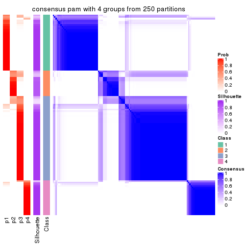</p>

</div>
<div id='tab-ATC-pam-consensus-heatmap-4'>
<pre><code class="r">consensus_heatmap(res, k = 5)
</code></pre>

<p></p>

</div>
<div id='tab-ATC-pam-consensus-heatmap-5'>
<pre><code class="r">consensus_heatmap(res, k = 6)
</code></pre>

<p></p>

</div>
</div>

Heatmaps for the membership of samples in all partitions to see how consistent they are:


<script>
$( function() {
	$( '#tabs-ATC-pam-membership-heatmap' ).tabs();
} );
</script>
<div id='tabs-ATC-pam-membership-heatmap'>
<ul>
<li><a href='#tab-ATC-pam-membership-heatmap-1'>k = 2</a></li>
<li><a href='#tab-ATC-pam-membership-heatmap-2'>k = 3</a></li>
<li><a href='#tab-ATC-pam-membership-heatmap-3'>k = 4</a></li>
<li><a href='#tab-ATC-pam-membership-heatmap-4'>k = 5</a></li>
<li><a href='#tab-ATC-pam-membership-heatmap-5'>k = 6</a></li>
</ul>
<div id='tab-ATC-pam-membership-heatmap-1'>
<pre><code class="r">membership_heatmap(res, k = 2)
</code></pre>

<p></p>

</div>
<div id='tab-ATC-pam-membership-heatmap-2'>
<pre><code class="r">membership_heatmap(res, k = 3)
</code></pre>

<p></p>

</div>
<div id='tab-ATC-pam-membership-heatmap-3'>
<pre><code class="r">membership_heatmap(res, k = 4)
</code></pre>

<p></p>

</div>
<div id='tab-ATC-pam-membership-heatmap-4'>
<pre><code class="r">membership_heatmap(res, k = 5)
</code></pre>

<p></p>

</div>
<div id='tab-ATC-pam-membership-heatmap-5'>
<pre><code class="r">membership_heatmap(res, k = 6)
</code></pre>

<p></p>

</div>
</div>

As soon as we have had the classes for columns, we can look for signatures
which are significantly different between classes which can be candidate marks
for certain classes. Following are the heatmaps for signatures.


Signature heatmaps where rows are scaled:


<script>
$( function() {
	$( '#tabs-ATC-pam-get-signatures' ).tabs();
} );
</script>
<div id='tabs-ATC-pam-get-signatures'>
<ul>
<li><a href='#tab-ATC-pam-get-signatures-1'>k = 2</a></li>
<li><a href='#tab-ATC-pam-get-signatures-2'>k = 3</a></li>
<li><a href='#tab-ATC-pam-get-signatures-3'>k = 4</a></li>
<li><a href='#tab-ATC-pam-get-signatures-4'>k = 5</a></li>
<li><a href='#tab-ATC-pam-get-signatures-5'>k = 6</a></li>
</ul>
<div id='tab-ATC-pam-get-signatures-1'>
<pre><code class="r">get_signatures(res, k = 2)
</code></pre>

<p></p>

</div>
<div id='tab-ATC-pam-get-signatures-2'>
<pre><code class="r">get_signatures(res, k = 3)
</code></pre>

<p></p>

</div>
<div id='tab-ATC-pam-get-signatures-3'>
<pre><code class="r">get_signatures(res, k = 4)
</code></pre>

<p></p>

</div>
<div id='tab-ATC-pam-get-signatures-4'>
<pre><code class="r">get_signatures(res, k = 5)
</code></pre>

<p></p>

</div>
<div id='tab-ATC-pam-get-signatures-5'>
<pre><code class="r">get_signatures(res, k = 6)
</code></pre>

<p></p>

</div>
</div>


Signature heatmaps where rows are not scaled:


<script>
$( function() {
	$( '#tabs-ATC-pam-get-signatures-no-scale' ).tabs();
} );
</script>
<div id='tabs-ATC-pam-get-signatures-no-scale'>
<ul>
<li><a href='#tab-ATC-pam-get-signatures-no-scale-1'>k = 2</a></li>
<li><a href='#tab-ATC-pam-get-signatures-no-scale-2'>k = 3</a></li>
<li><a href='#tab-ATC-pam-get-signatures-no-scale-3'>k = 4</a></li>
<li><a href='#tab-ATC-pam-get-signatures-no-scale-4'>k = 5</a></li>
<li><a href='#tab-ATC-pam-get-signatures-no-scale-5'>k = 6</a></li>
</ul>
<div id='tab-ATC-pam-get-signatures-no-scale-1'>
<pre><code class="r">get_signatures(res, k = 2, scale_rows = FALSE)
</code></pre>

<p></p>

</div>
<div id='tab-ATC-pam-get-signatures-no-scale-2'>
<pre><code class="r">get_signatures(res, k = 3, scale_rows = FALSE)
</code></pre>

<p></p>

</div>
<div id='tab-ATC-pam-get-signatures-no-scale-3'>
<pre><code class="r">get_signatures(res, k = 4, scale_rows = FALSE)
</code></pre>

<p></p>

</div>
<div id='tab-ATC-pam-get-signatures-no-scale-4'>
<pre><code class="r">get_signatures(res, k = 5, scale_rows = FALSE)
</code></pre>

<p></p>

</div>
<div id='tab-ATC-pam-get-signatures-no-scale-5'>
<pre><code class="r">get_signatures(res, k = 6, scale_rows = FALSE)
</code></pre>

<p></p>

</div>
</div>


Compare the overlap of signatures from different k:

```r
compare_signatures(res)
```


`get_signature()` returns a data frame invisibly. TO get the list of signatures, the function
call should be assigned to a variable explicitly. In following code, if `plot` argument is set
to `FALSE`, no heatmap is plotted while only the differential analysis is performed.

```r
# code only for demonstration
tb = get_signature(res, k = ..., plot = FALSE)
```

An example of the output of `tb` is:

```
#>   which_row         fdr    mean_1    mean_2 scaled_mean_1 scaled_mean_2 km
#> 1        38 0.042760348  8.373488  9.131774    -0.5533452     0.5164555  1
#> 2        40 0.018707592  7.106213  8.469186    -0.6173731     0.5762149  1
#> 3        55 0.019134737 10.221463 11.207825    -0.6159697     0.5749050  1
#> 4        59 0.006059896  5.921854  7.869574    -0.6899429     0.6439467  1
#> 5        60 0.018055526  8.928898 10.211722    -0.6204761     0.5791110  1
#> 6        98 0.009384629 15.714769 14.887706     0.6635654    -0.6193277  2
...
```

The columns in `tb` are:

1. `which_row`: row indices corresponding to the input matrix.
2. `fdr`: FDR for the differential test. 
3. `mean_x`: The mean value in group x.
4. `scaled_mean_x`: The mean value in group x after rows are scaled.
5. `km`: Row groups if k-means clustering is applied to rows.


UMAP plot which shows how samples are separated.


<script>
$( function() {
	$( '#tabs-ATC-pam-dimension-reduction' ).tabs();
} );
</script>
<div id='tabs-ATC-pam-dimension-reduction'>
<ul>
<li><a href='#tab-ATC-pam-dimension-reduction-1'>k = 2</a></li>
<li><a href='#tab-ATC-pam-dimension-reduction-2'>k = 3</a></li>
<li><a href='#tab-ATC-pam-dimension-reduction-3'>k = 4</a></li>
<li><a href='#tab-ATC-pam-dimension-reduction-4'>k = 5</a></li>
<li><a href='#tab-ATC-pam-dimension-reduction-5'>k = 6</a></li>
</ul>
<div id='tab-ATC-pam-dimension-reduction-1'>
<pre><code class="r">dimension_reduction(res, k = 2, method = &quot;UMAP&quot;)
</code></pre>

<p></p>

</div>
<div id='tab-ATC-pam-dimension-reduction-2'>
<pre><code class="r">dimension_reduction(res, k = 3, method = &quot;UMAP&quot;)
</code></pre>

<p></p>

</div>
<div id='tab-ATC-pam-dimension-reduction-3'>
<pre><code class="r">dimension_reduction(res, k = 4, method = &quot;UMAP&quot;)
</code></pre>

<p></p>

</div>
<div id='tab-ATC-pam-dimension-reduction-4'>
<pre><code class="r">dimension_reduction(res, k = 5, method = &quot;UMAP&quot;)
</code></pre>

<p>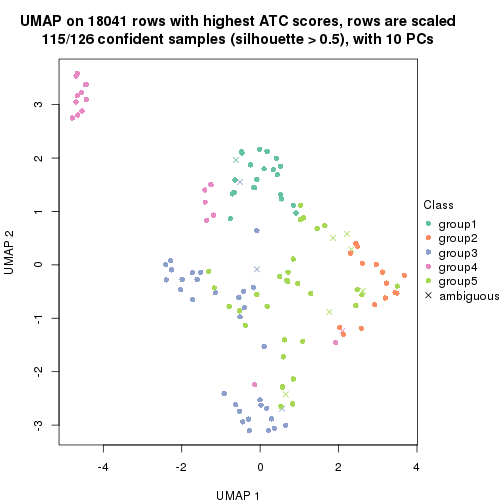</p>

</div>
<div id='tab-ATC-pam-dimension-reduction-5'>
<pre><code class="r">dimension_reduction(res, k = 6, method = &quot;UMAP&quot;)
</code></pre>

<p>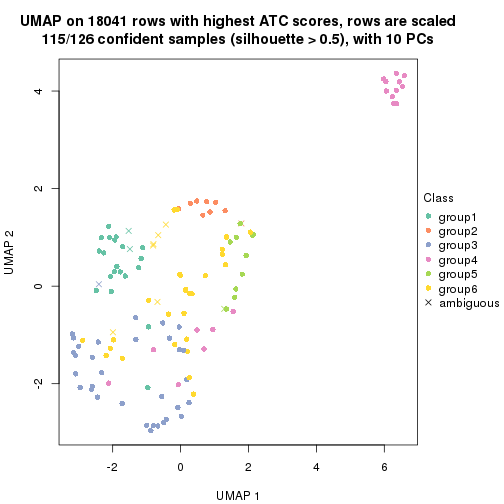</p>

</div>
</div>


Following heatmap shows how subgroups are split when increasing `k`:

```r
collect_classes(res)
```


If matrix rows can be associated to genes, consider to use `GO_Enrichment(res,
...)` to perform function enrichment for the signature genes.


 

---------------------------------------------------


### ATC:mclust*


The object with results only for a single top-value method and a single partition method 
can be extracted as:

```r
res = res_list["ATC", "mclust"]
# you can also extract it by
# res = res_list["ATC:mclust"]
```

A summary of `res` and all the functions that can be applied to it:

```r
res
```

```
#> A 'ConsensusPartition' object with k = 2, 3, 4, 5, 6.
#>   On a matrix with 18041 rows and 126 columns.
#>   Top rows (1000, 2000, 3000, 4000, 5000) are extracted by 'ATC' method.
#>   Subgroups are detected by 'mclust' method.
#>   Performed in total 1250 partitions by row resampling.
#>   Best k for subgroups seems to be 6.
#> 
#> Following methods can be applied to this 'ConsensusPartition' object:
#>  [1] "cola_report"             "collect_classes"         "collect_plots"          
#>  [4] "collect_stats"           "colnames"                "compare_signatures"     
#>  [7] "consensus_heatmap"       "dimension_reduction"     "functional_enrichment"  
#> [10] "get_anno_col"            "get_anno"                "get_classes"            
#> [13] "get_consensus"           "get_matrix"              "get_membership"         
#> [16] "get_param"               "get_signatures"          "get_stats"              
#> [19] "is_best_k"               "is_stable_k"             "membership_heatmap"     
#> [22] "ncol"                    "nrow"                    "plot_ecdf"              
#> [25] "rownames"                "select_partition_number" "show"                   
#> [28] "suggest_best_k"          "test_to_known_factors"
```

`collect_plots()` function collects all the plots made from `res` for all `k` (number of partitions)
into one single page to provide an easy and fast comparison between different `k`.

```r
collect_plots(res)
```


The plots are:

- The first row: a plot of the ECDF (Empirical cumulative distribution
  function) curves of the consensus matrix for each `k` and the heatmap of
  predicted classes for each `k`.
- The second row: heatmaps of the consensus matrix for each `k`.
- The third row: heatmaps of the membership matrix for each `k`.
- The fouth row: heatmaps of the signatures for each `k`.

All the plots in panels can be made by individual functions and they are
plotted later in this section.

`select_partition_number()` produces several plots showing different
statistics for choosing "optimized" `k`. There are following statistics:

- ECDF curves of the consensus matrix for each `k`;
- 1-PAC. [The PAC
  score](https://en.wikipedia.org/wiki/Consensus_clustering#Over-interpretation_potential_of_consensus_clustering)
  measures the proportion of the ambiguous subgrouping.
- Mean silhouette score.
- Concordance. The mean probability of fiting the consensus class ids in all
  partitions.
- Area increased. Denote $A_k$ as the area under the ECDF curve for current
  `k`, the area increased is defined as $A_k - A_{k-1}$.
- Rand index. The percent of pairs of samples that are both in a same cluster
  or both are not in a same cluster in the partition of k and k-1.
- Jaccard index. The ratio of pairs of samples are both in a same cluster in
  the partition of k and k-1 and the pairs of samples are both in a same
  cluster in the partition k or k-1.

The detailed explanations of these statistics can be found in [the cola
vignette](http://bioconductor.org/packages/devel/bioc/vignettes/cola/inst/doc/cola.html#toc_13).

Generally speaking, lower PAC score, higher mean silhouette score or higher
concordance corresponds to better partition. Rand index and Jaccard index
measure how similar the current partition is compared to partition with `k-1`.
If they are too similar, we won't accept `k` is better than `k-1`.

```r
select_partition_number(res)
```


The numeric values for all these statistics can be obtained by `get_stats()`.

```r
get_stats(res)
```

```
#>   k 1-PAC mean_silhouette concordance area_increased  Rand Jaccard
#> 2 2 0.744           0.813       0.924         0.4365 0.537   0.537
#> 3 3 0.585           0.720       0.829         0.3463 0.656   0.464
#> 4 4 0.569           0.666       0.793         0.2008 0.835   0.600
#> 5 5 0.852           0.894       0.892         0.1013 0.917   0.705
#> 6 6 0.947           0.931       0.962         0.0158 0.915   0.676
```

`suggest_best_k()` suggests the best $k$ based on these statistics. The rules are as follows:

- All $k$ with Jaccard index larger than 0.95 are removed because the increase of
  the partition number does not provides enough extra information. If all $k$ are removed,
  the best $k$ is assigned by `NA`.
- For $k$ with 1-PAC larger than 0.9, the maximal $k$ is taken as the "best k". Other $k$ is called "optional k".
- If it does not fit the second rule. The $k$ with the highest vote of highest
  1-PAC, mean silhouette and concordance is taken as the "best k".

```r
suggest_best_k(res)
```

```
#> [1] 6
```


Following shows the table of the partitions (You need to click the **show/hide
code output** link to see it). The membership matrix (columns with name `p*`)
is inferred by
[`clue::cl_consensus()`](https://www.rdocumentation.org/link/cl_consensus?package=clue)
function with the `SE` method. Basically the value in the membership matrix
represents the probability to belong to a certain group. The finall class
label for an item is determined with the group with highest probability it
belongs to.

In `get_classes()` function, the entropy is calculated from the membership
matrix and the silhouette score is calculated from the consensus matrix.


<script>
$( function() {
	$( '#tabs-ATC-mclust-get-classes' ).tabs();
} );
</script>
<div id='tabs-ATC-mclust-get-classes'>
<ul>
<li><a href='#tab-ATC-mclust-get-classes-1'>k = 2</a></li>
<li><a href='#tab-ATC-mclust-get-classes-2'>k = 3</a></li>
<li><a href='#tab-ATC-mclust-get-classes-3'>k = 4</a></li>
<li><a href='#tab-ATC-mclust-get-classes-4'>k = 5</a></li>
<li><a href='#tab-ATC-mclust-get-classes-5'>k = 6</a></li>
</ul>

<div id='tab-ATC-mclust-get-classes-1'>
<p><a id='tab-ATC-mclust-get-classes-1-a' style='color:#0366d6' href='#'>show/hide code output</a></p>
<pre><code class="r">cbind(get_classes(res, k = 2), get_membership(res, k = 2))
</code></pre>

<pre><code>#&gt;                                      class entropy silhouette    p1    p2
#&gt; DC1F29A2-39DE-44AD-936A-54B2B32D6370     1  0.0000      0.835 1.000 0.000
#&gt; FA3C3413-FA8C-4A29-B9CA-5BC3A56274A8     1  0.9866      0.426 0.568 0.432
#&gt; B9B72975-8134-475C-BC0B-0CFDB24F636A     2  0.0000      0.953 0.000 1.000
#&gt; F44DB757-4D00-4BFC-99C5-AA82F99C5BDA     2  0.0000      0.953 0.000 1.000
#&gt; 3BD942BB-A3A7-4993-B3F1-B8641626B773     1  0.9795      0.452 0.584 0.416
#&gt; 431F73A2-2AB3-4101-B610-7FC02A7097EC     2  0.0000      0.953 0.000 1.000
#&gt; 3067683D-43D4-4F6D-9338-17F6A75E4B25     2  0.0000      0.953 0.000 1.000
#&gt; 2CE91B81-7CBE-4698-AFEE-6A154313D231     2  0.9795      0.079 0.416 0.584
#&gt; A639CF4F-4591-4337-A12E-BED71EDDA10B     1  0.0000      0.835 1.000 0.000
#&gt; 5482053D-9F48-4773-B68A-302B3A612503     1  0.0000      0.835 1.000 0.000
#&gt; A31D342D-C67C-428B-BAED-C6E844277A09     2  0.0000      0.953 0.000 1.000
#&gt; 0E9C5985-9AE0-4098-A076-6FFBBDF05110     2  0.0000      0.953 0.000 1.000
#&gt; 08CCF8A0-15B7-4A13-BC43-6B3B3E2DDE95     1  0.9866      0.426 0.568 0.432
#&gt; 10577D5B-AD56-403F-A562-73A9ACF2045B     2  0.0000      0.953 0.000 1.000
#&gt; C940D443-5DDA-4403-868B-7AA6B9A50FC4     1  0.0000      0.835 1.000 0.000
#&gt; 89D4D945-A717-495F-B253-F5A17CF5B9FA     2  0.0000      0.953 0.000 1.000
#&gt; DC55EE78-203F-4092-9B83-14B1A529194B     2  0.0000      0.953 0.000 1.000
#&gt; 8F7368BE-EB41-4192-89AA-9E0428C08851     2  0.0000      0.953 0.000 1.000
#&gt; F772EA39-E408-4908-BADD-C786D702BF9B     1  0.9896      0.406 0.560 0.440
#&gt; FD693D10-3ADA-4028-8392-41D2F0296F7E     2  0.0000      0.953 0.000 1.000
#&gt; 84F16966-7640-49F9-95D1-7648FF74DCC9     2  0.0000      0.953 0.000 1.000
#&gt; D26DAA2F-AE6A-42E1-9F1F-01943B99785F     2  0.0000      0.953 0.000 1.000
#&gt; F325847E-F046-4B67-B01C-16919C401020     2  0.0000      0.953 0.000 1.000
#&gt; 19EB2B10-2529-4A94-8FAE-1CE371A602D9     2  0.0000      0.953 0.000 1.000
#&gt; B94B9CCF-5FB8-44AE-8D9C-A194C6801A27     2  0.0000      0.953 0.000 1.000
#&gt; D2678E70-542A-4AB2-B881-12D66DBA44F5     2  0.0000      0.953 0.000 1.000
#&gt; 4961CA2A-70CD-42AB-A676-4A98C85F449F     1  0.9866      0.426 0.568 0.432
#&gt; 5AA74C5C-2AD1-4D59-A030-E964EB199581     2  0.0000      0.953 0.000 1.000
#&gt; F9E11A1B-BD93-438F-9670-6FB7DFF9E910     2  0.4298      0.858 0.088 0.912
#&gt; FB78CA5A-C8B9-42AF-9DAE-799CAB280B2E     2  0.0000      0.953 0.000 1.000
#&gt; A8E48877-F8AB-44DD-A18B-194D87C44931     1  0.9866      0.426 0.568 0.432
#&gt; CA50C495-F37E-4743-867D-FAF2DCC3376A     2  0.0000      0.953 0.000 1.000
#&gt; 37342369-EC22-4904-8CCD-A0DC6BD8D183     2  0.0000      0.953 0.000 1.000
#&gt; 91BA5F90-9174-4533-A050-39A28E34A94D     1  0.0000      0.835 1.000 0.000
#&gt; 5BC371AC-1915-44E9-A114-2963E131EC8D     2  0.0000      0.953 0.000 1.000
#&gt; 74A6C31A-7F21-45AF-A170-18C326D2AE69     1  0.9427      0.468 0.640 0.360
#&gt; 984F27EF-D4D7-4E68-BD64-776FDFC04D07     2  0.0000      0.953 0.000 1.000
#&gt; B05701C5-8C44-4FD1-94C9-FC0255A2EA24     1  0.1414      0.823 0.980 0.020
#&gt; 91E4119C-2CE6-4447-A125-6A4F403A89E6     1  0.9866      0.426 0.568 0.432
#&gt; 1570FCE7-F1B4-4BDF-A398-355EDF030864     2  0.0000      0.953 0.000 1.000
#&gt; 604C06E9-A00E-435E-847A-3992922A5C56     2  1.0000     -0.122 0.500 0.500
#&gt; 455C9007-6FF4-4D63-83FA-4915F0331F9A     2  0.0000      0.953 0.000 1.000
#&gt; FB8BD3CF-D2EC-47B6-B67F-65ADC1C3A6A7     1  0.9866      0.426 0.568 0.432
#&gt; 9DC7443A-3C8F-4025-8312-3C98BF28D736     2  0.6148      0.756 0.152 0.848
#&gt; CB207A52-09AC-49D3-8240-5840CDFBB154     2  0.0000      0.953 0.000 1.000
#&gt; 2A335049-AD9F-4B32-92B7-69B04B0CF2BA     2  0.0000      0.953 0.000 1.000
#&gt; 6ACA6293-371E-428D-BBAE-ABFD410C886F     2  0.0000      0.953 0.000 1.000
#&gt; E8929929-73F9-4DB7-ABBA-0852BEFFFF7E     2  0.0000      0.953 0.000 1.000
#&gt; 5E343116-414B-41F2-AAEE-A3225450135A     1  0.0000      0.835 1.000 0.000
#&gt; 0A39073C-157C-48A1-B125-A6A04CB738DA     1  0.9866      0.426 0.568 0.432
#&gt; 300D78E6-1C7E-4114-80EA-9204A6818B9A     2  0.0000      0.953 0.000 1.000
#&gt; DAAF55AA-ED48-4221-9CD6-D1DEB6376017     2  0.0000      0.953 0.000 1.000
#&gt; D76FCF4A-4ACF-41EF-A120-64136D6C845E     2  0.0000      0.953 0.000 1.000
#&gt; AD294665-6F90-459C-90D5-3058F210225D     2  0.0000      0.953 0.000 1.000
#&gt; 92E8AD7A-1084-44C8-BDC0-FE4E47B6143F     2  0.0000      0.953 0.000 1.000
#&gt; 5644A861-3C59-486D-8FBE-4DF6A3B19558     1  0.0000      0.835 1.000 0.000
#&gt; 1BF8AAE7-B771-4CF2-8B1C-D2BEB5E6579E     2  0.0000      0.953 0.000 1.000
#&gt; A54731AE-FC40-407F-8D10-67DDC122237D     2  0.0000      0.953 0.000 1.000
#&gt; 179DC906-5654-4CBA-9C27-C9560B5F12DE     1  0.0376      0.833 0.996 0.004
#&gt; 979B9A2B-2D81-47C3-A553-9B9441CAAE47     1  0.0000      0.835 1.000 0.000
#&gt; D69BD86A-08FB-49DA-9084-2725F6C9195F     1  0.0000      0.835 1.000 0.000
#&gt; 84611033-BCF7-49D7-9B91-DA29B62AC8D3     2  0.0000      0.953 0.000 1.000
#&gt; 8AA1DA3E-8C00-4653-AA33-EA70531C1E50     2  0.0000      0.953 0.000 1.000
#&gt; CEBE9594-0F19-46B4-AF7D-F8DF33E00AFB     2  0.0000      0.953 0.000 1.000
#&gt; C68E82D2-2BD3-41E9-92D7-D4C06E1953B2     1  0.0000      0.835 1.000 0.000
#&gt; B855EF89-1E76-4408-AA65-61A0F0A4F412     2  0.0000      0.953 0.000 1.000
#&gt; 4488EFB3-5B01-41E3-B57E-8E4F607CF448     2  0.0000      0.953 0.000 1.000
#&gt; C2BD8440-CAC6-4FE5-8EBB-5E6AE308D52F     1  0.0000      0.835 1.000 0.000
#&gt; E0E50F10-1FED-41C1-84DB-81A46F25D7E9     2  0.0000      0.953 0.000 1.000
#&gt; EE16D845-31F2-4178-800B-CA2C358841AD     2  0.0000      0.953 0.000 1.000
#&gt; 169828CF-5693-4A46-B5D7-E45CBA9DF317     2  0.0000      0.953 0.000 1.000
#&gt; 51077BA3-AEE0-4BD4-A1B1-1B0A811642A1     1  0.0000      0.835 1.000 0.000
#&gt; D2F4E240-C44C-4CF7-8016-6CACD370D093     2  0.0000      0.953 0.000 1.000
#&gt; 721CDBE6-FC85-4C30-B23E-28407340286F     1  0.0000      0.835 1.000 0.000
#&gt; 392897E4-6009-422C-B461-649F4DDF260C     1  0.0000      0.835 1.000 0.000
#&gt; 617E13D2-6924-45F8-A8DE-BE21B718F822     2  0.0000      0.953 0.000 1.000
#&gt; 5746C00F-9CBB-46B7-83FD-90B2AB3F507B     2  0.0000      0.953 0.000 1.000
#&gt; 982B4344-A223-4D1F-9485-2E56F9FD45C0     2  0.0000      0.953 0.000 1.000
#&gt; E5557F52-015D-49DC-9E23-989FC259976F     1  0.0000      0.835 1.000 0.000
#&gt; F3135F5E-2E90-4923-B634-E994563D17B7     2  0.0672      0.945 0.008 0.992
#&gt; D1ED15A5-9802-4314-B556-E89EB772D1F0     1  0.0000      0.835 1.000 0.000
#&gt; 222B06E3-FCFB-4104-92C3-D73BC31854D4     2  0.0000      0.953 0.000 1.000
#&gt; 4C810FFA-ED07-4F4C-9F81-B8F1CF4956F7     2  0.1414      0.933 0.020 0.980
#&gt; 9A608964-ED12-4E6E-9D3A-430F59FFF65B     1  0.0000      0.835 1.000 0.000
#&gt; 4087357F-C17A-4992-A8AB-41ACA2F72001     2  0.9754      0.112 0.408 0.592
#&gt; B3F013A5-BCB8-4CE0-86B2-634EE180AA6E     2  0.0000      0.953 0.000 1.000
#&gt; 322AF320-1379-4F51-AFDC-5292A060CD52     2  0.5519      0.795 0.128 0.872
#&gt; 53A96249-66D5-4C26-893B-ADC71481D261     2  0.1184      0.937 0.016 0.984
#&gt; 1AB7A6F2-14BD-447C-B2E3-DEB0CE56B209     2  0.0000      0.953 0.000 1.000
#&gt; 8B4BCDA0-6787-4A55-99F7-AAF22AF85BA6     2  0.0000      0.953 0.000 1.000
#&gt; 5D9D9E08-2C2C-414E-9547-62799F90D543     2  0.9795      0.079 0.416 0.584
#&gt; C345CD17-E4F4-41D5-9891-FEFB19342C52     2  0.0000      0.953 0.000 1.000
#&gt; 1AF8FDE1-1A74-41F6-A1C5-4952CDFB7D3F     2  0.0000      0.953 0.000 1.000
#&gt; BC3405FF-0660-4B2B-8DC1-5F34D3133078     1  0.0000      0.835 1.000 0.000
#&gt; C2662596-6E2F-4924-B051-CEA1AC87B197     1  0.0000      0.835 1.000 0.000
#&gt; 39AE85F7-49FB-4438-BD41-6AC812FA1C72     1  0.0000      0.835 1.000 0.000
#&gt; 6FF266DB-3F08-43F2-8F6F-679F805B80B8     1  0.9209      0.565 0.664 0.336
#&gt; B03B7B81-BBD6-4194-BC5E-6EDF0D3F015A     2  0.0000      0.953 0.000 1.000
#&gt; C7617D56-F13C-4C43-906C-BD458C5DC4CD     1  0.9795      0.453 0.584 0.416
#&gt; 09420F8B-7A71-4B32-8388-4767670F1FEB     1  0.0000      0.835 1.000 0.000
#&gt; 6AF47534-74FF-4128-865B-4E8EE1FFB469     2  0.0000      0.953 0.000 1.000
#&gt; 8FF9E94A-2ED2-4727-947F-D524D7ECE815     2  0.0000      0.953 0.000 1.000
#&gt; A390E20D-03F9-40E4-A132-0FA5C2BEDB63     2  0.2043      0.920 0.032 0.968
#&gt; A489CCCA-1374-4071-80CE-05B83C9A0D5E     2  0.9970     -0.135 0.468 0.532
#&gt; 2D962371-EC83-490C-A663-478AF383BC1B     2  0.0000      0.953 0.000 1.000
#&gt; D91B31A1-EE71-4726-B94C-0CC2815E9D4E     2  0.0000      0.953 0.000 1.000
#&gt; E0123C5C-E1D1-4162-9895-CC8B01949D84     1  0.9866      0.426 0.568 0.432
#&gt; EC73959A-2728-49FE-B72A-790BB14F4CBF     1  0.0000      0.835 1.000 0.000
#&gt; A60DC925-7343-496E-900D-0DD81D5C8123     2  0.0000      0.953 0.000 1.000
#&gt; 659B64DB-F4A5-43BD-811B-05004CB49D99     1  0.0000      0.835 1.000 0.000
#&gt; 6969B6B2-7616-4664-9696-C4DACD10537B     2  0.0000      0.953 0.000 1.000
#&gt; 2F6392DE-0D54-4768-B062-907C81E5B0CC     1  0.0000      0.835 1.000 0.000
#&gt; C74BE8C5-BA6D-4596-9D67-3C731799F999     2  0.0000      0.953 0.000 1.000
#&gt; 79A7647F-BDBA-45A2-B207-ABF788F6CC95     1  0.0000      0.835 1.000 0.000
#&gt; D47D0433-2313-4A2F-B268-5AD293D7534E     2  0.9795      0.079 0.416 0.584
#&gt; C5058B93-C1DA-43B9-9951-B23A9810AA6E     2  0.0000      0.953 0.000 1.000
#&gt; 2629FEE3-A203-4411-8A70-02A796C9505C     2  0.0000      0.953 0.000 1.000
#&gt; 1AF329E4-11D4-4CFC-801F-C24A1EA33102     2  0.0000      0.953 0.000 1.000
#&gt; D453BEF8-3F18-4B89-BA42-CE74EB105032     2  0.0000      0.953 0.000 1.000
#&gt; B12A4446-2310-4139-897F-CA030478CBD5     1  0.0000      0.835 1.000 0.000
#&gt; BCAB1918-5FA9-4CBD-85CB-008743FEA2CC     1  0.5294      0.767 0.880 0.120
#&gt; 9A5432D3-19EE-47B4-BD88-698DEC75A5E9     2  0.0000      0.953 0.000 1.000
#&gt; A608BCEB-2C27-4927-A308-E6975F641722     2  0.0000      0.953 0.000 1.000
#&gt; E4752275-7BF6-4C1E-8A45-C7D571ED85AD     1  0.9977      0.316 0.528 0.472
#&gt; FDEC1714-C02D-4AB7-AE82-789E9D709EDE     1  0.0000      0.835 1.000 0.000
#&gt; 33737781-8638-4FA2-AD4C-E888BB9343D8     1  0.9866      0.426 0.568 0.432
</code></pre>

<script>
$('#tab-ATC-mclust-get-classes-1-a').parent().next().next().hide();
$('#tab-ATC-mclust-get-classes-1-a').click(function(){
  $('#tab-ATC-mclust-get-classes-1-a').parent().next().next().toggle();
  return(false);
});
</script>
</div>

<div id='tab-ATC-mclust-get-classes-2'>
<p><a id='tab-ATC-mclust-get-classes-2-a' style='color:#0366d6' href='#'>show/hide code output</a></p>
<pre><code class="r">cbind(get_classes(res, k = 3), get_membership(res, k = 3))
</code></pre>

<pre><code>#&gt;                                      class entropy silhouette    p1    p2    p3
#&gt; DC1F29A2-39DE-44AD-936A-54B2B32D6370     3  0.0000     0.8969 0.000 0.000 1.000
#&gt; FA3C3413-FA8C-4A29-B9CA-5BC3A56274A8     2  0.3752     0.4500 0.000 0.856 0.144
#&gt; B9B72975-8134-475C-BC0B-0CFDB24F636A     2  0.5948     0.7389 0.360 0.640 0.000
#&gt; F44DB757-4D00-4BFC-99C5-AA82F99C5BDA     2  0.6225     0.6708 0.432 0.568 0.000
#&gt; 3BD942BB-A3A7-4993-B3F1-B8641626B773     3  0.6379     0.6852 0.032 0.256 0.712
#&gt; 431F73A2-2AB3-4101-B610-7FC02A7097EC     3  0.9188    -0.0898 0.380 0.152 0.468
#&gt; 3067683D-43D4-4F6D-9338-17F6A75E4B25     2  0.6252     0.6555 0.444 0.556 0.000
#&gt; 2CE91B81-7CBE-4698-AFEE-6A154313D231     2  0.3192     0.4704 0.000 0.888 0.112
#&gt; A639CF4F-4591-4337-A12E-BED71EDDA10B     3  0.0000     0.8969 0.000 0.000 1.000
#&gt; 5482053D-9F48-4773-B68A-302B3A612503     3  0.0000     0.8969 0.000 0.000 1.000
#&gt; A31D342D-C67C-428B-BAED-C6E844277A09     2  0.6079     0.7369 0.388 0.612 0.000
#&gt; 0E9C5985-9AE0-4098-A076-6FFBBDF05110     2  0.6235     0.6643 0.436 0.564 0.000
#&gt; 08CCF8A0-15B7-4A13-BC43-6B3B3E2DDE95     2  0.3686     0.4521 0.000 0.860 0.140
#&gt; 10577D5B-AD56-403F-A562-73A9ACF2045B     1  0.0000     0.9086 1.000 0.000 0.000
#&gt; C940D443-5DDA-4403-868B-7AA6B9A50FC4     3  0.0000     0.8969 0.000 0.000 1.000
#&gt; 89D4D945-A717-495F-B253-F5A17CF5B9FA     2  0.6154     0.7022 0.408 0.592 0.000
#&gt; DC55EE78-203F-4092-9B83-14B1A529194B     2  0.5948     0.7389 0.360 0.640 0.000
#&gt; 8F7368BE-EB41-4192-89AA-9E0428C08851     2  0.6154     0.7303 0.408 0.592 0.000
#&gt; F772EA39-E408-4908-BADD-C786D702BF9B     2  0.3267     0.4682 0.000 0.884 0.116
#&gt; FD693D10-3ADA-4028-8392-41D2F0296F7E     2  0.6154     0.7303 0.408 0.592 0.000
#&gt; 84F16966-7640-49F9-95D1-7648FF74DCC9     2  0.5882     0.7419 0.348 0.652 0.000
#&gt; D26DAA2F-AE6A-42E1-9F1F-01943B99785F     2  0.5882     0.7419 0.348 0.652 0.000
#&gt; F325847E-F046-4B67-B01C-16919C401020     1  0.1753     0.8821 0.952 0.048 0.000
#&gt; 19EB2B10-2529-4A94-8FAE-1CE371A602D9     2  0.6577     0.7220 0.420 0.572 0.008
#&gt; B94B9CCF-5FB8-44AE-8D9C-A194C6801A27     2  0.5882     0.7419 0.348 0.652 0.000
#&gt; D2678E70-542A-4AB2-B881-12D66DBA44F5     2  0.6154     0.7303 0.408 0.592 0.000
#&gt; 4961CA2A-70CD-42AB-A676-4A98C85F449F     2  0.3752     0.4500 0.000 0.856 0.144
#&gt; 5AA74C5C-2AD1-4D59-A030-E964EB199581     1  0.0747     0.9008 0.984 0.016 0.000
#&gt; F9E11A1B-BD93-438F-9670-6FB7DFF9E910     3  0.3583     0.8315 0.056 0.044 0.900
#&gt; FB78CA5A-C8B9-42AF-9DAE-799CAB280B2E     1  0.0000     0.9086 1.000 0.000 0.000
#&gt; A8E48877-F8AB-44DD-A18B-194D87C44931     2  0.3752     0.4500 0.000 0.856 0.144
#&gt; CA50C495-F37E-4743-867D-FAF2DCC3376A     2  0.6339     0.7422 0.360 0.632 0.008
#&gt; 37342369-EC22-4904-8CCD-A0DC6BD8D183     2  0.5882     0.7419 0.348 0.652 0.000
#&gt; 91BA5F90-9174-4533-A050-39A28E34A94D     3  0.0000     0.8969 0.000 0.000 1.000
#&gt; 5BC371AC-1915-44E9-A114-2963E131EC8D     2  0.6154     0.7303 0.408 0.592 0.000
#&gt; 74A6C31A-7F21-45AF-A170-18C326D2AE69     3  0.6339     0.3530 0.360 0.008 0.632
#&gt; 984F27EF-D4D7-4E68-BD64-776FDFC04D07     2  0.6154     0.7303 0.408 0.592 0.000
#&gt; B05701C5-8C44-4FD1-94C9-FC0255A2EA24     3  0.1905     0.8780 0.028 0.016 0.956
#&gt; 91E4119C-2CE6-4447-A125-6A4F403A89E6     2  0.3752     0.4500 0.000 0.856 0.144
#&gt; 1570FCE7-F1B4-4BDF-A398-355EDF030864     2  0.6140     0.7065 0.404 0.596 0.000
#&gt; 604C06E9-A00E-435E-847A-3992922A5C56     3  0.3472     0.8440 0.040 0.056 0.904
#&gt; 455C9007-6FF4-4D63-83FA-4915F0331F9A     2  0.6154     0.7303 0.408 0.592 0.000
#&gt; FB8BD3CF-D2EC-47B6-B67F-65ADC1C3A6A7     2  0.3686     0.4521 0.000 0.860 0.140
#&gt; 9DC7443A-3C8F-4025-8312-3C98BF28D736     2  0.6769     0.7354 0.392 0.592 0.016
#&gt; CB207A52-09AC-49D3-8240-5840CDFBB154     3  0.6894     0.5090 0.256 0.052 0.692
#&gt; 2A335049-AD9F-4B32-92B7-69B04B0CF2BA     1  0.0000     0.9086 1.000 0.000 0.000
#&gt; 6ACA6293-371E-428D-BBAE-ABFD410C886F     2  0.5948     0.7389 0.360 0.640 0.000
#&gt; E8929929-73F9-4DB7-ABBA-0852BEFFFF7E     2  0.6154     0.7303 0.408 0.592 0.000
#&gt; 5E343116-414B-41F2-AAEE-A3225450135A     3  0.0000     0.8969 0.000 0.000 1.000
#&gt; 0A39073C-157C-48A1-B125-A6A04CB738DA     2  0.3752     0.4500 0.000 0.856 0.144
#&gt; 300D78E6-1C7E-4114-80EA-9204A6818B9A     1  0.0000     0.9086 1.000 0.000 0.000
#&gt; DAAF55AA-ED48-4221-9CD6-D1DEB6376017     2  0.6154     0.7303 0.408 0.592 0.000
#&gt; D76FCF4A-4ACF-41EF-A120-64136D6C845E     1  0.1860     0.8791 0.948 0.052 0.000
#&gt; AD294665-6F90-459C-90D5-3058F210225D     3  0.7424     0.1829 0.388 0.040 0.572
#&gt; 92E8AD7A-1084-44C8-BDC0-FE4E47B6143F     1  0.6308    -0.5447 0.508 0.492 0.000
#&gt; 5644A861-3C59-486D-8FBE-4DF6A3B19558     3  0.0000     0.8969 0.000 0.000 1.000
#&gt; 1BF8AAE7-B771-4CF2-8B1C-D2BEB5E6579E     1  0.0000     0.9086 1.000 0.000 0.000
#&gt; A54731AE-FC40-407F-8D10-67DDC122237D     2  0.5948     0.7389 0.360 0.640 0.000
#&gt; 179DC906-5654-4CBA-9C27-C9560B5F12DE     3  0.1585     0.8812 0.028 0.008 0.964
#&gt; 979B9A2B-2D81-47C3-A553-9B9441CAAE47     3  0.0000     0.8969 0.000 0.000 1.000
#&gt; D69BD86A-08FB-49DA-9084-2725F6C9195F     3  0.0000     0.8969 0.000 0.000 1.000
#&gt; 84611033-BCF7-49D7-9B91-DA29B62AC8D3     2  0.6192     0.7263 0.420 0.580 0.000
#&gt; 8AA1DA3E-8C00-4653-AA33-EA70531C1E50     2  0.5882     0.7419 0.348 0.652 0.000
#&gt; CEBE9594-0F19-46B4-AF7D-F8DF33E00AFB     2  0.6154     0.7303 0.408 0.592 0.000
#&gt; C68E82D2-2BD3-41E9-92D7-D4C06E1953B2     3  0.1753     0.8759 0.000 0.048 0.952
#&gt; B855EF89-1E76-4408-AA65-61A0F0A4F412     2  0.5882     0.7419 0.348 0.652 0.000
#&gt; 4488EFB3-5B01-41E3-B57E-8E4F607CF448     1  0.5138     0.2967 0.748 0.252 0.000
#&gt; C2BD8440-CAC6-4FE5-8EBB-5E6AE308D52F     3  0.0000     0.8969 0.000 0.000 1.000
#&gt; E0E50F10-1FED-41C1-84DB-81A46F25D7E9     2  0.6154     0.7303 0.408 0.592 0.000
#&gt; EE16D845-31F2-4178-800B-CA2C358841AD     2  0.6140     0.7065 0.404 0.596 0.000
#&gt; 169828CF-5693-4A46-B5D7-E45CBA9DF317     2  0.5882     0.7419 0.348 0.652 0.000
#&gt; 51077BA3-AEE0-4BD4-A1B1-1B0A811642A1     3  0.0000     0.8969 0.000 0.000 1.000
#&gt; D2F4E240-C44C-4CF7-8016-6CACD370D093     1  0.0000     0.9086 1.000 0.000 0.000
#&gt; 721CDBE6-FC85-4C30-B23E-28407340286F     3  0.0237     0.8957 0.000 0.004 0.996
#&gt; 392897E4-6009-422C-B461-649F4DDF260C     3  0.0237     0.8957 0.000 0.004 0.996
#&gt; 617E13D2-6924-45F8-A8DE-BE21B718F822     2  0.6154     0.7303 0.408 0.592 0.000
#&gt; 5746C00F-9CBB-46B7-83FD-90B2AB3F507B     1  0.0000     0.9086 1.000 0.000 0.000
#&gt; 982B4344-A223-4D1F-9485-2E56F9FD45C0     2  0.5948     0.7389 0.360 0.640 0.000
#&gt; E5557F52-015D-49DC-9E23-989FC259976F     3  0.0000     0.8969 0.000 0.000 1.000
#&gt; F3135F5E-2E90-4923-B634-E994563D17B7     3  0.6950     0.5146 0.252 0.056 0.692
#&gt; D1ED15A5-9802-4314-B556-E89EB772D1F0     3  0.0000     0.8969 0.000 0.000 1.000
#&gt; 222B06E3-FCFB-4104-92C3-D73BC31854D4     1  0.0000     0.9086 1.000 0.000 0.000
#&gt; 4C810FFA-ED07-4F4C-9F81-B8F1CF4956F7     2  0.7481     0.6901 0.296 0.640 0.064
#&gt; 9A608964-ED12-4E6E-9D3A-430F59FFF65B     3  0.0237     0.8952 0.004 0.000 0.996
#&gt; 4087357F-C17A-4992-A8AB-41ACA2F72001     2  0.8814     0.6330 0.312 0.548 0.140
#&gt; B3F013A5-BCB8-4CE0-86B2-634EE180AA6E     2  0.5948     0.7389 0.360 0.640 0.000
#&gt; 322AF320-1379-4F51-AFDC-5292A060CD52     2  0.3181     0.4973 0.024 0.912 0.064
#&gt; 53A96249-66D5-4C26-893B-ADC71481D261     2  0.4075     0.5369 0.072 0.880 0.048
#&gt; 1AB7A6F2-14BD-447C-B2E3-DEB0CE56B209     1  0.0000     0.9086 1.000 0.000 0.000
#&gt; 8B4BCDA0-6787-4A55-99F7-AAF22AF85BA6     2  0.5948     0.7389 0.360 0.640 0.000
#&gt; 5D9D9E08-2C2C-414E-9547-62799F90D543     2  0.3116     0.4721 0.000 0.892 0.108
#&gt; C345CD17-E4F4-41D5-9891-FEFB19342C52     1  0.0000     0.9086 1.000 0.000 0.000
#&gt; 1AF8FDE1-1A74-41F6-A1C5-4952CDFB7D3F     1  0.0000     0.9086 1.000 0.000 0.000
#&gt; BC3405FF-0660-4B2B-8DC1-5F34D3133078     3  0.0000     0.8969 0.000 0.000 1.000
#&gt; C2662596-6E2F-4924-B051-CEA1AC87B197     3  0.0000     0.8969 0.000 0.000 1.000
#&gt; 39AE85F7-49FB-4438-BD41-6AC812FA1C72     3  0.0000     0.8969 0.000 0.000 1.000
#&gt; 6FF266DB-3F08-43F2-8F6F-679F805B80B8     3  0.6148     0.4247 0.004 0.356 0.640
#&gt; B03B7B81-BBD6-4194-BC5E-6EDF0D3F015A     2  0.6079     0.7369 0.388 0.612 0.000
#&gt; C7617D56-F13C-4C43-906C-BD458C5DC4CD     3  0.5269     0.6999 0.016 0.200 0.784
#&gt; 09420F8B-7A71-4B32-8388-4767670F1FEB     3  0.0000     0.8969 0.000 0.000 1.000
#&gt; 6AF47534-74FF-4128-865B-4E8EE1FFB469     2  0.6126     0.7103 0.400 0.600 0.000
#&gt; 8FF9E94A-2ED2-4727-947F-D524D7ECE815     2  0.6154     0.7303 0.408 0.592 0.000
#&gt; A390E20D-03F9-40E4-A132-0FA5C2BEDB63     2  0.6540     0.7247 0.408 0.584 0.008
#&gt; A489CCCA-1374-4071-80CE-05B83C9A0D5E     2  0.3686     0.4521 0.000 0.860 0.140
#&gt; 2D962371-EC83-490C-A663-478AF383BC1B     2  0.5882     0.7419 0.348 0.652 0.000
#&gt; D91B31A1-EE71-4726-B94C-0CC2815E9D4E     1  0.1860     0.8791 0.948 0.052 0.000
#&gt; E0123C5C-E1D1-4162-9895-CC8B01949D84     2  0.3752     0.4500 0.000 0.856 0.144
#&gt; EC73959A-2728-49FE-B72A-790BB14F4CBF     3  0.0000     0.8969 0.000 0.000 1.000
#&gt; A60DC925-7343-496E-900D-0DD81D5C8123     2  0.6154     0.7303 0.408 0.592 0.000
#&gt; 659B64DB-F4A5-43BD-811B-05004CB49D99     3  0.0000     0.8969 0.000 0.000 1.000
#&gt; 6969B6B2-7616-4664-9696-C4DACD10537B     2  0.5968     0.7417 0.364 0.636 0.000
#&gt; 2F6392DE-0D54-4768-B062-907C81E5B0CC     3  0.2796     0.8508 0.000 0.092 0.908
#&gt; C74BE8C5-BA6D-4596-9D67-3C731799F999     2  0.6154     0.7303 0.408 0.592 0.000
#&gt; 79A7647F-BDBA-45A2-B207-ABF788F6CC95     3  0.0000     0.8969 0.000 0.000 1.000
#&gt; D47D0433-2313-4A2F-B268-5AD293D7534E     2  0.2625     0.4801 0.000 0.916 0.084
#&gt; C5058B93-C1DA-43B9-9951-B23A9810AA6E     1  0.1860     0.8791 0.948 0.052 0.000
#&gt; 2629FEE3-A203-4411-8A70-02A796C9505C     2  0.6104     0.7422 0.348 0.648 0.004
#&gt; 1AF329E4-11D4-4CFC-801F-C24A1EA33102     2  0.6140     0.7065 0.404 0.596 0.000
#&gt; D453BEF8-3F18-4B89-BA42-CE74EB105032     1  0.1860     0.8791 0.948 0.052 0.000
#&gt; B12A4446-2310-4139-897F-CA030478CBD5     3  0.1289     0.8839 0.000 0.032 0.968
#&gt; BCAB1918-5FA9-4CBD-85CB-008743FEA2CC     3  0.4110     0.7429 0.152 0.004 0.844
#&gt; 9A5432D3-19EE-47B4-BD88-698DEC75A5E9     2  0.5882     0.7419 0.348 0.652 0.000
#&gt; A608BCEB-2C27-4927-A308-E6975F641722     2  0.6140     0.7065 0.404 0.596 0.000
#&gt; E4752275-7BF6-4C1E-8A45-C7D571ED85AD     2  0.3267     0.4682 0.000 0.884 0.116
#&gt; FDEC1714-C02D-4AB7-AE82-789E9D709EDE     3  0.0000     0.8969 0.000 0.000 1.000
#&gt; 33737781-8638-4FA2-AD4C-E888BB9343D8     2  0.3752     0.4500 0.000 0.856 0.144
</code></pre>

<script>
$('#tab-ATC-mclust-get-classes-2-a').parent().next().next().hide();
$('#tab-ATC-mclust-get-classes-2-a').click(function(){
  $('#tab-ATC-mclust-get-classes-2-a').parent().next().next().toggle();
  return(false);
});
</script>
</div>

<div id='tab-ATC-mclust-get-classes-3'>
<p><a id='tab-ATC-mclust-get-classes-3-a' style='color:#0366d6' href='#'>show/hide code output</a></p>
<pre><code class="r">cbind(get_classes(res, k = 4), get_membership(res, k = 4))
</code></pre>

<pre><code>#&gt;                                      class entropy silhouette    p1    p2    p3    p4
#&gt; DC1F29A2-39DE-44AD-936A-54B2B32D6370     1  0.3024     0.8860 0.852 0.000 0.000 0.148
#&gt; FA3C3413-FA8C-4A29-B9CA-5BC3A56274A8     2  0.5770     0.4714 0.140 0.712 0.000 0.148
#&gt; B9B72975-8134-475C-BC0B-0CFDB24F636A     2  0.5386     0.4235 0.000 0.632 0.024 0.344
#&gt; F44DB757-4D00-4BFC-99C5-AA82F99C5BDA     3  0.7542    -0.1578 0.000 0.208 0.472 0.320
#&gt; 3BD942BB-A3A7-4993-B3F1-B8641626B773     1  0.6805     0.6222 0.592 0.260 0.000 0.148
#&gt; 431F73A2-2AB3-4101-B610-7FC02A7097EC     1  0.6490     0.6003 0.608 0.008 0.076 0.308
#&gt; 3067683D-43D4-4F6D-9338-17F6A75E4B25     3  0.7366    -0.0484 0.000 0.344 0.484 0.172
#&gt; 2CE91B81-7CBE-4698-AFEE-6A154313D231     2  0.2921     0.5101 0.140 0.860 0.000 0.000
#&gt; A639CF4F-4591-4337-A12E-BED71EDDA10B     1  0.0000     0.8794 1.000 0.000 0.000 0.000
#&gt; 5482053D-9F48-4773-B68A-302B3A612503     1  0.0000     0.8794 1.000 0.000 0.000 0.000
#&gt; A31D342D-C67C-428B-BAED-C6E844277A09     4  0.3024     0.7608 0.000 0.148 0.000 0.852
#&gt; 0E9C5985-9AE0-4098-A076-6FFBBDF05110     3  0.6620     0.1901 0.000 0.104 0.576 0.320
#&gt; 08CCF8A0-15B7-4A13-BC43-6B3B3E2DDE95     2  0.5770     0.4714 0.140 0.712 0.000 0.148
#&gt; 10577D5B-AD56-403F-A562-73A9ACF2045B     3  0.0000     0.9083 0.000 0.000 1.000 0.000
#&gt; C940D443-5DDA-4403-868B-7AA6B9A50FC4     1  0.0000     0.8794 1.000 0.000 0.000 0.000
#&gt; 89D4D945-A717-495F-B253-F5A17CF5B9FA     2  0.5386     0.4235 0.000 0.632 0.024 0.344
#&gt; DC55EE78-203F-4092-9B83-14B1A529194B     2  0.5386     0.4235 0.000 0.632 0.024 0.344
#&gt; 8F7368BE-EB41-4192-89AA-9E0428C08851     4  0.3024     0.7608 0.000 0.148 0.000 0.852
#&gt; F772EA39-E408-4908-BADD-C786D702BF9B     2  0.2921     0.5101 0.140 0.860 0.000 0.000
#&gt; FD693D10-3ADA-4028-8392-41D2F0296F7E     4  0.0469     0.6971 0.000 0.012 0.000 0.988
#&gt; 84F16966-7640-49F9-95D1-7648FF74DCC9     2  0.5386     0.4235 0.000 0.632 0.024 0.344
#&gt; D26DAA2F-AE6A-42E1-9F1F-01943B99785F     2  0.7206     0.3759 0.140 0.460 0.000 0.400
#&gt; F325847E-F046-4B67-B01C-16919C401020     3  0.0000     0.9083 0.000 0.000 1.000 0.000
#&gt; 19EB2B10-2529-4A94-8FAE-1CE371A602D9     4  0.7042     0.1277 0.132 0.000 0.352 0.516
#&gt; B94B9CCF-5FB8-44AE-8D9C-A194C6801A27     4  0.5691     0.0591 0.028 0.408 0.000 0.564
#&gt; D2678E70-542A-4AB2-B881-12D66DBA44F5     4  0.1940     0.7387 0.000 0.076 0.000 0.924
#&gt; 4961CA2A-70CD-42AB-A676-4A98C85F449F     2  0.5770     0.4714 0.140 0.712 0.000 0.148
#&gt; 5AA74C5C-2AD1-4D59-A030-E964EB199581     3  0.0000     0.9083 0.000 0.000 1.000 0.000
#&gt; F9E11A1B-BD93-438F-9670-6FB7DFF9E910     1  0.3677     0.8818 0.836 0.008 0.008 0.148
#&gt; FB78CA5A-C8B9-42AF-9DAE-799CAB280B2E     3  0.0000     0.9083 0.000 0.000 1.000 0.000
#&gt; A8E48877-F8AB-44DD-A18B-194D87C44931     2  0.5770     0.4714 0.140 0.712 0.000 0.148
#&gt; CA50C495-F37E-4743-867D-FAF2DCC3376A     4  0.6449    -0.0710 0.140 0.220 0.000 0.640
#&gt; 37342369-EC22-4904-8CCD-A0DC6BD8D183     4  0.7046    -0.0237 0.136 0.340 0.000 0.524
#&gt; 91BA5F90-9174-4533-A050-39A28E34A94D     1  0.0000     0.8794 1.000 0.000 0.000 0.000
#&gt; 5BC371AC-1915-44E9-A114-2963E131EC8D     4  0.3024     0.7608 0.000 0.148 0.000 0.852
#&gt; 74A6C31A-7F21-45AF-A170-18C326D2AE69     1  0.3498     0.7446 0.832 0.008 0.000 0.160
#&gt; 984F27EF-D4D7-4E68-BD64-776FDFC04D07     4  0.0000     0.6861 0.000 0.000 0.000 1.000
#&gt; B05701C5-8C44-4FD1-94C9-FC0255A2EA24     1  0.3351     0.8845 0.844 0.008 0.000 0.148
#&gt; 91E4119C-2CE6-4447-A125-6A4F403A89E6     2  0.5770     0.4714 0.140 0.712 0.000 0.148
#&gt; 1570FCE7-F1B4-4BDF-A398-355EDF030864     2  0.5386     0.4235 0.000 0.632 0.024 0.344
#&gt; 604C06E9-A00E-435E-847A-3992922A5C56     1  0.3351     0.8845 0.844 0.008 0.000 0.148
#&gt; 455C9007-6FF4-4D63-83FA-4915F0331F9A     4  0.2647     0.7554 0.000 0.120 0.000 0.880
#&gt; FB8BD3CF-D2EC-47B6-B67F-65ADC1C3A6A7     2  0.5770     0.4714 0.140 0.712 0.000 0.148
#&gt; 9DC7443A-3C8F-4025-8312-3C98BF28D736     4  0.4857     0.1944 0.324 0.008 0.000 0.668
#&gt; CB207A52-09AC-49D3-8240-5840CDFBB154     1  0.4033     0.8753 0.824 0.008 0.020 0.148
#&gt; 2A335049-AD9F-4B32-92B7-69B04B0CF2BA     3  0.0000     0.9083 0.000 0.000 1.000 0.000
#&gt; 6ACA6293-371E-428D-BBAE-ABFD410C886F     2  0.7796     0.4523 0.140 0.492 0.024 0.344
#&gt; E8929929-73F9-4DB7-ABBA-0852BEFFFF7E     4  0.3024     0.7608 0.000 0.148 0.000 0.852
#&gt; 5E343116-414B-41F2-AAEE-A3225450135A     1  0.3024     0.8860 0.852 0.000 0.000 0.148
#&gt; 0A39073C-157C-48A1-B125-A6A04CB738DA     2  0.5770     0.4714 0.140 0.712 0.000 0.148
#&gt; 300D78E6-1C7E-4114-80EA-9204A6818B9A     3  0.0000     0.9083 0.000 0.000 1.000 0.000
#&gt; DAAF55AA-ED48-4221-9CD6-D1DEB6376017     4  0.3024     0.7608 0.000 0.148 0.000 0.852
#&gt; D76FCF4A-4ACF-41EF-A120-64136D6C845E     3  0.0000     0.9083 0.000 0.000 1.000 0.000
#&gt; AD294665-6F90-459C-90D5-3058F210225D     1  0.4789     0.8461 0.780 0.008 0.040 0.172
#&gt; 92E8AD7A-1084-44C8-BDC0-FE4E47B6143F     3  0.0188     0.9051 0.000 0.000 0.996 0.004
#&gt; 5644A861-3C59-486D-8FBE-4DF6A3B19558     1  0.0000     0.8794 1.000 0.000 0.000 0.000
#&gt; 1BF8AAE7-B771-4CF2-8B1C-D2BEB5E6579E     3  0.1940     0.8467 0.000 0.000 0.924 0.076
#&gt; A54731AE-FC40-407F-8D10-67DDC122237D     2  0.5386     0.4235 0.000 0.632 0.024 0.344
#&gt; 179DC906-5654-4CBA-9C27-C9560B5F12DE     1  0.3351     0.8845 0.844 0.008 0.000 0.148
#&gt; 979B9A2B-2D81-47C3-A553-9B9441CAAE47     1  0.0000     0.8794 1.000 0.000 0.000 0.000
#&gt; D69BD86A-08FB-49DA-9084-2725F6C9195F     1  0.3351     0.8845 0.844 0.008 0.000 0.148
#&gt; 84611033-BCF7-49D7-9B91-DA29B62AC8D3     4  0.6034     0.5968 0.000 0.148 0.164 0.688
#&gt; 8AA1DA3E-8C00-4653-AA33-EA70531C1E50     2  0.5386     0.4235 0.000 0.632 0.024 0.344
#&gt; CEBE9594-0F19-46B4-AF7D-F8DF33E00AFB     4  0.0000     0.6861 0.000 0.000 0.000 1.000
#&gt; C68E82D2-2BD3-41E9-92D7-D4C06E1953B2     1  0.3351     0.8845 0.844 0.008 0.000 0.148
#&gt; B855EF89-1E76-4408-AA65-61A0F0A4F412     2  0.7156     0.4361 0.140 0.492 0.000 0.368
#&gt; 4488EFB3-5B01-41E3-B57E-8E4F607CF448     3  0.1792     0.8418 0.000 0.000 0.932 0.068
#&gt; C2BD8440-CAC6-4FE5-8EBB-5E6AE308D52F     1  0.0000     0.8794 1.000 0.000 0.000 0.000
#&gt; E0E50F10-1FED-41C1-84DB-81A46F25D7E9     4  0.3024     0.7608 0.000 0.148 0.000 0.852
#&gt; EE16D845-31F2-4178-800B-CA2C358841AD     2  0.5386     0.4235 0.000 0.632 0.024 0.344
#&gt; 169828CF-5693-4A46-B5D7-E45CBA9DF317     2  0.7148     0.4406 0.140 0.496 0.000 0.364
#&gt; 51077BA3-AEE0-4BD4-A1B1-1B0A811642A1     1  0.0000     0.8794 1.000 0.000 0.000 0.000
#&gt; D2F4E240-C44C-4CF7-8016-6CACD370D093     3  0.0000     0.9083 0.000 0.000 1.000 0.000
#&gt; 721CDBE6-FC85-4C30-B23E-28407340286F     1  0.3024     0.8860 0.852 0.000 0.000 0.148
#&gt; 392897E4-6009-422C-B461-649F4DDF260C     1  0.3351     0.8845 0.844 0.008 0.000 0.148
#&gt; 617E13D2-6924-45F8-A8DE-BE21B718F822     4  0.0000     0.6861 0.000 0.000 0.000 1.000
#&gt; 5746C00F-9CBB-46B7-83FD-90B2AB3F507B     3  0.0000     0.9083 0.000 0.000 1.000 0.000
#&gt; 982B4344-A223-4D1F-9485-2E56F9FD45C0     2  0.5386     0.4235 0.000 0.632 0.024 0.344
#&gt; E5557F52-015D-49DC-9E23-989FC259976F     1  0.0000     0.8794 1.000 0.000 0.000 0.000
#&gt; F3135F5E-2E90-4923-B634-E994563D17B7     1  0.3534     0.8834 0.840 0.008 0.004 0.148
#&gt; D1ED15A5-9802-4314-B556-E89EB772D1F0     1  0.0000     0.8794 1.000 0.000 0.000 0.000
#&gt; 222B06E3-FCFB-4104-92C3-D73BC31854D4     3  0.0000     0.9083 0.000 0.000 1.000 0.000
#&gt; 4C810FFA-ED07-4F4C-9F81-B8F1CF4956F7     2  0.7096     0.4544 0.140 0.516 0.000 0.344
#&gt; 9A608964-ED12-4E6E-9D3A-430F59FFF65B     1  0.1637     0.8857 0.940 0.000 0.000 0.060
#&gt; 4087357F-C17A-4992-A8AB-41ACA2F72001     1  0.5933     0.2444 0.500 0.036 0.000 0.464
#&gt; B3F013A5-BCB8-4CE0-86B2-634EE180AA6E     2  0.5386     0.4235 0.000 0.632 0.024 0.344
#&gt; 322AF320-1379-4F51-AFDC-5292A060CD52     2  0.3249     0.5112 0.140 0.852 0.000 0.008
#&gt; 53A96249-66D5-4C26-893B-ADC71481D261     2  0.7084     0.4578 0.140 0.520 0.000 0.340
#&gt; 1AB7A6F2-14BD-447C-B2E3-DEB0CE56B209     3  0.0000     0.9083 0.000 0.000 1.000 0.000
#&gt; 8B4BCDA0-6787-4A55-99F7-AAF22AF85BA6     2  0.5386     0.4235 0.000 0.632 0.024 0.344
#&gt; 5D9D9E08-2C2C-414E-9547-62799F90D543     2  0.5151     0.5113 0.140 0.760 0.000 0.100
#&gt; C345CD17-E4F4-41D5-9891-FEFB19342C52     3  0.0000     0.9083 0.000 0.000 1.000 0.000
#&gt; 1AF8FDE1-1A74-41F6-A1C5-4952CDFB7D3F     3  0.0000     0.9083 0.000 0.000 1.000 0.000
#&gt; BC3405FF-0660-4B2B-8DC1-5F34D3133078     1  0.3024     0.8860 0.852 0.000 0.000 0.148
#&gt; C2662596-6E2F-4924-B051-CEA1AC87B197     1  0.0000     0.8794 1.000 0.000 0.000 0.000
#&gt; 39AE85F7-49FB-4438-BD41-6AC812FA1C72     1  0.0000     0.8794 1.000 0.000 0.000 0.000
#&gt; 6FF266DB-3F08-43F2-8F6F-679F805B80B8     1  0.3813     0.8773 0.828 0.024 0.000 0.148
#&gt; B03B7B81-BBD6-4194-BC5E-6EDF0D3F015A     4  0.3024     0.7608 0.000 0.148 0.000 0.852
#&gt; C7617D56-F13C-4C43-906C-BD458C5DC4CD     1  0.3479     0.8830 0.840 0.012 0.000 0.148
#&gt; 09420F8B-7A71-4B32-8388-4767670F1FEB     1  0.0469     0.8813 0.988 0.000 0.000 0.012
#&gt; 6AF47534-74FF-4128-865B-4E8EE1FFB469     2  0.5386     0.4235 0.000 0.632 0.024 0.344
#&gt; 8FF9E94A-2ED2-4727-947F-D524D7ECE815     4  0.1211     0.7180 0.000 0.040 0.000 0.960
#&gt; A390E20D-03F9-40E4-A132-0FA5C2BEDB63     4  0.0000     0.6861 0.000 0.000 0.000 1.000
#&gt; A489CCCA-1374-4071-80CE-05B83C9A0D5E     2  0.4841     0.4927 0.140 0.780 0.000 0.080
#&gt; 2D962371-EC83-490C-A663-478AF383BC1B     2  0.7156     0.4361 0.140 0.492 0.000 0.368
#&gt; D91B31A1-EE71-4726-B94C-0CC2815E9D4E     3  0.0000     0.9083 0.000 0.000 1.000 0.000
#&gt; E0123C5C-E1D1-4162-9895-CC8B01949D84     2  0.5770     0.4714 0.140 0.712 0.000 0.148
#&gt; EC73959A-2728-49FE-B72A-790BB14F4CBF     1  0.0000     0.8794 1.000 0.000 0.000 0.000
#&gt; A60DC925-7343-496E-900D-0DD81D5C8123     4  0.3024     0.7608 0.000 0.148 0.000 0.852
#&gt; 659B64DB-F4A5-43BD-811B-05004CB49D99     1  0.0000     0.8794 1.000 0.000 0.000 0.000
#&gt; 6969B6B2-7616-4664-9696-C4DACD10537B     4  0.3024     0.7608 0.000 0.148 0.000 0.852
#&gt; 2F6392DE-0D54-4768-B062-907C81E5B0CC     1  0.4872     0.8402 0.776 0.076 0.000 0.148
#&gt; C74BE8C5-BA6D-4596-9D67-3C731799F999     4  0.3024     0.7608 0.000 0.148 0.000 0.852
#&gt; 79A7647F-BDBA-45A2-B207-ABF788F6CC95     1  0.0000     0.8794 1.000 0.000 0.000 0.000
#&gt; D47D0433-2313-4A2F-B268-5AD293D7534E     2  0.7045     0.4683 0.140 0.532 0.000 0.328
#&gt; C5058B93-C1DA-43B9-9951-B23A9810AA6E     3  0.0000     0.9083 0.000 0.000 1.000 0.000
#&gt; 2629FEE3-A203-4411-8A70-02A796C9505C     2  0.7156     0.4361 0.140 0.492 0.000 0.368
#&gt; 1AF329E4-11D4-4CFC-801F-C24A1EA33102     2  0.6979     0.3454 0.000 0.528 0.128 0.344
#&gt; D453BEF8-3F18-4B89-BA42-CE74EB105032     3  0.0000     0.9083 0.000 0.000 1.000 0.000
#&gt; B12A4446-2310-4139-897F-CA030478CBD5     1  0.3351     0.8845 0.844 0.008 0.000 0.148
#&gt; BCAB1918-5FA9-4CBD-85CB-008743FEA2CC     1  0.0592     0.8710 0.984 0.016 0.000 0.000
#&gt; 9A5432D3-19EE-47B4-BD88-698DEC75A5E9     4  0.3024     0.7608 0.000 0.148 0.000 0.852
#&gt; A608BCEB-2C27-4927-A308-E6975F641722     2  0.5386     0.4235 0.000 0.632 0.024 0.344
#&gt; E4752275-7BF6-4C1E-8A45-C7D571ED85AD     2  0.2921     0.5101 0.140 0.860 0.000 0.000
#&gt; FDEC1714-C02D-4AB7-AE82-789E9D709EDE     1  0.3024     0.8860 0.852 0.000 0.000 0.148
#&gt; 33737781-8638-4FA2-AD4C-E888BB9343D8     2  0.5770     0.4714 0.140 0.712 0.000 0.148
</code></pre>

<script>
$('#tab-ATC-mclust-get-classes-3-a').parent().next().next().hide();
$('#tab-ATC-mclust-get-classes-3-a').click(function(){
  $('#tab-ATC-mclust-get-classes-3-a').parent().next().next().toggle();
  return(false);
});
</script>
</div>

<div id='tab-ATC-mclust-get-classes-4'>
<p><a id='tab-ATC-mclust-get-classes-4-a' style='color:#0366d6' href='#'>show/hide code output</a></p>
<pre><code class="r">cbind(get_classes(res, k = 5), get_membership(res, k = 5))
</code></pre>

<pre><code>#&gt;                                      class entropy silhouette    p1    p2    p3    p4    p5
#&gt; DC1F29A2-39DE-44AD-936A-54B2B32D6370     3  0.2516      0.884 0.000 0.000 0.860 0.000 0.140
#&gt; FA3C3413-FA8C-4A29-B9CA-5BC3A56274A8     5  0.0703      0.949 0.000 0.000 0.024 0.000 0.976
#&gt; B9B72975-8134-475C-BC0B-0CFDB24F636A     2  0.0000      0.960 0.000 1.000 0.000 0.000 0.000
#&gt; F44DB757-4D00-4BFC-99C5-AA82F99C5BDA     1  0.1608      0.910 0.928 0.072 0.000 0.000 0.000
#&gt; 3BD942BB-A3A7-4993-B3F1-B8641626B773     3  0.4182      0.498 0.000 0.000 0.600 0.000 0.400
#&gt; 431F73A2-2AB3-4101-B610-7FC02A7097EC     1  0.5120      0.547 0.696 0.000 0.164 0.000 0.140
#&gt; 3067683D-43D4-4F6D-9338-17F6A75E4B25     1  0.0162      0.973 0.996 0.004 0.000 0.000 0.000
#&gt; 2CE91B81-7CBE-4698-AFEE-6A154313D231     5  0.1393      0.939 0.000 0.012 0.024 0.008 0.956
#&gt; A639CF4F-4591-4337-A12E-BED71EDDA10B     3  0.0794      0.910 0.000 0.000 0.972 0.000 0.028
#&gt; 5482053D-9F48-4773-B68A-302B3A612503     3  0.0000      0.910 0.000 0.000 1.000 0.000 0.000
#&gt; A31D342D-C67C-428B-BAED-C6E844277A09     4  0.1106      0.912 0.000 0.012 0.000 0.964 0.024
#&gt; 0E9C5985-9AE0-4098-A076-6FFBBDF05110     1  0.1270      0.932 0.948 0.052 0.000 0.000 0.000
#&gt; 08CCF8A0-15B7-4A13-BC43-6B3B3E2DDE95     5  0.0703      0.949 0.000 0.000 0.024 0.000 0.976
#&gt; 10577D5B-AD56-403F-A562-73A9ACF2045B     1  0.0000      0.977 1.000 0.000 0.000 0.000 0.000
#&gt; C940D443-5DDA-4403-868B-7AA6B9A50FC4     3  0.0000      0.910 0.000 0.000 1.000 0.000 0.000
#&gt; 89D4D945-A717-495F-B253-F5A17CF5B9FA     2  0.0510      0.950 0.016 0.984 0.000 0.000 0.000
#&gt; DC55EE78-203F-4092-9B83-14B1A529194B     2  0.0000      0.960 0.000 1.000 0.000 0.000 0.000
#&gt; 8F7368BE-EB41-4192-89AA-9E0428C08851     4  0.0404      0.915 0.000 0.012 0.000 0.988 0.000
#&gt; F772EA39-E408-4908-BADD-C786D702BF9B     5  0.1153      0.944 0.000 0.004 0.024 0.008 0.964
#&gt; FD693D10-3ADA-4028-8392-41D2F0296F7E     4  0.0000      0.912 0.000 0.000 0.000 1.000 0.000
#&gt; 84F16966-7640-49F9-95D1-7648FF74DCC9     2  0.0000      0.960 0.000 1.000 0.000 0.000 0.000
#&gt; D26DAA2F-AE6A-42E1-9F1F-01943B99785F     4  0.2540      0.874 0.000 0.088 0.000 0.888 0.024
#&gt; F325847E-F046-4B67-B01C-16919C401020     1  0.0000      0.977 1.000 0.000 0.000 0.000 0.000
#&gt; 19EB2B10-2529-4A94-8FAE-1CE371A602D9     4  0.3317      0.830 0.112 0.000 0.032 0.848 0.008
#&gt; B94B9CCF-5FB8-44AE-8D9C-A194C6801A27     4  0.2540      0.874 0.000 0.088 0.000 0.888 0.024
#&gt; D2678E70-542A-4AB2-B881-12D66DBA44F5     4  0.0000      0.912 0.000 0.000 0.000 1.000 0.000
#&gt; 4961CA2A-70CD-42AB-A676-4A98C85F449F     5  0.0703      0.949 0.000 0.000 0.024 0.000 0.976
#&gt; 5AA74C5C-2AD1-4D59-A030-E964EB199581     1  0.0000      0.977 1.000 0.000 0.000 0.000 0.000
#&gt; F9E11A1B-BD93-438F-9670-6FB7DFF9E910     3  0.2516      0.884 0.000 0.000 0.860 0.000 0.140
#&gt; FB78CA5A-C8B9-42AF-9DAE-799CAB280B2E     1  0.0000      0.977 1.000 0.000 0.000 0.000 0.000
#&gt; A8E48877-F8AB-44DD-A18B-194D87C44931     5  0.0703      0.949 0.000 0.000 0.024 0.000 0.976
#&gt; CA50C495-F37E-4743-867D-FAF2DCC3376A     4  0.3147      0.816 0.000 0.008 0.024 0.856 0.112
#&gt; 37342369-EC22-4904-8CCD-A0DC6BD8D183     4  0.2540      0.874 0.000 0.088 0.000 0.888 0.024
#&gt; 91BA5F90-9174-4533-A050-39A28E34A94D     3  0.0000      0.910 0.000 0.000 1.000 0.000 0.000
#&gt; 5BC371AC-1915-44E9-A114-2963E131EC8D     4  0.0404      0.915 0.000 0.012 0.000 0.988 0.000
#&gt; 74A6C31A-7F21-45AF-A170-18C326D2AE69     3  0.3388      0.719 0.000 0.000 0.792 0.200 0.008
#&gt; 984F27EF-D4D7-4E68-BD64-776FDFC04D07     4  0.0290      0.910 0.000 0.000 0.000 0.992 0.008
#&gt; B05701C5-8C44-4FD1-94C9-FC0255A2EA24     3  0.2280      0.891 0.000 0.000 0.880 0.000 0.120
#&gt; 91E4119C-2CE6-4447-A125-6A4F403A89E6     5  0.0703      0.949 0.000 0.000 0.024 0.000 0.976
#&gt; 1570FCE7-F1B4-4BDF-A398-355EDF030864     2  0.1544      0.899 0.068 0.932 0.000 0.000 0.000
#&gt; 604C06E9-A00E-435E-847A-3992922A5C56     3  0.2516      0.884 0.000 0.000 0.860 0.000 0.140
#&gt; 455C9007-6FF4-4D63-83FA-4915F0331F9A     4  0.0404      0.915 0.000 0.012 0.000 0.988 0.000
#&gt; FB8BD3CF-D2EC-47B6-B67F-65ADC1C3A6A7     5  0.0703      0.949 0.000 0.000 0.024 0.000 0.976
#&gt; 9DC7443A-3C8F-4025-8312-3C98BF28D736     4  0.3343      0.737 0.000 0.000 0.172 0.812 0.016
#&gt; CB207A52-09AC-49D3-8240-5840CDFBB154     3  0.2516      0.884 0.000 0.000 0.860 0.000 0.140
#&gt; 2A335049-AD9F-4B32-92B7-69B04B0CF2BA     1  0.0000      0.977 1.000 0.000 0.000 0.000 0.000
#&gt; 6ACA6293-371E-428D-BBAE-ABFD410C886F     4  0.4860      0.736 0.000 0.088 0.024 0.756 0.132
#&gt; E8929929-73F9-4DB7-ABBA-0852BEFFFF7E     4  0.0404      0.915 0.000 0.012 0.000 0.988 0.000
#&gt; 5E343116-414B-41F2-AAEE-A3225450135A     3  0.0290      0.911 0.000 0.000 0.992 0.000 0.008
#&gt; 0A39073C-157C-48A1-B125-A6A04CB738DA     5  0.0703      0.949 0.000 0.000 0.024 0.000 0.976
#&gt; 300D78E6-1C7E-4114-80EA-9204A6818B9A     1  0.0000      0.977 1.000 0.000 0.000 0.000 0.000
#&gt; DAAF55AA-ED48-4221-9CD6-D1DEB6376017     4  0.0404      0.915 0.000 0.012 0.000 0.988 0.000
#&gt; D76FCF4A-4ACF-41EF-A120-64136D6C845E     1  0.0000      0.977 1.000 0.000 0.000 0.000 0.000
#&gt; AD294665-6F90-459C-90D5-3058F210225D     3  0.4630      0.783 0.116 0.000 0.744 0.000 0.140
#&gt; 92E8AD7A-1084-44C8-BDC0-FE4E47B6143F     1  0.0000      0.977 1.000 0.000 0.000 0.000 0.000
#&gt; 5644A861-3C59-486D-8FBE-4DF6A3B19558     3  0.0000      0.910 0.000 0.000 1.000 0.000 0.000
#&gt; 1BF8AAE7-B771-4CF2-8B1C-D2BEB5E6579E     1  0.0290      0.970 0.992 0.000 0.000 0.008 0.000
#&gt; A54731AE-FC40-407F-8D10-67DDC122237D     2  0.0000      0.960 0.000 1.000 0.000 0.000 0.000
#&gt; 179DC906-5654-4CBA-9C27-C9560B5F12DE     3  0.0290      0.911 0.000 0.000 0.992 0.000 0.008
#&gt; 979B9A2B-2D81-47C3-A553-9B9441CAAE47     3  0.0000      0.910 0.000 0.000 1.000 0.000 0.000
#&gt; D69BD86A-08FB-49DA-9084-2725F6C9195F     3  0.0290      0.911 0.000 0.000 0.992 0.000 0.008
#&gt; 84611033-BCF7-49D7-9B91-DA29B62AC8D3     4  0.3550      0.756 0.184 0.020 0.000 0.796 0.000
#&gt; 8AA1DA3E-8C00-4653-AA33-EA70531C1E50     2  0.3913      0.441 0.000 0.676 0.000 0.324 0.000
#&gt; CEBE9594-0F19-46B4-AF7D-F8DF33E00AFB     4  0.0290      0.910 0.000 0.000 0.000 0.992 0.008
#&gt; C68E82D2-2BD3-41E9-92D7-D4C06E1953B2     3  0.2648      0.877 0.000 0.000 0.848 0.000 0.152
#&gt; B855EF89-1E76-4408-AA65-61A0F0A4F412     4  0.2597      0.872 0.000 0.092 0.000 0.884 0.024
#&gt; 4488EFB3-5B01-41E3-B57E-8E4F607CF448     1  0.0000      0.977 1.000 0.000 0.000 0.000 0.000
#&gt; C2BD8440-CAC6-4FE5-8EBB-5E6AE308D52F     3  0.0000      0.910 0.000 0.000 1.000 0.000 0.000
#&gt; E0E50F10-1FED-41C1-84DB-81A46F25D7E9     4  0.0404      0.915 0.000 0.012 0.000 0.988 0.000
#&gt; EE16D845-31F2-4178-800B-CA2C358841AD     2  0.0000      0.960 0.000 1.000 0.000 0.000 0.000
#&gt; 169828CF-5693-4A46-B5D7-E45CBA9DF317     4  0.5215      0.616 0.000 0.088 0.000 0.656 0.256
#&gt; 51077BA3-AEE0-4BD4-A1B1-1B0A811642A1     3  0.0000      0.910 0.000 0.000 1.000 0.000 0.000
#&gt; D2F4E240-C44C-4CF7-8016-6CACD370D093     1  0.0000      0.977 1.000 0.000 0.000 0.000 0.000
#&gt; 721CDBE6-FC85-4C30-B23E-28407340286F     3  0.2516      0.884 0.000 0.000 0.860 0.000 0.140
#&gt; 392897E4-6009-422C-B461-649F4DDF260C     3  0.2605      0.880 0.000 0.000 0.852 0.000 0.148
#&gt; 617E13D2-6924-45F8-A8DE-BE21B718F822     4  0.0290      0.910 0.000 0.000 0.000 0.992 0.008
#&gt; 5746C00F-9CBB-46B7-83FD-90B2AB3F507B     1  0.0000      0.977 1.000 0.000 0.000 0.000 0.000
#&gt; 982B4344-A223-4D1F-9485-2E56F9FD45C0     2  0.0000      0.960 0.000 1.000 0.000 0.000 0.000
#&gt; E5557F52-015D-49DC-9E23-989FC259976F     3  0.0000      0.910 0.000 0.000 1.000 0.000 0.000
#&gt; F3135F5E-2E90-4923-B634-E994563D17B7     3  0.2516      0.884 0.000 0.000 0.860 0.000 0.140
#&gt; D1ED15A5-9802-4314-B556-E89EB772D1F0     3  0.0000      0.910 0.000 0.000 1.000 0.000 0.000
#&gt; 222B06E3-FCFB-4104-92C3-D73BC31854D4     1  0.0000      0.977 1.000 0.000 0.000 0.000 0.000
#&gt; 4C810FFA-ED07-4F4C-9F81-B8F1CF4956F7     5  0.6161      0.351 0.000 0.088 0.024 0.324 0.564
#&gt; 9A608964-ED12-4E6E-9D3A-430F59FFF65B     3  0.2516      0.884 0.000 0.000 0.860 0.000 0.140
#&gt; 4087357F-C17A-4992-A8AB-41ACA2F72001     3  0.3141      0.869 0.000 0.000 0.832 0.016 0.152
#&gt; B3F013A5-BCB8-4CE0-86B2-634EE180AA6E     2  0.0000      0.960 0.000 1.000 0.000 0.000 0.000
#&gt; 322AF320-1379-4F51-AFDC-5292A060CD52     5  0.1399      0.934 0.000 0.028 0.020 0.000 0.952
#&gt; 53A96249-66D5-4C26-893B-ADC71481D261     5  0.3033      0.886 0.000 0.064 0.024 0.032 0.880
#&gt; 1AB7A6F2-14BD-447C-B2E3-DEB0CE56B209     1  0.0000      0.977 1.000 0.000 0.000 0.000 0.000
#&gt; 8B4BCDA0-6787-4A55-99F7-AAF22AF85BA6     2  0.0000      0.960 0.000 1.000 0.000 0.000 0.000
#&gt; 5D9D9E08-2C2C-414E-9547-62799F90D543     5  0.2707      0.889 0.000 0.080 0.024 0.008 0.888
#&gt; C345CD17-E4F4-41D5-9891-FEFB19342C52     1  0.0000      0.977 1.000 0.000 0.000 0.000 0.000
#&gt; 1AF8FDE1-1A74-41F6-A1C5-4952CDFB7D3F     1  0.0000      0.977 1.000 0.000 0.000 0.000 0.000
#&gt; BC3405FF-0660-4B2B-8DC1-5F34D3133078     3  0.0290      0.911 0.000 0.000 0.992 0.000 0.008
#&gt; C2662596-6E2F-4924-B051-CEA1AC87B197     3  0.0000      0.910 0.000 0.000 1.000 0.000 0.000
#&gt; 39AE85F7-49FB-4438-BD41-6AC812FA1C72     3  0.0880      0.910 0.000 0.000 0.968 0.000 0.032
#&gt; 6FF266DB-3F08-43F2-8F6F-679F805B80B8     3  0.2648      0.877 0.000 0.000 0.848 0.000 0.152
#&gt; B03B7B81-BBD6-4194-BC5E-6EDF0D3F015A     4  0.1106      0.912 0.000 0.012 0.000 0.964 0.024
#&gt; C7617D56-F13C-4C43-906C-BD458C5DC4CD     3  0.3215      0.862 0.000 0.000 0.852 0.092 0.056
#&gt; 09420F8B-7A71-4B32-8388-4767670F1FEB     3  0.0290      0.911 0.000 0.000 0.992 0.000 0.008
#&gt; 6AF47534-74FF-4128-865B-4E8EE1FFB469     2  0.0000      0.960 0.000 1.000 0.000 0.000 0.000
#&gt; 8FF9E94A-2ED2-4727-947F-D524D7ECE815     4  0.0000      0.912 0.000 0.000 0.000 1.000 0.000
#&gt; A390E20D-03F9-40E4-A132-0FA5C2BEDB63     4  0.1168      0.898 0.000 0.000 0.032 0.960 0.008
#&gt; A489CCCA-1374-4071-80CE-05B83C9A0D5E     5  0.0703      0.949 0.000 0.000 0.024 0.000 0.976
#&gt; 2D962371-EC83-490C-A663-478AF383BC1B     4  0.2597      0.872 0.000 0.092 0.000 0.884 0.024
#&gt; D91B31A1-EE71-4726-B94C-0CC2815E9D4E     1  0.0000      0.977 1.000 0.000 0.000 0.000 0.000
#&gt; E0123C5C-E1D1-4162-9895-CC8B01949D84     5  0.0703      0.949 0.000 0.000 0.024 0.000 0.976
#&gt; EC73959A-2728-49FE-B72A-790BB14F4CBF     3  0.0000      0.910 0.000 0.000 1.000 0.000 0.000
#&gt; A60DC925-7343-496E-900D-0DD81D5C8123     4  0.0404      0.915 0.000 0.012 0.000 0.988 0.000
#&gt; 659B64DB-F4A5-43BD-811B-05004CB49D99     3  0.0000      0.910 0.000 0.000 1.000 0.000 0.000
#&gt; 6969B6B2-7616-4664-9696-C4DACD10537B     4  0.0404      0.915 0.000 0.012 0.000 0.988 0.000
#&gt; 2F6392DE-0D54-4768-B062-907C81E5B0CC     3  0.3109      0.836 0.000 0.000 0.800 0.000 0.200
#&gt; C74BE8C5-BA6D-4596-9D67-3C731799F999     4  0.0404      0.915 0.000 0.012 0.000 0.988 0.000
#&gt; 79A7647F-BDBA-45A2-B207-ABF788F6CC95     3  0.0000      0.910 0.000 0.000 1.000 0.000 0.000
#&gt; D47D0433-2313-4A2F-B268-5AD293D7534E     5  0.2824      0.881 0.000 0.088 0.024 0.008 0.880
#&gt; C5058B93-C1DA-43B9-9951-B23A9810AA6E     1  0.0000      0.977 1.000 0.000 0.000 0.000 0.000
#&gt; 2629FEE3-A203-4411-8A70-02A796C9505C     4  0.6256      0.306 0.000 0.088 0.024 0.532 0.356
#&gt; 1AF329E4-11D4-4CFC-801F-C24A1EA33102     2  0.0609      0.947 0.020 0.980 0.000 0.000 0.000
#&gt; D453BEF8-3F18-4B89-BA42-CE74EB105032     1  0.0000      0.977 1.000 0.000 0.000 0.000 0.000
#&gt; B12A4446-2310-4139-897F-CA030478CBD5     3  0.2516      0.884 0.000 0.000 0.860 0.000 0.140
#&gt; BCAB1918-5FA9-4CBD-85CB-008743FEA2CC     3  0.2516      0.884 0.000 0.000 0.860 0.000 0.140
#&gt; 9A5432D3-19EE-47B4-BD88-698DEC75A5E9     4  0.1403      0.908 0.000 0.024 0.000 0.952 0.024
#&gt; A608BCEB-2C27-4927-A308-E6975F641722     2  0.0000      0.960 0.000 1.000 0.000 0.000 0.000
#&gt; E4752275-7BF6-4C1E-8A45-C7D571ED85AD     5  0.0992      0.945 0.000 0.000 0.024 0.008 0.968
#&gt; FDEC1714-C02D-4AB7-AE82-789E9D709EDE     3  0.0290      0.911 0.000 0.000 0.992 0.000 0.008
#&gt; 33737781-8638-4FA2-AD4C-E888BB9343D8     5  0.0703      0.949 0.000 0.000 0.024 0.000 0.976
</code></pre>

<script>
$('#tab-ATC-mclust-get-classes-4-a').parent().next().next().hide();
$('#tab-ATC-mclust-get-classes-4-a').click(function(){
  $('#tab-ATC-mclust-get-classes-4-a').parent().next().next().toggle();
  return(false);
});
</script>
</div>

<div id='tab-ATC-mclust-get-classes-5'>
<p><a id='tab-ATC-mclust-get-classes-5-a' style='color:#0366d6' href='#'>show/hide code output</a></p>
<pre><code class="r">cbind(get_classes(res, k = 6), get_membership(res, k = 6))
</code></pre>

<pre><code>#&gt;                                      class entropy silhouette    p1    p2    p3    p4    p5    p6
#&gt; DC1F29A2-39DE-44AD-936A-54B2B32D6370     3  0.0000      0.961 0.000 0.000 1.000 0.000 0.000 0.000
#&gt; FA3C3413-FA8C-4A29-B9CA-5BC3A56274A8     6  0.0000      0.928 0.000 0.000 0.000 0.000 0.000 1.000
#&gt; B9B72975-8134-475C-BC0B-0CFDB24F636A     2  0.0000      0.980 0.000 1.000 0.000 0.000 0.000 0.000
#&gt; F44DB757-4D00-4BFC-99C5-AA82F99C5BDA     1  0.2112      0.883 0.896 0.088 0.000 0.000 0.016 0.000
#&gt; 3BD942BB-A3A7-4993-B3F1-B8641626B773     3  0.1501      0.902 0.000 0.000 0.924 0.000 0.000 0.076
#&gt; 431F73A2-2AB3-4101-B610-7FC02A7097EC     3  0.1957      0.860 0.112 0.000 0.888 0.000 0.000 0.000
#&gt; 3067683D-43D4-4F6D-9338-17F6A75E4B25     1  0.0717      0.963 0.976 0.008 0.000 0.000 0.016 0.000
#&gt; 2CE91B81-7CBE-4698-AFEE-6A154313D231     6  0.0000      0.928 0.000 0.000 0.000 0.000 0.000 1.000
#&gt; A639CF4F-4591-4337-A12E-BED71EDDA10B     3  0.0000      0.961 0.000 0.000 1.000 0.000 0.000 0.000
#&gt; 5482053D-9F48-4773-B68A-302B3A612503     3  0.0790      0.952 0.000 0.000 0.968 0.000 0.032 0.000
#&gt; A31D342D-C67C-428B-BAED-C6E844277A09     5  0.2854      0.829 0.000 0.000 0.000 0.208 0.792 0.000
#&gt; 0E9C5985-9AE0-4098-A076-6FFBBDF05110     1  0.1838      0.905 0.916 0.068 0.000 0.000 0.016 0.000
#&gt; 08CCF8A0-15B7-4A13-BC43-6B3B3E2DDE95     6  0.0000      0.928 0.000 0.000 0.000 0.000 0.000 1.000
#&gt; 10577D5B-AD56-403F-A562-73A9ACF2045B     1  0.0000      0.976 1.000 0.000 0.000 0.000 0.000 0.000
#&gt; C940D443-5DDA-4403-868B-7AA6B9A50FC4     3  0.0632      0.955 0.000 0.000 0.976 0.000 0.024 0.000
#&gt; 89D4D945-A717-495F-B253-F5A17CF5B9FA     2  0.0458      0.973 0.000 0.984 0.000 0.000 0.016 0.000
#&gt; DC55EE78-203F-4092-9B83-14B1A529194B     2  0.0000      0.980 0.000 1.000 0.000 0.000 0.000 0.000
#&gt; 8F7368BE-EB41-4192-89AA-9E0428C08851     4  0.0000      0.988 0.000 0.000 0.000 1.000 0.000 0.000
#&gt; F772EA39-E408-4908-BADD-C786D702BF9B     6  0.0000      0.928 0.000 0.000 0.000 0.000 0.000 1.000
#&gt; FD693D10-3ADA-4028-8392-41D2F0296F7E     4  0.0000      0.988 0.000 0.000 0.000 1.000 0.000 0.000
#&gt; 84F16966-7640-49F9-95D1-7648FF74DCC9     2  0.0000      0.980 0.000 1.000 0.000 0.000 0.000 0.000
#&gt; D26DAA2F-AE6A-42E1-9F1F-01943B99785F     5  0.1245      0.858 0.000 0.016 0.000 0.032 0.952 0.000
#&gt; F325847E-F046-4B67-B01C-16919C401020     1  0.0000      0.976 1.000 0.000 0.000 0.000 0.000 0.000
#&gt; 19EB2B10-2529-4A94-8FAE-1CE371A602D9     3  0.3618      0.734 0.040 0.000 0.768 0.192 0.000 0.000
#&gt; B94B9CCF-5FB8-44AE-8D9C-A194C6801A27     5  0.1390      0.858 0.000 0.016 0.000 0.032 0.948 0.004
#&gt; D2678E70-542A-4AB2-B881-12D66DBA44F5     4  0.0000      0.988 0.000 0.000 0.000 1.000 0.000 0.000
#&gt; 4961CA2A-70CD-42AB-A676-4A98C85F449F     6  0.0000      0.928 0.000 0.000 0.000 0.000 0.000 1.000
#&gt; 5AA74C5C-2AD1-4D59-A030-E964EB199581     1  0.0000      0.976 1.000 0.000 0.000 0.000 0.000 0.000
#&gt; F9E11A1B-BD93-438F-9670-6FB7DFF9E910     3  0.0000      0.961 0.000 0.000 1.000 0.000 0.000 0.000
#&gt; FB78CA5A-C8B9-42AF-9DAE-799CAB280B2E     1  0.0000      0.976 1.000 0.000 0.000 0.000 0.000 0.000
#&gt; A8E48877-F8AB-44DD-A18B-194D87C44931     6  0.0000      0.928 0.000 0.000 0.000 0.000 0.000 1.000
#&gt; CA50C495-F37E-4743-867D-FAF2DCC3376A     3  0.2941      0.736 0.000 0.000 0.780 0.220 0.000 0.000
#&gt; 37342369-EC22-4904-8CCD-A0DC6BD8D183     5  0.1503      0.856 0.000 0.016 0.000 0.032 0.944 0.008
#&gt; 91BA5F90-9174-4533-A050-39A28E34A94D     3  0.0000      0.961 0.000 0.000 1.000 0.000 0.000 0.000
#&gt; 5BC371AC-1915-44E9-A114-2963E131EC8D     4  0.0000      0.988 0.000 0.000 0.000 1.000 0.000 0.000
#&gt; 74A6C31A-7F21-45AF-A170-18C326D2AE69     3  0.2558      0.812 0.000 0.000 0.840 0.156 0.004 0.000
#&gt; 984F27EF-D4D7-4E68-BD64-776FDFC04D07     4  0.0000      0.988 0.000 0.000 0.000 1.000 0.000 0.000
#&gt; B05701C5-8C44-4FD1-94C9-FC0255A2EA24     3  0.0000      0.961 0.000 0.000 1.000 0.000 0.000 0.000
#&gt; 91E4119C-2CE6-4447-A125-6A4F403A89E6     6  0.0713      0.906 0.000 0.000 0.028 0.000 0.000 0.972
#&gt; 1570FCE7-F1B4-4BDF-A398-355EDF030864     2  0.2939      0.812 0.016 0.848 0.000 0.000 0.016 0.120
#&gt; 604C06E9-A00E-435E-847A-3992922A5C56     3  0.0000      0.961 0.000 0.000 1.000 0.000 0.000 0.000
#&gt; 455C9007-6FF4-4D63-83FA-4915F0331F9A     4  0.0000      0.988 0.000 0.000 0.000 1.000 0.000 0.000
#&gt; FB8BD3CF-D2EC-47B6-B67F-65ADC1C3A6A7     6  0.0000      0.928 0.000 0.000 0.000 0.000 0.000 1.000
#&gt; 9DC7443A-3C8F-4025-8312-3C98BF28D736     3  0.2697      0.773 0.000 0.000 0.812 0.188 0.000 0.000
#&gt; CB207A52-09AC-49D3-8240-5840CDFBB154     3  0.0000      0.961 0.000 0.000 1.000 0.000 0.000 0.000
#&gt; 2A335049-AD9F-4B32-92B7-69B04B0CF2BA     1  0.0000      0.976 1.000 0.000 0.000 0.000 0.000 0.000
#&gt; 6ACA6293-371E-428D-BBAE-ABFD410C886F     6  0.3630      0.751 0.004 0.176 0.000 0.040 0.000 0.780
#&gt; E8929929-73F9-4DB7-ABBA-0852BEFFFF7E     4  0.0000      0.988 0.000 0.000 0.000 1.000 0.000 0.000
#&gt; 5E343116-414B-41F2-AAEE-A3225450135A     3  0.0146      0.960 0.000 0.000 0.996 0.000 0.004 0.000
#&gt; 0A39073C-157C-48A1-B125-A6A04CB738DA     6  0.0000      0.928 0.000 0.000 0.000 0.000 0.000 1.000
#&gt; 300D78E6-1C7E-4114-80EA-9204A6818B9A     1  0.0000      0.976 1.000 0.000 0.000 0.000 0.000 0.000
#&gt; DAAF55AA-ED48-4221-9CD6-D1DEB6376017     4  0.0000      0.988 0.000 0.000 0.000 1.000 0.000 0.000
#&gt; D76FCF4A-4ACF-41EF-A120-64136D6C845E     1  0.0363      0.971 0.988 0.000 0.000 0.000 0.012 0.000
#&gt; AD294665-6F90-459C-90D5-3058F210225D     3  0.0713      0.944 0.028 0.000 0.972 0.000 0.000 0.000
#&gt; 92E8AD7A-1084-44C8-BDC0-FE4E47B6143F     1  0.0000      0.976 1.000 0.000 0.000 0.000 0.000 0.000
#&gt; 5644A861-3C59-486D-8FBE-4DF6A3B19558     3  0.0790      0.952 0.000 0.000 0.968 0.000 0.032 0.000
#&gt; 1BF8AAE7-B771-4CF2-8B1C-D2BEB5E6579E     1  0.0363      0.967 0.988 0.000 0.000 0.012 0.000 0.000
#&gt; A54731AE-FC40-407F-8D10-67DDC122237D     2  0.0000      0.980 0.000 1.000 0.000 0.000 0.000 0.000
#&gt; 179DC906-5654-4CBA-9C27-C9560B5F12DE     3  0.0000      0.961 0.000 0.000 1.000 0.000 0.000 0.000
#&gt; 979B9A2B-2D81-47C3-A553-9B9441CAAE47     3  0.0790      0.952 0.000 0.000 0.968 0.000 0.032 0.000
#&gt; D69BD86A-08FB-49DA-9084-2725F6C9195F     3  0.0000      0.961 0.000 0.000 1.000 0.000 0.000 0.000
#&gt; 84611033-BCF7-49D7-9B91-DA29B62AC8D3     1  0.2793      0.708 0.800 0.000 0.000 0.200 0.000 0.000
#&gt; 8AA1DA3E-8C00-4653-AA33-EA70531C1E50     2  0.0000      0.980 0.000 1.000 0.000 0.000 0.000 0.000
#&gt; CEBE9594-0F19-46B4-AF7D-F8DF33E00AFB     4  0.0000      0.988 0.000 0.000 0.000 1.000 0.000 0.000
#&gt; C68E82D2-2BD3-41E9-92D7-D4C06E1953B2     3  0.0000      0.961 0.000 0.000 1.000 0.000 0.000 0.000
#&gt; B855EF89-1E76-4408-AA65-61A0F0A4F412     6  0.4464      0.647 0.000 0.016 0.000 0.032 0.280 0.672
#&gt; 4488EFB3-5B01-41E3-B57E-8E4F607CF448     1  0.0000      0.976 1.000 0.000 0.000 0.000 0.000 0.000
#&gt; C2BD8440-CAC6-4FE5-8EBB-5E6AE308D52F     3  0.0790      0.952 0.000 0.000 0.968 0.000 0.032 0.000
#&gt; E0E50F10-1FED-41C1-84DB-81A46F25D7E9     4  0.0000      0.988 0.000 0.000 0.000 1.000 0.000 0.000
#&gt; EE16D845-31F2-4178-800B-CA2C358841AD     2  0.0458      0.973 0.000 0.984 0.000 0.000 0.016 0.000
#&gt; 169828CF-5693-4A46-B5D7-E45CBA9DF317     6  0.3683      0.790 0.000 0.016 0.000 0.028 0.172 0.784
#&gt; 51077BA3-AEE0-4BD4-A1B1-1B0A811642A1     3  0.0790      0.952 0.000 0.000 0.968 0.000 0.032 0.000
#&gt; D2F4E240-C44C-4CF7-8016-6CACD370D093     1  0.0000      0.976 1.000 0.000 0.000 0.000 0.000 0.000
#&gt; 721CDBE6-FC85-4C30-B23E-28407340286F     3  0.0000      0.961 0.000 0.000 1.000 0.000 0.000 0.000
#&gt; 392897E4-6009-422C-B461-649F4DDF260C     3  0.0000      0.961 0.000 0.000 1.000 0.000 0.000 0.000
#&gt; 617E13D2-6924-45F8-A8DE-BE21B718F822     4  0.0000      0.988 0.000 0.000 0.000 1.000 0.000 0.000
#&gt; 5746C00F-9CBB-46B7-83FD-90B2AB3F507B     1  0.0000      0.976 1.000 0.000 0.000 0.000 0.000 0.000
#&gt; 982B4344-A223-4D1F-9485-2E56F9FD45C0     2  0.0000      0.980 0.000 1.000 0.000 0.000 0.000 0.000
#&gt; E5557F52-015D-49DC-9E23-989FC259976F     3  0.0790      0.952 0.000 0.000 0.968 0.000 0.032 0.000
#&gt; F3135F5E-2E90-4923-B634-E994563D17B7     3  0.0000      0.961 0.000 0.000 1.000 0.000 0.000 0.000
#&gt; D1ED15A5-9802-4314-B556-E89EB772D1F0     3  0.0790      0.952 0.000 0.000 0.968 0.000 0.032 0.000
#&gt; 222B06E3-FCFB-4104-92C3-D73BC31854D4     1  0.0000      0.976 1.000 0.000 0.000 0.000 0.000 0.000
#&gt; 4C810FFA-ED07-4F4C-9F81-B8F1CF4956F7     6  0.3003      0.816 0.000 0.016 0.000 0.000 0.172 0.812
#&gt; 9A608964-ED12-4E6E-9D3A-430F59FFF65B     3  0.0000      0.961 0.000 0.000 1.000 0.000 0.000 0.000
#&gt; 4087357F-C17A-4992-A8AB-41ACA2F72001     3  0.0000      0.961 0.000 0.000 1.000 0.000 0.000 0.000
#&gt; B3F013A5-BCB8-4CE0-86B2-634EE180AA6E     2  0.0000      0.980 0.000 1.000 0.000 0.000 0.000 0.000
#&gt; 322AF320-1379-4F51-AFDC-5292A060CD52     6  0.0000      0.928 0.000 0.000 0.000 0.000 0.000 1.000
#&gt; 53A96249-66D5-4C26-893B-ADC71481D261     6  0.1265      0.906 0.000 0.008 0.000 0.000 0.044 0.948
#&gt; 1AB7A6F2-14BD-447C-B2E3-DEB0CE56B209     1  0.0000      0.976 1.000 0.000 0.000 0.000 0.000 0.000
#&gt; 8B4BCDA0-6787-4A55-99F7-AAF22AF85BA6     2  0.0000      0.980 0.000 1.000 0.000 0.000 0.000 0.000
#&gt; 5D9D9E08-2C2C-414E-9547-62799F90D543     6  0.0363      0.924 0.000 0.012 0.000 0.000 0.000 0.988
#&gt; C345CD17-E4F4-41D5-9891-FEFB19342C52     1  0.0000      0.976 1.000 0.000 0.000 0.000 0.000 0.000
#&gt; 1AF8FDE1-1A74-41F6-A1C5-4952CDFB7D3F     1  0.0000      0.976 1.000 0.000 0.000 0.000 0.000 0.000
#&gt; BC3405FF-0660-4B2B-8DC1-5F34D3133078     3  0.0000      0.961 0.000 0.000 1.000 0.000 0.000 0.000
#&gt; C2662596-6E2F-4924-B051-CEA1AC87B197     3  0.0790      0.952 0.000 0.000 0.968 0.000 0.032 0.000
#&gt; 39AE85F7-49FB-4438-BD41-6AC812FA1C72     3  0.0000      0.961 0.000 0.000 1.000 0.000 0.000 0.000
#&gt; 6FF266DB-3F08-43F2-8F6F-679F805B80B8     3  0.0000      0.961 0.000 0.000 1.000 0.000 0.000 0.000
#&gt; B03B7B81-BBD6-4194-BC5E-6EDF0D3F015A     5  0.2854      0.829 0.000 0.000 0.000 0.208 0.792 0.000
#&gt; C7617D56-F13C-4C43-906C-BD458C5DC4CD     3  0.0000      0.961 0.000 0.000 1.000 0.000 0.000 0.000
#&gt; 09420F8B-7A71-4B32-8388-4767670F1FEB     3  0.0146      0.960 0.000 0.000 0.996 0.000 0.004 0.000
#&gt; 6AF47534-74FF-4128-865B-4E8EE1FFB469     2  0.0000      0.980 0.000 1.000 0.000 0.000 0.000 0.000
#&gt; 8FF9E94A-2ED2-4727-947F-D524D7ECE815     4  0.0000      0.988 0.000 0.000 0.000 1.000 0.000 0.000
#&gt; A390E20D-03F9-40E4-A132-0FA5C2BEDB63     3  0.2969      0.731 0.000 0.000 0.776 0.224 0.000 0.000
#&gt; A489CCCA-1374-4071-80CE-05B83C9A0D5E     6  0.0000      0.928 0.000 0.000 0.000 0.000 0.000 1.000
#&gt; 2D962371-EC83-490C-A663-478AF383BC1B     6  0.4464      0.647 0.000 0.016 0.000 0.032 0.280 0.672
#&gt; D91B31A1-EE71-4726-B94C-0CC2815E9D4E     1  0.0458      0.968 0.984 0.000 0.000 0.000 0.016 0.000
#&gt; E0123C5C-E1D1-4162-9895-CC8B01949D84     6  0.0000      0.928 0.000 0.000 0.000 0.000 0.000 1.000
#&gt; EC73959A-2728-49FE-B72A-790BB14F4CBF     3  0.0790      0.952 0.000 0.000 0.968 0.000 0.032 0.000
#&gt; A60DC925-7343-496E-900D-0DD81D5C8123     4  0.0000      0.988 0.000 0.000 0.000 1.000 0.000 0.000
#&gt; 659B64DB-F4A5-43BD-811B-05004CB49D99     3  0.0790      0.952 0.000 0.000 0.968 0.000 0.032 0.000
#&gt; 6969B6B2-7616-4664-9696-C4DACD10537B     4  0.2178      0.815 0.000 0.000 0.000 0.868 0.132 0.000
#&gt; 2F6392DE-0D54-4768-B062-907C81E5B0CC     3  0.0547      0.951 0.000 0.000 0.980 0.000 0.000 0.020
#&gt; C74BE8C5-BA6D-4596-9D67-3C731799F999     4  0.0363      0.976 0.000 0.000 0.000 0.988 0.012 0.000
#&gt; 79A7647F-BDBA-45A2-B207-ABF788F6CC95     3  0.0260      0.959 0.000 0.000 0.992 0.000 0.008 0.000
#&gt; D47D0433-2313-4A2F-B268-5AD293D7534E     6  0.0458      0.922 0.000 0.016 0.000 0.000 0.000 0.984
#&gt; C5058B93-C1DA-43B9-9951-B23A9810AA6E     1  0.0146      0.975 0.996 0.000 0.000 0.000 0.004 0.000
#&gt; 2629FEE3-A203-4411-8A70-02A796C9505C     6  0.3352      0.806 0.000 0.016 0.000 0.012 0.172 0.800
#&gt; 1AF329E4-11D4-4CFC-801F-C24A1EA33102     2  0.0458      0.973 0.000 0.984 0.000 0.000 0.016 0.000
#&gt; D453BEF8-3F18-4B89-BA42-CE74EB105032     1  0.0000      0.976 1.000 0.000 0.000 0.000 0.000 0.000
#&gt; B12A4446-2310-4139-897F-CA030478CBD5     3  0.0000      0.961 0.000 0.000 1.000 0.000 0.000 0.000
#&gt; BCAB1918-5FA9-4CBD-85CB-008743FEA2CC     3  0.0000      0.961 0.000 0.000 1.000 0.000 0.000 0.000
#&gt; 9A5432D3-19EE-47B4-BD88-698DEC75A5E9     5  0.2793      0.835 0.000 0.000 0.000 0.200 0.800 0.000
#&gt; A608BCEB-2C27-4927-A308-E6975F641722     2  0.0458      0.973 0.000 0.984 0.000 0.000 0.016 0.000
#&gt; E4752275-7BF6-4C1E-8A45-C7D571ED85AD     6  0.0000      0.928 0.000 0.000 0.000 0.000 0.000 1.000
#&gt; FDEC1714-C02D-4AB7-AE82-789E9D709EDE     3  0.0000      0.961 0.000 0.000 1.000 0.000 0.000 0.000
#&gt; 33737781-8638-4FA2-AD4C-E888BB9343D8     6  0.0000      0.928 0.000 0.000 0.000 0.000 0.000 1.000
</code></pre>

<script>
$('#tab-ATC-mclust-get-classes-5-a').parent().next().next().hide();
$('#tab-ATC-mclust-get-classes-5-a').click(function(){
  $('#tab-ATC-mclust-get-classes-5-a').parent().next().next().toggle();
  return(false);
});
</script>
</div>
</div>

Heatmaps for the consensus matrix. It visualizes the probability of two
samples to be in a same group.


<script>
$( function() {
	$( '#tabs-ATC-mclust-consensus-heatmap' ).tabs();
} );
</script>
<div id='tabs-ATC-mclust-consensus-heatmap'>
<ul>
<li><a href='#tab-ATC-mclust-consensus-heatmap-1'>k = 2</a></li>
<li><a href='#tab-ATC-mclust-consensus-heatmap-2'>k = 3</a></li>
<li><a href='#tab-ATC-mclust-consensus-heatmap-3'>k = 4</a></li>
<li><a href='#tab-ATC-mclust-consensus-heatmap-4'>k = 5</a></li>
<li><a href='#tab-ATC-mclust-consensus-heatmap-5'>k = 6</a></li>
</ul>
<div id='tab-ATC-mclust-consensus-heatmap-1'>
<pre><code class="r">consensus_heatmap(res, k = 2)
</code></pre>

<p></p>

</div>
<div id='tab-ATC-mclust-consensus-heatmap-2'>
<pre><code class="r">consensus_heatmap(res, k = 3)
</code></pre>

<p></p>

</div>
<div id='tab-ATC-mclust-consensus-heatmap-3'>
<pre><code class="r">consensus_heatmap(res, k = 4)
</code></pre>

<p></p>

</div>
<div id='tab-ATC-mclust-consensus-heatmap-4'>
<pre><code class="r">consensus_heatmap(res, k = 5)
</code></pre>

<p></p>

</div>
<div id='tab-ATC-mclust-consensus-heatmap-5'>
<pre><code class="r">consensus_heatmap(res, k = 6)
</code></pre>

<p></p>

</div>
</div>

Heatmaps for the membership of samples in all partitions to see how consistent they are:


<script>
$( function() {
	$( '#tabs-ATC-mclust-membership-heatmap' ).tabs();
} );
</script>
<div id='tabs-ATC-mclust-membership-heatmap'>
<ul>
<li><a href='#tab-ATC-mclust-membership-heatmap-1'>k = 2</a></li>
<li><a href='#tab-ATC-mclust-membership-heatmap-2'>k = 3</a></li>
<li><a href='#tab-ATC-mclust-membership-heatmap-3'>k = 4</a></li>
<li><a href='#tab-ATC-mclust-membership-heatmap-4'>k = 5</a></li>
<li><a href='#tab-ATC-mclust-membership-heatmap-5'>k = 6</a></li>
</ul>
<div id='tab-ATC-mclust-membership-heatmap-1'>
<pre><code class="r">membership_heatmap(res, k = 2)
</code></pre>

<p></p>

</div>
<div id='tab-ATC-mclust-membership-heatmap-2'>
<pre><code class="r">membership_heatmap(res, k = 3)
</code></pre>

<p></p>

</div>
<div id='tab-ATC-mclust-membership-heatmap-3'>
<pre><code class="r">membership_heatmap(res, k = 4)
</code></pre>

<p></p>

</div>
<div id='tab-ATC-mclust-membership-heatmap-4'>
<pre><code class="r">membership_heatmap(res, k = 5)
</code></pre>

<p></p>

</div>
<div id='tab-ATC-mclust-membership-heatmap-5'>
<pre><code class="r">membership_heatmap(res, k = 6)
</code></pre>

<p></p>

</div>
</div>

As soon as we have had the classes for columns, we can look for signatures
which are significantly different between classes which can be candidate marks
for certain classes. Following are the heatmaps for signatures.


Signature heatmaps where rows are scaled:


<script>
$( function() {
	$( '#tabs-ATC-mclust-get-signatures' ).tabs();
} );
</script>
<div id='tabs-ATC-mclust-get-signatures'>
<ul>
<li><a href='#tab-ATC-mclust-get-signatures-1'>k = 2</a></li>
<li><a href='#tab-ATC-mclust-get-signatures-2'>k = 3</a></li>
<li><a href='#tab-ATC-mclust-get-signatures-3'>k = 4</a></li>
<li><a href='#tab-ATC-mclust-get-signatures-4'>k = 5</a></li>
<li><a href='#tab-ATC-mclust-get-signatures-5'>k = 6</a></li>
</ul>
<div id='tab-ATC-mclust-get-signatures-1'>
<pre><code class="r">get_signatures(res, k = 2)
</code></pre>

<p></p>

</div>
<div id='tab-ATC-mclust-get-signatures-2'>
<pre><code class="r">get_signatures(res, k = 3)
</code></pre>

<p></p>

</div>
<div id='tab-ATC-mclust-get-signatures-3'>
<pre><code class="r">get_signatures(res, k = 4)
</code></pre>

<p></p>

</div>
<div id='tab-ATC-mclust-get-signatures-4'>
<pre><code class="r">get_signatures(res, k = 5)
</code></pre>

<p></p>

</div>
<div id='tab-ATC-mclust-get-signatures-5'>
<pre><code class="r">get_signatures(res, k = 6)
</code></pre>

<p>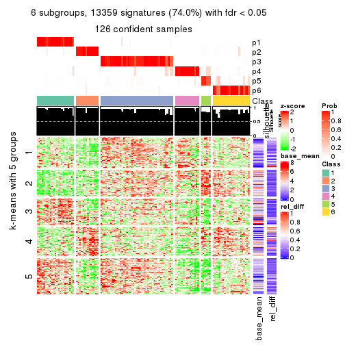</p>

</div>
</div>


Signature heatmaps where rows are not scaled:


<script>
$( function() {
	$( '#tabs-ATC-mclust-get-signatures-no-scale' ).tabs();
} );
</script>
<div id='tabs-ATC-mclust-get-signatures-no-scale'>
<ul>
<li><a href='#tab-ATC-mclust-get-signatures-no-scale-1'>k = 2</a></li>
<li><a href='#tab-ATC-mclust-get-signatures-no-scale-2'>k = 3</a></li>
<li><a href='#tab-ATC-mclust-get-signatures-no-scale-3'>k = 4</a></li>
<li><a href='#tab-ATC-mclust-get-signatures-no-scale-4'>k = 5</a></li>
<li><a href='#tab-ATC-mclust-get-signatures-no-scale-5'>k = 6</a></li>
</ul>
<div id='tab-ATC-mclust-get-signatures-no-scale-1'>
<pre><code class="r">get_signatures(res, k = 2, scale_rows = FALSE)
</code></pre>

<p>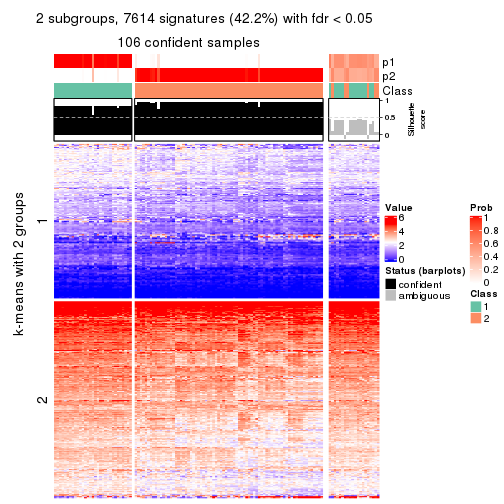</p>

</div>
<div id='tab-ATC-mclust-get-signatures-no-scale-2'>
<pre><code class="r">get_signatures(res, k = 3, scale_rows = FALSE)
</code></pre>

<p></p>

</div>
<div id='tab-ATC-mclust-get-signatures-no-scale-3'>
<pre><code class="r">get_signatures(res, k = 4, scale_rows = FALSE)
</code></pre>

<p></p>

</div>
<div id='tab-ATC-mclust-get-signatures-no-scale-4'>
<pre><code class="r">get_signatures(res, k = 5, scale_rows = FALSE)
</code></pre>

<p></p>

</div>
<div id='tab-ATC-mclust-get-signatures-no-scale-5'>
<pre><code class="r">get_signatures(res, k = 6, scale_rows = FALSE)
</code></pre>

<p></p>

</div>
</div>


Compare the overlap of signatures from different k:

```r
compare_signatures(res)
```


`get_signature()` returns a data frame invisibly. TO get the list of signatures, the function
call should be assigned to a variable explicitly. In following code, if `plot` argument is set
to `FALSE`, no heatmap is plotted while only the differential analysis is performed.

```r
# code only for demonstration
tb = get_signature(res, k = ..., plot = FALSE)
```

An example of the output of `tb` is:

```
#>   which_row         fdr    mean_1    mean_2 scaled_mean_1 scaled_mean_2 km
#> 1        38 0.042760348  8.373488  9.131774    -0.5533452     0.5164555  1
#> 2        40 0.018707592  7.106213  8.469186    -0.6173731     0.5762149  1
#> 3        55 0.019134737 10.221463 11.207825    -0.6159697     0.5749050  1
#> 4        59 0.006059896  5.921854  7.869574    -0.6899429     0.6439467  1
#> 5        60 0.018055526  8.928898 10.211722    -0.6204761     0.5791110  1
#> 6        98 0.009384629 15.714769 14.887706     0.6635654    -0.6193277  2
...
```

The columns in `tb` are:

1. `which_row`: row indices corresponding to the input matrix.
2. `fdr`: FDR for the differential test. 
3. `mean_x`: The mean value in group x.
4. `scaled_mean_x`: The mean value in group x after rows are scaled.
5. `km`: Row groups if k-means clustering is applied to rows.


UMAP plot which shows how samples are separated.


<script>
$( function() {
	$( '#tabs-ATC-mclust-dimension-reduction' ).tabs();
} );
</script>
<div id='tabs-ATC-mclust-dimension-reduction'>
<ul>
<li><a href='#tab-ATC-mclust-dimension-reduction-1'>k = 2</a></li>
<li><a href='#tab-ATC-mclust-dimension-reduction-2'>k = 3</a></li>
<li><a href='#tab-ATC-mclust-dimension-reduction-3'>k = 4</a></li>
<li><a href='#tab-ATC-mclust-dimension-reduction-4'>k = 5</a></li>
<li><a href='#tab-ATC-mclust-dimension-reduction-5'>k = 6</a></li>
</ul>
<div id='tab-ATC-mclust-dimension-reduction-1'>
<pre><code class="r">dimension_reduction(res, k = 2, method = &quot;UMAP&quot;)
</code></pre>

<p></p>

</div>
<div id='tab-ATC-mclust-dimension-reduction-2'>
<pre><code class="r">dimension_reduction(res, k = 3, method = &quot;UMAP&quot;)
</code></pre>

<p></p>

</div>
<div id='tab-ATC-mclust-dimension-reduction-3'>
<pre><code class="r">dimension_reduction(res, k = 4, method = &quot;UMAP&quot;)
</code></pre>

<p></p>

</div>
<div id='tab-ATC-mclust-dimension-reduction-4'>
<pre><code class="r">dimension_reduction(res, k = 5, method = &quot;UMAP&quot;)
</code></pre>

<p></p>

</div>
<div id='tab-ATC-mclust-dimension-reduction-5'>
<pre><code class="r">dimension_reduction(res, k = 6, method = &quot;UMAP&quot;)
</code></pre>

<p></p>

</div>
</div>


Following heatmap shows how subgroups are split when increasing `k`:

```r
collect_classes(res)
```


If matrix rows can be associated to genes, consider to use `GO_Enrichment(res,
...)` to perform function enrichment for the signature genes.


 

---------------------------------------------------


### ATC:NMF


The object with results only for a single top-value method and a single partition method 
can be extracted as:

```r
res = res_list["ATC", "NMF"]
# you can also extract it by
# res = res_list["ATC:NMF"]
```

A summary of `res` and all the functions that can be applied to it:

```r
res
```

```
#> A 'ConsensusPartition' object with k = 2, 3, 4, 5, 6.
#>   On a matrix with 18041 rows and 126 columns.
#>   Top rows (1000, 2000, 3000, 4000, 5000) are extracted by 'ATC' method.
#>   Subgroups are detected by 'NMF' method.
#>   Performed in total 1250 partitions by row resampling.
#>   Best k for subgroups seems to be 2.
#> 
#> Following methods can be applied to this 'ConsensusPartition' object:
#>  [1] "cola_report"             "collect_classes"         "collect_plots"          
#>  [4] "collect_stats"           "colnames"                "compare_signatures"     
#>  [7] "consensus_heatmap"       "dimension_reduction"     "functional_enrichment"  
#> [10] "get_anno_col"            "get_anno"                "get_classes"            
#> [13] "get_consensus"           "get_matrix"              "get_membership"         
#> [16] "get_param"               "get_signatures"          "get_stats"              
#> [19] "is_best_k"               "is_stable_k"             "membership_heatmap"     
#> [22] "ncol"                    "nrow"                    "plot_ecdf"              
#> [25] "rownames"                "select_partition_number" "show"                   
#> [28] "suggest_best_k"          "test_to_known_factors"
```

`collect_plots()` function collects all the plots made from `res` for all `k` (number of partitions)
into one single page to provide an easy and fast comparison between different `k`.

```r
collect_plots(res)
```


The plots are:

- The first row: a plot of the ECDF (Empirical cumulative distribution
  function) curves of the consensus matrix for each `k` and the heatmap of
  predicted classes for each `k`.
- The second row: heatmaps of the consensus matrix for each `k`.
- The third row: heatmaps of the membership matrix for each `k`.
- The fouth row: heatmaps of the signatures for each `k`.

All the plots in panels can be made by individual functions and they are
plotted later in this section.

`select_partition_number()` produces several plots showing different
statistics for choosing "optimized" `k`. There are following statistics:

- ECDF curves of the consensus matrix for each `k`;
- 1-PAC. [The PAC
  score](https://en.wikipedia.org/wiki/Consensus_clustering#Over-interpretation_potential_of_consensus_clustering)
  measures the proportion of the ambiguous subgrouping.
- Mean silhouette score.
- Concordance. The mean probability of fiting the consensus class ids in all
  partitions.
- Area increased. Denote $A_k$ as the area under the ECDF curve for current
  `k`, the area increased is defined as $A_k - A_{k-1}$.
- Rand index. The percent of pairs of samples that are both in a same cluster
  or both are not in a same cluster in the partition of k and k-1.
- Jaccard index. The ratio of pairs of samples are both in a same cluster in
  the partition of k and k-1 and the pairs of samples are both in a same
  cluster in the partition k or k-1.

The detailed explanations of these statistics can be found in [the cola
vignette](http://bioconductor.org/packages/devel/bioc/vignettes/cola/inst/doc/cola.html#toc_13).

Generally speaking, lower PAC score, higher mean silhouette score or higher
concordance corresponds to better partition. Rand index and Jaccard index
measure how similar the current partition is compared to partition with `k-1`.
If they are too similar, we won't accept `k` is better than `k-1`.

```r
select_partition_number(res)
```


The numeric values for all these statistics can be obtained by `get_stats()`.

```r
get_stats(res)
```

```
#>   k 1-PAC mean_silhouette concordance area_increased  Rand Jaccard
#> 2 2 0.780           0.872       0.946         0.4500 0.537   0.537
#> 3 3 0.705           0.830       0.927         0.3136 0.713   0.526
#> 4 4 0.555           0.615       0.800         0.2294 0.779   0.486
#> 5 5 0.524           0.496       0.712         0.0576 0.815   0.461
#> 6 6 0.562           0.472       0.696         0.0458 0.854   0.526
```

`suggest_best_k()` suggests the best $k$ based on these statistics. The rules are as follows:

- All $k$ with Jaccard index larger than 0.95 are removed because the increase of
  the partition number does not provides enough extra information. If all $k$ are removed,
  the best $k$ is assigned by `NA`.
- For $k$ with 1-PAC larger than 0.9, the maximal $k$ is taken as the "best k". Other $k$ is called "optional k".
- If it does not fit the second rule. The $k$ with the highest vote of highest
  1-PAC, mean silhouette and concordance is taken as the "best k".

```r
suggest_best_k(res)
```

```
#> [1] 2
```


Following shows the table of the partitions (You need to click the **show/hide
code output** link to see it). The membership matrix (columns with name `p*`)
is inferred by
[`clue::cl_consensus()`](https://www.rdocumentation.org/link/cl_consensus?package=clue)
function with the `SE` method. Basically the value in the membership matrix
represents the probability to belong to a certain group. The finall class
label for an item is determined with the group with highest probability it
belongs to.

In `get_classes()` function, the entropy is calculated from the membership
matrix and the silhouette score is calculated from the consensus matrix.


<script>
$( function() {
	$( '#tabs-ATC-NMF-get-classes' ).tabs();
} );
</script>
<div id='tabs-ATC-NMF-get-classes'>
<ul>
<li><a href='#tab-ATC-NMF-get-classes-1'>k = 2</a></li>
<li><a href='#tab-ATC-NMF-get-classes-2'>k = 3</a></li>
<li><a href='#tab-ATC-NMF-get-classes-3'>k = 4</a></li>
<li><a href='#tab-ATC-NMF-get-classes-4'>k = 5</a></li>
<li><a href='#tab-ATC-NMF-get-classes-5'>k = 6</a></li>
</ul>

<div id='tab-ATC-NMF-get-classes-1'>
<p><a id='tab-ATC-NMF-get-classes-1-a' style='color:#0366d6' href='#'>show/hide code output</a></p>
<pre><code class="r">cbind(get_classes(res, k = 2), get_membership(res, k = 2))
</code></pre>

<pre><code>#&gt;                                      class entropy silhouette    p1    p2
#&gt; DC1F29A2-39DE-44AD-936A-54B2B32D6370     1  0.0000     0.9622 1.000 0.000
#&gt; FA3C3413-FA8C-4A29-B9CA-5BC3A56274A8     2  0.6048     0.8030 0.148 0.852
#&gt; B9B72975-8134-475C-BC0B-0CFDB24F636A     2  0.0000     0.8987 0.000 1.000
#&gt; F44DB757-4D00-4BFC-99C5-AA82F99C5BDA     1  0.0000     0.9622 1.000 0.000
#&gt; 3BD942BB-A3A7-4993-B3F1-B8641626B773     1  0.0000     0.9622 1.000 0.000
#&gt; 431F73A2-2AB3-4101-B610-7FC02A7097EC     1  0.0000     0.9622 1.000 0.000
#&gt; 3067683D-43D4-4F6D-9338-17F6A75E4B25     1  0.0000     0.9622 1.000 0.000
#&gt; 2CE91B81-7CBE-4698-AFEE-6A154313D231     2  0.0000     0.8987 0.000 1.000
#&gt; A639CF4F-4591-4337-A12E-BED71EDDA10B     1  0.0000     0.9622 1.000 0.000
#&gt; 5482053D-9F48-4773-B68A-302B3A612503     1  0.0000     0.9622 1.000 0.000
#&gt; A31D342D-C67C-428B-BAED-C6E844277A09     2  0.0000     0.8987 0.000 1.000
#&gt; 0E9C5985-9AE0-4098-A076-6FFBBDF05110     1  0.0000     0.9622 1.000 0.000
#&gt; 08CCF8A0-15B7-4A13-BC43-6B3B3E2DDE95     2  0.6712     0.7793 0.176 0.824
#&gt; 10577D5B-AD56-403F-A562-73A9ACF2045B     1  0.0000     0.9622 1.000 0.000
#&gt; C940D443-5DDA-4403-868B-7AA6B9A50FC4     1  0.0000     0.9622 1.000 0.000
#&gt; 89D4D945-A717-495F-B253-F5A17CF5B9FA     1  0.0000     0.9622 1.000 0.000
#&gt; DC55EE78-203F-4092-9B83-14B1A529194B     2  0.0000     0.8987 0.000 1.000
#&gt; 8F7368BE-EB41-4192-89AA-9E0428C08851     1  0.8909     0.4952 0.692 0.308
#&gt; F772EA39-E408-4908-BADD-C786D702BF9B     2  0.0000     0.8987 0.000 1.000
#&gt; FD693D10-3ADA-4028-8392-41D2F0296F7E     1  0.9963    -0.0194 0.536 0.464
#&gt; 84F16966-7640-49F9-95D1-7648FF74DCC9     2  0.0000     0.8987 0.000 1.000
#&gt; D26DAA2F-AE6A-42E1-9F1F-01943B99785F     2  0.0000     0.8987 0.000 1.000
#&gt; F325847E-F046-4B67-B01C-16919C401020     1  0.0000     0.9622 1.000 0.000
#&gt; 19EB2B10-2529-4A94-8FAE-1CE371A602D9     1  0.0000     0.9622 1.000 0.000
#&gt; B94B9CCF-5FB8-44AE-8D9C-A194C6801A27     2  0.0000     0.8987 0.000 1.000
#&gt; D2678E70-542A-4AB2-B881-12D66DBA44F5     1  0.9209     0.4213 0.664 0.336
#&gt; 4961CA2A-70CD-42AB-A676-4A98C85F449F     1  0.6148     0.7847 0.848 0.152
#&gt; 5AA74C5C-2AD1-4D59-A030-E964EB199581     1  0.0000     0.9622 1.000 0.000
#&gt; F9E11A1B-BD93-438F-9670-6FB7DFF9E910     1  0.0000     0.9622 1.000 0.000
#&gt; FB78CA5A-C8B9-42AF-9DAE-799CAB280B2E     1  0.0000     0.9622 1.000 0.000
#&gt; A8E48877-F8AB-44DD-A18B-194D87C44931     2  0.9358     0.5404 0.352 0.648
#&gt; CA50C495-F37E-4743-867D-FAF2DCC3376A     1  0.9775     0.1875 0.588 0.412
#&gt; 37342369-EC22-4904-8CCD-A0DC6BD8D183     2  0.0000     0.8987 0.000 1.000
#&gt; 91BA5F90-9174-4533-A050-39A28E34A94D     1  0.0000     0.9622 1.000 0.000
#&gt; 5BC371AC-1915-44E9-A114-2963E131EC8D     2  0.0000     0.8987 0.000 1.000
#&gt; 74A6C31A-7F21-45AF-A170-18C326D2AE69     1  0.0000     0.9622 1.000 0.000
#&gt; 984F27EF-D4D7-4E68-BD64-776FDFC04D07     1  0.0000     0.9622 1.000 0.000
#&gt; B05701C5-8C44-4FD1-94C9-FC0255A2EA24     1  0.0000     0.9622 1.000 0.000
#&gt; 91E4119C-2CE6-4447-A125-6A4F403A89E6     1  0.0000     0.9622 1.000 0.000
#&gt; 1570FCE7-F1B4-4BDF-A398-355EDF030864     1  0.0000     0.9622 1.000 0.000
#&gt; 604C06E9-A00E-435E-847A-3992922A5C56     1  0.0000     0.9622 1.000 0.000
#&gt; 455C9007-6FF4-4D63-83FA-4915F0331F9A     1  0.0000     0.9622 1.000 0.000
#&gt; FB8BD3CF-D2EC-47B6-B67F-65ADC1C3A6A7     2  0.9850     0.3670 0.428 0.572
#&gt; 9DC7443A-3C8F-4025-8312-3C98BF28D736     1  0.0000     0.9622 1.000 0.000
#&gt; CB207A52-09AC-49D3-8240-5840CDFBB154     1  0.0000     0.9622 1.000 0.000
#&gt; 2A335049-AD9F-4B32-92B7-69B04B0CF2BA     1  0.0000     0.9622 1.000 0.000
#&gt; 6ACA6293-371E-428D-BBAE-ABFD410C886F     2  0.8713     0.6420 0.292 0.708
#&gt; E8929929-73F9-4DB7-ABBA-0852BEFFFF7E     2  0.2778     0.8733 0.048 0.952
#&gt; 5E343116-414B-41F2-AAEE-A3225450135A     1  0.0000     0.9622 1.000 0.000
#&gt; 0A39073C-157C-48A1-B125-A6A04CB738DA     2  0.6887     0.7721 0.184 0.816
#&gt; 300D78E6-1C7E-4114-80EA-9204A6818B9A     1  0.0000     0.9622 1.000 0.000
#&gt; DAAF55AA-ED48-4221-9CD6-D1DEB6376017     2  0.1414     0.8892 0.020 0.980
#&gt; D76FCF4A-4ACF-41EF-A120-64136D6C845E     1  0.0000     0.9622 1.000 0.000
#&gt; AD294665-6F90-459C-90D5-3058F210225D     1  0.0000     0.9622 1.000 0.000
#&gt; 92E8AD7A-1084-44C8-BDC0-FE4E47B6143F     1  0.0000     0.9622 1.000 0.000
#&gt; 5644A861-3C59-486D-8FBE-4DF6A3B19558     1  0.0000     0.9622 1.000 0.000
#&gt; 1BF8AAE7-B771-4CF2-8B1C-D2BEB5E6579E     1  0.0000     0.9622 1.000 0.000
#&gt; A54731AE-FC40-407F-8D10-67DDC122237D     2  0.0000     0.8987 0.000 1.000
#&gt; 179DC906-5654-4CBA-9C27-C9560B5F12DE     1  0.0000     0.9622 1.000 0.000
#&gt; 979B9A2B-2D81-47C3-A553-9B9441CAAE47     1  0.0000     0.9622 1.000 0.000
#&gt; D69BD86A-08FB-49DA-9084-2725F6C9195F     1  0.0000     0.9622 1.000 0.000
#&gt; 84611033-BCF7-49D7-9B91-DA29B62AC8D3     1  0.0000     0.9622 1.000 0.000
#&gt; 8AA1DA3E-8C00-4653-AA33-EA70531C1E50     2  0.0000     0.8987 0.000 1.000
#&gt; CEBE9594-0F19-46B4-AF7D-F8DF33E00AFB     1  0.0000     0.9622 1.000 0.000
#&gt; C68E82D2-2BD3-41E9-92D7-D4C06E1953B2     1  0.0000     0.9622 1.000 0.000
#&gt; B855EF89-1E76-4408-AA65-61A0F0A4F412     2  0.0000     0.8987 0.000 1.000
#&gt; 4488EFB3-5B01-41E3-B57E-8E4F607CF448     1  0.0000     0.9622 1.000 0.000
#&gt; C2BD8440-CAC6-4FE5-8EBB-5E6AE308D52F     1  0.0000     0.9622 1.000 0.000
#&gt; E0E50F10-1FED-41C1-84DB-81A46F25D7E9     2  0.7453     0.7436 0.212 0.788
#&gt; EE16D845-31F2-4178-800B-CA2C358841AD     1  0.6247     0.7890 0.844 0.156
#&gt; 169828CF-5693-4A46-B5D7-E45CBA9DF317     2  0.0000     0.8987 0.000 1.000
#&gt; 51077BA3-AEE0-4BD4-A1B1-1B0A811642A1     1  0.0000     0.9622 1.000 0.000
#&gt; D2F4E240-C44C-4CF7-8016-6CACD370D093     1  0.0000     0.9622 1.000 0.000
#&gt; 721CDBE6-FC85-4C30-B23E-28407340286F     1  0.0000     0.9622 1.000 0.000
#&gt; 392897E4-6009-422C-B461-649F4DDF260C     1  0.4562     0.8594 0.904 0.096
#&gt; 617E13D2-6924-45F8-A8DE-BE21B718F822     1  0.0000     0.9622 1.000 0.000
#&gt; 5746C00F-9CBB-46B7-83FD-90B2AB3F507B     1  0.0000     0.9622 1.000 0.000
#&gt; 982B4344-A223-4D1F-9485-2E56F9FD45C0     2  0.0000     0.8987 0.000 1.000
#&gt; E5557F52-015D-49DC-9E23-989FC259976F     1  0.0000     0.9622 1.000 0.000
#&gt; F3135F5E-2E90-4923-B634-E994563D17B7     1  0.0000     0.9622 1.000 0.000
#&gt; D1ED15A5-9802-4314-B556-E89EB772D1F0     1  0.0000     0.9622 1.000 0.000
#&gt; 222B06E3-FCFB-4104-92C3-D73BC31854D4     1  0.0000     0.9622 1.000 0.000
#&gt; 4C810FFA-ED07-4F4C-9F81-B8F1CF4956F7     2  0.0000     0.8987 0.000 1.000
#&gt; 9A608964-ED12-4E6E-9D3A-430F59FFF65B     1  0.0000     0.9622 1.000 0.000
#&gt; 4087357F-C17A-4992-A8AB-41ACA2F72001     1  0.9522     0.3196 0.628 0.372
#&gt; B3F013A5-BCB8-4CE0-86B2-634EE180AA6E     2  0.0000     0.8987 0.000 1.000
#&gt; 322AF320-1379-4F51-AFDC-5292A060CD52     2  0.0376     0.8971 0.004 0.996
#&gt; 53A96249-66D5-4C26-893B-ADC71481D261     2  0.0000     0.8987 0.000 1.000
#&gt; 1AB7A6F2-14BD-447C-B2E3-DEB0CE56B209     1  0.0000     0.9622 1.000 0.000
#&gt; 8B4BCDA0-6787-4A55-99F7-AAF22AF85BA6     2  0.0000     0.8987 0.000 1.000
#&gt; 5D9D9E08-2C2C-414E-9547-62799F90D543     2  0.0000     0.8987 0.000 1.000
#&gt; C345CD17-E4F4-41D5-9891-FEFB19342C52     1  0.0000     0.9622 1.000 0.000
#&gt; 1AF8FDE1-1A74-41F6-A1C5-4952CDFB7D3F     1  0.0000     0.9622 1.000 0.000
#&gt; BC3405FF-0660-4B2B-8DC1-5F34D3133078     1  0.0000     0.9622 1.000 0.000
#&gt; C2662596-6E2F-4924-B051-CEA1AC87B197     1  0.0000     0.9622 1.000 0.000
#&gt; 39AE85F7-49FB-4438-BD41-6AC812FA1C72     1  0.0000     0.9622 1.000 0.000
#&gt; 6FF266DB-3F08-43F2-8F6F-679F805B80B8     2  0.9000     0.6045 0.316 0.684
#&gt; B03B7B81-BBD6-4194-BC5E-6EDF0D3F015A     2  0.0000     0.8987 0.000 1.000
#&gt; C7617D56-F13C-4C43-906C-BD458C5DC4CD     2  0.9998     0.1645 0.492 0.508
#&gt; 09420F8B-7A71-4B32-8388-4767670F1FEB     1  0.0000     0.9622 1.000 0.000
#&gt; 6AF47534-74FF-4128-865B-4E8EE1FFB469     2  0.0000     0.8987 0.000 1.000
#&gt; 8FF9E94A-2ED2-4727-947F-D524D7ECE815     1  0.0000     0.9622 1.000 0.000
#&gt; A390E20D-03F9-40E4-A132-0FA5C2BEDB63     1  0.0000     0.9622 1.000 0.000
#&gt; A489CCCA-1374-4071-80CE-05B83C9A0D5E     2  0.0376     0.8971 0.004 0.996
#&gt; 2D962371-EC83-490C-A663-478AF383BC1B     2  0.0000     0.8987 0.000 1.000
#&gt; D91B31A1-EE71-4726-B94C-0CC2815E9D4E     1  0.0000     0.9622 1.000 0.000
#&gt; E0123C5C-E1D1-4162-9895-CC8B01949D84     2  0.9427     0.5254 0.360 0.640
#&gt; EC73959A-2728-49FE-B72A-790BB14F4CBF     1  0.0000     0.9622 1.000 0.000
#&gt; A60DC925-7343-496E-900D-0DD81D5C8123     2  0.9795     0.4002 0.416 0.584
#&gt; 659B64DB-F4A5-43BD-811B-05004CB49D99     1  0.0000     0.9622 1.000 0.000
#&gt; 6969B6B2-7616-4664-9696-C4DACD10537B     2  0.0000     0.8987 0.000 1.000
#&gt; 2F6392DE-0D54-4768-B062-907C81E5B0CC     1  0.0672     0.9547 0.992 0.008
#&gt; C74BE8C5-BA6D-4596-9D67-3C731799F999     2  0.8443     0.6707 0.272 0.728
#&gt; 79A7647F-BDBA-45A2-B207-ABF788F6CC95     1  0.0000     0.9622 1.000 0.000
#&gt; D47D0433-2313-4A2F-B268-5AD293D7534E     2  0.0000     0.8987 0.000 1.000
#&gt; C5058B93-C1DA-43B9-9951-B23A9810AA6E     1  0.0000     0.9622 1.000 0.000
#&gt; 2629FEE3-A203-4411-8A70-02A796C9505C     2  0.0000     0.8987 0.000 1.000
#&gt; 1AF329E4-11D4-4CFC-801F-C24A1EA33102     1  0.3879     0.8869 0.924 0.076
#&gt; D453BEF8-3F18-4B89-BA42-CE74EB105032     1  0.0000     0.9622 1.000 0.000
#&gt; B12A4446-2310-4139-897F-CA030478CBD5     1  0.0000     0.9622 1.000 0.000
#&gt; BCAB1918-5FA9-4CBD-85CB-008743FEA2CC     1  0.0000     0.9622 1.000 0.000
#&gt; 9A5432D3-19EE-47B4-BD88-698DEC75A5E9     2  0.0000     0.8987 0.000 1.000
#&gt; A608BCEB-2C27-4927-A308-E6975F641722     1  0.8016     0.6479 0.756 0.244
#&gt; E4752275-7BF6-4C1E-8A45-C7D571ED85AD     2  0.0000     0.8987 0.000 1.000
#&gt; FDEC1714-C02D-4AB7-AE82-789E9D709EDE     1  0.0000     0.9622 1.000 0.000
#&gt; 33737781-8638-4FA2-AD4C-E888BB9343D8     2  0.9795     0.3982 0.416 0.584
</code></pre>

<script>
$('#tab-ATC-NMF-get-classes-1-a').parent().next().next().hide();
$('#tab-ATC-NMF-get-classes-1-a').click(function(){
  $('#tab-ATC-NMF-get-classes-1-a').parent().next().next().toggle();
  return(false);
});
</script>
</div>

<div id='tab-ATC-NMF-get-classes-2'>
<p><a id='tab-ATC-NMF-get-classes-2-a' style='color:#0366d6' href='#'>show/hide code output</a></p>
<pre><code class="r">cbind(get_classes(res, k = 3), get_membership(res, k = 3))
</code></pre>

<pre><code>#&gt;                                      class entropy silhouette    p1    p2    p3
#&gt; DC1F29A2-39DE-44AD-936A-54B2B32D6370     3  0.0000     0.9379 0.000 0.000 1.000
#&gt; FA3C3413-FA8C-4A29-B9CA-5BC3A56274A8     2  0.4178     0.7297 0.000 0.828 0.172
#&gt; B9B72975-8134-475C-BC0B-0CFDB24F636A     2  0.0000     0.9168 0.000 1.000 0.000
#&gt; F44DB757-4D00-4BFC-99C5-AA82F99C5BDA     3  0.3816     0.7994 0.000 0.148 0.852
#&gt; 3BD942BB-A3A7-4993-B3F1-B8641626B773     3  0.0000     0.9379 0.000 0.000 1.000
#&gt; 431F73A2-2AB3-4101-B610-7FC02A7097EC     3  0.0000     0.9379 0.000 0.000 1.000
#&gt; 3067683D-43D4-4F6D-9338-17F6A75E4B25     3  0.0000     0.9379 0.000 0.000 1.000
#&gt; 2CE91B81-7CBE-4698-AFEE-6A154313D231     2  0.0000     0.9168 0.000 1.000 0.000
#&gt; A639CF4F-4591-4337-A12E-BED71EDDA10B     3  0.0000     0.9379 0.000 0.000 1.000
#&gt; 5482053D-9F48-4773-B68A-302B3A612503     3  0.0000     0.9379 0.000 0.000 1.000
#&gt; A31D342D-C67C-428B-BAED-C6E844277A09     1  0.0000     0.8239 1.000 0.000 0.000
#&gt; 0E9C5985-9AE0-4098-A076-6FFBBDF05110     3  0.0000     0.9379 0.000 0.000 1.000
#&gt; 08CCF8A0-15B7-4A13-BC43-6B3B3E2DDE95     2  0.5216     0.6078 0.000 0.740 0.260
#&gt; 10577D5B-AD56-403F-A562-73A9ACF2045B     3  0.0000     0.9379 0.000 0.000 1.000
#&gt; C940D443-5DDA-4403-868B-7AA6B9A50FC4     3  0.0000     0.9379 0.000 0.000 1.000
#&gt; 89D4D945-A717-495F-B253-F5A17CF5B9FA     2  0.4002     0.7449 0.000 0.840 0.160
#&gt; DC55EE78-203F-4092-9B83-14B1A529194B     2  0.0000     0.9168 0.000 1.000 0.000
#&gt; 8F7368BE-EB41-4192-89AA-9E0428C08851     1  0.5968     0.5324 0.636 0.000 0.364
#&gt; F772EA39-E408-4908-BADD-C786D702BF9B     2  0.0000     0.9168 0.000 1.000 0.000
#&gt; FD693D10-3ADA-4028-8392-41D2F0296F7E     1  0.0000     0.8239 1.000 0.000 0.000
#&gt; 84F16966-7640-49F9-95D1-7648FF74DCC9     2  0.0000     0.9168 0.000 1.000 0.000
#&gt; D26DAA2F-AE6A-42E1-9F1F-01943B99785F     1  0.0000     0.8239 1.000 0.000 0.000
#&gt; F325847E-F046-4B67-B01C-16919C401020     3  0.0000     0.9379 0.000 0.000 1.000
#&gt; 19EB2B10-2529-4A94-8FAE-1CE371A602D9     3  0.0000     0.9379 0.000 0.000 1.000
#&gt; B94B9CCF-5FB8-44AE-8D9C-A194C6801A27     1  0.5678     0.5433 0.684 0.316 0.000
#&gt; D2678E70-542A-4AB2-B881-12D66DBA44F5     1  0.0000     0.8239 1.000 0.000 0.000
#&gt; 4961CA2A-70CD-42AB-A676-4A98C85F449F     3  0.1163     0.9177 0.028 0.000 0.972
#&gt; 5AA74C5C-2AD1-4D59-A030-E964EB199581     3  0.0000     0.9379 0.000 0.000 1.000
#&gt; F9E11A1B-BD93-438F-9670-6FB7DFF9E910     3  0.0000     0.9379 0.000 0.000 1.000
#&gt; FB78CA5A-C8B9-42AF-9DAE-799CAB280B2E     3  0.0000     0.9379 0.000 0.000 1.000
#&gt; A8E48877-F8AB-44DD-A18B-194D87C44931     3  0.5722     0.5509 0.292 0.004 0.704
#&gt; CA50C495-F37E-4743-867D-FAF2DCC3376A     1  0.5058     0.7319 0.756 0.000 0.244
#&gt; 37342369-EC22-4904-8CCD-A0DC6BD8D183     1  0.2261     0.7970 0.932 0.068 0.000
#&gt; 91BA5F90-9174-4533-A050-39A28E34A94D     3  0.0000     0.9379 0.000 0.000 1.000
#&gt; 5BC371AC-1915-44E9-A114-2963E131EC8D     1  0.0000     0.8239 1.000 0.000 0.000
#&gt; 74A6C31A-7F21-45AF-A170-18C326D2AE69     3  0.3752     0.8010 0.144 0.000 0.856
#&gt; 984F27EF-D4D7-4E68-BD64-776FDFC04D07     1  0.4796     0.7586 0.780 0.000 0.220
#&gt; B05701C5-8C44-4FD1-94C9-FC0255A2EA24     3  0.6140     0.2446 0.404 0.000 0.596
#&gt; 91E4119C-2CE6-4447-A125-6A4F403A89E6     3  0.0000     0.9379 0.000 0.000 1.000
#&gt; 1570FCE7-F1B4-4BDF-A398-355EDF030864     2  0.6307     0.0338 0.000 0.512 0.488
#&gt; 604C06E9-A00E-435E-847A-3992922A5C56     3  0.0000     0.9379 0.000 0.000 1.000
#&gt; 455C9007-6FF4-4D63-83FA-4915F0331F9A     3  0.0000     0.9379 0.000 0.000 1.000
#&gt; FB8BD3CF-D2EC-47B6-B67F-65ADC1C3A6A7     3  0.5988     0.3599 0.368 0.000 0.632
#&gt; 9DC7443A-3C8F-4025-8312-3C98BF28D736     1  0.4796     0.7580 0.780 0.000 0.220
#&gt; CB207A52-09AC-49D3-8240-5840CDFBB154     3  0.0000     0.9379 0.000 0.000 1.000
#&gt; 2A335049-AD9F-4B32-92B7-69B04B0CF2BA     3  0.0000     0.9379 0.000 0.000 1.000
#&gt; 6ACA6293-371E-428D-BBAE-ABFD410C886F     2  0.5760     0.5079 0.000 0.672 0.328
#&gt; E8929929-73F9-4DB7-ABBA-0852BEFFFF7E     1  0.0000     0.8239 1.000 0.000 0.000
#&gt; 5E343116-414B-41F2-AAEE-A3225450135A     1  0.5706     0.6208 0.680 0.000 0.320
#&gt; 0A39073C-157C-48A1-B125-A6A04CB738DA     1  0.4452     0.7751 0.808 0.000 0.192
#&gt; 300D78E6-1C7E-4114-80EA-9204A6818B9A     3  0.0000     0.9379 0.000 0.000 1.000
#&gt; DAAF55AA-ED48-4221-9CD6-D1DEB6376017     1  0.1860     0.8224 0.948 0.000 0.052
#&gt; D76FCF4A-4ACF-41EF-A120-64136D6C845E     3  0.0000     0.9379 0.000 0.000 1.000
#&gt; AD294665-6F90-459C-90D5-3058F210225D     3  0.0000     0.9379 0.000 0.000 1.000
#&gt; 92E8AD7A-1084-44C8-BDC0-FE4E47B6143F     3  0.0000     0.9379 0.000 0.000 1.000
#&gt; 5644A861-3C59-486D-8FBE-4DF6A3B19558     3  0.0000     0.9379 0.000 0.000 1.000
#&gt; 1BF8AAE7-B771-4CF2-8B1C-D2BEB5E6579E     3  0.0000     0.9379 0.000 0.000 1.000
#&gt; A54731AE-FC40-407F-8D10-67DDC122237D     2  0.0000     0.9168 0.000 1.000 0.000
#&gt; 179DC906-5654-4CBA-9C27-C9560B5F12DE     3  0.5254     0.6160 0.264 0.000 0.736
#&gt; 979B9A2B-2D81-47C3-A553-9B9441CAAE47     3  0.0000     0.9379 0.000 0.000 1.000
#&gt; D69BD86A-08FB-49DA-9084-2725F6C9195F     3  0.1289     0.9147 0.032 0.000 0.968
#&gt; 84611033-BCF7-49D7-9B91-DA29B62AC8D3     3  0.0000     0.9379 0.000 0.000 1.000
#&gt; 8AA1DA3E-8C00-4653-AA33-EA70531C1E50     2  0.0000     0.9168 0.000 1.000 0.000
#&gt; CEBE9594-0F19-46B4-AF7D-F8DF33E00AFB     3  0.2165     0.8867 0.064 0.000 0.936
#&gt; C68E82D2-2BD3-41E9-92D7-D4C06E1953B2     3  0.0000     0.9379 0.000 0.000 1.000
#&gt; B855EF89-1E76-4408-AA65-61A0F0A4F412     2  0.0000     0.9168 0.000 1.000 0.000
#&gt; 4488EFB3-5B01-41E3-B57E-8E4F607CF448     3  0.0000     0.9379 0.000 0.000 1.000
#&gt; C2BD8440-CAC6-4FE5-8EBB-5E6AE308D52F     3  0.0000     0.9379 0.000 0.000 1.000
#&gt; E0E50F10-1FED-41C1-84DB-81A46F25D7E9     1  0.0000     0.8239 1.000 0.000 0.000
#&gt; EE16D845-31F2-4178-800B-CA2C358841AD     2  0.0237     0.9144 0.000 0.996 0.004
#&gt; 169828CF-5693-4A46-B5D7-E45CBA9DF317     2  0.1860     0.8689 0.052 0.948 0.000
#&gt; 51077BA3-AEE0-4BD4-A1B1-1B0A811642A1     3  0.4399     0.7433 0.188 0.000 0.812
#&gt; D2F4E240-C44C-4CF7-8016-6CACD370D093     3  0.0000     0.9379 0.000 0.000 1.000
#&gt; 721CDBE6-FC85-4C30-B23E-28407340286F     3  0.1411     0.9114 0.036 0.000 0.964
#&gt; 392897E4-6009-422C-B461-649F4DDF260C     1  0.5678     0.6275 0.684 0.000 0.316
#&gt; 617E13D2-6924-45F8-A8DE-BE21B718F822     1  0.4796     0.7580 0.780 0.000 0.220
#&gt; 5746C00F-9CBB-46B7-83FD-90B2AB3F507B     3  0.0000     0.9379 0.000 0.000 1.000
#&gt; 982B4344-A223-4D1F-9485-2E56F9FD45C0     2  0.0000     0.9168 0.000 1.000 0.000
#&gt; E5557F52-015D-49DC-9E23-989FC259976F     3  0.0000     0.9379 0.000 0.000 1.000
#&gt; F3135F5E-2E90-4923-B634-E994563D17B7     3  0.0000     0.9379 0.000 0.000 1.000
#&gt; D1ED15A5-9802-4314-B556-E89EB772D1F0     3  0.0237     0.9351 0.004 0.000 0.996
#&gt; 222B06E3-FCFB-4104-92C3-D73BC31854D4     3  0.0000     0.9379 0.000 0.000 1.000
#&gt; 4C810FFA-ED07-4F4C-9F81-B8F1CF4956F7     1  0.0000     0.8239 1.000 0.000 0.000
#&gt; 9A608964-ED12-4E6E-9D3A-430F59FFF65B     3  0.0000     0.9379 0.000 0.000 1.000
#&gt; 4087357F-C17A-4992-A8AB-41ACA2F72001     1  0.2165     0.8203 0.936 0.000 0.064
#&gt; B3F013A5-BCB8-4CE0-86B2-634EE180AA6E     2  0.0000     0.9168 0.000 1.000 0.000
#&gt; 322AF320-1379-4F51-AFDC-5292A060CD52     2  0.0237     0.9143 0.000 0.996 0.004
#&gt; 53A96249-66D5-4C26-893B-ADC71481D261     1  0.0000     0.8239 1.000 0.000 0.000
#&gt; 1AB7A6F2-14BD-447C-B2E3-DEB0CE56B209     3  0.0000     0.9379 0.000 0.000 1.000
#&gt; 8B4BCDA0-6787-4A55-99F7-AAF22AF85BA6     2  0.0000     0.9168 0.000 1.000 0.000
#&gt; 5D9D9E08-2C2C-414E-9547-62799F90D543     2  0.0000     0.9168 0.000 1.000 0.000
#&gt; C345CD17-E4F4-41D5-9891-FEFB19342C52     3  0.0000     0.9379 0.000 0.000 1.000
#&gt; 1AF8FDE1-1A74-41F6-A1C5-4952CDFB7D3F     3  0.0000     0.9379 0.000 0.000 1.000
#&gt; BC3405FF-0660-4B2B-8DC1-5F34D3133078     3  0.6302    -0.0680 0.480 0.000 0.520
#&gt; C2662596-6E2F-4924-B051-CEA1AC87B197     3  0.0000     0.9379 0.000 0.000 1.000
#&gt; 39AE85F7-49FB-4438-BD41-6AC812FA1C72     3  0.0000     0.9379 0.000 0.000 1.000
#&gt; 6FF266DB-3F08-43F2-8F6F-679F805B80B8     1  0.3267     0.8047 0.884 0.000 0.116
#&gt; B03B7B81-BBD6-4194-BC5E-6EDF0D3F015A     1  0.0000     0.8239 1.000 0.000 0.000
#&gt; C7617D56-F13C-4C43-906C-BD458C5DC4CD     1  0.0747     0.8250 0.984 0.000 0.016
#&gt; 09420F8B-7A71-4B32-8388-4767670F1FEB     3  0.5254     0.6159 0.264 0.000 0.736
#&gt; 6AF47534-74FF-4128-865B-4E8EE1FFB469     2  0.0000     0.9168 0.000 1.000 0.000
#&gt; 8FF9E94A-2ED2-4727-947F-D524D7ECE815     1  0.5327     0.6956 0.728 0.000 0.272
#&gt; A390E20D-03F9-40E4-A132-0FA5C2BEDB63     1  0.6095     0.4656 0.608 0.000 0.392
#&gt; A489CCCA-1374-4071-80CE-05B83C9A0D5E     1  0.0000     0.8239 1.000 0.000 0.000
#&gt; 2D962371-EC83-490C-A663-478AF383BC1B     2  0.0000     0.9168 0.000 1.000 0.000
#&gt; D91B31A1-EE71-4726-B94C-0CC2815E9D4E     3  0.0000     0.9379 0.000 0.000 1.000
#&gt; E0123C5C-E1D1-4162-9895-CC8B01949D84     1  0.6307     0.1613 0.512 0.000 0.488
#&gt; EC73959A-2728-49FE-B72A-790BB14F4CBF     3  0.4452     0.7372 0.192 0.000 0.808
#&gt; A60DC925-7343-496E-900D-0DD81D5C8123     1  0.4504     0.7735 0.804 0.000 0.196
#&gt; 659B64DB-F4A5-43BD-811B-05004CB49D99     3  0.0000     0.9379 0.000 0.000 1.000
#&gt; 6969B6B2-7616-4664-9696-C4DACD10537B     1  0.3412     0.7609 0.876 0.124 0.000
#&gt; 2F6392DE-0D54-4768-B062-907C81E5B0CC     3  0.4121     0.7706 0.168 0.000 0.832
#&gt; C74BE8C5-BA6D-4596-9D67-3C731799F999     1  0.0000     0.8239 1.000 0.000 0.000
#&gt; 79A7647F-BDBA-45A2-B207-ABF788F6CC95     3  0.0000     0.9379 0.000 0.000 1.000
#&gt; D47D0433-2313-4A2F-B268-5AD293D7534E     2  0.0000     0.9168 0.000 1.000 0.000
#&gt; C5058B93-C1DA-43B9-9951-B23A9810AA6E     3  0.0000     0.9379 0.000 0.000 1.000
#&gt; 2629FEE3-A203-4411-8A70-02A796C9505C     1  0.0000     0.8239 1.000 0.000 0.000
#&gt; 1AF329E4-11D4-4CFC-801F-C24A1EA33102     2  0.0237     0.9144 0.000 0.996 0.004
#&gt; D453BEF8-3F18-4B89-BA42-CE74EB105032     3  0.0000     0.9379 0.000 0.000 1.000
#&gt; B12A4446-2310-4139-897F-CA030478CBD5     3  0.0000     0.9379 0.000 0.000 1.000
#&gt; BCAB1918-5FA9-4CBD-85CB-008743FEA2CC     3  0.0000     0.9379 0.000 0.000 1.000
#&gt; 9A5432D3-19EE-47B4-BD88-698DEC75A5E9     1  0.1529     0.8096 0.960 0.040 0.000
#&gt; A608BCEB-2C27-4927-A308-E6975F641722     2  0.0000     0.9168 0.000 1.000 0.000
#&gt; E4752275-7BF6-4C1E-8A45-C7D571ED85AD     2  0.0000     0.9168 0.000 1.000 0.000
#&gt; FDEC1714-C02D-4AB7-AE82-789E9D709EDE     3  0.5216     0.6234 0.260 0.000 0.740
#&gt; 33737781-8638-4FA2-AD4C-E888BB9343D8     3  0.3947     0.8478 0.076 0.040 0.884
</code></pre>

<script>
$('#tab-ATC-NMF-get-classes-2-a').parent().next().next().hide();
$('#tab-ATC-NMF-get-classes-2-a').click(function(){
  $('#tab-ATC-NMF-get-classes-2-a').parent().next().next().toggle();
  return(false);
});
</script>
</div>

<div id='tab-ATC-NMF-get-classes-3'>
<p><a id='tab-ATC-NMF-get-classes-3-a' style='color:#0366d6' href='#'>show/hide code output</a></p>
<pre><code class="r">cbind(get_classes(res, k = 4), get_membership(res, k = 4))
</code></pre>

<pre><code>#&gt;                                      class entropy silhouette    p1    p2    p3    p4
#&gt; DC1F29A2-39DE-44AD-936A-54B2B32D6370     1  0.4994    0.33292 0.520 0.000 0.480 0.000
#&gt; FA3C3413-FA8C-4A29-B9CA-5BC3A56274A8     2  0.1211    0.86657 0.040 0.960 0.000 0.000
#&gt; B9B72975-8134-475C-BC0B-0CFDB24F636A     2  0.0336    0.88822 0.000 0.992 0.008 0.000
#&gt; F44DB757-4D00-4BFC-99C5-AA82F99C5BDA     1  0.1890    0.74153 0.936 0.056 0.008 0.000
#&gt; 3BD942BB-A3A7-4993-B3F1-B8641626B773     1  0.3743    0.78673 0.824 0.000 0.160 0.016
#&gt; 431F73A2-2AB3-4101-B610-7FC02A7097EC     1  0.4888    0.49845 0.588 0.000 0.412 0.000
#&gt; 3067683D-43D4-4F6D-9338-17F6A75E4B25     1  0.4008    0.73343 0.756 0.000 0.244 0.000
#&gt; 2CE91B81-7CBE-4698-AFEE-6A154313D231     2  0.0188    0.88877 0.000 0.996 0.000 0.004
#&gt; A639CF4F-4591-4337-A12E-BED71EDDA10B     3  0.2814    0.68664 0.132 0.000 0.868 0.000
#&gt; 5482053D-9F48-4773-B68A-302B3A612503     3  0.2921    0.67753 0.140 0.000 0.860 0.000
#&gt; A31D342D-C67C-428B-BAED-C6E844277A09     4  0.4164    0.64259 0.000 0.000 0.264 0.736
#&gt; 0E9C5985-9AE0-4098-A076-6FFBBDF05110     1  0.2530    0.80386 0.896 0.004 0.100 0.000
#&gt; 08CCF8A0-15B7-4A13-BC43-6B3B3E2DDE95     2  0.1356    0.87120 0.008 0.960 0.032 0.000
#&gt; 10577D5B-AD56-403F-A562-73A9ACF2045B     1  0.0000    0.77850 1.000 0.000 0.000 0.000
#&gt; C940D443-5DDA-4403-868B-7AA6B9A50FC4     3  0.2281    0.70568 0.096 0.000 0.904 0.000
#&gt; 89D4D945-A717-495F-B253-F5A17CF5B9FA     2  0.0524    0.88645 0.008 0.988 0.004 0.000
#&gt; DC55EE78-203F-4092-9B83-14B1A529194B     2  0.0188    0.88873 0.000 0.996 0.000 0.004
#&gt; 8F7368BE-EB41-4192-89AA-9E0428C08851     1  0.5714    0.10469 0.552 0.004 0.020 0.424
#&gt; F772EA39-E408-4908-BADD-C786D702BF9B     2  0.0188    0.88874 0.000 0.996 0.004 0.000
#&gt; FD693D10-3ADA-4028-8392-41D2F0296F7E     4  0.4564    0.58271 0.000 0.000 0.328 0.672
#&gt; 84F16966-7640-49F9-95D1-7648FF74DCC9     2  0.0817    0.88260 0.000 0.976 0.000 0.024
#&gt; D26DAA2F-AE6A-42E1-9F1F-01943B99785F     4  0.1792    0.69570 0.000 0.000 0.068 0.932
#&gt; F325847E-F046-4B67-B01C-16919C401020     1  0.4877    0.51167 0.592 0.000 0.408 0.000
#&gt; 19EB2B10-2529-4A94-8FAE-1CE371A602D9     1  0.3569    0.77204 0.804 0.000 0.196 0.000
#&gt; B94B9CCF-5FB8-44AE-8D9C-A194C6801A27     4  0.2859    0.62901 0.000 0.112 0.008 0.880
#&gt; D2678E70-542A-4AB2-B881-12D66DBA44F5     4  0.4564    0.58520 0.000 0.000 0.328 0.672
#&gt; 4961CA2A-70CD-42AB-A676-4A98C85F449F     3  0.1520    0.68457 0.024 0.020 0.956 0.000
#&gt; 5AA74C5C-2AD1-4D59-A030-E964EB199581     1  0.1474    0.79779 0.948 0.000 0.052 0.000
#&gt; F9E11A1B-BD93-438F-9670-6FB7DFF9E910     1  0.4008    0.73083 0.756 0.000 0.244 0.000
#&gt; FB78CA5A-C8B9-42AF-9DAE-799CAB280B2E     1  0.3311    0.78467 0.828 0.000 0.172 0.000
#&gt; A8E48877-F8AB-44DD-A18B-194D87C44931     4  0.8832    0.23753 0.268 0.336 0.044 0.352
#&gt; CA50C495-F37E-4743-867D-FAF2DCC3376A     4  0.6273    0.57258 0.100 0.000 0.264 0.636
#&gt; 37342369-EC22-4904-8CCD-A0DC6BD8D183     4  0.2708    0.65525 0.040 0.028 0.016 0.916
#&gt; 91BA5F90-9174-4533-A050-39A28E34A94D     1  0.2345    0.80330 0.900 0.000 0.100 0.000
#&gt; 5BC371AC-1915-44E9-A114-2963E131EC8D     4  0.2973    0.69521 0.000 0.000 0.144 0.856
#&gt; 74A6C31A-7F21-45AF-A170-18C326D2AE69     3  0.7458    0.00517 0.176 0.000 0.444 0.380
#&gt; 984F27EF-D4D7-4E68-BD64-776FDFC04D07     3  0.2081    0.61945 0.000 0.000 0.916 0.084
#&gt; B05701C5-8C44-4FD1-94C9-FC0255A2EA24     3  0.6229   -0.03636 0.056 0.000 0.528 0.416
#&gt; 91E4119C-2CE6-4447-A125-6A4F403A89E6     3  0.4841    0.61079 0.080 0.140 0.780 0.000
#&gt; 1570FCE7-F1B4-4BDF-A398-355EDF030864     2  0.4401    0.59974 0.004 0.724 0.272 0.000
#&gt; 604C06E9-A00E-435E-847A-3992922A5C56     3  0.2469    0.70184 0.108 0.000 0.892 0.000
#&gt; 455C9007-6FF4-4D63-83FA-4915F0331F9A     3  0.6214   -0.19799 0.472 0.000 0.476 0.052
#&gt; FB8BD3CF-D2EC-47B6-B67F-65ADC1C3A6A7     3  0.2019    0.67017 0.004 0.032 0.940 0.024
#&gt; 9DC7443A-3C8F-4025-8312-3C98BF28D736     3  0.5290   -0.19118 0.008 0.000 0.516 0.476
#&gt; CB207A52-09AC-49D3-8240-5840CDFBB154     1  0.2921    0.79644 0.860 0.000 0.140 0.000
#&gt; 2A335049-AD9F-4B32-92B7-69B04B0CF2BA     1  0.0000    0.77850 1.000 0.000 0.000 0.000
#&gt; 6ACA6293-371E-428D-BBAE-ABFD410C886F     2  0.4164    0.60506 0.264 0.736 0.000 0.000
#&gt; E8929929-73F9-4DB7-ABBA-0852BEFFFF7E     4  0.3907    0.66348 0.000 0.000 0.232 0.768
#&gt; 5E343116-414B-41F2-AAEE-A3225450135A     4  0.5848    0.56933 0.228 0.000 0.088 0.684
#&gt; 0A39073C-157C-48A1-B125-A6A04CB738DA     4  0.2521    0.68918 0.064 0.000 0.024 0.912
#&gt; 300D78E6-1C7E-4114-80EA-9204A6818B9A     1  0.0707    0.78698 0.980 0.000 0.020 0.000
#&gt; DAAF55AA-ED48-4221-9CD6-D1DEB6376017     4  0.4173    0.58764 0.172 0.004 0.020 0.804
#&gt; D76FCF4A-4ACF-41EF-A120-64136D6C845E     1  0.2216    0.80407 0.908 0.000 0.092 0.000
#&gt; AD294665-6F90-459C-90D5-3058F210225D     1  0.2814    0.79862 0.868 0.000 0.132 0.000
#&gt; 92E8AD7A-1084-44C8-BDC0-FE4E47B6143F     1  0.0779    0.76753 0.980 0.000 0.016 0.004
#&gt; 5644A861-3C59-486D-8FBE-4DF6A3B19558     3  0.2408    0.70419 0.104 0.000 0.896 0.000
#&gt; 1BF8AAE7-B771-4CF2-8B1C-D2BEB5E6579E     1  0.0000    0.77850 1.000 0.000 0.000 0.000
#&gt; A54731AE-FC40-407F-8D10-67DDC122237D     2  0.0336    0.88822 0.000 0.992 0.008 0.000
#&gt; 179DC906-5654-4CBA-9C27-C9560B5F12DE     1  0.5859   -0.01670 0.496 0.000 0.032 0.472
#&gt; 979B9A2B-2D81-47C3-A553-9B9441CAAE47     3  0.5636    0.36657 0.308 0.000 0.648 0.044
#&gt; D69BD86A-08FB-49DA-9084-2725F6C9195F     1  0.5143    0.58757 0.708 0.000 0.036 0.256
#&gt; 84611033-BCF7-49D7-9B91-DA29B62AC8D3     1  0.0927    0.76504 0.976 0.000 0.016 0.008
#&gt; 8AA1DA3E-8C00-4653-AA33-EA70531C1E50     2  0.3583    0.79090 0.000 0.816 0.004 0.180
#&gt; CEBE9594-0F19-46B4-AF7D-F8DF33E00AFB     1  0.5685    0.05005 0.516 0.000 0.024 0.460
#&gt; C68E82D2-2BD3-41E9-92D7-D4C06E1953B2     1  0.4662    0.76485 0.796 0.000 0.112 0.092
#&gt; B855EF89-1E76-4408-AA65-61A0F0A4F412     2  0.4624    0.62454 0.000 0.660 0.000 0.340
#&gt; 4488EFB3-5B01-41E3-B57E-8E4F607CF448     1  0.1406    0.75419 0.960 0.000 0.016 0.024
#&gt; C2BD8440-CAC6-4FE5-8EBB-5E6AE308D52F     3  0.2053    0.70409 0.072 0.000 0.924 0.004
#&gt; E0E50F10-1FED-41C1-84DB-81A46F25D7E9     4  0.4543    0.59287 0.000 0.000 0.324 0.676
#&gt; EE16D845-31F2-4178-800B-CA2C358841AD     2  0.0188    0.88880 0.004 0.996 0.000 0.000
#&gt; 169828CF-5693-4A46-B5D7-E45CBA9DF317     2  0.4605    0.62286 0.000 0.664 0.000 0.336
#&gt; 51077BA3-AEE0-4BD4-A1B1-1B0A811642A1     3  0.3441    0.61526 0.024 0.000 0.856 0.120
#&gt; D2F4E240-C44C-4CF7-8016-6CACD370D093     1  0.2149    0.80372 0.912 0.000 0.088 0.000
#&gt; 721CDBE6-FC85-4C30-B23E-28407340286F     3  0.1109    0.68663 0.028 0.000 0.968 0.004
#&gt; 392897E4-6009-422C-B461-649F4DDF260C     3  0.1978    0.63977 0.004 0.000 0.928 0.068
#&gt; 617E13D2-6924-45F8-A8DE-BE21B718F822     3  0.5290    0.04363 0.012 0.000 0.584 0.404
#&gt; 5746C00F-9CBB-46B7-83FD-90B2AB3F507B     1  0.4477    0.65939 0.688 0.000 0.312 0.000
#&gt; 982B4344-A223-4D1F-9485-2E56F9FD45C0     2  0.0336    0.88822 0.000 0.992 0.008 0.000
#&gt; E5557F52-015D-49DC-9E23-989FC259976F     3  0.2216    0.70516 0.092 0.000 0.908 0.000
#&gt; F3135F5E-2E90-4923-B634-E994563D17B7     3  0.4985   -0.22182 0.468 0.000 0.532 0.000
#&gt; D1ED15A5-9802-4314-B556-E89EB772D1F0     3  0.1978    0.70320 0.068 0.000 0.928 0.004
#&gt; 222B06E3-FCFB-4104-92C3-D73BC31854D4     1  0.2149    0.80372 0.912 0.000 0.088 0.000
#&gt; 4C810FFA-ED07-4F4C-9F81-B8F1CF4956F7     3  0.4761    0.13256 0.000 0.000 0.628 0.372
#&gt; 9A608964-ED12-4E6E-9D3A-430F59FFF65B     3  0.2589    0.69790 0.116 0.000 0.884 0.000
#&gt; 4087357F-C17A-4992-A8AB-41ACA2F72001     4  0.4633    0.68150 0.048 0.000 0.172 0.780
#&gt; B3F013A5-BCB8-4CE0-86B2-634EE180AA6E     2  0.0188    0.88873 0.000 0.996 0.000 0.004
#&gt; 322AF320-1379-4F51-AFDC-5292A060CD52     2  0.3356    0.75169 0.000 0.824 0.176 0.000
#&gt; 53A96249-66D5-4C26-893B-ADC71481D261     3  0.7717   -0.27354 0.000 0.224 0.392 0.384
#&gt; 1AB7A6F2-14BD-447C-B2E3-DEB0CE56B209     1  0.1716    0.80065 0.936 0.000 0.064 0.000
#&gt; 8B4BCDA0-6787-4A55-99F7-AAF22AF85BA6     2  0.0336    0.88792 0.000 0.992 0.000 0.008
#&gt; 5D9D9E08-2C2C-414E-9547-62799F90D543     2  0.4679    0.61054 0.000 0.648 0.000 0.352
#&gt; C345CD17-E4F4-41D5-9891-FEFB19342C52     1  0.4193    0.71082 0.732 0.000 0.268 0.000
#&gt; 1AF8FDE1-1A74-41F6-A1C5-4952CDFB7D3F     1  0.3610    0.76800 0.800 0.000 0.200 0.000
#&gt; BC3405FF-0660-4B2B-8DC1-5F34D3133078     3  0.5517    0.30867 0.036 0.000 0.648 0.316
#&gt; C2662596-6E2F-4924-B051-CEA1AC87B197     1  0.2867    0.80300 0.884 0.000 0.104 0.012
#&gt; 39AE85F7-49FB-4438-BD41-6AC812FA1C72     1  0.4967    0.40618 0.548 0.000 0.452 0.000
#&gt; 6FF266DB-3F08-43F2-8F6F-679F805B80B8     4  0.2222    0.67266 0.060 0.000 0.016 0.924
#&gt; B03B7B81-BBD6-4194-BC5E-6EDF0D3F015A     4  0.3266    0.68871 0.000 0.000 0.168 0.832
#&gt; C7617D56-F13C-4C43-906C-BD458C5DC4CD     4  0.1629    0.69521 0.024 0.000 0.024 0.952
#&gt; 09420F8B-7A71-4B32-8388-4767670F1FEB     4  0.6897    0.37589 0.332 0.000 0.124 0.544
#&gt; 6AF47534-74FF-4128-865B-4E8EE1FFB469     2  0.0336    0.88822 0.000 0.992 0.008 0.000
#&gt; 8FF9E94A-2ED2-4727-947F-D524D7ECE815     4  0.4983    0.56552 0.272 0.000 0.024 0.704
#&gt; A390E20D-03F9-40E4-A132-0FA5C2BEDB63     3  0.5268    0.06504 0.012 0.000 0.592 0.396
#&gt; A489CCCA-1374-4071-80CE-05B83C9A0D5E     4  0.5848    0.47519 0.000 0.040 0.376 0.584
#&gt; 2D962371-EC83-490C-A663-478AF383BC1B     2  0.4222    0.70802 0.000 0.728 0.000 0.272
#&gt; D91B31A1-EE71-4726-B94C-0CC2815E9D4E     1  0.0779    0.76753 0.980 0.000 0.016 0.004
#&gt; E0123C5C-E1D1-4162-9895-CC8B01949D84     3  0.8865   -0.05244 0.060 0.212 0.404 0.324
#&gt; EC73959A-2728-49FE-B72A-790BB14F4CBF     3  0.2928    0.68065 0.052 0.000 0.896 0.052
#&gt; A60DC925-7343-496E-900D-0DD81D5C8123     4  0.5558    0.38316 0.036 0.000 0.324 0.640
#&gt; 659B64DB-F4A5-43BD-811B-05004CB49D99     1  0.5122    0.74659 0.756 0.000 0.164 0.080
#&gt; 6969B6B2-7616-4664-9696-C4DACD10537B     4  0.1118    0.67346 0.000 0.036 0.000 0.964
#&gt; 2F6392DE-0D54-4768-B062-907C81E5B0CC     1  0.7053    0.23780 0.512 0.000 0.132 0.356
#&gt; C74BE8C5-BA6D-4596-9D67-3C731799F999     4  0.4382    0.61940 0.000 0.000 0.296 0.704
#&gt; 79A7647F-BDBA-45A2-B207-ABF788F6CC95     3  0.2281    0.70488 0.096 0.000 0.904 0.000
#&gt; D47D0433-2313-4A2F-B268-5AD293D7534E     2  0.0188    0.88874 0.000 0.996 0.004 0.000
#&gt; C5058B93-C1DA-43B9-9951-B23A9810AA6E     1  0.1637    0.79976 0.940 0.000 0.060 0.000
#&gt; 2629FEE3-A203-4411-8A70-02A796C9505C     4  0.6901    0.35362 0.000 0.108 0.404 0.488
#&gt; 1AF329E4-11D4-4CFC-801F-C24A1EA33102     2  0.0188    0.88891 0.004 0.996 0.000 0.000
#&gt; D453BEF8-3F18-4B89-BA42-CE74EB105032     1  0.3219    0.78762 0.836 0.000 0.164 0.000
#&gt; B12A4446-2310-4139-897F-CA030478CBD5     3  0.2281    0.70544 0.096 0.000 0.904 0.000
#&gt; BCAB1918-5FA9-4CBD-85CB-008743FEA2CC     3  0.2760    0.69145 0.128 0.000 0.872 0.000
#&gt; 9A5432D3-19EE-47B4-BD88-698DEC75A5E9     4  0.1584    0.67741 0.000 0.036 0.012 0.952
#&gt; A608BCEB-2C27-4927-A308-E6975F641722     2  0.0188    0.88874 0.000 0.996 0.004 0.000
#&gt; E4752275-7BF6-4C1E-8A45-C7D571ED85AD     2  0.0188    0.88873 0.000 0.996 0.000 0.004
#&gt; FDEC1714-C02D-4AB7-AE82-789E9D709EDE     4  0.6376    0.15490 0.432 0.000 0.064 0.504
#&gt; 33737781-8638-4FA2-AD4C-E888BB9343D8     2  0.7157    0.51905 0.184 0.652 0.108 0.056
</code></pre>

<script>
$('#tab-ATC-NMF-get-classes-3-a').parent().next().next().hide();
$('#tab-ATC-NMF-get-classes-3-a').click(function(){
  $('#tab-ATC-NMF-get-classes-3-a').parent().next().next().toggle();
  return(false);
});
</script>
</div>

<div id='tab-ATC-NMF-get-classes-4'>
<p><a id='tab-ATC-NMF-get-classes-4-a' style='color:#0366d6' href='#'>show/hide code output</a></p>
<pre><code class="r">cbind(get_classes(res, k = 5), get_membership(res, k = 5))
</code></pre>

<pre><code>#&gt;                                      class entropy silhouette    p1    p2    p3    p4    p5
#&gt; DC1F29A2-39DE-44AD-936A-54B2B32D6370     1  0.5688     0.6046 0.660 0.000 0.136 0.012 0.192
#&gt; FA3C3413-FA8C-4A29-B9CA-5BC3A56274A8     2  0.4344     0.7398 0.096 0.804 0.044 0.000 0.056
#&gt; B9B72975-8134-475C-BC0B-0CFDB24F636A     2  0.0693     0.8605 0.000 0.980 0.000 0.008 0.012
#&gt; F44DB757-4D00-4BFC-99C5-AA82F99C5BDA     1  0.3528     0.6617 0.848 0.052 0.000 0.016 0.084
#&gt; 3BD942BB-A3A7-4993-B3F1-B8641626B773     1  0.2409     0.7374 0.908 0.000 0.008 0.028 0.056
#&gt; 431F73A2-2AB3-4101-B610-7FC02A7097EC     1  0.4613     0.6945 0.756 0.000 0.004 0.120 0.120
#&gt; 3067683D-43D4-4F6D-9338-17F6A75E4B25     1  0.3415     0.7282 0.840 0.004 0.004 0.028 0.124
#&gt; 2CE91B81-7CBE-4698-AFEE-6A154313D231     2  0.3563     0.7049 0.000 0.780 0.208 0.000 0.012
#&gt; A639CF4F-4591-4337-A12E-BED71EDDA10B     1  0.7628     0.3662 0.484 0.000 0.224 0.092 0.200
#&gt; 5482053D-9F48-4773-B68A-302B3A612503     4  0.8167     0.0243 0.300 0.000 0.216 0.364 0.120
#&gt; A31D342D-C67C-428B-BAED-C6E844277A09     3  0.2411     0.4866 0.000 0.000 0.884 0.108 0.008
#&gt; 0E9C5985-9AE0-4098-A076-6FFBBDF05110     1  0.2932     0.7189 0.864 0.020 0.000 0.004 0.112
#&gt; 08CCF8A0-15B7-4A13-BC43-6B3B3E2DDE95     3  0.7613     0.2126 0.084 0.368 0.400 0.000 0.148
#&gt; 10577D5B-AD56-403F-A562-73A9ACF2045B     1  0.2293     0.6901 0.900 0.000 0.000 0.016 0.084
#&gt; C940D443-5DDA-4403-868B-7AA6B9A50FC4     1  0.7898     0.1010 0.384 0.000 0.348 0.116 0.152
#&gt; 89D4D945-A717-495F-B253-F5A17CF5B9FA     2  0.1018     0.8543 0.016 0.968 0.000 0.000 0.016
#&gt; DC55EE78-203F-4092-9B83-14B1A529194B     2  0.0290     0.8608 0.000 0.992 0.000 0.000 0.008
#&gt; 8F7368BE-EB41-4192-89AA-9E0428C08851     5  0.5025     0.5125 0.288 0.000 0.020 0.028 0.664
#&gt; F772EA39-E408-4908-BADD-C786D702BF9B     2  0.0451     0.8612 0.000 0.988 0.004 0.000 0.008
#&gt; FD693D10-3ADA-4028-8392-41D2F0296F7E     4  0.5773     0.3212 0.000 0.000 0.216 0.616 0.168
#&gt; 84F16966-7640-49F9-95D1-7648FF74DCC9     2  0.2189     0.8272 0.000 0.904 0.012 0.000 0.084
#&gt; D26DAA2F-AE6A-42E1-9F1F-01943B99785F     3  0.3276     0.3826 0.000 0.000 0.836 0.032 0.132
#&gt; F325847E-F046-4B67-B01C-16919C401020     1  0.5192     0.6499 0.676 0.000 0.004 0.084 0.236
#&gt; 19EB2B10-2529-4A94-8FAE-1CE371A602D9     1  0.3268     0.7373 0.868 0.000 0.032 0.032 0.068
#&gt; B94B9CCF-5FB8-44AE-8D9C-A194C6801A27     3  0.6962    -0.1998 0.000 0.136 0.432 0.036 0.396
#&gt; D2678E70-542A-4AB2-B881-12D66DBA44F5     4  0.5814     0.3040 0.000 0.000 0.180 0.612 0.208
#&gt; 4961CA2A-70CD-42AB-A676-4A98C85F449F     4  0.8558     0.2218 0.044 0.068 0.228 0.392 0.268
#&gt; 5AA74C5C-2AD1-4D59-A030-E964EB199581     1  0.1626     0.7139 0.940 0.000 0.000 0.016 0.044
#&gt; F9E11A1B-BD93-438F-9670-6FB7DFF9E910     1  0.4146     0.7232 0.820 0.000 0.048 0.068 0.064
#&gt; FB78CA5A-C8B9-42AF-9DAE-799CAB280B2E     1  0.2628     0.7299 0.884 0.000 0.000 0.088 0.028
#&gt; A8E48877-F8AB-44DD-A18B-194D87C44931     3  0.6167     0.4016 0.240 0.148 0.600 0.004 0.008
#&gt; CA50C495-F37E-4743-867D-FAF2DCC3376A     3  0.3001     0.5239 0.052 0.000 0.884 0.032 0.032
#&gt; 37342369-EC22-4904-8CCD-A0DC6BD8D183     3  0.5690    -0.1899 0.000 0.024 0.508 0.036 0.432
#&gt; 91BA5F90-9174-4533-A050-39A28E34A94D     1  0.1806     0.7301 0.940 0.000 0.016 0.016 0.028
#&gt; 5BC371AC-1915-44E9-A114-2963E131EC8D     3  0.5013     0.2976 0.000 0.000 0.700 0.108 0.192
#&gt; 74A6C31A-7F21-45AF-A170-18C326D2AE69     4  0.4038     0.5034 0.088 0.000 0.088 0.812 0.012
#&gt; 984F27EF-D4D7-4E68-BD64-776FDFC04D07     4  0.1377     0.4995 0.020 0.000 0.004 0.956 0.020
#&gt; B05701C5-8C44-4FD1-94C9-FC0255A2EA24     3  0.4590     0.4799 0.088 0.000 0.776 0.116 0.020
#&gt; 91E4119C-2CE6-4447-A125-6A4F403A89E6     1  0.9057     0.1561 0.356 0.164 0.176 0.044 0.260
#&gt; 1570FCE7-F1B4-4BDF-A398-355EDF030864     4  0.5619     0.2719 0.032 0.288 0.000 0.632 0.048
#&gt; 604C06E9-A00E-435E-847A-3992922A5C56     1  0.8071     0.2527 0.424 0.000 0.248 0.188 0.140
#&gt; 455C9007-6FF4-4D63-83FA-4915F0331F9A     4  0.4134     0.3603 0.044 0.000 0.000 0.760 0.196
#&gt; FB8BD3CF-D2EC-47B6-B67F-65ADC1C3A6A7     3  0.8561     0.1367 0.044 0.092 0.436 0.200 0.228
#&gt; 9DC7443A-3C8F-4025-8312-3C98BF28D736     4  0.4141     0.4671 0.016 0.000 0.196 0.768 0.020
#&gt; CB207A52-09AC-49D3-8240-5840CDFBB154     1  0.2206     0.7341 0.912 0.000 0.004 0.016 0.068
#&gt; 2A335049-AD9F-4B32-92B7-69B04B0CF2BA     1  0.2408     0.6867 0.892 0.000 0.000 0.016 0.092
#&gt; 6ACA6293-371E-428D-BBAE-ABFD410C886F     2  0.3123     0.6918 0.160 0.828 0.000 0.000 0.012
#&gt; E8929929-73F9-4DB7-ABBA-0852BEFFFF7E     3  0.3012     0.4728 0.000 0.000 0.860 0.104 0.036
#&gt; 5E343116-414B-41F2-AAEE-A3225450135A     3  0.3895     0.4984 0.164 0.000 0.796 0.032 0.008
#&gt; 0A39073C-157C-48A1-B125-A6A04CB738DA     3  0.4201     0.4432 0.096 0.000 0.800 0.012 0.092
#&gt; 300D78E6-1C7E-4114-80EA-9204A6818B9A     1  0.2248     0.6875 0.900 0.000 0.000 0.012 0.088
#&gt; DAAF55AA-ED48-4221-9CD6-D1DEB6376017     5  0.7063     0.5817 0.064 0.032 0.140 0.144 0.620
#&gt; D76FCF4A-4ACF-41EF-A120-64136D6C845E     1  0.1041     0.7291 0.964 0.000 0.000 0.004 0.032
#&gt; AD294665-6F90-459C-90D5-3058F210225D     1  0.2116     0.7349 0.912 0.000 0.004 0.008 0.076
#&gt; 92E8AD7A-1084-44C8-BDC0-FE4E47B6143F     1  0.3421     0.5889 0.788 0.000 0.000 0.008 0.204
#&gt; 5644A861-3C59-486D-8FBE-4DF6A3B19558     4  0.3905     0.5011 0.088 0.000 0.060 0.828 0.024
#&gt; 1BF8AAE7-B771-4CF2-8B1C-D2BEB5E6579E     1  0.3562     0.5702 0.788 0.000 0.000 0.016 0.196
#&gt; A54731AE-FC40-407F-8D10-67DDC122237D     2  0.0510     0.8576 0.000 0.984 0.000 0.000 0.016
#&gt; 179DC906-5654-4CBA-9C27-C9560B5F12DE     3  0.4213     0.4267 0.308 0.000 0.680 0.012 0.000
#&gt; 979B9A2B-2D81-47C3-A553-9B9441CAAE47     1  0.6803     0.3703 0.540 0.000 0.300 0.064 0.096
#&gt; D69BD86A-08FB-49DA-9084-2725F6C9195F     1  0.4460     0.6304 0.768 0.000 0.160 0.012 0.060
#&gt; 84611033-BCF7-49D7-9B91-DA29B62AC8D3     1  0.3757     0.5701 0.772 0.000 0.000 0.020 0.208
#&gt; 8AA1DA3E-8C00-4653-AA33-EA70531C1E50     2  0.4201     0.7149 0.000 0.752 0.044 0.000 0.204
#&gt; CEBE9594-0F19-46B4-AF7D-F8DF33E00AFB     4  0.6406    -0.1032 0.136 0.000 0.008 0.476 0.380
#&gt; C68E82D2-2BD3-41E9-92D7-D4C06E1953B2     1  0.3299     0.6967 0.828 0.000 0.152 0.004 0.016
#&gt; B855EF89-1E76-4408-AA65-61A0F0A4F412     2  0.6575     0.4621 0.000 0.572 0.148 0.032 0.248
#&gt; 4488EFB3-5B01-41E3-B57E-8E4F607CF448     1  0.4227     0.4271 0.692 0.000 0.000 0.016 0.292
#&gt; C2BD8440-CAC6-4FE5-8EBB-5E6AE308D52F     3  0.8108     0.0774 0.208 0.000 0.400 0.268 0.124
#&gt; E0E50F10-1FED-41C1-84DB-81A46F25D7E9     4  0.5870     0.2187 0.000 0.000 0.136 0.580 0.284
#&gt; EE16D845-31F2-4178-800B-CA2C358841AD     2  0.0609     0.8604 0.000 0.980 0.000 0.000 0.020
#&gt; 169828CF-5693-4A46-B5D7-E45CBA9DF317     2  0.6672     0.3135 0.000 0.500 0.320 0.016 0.164
#&gt; 51077BA3-AEE0-4BD4-A1B1-1B0A811642A1     4  0.5222     0.3301 0.028 0.000 0.356 0.600 0.016
#&gt; D2F4E240-C44C-4CF7-8016-6CACD370D093     1  0.1357     0.7163 0.948 0.000 0.000 0.004 0.048
#&gt; 721CDBE6-FC85-4C30-B23E-28407340286F     4  0.7119     0.1535 0.048 0.000 0.352 0.460 0.140
#&gt; 392897E4-6009-422C-B461-649F4DDF260C     4  0.6017     0.3232 0.004 0.000 0.292 0.572 0.132
#&gt; 617E13D2-6924-45F8-A8DE-BE21B718F822     4  0.3458     0.4381 0.016 0.000 0.024 0.840 0.120
#&gt; 5746C00F-9CBB-46B7-83FD-90B2AB3F507B     1  0.3533     0.7268 0.836 0.000 0.004 0.056 0.104
#&gt; 982B4344-A223-4D1F-9485-2E56F9FD45C0     2  0.0510     0.8576 0.000 0.984 0.000 0.000 0.016
#&gt; E5557F52-015D-49DC-9E23-989FC259976F     1  0.8032     0.2475 0.424 0.000 0.268 0.160 0.148
#&gt; F3135F5E-2E90-4923-B634-E994563D17B7     1  0.5155     0.6651 0.700 0.000 0.008 0.092 0.200
#&gt; D1ED15A5-9802-4314-B556-E89EB772D1F0     3  0.7790     0.1164 0.148 0.000 0.456 0.272 0.124
#&gt; 222B06E3-FCFB-4104-92C3-D73BC31854D4     1  0.2278     0.7147 0.908 0.000 0.000 0.032 0.060
#&gt; 4C810FFA-ED07-4F4C-9F81-B8F1CF4956F7     4  0.3438     0.4921 0.000 0.000 0.172 0.808 0.020
#&gt; 9A608964-ED12-4E6E-9D3A-430F59FFF65B     4  0.7843     0.2599 0.192 0.000 0.140 0.476 0.192
#&gt; 4087357F-C17A-4992-A8AB-41ACA2F72001     4  0.6477     0.1145 0.000 0.000 0.340 0.464 0.196
#&gt; B3F013A5-BCB8-4CE0-86B2-634EE180AA6E     2  0.0290     0.8608 0.000 0.992 0.000 0.000 0.008
#&gt; 322AF320-1379-4F51-AFDC-5292A060CD52     2  0.2707     0.7886 0.000 0.876 0.000 0.024 0.100
#&gt; 53A96249-66D5-4C26-893B-ADC71481D261     3  0.6708     0.1283 0.000 0.384 0.408 0.204 0.004
#&gt; 1AB7A6F2-14BD-447C-B2E3-DEB0CE56B209     1  0.1892     0.7031 0.916 0.000 0.000 0.004 0.080
#&gt; 8B4BCDA0-6787-4A55-99F7-AAF22AF85BA6     2  0.0609     0.8599 0.000 0.980 0.000 0.000 0.020
#&gt; 5D9D9E08-2C2C-414E-9547-62799F90D543     2  0.5558     0.5422 0.000 0.620 0.112 0.000 0.268
#&gt; C345CD17-E4F4-41D5-9891-FEFB19342C52     1  0.3876     0.7196 0.812 0.000 0.004 0.068 0.116
#&gt; 1AF8FDE1-1A74-41F6-A1C5-4952CDFB7D3F     1  0.3248     0.7314 0.856 0.000 0.004 0.052 0.088
#&gt; BC3405FF-0660-4B2B-8DC1-5F34D3133078     3  0.4629     0.4714 0.076 0.000 0.780 0.112 0.032
#&gt; C2662596-6E2F-4924-B051-CEA1AC87B197     1  0.1885     0.7298 0.936 0.000 0.032 0.020 0.012
#&gt; 39AE85F7-49FB-4438-BD41-6AC812FA1C72     1  0.4933     0.6941 0.740 0.000 0.036 0.048 0.176
#&gt; 6FF266DB-3F08-43F2-8F6F-679F805B80B8     5  0.6296     0.4367 0.108 0.000 0.324 0.020 0.548
#&gt; B03B7B81-BBD6-4194-BC5E-6EDF0D3F015A     3  0.2300     0.4854 0.000 0.000 0.908 0.052 0.040
#&gt; C7617D56-F13C-4C43-906C-BD458C5DC4CD     3  0.3366     0.4453 0.032 0.000 0.844 0.008 0.116
#&gt; 09420F8B-7A71-4B32-8388-4767670F1FEB     3  0.4587     0.4479 0.276 0.000 0.692 0.024 0.008
#&gt; 6AF47534-74FF-4128-865B-4E8EE1FFB469     2  0.1410     0.8389 0.000 0.940 0.000 0.000 0.060
#&gt; 8FF9E94A-2ED2-4727-947F-D524D7ECE815     5  0.7029     0.3048 0.096 0.000 0.076 0.324 0.504
#&gt; A390E20D-03F9-40E4-A132-0FA5C2BEDB63     4  0.2139     0.5173 0.012 0.000 0.056 0.920 0.012
#&gt; A489CCCA-1374-4071-80CE-05B83C9A0D5E     3  0.2131     0.5126 0.000 0.008 0.920 0.056 0.016
#&gt; 2D962371-EC83-490C-A663-478AF383BC1B     2  0.5565     0.5913 0.000 0.652 0.092 0.012 0.244
#&gt; D91B31A1-EE71-4726-B94C-0CC2815E9D4E     1  0.2873     0.6636 0.856 0.000 0.000 0.016 0.128
#&gt; E0123C5C-E1D1-4162-9895-CC8B01949D84     3  0.7390     0.2207 0.064 0.396 0.428 0.100 0.012
#&gt; EC73959A-2728-49FE-B72A-790BB14F4CBF     4  0.4727     0.5170 0.064 0.000 0.144 0.764 0.028
#&gt; A60DC925-7343-496E-900D-0DD81D5C8123     4  0.4737     0.0959 0.004 0.000 0.016 0.600 0.380
#&gt; 659B64DB-F4A5-43BD-811B-05004CB49D99     1  0.4350     0.7022 0.792 0.000 0.104 0.088 0.016
#&gt; 6969B6B2-7616-4664-9696-C4DACD10537B     3  0.5918    -0.1342 0.000 0.040 0.528 0.036 0.396
#&gt; 2F6392DE-0D54-4768-B062-907C81E5B0CC     3  0.5512     0.2593 0.384 0.000 0.560 0.016 0.040
#&gt; C74BE8C5-BA6D-4596-9D67-3C731799F999     4  0.6547     0.1268 0.000 0.000 0.232 0.472 0.296
#&gt; 79A7647F-BDBA-45A2-B207-ABF788F6CC95     1  0.8352     0.0925 0.348 0.000 0.264 0.240 0.148
#&gt; D47D0433-2313-4A2F-B268-5AD293D7534E     2  0.0451     0.8612 0.000 0.988 0.004 0.000 0.008
#&gt; C5058B93-C1DA-43B9-9951-B23A9810AA6E     1  0.1364     0.7141 0.952 0.000 0.000 0.012 0.036
#&gt; 2629FEE3-A203-4411-8A70-02A796C9505C     3  0.4191     0.4881 0.000 0.084 0.804 0.096 0.016
#&gt; 1AF329E4-11D4-4CFC-801F-C24A1EA33102     2  0.0451     0.8596 0.008 0.988 0.000 0.000 0.004
#&gt; D453BEF8-3F18-4B89-BA42-CE74EB105032     1  0.2929     0.7341 0.876 0.000 0.004 0.044 0.076
#&gt; B12A4446-2310-4139-897F-CA030478CBD5     3  0.7773    -0.0699 0.344 0.004 0.348 0.048 0.256
#&gt; BCAB1918-5FA9-4CBD-85CB-008743FEA2CC     1  0.7813     0.3262 0.468 0.000 0.240 0.128 0.164
#&gt; 9A5432D3-19EE-47B4-BD88-698DEC75A5E9     3  0.6575    -0.1332 0.000 0.088 0.496 0.040 0.376
#&gt; A608BCEB-2C27-4927-A308-E6975F641722     2  0.0794     0.8535 0.000 0.972 0.000 0.000 0.028
#&gt; E4752275-7BF6-4C1E-8A45-C7D571ED85AD     2  0.1012     0.8572 0.000 0.968 0.020 0.000 0.012
#&gt; FDEC1714-C02D-4AB7-AE82-789E9D709EDE     3  0.4260     0.4226 0.308 0.000 0.680 0.008 0.004
#&gt; 33737781-8638-4FA2-AD4C-E888BB9343D8     1  0.8120    -0.1374 0.344 0.276 0.296 0.004 0.080
</code></pre>

<script>
$('#tab-ATC-NMF-get-classes-4-a').parent().next().next().hide();
$('#tab-ATC-NMF-get-classes-4-a').click(function(){
  $('#tab-ATC-NMF-get-classes-4-a').parent().next().next().toggle();
  return(false);
});
</script>
</div>

<div id='tab-ATC-NMF-get-classes-5'>
<p><a id='tab-ATC-NMF-get-classes-5-a' style='color:#0366d6' href='#'>show/hide code output</a></p>
<pre><code class="r">cbind(get_classes(res, k = 6), get_membership(res, k = 6))
</code></pre>

<pre><code>#&gt;                                      class entropy silhouette    p1    p2    p3    p4    p5    p6
#&gt; DC1F29A2-39DE-44AD-936A-54B2B32D6370     5  0.4792   0.407526 0.016 0.000 0.284 0.000 0.648 0.052
#&gt; FA3C3413-FA8C-4A29-B9CA-5BC3A56274A8     2  0.5806   0.508814 0.136 0.644 0.008 0.000 0.160 0.052
#&gt; B9B72975-8134-475C-BC0B-0CFDB24F636A     2  0.0748   0.768823 0.004 0.976 0.000 0.016 0.000 0.004
#&gt; F44DB757-4D00-4BFC-99C5-AA82F99C5BDA     5  0.4638   0.495862 0.000 0.096 0.000 0.000 0.672 0.232
#&gt; 3BD942BB-A3A7-4993-B3F1-B8641626B773     5  0.2332   0.691923 0.020 0.000 0.036 0.004 0.908 0.032
#&gt; 431F73A2-2AB3-4101-B610-7FC02A7097EC     5  0.5024   0.545062 0.000 0.000 0.164 0.016 0.680 0.140
#&gt; 3067683D-43D4-4F6D-9338-17F6A75E4B25     5  0.3372   0.676709 0.004 0.016 0.056 0.000 0.840 0.084
#&gt; 2CE91B81-7CBE-4698-AFEE-6A154313D231     2  0.4209   0.519008 0.232 0.716 0.044 0.000 0.000 0.008
#&gt; A639CF4F-4591-4337-A12E-BED71EDDA10B     3  0.5044   0.426437 0.000 0.000 0.584 0.000 0.320 0.096
#&gt; 5482053D-9F48-4773-B68A-302B3A612503     3  0.6119   0.512667 0.004 0.000 0.600 0.128 0.200 0.068
#&gt; A31D342D-C67C-428B-BAED-C6E844277A09     3  0.4593   0.334931 0.248 0.000 0.688 0.028 0.000 0.036
#&gt; 0E9C5985-9AE0-4098-A076-6FFBBDF05110     5  0.4466   0.600617 0.016 0.072 0.000 0.004 0.740 0.168
#&gt; 08CCF8A0-15B7-4A13-BC43-6B3B3E2DDE95     3  0.6795   0.263091 0.088 0.344 0.476 0.004 0.068 0.020
#&gt; 10577D5B-AD56-403F-A562-73A9ACF2045B     5  0.2697   0.627155 0.000 0.000 0.000 0.000 0.812 0.188
#&gt; C940D443-5DDA-4403-868B-7AA6B9A50FC4     3  0.3663   0.592163 0.000 0.000 0.776 0.004 0.180 0.040
#&gt; 89D4D945-A717-495F-B253-F5A17CF5B9FA     2  0.3981   0.609110 0.008 0.772 0.000 0.000 0.144 0.076
#&gt; DC55EE78-203F-4092-9B83-14B1A529194B     2  0.0790   0.768172 0.032 0.968 0.000 0.000 0.000 0.000
#&gt; 8F7368BE-EB41-4192-89AA-9E0428C08851     6  0.6545   0.000000 0.268 0.000 0.000 0.124 0.092 0.516
#&gt; F772EA39-E408-4908-BADD-C786D702BF9B     2  0.2260   0.717832 0.140 0.860 0.000 0.000 0.000 0.000
#&gt; FD693D10-3ADA-4028-8392-41D2F0296F7E     4  0.4158   0.656892 0.204 0.000 0.036 0.740 0.000 0.020
#&gt; 84F16966-7640-49F9-95D1-7648FF74DCC9     2  0.3163   0.609638 0.232 0.764 0.000 0.000 0.000 0.004
#&gt; D26DAA2F-AE6A-42E1-9F1F-01943B99785F     1  0.4338   0.128522 0.560 0.000 0.420 0.004 0.000 0.016
#&gt; F325847E-F046-4B67-B01C-16919C401020     5  0.5215   0.535616 0.016 0.000 0.080 0.012 0.660 0.232
#&gt; 19EB2B10-2529-4A94-8FAE-1CE371A602D9     5  0.4560   0.571055 0.000 0.000 0.212 0.004 0.696 0.088
#&gt; B94B9CCF-5FB8-44AE-8D9C-A194C6801A27     1  0.3503   0.427025 0.824 0.112 0.048 0.008 0.000 0.008
#&gt; D2678E70-542A-4AB2-B881-12D66DBA44F5     4  0.3626   0.662166 0.176 0.000 0.012 0.784 0.000 0.028
#&gt; 4961CA2A-70CD-42AB-A676-4A98C85F449F     3  0.7650   0.405307 0.016 0.164 0.504 0.088 0.044 0.184
#&gt; 5AA74C5C-2AD1-4D59-A030-E964EB199581     5  0.2219   0.654151 0.000 0.000 0.000 0.000 0.864 0.136
#&gt; F9E11A1B-BD93-438F-9670-6FB7DFF9E910     5  0.3864   0.587973 0.000 0.000 0.208 0.000 0.744 0.048
#&gt; FB78CA5A-C8B9-42AF-9DAE-799CAB280B2E     5  0.5655   0.589440 0.000 0.000 0.116 0.124 0.660 0.100
#&gt; A8E48877-F8AB-44DD-A18B-194D87C44931     3  0.7173   0.419391 0.128 0.124 0.484 0.000 0.248 0.016
#&gt; CA50C495-F37E-4743-867D-FAF2DCC3376A     3  0.7906   0.139140 0.284 0.004 0.396 0.036 0.144 0.136
#&gt; 37342369-EC22-4904-8CCD-A0DC6BD8D183     1  0.3312   0.401221 0.852 0.028 0.072 0.008 0.000 0.040
#&gt; 91BA5F90-9174-4533-A050-39A28E34A94D     5  0.4089   0.638874 0.008 0.000 0.068 0.000 0.756 0.168
#&gt; 5BC371AC-1915-44E9-A114-2963E131EC8D     1  0.6760   0.038193 0.468 0.000 0.300 0.140 0.000 0.092
#&gt; 74A6C31A-7F21-45AF-A170-18C326D2AE69     4  0.4545   0.602801 0.012 0.000 0.112 0.768 0.064 0.044
#&gt; 984F27EF-D4D7-4E68-BD64-776FDFC04D07     4  0.2237   0.683159 0.000 0.000 0.036 0.896 0.000 0.068
#&gt; B05701C5-8C44-4FD1-94C9-FC0255A2EA24     3  0.3009   0.548073 0.084 0.000 0.856 0.004 0.052 0.004
#&gt; 91E4119C-2CE6-4447-A125-6A4F403A89E6     5  0.7564  -0.147327 0.012 0.256 0.308 0.000 0.328 0.096
#&gt; 1570FCE7-F1B4-4BDF-A398-355EDF030864     4  0.5632   0.293027 0.004 0.364 0.016 0.544 0.012 0.060
#&gt; 604C06E9-A00E-435E-847A-3992922A5C56     3  0.5018   0.493722 0.000 0.000 0.644 0.012 0.256 0.088
#&gt; 455C9007-6FF4-4D63-83FA-4915F0331F9A     4  0.2295   0.673686 0.016 0.000 0.004 0.900 0.008 0.072
#&gt; FB8BD3CF-D2EC-47B6-B67F-65ADC1C3A6A7     3  0.4772   0.578922 0.008 0.064 0.760 0.004 0.088 0.076
#&gt; 9DC7443A-3C8F-4025-8312-3C98BF28D736     4  0.3481   0.692834 0.120 0.000 0.048 0.820 0.004 0.008
#&gt; CB207A52-09AC-49D3-8240-5840CDFBB154     5  0.2468   0.677296 0.016 0.000 0.008 0.000 0.880 0.096
#&gt; 2A335049-AD9F-4B32-92B7-69B04B0CF2BA     5  0.2762   0.617261 0.000 0.000 0.000 0.000 0.804 0.196
#&gt; 6ACA6293-371E-428D-BBAE-ABFD410C886F     2  0.5665   0.523002 0.072 0.676 0.000 0.020 0.160 0.072
#&gt; E8929929-73F9-4DB7-ABBA-0852BEFFFF7E     3  0.5358  -0.001366 0.432 0.000 0.492 0.036 0.000 0.040
#&gt; 5E343116-414B-41F2-AAEE-A3225450135A     3  0.6243   0.406704 0.244 0.000 0.520 0.000 0.204 0.032
#&gt; 0A39073C-157C-48A1-B125-A6A04CB738DA     1  0.6068   0.105945 0.508 0.000 0.360 0.008 0.084 0.040
#&gt; 300D78E6-1C7E-4114-80EA-9204A6818B9A     5  0.3012   0.615780 0.000 0.000 0.000 0.008 0.796 0.196
#&gt; DAAF55AA-ED48-4221-9CD6-D1DEB6376017     1  0.6199  -0.496115 0.428 0.000 0.008 0.244 0.000 0.320
#&gt; D76FCF4A-4ACF-41EF-A120-64136D6C845E     5  0.2957   0.677427 0.016 0.008 0.008 0.000 0.852 0.116
#&gt; AD294665-6F90-459C-90D5-3058F210225D     5  0.2325   0.684174 0.008 0.000 0.008 0.000 0.884 0.100
#&gt; 92E8AD7A-1084-44C8-BDC0-FE4E47B6143F     5  0.4289   0.517991 0.032 0.000 0.004 0.000 0.660 0.304
#&gt; 5644A861-3C59-486D-8FBE-4DF6A3B19558     4  0.6259   0.271431 0.000 0.000 0.316 0.516 0.088 0.080
#&gt; 1BF8AAE7-B771-4CF2-8B1C-D2BEB5E6579E     5  0.4541   0.382183 0.000 0.000 0.000 0.044 0.596 0.360
#&gt; A54731AE-FC40-407F-8D10-67DDC122237D     2  0.0520   0.768271 0.008 0.984 0.000 0.000 0.000 0.008
#&gt; 179DC906-5654-4CBA-9C27-C9560B5F12DE     3  0.5811   0.446375 0.172 0.000 0.544 0.000 0.272 0.012
#&gt; 979B9A2B-2D81-47C3-A553-9B9441CAAE47     3  0.5032   0.231300 0.040 0.000 0.544 0.004 0.400 0.012
#&gt; D69BD86A-08FB-49DA-9084-2725F6C9195F     5  0.5603   0.563474 0.076 0.000 0.076 0.000 0.640 0.208
#&gt; 84611033-BCF7-49D7-9B91-DA29B62AC8D3     5  0.5065   0.191147 0.004 0.004 0.000 0.056 0.532 0.404
#&gt; 8AA1DA3E-8C00-4653-AA33-EA70531C1E50     2  0.3728   0.435151 0.344 0.652 0.000 0.000 0.000 0.004
#&gt; CEBE9594-0F19-46B4-AF7D-F8DF33E00AFB     4  0.5189   0.341920 0.024 0.000 0.020 0.616 0.028 0.312
#&gt; C68E82D2-2BD3-41E9-92D7-D4C06E1953B2     5  0.3947   0.572803 0.032 0.000 0.196 0.000 0.756 0.016
#&gt; B855EF89-1E76-4408-AA65-61A0F0A4F412     1  0.3965   0.240809 0.616 0.376 0.004 0.000 0.000 0.004
#&gt; 4488EFB3-5B01-41E3-B57E-8E4F607CF448     5  0.4122   0.238012 0.004 0.000 0.000 0.004 0.520 0.472
#&gt; C2BD8440-CAC6-4FE5-8EBB-5E6AE308D52F     3  0.3324   0.605428 0.004 0.000 0.824 0.024 0.136 0.012
#&gt; E0E50F10-1FED-41C1-84DB-81A46F25D7E9     4  0.3730   0.655916 0.192 0.000 0.008 0.768 0.000 0.032
#&gt; EE16D845-31F2-4178-800B-CA2C358841AD     2  0.0603   0.770282 0.016 0.980 0.000 0.000 0.000 0.004
#&gt; 169828CF-5693-4A46-B5D7-E45CBA9DF317     1  0.4964   0.232140 0.568 0.380 0.028 0.020 0.000 0.004
#&gt; 51077BA3-AEE0-4BD4-A1B1-1B0A811642A1     3  0.5590   0.255995 0.008 0.000 0.580 0.320 0.052 0.040
#&gt; D2F4E240-C44C-4CF7-8016-6CACD370D093     5  0.2877   0.655545 0.000 0.000 0.012 0.000 0.820 0.168
#&gt; 721CDBE6-FC85-4C30-B23E-28407340286F     3  0.3935   0.576815 0.000 0.000 0.804 0.048 0.084 0.064
#&gt; 392897E4-6009-422C-B461-649F4DDF260C     3  0.4230   0.535379 0.000 0.000 0.772 0.116 0.028 0.084
#&gt; 617E13D2-6924-45F8-A8DE-BE21B718F822     4  0.2074   0.691019 0.036 0.000 0.012 0.920 0.004 0.028
#&gt; 5746C00F-9CBB-46B7-83FD-90B2AB3F507B     5  0.4040   0.642155 0.000 0.000 0.092 0.012 0.776 0.120
#&gt; 982B4344-A223-4D1F-9485-2E56F9FD45C0     2  0.0260   0.766981 0.000 0.992 0.000 0.000 0.000 0.008
#&gt; E5557F52-015D-49DC-9E23-989FC259976F     3  0.4259   0.549822 0.000 0.000 0.708 0.008 0.240 0.044
#&gt; F3135F5E-2E90-4923-B634-E994563D17B7     5  0.4511   0.591978 0.004 0.000 0.124 0.008 0.736 0.128
#&gt; D1ED15A5-9802-4314-B556-E89EB772D1F0     3  0.3538   0.597323 0.016 0.000 0.828 0.028 0.112 0.016
#&gt; 222B06E3-FCFB-4104-92C3-D73BC31854D4     5  0.4741   0.619403 0.000 0.000 0.044 0.056 0.716 0.184
#&gt; 4C810FFA-ED07-4F4C-9F81-B8F1CF4956F7     4  0.3086   0.698296 0.076 0.000 0.048 0.856 0.000 0.020
#&gt; 9A608964-ED12-4E6E-9D3A-430F59FFF65B     3  0.7180   0.362342 0.008 0.000 0.448 0.096 0.264 0.184
#&gt; 4087357F-C17A-4992-A8AB-41ACA2F72001     4  0.4427   0.640523 0.220 0.000 0.048 0.716 0.004 0.012
#&gt; B3F013A5-BCB8-4CE0-86B2-634EE180AA6E     2  0.0865   0.767413 0.036 0.964 0.000 0.000 0.000 0.000
#&gt; 322AF320-1379-4F51-AFDC-5292A060CD52     2  0.1592   0.755697 0.008 0.940 0.032 0.000 0.000 0.020
#&gt; 53A96249-66D5-4C26-893B-ADC71481D261     2  0.5760   0.036144 0.092 0.452 0.436 0.012 0.000 0.008
#&gt; 1AB7A6F2-14BD-447C-B2E3-DEB0CE56B209     5  0.3818   0.577422 0.004 0.000 0.012 0.004 0.720 0.260
#&gt; 8B4BCDA0-6787-4A55-99F7-AAF22AF85BA6     2  0.1204   0.761698 0.056 0.944 0.000 0.000 0.000 0.000
#&gt; 5D9D9E08-2C2C-414E-9547-62799F90D543     1  0.4649   0.116768 0.548 0.420 0.004 0.008 0.000 0.020
#&gt; C345CD17-E4F4-41D5-9891-FEFB19342C52     5  0.4044   0.626350 0.000 0.000 0.084 0.008 0.768 0.140
#&gt; 1AF8FDE1-1A74-41F6-A1C5-4952CDFB7D3F     5  0.3427   0.662446 0.000 0.000 0.032 0.008 0.804 0.156
#&gt; BC3405FF-0660-4B2B-8DC1-5F34D3133078     3  0.4162   0.508627 0.140 0.000 0.776 0.008 0.060 0.016
#&gt; C2662596-6E2F-4924-B051-CEA1AC87B197     5  0.4830   0.614051 0.020 0.000 0.136 0.000 0.708 0.136
#&gt; 39AE85F7-49FB-4438-BD41-6AC812FA1C72     5  0.3610   0.619900 0.000 0.000 0.152 0.004 0.792 0.052
#&gt; 6FF266DB-3F08-43F2-8F6F-679F805B80B8     1  0.6180  -0.274832 0.556 0.000 0.028 0.008 0.168 0.240
#&gt; B03B7B81-BBD6-4194-BC5E-6EDF0D3F015A     3  0.4494   0.115716 0.400 0.000 0.572 0.012 0.000 0.016
#&gt; C7617D56-F13C-4C43-906C-BD458C5DC4CD     1  0.6264   0.074603 0.456 0.000 0.396 0.004 0.056 0.088
#&gt; 09420F8B-7A71-4B32-8388-4767670F1FEB     3  0.5670   0.440352 0.112 0.000 0.568 0.004 0.300 0.016
#&gt; 6AF47534-74FF-4128-865B-4E8EE1FFB469     2  0.2405   0.727206 0.016 0.880 0.000 0.004 0.000 0.100
#&gt; 8FF9E94A-2ED2-4727-947F-D524D7ECE815     4  0.5830   0.473455 0.100 0.000 0.024 0.620 0.024 0.232
#&gt; A390E20D-03F9-40E4-A132-0FA5C2BEDB63     4  0.2042   0.690863 0.008 0.000 0.048 0.920 0.008 0.016
#&gt; A489CCCA-1374-4071-80CE-05B83C9A0D5E     3  0.3791   0.403188 0.212 0.008 0.756 0.004 0.000 0.020
#&gt; 2D962371-EC83-490C-A663-478AF383BC1B     1  0.4296   0.068585 0.544 0.440 0.000 0.008 0.000 0.008
#&gt; D91B31A1-EE71-4726-B94C-0CC2815E9D4E     5  0.3841   0.446795 0.000 0.000 0.000 0.004 0.616 0.380
#&gt; E0123C5C-E1D1-4162-9895-CC8B01949D84     3  0.6448   0.214882 0.096 0.340 0.492 0.000 0.064 0.008
#&gt; EC73959A-2728-49FE-B72A-790BB14F4CBF     4  0.5450   0.507751 0.012 0.000 0.204 0.668 0.064 0.052
#&gt; A60DC925-7343-496E-900D-0DD81D5C8123     4  0.5622   0.459223 0.128 0.000 0.036 0.640 0.004 0.192
#&gt; 659B64DB-F4A5-43BD-811B-05004CB49D99     5  0.5612   0.352307 0.012 0.000 0.340 0.020 0.560 0.068
#&gt; 6969B6B2-7616-4664-9696-C4DACD10537B     1  0.2577   0.398198 0.896 0.044 0.036 0.012 0.000 0.012
#&gt; 2F6392DE-0D54-4768-B062-907C81E5B0CC     5  0.7033  -0.152631 0.184 0.000 0.348 0.008 0.396 0.064
#&gt; C74BE8C5-BA6D-4596-9D67-3C731799F999     4  0.4533   0.637465 0.216 0.000 0.036 0.712 0.000 0.036
#&gt; 79A7647F-BDBA-45A2-B207-ABF788F6CC95     3  0.5079   0.531865 0.000 0.000 0.656 0.016 0.228 0.100
#&gt; D47D0433-2313-4A2F-B268-5AD293D7534E     2  0.1765   0.744595 0.096 0.904 0.000 0.000 0.000 0.000
#&gt; C5058B93-C1DA-43B9-9951-B23A9810AA6E     5  0.2346   0.654097 0.008 0.000 0.000 0.000 0.868 0.124
#&gt; 2629FEE3-A203-4411-8A70-02A796C9505C     3  0.6259   0.136053 0.316 0.076 0.540 0.028 0.000 0.040
#&gt; 1AF329E4-11D4-4CFC-801F-C24A1EA33102     2  0.2100   0.748688 0.016 0.916 0.000 0.000 0.036 0.032
#&gt; D453BEF8-3F18-4B89-BA42-CE74EB105032     5  0.3638   0.660623 0.008 0.000 0.036 0.000 0.784 0.172
#&gt; B12A4446-2310-4139-897F-CA030478CBD5     3  0.5423   0.334312 0.016 0.000 0.540 0.004 0.372 0.068
#&gt; BCAB1918-5FA9-4CBD-85CB-008743FEA2CC     3  0.4886   0.509459 0.000 0.000 0.648 0.004 0.252 0.096
#&gt; 9A5432D3-19EE-47B4-BD88-698DEC75A5E9     1  0.3456   0.371549 0.852 0.048 0.044 0.032 0.000 0.024
#&gt; A608BCEB-2C27-4927-A308-E6975F641722     2  0.1773   0.753504 0.016 0.932 0.000 0.000 0.016 0.036
#&gt; E4752275-7BF6-4C1E-8A45-C7D571ED85AD     2  0.2762   0.667261 0.196 0.804 0.000 0.000 0.000 0.000
#&gt; FDEC1714-C02D-4AB7-AE82-789E9D709EDE     3  0.6241   0.313895 0.188 0.000 0.452 0.000 0.340 0.020
#&gt; 33737781-8638-4FA2-AD4C-E888BB9343D8     2  0.7563   0.000802 0.084 0.392 0.124 0.000 0.348 0.052
</code></pre>

<script>
$('#tab-ATC-NMF-get-classes-5-a').parent().next().next().hide();
$('#tab-ATC-NMF-get-classes-5-a').click(function(){
  $('#tab-ATC-NMF-get-classes-5-a').parent().next().next().toggle();
  return(false);
});
</script>
</div>
</div>

Heatmaps for the consensus matrix. It visualizes the probability of two
samples to be in a same group.


<script>
$( function() {
	$( '#tabs-ATC-NMF-consensus-heatmap' ).tabs();
} );
</script>
<div id='tabs-ATC-NMF-consensus-heatmap'>
<ul>
<li><a href='#tab-ATC-NMF-consensus-heatmap-1'>k = 2</a></li>
<li><a href='#tab-ATC-NMF-consensus-heatmap-2'>k = 3</a></li>
<li><a href='#tab-ATC-NMF-consensus-heatmap-3'>k = 4</a></li>
<li><a href='#tab-ATC-NMF-consensus-heatmap-4'>k = 5</a></li>
<li><a href='#tab-ATC-NMF-consensus-heatmap-5'>k = 6</a></li>
</ul>
<div id='tab-ATC-NMF-consensus-heatmap-1'>
<pre><code class="r">consensus_heatmap(res, k = 2)
</code></pre>

<p></p>

</div>
<div id='tab-ATC-NMF-consensus-heatmap-2'>
<pre><code class="r">consensus_heatmap(res, k = 3)
</code></pre>

<p></p>

</div>
<div id='tab-ATC-NMF-consensus-heatmap-3'>
<pre><code class="r">consensus_heatmap(res, k = 4)
</code></pre>

<p></p>

</div>
<div id='tab-ATC-NMF-consensus-heatmap-4'>
<pre><code class="r">consensus_heatmap(res, k = 5)
</code></pre>

<p></p>

</div>
<div id='tab-ATC-NMF-consensus-heatmap-5'>
<pre><code class="r">consensus_heatmap(res, k = 6)
</code></pre>

<p></p>

</div>
</div>

Heatmaps for the membership of samples in all partitions to see how consistent they are:


<script>
$( function() {
	$( '#tabs-ATC-NMF-membership-heatmap' ).tabs();
} );
</script>
<div id='tabs-ATC-NMF-membership-heatmap'>
<ul>
<li><a href='#tab-ATC-NMF-membership-heatmap-1'>k = 2</a></li>
<li><a href='#tab-ATC-NMF-membership-heatmap-2'>k = 3</a></li>
<li><a href='#tab-ATC-NMF-membership-heatmap-3'>k = 4</a></li>
<li><a href='#tab-ATC-NMF-membership-heatmap-4'>k = 5</a></li>
<li><a href='#tab-ATC-NMF-membership-heatmap-5'>k = 6</a></li>
</ul>
<div id='tab-ATC-NMF-membership-heatmap-1'>
<pre><code class="r">membership_heatmap(res, k = 2)
</code></pre>

<p>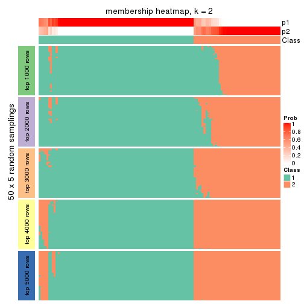</p>

</div>
<div id='tab-ATC-NMF-membership-heatmap-2'>
<pre><code class="r">membership_heatmap(res, k = 3)
</code></pre>

<p></p>

</div>
<div id='tab-ATC-NMF-membership-heatmap-3'>
<pre><code class="r">membership_heatmap(res, k = 4)
</code></pre>

<p></p>

</div>
<div id='tab-ATC-NMF-membership-heatmap-4'>
<pre><code class="r">membership_heatmap(res, k = 5)
</code></pre>

<p></p>

</div>
<div id='tab-ATC-NMF-membership-heatmap-5'>
<pre><code class="r">membership_heatmap(res, k = 6)
</code></pre>

<p></p>

</div>
</div>

As soon as we have had the classes for columns, we can look for signatures
which are significantly different between classes which can be candidate marks
for certain classes. Following are the heatmaps for signatures.


Signature heatmaps where rows are scaled:


<script>
$( function() {
	$( '#tabs-ATC-NMF-get-signatures' ).tabs();
} );
</script>
<div id='tabs-ATC-NMF-get-signatures'>
<ul>
<li><a href='#tab-ATC-NMF-get-signatures-1'>k = 2</a></li>
<li><a href='#tab-ATC-NMF-get-signatures-2'>k = 3</a></li>
<li><a href='#tab-ATC-NMF-get-signatures-3'>k = 4</a></li>
<li><a href='#tab-ATC-NMF-get-signatures-4'>k = 5</a></li>
<li><a href='#tab-ATC-NMF-get-signatures-5'>k = 6</a></li>
</ul>
<div id='tab-ATC-NMF-get-signatures-1'>
<pre><code class="r">get_signatures(res, k = 2)
</code></pre>

<p></p>

</div>
<div id='tab-ATC-NMF-get-signatures-2'>
<pre><code class="r">get_signatures(res, k = 3)
</code></pre>

<p></p>

</div>
<div id='tab-ATC-NMF-get-signatures-3'>
<pre><code class="r">get_signatures(res, k = 4)
</code></pre>

<p></p>

</div>
<div id='tab-ATC-NMF-get-signatures-4'>
<pre><code class="r">get_signatures(res, k = 5)
</code></pre>

<p></p>

</div>
<div id='tab-ATC-NMF-get-signatures-5'>
<pre><code class="r">get_signatures(res, k = 6)
</code></pre>

<p></p>

</div>
</div>


Signature heatmaps where rows are not scaled:


<script>
$( function() {
	$( '#tabs-ATC-NMF-get-signatures-no-scale' ).tabs();
} );
</script>
<div id='tabs-ATC-NMF-get-signatures-no-scale'>
<ul>
<li><a href='#tab-ATC-NMF-get-signatures-no-scale-1'>k = 2</a></li>
<li><a href='#tab-ATC-NMF-get-signatures-no-scale-2'>k = 3</a></li>
<li><a href='#tab-ATC-NMF-get-signatures-no-scale-3'>k = 4</a></li>
<li><a href='#tab-ATC-NMF-get-signatures-no-scale-4'>k = 5</a></li>
<li><a href='#tab-ATC-NMF-get-signatures-no-scale-5'>k = 6</a></li>
</ul>
<div id='tab-ATC-NMF-get-signatures-no-scale-1'>
<pre><code class="r">get_signatures(res, k = 2, scale_rows = FALSE)
</code></pre>

<p></p>

</div>
<div id='tab-ATC-NMF-get-signatures-no-scale-2'>
<pre><code class="r">get_signatures(res, k = 3, scale_rows = FALSE)
</code></pre>

<p></p>

</div>
<div id='tab-ATC-NMF-get-signatures-no-scale-3'>
<pre><code class="r">get_signatures(res, k = 4, scale_rows = FALSE)
</code></pre>

<p></p>

</div>
<div id='tab-ATC-NMF-get-signatures-no-scale-4'>
<pre><code class="r">get_signatures(res, k = 5, scale_rows = FALSE)
</code></pre>

<p></p>

</div>
<div id='tab-ATC-NMF-get-signatures-no-scale-5'>
<pre><code class="r">get_signatures(res, k = 6, scale_rows = FALSE)
</code></pre>

<p></p>

</div>
</div>


Compare the overlap of signatures from different k:

```r
compare_signatures(res)
```


`get_signature()` returns a data frame invisibly. TO get the list of signatures, the function
call should be assigned to a variable explicitly. In following code, if `plot` argument is set
to `FALSE`, no heatmap is plotted while only the differential analysis is performed.

```r
# code only for demonstration
tb = get_signature(res, k = ..., plot = FALSE)
```

An example of the output of `tb` is:

```
#>   which_row         fdr    mean_1    mean_2 scaled_mean_1 scaled_mean_2 km
#> 1        38 0.042760348  8.373488  9.131774    -0.5533452     0.5164555  1
#> 2        40 0.018707592  7.106213  8.469186    -0.6173731     0.5762149  1
#> 3        55 0.019134737 10.221463 11.207825    -0.6159697     0.5749050  1
#> 4        59 0.006059896  5.921854  7.869574    -0.6899429     0.6439467  1
#> 5        60 0.018055526  8.928898 10.211722    -0.6204761     0.5791110  1
#> 6        98 0.009384629 15.714769 14.887706     0.6635654    -0.6193277  2
...
```

The columns in `tb` are:

1. `which_row`: row indices corresponding to the input matrix.
2. `fdr`: FDR for the differential test. 
3. `mean_x`: The mean value in group x.
4. `scaled_mean_x`: The mean value in group x after rows are scaled.
5. `km`: Row groups if k-means clustering is applied to rows.


UMAP plot which shows how samples are separated.


<script>
$( function() {
	$( '#tabs-ATC-NMF-dimension-reduction' ).tabs();
} );
</script>
<div id='tabs-ATC-NMF-dimension-reduction'>
<ul>
<li><a href='#tab-ATC-NMF-dimension-reduction-1'>k = 2</a></li>
<li><a href='#tab-ATC-NMF-dimension-reduction-2'>k = 3</a></li>
<li><a href='#tab-ATC-NMF-dimension-reduction-3'>k = 4</a></li>
<li><a href='#tab-ATC-NMF-dimension-reduction-4'>k = 5</a></li>
<li><a href='#tab-ATC-NMF-dimension-reduction-5'>k = 6</a></li>
</ul>
<div id='tab-ATC-NMF-dimension-reduction-1'>
<pre><code class="r">dimension_reduction(res, k = 2, method = &quot;UMAP&quot;)
</code></pre>

<p></p>

</div>
<div id='tab-ATC-NMF-dimension-reduction-2'>
<pre><code class="r">dimension_reduction(res, k = 3, method = &quot;UMAP&quot;)
</code></pre>

<p></p>

</div>
<div id='tab-ATC-NMF-dimension-reduction-3'>
<pre><code class="r">dimension_reduction(res, k = 4, method = &quot;UMAP&quot;)
</code></pre>

<p></p>

</div>
<div id='tab-ATC-NMF-dimension-reduction-4'>
<pre><code class="r">dimension_reduction(res, k = 5, method = &quot;UMAP&quot;)
</code></pre>

<p></p>

</div>
<div id='tab-ATC-NMF-dimension-reduction-5'>
<pre><code class="r">dimension_reduction(res, k = 6, method = &quot;UMAP&quot;)
</code></pre>

<p></p>

</div>
</div>


Following heatmap shows how subgroups are split when increasing `k`:

```r
collect_classes(res)
```


If matrix rows can be associated to genes, consider to use `GO_Enrichment(res,
...)` to perform function enrichment for the signature genes.


 

## Session info


```r
sessionInfo()
```

```
#> R version 3.6.0 (2019-04-26)
#> Platform: x86_64-pc-linux-gnu (64-bit)
#> Running under: CentOS Linux 7 (Core)
#> 
#> Matrix products: default
#> BLAS:   /usr/lib64/libblas.so.3.4.2
#> LAPACK: /usr/lib64/liblapack.so.3.4.2
#> 
#> locale:
#>  [1] LC_CTYPE=en_GB.UTF-8       LC_NUMERIC=C               LC_TIME=en_GB.UTF-8       
#>  [4] LC_COLLATE=en_GB.UTF-8     LC_MONETARY=en_GB.UTF-8    LC_MESSAGES=en_GB.UTF-8   
#>  [7] LC_PAPER=en_GB.UTF-8       LC_NAME=C                  LC_ADDRESS=C              
#> [10] LC_TELEPHONE=C             LC_MEASUREMENT=en_GB.UTF-8 LC_IDENTIFICATION=C       
#> 
#> attached base packages:
#>  [1] grid      parallel  stats4    stats     graphics  grDevices utils     datasets  methods  
#> [10] base     
#> 
#> other attached packages:
#>  [1] genefilter_1.66.0           ComplexHeatmap_2.1.1        markdown_1.1               
#>  [4] knitr_1.26                  cola_1.3.2                  SummarizedExperiment_1.14.1
#>  [7] DelayedArray_0.10.0         BiocParallel_1.18.1         matrixStats_0.55.0         
#> [10] Biobase_2.44.0              GenomicRanges_1.36.1        GenomeInfoDb_1.20.0        
#> [13] IRanges_2.18.3              S4Vectors_0.22.1            BiocGenerics_0.30.0        
#> [16] GetoptLong_0.1.7           
#> 
#> loaded via a namespace (and not attached):
#>  [1] bitops_1.0-6           bit64_0.9-7            doParallel_1.0.15      RColorBrewer_1.1-2    
#>  [5] httr_1.4.1             backports_1.1.5        tools_3.6.0            R6_2.4.1              
#>  [9] DBI_1.0.0              lazyeval_0.2.2         colorspace_1.4-1       withr_2.1.2           
#> [13] tidyselect_0.2.5       gridExtra_2.3          bit_1.1-14             compiler_3.6.0        
#> [17] xml2_1.2.2             microbenchmark_1.4-7   pkgmaker_0.28          slam_0.1-46           
#> [21] scales_1.1.0           NMF_0.23.6             stringr_1.4.0          digest_0.6.23         
#> [25] XVector_0.24.0         pkgconfig_2.0.3        bibtex_0.4.2           highr_0.8             
#> [29] rlang_0.4.2            GlobalOptions_0.1.1    RSQLite_2.1.2          impute_1.58.0         
#> [33] shape_1.4.4            mclust_5.4.5           dendextend_1.12.0      dplyr_0.8.3           
#> [37] RCurl_1.95-4.12        magrittr_1.5           GenomeInfoDbData_1.2.1 Matrix_1.2-17         
#> [41] Rcpp_1.0.3             munsell_0.5.0          viridis_0.5.1          lifecycle_0.1.0       
#> [45] stringi_1.4.3          zlibbioc_1.30.0        plyr_1.8.4             blob_1.2.0            
#> [49] crayon_1.3.4           lattice_0.20-38        splines_3.6.0          annotate_1.62.0       
#> [53] circlize_0.4.9         zeallot_0.1.0          pillar_1.4.2           rjson_0.2.20          
#> [57] rngtools_1.4           reshape2_1.4.3         codetools_0.2-16       XML_3.98-1.20         
#> [61] glue_1.3.1             evaluate_0.14          vctrs_0.2.0            png_0.1-7             
#> [65] foreach_1.4.7          polyclip_1.10-0        gtable_0.3.0           purrr_0.3.3           
#> [69] clue_0.3-57            assertthat_0.2.1       ggplot2_3.2.1          xfun_0.11             
#> [73] gridBase_0.4-7         eulerr_6.0.0           xtable_1.8-4           skmeans_0.2-11        
#> [77] survival_2.44-1.1      viridisLite_0.3.0      tibble_2.1.3           iterators_1.0.12      
#> [81] memoise_1.1.0          AnnotationDbi_1.46.1   registry_0.5-1         GTF_0.0.1             
#> [85] cluster_2.1.0          brew_1.0-6
```


